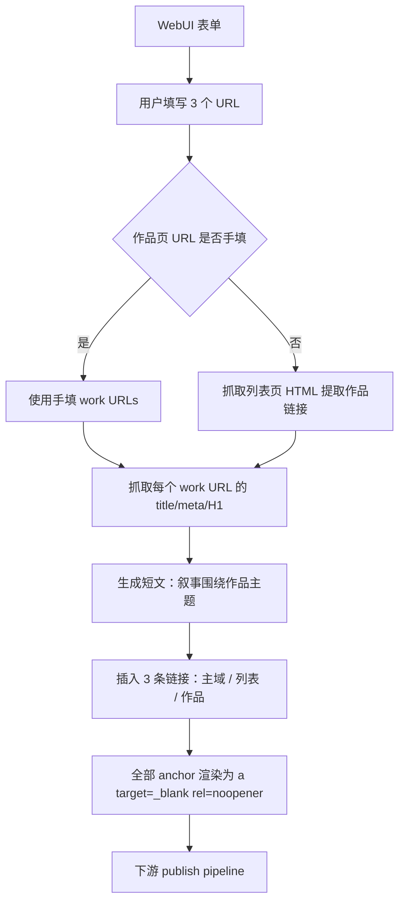

# 三连结作品主题外链（Work-Themed Backlinks）

## Problem Frame

当前 zh-CN 短文路径围绕「per-site 多 url_categories（home/hot/animate/category/topic）+ 每 cell 预置 anchor_pools」生成 2-3 条链接的短文，叙事偏「站点综合介绍」。

实际投放场景中，运营更想做的是「为某个具体作品（或一批作品）做主题导流」——文章主叙事围绕作品本身，链接同时把读者引向：作品页（最终落点）、列表页（同类发现）、主域名（品牌承接）。

需要一种新的输入与生成形态：**用户输入 3 个 URL（主域名 / 列表页 / 作品页），系统抓取作品页主题并据此生成短文，文章稳定输出 3 条外链各指一个 URL，全部在新分页打开**。

## User Flow

## Requirements

**输入（WebUI 主入口）**
- R1. WebUI 表单提供 3 个必填字段：`main_domain`（主域名 URL）、`list_url`（列表页 URL）、`work_urls`（作品页 URL，多行/逗号分隔，可选）。
- R2. 三个 URL 输入必须做基本格式校验（必须 https://，主域名必须是裸域根路径或带尾斜杠）。
- R3. `work_urls` 留空时，系统从 `list_url` 抓取 HTML 并自动提取作品链接清单作为本次运行的作品池。
- R4. config.toml 提供同等表达能力的可选入口（schema 完全替换原 `[sites."..."]` 区块），用于长期订阅式跟踪；与 WebUI 同走下游 pipeline。

**主题抓取**
- R5. 对每个作品 URL，系统 HTTP GET 作品页 HTML，按优先级抽取主题信号：`<title>` → `<meta name="description">` → 第一个 `<h1>`。
- R6. 抓取须支持自定义超时、UA、失败重试上限；失败的作品 URL 不参与本次生成（不中断整批）。

**链接结构**
- R7. 每篇生成的文章固定包含且仅包含 3 条外链，分别指向：主域名、列表页、本次轮到的作品页（每篇一个）。
- R8. 三条链接渲染为 HTML `<a href="..." target="_blank" rel="noopener">{anchor}</a>`（保持现有 dofollow 约定；rel **不含 nofollow**，与 `markdown_utils.py` 与 `link_attr_verifier` 当前期望一致）。当前 zh-CN short-form 使用 `rel="noopener noreferrer"`，新形态去掉 `noreferrer` 仅保留 `noopener`，因为 referrer 信号有助于目标站分析；如果 `link_attr_verifier` 当前断言 `noreferrer` 存在，需要一并放宽到「`noopener` 必存在、`noreferrer` 可选」。
- R9. 链接在正文中分布于不同段落/位置（避免聚成一团），具体位置策略由生成模板控制。

**Anchor 文字**
- R10. 主域名 anchor 仅从 `branded` pool 抽取（保留现有 anchor_pools.branded 语义）。
- R11. 列表页 anchor 从 `partial` 与 `exact` pool 抽取（按配置比例或默认 partial-heavy）。
- R12. 作品页 anchor 由抓取到的 title 经模板生成（如 `{title}`、`{title} 详情`、`{title} 推荐` 等），具体模板集与抽取规则由 config 提供默认值。
- R13. anchor 文字仍走现有 `_passes_filters`（长度、CJK 比例、禁用词等）的安全检查；不通过则按既定策略 fallback。

**SEO 分布**
- R14. anchor 类型分布由 URL 位置静态决定（主域→branded、列表→partial/exact、作品→exact/partial 隐式分布），**不再使用 sliding-window scheduler**。
- R15. 移除 (url_category × anchor_type) 二维 cell 容量校验逻辑（pool sizing 公式不再适用于新形态）。

**输出与发布**
- R16. 生成文章保持现有 publish pipeline（Blogger 等）兼容；如 Markdown→HTML 转换链路对原始 `<a>` 标签存在洗白/降级，需要在该阶段保留 `target` 与 `rel` 属性。

**迁移**
- R17. 旧的 `[sites."<domain>".url_categories]` / `[sites."<domain>".anchor_pools.<category>]` 配置区块在新版本中标记为弃用并停止读取；存在旧配置时启动应给出明确的迁移提示。

## Success Criteria

- 运营在 WebUI 表单填入 3 个 URL（或仅填 2 个 + 留空作品列表）后，能在不再编辑 anchor_pools 的前提下，一键生成一批围绕作品主题的短文。
- 每篇文章稳定输出 3 条外链，分别指向主域 / 列表 / 作品页，全部在新分页打开（可在 publish 后的实际页面手工点击验证）。
- 作品 anchor 与文章叙事可被审阅者一眼识别为「围绕作品主题」，而非通用站点介绍。
- 抓取失败的作品 URL 跳过、其它作品继续生成；整批不因单 URL 失败而中断。
- 原 zh-CN 短文路径（基于 url_categories + sliding-window）下线后，测试套件仍保持全绿。

## Scope Boundaries

- **不**保留旧 url_categories / per-cell anchor_pools 体系（明确替换、不双轨）。
- **不**引入运行时 LLM 来抽取作品主题（保持 LLM-free 立场，仅使用 HTML 静态字段）。
- **不**做作品页内容的语义改写或文章正文的 LLM 生成扩展——本次 brainstorm 仅定义「输入形态 + 链接结构 + anchor 来源」，正文模板沿用现有 zh-CN 短文模板（如需调整另开 brainstorm）。
- **不**做跨 target site 的全局 SEO 分布管控（sliding-window scheduler 一并下线）。
- **不**实现 robots.txt 解析/反爬绕过（抓取失败即跳过）。

## Key Decisions

- **完全替换 url_categories**：避免双轨维护成本，统一新形态。代价是需要为旧用户提供迁移说明。
- **作品页主题来源 = HTML 抓取（title/meta/H1）**：维持 LLM-free，输入负担最小化；接受抓取失败/弱信号站点的局限性。
- **作品 URL 手填优先、未填回退抓列表页**：兼顾「集中投放某几个作品」与「批量轮播列表里的作品」两种运营场景。
- **每篇 3 条链接、各指一个 URL**：信号集中，结构清晰，叙事最自然。
- **anchor 类型由 URL 位置定型**：移除 scheduler 复杂度，确定性与可解释性优先；分布通过 pool 形态隐式控制。
- **target=\"_blank\" 用 raw HTML `<a>` 实现**：与现有 zh-CN short-form 渲染策略一致（raw `<a>` 在 markdown-it 中作为 HTML block 原样透传）。`rel` 保持 `noopener` 单值（dofollow 约定）。
- **WebUI 为主入口、config.toml 可选**：贴合「按需投放」高频场景，config 仍服务长期跟踪需求。

## Dependencies / Assumptions

- 抓取作品页时所在网络可直连目标站点（公开 URL、无登录墙）。
- 现有 publish pipeline（Markdown→HTML 渲染、Blogger 发布等）允许原始 `<a target="_blank" rel="...">` 透传至最终 HTML。
- 现有 `_passes_filters` 与 anchor 安全校验可继续复用于作品页动态 anchor。

## Outstanding Questions

### Resolve Before Planning
（无——所有产品决策已对齐）

### Deferred to Planning
- [Affects R3, R6][Technical] 列表页抓取作品 URL 的提取规则（按 `<a href>` 全收 / CSS 选择器 / 站点适配器）——一刀切还是 per-site 配置？
- [Affects R5][Technical] HTTP 抓取层是否复用 publish pipeline 既有的 HTTP client（超时/重试/UA 策略），还是新写独立 fetcher？
- [Affects R6][Needs research] 缓存策略：同一 work URL 在多次运行间是否复用上次抓取的 title？TTL？失效条件？
- [Affects R8, R16][Technical] 验证 Blogger 发布链路对 `<a target="_blank" rel="noopener nofollow">` 的实际保留行为（实测一篇即可确认）。
- [Affects R10–R12][Technical] config 中 `anchor_pools.branded` / `anchor_pools.partial+exact` / `work_anchor_templates` 的最终 schema 与 default 集合。
- [Affects R12][Needs research] 作品 anchor 模板的具体集合与去重策略（避免同一 title 在多篇里 anchor 文字过度雷同）。
- [Affects R14][Technical] 抽取「主域 → branded」「列表 → partial/exact」混合占比时的默认比率是否提供 config override。
- [Affects R17][Technical] 旧 51acgs.com 配置的迁移工具/脚本是否提供（还是仅文档化）。
- [Affects R7][Product/Technical] 「一次运行批量数量」由谁决定——WebUI 字段、作品池大小、还是 config 限额？

## Next Steps

→ `/ce:plan` for structured implementation planning

## Outcome (2026-06-01)

Shipped → `docs/plans/2026-05-13-004-feat-work-themed-backlinks-plan.md` (status: completed); `docs/plans/2026-05-15-003-fix-work-themed-link-count-6-8-plan.md` (status: completed).