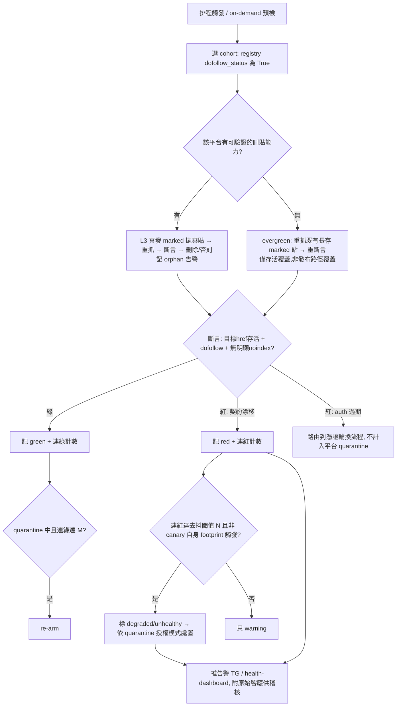

# Adapter Contract Canary (主動偵測平台靜默變更)

> **Document-review 修訂 (2026-05-27):** 套用了一輪多 persona 審查的事實性 auto-fix,並定案兩個翻盤級策略決策:**Q1 quarantine 授權 = advisory 預設**、**Q2 = planning 首步先 research 刪除能力再定 L3 vs evergreen 分布**。Resolve-Before-Planning 已清空,可進 `/ce:plan`。

## Problem Frame

發布機制依賴每個平台的「契約」:HTML 表單選擇器、GraphQL schema 欄位、API 響應結構、以及發布後鏈接的 `rel` 屬性。平台隨時可能**靜默改動**這些契約——adapter 不報錯,但實際發空了、抓不到結果頁、或發出去的 backlink 被改成 nofollow / 被剝離。跨 31 個 adapter,這種斷裂往往幾天到幾週後才被發現,期間整條 SEO campaign 在無效產出。

現有零件各自存在但**沒組成主動偵測防線**,且能力比初稿假設的弱(已由 feasibility 審查核實):
- `link_attr_verifier` 只**聚合計數**頁面上所有 `<a>` 的 nofollow 數,**不比對特定目標 href**——無法斷言「我這條 backlink 還在」。
- `linkcheck/verify.py` 的 `verify_published` 只做 GET-200 + 標題/鏈接在 body,**無 rel 解析、無 indexability 檢查**。
- indexability(noindex/X-Robots-Tag)的判定在**另一個**零件 `_preflight_fetch.fetch_target`(`PreflightFacts.noindex` + `x_robots_tag`)。
- Publisher ABC **只有 `publish` + `available`**,**沒有任何 adapter 實作刪貼/unpublish**。

本需求新增一個**主動 canary**:在真實 campaign 之前,定期對 dofollow 平台跑合成探測,漂移時隔離該 adapter,避免向已壞平台丟鏈接。

## Canary Lifecycle

## Requirements

**Canary 探測**
- R1. canary 探測對 cohort 內每個平台,重抓 live URL 後斷言三件事全成立才算綠:(a) **目標 backlink 的 href 真實渲染在頁面上**(需比對具體目標 URL,非僅統計全頁 nofollow 數)、(b) 該目標錨點是 dofollow(無 `rel=nofollow`/`ugc`/`sponsored`)、(c) 頁面**無明顯 noindex 信號**(`<meta name=robots>` 或 `X-Robots-Tag`,necessary-not-sufficient,非搜尋引擎收錄保證)。
- R2. **L3 模式(真發+清)僅對已核實具備程式化刪貼能力的平台啟用**。L3 往返結束後必須刪除拋棄貼;刪除失敗或無刪除 handle 一律**記為 orphan + 單獨告警 + STOP(不得靜默判綠)**,並持久化 orphan post id 供後續 sweep 重試刪除/告警。
- R3. 對缺乏刪貼能力的平台,降級為 **evergreen-canary**:重抓一篇長存 marked 貼重斷言。**evergreen 只覆蓋「鏈接存活/平台死活」,結構上 BLIND 於發布路徑漂移(auth 過期、API/schema 變、payload 破、新限流)**——報告須明示該平台為 evergreen,綠不代表「能發新貼」。⚠️ 由於目前**零 adapter 具刪貼能力**,evergreen 是當下事實上的全 cohort 默認模式;L3 真發覆蓋須先補刪貼原語才談得上(見 Resolve-Before-Planning Q2)。
- R4. canary 的抓取/重定向重用 `_preflight_fetch` 的**只讀 + SSRF-guarded** 路徑;dofollow 判定重用 `link_attr_verifier`;indexability 判定重用 `_preflight_fetch` 的 noindex/X-Robots-Tag。**「目標 href 比對」與「特定錨點 dofollow」是 net-new(或對 `link_attr_verifier` 擴充),非現成複用**——R4 不得宣稱 href-match 已可複用。

**Cohort 選擇 (動態,不硬編碼)**
- R5. canary cohort **動態從 registry 推導**:納入 `dofollow_status(name) is True` 的已註冊平台(目前:blogger、medium、telegraph、velog、ghpages、livejournal)。**不得用 `referral_value` 作謂詞**——它是 nofollow 平台的引流價值軸,與 dofollow 正交,且 dofollow=True 平台一律未設 referral_value(謂詞會解析成空集)。不維護獨立硬編碼清單。
- R6. canary 啟動時**斷言 cohort 非空**(零匹配即 fail-loud),防止未來謂詞 regression 把 canary 靜默變空轉。
- R7. `dofollow="uncertain"` 平台(wordpresscom、substack、rentry、txtfyi 等,registry 註釋稱「operator 跑 canary 確認後 flip 為 True」)是 canary 的**天然次要 cohort**(promotion 偵測);v1 是否納入見 Resolve-Before-Planning。退役/`dofollow=False` 平台不進 canary。

**漂移反應 (circuit-breaker / 授權模式)**
- R8. 每平台**持久化** canary health 狀態,跨 run 存活,且攜帶足夠信號支撐去抖(R9)、跳過閘門(R10)、surfacing(R14)。(具體欄位與儲存位置交 planning;見 Deferred。)
- R9. **去抖且區分紅因**:單次紅只記 degraded + warning;連紅達閾值 N(默認 2,可調)才升級。**auth 過期導致的紅**路由到憑證輪換流程,**不**計入平台契約 quarantine(避免憑證問題誤鎖健康平台);**限流/反爬(canary 自身 footprint)導致的紅**亦不直接 quarantine(真實低頻發布不會踩到)——只契約/結構性紅才算數。
- R10. 漂移確認後**預設走 advisory**(Q1 定案):響亮告警 + 儀表板紅 + 後續真實 publish run 在發布時對該平台出 WARNING 需 operator 確認,**不靜默自動跳過**。**hard auto-skip**(registry 標 unhealthy → publish run 自動跳過 + stderr/報告明示原因)為 **per-platform opt-in**,僅對 operator 明確標記的易重建平台啟用。
- R11. **抗 flap re-arm**:re-arm 需連綠達閾值 M(默認 ≥2,不可單綠即解)或最短冷卻窗;flap-rate(quarantine/re-arm 振盪)本身升級為人工告警。保留 operator 手動 re-arm 入口。

**安全 / footprint / ToS**
- R12. **SSRF 為硬驗收標準**(非假設依賴):重抓路徑(含所有 redirect hop)必須走 `_make_ssrf_opener` 並對 post-redirect 終態 URL 重跑 SSRF 檢查;須有 `real_ssrf_check`-marked 測試斷言 canary 拒絕平台返回的私網/link-local redirect。
- R13. **canary 抓取與普通鏈接驗證不可區分**:重用相同 UA/headers/路徑,**絕不**用 canary 專屬 UA(否則平台可 UA-cloaking:對 canary 餵 nofollow、對真實流量餵 dofollow,武器化 auto-quarantine)。
- R14. **拋棄貼/evergreen 貼的 marker 須為私有非公開標記**(operator 帶外記錄的高熵 token 或驗證器可控的 metadata,**非貼文正文裡可被 grep 的重複字串**);候選 marker 須過既有 `footprint` 稽核,不得形成 100%-prevalence 跨貼模式。canary 必須尊重既有 throttle/rate-limit 閘門;對 cohort 平台須先核實其 ToS/自動化政策,並設每帳號每週期發貼上限(blast-radius)+ operator 級 opt-out(高價帳號不被自動納入)。
- R15. 排程 canary **載入憑證只走既有 0o600 / atomic_write 路徑**;告警/儀表板/持久化 artifact **不得回顯**憑證或 session 材料,只攜帶平台名 + verdict(+ 供稽核的脫敏響應)。

**呈現 & 排程**
- R16. canary 結果寫入 health 狀態,可被既有 health-dashboard / TG 告警消費;紅 canary、orphan、flap、auth-過期 觸發對應告警。(注:health 狀態勿塞進 bind-scoped 的 `channel_status_store`——它只認 `{blogger,medium,velog}`,會拒絕 ghpages/livejournal/telegraph;見 Deferred。)
- R17. canary 可排程觸發(重用 RemoteTrigger/cron),亦可 on-demand campaign 前手動預檢。**排程頻率須由「最大可容忍偵測延遲」反推**:偵測延遲 ≈ cadence × N(去抖),須滿足 Success Criteria 的延遲上限。

## Success Criteria
- **可量化延遲**:dofollow 平台靜默改契約後,canary 在 **≤ 最大可容忍偵測延遲(待定具體值,如 ≤48h)** 內變紅並按授權模式處置;此上限與 cadence×N 綁定且可驗證(非僅「下一排程輪」這種隨 cadence 浮動的不可證命題)。
- 「能發但鏈接被改 nofollow/剝離」的 runtime 漂移,在**具刪貼能力(L3)的平台**能被抓到;evergreen 平台明示為「僅存活覆蓋」,不宣稱發布路徑保證。
- **誤鎖率受控**:單次 flake、auth 過期、canary 自身限流 footprint 都不會誤鎖一個對真實低頻發布健康的平台(去抖 + 紅因區分 + 抗 flap re-arm 生效);定義可接受的 false-positive quarantine 率與最大誤鎖時長。
- 不留 orphan;若留,operator 必收告警(非靜默累積)。
- 增刪 dofollow 平台時 cohort 自動跟隨 registry;cohort 為空時 fail-loud。

## Scope Boundaries
- **只覆蓋 dofollow 平台**(`dofollow_status is True`);退役/`dofollow=False` 排除。`uncertain` 平台 v1 取捨待定。
- canary **不是 indexability oracle**:R1(c) 只查頁面層 noindex/X-Robots-Tag,necessary-not-sufficient(與 `preflight-targets` 同等免責)。
- **不做** adapter 契約的靜態宣告 / typed `AdapterContractError`(另一條路線)。
- **預設不做** hard auto-skip(Q1):advisory 為預設,hard-skip 僅 per-platform opt-in。
- v1 形態(全 evergreen 只讀 vs 為有刪除 API 的子集真上 L3)**待 planning 首步的刪除能力 research 後定**(Q2)——本文件不預先鎖死。

## Key Decisions
- **cohort = `dofollow_status is True`**,棄用 `referral_value` 謂詞(後者對 dofollow tier 恆為 None,會空轉)。
- **紅因區分 + 抗 flap**:只契約/結構性紅才驅動 quarantine;auth/限流紅另行處置;re-arm 需持續綠。
- **安全前置**:SSRF 硬驗收、canary UA 與常規驗證不可區分、marker 私有且過 footprint 稽核、憑證走 0o600 路徑——均因「canary 用 operator 真帳號發到第三方平台」這一信任邊界。
- **能力誠實**:R1/R3/R4 改寫以反映「verify_published/link_attr_verifier 不做 href-match/indexability、零 adapter 能刪貼」的代碼現實,避免 false reuse / false coverage。
- **advisory 預設 (Q1)**:auto-skip 會把響亮失敗變靜默停發,false-positive 代價高於收益→預設只告警,hard-skip 留 per-platform opt-in。
- **research-first (Q2)**:既然零 adapter 能刪貼,planning 首步先逐 cohort 平台核實刪除能力,再決定 L3 子集 vs 全 evergreen,不在 brainstorm 階段假設可行性。

## Dependencies / Assumptions
- 假設可為具刪貼能力的平台補上刪貼原語(net-new per-adapter,非複用);不支援者走 evergreen。
- 重用 `_preflight_fetch`(SSRF-guarded 抓取 + indexability)、`link_attr_verifier`(dofollow,需擴充 href-match)、throttle gating、health-dashboard/TG 告警、RemoteTrigger/cron 排程、0o600 憑證路徑。
- 假設 operator bound 憑證對 cohort 平台有效;憑證生命週期 > canary cadence(否則 token 過期會紅,由 R9 路由到輪換而非 quarantine)。
- **合成拋棄貼與真實 campaign 貼的契約等價性是未驗證假設**:平台可能對短/低互動/標記內容、新帳號首貼施加不同 rel/index 處理→canary 綠不必然預測真實貼行為。須在 planning 明列為待驗風險並界定其對偵測保證的影響。

## Outstanding Questions

### Resolve Before Planning
- (已清空 — Q1=advisory 預設、Q2=research-first 均已定案。)

### Deferred to Planning
- **[Q2 落地 — planning 首步][Needs research] 逐 cohort 平台核實程式化刪除能力**(telegraph 有 `editPage` 是否有 delete?blogger/medium/velog/ghpages/livejournal API 能否刪貼?),產出 L3-eligible vs evergreen-only 的分布,再據此定 v1 cohort 與是否值得建刪貼原語。這是 plan 的第一個 spike。
- [R8/R16][Technical] canary health 狀態存哪?`channel_status_store` 是 bind-scoped(只認 blogger/medium/velog),會拒 ghpages/livejournal/telegraph→**不適合**;建議走 config-dir 專屬 JSON(safe_write/JsonStore pattern)keyed by registry 平台名,surfacing 用 read-side join。
- [R10][Technical] 「unhealthy→publish run 跳過」接線點:`available()` 只收 config 無法讀 health(改簽名耦合大);較乾淨的點可能是 `dispatch()` gate 或 CLI pre-publish filter。
- [R9/R11][User decision] 去抖閾值 N、re-arm 閾值 M、冷卻窗、排程 cadence 的具體默認值(與 Q-延遲上限聯動)。
- [R1/R4][Technical] `link_attr_verifier` 擴充 href-match + 特定錨點 dofollow 的具體做法;indexability 由 `_preflight_fetch` 組合。
- [R5/R7][Product] 對被 operator 誤標為「低價/排除」但其實在引流或已悄悄 flip 成 dofollow 的平台,目前無偵測(cohort 盲區);是否需要一個正交的「再分類」探測。
- [Scope][Product] publish-pipeline 存活(便宜)是否該比 dofollow/indexable 權益(貴)監控更廣的 cohort——把兩類失敗(發布破 vs 權益降)分層覆蓋。

## Next Steps
→ `/ce:plan`(plan 首步 = 刪除能力 research spike,再定 L3 vs evergreen 分布)。

## Outcome (2026-06-01)

Shipped → `docs/plans/2026-05-27-001-feat-adapter-contract-canary-plan.md` (status: active).