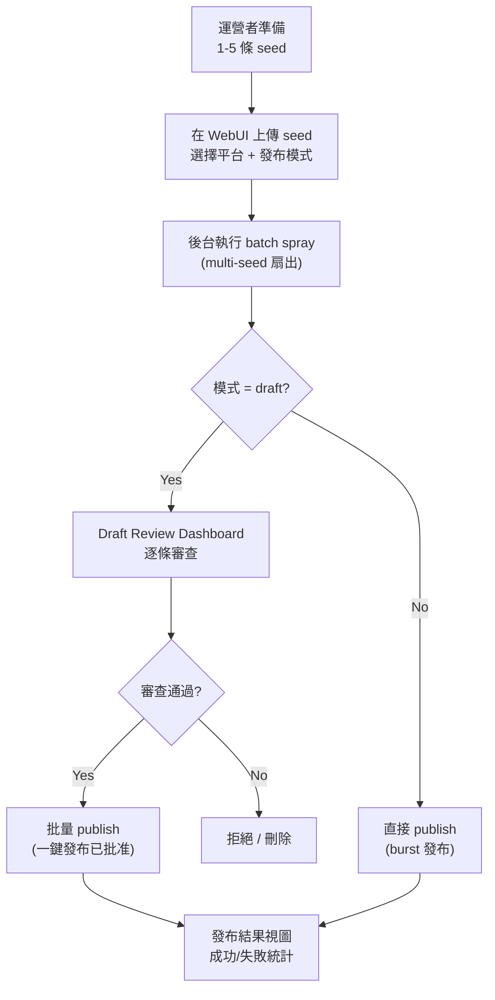

# 批量外链发布优化方案

## Problem Frame

當前 Backlink Publisher 的架構已經齊備（23+ CLI 入口、動態 adapter registry、雙複雜度預算、多平台 WebUI），但**批量發布能力存在關鍵缺口**：

- `spray-backlinks` 只接受**單條 seed**（`len(rows) != 1` → UsageError），N 條 seed 需手動循環
- 發布純串行（spray 內 per-shot 30-120s jitter，seed 間無間隔管理），N seed × M platform 的總耗時 = N × (M × 平均延遲)
- WebUI 的 `/ce:batch` 只能單平台批量（plan → validate → publish for same platform），不支援多平台扇出
- 沒有 campaign 級別的管理視圖（seed 集合、平台選擇、狀態追蹤、draft 審查）

**運營者場景**：每次 1-5 條 seed，每條扇出到 3-5 個 dofollow 平台，draft → review → publish 流程。WebUI 為主操作界面。

## User Flow

## Requirements

**批量 CLI 能力**
- R1. `spray-backlinks` 接受 **多條 seed** 輸入（解除 `len(rows) != 1` 限制），每條獨立擴大扇出到選定平台
- R2. 支援 `--max-seeds N` 上限保護（default 10），超過時報錯而非截斷
- R3. seed 之間加入可配置的 jitter 延遲（`--seed-delay-min` / `--seed-delay-max`，default 60-180s），避免平台檢測節奏模式
- R4. 每條 seed 各自獨立經過 gating/cap/audit（各 seed 的判決不互相干擾）
- R5. 輸出為所有 seed 合併的 JSONL，stderr 為每條 seed 的匯總摘要

**WebUI Campaign 管理**
- R6. 新增 `/batch-campaign` 頁面：上傳/粘貼多條 seed JSONL、選擇平台（多選 checkboxes）、選擇 `draft`/`publish` 模式、設定 cap
- R7. 後台非阻塞執行：點擊「執行」後返回 campaign ID，前端輪詢進度
- R8. Campaign 狀態持久化：使用現有 `queue_store` 存儲任務狀態，支援重啟後恢復
- R9. 發布完成後顯示結果摘要（成功數、失敗數、各 platform 細分）

**Draft Review Dashboard**
- R10. 新增 `/batch-review/<campaign_id>` 頁面：展示該 campaign 所有 draft
- R11. 每條 draft 顯示：平台、標題、正文片段、anchor 信息、狀態
- R12. 批量操作：勾選多條 → approve / reject / 批量 publish
- R13. 「Publish Approved」按鈕：對已批准的 draft 執行 `publish-backlinks`，即時更新進度

## Success Criteria

1. `spray-backlinks` CLI 可以一次處理 5 條 seed × 5 平台 = 25 條輸出
2. WebUI 上可以完成完整的 campaign 流程：創建 → 執行 → 審查 draft → 批量 publish
3. 已有 `publish-backlinks` checkpoint/resume 不受影響
4. 已有單 seed spray 行為完全不變（向後兼容）
5. 所有測試通過（包括 budget gate）

## Scope Boundaries

- **不在本計劃內**：平台級併發發布（不同平台同時發布）— 對 5-25 篇規模來說 over-engineering
- **不在本計劃內**：定時/循環排程發布 — 後續可通過 scheduler.py 擴展
- **不在本計劃內**：campaign 模板/seed 庫管理 — 最小 MVP 只做一次執行
- **不在本計劃內**：修改 `publish-backlinks` 核心邏輯 — 只通過已有 `adapter_publish` seam 調用

## Key Decisions

- **方案 A（推薦）**：擴展現有 spray-backlinks + WebUI 新頁面。最小改動，快速見效
- 不使用新 CLI 或新背景服務進程 — 充分利用已有的 `queue_store` + `drafts_store`
- spray multi-seed 採用「每條 seed 獨立處理，seed 間 jitter」策略，而非「全部 seed 合併再扇出」
  - 理由：各 seed 的 target/money site 不同，合併後 gate/cap 會混亂
- LLM rewrite boundary 保持不變 — 每條 seed 的每條 shot 獨立 LLM 重寫

## Dependencies / Assumptions

- `spray-backlinks` 已經 ship（plan 2026-06-02-005），其 `expand_seed` / `gate_candidates` / `draft_row` / `dispatch_burst` 介面穩定
- WebUI 已有的 `queue_store` 足夠支持 campaign 任務持久化
- `drafts_store` 已支援批量操作（`bulk_publish_now`、`bulk_delete`）
- 假設 `publish-backlinks` 可以正確處理 spray 輸出的 JSONL 格式（已通過現有 pipeline 驗證）

## Outstanding Questions

### Resolve Before Planning

- [Affects R1] 多條 seed 共用同一組 platform 選擇，還是每條 seed 可指定不同 platforms？**前者的話，UI 更簡單；後者的話 seed JSONL 需包含 platform 字段。** → 假設同一組 platforms（CLI 參數統一指定）

### Deferred to Planning

- [Affects R6][Technical] `postJson` 上傳多條 seed 時 body 大小限制 — Flask 預設 16KB，batch 場景可能需要增大
- [Affects R10][Technical] draft review 頁面的數據加載方式 — 從 drafts_store 按 campaign_id 過濾，還是從 batch campaign 的 results 字段讀取

## Next Steps
→ `/ce:plan` for structured implementation planning
