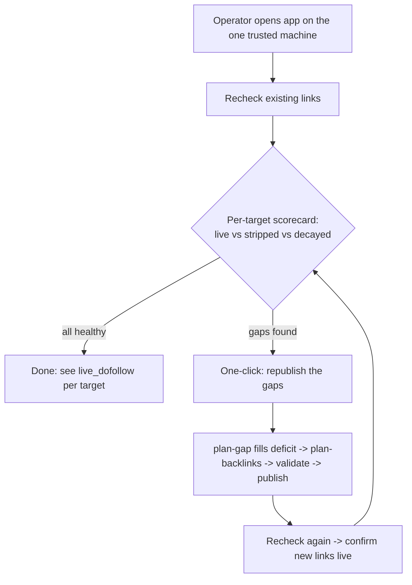

# Internal Edition Launch — LITE (短版) + UPGRADE (升级) Productization

## Problem Frame

The owner (solo SEO operator) wants to take **backlink-publisher** from "a tool I run on my
own Mac" to "a product an internal team can use," with a **LITE / short edition now** and an
**UPGRADE / fuller edition later**, plus a general "tidy the codebase" pass.

The load-bearing finding (verified directly against the live `events.db` + `equity-ledger`, not
assumed): **the core loop already works.** As of 2026-06-04, `events.db` holds 2544 events /
2035 `publish.confirmed`, and `equity-ledger` reports the real money site
`https://51acgs.com/` at **live_dofollow=37** on the homepage and **~73 verified live-dofollow
backlinks** across its target pages (blogger / telegraph / ghpages), liveness verified
2026-06-02. **This overturns the prior `live_dofollow=0` / "never burned real fuel" premise**
in `优化企划-2026-06-01.md` and in earlier session memory — that premise is now stale.

So this is **not** "productize a zero-output engine." It is "hand a **recently**-working engine
to a team." Four honest caveats — all verified against the live DB — that shape the product:
- **The "verified" snapshot is stale by construction:** all 112 rechecks are dated 2026-06-02.
  There are **53 new `publish.confirmed` events from 2026-06-04 (today) with zero rechecks.** So
  the freshest publishing burst is entirely unverified; any shipped scorecard is stale on arrival.
- **The win came from one supervised sprint, not steady state:** the 0→37 live_dofollow jump was
  produced by the `2026-06-02-001` fix-the-dofollow-loop swarm sprint (dozens of short-lived
  run_ids), under author supervision. "The loop works" honestly means "the loop was *made* to
  work once, supervised, 2 days ago" — it has **never been run end-to-end by a non-author.**
- **Decay is worse than a blended "29%" implies:** the average hides that the homepage is ~98%
  alive (57/58) while the **deep comic pages — the links that carry ranking equity — strip at
  56–67%** (`/comic/117`: 12 stripped vs 7 alive; `/comic/528`: 9 vs 7; `/comic/5223`: 6 vs 3).
  telegra.ph alone causes **24 of 28 strips (86%)**; ghpages/blogger-api strip 0%.
- **"Live" understates the unknowns:** the homepage's 70 links are 38 live, but 33 are *unknown*
  follow-status (not confirmed dead) — distinct from the 32 confirmed-not-live.

The product implication holds and sharpens: the scarce resource is **keeping the deep links
alive on platforms that don't strip them** — not publishing more, and not republishing to
telegra.ph.

## User Flow — LITE keep-alive loop (the spine of the short edition)

All five engine steps in box **F/G** already exist as CLIs
(`equity-ledger | plan-gap | plan-backlinks | validate-backlinks | publish-backlinks` +
`recheck-backlinks`). LITE wires them into one guided screen — it does **not** build them.

## Requirements

> **Launch gate = LITE-core (R1, R3, R4, R5).** These four deliver the Success Criteria; they
> are what blocks shipping. **LITE-tidy (R6–R11) must not block R1** — it can land in the same
> PR series but after the loop is demoable. (Per scope + product review: R7–R11 are
> hygiene whose payoff is a newcomer/team experience the access model defers.)

**LITE-core — keep-alive operator loop (the core job-to-be-done)**
- R1. Provide a single guided keep-alive flow: **recheck → per-target scorecard
  (live / stripped / decayed / check-failed) → review the gaps → confirm → republish.**
  Wire the existing `equity-ledger | plan-gap | plan-backlinks → validate → publish → recheck`
  chain behind one operator action. The CLIs compose, but this is **not pure "sequencing"**:
  it requires async execution + progress UI (a full recheck of ~70 links is a multi-minute,
  multi-host network sweep), **partial-failure handling** (some gaps publish, some fail), and
  chosen defaults for `plan-gap`'s ~8 flags. Two non-negotiable product rules:
  (a) **a failed/timed-out recheck must NOT silently become a "gap"** that gets republished;
  (b) **republish posts to live external accounts → require an explicit confirm** (it is not a
  blind one-click). **Republish must re-target the sticky platforms (ghpages/blogger, 0–17%
  strip), not telegra.ph (38% re-strip)** — see Key Decisions.
  **Deficit-model decision (from the gate dry-run):** `plan-gap`'s native deficit is *page-count*
  based (`target has < N live-dofollow`), so at `--desired 5` it finds **0 gaps** even though
  individual links are stripped — the page aggregate is still satisfied. R1 must decide how
  "gap" is defined: drive a higher per-target `--desired` + `--emit-stale` to force regeneration,
  or add **per-link stripped-aware** deficit logic. This is the one genuinely non-wiring choice
  in R1.
- R2. The `/sites/run` per-site one-click currently dead-ends at `plan` (no
  validate/publish/verify continuation). **It is superseded by the R1 flow** — redirect it into
  R1 or remove it; do not build a second parallel pipeline path.
- R3. Promote the `probe_events_db.py` throwaway script into a read-only in-WebUI
  **"what's live" status view**, showing **per-target** (never blended): `live_dofollow`,
  stripped count + **strip-rate per target**, *unknown-follow* count (kept distinct from dead),
  and last-verified time. The view must make the staleness visible (e.g. "verified 2 days ago;
  53 links never checked") and prompt a fresh recheck.

**LITE-core — data correctness the operator reads**
- R4. Fix the channel-attribution `-api` double-count so the scorecard is honest: `telegraph`
  and `telegraph-api` (same physical platform) appear as separate rows. *Planning note:* the
  split lives in `ledger/aggregate.py` (raw `link.platform` into the platform set, unnormalized),
  **not** `channel-scorecard`'s `scorecard/engine.py` — and a collapse map already exists in a
  third module (`idempotency/backfill.py`). Decide which surface R3 reads and reuse the existing
  map; don't write a third.

**LITE-core — safety & launch gating (cheap, fail-safe)**
- R5. Flip the `python webui.py` debug default from **True → False**, update the adjacent
  in-code comment + any contributor doc that says debug stays on, and keep `FLASK_DEBUG=1` as an
  opt-in for dev. Also **pin a persistent `SECRET_KEY`** in the single launcher — a bare run uses
  an ephemeral per-restart key that resets sessions/CSRF.

**LITE-tidy — security posture, surface reduction, codebase tidy (do not block R1)**
- R6. State the LITE security posture in **one authoritative place** (README/AGENTS) AND make it
  the enforced control, not just a note: "single trusted operator on loopback; no app login by
  design." **Make `BACKLINK_PUBLISHER_ALLOW_NETWORK=1` inert (or refuse-to-start) in the LITE
  edition** — off-loopback bind is UPGRADE-only; a docstring is not a control. Record the
  **accepted risk** explicitly: anyone with machine access (including an occasional colleague) has
  unauthenticated access to all stored publishing credentials and can publish to / alter the live
  site with **no audit trail** — acceptable for LITE only because the operator trusts everyone
  given machine access.
- R7. Strip the operator navigation to the keep-alive core (e.g. 发布 / 健康 / 设置), removing
  `copilot`, `seo_viz`, `metrics`, `pr_queue`, standalone 权益, and 排程 from the operator nav
  (routes stay registered but unlinked). A full "Pro/Advanced" entitlement-flag *system* is
  UPGRADE work (no second audience yet) — for LITE, nav-trim is enough; if pages are gated, the
  gate must be **server-side**, not just a hidden nav link.
- R8. Hide not-implemented surfaces from the LITE operator (e.g. `copilot/run-live` returns a
  501 "lands in v3" stub).
- R9. Collapse to **one** entry point: one README, one AGENTS pointer, and one launcher. The two
  `.command` files are byte-identical; **`restart_webui.sh` is NOT a duplicate** — it is wired
  into the workspace `Makefile` (`make restart-webui` / `reinstall-webui`) and the git
  post-merge hook. Name the canonical launcher and **rewire the Makefile targets + hook**, or it
  breaks them.
- R10. Archive the ~334 tracked `.md` files (137 plans + 81 brainstorms, mostly shipped/parked)
  into a frozen `docs/_archive/` subtree so a new operator isn't drowned in process exhaust.
  Keep — do not delete; they hold real lessons. *Grep for in-repo references to
  `docs/plans|docs/brainstorms` paths before moving* (some are cited in docstrings).
- R11. Reap `events.db.v4bak` (verified safe — nothing references it). **Drop the `webui.py`
  re-export shim removal from LITE** — feasibility review confirms 46 live `webui.<name>` patch
  points across `tests/`; removing it is a focused refactor, not a "reap stale artifact."

**UPGRADE — deferred tracks (explicitly out of LITE scope)**
- R12. *Track A — operability & multi-user:* Dockerfile + compose (bundling the playwright
  chromium layer), a real WSGI server (gunicorn/waitress) replacing the Flask dev server, a
  scripted bootstrap (fixes the broken `.venv` pip shebang + runs `playwright install`), real
  WebUI auth (login + per-user state isolation + audit log), and TLS. Triggered only when
  there is a genuine need for **>1 simultaneous networked operator.**
- R13. *Track B — yield frontier (the real SEO moat):* feed `recheck` verdicts back into the
  ledger so "live" **discounts decay**; auto re-plan stripped links via the deficit overlay
  (a power-user extension of R1); add an **indexability** signal ("alive ≠ indexed"). Already
  scoped in `docs/brainstorms/2026-06-01-recheck-ledger-liveness-writeback-requirements.md` and
  `2026-06-01-seo-outcome-indexability-loop-requirements.md`.

## Edition Comparison

| Concern | LITE (短版, ship now) | UPGRADE Track A (operability) | UPGRADE Track B (yield) |
|---|---|---|---|
| Access | Single trusted machine, loopback, no login | Multi-user login + per-user isolation + audit | (inherits A) |
| Deploy | `python webui.py` / one launcher | Docker + WSGI + scripted bootstrap + TLS | (inherits A) |
| Core job | Keep-alive: recheck → republish gaps | Same, hosted + multi-seat | Decay-discounted ledger, indexability |
| Net-new code | Mostly sequencing + async/progress/confirm UI | Runtime/packaging only, no pipeline features | New ledger/indexability logic |
| Trigger | Now — *after* a fresh operator-run recheck passes (gate) | When >1 networked operator is real | When defending yield becomes the bottleneck |

## Success Criteria
- **(Gate, before build)** A **non-author** runs the existing CLI chain end-to-end on the trusted
  machine and produces **≥1 freshly-verified new live link**. If this fails, the gap is
  building/hardening — not sequencing — and LITE scope must be re-opened. *(Aligns with the
  project's R16 gate-first rule.)*
- A non-author teammate, on the one trusted machine, can in **one guided flow** run a fresh
  recheck, see which links are live vs stripped **per target**, and **republish the gaps to the
  sticky platforms — without touching a CLI.**
- After one republish cycle, the **deep comic pages' live-dofollow count goes up and stays up**
  on a follow-up recheck (i.e. the loop durably closes gaps, not just re-posts them).
- `python webui.py` no longer starts in debug mode by default; the scorecard shows accurate
  per-platform `live_dofollow` (no `-api` double-count); one README / one launcher / one entry.

## Scope Boundaries
- **No app authentication / login in LITE** (access = solo + occasional colleague, same machine).
- **No Docker / WSGI / hosted deployment in LITE.**
- **No per-user state isolation in LITE** — the team operates one shared backlink account.
- **No new publishing adapter / no 24th feature** — marginal value ≈ 0 per the 06-01 review.
- **No deletion** of the docs corpus or the already-audited archive dirs (`.stash-archive/`,
  `.archive/`, `patches/`) — archive/hide only.
- Multi-**site** onboarding is not the LITE focus; defending the existing site's links is. The
  same flow generalizes to new sites later.

## Key Decisions
- **Productize, don't rebuild — but verify-fresh first:** the loop was *made* to work
  (supervised, 2026-06-02: 73 live-dofollow to 51acgs), overturning the stale `live_dofollow=0`
  premise. It has **not** been run by a non-author, and today's 53 publishes are unverified →
  the first thing LITE must prove is a fresh, operator-run recheck (see the falsification gate in
  Outstanding Questions).
- **Republish to sticky platforms, not telegra.ph:** telegra.ph causes 86% of strips (38%
  re-strip rate); ghpages/blogger-api strip 0%. A keep-alive loop that re-posts to telegra.ph is
  a treadmill. R1's "republish the gaps" must re-target the durable platforms — this is the
  difference between R1 closing gaps and churning them.
- **LITE = mostly sequencing + gating existing capability,** but R1 still carries real
  async/progress/partial-failure work (it is not free wiring).
- **Access model decided as single trusted machine** → all auth/deploy/multi-tenant work moves
  cleanly into UPGRADE and is deferred.
- **The real frontier is yield/decay, not more publishing** → LITE defends existing links;
  UPGRADE Track B pays down decay. *(Contested by adversarial review — see the "defend vs scale"
  question in Outstanding Questions; chosen now because defense is cheaper to validate.)*

## Dependencies / Assumptions
- Assumes `~/.config/backlink-publisher/events.db` remains the single source of truth.
- Assumes the broken `.venv` pip shebang stays worked-around via `PYTHONPATH=src` for the one
  known machine in LITE; a scripted fix is UPGRADE Track A.
- **Assumption (v1):** the keep-alive flow is **manual one-click**; scheduled/auto keep-alive
  (the existing 排程 surface) is UPGRADE, not LITE.
- **Assumption:** the operator status view (R3) **excludes/labels `example.com` test rows** (1844
  of 2035 confirmed) so a new operator isn't misled by test data dominating the counts.

## Outstanding Questions

### Resolved (operator decision, 2026-06-04)
- **Frame = keep "internal productization" + gate-first.** The team frame stays (not the
  CLI-wrapper-only path), but **building is gated**: a non-author must first run the existing CLI
  chain end-to-end on the trusted machine and produce ≥1 freshly-verified new live link (the
  Success-Criteria gate). Only on GO does `/ce:plan` proceed to LITE-core.
- **Defend-first confirmed**, with the sticky-platform correction baked into R1 (republish targets
  ghpages/blogger, not telegra.ph). "Publish-more-to-sticky" is allowed *as the mechanism R1 uses
  to close a gap*, but the goal stays defending the existing deep-page links, not raw volume.

### Deferred to Planning
- [Affects R1][Technical] Exact wiring of `equity-ledger | plan-gap | plan-backlinks` into one
  WebUI route — `PipelineAPI` in-process vs the existing scheduler/queue; how `plan-gap`
  stdin/stdout composes inside a request; the **exit-code→UI-state** contract (recheck exit 6 =
  gaps-found, *not* error; validate exit 2/4; plan-gap empty-ledger exit 0 = no-gaps).
- [Affects R1][Technical] Republish-the-gap must dedup against still-live links
  (`idempotency/store.py` exists) to avoid double-posting.
- [Affects R1, R3][Design] Interaction states the guided flow must specify: recheck progress
  (multi-minute sweep — counts/cancel/leave-and-return), partial-failure state, the gap
  review/select surface, republish progress + "published but immediately re-stripped" branch,
  empty/all-healthy state, and where the loop lives in the 3-item nav. "One screen, multiple
  states," not six routes.
- [Affects R13][Needs research] Whether re-targeting sticky platforms fully closes the deep-page
  gaps, or whether indexability ("alive ≠ indexed") is the next binding constraint.

## Gate Dry-Run Result (2026-06-04, read-only — live publish NOT executed)

Ran the safe portion of the gate: `equity-ledger | plan-gap | (→ plan-backlinks)`, stopping
before any live `publish` (an outward, hard-to-reverse action the operator must run).

- ✅ **The chain composes and runs end-to-end up to publish:** exit 0, RECON banner, correct
  suppression accounting; with a forced deficit it emitted **79 well-formed plan-backlinks seeds**
  fanning across `blogger / ghpages / medium`. The "sequencing" premise holds for the plumbing.
- ⚠️ **0 gaps at `--desired 5`** (page-aggregate satisfied) → the deficit model is page-count,
  not stripped-link aware. See R1 deficit-model decision.
- ⚠️ **Config hygiene:** `[targets."https://51acgs.com/comic/5223"].main_url` fails the
  host-root+trailing-slash rule and is **silently skipped** — fold into R4's data-correctness pass.
- 🚧 **Gate not yet PASSED:** producing ≥1 *freshly-verified new live link* requires the operator
  to run the live `publish` + `recheck` (cannot be done unattended — it posts to live external
  accounts). Operator command to finish the gate, from `backlink-publisher/`:
  `PYTHONPATH=src .venv/bin/python -m backlink_publisher.cli.equity_ledger | … plan_gap --desired 20 --language zh-CN --emit-stale | … plan_backlinks | … validate_backlinks | … publish_backlinks --publish` then `… recheck_backlinks`. **PASS = the follow-up recheck shows a new `alive` link on a sticky platform.**

## Next Steps
→ Finish the gate (operator runs the live publish+recheck above; confirm ≥1 fresh sticky-platform
link). On **GO**, run `/ce:plan`. **Build order: gate → LITE-core (R1, R3, R4, R5) →
LITE-tidy (R6–R11).** UPGRADE (R12–R13) stays deferred.
