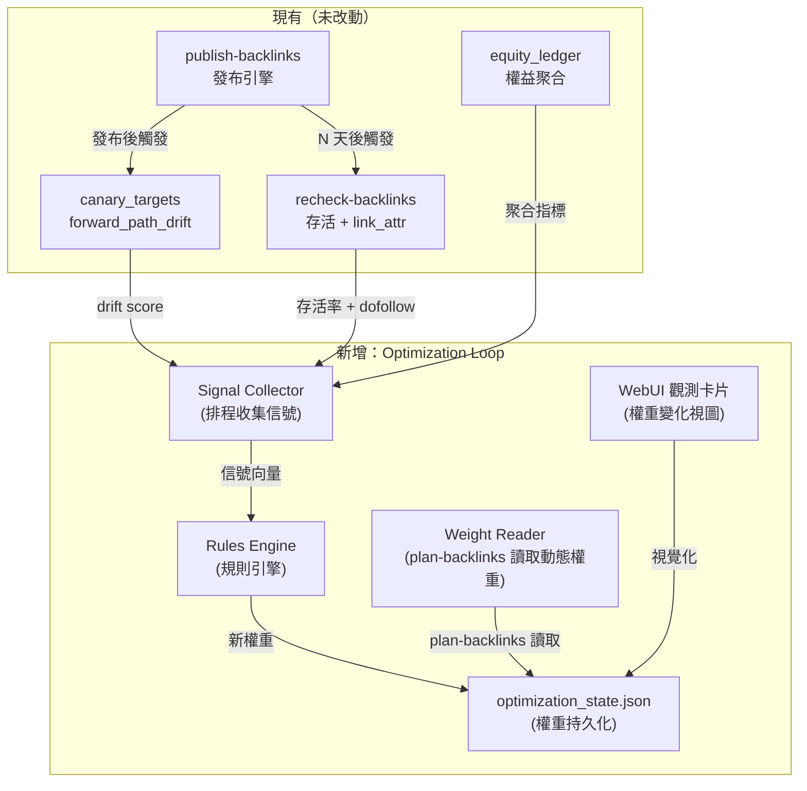

# 外链发布闭环优化方案

## Problem Frame

Backlink Publisher 現有 pipeline 已完整（CLI 全鏈路、25+ 平台、quality gates），但 **發布決策是開環的**：

- `plan-backlinks` 各平台的 `dispatch_weight` 是**靜態常量**，寫死在 registry 和 adapter module 裡
- 發布結果（存活、dofollow 狀態、被刪、被 sandbox）**不回饋到權重決策**
- 一個平台連續 fail（link 被刪、帳號被封），仍會繼續被選中，浪費 seed
- 一個平台表現穩定（高存活率、穩定 dofollow），也不會獲得更多派發機會
- `canary_targets` 能檢測 forward path drift，`recheck-backlinks` 能確認存活，`equity_ledger` 能聚合統計——但這些信號**無人消費**

> 一句話：**有信號，無閉環。**

運營者只能靠經驗手動調整 `config.toml` 的平台啟用/停用，缺乏數據驅動的自動化回饋。

## 7 維度優化目標（全部 Primary）

| # | 維度 | 信號源 | MVP 可測 |
|---|------|--------|---------|
| 1 | **平台存活率** (Survival Rate) | recheck-backlinks verdicts + canary forward_path_drift | ✅ |
| 2 | **Dofollow 保真度** (Dofollow Fidelity) | link_attr_verifier 的 rel 檢測結果 | ✅ |
| 3 | **引薦流量** (Referral Traffic) | GA4 / 站長工具反向連結數據 | ❌ (Phase 2) |
| 4 | **索引率** (Index Rate) | Google Search Console API / 手動檢查 | ❌ (Phase 2) |
| 5 | **錨文本自然度** (Anchor Naturalness) | anchor_profile 分布 + recheck 階段錨文本留存率 | ⚠️ 間接 |
| 6 | **平台權重動態調整** (Weight Adaptation) | 以上所有信號的聚合輸出 | ✅ (最終產出) |
| 7 | **內容質量影響** (Content Quality) | publish 成功率 vs LLM rewrite quality score | ❌ (需先有 quality gate) |

**MVP 聚焦維度 1+2+6**：存活率 + dofollow 保真度 → 動態調整權重。

## Architecture



**關鍵設計原則**：新增組件全部為**非侵入式**——不修改現有 publishing pipeline，只在旁邊加一層回饋迴圈。

## Approach 選擇：方案 B（規則引擎 + 閾值自適應）

三方案探索結論：

| 方案 | 描述 | 複雜度 | 上線時間 | 選擇 |
|------|------|--------|---------|------|
| **A** | 事件溯源 + 線上學習權重 | ⭐⭐⭐⭐⭐ | ~2 月 | 平行建設 |
| **B** | 規則引擎 + 閾值自適應 | ⭐⭐ | **2 週** | **✅ MVP** |
| **C** | 對手建模 + 模擬退火 | ⭐⭐⭐⭐ | 實驗跑道 | 後續 |

方案 B 的核心思想：**用 If-This-Then-That 規則 + 簡單統計閾值**，覆蓋 80% 的優化場景。

## MVP 規則（第一批上線）

### Rule 1: Canary Drift → 熔斷降權

```
WHEN  canary_targets 檢測到 forward_path_drift == True
THEN  dispatch_weight *= 0.5 (max 連續 3 次 → 權重 = 0)
      → 權重歸零後記錄到 optimization_state.json
      → 後續 plan-backlinks 不再選擇該平台
```

- 信號源：`canary_targets` 的 `forward_path_drift` verdict
- 恢復機制：7 天後自動恢復到 0.3，再由 recheck 確認後逐步回升
- 邊界情況：權重歸零但平台仍可手動在 CLI 指定（`--force` 覆蓋）

### Rule 2: Recheck 存活 → 提權

```
WHEN  recheck-backlinks 確認鏈接存活 >= 2 次確認
      AND link_attr_verifier 判定為 dofollow
THEN  dispatch_weight *= 1.2 (max cap = 3.0)
```

- 信號源：`recheck-backlinks` verdict + `link_attr_verifier` result
- 防止無限上升：cap at 3.0（原始權重的 3 倍）
- 降級機制：recheck 發現 link dead → 立即降回原始權重

### Rule 3 (Phase 1.5): 聚合統計閾值

```
WHEN  統計窗口內（30 天）平台的存活率 < 30%
THEN  dispatch_weight *= 0.3 (low survival penalty)

WHEN  統計窗口內 dofollow 率 < 20%
      AND 樣本量 >= 5
THEN  dispatch_weight *= 0.5 (nofollow penalty)
```

- 需要 equity_ledger 累積足夠樣本（建議 MVP 第一週後啟用）
- 統計窗口和閾值初始為硬編碼，後續改為可配置

## 數據流向

### 信號收集 (Signal Collector)

排程運行，收集三種信號：

1. **存活信號**：運行 `recheck-backlinks`（re-check `--age 7d` 以上的 links），解析 exit code + stdout
2. **Drift 信號**：讀取 `canary_targets` 的 drift verdict（已存在）
3. **聚合信號**：從 `equity_ledger` 讀取統計摘要

輸出：標準化的信號記錄寫入 `optimization_state.json`。

### 權重運算 (Rules Engine)

- 定時觸發（可 `--dry-run` 預覽）
- 順序執行已啟用的規則
- 每條規則輸出：平台、原始權重、調整後權重、調整原因
- 所有變更寫入 `optimization_state.json`

### 權重讀取 (Weight Reader)

`plan-backlinks` 在調用 `adapter_publish.preferred_dispatch()` 時：

```
current flow:
  registry.py: preferred_dispatch() → dispatch_weight(adapter)  # 靜態

new flow:
  registry.py: preferred_dispatch() → 
    optimization_state.get_weight(adapter_name, default=dispatch_weight(adapter))
```

- 若 `optimization_state.json` 不存在或解析失敗 → fallback 到靜態權重（完全向後兼容）
- 若平台不在 state 中 → 使用靜態權重

## Requirements

### R1: optimization_state.json 存儲格式

- 獨立 JSON 文件，路徑：`~/.backlink-publisher/optimization_state.json`
- 不寫入 `config.toml`，避免 config_echo 副作用
- 結構：

```json
{
  "version": 1,
  "weights": {
    "medium": {
      "base": 1.0,
      "current": 0.5,
      "updated_at": "2026-06-05T10:30:00Z",
      "adjustments": [
        {"rule": "canary_drift", "applied_at": "...", "multiplier": 0.5, "reason": "forward_path_drift detected"}
      ]
    }
  },
  "stats": {
    "medium": {
      "total_published": 12,
      "alive_count": 8,
      "dofollow_count": 6,
      "drift_count": 2,
      "last_recheck": "2026-06-05T10:00:00Z"
    }
  },
  "rules": {
    "canary_drift": {"enabled": true, "multiplier": 0.5, "max_strikes": 3, "cooldown_days": 7},
    "recheck_survival": {"enabled": true, "multiplier": 1.2, "max_cap": 3.0, "min_confirmations": 2}
  }
}
```

### R2: Signal Collector

- CLI 入口：`backlink-publisher collect-signals [--dry-run]`
- 收集內容：
  - 運行 `recheck-backlinks` 獲取各平台存活/dofollow 聚合數據
  - 讀取 `canary_targets` drift verdicts
  - 彙總到 `optimization_state.json` 的 `stats` 區塊
- `--dry-run` 模式：只打印收集結果，不寫入文件

### R3: Rules Engine

- CLI 入口：`backlink-publisher optimize-weights [--dry-run] [--rule RULE_NAME]`
- 支援 `--rule` 參數只執行特定規則（便於調試）
- `--dry-run` 模式：打印每條規則的調整預覽，不修改權重
- 規則執行前記錄 old_weight，執行後記錄調整原因
- 支援規則啟用/停用（透過 `rules` 區塊的 `enabled` 字段）

### R4: Weight Reader（plan-backlinks 整合）

- 修改 `plan-backlinks` 的平台排序邏輯，優先選擇 current_weight 高的平台
- 修改 `publishing/registry.py` 的 `preferred_dispatch()`，讀取動態權重而非靜態值
- Fallback：state 文件缺失/損壞/解析失敗 → 使用靜態權重

### R5: WebUI 觀測卡片

- 在 WebUI dashboard 新增「Optimization Status」卡片
- 顯示：各平台 current_weight vs base_weight 的比較（帶箭頭 up/down/flat）
- 顯示：最近一次規則調整記錄（平台、規則、調整幅度、時間）
- 顯示：各平台統計簡表（published / alive / dofollow / drift count）
- 唯讀視圖（不在 MVP 提供手動覆蓋功能）

### R6: 可觀測性與調試

- `--dry-run` 模式全程可用（收集、運算、調整）
- `backlink-publisher show-optimization-state` 打印當前 state 摘要
- 每次規則調整記錄到 log（`logger.info("rule=%s platform=%s from=%.1f to=%.1f reason=%s")`）

## 不修改的範圍（Scope Boundaries）

- **不修改** `publish-backlinks` 核心邏輯
- **不修改** `recheck-backlinks`、`canary_targets`、`equity_ledger` 的既有行為
- **不修改** adapter 模組的 `dispatch_weight` 靜態宣告（weight reader 只 override，不 mutate）
- **不新增** 背景常駐服務（全部 CLI 觸發，後續可透過 scheduler.py + launchd 排程）
- **不涉及** 引薦流量、索引率、內容質量維度（Phase 2 範圍）
- **不涉及** A/B 測試框架（Phase 2 範圍）

## Success Criteria

1. `recheck-backlinks` 發現 link dead → 運行 `optimize-weights` → 該平台權重下降 → `plan-backlinks` 減少選擇該平台 ✅
2. `canary_targets` 檢測 drift → 權重熔斷歸零 → `plan-backlinks` 不再自動選擇 ✅
3. 同平台連續存活 2 次 recheck → 權重上升（但 capped at 3.0） ✅
4. `optimization_state.json` 損壞或不存在 → `plan-backlinks` 行為完全不變（向後兼容） ✅
5. 所有 `--dry-run` 模式只預覽不修改 ✅
6. WebUI 卡片顯示當前的權重狀態和最近調整記錄 ✅

## Rollout Plan

### Week 1: Core Engine
- Day 1-2: `optimization_state.json` read/write module + `collect-signals` CLI
- Day 3-4: Rules Engine (Rule 1 + Rule 2) + `optimize-weights` CLI
- Day 5: Weight Reader integration into `plan-backlinks` + `preferred_dispatch()`

### Week 2: Integration & WebUI
- Day 1-2: WebUI Optimization Status card
- Day 3: `show-optimization-state` CLI + logging polish
- Day 4: E2E testing（模擬場景）
- Day 5: Dry-run 驗證 + 上線

### Post-MVP (Phase 2)
- 引薦流量 + 索引率維度接入信號收集器
- Rule 3（聚合統計閾值）
- WebUI 手動權重覆蓋功能
- 排程自動化（cron / launchd）

## Key Decisions

- **存儲格式**：獨立的 `optimization_state.json`，不寫入 `config.toml`
  - 理由：config.toml 是使用者意圖，optimization_state 是系統推導結果，兩者生命周期不同
- **Rule 1 熔斷恢復**：7 天 cooldown 後自動恢復到 0.3，而非 0，給平台第二次機會
- **Rule 2 cap**：max 3.0，防止單一平台權重無限膨脹
- **讀取策略**：`plan-backlinks` 在排序時才讀取動態權重，不在 adapter 註冊時讀取
- **不引入背景常駐服務**：所有操作 CLI 觸發，降低初始複雜度

## Outstanding Questions

### Resolve Before Planning

- [Affects R2][設計] `recheck-backlinks` 的聚合數據輸出格式——是否需要新增 `--json-summary` flag 輸出機器可讀的聚合結果？
- [Affects R3][設計] Rule 觸發頻率——建議每次 `plan-backlinks` 運行前自動觸發 `optimize-weights`（作為 pre-hook），還是獨立排程？

### Deferred to Planning

- [Affects R5][Technical] WebUI 觀測卡片的數據刷新策略——前端輪詢 vs. 後端 SSE
- [Affects R1][設計] `optimization_state.json` 的併發寫入保護（多個 CLI 同時運行時）

## Next Steps
→ `/ce:plan` for structured implementation planning + work breakdown
→ `/ce:work` or `/lfg` for implementation
