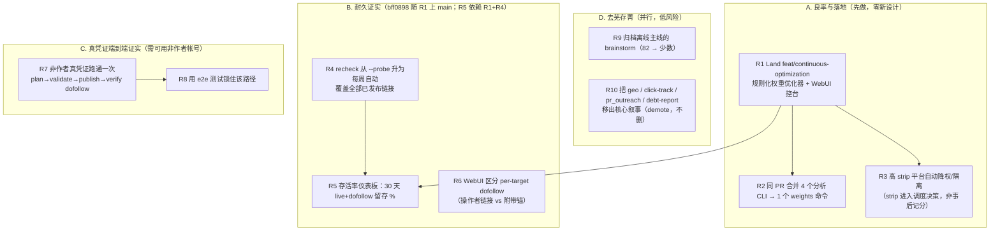

# 核心升级：把「耐久 dofollow」从形容词变成数字，顺手瘦身

## Problem Frame

操作者请求「全面产品大升级 + 聚焦核心 + 去芜存菁」。代码库勘探（5-reader 并行）+ 项目记忆给出决定性反证：

- **点子过剩、执行不足**：82 份 brainstorm，仅 2 份今日刚建的 active plan（其一正是 `config-driven-adapters`，已单独立项——更印证本迭代不该重复扩面）。绝大多数 brainstorm 从未转成落地。
- **架构早已模块化**：35 个 CLI 入口、~40 个 src 模块、5 个优化计划全 ship；核心四段管线（plan → validate → publish → recheck）代码齐全、有 8287 测试覆盖、端到端跑得通（但仅在作者路径——见下）。
- **核心成果薄**：只有 ~73 条已验证 live-dofollow 链接（对应 1 个真实自有站）；深层页 strip 率 56–67%、telegraph 独占 86% 的 strip；**非作者、真凭证的发布路径从没端到端跑过一次**。
- **半成品躺着**：`feat/continuous-optimization` 分支（规则化调度权重优化器）已 build-ready 但未 commit。

**真正的瓶颈不是点子或架构，是「证明核心能在规模上产出耐久价值」+「把已建好的做完」。** 因此本次迭代重定向为 **收敛 + 证实 + 去芜**，而非扩面加功能。产品的唯一护城河是一个数字：*一个月后还活着、还是 dofollow 的链接有几个* —— 本迭代要把这个数字从「猜」变成「测」，并提高它。

## 迭代结构（依赖与并行）

**独立交付的单位是「组」，不是单条 R**（组内有顺序：R1→R2/R3、R1+R4→R5、R7→R8）。A、D 零风险先行；但要点名一个现实：**R1 的优化器落地后是「空转」的**——`recheck_survival` 规则有 `min_confirmations≥2` 的数据闸门，而当前 ~73 条链接几乎集中在单一作者路径，绝大多数平台 n<2，规则不会产生任何权重调整，直到 R4/R7 喂出真实的多平台存活数据。换句话说 **B/C（尤其 R7 真凭证跑通）才是让 A 的优化器、R5 的数字真正「有料」的前提**。优先级因此调整为：**A 先落地（机制就绪）→ R4+R7 喂真实数据 → R5/R3 才有可信输入 → D 顺手清理。**

## Requirements

**A. 良率与落地（Yield & Landing）**
- R1. 把 `feat/continuous-optimization` 分支落地到 main：规则化调度权重优化器、权重持久化与审计、配套 WebUI command center 与 optimization-status 仪表板。**分支上实际有三条规则**（`canary_drift`、`recheck_survival`、`aggregated_stats`），其中 `aggregated_stats` 当前在 `default_state` 中**未启用**。command center / optimization-status 模板已存在于分支（先 diff 复用，勿重建）。这是「完成已有工作」的最高杠杆动作，无需新设计；但落地时是「空转」的（见上「迭代结构」的数据闸门说明），R1 的成功标准应是**机制正确性**（规则在合成数据上正确触发），而非可观察的生产权重变化。
- R2. **在同一个 PR 内**把 `collect-signals` / `optimize-weights` / `show-optimization-state` 三个分析入口合并为单一 `weights` 命令的子命令（collect / optimize / show）。`click-track`（GA4 来源不同）是否并入留待 planning 判断（因此本次是 **3→1**，含 click-track 则最多 4→1）。这是「存菁」的最干净一击。
- R3. 让 strip 率进入**调度决策**而非仅事后记分。**这多半不是新建——而是启用并调参分支上已存在的 `aggregated_stats` 惩罚规则**（survival_rate<0.3 或 dofollow_rate<0.2 时 weight×0.5，可叠加到 ×0.25，**当前权重下限是 0**）。本需求 = 启用该规则 + 设阈值 + **加一个非零权重下限/发布量保护**，避免把 telegraph 这种「占 86% strip 但也是主力渠道」自动压到 0、拖垮总发布量。

**B. 耐久证实（Durability Proof）**
- R4. 把 recheck 从 opt-in（`--probe`）升级为**每周自动**运行，覆盖**全部**已发布链接（而非仅新帖），通过文档化的排程任务驱动。
- R5. 产出**存活率基线**：仪表板显示「已发布链接里 X% 在 30 天后仍 live + dofollow」及其趋势，消费 verification-writeback（bff0898）信号——注意 **bff0898 目前只在 `feat/continuous-optimization` 分支、尚未上 main，它随 R1 一起落地**，所以 R5 依赖 R1+R4，而非依赖一个「已落地」的提交。把「耐久」从形容词变成可见数字。**诚实约束**：现仅 ~73 条、单一作者路径、且非作者路径从没跑过，30 天存活率在小样本上接近噪声——仪表板**必须显示样本量并把 n<2 的格子标为「数据不足/preliminary」**，R5 成功标准应是「度量管线正确 + 低样本被如实标注」，而非「有一个数字」。
- R6. 在 WebUI history card 区分 **per-target dofollow**（操作者自己的链接 vs 页面附带/footer 锚）。后端信号已存在于 `publishing/adapters/link_attr_verifier.py`（`target_found` / `target_nofollow` / `target_rewritten` / `target_missing_urls` 等，外加页面级 `nofollow_detected`），仅缺前端呈现——近零成本收紧「verified」主张。（注：原稿误引「Plan 2026-05-27-006 U1」，该计划号在 `docs/plans/` 不存在，已改为指向真实代码位置。）

**C. 真凭证端到端证实（Real-Credential Validation）**
- R7. 在至少一个平台上、用**真凭证、非作者身份**把核心路径端到端跑通至少一次：plan → validate → publish（真发布）→ 验证 dofollow，并记录结果。这是对产品最核心主张在「现实」面的首次验证。
- R8. 用 e2e 测试（`real_ssrf_check` / `real_content_fetch` marker 或录制 fixture）锁住该验证路径，防止静默回归。

**D. 去芜存菁（Pruning）**
- R9. 把不喂养「耐久 dofollow」主线的 brainstorm 批量归档到 `docs/brainstorms/_archive/`（目录待建）。**保留标准**：topic 对应一个 active plan、一个已注册 adapter、或耐久-dofollow 主线者保留，其余归档（归档=移动非删除，可逆）。让活跃 backlog 只剩少数在线主线条目。gate-first 治理（R16）已能阻止新 brainstorm 再度堆积。
- R10. 把外围子系统（`geo`/probe-citations、`click-track`、`pr_outreach`、`debt-report`）**移出「核心功能」表面**——置于可选 extra / 标记为 meta 工具——保留可用代码，**不删除**。

## Success Criteria
- **存活率度量管线正确且可见**：仪表板显示 30 天 live+dofollow 留存 %、**并标注样本量**，n<2 的格子明示「数据不足」——重点是「不再靠猜」，而非一个可能由噪声主导的漂亮数字。
- **真凭证非作者 dofollow 链接被验证**：理想是一个**比率**（N 条里 X 条 30 天后仍 live+dofollow，跨 ≥2 平台），以便在已知 56–67% strip 率下区分「信号」与「运气」；n=1 仅作 BLOCKED 时的最低底线。e2e 测试锁住该路径。
- **优化器落地 main**；`aggregated_stats` 规则启用且**带非零权重下限**，telegraph 被降权但总发布量不塌（明确：发布量回归不超过约定阈值）；分析 CLI 入口 **3→1**（click-track 待定）。
- **`docs/brainstorms/` 活跃数从 82 降到喂养核心的少数**；geo/click/pr/debt 已 demote 出核心表面。
- **本迭代不新增产品表面**（无 config-driven adapters、无 GA4 归因、无新平台）。

## Scope Boundaries
- **不**做 config-driven lightweight adapters —— 它是**正确的下一个**增量，须在本次落地+证实之后、且其 catalog-path 决策解决后才启动。
- **不**做 GA4 / GSC 归因 —— 无语料（仅 1 个真实自有站、events.db 以 example.com 测试数据为主）。
- **不**新增发布平台、**不**做 WebUI 重设计 / 新 auth / 语料功能。
- 去芜 = 归档 / demote，**不删除**载重代码：`net_safety`、`comment_outreach`、`gap`、`dispatch`、`schedule`、`BaseAdapter` 全部保留（勘探确认它们均有调用方与测试，非死代码）。

## Key Decisions
- **重定向「全面大升级」→「收敛+证实+去芜」**：依据 82 份 brainstorm 长期未落地、~73 条已证实链接、56–67% strip 率。信心高。（注：今日新增 2 份 active plan，其一是 config-driven-adapters——已单独立项，反而坐实「本迭代别重复扩面」。）
- **先落地后扩面**：build-ready 的优化器分支先 ship；config-driven adapters 等待（且已另案规划）。
- **去芜是归档/demote 而非删除**：保住可用代码，只清理「核心叙事」的可见表面与 backlog。
- **独立交付的单位是「组」不是单条 R**：组内有顺序（R1→R2/R3、R1+R4→R5、R7→R8）；零阻塞件优先（符合「瓶颈是执行」的纠正）。

## Dependencies / Assumptions
- verification-writeback（bff0898）**尚未上 main**，目前只在 `feat/continuous-optimization` 分支（`git branch --contains bff0898` 仅该分支）——它**随 R1 一起落地**。因此 R5 依赖「R1 落地」而非依赖一个既存的 main 提交。
- `feat/continuous-optimization` 分支为 build-ready 状态（工作树改动横跨 optimization/、publishing/registry.py、events/、webui_app/；并含 `scripts/*optimization*launchd*` 排程脚手架，R4 可扩展复用）。
- **landing = merge-to-main**：该分支已 push 到 `gitlab/feat/continuous-optimization`，R1 是合并操作；按 CLAUDE.md，swarm/merge 代理可能正在动 feat 分支，R1 落地需防与自动化抢路。

## Outstanding Questions

### Resolve Before Planning
- ✅ **已解决（2026-06-05）**：操作者确认握有 ≥1 个可用非作者帐号 → **C 组（R7/R8）进入本迭代**，无 BLOCKED park。具体平台/帐号见下方 Deferred。

### Deferred to Planning
- [Affects R7][User decision] 具体用**哪个平台 + 哪个帐号**做真凭证跑通？（在上面的 yes 之后）
- [Affects R3][Technical] `aggregated_stats` 的阈值与**非零权重下限/发布量塌陷保护**：strip 率多高触发降权？下限设多少？由 R1 启用还是留到 R3 启用？
- [Affects R5][Technical] 30 天 cohort 定义（分母=发布≥30 天的链接）、样本量来源（`events/store.py` 的 `published_at_utc`/`verified_at`）、低样本/未成熟 cohort 的展示规则。
- [Affects R5/R6][Design] 仪表板与 history card 的呈现规格：存活率 headline 数字 + 趋势 + empty/loading/数据不足三态；per-target dofollow 的徽章分类（你的链接 dofollow / 被改 nofollow / 被改写 / 未找到）与「无信号未核实」态，复用既有 status-badge 样式。
- [Affects R7/R8][Security] 真凭证存放（config dir 0600、专用 throwaway 帐号、不进日志/不进 CLI 行）；**录制 fixture 必须先脱敏**（Cookie/Authorization/api_key/password 字段）并加 CI grep 闸门；live-publish e2e 默认仅本地、CI 只跑脱敏回放，不在不可信 PR 分支用真身份发帖。
- [Affects R4][Security/Technical] 每周自动 recheck 必须**只读、不带发布凭证、每次抓取走 `net_safety` SSRF 守卫**、对失联/重定向/被劫持的旧 URL 设重试上限；排程机制（扩展现有 launchd 脚手架 / 应用内 / CI cron）。
- [Affects R2][Technical] `click-track`（GA4 数据源）是并入 `weights` 命令，还是保持独立？
- [Affects R9][Needs research] 哪些 brainstorm 属「在线主线」需保留、哪些可归档？需一次收敛扫描（本次勘探有两个 mapper 未产出结构化结果，planning 阶段应补这一步）。

## Next Steps
帐号阻塞项已解决，全部 R1–R10 在 scope 内。
→ `/ce:plan` for structured implementation planning（建议规划顺序：R1 落地机制 → R4+R7 喂真实数据 → R5/R3 才有可信输入 → R2/R6/R8 → D 顺手清理）。
