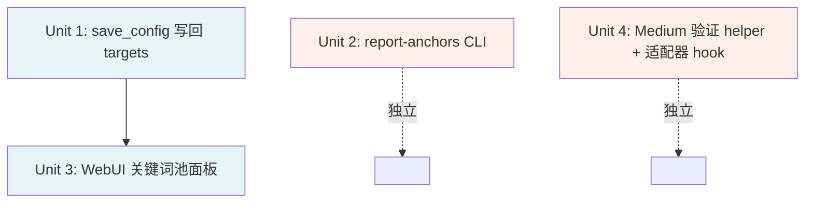

# feat: 锚文本 SEO 后续优化（4 项）

## Overview

PR #2（`feat/anchor-text-seo`）落地了「关键词锚文本」与「target=\"_blank\"」两条核心能力，但留下四块运营层面的缺口：用户只能手工编辑 `config.toml` 才能维护关键词池；WebUI 没有对应面板；运营无从得知一个 target 站跨多篇文章的实际锚文本分布；Medium 发布后 `target=\"_blank\"` 是否被剥离纯靠盲信。本 plan 一并解决，分两阶段交付。

## Problem Frame

PR #2 设计上保留了 4 个已知"将来再做"的事项（README + plan 中均有记录），其中 #1 在 PR #2 /review 阶段已部分解决：

1. ~~`save_config` 不会写回 `[targets]` 段~~（**PR #2 review fix 3ace4b4 已解决保留问题**：`save_config` 现在会在每次写盘时保留磁盘上的 `[targets]` 段。但 **WebUI 显式写入新 keywords** 的参数路径还未实现，仍需 Unit 1 补完。）
2. WebUI 的 settings 页只暴露 OAuth/blogger/medium 凭据，缺锚文本配置入口 → 非技术运营无法独立调整
3. 运营无法在不读源码的情况下回答"小黄书最近 50 篇外链文章的锚文本分布是怎样的" → SEO 调优靠拍脑袋
4. Medium 后端可能剥离 `target/rel` 属性 → "best-effort" 的承诺没有验证手段，不知道实际丢失率

这四条共同形成一个完整的"配置 → UI → 验证 → 观测"闭环。任何一块缺失都会让运营继续退回到手工 `tail config.toml` 的工作流。

## Requirements Trace

**配置持久化**
- R1. `save_config` 接受 `target_anchor_keywords: dict[str, list[str]] | None` 参数，能将 `[targets]` 段写回 toml；现有 OAuth/blogger 段不被覆盖或丢失
- R2. ✅ 写回时若调用方未显式提供该参数，沿用磁盘上既有值（PR #2 review fix 已实现，`3ace4b4`）

**WebUI 关键词池管理**
- R3. settings 页新增 "SEO 锚文本" 分区：列出已知 target 站（来自 `[blogger]` 或 `[targets]` 任一段中出现的 main_domain），每行显示当前关键词列表 + "编辑" 按钮
- R4. 编辑表单支持新增/删除/重排关键词（最少 1 个、最多 20 个的软约束）；保存按钮调用 `save_config(..., target_anchor_keywords=...)` 持久化
- R5. 表单校验：每个关键词去前后空白后非空、长度 ≤ 60 字符、ASCII + Unicode 均允许；去重后保存

**锚文本分布报告**
- R6. 新增 CLI 子命令 `report-anchors`（或 `validate-backlinks --report-anchors`，二选一在 plan 中决策）：读取一个 JSONL（payload 文件）输入，按 main_domain 分桶，统计每个 target 出现的锚文本字符串及次数
- R7. 默认输出 markdown 表格到 stdout；`--json` flag 切换为 JSON 输出
- R8. 报告同时显示「fallback 比例」—— 该 target 中 anchor 等于裸域名 label 的文章占比，用于发现未配置 keyword pool 的 target

**Medium target=\"_blank\" 验证**
- R9. 新增 helper（独立函数，不强依赖 `verifier.py`，方便单测）：传入一个公开 URL，拉取 HTML，统计 `<a target="_blank">` 数量与总 `<a>` 数量
- R10. Medium 适配器（`medium_api`、`medium_browser`、`medium_brave`）发布成功后、若 mode == "publish"，自动调用该 helper 检查 `published_url`；将结果写入 `AdapterResult._provider_meta` 字段（不阻断、不失败）
- R11. 检测到剥离比例 > 50% 时输出 WARN 日志（`anchors_stripped_by_platform`），帮助运营发现"Medium 默认行为变了"

## Scope Boundaries

- **不**实现关键词池跨平台同步（user can have one pool per target site only — multi-platform分发的同一 target 共用一池）
- **不**实现锚文本质量打分（如关键词密度、重复率检测） —— 报告只输出原始分布，分析交给人
- **不**实现 Medium 自动加回 `target` 属性（如有剥离接受现状，由 R11 WARN 提示）
- **不**触动 `verifier.py` 的 HTML channel（独立分支 feat/real-publish-verification 还未 merge，本 plan 不耦合它）
- **不**做 Blogger / 其他平台的 target 验证（Blogger 已知保留 HTML 属性，无验证必要）

## Context & Research

### Relevant Code and Patterns

**配置层（Unit 1）**
- `src/backlink_publisher/config.py` `save_config` (~line 157) — 现有签名参数顺序、`existing = load_config()` 合并模式可直接照抄给 `target_anchor_keywords`
- `src/backlink_publisher/config.py` `_parse_target_anchor_keywords` — 解析逻辑已就位（PR #2），写回需要对称的 toml-emit
- `tests/test_config.py` 既有 `test_save_and_load_blogger_token` 可作为 round-trip 测试模板

**WebUI（Unit 3）**
- `webui.py:1539` settings 页 Jinja 模板分区写法（OAuth / blogger / medium 三段）
- `webui.py:3348` `/settings/save-blog-ids` 路由（POST → save_config → redirect）作为 settings POST 的标准模式
- `webui.py:1762` blog-ids 表单 `<form method="POST" action="/settings/save-blog-ids">` 作为表单结构参考
- 没有"动态行 add/remove"的现成 JS 组件 —— 纯 HTML 多 textarea + 简单 vanilla JS 即可（项目无前端框架）

**报告 CLI（Unit 2）**
- `src/backlink_publisher/cli/validate_backlinks.py` (123 行，仅 `_enhance_payload` + `main`) 是最简 CLI 模板
- `src/backlink_publisher/cli/plan_backlinks.py` `main()` 的 argparse + `--input` + JSONL 流处理是 idiomatic 模板
- `pyproject.toml [project.scripts]` 当前注册 3 个入口：`plan-backlinks` / `validate-backlinks` / `publish-backlinks` —— 新 CLI 入口跟随这个约定

**Medium 验证 helper（Unit 4）**
- 项目已用 `requests` 做 HTTP（依赖在 `pyproject.toml`）—— helper 用 `requests.get` 即可
- `src/backlink_publisher/adapters/medium_api.py:174-186` 是发布完成后构造 `AdapterResult` 的位置 —— 在该处 hook 验证最自然
- `AdapterResult` 已支持 `_provider_meta` 字段（PR #2 之前的 publisher-adapters-rewrite 加入）

### Institutional Learnings

- PR #2 学到的 5xx 重试 idempotency 教训（`docs/plans/2026-05-12-002-...`）适用本 plan 的 Medium 验证 helper：拉 HTML 出错时**不重试**（HTML 端点是 GET 幂等，但失败可能是限流），失败时记录 WARN 并把 meta 标 `verification: skipped` 即可，绝不让验证失败把发布结果也搞丢
- PR #2 的"每篇 1 次 WARN"模式（`plan_backlinks._resolve_article_anchors`）适用于 Unit 4 的剥离检测：每次发布最多 1 条 WARN

### External References

- TOML 写回保留注释/格式不在 `tomllib` 标准库范围。`save_config` 当前用纯字符串拼接，本 plan 沿用此风格 —— 不引入 `tomli-w` 等新依赖
- markdown-it-py 不参与；本 plan 与 PR #2 的渲染层无交集

## Key Technical Decisions

- **save_config 写回采用"完整重写"语义而非"差量 patch"**：与现有 `[blogger]`/`[medium]` 段的写回行为对齐。代价是用户在 toml 中手写的注释会被擦除（既有约束，未变化）。优点：实现简单、可预测、易测。
- **WebUI keyword pool 编辑器走"批量提交"而非"行级 AJAX"**：项目无前端框架，标准 form POST 已足够；批量提交一次性保存所有 target 的所有 keyword，避免部分写入导致的中间态。
- **报告 CLI 选 `report-anchors` 独立入口而非扩展 `validate-backlinks --report-anchors`**：单一职责原则；`validate-backlinks` 已是"预校验" 语义，加报告子模式语义紊乱。
- **Medium 验证 helper 设计为独立函数 + 适配器层 hook**：helper 单测无需启动 Medium 真实流程；适配器集成测试可 mock helper。两层各自独立可测。
- **target=\"_blank\" 剥离阈值 50% 触发 WARN**：低于该阈值可能是 Medium 对部分链接特殊处理（如 medium 内链）；高于该阈值才说明系统性剥离，值得人工关注。50% 是经验阈值，可由 R11 后续调整。
- **报告输出锚文本分布 + fallback 比例两个指标**：fallback 比例直接定位"未配置 keyword pool 的 target"，是运营优化最直接的 signal；分布则用于发现"keyword pool 配置了但选取偏斜"。

## Open Questions

### Resolved During Planning

- **Q: WebUI 表单需要前后端校验？** A：客户端 vanilla JS 做即时校验（长度/非空提示），服务端 `save-target-keywords` 路由二次校验（信任边界 + 防 cURL 直发）。
- **Q: 报告 CLI 输入是 plan_backlinks 输出还是 publish_backlinks 输出？** A：plan_backlinks 输出（即 payload JSONL，含 `links[]`）。publish 输出只增加 publish 状态字段，对锚文本统计无新信息。
- **Q: Medium 验证 helper 在 publish=draft 模式下要不要触发？** A：不触发。draft 不是公开 URL，无法 GET。仅在 `mode == "publish"` 且 `published_url` 非空时验证。
- **Q: WebUI 显示哪些 target？** A：union of `[blogger]` 段中的 main_domain + `[targets]` 段中的 main_domain。空池的 target 也显示（绿色提示"未配置，所有锚文本回退到裸域名"）。

### Deferred to Implementation

- [Affects R7][Technical] markdown 表格的具体列结构（target / total_articles / unique_anchors / fallback_pct / top_3_anchors？）由实现者定，但需在 PR 描述中固定下来供后续脚本消费
- [Affects R10][Technical] HTML 拉取超时值（建议 10s）和 User-Agent（建议 `backlink-publisher-verifier/0.1`），实现时按 `medium_api.py` 现有 `requests` 调用风格定
- [Affects R3][UI] WebUI keyword 编辑器的"删除单个关键词"按钮的样式（红×按钮 vs swipe-to-delete）—— 跟随 settings 页现有 styling

### Resolved by PR #2 Review Fixes (3ace4b4)

- ~~[Affects R4] 同 main_domain 在 `[blogger]` 和 `[targets]` 都出现且写法不一致时的合并语义~~ → **已解决**：`get_anchor_keywords` 现在尝试 https/http/bare-domain 多种变体查找（scheme-tolerant lookup），trailing slash 在 `_parse_target_anchor_keywords` 归一化阶段处理。
- ~~save_config 覆盖 targets 导致数据丢失~~ → **已解决**：`save_config` 在每次写盘时从 `existing.target_anchor_keywords` 保留 targets 段。
- ~~keyword 内容注入风险~~ → **已解决**：`_parse_target_anchor_keywords` 在解析时用 `_UNSAFE_IN_ANCHOR` regex 清除危险字符。

## High-Level Technical Design

> *以下是方向性示意，非实现规范。*

四个 feature 的依赖与交付边界：



蓝色 = Phase 1 必要前置链；橙色 = Phase 2 独立 feature，可与 Phase 1 并行实现也可作为独立 PR 后置。

`save_config` 扩展后的形态（**仅作签名/语义示意**）：

```python
save_config(
    config: Config,
    path: Path | None = None,
    extra_blogger_ids: dict[str, str] | None = None,
    medium_token: str | None = None,
    blogger_client_id: str | None = None,
    blogger_client_secret: str | None = None,
    target_anchor_keywords: dict[str, list[str]] | None = None,  # ← new
) -> None
```

`None` 表示 "merge from disk"（与 `extra_blogger_ids=None` 一致），`{}` 表示"清空全部 targets 段"，非空 dict 表示"以此为准覆盖磁盘"。

WebUI 路由组织：

```text
GET  /settings                         # 现有，新增 SEO 锚文本分区
POST /settings/save-target-keywords    # 新增，接收所有 target × keywords 表单数据
```

Medium 验证 helper 的调用点（**仅作位置示意**）：

```text
medium_api.py / medium_browser.py / medium_brave.py
  └─ publish() returns AdapterResult
      └─ 在 status="published" 分支调用：
            verify_link_attributes(published_url) → meta dict
            └─ 写入 AdapterResult._provider_meta["link_attr_verification"]
```

## Implementation Units

- [x] **Unit 1: `save_config` 添加 `target_anchor_keywords` 显式写入参数**

**Goal:** 在 `save_config` 签名追加可选参数 `target_anchor_keywords`，让 WebUI 能主动写入新 keywords 池，而不仅仅是保留磁盘上的既有值。

**Requirements:** R1（R2 已完成）

**Current state:** PR #2 review fix (`3ace4b4`) 已实现 R2 —— `save_config` 现在在每次写盘时保留磁盘上的 `[targets]` 段，且 `tests/test_config.py` 中已有 `test_save_config_preserves_targets_section` 覆盖该路径。**Unit 1 的剩余工作仅是添加显式参数。**

**Dependencies:** PR #2 已 merge 到 main（`Config.target_anchor_keywords` 字段存在）

**Files:**
- Modify: `src/backlink_publisher/config.py` (`save_config` 函数签名 + 写回逻辑)
- Test: `tests/test_config.py`（在 `test_save_config_preserves_targets_section` 基础上追加显式写入用例）

**Approach:**
- 在 `save_config` 尾部追加参数 `target_anchor_keywords: dict[str, list[str]] | None = None`（向后兼容，所有现有调用无需改动）
- 写回逻辑：`None` 时从 `existing.target_anchor_keywords` 读取（当前行为，保持不变）；`{}` 时清空 targets 段；非空 dict 时以传入值为准
- 现有写回 toml 格式：`[targets."<main_domain>"]\nanchor_keywords = ["kw1", "kw2"]`（已在 PR #2 review fix 中定稿）
- grep 确认 5 处现有 webui.py 调用点无 `target_anchor_keywords=` 位置参数，追加不冲突

**Patterns to follow:**
- `config.py` `save_config` 现有 `[targets]` 写回代码（PR #2 review fix 已就位，直接在其基础上加分支判断）
- `extra_blogger_ids: dict | None` 参数的 None/空/{...} 三态语义

**Test scenarios:**
- Happy path：传入 `target_anchor_keywords={"https://a.com": ["k1","k2"]}` → 写回 toml 解析后值完全一致
- Happy path：传入多 target → 全部段出现，顺序稳定
- Edge case：`target_anchor_keywords={}` → 写回 toml 不含 `[targets]` 段（清空）
- Edge case：`target_anchor_keywords=None`（默认）→ 保留磁盘上已有值（已有测试，不退化）
- Edge case：keyword 含中文/Unicode → round-trip 后值相等
- Integration：传入显式 keywords → 写回 → 读回 → 验证为传入值（覆盖磁盘既有）
- Edge case：`[blogger]`/`[medium]` 段在写回 `[targets]` 时不被丢失（已有回归保护，补一条）

**Verification:**
- `pytest tests/test_config.py` 全绿（含已有 `test_save_config_preserves_targets_section`）
- WebUI 的 Unit 3 路由能通过此参数传入 dict 并持久化

- [ ] **Unit 2: `report-anchors` CLI 子命令**

**Goal:** 新增独立 CLI，读取 plan_backlinks 输出（payload JSONL），按 main_domain 输出锚文本分布与 fallback 比例报告。

**Requirements:** R6, R7, R8

**Dependencies:** None

**Files:**
- Create: `src/backlink_publisher/cli/report_anchors.py`
- Modify: `pyproject.toml` (新增 `[project.scripts] report-anchors = "..."`)
- Test: `tests/test_report_anchors.py`

**Approach:**
- argparse 入口：`--input`（JSONL 文件，默认 stdin）、`--json`（切换输出格式）、`--top-anchors N`（默认 5，限制每 target 显示前 N 个锚文本）
- 读 JSONL 时只关心 `main_domain` + `links[]` 中 `kind in ("main_domain", "target")` 的 anchor 字段
- 用 `collections.Counter` 累计 `(main_domain, anchor)` → count
- fallback 检测：anchor 等于 main_domain 经过 `replace("https://","").replace("http://","")` 之后的 label → 视为 fallback
- markdown 表头建议（实现时定稿）：`| target | articles | distinct anchors | fallback % | top anchors (count) |`
- JSON 输出形如 `{"<main_domain>": {"total_articles": N, "anchors": {"kw1": 5, "kw2": 3}, "fallback_count": 2}}`

**Patterns to follow:**
- `src/backlink_publisher/cli/plan_backlinks.py` `main()` 的 argparse + JSONL 流处理
- `pyproject.toml [project.scripts]` 现有 3 行注册风格

**Test scenarios:**
- Happy path：3 篇 payload 跨 2 个 main_domain → 输出按 main_domain 分桶，counts 正确
- Happy path：`--json` flag → 输出合法 JSON（`json.loads` 通过）+ 结构匹配
- Happy path：单 target 多 url_mode → 看到多个 distinct anchors（验证 PR #2 的分布逻辑确实生效）
- Edge case：所有锚文本均为裸域名（fallback）→ `fallback %` 显示 100%
- Edge case：空输入 → 输出空表 + exit 0（不报错）
- Edge case：单条 payload 缺失 `links` 字段 → 跳过该条 + stderr WARN，不 crash
- Edge case：含非 main_domain/target kind 的 link（如 supporting）→ 不计入统计
- Edge case：`--top-anchors 1` → 每行只显示 top 1 锚文本

**Verification:**
- `pytest tests/test_report_anchors.py` 全绿
- 手工跑：`plan-backlinks < seeds.jsonl | report-anchors` 端到端流通

- [ ] **Unit 3: WebUI SEO 锚文本管理面板**

**Goal:** 在 settings 页新增一个分区，列出所有已知 target 站、显示当前 keyword pool、支持编辑+保存。

**Requirements:** R3, R4, R5

**Dependencies:** Unit 1（需要 `save_config` 写回能力）

**Files:**
- Modify: `webui.py` (settings 页 Jinja 模板 ~line 1539-1900 区段；新增 `/settings/save-target-keywords` 路由 ~line 3348 附近)

**Approach:**
- 模板分区放在 medium 段之后；标题 "SEO 锚文本配置"
- 显示数据源：union of `cfg.blogger_blog_ids.keys()` ∪ `cfg.target_anchor_keywords.keys()`，去重 + sort
- 每个 target 一行：`<details><summary>main_domain (N keywords)</summary>` 折叠，展开后是 textarea（一行一个 keyword）+ 删除/恢复按钮
- 表单一次提交所有 target × keywords，POST 到 `/settings/save-target-keywords`
- 路由处理：解析 form data → 构造 `dict[str, list[str]]` → 校验（每条 strip 后非空、长度 ≤60、整体去重）→ `save_config(cfg, target_anchor_keywords=...)`
- 校验失败时 redirect 回 settings 页 + flash error；成功时 flash "已保存 N 个 target 的关键词池"
- 客户端 JS：textarea 实时显示行数 + 字符长度，超限红字高亮（不阻断提交，只提示）
- 折叠行为用 `<details>`/`<summary>` 原生标签，无需 JS 框架

**Patterns to follow:**
- `webui.py:1762` blog-ids 表单结构（form action + method + 嵌套 input + submit button）
- `webui.py:3348` `/settings/save-blog-ids` 路由的 POST → save_config → redirect 模式
- 既有 `_render(HTML, ...)` Jinja 渲染调用方式

**Test scenarios:**
- Happy path：POST 包含 2 个 target × 各 3 个 keyword → save_config 收到正确 dict，redirect 回 settings 页
- Happy path：GET settings → 模板渲染包含所有 main_domain，已有池子的目标显示对应 keywords
- Happy path：POST 时某 target 的 textarea 留空 → 该 target 从 `[targets]` 段被移除（视为"清空池子，回退到裸域名"）
- Edge case：keyword 中含前后空白 → 服务端 strip 后保存，前端预览同步显示
- Edge case：同一 target 提交重复 keyword → 服务端去重，flash 提示"已自动去重 N 个重复项"
- Error path：POST 含长度 > 60 字符的 keyword → 服务端拒绝、flash error、不写入
- Error path：POST 含 0 个有效 keyword 的 target → 视为清空（同 happy path 第 3 条），不报错
- Integration：保存 → 重新打开 settings 页 → 新值正确显示（端到端 round-trip 含 toml 写盘）

**Verification:**
- 手动 QA：访问 settings 页 → 编辑 → 保存 → 刷新 → 看到新值
- 没有显式的 webui 单元测试基础设施 —— 端到端 QA 即可（参考 PR #2 既有 webui 改动的验证方式）；如有 selenium/playwright 测试 fixture 可加，否则 skip

- [ ] **Unit 4: Medium 发布后 `target=\"_blank\"` 验证 helper + 适配器 hook**

**Goal:** 发布到 Medium 后自动 GET 已发布页面，统计 `<a target="_blank">` 占比，写入 `AdapterResult._provider_meta`；剥离比例 > 50% 时 WARN。

**Requirements:** R9, R10, R11

**Dependencies:** None（独立于 verifier.py 模块；PR #2 提供的 `_provider_meta` 字段已可用）

**Files:**
- Create: `src/backlink_publisher/adapters/link_attr_verifier.py`（helper 模块）
- Modify: `src/backlink_publisher/adapters/medium_api.py`（在 `status="published"` 分支调用）
- Modify: `src/backlink_publisher/adapters/medium_browser.py`（同上）
- Modify: `src/backlink_publisher/adapters/medium_brave.py`（同上）
- Test: `tests/test_link_attr_verifier.py`
- Test: `tests/test_adapter_medium_api.py`（追加 1-2 条 hook 集成测试）

**Approach:**
- helper 函数：`verify_link_attributes(url: str, *, timeout: float = 10.0) -> dict`
- 内部用 `requests.get` 拉 HTML（5xx/timeout/connection error 都视为"无法验证" → 返回 `{"verification": "skipped", "reason": "..."}`，**不抛异常**）
- 用 `re.findall(r'<a\s+[^>]*>')` 收集所有 `<a>` 开标签（**不引入 BeautifulSoup**，保持依赖最小）；用 `re.search(r'\btarget\s*=\s*["\']?_blank["\']?', tag)` 判定是否含 `target="_blank"`
- 返回 `{"verification": "ok", "total_anchors": N, "blank_anchors": M, "blank_ratio": M/N}`
- 适配器 hook：`status="published"` 且 `published_url` 非空时调用；将返回 dict 写入 `_provider_meta["link_attr_verification"]`
- 当 `blank_ratio < 0.5` 且 `total_anchors > 0` 时，发 WARN 到适配器 logger（msg `"Medium stripped target attributes: M/N anchors retain target=_blank"`），每次发布最多 1 条
- draft mode、helper 跳过时不发 WARN

**Patterns to follow:**
- `medium_api.py:174-186` `AdapterResult` 构造模式
- 现有适配器内 `requests` 调用与 timeout 处理风格
- PR #2 `_resolve_article_anchors` 的"per-call WARN"模式

**Test scenarios:**
- **link_attr_verifier**
  - Happy path：HTML 含 3 个 `<a target="_blank">` 和 0 个普通 `<a>` → `blank_ratio == 1.0`
  - Happy path：HTML 含 2 个 `<a target="_blank">` 和 2 个普通 `<a>` → `blank_ratio == 0.5`
  - Happy path：HTML 含 0 个 `<a>` 标签 → `blank_ratio == 0`，`total_anchors == 0`，不抛错
  - Edge case：HTML 含 `<a target='_blank'>`（单引号）→ 命中
  - Edge case：HTML 含 `<a TARGET="_BLANK">`（大小写）→ 命中（regex 用 `re.IGNORECASE`）
  - Error path：connection refused → 返回 `{"verification": "skipped", "reason": "..."}`，不抛
  - Error path：HTTP 503 → 同上 skipped
  - Error path：超时 → 同上 skipped
  - Error path：响应非 HTML 内容（如 JSON）→ 仍按字符串扫描，不 crash（极小概率，由 `re.findall` 自然处理）
- **medium_api 集成**
  - Happy path：mock 发布成功 + mock helper 返回 `blank_ratio=1.0` → `AdapterResult._provider_meta["link_attr_verification"]` 字段就位，无 WARN
  - Happy path：mock 发布成功 + mock helper 返回 `blank_ratio=0.2` → 字段就位 + WARN 日志命中
  - Happy path：draft mode → helper 不被调用（mock 断言 0 calls）
  - Edge case：helper 返回 skipped → meta 写入 skipped，无 WARN

**Verification:**
- `pytest tests/test_link_attr_verifier.py tests/test_adapter_medium_api.py` 全绿
- 手工：拿一个真实 Medium published URL 跑 helper，观察输出分布

## System-Wide Impact

- **Interaction graph:**
  - `save_config` 新增可选参数 → webui.py 5 处既有调用（OAuth/blogger/medium 凭据保存）参数列表保持兼容，无需修改
  - WebUI 新增路由 `/settings/save-target-keywords` → 与现有 settings POST 路由并列
  - Medium 适配器 hook 在 publish 完成后**串行**调用 helper（无并发顾虑），影响发布流总时长 +0~+10s
- **Error propagation:**
  - helper 失败时不传播：返回 `{"verification": "skipped", ...}`；`AdapterResult` 仍为 `published` 状态
  - WebUI 表单校验失败时 → flash error + redirect，不损坏既有 config（save_config 是事务性写盘，要么成功要么文件不变）
  - report-anchors 遇到 malformed JSONL 行 → stderr WARN + skip，不阻断后续行
- **State lifecycle risks:**
  - save_config "完整重写" 风格：写盘不是原子的（`config_path.write_text` 非原子 rename），中途 SIGKILL 可能损坏文件 —— 既有约束，本 plan 不解决（Risks 表中标注）
  - WebUI 并发：两个浏览器同时编辑 → 后写入覆盖前写入；现有 webui 整体无 concurrency control，沿用此约束
- **API surface parity:**
  - WebUI 改动**不**影响 CLI `plan-backlinks` 行为；CLI 走 toml 直读，已与 PR #2 串通
  - Medium 验证 hook 给 `_provider_meta` 加字段，下游消费者（如 history 页）若 strict 解析需要忽略未知字段 —— 验证现有消费者都用 `dict.get(...)` 软访问
- **Integration coverage:**
  - WebUI 改动需要端到端手工 QA（无现成 selenium fixture）
  - Medium hook 需要至少 1 个集成测试覆盖 "publish → helper → meta + WARN" 链路
- **Unchanged invariants:**
  - `[blogger]`、`[blogger.oauth]`、`[medium]` 段写回行为不变
  - PR #2 引入的 `target=_blank` 渲染、anchor_keywords 选取逻辑不变
  - `verifier.py`（在 feat/real-publish-verification 分支）不被本 plan 触及；将来该分支 merge 后可考虑把 link_attr_verifier hook 进 verifier HTML channel，但属未来工作

## Risks & Dependencies

| Risk | Mitigation |
|------|------------|
| `save_config` 完整重写丢失用户手写注释 | 既有约束（PR 之前已如此）；README 已说明 anchor_keywords 需手工编辑（PR #2）。本 plan 把"手工编辑"消解，注释丢失风险接受 |
| ~~save_config 静默擦除 [targets]~~ | **已消除（PR #2 review fix `3ace4b4`）**：save_config 现在保留磁盘 targets 段 |
| ~~keyword 内容注入 Markdown~~ | **已消除（PR #2 review fix `3ace4b4`）**：`_parse_target_anchor_keywords` 在解析时清除危险字符 |
| WebUI 表单提交大量 target 时性能（>100 target） | `<details>` 折叠默认收起；服务端用 dict 一次性写回，O(N) 文件 IO；预期上限 < 50 target，性能无忧 |
| Medium HTML helper 拉取被 Medium WAF/限流拦截 | 单次发布只调用 1 次；timeout 10s；遇错 skipped；不阻塞主流程 |
| Medium 改版调整 HTML 结构（正则失效） | regex 简单宽松（只判 `<a` + `target=_blank`），结构变化的容忍度高；blank_ratio 长期为 0% 时 WARN 会暴露问题 |
| 三个 medium 适配器（api/browser/brave）hook 不一致 | Unit 4 在 plan 中明确列出 3 个文件；测试覆盖 medium_api 路径，browser/brave 走对称改动后由 reviewer 检查 |
| WebUI 并发编辑覆盖 | 既有约束，沿用；可在表单提示 "建议单人维护"。生产用户 1 人，无实际冲突风险 |
| 报告 CLI 输入是历史 payload 文件，但用户期望"过去 N 天发布的所有文章" | 本 plan 只支持 JSONL 输入；用户可用 `cat archive/*.jsonl \| report-anchors` 拼接；自动从 history 拉取属于未来工作 |
| `pyproject.toml` `[project.scripts]` 新增入口需要 `pip install -e .` 重装 | 在 PR 描述中提示运维 reinstall；既有项目安装流程已包含此步 |

## Documentation / Operational Notes

- README 新增 "锚文本运营工具" 一节，介绍 `report-anchors` CLI 用法 + WebUI 设置入口
- README 现有 "SEO Anchor Keywords" 节（PR #2 加的）补一句："关键词池现可通过 WebUI 设置页编辑，无需手动改 config.toml"
- 上线后运营建议每周跑一次 `report-anchors archive/last-7-days.jsonl` 检查 fallback %
- Medium 验证字段 `link_attr_verification` 出现在 history 详情中，运营可凭此发现 Medium 行为变化
- 无 migration / 无 feature flag / 无监控埋点变更（本地工具）

## Phased Delivery

**Phase 1（可独立 PR）**：Unit 1 + Unit 3 —— 配置持久化 + WebUI 编辑器，端到端可用，最直接的运营改善
**Phase 2（可独立 PR，与 Phase 1 并行实现）**：Unit 2 —— 报告 CLI；Unit 4 —— Medium 验证 helper

实现者可选择：
- 三个独立 PR（推荐：减小 review 单元）
- 一个大 PR（适合一次性 ship，review 成本高）
- Unit 1+3 一个 PR、Unit 2/4 各自独立 PR（折中）

## Sources & References

- **No origin requirements doc**（planning bootstrap from user multi-select intent）
- Related code: `src/backlink_publisher/config.py`、`webui.py`、`src/backlink_publisher/adapters/medium_*.py`
- Predecessor PR: [#2 anchor-text-seo](https://github.com/redredchen01/backlink-publisher/pull/2)（本 plan 直接构建在其之上）
- PR #2 review fix commit: `3ace4b4` (feat/anchor-text-seo) — pre-implements R2 of Unit 1, resolves 3 risks
- Related plan: `docs/plans/2026-05-12-007-feat-anchor-text-seo-and-blank-target-plan.md`
