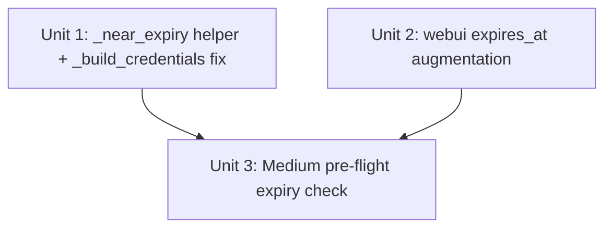

# feat: Proactive OAuth Pre-Flight Token Refresh

## Overview

Two adapter fixes that prevent mid-batch 401 failures caused by token expiry during a publish run.

**Blogger**: Change the credential validity check from a past-tense `creds.expired` gate to a 300-second lookahead — if the token expires within 5 minutes, refresh it before any API call is made, not after it fails.

**Medium**: When a Medium OAuth token is saved, augment it with an `expires_at` Unix timestamp derived from `expires_in`. On every publish call, check that field and raise an actionable `ExternalServiceError` before touching the API if the token is within 300 seconds of expiry.

## Problem Frame

`_build_credentials()` in `blogger_api.py` only refreshes when `creds.expired` is True — i.e., after expiry has already occurred. A batch of 20 articles at 60 s throttle each takes ~20 minutes; a token expiring at minute 5 causes articles 6–20 to fail with 401. The fix window is the 60 s `creds.expired` tolerance documented in google-auth, which becomes dangerous when the throttle makes batch runtime exceed token lifetime minus start-time slack.

Medium OAuth tokens (stored in `medium-token.json`) have no documented refresh mechanism in API v1. The correct response is early detection + a clear re-auth message, not a silent 401. (see origin: docs/brainstorms/2026-05-13-oauth-preflight-refresh-requirements.md)

## Requirements Trace

- R1. Extract `_near_expiry(creds, window_secs)` helper in `blogger_api.py`
- R2. Replace `creds.expired` condition in `_build_credentials()` with `_near_expiry(creds, 300)`
- R3. Pre-flight refresh failure falls through to full re-auth (existing behaviour preserved)
- R4. `settings_medium_oauth_callback()` augments saved token with `expires_at = time.time() + expires_in`
- R5. `MediumAPIAdapter.publish()` raises `ExternalServiceError` when `expires_at` present and within 300 s
- R6. Absent `expires_at` (integration token, pre-R4 OAuth token) → skip check, no error

## Scope Boundaries

- Medium token refresh (exchange for new access token) is out of scope — Medium API v1 has no documented refresh endpoint
- Webui `/api/token-status` badge showing time-to-expiry is deferred to V2
- No changes to CLI argument surface or `Config` dataclass

## Context & Research

### Relevant Code and Patterns

- `_build_credentials()` — `blogger_api.py`, lines 18–64. Current expiry check on line 33: `if creds and creds.expired and creds.refresh_token`.
- `MediumAPIAdapter.publish()` — `medium_api.py`, lines 46–207. Token load on lines 52–58. Existing `ExternalServiceError` pre-condition pattern on lines 98–106 (status code checks before consuming response body).
- `settings_medium_oauth_callback()` — `webui.py`, lines 3535–3603. `token_data = token_resp.json()` then `save_medium_token(token_data)` on line 3592 — no `expires_at` augmentation today.
- `save_medium_token` / `load_medium_token` — `config.py`. Write/read JSON file verbatim; no schema enforcement.
- Existing test patch target for blogger: `@patch("backlink_publisher.adapters.blogger_api._build_credentials")` — current tests mock the whole function; new tests for `_build_credentials` internals need to mock `creds` directly.
- Existing test patch target for medium token: `load_medium_token` is never mocked; all current medium tests use `config.medium_integration_token`. New tests need `@patch("backlink_publisher.adapters.medium_api.load_medium_token")` plus `@patch("backlink_publisher.adapters.medium_api.time.time")`.

### Institutional Learnings

- **Module-level `time` mock** (from `docs/solutions/test-failures/`): patch `backlink_publisher.adapters.medium_api.time.time`, not the stdlib `time.time` directly, to avoid affecting unrelated calls. Same pattern confirmed for retry tests using `backlink_publisher.adapters.retry.time.sleep`.
- **Pre-flight checks must fail fast**: avoid swallowing exceptions silently; raise `ExternalServiceError` with a specific re-auth message immediately on detection.

## Key Technical Decisions

- **`datetime.now(timezone.utc).replace(tzinfo=None)` for Blogger expiry comparison**: Google's `creds.expiry` is a naive UTC datetime; the comparison must also be naive to avoid `TypeError`. The entire codebase uses `datetime.now(timezone.utc)` (not the deprecated `datetime.utcnow()`), so we strip tzinfo with `.replace(tzinfo=None)` after acquiring the aware datetime. `datetime.utcnow()` was intentionally avoided — it raises `DeprecationWarning` in Python 3.12 and is planned for removal. `blogger_api.py` will need `from datetime import datetime, timezone` added.
- **`time.time()` for Medium expiry (adapter side)**: The pre-flight check in `medium_api.py` uses `time.time()` — mockable via `@patch("backlink_publisher.adapters.medium_api.time.time")`. The webui callback uses `datetime.now(timezone.utc).timestamp()` instead (webui has no `import time`; `datetime` is already imported). Both produce equivalent Unix timestamps; the choice is driven by what each file already imports.
- **Boundary semantics: `<= window_secs` (inclusive) for both adapters**: Blogger `_near_expiry` triggers when `remaining <= window_secs`; Medium triggers when `time.time() >= expires_at - window_secs` (mathematically equivalent to remaining ≤ 300). Both are inclusive at the 300 s boundary for consistency. The equivalent Blogger condition: `(expiry - now).total_seconds() <= window_secs`.
- **`expires_at = 0` sentinel treated as absent**: A zero or negative `expires_at` indicates a corrupt or sentinel value (some token stores use 0 to mean "unknown expiry"). Guard with `expires_at > 0` before the window comparison — fail-open for this edge case.
- **Fail-open on absent `expires_at`** (R6): Integration tokens have no expiry; old OAuth tokens saved before this change lack the field. Checking only when the field is present (and > 0) avoids false positives.
- **`blogger_api.py` needs one new import**: `from datetime import datetime, timezone`. The file currently imports neither.
- **300-second window**: Covers `~5 articles × 60 s throttle` comfortably. Chosen over 120 s (too narrow for Medium throttle setting) and 600 s (would refresh tokens that are still healthy for a full additional batch).

## Open Questions

### Resolved During Planning

- **`datetime.utcnow()` vs timezone-aware**: Use `datetime.utcnow()` to match google-auth's naive UTC datetime convention. No ambiguity risk within this comparison scope.
- **`expires_in` field absence**: Medium's token endpoint returns `expires_in` in standard OAuth 2.0 responses. If absent (non-standard or error), R4 skips augmentation gracefully via `if "expires_in" in token_data`.

### Deferred to Implementation

- **Exact `datetime` import placement** in `blogger_api.py`: confirm no name collision with existing imports before adding module-level `from datetime import datetime`.
- **Whether Medium's `expires_in` is consistently an `int`**: verify at implementation time; cast `int(token_data["expires_in"])` defensively.

## Implementation Units

---

- [ ] **Unit 1: `_near_expiry` helper and `_build_credentials` fix (Blogger)**

**Goal:** Replace the past-tense `creds.expired` gate with a 300-second lookahead; extract logic into a testable helper.

**Requirements:** R1, R2, R3

**Dependencies:** None

**Files:**
- Modify: `src/backlink_publisher/adapters/blogger_api.py`
- Test: `tests/test_adapter_blogger_api.py`

**Approach:**
- Add `from datetime import datetime` at module top.
- Add module-private helper `_near_expiry(creds, window_secs: int) -> bool`: returns `True` when `creds.expired` is True **or** when `creds.expiry` is a datetime and `(creds.expiry - datetime.now(timezone.utc).replace(tzinfo=None)).total_seconds() <= window_secs`. Returns `False` when `creds.expiry` is `None` (no expiry info → no proactive refresh needed). The boundary is inclusive (`<=`) to match Medium's semantics.
- In `_build_credentials()`, change condition from `if creds and creds.expired and creds.refresh_token` to `if creds and _near_expiry(creds, 300) and creds.refresh_token`. All downstream logic (call `creds.refresh(Request())`, save, return) is unchanged.
- R3 is preserved by existing fall-through: if `_near_expiry` returns True but refresh fails, the `except` clause sets `creds = None` and the function falls into the full re-auth flow.

**Patterns to follow:**
- Existing `_build_credentials` refresh/re-auth logic at `blogger_api.py:33–40`
- Module-private helper naming convention: leading underscore, same file

**Test scenarios:**
- Happy path — `creds.expiry` is 600 s in the future, `time` frozen: `_near_expiry(creds, 300)` returns `False`; `_build_credentials` returns creds without calling `refresh()`
- Near-expiry — `creds.expiry` is 200 s in the future, `refresh_token` present: `_near_expiry` returns `True`; `refresh()` is called; updated creds returned; `save_blogger_token` called once (verifies token is persisted, preventing re-refresh on next call)
- Expired (past datetime) — `creds.expiry` set to a datetime 30 s in the past: `_near_expiry` returns `True` via the arithmetic path (validates actual subtraction math, not just boolean mock)
- `creds.expired = True` (boolean-only mock without setting `expiry`) — `_near_expiry` returns `True` via the `creds.expired` short-circuit; covers the existing behaviour path
- No `refresh_token` — near-expiry but `creds.refresh_token` is `None`: `_near_expiry` returns `True` but condition short-circuits; falls through to re-auth (`InstalledAppFlow.run_local_server` called)
- `creds.expiry` is `None` — no expiry field: `_near_expiry` returns `False`; no premature refresh
- Boundary — exactly 300 s remaining: `_near_expiry` returns `True` (boundary is inclusive: `<= 300`)
- Just outside boundary — 301 s remaining: `_near_expiry` returns `False`
- Pre-flight refresh failure — `refresh()` raises `Exception`: existing `except` catches it, sets `creds = None`, `InstalledAppFlow.run_local_server` is called (verifies re-auth triggered, not stale creds used) (R3)

**Verification:**
- All existing `test_adapter_blogger_api.py` tests still pass (they patch `_build_credentials` wholesale)
- New `_near_expiry` unit tests cover all 5 input states above
- New `_build_credentials` integration-level tests mock `creds` object attributes and confirm `refresh()` call count

---

- [ ] **Unit 2: `expires_at` augmentation in webui OAuth callback (Medium)**

**Goal:** When saving a Medium OAuth token, compute and persist `expires_at` so the pre-flight check in Unit 3 has a reliable field to read.

**Requirements:** R4

**Dependencies:** None (Unit 3 reads `expires_at`; Unit 2 writes it — independent at file level)

**Files:**
- Modify: `webui.py` (function `settings_medium_oauth_callback`, around line 3591)

**Approach:**
- After `token_data = token_resp.json()`, before `save_medium_token(token_data)`:
  - If `"expires_in"` is present in `token_data` and `"expires_at"` is absent, compute `token_data["expires_at"] = int(datetime.now(timezone.utc).timestamp()) + int(token_data["expires_in"])`.
- This augmentation is in-place on the local dict before persistence — `save_medium_token` receives the enriched dict.
- `webui.py` imports `from datetime import datetime, timedelta` at line 17; `timezone` is not imported yet — add it to that import line (`from datetime import datetime, timedelta, timezone`). No `import time` needed.

**Test expectation: none** — webui has no test infrastructure; this is a 2-line addition to a callback with no existing test framework. Risk is low (additive, non-breaking, fail-open if `expires_in` absent).

**Verification:**
- Manual check: after OAuth callback, `~/.config/backlink-publisher/medium-token.json` contains `"expires_at"` key with a Unix timestamp approximately `time.time() + expires_in` seconds from the callback moment.

---

- [ ] **Unit 3: Medium pre-flight expiry check in `MediumAPIAdapter.publish()`**

**Goal:** Raise a clear `ExternalServiceError` before any Medium API call when the saved OAuth token is within 300 s of expiry.

**Requirements:** R5, R6

**Dependencies:** Unit 1 (independent at runtime; logical dependency on Unit 2 for the `expires_at` field to be present in newly-saved tokens)

**Files:**
- Modify: `src/backlink_publisher/adapters/medium_api.py`
- Test: `tests/test_adapter_medium_api.py`

**Approach:**
- `medium_api.py` already imports `time` at line 5.
- After the existing token resolution block (lines 52–62), add the pre-flight check:
  - If `medium_token_data` is not `None` and `"expires_at"` is in `medium_token_data`:
    - Let `expires_at = medium_token_data["expires_at"]`
    - If `expires_at > 0` and `time.time() >= expires_at - 300`:
      - Raise `ExternalServiceError("Medium OAuth token expires in < 5 minutes — re-authorize via Settings → Medium 授权")`
- The `expires_at > 0` guard rejects epoch-zero sentinels (some token stores emit 0 to mean "unknown") — treated as absent.
- This check fires before `t0 = time.monotonic()` and before any HTTP call.
- The check is entirely bypassed when `expires_at` is absent or `<= 0` — satisfying R6 fail-open.

**Patterns to follow:**
- Existing `ExternalServiceError` pre-condition pattern at `medium_api.py:98–106` (status code checks before consuming body)

All time-sensitive scenarios use `@patch("backlink_publisher.adapters.medium_api.time.time", return_value=<fixed_now>)` so boundary tests are deterministic.

**Test scenarios:**
- Happy path — `expires_at = now + 600` → no exception; publish proceeds; `requests.get` is called normally
- Near-expiry — `expires_at = now + 200` → `ExternalServiceError` raised with "re-authorize" message; no `requests.get` call made
- Exactly at boundary — `expires_at = now + 300` → `ExternalServiceError` raised (`now >= (now+300) - 300` → True, inclusive)
- Just outside boundary — `expires_at = now + 301` → no exception; publish proceeds
- Already expired — `expires_at = now - 30` → `ExternalServiceError` raised
- Sentinel zero (R6) — `expires_at = 0` → no exception; treated as absent (fail-open)
- Absent `expires_at` (R6) — `medium_token_data = {"access_token": "tok"}` → no exception; publish proceeds
- Integration token path (R6) — `medium_token_data = None`, token from `config.medium_integration_token` → no exception; publish proceeds

**Verification:**
- All existing `test_adapter_medium_api.py` tests still pass
- New tests confirm `ExternalServiceError` is raised (not `DependencyError`) with correct message when near-expiry
- New tests confirm no exception when `expires_at` absent or token is integration token

## System-Wide Impact

- **Interaction graph**: `_build_credentials()` is called exclusively from `BloggerAPIAdapter.publish()`; no other callers. `MediumAPIAdapter.publish()` is called from `adapters/__init__.py:publish()`. No callbacks or middleware affected.
- **Error propagation**: The pre-flight Medium error raises `ExternalServiceError`, which `publish_backlinks.py` already routes to `fail_count` (exit 4) with stderr output. No change to the outer error-handling contract.
- **State lifecycle risks**: Blogger token save (`save_blogger_token`) happens only on successful refresh — same path as today; no new write-on-failure risk. Medium `expires_at` augmentation is in-memory before save; if `save_medium_token` fails, the token file is unchanged (existing behaviour).
- **API surface parity**: `MediumBraveAdapter` and `MediumBrowserAdapter` do not use `medium-token.json`; they are unaffected by the expiry check. The check only fires for the OAuth/integration token path in `MediumAPIAdapter`.
- **Unchanged invariants**: The `DependencyError` / `ExternalServiceError` / `PipelineError` hierarchy is not changed. The Medium near-expiry raises `ExternalServiceError` (not `DependencyError`) because it is a recoverable external state, not a misconfiguration.

## Risks & Dependencies

| Risk | Mitigation |
|------|------------|
| `creds.expiry` is `None` for a valid token (some Google credentials omit expiry) | `_near_expiry` returns `False` when `creds.expiry is None` — no premature refresh |
| Medium `expires_in` absent from token response | R4 augmentation is guarded by `if "expires_in" in token_data` — no `KeyError` |
| Clock skew between token issue time and check time | 300-second window provides sufficient margin; skew of seconds is negligible |
| Concurrent batch processes both attempting token refresh simultaneously | `save_blogger_token` is not atomic, but Blogger batches are single-process CLI runs — race condition is not a realistic scenario |
| Pre-R4 Medium OAuth tokens (no `expires_at`) fail silently with 401 mid-batch | R6 fail-open: tokens without `expires_at` bypass the check entirely — same behaviour as today until re-authorized |

## Sources & References

- **Origin document:** [docs/brainstorms/2026-05-13-oauth-preflight-refresh-requirements.md](docs/brainstorms/2026-05-13-oauth-preflight-refresh-requirements.md)
- Related code: `src/backlink_publisher/adapters/blogger_api.py:18–64`, `medium_api.py:46–62`, `webui.py:3584–3592`
- Institutional learning: `docs/solutions/test-failures/ci-test-isolation-failures-medium-brave-sleep-timeout-2026-05-13.md` — module-level `time` mock pattern
