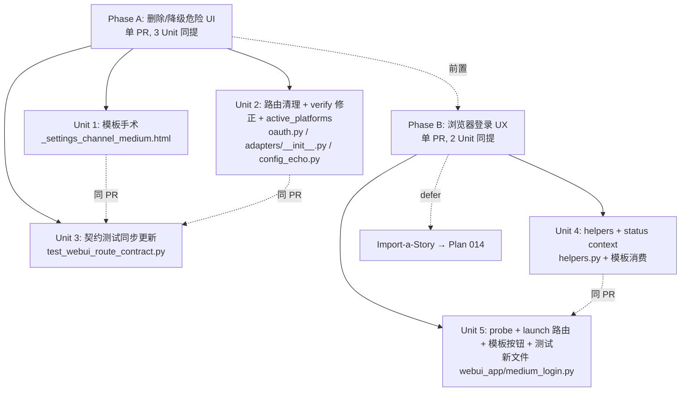

# Medium 渠道授权 UI 重构与浏览器 fallback 提升

## Overview

把 `/settings` 页面 Medium 渠道卡片从"装样子的 OAuth 表单 + 弱化的浏览器 fallback"换成"浏览器登录为推荐主路径、Integration Token 折叠为 legacy、OAuth 表单删除（保留存量清除入口）"。同时为浏览器 fallback 提供登录状态可见度与按需 probe。

底层 `MediumAPIAdapter / MediumBraveAdapter / MediumBrowserAdapter` 三个适配器的 publish 流程**不动**；dispatch 链的注册顺序与 tier-matrix (b) **不动**；config schema **不动**——本计划只是把 UI 与认知模型对齐到 2026 年 Medium 的真实状态。

**v1 范围决策（document-review Phase 5 user pick）**：`MediumImportAdapter`（POST 源 URL 到 `medium.com/p/import` 作为高保真补充路径）原 Unit 6 / Phase C 已**移出本计划**，留作 Plan 014——避免本计划同时承担"UI 修复"+ "新增半官方端点适配器"两个不同性质的任务；P0 Risk（silent content_html drop / schema OOG 张力）也随之消除。

## Problem Frame

用户报告 `/settings` 页"通过 Medium 授权"按钮无法点击。直接原因：表单里 `Client ID` / `Client Secret` 字段 `required`，HTML5 校验拦截了空提交。**根因**：

- Medium API repo 2023-03-02 已 archive；官方文档明示"no longer supported"
- OAuth 新应用注册关闭：`medium.com/me/apps` 对新开发者不开放（"We don't allow any new integrations with our API"）
- Integration Token 官方不再签发新 token；老账户 setting 偶尔仍可生成，但不文档化

后果是当前 UI 在引导用户去一个永远走不通的死路：填表 → 跳转 OAuth 授权 → 拿不到凭据。同时项目里已经实装的浏览器 fallback（`medium_browser.py` Playwright headed + `medium_brave.py` AppleScript+Brave）UI 仅以"将使用 Playwright 浏览器 fallback"一行 small text 提示，没有登录状态、没有引导登录入口、没有 macOS/非 macOS 差异提示。

Plan 011（commit `5e147ad`）刚把 settings 卡片化、抽到 partial，本次重构在那个新结构里继续做。

## Requirements Trace

- **R1.** 用户进入 `/settings` → Medium 卡片 → 应立刻看清楚"如何真正发布到 Medium"（浏览器登录一次）。**Unit 1** 承载。
- **R2.** 现有 OAuth 用户（`medium-token.json` 已存在）与 Integration Token 用户的配置**不丢**，仍可继续发布、仍可清除。**Unit 1 + Unit 2 + Unit 3** 共同保证。
- **R3.** UI 上传达 OAuth 新注册已被 Medium 关停、Integration Token 已停发的事实，不让用户继续浪费时间在死路上。**Unit 1** 承载（删除 OAuth 表单 + Integration Token `<details>` 文案）。
- **R4.** 浏览器 fallback 状态在 UI 上可见：`未安装 Playwright` / `浏览器配置未初始化` / `配置已就绪（未验证登录）` / `已登录` 四态。**Unit 4** 承载。
- **R5.** 用户可一键触发"打开浏览器手动登录一次"与"测试登录状态"。**Unit 5** 承载。
- **R6.** `tests/test_webui_route_contract.py` 契约网保持 green；Medium 相关单元测试（`tests/test_adapter_medium_browser.py` 等）保持 green。**Unit 3 + Unit 5** 测试场景覆盖。

## Scope Boundaries

- **不**引入 ChannelRegistry 抽象、不改 `detect_platform` unknown-domain 兜底（仍返回 `'medium'`）
- **不**修复 `save_config` 不持久化 `[medium.oauth]` 的 latent bug（独立 follow-up；不消耗 `writer.py` 当前仅 30 SLOC headroom）。**注**：`writer.py:224`（docstring）和 `writer.py:329`（注释）当前**虚假**声称保留 `[medium.oauth]` block——实际 `_SAVE_CONFIG_KNOWN_ROOTS` 包含 `medium` 致 `_preserve_unknown_sections` 丢弃此 block。本计划 Unit 1 切换到 `medium_token_file_exists` 单一真源是绕开此陷阱的应对；后续 follow-up plan 修 bug 时同步清掉这两处误导性注释
- **不**为 Medium 编写 cookie/session 反向 API（不 POST 到内部 GraphQL；只用官方 `/p/import` 端点）
- **不**接 Medium Partner Program API（与本问题无关）
- **不**变更 tier-matrix（`medium → "b"`）或 registry 注册顺序的语义
- **不**改 `medium_api.py` / `medium_browser.py` / `medium_brave.py` 三个 adapter 的 publish 内部逻辑
- **不**引入新前端框架（继续 Bootstrap 5 + 原生 JS）
- **不**新增反馈组件（继续用 flash `?flash_type=&flash_msg=#channel-medium` + Loading Overlay + `confirm()`）
- **不**引入运行时 LLM 路径（参 `docs/solutions/best-practices/no-runtime-llm-2026-05-15.md`）
- **不**默认在 `GET /settings` 时同步发起 Playwright probe（慢、且 Medium 反检测会消耗 session 信任）
- **不**为 `MediumBraveAdapter` 添加 `user_data_dir` 配置（Brave 控的是用户真实 Brave；超出本计划）
- **不**新增任何 `Config` 字段；现有 `medium_integration_token` / `medium_oauth` / `medium_user_data_dir` 全部保留
- **不**新增 `MediumImportAdapter` / `source_url`-input 适配器——原 Unit 6 / Phase C 推迟到独立 **Plan 014**；本计划专注 UI + 浏览器登录 UX
- **不**修改 `src/backlink_publisher/schema.py` 的 `OUTPUT_ONE_OF_GROUPS`（`content_markdown` / `content_html`）；如 Plan 014 要把 `source_url` 升格为第三种 content origin，由那个 plan 承担
- **不**广义化 `verify_adapter_setup` 到 macOS Brave（`MediumBraveAdapter.available()` 只检 `platform.system()`，不验 `/Applications/Brave Browser.app` 实际存在；`ExternalServiceError` 不 fallthrough——把 `has_brave` 算作 ready 会让 verify 通过但 publish 不可恢复地崩。Unit 2 详述）

## Context & Research

### Relevant Code and Patterns

**Adapter dispatch（registry.py:95-139, adapters/__init__.py:39-40）：**
```
register("medium", MediumAPIAdapter, MediumBraveAdapter, MediumBrowserAdapter)
```
DependencyError → fallthrough；ExternalServiceError → 立刻 raise；`MediumBraveAdapter.available()` 仅检查 `platform.system() == "Darwin"`。

**Adapter 选择信号：**
- `MediumAPIAdapter`（`medium_api.py:39-62`）：`load_medium_token()` 有 `access_token` OR `config.medium_integration_token` 非空时尝试，否则 `DependencyError` 跳过
- `MediumBraveAdapter`（`medium_brave.py:262-289`）：macOS-only；Brave 不在运行时 `DependencyError`
- `MediumBrowserAdapter`（`medium_browser.py:49-61`）：`sync_playwright is None` 时 `DependencyError`

**`verify_adapter_setup`（`adapters/__init__.py:54-82`）：** medium 分支当前只检查"integration_token 存在 OR Playwright 安装"。**遗漏 OAuth token 文件与 Brave 可用性**——本计划顺手修。

**Post-Plan-011 UI 结构：**
- `webui_app/templates/_settings_channel_medium.html`（82 LOC）：partial 文件已抽离
- `webui_app/templates/_settings_channel_blogger.html:1-10` 提供"已授权/未授权"badge 模板（`badge-status ok` / `badge-status err`），是状态徽章可仿的 pattern
- `webui_app/helpers.py:504-540` `_settings_context` 提供 `medium_token_set` / `medium_oauth_configured` / `medium_token_masked` 三个 flag
- Flash 模式：`?flash_type=&flash_msg=...#channel-medium`；`settings.html` 中的 `_openCollapseForHash()` DOMContentLoaded handler 负责定位锚点
- 现有 Medium POST 路由（**契约测试硬编码**）：
  - `/settings/medium/oauth-start`（`oauth.py:22-57`）——**Unit 2 删除**
  - `/settings/medium/oauth-callback`（`oauth.py:60-135`）——**Unit 2 删除**（无人能再发起，callback 永不触发）
  - `/settings/clear-medium-oauth`（`oauth.py:138-148`）——**保留**
  - `/settings/save-medium-token`（`settings_basic.py:95-103`）——**保留**
  - `/settings/clear-medium-token`（`settings_basic.py:106-112`）——**保留**

**契约测试（`tests/test_webui_route_contract.py`）：**
- 169-249 行 `test_settings_html_contract`：grep 模板字符串，含 10 个 form action URL（4 个 Medium URL）+ 9 个 DOM id（`mediumTokenInput`, `eyeIcon` 等）+ JS 句柄 `toggleToken(`
- 207-219 行：硬编码 URL 列表
- 286-312 行 `test_medium_forms_scoped_to_channel_panel`：BeautifulSoup 断言 Medium URL 表单全部位于 `#channel-medium` 内
- 820-864 行 `test_every_route_has_at_least_one_contract_test`：枚举 `url_map`，断言每条 URL 至少有一个 `client.get`/`client.post` 调用

**Playwright 测试 mock pattern（`tests/test_adapter_medium_browser.py`）：**
- patch target：`backlink_publisher.adapters.medium_browser.sync_playwright`（**compat shim 路径，不是 `publishing.adapters.*`**）
- `make_mock_pw(page_url=...)` 工厂，返回支持 `__enter__/__exit__` 的 MagicMock
- `mock_page.url = ".../m/signin?..."` 模拟登录失效
- `sync_playwright is None` 用 `mod.sync_playwright = None` 直接赋值模拟 import 失败

**Monolith budget（`monolith_budget.toml`）：** `src/backlink_publisher/config/writer.py` ceiling 340 / current 310 / headroom **30 SLOC**。本计划**不**触碰 `writer.py`（schema 不动）。其他 Medium 相关文件无 ceiling。

### Institutional Learnings

- **`docs/solutions/test-failures/ci-test-isolation-failures-medium-brave-sleep-timeout-2026-05-13.md`** —— adapter selection 测试必须 mock 全部三层（API/Brave/Browser），同时 mock `backlink_publisher.cli.publish_backlinks.time.sleep`；`pytest-timeout` 必须在 dev deps。**Unit 5 的测试设计直接遵从。**
- **`docs/solutions/test-failures/inverted-negative-assertion-enshrined-config-save-data-loss-2026-05-14.md`** —— 不要写 `assert "integration_token" not in rewritten` 类的负向断言"证明删除"，会 enshrine bug。**Unit 3 契约测试用正向断言**：保留的 URL 在列表里、删除的 URL 不在白名单 vs grep 整文件（两种不同的语义）。
- **`docs/solutions/test-failures/tests-coupled-to-operator-config-state-2026-05-18.md`** —— 测试必须用 `BACKLINK_PUBLISHER_CONFIG_DIR` 或 session-scope autouse `_isolate_user_dirs` 隔离。**Unit 5 新路由测试必须遵守。**
- **`docs/solutions/ui-bugs/webui-blocking-subprocess-and-missing-progress-feedback-2026-05-12.md`** —— 任何 >2s 的浏览器操作必须挂上 Loading Overlay 路由专属消息。**Unit 5 的 probe / launch 路由必须接 `MSGS` 字典。**
- **`docs/solutions/best-practices/no-runtime-llm-2026-05-15.md`** —— 不许在 publish/validate 路径 LLM 调用（本计划无 LLM 路径；留作通用提醒）。
- **`docs/solutions/best-practices/self-doc-sanitization-leak-recurrence-2026-05-15.md`** —— plan / brainstorm / solution 文件不能含真实 token literal。**本计划全文使用占位符。**
- **`docs/solutions/best-practices/document-review-catches-runtime-errors-at-plan-time-2026-05-14.md`** —— plan 落盘后 Phase 5.3.8 必跑 `document-review`。

### External References

- [Medium API archived repo](https://github.com/Medium/medium-api-docs) ——"The Medium API is no longer supported."
- [Medium Help: API/Importing](https://help.medium.com/hc/en-us/articles/213480228-API-Importing) ——"No new integrations" 官方声明
- [Medium Help: Importing a post](https://help.medium.com/hc/en-us/articles/214550207-Importing-a-post-to-Medium) —— Import-a-Story 用法（自动 canonical URL）

## Key Technical Decisions

- **OAuth 表单硬删除，保留"清除 OAuth"块**。Rationale：注册关停，表单注定填不上；存量用户 `medium-token.json` 仍可工作，但用户应能撤销。删除 `/oauth-start` 和 `/oauth-callback` 两个路由；保留 `/clear-medium-oauth`。
- **Integration Token 块降级为 `<details>` 折叠"高级/legacy"**。Rationale：部分老账户 settings 仍能生成 token；既有 token 用户继续工作；但不再作为推荐路径暴露在首屏。保留所有相关路由与 DOM id（`mediumTokenInput`/`eyeIcon`/`toggleToken(`）以维持契约测试 green。
- **浏览器 fallback 提升为推荐主路径**。Rationale：是唯一对所有新用户可用的方案；`medium_browser.py` + `medium_brave.py` 已实装；缺口仅在 UI 引导与状态可见度。
- **登录状态采用"静态文件系统态 + 按需 probe"二级显示**。Rationale：probe（navigate `medium.com/me`）开销 5-15s 且 Medium 反检测会消耗 session 信任；`GET /settings` 不该承担；按钮触发更可控。状态四态：`未安装 Playwright` / `浏览器配置未初始化` / `配置已就绪（未验证登录）` / `已登录`。
- **零 config schema 迁移**。Rationale：保留 `medium_integration_token` / `medium_oauth` / `medium_user_data_dir` 全部既有字段；不消耗 `writer.py` 30 SLOC headroom；OAuth/Token 老用户配置自然不丢；契约测试 DOM id 不动。
- **`verify_adapter_setup` 顺手修正**。Rationale：当前忽略 OAuth token file 和 Brave，导致 OAuth 用户在 macOS Brave 环境下被错判"未配置"。Unit 2 内 5-line 修正。
- **Import-a-Story 推迟到 Plan 014**。Rationale：POST `medium.com/p/import` 是半官方端点（无文档化）；scope-guardian + adversarial review 一致认为与"修复 OAuth 按钮"属于不同性质的任务；P0 Risk（silent content_html drop）随 Unit 6 切出而消除。Plan 014 独立 spike-first 设计。

## Open Questions

### Resolved During Planning

- **Q（用户）：OAuth UI hard-remove vs legacy 折叠？** A：表单 hard-remove；"已授权-清除"块条件渲染保留给存量用户。
- **Q（用户）：Integration Token 同上？** A：折叠为 `<details>` legacy，不删除（既有用户仍工作）。
- **Q（用户）：新增 Import-a-Story 适配器？** A：**推迟到 Plan 014**（document-review 第二轮 scope-guardian + adversarial 一致建议移出；P0 Risk 已消除）。
- **Q（用户）：登录状态如何呈现？** A：静态四态 + 按钮触发 probe，不在 GET 时自动跑。
- **Q（用户）：配置 schema 迁移？** A：零迁移，保留所有字段。
- **Q：`/settings/medium/oauth-callback` 是删还是 410 Gone？** A：删。注册关停后不可能有 in-flight OAuth 回调；契约测试同步删除该 URL。
- **Q (F7b)：Unit 1 "已授权-清除"按钮条件用 `medium_oauth_configured = bool(token_data AND cfg.medium_oauth)`？** A：**否**。改为 `medium_token_file_exists = bool(medium_token_data)`——`medium_oauth_configured` 的 AND `cfg.medium_oauth` 在任何 unrelated `save_config` 后会因 `_SAVE_CONFIG_KNOWN_ROOTS` 不持久化 `[medium.oauth]` 而 silently 变 False，导致按钮消失但 token 文件残留。文件存在是唯一稳定真源。
- **Q (F4)：`verify_adapter_setup` widening 包含 `has_brave`？** A：**否**。`MediumBraveAdapter.available()` 不检 Brave.app 真实安装，且 publish 抛 `ExternalServiceError` 不 fallthrough；把 has_brave 算 ready 会让 verify pass 但 publish 不可恢复崩。macOS 用户仍需 token / OAuth / Playwright 之一。
- **Q (F4)：CLI banner `active_platforms` 同步 widening？** A：**是**。Unit 2 同 PR 修 `config_echo.py:121-134`，否则 CLI 看 `platforms: (none)` 而 UI 看就绪，三方真源分裂。
- **Q (Unit 5)：登录信号选 `wait_for_url` 还是"等用户关窗"？** A：`wait_for_url(re.compile(r"https://medium\.com/(?!m/signin)"), timeout=180_000)`，与 Plan 012 velog 一致。`launch_persistent_context` 关窗会触发 `TargetClosedError` race，不可用。
- **Q (Unit 5)：跨进程并发锁机制？** A：`fcntl.flock` 旁挂锁文件 + 进程内 `threading.Lock` 双层，pattern 来自 `anchor/profile.py:13-22` 文档化 + Plan 012:482-499 实战。
- **Q (Unit 5)：`make_mock_pw` 抽到 `conftest.py` 共用？** A：**否**。codebase 无跨 test 文件 import 先例（`grep -rn "from tests\."` 零命中）；Unit 5 测试文件内联自己的近等价 factory。

### Deferred to Implementation

- 浏览器 probe 是否提取 `@username` 显示。实装时看 `medium.com/me` 重定向到 `/@<username>` 的 URL 是否好正则提取；不好就只显示"已登录"。
- macOS 上同时存在 Brave 与 Chromium profile 时，状态显示优先级（同时显示两栏 vs 智能选一栏）。实装 Unit 4 时观察哪种更可读。
- **Stale-lock 恢复策略**（Unit 5 锁文件）：TTL-based（如锁文件 mtime > 10 分钟即视为 stale 强抢）vs PID-liveness（`os.kill(pid, 0)` 探活）。实施期决定；前者实现简单，后者更精确但 Windows 不可移植——本项目目前 macOS+Linux only。
- **Probe cooldown 颗粒度**：60s 是 per-process 还是 per-user_data_dir？file-based persistence 实现最简，但需要确定锁定写入语义（单文件覆盖式写最简，多用户在同机器场景下尚未出现，YAGNI）。
- **`detect_platform` unknown→`'medium'` 默认是否需要调整**（F7a）：浏览器 fallback 主推后，misclassified URL 会被静默 publish 到 Medium。本计划范围外；建议 follow-up plan 把 unknown 默认改为 `None`/raise，或 pipeline UI 加"目标平台确认"checkbox。

## High-Level Technical Design

> *本图示意三 Phase 的 Unit 依赖关系，是评审用的方向性表达，不是实施约束；实施时一个 Phase 内的 Unit 通常作为单个原子 PR 落盘。*



## Implementation Units

### Phase A：删除/降级危险 UI（单 PR；Unit 1/2/3 同提）

- [ ] **Unit 1：Medium 设置 partial 模板手术**

**Goal：** 把 `_settings_channel_medium.html` 重新组织为"浏览器登录主推 + Integration Token 折叠 legacy + OAuth 表单删除（保留清除入口）"。

**Requirements：** R1, R2, R3

**Dependencies：** 无（依赖 Plan 011 已落盘的 partial 结构，已在 main）

**Files：**
- Modify: `webui_app/templates/_settings_channel_medium.html`
- Test: `tests/test_webui_route_contract.py`（断言更新放 Unit 3）

**Approach：**
- 区块 1（顶部，无折叠）："推荐路径：浏览器登录"——提示文案 + Unit 4 注入的 `medium_browser_status` 状态徽章占位（Unit 1 先用 `` 渲染兜底，不写死显示）
- 区块 2（条件渲染："存量 OAuth 授权 — 清除"按钮）：**条件改为 `medium_token_file_exists`（仅基于 `medium-token.json` 文件是否存在，单一真源）**，不再用 `medium_oauth_configured`（其 AND `cfg.medium_oauth` 会在任何 unrelated `save_config` 后丢失 `[medium.oauth]` block 时变 False，导致按钮消失但 token 文件残留——见 F7b）。`helpers.py` 同 PR 加 `medium_token_file_exists=bool(medium_token_data)` 字段；老的 `medium_oauth_configured` 字段保留但仅用于"曾经走完 OAuth 流程"的元信息，不再驱动 UI 渲染。**OAuth 表单整段删除**——`<form action="/settings/medium/oauth-start">` 及其 client_id/client_secret 输入移除
- 区块 3（`<details>` 折叠，summary 写"高级 / legacy：Integration Token（Medium 已停发新 token）"）：保留 Integration Token 输入框 + `toggleToken()` 眼睛切换 + 保存/清除按钮——与现有完全等价，只是包到 `<details>` 内默认折叠
- 区块 4（infobox，顶部位置）："为什么不能再用 OAuth 新申请？"`<details>`，summary 解释 Medium 关停 API 注册，链接到 [API/Importing 帮助文档](https://help.medium.com/hc/en-us/articles/213480228-API-Importing)
- DOM id `mediumTokenInput` / `eyeIcon` / JS 句柄 `toggleToken(` **全部保留**（契约测试硬编码）

**Patterns to follow：**
- Blogger partial `_settings_channel_blogger.html:1-10` 的 `badge-status ok` / `badge-status err` 样式
- Plan 011 settings.html 中的 `#channel-medium` 锚点 + flash 模式
- 既有 `confirm()` + 表单原生提交，不引入 JS 异步

**Test scenarios：**
- *Test expectation：* Unit 1 本身仅模板调整，断言全部在 Unit 3 契约测试里集中更新。无新增独立测试文件。
- 手动验证：渲染 `/settings` 页面 → Medium 卡片头部展示双 badge（保留）、首屏展示浏览器登录推荐区块、Integration Token 折叠不展开、当 `medium_oauth_configured=True` 时清除按钮可见。

**Verification：**
- `/settings` 模板渲染无报错，无 `medium.com/me/apps` 字符串残留（grep 通过）
- `_settings_channel_medium.html` 行数预计降至 60-80 行（当前 82 行；删 OAuth 表单减约 25 行，新增浏览器状态占位+infobox 约加 15 行）

---

- [ ] **Unit 2：路由清理 + `verify_adapter_setup` 修正**

**Goal：** 删除 `/settings/medium/oauth-start` 与 `/settings/medium/oauth-callback`；修正 `verify_adapter_setup` 让 OAuth-only 用户与 macOS-Brave-only 用户不再被误判"未配置"。

**Requirements：** R2, R3, R6

**Dependencies：** 无（与 Unit 1 同 PR 提交，但代码上互不阻塞）

**Files：**
- Modify: `webui_app/routes/oauth.py`（删除 Medium 部分；Blogger OAuth 部分保留）
- Modify: `src/backlink_publisher/publishing/adapters/__init__.py`（修正 `verify_adapter_setup` medium 分支）
- Modify: `src/backlink_publisher/config_echo.py`（同步 widening `active_platforms` 接受 OAuth token file + Playwright；与 verify_adapter_setup 真值一致，避免 CLI banner 与 UI badge 三方分裂）
- Test: `tests/test_webui_route_contract.py`（Unit 3）+ `tests/test_adapter_dispatcher.py`（如已有 verify_adapter_setup 覆盖）+ `tests/test_config_echo.py`（如已存在，加 active_platforms widening 断言；否则不强制新建）

**Approach：**
- `oauth.py` 中移除 `settings_medium_oauth_start` 与 `settings_medium_oauth_callback` 两个路由函数（含 session 状态、token exchange 逻辑）；保留 `settings_clear_medium_oauth`；保留所有 Blogger 路由
- 检查 `oauth.py` 顶部 import / `bp = Blueprint("oauth", __name__)` 注册是否仍需要——大概率仍需要因为 Blogger 还在用
- `verify_adapter_setup` medium 分支当前逻辑（伪代码）：
  ```
  if name == "medium":
      if not config.medium_integration_token and sync_playwright is None:
          raise DependencyError(...)
  ```
  改为：
  ```
  if name == "medium":
      has_token = bool(config.medium_integration_token)
      has_oauth = bool(load_medium_token())  # 读 medium-token.json
      has_playwright = sync_playwright is not None
      # 注意：has_brave 故意不算入 ready 集合——MediumBraveAdapter.available()
      # 只检 platform.system()，不验证 Brave.app 真实存在，且 publish 阶段
      # AppleScript 失败抛 ExternalServiceError 不 fallthrough（registry.py
      # 128-132 契约）。把 has_brave 算 ready 会让 macOS+无 Brave 用户在
      # verify 通过后 publish 不可恢复崩。等同步修 MediumBraveAdapter.available()
      # 真实检 Brave.app 之前，本分支不引入 has_brave。
      if not (has_token or has_oauth or has_playwright):
          raise DependencyError(
              "Medium 渠道未配置可用 token / OAuth / Playwright（macOS 用户："
              "Brave 自动检测不属于 verify 集合；请安装 Playwright 或设置 token）"
          )
  ```
- 也**同步更新** `src/backlink_publisher/config_echo.py:121-134` `active_platforms(config)`：
  - 当前仅在 `config.medium_integration_token OR config.medium_oauth` 时把 medium 列入 active
  - 修正为同样接受 `load_medium_token()` 与 Playwright 可用——避免 CLI banner `platforms:` 与 UI badge 形成三方真源分裂（F4 详述）
- `oauth.py` 删除两个函数后，import `requests`、`secrets`、`urlencode` 等是否仍被 Blogger 用到——按需收敛

**Patterns to follow：**
- Blogger OAuth 现有结构（同文件内）
- `MediumAPIAdapter.publish` 的 token 加载顺序（`load_medium_token` 先于 `config.medium_integration_token`）

**Test scenarios：**
- *Happy path：* `verify_adapter_setup("medium", config)` 在以下任一条件下不抛：(a) 仅 `medium_integration_token` 设置；(b) 仅 `medium-token.json` 存在（mock `load_medium_token`）；(c) 仅 Playwright 安装
- *Edge case (反向)：* 仅 macOS 但无 token / 无 OAuth / 无 Playwright → **应该** raise `DependencyError`（断言 has_brave 不入 ready 集；防止有人后续把它加回去）
- *Error path：* `verify_adapter_setup("medium", config)` 在前三项全部缺失时 raise `DependencyError`，错误消息明示"Brave 自动检测不属于 verify 集合"
- *Edge case：* 路由删除后，`POST /settings/medium/oauth-start` 返回 404（Flask 默认），不返回 500
- *Happy path (active_platforms 同步)：* `active_platforms(config)` 在 `load_medium_token()` 返回有效 token OR `sync_playwright is not None` 时把 `medium` 列入 active；断言 CLI banner 与 verify_adapter_setup 真值一致
- *Integration：* 现有 `MediumAPIAdapter` / `MediumBraveAdapter` / `MediumBrowserAdapter` 的 `publish` 行为不受 verify 修正影响——dispatch 链按既有顺序工作

**Verification：**
- `grep -r "oauth-start\|oauth-callback" webui_app/` 仅在 Blogger 路由匹配
- `pytest tests/test_adapter_dispatcher.py tests/test_adapter_medium_*.py -x` 通过

---

- [ ] **Unit 3：契约测试同步更新**

**Goal：** 让 `tests/test_webui_route_contract.py` 反映 Unit 1 + Unit 2 的删改。这是 Phase A 的安全网；不更新则 CI 直接红。

**Requirements：** R6（契约 green）

**Dependencies：** Unit 1, Unit 2（必须同 PR）

**Files：**
- Modify: `tests/test_webui_route_contract.py`

**Approach：**
- 删除硬编码 URL 列表（约 207-219 行）中的 `/settings/medium/oauth-start` 和 `/settings/medium/oauth-callback`；保留 `/settings/clear-medium-oauth`、`/settings/save-medium-token`、`/settings/clear-medium-token`
- `test_medium_forms_scoped_to_channel_panel`（286-312 行）：URL 列表同步缩减为 3 个
- `test_settings_html_contract`（169-249 行）：DOM id / JS 句柄列表保持不变（`mediumTokenInput` / `eyeIcon` / `toggleToken(` 仍存在）；如果该测试断言"OAuth client_id input 存在"则删除该断言
- `test_every_route_has_at_least_one_contract_test`（820-864 行）会自动收敛——它枚举 `url_map`，删除的路由不再在表中

**Patterns to follow：**
- Plan 011 落盘后的契约测试当前形态（最新 main commit `5e147ad`）
- **正向断言**：测"应存在的 URL 在 form action 列表里"；不写 `assert "/oauth-start" not in ...`（institutional learning：负向断言会 enshrine bug）

**Test scenarios：**
- *Self-test：* 运行 `pytest tests/test_webui_route_contract.py -v` 在 Unit 1+2 已合并的工作树上：全部 green，没有遗漏的 URL 引用
- *Regression：* 主动注释 Unit 1 中"删除 OAuth 表单"那段（局部 revert），运行 test → 应红 → 撤销 revert → 应绿。说明测试有真实约束力，没空跑

**Verification：**
- `pytest tests/test_webui_route_contract.py` 全绿
- `pytest tests/ -x` 全绿（确认 Phase A 改动没有副作用）

---

### Phase B：浏览器登录 UX（单 PR；Unit 4/5 同提）

- [ ] **Unit 4：`helpers.py` 添加 `medium_browser_status` 上下文**

**Goal：** 让模板能拿到"浏览器 fallback 当前状态"的结构化数据，分四态显示。

**Requirements：** R4

**Dependencies：** Unit 1（模板已经为状态徽章占位）

**Files：**
- Modify: `webui_app/helpers.py`（新增函数 + 扩 `_settings_context`）
- Modify: `webui_app/templates/_settings_channel_medium.html`（消费新字段）
- Test: `tests/test_webui_helpers_medium_status.py`（新建）

**Approach：**
- 新增 `_get_medium_browser_status(cfg) -> dict`，返回：
  ```
  {
      "playwright_installed": bool,    # 通过 try-import 探测
      "brave_macos": bool,             # platform.system() == "Darwin"
      "profile_dir": str | None,       # config.medium_user_data_dir 或默认路径
      "profile_has_cookies": bool,     # (profile_dir / "Default" / "Cookies") 存在
      "cookies_mtime": str | None,     # Cookies SQLite 最近修改时间 ISO 字符串（None 表示文件不存在）
      "singleton_lock_present": bool,  # (profile_dir / "SingletonLock") 存在——可能 Chromium 实例在运行（hint，非真值）
      "state": "not_installed" | "no_profile" | "profile_exists_unverified" | "logged_in",
  }
  ```
- **关键设计：profile-existence 信号用 Chromium-specific artifact，不用 `os.listdir()` 长度**——`medium_browser.py:67-70` 在 publish 失败前就会 `mkdir(parents=True, exist_ok=True)`，导致目录非空但从未登录；只查 `Default/Cookies` 才能正确区分 "Chromium 曾跑过 + 写过 cookie" 与 "目录被 mkdir 占位但 Chromium 从未启动"
- `state` 推导规则（**纯文件系统态，不发起任何浏览器调用、不解密 cookies**）：
  - `not playwright_installed and not brave_macos` → `not_installed`
  - 不满足上但 `not profile_has_cookies` → `no_profile`
  - 满足前两项 → `profile_exists_unverified`（只有 Unit 5 probe 成功后才进 `logged_in`，且 `logged_in` 仅在 `flask.session` 内缓存，进程重启失效）
  - `cookies_mtime` 超过 30 天 → 仍标 `profile_exists_unverified`，但 UI 渲染时附加"(陈旧，最后活动 N 天前)"caption
- `singleton_lock_present` 是 hint 字段：UI 渲染时**不**用它推导 `logged_in`（crashed Chromium 会留 stale SingletonLock），仅在"打开浏览器登录"按钮旁渲染 "⚠ 检测到可能有 Chromium 实例在运行"提醒
- **绝不**尝试解密 Cookies SQLite——macOS 走 keychain、Linux 走 `Local State`，是 Unit 5 真实 probe（让 Chromium 自己解密）的范围
- `_settings_context` 注入 `medium_browser_status=_get_medium_browser_status(cfg)`
- 模板消费：在 Unit 1 留的"推荐路径"区块上方渲染状态徽章（`badge-status ok/warn/err` 与 Blogger 一致）

**Patterns to follow：**
- `_get_blogger_token_status` 的 dict 形态（`helpers.py:90-126`）——本计划不复用 OAuth expiry 字段（浏览器 fallback 没有 expiry 概念），但 dict 风格相同
- Blogger badge 渲染模式（`_settings_channel_blogger.html:1-10`）

**Test scenarios：**
- *Happy path：* `_get_medium_browser_status` 在 (a) Playwright 安装 + `Default/Cookies` 存在 → `profile_exists_unverified`；(b) Playwright 安装 + `Default/Cookies` 不存在 → `no_profile`
- *Edge case：* profile_dir 被 mkdir 占位但**无 `Default/Cookies`**（模拟 publish 失败后的状态）→ `no_profile`（验证不会用 `os.listdir` 误判）
- *Edge case：* `config.medium_user_data_dir` 为 None → 走默认 `config_dir / "chrome-profile-default"`
- *Edge case：* `Default/Cookies` 存在且 mtime > 30 天前 → `state == "profile_exists_unverified"`，dict 含"stale"标志或 caption hint
- *Edge case：* `SingletonLock` 存在 → `singleton_lock_present=True` 但 `state` 不变（不被推导为 `logged_in`）
- *Error path：* `sync_playwright is None` 且 macOS → `state == "no_profile"`（Brave 路径仍可用），不 raise
- *Error path：* `sync_playwright is None` 且非 macOS → `state == "not_installed"`
- *Integration：* `GET /settings` 渲染模板时 `medium_browser_status` 正确注入；契约测试 `test_settings_html_contract` 新增 4 态徽章 grep 断言
- *Integration (硬约束)：* `_get_medium_browser_status` **不调用任何 subprocess / Playwright / 网络**（mock 验证：`subprocess.run` 调用次数 == 0；`sync_playwright()` 调用次数 == 0；可加 `pytest-socket` 断言无 socket）

**Verification：**
- 新建测试文件全绿
- `_settings_context` 返回 dict 包含 `medium_browser_status` key

---

- [ ] **Unit 5：登录 probe + launch 路由 + 模板按钮**

**Goal：** 提供两个新的 POST 路由——"打开浏览器手动登录一次"与"测试登录状态"——并在 Medium partial 加按钮调用。

**Requirements：** R4, R5

**Dependencies：** Unit 4（共享 `medium_browser_status` 上下文）

**Files：**
- Create: `webui_app/medium_login.py`（probe / launch 两个函数）
- Create: `webui_app/routes/medium_login.py`（三个 POST 路由：launch-browser-login / probe-browser-login / clear-browser-login + blueprint 注册）
- Modify: `webui_app/__init__.py` 或 `webui_app/routes/__init__.py`（注册新 blueprint）
- Modify: `webui_app/templates/_settings_channel_medium.html`（增加两个按钮）
- Modify: `webui_app/templates/settings.html`（如有 Loading Overlay JS `MSGS` dict，注入两条新消息）
- Test: `tests/test_medium_login_routes.py`（新建）
- Test: `tests/test_webui_route_contract.py`（同 PR 更新；3 个保留 URL → 6 个：加 `/settings/medium/launch-browser-login`、`/settings/medium/probe-browser-login`、`/settings/medium/clear-browser-login`）

**Approach：**

*跨进程并发锁（采纳 Plan 012 velog 已定型 pattern）*：

- 新增 `webui_app/medium_login.py` 顶部模块级 `_LOCK_PATH = config.config_dir / "medium-browser.lock"`；用 `fcntl.flock(fd, LOCK_EX | LOCK_NB)` 旁挂锁文件。Pattern 已在 `src/backlink_publisher/anchor/profile.py:13-22` 文档化、Plan 012 `docs/plans/2026-05-18-012-feat-velog-adapter-plan.md:482-499` 实战采纳——本计划继承
- 同时模块级 `_thread_lock = threading.Lock()` 处理 Flask thread-worker 内 race（gunicorn `--threads` 模式下 `fcntl.flock` per-fd 不足以序列化同进程双线程，参 `anchor/profile.py:13-22` 文档化的 layering 规则）
- 锁获取顺序：`_thread_lock` → `fcntl.flock LOCK_NB`；UI 侧用 5-10s wall-clock cap（**不**走 Plan 012 的 60s——UI 用户不能久等），失败 raise `ExternalServiceError("Medium 浏览器会话已在使用中（CLI publish 或另一 UI 操作）；请稍后重试")`，路由层转 flash danger
- 锁文件写入持有者 PID（`fd.write(str(os.getpid()))`）；后续 stale-lock 处理见 Open Question deferred
- `MediumBrowserAdapter.publish` 也必须使用同一锁文件——**Unit 5 实施时同 PR 给 `medium_browser.py` 也接入锁**（不放 Phase A 是因为它的核心是 UI 删除，锁是配套 Phase B）
- 注意：`MediumBraveAdapter` 走 AppleScript 控的是用户真实 Brave，**不**使用 `user_data_dir`，**不**需要本锁——锁文件路径含 "browser" 关键字与 Brave 分离

*函数实现*：

- `webui_app/medium_login.py`：
  - `launch_login_window(config) -> dict`：在持有锁的前提下调 Playwright 持久 context（`headless=False`，沿用 `medium_browser.py:83-87` 的 launch args），`page.goto("https://medium.com/m/signin")`，然后调用 **`page.wait_for_url(re.compile(r"https://medium\.com/(?!m/signin)"), timeout=180_000)`** 等用户在浏览器里登完——Plan 012 velog 已确立此 signal pattern（`docs/plans/2026-05-18-012-feat-velog-adapter-plan.md:250-252, 398`），不用"等用户关窗"（`launch_persistent_context` 关窗会触发 `TargetClosedError` race）。返回 `{"opened": True, "logged_in": True, "duration_seconds": N}`。Timeout 180s（Medium 邮件 2FA 可能 60s+，仍较 velog 社交登录短）；超时 raise `ExternalServiceError("Medium 登录超时（180s）；若启用了 email 验证码或 2FA 请尽快完成，否则请重试")`。`sync_playwright is None` 时 raise `DependencyError`
  - `probe_login_status(config, timeout=15) -> dict`：在持有锁的前提下调 Playwright 持久 context（仍 headed 以保 session 信任），`page.goto("https://medium.com/me", timeout=timeout*1000)`，读 `page.url`。返回 `{"logged_in": "/m/signin" not in page.url, "final_url": page.url, "username": <从 final URL 正则提取，可能为 None>}`
  - 两个函数都 try-finally 关闭 context、释放锁；都不 swallow exception（`PlaywrightTimeoutError` → `ExternalServiceError` 由路由层捕获）

*Probe 冷却（采纳 F2 建议，与 publish-batch throttle 不可缺一致）*：

- `probe_login_status` 在入口先检查 `config.cache_dir / "medium-probe-cooldown.json"`（与项目 `_cache_dir()` 约定一致，保证测试隔离——测试通过 `BACKLINK_PUBLISHER_CACHE_DIR` env var 重定向；写入上次成功 probe 的 unix ts），冷却窗口 60s（与 `MEDIUM_THROTTLE_MIN` 一致），未到 raise `ExternalServiceError("Medium probe 60s 内已执行；请稍候再试以避免触发反检测")`，路由转 flash warning
- `launch_login_window` 不受冷却限制（用户主动行为，已显式按钮）

*路由*：

- `webui_app/routes/medium_login.py`：
  - `POST /settings/medium/launch-browser-login`：调用 `launch_login_window`；成功 → flash success + redirect `/settings#channel-medium`；`DependencyError` → flash warning（"未安装 Playwright"）；`ExternalServiceError` → flash danger
  - `POST /settings/medium/probe-browser-login`：调用 `probe_login_status`；成功 → flash info 显示 `logged_in` 结果，同 PR 在 `flask.session["medium_probe_logged_in"]` 缓存（Unit 4 状态字段在下次 GET 时升级 `state` 为 `logged_in`）；其他 → 同上
  - `POST /settings/medium/clear-browser-login`：`confirm()` 确认对话 → `shutil.rmtree(user_data_dir, ignore_errors=True)` → flash success "浏览器登录已清除；下次发布前请重新登录" + redirect（SEC-004 mitigation）

*模板按钮*：

- "🌐 打开浏览器登录"按钮 → POST `/launch-browser-login`
- "🔍 测试登录状态"按钮 → POST `/probe-browser-login`
- 仅当 `medium_browser_status.state != "not_installed"` 时渲染

*Loading Overlay `MSGS`*：

- `'POST /settings/medium/launch-browser-login': '正在打开浏览器，请在弹出窗口中完成登录（含可能的 email 验证码 / 2FA），完成后页面会自动跳转回设置页…'`
- `'POST /settings/medium/probe-browser-login': '正在探测 Medium 登录状态（约 5-15 秒）…'`

**Execution note：** 浏览器 fallback 是 macOS + Linux + Windows 通用代码路径（Brave 仅 macOS）。Probe / launch 函数面向 Playwright，不调 AppleScript；macOS 用户即使倾向用 Brave 发布，状态 probe 仍走 Chromium persistent profile（与发布通道独立，避免 probe 占用 Brave 用户的真实浏览器会话）。

**Patterns to follow：**
- `medium_browser.py:80-114` 的 Playwright 持久 context 初始化模板
- `webui_app/routes/oauth.py` Blogger OAuth start 路由的 flash + redirect 风格
- 路由文件结构（一个 blueprint per file，`bp = Blueprint("medium_login", __name__)`）
- Loading Overlay JS 模式（参 `webui-blocking-subprocess-and-missing-progress-feedback-2026-05-12` solution）
- 锁层 layering（`anchor/profile.py:13-22` 文档化 + Plan 012:482-499 实战）：`threading.Lock` 内 + `fcntl.flock` 外
- `wait_for_url(regex, timeout)` signal 形态（Plan 012:250-252）——而非"等用户关窗"
- 测试 mock factory **不抽到 conftest**——`tests/test_adapter_medium_browser.py:23-42` `make_mock_pw` 是 module-private 的既有约定；本计划测试文件应内联自己的近等价 factory（专门暴露 `context.close` 断言点）；`grep -rn "from tests\." tests/` 零命中——codebase 无跨测试文件 import 先例

**Test scenarios：**
- *Happy path：* `probe_login_status` mock `sync_playwright`，page.url = `https://medium.com/@testuser` → 返回 `{"logged_in": True, "username": "testuser"}`
- *Happy path：* `probe_login_status` mock page.url = `https://medium.com/m/signin?...` → 返回 `{"logged_in": False, "username": None}`
- *Happy path：* `launch_login_window` mock，断言 `chromium.launch_persistent_context` 被调一次、`page.goto("https://medium.com/m/signin", ...)` 被调一次、context 被关闭一次
- *Error path：* `sync_playwright is None` 时 probe/launch 函数 raise `DependencyError`，路由层捕获后 flash warning + redirect
- *Error path：* `page.goto` 抛 `PlaywrightTimeoutError` → 函数 raise `ExternalServiceError("Medium probe timed out: 15s exceeded")`，路由 flash danger
- *Edge case：* `probe_login_status` 默认 timeout 15s 被覆盖（参数化测试 5s/30s）
- *Edge case：* `launch_login_window` 在用户从未关窗的场景下（mock context 不退出）→ 测试用 timeout 限制本身的耗时；生产环境用户责任
- *Integration：* POST `/settings/medium/probe-browser-login` → redirect 302 to `/settings?flash_type=...&flash_msg=...#channel-medium`
- *Integration：* 契约测试 `test_every_route_has_at_least_one_contract_test` 新路由各至少一个 `client.post` 调用覆盖
- *Test isolation：* `webui_app/medium_login.py` import `from playwright.sync_api import sync_playwright` 在模块顶层；**测试 patch target 是 `webui_app.medium_login.sync_playwright`**——consumer-reference 规则（参 `docs/solutions/test-failures/ci-test-isolation-failures-medium-brave-sleep-timeout-2026-05-13.md`）
- *No real subprocess / no real Playwright：* 顶层 conftest 已禁用 sockets；本测试文件内联自己的 mock factory（**不 import** `tests.test_adapter_medium_browser.make_mock_pw`——codebase 无跨测试 import 先例）
- *Lock 并发：* 用 `multiprocessing.Process` 起一个持锁子进程，主进程 `probe_login_status` 应在 5-10s 后 raise `ExternalServiceError`，并断言锁文件 PID 字段是子进程 PID
- *Lock 释放：* `launch_login_window` 抛 `ExternalServiceError` 时 finally 块仍释放锁，下一次调用应能立刻拿到
- *Probe cooldown：* 写入 cooldown 文件 `now()`，立即再 probe 应 raise `ExternalServiceError("60s 内")`；伪造 cooldown 为 61s 前应放行

**Verification：**
- 两个新路由能 grep 到 `client.post(...)` 在契约测试里
- `pytest tests/test_medium_login_routes.py tests/test_webui_route_contract.py` 全绿
- 手动验证（dev 机器）：点"打开浏览器登录" → Chromium 弹出 → 关窗 → flash success；点"测试登录状态" → 弹窗 → 自动关闭 → flash info

---

## System-Wide Impact

- **Interaction graph：** `adapters/__init__.py:39-40` 的 `register("medium", MediumAPIAdapter, MediumBraveAdapter, MediumBrowserAdapter)` 是 Medium 适配器链的单一注册点；本计划不变更注册顺序。`registry.py:95-139` dispatch 行为不变。
- **Truth-source boundary（"Medium 是否就绪？"的多读者）**：本计划修两个 reader、留一个 reader、修一个 UI flag。**实施 Unit 2 + Unit 1 时必须同 PR 改完**，否则三方分裂：
  - `verify_adapter_setup`（`adapters/__init__.py:54-82`）——Unit 2 widening 接入 OAuth token file 与 Playwright；**不**接 Brave（见 F4）
  - `active_platforms`（`config_echo.py:121-134`）——Unit 2 同 PR widening；否则 CLI banner `platforms:` 不显示 medium，与 UI badge"已就绪"形成认知冲突
  - `medium_oauth_configured`（`helpers.py:527`）——保留但**不再驱动 UI 渲染**；Unit 1 改用 `medium_token_file_exists` 作单一真源（避免 F7b 的 AND 竞态）
- **Error propagation：**
  - `DependencyError` from 适配器 → 链 fallthrough；`ExternalServiceError` → 立即 raise 不 fallthrough（保留现有语义）
  - Unit 5 的 probe/launch 路由必须把 `DependencyError`（Playwright 未装）转 flash warning、`ExternalServiceError`（Medium 反检测、超时、锁占用、cooldown 未到）转 flash danger
- **State lifecycle risks：**
  - `medium_user_data_dir` Chromium profile 在三个入口创建：(1) `MediumBrowserAdapter.publish`（既有，Unit 5 同 PR 接入锁）、(2) Unit 5 `launch_login_window`、(3) Unit 5 `probe_login_status`。**共享 profile**——并发写冲突会让 Chromium 报 `ProcessSingletonLock` 异常。**必须**用 `fcntl.flock` 旁挂锁文件（pattern: `anchor/profile.py:13-22` doctrine + Plan 012:482-499 实战）；**仅 `threading.Lock` 在跨进程时无效**（CLI 与 Flask 不共享内存）；UI 端 5-10s fail-fast、CLI 端 30s 等候
  - Chromium 自带 `SingletonLock` 文件在 crash 后会残留——`fcntl.flock` 的锁文件**也要**记录 PID 以便后续做 stale-lock 检测（详见 Open Question）
  - OAuth 用户的 `medium-token.json` 在 OAuth 路由删除后变成"无入口创建"但保留可读；UI"清除 OAuth"按钮基于 `medium_token_file_exists`（单一文件存在）渲染——避免 F7b 的"任何 unrelated save_config 丢 `[medium.oauth]` block → 按钮消失 → token 残留"陷阱
- **API surface parity：** CLI `publish_backlinks` 走同一 `registry.dispatch`；**publish 行为不变**；**observability 不对称扩大**——UI 获得 4 态 badge + probe + launch 路由，CLI 仍只能从 adapter 内部 log 反推哪个 adapter 被选中。后续可在 `registry.dispatch` 加 `recon("adapter_selected", platform=..., adapter=...)` event（参 `_util/logger.py:121-140` + `plan_backlinks.py:1452` 既有 RECON 调用）——本计划范围外、follow-up
- **Integration coverage：** `tests/test_webui_route_contract.py` 是端到端契约网（URL × DOM × JS handler）。Unit 3 + Unit 5 必须各自更新对应断言。
- **Unchanged invariants：**
  - `Config` 字段集合（`medium_integration_token` / `medium_oauth` / `medium_user_data_dir` / `medium_token_path`）零增减
  - `save_config` known roots 不变（`writer.py` 不动；`[medium.oauth]` 持久化 latent bug deferred）
  - `content_negotiation.ROUTE_TIER_MATRIX["medium"]` 保持 `"b"`（不变）
  - `schema.OUTPUT_ONE_OF_GROUPS` 不变（`source_url` 适配器已移出本计划）
  - `detect_platform` unknown 兜底返回 `"medium"` 不变——但本计划下浏览器 fallback 变主推，这个默认就从"fail-loud"语义滑向了"silent publish to wrong target"。**新增 Open Question (Deferred)**
  - Blogger 渠道所有逻辑不动
  - `medium_api.py` / `medium_browser.py` / `medium_brave.py` 三个 adapter 的 `publish` 内部逻辑零修改（`medium_browser.py` 仅在 Unit 5 同 PR 接入共享锁，不改 publish 步骤）
  - `MediumBraveAdapter.available()` 内部行为不变（**仍只检 platform，不检 Brave.app**）——但 Unit 2 的 verify widening **不**算入 has_brave，避免 F4 的"verify pass + publish 不可恢复崩"陷阱

## Risks & Dependencies

| Risk | Mitigation |
|---|---|
| Unit 1/2 删 OAuth 路由 → 契约测试红 → CI 失败 | Unit 3 同 PR 提交，主动同步契约表；**绝不**用 `--no-verify` 跳过 pre-push hooks |
| 存量 OAuth 用户的 `medium-token.json` 在新 UI 下被错认为孤儿 | Unit 1 保留"已授权-清除"块，**条件改为 `medium_token_file_exists`**（仅基于 token 文件存在；不再 AND `cfg.medium_oauth`），让用户主动撤销不被 save_config 副作用干掉 |
| Playwright probe（Unit 5）触发 Medium 反检测 → 消耗 session 信任 | 全部 probe 沿用 `headless=False` + `--disable-blink-features=AutomationControlled`（已在 medium_browser.py 中验证可用）；不在 GET 时自动发起；按钮触发后用户可控 |
| **[F1, P0]** Chromium `user_data_dir` 跨进程并发（CLI publish + UI probe + UI launch）→ Chromium `ProcessSingletonLock` 异常 | Unit 5 实施 `fcntl.flock` 旁挂锁文件 `<config_dir>/medium-browser.lock`（**不**仅 `threading.Lock`；跨进程 layering doctrine 见 `anchor/profile.py:13-22`）；锁文件写入持有者 PID 供 stale 检测；UI 5-10s fail-fast flash danger；CLI 30s 等候；`medium_browser.py` 在同 PR 接入同一锁；`MediumBraveAdapter` 走 AppleScript 不需要本锁 |
| **[F2, P1]** Probe 路由绕过 `MEDIUM_THROTTLE_MIN=60s`（publish 路径用来管理 Medium reputation）→ 反复点击 + 与 publish batch 并发 → 复合 session-trust 消耗 | Unit 5 `probe_login_status` 入口检 `~/.cache/backlink-publisher/medium-probe-cooldown.json`，60s 内拒绝并 flash warning；`launch_login_window` 不受冷却限制（用户显式按钮） |
| **[F3, P2]** `docs/MEDIUM_OAUTH_SETUP.md:14, 50` 硬编码 `/settings/medium/oauth-callback` 教用户配 Medium 应用——Unit 2 删路由后整篇文档指向 404 callback | Documentation Plan 列入：**Phase A 同 PR** 把 `docs/MEDIUM_OAUTH_SETUP.md` 替换为 deprecation banner（指向新浏览器登录 UX），或整文件删除留 `<!-- removed: see Plan 013 -->` 注释 |
| **[F4, P1, A]** `verify_adapter_setup` widening 与 `active_platforms`（CLI banner）分裂 → CLI 显示 `platforms: (none)` 而 UI 显示就绪 | Unit 2 同 PR 把 `active_platforms`（`config_echo.py:121-134`）同步 widening 接受 `load_medium_token()` + Playwright；测试断言两者真值一致 |
| **[F4, P1, B]** `verify_adapter_setup` 把 `has_brave` 算 ready，但 `MediumBraveAdapter.available()` 不验 Brave.app 实际存在，且 publish `_run_applescript` 失败抛 `ExternalServiceError` 不 fallthrough → verify pass + publish 不可恢复崩 | Unit 2 **不**把 `has_brave` 算入 ready 集；macOS 用户仍需 token / OAuth / Playwright 之一 |
| **[F6, P2]** UI 获得 4 态 badge + probe，CLI 仍只看 adapter 内部 log → CLI/UI observability 不对称扩大 | 记入 System-Wide Impact；follow-up：`registry.dispatch` 加 `recon("adapter_selected", ...)` event。本计划范围外 |
| **[F7a, P1]** `detect_platform` unknown→`'medium'` 兜底：post-plan 浏览器 fallback 总能 publish，用户输入 `dev.to/xxx` 会被静默发到 Medium | 本计划不改 `detect_platform`；建议 follow-up 加"目标平台确认"checkbox 或把 unknown 默认改为 `None` raise |
| macOS 用户的 Brave 真实会话被 probe 干扰 | Unit 5 probe 走 Chromium persistent profile，不走 AppleScript+Brave；二者独立 |
| OAuth 路由删除后老用户旧浏览器书签/外链跳转到 404 | Flask 默认 404；删除前 grep `/oauth-start`/`/oauth-callback` 在 docs/、README、issue 内的引用（已知命中：`docs/MEDIUM_OAUTH_SETUP.md`），必要时一并清理 |
| **[SEC-001, HIGH]** 新增 3 个 POST 路由（launch / probe / clear）未指定 CSRF 防护；恶意页面诱导 POST → 弹 Chromium / DoS 锁 | **已解析（项目内无 Flask-WTF，推荐 double-submit cookie）**：Unit 5 实施时在 `medium_login.py` 的 blueprint `before_request` 钩子里校验 `request.cookies.get("csrf_token") == request.form.get("_csrf_token")`；三个 handler 共用；template 按钮加 `<input type="hidden" name="_csrf_token" value="{{ csrf_token() }}">`（Jinja global）；补测试：不带 `_csrf_token` 的 POST 返回 400 |
| **[SEC-002, HIGH]** `/settings/*` bind 地址（127.0.0.1 vs 0.0.0.0）决定"打开浏览器登录"是否可被 LAN 触发；计划未声明 | Unit 5 实施前：grep `webui.run(\|app.run(\|Docker EXPOSE`，确认 bind；如 0.0.0.0，Documentation Plan 补"运营者须确保 /settings 不公开暴露"ops 注意事项 |
| **[SEC-003, HIGH]** 锁文件 mode 未指定；stale-lock PID-liveness 在 PID-reuse 系统上不可靠；TTL-based 可被 `touch(1)` 延长 | Unit 5 实施：`os.open(path, O_CREAT|O_WRONLY, 0o600)` 创建锁文件；推荐 PID-liveness（`os.kill(pid, 0)`）而非纯 TTL；Chromium crash 后 OS 自动释放 flock 但锁文件内容残留，需检测清理 |
| **[SEC-004, HIGH]** 持久 Chromium profile = 长期 session credentials，目录可能 0o755（Chromium 默认 umask）；`~/.config` 被 Time Machine / Dropbox 备份同步 → session cookies 外溢；缺"清除浏览器登录"按钮 | Unit 5（Phase B）实施：(a) `user_data_dir.mkdir(mode=0o700, ...)`；(b) Documentation Plan 补"备份工具排除 `<config_dir>/chrome-profile-default`"ops 注意事项；(c) **Unit 5** 新增第三个 POST 路由 `/settings/medium/clear-browser-login`（`shutil.rmtree(user_data_dir)` + `confirm()` 确认对话）；Phase B PR 同时在 Medium partial 加按钮。**不在 Phase A (Unit 1)**，因为 profile dir 在 Phase B 才被 launch 创建 |
| **[Adversarial F-DECISION-02]** `verify_adapter_setup` 接受 `has_playwright` 但排除 `has_brave`——前者 Playwright 装了 ≠ 登录了，verify pass 后 publish 可能不可恢复 ExternalServiceError | **明确接受**此不对称：verify 定位是"库是否可用"，不是"auth 是否完成"；四态 badge (Unit 4) 才是真正的 auth-ready 信号；Unit 2 verify 函数注释里明示此设计 |

## Documentation Plan

- **SEC-004 同 PR**：`user_data_dir.mkdir(mode=0o700)` + Documentation Note 补备份排除提示（见 Risks SEC-004 行）
- **Modify (Phase A 同 PR，强制)**：`docs/MEDIUM_OAUTH_SETUP.md`——当前 14 / 50 行硬编码 `http://localhost:5000/settings/medium/oauth-callback` 教用户配 Medium 应用。Unit 2 删 callback 后整篇文档指向 404。同 PR 二选一：(a) 文件整体替换为 deprecation banner 指向新的"浏览器登录"流程；(b) 删除文件，留 `<!-- removed: see docs/plans/2026-05-18-013 -->` 注释或纯删除（**强烈推荐 a**，因为搜索引擎/已存书签仍会访问 README 链接）
- Modify: `README.md`（Medium 渠道章节）：把"申请 Integration Token"/"申请 OAuth"指引改为"首次使用：在 /settings 点击 '打开浏览器登录'"
- 不新增 `docs/solutions/` 条目（那是事后教训，不是事前文档）
- 不更新 AGENTS.md（无 agent-facing 行为变化）
- 实施期建议给 `oauth-preflight-refresh-requirements`（2026-05-13）追加一条 superseded 注脚，明示 R5 的"Medium 授权"消息已随本计划失效；非强制

## Sources & References

- **Origin document：** 无；本计划由用户 feature description 直接驱动（Phase 0.4 bootstrap）
- **相关代码：**
  - `webui_app/templates/_settings_channel_medium.html`
  - `webui_app/templates/_settings_channel_blogger.html`（badge pattern）
  - `webui_app/templates/settings.html`（flash + 锚点 + Loading Overlay）
  - `webui_app/routes/oauth.py`
  - `webui_app/routes/settings_basic.py`
  - `webui_app/helpers.py`（`_settings_context`、`_get_blogger_token_status`）
  - `src/backlink_publisher/publishing/adapters/__init__.py`（register + verify_adapter_setup）
  - `src/backlink_publisher/publishing/adapters/medium_api.py` / `medium_browser.py` / `medium_brave.py`（不动，作参考 pattern）
  - `src/backlink_publisher/publishing/registry.py` / `content_negotiation.py`（不动）
  - `tests/test_webui_route_contract.py`（契约网）
  - `tests/test_adapter_medium_browser.py`（mock 工厂模板）
- **相关 plans：**
  - `docs/plans/2026-05-18-011-refactor-settings-channel-collapse-plan.md`（上游 partial 抽离）
  - `docs/plans/2026-05-15-004-feat-telegraph-adapter-plan.md`（适配器新增范式）
  - `docs/plans/2026-05-18-012-feat-velog-adapter-plan.md`（适配器 spike 模式）
- **相关 brainstorms：**
  - `docs/brainstorms/2026-05-13-oauth-preflight-refresh-requirements.md`（R5 文案将随本计划失效）
- **相关 solutions：**
  - `docs/solutions/test-failures/ci-test-isolation-failures-medium-brave-sleep-timeout-2026-05-13.md`
  - `docs/solutions/test-failures/inverted-negative-assertion-enshrined-config-save-data-loss-2026-05-14.md`
  - `docs/solutions/test-failures/tests-coupled-to-operator-config-state-2026-05-18.md`
  - `docs/solutions/ui-bugs/webui-blocking-subprocess-and-missing-progress-feedback-2026-05-12.md`
  - `docs/solutions/best-practices/no-runtime-llm-2026-05-15.md`
  - `docs/solutions/best-practices/self-doc-sanitization-leak-recurrence-2026-05-15.md`
  - `docs/solutions/best-practices/document-review-catches-runtime-errors-at-plan-time-2026-05-14.md`
- **External：**
  - [Medium API archived repo](https://github.com/Medium/medium-api-docs)
  - [Medium Help: API/Importing](https://help.medium.com/hc/en-us/articles/213480228-API-Importing)
  - [Medium Help: Importing a post](https://help.medium.com/hc/en-us/articles/214550207-Importing-a-post-to-Medium)
