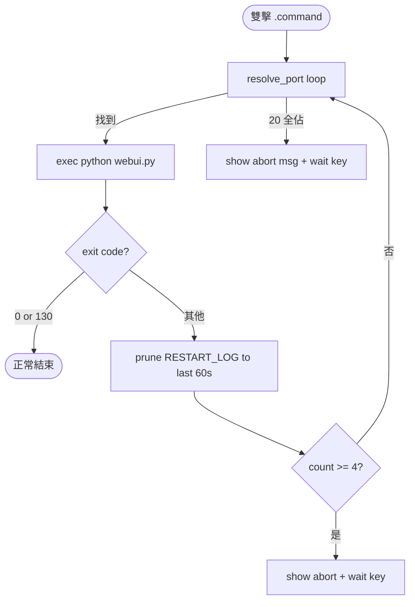

# feat: Launcher Port Self-Heal & Crash Auto-Restart

## Overview

升級 workspace-root `启动WebUI.command`（70 行 bash）兩件事：

1. **啟動時自愈** — 若 8888 被本專案殘留 webui.py 佔住，自動 kill 並復用 8888；若被陌生進程佔住，順延到 8889/8890/…（保留現邏輯，新增安全 kill 分支）。
2. **運行時自愈** — webui.py 非正常 crash 自動 restart，60s 內 ≤3 次速率限制；Ctrl-C 正常退出不 restart。

純 bash 修改，不動 webui.py 本體、不引入 launchd/supervisord、不寫 pidfile。

## Problem Frame

Operator 雙擊體驗的兩個痛點疊加（見 origin: docs/brainstorms/2026-05-20-launcher-port-self-heal-requirements.md）：

- 重複雙擊 → 殘留進程沒清乾淨 → URL 漂移到 8889+，書籤失效。
- webui.py 跑挂 → 終端關閉 → 要重新雙擊。
- 兩者疊加最糟：zombie 佔 8888，新實例起在 8889，operator 開了 8889 是空的。

## Requirements Trace

來自 origin doc 的 8 條 R 全部承接：

- R1. 8888 被本專案 webui.py 殘留佔時，識別並 kill → 復用 8888。
- R2. 被陌生進程佔時保持順延邏輯，**禁止** kill。
- R3. Kill 後輪詢驗證 port 釋放（≤5s），超時 fallback 到 R2 順延。
- R4. 三分支均明確告知 operator（kill 復用 / 陌生佔順延 / 全占放棄）。
- R5. webui.py crash 自動 restart——具體 predicate：`EXIT ∉ {0, 130}`（EXIT=0 涵蓋 graceful 路徑：較新 Werkzeug 對 SIGINT 走 0、外部 SIGTERM 也走 0；EXIT=130 涵蓋 Python 預設 KeyboardInterrupt 路徑）。其他非零碼一律視為 crash 進 restart 邏輯。
- R6. 60s 滾動窗口內第 4 次 crash 觸發 abort（亦即：3 次成功 restart 後再 crash 即放棄），顯示錯誤 + 等按鍵。實作預期：RESTART_LOG 為每次 crash 的 timestamp array，prune 後若 length ≥ 4 則 abort。
- R7. Ctrl-C（SIGINT，bash $? = 130）→ 正常退出，不 restart。
- R8. 每次 restart 重跑 R1-R4 port 自愈流程。

成功標準（origin §Success Criteria）：連續雙擊兩次 URL 仍是 8888 / 陌生佔順延 / 連續 crash 4 次 abort / Ctrl-C 乾淨退出。

## Scope Boundaries

- `backlink-publisher/webui.py` 只允許 **1-line debug-mode env gate** 修改（Unit 0）。**仍禁止**：加 SIGTERM handler、加 healthcheck endpoint、寫 pidfile、加任何 server lifecycle 邏輯。Env gate 是讓 R5/R6 真正可觀察的最小必要條件（見 Risks 表「Flask debug 中和 crash」row）。
- 不引入 launchd / supervisord / pm2 / nodemon 等外部 process manager。
- 不寫 `./启动WebUI.command status` 之類 systemd 風格子命令。
- 不支援 Linux（保持 macOS-only `.command` 雙擊體驗，lsof/ps 用 macOS BSD 語法）。
- 不處理多 operator / 多 instance 並存場景（單用戶單機假設）。
- 不寫 bats / pytest 自動測試（lightweight scope，依賴手動 smoke test 驗收；origin §Success Criteria 4 條就是測試清單）。

## Context & Research

### Relevant Code and Patterns

- `启动WebUI.command`（workspace root，唯一 launcher）— 當前 70 行：選 PY → for-loop 探 20 個 port → `open URL`（背景延遲 3s）→ `exec "$PY" webui.py`。`set -euo pipefail` 已啟用。
- `backlink-publisher/webui.py:__main__` — `app.run(host, port, debug=True, use_reloader=False)`。`use_reloader=False` 表示無 Werkzeug subprocess，PID = 直接 `exec` 出的 Python。Flask debug mode 對 Ctrl-C 走正常退出（exit 0）；unhandled exception → exit 1。**此性質讓 bash 不需要寫 trap，只看 `$?` 區分 0 / 130 / 其他**。
- `BIND_HOST="${BIND_HOST:-127.0.0.1}"` — 已支援 env 覆寫，新版保留。
- `PYTHONPATH="src${PYTHONPATH:+:$PYTHONPATH}"` 注入規則 — 必須保留（`.venv` 是舊目錄遷來、editable install 失聯的 workaround，腳本 line 59 註解寫死）。

### Institutional Learnings

- `docs/solutions/` 無 launcher / port-self-heal / bash restart-loop 前例（已 grep）— 新地盤，但 scope 夠小不需要研究先例。

### External References

- 未跑 framework-docs-researcher / best-practices-researcher — bash + lsof + ps 是穩定老技術，外部建議在這個 scope 無增量價值。

## Key Technical Decisions

- **「自己人」識別法 = `lsof -p $PID -d cwd` + `ps -p $PID -o command=` 雙重比對**。比對 cwd 是否 == `realpath backlink-publisher/`，cmdline 是否含 `webui.py`。**Rationale**: 寫進可獨立呼叫的 shell function `is_our_webui PID`，操作員可手動 `is_our_webui 12345 && echo yes` 驗證邏輯。比對 cwd 之必要：避免誤殺其他目錄的同名 `webui.py`（其他 Python 專案常見 entry 點）。

- **Kill 策略 = SIGTERM → 輪詢 `kill -0` 1s × 5 → SIGKILL fallback → 最終 `lsof` port-free 確認**。**Rationale**: 直接 `-9` 砸掉可能讓 Flask session state、檔案寫入半途死。給 5 秒讓 Werkzeug 優雅關閉（dev server SIGTERM 反應通常 < 1s）。超時才 `-9`。**輪詢用 `kill -0 "$PID"` 而非 `lsof` on port**——`kill -0` 是「process 是否存活」的正確 primitive，避免 `lsof` 將「port 在 TIME_WAIT」或「其他 PID 共用 port」誤判為「目標 PID 仍活」。`kill -0` 確認 PID 死後，**再** `lsof -t -iTCP:$PORT -sTCP:LISTEN` 一次確認 port 真釋放（極罕見地，PID 死後 socket 還有人 grab）——若 port 仍佔，讓 `resolve_port` 順延到下一個 candidate，不要返回 success-and-race-bind。

- **Restart 速率限制 = bash array 存每次 crash 的 epoch timestamps，每次 crash 後 prune > 60s 舊條目並 append now，count ≥ 4 → abort**（per R6：「第 4 次 crash abort」= 已 3 次成功 restart 後再 crash）。**Rationale**: 純 bash 內存、無持久化檔案（腳本退出即重置——這是 feature 不是 bug，operator 主動關窗代表「我知道我在重啟」）。實作直接：`now=$(date +%s)` + prune helper（防禦 bash 3.2 空陣列陷阱，見 Risks）+ append + length 檢查。

- **SIGINT 識別 = bash `$?` ∈ {0, 130} 視為「乾淨退出」**。**Rationale**: Ctrl-C 在實際運行中可能產生 EXIT=130（Python 預設 KeyboardInterrupt 路徑，128 + SIGINT）**或** EXIT=0（較新版 Werkzeug ~2.0+ 安裝自己的 SIGINT handler，graceful shutdown 後正常退出）。兩種都是 operator 主動結束，restart predicate 寫成 `EXIT not in {0,130}` 兩種都涵蓋。其他非零碼 → crash → 進 restart 邏輯。**不需要寫 `trap SIGINT`**——bash 本身對 Ctrl-C 也是 default 退 130，被當前 shell 觀察到的就是 child 退出碼。

- **Port 自愈抽成 function `resolve_port()` echo 出最終 port，restart loop 內每次重跑**。**Rationale**: R8 要求 restart 前重新自愈（port 可能在 crash 瞬間被搶）。把 R1-R4 邏輯收進 function，main loop 每次迭代呼叫一次。

- **`exec` vs subshell**：當前 line 69 是 `"$PY" webui.py`（無 exec）— 保留無 exec，因為要在 webui.py 退出後拿到 `$?` 進 restart 判定。若用 `exec` 則 bash 自身被替換掉。

- **`open "$URL"` 只在第一次啟動跑**：restart 不重複開瀏覽器（operator 已開著），避免 N 個瀏覽器 tab。

## Open Questions

### Resolved During Planning

- **Q: 「kill 後等多久 port 真釋放」？** A: 5s 內輪詢 lsof，1s 間隔。Werkzeug dev server SIGTERM 反應通常 < 1s，5s 預算寬鬆但不會讓 operator 等到不耐煩。
- **Q: `is_our_webui` 用 cwd 還是 cmdline 比對？** A: 兩者都要。cmdline 含 `webui.py` 但不同目錄 → 別人專案；cwd 對但 cmdline 是 `pytest webui_app` → 不是 server。雙重比對才安全。
- **Q: Restart 限制要不要持久化（檔案/sqlite）？** A: 不。bash array 內存即可——腳本退出即重置，operator 重新雙擊是 explicit signal「我願意重來」。持久化反而引入 stale-file 問題。
- **Q: 要不要寫 bash unit test (bats)？** A: 不。Lightweight scope，origin §Success Criteria 4 條手動 smoke 可驗。新增 bats 需引入 dev-dep 配 CI，與單檔修改不成比例。

### Deferred to Implementation

- **Realpath 一致性實作細節**：macOS `realpath` 不是預設安裝（GNU coreutils 才有；BSD 用 `cd -P` 或 `python3 -c "import os; print(os.path.realpath(...))"` 替代）。實作時挑 macOS 預設有的方案——傾向 `python3 -c "import os,sys;print(os.path.realpath(sys.argv[1]))"`（反正腳本已經依賴 python3）。最終選型在實作時確認。
- **Restart 訊息 verbosity**：第幾次重啟 / 上次 exit code / 60s 視窗剩餘額度——具體告知文案在實作時逐字定，原則是 operator 看一眼就懂發生什麼。
- **`open "$URL"` 跨平台**：macOS-only，但若未來有人在 Linux 跑，`xdg-open` fallback。本 plan **不**包含此 fallback（scope §不支援 Linux），但實作時是否留 TODO 註解在實作判斷。

## High-Level Technical Design

> *This illustrates the intended approach and is directional guidance for review, not implementation specification. The implementing agent should treat it as context, not code to reproduce.*

```text
启动WebUI.command 改造後骨架（pseudo-code）

  cd workspace/backlink-publisher
  set -euo pipefail
  PY=<choose python>
  START_PORT=${PORT:-8888}; BIND_HOST=...; OUR_CWD=$(realpath .)

  # --- helper functions (top of script, before main loop) ---
  function is_our_webui(pid):
      cwd_of(pid) == OUR_CWD  AND  cmdline_of(pid) contains "webui.py"

  function kill_and_wait(pid):
      kill -TERM pid
      poll lsof for up to 5s @ 1s interval
      if still alive: kill -9 pid; sleep 1
      return success/failure

  function resolve_port():
      for candidate in START_PORT..START_PORT+19:
          if port_free(candidate): return candidate
          holder_pid = lsof -t candidate
          if is_our_webui(holder_pid):
              echo "↻ port $candidate 被本專案殘留 PID $holder_pid 佔用，kill 復用…"
              if kill_and_wait(holder_pid): return candidate
              echo "  kill 超時，順延"
          else:
              echo "⚠️ port $candidate 被陌生 PID $holder_pid 佔用，順延"
      return "" (all 20 occupied → abort)

  # --- main loop with restart rate-limit ---
  RESTART_LOG=()   # epoch timestamps
  FIRST_RUN=true

  while true:
      PORT = resolve_port()
      if empty(PORT): show "20 個 port 全佔，放棄" → wait key → exit 1

      export PORT BIND_HOST PYTHONPATH=src:$PYTHONPATH

      if FIRST_RUN:
          (sleep 3 && open http://$BIND_HOST:$PORT) &
          FIRST_RUN=false

      echo "🚀 啟動 webui.py on $PORT (restart count=${#RESTART_LOG[@]}/3 in 60s)"
      "$PY" webui.py
      EXIT=$?

      if EXIT == 0 or EXIT == 130:        # 正常/Ctrl-C
          echo "✓ 正常退出 (code=$EXIT)"
          break
      else:                                  # crash
          now=$(date +%s)
          prune RESTART_LOG: keep entries where now - ts < 60
          RESTART_LOG += now
          if len(RESTART_LOG) >= 4:           # 第 4 次 = 已 restart 3 次後再 crash
              echo "❌ 60s 內 4 次失敗，放棄。最後 exit=$EXIT"
              show log hint
              read -n 1 -s -r -p "按任意鍵關閉…"
              exit 1
          echo "↻ webui.py crash (exit=$EXIT)，restart 第 ${#RESTART_LOG[@]} 次"
          sleep 1
          # continue loop → resolve_port() reruns (R8)
```

關鍵控制流：



## Implementation Units

- [ ] **Unit 0: webui.py debug-mode env gate (prereq for R5/R6 observability)**

**Goal:** webui.py 對 `FLASK_DEBUG` env 收口——預設 `debug=True` 改成 `debug=(os.environ.get('FLASK_DEBUG','1')=='1')`。Launcher 跑 webui.py 時 export `FLASK_DEBUG=0`，讓 route 內 unhandled exception 真讓進程退出（exit 1），R5/R6 restart 邏輯才有觀察對象。Operator 不透過 launcher 直接 `python webui.py` 仍預設 debug=True（向後兼容）。

**Requirements:** R5（precondition——沒這個 R5/R6 永遠不觸發）

**Dependencies:** None（webui.py 本體修改，launcher 修改放 Unit 3）

**Files:**
- Modify: `backlink-publisher/webui.py`（單行：`app.run(... debug=DEBUG_MODE ...)` + 1 行 `DEBUG_MODE = os.environ.get('FLASK_DEBUG','1')=='1'` 在 `if __name__ == '__main__':` 內）
- Test: 無自動測試（手動 smoke）

**Approach:**
- 找到 `webui.py:__main__` 內 `app.run(host=bind_host, port=port, debug=True, use_reloader=False)` 那行。
- 上方插入 `DEBUG_MODE = os.environ.get('FLASK_DEBUG', '1') == '1'`（預設 `'1'`，保留現有行為——讓直接跑 `python webui.py` 的 dev 場景不變）。
- `debug=True` 改 `debug=DEBUG_MODE`。
- **不**加其他任何邏輯：不 import signal、不 trap、不 healthcheck endpoint、不 pidfile（§Scope 仍禁止）。
- 訊息：可選地在 `print("Starting...")` 後加一行 `print(f"  debug={DEBUG_MODE}")` 讓 operator 看到當前模式，但非必要。

**Patterns to follow:**
- 沿用 webui.py 既有 `os.environ.get(KEY, default)` 慣例（line ~`int(os.environ.get('PORT', 8888))` 同樣型態）。

**Test scenarios:**
- Happy path: 直接 `cd backlink-publisher && python webui.py` → debug=True（保留現行為，dev 場景不變）。
- Happy path: `FLASK_DEBUG=0 python webui.py` → debug=False → 訪問會炸的 route → 看到 exit 1 + Python traceback 落終端，**進程退出**，不是 Werkzeug debug 頁。
- Edge case: `FLASK_DEBUG=1 python webui.py` → debug=True，與預設一致。
- Edge case: `FLASK_DEBUG=true python webui.py` → 因比對 `=='1'` 嚴格相等，這個會走 False —— 預期行為（避免 `'0'` / `'false'` / `'no'` 之類字串歧義），文件化於 webui.py 那行旁的註解。

**Verification:**
- `FLASK_DEBUG=0 python webui.py` 後在 webui_app 隨便 route 加 `raise RuntimeError` 觸發 → 進程退出（`echo $?` 看到 1），不停在 debug 頁。
- 不設 `FLASK_DEBUG` 直接跑 → 行為與當前 main 上的 webui.py 完全一致。

---

- [ ] **Unit 1: Helper functions — `is_our_webui` / `kill_and_wait` / `resolve_port`**

**Goal:** 抽出 3 個可獨立 source 的 shell function，建立邏輯邊界與可手動驗證單位。

**Requirements:** R1, R2, R3, R4

**Dependencies:** None

**Files:**
- Modify: `启动WebUI.command`（workspace root，single file）
- Test: 無自動測試檔案（手動 smoke per origin §Success Criteria）

**Approach:**
- `is_our_webui PID` — 用 `lsof -p "$PID" -d cwd -Fn 2>/dev/null` 拿 cwd。lsof field-mode 對單一 PID 通常輸出多行（`p<pid>`、`fcwd`、`n<path>`）——**只取 `n` 開頭那行 strip 首字元**，具體 idiom：`cwd_of_pid=$(lsof -p "$PID" -d cwd -Fn 2>/dev/null | awk '/^n/{print substr($0,2); exit}')`。若 PID 屬於他 user（permission denied） / PID 不存在 → lsof 退非零、stdout 空，`cwd_of_pid` 為空 → 比對失敗 → `is_our_webui` 返回 false（安全行為）。+ `ps -p "$PID" -o command= 2>/dev/null` 拿 cmdline。比對 `realpath` 一致且 cmdline grep `webui.py`。realpath 用 `python3 -c "import os,sys;print(os.path.realpath(sys.argv[1]))"` 跨 macOS 預設環境（GNU realpath 不一定有）。
- `kill_and_wait PID` — `kill "$PID"` (SIGTERM 預設)；輪詢用 `kill -0` 確認 process 存活（**不** 用 `lsof` on port——`lsof` 會把「TIME_WAIT 殘留」或「其他 PID 共用 port」誤判為「目標 PID 仍活」）：`for i in {1..5}; do sleep 1; if ! kill -0 "$PID" 2>/dev/null; then break; fi; done`；若 loop 結束 PID 仍活 `kill -9 "$PID" 2>/dev/null; sleep 1`。PID 確認死後 **再** `lsof -t -iTCP:"$PORT" -sTCP:LISTEN >/dev/null 2>&1` 一次確認 port 真釋放，仍佔則 return 1 讓 caller 順延。函數 signature 收 PID + PORT 兩個位置參數，避免 global 隱式依賴。
- `resolve_port` — for loop 從 `START_PORT` 試 20 個。每個：先 `lsof -t -iTCP:CANDIDATE -sTCP:LISTEN`，空 → 該 port 自由返回；非空 → `is_our_webui $PID` 真 → `kill_and_wait` → 復用；偽 → 順延下一個並 stderr 提示。**Contract（兩種約定都要遵守，caller 雙重檢）**：成功時 `echo "$PORT"` 到 stdout 且 `return 0`；20 個全佔時 `echo ""` 到 stdout 且 `return 1`。Caller pattern：`PORT=$(resolve_port); STATUS=$?; if [[ -z $PORT || $STATUS -ne 0 ]]; then abort; fi`。**stderr 訊息（順延/kill 提示）走 `>&2` 或 unredirect**，避免污染 `$()` 捕獲的 stdout。
- 三 function 全寫在腳本頂端（在 main 邏輯之前），保持原檔結構 + Python 解釋器選擇邏輯（line 19-32）不動。

**Patterns to follow:**
- 沿用現腳本 `set -euo pipefail` + 雙引號 quoting + `echo` 直書中文訊息風格。
- emoji 開頭符號慣例：✓ 成功 / ⚠️ 警告 / ❌ 失敗 / 🚀 啟動 / ↻ 重試（新增）/ ↪︎ 已用過。

**Test scenarios:**
- Happy path: 手動 `is_our_webui $(pgrep -f "backlink-publisher.*webui.py" | head -1)` → 回 true（先手動起一個 webui.py）。
- Edge case: `is_our_webui 1`（PID 1 = launchd）→ 回 false，不應炸 `set -e`（lsof/ps 對 PID 1 可能拒絕，`2>/dev/null` 兜底）。
- Edge case: `is_our_webui 99999`（不存在 PID）→ 回 false，不應炸。
- Edge case: 別目錄起 `python3 -c "import time; time.sleep(60)" --webui.py` → cmdline 含 webui.py 但 cwd 錯 → `is_our_webui` 應回 false（cwd 比對救回來）。
- Edge case: `is_our_webui $(pgrep -u root | head -1)` （他 user 進程）→ lsof permission denied、stdout 空 → 比對失敗 → return false，不炸。
- `kill_and_wait` 對一個 `sleep 30` 進程 → SIGTERM 後 1s 內死掉 → return 0。
- `kill_and_wait` 對一個 trap-ignore-SIGTERM 進程 → 5s 後仍活 → SIGKILL → return 1 with stderr 警告。

**Verification:**
- 三 function 各自 `source 启动WebUI.command` 後可在互動 shell 手動呼叫（function 寫在 `if __name__ == main` 等價的 guard 之前，沒有 guard 所以直接可用）。
- 邏輯分支可逐一手動觸發。

---

- [ ] **Unit 2: Startup port self-heal — main 邏輯改用 `resolve_port`**

**Goal:** 替換現腳本 line 34-56 的 inline port-detect loop，呼叫 Unit 1 的 `resolve_port`；保留 PYTHONPATH 注入與 BIND_HOST 處理。

**Requirements:** R1, R2, R3, R4

**Dependencies:** Unit 1

**Files:**
- Modify: `启动WebUI.command`
- Test: 無自動測試（手動 smoke）

**Approach:**
- 刪除 line 34-44 的 inline `for ((i=0; i<MAX_TRIES; i++))` block。
- 改成雙重檢 caller pattern：`PORT=$(resolve_port); STATUS=$?; if [[ -z $PORT || $STATUS -ne 0 ]]; then abort; fi`（per Unit 1 §Approach `resolve_port` contract）。
- 全佔 abort 訊息保留現有風格（line 46-50）。
- URL 變數 line 53-56 邏輯保留——`resolve_port` 出來的 port 可能 != `START_PORT`，告知 operator 換 port 的訊息仍有用。
- `export PORT BIND_HOST` + `export PYTHONPATH="src${PYTHONPATH:+:$PYTHONPATH}"` 保持原樣（line 58-60）。
- 此 Unit 只動 main flow，不動 helper（Unit 1 已建立）。

**Patterns to follow:**
- 保留現有 `if [[ "$PORT" != "$START_PORT" ]]; then echo "↪︎ 改用空閒端口 $PORT" fi`（line 54-56）的 operator 告知慣例。

**Test scenarios:**
- Happy path: 雙擊（無任何 port 佔用）→ 啟動於 8888，行為與當前版本一致。
- Edge case: 手動先起 `cd backlink-publisher && python3 webui.py`（佔 8888）→ 雙擊腳本 → resolve_port 識別自家 → kill → 復用 8888 → operator 看到 "↻ port 8888 被本專案殘留 PID xxx 佔用，kill 復用…" + URL 仍是 :8888。
- Edge case: `python3 -m http.server 8888`（陌生）→ 雙擊 → 看到 "⚠️ port 8888 被陌生 PID xxx 佔用，順延" + 啟動於 8889。
- Error path: 連 8888-8907 全用 `python3 -m http.server` 佔住 → 雙擊 → 顯示 "20 個 port 全佔" + 等按鍵退出。
- Edge case: 第一次雙擊跑 webui.py，第二次雙擊（前一個還活著）→ 自家識別 → kill → 復用 → 第二次正常起。
- Integration: kill 自家後 5s 內 port 仍未釋放（極罕見，模擬：在 webui.py 加 `signal.signal(SIGTERM, lambda s,f: time.sleep(30))`）→ `kill_and_wait` SIGKILL fallback → port 釋放 → 復用成功。

**Verification:**
- 手動 smoke 上述 6 條全綠。
- Stderr 訊息對 operator 清晰、不被 `set -e` 截斷在中間。

---

- [ ] **Unit 2.5: Crash stub script for Unit 3 smoke testing**

**Goal:** 寫一個獨立可重複跑的 crash-simulating Python stub，讓 Unit 3 的 crash-restart 測試不需要污染 `webui.py`。Stub 透過 env 切三模式：立刻 crash / 跑 N 秒後 crash / 忽略 SIGTERM 持續 sleep。

**Requirements:** R5, R6, R7（測試支援；不交付到 operator 雙擊路徑）

**Dependencies:** None（純 throw-away script）

**Files:**
- Create: `backlink-publisher/tests/manual/webui_crash_stub.py`（新檔，~20 行 Python，純 stdlib）
- 路徑選 `tests/manual/`：與 `tests/test_*.py` pytest 自動收集區隔開（pytest 不會誤收 `tests/manual/`，因為檔名不以 `test_` 開頭）。

**Approach:**
- Stub `if __name__ == '__main__':` 讀 `STUB_MODE` env，三 case：
  - `fail-fast`（預設）：印一行 `"[stub] crashing immediately"` → `raise RuntimeError("stub crash")` → exit 1。
  - `fail-after-N`：讀 `STUB_FAIL_DELAY` 秒數 → `time.sleep(N)` → raise → exit 1。
  - `ignore-sigterm`：`signal.signal(SIGTERM, lambda s,f: None)` + `time.sleep(3600)` → 配合 Unit 1 `kill_and_wait` SIGKILL fallback 測試。
- 用法：手動 smoke 時 `PY=tests/manual/webui_crash_stub.py STUB_MODE=fail-fast bash 启动WebUI.command`（launcher 接受 `PY` env 覆寫 Python 入口 script——**這需 Unit 3 launcher 改動配合**：把 `"$PY" webui.py` 改 `"$PY" "${WEBUI_SCRIPT:-webui.py}"`，加一層間接讓 stub 可注入）。
- Stub 也要 `app.run`-style print 一行讓 launcher stderr 看起來正常（避免「沒輸出」的混淆）。
- **Stub 不依賴 Flask、不依賴 backlink_publisher 包**——純 stdlib，避免任何 import error 干擾測試訊號。

**Patterns to follow:**
- 沿用 webui.py `os.environ.get(KEY, default)` 慣例。

**Test scenarios:**
- Happy path: `STUB_MODE=fail-fast python tests/manual/webui_crash_stub.py` → 立即印 `[stub] crashing immediately` + traceback + exit code 1（`echo $?` 確認）。
- Happy path: `STUB_MODE=fail-after-N STUB_FAIL_DELAY=2 python ...` → 等 2 秒後 raise。
- Happy path: `STUB_MODE=ignore-sigterm python ...` → 另一終端 `kill <PID>` → 進程不退；`kill -9 <PID>` → 進程退（exit 137）。
- Integration: stub + launcher：`WEBUI_SCRIPT=tests/manual/webui_crash_stub.py STUB_MODE=fail-fast bash 启动WebUI.command` → launcher restart loop 跑滿 4 次 → abort。

**Verification:**
- 三 STUB_MODE 各自手動可獨立跑驗證。
- Launcher `WEBUI_SCRIPT` env 覆寫機制（Unit 3 配合）讓 stub 注入工作。
- Stub 永遠不會被 pytest auto-collect（路徑 `tests/manual/` + 檔名非 `test_` 開頭）。

---

- [ ] **Unit 3: Runtime restart loop with rate-limiting**

**Goal:** 把 `"$PY" webui.py`（line 69）改成 `while true` 迴圈，crash 時 prune + count + restart，60s 內 4 次 abort，Ctrl-C 乾淨退出。

**Requirements:** R5, R6, R7, R8

**Dependencies:** Unit 0（webui.py 對 FLASK_DEBUG 收口，R5/R6 才有觀察對象）、Unit 1（restart 前要重跑 `resolve_port` per R8）、Unit 2、Unit 2.5（crash stub，smoke test 依賴）

**Files:**
- Modify: `启动WebUI.command`
- Test: 無自動測試（手動 smoke）

**Approach:**
- 引入 `RESTART_LOG=()` array + `FIRST_RUN=true` boolean 變數，放在 main loop 之前。
- 把 line 63-69 改成 `while true` 包裹：
  - **Per R8**：每次迴圈頂 **必** 重新呼叫 `resolve_port` 拿最新 PORT——port 可能在 crash 瞬間被搶，restart 前一定要重跑 R1-R4 自愈流程。全佔走 abort（與 Unit 2 同分支，但 abort 訊息要分「啟動時 / restart 時」）。
  - 第一次跑時 `(sleep 3 && open "$URL") &`（FIRST_RUN gate）。
  - **export `FLASK_DEBUG=0`**（per Unit 0 的 env gate）讓 webui.py 跑 production-style，route exception 真退出而非被 Werkzeug debug 頁中和。
  - **webui.py entry 收 env 覆寫**：把 `"$PY" webui.py` 改 `"$PY" "${WEBUI_SCRIPT:-webui.py}"` 加一層間接——讓 Unit 2.5 crash stub 可透過 `WEBUI_SCRIPT=tests/manual/webui_crash_stub.py` 注入測試，無需臨時改 webui.py。
  - **暫時關閉 `set -e` 在 webui.py 呼叫附近**——`set +e; "$PY" "${WEBUI_SCRIPT:-webui.py}"; EXIT=$?; set -e`——否則非零退出會直接終止 bash，無法進 restart 判定。
  - exit 判定：`if [[ $EXIT -eq 0 || $EXIT -eq 130 ]]; then echo "✓ 正常退出"; break; fi`。**EXIT=0 與 EXIT=130 兩種都是 operator 主動結束**（Werkzeug 不同版本對 Ctrl-C 分別走 graceful=0 / KeyboardInterrupt=130 路徑）；謹防實作時誤寫成 `EXIT -eq 130` only，會把 graceful=0 case 當 crash 觸發 restart，違反 R7。
  - crash 路徑：`now=$(date +%s)`；prune RESTART_LOG（保留 `now - ts < 60`）；append `now`；`if [[ ${#RESTART_LOG[@]} -ge 4 ]]; then echo "❌ 60s 內 4 次失敗" + log hint + read -n 1 + exit 1`；否則 `sleep 1` continue。
  - **bash 3.2 + `set -u` 空陣列展開陷阱**：macOS 預設 bash 3.2 對 `"${RESTART_LOG[@]}"` 在陣列為空時報 `unbound variable` 而 abort（bash 4.4 才修）。首次 crash 進 prune 時 RESTART_LOG 還是空，會踩雷。Prune 用防禦展開：`new_log=(); for ts in ${RESTART_LOG[@]+"${RESTART_LOG[@]}"}; do if (( now - ts < 60 )); then new_log+=("$ts"); fi; done; RESTART_LOG=(${new_log[@]+"${new_log[@]}"})`。`${arr[@]+"${arr[@]}"}` 在 arr 為空時展開為「無 token」（safe），非空時展開為原內容（quoted）。
- 訊息設計：啟動時印 `🚀 啟動… (restart=$N/3 in 60s)`，N 從 RESTART_LOG length 取，operator 看到 0/3 = 第一次 fresh，3/3 = 警戒線。

**Execution note:** 三函數 + restart loop 在同一個檔案內互相牽動，建議改完 Unit 1+2+3 後一起手動 smoke 全套 origin §Success Criteria 4 條。

**Patterns to follow:**
- `set +e ... set -e` 局部關 errexit 的習慣（原腳本未用，新引入但限定在 webui.py 呼叫一行；避免錯誤吞食擴散）。

**Test scenarios:**
- Happy path (SIGINT=130): 雙擊 → webui.py 跑 → Ctrl-C 一次 → 若舊 Werkzeug 行為 `EXIT=130` → 印 "✓ 正常退出 (code=130)" → 退出，不 restart。
- Happy path (SIGINT=0): 同上場景但較新 Werkzeug（~2.0+ 安裝 SIGINT handler graceful shutdown）→ `EXIT=0` → 同樣走 break，不 restart。兩種 Werkzeug 行為皆涵蓋。
- Happy path: 雙擊 → 啟動於 8888 → 1s 後手動 `kill $(lsof -t -iTCP:8888 -sTCP:LISTEN)`（外部 SIGTERM → Werkzeug 退 0）→ exit 0 也走 break，不 restart。**確認此 case 行為是否符合 R5「非正常退出」定義**——SIGTERM 走 exit 0，原文 R5 只說「exit ≠ 0」，因此這 case 不 restart，符合。
- Error path: **使用 crash stub** `tests/manual/webui_crash_stub.py`（見 Unit 3.5）替代 webui.py 觸發測試——`STUB_MODE=fail-fast bash 启动WebUI.command`（PY 暫時指向 stub）→ stub 立即 raise RuntimeError exit 1 → 看到 "↻ webui.py crash (exit=1)，restart 第 1 次" → 2 秒內第二次 crash → restart 第 2、3 次 → 第 4 次 crash → "❌ 60s 內 4 次失敗" + 等按鍵 + exit 1。**整個過程 < 30 秒可驗，零污染 webui.py**。
- Edge case: webui.py crash 1 次 → restart 成功 → 跑 65 秒 → 再 crash 1 次 → prune 後 RESTART_LOG 應只有 1 條（上次已過 60s 視窗）→ 不會誤判已到 3 次。**用 stub `STUB_MODE=fail-after-N STUB_FAIL_DELAY=70` 模擬「跑 70 秒後 crash 一次」**。
- Integration: crash → restart 時 `resolve_port` 重跑（R8）：若 crash 瞬間另一個 dev 進程搶走 8888，restart 後應自動順延到 8889。**用 stub `STUB_MODE=fail-fast` + 第二終端 `python3 -m http.server 8888` 持續佔住** → launcher restart 走 resolve_port → 識別陌生佔用 → 落 8889 → stub 在 8889 立刻 crash → 繼續累計 → 4 次 abort。
- Edge case: 第一次正常跑 → 瀏覽器開了；crash 後 restart → **瀏覽器不應再開一個新 tab**（FIRST_RUN gate 已設 false）。

**Verification:**
- Ctrl-C 不會觸發 restart（EXIT ∈ {0, 130} 兩種都該走 break——這是 plan 最關鍵假設，務必親手驗；不同 Werkzeug 版本兩種都可能出現）。
- 連 4 次 crash 在 60 秒內 abort，不會無限循環。
- Restart 後 port self-heal 重跑（每次 restart 看到「resolve_port」相關 stderr 訊息）。
- Bash 3.2 下首次 crash 走 prune 路徑時不會炸 `unbound variable`（macOS 預設 `/bin/bash --version` 應 3.2.57，且 script header `#!/usr/bin/env bash` 強制 bash 不走 zsh shim）。

## System-Wide Impact

- **Interaction graph:** workspace-root `.command` launcher（主修改）+ `backlink-publisher/webui.py` 1-line env gate（Unit 0）。`webui_app/*`、`webui_store/*`、`Makefile`、`backlink-publisher/.venv/`——全不動。
- **Error propagation:** webui.py 的 stderr 直通終端不變；新增的 bash echo 訊息全走終端 stdout/stderr，不寫 log 檔（operator 雙擊體驗，無 log 期待）。Abort 路徑保留 `read -n 1` 阻塞讓 operator 看到錯誤再關窗。
- **State lifecycle risks:** webui.py 內部 state（`webui_store/` 4 個 singleton store，feedback `[[webui-store-config-dir-frozen]]` 標的 stale-import 風險）**不**受本 plan 影響——本 plan 不 import webui_store、不傳 env、不動 `BACKLINK_PUBLISHER_CONFIG_DIR`。restart 時 webui_store 從 disk 重新讀，與當前版本完全一致。
- **API surface parity:** 無——launcher 不是公開介面，operator 雙擊體驗是唯一 surface。
- **Integration coverage:** R6 + R7 + R8 三條交互（rate-limit 是否吃 Ctrl-C / restart 是否重跑 port self-heal）必須手動 integration smoke，單元測 helper function 看不出來。Unit 3 test scenarios 已逐條列。
- **Unchanged invariants:** `PYTHONPATH="src:$PYTHONPATH"` 注入（line 60 註解寫死的 `.venv` workaround）、`.venv/bin/python` 優先選擇、`BIND_HOST=127.0.0.1` 預設、`open URL` 自動開瀏覽器、`set -euo pipefail`（限定 webui.py 呼叫附近用 `set +e` 局部關閉）—— 五項全保留。

## Risks & Dependencies

| Risk | Mitigation |
|------|------------|
| `lsof -p PID -d cwd` 在 macOS 不同版本輸出格式變動，cwd parse 失敗誤判 `is_our_webui` 為 false → 不 kill 自家進程 → 順延到 8889 → 比現狀更糟糕（multi-instance 累積）。 | Unit 1 test scenarios 第 1 條手動驗 `is_our_webui` 對活著的自家 PID 必須回 true。萬一格式變了，`lsof -p PID -d cwd -Fn` 的 `-Fn` 格式相對穩定（field-mode 輸出），破壞性升級 macOS 才會炸。發現問題的 operator 反饋會立即觸發修。 |
| Flask `debug=True` 對 route 內 unhandled exception 行為是「印 traceback 頁、進程不退」→ R5/R6 restart 邏輯預設 cover 不到 route exception（operator 抱怨「跑挂」最常見的場景）。 | **Mitigated by Unit 0**：webui.py 收 `FLASK_DEBUG` env gate，launcher export `FLASK_DEBUG=0` 讓 production-style crash 真退出（exit 1）→ R5/R6 觀察得到。代價：突破原 §Scope「不動 webui.py」邊界（已在 Scope Boundaries 明記為 1-line exception）。Direct `python webui.py`（不透過 launcher）仍預設 debug=True，dev 場景行為不變。 |
| Operator 在 60s 內主動 Ctrl-C 三次（誤觸） → 雖然每次都是 exit 130 走 clean break、不進 RESTART_LOG —— 應該安全，但 `set +e` 局部開關若放錯位置可能讓 130 被當 crash 處理。 | Unit 3 verification 第一條手動驗 Ctrl-C 場景。實作時 `set +e ... "$PY" webui.py; EXIT=$?; set -e` 三行緊貼，不在中間夾邏輯。 |
| `realpath` 在某些 macOS 版本（10.x 預設無 GNU coreutils）不存在 → `is_our_webui` 比對崩。 | Key decisions 已選 `python3 -c "import os,sys;print(os.path.realpath(sys.argv[1]))"`——腳本本來就依賴 python3，零新增依賴。 |
| Bash 3.2（macOS 預設 `/bin/bash`）+ `set -u` 對空陣列 `"${arr[@]}"` 報 `unbound variable` 而 abort（bash 4.4 才修）。首次 crash prune 時 RESTART_LOG 為空 → 整個 launcher 直接被自己的 set -u 殺死，比現狀更糟。 | Prune 與 reassign 統一用防禦展開 `${arr[@]+"${arr[@]}"}`（空陣列展開為無 token，非空展開為 quoted 原內容）。Unit 3 Approach 已寫明 idiom；Verification 增加「首次 crash 不炸」smoke 步驟。實作時不要用 `mapfile` / `readarray`（4.x only），不要用 `${arr[@]}` 裸展開。 |

## Documentation / Operational Notes

- **不需要更新 `backlink-publisher/AGENTS.md`**——AGENTS.md 是 contributor guide，operator launcher 屬於 workspace-root 工具，不在 AGENTS.md scope。
- **不需要 docs/solutions 記錄**——本修改不解 incident，是常規 UX 改善。若實作中遇到 macOS 版本兼容性意外才寫 solution。
- **可選**：腳本內部頂端加 ~5 行 comment block 解釋「為何 set +e 局部包圍 webui.py 呼叫」+「為何用 python3 realpath 不用 GNU realpath」——operator 未來 debug 時看得懂。**By origin convention（CLAUDE.md「Code Style: minimal comments」），這個註解只在 WHY 非顯而易見時寫；本 case 兩個 WHY 都不直觀，值得 5 行**。

## Sources & References

- **Origin document:** [docs/brainstorms/2026-05-20-launcher-port-self-heal-requirements.md](../brainstorms/2026-05-20-launcher-port-self-heal-requirements.md)
- Related code: `启动WebUI.command`（workspace root，70 行）、`backlink-publisher/webui.py:__main__`（line 30 行附近 `app.run`）
- Related PRs/issues: 無（新 topic）
- External docs: 無外部研究——bash + lsof + ps 是穩定老技術
