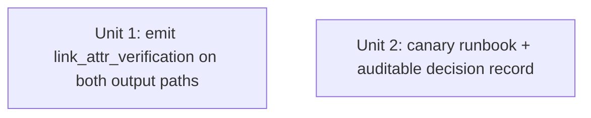

# feat: Close the dofollow canary loop for livejournal + txt.fyi (lightweight)

## Overview

Two shipped adapters — `livejournal` and `txtfyi` — are registered
`dofollow="uncertain"` and should resolve to `dofollow=True` (or be retired) once a
canary article's live-page backlink is verified. The loop never closes because the
verification verdict is **computed and silently dropped**: `verify_link_attributes`
runs after publish, attaches to `AdapterResult._provider_meta`, but neither output
emitter (`base.py:to_publish_output` nor `cli/_resume.py:item_to_publish_output`)
emits it, so the operator can't even see the result, let alone act on it.

**Approach (lightweight, chosen after review).** The load-bearing fix is making the
verdict observable (Unit 1). Closure pressure is a runbook + a dated tracked issue —
not a committed-TOML CI gate. Review convergence (adversarial + scope-guardian +
product) showed a gate is over-built for N=2 platforms and its "forcing" is illusory
(the contradiction check only fires *after* an unforced manual edit), and the
`monolith_budget.toml` analogy is false (the verdict isn't CI-measurable). Origin R14
explicitly allowed an "issue / test" instead of a gate; we take that path.

This plan does **not** publish the canary or flip the registrations — those need a
live throwaway account and are an operator follow-up PR. It ships the observable
verdict, the runbook that drives the flip, and the auditable decision record.

## Problem Frame

`verify_link_attributes` (`publishing/adapters/link_attr_verifier.py`) is wired into
both adapters' publish paths via `attach_link_verification` (`http_form_post.py:195-212`;
`txtfyi_api.py:111`, `livejournal_api.py:282`), storing under
`_provider_meta["link_attr_verification"]`. But `AdapterResult.to_publish_output`
(`base.py:34-49`) and the resume emitter `item_to_publish_output` (`cli/_resume.py:36`)
both emit a fixed field set without `_provider_meta` — so the verdict is discarded on
both paths. The amend (`uncertain → True`) is a manual `register()` edit gated only by
an `# R4 canary pending` comment. (see origin: R14, R15.)

## Requirements Trace

- R1 (origin R14a). The amend is driven by an observable verdict + a runbook + a dated tracked issue with an owner, replacing the inert `# R4 canary pending` comment.
- R2 (origin R14b / R9). Kill/keep is owner-driven via the tracked issue deadline; the runbook defines the rule (clean-dofollow on the *target backlink* → flip; nofollow + low referral → retire). Note: this is a tracked-obligation, not a hard CI retire — see Key Decisions for the deliberate deviation from R14's literal "auto-retire."
- R3 (origin R14). The verification verdict is emitted on **both** publish-output paths so the operator can read it.
- R4 (origin R2/R3/R4). bloglovin NO-GO (dead), jkforum HOLD (reputation), justpaste.it/teletype.in CONDITIONAL-deferred (resolved, not open) recorded with probe evidence + date, referenced from `MEMORY.md`; roster note defined.
- R5 (origin R15). Headless render is out of scope — livejournal serves real-blog HTML, txtfyi static HTML; the regex verifier suffices. SPA verification stays deferred with the deferred platforms.
- R6 (origin R16). The plan names the quota-wiring follow-on as **unscoped** and states that a flipped channel produces zero backlinks until that work lands — closing the canary ≠ SEO value.

## Scope Boundaries

- **No new adapters.** justpaste.it/teletype.in are recorded as CONDITIONAL-deferred only (decision already resolved in origin R5 — not an open question here). hashnode/jkforum excluded.
- **No flip of livejournal/txtfyi to `dofollow=True`** here — that needs a live canary from a throwaway account (operator follow-up PR). This plan ships the observable verdict + runbook + decision record.
- **No committed-TOML CI gate** (rejected as over-built — see Key Decisions). **No report-bucket change** (deferred-optional observability — see Deferred).
- **No quota wiring** (unchanged; R6 only documents the consequence).
- The `channel-manifest-architecture` work (plan `...-002`, PRs #207–#216) **has now merged to origin/main**. This local worktree is still at `f503d04` (pre-merge); all plan anchors verified accurate there, but `ce:work` must **rebase onto current main first** and re-verify the `register()` shape and line references — the manifest refactor changed registration ergonomics (new-channel cost dropped to "1 dict + 1 register line", CI gate `legacy_platforms()==[]`).

## Context & Research

### Relevant Code and Patterns

- `publishing/adapters/link_attr_verifier.py` — `verify_link_attributes(url, *, timeout=10.0) -> dict`; never raises; returns `{"verification":"ok"|"skipped", "total_anchors", "nofollow_anchors", "nofollow_detected", "nofollow_reason", ...}`. **Regex-scans every `<a>` on the page** (nav/footer included) — `nofollow_detected` is page-wide, not backlink-specific (load-bearing caveat for the runbook).
- `publishing/adapters/base.py:34-49` — `AdapterResult.to_publish_output`; fresh-path drop site. Unit 1 fixes here.
- `cli/_resume.py:36` — `item_to_publish_output`; the **second** emitter (resume path), hard-codes the field set, no `_provider_meta`. Unit 1 must address this too.
- `publishing/adapters/http_form_post.py:195-212` — `attach_link_verification`; shared helper used by both targets.
- `publishing/registry.py:165-261` — `register()` (only writer of tier state; no programmatic setter). Flipping `dofollow="uncertain"→True` and dropping `rationale=`/`referral_value=` passes the gate (gate requires them only for `False`/`"uncertain"`, L224-242); the `_R[platform]` key is then orphaned and should be deleted in the flip PR.
- `publishing/adapters/__init__.py:83-96` — the two `register(...)` blocks. Monolith ceiling 530; **currently 521 SLOC (~9 headroom)** — a comment pointer must stay ≤530 or bump the ceiling in-PR.
- `schema.validate_output_payload` — only checks required fields + types on known fields; does **not** reject unknown keys, so the additive `link_attr_verification` key is safe (verified).
- Precedent for pinning a verified state: `docs/solutions/best-practices/probe-then-pivot-when-api-unverifiable-2026-05-20.md` — add a regression test that pins the verified state so it cannot silently regress.

### Institutional Learnings

- `probe-then-pivot-when-api-unverifiable-2026-05-20.md` — pin the verified state with a regression test; document probe findings so the next reader doesn't re-probe.
- `medium-liveness-probe-partial-spike-2-2026-05-19.md` — prefer one-shot operator-triggered verification over automated polling for live-page checks (favors runbook + issue over a recurring gate).
- `credential-rotation-tests-cover-bootstrap-race-2026-05-19.md` + `reference_telegraph_adapter_credential_rotation_pattern` — livejournal's secret is password-equivalent and un-revocable (no token to rotate); only a password change retires it.
- `grep-dofollow-map-before-shipping-adapter-2026-05-20.md` — `uncertain` = "unproven dofollow"; flip to `True` only on empirical live-page `rel` evidence for the actual backlink.

## Key Technical Decisions

- **Lightweight mechanism, no CI gate.** Ship the observable verdict (Unit 1) + a runbook + a dated tracked issue. Rejected the committed-TOML + CI-drift-gate: for N=2 (not growing this round) it is over-built; its contradiction check only fires after an unforced manual TOML edit (so it doesn't *force* closure — it relocates the manual step); and it falsely analogizes to `monolith_budget.toml`, whose gate works only because SLOC is machine-measured in CI while a canary verdict is not. (Review convergence: adversarial 0.86, scope-guardian, product.)
- **Deliberate deviation from R14's literal "auto-retire on lapse."** A hard CI deadline would be a time-bomb failing unrelated PRs on a future date; instead the deadline lives in an owner-assigned tracked issue. This is weaker than R14's literal auto-retire — stated openly here rather than traced as satisfied. The pressure is an owned, dated obligation, not CI enforcement.
- **Verdict is page-wide; the runbook must inspect the target backlink.** `verify_link_attributes`'s `nofollow_detected` reflects *any* anchor on the page; the operator must check the canary's own backlink `rel`, not trust the page-wide flag, before recording dofollow/nofollow. (Future enhancement, deferred: filter anchors by target domain.)
- **Fix both output emitters.** `base.py` (fresh) and `cli/_resume.py` (resume). The canary should be run as a single fresh (non-resumed) publish; resume-path checkpoint persistence of `_provider_meta` is a deeper change left deferred.
- **The flip is a follow-up operator PR** that edits `register()→dofollow=True`, adds a regression test pinning it, and deletes the orphaned `_R[platform]` key — all in one PR.
- **R6 quota follow-on is unscoped** — named as a risk; a flipped channel produces zero backlinks until quota wiring exists, so "canary closed" ≠ "in rotation."

## Open Questions

### Resolved During Planning

- *Mechanism weight?* — Lightweight (verdict + runbook + tracked issue), no committed-TOML/CI gate. (User decision; review convergence.)
- *Deadline as hard CI fail vs tracked issue?* — Tracked issue with an owner/date; deviation from R14's literal auto-retire is stated, not hidden.
- *Headless render for these two?* — No; regex verifier suffices (livejournal real HTML, txtfyi static HTML).
- *Does the extra output key break schema/consumers?* — No; `validate_output_payload` ignores unknown keys (verified).

### Deferred to Implementation

- Whether `cli/_resume.py`/`checkpoint.py` should persist `_provider_meta` so resumed publishes carry the verdict, or whether the runbook simply mandates a fresh canary publish (likely the latter — confirm with a quick grep of `checkpoint.py`).
- Optional later observability: surface `metadata.tier_pending` as a distinct report bucket in `cli/_report_format.py` (keyed off the plan-time `tier_pending` mark, not a live registry re-read, to avoid plan/report skew). Not forcing closure; deferred as nice-to-have.
- Enhancement: filter `verify_link_attributes` anchors by the target backlink domain so `nofollow_detected` reflects the backlink, not page-wide nav/footer links.

## Implementation Units

(Units are independent; U1 is code, U2 is docs. The operator's flip happens later, after U1 makes the verdict visible and U2's runbook is followed.)

- [ ] **Unit 1: Emit `link_attr_verification` on both publish-output paths**

**Goal:** Stop dropping the verification verdict — surface it in `publish-backlinks` JSONL on both the fresh and resume paths, so a canary's result is observable.

**Requirements:** R3.

**Dependencies:** None.

**Files:**
- Modify: `src/backlink_publisher/publishing/adapters/base.py` (`AdapterResult.to_publish_output`, L34-49)
- Modify: `src/backlink_publisher/cli/_resume.py` (`item_to_publish_output`, L36) — emit the key if the checkpoint item carries it; if checkpoint does not persist `_provider_meta`, document that the canary must be a fresh publish.
- Test: `tests/test_publish_adapter_base.py` (create if absent, or extend the nearest existing `to_publish_output` test — confirm during implementation); resume-path coverage near `tests/` resume tests.

**Approach:**
- When `_provider_meta` carries `link_attr_verification`, include it under a stable key (`link_attr_verification`); emit nothing when absent so draft/non-verifying output is byte-unchanged.
- Decide emit-full-dict vs trimmed subset against the real keys (`verification`, `nofollow_detected`, `total_anchors`, `nofollow_reason`).
- Grep `checkpoint.py` to confirm whether `_provider_meta` survives a checkpoint round-trip; if not, the resume emitter cannot carry it — document the fresh-publish requirement instead of forcing a checkpoint schema change.

**Patterns to follow:** existing field assembly in `base.py:to_publish_output` and `_resume.py:item_to_publish_output`; the dict shape from `verify_link_attributes`.

**Test scenarios:**
- Happy path: `AdapterResult` with `_provider_meta["link_attr_verification"]={"verification":"ok","nofollow_detected":false,...}` → `to_publish_output()` includes it.
- Edge case: `_provider_meta is None` (draft) → key omitted, no `KeyError`; output byte-unchanged vs today.
- Edge case: `_provider_meta` present without `link_attr_verification` → key omitted.
- Edge case: `verification:"skipped"` → still emitted (operator needs to see skips).
- Resume path: a checkpoint item with/without the verdict → `item_to_publish_output` behaves consistently with the fresh path (carries it if present, omits otherwise); assert the documented behavior.
- Integration: a real `txtfyi`/`livejournal` publish in `mode="publish"` (verifier mocked) round-trips the verdict into the JSONL row.

**Verification:** `publish-backlinks` JSONL rows for a verified fresh publish contain the verdict; draft and non-verifying rows are byte-unchanged; resume-path behavior matches the documented contract.

- [ ] **Unit 2: Canary runbook + auditable decision record (docs-only)**

**Goal:** Give the operator a safe, correct procedure to close the loop, set a dated tracked deadline, and record the probe-driven decisions so they aren't re-litigated.

**Requirements:** R1, R2, R4, R5, R6.

**Dependencies:** None (docs-only; references Unit 1's output).

**Files:**
- Create: `docs/runbooks/2026-05-25-dofollow-canary-closeout.md` (runbook)
- Create: `docs/solutions/<area>/dofollow-channel-decisions-2026-05-25.md` (decision record) — or append to plan `...-001`'s Completion Summary; pick one canonical home during implementation.
- Modify: `MEMORY.md` index pointer (verify it references the decision record).

**Approach (runbook):**
1. **Throwaway-account gate (do first, abort if unconfirmed):** verify the bound livejournal account in `<config_dir>` is the dedicated throwaway, NOT the operator's primary — its XML-RPC secret is password-equivalent and un-revocable (only a password change retires it).
2. Publish **one fresh** (non-resumed) canary article per uncertain platform.
3. Read `link_attr_verification` from the `publish-backlinks` output (Unit 1) — but **inspect the canary's own target backlink `rel`**, not the page-wide `nofollow_detected` flag (it counts nav/footer anchors).
4. Record the verdict; open the **flip PR**: `register()→dofollow=True` + a regression test pinning `dofollow_status==True` (probe-then-pivot) + delete the orphaned `_R[platform]` key — all in one PR. If the backlink is nofollow + low referral (txtfyi is `referral_value="low"`), retire instead.
5. **Deadline:** open a dated tracked issue (owner + target date) per uncertain platform — the R14 "issue" mechanism replacing the `# R4 canary pending` comment.

**Approach (decision record):** one table — platform → verdict (NO-GO/HOLD/CONDITIONAL-deferred) → probe evidence (cite `docs/spike-notes/2026-05-25-dofollow-tiering-phase0-probes/findings.md`) → date. Cover bloglovin (dead), jkforum (reputation HOLD), justpaste.it + teletype.in (JS-SPA, deferred — resolved, not open). State the roster: the parent effort's 6 candidate platforms (livejournal, txt.fyi, justpaste.it, teletype.in, bloglovin, jkforum) → 5 after bloglovin retires (per findings.md "degrade 6→5"). Note R5 (SPA headless deferred) and R6 (flipped channels stay idle until an **unscoped** quota-wiring follow-on). Public platform names only; no operator target domains (CLAUDE.md trap).

**Test scenarios:** Test expectation: none — docs-only, no behavioral change.

**Verification:** an operator can follow the runbook end-to-end without re-deriving the throwaway gate or the backlink-vs-page-wide caveat; a single auditable decision record exists with evidence + dates; `MEMORY.md` points to it.

## System-Wide Impact

- **Interaction graph:** Unit 1 touches the publish-output boundary shared by all adapters on **two** paths (fresh `base.py` + resume `_resume.py`) — verify non-verifying adapters and draft mode emit byte-identical output on both.
- **Error propagation:** `verify_link_attributes` never raises (returns a `skipped` sentinel); Unit 1 must not convert a skip into an error.
- **State lifecycle risks:** none new — no committed state artifact is added; the registry's three parallel dicts are untouched (no flip in this plan).
- **API surface parity:** the new output key is additive/optional and ignored by `validate_output_payload`; downstream consumers must treat it as optional.
- **Integration coverage:** confirm a resumed publish and a fresh publish agree on the verdict-emission contract (the resume path was the missed surface).
- **Unchanged invariants:** `register()` remains the only writer of tier state; no programmatic dofollow setter; `schema.py`/`cli/*.py` argparse not edited; the regex verifier is unchanged; livejournal/txtfyi stay `dofollow="uncertain"` until the operator flip PR.

## Risks & Dependencies

| Risk | Mitigation |
|------|------------|
| Operator never runs the canary → loop stays open (the original failure, one step removed) | Owner-assigned dated tracked issue (R14 "issue" mechanism) + the now-observable verdict; offer `/schedule` for the deadline. Accepted: this is a tracked obligation, not CI-enforced. |
| Operator records a wrong `nofollow` verdict from the page-wide flag and wrongly retires a healthy platform | Runbook step 3 mandates inspecting the canary's own target backlink `rel`, not `nofollow_detected`; deferred enhancement to filter anchors by target domain. |
| Canary publishes a credential from a non-throwaway livejournal account (un-revocable) | Runbook step 1 is a hard abort-if-unconfirmed throwaway gate. |
| Flipped channels remain idle (zero backlinks) because no quota-wiring follow-on is scheduled | Named explicitly as unscoped in R6 + decision record; closing the canary is not claimed to produce SEO value on its own. |
| Resume path still drops the verdict if checkpoint doesn't persist `_provider_meta` | Unit 1 documents the fresh-publish requirement; deeper checkpoint persistence deferred. |
| Concurrent `channel-manifest-architecture` refactor reshapes `register()` | Scope boundary forbids touching that WIP; re-check at implementation time if it has landed. |

## Documentation / Operational Notes

- The runbook (Unit 2) is the operator-facing artifact; the flip PR is explicitly out of this plan's scope but its required contents (flip + pin-test + `_R` cleanup) are specified there.
- R6 note: a confirmed-dofollow channel produces zero backlinks until the **unscoped** quota-wiring round; do not treat "canary closed" as "in production rotation."

## Sources & References

- **Origin document:** [docs/brainstorms/2026-05-25-remaining-channel-viability-expansion-requirements.md](docs/brainstorms/2026-05-25-remaining-channel-viability-expansion-requirements.md)
- Probe evidence: `docs/spike-notes/2026-05-25-dofollow-tiering-phase0-probes/findings.md`
- Predecessor plan: `docs/plans/2026-05-25-001-feat-dofollow-tiering-platform-expansion-plan.md` (R4 loop definition)
- Code: `link_attr_verifier.py`, `http_form_post.py:195-212`, `base.py:34-49`, `cli/_resume.py:36`, `registry.py:165-261`, `adapters/__init__.py:83-96`, `schema.validate_output_payload`
- Learnings: `docs/solutions/best-practices/probe-then-pivot-when-api-unverifiable-2026-05-20.md`, `medium-liveness-probe-partial-spike-2-2026-05-19.md`, `credential-rotation-tests-cover-bootstrap-race-2026-05-19.md`, `docs/solutions/workflow-issues/grep-dofollow-map-before-shipping-adapter-2026-05-20.md`
