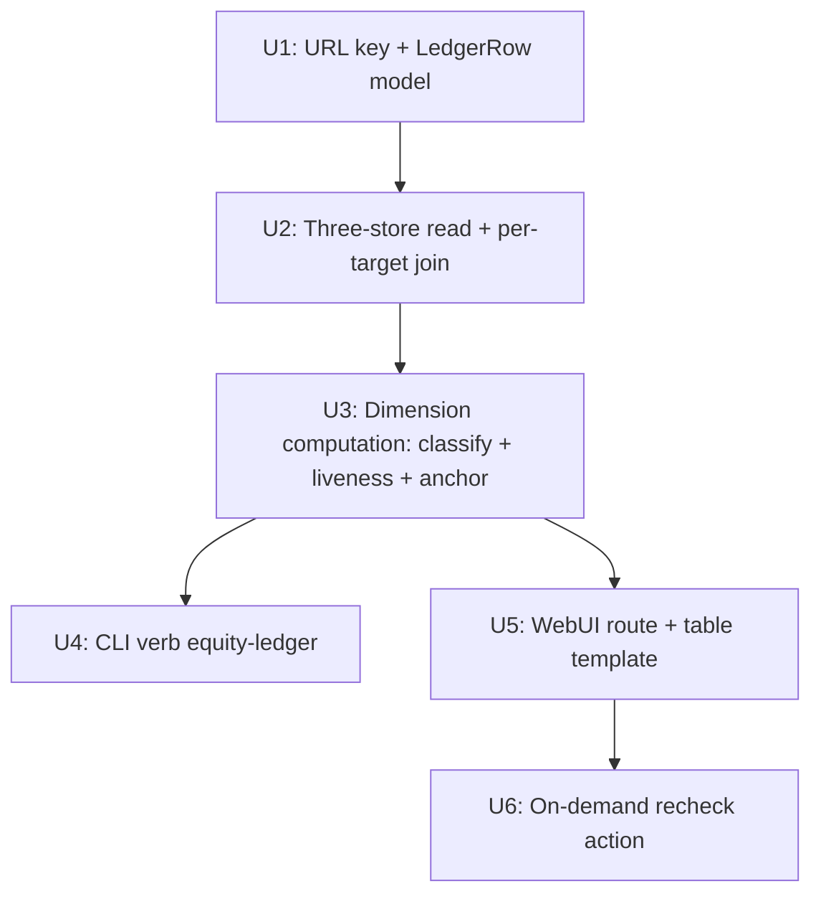

# feat: Backlink Equity Ledger — per-target read-only scorecard

## Overview

A read-only, per-target-URL backlink scorecard. It answers "what does each target page actually have working for it right now?" by joining three existing stores into one per-target view: `events.db` (article→target inventory, host, published/attempted counts), the WebUI `history_store` JSON (platform + `verified_at`/`verify_error` liveness), and the anchor-profile store (`anchor_type` for exact-match%). It composes the already-shipped registry capabilities (`dofollow_status`, `referral_value`) into decomposed dimensions — **no composite "equity index" score**. Surfaced as a CLI verb emitting per-target JSONL and a WebUI table rendered from the same in-process aggregation. Liveness is read-only (staleness flag); the only mutation is an operator-clicked recheck.

## Problem Frame

The operator can see *what was published* (flat publish history) but not *what each target page has working for it now*. The data exists but is scattered across three stores with no per-target rollup — today's `report-anchors` stops at `main_domain`. The ledger composes the scattered signals per target page (see origin: docs/brainstorms/2026-05-25-backlink-equity-ledger-requirements.md). It is a **diagnostic scorecard**, explicitly not a recommender and not a background monitor.

## Requirements Trace

- R1. Aggregate per **target URL** (normalized canonical key), not per main domain. *(see origin R1)*
- R1a. Row universe = **all attempted targets** (failed/never-published shown as `0/0`), read from the `events` table, not only `articles` with a `live_url`. *(origin R1a)*
- R2. Core aggregation is **pure read-side**; the only mutation is the WebUI recheck (R9, **WebUI only**). The CLI never mutates/fetches. *(origin R2)*
- R3. Classify each link by its platform's `dofollow_status` (True/uncertain/False) from the registry, with the documented temporal-drift caveat. `referral_value` (high/low) is a **nofollow sub-grade only** (the registry returns `None` for dofollow platforms by design) — so it tiers nofollow links, not dofollow ones. *(origin R3)*
- R3a. Unknown/retired platform → explicit `unknown` bucket, detected via `dofollow_status(platform) is None` (NOT `referral_value is None`, which is also `None` for registered dofollow platforms). *(origin R3a)*
- R4. Decomposed dimensions only — no composite index. *(origin R4)*
- R5. Per-target dimensions: total vs confirmed-live links; dofollow breakdown (dofollow / uncertain / nofollow / unknown); a single **live-dofollow headline count** (no tier — dofollow links carry no high/low sub-grade); nofollow links sub-graded high/low via `referral_value`; exact-match anchor %; distinct platform count; liveness freshness. The nofollow high/low sub-grade + per-platform breakdown are expandable detail. *(origin R5)*
- R5a. Information hierarchy + three empty states (no targets / no links / day-one all-`unverified` shown neutrally, not red `0`). *(origin R5a)*
- R6 / R6a / R6b. Sortable per dimension; non-composite default sort + threshold highlighting (incl. exact-match% over the existing `[anchor_alarm]` threshold) + a **liveness-status filter** + a **free-text target-URL filter**; aggregate stale-count badge computed at load. *(origin R6/R6a/R6b)*
- R7 / R7a. Read-only liveness rendered as `live-as-of <date>` / `unverified` / `stale` / `failed`, verify date always inline; precedence `failed > stale > live-as-of > unverified`; multi-link rows map worst-status-wins with a row-level qualifier. *(origin R7/R7a)*
- R8. Staleness threshold default 30d, overridable via CLI flag + WebUI query param — **not** a persisted config section. *(origin R8)*
- R9 / R9a. WebUI on-demand recheck via existing `recheck_one()`; explicit interaction states (in-progress/disabled/delta-summary/error); single recheck at a time; downgrade framed as a finding. *(origin R9/R9a)*
- R10. CLI verb emits per-target JSONL, read-only, scriptable; reads all three stores in-process. *(origin R10)*
- R11. WebUI page renders the same rows from the **same in-process aggregation** (not subprocess); net-new table (seo_viz has none to inherit). *(origin R11)*

## Scope Boundaries

- Not a recommender; no composite index; no scheduler/background monitor/recheck-on-load; no new persistent liveness store; no GA4/indexation; CLI does not mutate or fetch. *(origin Scope Boundaries)*
- No publish-time data capture (the rejected Q1c snapshot option) — temporal-drift accepted as a caveat for v1.

## Context & Research

### Relevant Code and Patterns

- **CLI template:** `src/backlink_publisher/cli/report_anchors.py` (`main(argv=None)`, argparse, stdout=JSONL via `_util/jsonl.write_jsonl`, stderr banner via `config_echo.emit_banner`, `raise SystemExit(code)`, `if __name__=="__main__": main()` guard at bottom). Mirror for the new verb.
- **events.db read:** `from backlink_publisher.events import EventStore` → `EventStore().query(sql, params)` (`events/store.py:359`, SELECT-only, returns `list[sqlite3.Row]`, WAL-safe). `articles.target_urls_json` is a **JSON array** (explode in Python / `json_each()`); `events.target_url` is scalar with `kind`. Schema: `events/schema.py:35/51`.
- **history_store read:** `from webui_store import history_store` → `history_store.load()` (list[dict] with `id, status, target_url, article_urls, published_url, title`). `webui_store/__init__.py:35` wraps it in `_LazyStore` that re-resolves `BACKLINK_PUBLISHER_CONFIG_DIR` per access (`base.py:155`).
- **anchor metrics:** `anchor/profile.py:load_profile(main_domain) -> ProfileState` (empty on miss, never raises); `anchor/metrics.py:153 group_by_target_url(state) -> dict[target_url, list[ProfileEntry]]`; `exact_match_ratio(entries) -> float` (`metrics.py:181`). `ProfileEntry` carries `target_url`, `anchor_type`. Precedent: `cli/_report_format.py` `_build_profile_report`.
- **registry capabilities:** `from backlink_publisher.publishing.registry import dofollow_status, referral_value` (`registry.py:266/275`); both return `None` for unregistered/retired → the R3a `unknown` bucket. `None` ("uncertain"/unknown) must render distinctly from `False`.
- **URL dedup key:** `_util/url.py:124 canonicalize_url(url)` — idempotent dedup-key normalizer ("R17 dedup key support"), strips default ports. The R1 normalization key — reuse, not net-new (confirm it folds trailing-slash/case/utm; extend if not).
- **WebUI route:** blueprint pattern (`webui_app/routes/seo_viz.py`), register in `webui_app/routes/__init__.py:27/32`; render via `webui_app/helpers/contexts.py:381 _render` (auto-injects context, fail-safe); templates in `webui_app/templates/`. seo_viz is a JSON chart API (subprocesses `report-anchors`) — **no reusable table**.
- **recheck:** `webui_app/services/recheck.py:70 recheck_one(item: dict, *, verify_fn=..., max_wait_per_url=10) -> dict` (mutation dict; `_outcome` key). Invoked like `routes/history.py:139`. `verify_fn` is the mock seam.
- **CLI smoke registry:** `tests/test_cli_python_m_entrypoints.py:38 _CLI_MODULES` (mirrors `webui_app/helpers/.../cli_runner.py` `_CLI_MODULES`, kept in sync manually).

### Institutional Learnings

- `logic-errors/python-m-needs-main-module-after-package-split-2026-05-19.md` — single-file `cli/equity_ledger.py` + `if __name__` guard avoids the `__main__.py` trap; add to the CI smoke loop.
- `logic-errors/argparse-choices-vs-usage-error-exit-clash-2026-05-20.md` — closed-set flags post-parse-validate via `UsageError` (exit 1), not `choices=` (exit 2).
- `best-practices/publish-history-helper-invariant-2026-05-20.md` — trust `status=published ⟹ url`; never re-validate; any write-back goes through the canonical helper, never direct `update/append`.
- `best-practices/medium-liveness-probe-partial-spike-2-2026-05-19.md` + `ui-bugs/webui-blocking-subprocess-and-missing-progress-feedback-2026-05-12.md` — one-shot operator-clicked recheck is the blessed pattern; never auto-poll; loading overlay + disabled-during-call to prevent double-submit; no per-row network at render.
- `best-practices/standalone-page-vs-retrofit-webui-2026-05-15.md` — add as a self-contained sibling page, don't retrofit a monolithic template; don't share Jinja banner constants.
- `test-failures/tests-coupled-to-operator-config-state-2026-05-18.md` + `logic-errors/language-matches-always-true-no-op-gate-2026-05-14.md` — rely on the 4 autouse isolation fixtures, seed all three stores into the sandbox; write behavior-asserting join tests, not shape-only (`code==0` + empty stdout is an empty-join smell).
- MEMORY `feedback_mock_patch_paths_after_extraction` — `mock.patch` targets follow the function to where it is *looked up*; the ledger's `verify_fn`/registry lookups must be patched at the ledger module, not the origin.

### External References

- None — internal tooling over existing local stores with strong local patterns (5+ existing CLI verbs, existing routes, existing recheck). External research skipped.

## Key Technical Decisions

- **Shared in-process aggregation library is "the engine" (resolves origin Q1 + deferred R11).** A `ledger/` library does the three-store join; the CLI wraps it for JSONL, the WebUI imports it directly for HTML. Rejected subprocessing `report-anchors`-style (the `seo_viz` subprocess swallows exit 6 and breaks on empty stdout). One code path → **same logic; counts match iff both surfaces resolve the same config/cache dirs** (proven by the parity test running CLI-subprocess + WebUI-in-process against one sandbox, not assumed).
- **Join cardinality (corrected by review): one target → many article rows, not one article → many targets.** The projector writes `articles.target_urls_json` as a single-element `[target_url]` and explodes each history row's `article_urls` list into one `articles` row per `live_url` (`projector.py:396,481`). So the engine **GROUPs articles BY `canonicalize_url(target_url)`** — it does not explode `target_urls_json`. The headline fragmentation risk lives in this collapse.
- **All join sides canonicalized.** `articles.live_url` is already canonical (projector pre-canonicalizes it); `history.article_urls`, `history.target_url`, and `ProfileEntry.target_url` are **raw** — the engine runs each through `canonicalize_url` before matching. Reuse `_util/url.py:canonicalize_url` (origin Q4); its docstring confirms it folds case/host/trailing-slash/utm (no extension needed; non-utm trackers like `fbclid` are a documented v1 gap).
- **dofollow from registry `dofollow_status()`; `unknown` = `dofollow_status() is None`.** Not `referral_value` (which is `None` for registered dofollow platforms — a nofollow sub-grade). Reuse the existing tier mapping in `cli/_report_format.py:_classify_tier`. `None` renders distinctly from `False`.
- **Recheck is per history-row, not per-target (resolves deferred Q).** One canonical target can be backed by multiple history rows; the U2 join therefore **carries each history item `id`** into the bucket. Recheck iterates every matched row, calls `recheck_one(item)`, writes back via `_history_store.update_item(item_id, **mutation)` (the canonical helper — "never hand-edit the loaded list"), then the engine recomputes the target's worst-status. UI copy: "rechecked N rows touching this target."
- **Liveness read from `history_store` `verified_at`/`verify_error` only; worst-status-wins per target** (origin Q2). Keys are **absent** (not empty) on never-rechecked rows → read via `.get(...)`, absence ⇒ `unverified`. No new liveness store.
- **Temporal-drift accepted, not snapshotted** (origin Q3) — classification uses current registry values; verify date shown inline so a fresh label never implies present-tense `rel`.
- **Single-file `cli/equity_ledger.py`** (not a package) to dodge the `__main__.py` trap; closed-set flags post-parse-validated.

## Open Questions

### Resolved During Planning

- *Engine = subprocess or shared function?* → Shared in-process library.
- *Join cardinality?* → one target → many article rows; GROUP BY `canonicalize_url(target_url)` (not explode `target_urls_json`, which is single-element). *(was deferred; resolved against `projector.py:396,481`)*
- *Join-side canonicalization?* → `live_url` is pre-canonical; canonicalize `history.article_urls`/`target_url` and `ProfileEntry.target_url` before matching. `canonicalize_url` already folds case/slash/utm (docstring confirmed) — no extension; `fbclid`/`gclid` etc. are a documented v1 fragmentation gap.
- *Attempted-target event kinds for R1a?* → `publish.intent` / `publish.confirmed` / `publish.failed` (the projector's dotted kinds — NOT `planned`/`published`/`failed`). Universe = distinct `canonicalize_url(target_url)` over events with those kinds. *(resolved against `projector.py:262/308/337`)*
- *dofollow source + unknown detection?* → registry `dofollow_status()`; `unknown` = `dofollow_status() is None`. `referral_value` tiers nofollow links only.
- *Anchor exact-match% source?* → the anchor-profile store (per-entry `target_url`), NOT `articles.anchors_json` (which drops `anchor_type`). Enumerate domains via `SELECT DISTINCT host FROM articles`, `load_profile()` each, `group_by_target_url`, then **re-key each bucket through `canonicalize_url`** to match the join. Pre-bump entries land in the `""` domain-rollup bucket — surface that as a `(domain-level)` qualifier, not silent 0.0.
- *Recheck scoping?* → per history-row; carry item `id` through the join; iterate matched rows; worst-status recompute (see Key Decisions).
- *CLI module shape?* → single file + `if __name__` guard + `_CLI_MODULES` smoke entry (mirrored in `tests/test_cli_python_m_entrypoints.py` + `webui_app/helpers/cli_runner.py`).

### Deferred to Implementation

- Confirm `_LazyStore` re-resolves `BACKLINK_PUBLISHER_CONFIG_DIR` at access time from a CLI process (repo-research + feasibility say yes via `base.py:147-160`; MEMORY `feedback_webui_store_config_dir_frozen` predates the guard). Verify in the parity test; fallback = read `publish-history.json` directly via the config-dir resolver. (Affects U2.)
- Cite the exact `target_url → main_domain` derivation rule used at anchor-profile **write** time, so the ledger's read-side derivation matches (a wrong key returns an empty profile silently). (Affects U2/U3.)
- Whether non-utm tracking params (`fbclid`/`gclid`/`ref`) warrant adding to `canonicalize_url`'s denylist, or stay a documented v1 fragmentation gap. (Affects U1/U2.)

## High-Level Technical Design

> *This illustrates the intended approach and is directional guidance for review, not implementation specification. The implementing agent should treat it as context, not code to reproduce.*

Three-store join into one per-target row set. **All join keys = `canonicalize_url(target_url)`** (one target ← many article rows; `live_url` already canonical, other sides canonicalized on read):

```
events.db  articles (one row per live_url, all sharing target_url; host)
           + events (target_url, kind ∈ publish.intent/confirmed/failed)
        │  GROUP BY canonicalize_url(target_url)  ── universe = all attempted ─┐
history_store.load() (id, platform, verified_at/verify_error, article_urls,    │
        target_url, status) ── canonicalize sides; match live_url↔article_urls ┤→ per-target
anchor profile: DISTINCT host → load_profile(main_domain) → group_by_target_url │   buckets
        → ProfileEntry.anchor_type ── re-key bucket through canonicalize_url ───┘  (+ item ids)
                                                                          │
                              per bucket → LedgerRow dimensions:          ▼
   total/live counts · dofollow/uncertain/nofollow/unknown(=dofollow_status None) ·
   live-dofollow headline (no tier) · nofollow high/low sub-grade · exact_match_ratio ·
   distinct platforms · liveness(worst-status-wins per target, stale-days)
                                                                          │
                          ┌───────────────────────────────────────────────┤
                   CLI verb (JSONL→stdout)                        WebUI route (_render table)
```

## Implementation Units



- [ ] **Unit 1: URL dedup key + LedgerRow / dimension model**

**Goal:** Foundational pure types: the per-target normalization key and the `LedgerRow` (+ dimension) dataclasses that all downstream units produce/consume.

**Requirements:** R1, R4, R5

**Dependencies:** None

**Files:**
- Create: `src/backlink_publisher/ledger/__init__.py`, `src/backlink_publisher/ledger/model.py`
- Test: `tests/test_ledger_model.py`

**Approach:**
- Define `LedgerRow` (canonical target URL, total/live counts, dofollow breakdown dict incl. `unknown`, live-dofollow headline count, nofollow high/low sub-grade counts, exact_match_pct, exact_match_is_domain_level flag, platform_count, liveness status + verify date + row-level qualifier flag, backing history item ids). No composite score field (R4).
- Per-target key = `canonicalize_url(target_url)` — reuse as-is. Its docstring confirms it folds case/host/trailing-slash/utm and is idempotent, so **no extension is needed**; this unit does not re-test `canonicalize_url` (already covered by its own R17 dedup-key tests). Thin foundational unit — kept separate only for the pure-types/IO seam that the U2 join test relies on.

**Patterns to follow:** dataclass style in `anchor/profile.py:ProfileEntry`.

**Test scenarios:**
- Happy path: `LedgerRow` round-trips to/from the JSONL dict shape the CLI emits.
- Edge case: a row with zero links serializes to `0/0` cleanly with `unverified` liveness (R1a day-one).

**Verification:** model importable; JSONL round-trip stable; zero-link row renders `0/0` not a crash.

- [ ] **Unit 2: Three-store read + per-target join**

**Goal:** Read events.db, history_store, and the anchor profile, and join them into per-target buckets keyed by canonical URL, with the universe = all attempted targets.

**Requirements:** R1, R1a, R2, R10

**Dependencies:** Unit 1

**Files:**
- Create: `src/backlink_publisher/ledger/sources.py`
- Test: `tests/test_ledger_sources.py`

**Approach:**
- events.db: `EventStore().query(...)`. **GROUP `articles` BY `canonicalize_url(target_url)`** (one target ← many `live_url` rows; do NOT explode `target_urls_json`, which is single-element). Pull `live_url` (already canonical), `host`, `published_at_utc`. Universe (R1a) = distinct `canonicalize_url(target_url)` over `events` WHERE `kind IN ('publish.intent','publish.confirmed','publish.failed')` ∪ article targets, so failed/never-published targets appear as `0/0`.
- history_store: `history_store.load()`; **canonicalize** `article_urls`/`target_url` before matching `article_urls ↔ articles.live_url`; carry `id` (for U6), `platform`, `verified_at`, `verify_error`, `status`. Confirm `_LazyStore` config-dir re-resolution (deferred); fallback = direct `publish-history.json` read via the resolver.
- anchor profile: **`host` is the publishing platform, NOT the target site** — do not derive `main_domain` from `articles.host`. Profiles are keyed by the seed's `main_domain` (`record_article(row["main_domain"].rstrip("/"), …)`, `_payload.py:80`). Cleanest: add an additive `anchor.profile.iter_profiles()` that globs `_profile_dir()/*.json` and `load_profile`s each (reuses the robust loader; recommended by review), then `group_by_target_url` and **re-key each bucket through `canonicalize_url`** — sidesteps fragile per-target→main_domain derivation. Missing/empty profile → no anchor data (distinct from 0.0); pre-bump `""` rollup bucket → `(domain-level)` flag.
- Pure read; no writes; no network.

**Execution note:** Characterize the join against a seeded fixture first — the one-target↔many-rows collapse and cross-store canonicalization are the documented fragmentation/mis-join risks.

**Patterns to follow:** `EventStore.query` usage in `tests/test_events_store.py`; `_build_profile_report` join shape in `cli/_report_format.py`.

**Test scenarios:**
- Happy path: one history row with 2 `article_urls` + 1 target → **one** bucket with 2 links (not 2 buckets); a target reached from rows on 2 platforms → one bucket, both platforms, item ids retained.
- Edge case: target with only a `publish.failed` event and no `live_url` → bucket present, `0/0` (R1a); assert the universe is non-empty for a failed-only fixture (guards the wrong-kind empty-filter bug).
- Edge case: raw vs canonical variants (trailing-slash/case/utm) of one page across all three stores collapse into one bucket, counts summed.
- Edge case: orphan history row (no matching article) and orphan article (no history) each render coherently (unverified / no-platform), no crash; never-rechecked rows lack `verified_at` key → `.get()` ⇒ `unverified`.
- Edge case: a target whose anchor profile is missing/under a mis-derived `main_domain` → "no anchor data", NOT silent 0.0.
- Integration: autouse-sandboxed `BACKLINK_PUBLISHER_CONFIG_DIR`/`_CACHE_DIR`, seeding all three stores → expected buckets; empty stores → empty result (not error).

**Verification:** seeded three-store fixture yields expected per-target buckets with correct link counts (none dropped/doubled); variant URLs don't fragment; failed-only target appears as `0/0`; empty config dir → empty list.

- [ ] **Unit 3: Dimension computation (classify + liveness + anchor)**

**Goal:** Turn joined buckets into `LedgerRow`s: dofollow×tier classification (+unknown), high-tier-live headline, exact-match%, platform count, and liveness status.

**Requirements:** R3, R3a, R5, R7, R7a, R8

**Dependencies:** Unit 2

**Files:**
- Create: `src/backlink_publisher/ledger/aggregate.py` (public entry, e.g. `build_ledger(stale_days=30) -> list[LedgerRow]`)
- Test: `tests/test_ledger_aggregate.py`

**Approach:**
- Classify each link by `dofollow_status(platform)`: `True`→dofollow, `False`/`"uncertain"`→nofollow-signal, `None`→`unknown` (R3a). **`unknown` is keyed off `dofollow_status() is None`, never `referral_value`** (which is `None` for registered dofollow platforms by design). Reuse `cli/_report_format.py:_classify_tier`.
- Tiering: `referral_value` (high/low) sub-grades **nofollow** links only; dofollow links have no tier. Headline = live-dofollow count (no tier).
- Liveness: read `verified_at`/`verify_error` via `.get()` (absent on never-rechecked rows ⇒ `unverified`); derive `live-as-of`/`unverified`/`stale`/`failed` + `stale_days`; precedence `failed > stale > live-as-of > unverified`; per-target worst-status-wins with a row-level-evidence qualifier (R7a).
- exact-match%: `exact_match_ratio` over the bucket's (canonicalized) `ProfileEntry` list; pre-bump `""` rollup entries surface a `(domain-level)` qualifier rather than silently dropping to 0.0.
- `build_ledger(stale_days=30)` is the single engine entry both the CLI (U4) and WebUI (U5) call.

**Patterns to follow:** `_classify_tier` + metric composition in `cli/_report_format.py`; registry accessors in `registry.py`.

**Test scenarios:**
- Happy path: dofollow/uncertain/nofollow links tally into the right buckets; live-dofollow headline = live ∧ dofollow; nofollow links sub-grade into high/low.
- Edge case: **registered dofollow platform** (`referral_value` None) lands in the dofollow bucket, NOT `unknown`; only `dofollow_status() is None` (retired/unregistered) → `unknown`.
- Edge case: stale boundary — verify at exactly `stale_days` vs one over flips `live-as-of`↔`stale`; `--stale-days` changes only the flag.
- Edge case: `failed` + 40-day-old link → `failed` (precedence), not `stale`.
- Edge case: never-verified target (no `verified_at` key) → `unverified`, live count `—/N` (not red `0`).
- Edge case: pre-migration anchors (`target_url==""`) → `(domain-level)` qualifier, not a misleading 0.0.
- Edge case: empty bucket → `exact_match_ratio` 0.0, platform_count 0, no divide-by-zero.
- Integration: full `build_ledger()` over the U2 fixture yields expected rows end-to-end.

**Verification:** dimensions match hand-computed expectations; dofollow platforms never fall into `unknown`; `unknown`/`None` never silently counted as nofollow; staleness precedence holds.

- [ ] **Unit 4: CLI verb `equity-ledger`**

**Goal:** A read-only CLI verb emitting per-target JSONL from `build_ledger()`.

**Requirements:** R2, R8, R10

**Dependencies:** Unit 3

**Files:**
- Create: `src/backlink_publisher/cli/equity_ledger.py`
- Modify: `pyproject.toml` (`[project.scripts]` add `equity-ledger = "backlink_publisher.cli.equity_ledger:main"`); `tests/test_cli_python_m_entrypoints.py` (`_CLI_MODULES`); the mirrored `_CLI_MODULES` in `webui_app/helpers/.../cli_runner.py`
- Test: `tests/test_cli_equity_ledger.py`

**Approach:**
- `def main(argv=None) -> None`; argparse with `--stale-days` (default 30, **post-parse `UsageError` validation** — not `choices=`; must be positive int) and `--json`/JSONL default; stdout = one JSON object per target via `_util/jsonl.write_jsonl`; stderr = `config_echo.emit_banner`; exit 0 on success.
- `if __name__ == "__main__": main()` guard at file bottom.
- Re-run `pip install -e ".[dev]"` after editing `[project.scripts]`.

**Execution note:** Start with a failing test asserting JSONL stdout shape + exit 0 for a seeded fixture.

**Patterns to follow:** `cli/report_anchors.py` end to end.

**Test scenarios:**
- Happy path: seeded stores → `main([])` emits one JSONL row per target on stdout, exit 0, banner on stderr only.
- Edge case: empty stores → zero rows, exit 0, no traceback.
- Error path: `--stale-days -5` / non-int → `UsageError`, exit 1 (not argparse exit 2).
- Integration: `python -m backlink_publisher.cli.equity_ledger --help` prints usage (the `_CLI_MODULES` smoke test) — guards the missing-`__main__` silent-failure.
- Edge case: stdout is pure JSONL (no banner leakage) — parse every stdout line as JSON.

**Verification:** verb resolves as console script and via `python -m`; stdout JSONL parses; bad flag exits 1; smoke test green.

- [ ] **Unit 5: WebUI route + table template**

**Goal:** A GET WebUI page rendering the ledger table from the same in-process `build_ledger()`.

**Requirements:** R5, R5a, R6, R6a, R6b, R11

**Dependencies:** Unit 3

**Files:**
- Create: `webui_app/routes/equity_ledger.py`, `webui_app/templates/equity_ledger.html`
- Modify: `webui_app/routes/__init__.py` (import + register tuple); nav template (link to the new page)
- Test: `tests/test_webui_equity_ledger_route.py`

**Approach:**
- Blueprint GET route (read-only → no CSRF concern); calls `build_ledger(stale_days=<?stale_days or 30>)` in-process (no subprocess); renders via `_render`.
- **Columns:** always-visible = target URL (middle-ellipsis truncation preserving host+path-tail, full URL via focusable tooltip/copy — not hover-only) / live·total / live-dofollow headline / exact-match% / liveness (verify date inline, non-color cue not color alone). Nofollow high/low sub-grade + per-platform breakdown behind a per-row **inline accordion** (chevron in the leading cell; multiple rows may be open; open state is client-side only; sort/filter/recheck preserve open rows).
- **Triage (R6/R6a/R6b):** per-column sort; default sort live-dofollow ascending; threshold highlighting on raw dimensions — `0` live-dofollow and any `failed` liveness, plus exact-match% over the **existing `[anchor_alarm]` config threshold** (read it; do not invent a cutoff); a **liveness-status filter** (all / has-failed / has-stale / all-live) + a **free-text target-URL substring filter**, both client-side, combinable with the active sort; aggregate stale/failed-count badge computed at load.
- **Empty states (R5a)** via template conditionals: no targets → "publish backlinks to populate"; targets-no-links → "planned, none published yet"; all-`unverified` → neutral `—/N` ("not yet verified"), never red `0`.
- **Accessibility:** sort headers and expand toggle are real buttons with `aria-sort`/`aria-expanded` + keyboard activation; liveness status carries a text/icon cue, not color alone.

**Patterns to follow:** blueprint + `_render` in `webui_app/routes/history.py`; sibling-page discipline (`standalone-page-vs-retrofit`).

**Test scenarios:**
- Happy path: GET 200, table lists seeded targets with correct counts.
- Edge case: `?stale_days=7` changes the stale flags/badge; liveness filter "has-failed" narrows the row set; URL substring filter matches/non-matches; filter composes with active sort.
- Edge case: exact-match% over the configured `[anchor_alarm]` threshold is highlighted (reads the config, not a hardcoded cutoff).
- Edge case: no targets / targets-no-links / all-`unverified` each render the specified copy; all-`unverified` shows neutral `—/N`, not red `0`.
- Edge case: expanded accordion renders the nofollow sub-grade + per-platform cells; expansion survives a sort.
- Integration (engine parity): route rows equal a CLI-subprocess invocation over the **same sandboxed `BACKLINK_PUBLISHER_CONFIG_DIR`/`_CACHE_DIR`** (proves "same logic, same inputs"; doubles as the `_LazyStore` config-dir verification).

**Verification:** page renders against seeded sandbox; filters + threshold highlight work; CLI-subprocess and route rows are identical for one fixture; empty/all-unverified copy correct.

- [ ] **Unit 6: On-demand recheck action**

**Goal:** A WebUI POST that rechecks one target's links via existing `recheck_one()` and refreshes the row, with explicit interaction states.

**Requirements:** R9, R9a

**Dependencies:** Unit 5

**Files:**
- Modify: `webui_app/routes/equity_ledger.py` (POST endpoint), `webui_app/templates/equity_ledger.html` (button + JS states)
- Test: `tests/test_webui_equity_ledger_recheck.py`

**Approach:**
- POST endpoint resolves **all history item `id`s carried in the target's bucket** (one canonical target ← many rows), calls `recheck_one(item)` per row, writes each back via `_history_store.update_item(item_id, **mutation)` (the canonical per-item helper — pop `_outcome` first, as `routes/history.py:140` does; "use `update_item`, do not hand-edit the loaded list"), then the engine recomputes the target's worst-status. Returns the refreshed row + a delta summary derived from per-row `_outcome` counts ("rechecked N rows touching this target: 9 confirmed, 2 failed, 1 skipped").
- **Delta-summary lifecycle:** rendered inline beneath the rechecked row (or a fixed banner if the row could be filtered out), persists until the next recheck or page reload; downgrade gets a warning treatment, all-confirmed a neutral one.
- **Post-recheck behavior:** update the row's cells + highlight **in place; do not re-sort** (avoids cursor-jump); a full re-sort happens only on reload/explicit re-sort.
- **CSRF + a11y:** POST carries `X-CSRFToken`. Client: disable button + spinner + "Rechecking N links…" during the serial (up to ~N×10s) call; single recheck at a time; status text + delta summary live in an `aria-live="polite"` region; downgrade framed as a finding (no undo). No background polling.

**Execution note:** Mock `verify_fn`/`verify_published` at the lookup site (memory: mock-patch-after-extraction). One-shot only.

**Patterns to follow:** `routes/history.py:139-141` recheck invocation (`update_item(item_id, **mutation)`); `publish-history-helper-invariant`; CSRF per `reference_webui_csrf_architecture`.

**Test scenarios:**
- Happy path: POST with mocked `verify_fn` → matched rows rechecked, each written via `update_item`, target row refreshed with worst-status, delta summary returned.
- Edge case: a target backed by **two history rows** → both rechecked, neither sibling target sharing a row is clobbered (assert per-id writes).
- Edge case: recheck downgrades a previously-live link → row shows `failed` in place (no re-sort), summary reports the downgrade (no crash, no undo); summary persists across a subsequent sort.
- Error path: POST without CSRF token → blocked by `_global_csrf_guard`; verify failure → inline error in the aria-live region, button re-enabled.
- Integration: write-back goes only through `update_item` (assert no direct list mutation / `append`).

**Verification:** recheck writes per-row via `update_item`; no sibling clobber; CSRF enforced; in-place refresh without re-sort; one-shot (no auto-poll).

## System-Wide Impact

- **Interaction graph:** new CLI entrypoint (`pyproject` scripts + two `_CLI_MODULES` mirrors); new WebUI blueprint registered in `routes/__init__.py`; recheck reuses `recheck_one` + the history write helper. No change to the publish/validate pipeline.
- **Error propagation:** CLI raises `SystemExit` (0 normal; `UsageError`→1); read failures (missing stores) degrade to empty rows, not tracebacks; WebUI recheck failures render inline, never 500-with-HTML into a `fetch().json()`.
- **State lifecycle risks:** ledger is read-only except recheck, which mutates history rows only via the canonical helper (preserves `status=published ⟹ url`). No new persistent store. Reads must respect both `BACKLINK_PUBLISHER_CONFIG_DIR` (events.db + history) and `BACKLINK_PUBLISHER_CACHE_DIR` (anchor profiles).
- **API surface parity:** CLI JSONL and WebUI rows call the same `build_ledger()` — same logic; identical output *iff* both resolve the same config/cache dirs, proven by the U5 parity test (not assumed).
- **Phased delivery:** U1–U5 (the read-only diagnostic) is a shippable increment; U6 (recheck mutation) is a deferrable leaf that can land in a follow-up PR if its integration proves fiddly, without blocking the diagnostic value.
- **Integration coverage:** the three-store join (U2) and engine-parity (U5 == CLI) are the cross-layer behaviors mocks won't prove — covered by seeded-fixture integration tests.
- **Unchanged invariants:** `save_config` round-trip behavior, the publish pipeline, existing CLI verbs, and the registry/`recheck_one` contracts are untouched; the ledger only reads them (recheck reuses the existing write path unchanged).

## Risks & Dependencies

| Risk | Mitigation |
|------|------------|
| **Join cardinality inverted** (`target_urls_json` single-element; one target ← many article rows) → mis-counted multi-platform targets | GROUP BY `canonicalize_url(target_url)`, not explode (U2); test: one row, 2 article_urls → 1 bucket/2 links |
| **Anchor leg unbuildable** (no profile enumeration; raw-keyed `group_by_target_url`; silent empty on missing) | Enumerate via `DISTINCT host`, re-key buckets through `canonicalize_url`, surface "no anchor data" ≠ 0.0 (U2/U3) |
| **Recheck granularity** (`update_item` is per-row; one target spans rows) | Carry item ids through the join; recheck per row; recompute worst-status; assert no sibling clobber (U6) |
| **Wrong event kinds** empties the R1a universe (passes a shallow `code==0` smoke) | Use `publish.intent/confirmed/failed`; non-empty-universe assertion for a failed-only fixture (U2) |
| `dofollow_status` None vs `referral_value` None confusion → dofollow platforms misclassified `unknown` | `unknown` = `dofollow_status() is None` only; test a registered dofollow platform lands in dofollow (U3) |
| Target-URL fragmentation (non-utm trackers `fbclid`/`gclid` retained) | `canonicalize_url` folds case/slash/utm; non-utm trackers a documented v1 gap (deferred — extend denylist if needed) |
| CLI/WebUI count divergence via different config-dir resolution | Parity test runs CLI-subprocess + WebUI in-process against one sandbox (U5); verifies `_LazyStore` re-resolution |
| Recheck blocks page / double-submits / floods a platform | One-shot, disabled-during-call, single-at-a-time, aria-live, no polling (R9a + liveness-probe learning) |
| Missing `__main__` guard → silent exit-0 CLI | Single-file module + guard + dual `_CLI_MODULES` smoke test (U4) |
| New `ledger/` modules drift toward the monolith budget | Keep `aggregate.py` lean; add a `monolith_budget.toml` entry in the same PR only if a ceiling is crossed |

## Documentation / Operational Notes

- Add the `equity-ledger` verb to `AGENTS.md` CLI list and the pipeline table; note `--stale-days` and that it's read-only.
- No migration, no rollout flag, no monitoring change — additive read-only feature.

## Sources & References

- **Origin document:** [docs/brainstorms/2026-05-25-backlink-equity-ledger-requirements.md](docs/brainstorms/2026-05-25-backlink-equity-ledger-requirements.md)
- Related code: `cli/report_anchors.py`, `events/store.py:359`, `anchor/metrics.py:153/181`, `publishing/registry.py:266/275`, `_util/url.py:124`, `webui_app/services/recheck.py:70`, `webui_app/routes/seo_viz.py`
- Ideation lineage: `docs/ideation/2026-05-25-round7-fresh-pass-ideation.md` (idea #1)
