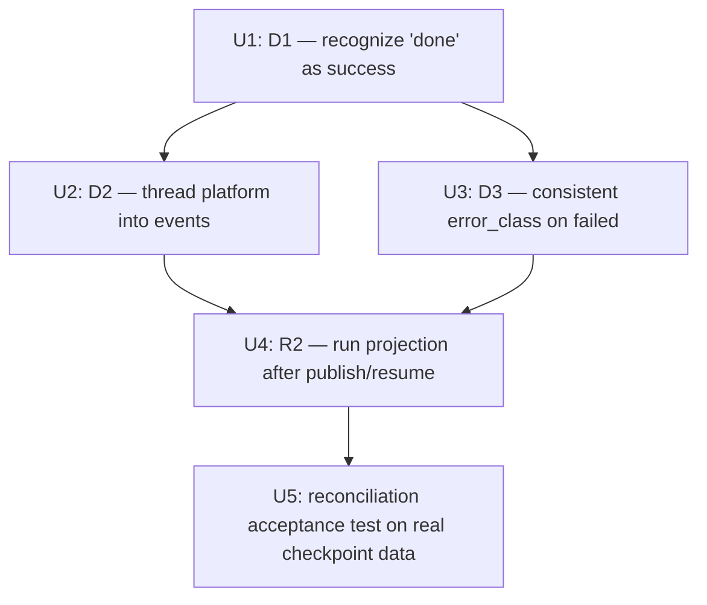

# fix: Events projector correctness (D1–D4 + R2)

## Overview

The `events.db` read-side projection (`events/projector.py`) is quietly wrong, and
worse, **it is never run in production**. Three reducer defects (D1–D3, verified
against source during the health-dashboard brainstorm review) mean any metric built
on `events.db` would lie; and a fourth, broader fact — `flush_for()` has **zero
production callers** — means the store is empty in production regardless of how
correct the reducers are.

This plan is the **bounded, correctness-only prerequisite** the health-dashboard
requirements doc demands before any view is built (see origin → "Implication for
scope"). It does not build any dashboard, view, or aggregation query. It makes the
projection (a) emit a `publish.confirmed` event for the real production success
status, (b) carry publishing-platform attribution, (c) emit a consistent failed-event
shape, and (d) actually execute after a publish/resume so the store is populated.

## Problem Frame

The operator cannot answer "how is publishing doing lately?" The intended substrate
is `events.db` — a durable, append-only SQLite projection of the canonical JSON
(checkpoint / history / drafts), rebuildable via `flush_for()`. But review verified
the substrate is not trustworthy:

- **D1 — successes silently dropped (P0).** Production publish writes checkpoint
  `status="done"` on success (`cli/publish_backlinks.py:265`, `cli/_resume.py:254`),
  but the checkpoint reducer only branches on `status=="succeeded"`
  (`events/projector.py:274`). `"done"` falls through **all** branches
  (`pending`/`succeeded`/`failed`), so **no `publish.confirmed` event is emitted for
  a real successful publish.** Existing projector tests pass only because the fixtures
  fabricate `status="succeeded"` (`tests/test_events_projector_checkpoints.py` — 7
  `succeeded` references, 0 `done`).
- **D2 — no platform attribution (P0).** The `events` table has columns
  `id/ts_raw/ts_utc/run_id/kind/target_url/host/article_id/payload_json`
  (`events/schema.py:35`) — no adapter/platform column, indexed by `host`. `host` is
  the *destination/SEO-target* domain, not the publishing platform. The checkpoint
  item carries `adapter` (written at `publish_backlinks.py:268`, `_resume.py:255`) but
  the reducer drops it. History rows carry `platform` (`publish_backlinks.py:170/177`)
  — a naming split that must be normalized to one event field.
- **D3 — inconsistent failed-event shape (P1).** The checkpoint reducer writes
  `error_class` on `publish.failed` (`projector.py:330/336`); the history reducer
  writes only `error_message_clean`, no `error_class` (`projector.py:~516`). A failure
  projected from history is un-bucketable.
- **R2 — the projection never runs (verified, load-bearing).** `flush_for()` is
  imported and called **only by tests** (`tests/test_events_projector_*.py`); there is
  **no caller in `cli/` or `webui_app/`**. The `events` table is **not** entirely empty
  in production — `cli/_publish_helpers.py:52/126` and `cli/plan_backlinks/_banners.py:40`
  write *banner* events via direct `EventStore.append`. But the **projection rows**
  (`publish.confirmed` / `publish.failed` and `articles`) that `flush_for` produces are
  absent: no run ever projects. Fixing D1–D3 is necessary but not sufficient — without
  wiring the projection into the pipeline (or a project-on-read path), the dashboard
  reads no publish outcomes.
- **D5 — `done` in the checkpoint does not encode verification state (P0, verified).**
  On verification failure, production still writes checkpoint `status="done"`
  **unconditionally** (`publish_backlinks.py:264`, `_resume.py:254`); the `_unverified`
  marker is appended only to the **transient** output rows (`publish_backlinks.py:256`,
  `_resume.py:293`) / `unverified_ids` set, and the run then exits 5. The checkpoint the
  projector reads cannot tell a verified `done` from an unverified one. So a naive D1 fix
  (`done`→`publish.confirmed`) would project publishes the CLI itself rejected as
  unverified (exit 5) as **confirmed successes** — re-introducing the "metric that lies"
  this plan exists to kill. See Key Technical Decisions for the handling decision.

## Requirements Trace

Carried from the origin's "Projection Correctness — verified prerequisites" block
(see origin: docs/brainstorms/2026-05-25-publishing-health-dashboard-requirements.md):

- **R1** — The checkpoint projector MUST emit `publish.confirmed` for the production
  success status `"done"` (fix D1). Reconciliation of a real completed run's outcome
  counts against `events.db` totals MUST match (no silent undercount). *(origin R1)*
- **R2** — Publish outcomes MUST reach `events.db` after a run and after resume.
  `flush_for()` is not auto-invoked today; a never-projected run MUST be reconciled
  before display or visibly flagged as an unprojected gap. *(origin R2)*
- **R3** — The publish event MUST carry publishing-platform attribution so outcomes
  can be grouped by platform (fix D2). Failures before adapter dispatch (e.g.
  validation) MUST be representable as "unattributed". *(origin R3)*
- **R4** — `publish.failed` events MUST carry a consistent `error_class` across both
  checkpoint and history sources (fix D3); failures lacking a class surface in an
  explicit "unclassified" bucket, never silently folded into a real class. *(origin R4)*

This plan stops at R1–R4 + R2 wiring. R5–R12 (freshness signal, hero, per-adapter
table, error distribution, broken-channels banner, empty states, placement) are the
**view layer** and are explicitly out of scope here (a separate follow-up plan).

## Scope Boundaries

- **NOT** any dashboard view, aggregation query, hero, table, banner, or template
  (R5–R12). This plan only makes the substrate correct and populated.
- **NOT** a new persistence system, generic event/hook framework, or pub/sub layer —
  there is exactly one consumer (the future dashboard) and one writer (`flush_for`).
- **Approved scope exception (D5, operator 2026-05-25):** one new field — a `verified`
  flag on the `done` checkpoint write — is the *only* permitted production write-path
  change beyond the projector/wiring. It is required to stop unverified publishes being
  counted as successes. No other production write change is in scope.
- **NOT** auto-retry, backoff, dead-letter, or proactive channel verification.
- **NOT** a `skipped_unreachable` → event mapping unless it falls out for free — the
  origin excludes `skipped_unreachable` from the success denominator (R6), so v1 may
  leave it unprojected; emitting a `publish.skipped` event is a deferred nicety.
- **NOT** a back-derivation classifier for `error_class` from free-text messages — D3
  only requires the *field to be present and consistent* (None → "unclassified"),
  not a new classification engine.
- **History-reducer correctness is fixed but stays UNWIRED in production.** U4 wires
  `flush_for` on the **checkpoint** path only; `publish-history.json` is written WebUI-side
  and nothing calls `flush_for` on it. So the D2/D3 edits to the *history* reducer (U2/U3)
  are correctness-only and exercised by tests, not run in production, until the dashboard
  plan adds a project-on-read (or a WebUI-side trigger). This is acceptable because the
  checkpoint path already carries every CLI/WebUI publish outcome; the history reducer is
  a secondary source. Stated so no implementer assumes the history fixes take effect now.

## Context & Research

### Relevant Code and Patterns

- **Projector reducers:** `events/projector.py` — `_reduce_checkpoint` (status branches
  `pending`/`succeeded`/`failed` at ~253/274/325) and `_reduce_history` (status branches
  incl. `failed` at ~516). Each branch calls `store.append(kind, payload_dict, *, run_id,
  target_url, host, article_id, ts_raw, ts_utc, conn)` (`events/store.py:245`). Mirror
  the existing append-call shape exactly.
- **Production success/failure writes:** `cli/publish_backlinks.py:264` (`"done"` +
  `adapter=result.adapter`, `published_url`, `completed_at`) and `:151/161`
  (`skipped_unreachable` / `failed`); `cli/_resume.py:253` (`"done"` + `adapter`),
  `:67/121/216` (`"failed"`, `error=`, `error_class=`). `checkpoint.update_item(run_id,
  item_id, status, **fields)` (`checkpoint.py:126`) — generic kwargs, so any field
  passed lands in the item dict.
- **History rows carry `platform`** — written WebUI-side by `webui_app/helpers/history.py`
  parsing `publish-backlinks` stdout, **not** by `publish_backlinks.py:170/177` (that is
  the dry-run output dict). **Checkpoint items carry `adapter`.** The fix must normalize
  both into one event field (proposed: `platform` in `payload_json`).
- **The WebUI publishes by shelling out to the CLI** (`webui_app/scheduler.py:59/105`,
  `routes/batch.py`, `routes/pipeline.py`, `routes/checkpoint.py` all run
  `publish-backlinks` / `--resume` via `run_pipe`). So wiring `flush_for` into the CLI
  entrypoints (U4) covers WebUI-driven publishing **transitively** — there is no separate
  in-process WebUI writer path to wire.
- **events.db is rebuildable, append-only, never pruned** (`events/store.py`). Because
  it is currently never written in production (R2), there is no precious historical
  data — a clean rebuild on first wired `flush_for` is safe (resolves the origin's
  "backfill?" deferred question).
- **Existing projector tests:** `tests/test_events_projector_checkpoints.py`,
  `_history.py`, `_idempotency.py`, `_drafts.py` — each writes a JSON source under
  `tmp_path`, calls `flush_for(path)`, asserts rows via `EventStore.query`. The
  checkpoint tests are where the `succeeded`→`done` masking lives and must be corrected.
- **Idempotency contract:** `flush_for` uses a `projection_cursor` table + per-event
  dedup keys (`seen_intent_or_failed`, `add_article` `IntegrityError` on `live_url
  UNIQUE`). Any wiring (R2) must remain safe to call repeatedly — re-running on an
  already-projected source must be a no-op (existing idempotency tests guard this).

### Institutional Learnings

- `feedback_plan_review_grep_grounding_inverts_premises` — these defects were found
  only because reviewers grepped source and disagreed with an optimistic summary;
  every claim here is source-line-grounded. Verify against source again before editing,
  since the working tree is mid-sweep (see Risks).
- `feedback_mock_patch_paths_after_extraction` — if any helper moves modules, `mock.patch`
  targets follow the lookup site.
- MEMORY `events projector 丟成功 bug` — this plan is the "建健康仪表板前必修" item.
- `docs/solutions/` publish-history-helper-invariant — `status=published ⟹ url`; the
  projection trusts canonical JSON outcomes, never re-validates.

### External References

- None. Internal tooling over an existing local store with strong local patterns
  (4 existing projector test suites, an established `store.append` contract). External
  research skipped.

## Key Technical Decisions

- **D1 fix = recognize `"done"` as success in the checkpoint reducer**, not rename the
  production status. Changing `elif status == "succeeded":` to accept both `"done"`
  (production) and `"succeeded"` (legacy/test) is the minimal, backward-compatible
  change; renaming the production write would ripple through `_resume.py`'s
  `status == "done"` filters (`:152/161/254/282`) and the WebUI history, a far larger
  blast radius for no gain.
- **D5 — handling unverified `done` (the success-overcount fork — needs a product call,
  flagged for Resolve Before Implementation).** Because verification state never reaches
  the checkpoint, the projector cannot exclude unverified publishes from
  `publish.confirmed` without a change. Two options, with a scope tradeoff:
  - **(a) Small production write change** — persist the verification outcome into the
    checkpoint item (e.g. a `verified` flag alongside the `done` write at
    `publish_backlinks.py:264` / `_resume.py:254`), and have the reducer emit
    `publish.confirmed` only for verified `done`, an explicit unverified signal otherwise.
    **Most correct; breaches this plan's "no production write change" scope boundary by
    one field.**
  - **(b) Stay strictly read-only, document the limitation** — project all `done` as
    confirmed and record in the plan + dashboard contract that the confirmed count
    *includes* unverified publishes, leaving the correction to the view layer. **Honors
    the scope boundary but ships a known-imprecise success metric.**
  **Decided: (a), operator-approved 2026-05-25.** A one-field checkpoint write is the
  minimal change that keeps the substrate honest; "unverified counted as success" is
  exactly the lie the dashboard must not tell. The `verified` flag write lands in U1
  (production write sites), and the reducer gates `publish.confirmed` on it.
- **Article insertion must guard `published_url is None`.** `articles.live_url` is
  `TEXT UNIQUE` **nullable** (`schema.py:58`); SQLite permits multiple NULLs, so
  `add_article(live_url=None)` **inserts** a NULL-`live_url` article row (it does not skip
  it, and url-less repeats do not collapse). The success branch must skip `add_article`
  when `published_url` is None and still emit the `publish.confirmed` event. (Corrects an
  earlier-drafted, inverted assumption that NULL non-equality meant "no article row".)
- **D2 storage = a `platform` key inside `payload_json`, not a new schema column (v1).**
  Rationale: keeps the fix bounded (no schema migration, no `schema_version` bump); the
  single-operator event volume makes a live `json_extract(payload_json,'$.platform')`
  GROUP-BY cheap for the future per-adapter table (R7). A dedicated indexed column is
  recorded as the alternative if R7 aggregation later proves slow — deferred, not done
  here. This is the **one shared shape** the equity-ledger brainstorm (origin
  Dependencies) must converge on: platform lives in the event payload, keyed `platform`.
- **Normalize the field name to `platform`.** Checkpoint reducer reads `item.get("adapter")`,
  history reducer reads the row's `platform`; both write the event payload key `platform`.
  Pre-dispatch failures (no adapter resolved) write `platform=None` → the "unattributed"
  representation R3 requires.
- **D3 fix = history reducer always writes `error_class` (value may be `None`).** The
  failed-event payload shape becomes identical across both sources: `{error_class,
  error_message_clean, scrub_hits}`. `None` is the explicit "unclassified" signal R4
  wants — no back-derivation classifier (out of scope).
- **Event emission is currently coupled to article insertion — U1 must decide whether
  to decouple it (load-bearing for the reconciliation rule).** Both reducers, on an
  `articles.live_url UNIQUE` `IntegrityError`, do `skipped_due_to_dedup += 1; continue`
  — which skips the entire `store.append("publish.confirmed", …)` call
  (`projector.py:~301–303` checkpoint, `~496–498` history). So `live_url UNIQUE` dedups
  the **event**, not just the duplicate **article** row. Consequence: a legitimate
  re-publish that lands the **same** `live_url` (a retry that succeeds at the same URL,
  or the same outcome reaching both checkpoint and history) emits **zero** confirmed
  events the second time — an undercount. **Decision for U1:** keep article-coupled
  emission (one confirmed event per *distinct* `live_url`) and make the reconciliation
  rule (U5) count distinct live URLs, documenting same-URL repeats as an accepted
  event-undercount — rather than decoupling emission (a larger behavior change). The
  duplicate-URL case must be an explicit U1 test, not an unstated assumption.
- **`publish.failed` events have NO cross-source dedup.** Failures carry no `live_url`,
  so the `UNIQUE` mechanism cannot collide them; checkpoint dedups failures on
  `(run_id, target_url)` *within one flush* (`projector.py:326`), history dedups on
  `row_id` via the cursor — there is no key shared across the two sources. If both the
  checkpoint and the history file are ever projected for the same run, the same logical
  failure produces **two** `publish.failed` events. **Decision:** U5 reconciles from a
  **single source** (checkpoint only, matching U4's wiring); the future dashboard must
  not sum failures across both sources without a new failed-event dedup key (noted in
  System-Wide Impact). This plan does not add cross-source failure dedup.
- **R2 wiring = inline project-after-write at the end of publish and resume**, reusing
  the existing checkpoint path as `flush_for`'s source, guarded so a projection failure
  never fails the publish (log + continue). Rationale: reuses an existing invocation
  point (the origin's constraint — "do not build a hook framework"); `flush_for` is
  idempotent, so a later project-on-read by the dashboard remains safe as a backstop.
  Project-on-read alone is rejected as the *primary* trigger because a crashed-mid-batch
  run would never project until someone opens the dashboard (origin R2's "unprojected
  gap").

## Open Questions

### Resolved During Planning

- **D5 — handling unverified `done`** → **Option (a), operator-approved 2026-05-25:**
  persist a `verified` flag into the checkpoint item alongside the `done` write
  (`publish_backlinks.py:264`, `_resume.py:254`); the reducer emits `publish.confirmed`
  only for `verified` `done`, and an explicit unverified signal (a `verified=false`
  payload flag on the confirmed event, or a distinct `publish.unverified` kind) otherwise.
  This is a deliberate, approved **one-field production write-path expansion** beyond the
  origin's "correctness-only projector" boundary — accepted because counting unverified
  (exit-5) publishes as successes is precisely the lie the substrate must not tell.

- *Normalize on `"done"` in the projector or rename the production status?* → Recognize
  `"done"` in the projector (minimal blast radius). *(origin "Affects R1")*
- *Is a `bp-events-rebuild` backfill needed for historically-dropped successes?* → No.
  `flush_for` has never run in production, so **no `publish.confirmed`/`articles`
  projection rows exist to be wrong** — the first wired `flush_for` builds them fresh.
  (The `events` table *does* hold pre-existing banner-event rows written via direct
  `EventStore.append` — `_publish_helpers.py:52/126`, `_banners.py:40` — but those are a
  different `kind` and are not touched by this fix. "Clean rebuild" applies to the
  projection rows only, not the whole table.) *(origin "Affects R1")*
- *Platform attribution as a new column, a `payload_json` field, or a shared schema?* →
  `payload_json` field keyed `platform` (no migration); the converged shape for the
  equity-ledger coordination. *(origin "Affects R3")*
- *Where to trigger projection?* → Inline after publish/resume, fail-safe; dashboard
  project-on-read remains a safe backstop. *(origin "Affects R2")*

### Deferred to Implementation

- Exact insertion point and signature for the inline `flush_for` call in
  `publish_backlinks.py` / `_resume.py` (after the final checkpoint write, before the
  CLI emits its summary) — confirm `flush_for`'s source-path argument resolves the same
  checkpoint file the run just wrote, and that the config-dir is the active one. (U4.)
- Whether `skipped_unreachable` should emit any event. Default: leave unprojected (R6
  excludes it). Revisit only if the view layer needs the count. (U1.)
- Whether a `payload_json` `platform` field needs a covering expression index for R7 —
  measure during the dashboard plan, not here. (U2.)
- Confirm no *other* consumer reads `events.db` today that would be affected by the new
  `platform` payload key or the `done` recognition (repo-research said `flush_for` has
  no prod caller; re-confirm no read-side query exists outside the future dashboard). (U4.)

## High-Level Technical Design

> *This illustrates the intended approach and is directional guidance for review, not
> implementation specification. The implementing agent should treat it as context, not
> code to reproduce.*

Today (broken) vs. after this plan, for the checkpoint success path:

```
PRODUCTION WRITE                 CHECKPOINT REDUCER                 events.db
status="done"            today→  branches: pending|succeeded|failed   (no row — "done"
 adapter="medium"                 "done" matches none ──────────────►  falls through)
 published_url=...
                         after→  pending | (succeeded|DONE) | failed
                                  success branch reads item.adapter + item.verified (D5)
                                  if verified: store.append("publish.confirmed", ┌─ publish.confirmed
                                    {live_url, target_url, PLATFORM}) ──────────►│  payload.platform="medium"
                                    (skip add_article if live_url is None)        └─ + articles row (if url)
                                  else: unverified signal (verified=false) — no plain confirmed

FAILED PATH (shape parity)
checkpoint.failed → {error_class, error_message_clean, scrub_hits}   ┐ identical
history.failed    → {error_class:None→"unclassified", ...}           ┘ shape (D3)

PROJECTION TRIGGER (R2)
publish/resume end ─ inline, fail-safe ─► flush_for(checkpoint_path) ─► events.db populated
                                          (idempotent; dashboard read = safe backstop)
```

## Implementation Units



- [ ] **Unit 1: D1 — recognize the production success status `"done"`**

**Goal:** The checkpoint reducer emits `publish.confirmed` (+ an `articles` row) for the
real production success status `"done"`, not only the fabricated `"succeeded"`.

**Requirements:** R1

**Dependencies:** None

**Files:**
- Modify: `src/backlink_publisher/events/projector.py` (checkpoint reducer success branch, ~274)
- Modify: `src/backlink_publisher/cli/publish_backlinks.py` (~264) and
  `src/backlink_publisher/cli/_resume.py` (~254) — write the `verified` flag into the
  checkpoint item on the `done` write (D5 option (a))
- Test: `tests/test_events_projector_checkpoints.py` (add `done` cases; correct the
  masking), `tests/test_publish_backlinks.py` / `tests/test_resume*.py` (assert the
  `verified` flag is persisted)

**Approach:**
- Broaden the success branch condition to accept both `"done"` (production) and
  `"succeeded"` (legacy/test) — e.g. a single `_SUCCESS_STATUSES` set the branch tests
  membership against.
- **D5 (verified flag):** at the `done` checkpoint write, also persist the run's
  verification outcome (the `_unverified` signal already computed at
  `publish_backlinks.py:256` / the `unverified_ids` set at `_resume.py:275`) as a
  `verified` field on the item. The success branch emits `publish.confirmed` only when
  `verified` is truthy; an unverified `done` emits an explicit unverified signal
  (`verified=false` on the confirmed payload, or a `publish.unverified` kind) — never a
  plain confirmed. Legacy items lacking the field default to verified=true (backward
  compatible — pre-D5 `done`s were not distinguishable and are treated as before).
- **Article guard:** skip `add_article` when `published_url is None` (still emit the
  event) so url-less successes don't insert junk NULL-`live_url` rows.
- Add the production-shaped fixture (`status="done"`, `published_url`, `adapter`,
  `completed_at`, `verified`) and assert: verified→one `publish.confirmed` + one
  `articles` row; unverified→the unverified signal, no plain confirmed.
- Keep the existing `"succeeded"` test passing (backward compatible).

**Execution note:** Start with a failing test that feeds a `status="done"` checkpoint
item through `flush_for` and asserts a `publish.confirmed` row — it must fail against
current `main` before the one-line branch change makes it pass.

**Patterns to follow:** the existing `succeeded` branch body (`projector.py:274–323`);
test harness shape in `tests/test_events_projector_checkpoints.py` (write JSON → `flush_for`
→ `EventStore.query`).

**Test scenarios:**
- Happy path: checkpoint item `status="done"` with `published_url` → exactly one
  `publish.confirmed` event + one `articles` row; `live_url`/`target_url` populated.
- Happy path (regression guard): legacy `status="succeeded"` still produces the same
  `publish.confirmed` shape (no regression).
- Edge case: `status="done"` with empty/missing `published_url` → **1** `publish.confirmed`
  event and **0** `articles` rows **because the success branch skips `add_article` when
  `published_url is None`** (the new guard). Without the guard, `add_article(None)` would
  insert a junk NULL-`live_url` row (nullable `UNIQUE` permits it) — the guard is what
  makes the pinned `0 articles` true. Pin this number; U5 reconciles against it.
- Edge case (duplicate URL — load-bearing): two `done` items with the **same** non-null
  `published_url` in one checkpoint → assert the confirmed-event count is **1**, not 2
  (the second `add_article` raises `IntegrityError` → `skipped_due_to_dedup` → no event).
  This is the accepted event-undercount the U5 distinct-URL rule depends on. (Two *url-less*
  `done` items do **not** collapse — with the None-guard they emit 2 confirmed events and 0
  articles; assert this separately so the two cases are not conflated.)
- Edge case (unverified `done` — D5 option (a)): a `done` checkpoint item with
  `verified=false` (run exited 5 unverified) → emits the unverified signal, **not** a plain
  `publish.confirmed`; a `verified=true` `done` emits `publish.confirmed`. The regression
  guard against the success-overcount.
- Edge case (legacy item, no `verified` field): defaults to verified=true → emits
  `publish.confirmed` (backward compatible with pre-D5 checkpoints).
- Edge case: re-running `flush_for` on the same `done` checkpoint is idempotent (no
  duplicate confirmed/article rows) — the `live_url UNIQUE` dedup holds.
- Integration: a mixed checkpoint (`pending` + `done` + `failed`) projects one event of
  each appropriate kind, none dropped.

**Verification:** a `done`-status run yields a `publish.confirmed` event; the previously
green-on-a-lie checkpoint suite now exercises the production status; idempotent re-flush.

- [ ] **Unit 2: D2 — thread publishing-platform attribution into events**

**Goal:** `publish.confirmed` (and `publish.failed`) events carry the publishing platform
in `payload_json` under a normalized `platform` key, so outcomes can later be grouped by
platform. Pre-dispatch failures are representable as unattributed (`platform=None`).

**Requirements:** R3

**Dependencies:** Unit 1

**Files:**
- Modify: `src/backlink_publisher/events/projector.py` (checkpoint reducer reads
  `item.get("adapter")`; history reducer reads the row's `platform`; both write payload
  `platform`)
- Test: `tests/test_events_projector_checkpoints.py`, `tests/test_events_projector_history.py`

**Approach:**
- Checkpoint reducer: in the success and failed branches, read `item.get("adapter")`
  and include `"platform": <that value or None>` in the appended payload dict.
- History reducer: include `"platform": row.get("platform")` in its confirmed/failed
  payloads, normalizing the source naming split (history uses `platform`, checkpoint
  uses `adapter`) onto the single event key `platform`.
- No schema change — `platform` lives in `payload_json`. Do **not** add an events column.
- **Touch every `store.append("publish.*", …)` site so the `platform` key is never
  absent** — including the history url-less confirmed sub-branch (`projector.py:~471`,
  currently `{live_url: None, target_url}`). The dashboard's `json_extract` GROUP-BY must
  see exactly two states (`None` = unattributed, a value = attributed), never a third
  "key absent" state that silently buckets out. Add a test asserting **no** `publish.*`
  event row has a missing `platform` key.

**Patterns to follow:** the existing `store.append(...)` payload dicts in both reducers;
keep the call signature identical, only widen the payload dict.

**Test scenarios:**
- Happy path: `done` checkpoint item with `adapter="medium"` → `publish.confirmed`
  `payload_json.platform == "medium"`.
- Happy path: history-sourced confirmed row with `platform="velog"` → event payload
  `platform == "velog"` (naming normalized from the row).
- Edge case: checkpoint item with no `adapter` (pre-dispatch / validation failure) →
  `platform` present and `None` (the "unattributed" representation), not omitted.
- Edge case: checkpoint `adapter` vs history `platform` for the same logical outcome
  resolve to the same payload key `platform` (no divergence between sources).
- Integration: query `publish.confirmed` rows and group by `json_extract(payload_json,
  '$.platform')` → non-null platforms for dispatched outcomes, an explicit `None`
  bucket for unattributed.

**Verification:** every projected publish event carries a `platform` payload key;
dispatched outcomes attribute correctly; pre-dispatch outcomes are explicitly `None`.

- [ ] **Unit 3: D3 — consistent `error_class` on failed events from both sources**

**Goal:** `publish.failed` events have an identical shape whether projected from the
checkpoint or the history source; the history reducer always writes `error_class`
(value `None` → the explicit "unclassified" bucket).

**Requirements:** R4

**Dependencies:** Unit 1

**Files:**
- Modify: `src/backlink_publisher/events/projector.py` (history reducer `failed` branch, ~516)
- Test: `tests/test_events_projector_history.py`

**Approach:**
- In the history `failed` branch, add `"error_class": row.get("error_class")` to the
  appended payload so the dict matches the checkpoint reducer's failed shape
  (`{error_class, error_message_clean, scrub_hits}`). History rows generally lack
  `error_class`, so this resolves to `None` — the deliberate, explicit "unclassified"
  signal. No free-text → class derivation (out of scope).

**Test scenarios:**
- Happy path: a history `failed` row → `publish.failed` event whose payload contains an
  `error_class` key (value `None` when the row has none).
- Happy path (parity): a checkpoint `failed` item with `error_class="auth_expired"` and a
  history `failed` row produce payloads with the **same key set** — assert structural
  parity, not just presence.
- Edge case: history row that *does* carry an `error_class` (if any path sets it) is
  preserved, not overwritten to `None`.
- Edge case: `error_message` scrubbing still applies (`scrub_hits` unchanged) — D3 adds a
  key, it must not regress redaction.

**Verification:** checkpoint- and history-sourced `publish.failed` payloads are
key-identical; missing class surfaces as `None`, never silently dropped.

- [ ] **Unit 4: R2 — run the projection after publish and resume**

**Goal:** After a publish run and after a resume run, the just-written checkpoint is
projected into `events.db` so the store reflects production outcomes. The call is
idempotent and fail-safe (a projection error never fails the publish).

**Requirements:** R2

**Dependencies:** Unit 2, Unit 3

**Files:**
- Modify: `src/backlink_publisher/cli/publish_backlinks.py` (after the final checkpoint
  write, before the summary emit), `src/backlink_publisher/cli/_resume.py` (after the
  resume loop's final checkpoint write)
- Test: `tests/test_publish_backlinks.py` (assert post-run projection), and/or a new
  `tests/test_events_projection_wiring.py`

**Approach:**
- After the run finishes writing its checkpoint, call `flush_for(<checkpoint_path>)`
  inside a `try/except` that logs to stderr and continues on any projection error — the
  publish result must not depend on projection success.
- Reuse the existing checkpoint-path/config-dir resolution the run already used; do not
  introduce a new path resolver. Confirm the path passed is the file the run just wrote.
- Rely on `flush_for`'s existing idempotency (cursor + dedup) so a resume that re-projects
  an already-seen run is a no-op.
- **Concurrency expectation (state it):** `EventStore.connect()` already sets
  `journal_mode=WAL`, `synchronous=NORMAL`, `busy_timeout=5000` — single-writer, so two
  concurrent `flush_for` callers (publish + resume, or publish + a future dashboard
  project-on-read) serialize; the second waits up to 5s then raises
  `sqlite3.OperationalError("database is locked")`. The fail-safe `except` MUST catch
  `sqlite3.OperationalError` (and `ProjectionError`), not just an abstract `Exception`
  narrowed too tightly — a lock timeout on the publish side must be non-fatal.
- **Observable projection health (so swallowed errors don't cause silent drift).** Because
  the `except` swallows projection failures and stderr is often truncated/unmonitored
  (memory `feedback_webui_stderr_preview_truncated`), a *deterministic* projection error
  (bad status, schema mismatch) would leave `events.db` permanently behind canonical JSON
  with no signal. Persist a durable health marker — e.g. `last_projection_ok_at` /
  `last_projection_error` in the `projection_cursor` table or a small meta row — updated on
  every wired `flush_for`. This lets the future dashboard (and an operator) see "projection
  is stale/failing" rather than silently trusting an out-of-date store. Transient locks
  (`OperationalError`) are expected/benign; a recurring deterministic error must be visible.
- **Checkpoint path resolution:** confirm a helper turns the run's `run_id` into the
  checkpoint file `Path` that `flush_for` consumes (the CLI holds `run_id`, not the Path).
  If none exists, derive it via the same `checkpoint` module resolver the run used — do not
  hand-roll a path. (Deferred detail; see Deferred to Implementation.)
- **Test isolation:** the autouse `_isolate_user_dirs` fixture is **session-scoped**
  (`conftest.py:17`) — every test shares one `events.db` and one `projection_cursor`. U4/U5
  run `flush_for`/the CLI end-to-end and assert exact counts + idempotency, so they MUST get
  a fresh store per test (a function-scoped tmp config dir, or pass `store=EventStore(path=
  tmp)` into `flush_for`, or unlink `events.db` in setup) — relying on the session fixture
  alone will cross-contaminate cursor/row state and make count assertions flaky.

**Execution note:** Start with a failing integration test: run the publish CLI against a
seeded sandbox, then assert `EventStore.query` returns the run's `publish.confirmed`
rows — it must fail today (no caller) and pass once wired.

**Patterns to follow:** existing `flush_for(path)` usage in
`tests/test_events_projector_checkpoints.py`; the fail-safe `try/except … print(…,
file=sys.stderr)` pattern already used around `checkpoint.update_item`
(`publish_backlinks.py:273`).

**Test scenarios:**
- Happy path: publish a `done` outcome via the CLI → `events.db` contains the matching
  `publish.confirmed` row afterward (end-to-end through the wiring, not a direct
  `flush_for` call).
- Happy path: resume that completes pending items → their outcomes appear in `events.db`.
- Error path: `flush_for` raising (e.g. simulated projection error) → the publish still
  exits 0 with its normal summary; the error is logged to stderr, not raised.
- Error path (concurrency — realistic): `flush_for` raising
  `sqlite3.OperationalError("database is locked")` (simulating a concurrent writer) is
  caught by the fail-safe clause; publish exits 0. This, not an abstract exception, is
  the realistic concurrent failure.
- Edge case: running publish then resume on overlapping items projects each outcome once
  (idempotent; no double-count) — guards the reconciliation gate in U5.
- Edge case (growing item set): resume **appends** items 11–15 to a checkpoint already
  projected at items 1–10 → only the 5 new outcomes project; the first 10 are cursor
  no-ops (the explicit double-count guard).
- Edge case (forward transition): an item `pending` (projected `publish.intent`) then
  completed to `done` with a `published_url` on resume → across the two `flush_for`
  calls, exactly 1 `publish.intent` + 1 `publish.confirmed`, no duplicate intent.
- Integration: a crashed-mid-batch run (per-item status durably written to the checkpoint
  file before the crash, summary not) still projects on the next resume; the store has no
  permanent gap for any item the checkpoint recorded.

**Verification:** after a real CLI publish/resume against a sandbox, `events.db` holds the
run's outcomes; projection failure is non-fatal; repeated runs do not double-count.

- [ ] **Unit 5: Reconciliation acceptance test (the origin's v1 gate)**

**Goal:** Encode the origin success criterion as an executable test: the outcome counts
of a known completed run reconcile exactly against `events.db` totals — no silent
undercount — using **real checkpoint data shape**, not synthetic `succeeded` fixtures.

**Requirements:** R1, R2 (acceptance gate)

**Dependencies:** Unit 4

**Files:**
- Test: `tests/test_events_projection_reconciliation.py`

**Approach:**
- Build a checkpoint fixture mirroring a real completed run. **Realism caveat:**
  `skipped_unreachable` is written to the run's *output rows*, **not** to the checkpoint
  (`publish_backlinks.py:150` appends a failure row; only `done`/`failed` reach
  `checkpoint.update_item`). So the checkpoint fixture contains `done` + `failed` items
  (with `adapter`/`platform`, `published_url`, `error_class`) — do **not** fabricate a
  `skipped_unreachable` checkpoint item, which production never writes. Project via the
  wired path (or `flush_for` directly) and reconcile against the **`events` table from the
  checkpoint source only** (not articles, not history — single source per the failed-event
  dedup decision).
- **Add one real-CLI integration test** (not just synthetic dicts): drive
  `publish-backlinks` against a dry-run/sandbox adapter to produce a *genuine* checkpoint
  (a verified `done`, an unverified `done`, a real failure), then project and reconcile.
  This is the only test that exercises the production write→checkpoint→projection path and
  would catch the D5 (unverified) and add_article-NULL classes that synthetic fixtures miss.
- **Reconciliation rule (made unambiguous after data-integrity review):**
  - `publish.confirmed` count == number of `done` items counted by **distinct
    `published_url`** (same-URL repeats collapse to one event by the article-coupled
    dedup — Key Decision); `done` items with empty/null `published_url` each count as
    **1** confirmed event (0 articles).
  - `publish.failed` count == number of `failed` items (checkpoint source only — do not
    also project history for this fixture, or failures double-count per the no-cross-
    source-dedup decision).
  - No `done` item is silently missing: every distinct-URL success has a confirmed event.
- Assert per-platform attribution survives the round trip (counts grouped by
  `json_extract(payload_json,'$.platform')` match the checkpoint's per-adapter tallies,
  with a `None` bucket for unattributed).

**Execution note:** This is the gate the dashboard plan will depend on. It must fail on
pre-U1 `main` (successes dropped) and pass after U1–U4.

**Patterns to follow:** `EventStore.query` assertions in the existing projector suites;
the autouse sandbox isolation fixtures (config dir, URL/content pass-through).

**Test scenarios:**
- Happy path: a 9-item checkpoint (7 `done` with distinct URLs, 2 `failed`) → 7
  `publish.confirmed`, 2 `publish.failed`, no dropped success; totals reconcile exactly.
  (`skipped_unreachable` is not a checkpoint item — assert separately, via the real-CLI
  test, that it produces 0 events and the dashboard must source it elsewhere.)
- Edge case (duplicate URL): two of the `done` items share a `published_url` → 6
  distinct-URL confirmed events, not 7 (second `add_article` → `IntegrityError` → no
  event); the rule counts distinct URLs and the test asserts the documented collapse.
- Edge case (url-less success): a `done` item with no `published_url` → 1 confirmed
  event, **0** article rows (the `published_url is None` guard skips `add_article`);
  reconciliation counts it as a success.
- Edge case (unverified `done`, real-CLI test): a publish that exits 5 unverified →
  the `verified=false` flag reaches the checkpoint and the outcome is **excluded** from the
  `publish.confirmed` count (D5 option (a)). The guard against the success-overcount.
- Edge case: per-platform tallies from the `events` table equal the checkpoint's
  per-adapter counts (D2 attribution is faithful, not lossy), with an explicit `None`
  bucket for any unattributed outcome.

**Verification:** reconciliation passes against real-shaped checkpoint data; the test
fails on pre-fix `main`, proving it guards the regression.

## System-Wide Impact

- **Interaction graph:** new behavior on the publish/resume CLI path (`publish_backlinks.py`,
  `_resume.py`) — they now call `flush_for` after writing the checkpoint. No change to
  `plan`/`validate`/`report`/`footprint` entrypoints. The future dashboard reads
  `events.db` and is the sole downstream consumer of the new `platform` payload key.
- **Error propagation:** projection is fail-safe — a `flush_for` error logs to stderr and
  the publish continues (exit code unchanged). Reducer changes are pure functions over
  the source JSON; they cannot fail the publish (projection runs after the outcome is
  already persisted to canonical JSON).
- **State lifecycle risks:** `events.db` is append-only and idempotent (cursor + dedup +
  `live_url UNIQUE`); wiring `flush_for` into two call sites must not double-count — the
  idempotency tests + U4/U5 guard this. Because the store was empty in production, there
  is no migration and no backfill; first wired run builds it fresh.
- **Acknowledged completeness gaps (the wiring does NOT close these — document for the
  dashboard plan):**
  - *Lost-write window:* the projection reads the checkpoint **file**, so it recovers
    exactly the items `checkpoint.update_item` persisted. A success published live but
    whose checkpoint write was lost (crash *between* the live publish and `update_item`)
    is invisible to the projection forever. `events.db` is therefore a faithful
    projection of canonical JSON, **not** a ground-truth superset of reality — the
    dashboard must not assume it captures every real-world publish.
  - *No cross-source failed dedup:* `publish.failed` events have no `live_url` to collide
    on; checkpoint and history dedup failures on different keys. If both sources are ever
    projected for one run, the same failure double-counts. U4 projects the checkpoint
    only; the dashboard's failure aggregation must not sum across both sources without a
    new dedup key.
- **API surface parity:** the `platform` event-payload key is the contract both the
  health dashboard (R7) and the equity-ledger brainstorm must read — established once
  here under `payload_json.platform`. Documented so the two features converge, not diverge.
- **Integration coverage:** the cross-layer behavior mocks won't prove — "a real CLI
  publish populates events.db with reconciling counts" — is covered by U4 (wiring) and
  U5 (reconciliation), the load-bearing tests.
- **Unchanged invariants:** the publish/validate pipeline outputs, exit codes, the
  history/drafts JSON shapes, the `status=published ⟹ url` history invariant, and the
  events **schema** (no column added) are all untouched. The **one** intentional shape
  change is additive: a new optional `verified` field on the `done` checkpoint item (D5,
  approved) — absent on legacy items, where it defaults to verified=true. This plan
  otherwise only widens reducer payloads and adds a fail-safe projection call.

## Risks & Dependencies

| Risk | Mitigation |
|------|------------|
| Working tree is mid-sweep (84 dirty files incl. cosmetic edits to `publish_backlinks.py` + `projector.py`) — an implementer could collide with concurrent WIP | Re-confirm the cited source lines against the tree at implementation time; coordinate / rebase onto the WIP before editing; the logic this plan changes is currently untouched by the sweep (verified: projector diff = one blank line, publish diff = one import) |
| Wiring `flush_for` into two sites double-counts outcomes | Lean on existing idempotency (cursor + dedup + `live_url UNIQUE`); U4 idempotency scenario + U5 reconciliation assert no double-count |
| Inline projection slows or destabilizes the publish run | Fail-safe `try/except` (projection error never fails publish); projection is post-outcome, off the critical write path |
| Concurrent `flush_for` callers (publish + resume + future dashboard read) → `database is locked` | WAL single-writer + `busy_timeout=5000` already set; fail-safe `except` must catch `sqlite3.OperationalError` (U4); a future dashboard project-on-read must handle the lock as a read error, not a 500 |
| `publish.failed` double-counts if checkpoint + history both projected for one run (no shared dedup key) | U4 projects checkpoint only; U5 reconciles single-source; documented in System-Wide Impact for the dashboard plan |
| Unverified `done` (exit 5) projected as `publish.confirmed` → success-rate overcount | **Resolved (D5 option a):** persist a `verified` flag on the `done` checkpoint write; reducer gates `publish.confirmed` on it; real-CLI U5 test guards it |
| Fail-safe `except` swallows a *deterministic* projection error → `events.db` silently drifts behind canonical JSON | U4 persists `last_projection_ok_at`/`last_projection_error`; deterministic errors become observable, transient locks stay benign |
| History-reducer D2/D3 fixes ship dead (no `flush_for` on `publish-history.json`) | Documented in Scope Boundaries as correctness-only-until-wired; checkpoint path already carries every outcome, so no production gap |
| `platform` in `payload_json` makes R7 per-platform aggregation slow later | Acceptable at single-operator volume; dedicated indexed column recorded as the deferred alternative for the dashboard plan |
| Another, unfound consumer already reads `events.db` and breaks on the new payload key | U4 deferred check: re-confirm no read-side query exists outside the (not-yet-built) dashboard before relying on "empty in prod" |
| D2 naming split (`adapter` vs `platform`) silently picks the wrong field | U2 explicitly normalizes both onto event key `platform` with a cross-source parity test |

## Documentation / Operational Notes

- No migration, no rollout flag, no monitoring change — reducer payload widening + a
  fail-safe projection call. Additive and idempotent.
- Note in `AGENTS.md` (events/projection section, if present) that publish/resume now
  auto-project into `events.db`, and that publishing-platform attribution lives at
  `payload_json.platform`.
- This plan is the prerequisite for the **publishing health dashboard** view-layer plan
  (origin R5–R12) and de-risks the equity-ledger plan's `events.db` reads — sequence the
  dashboard view plan after U5 is green.

## Sources & References

- **Origin document:** [docs/brainstorms/2026-05-25-publishing-health-dashboard-requirements.md](docs/brainstorms/2026-05-25-publishing-health-dashboard-requirements.md)
- Related code: `events/projector.py` (reducers ~253/274/325/516), `events/store.py:245`
  (`append`), `events/schema.py:35` (events DDL), `cli/publish_backlinks.py:151/161/170/264`,
  `cli/_resume.py:67/253`, `checkpoint.py:126`
- Existing tests: `tests/test_events_projector_checkpoints.py`, `_history.py`,
  `_idempotency.py`, `_drafts.py`
- Related in-flight: `docs/plans/2026-05-25-004-feat-backlink-equity-ledger-plan.md`
  (also reads `events.db`; coordinate on the `platform` payload shape)
- Memory: `project_events_projector_drops_successes_bug`,
  `feedback_plan_review_grep_grounding_inverts_premises`
