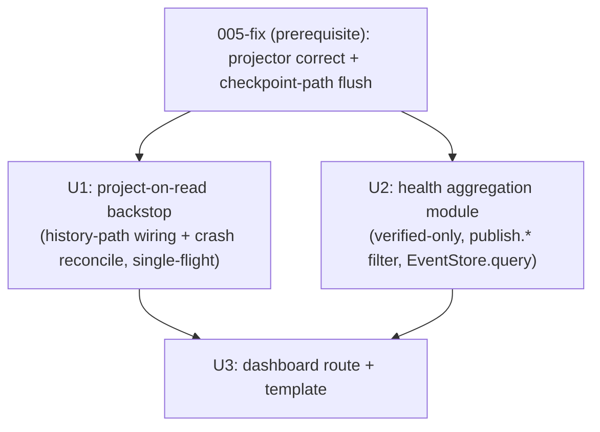

# feat: Publishing Health Dashboard

## Relationship to 005-fix (read first)

This plan was **merged** with a concurrent plan,
`docs/plans/2026-05-25-005-fix-events-projector-correctness-plan.md` (`status: active`,
already in implementation), which shares this same origin brainstorm. To avoid
double-building, the two now divide cleanly:

| Concern | Owner | Notes |
|---|---|---|
| D1 `done`→`publish.confirmed`, D2 platform-in-payload, D3 `error_class` consistency | **005-fix** | Projector reducers |
| **D5** unverified-`done` (operator-approved: persist a `verified` flag; emit confirmed only for verified, else a `verified=false`/`publish.unverified` signal) | **005-fix** | Materially shapes this plan's success-rate metric |
| R2 inline `flush_for(checkpoint_path)` at publish/resume end (fail-safe) + reconciliation acceptance test | **005-fix** | **Checkpoint path only** |
| **Project-on-read backstop** wiring the **history reducer** path + reconciling crash-stranded checkpoints | **THIS plan** | 005-fix explicitly defers this: its history-reducer edits stay dormant "until [the dashboard] adds a project-on-read" |
| Aggregation queries + dashboard route/template | **THIS plan** | — |

**This plan does NOT modify the projector reducers or the CLI publish/resume path** —
that is 005-fix's territory. It consumes the corrected, attributed events 005-fix
produces, adds the read-time projection backstop for the history path, and renders the
views.

## Overview

A read-only WebUI health dashboard answering "how is publishing doing lately?" —
overall success rate, per-platform health, error distribution, and currently-broken
channels — built on the `events.db` projection **after 005-fix makes it correct**. This
plan's own work is: (1) a single-flight project-on-read backstop that wires the
history-reducer path 005-fix leaves dormant and reconciles crash-stranded checkpoints;
(2) the aggregation queries; (3) the dashboard route + template with honest empty/
loading/freshness states.

## Problem Frame

The operator runs publish batches, returns later, and cannot see aggregate health
without clicking history row-by-row (see origin). 005-fix makes the substrate correct
and populates it on the CLI checkpoint path; this plan turns it into a glanceable view
and closes the one freshness path 005-fix leaves open (history-sourced outcomes + crash
reconciliation, reachable only via project-on-read).

## Requirements Trace

**Delivered by 005-fix (prerequisite — not re-implemented here)**
- R1–R4 + D5. `publish.confirmed` for `done`; platform attribution; consistent
  `error_class`; verified-vs-unverified `done` distinction; inline checkpoint-path flush.
  *(see depends_on)*

**Owned by this plan**
- R5. Dashboard surfaces its own freshness (window + "as of") and degrades honestly on
  incomplete data (project lag, crash-stranded run, degraded read).
- R5a. **Project-on-read backstop** wires the history-reducer path (dormant after 005-fix)
  and reconciles crash-stranded checkpoints, single-flight-guarded.
- R6. Overall success-rate hero over a window. **Denominator = distinct targets by latest
  outcome** (origin decision), counting only **verified** confirmations (per 005-fix D5)
  as success; `skipped_unreachable` does not exist as an event so is not a filter.
- R7. Per-adapter health table (uses 005-fix's `platform` payload key); worst-first sort;
  small-sample flagged; "Unattributed" row for null-platform.
- R8. Error distribution by `error_class` (005-fix D3); "unclassified" bucket for null.
- R9. Currently-broken channels banner from `channel_status` — display-only, labelled
  honestly (covers only velog/medium/blogger; reactive), links to bind flow.
- R10. Every view distinguishes "no data yet" from "0% success".
- R11. Labelled loading/projection-in-progress state; no number that silently changes.
- R12. Placement: success rate → broken banner → per-adapter → error dist; freshness
  adjacent to hero.

## Scope Boundaries

- **Projector reducers and the CLI publish/resume path are OUT of scope** — owned by
  005-fix. This plan must not edit `events/projector.py` reducers, `publish_backlinks.py`,
  or `_resume.py`'s publish logic. (It MAY add a `BEGIN IMMEDIATE` connect variant in
  `events/store.py` for its own project-on-read single-flight, coordinating with 005-fix.)
- NOT proactive pre-flight channel verification, alerting, or staleness countdowns —
  v1 only *displays* current `channel_status`.
- NOT false-success/liveness guarding, auto-retry/backoff/dead-letter, or historical
  analytics beyond the active window. Week-over-week trend = nice-to-have only.

## Context & Research

### Relevant Code and Patterns

- **Consumed event shape (post-005-fix):** `publish.confirmed`/`publish.failed` with a
  `platform` key + (for confirmed) a `verified` flag in `payload_json`; `error_class` on
  every failed event. **The `events` table also holds non-publish kinds** (banner /
  `image_gen_invoked` via direct `EventStore.append` — `_publish_helpers.py:52/126`,
  `plan_backlinks/_banners.py:40`), so every aggregate query MUST filter to `publish.*`
  kinds, not `COUNT(*)`.
- **Projection entry:** `events/projector.py:flush_for(checkpoint_path)`; 005-fix wires it
  inline on the checkpoint path. `publish-history.json` is WebUI-written and **nothing
  flushes it in prod** → this plan's project-on-read is its only projection trigger.
- **Event store read API:** `events/store.py:359` `EventStore.query(sql, params)`
  (SELECT-only, `sqlite3.Row`, WAL). Aggregate template: `image_gen/caps.py:50`.
  `connect()` uses *deferred* isolation (`:214-216`) — no `BEGIN IMMEDIATE`; `events` has
  no uniqueness constraint (`schema.py:35-45`) → concurrent project-on-read can
  double-append without a guard.
- **`articles.live_url` is nullable UNIQUE** (`schema.py:58`) — `add_article(None)` inserts
  a NULL-url row (no dedup); 005-fix guards this in its success branch.
- **WebUI route + render:** Blueprints via `webui_app/routes/__init__.py:register_blueprints()`
  (`create_app()` `__init__.py:72`). Mirror `routes/history.py:42` (read → `_render`).
  `dashboard.py` is a 302 stub to replace. `_render` auto-inject + pure reducer
  `_group_history()` at `helpers/contexts.py:345/381`. Per-request cache `_g_cache(key, fn)`
  in `helpers/_request_cache.py:12` (NOT contexts.py — circular import). CSRF guard gates
  only mutating verbs → GET dashboard needs no token.
- **Channel status:** `webui_store/channel_status.py:182 list_all()`; richer card via
  `webui_app/binding_status.py:48 get_channel_status(name, cfg)`. `CHANNELS` =
  velog/medium/blogger only.
- **`quarantine_log`** (`schema.py:75-83`) exists, unused — the home for the gap flag.

### Institutional Learnings

- No `docs/solutions/` entry for events.db/projector — 005-fix should author it; this plan
  reuses it once written.
- Sibling page over retrofit; GET dashboard safe but verify under throwaway
  `BACKLINK_PUBLISHER_CONFIG_DIR`; rely on the 4 autouse conftest sandbox fixtures; seed
  events.db/webui_store before store import (`webui_store/__init__.py` freezes `_CONFIG_DIR`).

### External References

None — internal Flask + SQLite over established repo patterns.

## Key Technical Decisions

- **Build on 005-fix; do not duplicate its reducers/triggers.** The merge division above is
  the load-bearing decision: correctness + checkpoint-flush is theirs, the dashboard +
  history-path project-on-read is this plan's.
- **Success = verified confirmations only (per 005-fix D5).** The hero/per-adapter success
  counts treat a `publish.confirmed` with `verified=false` (or a `publish.unverified` kind,
  whichever 005-fix ships) as **not** a success — counting unverified exit-5 publishes as
  success is exactly the lie the substrate must not tell. This plan's queries key off
  whatever verified signal 005-fix lands (confirm its final shape during implementation).
- **All aggregate queries filter to `publish.*` kinds.** The `events` table holds banner/
  image_gen kinds; `COUNT(*)` would conflate them.
- **Project-on-read single-flight = `BEGIN IMMEDIATE` + a module-level `threading.Lock`**,
  NOT `acquire_lease` (PID-keyed, 1h TTL, owner==caller takeover → two Flask threads share a
  PID and both acquire → double-append). `BEGIN IMMEDIATE` serializes the cursor RMW across
  processes; the thread lock serializes within the Flask process.
- **Project-on-read errors degrade, never raise.** `store.py` `_retry_sqlite` re-raises after
  3 tries; the dashboard wraps projection in `try/except OperationalError/ProjectionError` →
  a "stale/degraded" result (R5), not a 500.
- **Success-rate latest-outcome total order = `ORDER BY ts_utc DESC, id DESC LIMIT 1`** per
  target (`MAX(ts_utc)` alone is not a total order); universe = terminal kinds
  (`publish.confirmed`/`publish.failed`); `publish.intent`-only targets excluded.

## Open Questions

### Resolved During Planning

- *Who owns the projector correctness fix?* → 005-fix (active). This plan depends on it and
  does not re-implement D1–D5.
- *Does success count unverified `done`?* → No — 005-fix D5 (operator-approved) distinguishes
  verified; this plan's success metric counts only verified confirmations.
- *Why does this plan still need a projection trigger if 005-fix wires R2?* → 005-fix wires
  the **checkpoint** path inline only; the **history** reducer path (publish-history.json,
  WebUI-written) stays dormant in prod until this plan's project-on-read — which is also the
  crash-stranded-checkpoint backstop.
- *Single-flight primitive / latest-outcome total order / banner-kind filtering* → resolved
  in Key Technical Decisions.

### Deferred to Implementation

- **Final verified signal shape from 005-fix** (a `verified=false` payload flag on
  `publish.confirmed` vs a distinct `publish.unverified` kind) — this plan's success query
  keys off whichever 005-fix ships; confirm before writing the aggregation (Unit 2).
- **Backfill of pre-fix history-path outcomes** — whether the first project-on-read should
  flush all historical `publish-history.json`, or the dashboard is forward-looking. Depends
  on operator preference; coordinate with 005-fix's rebuild stance.
- **`ContentRejectedError` reason granularity** (R8 sub-buckets) — gated on a machine-readable
  `reason_class` that doesn't exist today; ship flat `content-rejected`, finer breakdown is a
  fast-follow.
- **events.kind set counted as "attempted"** for the denominator — confirm against 005-fix's
  final emitted kinds (coordinate; equity-ledger 004 raises the same question).

## High-Level Technical Design

> *Directional guidance for review, not implementation specification.*



Read path at dashboard load (directional):

```
GET /health
  └─ _g_cache("health_agg", build):
       1. reconcile.project_on_read()   # single-flight (BEGIN IMMEDIATE + thread lock):
                                         #   flush checkpoint AND history paths; reconcile crashes;
                                         #   wrap errors → degraded result (never raise)
       2. EventStore.query(...) × 3 — all WHERE kind IN ('publish.confirmed','publish.failed'):
            success_rate = distinct target_url, latest terminal by (ts_utc DESC, id DESC);
                           confirmed counts ONLY verified
            per_adapter  = GROUP BY json_extract(payload,'$.platform'), kind
            error_dist   = GROUP BY json_extract(payload,'$.error_class')
       3. channel_status.list_all() → broken = status in {expired, identity_mismatch}
       4. freshness = MAX(ts_utc) + window bounds; gap flag from quarantine_log
  └─ _render("health.html", agg=..., broken=..., freshness=..., gap=...)
```

## Implementation Units

- [ ] **Unit 1: Project-on-read backstop (history-path wiring + crash reconcile)**

**Goal:** A single-flight, layer-neutral read-time projection that flushes the history
reducer path 005-fix leaves dormant and reconciles crash-stranded checkpoints, returning a
freshness stamp + gap flag, never raising.

**Requirements:** R5, R5a

**Dependencies:** 005-fix landed (correct reducers + inline checkpoint flush).

**Files:**
- Create: `webui_app/services/health_projection.py` (thin WebUI adapter) calling a
  layer-neutral helper. If 005-fix already created `events/reconcile.py`, extend it;
  otherwise create it (coordinate to avoid a second helper).
- Modify (coordinate with 005-fix): `events/store.py` — add a `BEGIN IMMEDIATE` connect/
  transaction variant for the single-flight critical section.
- Test: `tests/test_health_projection.py`

**Approach:**
- On dashboard load, single-flight (`BEGIN IMMEDIATE` + module-level `threading.Lock`) a
  `flush_for` over both the checkpoint and `publish-history.json` paths not yet at cursor.
- Compute freshness = `MAX(ts_utc)` + window bounds. Detect a checkpoint newer than the
  cursor that fails to project → record in `quarantine_log`, return a gap flag; clear the
  entry once it later projects.
- Wrap the body in `try/except sqlite3.OperationalError`/`ProjectionError` → return a
  "stale/degraded" result; never raise to the route.

**Execution note:** Do NOT add a hook framework; this is the read-time backstop. Do NOT
edit the projector reducers (005-fix owns them).

**Patterns to follow:** `events/projector.py flush_for`; thin-service `webui_app/services/recheck.py`; `EventStore.query` for freshness.

**Test scenarios:**
- Happy path: an unprojected `publish-history.json` outcome is projected on first load;
  second load is a cheap no-op.
- Concurrency (required): two threads call the backstop on the same un-projected source via
  `threading.Barrier` → `publish.*` event count equals single-flush count (no double-append).
- Edge case: zero data → empty freshness stamp, no crash.
- Error path: a corrupted checkpoint → `quarantine_log` gap flag; does not abort other
  projection; does not raise.
- Edge case: a previously-quarantined checkpoint that later projects → gap entry cleared.
- Error path: forced lock-timeout → degraded result (R5), never unhandled `OperationalError`.

**Verification:** After a WebUI publish (history path) with no CLI flush, loading the
dashboard reflects it; a corrupted checkpoint surfaces as a cleared-on-resolve gap; a
concurrent double-load produces no duplicate events.

---

- [ ] **Unit 2: Health aggregation module (read-only queries)**

**Goal:** Pure read module computing the four aggregates from corrected events.db +
channel_status, counting only verified successes and filtering to `publish.*` kinds.

**Requirements:** R6, R7, R8, R9 (data side)

**Dependencies:** 005-fix (verified flag, platform key, error_class); Unit 1 (fresh data).

**Files:**
- Create: `webui_app/health_metrics.py` (beside `binding_status.py`)
- Test: `tests/test_health_metrics.py`

**Approach:**
- All queries `WHERE kind IN ('publish.confirmed','publish.failed')` (exclude banner/
  image_gen kinds).
- `success_rate(window)`: per distinct `target_url`, latest terminal via
  `ORDER BY ts_utc DESC, id DESC LIMIT 1`; confirmed counts only if **verified** (per
  005-fix D5 signal); `{targets, confirmed, pct}` + "no data" sentinel at denominator 0.
- `per_adapter(window)`: `GROUP BY json_extract(payload_json,'$.platform')` × kind; NULL →
  "Unattributed"; flag small-sample rows.
- `error_distribution(window)`: `GROUP BY json_extract(payload_json,'$.error_class')` over
  `publish.failed`; NULL → "unclassified".
- `broken_channels()`: `channel_status.list_all()` filtered to expired/identity_mismatch;
  enrich via `get_channel_status` for the bind link.
- Pure/deterministic over a passed-in clock/window.

**Patterns to follow:** `image_gen/caps.py:50` query shape; `_group_history()` reducer model.

**Test scenarios:**
- Happy path: verified-confirmed + failed across 2 platforms → correct hero pct + rows.
- Edge case (D5): a `publish.confirmed` with `verified=false` (or `publish.unverified`) is
  NOT counted as success.
- Edge case (R6): target failed-then-verified-confirmed → counted once as success (latest).
- Edge case (banner filter): banner/image_gen events in the table do NOT affect any count.
- Edge case (total order): confirmed+failed sharing `ts_utc` → classified by higher `id`.
- Edge case (R10): empty window → "no data" sentinel; empty per_adapter/error_dist.
- Edge case: null platform → "Unattributed"; null error_class → "unclassified".
- Edge case: small-sample (1/1) row flagged.

**Verification:** Querying a seeded events.db (incl. banner noise + an unverified confirmed)
returns aggregates matching hand-computed values.

---

- [ ] **Unit 3: Health dashboard route + template**

**Goal:** Replace the dashboard 302 stub with a read-only health view rendering the four
aggregates with honest empty/loading/freshness/gap states and placement hierarchy.

**Requirements:** R5, R6, R7, R8, R9, R10, R11, R12

**Dependencies:** Unit 1 (backstop), Unit 2 (aggregates).

**Files:**
- Create: `webui_app/routes/health.py` (Blueprint `health`)
- Modify: `webui_app/routes/__init__.py` (register, ~:29-32); `webui_app/routes/dashboard.py`
  (redirect stub → `/health`)
- Create: `webui_app/templates/health.html` (sibling of `index.html`)
- Test: `tests/test_health_dashboard_route.py`

**Approach:**
- GET-only route; on load call Unit 1 backstop (single-flight) for freshness + gap, then
  Unit 2 aggregates, memoized with `_g_cache("health_agg", ...)` (per-request only — U1's
  single-flight is the cross-request guard).
- Render top-to-bottom (R12): hero success-rate with freshness "as of" adjacent (R5) →
  broken-channels banner (R9, "no *known* problems" when empty, bind links) → per-adapter
  table (worst-first, small-sample flag, Unattributed row) → error distribution.
- Empty states (R10): "No publishes in the last N days" ≠ "0% confirmed"; positive zero-
  failure state; "No known channel problems" line for empty banner.
- Loading (R11): if project-on-read isn't instant, labelled state; never a silently-changing
  number.
- Gap/degraded (R5): when U1 returns a gap/degraded result, render a "data may be incomplete"
  notice next to the freshness stamp.
- Visual weight tracks importance (act-now banner ≠ passive hero).

**Execution note:** Verify under a throwaway `BACKLINK_PUBLISHER_CONFIG_DIR`; never the
running operator WebUI.

**Patterns to follow:** `routes/history.py:42`; blueprint registration; test style from
`tests/test_settings_dashboard_rendering.py` with the `client` fixture (GET, no CSRF).

**Test scenarios:**
- Happy path: seeded events.db + one expired channel → hero pct, per-adapter rows, error
  buckets, broken banner with bind link.
- Edge case (R10): fresh/empty config dir → "No publishes…", "No known channel problems",
  no "0%"/NaN, HTTP 200.
- Edge case (R9 honesty): a token-platform (not velog/medium/blogger) broken is NOT claimed
  healthy — banner copy reflects "known" scope.
- Edge case (R5 gap): U1 reports a gap/degraded → page renders "data incomplete" notice.
- Edge case (R12): broken banner above per-adapter table.
- Error path: GET needs no CSRF → 200; aggregation raising degrades, does not 500.
- Integration: route → U1 backstop → U2 aggregates → rendered numbers match a seeded run.

**Verification:** Visiting `/health` after publishes shows correct aggregates, honest empty
states on a fresh install, and the freshness stamp next to the hero.

## System-Wide Impact

- **Interaction graph:** new GET Blueprint; `dashboard.py` stub redirects to `/health`.
  Projection triggers: 005-fix's inline checkpoint flush (primary, all CLI terminal paths)
  + this plan's project-on-read (history path + crash backstop).
- **Error propagation:** aggregation/projection failures (incl. lock-timeout) degrade to an
  honest "incomplete data" state (R5), never 500 or a silently-wrong number.
- **State lifecycle:** project-on-read mutates append-only events.db on a GET; safety is the
  U1 single-flight (`BEGIN IMMEDIATE` + thread lock), NOT the cursor alone (deferred
  isolation + no `events` uniqueness verified). Coordinate the `BEGIN IMMEDIATE` store
  variant with 005-fix to avoid two divergent connect paths.
- **Cross-consumer:** equity-ledger (004) reads the same events.db; 005-fix's inline flush
  keeps it correct for CLI-only use; this plan's history-path project-on-read additionally
  benefits any consumer reading WebUI-sourced outcomes. Schema non-colliding (platform in
  payload_json; 004 derives platform via history_store).
- **Blast radius:** only `publish.*`/`articles` rows; banner/image_gen direct-append
  consumers unaffected (and explicitly filtered out of aggregates).

## Risks & Dependencies

| Risk | Mitigation |
|------|------------|
| **Hard dependency on 005-fix** (event shapes: verified flag, platform key, error_class) | Sequence after 005-fix lands; Unit 2 confirms the final verified-signal shape before querying |
| Two helpers (005-fix `reconcile` vs this plan's project-on-read) diverge | Coordinate: extend 005-fix's `events/reconcile.py` rather than create a parallel one; share the `BEGIN IMMEDIATE` store variant |
| Concurrent project-on-read double-appends (deferred isolation, no `events` uniqueness) | `BEGIN IMMEDIATE` + module `threading.Lock`; `threading.Barrier` concurrency test |
| Counting unverified `done` as success (D5) | Success query counts only verified confirmations per 005-fix's signal; explicit test |
| Banner/image_gen events inflate counts | All queries filter `kind IN ('publish.confirmed','publish.failed')`; explicit test |
| History path never flushed in prod | This plan's project-on-read is its trigger (the reason U1 exists) |
| Stale `quarantine_log` gap flag | Cleared once the stranded checkpoint projects; gap-clear test |
| Per-target-latest ambiguity (ts ties, cross-run) | `ORDER BY ts_utc DESC, id DESC`; window = latest terminal in-window; tested |

## Documentation / Operational Notes

- Reuse the events.db/projector `docs/solutions/` entry 005-fix authors.
- Note `/health` replaces the dashboard redirect target in WebUI/AGENTS docs.
- Coordinate backfill stance (history-path forward-only vs first-load full flush) with 005-fix.

## Phased Delivery

### Phase 1 — Prerequisite (NOT this plan)
- 005-fix lands: D1–D5 + inline checkpoint flush + reconciliation acceptance gate.

### Phase 2 — This plan
- Unit 1 (project-on-read backstop) → Units 2, 3 (aggregation, route/template).

## Sources & References

- **Origin:** [docs/brainstorms/2026-05-25-publishing-health-dashboard-requirements.md](docs/brainstorms/2026-05-25-publishing-health-dashboard-requirements.md)
- **Prerequisite (merged-with):** `docs/plans/2026-05-25-005-fix-events-projector-correctness-plan.md`
- Adjacent consumer: `docs/plans/2026-05-25-004-feat-backlink-equity-ledger-plan.md`
- Read API `events/store.py:359`; aggregate template `image_gen/caps.py:50`; WebUI
  `routes/__init__.py`, `helpers/contexts.py:345/381`, `helpers/_request_cache.py:12`,
  `webui_store/channel_status.py:182`, `binding_status.py:48`; `quarantine_log` `schema.py:75-83`
