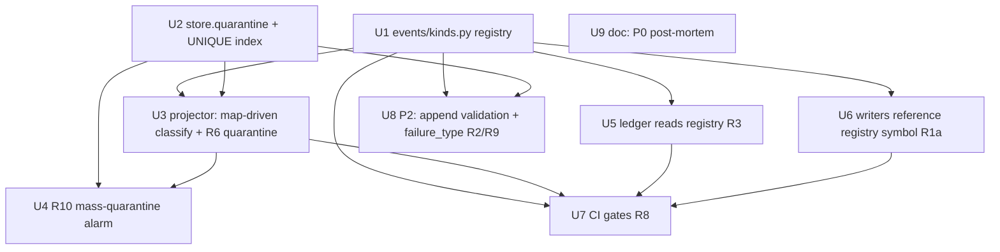

# feat: events.db Kind & Classification Contract

## Overview

`events.db` is the emerging state-of-truth read by the equity ledger, a health dashboard,
footprint, and several Round-8 ideas. Its event vocabulary is currently uncontracted: kind
strings are scattered literals, the reader (`ledger/sources.py`) duplicates the kind set, and
the projector classifies upstream records through hand-maintained status tuples. The just-fixed
P0 (projector silently dropped every CLI success — prod wrote checkpoint status `done`, the
classifier expected `succeeded`) came from that gap, at the **input-classification** seam.

This plan hardens both seams: a dependency-free `events/kinds.py` registry (output kinds +
per-kind payload floors + an explicit `(source-record-type, source-status) → event-kind`
mapping), a **quarantine-and-continue** path for unmapped input statuses (so the next drift is
visibly quarantined, never silently dropped), a **mass-quarantine alarm** so quarantine-and-
continue can't recreate silent failure at scale, and **test-time CI gates** that keep the
vocabulary and mapping honest.

## Problem Frame

See origin: `docs/brainstorms/2026-05-25-events-db-kind-contract-requirements.md`. The recurring
failure class in this repo is "the operator was told something succeeded when it didn't." The P0
is the events-layer instance. The fix is contract + quarantine, not a one-off status patch.

## Requirements Trace

Carried from the origin requirements doc (priority tags preserved):

- **R1** [P1] `events/kinds.py` declares all 14 live event kinds (single source of truth; no renames).
- **R1a** [P1] Writers reference the registry *symbol*, not a bare literal, so the R8 gate can bind.
- **R2** [P2] Each kind declares required payload fields (a floor = intersection across emitters).
- **R3** [P1] `ledger/sources.py` reads registry kind names instead of its own `ATTEMPTED_KINDS`.
- **R4** [P0] Explicit `(source-record-type, source-status) → event-kind | NO_EMIT` mapping for checkpoint/history/drafts. The mapping has a third outcome `NO_EMIT` for **declared intentional no-ops** (e.g. `(history,drafted)`, `(drafts,failed)` — verified intentional suppressions per in-code comments at projector.py:624/766) so they are distinguished from genuinely-unmapped statuses, which quarantine.
- **R5** [P1] Existing scattered reducer status logic is *migrated into* the mapping (it becomes the only decision site).
- **R6** [P0] Unmapped `(type, status)` → `projection.unmapped` quarantine row + continue (never drop, never halt; idempotent).
- **R7** [P1] Quarantine entries are queryable via the existing SELECT-only `store.query()` (no new CLI).
- **R8** [P1] Test-time CI gate: (a) every emitted kind registered (symbol/runtime check + literal-ban lint); (b) bidirectional reader check with allowlist; (c) fixture/reducer-derived mapping coverage with *content* assertions.
- **R9** [P2] `append()` lightweight required-field check, routes misses to quarantine (distinct mechanism from R6, shared table, `failure_type` discriminator).
- **R10** [P1] Mass-quarantine alarm: relative-threshold degraded health signal via `record_projection_health()`.

Success criteria (origin): a simulated unknown checkpoint status quarantines instead of dropping;
a partial-flood trips the R10 alarm; unregistered kind / unregistered-or-omitted reader kind fails
CI; one kind vocabulary + one mapping in the tree; no existing row invalidated, no kind renamed.

## Scope Boundaries

- `bp-events-query` read CLI — **out** (deferred; `store.query()` suffices for R7).
- `bp-events-rebuild` console-script wiring — **out** (referenced in docstrings, not shipped; don't contradict it).
- No kind renaming / namespace normalization (the `image_gen_*` un-namespaced names stay).
- Narrowly-scoped additive schema changes on the empty `quarantine_log` only: a `dedup_key` column + a `UNIQUE` index on it (R6 option a), both `IF NOT EXISTS`-guarded and run on the connect path (see Key Decisions). No other migration; no `SCHEMA_VERSION` bump.
- A health dashboard's read/aggregation logic is not rewritten here.
- Ledger does **not** start consuming `publish.unverified` — it is allowlisted as an intentional omission (R8b). (Resolved during planning.)

## Context & Research

### Relevant Code and Patterns

- **Projector reducers** `events/projector.py`: `flush_for()` (67-87) → `_detect_source()` (151-166) → `_project_checkpoint` (272-438) / `_project_history` (496-642) / `_project_drafts` (648-777). Inline status→kind logic: checkpoint `pending`→intent (316/325), `_SUCCESS_STATUSES=("succeeded","done")` (45) used at 341 with the **verified-split** `_kind` computed at 379, `failed`→`publish.failed` (401/410); history `published`→confirmed (541/547/582), `failed` (601/605), **silent-skip `else`** (624); drafts `published` (691), `scheduled`→`draft.scheduled` (736/739), `drafted`→`draft.created` (748/753), **silent-skip else** (762).
- **Health channel** `events/projector.py`: `record_projection_health(store, *, ok, error)` (96-116), reserved cursor key `_HEALTH_SOURCE="__projection_health__"` (93); fail-safe `try/except`, never raises; only writer is `project_run_safe` (`ok=True` at 135, `ok=False` at 142-144); no production reader (tests read it via raw SQL: `test_events_projection_wiring.py:77-85,105-111`).
- **Cursor helpers** `_cursor_load`/`_cursor_save` (172-206) over `projection_cursor(source PK, last_mtime, last_checksum[unused], last_seen_state_json)` (schema.py:66-73).
- **Store** `events/store.py`: `append()` (245-305, threads optional `conn=`, no kind validation), `connect()` txn boundary (182-243), SELECT-only `query()` (359-381); `quarantine_log` DDL (schema.py:74-83, columns `id/ts_utc/source/run_id/reason/raw_payload_json`, **no writer, no `kind` column**).
- **Reader** `ledger/sources.py`: `ATTEMPTED_KINDS=("publish.intent","publish.confirmed","publish.failed")` (36-40), used in raw SQL (118-122) — omits `publish.unverified`.
- **Other writers:** `publishing/banner_dispatcher.py` (5 `banner.*` literals at 89/93/104/113/119/124, pure no-I/O, `emit` injected); `cli/_publish_helpers.py:_make_banner_emit`→`append()` (116-134, kind arrives as a *variable*); `publishing/adapters/image_gen/caps.py` (`image_gen_*` literals 90/95/100).
- **Package exports** `events/__init__.py` (11-25): `EventStore`, `ProjectionError`, `ProjectionResult`, `flush_for`, `project_run_safe`. `record_projection_health` not exported.

### CI-gate idioms to mirror

- **Idiom A — AST import-graph + allowlist:** `tests/test_webui_helpers_subpackage_acyclic.py` (`ast.parse`/`ast.walk`, `ImportFrom`, `ALLOWED_EDGES`). → R8b bidirectional reader check + allowlist.
- **Idiom B — runtime registry membership:** `tests/test_r9_extension_readiness.py` (import for side-effect, assert against live registry). → R8a "emitted kinds ⊆ registry."
- **Idiom C — rglob scan + synthetic-positive red-path:** `tests/test_no_monolith_regrowth.py` (parametrized over declared set; a tmp-path test proving the scanner fires). → parametrize gates over the registry; pair each with a red-path test.
- R1a literal-ban is **net-new**: an AST visitor matching `ast.Call` where the callee is `append`/`emit` and the first positional arg is an `ast.Constant` str.

### Institutional Learnings

- `docs/solutions/integration-issues/dofollow-canary-verdict-dropped-at-publish-output-seam-2026-05-25.md` — a value vanishes when only some emit paths carry it; route through one shared helper + present/absent test per path. **Same bug class as the P0.**
- `docs/solutions/best-practices/publish-history-helper-invariant-2026-05-20.md` — single write chokepoint, validate at write; migration carve-out (relax then re-validate).
- `docs/solutions/logic-errors/invert-drift-check-when-invariant-becomes-dynamic-2026-05-18.md` — **CI gate must be test-time, not a module-level/import-time assertion** against a dynamic set.
- `docs/solutions/workflow-issues/grep-dofollow-map-before-shipping-adapter-2026-05-20.md` — a gate that proves *mechanism* is blind to *value*; **assert mapping content** (pin `done`→confirmed), not just "every status maps to something."
- `docs/solutions/logic-errors/python-m-needs-main-module-after-package-split-2026-05-19.md` + memory `feedback_mock_patch_paths_after_extraction` — re-point `mock.patch` targets after extracting into `kinds.py`; run full pytest (relative-import/patch breakage trips at import time).
- `docs/solutions/best-practices/recon-log-level-for-always-on-signals-2026-05-15.md` — quarantine emits a RECON-level always-on line; audit `assert stderr == ''` tests it will trip.
- **Gap:** no post-mortem exists for the P0 (only in memory). Capture via `/ce:compound` (Unit 9).

## Key Technical Decisions

- **`events/kinds.py` is dependency-free** (no `EventStore`/SQLite import) so `banner_dispatcher.py` can import a kind constant without breaking its no-I/O purity. Add it to `events/__init__.__all__` for cross-package readers; projector uses `from .kinds import ...`.
- **The mapping value for success is a family, not a flat kind.** `("checkpoint","done"|"succeeded")` resolves to `publish.confirmed | publish.unverified` via the runtime `verified` flag. Keep the D5 `_verified`/`_kind` decision (projector.py:378-379) as a *post-table refinement*; the table yields a "confirmed-family" marker, not two rows. This avoids fighting the just-merged PR #222 logic.
- **R6 dedupe = additive `UNIQUE` index on a single NOT-NULL `dedup_key` column** (`INSERT OR IGNORE`), option a. Chosen over cursor-state tracking (option b, diverges from the success-keyed cursor model) and over a multi-column key (SQLite treats NULLs as distinct → banner/image_gen rows with NULL `run_id` would never dedupe). The `dedup_key` is a stable hash over `(run_id, source, source-status, canonical-record-identity)` with NULLs folded to a fixed token. Read-before-write rejected (races under per-dashboard-read re-projection).
- **Quarantine writes go on a private committed connection, not the reducer's shared `conn`.** A shared transaction that later rolls back would discard the quarantine row and recreate the silent-drop class R6 exists to kill. An extra quarantine row on a retried record is benign (deduped); a lost one is not.
- **The dedupe column/index DDL must run on the `version == SCHEMA_VERSION` connect path** — and as a **single targeted statement**, not a full `initialize_schema`. `maybe_upgrade_schema` skips both version-gated branches when `version == SCHEMA_VERSION`, so a pre-existing v2 DB never re-runs `initialize_schema`; the fix adds an unconditional, idempotent `CREATE UNIQUE INDEX IF NOT EXISTS` (+ the `dedup_key` column add, guarded by an `IF NOT EXISTS`-style check since SQLite `ADD COLUMN` is not idempotent) inside `maybe_upgrade_schema` so fresh **and** existing DBs acquire it. **Rejected:** calling full `initialize_schema` unconditionally — it would run ~12 DDL statements on *every* `connect()`, and `connect()` is on the project-on-read hot path under WAL with many concurrent worktrees. Run only the one index/column. No `SCHEMA_VERSION` bump.
- **R6 and R9 are distinct mechanisms sharing one table**, discriminated by a `failure_type` field inside `raw_payload_json` (`unmapped_status` vs `missing_field`). **R6 owns the field** and ships `unmapped_status`; R9 (P2) only widens it. So the P0-core (R6) carries no dependency on the P2 (R9).
- **R10 injects the degraded signal around `record_projection_health(ok=True)` at projector.py:135**, not via the exception path — a partial-flood still `flush`-succeeds and would otherwise record `ok=True`. Add a `quarantine_ratio`/`degraded` field to the health state dict (preserve the never-raise contract: compute the threshold *before* the call).
- **R10 threshold is relative (% of a run's records)** with an optional absolute floor for tiny runs — an absolute-only count misses small all-quarantined runs and false-alarms on large healthy ones.
- **All CI gates are test-time** (Idiom B/C), never module-level assertions (dynamic-invariant lesson).
- **R8a soundness floor = registry-symbol reference (R1a) + a literal-ban lint.** An import-graph check proves the symbol is imported, not that it flows into `append()`; the literal-ban lint closes the call-site gap. Full dataflow proof is out of scope.

## Open Questions

### Resolved During Planning

- **Ledger + `publish.unverified`?** → Allowlist the omission (R8b); no ledger logic change. (User decision.)
- **R10 health channel?** → Reuse `record_projection_health` / `__projection_health__`, inject around the `ok=True` call.
- **R6 dedupe mechanism?** → Additive `UNIQUE` index + `INSERT OR IGNORE` (option a).
- **CI gate placement?** → Test-time gates under `tests/`, mirroring Idioms A/B/C.

### Deferred to Implementation

- The exact canonical-record-identity component folded into `dedup_key` per source type (checkpoint/history/drafts) — finalize against real reducer identities (the key *shape* — single NOT-NULL hashed `dedup_key`, NULLs folded — is decided).
- Exact relative-threshold percentage + absolute floor for R10.
- Per-kind required-field floors (R2) — derive from the **intersection** of payloads at each emit site (esp. multi-reducer `publish.confirmed`); only needed if Unit 8 ships.
- R9 null-identity handling for banner/image_gen callers (no `run_id`) — skip-and-RECON-log vs. tolerated null-identity row. Only relevant if Unit 8 ships.
- Whether any already-unmapped live status exists today (audit checkpoint/history/drafts terminal statuses during Unit 2).

## High-Level Technical Design

> *This illustrates the intended approach and is directional guidance for review, not implementation specification. The implementing agent should treat it as context, not code to reproduce.*

```
events/kinds.py  (dependency-free; no EventStore import)
├── KINDS: the 14 registered event-kind symbols/constants
├── REQUIRED_FIELDS: kind -> required payload field floor   (R2, only if Unit 8)
└── STATUS_MAP: (source_record_type, source_status) -> kind | CONFIRMED_FAMILY | NO_EMIT
        e.g. ("checkpoint","pending")   -> publish.intent
             ("checkpoint","done")      -> CONFIRMED_FAMILY   # resolved by `verified` flag
             ("checkpoint","failed")    -> publish.failed
             ("history","published")    -> publish.confirmed
             ("history","drafted")      -> NO_EMIT            # drafts reducer owns it (intentional)
             ("drafts","failed")        -> NO_EMIT            # history owns failures (intentional)
             ("history", <truly-unknown>) -> (absent) => R6 quarantine
        Three outcomes: emit a kind / NO_EMIT (declared intentional no-op, NOT quarantined) /
        absent => quarantine. The current "silent" else branches (projector.py:624, :766) are
        INTENTIONAL suppressions (verified in-code comments), so they map to NO_EMIT, NOT quarantine.
```

Dependency graph (Unit 1 fans out; Unit 7 fans in):



## Implementation Units

- [ ] **Unit 1: `events/kinds.py` registry (kinds + status mapping)**

**Goal:** Single dependency-free source of truth: the 14 event-kind constants, the
`(source-record-type, source-status) → event-kind` map (with a `CONFIRMED_FAMILY` marker for the
verified-split success case), and a place for per-kind required-field floors (R2, populated only
if Unit 8 ships).

**Requirements:** R1, R1a (provides the symbols), R4 (the map), R5.

**Dependencies:** None.

**Files:**
- Create: `src/backlink_publisher/events/kinds.py`
- Modify: `src/backlink_publisher/events/__init__.py` (export the registry for cross-package readers)
- Test: `tests/test_events_kinds.py`

**Approach:**
- Declare the 14 kinds as named constants/an enum-like set; no `EventStore` import (keep it SQLite-free).
- `STATUS_MAP` keyed `(source_type, status)` with three outcome types: an event kind, a `CONFIRMED_FAMILY` sentinel (success, resolved downstream by the `verified` flag — do not encode two rows), or a `NO_EMIT` sentinel for **declared intentional no-ops** (`(history,drafted)`, `(drafts,failed)`, and any other in-code-documented suppression).
- Mapping is data, not scattered `if`s; a lookup miss (truly absent) is the quarantine signal — distinct from a `NO_EMIT` hit, which is a deliberate skip. Lookups are raise-free.

**Patterns to follow:** registry-as-single-source idiom from `publishing/registry.py`; dependency-free module shape.

**Test scenarios:**
- Happy path: every constant in the 14-kind set is present and unique; `STATUS_MAP` resolves known pairs (`("checkpoint","pending")`→intent, `("history","published")`→confirmed, `("drafts","scheduled")`→`draft.scheduled`).
- Edge case: `("checkpoint","done")` and `("checkpoint","succeeded")` resolve to `CONFIRMED_FAMILY`, not a flat kind.
- Edge case (NO_EMIT vs miss): `("history","drafted")` and `("drafts","failed")` resolve to `NO_EMIT` (declared intentional), while a truly-unknown pair (`("checkpoint","bogus")`) returns the miss sentinel — the two are distinct; never raises.
- Edge case: importing `events/kinds.py` does **not** import `EventStore`/sqlite (assert via module attributes / no sqlite in its import graph).

**Verification:** registry importable both `from .kinds import` and `from backlink_publisher.events import`; no SQLite dependency.

- [ ] **Unit 2: `EventStore.quarantine()` write path + `UNIQUE` dedupe index**

**Goal:** A real, idempotent quarantine write path on the existing (empty) `quarantine_log` table.

**Requirements:** R6 (write path + idempotency), R7 (queryable), supports R9.

**Dependencies:** None (parallel with Unit 1).

**Files:**
- Modify: `src/backlink_publisher/events/store.py` (add `quarantine()` method, mirroring `append()`'s optional `conn=` + txn semantics)
- Modify: `src/backlink_publisher/events/schema.py` (additive `UNIQUE` index on `quarantine_log` over the natural key)
- Test: `tests/test_events_store_quarantine.py`

**Approach:**
- `quarantine(*, reason, failure_type, run_id, source, raw_payload)` — **no `conn` parameter**: it always opens its own **private, committed connection** (a shared reducer `conn` that later rolls back would discard the quarantine row and recreate the silent-drop class). An extra quarantine row on a retried record is benign (deduped); a lost one is the failure under attack. `failure_type` is caller-supplied (R6 callers pass `"unmapped_status"`).
- Structured detail (incl. `failure_type`) lives in `raw_payload_json` (no `kind` column exists).
- Idempotency via `INSERT OR IGNORE` against an additive `UNIQUE` index on a **single NOT-NULL `dedup_key TEXT` column** — a stable hash over `(run_id, source, source-status, canonical-record-identity)` with NULLs folded to a fixed token. A multi-column UNIQUE key is **rejected**: SQLite treats NULLs as distinct, so banner/image_gen rows (NULL `run_id`) would never dedupe. The identity component must be **per-record granular** (e.g. checkpoint `item_id`, history/drafts `row_id`/`draft_id`) — **not** the coarse `(run_id, target_url, status)` shape used by the reducer in-memory dedup (projector.py:325), which would collapse two distinct unmapped records to one `dedup_key` and silently drop the second. It is a canonical scalar (mirror `append()`'s `sort_keys=True` discipline), never the raw serialized blob.
- Adding the `dedup_key` column + its `UNIQUE` index are both additive schema changes subject to the placement rule below.

**Execution note:** **Schema-placement is load-bearing.** `maybe_upgrade_schema` runs neither branch when `version == SCHEMA_VERSION`, so `initialize_schema` is *never* called on an existing v2 DB — DDL added only to `_DDL_STATEMENTS` (or to a version-gated migration step without a `SCHEMA_VERSION` bump) reaches fresh DBs but **never pre-existing ones**. Fix: run the **single targeted** `CREATE UNIQUE INDEX IF NOT EXISTS` (+ guarded `dedup_key` column add) unconditionally inside `maybe_upgrade_schema`. Do **not** call full `initialize_schema` per connect (~12 DDL on the project-on-read hot path under WAL). Also add the same DDL to `_DDL_STATEMENTS` so fresh DBs get it via creation. Keep `SCHEMA_VERSION` at 2.

**Patterns to follow:** `EventStore.append()` (store.py:245-305) for `conn`/txn handling; `articles.live_url UNIQUE` + `IntegrityError`-catch dedup precedent.

**Test scenarios:**
- Happy path: one `quarantine()` call writes a row with `failure_type` recoverable from `raw_payload_json`; `store.query("SELECT ... FROM quarantine_log")` returns it (R7).
- Edge case (idempotency): the same logical record quarantined twice yields exactly one row (`INSERT OR IGNORE` on `dedup_key`); re-projecting the same source does not duplicate.
- Edge case (NULL-key, the trap): a caller with **NULL `run_id`** (banner/image_gen path) quarantined twice still yields exactly one row — proving the folded-NULL `dedup_key` dedupes where a multi-column key would not.
- Edge case (durability): a flow that quarantines then raises before its reducer transaction would commit **still leaves the quarantine row durable** (private connection) — invert the naive "rolls back atomically" expectation.
- Integration (pre-existing DB): open a hand-built v2 `events.db` that predates the index, call `connect()` (which runs `maybe_upgrade_schema`), then assert the index/column now exist via `PRAGMA index_list(quarantine_log)` / `sqlite_master` — must exercise the real `connect()` path, not call `initialize_schema` directly (which would pass vacuously).

**Verification:** quarantine rows are written on a private connection, deduped via a NOT-NULL `dedup_key`, queryable, and the index reaches both fresh and pre-existing v2 DBs; no `SCHEMA_VERSION` bump.

- [ ] **Unit 3: Projector classifies through the map + quarantines unmapped statuses**

**Goal:** Replace the inline status tuples/`if status ==` branches in all three reducers with
lookups through `kinds.STATUS_MAP`; convert the two silent-skip `else` branches (and any unmapped
status) into R6 quarantine-and-continue.

**Requirements:** R4, R5, R6.

**Dependencies:** Unit 1 (map), Unit 2 (quarantine path).

**Files:**
- Modify: `src/backlink_publisher/events/projector.py` (`_project_checkpoint` 272-438, `_project_history` 496-642, `_project_drafts` 648-777)
- Test: `tests/test_events_projector_checkpoints.py`, `tests/test_events_projector_history.py`, `tests/test_events_projector_drafts.py` (extend), `tests/test_events_projector_quarantine.py` (new)

**Approach:**
- Each reducer resolves its kind via `STATUS_MAP[(source_type, status)]`; the `CONFIRMED_FAMILY` result is refined by the existing `_verified`/`_kind` decision (keep projector.py:378-379 intact — collision-sensitive PR #222 code).
- **Three branches, not two:** an event kind → emit; a `NO_EMIT` hit → skip exactly as today (the intentional suppressions at history:624 `drafted`/transient and drafts:766 `failed`/other are **declared `NO_EMIT`**, NOT quarantined — verified intentional per in-code comments); a true map **miss** → `store.quarantine(failure_type="unmapped_status", ...)` + RECON log + continue. **Do not quarantine the `NO_EMIT` branches** — doing so would write false-positive quarantine rows on every healthy run and spuriously trip the R10 alarm.
- **Audit before pinning (regression-lock prerequisite):** before locking current `(type,status)→outcome` behavior, enumerate every status each reducer can see and classify it as emit / NO_EMIT / should-quarantine. The regression-lock and R8c gate pin that *validated* table, not raw current behavior (so a latent miscategorization isn't enshrined).
- Quarantine writes use a **private committed connection** (Unit 2), NOT the reducer `conn=`, so a later reducer rollback cannot discard the quarantine record.

**Execution note:** Rebase on merged `origin/main` (PR #222 baseline) and work from a **fresh isolated worktree**; the checkpoint success branch (341-399) was just rewritten — do not refactor its verified-split semantics, only route its status *lookup* through the map. Land Units 3, 4, 6 (all edit projector.py) as **one PR** (or strictly ordered) so the R8c gate (needs U3+U5+U6) never asserts against a half-migrated tree.

**Patterns to follow:** existing reducer structure + cursor diff/seen-set dedup; RECON log level (`recon-log-level-for-always-on-signals`).

**Test scenarios:**
- Happy path: each known `(type,status)` still emits the same kind it does today (regression-lock checkpoint/history/drafts mappings, incl. `done`→confirmed-family→`publish.confirmed` when verified, `→publish.unverified` when not).
- Edge case (NO_EMIT, the false-positive guard): a healthy run containing `(history,drafted)` and `(drafts,failed)` records emits no event **and writes no quarantine row** for them — proving intentional suppressions are not misclassified as drift.
- Error path (the P0 repro): an unrecognized checkpoint status (e.g. `done2`) produces a `projection.unmapped` quarantine row + a preserved record — **not** a dropped success.
- Edge case (idempotency): re-projecting the same source with an unmapped status does not duplicate quarantine rows.
- Edge case (distinct records): two *different* unmapped records in one run → **two** quarantine rows (guards against an over-coarse `dedup_key` collapsing them — see Unit 2).
- Integration: a mixed run (mapped + NO_EMIT + unmapped) emits correct events for mapped records, skips NO_EMIT silently, and quarantines only the truly-unmapped ones; the run does not halt.

**Verification:** no inline `_SUCCESS_STATUSES`/bare-literal status branches remain; truly-unmapped statuses are quarantined and visible; intentional `NO_EMIT` statuses produce neither event nor quarantine.

- [ ] **Unit 4: R10 mass-quarantine alarm**

**Goal:** A relative-threshold degraded health signal so a flood of quarantines can't pass as a clean run.

**Requirements:** R10.

**Dependencies:** Unit 2 (quarantine table), Unit 3 (quarantine counts exist).

**Files:**
- Modify: `src/backlink_publisher/events/projector.py` — `ProjectionResult` (frozen dataclass, 57-64: **add** `quarantined` + `records_considered` counters), each reducer (increment the counters), `flush_for` (return them), `project_run_safe` (thread the result into the health call ~135), `record_projection_health` (96-116: accept the ratio and set the degraded key)
- Test: `tests/test_events_projection_wiring.py` (extend), `tests/test_events_projector_quarantine.py`

**Approach:**
- This is **not** a pure "reuse" — it requires threading data: reducers must track a `records_considered` denominator + a `quarantined` count, `ProjectionResult` (currently `frozen`, fields `events_inserted/articles_inserted/skipped_due_to_dedup/cursor_updated`) gains those two fields, `project_run_safe` passes the result into the health call, and `record_projection_health` widens to accept the ratio.
- Compute quarantine ratio = `quarantined / records_considered`; if it crosses a **relative** threshold (with an absolute floor for tiny runs), record a degraded signal in the `__projection_health__` cursor state dict (new key, e.g. `degraded`/`last_quarantine_ratio`).
- Inject **around** the existing `ok=True` call at projector.py:135 (partial-flood still flush-succeeds → would otherwise record `ok=True`). Preserve the never-raise contract — compute the threshold before the health call.
- Decide the denominator semantics: `records_considered` should count records the reducer *classified* (including NO_EMIT and dedup-skipped) so a flood isn't masked by a high skip count.

**Patterns to follow:** `record_projection_health` fail-safe shape; health-row read pattern in `test_events_projection_wiring.py:77-85`.

**Test scenarios:**
- Happy path: a healthy run (zero/low quarantine) records `ok=True` with no degraded flag.
- Edge case (partial-flood): one source-record type fully unmapped while others are healthy trips the relative threshold → degraded signal recorded though the run still completes.
- Edge case (lower-bound sensitivity — guards against an inert threshold): a run where **≥ a stated minimum ratio** (the requirement-level floor, e.g. 50%) of considered records quarantine **must** record degraded — pin this as an assertion independent of the implementer-chosen threshold, so Unit 4 can't ship a threshold set so high it never fires in prod.
- Edge case: tiny run (e.g. 2 records, both quarantined) trips via the absolute floor.
- Edge case: the health write still never raises even if the DB is locked (threshold computed outside the try).

**Verification:** degraded health state is observable via the `__projection_health__` cursor row; a ≥-minimum-ratio run always degrades; flood scenario does not report clean.

- [ ] **Unit 5: Ledger reads the registry (R3) + allowlist `publish.unverified`**

**Goal:** Remove `ledger/sources.py`'s duplicated `ATTEMPTED_KINDS`; read kind names from the registry.

**Requirements:** R3, supports R8b.

**Dependencies:** Unit 1.

**Files:**
- Modify: `src/backlink_publisher/ledger/sources.py` (replace `ATTEMPTED_KINDS` 36-40, usage 118-122)
- Test: `tests/test_ledger_sources.py` (or the existing ledger test module — confirm path in-unit)

**Approach:**
- Reference the registry's kind constants for the `WHERE kind IN (...)` query. Preserve current ledger behavior (still query intent/confirmed/failed); the `publish.unverified` omission is intentional and recorded for R8b's allowlist.
- Re-point any `mock.patch` targets that referenced the old tuple.

**Patterns to follow:** absolute import `from backlink_publisher.events import ...`.

**Test scenarios:**
- Happy path: ledger queries produce the same results as before the refactor (regression-lock).
- Edge case: registry is the only kind source — no literal kind tuple remains in `ledger/sources.py`.
- Integration: `mock.patch` targets updated; full ledger test module passes (run full suite, not subset).

**Verification:** no `ATTEMPTED_KINDS` literal; ledger output unchanged.

- [ ] **Unit 6: Writers reference the registry symbol (R1a)**

**Goal:** Make the R8 gate enforceable by having every writer reference the registry symbol rather than a bare literal.

**Requirements:** R1a, supports R8a.

**Dependencies:** Unit 1.

**Files:**
- Modify: `src/backlink_publisher/events/projector.py` (the `_kind` computation + all `append(...)` kind args)
- Modify: `src/backlink_publisher/publishing/banner_dispatcher.py` (5 `banner.*` literals → registry constants, via the dependency-free import)
- Modify: `src/backlink_publisher/publishing/adapters/image_gen/caps.py` (`image_gen_*` literals)
- Test: covered by Unit 7's gate; add a focused import test if needed.

**Approach:**
- Replace bare-literal kind args with registry constants. For `banner_dispatcher.py`, import only the constant (not `EventStore`) to preserve its no-I/O purity — relies on Unit 1's dependency-free module.

**Patterns to follow:** Unit 1's export shape; banner_dispatcher's existing no-I/O boundary.

**Test scenarios:**
- Test expectation: behavior-preserving refactor — covered by Unit 7's literal-ban gate + existing writer tests (banner/image_gen) which must still pass unchanged.
- Edge case: `banner_dispatcher.py` still imports no SQLite/`EventStore` after the change.

**Verification:** no bare string-literal kind args remain at `append()`/`emit()` sites; banner_dispatcher purity intact.

- [ ] **Unit 7: CI gates (R8 a/b/c)**

**Goal:** Test-time gates that keep the vocabulary and mapping honest.

**Requirements:** R8 (a registry membership + literal-ban; b bidirectional reader check + allowlist; c mapping content coverage).

**Dependencies:** Units 1, 3, 5, 6.

**Files:**
- Create: `tests/test_events_kind_contract_gate.py`
- (Reference idioms: `tests/test_r9_extension_readiness.py`, `tests/test_webui_helpers_subpackage_acyclic.py`, `tests/test_no_monolith_regrowth.py`)

**Approach:**
- **R8a:** runtime-registry membership (Idiom B) — import writer modules, assert emitted kinds ⊆ registry; **plus** a net-new AST visitor (Idiom A mechanics) banning bare-`Constant`-str first args at kind-emitting call sites. **The lint MUST be scoped** — AST cannot distinguish `EventStore.append` from `list.append`, and the tree has dozens of `list.append("...")` plus unrelated `_emit("INFO", ...)` (logger) and `_emit("channel.bind.start", ...)` (bind driver). Scope by an **explicit module allowlist** (`events/projector.py`, `publishing/banner_dispatcher.py`, `publishing/adapters/image_gen/caps.py`) and/or a receiver-name rule (calls on a name bound to `store`/an `EmitFn`), and include a red-path proving an in-scope literal trips while an out-of-scope `list.append("x")` does not.
- **R8b:** AST import-graph/usage check (Idiom A) — readers query only registered kinds **and** are flagged if they omit a registered kind, with an explicit `ALLOWED_OMISSIONS` allowlist containing `("ledger", "publish.unverified")`.
- **R8c:** **content** assertions (not just "maps to something") — a **hand-authored, independent** expected table pinning each known `(source_type, status)` to its expected outcome (kind / `CONFIRMED_FAMILY` / `NO_EMIT`), incl. `done`/`succeeded`→confirmed-family and the intentional `NO_EMIT` entries. **Do not derive the expected table programmatically from the same reducer code it gates** (that can't detect a wrong mapping); author it by hand from the validated audit (Unit 3).
- Each gate paired with a **synthetic-positive red-path** test proving it fails when violated (Idiom C).
- All gates are test-time, never module-level assertions (dynamic-invariant lesson).

**Test scenarios:**
- Happy path: current tree passes all three gates.
- Error path (red-path, R8a): a fixture writer emitting an unregistered kind / a bare literal at an in-scope site fails the gate; an out-of-scope `list.append("x")` does **not** trip it (false-positive guard).
- Error path (red-path, R8b): a fixture reader querying an unregistered kind fails; a reader omitting a registered, non-allowlisted kind fails; the `publish.unverified` ledger omission passes via allowlist.
- Error path (red-path, R8c): flipping a mapping entry (`done`→`unverified` unconditionally, a `NO_EMIT`→quarantine, or removing a pair) fails the content assertion.

**Verification:** gates green on `main`; each red-path test demonstrably fails when its invariant is violated.

- [ ] **Unit 8 [P2]: `append()` required-field check + `failure_type` widening (R2/R9)**

**Goal:** Output-seam payload-floor enforcement, routing misses to quarantine (distinct from R6).

**Requirements:** R2, R9.

**Dependencies:** Units 1, 2. **Splittable to a follow-up PR without weakening the anti-P0 core.**

**Files:**
- Modify: `src/backlink_publisher/events/store.py` (`append()` lightweight required-field check)
- Modify: `src/backlink_publisher/events/kinds.py` (populate `REQUIRED_FIELDS` floors)
- Test: `tests/test_events_store_quarantine.py` (extend)

**Approach:**
- `append()` checks the kind's required-field floor (intersection across emitters; `publish.confirmed` floor must tolerate `live_url=None`). On a miss → `quarantine(failure_type="missing_field", ...)` rather than raise (call sites swallow exceptions).
- For non-projector callers (banner/image_gen) with no `run_id`/source: skip-and-RECON-log vs. null-identity row — decide in-unit (deferred).

**Test scenarios:**
- Happy path: a well-formed payload for each kind passes the floor check.
- Error path: a payload missing a required field is quarantined with `failure_type="missing_field"`, not raised, not dropped.
- Edge case: `publish.confirmed` with `live_url=None` (a legitimate shape) is **not** quarantined.
- Edge case: a banner/image_gen miss (no `run_id`) follows the chosen null-identity policy.

**Verification:** malformed output writes are quarantined and triaged by `failure_type`; no legitimate payload is wrongly flagged.

- [ ] **Unit 9 [doc, non-blocking follow-up]: Capture the P0 post-mortem**

> Not a code unit and not on the critical path — a standalone `/ce:compound` task runnable any time after Unit 3, by anyone. Listed here so it isn't forgotten; it has no bearing on whether the contract ships.

**Goal:** Promote the projector silent-drop P0 (Plan 005 / PR #222) into `docs/solutions/` — it currently lives only in memory.

**Requirements:** none (institutional-knowledge gap from research).

**Dependencies:** none (do after Unit 3 lands the fix-forward).

**Files:**
- Create: `docs/solutions/logic-errors/events-projector-status-classification-drop-2026-05-26.md` (via `/ce:compound`; strip operator domain names per AGENTS.md).

**Approach:** document the done/succeeded mismatch, the two-seam framing, and the quarantine-as-defense lesson.

**Test scenarios:** Test expectation: none — documentation.

**Verification:** post-mortem exists and is discoverable by `learnings-researcher`.

## System-Wide Impact

- **Interaction graph:** the projector is the dominant events.db writer; `ledger`, the health dashboard, footprint, and Round-8 ideas read it. The registry becomes a shared contract imported by projector, ledger, banner_dispatcher, image_gen.
- **Error propagation:** unmapped input statuses (R6) and malformed output writes (R9) both route to `quarantine_log` (discriminated by `failure_type`) + RECON log, never silently dropped; a quarantine flood escalates to a degraded health signal (R10). Quarantine writes never raise out of `project_run_safe`.
- **State lifecycle risks:** quarantine idempotency via `UNIQUE` index avoids duplicate rows on re-projection (projector re-runs on every dashboard read). The new index is additive on an empty table.
- **API surface parity:** all kind-emitting writers must reference the registry symbol (R1a); the R8a/b gates enforce parity going forward.
- **Integration coverage:** the P0-repro and partial-flood scenarios are the cross-layer tests that mocks alone won't prove.
- **Unchanged invariants:** existing kind strings and historical `events.db` rows are untouched; the PR #222 verified-split semantics (`publish.confirmed` vs `publish.unverified`) are preserved, only the status *lookup* moves into the map; `record_projection_health`'s never-raise contract is preserved.

## Risks & Dependencies

| Risk | Mitigation |
|------|------------|
| Collision with recently-merged PR #222 / a concurrent `bp-health-dashboard` worktree on `projector.py` | Rebase on `origin/main`; fresh isolated worktree; re-verify worktree/read-site state at execution start (origin doc flags the dashboard premise may be stale). Keep diff confined; R3-to-dashboard is a follow-up, not same-PR. |
| Mapping migration changes a kind for some status (regression) | Regression-lock test (Unit 3) pins every current `(type,status)`→kind before refactor; R8c content assertion pins them in CI. |
| `mock.patch` targets break after extracting kinds/logic into `kinds.py` | Re-point patches (Unit 5); run **full** pytest + the `python -m` CI smoke path (relative-import/patch breakage trips at import time). |
| Quarantine becomes a new silent failure (flood unnoticed) | R10 relative-threshold degraded health signal + RECON reconciliation line; partial-flood success-criterion test. |
| R8a literal-ban lint misses a dynamically-built kind | Pair symbol-reference (R1a) + literal-ban + runtime-membership; accept dataflow-proof is out of scope (documented limit). |
| New always-on RECON line trips `assert stderr == ''` tests | Audit and update those tests (recon-log lesson). |
| Additive `UNIQUE` index conflicts with existing quarantine rows | Table is empty today (zero writers); index is additive `IF NOT EXISTS`. |
| **Index/column never reaches pre-existing v2 DBs** (`maybe_upgrade_schema` skips both branches at `version == SCHEMA_VERSION`, so `initialize_schema` isn't called) | Invoke the idempotent DDL **unconditionally** on the connect path; test by opening a hand-built pre-index v2 DB through `connect()` and asserting the index exists via `PRAGMA index_list`. |
| **NULL key columns silently defeat `INSERT OR IGNORE` dedup** (SQLite NULLs distinct) for banner/image_gen rows (NULL `run_id`) | Single NOT-NULL `dedup_key` with NULLs folded to a token; test a NULL-`run_id` double-quarantine → one row. |
| **Quarantine row lost if written in a reducer `conn` that later rolls back** | Write quarantine on a private committed connection; test durability across a post-quarantine reducer raise. |
| **Private quarantine connection contends with the open reducer write-txn under WAL** (`database is locked` → swallowed by `project_run_safe` → quarantine lost after all) | Honor `busy_timeout`; add a **concurrency test** (quarantine while a reducer write-txn is open) — not just a durability test; consider serializing the quarantine write after the reducer commits if contention is real. |
| **NO_EMIT intentional-suppression branches misclassified as drift** → false-positive quarantine floods on healthy runs, spuriously tripping R10 | `STATUS_MAP` enumerates intentional no-ops as explicit `NO_EMIT` (not "absent"); Unit 3 audit validates each status's outcome before pinning; NO_EMIT false-positive test in Unit 3. |

## Documentation / Operational Notes

- Run the full suite with `PYTHONHASHSEED=0` (footprint gate); CI uses `py_compile` + `ast.parse`.
- Unit 9 captures the missing post-mortem via `/ce:compound`.
- No operator-facing rollout; the degraded health signal is consumed by tests/dashboard reads.

## Sources & References

- **Origin document:** [docs/brainstorms/2026-05-25-events-db-kind-contract-requirements.md](docs/brainstorms/2026-05-25-events-db-kind-contract-requirements.md)
- Related code: `events/projector.py`, `events/store.py`, `events/schema.py`, `events/__init__.py`, `ledger/sources.py`, `publishing/banner_dispatcher.py`, `cli/_publish_helpers.py`, `publishing/adapters/image_gen/caps.py`
- Gate idioms: `tests/test_r9_extension_readiness.py`, `tests/test_webui_helpers_subpackage_acyclic.py`, `tests/test_no_monolith_regrowth.py`, `tests/test_events_projection_wiring.py`
- Related work: Plan 005 / PR #222 (projector correctness, `publish.unverified` split, `record_projection_health`)
- Learnings: `docs/solutions/integration-issues/dofollow-canary-verdict-dropped-at-publish-output-seam-2026-05-25.md`, `docs/solutions/logic-errors/invert-drift-check-when-invariant-becomes-dynamic-2026-05-18.md`, `docs/solutions/workflow-issues/grep-dofollow-map-before-shipping-adapter-2026-05-20.md`, `docs/solutions/best-practices/recon-log-level-for-always-on-signals-2026-05-15.md`, `docs/solutions/best-practices/publish-history-helper-invariant-2026-05-20.md`
