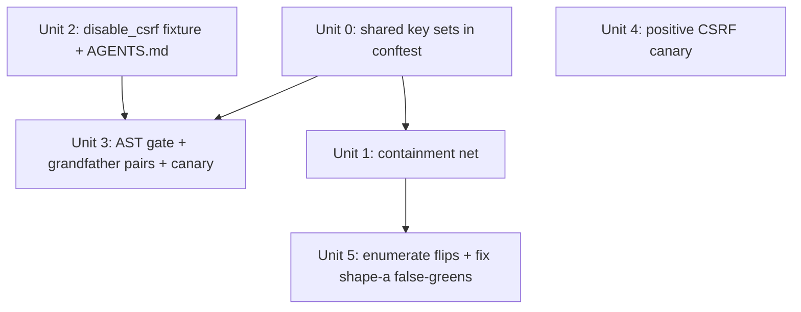

# feat: Test global-state pollution — containment net, AST gate, CSRF canary

## Overview

Eliminate a recurring class of test bugs: tests mutate global / module-level mutable
state (the shared `webui.app` singleton's config, `os.environ`) and never restore it,
causing order-dependent pollution and — worst case — **silent false-greens** where a
disabled CSRF guard goes unobserved (the PR #261 class).

The fix is a layered defense, decided in the origin brainstorm:
1. **Containment net** — an autouse function-scope fixture that restores an explicit
   set of security-relevant `webui.app.config` keys and the process environment to a
   clean baseline after every test.
2. **Static AST gate** — a `test_cli_exit_code_literals.py`-style test that bans raw
   mutation of security-toggle keys outside a sanctioned fixture, with a grandfather
   allowlist + count canary.
3. **Positive CSRF canary** — an isolation-independent test proving the guard is live
   under default config (a failure no leak-detector can catch).

A runtime "tripwire" was considered and **dropped** in the brainstorm (overlaps the
net's surface → teardown-ordering paradox; registry dimension never leaked + would
false-positive on lazy adapter import). See origin Scope Boundaries.

## Problem Frame

`webui.py` creates one module-level singleton `app = create_app()` at import time. 20
test files set CSRF flags (`CSRF_ENABLED` / `WTF_CSRF_ENABLED`) to `False`; the 9 that
mutate the **singleton** without restoring it leak a disabled CSRF guard into every
later test. Because collection order is deterministic (PYTHONHASHSEED=0, **no
pytest-randomly** — see Key Decisions), an alphabetically-earlier leak *stably*
disables the guard, so medium's CSRF tests passed every run while the guard was dead
code (PR #261). A sibling class — `del os.environ[CONFIG_DIR]` — leaked tests onto the
operator's real `~/.config` (PR #259). (see origin: docs/brainstorms/2026-05-27-test-global-state-pollution-guardrail-requirements.md)

## Requirements Trace

(R4 is intentionally absent — it was the dropped runtime-tripwire requirement in the origin
brainstorm; IDs R5–R11 are kept stable.)

- R1. Autouse function-scope net restores `webui.app.config` security keys to a clean
  baseline (fresh `create_app()` under pinned env; assert CSRF enabled; explicit key
  allowlist, not whole-dict) after each test. → Unit 1
- R2. Net restores the enumerated `SECURITY_ENV_KEYS` to pre-test state (pop-or-reassign,
  never `del`); not the full environ (all current env mutations use monkeypatch).
  Config-dir vars stay owned by `_isolate_user_dirs`. → Unit 1
- R3. Net engages where relevant without forcing webui imports on pure-CLI tests. → Unit 1
- R5. Static AST gate flags the canonical subscript-assignment form of `SECURITY_CONFIG_KEYS`
  mutation outside sanctioned fixtures; same `conftest`-defined constant feeds net + gate so
  they cannot drift. → Unit 3
- R6. Grandfather allowlist of `(file, key)` pairs, closed + count canary; only shrinks. → Unit 3
- R7. Sanctioned `disable_csrf` fixture; documented in `tests/AGENTS.md`. → Unit 2
- R8. Grandfathered (31 `(file,key)` pairs / 25 files over the gated keys), not force-migrated;
  CSRF offenders classified singleton / local-instance / deliberate-toggle. → Unit 3, Unit 5
- R9. Inherited-leak false-greens (shape a) fixed in-PR (or split if large); own-body
  CSRF-disabled tests (shape b) "fixed" only via positive enforcement assertion. → Unit 5
- R10. Preserve PYTHONHASHSEED=0 + existing autouse fixtures; compose, don't replace. → Unit 1
- R11. Isolation-independent positive CSRF canary (token-less POST → 403 under default). → Unit 4

## Scope Boundaries

- Not converting webui tests to per-test `create_app()` instances (net chosen over migration).
- Not fixing `webui_store/__init__.py` `_CONFIG_DIR` frozen-at-import (distinct prod change).
- Not adding pytest-randomly (would touch the footprint-gate determinism contract).
- No runtime global-state tripwire (dropped in brainstorm).
- Not a general test-quality sweep (mock.patch drift, `available()=False` skips).

## Context & Research

### Relevant Code and Patterns

- **AST-gate precedent — `tests/test_cli_exit_code_literals.py`** (the idiom to mirror):
  module constants + allowlist set, `_call_name`/`_is_int_constant` helpers,
  `ast.walk(tree)` collector, `@pytest.mark.parametrize` over discovered files, a
  recursion-coverage test, and a mandatory **positive "scanner actually fires"** test
  (anti-no-op guard). NOTE: `test_no_monolith_regrowth.py` is a radon-SLOC/TOML budget
  and `test_r9_extension_readiness.py` is a runtime fixture contract — *not* AST gates;
  only borrow the count-canary idiom (`SLOC_CANARY_EXPECTED`) from the former.
- **Count-canary precedent — `tests/fixtures/sloc_canary.py`** + `SLOC_CANARY_EXPECTED`
  in `test_no_monolith_regrowth.py`: a pinned constant with an assert + re-baseline message.
- **conftest fixtures — `tests/conftest.py` (HEAD)**: `_isolate_user_dirs` (session,
  autouse) saves/restores env via `prev = os.environ.get(KEY)` → pop-or-reassign (the
  exact idiom for the net's env restore); `_mock_publish_check_url`, `_mock_content_fetch`,
  `_disable_real_network` (function, autouse); `fake_platform_registered` (opt-in) is the
  per-key snapshot/restore pattern to mirror for config keys.
- **create_app() — `webui_app/__init__.py`**: `CSRF_ENABLED` via `setdefault(True)` (a
  pre-seeded `False` survives), `WTF_CSRF_ENABLED` never set by factory (only by tests),
  `secret_key` = `uuid4()` when env unset (non-deterministic → excluded from net),
  `SESSION_COOKIE_SECURE` env-driven, `start_scheduler=False` available.
- **CSRF guard — `webui_app/helpers/security.py` `_check_csrf_or_abort`** (called from
  `_global_csrf_guard` before_request): early-returns for non-mutating methods, when
  `CSRF_ENABLED` or `WTF_CSRF_ENABLED` is `False`, or when `request.endpoint` ends with
  `oauth_callback`; else 403 if token missing/mismatch (form `csrf_token` or `X-CSRFToken`
  vs `session['csrf_token']`). This is the *only* CSRF enforcement post-#143.
- **Sanctioned-fixture shapes**: `csrf_client` (`test_webui_route_contract.py` L133–152,
  `test_webui_three_url.py`) = try/finally that toggles CSRF on then in `finally` sets it
  **back to `False` (disabled), not to the True baseline** — i.e. `csrf_client` is itself a
  leak source; the net is what re-asserts `CSRF_ENABLED=True` after these tests (the net's
  function-scope teardown sequences after `csrf_client`'s `finally`). Mirror its try/finally
  shape, inverted, for `disable_csrf`. `_seed_csrf` (`test_webui_bind_routes.py` L64–67) =
  `session_transaction` seed of `csrf_token` (mirror for the canary).
- **`tests/AGENTS.md` L53** currently says tests opt out via raw `app.config['CSRF_ENABLED']
  = False` — will become stale once the gate lands; redirect to `disable_csrf`.

### Offender classification (verified against HEAD `77ff53b`)

| Class | Count | Files | Net relevance |
|---|---|---|---|
| Singleton (`webui.app.config`) — real leak | 9 | drafts_bulk_routes, e2e_history_batch_management, history_bulk_routes, history_recheck, history_template_rendering, webui_checkpoint, webui_equity_ledger_recheck, webui_equity_ledger_route, webui_history_invariant | Net contains these |
| Singleton + deliberate `=True` toggle (positive tests) | 2 | webui_route_contract, webui_three_url | `csrf_client` restores to **disabled** (itself a leak source); `client` leak contained by net; **must not break** |
| Local `create_app()` instance — already harmless | 9 | manifest_webui_wiring, webui_image_gen, webui_index_js_bootstrap, webui_index_template_structure, webui_publish_route, webui_request_cache, webui_settings_template_split, webui_static_css_served, webui_unit3_security | No restore needed; grandfathered for uniform gate rule |

The table above is the **CSRF-flag** offenders (20 files). Once `SESSION_COOKIE_SECURE` joins
the gated keys, 5 more files enter the grandfather set (channel_bind_save, medium_login_routes,
webui_bind_routes, webui_routes_oauth, webui_url_verify_routes), giving the full
**31 `(file,key)` pairs across 25 files** that Unit 3 seeds (verified HEAD). `SECRET_KEY`: 0 files.

### Institutional Learnings

- `docs/solutions/best-practices/app-level-csrf-guard-makes-blueprint-csrf-dead-code-2026-05-27.md`
  — bullseye: documents this exact leak and that **no session-scoped `app.config`-restore
  fixture exists yet**; this plan is that fixture. (Its claim that "CI runs pytest-randomly"
  is **inaccurate** — verified absent from deps; do not rely on it.)
- `docs/solutions/test-failures/tests-coupled-to-operator-config-state-2026-05-18.md`
  — the `_isolate_user_dirs` save/restore template; structural isolation forecloses the
  class, per-test fixes are only defense-in-depth.
- `docs/solutions/test-failures/negative-assertion-locks-in-bug-2026-05-15.md` +
  `.../language-matches-always-true-no-op-gate-2026-05-14.md` — **pin behavior, not shape**:
  assert known-trigger→non-empty and known-non-trigger→empty. Directly shapes Unit 3's
  anti-no-op test and Unit 4's canary (assert both 403-on-missing and 200-on-valid).
- `docs/solutions/logic-errors/invert-drift-check-when-invariant-becomes-dynamic-2026-05-18.md`
  — keep the gate **test-time**, never a module-level assertion against a registry-reading
  function (fires mid-import).
- `docs/solutions/workflow-issues/plan-claims-gate-net-new-files-opt-out-2026-05-26.md`
  — this plan post-dates the 2026-05-20 cutoff + adds net-new files → `claims: {}` in
  frontmatter (done).

## Key Technical Decisions

- **Deterministic order, not randomized**: pytest-randomly is absent from dev deps and
  no `addopts` randomizes; collection is alphabetical under PYTHONHASHSEED=0. The leak is
  therefore *stably* wrong (not flaky), which is exactly why a structural net + guardrail
  is needed — the false-green will never self-surface. The solution doc claiming otherwise
  is stale.
- **Restore an explicit key allowlist, not the whole config**: `create_app()` is
  non-deterministic (`uuid4()` secret_key), so the net snapshots/restores only
  `NET_CONFIG_RESTORE_KEYS` config entries against a known-good baseline.
- **Baseline from a fresh `create_app(start_scheduler=False)` at session start**, asserted
  CSRF-enabled — never a read of the already-imported (possibly-mutated) singleton, which
  could enshrine a leaked `False` as the restore target.
- **Gate matches on the subscript key string regardless of receiver** (robust; static
  receiver-resolution is brittle). Consequence: harmless local-`create_app()`-instance files
  are also flagged → grandfathered. Accepted: it enforces one sanctioned path for all future
  tests. (Considered receiver-aware to shrink the allowlist; chose uniform for robustness.)
- **Gate-banned config keys = `SECURITY_CONFIG_KEYS` (CSRF_ENABLED, WTF_CSRF_ENABLED,
  SESSION_COOKIE_SECURE, SECRET_KEY)** — `SESSION_COOKIE_SECURE`/`SECRET_KEY` are
  cookie-integrity toggles that can neuter effective CSRF even with `CSRF_ENABLED=True` (a
  leaked `SESSION_COOKIE_SECURE=True` strips the cookie over HTTP → no session → token can't
  round-trip). Receiver-blind over these 4 keys grandfathers **25 files / 31 `(file,key)`
  pairs** (verified against HEAD).
- **`TESTING` is restored by the net but NOT banned by the gate.** It is set in ~31 files as
  standard Flask test-client setup (not a security downgrade; the guard never reads it);
  banning it would make the allowlist ~32 files of legitimate setup and drown the gate's
  signal. The net restores it for cleanliness; the gate ignores it.
- **Shared key sets defined in `tests/conftest.py`** (`SECURITY_CONFIG_KEYS`,
  `NET_CONFIG_RESTORE_KEYS`, `SECURITY_ENV_KEYS`), imported by the gate test via
  `from conftest import SECURITY_CONFIG_KEYS`. **`tests/` is NOT a package** (no
  `__init__.py`; `import tests` resolves to an unrelated site-packages package), so
  `from tests.fixtures...` does not work in this repo. `conftest` is importable as a
  top-level module by sibling tests at the same rootdir — that is the anti-drift channel.
  The `sloc_canary.py` precedent does not transfer: that file is a radon *parser input*
  read as text, not an importable constant holder.

## Open Questions

### Resolved During Planning

- AST-gate precedent? → `test_cli_exit_code_literals.py` (not the monolith/r9 tests).
- Is order randomized? → No; deterministic. Net + gate still required.
- Net baseline source? → Fresh `create_app()` at session start, assert CSRF-enabled.
- Which env vars does the net own? → Full-environ snapshot/restore minus
  `BACKLINK_PUBLISHER_CONFIG_DIR`/`_CACHE_DIR` (owned by `_isolate_user_dirs`).

### Deferred to Implementation

- Exact flip-to-red set when the net lands — only knowable by running it (Unit 5); decides
  in-PR vs split.
- Exact AST node shape for the subscript-key match and whether to exempt by fixture
  marker vs filename — settle against real `ast.parse` output during Unit 3.
- Whether `OAUTHLIB_INSECURE_TRANSPORT` intra-test "1"→"0" asserts (test_webui_unit3_security)
  survive the net unchanged — confirm during Unit 1.
- Confirm `from conftest import SECURITY_CONFIG_KEYS` resolves (single rootdir `conftest`, no
  nested conftest shadowing) — verify with a `pytest tests/test_security_toggle_mutation_gate.py`
  run during Unit 3.
- Pick the canary's protected route so a 403 proves the *CSRF* check fired, not
  `_check_bind_origin_or_abort` — choose a CSRF-guarded-but-not-origin-guarded route, or seed
  the loopback Origin too. Settle during Unit 4.
- Confirm the net's env snapshot is taken before per-test `monkeypatch.setenv` runs (autouse
  ordering) so the net does not re-impose monkeypatched values on teardown — confirm via the
  Unit 1 meta-test.

## High-Level Technical Design

> *This illustrates the intended approach and is directional guidance for review, not
> implementation specification. The implementing agent should treat it as context, not
> code to reproduce.*

```
SECURITY_CONFIG_KEYS    = {"CSRF_ENABLED", "WTF_CSRF_ENABLED",        # gate bans + net restores
                           "SESSION_COOKIE_SECURE", "SECRET_KEY"}
NET_CONFIG_RESTORE_KEYS = SECURITY_CONFIG_KEYS | {"TESTING"}          # net restores; gate ignores TESTING
SECURITY_ENV_KEYS       = {"BACKLINK_PUBLISHER_ALLOW_NETWORK",        # net restores in os.environ
                           "OAUTHLIB_INSECURE_TRANSPORT",
                           "BACKLINK_PUBLISHER_SESSION_COOKIE_SECURE"}

session-scope autouse fixture, ORDERED AFTER _isolate_user_dirs (so create_app runs
against the isolated config dir, never the operator's real ~/.config):
   BASELINE = {k: fresh_create_app(start_scheduler=False).config.get(k)
               for k in NET_CONFIG_RESTORE_KEYS}
   assert BASELINE["CSRF_ENABLED"] is True            # fail loud if baseline not clean

per test (autouse, function scope, defined AFTER existing autouse fixtures):
  setup:   reset webui.app.config NET_CONFIG_RESTORE_KEYS to BASELINE   # no in-test dead window
           snapshot SECURITY_ENV_KEYS values (only these keys, not whole environ)
  yield
  teardown:
    - restore webui.app.config NET_CONFIG_RESTORE_KEYS to BASELINE
      (pop if absent in baseline, e.g. WTF_CSRF_ENABLED)
    - restore SECURITY_ENV_KEYS via pop-or-reassign (never del; CONFIG_DIR untouched)
```

Net teardown runs first (reverse setup order) relative to session env-isolation, and
after the monkeypatch-based fixtures have already auto-reverted. The env arm restores only
the enumerated `SECURITY_ENV_KEYS` (not the full environ) — every current env mutation
already goes through `monkeypatch` (auto-reverted), so this is bounded defense-in-depth,
not the full-environ snapshot an earlier draft proposed.

## Implementation Units

Dependency shape:



- [x] **Unit 0: Shared security-toggle key constants (in conftest)**

**Goal:** Single source of truth for the security-relevant config + env keys, importable by
both the net fixture and the gate test.

**Requirements:** R5 (anti-drift)

**Dependencies:** None

**Files:**
- Modify: `tests/conftest.py`

**Approach:**
- Define three explicit sets in `tests/conftest.py`:
  - `SECURITY_CONFIG_KEYS = {"CSRF_ENABLED", "WTF_CSRF_ENABLED", "SESSION_COOKIE_SECURE",
    "SECRET_KEY"}` — gate bans subscript mutation of these; net restores them.
  - `NET_CONFIG_RESTORE_KEYS = SECURITY_CONFIG_KEYS | {"TESTING"}` — net also restores
    `TESTING`, but the gate does **not** ban it (`TESTING=True` is standard, non-security
    test setup mutated in ~31 files — see Key Decisions).
  - `SECURITY_ENV_KEYS = {"BACKLINK_PUBLISHER_ALLOW_NETWORK", "OAUTHLIB_INSECURE_TRANSPORT",
    "BACKLINK_PUBLISHER_SESSION_COOKIE_SECURE"}` — net restores these in `os.environ`.
- The net iterates `NET_CONFIG_RESTORE_KEYS` against `webui.app.config` and `SECURITY_ENV_KEYS`
  against `os.environ`; the gate iterates `SECURITY_CONFIG_KEYS` for its config-subscript scan.
- The gate test imports via `from conftest import SECURITY_CONFIG_KEYS`. Do **not** create a
  `tests/fixtures/*` module for this — `tests/` is not a package.

**Patterns to follow:** module-level constants already present in `tests/conftest.py`.

**Test scenarios:** Test expectation: none — pure constants; exercised by Units 1 & 3.

**Verification:** `from conftest import SECURITY_CONFIG_KEYS` resolves in the gate test.

- [x] **Unit 1: Containment net fixture**

**Goal:** Autouse function-scope fixture restoring `webui.app.config` security keys + env
to a clean baseline after each test.

**Requirements:** R1, R2, R3, R10

**Dependencies:** Unit 0

**Files:**
- Modify: `tests/conftest.py`
- Test: `tests/test_conftest_state_net.py` (meta-test for the net itself)

**Approach:**
- Build the baseline in a **session-scope autouse fixture ordered AFTER `_isolate_user_dirs`**
  (depend on it so `create_app()` runs against the isolated tmp config dir, never the
  operator's real `~/.config` — `create_app` calls `WebUIStores().init_app` + `load_config`,
  which are config-dir-sensitive). Snapshot `NET_CONFIG_RESTORE_KEYS` from a fresh
  `create_app(start_scheduler=False)` and **assert `CSRF_ENABLED` is `True`**, failing loudly.
- Add the function-scope autouse net, defined **after** the three existing function-scope
  autouse fixtures so its teardown runs before theirs is undone and after monkeypatch reverts.
- **Setup (pre-yield):** reset `webui.app.config` `NET_CONFIG_RESTORE_KEYS` to baseline so a
  leak from a prior test cannot create an in-test guard-dead window; snapshot the
  `SECURITY_ENV_KEYS` values only (not the whole environ).
- **Teardown:** restore `webui.app.config` `NET_CONFIG_RESTORE_KEYS` to baseline (drop keys
  absent in baseline, e.g. `WTF_CSRF_ENABLED`); restore `SECURITY_ENV_KEYS` via the
  `_isolate_user_dirs` pop-or-reassign idiom. Never `del os.environ`
  (see `feedback_del_os_environ_poisons_later_tests`). `CONFIG_DIR`/`_CACHE_DIR` are owned by
  `_isolate_user_dirs` and untouched.
- R3: import `webui` lazily inside the fixture; for pure-CLI tests the config arm is a cheap
  no-op (webui imported once at collection) — do not force a webui import where avoidable;
  the env arm touches only the two enumerated keys.

**Execution note:** Add the meta-test first (it should fail before the net exists), then
implement the net to make it pass.

**Patterns to follow:** `_isolate_user_dirs` (env save/restore), `fake_platform_registered`
(per-key snapshot/restore).

**Test scenarios:**
- Integration: a test that sets `webui.app.config["WTF_CSRF_ENABLED"] = False` is followed
  (in the same module) by a test asserting `webui.app.config.get("WTF_CSRF_ENABLED", True)
  is True` → passes (leak contained).
- Integration: a test that sets `os.environ["OAUTHLIB_INSECURE_TRANSPORT"] = "1"` is
  followed by a test asserting the key is absent/prior value → passes.
- Edge case: a test that pops `BACKLINK_PUBLISHER_CONFIG_DIR` mid-body → the *next* test
  still resolves an isolated dir (net does not fight `_isolate_user_dirs`).
- Edge case: baseline assertion fails fast if `create_app()` ever returns `CSRF_ENABLED`
  not `True`.
- Happy path: `test_webui_unit3_security` intra-test `OAUTHLIB_INSECURE_TRANSPORT` "1"→"0"
  assertions still pass under the net (restore is teardown-only).

**Verification:** Suspect leak-then-read ordering passes in full suite; existing suite green
(modulo Unit 5 flips); single-file runs unchanged.

- [x] **Unit 2: Sanctioned `disable_csrf` fixture + docs**

**Goal:** One obvious, restoring way to disable CSRF in a test.

**Requirements:** R7

**Dependencies:** None (lands before Unit 3 so the gate can exempt it)

**Files:**
- Modify: `tests/conftest.py`
- Modify: `tests/AGENTS.md`

**Approach:**
- Add a `disable_csrf` fixture that sets `webui.app.config` CSRF keys `False` with
  try/finally restore (inverse of the existing `csrf_client`). Living in conftest makes it
  the single sanctioned mutation site the AST gate exempts.
- Rewrite `tests/AGENTS.md` L53 to point at `disable_csrf` instead of raw mutation, and add
  the new gate test to the "Budget gates" listing so contributors discover it.

**Patterns to follow:** `csrf_client` try/finally toggle (`test_webui_route_contract.py`).

**Test scenarios:**
- Happy path: a test using `disable_csrf` can POST without a token (no 403) within the test.
- Integration: after a `disable_csrf` test, the next test sees CSRF enabled (composes with net).

**Verification:** Fixture usable from any test; AGENTS.md no longer advertises raw mutation.

- [x] **Unit 3: Static AST gate + grandfather allowlist + count canary**

**Goal:** Fail CI when a test raw-mutates a security-toggle key outside the sanctioned fixture.

**Requirements:** R5, R6, R8

**Dependencies:** Unit 0, Unit 2

**Files:**
- Create: `tests/test_security_toggle_mutation_gate.py`

**Approach:**
- Mirror `test_cli_exit_code_literals.py`: a collector walking `ast.parse` of each
  `tests/*.py`, flagging `Subscript` assignment targets (`ast.Assign`/`AnnAssign`/`AugAssign`)
  whose `.config[...]` key string is in `SECURITY_CONFIG_KEYS` (imported `from conftest`).
  **Scope is config-key subscripts only** — env-toggle safety is the net's job (R2), not the
  gate's, because the dominant env-mutation form is `monkeypatch.setenv` (a self-restoring
  `Call`, invisible to and inappropriate for a subscript ban). Exempt `conftest.py` (home of
  the sanctioned `disable_csrf` fixture).
- The gate's reach is the canonical subscript-assignment form; it is a discoverability/
  speed-bump layer, **not** an absolute wall (`.config.update({...})`, `setattr`, or a helper
  indirection can evade it). The runtime net is the real safety layer. State this honestly —
  do not claim it "bans all raw mutation".
- **Grandfather as a frozenset of `(file_basename, key)` PAIRS**, not files — re-derived from
  a HEAD grep over `SECURITY_CONFIG_KEYS` (**verified: 31 pairs across 25 files**; `TESTING`
  excluded). Per-file grandfathering is too coarse: a grandfathered file could silently add a
  *second* toggle mutation and stay green. Assert the discovered pair-set **equals**
  `GRANDFATHERED` (exact) — adding or removing any mutation trips the canary and forces a
  same-PR allowlist edit (ratchets down only). `conftest.py` is exempt (sanctioned fixture home).
- Keep evaluation test-time (parametrized test), never a module-level assertion (per
  `invert-drift-check-when-invariant-becomes-dynamic`).

**Execution note:** Include the mandatory **anti-no-op** test feeding a synthetic
`webui.app.config["WTF_CSRF_ENABLED"] = False` snippet through the collector and asserting
it is flagged — without it the gate could silently pass.

**Patterns to follow:** `test_cli_exit_code_literals.py` (collector, parametrize,
recursion-coverage test, positive-fires test); `SLOC_CANARY_EXPECTED` (count canary message).

**Test scenarios:**
- Happy path: current tree passes (all 31 grandfathered pairs present, conftest exempt).
- Anti-no-op (positive): synthetic banned snippet → collector flags it.
- Edge case: a synthetic new file (not on allowlist) with a banned mutation → gate fails
  with an actionable message.
- Edge case: count canary trips when the discovered `(file, key)` pair-set ≠ `GRANDFATHERED`
  (forces same-PR update on add/remove, including a *second* mutation added to an already-
  grandfathered file).
- Edge case: deliberate `=True` toggles in `webui_route_contract`/`webui_three_url` do not
  cause an *additional* violation beyond their grandfather pair(s).

**Verification:** `pytest tests/test_security_toggle_mutation_gate.py` green on current tree;
adding a new raw mutation reds it.

- [x] **Unit 4: Positive CSRF canary**

**Goal:** Prove the guard is live under default config, independent of isolation fixtures.

**Requirements:** R11

**Dependencies:** None

**Files:**
- Create: `tests/test_csrf_guard_canary.py`

**Approach:**
- Build a fresh `create_app(start_scheduler=False)`. **First `monkeypatch.delenv` the
  process-global toggles** (`BACKLINK_PUBLISHER_ALLOW_NETWORK`, `OAUTHLIB_INSECURE_TRANSPORT`,
  `BACKLINK_PUBLISHER_SESSION_COOKIE_SECURE`) so a sibling test's env leak cannot influence
  the fresh app's cookie/network posture and make the green hollow.
- **Assert the fresh app's `CSRF_ENABLED is True` and `WTF_CSRF_ENABLED` is not `False`**
  before exercising routes — proves the baseline is genuinely default-on.
- Seed `session['csrf_token']` via `session_transaction` (mirror `_seed_csrf`). Pick a route
  that is CSRF-guarded but **not** also origin-guarded (or seed the loopback Origin too, per
  `_bind_origin_headers`), so a 403 proves the *CSRF* check fired, not an origin check.
- Assert both directions against the **same seeded session**: matching-token POST → not 403,
  and **mismatched/absent token** → 403 — proving `secrets.compare_digest` is the
  discriminator, not "no session". Must not depend on the net; stays off the allowlist.

**Patterns to follow:** `_seed_csrf` + `app`/`client` fixtures (`test_webui_bind_routes.py`).

**Test scenarios:**
- Happy path: valid-token POST to a protected (non-origin-guarded) route → not 403.
- Error path: missing token → 403; mismatched token → 403; empty token → 403 (same session).
- Edge case: GET to the same route → not 403 (method exemption).
- Edge case: a route whose endpoint ends `oauth_callback` → token-less POST not 403 (exemption fires).
- Edge case: a near-miss endpoint name (does not end `oauth_callback`) → token-less POST still
  403 (exemption is narrow, `endswith` not over-matching).

**Verification:** Canary green on default config and trustworthy (asserts CSRF flag state +
discriminator); would red if the guard regressed to a no-op.

- [x] **Unit 5: Enumerate flips + fix inherited-leak false-greens**

**Goal:** Surface and fix tests that were green only on inherited leaked state.

**Result (execution):** Full suite under the net = **5092 passed, 6 skipped, 0 flips** — no inherited-leak false-greens exist; containment achieved with zero cleanup churn, so no PR split needed.

**Requirements:** R8, R9

**Dependencies:** Unit 1

**Files:**
- Modify: whichever tests flip red (determined at execution)

- Note the framing: the 9 singleton files are leak *sources* (each disables CSRF in its own
  `client`/`app` fixture, so they pass for themselves; the net contains their cross-test
  leak). They are **not** themselves the false-greens. The false-greens are *victim* tests
  whose own green depended on an inherited disabled guard.
- **A pre-implementation grep found zero obvious webui POST tests lacking both a CSRF-off
  fixture and a token seed** — so the flip set may be near-zero, or may hinge on a subtler
  `TESTING`/Flask-WTF interaction rather than raw `CSRF_ENABLED` leaks. Capture this
  uncertainty; do not assume a large shape-a population exists.

**Approach:**
- With the net in place, run the full suite; enumerate the flip-to-red set. **Classify each
  flip at discovery time:**
  - Shape (a) — inherited-leak victim (test relied on a sibling's disabled guard): fix by
    seeding canonical `session['csrf_token']` (`_seed_csrf`), then verify the POST succeeds
    with the token. Use `disable_csrf` only where the test legitimately exercises a CSRF-off
    path (and document why).
  - Shape (b) — the test body itself disables CSRF and asserts a security property: "fixed"
    means adding a **positive 403-on-missing-token assertion** under default config; do
    **not** just route it through `disable_csrf` (that is suppression). Flag any fix whose
    only diff is adding `disable_csrf` to a CSRF test.
- **Sizing:** if the flip set is small, fix in this PR; if large, land Units 0–4 first
  (containment goal met) and split the flip-fixes into a sized follow-up PR. The net PR
  must not be held unbounded behind cleanup.

**Execution note:** This unit is execution-discovery — the flip set is only knowable by
running the net. Do not pre-list failures in the plan.

**Test scenarios:** Per-flipped-test — each must end with a behavior-pinning assertion
(403-on-missing / 200-on-valid), never a silenced guard.

**Verification:** Full suite green with the net active; no security test "fixed" by
suppression; `git diff` of any CSRF test fix contains a positive assertion.

## System-Wide Impact

- **Interaction graph:** New autouse fixture runs around *every* test; ordering vs the three
  existing function-scope autouse fixtures and session `_isolate_user_dirs` is load-bearing
  (Unit 1 meta-test pins it).
- **Error propagation:** Baseline assertion fails loud at session start if `create_app()`
  ever ships CSRF disabled — a deliberate tripwire.
- **State lifecycle risks:** `webui.app` is a shared singleton; the net mutates its config
  on teardown — must restore exact prior security-key state (including key *absence*).
- **API surface parity:** Env restore must not clobber `_isolate_user_dirs`-owned config-dir
  vars.
- **Integration coverage:** Unit 1 meta-test + Unit 4 canary are the cross-layer proofs unit
  assertions alone can't give.
- **Unchanged invariants:** PYTHONHASHSEED=0, footprint gate, existing autouse fixtures, and
  the `csrf_client` positive-test pattern remain intact.

## Risks & Dependencies

| Risk | Mitigation |
|------|------------|
| Net flips many false-greens red → unbounded PR | Unit 5 sizing rule: enumerate first, split if large |
| Net captures a polluted baseline → enshrines disabled guard | Baseline from fresh `create_app()` + assert CSRF enabled (Unit 1) |
| Gate over-bans the positive `csrf_client` tests | They're grandfathered; gate matches key not RHS; Unit 3 edge-case test |
| `conftest.py` already dirty with concurrent WIP; CI tests merge-into-main | Rebase + re-verify HEAD and re-derive the 31-pair allowlist immediately before opening PR |
| Gate becomes a silent no-op | Mandatory anti-no-op positive test (Unit 3) |
| Net ordering fights existing fixtures | Unit 1 meta-test pins setup/teardown ordering |

## Documentation / Operational Notes

- `tests/AGENTS.md`: redirect the CSRF-in-tests note to `disable_csrf`; list the new gate.
- Correct the stale claim in `docs/solutions/best-practices/app-level-csrf-guard-makes-blueprint-csrf-dead-code-2026-05-27.md`
  that "CI runs pytest-randomly" — it does not (verify against `pyproject.toml` dev-deps + `ci.yml`).
- No production code changes; no rollout/migration concerns.

## Sources & References

- **Origin document:** [docs/brainstorms/2026-05-27-test-global-state-pollution-guardrail-requirements.md](docs/brainstorms/2026-05-27-test-global-state-pollution-guardrail-requirements.md)
- AST-gate idiom: `tests/test_cli_exit_code_literals.py`
- Canary idiom: `tests/test_no_monolith_regrowth.py`, `tests/fixtures/sloc_canary.py`
- Fixture patterns: `tests/conftest.py` (`_isolate_user_dirs`, `fake_platform_registered`),
  `tests/test_webui_route_contract.py` (`csrf_client`), `tests/test_webui_bind_routes.py` (`_seed_csrf`)
- CSRF guard: `webui_app/__init__.py`, `webui_app/helpers/security.py`
- Related PRs: #261 (medium CSRF false-green), #259 (`del os.environ` leak), #143 (global CSRF guard)
- Learnings: `docs/solutions/best-practices/app-level-csrf-guard-makes-blueprint-csrf-dead-code-2026-05-27.md`,
  `docs/solutions/test-failures/tests-coupled-to-operator-config-state-2026-05-18.md`,
  `docs/solutions/test-failures/negative-assertion-locks-in-bug-2026-05-15.md`
