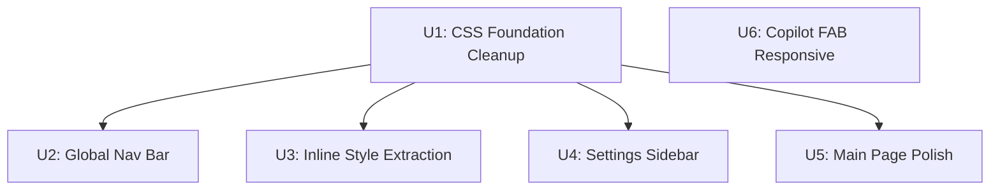

# refactor: WebUI UI/UX Complete Overhaul

## Overview

Three systemic cracks in the WebUI are addressed in one focused refactor: navigation dead-ends (8 pages, no global nav), visual inconsistency (inline styles, duplicate CSS tokens, cheap hover animations), and settings page density (flat vertical scroll with no structure). The result is a persistent global nav bar, a two-column settings sidebar, and a clean CSS foundation — with zero new pages or features added.

## Problem Frame

Solo-operator tool used daily. Navigation between health, schedule, equity_ledger, sites, pr_queue requires URL memory. Settings page is one long scroll. Inline styles are scattered across templates. `index.css` still has a duplicate `:root` block even after the token extraction to `tokens.css`. Card and navbar hover animations produce distracting layout shifts.

(see origin: docs/brainstorms/2026-06-03-webui-ux-overhaul-requirements.md)

## Requirements Trace

- R1–R4: Global navigation bar in base.html + standalone pages
- R5–R9: Settings two-column sidebar (DOM show/hide)
- R10–R14: Visual consistency — inline style removal, duplicate `:root`, hover animations
- R15, R17: Main page UX — step bar transition, flash auto-dismiss
- R18–R19: Copilot FAB — z-index verify, responsive label

## Scope Boundaries

- No dark mode
- No mobile overhaul (desktop-only operator)
- Channel card sub-templates (`_settings_channel_*.html`) not rewritten — only scaffold changes
- No new pages or features
- Bootstrap 5 stays

## Context & Research

### Relevant Code and Patterns

| File | Role | Key constraint |
|------|------|---------------|
| `webui_app/templates/base.html` | Extends by: index, settings, equity_ledger, schedule, pr_queue | Add global nav here; 4 blocks: head_extra, content, page_data, page_module |
| `webui_app/templates/health.html` | Standalone (own `<head>`) | Must add nav directly; or convert to extend base.html |
| `webui_app/templates/sites.html` | Standalone (own `<head>`) | Same as health.html |
| `webui_app/static/css/tokens.css` | Single source of `:root` design tokens | All `var(--…)` live here |
| `webui_app/static/css/index.css` | Main-page CSS | Has duplicate `:root` L3–16, card translateY L63–65, navbar translateY L37–40 |
| `webui_app/static/css/settings.css` | Settings-page CSS | `:root` already removed (Plan 007); sticky `.settings-tab-bar` z-index 200 |
| `webui_app/static/css/copilot.css` | FAB + panel, cross-page | FAB z-index 1080, panel 1090; has var() fallbacks for standalone pages |
| `webui_app/static/js/settings.js` | Settings ESM entry | `_initStickyTabBar()` is scroll-observer based; must be replaced by pane-switch |
| `webui_app/templates/settings.html` | Settings page | **≤400 line hard constraint** (currently 382); tested by `test_settings_html_final_size` |
| `webui_app/templates/_settings_*.html` | Settings sub-templates | Reused as-is inside pane containers |

### Exact URL Routes

| Page | URL | Extends base? |
|------|-----|--------------|
| index | `/` | Yes |
| settings | `/settings` | Yes |
| equity_ledger | `/ce:equity-ledger` | Yes |
| schedule | `/schedule` | Yes |
| pr_queue | `/pr-queue` | Yes |
| health | `/ce:health` | No (standalone) |
| sites | `/sites` | No (standalone) |

### z-index Stack (pre-change)

| Element | z-index |
|---------|---------|
| `.step-bar` sticky | 100 |
| `.settings-tab-bar` sticky | 200 |
| Bootstrap sticky-top nav (new global nav) | 1030 |
| `.copilot-fab` | 1080 |
| `.copilot-panel` | 1090 |
| `#_loadingOverlay` inline | 9999 |

Global nav at 1030 is safely below FAB (1080) — no z-index conflict. The settings `.settings-tab-bar` (which is removed in U4) was at 200, below global nav. Body must gain `padding-top` equal to global nav height to prevent content slipping under a fixed/sticky bar.

### Existing Test Constraints

- `tests/test_webui_settings_template_split.py::test_settings_html_final_size` — settings.html ≤ 400 lines
- `tests/test_webui_settings_template_split.py::test_settings_page_has_no_inline_style` — no `<style>` blocks (not `style=""` attributes)
- `tests/test_webui_settings_template_split.py::test_settings_has_no_inline_event_handlers` — no `on*` attributes
- `tests/test_copilot_panel_render.py` — copilot FAB+panel present on 5 pages; exactly one CSRF meta per page; zero inline `on*`
- `tests/test_webui_index_template_structure.py` — tab-pane divs in partials; only index.js module loaded

### Institutional Learnings

- **Sibling Page vs Retrofit**: Nav is a genuine shared state — retrofit via base.html is correct.
- **Config cache governance**: Any new settings GET handler uses `_g_cache('config', load_config)`; write handlers call `load_config()` directly. CI AST gate enforces this (`test_webui_request_cache.py`).
- **CSRF**: `_global_csrf_guard` covers all POST/PUT/PATCH/DELETE in `create_app()` — do NOT add per-blueprint CSRF checks.
- **Never POST to live `/save-*`**: Development testing must use pytest with throwaway `config_dir` fixture only.
- **Loading overlay**: `document.addEventListener('submit', ...)` pattern from `solutions/ui-bugs/webui-blocking-subprocess*` is the established pattern for showing progress on long operations.

## Key Technical Decisions

- **DOM show/hide for settings sidebar (not fetch-based pane swap)**: All section content renders upfront in Jinja; JS toggles `display:none` on section containers. This eliminates C1 (form CSRF on fetched fragments), C2 (Bootstrap Collapse re-init after fetch), and I6 (hash-to-pane mapping complexity). The cost is slightly larger initial HTML payload — acceptable for 4 sections. (see origin: R7 + flow analysis findings C1/C2/I6)
- **`sessionStorage` restores active pane after form submit**: Before any form in the settings page submits (causing a full-page reload via `_safe_flash_redirect`), JS stores `sessionStorage.setItem('settings:activePane', activePaneKey)`. On load, `_initActivePane()` reads and restores the active sidebar item. This matches the existing `bind:lastChannel` pattern — zero backend changes needed.
- **`HASH_TO_PANE` mapping in settings.js**: Fragment redirects like `/settings#channel-medium` must still work because `_safe_flash_redirect(fragment='channel-medium')` is used by multiple save handlers. The map resolves `#channel-*` → `'channels'` pane, `#section-global` → `'global'` pane, etc.
- **Extract sidebar HTML to `_settings_sidebar.html`**: settings.html has 382 lines; adding sidebar scaffold inline would push past 400. Extracting sidebar tree to a partial keeps settings.html within limit.
- **Convert health.html and sites.html to extend base.html**: Copy-pasting nav into two standalone files creates a maintenance hazard. One-time conversion ensures all 7 pages get the nav automatically and the copilot CSS var() fallbacks (already in copilot.css) handle their standalone `<head>` needs.
- **Global nav uses `sticky-top` (Bootstrap class), not `position:fixed`**: Sticky-top scrolls with the page initially but sticks when it hits the top — avoids the `padding-top` math required for `fixed-top`, while still keeping the nav accessible after scroll.

## Open Questions

### Resolved During Planning

- **Which pane opens first on settings load?** → 綁定總覽, matching current default. `data-pane="dashboard"` is the default active.
- **How does `HASH_TO_PANE` handle unknown hashes?** → Falls through to default pane (綁定總覽). No error shown.
- **Does converting health/sites to extend base.html require new CSS blocks?** → health.html has inline `<style>` blocks already forbidden in settings; check if its styles move to a new `health.css` or are kept as ``. Defer exact approach to implementation.
- **Bind-in-progress pane switch**: If user clicks sidebar while bind job is polling, the poll continues silently (null-guard already in `bind_channel.js`); progress log for that job is lost but badge is restored from server on next pane render. Acceptable for solo-operator tool — no warning needed.

### Deferred to Implementation

- **Exact styles needed for global nav**: Height, padding, font-size — derive from existing navbar measurements in index.css during implementation.
- **Which channel slugs appear in sidebar**: Derive from `dashboard_channels` (already in settings template context) during implementation.
- **settings.css cleanup**: Identify and remove any `max-width` or `width: 100%` rules that assume full-width layout; defer exact line numbers to implementation after opening the file.
- **health.html / sites.html conversion details**: Identify exactly which local styles in these files need to move to `` vs. a new shared CSS file.

## High-Level Technical Design

> *This illustrates the intended approach and is directional guidance for review, not implementation specification. The implementing agent should treat it as context, not code to reproduce.*

**Settings Sidebar DOM Layout (directional):**

```
settings.html
└── base.html blocks
    └── 
        ├── <nav class="global-nav"> (from base.html)
        ├──   ← new partial
        └── <div class="settings-layout">
              ├── <aside class="settings-sidebar">
              │     [sidebar tree rendered from _settings_sidebar.html]
              └── <div class="settings-pane-host">
                    ├── <section id="pane-dashboard" class="settings-pane active">
                    │     
                    ├── <section id="pane-channels" class="settings-pane hidden">
                    │     [channel cards, same includes as today]
                    ├── <section id="pane-global" class="settings-pane hidden">
                    │     
                    │     
                    └── <section id="pane-llm" class="settings-pane hidden">
                          
```

**settings.js pane-switch logic (directional):**

```
_initSidebarNav()
  → for each [data-pane] sidebar link:
      on click → activeKey = link.dataset.pane
                 sessionStorage.setItem('settings:activePane', activeKey)
                 showPane(activeKey)

showPane(key)
  → hide all .settings-pane
    show #pane-{key}
    mark [data-pane=key] as active in sidebar

_initActivePane()  [runs at boot]
  → key = sessionStorage.getItem('settings:activePane')
          || hashToPaneKey(location.hash)
          || 'dashboard'
    showPane(key)
    if location.hash → _openCollapseForHash(location.hash)  [existing]

HASH_TO_PANE = {
  '#channel-medium': 'channels',
  '#channel-blogger': 'channels',
  '#channel-velog': 'channels',
  '#channel-telegraph': 'channels',
  '#section-channels': 'channels',
  '#section-global': 'global',
  '#section-llm': 'llm',
}
```

## Implementation Units



---

- [ ] **Unit 1: CSS Foundation Cleanup**

**Goal:** Remove the duplicate `:root` block from `index.css`, eliminate layout-shift hover animations from both `index.css` and `settings.css`, so downstream units build on a clean token foundation.

**Requirements:** R11, R12, R13

**Dependencies:** None

**Files:**
- Modify: `webui_app/static/css/index.css`
- Modify: `webui_app/static/css/settings.css`
- Test: `tests/test_webui_index_template_structure.py` (existing — run to confirm no regression)

**Approach:**
- `index.css`: delete lines 3–16 (the `:root { … }` block — all tokens now come from `tokens.css`). Verify no CSS var() in index.css references a token that was in the duplicate block but absent from tokens.css.
- `index.css`: delete `.navbar:hover { transform: translateY(-2px) }` rule.
- `index.css`: change `.card:hover { transform: translateY(-4px); box-shadow: … }` to only deepen `box-shadow` (no `transform`). Target: `box-shadow: 0 8px 24px -8px rgba(0,0,0,0.12)` on hover.
- `settings.css`: same card hover fix as above.
- `settings.css`: remove any `.navbar:hover { transform: … }` rule if present.

**Patterns to follow:**
- `tokens.css` for the canonical var() names
- `settings.css` line structure for the hover rule (confirm location before deletion)

**Test scenarios:**
- Happy path: After deleting the `:root` block, `var(--primary)` still resolves on the index page (spot-check by loading the page in browser)
- Edge case: No remaining `var(--…)` in `index.css` references a token that existed only in the removed block and not in `tokens.css`
- Regression: `pytest tests/test_webui_index_template_structure.py` passes

**Verification:**
- `index.css` has exactly zero `:root` blocks
- No `translateY` in any `.card:hover` or `.navbar:hover` rule in `index.css` or `settings.css`

---

- [ ] **Unit 2: Global Navigation Bar**

**Goal:** Add a persistent global nav to `base.html` that links to all 7 pages; convert `health.html` and `sites.html` to extend `base.html` so they receive the nav automatically.

**Requirements:** R1, R2, R3, R4

**Dependencies:** Unit 1 (clean token foundation)

**Files:**
- Modify: `webui_app/templates/base.html`
- Modify: `webui_app/templates/health.html`
- Modify: `webui_app/templates/sites.html`
- Create: `webui_app/static/css/global_nav.css` (or extend `tokens.css` — decide based on size)
- Test: `tests/test_copilot_panel_render.py` (existing — must still pass)
- Test: `tests/test_webui_settings_template_split.py` (existing — must still pass)

**Approach:**
- In `base.html`, insert `<nav class="global-nav">` as the first child of `<body>`, before ``.
- Nav contains `<a>` links for: 发布 (`/`), 健康 (`/ce:health`), 排程 (`/schedule`), 权益 (`/ce:equity-ledger`), 站点 (`/sites`), PR队列 (`/pr-queue`), 设置 (`/settings`).
- Active state: pass `active_page` (string slug) from each route handler into the template context; nav items compare `active_page` to their slug for `class="active"`. **The global nav in `base.html` must use `{{ active_page | default('') }}` (with `default` filter) so that any direct `render_template()` call in tests that omits `active_page` does not raise `UndefinedError`.**
- Use `sticky-top` Bootstrap class on the `<nav>` — no body `padding-top` math needed; Bootstrap handles it.
- Tokens: `--primary`, `--gradient` from `tokens.css`. New utility classes for active/hover states go in `global_nav.css` (link from `base.html`'s `head_extra` block default, or a new default `` in base.html).
- **Converting health.html**: Extract its inline `<style>` block to ``, wrap existing content in ``, add `` at top. Copilot FAB include must be added or verified.
- **Converting sites.html**: Same pattern as health.html.
- After conversion, `copilot.css` var() fallback values remain (they handle the case where tokens.css is absent) — no change needed to copilot.css.
- Update each route handler to pass `active_page` in context. Known routes requiring this change: `routes/main.py` (`/`), `routes/settings_basic.py` (`/settings`), `routes/health.py` (`/ce:health`), `routes/sites.py` (`/sites`), `routes/schedule.py` (`/schedule`), `routes/equity_ledger.py` (`/ce:equity-ledger`), `routes/pr_queue.py` (`/pr-queue`). Grep `render_template` in all routes before closing the PR to catch any missed handlers.

**Patterns to follow:**
- The existing `<nav class="navbar">` in `index.html` for style reference
- `base.html` block structure for the insertion point

**Test scenarios:**
- Happy path: GET `/` — global nav visible with "发布" item active; other items not active
- Happy path: GET `/ce:health` — "健康" item active
- Happy path: GET `/settings` — "设置" item active
- Integration: After conversion, health page still renders its metrics (no regressions from base.html extension)
- Integration: Copilot FAB still renders on all pages that previously had it (existing `test_copilot_panel_render.py` covers this)
- Integration: Exactly one CSRF meta remains per page after health/sites conversion (existing test covers this)
- Edge case: A page with no `active_page` context var — nav renders with no active item, no error
- Regression risk: `test_webui_health_geo_panel.py` calls `render_template("health.html", ...)` directly with fixed kwargs. After base.html extension, any new context var used in base.html (e.g., `active_page`, `csrf_token`) that lacks a `default('')` Jinja filter will raise `UndefinedError`. Before converting health.html: audit base.html context vars and add `| default('')` to all non-required ones, OR ensure the test passes the missing vars explicitly.

**Verification:**
- All 7 pages render with global nav visible
- `pytest tests/test_copilot_panel_render.py` passes
- `pytest tests/test_webui_settings_template_split.py` passes

---

- [ ] **Unit 3: Inline Style Extraction from Templates**

**Goal:** Eliminate `style=""` attributes from `index.html` and `settings.html` (layout, color, spacing); replace with named CSS classes in the relevant CSS files.

**Requirements:** R10, R14

**Dependencies:** Unit 1 (clean CSS foundation — classes must consume `var(--…)` not hardcoded values)

**Files:**
- Modify: `webui_app/templates/index.html`
- Modify: `webui_app/static/css/index.css`
- Modify: `webui_app/templates/settings.html` (if any residual inline styles remain post-U4)
- Modify: `webui_app/static/css/settings.css`
- Test: `tests/test_webui_index_template_structure.py`
- Test: `tests/test_webui_settings_template_split.py`

**Approach:**
- Audit every `style=""` attribute in `index.html`. For each:
  - If purely cosmetic (color, border-radius, font-size, gap) → extract to a named class in `index.css` using `var(--…)` tokens
  - If data-driven (e.g., progress bar `width: {{ pct }}%`) → keep as inline style, document with a comment
- Primary targets in `index.html`: navbar flex layout (`style="display:flex;gap:8px;align-items:center;"`), Blogger token badge colors, "设置" / "重置" button styles.
- Name new classes semantically using the project's chained-state convention (e.g., `.step-circle.done`): `.nav-actions`, `.nav-badge`, `.nav-badge.ok`, `.nav-badge.expiring`, `.nav-badge.expired`, `.nav-badge.unlinked`, `.nav-btn-ghost`. Do not use BEM modifiers (`--ok`) — no BEM precedent in this codebase.
- For `settings.html`: audit residual inline styles not addressed by U4's scaffold change.
- Do NOT remove the `#_loadingOverlay` inline `style="display:none;position:fixed;…"` — it is functional (dynamically toggled by JS) and Bootstrap has no equivalent utility.
- Existing test `test_settings_page_has_no_inline_style` checks for `<style>` blocks, not `style=""` attributes. Manual audit is needed; add a new assertion to `test_webui_index_template_structure.py` if warranted.

**Patterns to follow:**
- Existing `.mode-toggle-btn`, `.step-circle` classes in `index.css` as naming conventions
- `settings.css` class naming for channel cards

**Test scenarios:**
- Happy path: Blogger token badge still shows correct color when state is `ok` / `expiring` / `expired` / `unlinked`
- Happy path: "设置" and "重置" buttons render visually identical to before
- Regression: `pytest tests/test_webui_index_template_structure.py` passes
- Edge case: No `var(--…)` in new classes references a token not in `tokens.css`

**Verification:**
- Zero `style=""` attributes in `index.html` for layout, color, spacing (data-driven exceptions documented inline)
- `pytest tests/` passes with no new failures

---

- [ ] **Unit 4: Settings Page Sidebar Restructure**

**Goal:** Replace the horizontal 4-tab bar + vertical card scroll with a two-column layout: 200px left sidebar tree + right detail pane; implement DOM show/hide pane switching; preserve all existing Bootstrap Collapse, sessionStorage, and hash-nav behavior.

**Requirements:** R5, R6, R7, R8, R9

**Dependencies:** Unit 1 (clean CSS foundation)

**Files:**
- Modify: `webui_app/templates/settings.html` (scaffold change — keep ≤400 lines)
- Create: `webui_app/templates/_settings_sidebar.html` (sidebar tree partial)
- Modify: `webui_app/static/js/settings.js` (replace `_initStickyTabBar()` with pane-switch)
- Modify: `webui_app/static/css/settings.css` (add 2-column layout, sidebar tree styles)
- Test: `tests/test_webui_settings_template_split.py`

**Approach:**

*Template changes (settings.html):*
- Remove `.settings-tab-bar` `<nav>` block (~10 lines freed)
- Wrap all section content in a `.settings-layout` flex container with two children: `` + `.settings-pane-host`
- Each section becomes `<section id="pane-{key}" class="settings-pane">` — default `display:none` via CSS; active pane has `display:block` via JS-added `.active` class
- Section keys: `dashboard`, `channels`, `global`, `llm`
- All existing `` calls stay inside their respective `<section>` containers — no content changes
- Net line count: remove ~10 lines (tab nav), add ~20 lines (layout wrapper + section tags + one include) = +10 lines → 382 + 10 = 392 lines ✓

*`_settings_sidebar.html` (new partial):*
- Tree groups: 綁定總覽, 发布渠道 (expandable — generated from `dashboard_channels`), 全局设置 (关键词 + 排程 children), AI 引擎
- Each `<a>` or `<button>` has `data-pane="{key}"` attribute
- Zero inline event handlers (existing test enforces this — use `data-action` delegation in settings.js)
- If `dashboard_channels` is empty, 发布渠道 group shows a single disabled `<span>（暂无渠道）` item
- Active state: class `sidebar-item.active` applied by JS via `data-pane` match (follows existing `.step-circle.done` pattern, not BEM)

*`settings.js` changes:*
- Replace `_initStickyTabBar()` entirely with `_initSidebarNav()`
- Add `_initActivePane()` (reads `sessionStorage.getItem('settings:activePane')` → `hashToPaneKey(location.hash)` → `'dashboard'`)
- Add `showPane(key)` (hide all `.settings-pane`, show `#pane-{key}`, update sidebar active class)
- Add `HASH_TO_PANE` lookup table (see Technical Design)
- Preserve `_initBindReopen()`, `_initTierPersistence()`, `_initOverviewPersistence()` unchanged — they work with DOM show/hide since all content is in DOM at load time
- Add `sessionStorage.setItem('settings:activePane', ...)` call inside `_initSidebarNav()` click handler
- The existing Bootstrap Collapse `channel-<name>` IDs are unchanged; `_openCollapseForHash` still works as-is
- **Boot sequence is order-sensitive**: `_initActivePane()` → `_initBindReopen()` → `_openCollapseForHash()`. `_initActivePane()` must run first to ensure the target pane is `display:block` before `scrollIntoView()` is called; reversing the order causes silent scroll-to-0,0 failure.

*`settings.css` changes:*
- Remove `.settings-tab-bar` styles (now unused)
- Add `.settings-layout { display: flex; }`, `.settings-sidebar { width: 200px; flex-shrink: 0; }`, `.settings-pane-host { flex: 1; min-width: 0; }`
- Add `.settings-pane { display: none; }` and `.settings-pane.active { display: block; }`
- Add `.sidebar-item`, `.sidebar-item.active`, `.sidebar-group`, `.sidebar-group__children` styles (use existing project convention: state as a chained class, not BEM modifier)
- Audit and remove `max-width` or `width: 100%` rules on channel cards that would break inside the narrower pane container

**Patterns to follow:**
- Existing `data-action` delegation pattern from `copilot.js` for the sidebar click handler
- `bind:lastChannel` sessionStorage key pattern for `settings:activePane`
- `_initOverviewPersistence()` for the event-listener-after-DOM-ready pattern

**Test scenarios:**
- Happy path: settings page loads with 綁定總覽 pane visible, other panes hidden
- Happy path: click 发布渠道 → channels pane becomes visible, dashboard pane hidden, sidebar item marked active
- Happy path: form save (e.g., keywords) → page reloads → returns to correct pane via sessionStorage
- Happy path: GET `/settings#channel-medium` → channels pane shown, medium card expanded (existing `_openCollapseForHash` fires)
- Edge case: zero registered adapters → 发布渠道 shows "（暂无渠道）" item, clicking does nothing
- Edge case: unknown hash fragment → falls back to dashboard pane
- Integration: Bootstrap Collapse for channel cards still opens/closes after pane switch (Bootstrap event delegation is global)
- Integration: `_initBindReopen()` restores last-bound channel card after form submit + reload
- Regression: `pytest tests/test_webui_settings_template_split.py` passes (all 3 constraints: ≤400 lines, no `<style>` blocks, no `on*` handlers)

**Verification:**
- settings.html ≤ 400 lines (run `wc -l settings.html`)
- All 4 panes correctly show/hide on sidebar click
- No `on*` inline handlers in new sidebar HTML

---

- [ ] **Unit 5: Main Page UX Polish**

**Goal:** Add CSS transition to the step bar state changes and auto-dismiss flash messages after 4 seconds.

**Requirements:** R15, R17

**Dependencies:** Unit 1 (clean CSS foundation)

**Files:**
- Modify: `webui_app/static/css/index.css`
- Modify: `webui_app/static/js/index.js`
- Test: `tests/test_webui_index_template_structure.py`

**Approach:**
- `index.css`: Add `transition: color 200ms ease, background-color 200ms ease, border-color 200ms ease` to `.step-circle` and `.step-connector` selectors. The state change happens server-side (new page render with different `cur_step`), so transition fires on initial paint; to make it animate on-load, `transition` must be combined with a brief JS class toggle after DOMContentLoaded — add a `requestAnimationFrame` wrapper that applies `.step-animate` class after one frame.
- `index.js`: In the module boot sequence, add a flash auto-dismiss: `document.querySelectorAll('.alert.alert-dismissible').forEach(el => setTimeout(() => el.remove(), 4000))`.
- No new event listeners beyond the `setTimeout` — the existing `btn-close` still works for manual dismiss.

**Patterns to follow:**
- Existing spinner `transition` patterns in `index.css`
- The existing `_loadingTemplate` usage in `index.js` for DOM timing patterns

**Test scenarios:**
- Happy path: Flash message is present in DOM → removed after ~4s (verify with JS timeout mock in tests, or document as manual-only)
- Happy path: Step bar renders with `.done`, `.active`, `.pending` classes — CSS transitions are declared (static check)
- Edge case: No flash messages present → `setTimeout` loop is a no-op, no error
- Regression: `pytest tests/test_webui_index_template_structure.py` passes

**Verification:**
- `index.css` `.step-circle` selector includes `transition` property
- `index.js` contains `setTimeout` and `.alert-dismissible` selector

---

- [ ] **Unit 6: Copilot FAB Responsive Label**

**Goal:** Hide the FAB "优化建议" text label at viewport widths below 1280px while keeping the `✦` icon visible; confirm FAB z-index (1080) remains above global nav (1030).

**Requirements:** R18, R19

**Dependencies:** None (independent of U1–U5)

**Files:**
- Modify: `webui_app/static/css/copilot.css`
- Test: `tests/test_copilot_panel_render.py`

**Approach:**
- Add `@media (max-width: 1279px) { .copilot-fab__label { display: none; } }` to `copilot.css`.
- Confirm `copilot.css` already has `.copilot-fab { z-index: 1080; }` (verified in research — no change needed).
- The new global nav (U2) uses `sticky-top` and will render at approximately Bootstrap's z-index `1020`; FAB at 1080 is safely above it.
- No change to panel open behavior — it slides in from the right and overlays all page content at z-index 1090.

**Patterns to follow:**
- Existing `@media` rules in `copilot.css` if any; otherwise establish the breakpoint pattern here

**Test scenarios:**
- Test expectation: none — this is a CSS-only cosmetic change with no behavioral state. The existing `test_copilot_panel_render.py` confirms FAB is present; viewport width testing is UI-only and not covered by the unit test suite.
- Regression: `pytest tests/test_copilot_panel_render.py` passes

**Verification:**
- `copilot.css` contains `@media (max-width: 1279px)` block with `.copilot-fab__label { display: none }`
- `.copilot-fab` z-index in `copilot.css` is ≥ 1030 (confirm no accidental regression)

---

## System-Wide Impact

- **Template inheritance change**: `health.html` and `sites.html` converting to extend `base.html` adds the global nav to two pages that previously had none. Any existing test that checks the HTML structure of these pages will need updating if it asserts on `<body>` children order.
- **settings.js surface**: `_initStickyTabBar()` is replaced entirely. Any future code that calls it by name will fail — verify no other JS file imports or calls it.
- **Copilot FAB on newly-converted pages**: The `` call must be present in health.html and sites.html after conversion (currently it is — confirm the include is inside ``).
- **`active_page` context var**: All route handlers must pass this new context key. If a route fails to pass it, the nav renders silently without an active item (no crash). Add `active_page` to `_settings_context()` and each standalone route's `render_template()` call.
- **`settings:activePane` sessionStorage key**: Does not conflict with existing `bind:lastChannel` or `settings:overviewOpen` keys.
- **`HASH_TO_PANE` is a manually maintained lookup**: Any future `/save-*` handler that uses a new `fragment=` value must also add the corresponding entry to `HASH_TO_PANE` in `settings.js`. There is no CI gate enforcing this; the convention should be documented in `AGENTS.md` for the webui module.
- **Residual inline styles in sub-templates**: `_settings_channel_velog.html`, `_settings_binding_token.html`, and `equity_ledger.html` still have `style=""` attributes after U3. These are intentionally out of scope per the origin document's scope boundary ("channel card sub-templates not rewritten"). This is an accepted inconsistency, not an oversight.
- **Unchanged invariants**: All `_settings_channel_*.html` sub-templates are unchanged. The `bind_channel.js` module is unchanged. The CSRF meta in `<head>` is unchanged. The `_global_csrf_guard` coverage is unchanged.

## Risks & Dependencies

| Risk | Mitigation |
|------|------------|
| settings.html exceeds 400-line limit after scaffold changes | Extract sidebar to `_settings_sidebar.html` partial; budget confirmed at 392 lines post-change |
| health.html / sites.html conversion breaks copilot FAB test | Add `` inside `` of both files during U2; run `test_copilot_panel_render.py` before merging |
| settings.js `_initStickyTabBar()` removal breaks unknown callers | Grep for all references before deletion |
| `active_page` key missing from a route → silent no-active-item nav | Low risk for solo operator; add to `_settings_context()` helper and all route handlers during U2 |
| Bootstrap Collapse channel card ID collisions after DOM show/hide | IDs are globally unique and Bootstrap's event delegation is document-level — no collision risk |
| Inline style removal breaks Blogger token badge visual | Screenshot before/after; badge classes use `var(--success/--warning/--danger)` tokens which are stable |

## Documentation / Operational Notes

- `AGENTS.md` for `webui_app/` may need a note about the `active_page` context convention if it is not already documented.
- No database changes, no config schema changes, no new env vars.

## Sources & References

- **Origin document:** [docs/brainstorms/2026-06-03-webui-ux-overhaul-requirements.md](docs/brainstorms/2026-06-03-webui-ux-overhaul-requirements.md)
- Related CSS: `webui_app/static/css/tokens.css`, `index.css`, `settings.css`, `copilot.css`
- Related JS: `webui_app/static/js/settings.js`, `index.js`, `bind_channel.js`, `copilot.js`
- Related templates: `base.html`, `settings.html`, `health.html`, `sites.html`, `_settings_sidebar.html` (new)
- Related tests: `tests/test_webui_settings_template_split.py`, `tests/test_copilot_panel_render.py`, `tests/test_webui_index_template_structure.py`
- Institutional learning: `docs/solutions/best-practices/webui-config-request-cache-governance-2026-06-03.md`
- Institutional learning: `docs/solutions/best-practices/app-level-csrf-guard-makes-blueprint-csrf-dead-code-2026-05-27.md`
