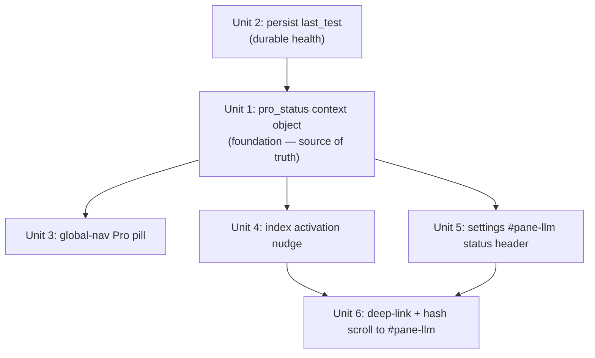

# feat: AI Content Engine (PRO Mode) — empowerment & product-wide visibility

## Overview

The "AI 内容生成引擎 (PRO Mode)" surface (`#pane-llm` in Settings) is **functionally
complete**: the config form, the Pro Mode collapse (article/image gen), the pipeline wiring
(content_source badge, cover thumbnail, per-row regenerate), and the Copilot advisory panel +
Q&A are all shipped (plans `2026-05-28-010`, `2026-05-29-007`, `2026-06-04-003`, copilot v1
U1–U7). What is missing is **empowerment and visibility**: after an operator binds an LLM key,
that capability pays off in only two places (the `/ce:generate` flow and the Copilot Q&A footer),
and the product gives no product-wide signal that "Pro is active." The `llm_configured` flag is
consumed in exactly one template line.

This plan upgrades the engine from "a tab inside Settings" to **a first-class, product-wide
capability** with three properties:

1. **Visible status everywhere** — a global-nav Pro pill reflecting real configuration + health.
2. **Guided activation** — unconfigured operators get a clear nudge from where they work into
   the binding flow; configured-but-not-enabled operators get nudged to flip on AI generation.
3. **Legible payoff** — the Settings pane and the nudges make explicit *what one binding unlocks*
   across the product (full-text generation, cover images, Copilot Q&A, anchor-text suggestions).

It is a UI/integration-layer plan only. **No new backend AI capability, no new pipeline
generation, no change to `schema.py` or the LLM provider** is in scope.

## Problem Frame

A user asked to "fully optimize this feature's WebUI experience so that binding it empowers the
user across the whole product, with deep integration." Direct code audit shows the engine's
*plumbing* is done — the gap is that configuring it is invisible and under-leveraged:

- `inject_llm_configured` (`webui_app/__init__.py:224`) computes a binary file-existence flag and
  is read **only** by `_copilot_panel.html:59` to unlock the Q&A footer.
- The global nav (`base.html:24–43`) has no Pro indicator. Nothing tells an operator on the
  发布 / 健康 / 站点 pages that AI generation is on (or off).
- The connection-test result (`routes/llm.py:227` `settings_test_llm`) is ephemeral — there is no
  durable "last test ok at HH:MM" anywhere, so health is invisible between manual test clicks.
- An unconfigured operator only ever sees one activation CTA — the "绑定金钥" link inside the
  Copilot panel footer, and only when that panel is open.

The result: binding the engine does not *feel* like it empowers the product. This plan closes
that perception/integration gap without touching generation logic.

## Requirements Trace

- R1. A single enriched `pro_status` template context object is the source of truth for all
  visibility surfaces: `{configured, endpoint_host, model, article_gen, image_gen, last_test}`.
  The legacy `llm_configured` boolean remains available (back-compat for `_copilot_panel.html`).
- R2. The connection-test outcome is persisted durably to `llm-settings.json` (`last_test:
  {ok, at, message}`) so health survives page reloads and feeds `pro_status`.
- R3. The global nav shows a Pro status pill on every base-extending page: "✦ Pro 已启用"
  (healthy), "Pro 待激活" (configured but no/failed test or article-gen off), or "启用 Pro"
  (unconfigured, links to `/settings#pane-llm`). Hidden under the LITE edition.
- R4. Unconfigured (or configured-but-article-gen-off) operators see a dismissible activation
  nudge on the 发布 (index) page that deep-links into the binding flow.
- R5. The Settings `#pane-llm` shows a status header that makes the **payoff legible** — an
  explicit checklist of what binding unlocks product-wide, reflecting live `pro_status`.
- R6. Every activation CTA deep-links to `/settings#pane-llm`, and Settings opens/scrolls to that
  pane when the hash is present — the nudge→action path is one click.

## Scope Boundaries

- **No new backend AI capability.** No new generation routes, no new provider behavior, no new
  pipeline fields. (`/ce:regen-body`, `content_source`, `cover_image_url` already shipped in
  plan `2026-06-04-003` and are consumed, not changed.)
- **No change to `schema.py`**, the LLM provider (`llm_anchor_provider.py`), or
  `_payload.py` generation forks.
- **No new model/config fields** beyond the additive `last_test` block in `llm-settings.json`.
- **No redesign of the existing config form** (`_settings_llm_integration.html` form body stays;
  only a status header is added above it).
- **Copilot v1 is not re-touched.** The panel/Q&A stay as-is; this plan only changes the *flag
  they read from* (back-compat preserved) and adds sibling visibility surfaces.
- **Standalone (non-base-extending) pages**: the nav pill ships via `base.html`. Pages that do
  not extend `base.html` already carry the Copilot FAB for Pro affordance; nav-pill parity for
  them is out of scope (noted under System-Wide Impact).

## Context & Research

### Relevant Code and Patterns

- **Context-processor pattern**: `webui_app/__init__.py` registers several
  (`inject_platforms:131`, `inject_csrf_token:193`, `inject_asset_version:211`,
  `inject_llm_configured:224`). The new `pro_status` follows the exact shape of
  `inject_llm_configured` — a small try/except that reads `llm-settings.json` via
  `helpers.contexts._llm_settings_file()` / `settings_service.load_llm_settings()`.
- **Pure-helper split**: Flask-free logic lives in `webui_app/services/settings_service.py`
  (per `helpers/contexts.py` docstring — "All Flask-free helpers are in settings_service").
  The status summary should be a pure `settings_service` function taking a dict, with the
  context processor a thin wrapper — directly testable without a Flask app.
- **`llm-settings.json` read/write**: `settings_service.llm_settings_file()` /
  `load_llm_settings()`; writes go through `safe_write.atomic_write` at `0o600` (CLAUDE.md
  known-trap: this file must stay `0o600`). `routes/llm.py:134` `settings_save_llm_config` is the
  reference for the `existing.update({...})` write pattern.
- **Test-connection route**: `routes/llm.py:227` `settings_test_llm` already returns
  `{status, message, models}` and even lists models. The result is returned to JS but never
  persisted. R2 adds a persistence side-effect here (write `last_test`), not a new route.
- **Global nav**: `base.html:24–43`, `global-nav__inner` with `global-nav__item` links and the
  `` trim block. The pill mirrors `global-nav__item` styling and obeys
  the same `lite_edition` gate.
- **Copilot panel CTA pattern**: `_copilot_panel.html:67–78` already has the
  "绑定金钥 → /settings" CTA and lock styling — the nudge (R4) and status header (R5) reuse this
  visual language for consistency.
- **`data-action` delegation**: `static/js/index.js:26–39` dispatch table; dismiss/scroll
  handlers attach via `data-action`, never inline `on*` (frontend anti-rot rule 1).
- **Asset versioning**: any new CSS/JS `url_for('static', …)` must include `v=asset_version`
  (frontend rule 6).
- **CSS tokens**: new pill/nudge styles use `var(--…)` from `static/css/tokens.css`; no local
  `:root` (frontend convention).

### Institutional Learnings

- `[[project-pro-mode-copilot-v1-status]]` — copilot v1 is fully shipped; **do not re-do it**.
  This plan deliberately does not touch the panel/Q&A behavior, only the shared flag (with
  back-compat) and adds sibling surfaces.
- `[[arch-already-modular-optimization-done]]` / `[[backlog-bottleneck-is-execution]]` — the bar
  for a "全面优化" request is to converge on concrete, ship-able, zero-blocker units rather than
  re-architect. Every unit here is additive and independently landable.
- `[[webui-frontend-is-two-stacked-plans]]` / `[[webui-lives-at-repo-root-not-src]]` — WebUI
  lives at repo root (`webui_app/`, not `src/`); no inline handlers; CSRF meta read per call.
- `[[project-thin-webui-arch-refactor]]` — routes stay thin; the `last_test` persistence side
  effect belongs in `settings_service`, called from the route.
- `[[webui-ux-overhaul-shipped-r10-residual]]` — settings.html still has hardcoded-hex inline
  styles (R10 residual); the new status header should use token-based classes, not add to the
  inline-hex debt.

### External References

- None required. This is repo-pattern-following UI integration work with multiple direct local
  examples (context processors, nav items, settings cards, data-action handlers). External
  research skipped per Phase 1.2 — local patterns are strong and the topic is not high-risk.

## Key Technical Decisions

- **One enriched `pro_status` object, legacy flag preserved** (R1): rather than scatter
  file-existence checks, a single context processor computes `pro_status` once per render. The
  existing `llm_configured` boolean is kept as a derived alias so `_copilot_panel.html` needs no
  change — avoids a breaking edit to shipped copilot code. *Rationale*: single source of truth;
  zero-risk to the shipped panel.
- **Persist `last_test` in `llm-settings.json`, not a new store** (R2): health is an attribute of
  the LLM binding; co-locating it with the binding avoids a new singleton/store and survives with
  the config. It is an additive key — the sidecar bridge and pipeline ignore unknown keys.
  *Rationale*: minimal surface, no new state lifecycle.
- **Health is "last known," explicitly not a live probe** (R2/R3): the nav pill reflects the
  persisted `last_test` plus the binary configured flag — it does **not** fire a network call on
  every page load (that would add latency + SSRF surface to every render). The pill's "healthy"
  state means "configured AND last manual test passed." *Rationale*: page loads stay fast and
  side-effect-free; mirrors the existing cheap-check philosophy of `inject_llm_configured`.
- **Pill ships in `base.html`; standalone pages rely on the Copilot FAB** (R3 + scope): adding
  the pill to `base.html` covers all extending pages with one edit. Standalone pages already have
  the FAB. *Rationale*: 80/20 — one edit covers the primary surfaces without auditing every
  standalone template.
- **Activation nudge is client-dismissible (localStorage), not server state** (R4): dismissal is
  a per-browser preference, not operator config. Avoids a server write on a cosmetic action.
  *Rationale*: no new endpoint, no CSRF surface, no store mutation.
- **Three-state pill, not binary** (R3): "启用 Pro" (unconfigured) / "Pro 待激活" (configured but
  unhealthy or article-gen off) / "✦ Pro 已启用" (healthy + generating). The middle state is what
  makes the feature feel *honest* — it distinguishes "key saved" from "actually working."

## Open Questions

### Resolved During Planning

- *Re-do copilot or config form?* → No. Audit confirms both shipped. This plan is additive
  visibility/integration only (see Scope Boundaries).
- *Add a live health probe for the nav pill?* → No. Resolved to "last known" status from
  persisted `last_test` to keep every page load fast and side-effect-free.
- *New backend AI features?* → Out of scope by explicit decision (user chose
  "integrate & surface existing engine only").
- *Where does the status summary logic live?* → `settings_service.py` as a pure function; the
  context processor is a thin wrapper (matches the established Flask-free-helper split).

### Deferred to Implementation

- Exact pill copy/iconography and whether "Pro 待激活" splits into two sub-states
  (unhealthy-test vs article-gen-off) — implementer judgment, can collapse if it clutters.
- Whether the index nudge is its own partial (`_pro_activation_nudge.html`) or inline in
  `index.html` — extract to a partial only if it exceeds ~15 lines.
- Whether `settings.js` hash-scroll (R6) needs smooth-scroll or just `scrollIntoView()` — pick the
  simplest that lands on `#pane-llm`.
- Exact `last_test.at` format surfaced in the tooltip (relative "3 分钟前" vs absolute) — default
  to absolute ISO-ish local time unless it reads poorly.

## High-Level Technical Design

> *This illustrates the intended approach and is directional guidance for review, not
> implementation specification. The implementing agent should treat it as context, not code to
> reproduce.*

Single source of truth fanning out to four read-only visibility surfaces:

```
                 llm-settings.json
                 (+ additive last_test block, written by R2)
                          │
                          ▼
        settings_service.pro_status_summary(settings) -> dict   ◀── pure, unit-testable
                          │
              inject_pro_status (context processor)              ◀── thin Flask wrapper
                          │   exposes: pro_status, llm_configured(alias)
        ┌─────────────────┼──────────────────┬───────────────────┐
        ▼                 ▼                  ▼                   ▼
  nav Pro pill      index activation    settings #pane-llm    copilot panel
  (base.html)        nudge (R4)         status header (R5)    (UNCHANGED — reads
   3-state           dismissible        "what's unlocked"      llm_configured alias)
   (R3)              deep-link (R4/R6)   checklist (R5)
```

`pro_status` shape (directional):

```
pro_status = {
  configured:    bool,            # endpoint AND api_key present
  endpoint_host: str | "",        # host only, never the key
  model:         str | "",
  article_gen:   bool,            # use_article_gen
  image_gen:     bool,            # use_image_gen
  last_test:     { ok: bool, at: str, message: str } | None,
}
# healthy  := configured and article_gen and (last_test.ok is True)
# pending  := configured and not healthy
# inactive := not configured
```

## Implementation Units



Unit 1 is the foundation every surface reads from. Unit 2 fills `pro_status.last_test` (Unit 1
ships with `last_test=None` if landed first; Unit 2 makes health real). Units 3–5 are independent
consumers. Unit 6 is the connective tissue that makes the CTAs land.

---

- [ ] **Unit 1: `pro_status` context object — single source of truth**

**Goal:** Replace the lone `llm_configured` flag with an enriched, render-once `pro_status`
object available to every template, while preserving `llm_configured` as a back-compat alias.

**Requirements:** R1

**Dependencies:** None (Unit 2 enriches its `last_test` field later)

**Files:**
- Create: `webui_app/services/` pure helper `pro_status_summary(settings: dict) -> dict` (add to
  existing `settings_service.py`)
- Modify: `webui_app/__init__.py` (replace/extend `inject_llm_configured` with `inject_pro_status`
  exposing both `pro_status` and the `llm_configured` alias)
- Test: `tests/test_webui_pro_status_context.py` (new) + extend any test asserting
  `llm_configured` still resolves

**Approach:**
- Add `pro_status_summary(settings)` to `settings_service.py`: pure dict→dict, no Flask, no file
  IO. Derives `configured`, `endpoint_host` (parse host from endpoint URL — never include the
  key), `model`, `article_gen`, `image_gen`, and passes through `last_test` if present.
- In `__init__.py`, the context processor loads settings via the existing cheap-read path
  (mirroring `inject_llm_configured`'s try/except), calls `pro_status_summary`, and returns
  `{"pro_status": summary, "llm_configured": summary["configured"]}`.
- Keep the try/except fail-safe: on any error return `pro_status` with `configured=False` and
  `llm_configured=False` (never raise into template render).
- Do not log or template the api_key anywhere in the summary.

**Patterns to follow:**
- `webui_app/__init__.py:224` `inject_llm_configured` (structure, fail-safe).
- `webui_app/services/settings_service.py` Flask-free helper convention.

**Test scenarios:**
- Happy path — endpoint+key present, article_gen on: `configured=True`, `article_gen=True`,
  `endpoint_host` equals the URL host, `model` passed through.
- Happy path — back-compat: context processor still exposes `llm_configured=True` when configured.
- Edge case — only endpoint, no key: `configured=False`; `llm_configured=False`.
- Edge case — settings file missing / unreadable: summary is the safe default, no exception.
- Security — api_key is never present in the returned `pro_status` dict (assert key/value absent).
- Edge case — `last_test` absent in settings: `pro_status.last_test is None` (no crash).

**Verification:**
- Templates can read `pro_status.*`; `_copilot_panel.html` still unlocks via `llm_configured`.
- `pytest tests/test_webui_pro_status_context.py` green.

---

- [ ] **Unit 2: persist `last_test` to `llm-settings.json`**

**Goal:** Make connection health durable so the nav pill and status header reflect "last known"
state instead of an ephemeral toast.

**Requirements:** R2

**Dependencies:** Unit 1 (defines the `last_test` shape consumed by `pro_status`)

**Files:**
- Modify: `webui_app/routes/llm.py` (`settings_test_llm` at :227 — add persistence side-effect)
- Modify: `webui_app/services/settings_service.py` (a `record_llm_test_result(ok, message)`
  helper that does the atomic `0o600` write)
- Test: `tests/test_webui_llm_test_persist.py` (new) — or extend an existing test-connection test

**Approach:**
- After `settings_test_llm` determines the outcome (ok / failed / error), call
  `settings_service.record_llm_test_result(ok=bool, message=str)` which merges
  `last_test = {ok, at, message}` into `llm-settings.json` via `safe_write.atomic_write`,
  preserving `0o600` (CLAUDE.md trap) and all other keys (read-modify-write).
- `at` is a server-side timestamp (`datetime.now().isoformat(timespec="seconds")`).
- Do NOT persist endpoint/api_key from the request here — only the test outcome. Credentials are
  written exclusively by `settings_save_llm_config`.
- `message` stored must be the same redaction-safe message already returned to the client (it
  never contains the key — confirm `settings_test_llm` messages are key-free; they are
  HTTP-status / generic strings).
- Optional: `settings_save_llm_config` may clear stale `last_test` when endpoint/key change so a
  changed binding does not show a green pill from the old endpoint — implementer judgment;
  acceptable to leave `last_test` until the next manual test.

**Execution note:** Add the persistence test first (test connection → assert `last_test` block
written with correct `ok` and a parseable `at`), then wire the side-effect.

**Patterns to follow:**
- `routes/llm.py:134` `settings_save_llm_config` `existing.update({...})` + atomic write.
- `safe_write.atomic_write` usage elsewhere in `settings_service` (the `0o600` path).

**Test scenarios:**
- Happy path — successful test: `last_test.ok is True`, `message` set, `at` parseable ISO.
- Error path — failed test (HTTP non-200): `last_test.ok is False`, message recorded.
- Integration — read-modify-write: existing keys (`endpoint`, `model`, `api_key`,
  `use_article_gen`) are preserved unchanged after `record_llm_test_result`.
- Security — file mode remains `0o600` after the write.
- Security — persisted `message` never contains the api_key (assert test secret absent).
- Edge case — `llm-settings.json` absent when a test runs (endpoint+key typed inline): writing
  `last_test` creates a valid file at `0o600` without dropping the typed values, OR the helper
  no-ops gracefully — define and test whichever the implementation chooses.

**Verification:**
- After a test-connection click, `pro_status.last_test` is populated on the next page render.
- `cat ~/.config/backlink-publisher/llm-settings.json` shows the `last_test` block; mode `600`.

---

- [ ] **Unit 3: global-nav Pro status pill**

**Goal:** Show a three-state Pro indicator in the global nav on every base-extending page so the
operator always sees whether AI generation is active and healthy.

**Requirements:** R3

**Dependencies:** Unit 1 (`pro_status`)

**Files:**
- Modify: `webui_app/templates/base.html` (add pill inside `global-nav__inner`)
- Modify: `webui_app/static/css/tokens.css` or a small nav-scoped CSS using tokens (pill states)
- Test: `tests/test_webui_nav_pro_pill.py` (new) — render assertions for each state + LITE gate

**Approach:**
- In `base.html`, inside `global-nav__inner` (after the settings link or right-aligned), add a
  pill that branches on `pro_status`:
  - inactive (`not pro_status.configured`): label "启用 Pro", muted style, `href="/settings#pane-llm"`.
  - pending (configured but not healthy): label "Pro 待激活", amber style, `href="/settings#pane-llm"`,
    `title` showing model + reason (no test yet / last test failed / 全文生成未开).
  - healthy (`configured and article_gen and last_test.ok`): label "✦ Pro 已启用", green style,
    `title` showing model + `last_test.at`.
- Wrap the whole pill in `` so it stays hidden in the LITE edition (nav
  trim consistency).
- Pure CSS state classes driven by token vars; no inline hex (avoid R10 debt). No JS needed —
  it's a server-rendered link.

**Patterns to follow:**
- `base.html:26–42` `global-nav__item` markup + `` gate.
- `_copilot_panel.html` CTA "绑定金钥" color language for the inactive/pending styling.

**Test scenarios:**
- Happy path — healthy `pro_status`: nav renders "✦ Pro 已启用" with the green state class.
- Edge case — configured but `last_test` None or `article_gen` False: renders "Pro 待激活".
- Edge case — unconfigured: renders "启用 Pro" linking to `/settings#pane-llm`.
- Integration — LITE edition (`BACKLINK_PUBLISHER_LITE=1`): pill is absent from the nav.
- Security — rendered nav HTML never contains the api_key (only host/model/label).

**Verification:**
- Loading 发布/健康/站点 (base-extending) shows the correct pill state.
- Toggling article-gen or running a failed test flips healthy→pending on next render.

---

- [ ] **Unit 4: index activation nudge for unconfigured / not-generating operators**

**Goal:** From the page where operators actually work (发布/index), give a dismissible, one-click
path into the binding flow when AI generation isn't active yet.

**Requirements:** R4

**Dependencies:** Unit 1 (`pro_status`)

**Files:**
- Modify: `webui_app/templates/index.html` (insert nudge, or `` a new partial)
- Create (optional): `webui_app/templates/_pro_activation_nudge.html` (only if inline > ~15 lines)
- Modify: `webui_app/static/js/index.js` (add `pro-nudge-dismiss` to the data-action dispatch)
- Test: `tests/test_webui_pro_nudge.py` (new) — render branches + dismiss handler presence

**Approach:**
- Render the nudge near the top of the 发布 page content when
  `not pro_status.configured` OR (`pro_status.configured and not pro_status.article_gen`):
  - unconfigured copy: "解锁 AI 全文生成 — 绑定金钥即可让发布内容由 AI 撰写" → button
    "去绑定" → `/settings#pane-llm`.
  - configured-but-off copy: "已绑定 AI 引擎，但全文生成未开启" → button "开启全文生成"
    → `/settings#pane-llm`.
- Dismiss is a `data-action="pro-nudge-dismiss"` button that hides the banner and writes a
  `localStorage` flag; on load, `index.js` checks the flag and the configured-state so it does not
  reappear after dismissal (but DOES reappear if state regresses — implementer judgment on key).
- No inline `on*`; dismiss wired via the existing `index.js` dispatch table; CSRF not involved
  (no server write).
- Use token-based banner classes consistent with the Copilot panel CTA styling.

**Patterns to follow:**
- `static/js/index.js:26–39` data-action dispatch (add one entry).
- `_copilot_panel.html:67–78` lock/CTA visual language.
- frontend anti-rot rules: no inline handlers, deep-link via plain `<a href>`.

**Test scenarios:**
- Happy path — unconfigured: nudge renders the "绑定" variant with `/settings#pane-llm` link.
- Happy path — configured but `article_gen` off: nudge renders the "开启全文生成" variant.
- Edge case — healthy `pro_status` (configured + article_gen on): nudge is NOT rendered.
- Integration — dismiss action: `index.js` exposes a `pro-nudge-dismiss` handler that hides the
  banner and sets the localStorage flag (assert handler registered + no inline `on*` in markup).
- Edge case — no untrusted interpolation into innerHTML (banner copy is static template text).

**Verification:**
- An operator with no key sees the nudge on 发布; clicking lands on Settings at the Pro pane.
- After binding + enabling, the nudge disappears on next load.

---

- [ ] **Unit 5: Settings `#pane-llm` status header — make the payoff legible**

**Goal:** At the top of the AI 内容生成引擎 pane, show live status plus an explicit checklist of
what binding unlocks across the product, so the operator understands one binding empowers multiple
surfaces.

**Requirements:** R5

**Dependencies:** Unit 1 (`pro_status`)

**Files:**
- Modify: `webui_app/templates/settings.html` (insert header above the LLM integration include at
  :326), or
- Create: `webui_app/templates/_settings_llm_status.html` and `` it
- Test: `tests/test_webui_settings_llm_status.py` (new) — render branches

**Approach:**
- A status card rendered just under the "AI 内容生成引擎 (PRO Mode)" heading (`settings.html:325`),
  before `_settings_llm_integration.html`:
  - State line driven by `pro_status` (inactive / pending / healthy), echoing the nav pill wording
    + `last_test.at` when present.
  - "解锁清单" — a checklist showing what the current binding enables, each with a ✓ (active) or
    ○ (inactive) derived from `pro_status`:
    - ✓/○ AI 全文生成 (`article_gen`)
    - ✓/○ AI 封面图 (`image_gen`)
    - ✓/○ Copilot 智能问答 (`configured`)
    - ✓/○ 锚文本智能建议 (`configured` — `llm_anchor_provider` path)
  - When pending due to a failed/absent test, surface a short "点击下方『测试连接』验证金钥" hint.
- Token-based classes only — do not add to settings.html's inline-hex debt (R10 residual).
- Read-only; no new form, no JS.

**Patterns to follow:**
- Existing `settings.html` `.card` blocks (e.g. config-path card at :330) for layout.
- `pro_status` field names from Unit 1.

**Test scenarios:**
- Happy path — healthy: header shows "已启用" state and ✓ on article-gen + Copilot rows.
- Edge case — configured, image_gen off: 封面图 row shows ○ while AI 全文生成 shows ✓.
- Edge case — unconfigured: all rows ○ and the state line shows the inactive copy + a bind hint.
- Edge case — pending (configured, last_test failed): state line shows the "验证金钥" hint.
- Security — header never renders the api_key (only host/model/labels).

**Verification:**
- `/settings` Pro pane shows the status header reflecting current `pro_status`.
- Flipping toggles + saving updates the checklist on reload.

---

- [ ] **Unit 6: deep-link + hash scroll to `#pane-llm`**

**Goal:** Make every "启用 Pro / 去绑定 / 开启全文生成" CTA land the operator directly on the Pro
pane — the nudge→action loop closes in one click.

**Requirements:** R6

**Dependencies:** Units 4 and 5 (the CTAs that link with the `#pane-llm` hash)

**Files:**
- Modify: `webui_app/static/js/settings.js` (open/scroll to the Pro pane when
  `location.hash === '#pane-llm'`)
- Test: extend `tests/` settings JS-adjacent coverage if a render/route test exists; otherwise a
  template/route smoke assertion that `#pane-llm` is a valid anchor target

**Approach:**
- `#pane-llm` already exists as the section id (`settings.html:324`). The settings page uses tab
  panes (`settings-pane`); confirm whether a pane is shown by default and whether a hash should
  activate the LLM tab. In `settings.js`, on load, if `location.hash === '#pane-llm'`, activate
  that pane (mirror whatever tab-activation the page already uses) and `scrollIntoView()`.
- Keep it minimal: no smooth-scroll library, no new dependency. If the settings panes are already
  all-visible (not tabbed), a plain `scrollIntoView()` on the hash target suffices and the JS may
  be a no-op — verify against the actual `settings.js` pane logic during implementation.

**Patterns to follow:**
- Existing pane/tab switching in `settings.js` (the page already manages `settings-pane`
  visibility — reuse its activation function rather than re-implementing).

**Test scenarios:**
- Happy path — navigating to `/settings#pane-llm` activates/scrolls to the Pro pane.
- Edge case — `/settings` with no hash: default pane behavior unchanged (regression guard).
- Edge case — unknown hash: no error, default behavior.

**Test expectation:** behavioral (hash → pane activation); if the panes are non-tabbed and the
unit reduces to a verified no-op, downgrade to a template smoke assertion that `id="pane-llm"`
exists and the CTAs point at it.

**Verification:**
- Clicking the nav pill / index nudge / Copilot "绑定金钥" lands on the Pro pane, scrolled into
  view, ready to configure.

## System-Wide Impact

- **Interaction graph:** All units are read-only consumers of one new context processor, except
  Unit 2 which adds a write side-effect to an existing route. No new singletons, no new stores, no
  background jobs. The context processor runs once per render (cheap file read, same as the
  existing `inject_llm_configured`).
- **Error propagation:** `pro_status` computation is wrapped in try/except and degrades to
  `configured=False` — a malformed `llm-settings.json` shows "启用 Pro" rather than 500-ing any
  page. Unit 2's write failure must not break the test-connection response (persist is
  best-effort; the JSON result to the client is unchanged).
- **State lifecycle risks:** Unit 2 is a read-modify-write on `llm-settings.json`. It must
  preserve all existing keys and the `0o600` mode (CLAUDE.md trap). It is not concurrent with
  other writers in normal single-operator use, but should still merge rather than overwrite.
- **API surface parity:** The nav pill ships only on base-extending pages. Standalone pages
  (those carrying their own `<head>` — e.g. some Copilot-FAB pages) do not get the pill; they
  retain the FAB as the Pro affordance. Documented, not closed, by this plan.
- **Integration coverage:** The cross-layer behavior worth asserting is "test connection →
  persisted `last_test` → `pro_status.last_test` → nav pill/state header reflect it." Unit 2 and
  Unit 3 tests together cover this; a single integration test (test route then render nav) is the
  highest-value cross-layer check.
- **Unchanged invariants:** `_copilot_panel.html`, the Copilot routes/Q&A, `/ce:generate`,
  `/ce:regen-body`, `_payload.py`, `schema.py`, and the LLM provider are **not changed**. The only
  shared-surface edit is replacing `inject_llm_configured` with `inject_pro_status`, which keeps
  the `llm_configured` key live (back-compat asserted by Unit 1 tests).

## Risks & Dependencies

| Risk | Mitigation |
|------|------------|
| Replacing `inject_llm_configured` breaks the shipped Copilot panel's Q&A unlock | Keep `llm_configured` as a derived alias from the same processor; Unit 1 test asserts the alias resolves identically. |
| Unit 2 read-modify-write drops keys or weakens file mode (`0o600` trap) | Merge into existing dict via `atomic_write`; explicit test asserts other keys preserved + mode stays `600`. |
| api_key leaks into a template (pill tooltip / status header / persisted message) | `pro_status` carries host+model only (no key); Unit 1/2/3/5 each have a "key absent" assertion. |
| Nav pill adds latency by probing the LLM on every page load | Decision: status is "last known" from persisted `last_test`; no network call on render. |
| Activation nudge becomes nagware after the operator dismisses it | Dismissal persists in localStorage; nudge only re-appears if `pro_status` regresses (state-keyed flag). |
| Standalone pages silently lack the pill, looking inconsistent | Explicitly scoped out; FAB covers those surfaces; noted in System-Wide Impact + Docs. |
| settings.html inline-hex R10 debt grows | New status header + pill use token classes only; no new inline hex (`[[webui-ux-overhaul-shipped-r10-residual]]`). |

## Documentation / Operational Notes

- After landing: the global nav shows a Pro pill on 保活/发布/指挥/健康/批量/排程/权益/站点/设置
  (base-extending pages). LITE edition hides it. Standalone pages keep the Copilot FAB.
- "✦ Pro 已启用" means **configured AND last manual test passed AND 全文生成开启**. "Pro 待激活"
  means the key is saved but either untested/failed or article-gen is off — operators should click
  「测试连接」in Settings to turn the pill green.
- Health is "last known," not live — if an endpoint goes down after a passing test, the pill stays
  green until the next manual test. This is intentional (no per-page-load probing).
- No new env vars, no migration. `last_test` is an additive key in `llm-settings.json`; older
  files without it render as "待激活" until the first test.

## Sources & References

- Current Pro pane: `webui_app/templates/settings.html:324–342`,
  `webui_app/templates/_settings_llm_integration.html`
- Lone flag today: `webui_app/__init__.py:224` `inject_llm_configured`; consumer
  `webui_app/templates/_copilot_panel.html:59`
- Test-connection route (R2 hook): `webui_app/routes/llm.py:227` `settings_test_llm`
- Save route pattern: `webui_app/routes/llm.py:134` `settings_save_llm_config`
- Flask-free helper split: `webui_app/helpers/contexts.py`, `webui_app/services/settings_service.py`
- Global nav: `webui_app/templates/base.html:24–43`
- Prior shipped plans (do not redo): `docs/_archive/plans/2026-06-04-003-feat-ai-content-engine-pro-mode-wiring-plan.md`,
  `docs/_archive/plans/2026-05-29-007-feat-llm-settings-pipeline-bridge-plan.md`,
  `docs/_archive/plans/2026-05-28-010-feat-llm-pro-mode-collapse-plan.md`
- Memory: `[[project-pro-mode-copilot-v1-status]]`, `[[arch-already-modular-optimization-done]]`,
  `[[webui-ux-overhaul-shipped-r10-residual]]`, `[[project-thin-webui-arch-refactor]]`
