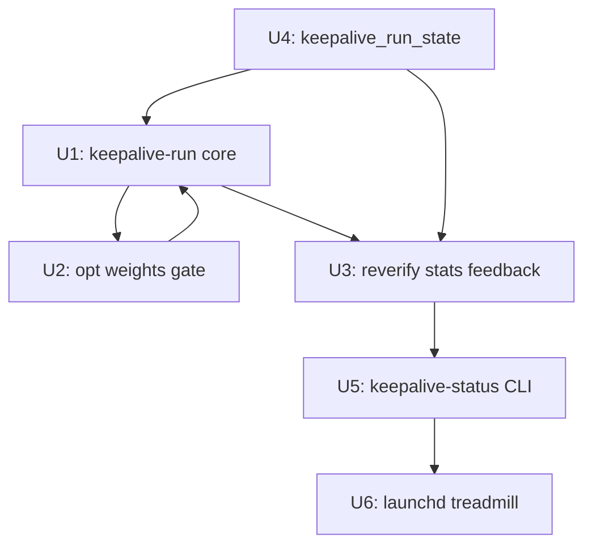

# feat: Keep-alive Recovery Loop — Closed-Loop CLI Chain

## Overview

Build a `keepalive-run` CLI command that chains the full recovery loop — recheck → keepalive-gap detection → republish → reverify — as a single Python invocation safe for unattended launchd scheduling. Integrate with `optimization_state.json` so circuit-broken platforms are skipped during gap-fill and reverify results feed survival stats back to the optimizer. The treadmill exits its terminal-state design: instead of one-shot WebUI jobs, daily launchd scheduling repeats the cycle automatically.

## Problem Frame

The existing infrastructure is feature-complete but **chain-incomplete** for unattended operation:

| Stage | Exists? | Gap |
|---|---|---|
| `recheck-backlinks --probe` | ✅ CLI | Not called as part of an automated recovery flow |
| `plan_keepalive_gap()` | ✅ Python API | Not exposed as a CLI command; only via WebUI job |
| `publish-backlinks` | ✅ CLI | Called by `run-full-pipeline.sh gap` but uses `plan-gap`, not `plan_keepalive_gap` |
| reverify after republish | ✅ `_default_reverify()` in `keepalive_job.py` | **WebUI-only** — CLI chain has no reverify step |
| Optimization weights gate | ✅ `optimization_state.json` (plan 001) | Not read by gap planner — circuit-broken platforms still selected |
| Post-reverify stat feedback | ❌ | Reverify results never update `optimization_state.json` |
| Retry limits per target | ❌ | Nothing prevents indefinite republish attempts to failing platforms |
| Automated scheduling | ✅ launchd plist for weekly recheck | No plist for the full recovery cycle |
| Treadmill (S7) | ✅ terminal state | No auto-repeat — operator must manually restart via WebUI |

**Root cause of treadmill staying terminal**: the full chain is split across a shell script (`run-full-pipeline.sh`) that does not include reverify, a WebUI job system that does include reverify but requires operator interaction, and a launchd plist that only runs recheck. No single automated path does `recheck → keepalive-gap → publish → reverify → update-stats`.

## Scope Boundaries

**In scope:**
- `keepalive-run` CLI: single command for the full recovery cycle
- Optimization weights gate in `plan_keepalive_gap()`: skip platforms with weight=0
- Post-reverify stat feedback to `optimization_state.json`
- `keepalive_run_state.json`: cycle state and per-target retry limit tracking
- `keepalive-status` CLI: human-readable loop health summary
- launchd plist for daily unattended scheduling
- WebUI `/ce:keep-alive` extension: cycle metrics panel alongside existing S1→S7 job UI

**Explicitly not in scope:**
- Replacing or modifying the WebUI S1→S7 job flow — it stays for operator-triggered runs
- Modifying `recheck-backlinks`, `plan-backlinks`, `validate-backlinks`, `publish-backlinks` internals
- In-process loop mode (one invocation loops forever as daemon) — stays CLI-triggered
- Non-sticky platform gap filling (blogger-only sticky at runtime — ghpages excluded due to GitHub account suspension; engine constant `KEEPALIVE_STICKY_PLATFORMS` still lists both, but `RUNTIME_STICKY_PLATFORMS` in chain.py uses blogger-only)
- Indexability/GSC measurement (deferred Phase 2)
- Rule 3 (aggregated statistical thresholds) from plan 001 — that plan already deferred it

**Pre-existing resolved:**
- Three-gap `live_dofollow` under-counting: the underlying fix functions (`write_verified_at()`, `select_unverified_candidates()`, improved probe logic) are in `recheck/events_io.py`, `recheck/selection.py`, `recheck/probe.py`. **However**, the existing `cli/recheck_backlinks.py` does NOT call `write_verified_at()` — only the WebUI path does. Chain.py step 1 must explicitly call `write_verified_at()` after every ALIVE probe result. This is new CLI-path work, not an existing fix to inherit.
- Recheck timeout (`_PER_TARGET_TIMEOUT=10s`, `_BATCH_BUDGET_S=600s`) is **already enforced** in `cli/recheck_backlinks.py:218` — no new timeout work needed.

## Requirements Trace

- R1: `keepalive-run` chains recheck → keepalive-gap → publish → reverify with a single CLI invocation
- R2: Gap planner skips platforms where `optimization_state.json` weight = 0 (circuit-broken)
- R3: Reverify results update `optimization_state.json` per-platform stats (alive, dofollow, republish outcomes)
- R4: Per-target retry limits in `keepalive_run_state.json` prevent infinite republishing to failing platforms
- R5: All stages emit RECON-level summaries for cron log visibility
- R6: launchd daily plist for fully unattended execution with health check
- R7: `keepalive-status` CLI shows loop health: last cycle timestamp, gaps found/filled, platforms at risk
- R8: WebUI `/ce:keep-alive` shows cycle history panel alongside existing operator-triggered job flow

## Context & Research

### Relevant Code and Patterns

**Core gap engine:**
- `src/backlink_publisher/gap/engine.py::plan_keepalive_gap(rows, per_target_status, opts)` — keepalive-specific gap planning (only `link_stripped` / `host_gone` trigger gaps; `probe_error` and `dofollow_lost` do not)
- `src/backlink_publisher/recheck/events_io.py::derive_per_target_status(store)` — builds per-target status dict from events.db; input to `plan_keepalive_gap`
- `src/backlink_publisher/gap/engine.py::KeepaliveGap` dataclass — `{target_url, stripped, emitted_platforms, channel_exhausted}`

**Recheck pipeline:**
- `src/backlink_publisher/cli/recheck_backlinks.py` — CLI entry; `_PER_TARGET_TIMEOUT=10s`, `_BATCH_BUDGET_S=600s` already enforced; stdin mode (R11) accepts JSONL candidates
- `src/backlink_publisher/recheck/selection.py::select_candidates()` + `select_unverified_candidates()` — both must be used to build the probe pool (three-gap fix already in code)
- `src/backlink_publisher/recheck/events_io.py::write_verified_at()` — writes probe-alive results back to DB (three-gap fix already in code)

**Optimization state (plan 001 — already shipped):**
- `src/backlink_publisher/optimization/state.py::OptimizationState` — `get_weight(adapter_name, default)`, `update_stats(platform, stats_update)`
- `src/backlink_publisher/optimization/` — `collector.py`, `rules.py`, `models.py`

**WebUI reverify reference implementation:**
- `webui_app/services/keepalive_job.py::_default_reverify(result, store)` — targeted recheck after republish; reads `published_url` from result dict, emits probe result; returns `verdict` dict with `alive`, `dofollow`, `restripped`
- `webui_app/services/keepalive_job.py::_RUNTIME_STICKY = ("blogger",)` — runtime narrow vs engine's `("blogger", "ghpages")`

**Existing shell pipe (reference, not to be modified):**
```bash
# run-full-pipeline.sh gap — existing, uses plan-gap NOT plan_keepalive_gap, NO reverify
equity-ledger | recheck-overlay | plan-gap --emit-stale | plan-backlinks | validate-backlinks | publish-backlinks
```

**Store patterns for keepalive_run_state.json:**
- `webui_store/drafts.py` — JSON persistence + atomic write pattern (tempfile + rename)
- `src/backlink_publisher/optimization/state.py` — same pattern, threading.Lock

**RECON pattern:**
- `src/backlink_publisher/cli/plan_backlinks/recon.py` — RECON log level, `plan_logger.recon()` with `input_rows`, `output_rows`, `delta`, `dropped` fields

### Institutional Learnings

- **Write-back断路**: `write_verified_at()` must be called for every ALIVE probe result. **The existing `cli/recheck_backlinks.py` does NOT call this function** — only the WebUI path does. Chain.py step 1 must explicitly call `write_verified_at()` after each ALIVE probe result. This is a new requirement for the CLI path, not an inherited fix.
- **Dispatch path duplication bug class**: fresh-publish and resume/retry paths must share a single carry helper — never two copy-paste emitters. Apply to `keepalive-run`'s fresh vs. retry republish paths.
- **Publish-history helper invariant**: `_push_history_per_row` is the only legal write point; republish per-row; failure path also goes through helper (status="failed", url=None).
- **Always-on probe anti-pattern**: Cloudflare-fronted platforms (Medium, Velog) must not be probed headlessly in scheduled loops — use one-shot probes only. Reverify step: probe count per run limited to newly-published URLs only.
- **RECON grep trap**: before adding new RECON calls, grep `assert.*stderr.*==""` and flip matching tests in the same commit.
- **Cross-process RMW on webui_store**: if `keepalive-run` runs as a separate process while WebUI is up, any RMW on shared JSON stores needs `fcntl.flock` (see `circuit.py` pattern).
- **Projector silent drop**: any new event kind emitted by `keepalive-run` must be registered in `events/kinds.py` and explicitly handled in `projector.classify()`.
- **Floating-point tie-break in deficit sorters**: deficit comparisons must use `round(x, 6)` before `sorted()` / `max()`.

### External References

None needed — all patterns are established in the codebase.

## Key Technical Decisions

### Decision 1: `keepalive-run` as a pure CLI command, not a new WebUI job

**Context**: Could extend `keepalive_job.py::start_republish()` to be CLI-callable, or build a separate CLI.

**Choice**: New `src/backlink_publisher/cli/keepalive_run.py` that calls existing Python APIs in-process (not subprocess). WebUI `keepalive_job.py` stays untouched.

**Rationale**: The WebUI job uses threads and polling callbacks designed for HTTP responses; a CLI needs synchronous execution with RECON logging. Sharing the same code path would require either awkward synchronous wrappers on async jobs or exposing CLI concerns into the WebUI service. Separation is cleaner — both paths call the same underlying `plan_keepalive_gap()`, `derive_per_target_status()`, and reverify logic.

### Decision 2: Optimization weights gate as a filter, not a sort

**Context**: `plan_keepalive_gap()` currently uses `KEEPALIVE_STICKY_PLATFORMS = ("blogger", "ghpages")` as a hardcoded whitelist. Could filter by weight or sort by weight.

**Choice**: Pre-filter: before calling `plan_keepalive_gap()`, resolve the effective sticky platform list by removing platforms where `OptimizationState().get_weight(platform, default=1.0) == 0.0`. Pass the filtered list as `sticky_platforms` to `plan_keepalive_gap()`. Do not change the internal gap-planning logic.

**Rationale**: `plan_keepalive_gap()` is designed around a whitelist model; injecting weight-based sorting would complicate its logic. A pre-filter at the call site is simpler, testable in isolation, and more conservative (weight=0 means circuit-broken, definitively skip). Sorting by weight is a Phase 2 optimization.

### Decision 3: `keepalive_run_state.json` is separate from `optimization_state.json`

**Context**: Could store retry counts and last-run timestamps in `optimization_state.json`.

**Choice**: Separate `~/.backlink-publisher/keepalive_run_state.json`. Structure:
```json
{
  "version": 1,
  "last_run_at": "2026-06-05T05:00:00Z",
  "last_cycle_summary": {
    "gaps_found": 3, "published": 2, "reverified_alive": 1, "reverified_dead": 1
  },
  "retry_counts": {
    "https://example.com/page": {"attempts": 2, "last_attempt": "...", "platforms_tried": ["blogger"]}
  }
}
```

**Rationale**: `optimization_state.json` tracks platform-level weight optimization; `keepalive_run_state.json` tracks target-level recovery attempts. Different aggregation units, different retention policies (optimization state persists; run state rolls over at target recovery).

### Decision 4: Retry limit of 3, then mark as `exhausted` (not infinite skip)

**Context**: A target URL could be permanently unreachable (domain expired, etc.) and we'd waste recovery attempts forever. But we also don't want to permanently suppress a valid target.

**Choice**: After 3 failed republish+reverify cycles for the same `target_url`, mark it `exhausted: true` in `keepalive_run_state.json`. `keepalive-run` skips exhausted targets. `keepalive-status --reset-exhausted <url>` or manually editing the state file can reopen. No automatic re-opening.

**Rationale**: 3 attempts covers transient platform issues. Permanent skip only if operator explicitly resets — avoids silent data loss without infinite spinning.

### Decision 5: Post-reverify stats use manual RMW increment, not `OptimizationState.update_stats()`

**Context**: After reverify, we know whether the new link is alive/dofollow. Should we immediately adjust weights, or just update stats? And how?

**Choice**: Do **not** call `update_stats()` for numeric increments — that method uses `dict.update()` (key overwrite), which would reset a platform with 20 confirmed links to count=1. Also do **not** call `set_weight()`. Instead, `keepalive-run` adds an `increment_stats(platform, field, delta=1)` helper method to `OptimizationState` that does load-modify-save under `self._lock` internally. The rules engine in plan 001 (`optimize-weights` CLI) reads stats and decides weights separately. `keepalive-run` is a data producer only.

**Rationale**: `update_stats()` is a dict-merge (overwrite), not a numeric accumulator. Direct load-modify-save by the caller would require holding `state._lock` externally and then calling `state.save()`, which deadlocks (non-reentrant threading.Lock). The correct solution is a purpose-built `increment_stats()` method that encapsulates the atomic read-increment-save pattern. Adding this method to `OptimizationState` is a 5-line, backward-compatible addition.

## Open Questions

### Resolved During Planning

- **Does reverify need to wait?** No — probe immediately after publish. Blogger/static pages are available within seconds. If the link is alive right after publish, it's a good signal; if dead, mark as failed and let the next cycle handle it. Long waits (hours) belong in the launchd schedule gap, not in-process waiting.
- **Which platforms are sticky?** Use `RUNTIME_STICKY_PLATFORMS = ("blogger",)` from `keepalive_job.py` — not the engine constant `("blogger", "ghpages")` — since GitHub account is suspended.
- **Is R10 (recheck timeout) needed?** Already implemented: `_PER_TARGET_TIMEOUT=10s` per probe, `_BATCH_BUDGET_S=600s` total. Verify the batch budget enforces wall-clock exit (it does at `cli/recheck_backlinks.py:206`). No new timeout work needed.

### Deferred to Implementation

- Exact method signature for `plan_keepalive_gap()` call site changes (platform filter parameter name) — look at current signature at implementation time.
- `fcntl.flock` is **required** for `keepalive_run_state.json` writes: when WebUI is running concurrently with launchd keepalive-run, both processes can RMW the state file. The cycle-level lock only prevents overlapping keepalive-run invocations — it does not protect against WebUI concurrent access. `KeepaliveRunState.save()` must use the same `LOCK_EX` pattern as `circuit.py`.
- Exact RECON event fields — derive from other `plan_logger.recon()` call sites.
- Whether the existing three-gap fixes pass end-to-end in a real integration test — verify first in U1 before assuming they work.

## High-Level Technical Design

> *This illustrates the intended approach and is directional guidance for review, not implementation specification. The implementing agent should treat it as context, not code to reproduce.*

```
[launchd plist, daily 05:00]
         │
         ▼
  keepalive-run CLI
         │
    ┌────┴────────────────────────────────────────────────┐
    │                    STEP 1: RECHECK                   │
    │  recheck-backlinks --probe (timeout already enforced) │
    │  + both candidate pools: confirmed + unverified       │
    │  write_verified_at() on ALIVE results                 │
    └────┬────────────────────────────────────────────────-┘
         │ verdict JSONL
         ▼
    ┌────┴────────────────────────────────────────────────┐
    │                STEP 2: STATUS DERIVATION             │
    │  derive_per_target_status(store)                     │
    │  → per-target {alive_platforms, dead_verdicts, ...}  │
    └────┬────────────────────────────────────────────────-┘
         │ per_target_status
         ▼
    ┌────┴────────────────────────────────────────────────┐
    │         STEP 3: GAP PLANNING (R2: weight gate)       │
    │  effective_sticky = [p for p in RUNTIME_STICKY        │
    │                      if opt_state.get_weight(p) > 0]  │
    │  seeds = plan_keepalive_gap(rows, per_target_status,  │
    │            opts, sticky_platforms=effective_sticky)   │
    │  seeds = [s for s in seeds if not exhausted(s.target)] │
    └────┬────────────────────────────────────────────────-┘
         │ replacement seeds JSONL
         ▼
    ┌────┴────────────────────────────────────────────────┐
    │           STEP 4: PUBLISH                            │
    │  PipelineAPI: plan→validate→publish (same as         │
    │  _default_publish_seed() in keepalive_job.py)         │
    │  _push_history_per_row() per result                  │
    └────┬────────────────────────────────────────────────-┘
         │ published_urls + seed metadata
         ▼
    ┌────┴────────────────────────────────────────────────┐
    │       STEP 5: REVERIFY (R3: stat feedback)           │
    │  For each published URL: targeted recheck probe       │
    │  (one-shot only, bounded to newly published URLs)     │
    │  Update optimization_state.update_stats(platform, {  │
    │    "alive_count": +1 or 0,                           │
    │    "dofollow_count": +1 or 0                         │
    │  })                                                   │
    │  Update keepalive_run_state retry_counts              │
    └────┬────────────────────────────────────────────────-┘
         │ cycle_summary
         ▼
    RECON log: gaps_found / published / reverified_alive / exhausted_targets
    keepalive_run_state.json updated
    Exit 0 (success), 1 (error), 6 (all_failed, no gaps filled)
```

## Implementation Units



> U7 (WebUI cycle metrics panel) deferred — ship U1–U6 first, add WebUI panel after two weeks of real cycle data.

---

- [ ] **Unit 1: `keepalive-run` CLI — core chain orchestrator**

**Goal**: Single CLI command that chains steps 1–5 (recheck → status derivation → keepalive-gap → publish → reverify).

**Requirements**: R1, R5

**Dependencies**: U4 (state file must exist before U1 writes to it)

**Files:**
- Create: `src/backlink_publisher/cli/keepalive_run.py` (argparse entry + chain logic; no separate package until SLOC budget forces decomposition)
- Modify: `pyproject.toml` (add `keepalive-run` to `[project.scripts]`)
- Modify: `src/backlink_publisher/cli/__init__.py` (register command if needed)
- Test: `tests/test_keepalive_run.py`

**Approach:**
- `keepalive_run.py` contains both the argparse entry point and the `run_chain()` orchestration function (testable without CLI invocation). Start flat in `cli/`; decompose only if SLOC budget forces it.
- **Cycle-level lock**: at entry, acquire `.keepalive-run.lock` in config_dir using `LOCK_NB` (`fcntl.LOCK_EX | fcntl.LOCK_NB`). If already locked, exit 0 with log "keepalive cycle already in progress, skipping". Note: this is the **outer** lock covering the full cycle; the recheck step also acquires its own inner lock — lock nesting order is cycle-lock → recheck-lock.
- Step 1: call recheck internal API in-process. The `_single_run_lock` helper is currently private in `cli/recheck_backlinks.py` — either move it to `recheck/_lock.py` as a public export, or import with an explicit coupling comment. Pass `EventStore().path.parent` as the lock dir to guarantee the same lock file as standalone recheck-backlinks. Call: `recheck.selection.select_candidates()` (PUBLISH_CONFIRMED pool) + `recheck.selection.select_unverified_candidates()`, probe via `recheck.probe.recheck_link(record, probe=True, timeout=_PER_TARGET_TIMEOUT)`, write back via `recheck.events_io.emit_recheck()` + **`recheck.events_io.write_verified_at()`** (mandatory — the existing CLI does not call this; chain.py must). If no candidates, proceed; `derive_per_target_status` will return empty and gap planning will emit 0 seeds.
- Step 2: call `derive_per_target_status(store)` in-process.
- Step 3: call `plan_keepalive_gap()` with effective_sticky filtered by optimization weights (see U2). If `len(seeds) == 0` after gap planning, emit RECON log and exit 0 (normal case on healthy day, not an error).
- Step 4: **Architecture note**: `keepalive-run` intentionally imports `PipelineAPI` from `webui_app/api/pipeline_api.py` and calls `_push_history_per_row()` from `webui_app/helpers/history.py`, so the WebUI dashboard shows automated cycle results in publish history. This is an explicit decision to share the WebUI publish layer. Call: `PipelineAPI.plan()` → `validate()` (both in-process) → `publish()` (subprocess). Use `_push_history_per_row()` per result including failures. **If publish fails** (empty published_url): call `run_state.record_attempt(target_url, platform, "publish_failed")` — failed publish attempts count toward exhaustion. No code branch on attempt count — the exhaustion gate in step 3 handles filtering.
- Step 5: for each successfully published URL, run targeted probe (see U3).
- CLI flags: `--dry-run` (skip publish and reverify, show gaps only), `--max-gaps N` (limit seeds), `--min-age-days N` (default 7), `--reset`

**Patterns to follow:**
- `keepalive_job.py::_default_publish_seed()` for the publish step
- `keepalive_job.py::_default_reverify()` for the reverify step logic
- `cli/recheck_backlinks.py` for the recheck step entry

**Test scenarios:**
- Happy path: recheck finds 1 dead link → gap planning emits 1 seed → publish succeeds → reverify finds alive → cycle_summary has published=1, reverified_alive=1
- Dry-run: recheck finds dead link → gap printed → no publish call made → state file unchanged
- Empty recheck: no dead links found → chain exits at step 2 → RECON: gaps_found=0
- Recheck with probe_error only: probe_error verdicts → NOT counted as gaps → chain exits cleanly
- No eligible sticky platforms (all circuit-broken): step 3 yields 0 seeds → exits with RECON
- CLI recheck path routing: verify that chain.py step 1 calls both `select_candidates()` and `select_unverified_candidates()` to build the probe pool, and calls `write_verified_at()` after each ALIVE probe result (verifying the CLI path flows through the three-gap fixed functions — the functions themselves are correct; this test verifies the CLI routing uses them, distinct from the WebUI path)
- Cycle-level lock: second `keepalive-run` invocation while first is running → exits 0 (skips), does not produce duplicate gap fills or duplicate publishes

**Verification**: `pytest tests/test_keepalive_run.py` green; `backlink-publisher keepalive-run --dry-run` exits 0 and prints gap summary

---

- [ ] **Unit 2: Optimization weights gate in keepalive gap planning**

**Goal**: Skip circuit-broken platforms (weight=0) from the sticky platform list before calling `plan_keepalive_gap()`.

**Requirements**: R2

**Dependencies**: U1 (the call site is in `chain.py`)

**Files:**
- Modify: `src/backlink_publisher/cli/keepalive_run.py` (add weight filter at gap planning call site in `run_chain()`)
- Modify: `src/backlink_publisher/gap/engine.py` (add optional `sticky_platforms` parameter if not already present; verify current signature)
- Test: `tests/test_keepalive_gap_weight_gate.py`

**Approach:**
- In `chain.py` step 3: resolve `effective_sticky` by filtering `RUNTIME_STICKY_PLATFORMS`:
  ```python
  opt = OptimizationState()
  effective_sticky = [p for p in RUNTIME_STICKY_PLATFORMS
                      if opt.get_weight(p, default=1.0) > 0.0]
  ```
- If `OptimizationState` file missing → `OptimizationState.load()` returns default state with all weights unset; `get_weight(default=1.0)` returns 1.0, so all platforms pass the `> 0.0` filter. No special fallback needed — the `default=1.0` already handles the missing-file case. Corrupt file → same fallback path with warning log.
- If `effective_sticky` is empty → log RECON "all sticky platforms circuit-broken" and exit 0 (no gap to fill, not an error)
- `plan_keepalive_gap()` already accepts `sticky_platforms` as a keyword argument (confirmed at `gap/engine.py:226`; default is `KEEPALIVE_STICKY_PLATFORMS`). No modification to `gap/engine.py` needed — pass filtered list at the call site in `chain.py` only.

**Patterns to follow:**
- `publishing/registry.py::preferred_dispatch()` (plan 001 U4) — same pattern of reading OptimizationState and falling back to static

**Test scenarios:**
- No optimization state file: `effective_sticky` = full RUNTIME_STICKY_PLATFORMS (no filtering)
- blogger weight = 0: `effective_sticky` is empty → 0 seeds generated, not an error
- blogger weight = 0.3 (reduced but not zero): still included in effective_sticky
- blogger weight = 1.0 (normal): included as usual
- Corrupt optimization state: fallback to static list, warning logged

**Verification**: `pytest tests/test_keepalive_gap_weight_gate.py` green; manually: set blogger weight=0 in optimization_state.json, run `keepalive-run --dry-run`, verify no seeds emitted for blogger

---

- [ ] **Unit 3: Post-reverify stat feedback to optimization_state.json**

**Goal**: After reverify, update per-platform stats in `optimization_state.json` so the optimizer sees republish outcomes.

**Requirements**: R3

**Dependencies**: U1 (reverify step in chain.py), U4 (keepalive_run_state.json for retry count update)

**Files:**
- Modify: `src/backlink_publisher/cli/keepalive_run.py` (add stat feedback in step 5 of `run_chain()`)
- Modify: `src/backlink_publisher/optimization/state.py` (add `increment_stats(platform, field, delta=1)` method)
- Test: `tests/test_keepalive_reverify_feedback.py`

**Approach:**
- First, add `increment_stats(platform, field, delta=1)` to `OptimizationState`: acquires `self._lock`, loads state, increments `state["stats"][platform][field]` by delta (creates entry with 0 default if missing), saves atomically.
- In step 5, after reverify probe (`recheck.probe.recheck_link()`) returns verdict for each published URL:
  - **`alive`**: call `opt_state.increment_stats(platform, "alive_count")`. If dofollow, also `opt_state.increment_stats(platform, "dofollow_count")`.
  - **`link_stripped` or `host_gone`** (restripped): alive_count unchanged; call `run_state.record_attempt(target_url, platform, "reverify_dead")`.
  - **`probe_error`**: no stat update, no retry count increment (indeterminate — CDN propagation delay; not a confirmed dead link).
  - **`dofollow_lost`**: `increment_stats(platform, "alive_count")` only (link exists, just changed attribute).
- **Stats writer semantics**: keepalive-run's stat writes are supplementary pre-optimizer signals. `collect-signals` (which uses `StartInterval=21600` — fires on 6-hour intervals, not a fixed calendar time) will eventually supersede them with a full recount from events.db. The ordering between keepalive-run and collect-signals is NOT guaranteed — accept that the incremental stats will be overwritten on the next optimization cycle. This is by design: keepalive writes are signals, collect-signals provides ground truth.
- Phase 1 does **not** emit to events.db — only updates `optimization_state.json`. If Phase 2 adds events.db emission, MUST register `KEEPALIVE_REVERIFY_COMPLETE` in `events/kinds.py` and handle in `projector.classify()` (mandatory institutional rule; see Institutional Learnings above).
- **Probe count bound**: reverify only for newly-published URLs in this cycle (not all sticky links) — avoids always-on probe anti-pattern for Cloudflare platforms

**Patterns to follow:**
- `optimization/state.py::update_stats()` from plan 001
- `keepalive_job.py::_default_reverify()` for the probe invocation

**Test scenarios:**
- Reverify `alive` + dofollow: platform `alive_count` and `dofollow_count` RMW-incremented in optimization_state (load + increment field + save under _lock — NOT via update_stats() which is a dict overwrite)
- Reverify `link_stripped` or `host_gone`: `record_attempt(target_url, platform, "reverify_dead")` in keepalive_run_state; alive_count in optimization_state unchanged
- Reverify `probe_error`: NO stat change, NO retry count increment (CDN propagation delay; indeterminate)
- Reverify `dofollow_lost`: alive_count incremented, dofollow_count unchanged
- Reverify on platform not yet in optimization_state: creates new entry with defaults before updating
- Multiple platforms in same cycle: all stats updated independently
- optimization_state corrupt during update: fallback write creates fresh file, logs warning

**Verification**: `pytest tests/test_keepalive_reverify_feedback.py` green; manual: run keepalive-run with known live target, verify optimization_state.json stats updated

---

- [ ] **Unit 4: `keepalive_run_state.json` — cycle state and retry limits**

**Goal**: Persist cycle summaries and per-target retry counts so `keepalive-run` can skip exhausted targets and provide status history.

**Requirements**: R4

**Dependencies**: None (foundational store, read/written by U1, U3)

**Files:**
- Create: `src/backlink_publisher/cli/keepalive_run_state.py` (KeepaliveRunState class — flat in cli/, no separate package)
- Test: `tests/test_keepalive_run_state.py`

**Approach:**
- `KeepaliveRunState` class mirrors `OptimizationState` (same JSON store pattern from plan 001):
  - `load()` → returns default if missing or corrupt
  - `save()` → atomic write (tempfile + rename)
  - `is_exhausted(target_url) -> bool` — True if `retry_counts[target_url]["attempts"] >= MAX_RETRY`
  - `record_attempt(target_url, platform, outcome: str)` — increments attempt count, records platform tried and outcome
  - `reset_exhausted(target_url)` — removes from retry_counts (for `keepalive-status --reset`)
  - `update_cycle_summary(summary: dict)` — stores last_run_at + summary
  - `MAX_RETRY = 3` (class constant, overridable by env `KEEPALIVE_MAX_RETRY`)
- **Retry increment gate**: `attempts` increments ONLY on `link_stripped` or `host_gone` verdicts from reverify. `probe_error` from reverify does NOT increment `attempts` (CDN propagation delay can produce spurious probe_error within seconds of publish; incrementing would exhaust the target after 3 valid publishes that just probed too early).
- State schema:
  ```json
  {
    "version": 1,
    "last_run_at": "ISO8601",
    "last_cycle_summary": {
      "gaps_found": 3, "published": 2, "reverified_alive": 1,
      "reverified_dead": 1, "exhausted_skipped": 0
    },
    "retry_counts": {
      "https://example.com/page": {
        "attempts": 2,
        "last_attempt_at": "ISO8601",
        "platforms_tried": ["blogger"],
        "last_outcome": "reverify_dead"
      }
    }
  }
  ```
- Path: `~/.backlink-publisher/keepalive_run_state.json` (same `data_dir` resolution as `optimization_state.json`)
- **Cross-process flock**: `save()` must use `fcntl.flock(fd, LOCK_EX)` before writing, following the `circuit.py` pattern. The cycle-level lock prevents overlapping keepalive-run invocations, but not concurrent WebUI access. Both keepalive-run (launchd) and the WebUI can RMW this file simultaneously without the flock.

**Patterns to follow**: `optimization/state.py` — same class shape, same persistence pattern; `circuit.py` — for the `LOCK_EX` flock pattern on `save()`

**Test scenarios:**
- Load from non-existing file returns default (no error)
- is_exhausted returns False for unseen target, False for attempts < MAX_RETRY, True at MAX_RETRY
- record_attempt increments count and appends platform/outcome correctly
- reset_exhausted removes entry; subsequent is_exhausted returns False
- update_cycle_summary persists and is retrievable
- Corrupt file returns default state with warning log
- MAX_RETRY=3 default; override via KEEPALIVE_MAX_RETRY env var

**Verification**: `pytest tests/test_keepalive_run_state.py` green

---

- [ ] **Unit 5: `keepalive-status` CLI + RECON logging polish**

**Goal**: Human-readable loop health summary CLI; ensure all stages emit proper RECON-level logs for cron visibility.

**Requirements**: R5, R7

**Dependencies**: U1 (chain.py RECON calls), U3 (stat feedback), U4 (state file)

**Files:**
- Create: `src/backlink_publisher/cli/keepalive_status.py`
- Modify: `src/backlink_publisher/cli/keepalive_run.py` (add RECON calls at cycle start and end in `run_chain()`)
- Modify: `pyproject.toml` (add `keepalive-status` to `[project.scripts]`)
- Test: `tests/test_keepalive_status.py`

**Approach:**
- `keepalive-status` output table:
  ```
  Last run: 2026-06-05T05:00:00Z (2 hours ago)
  Cycle summary: gaps_found=3, published=2, alive=1, dead=1, skipped_exhausted=0

  Platform Health (from optimization_state.json):
  blogger   weight=1.2  alive_rate=83%  (10/12)
  ghpages   weight=0.0  CIRCUIT-BROKEN

  Exhausted Targets (retry >= 3):
    (none)

  Pending Gaps (not yet recovered):
    https://example.com/article (stripped=2, tried: blogger x2)
  ```
- Flags: `--json` (machine-readable), `--platform P` (filter), `--reset-exhausted URL` (call `run_state.reset_exhausted()`)
- RECON in chain.py: call `plan_logger.recon()` at cycle end with `gaps_found`, `published`, `reverified_alive`, `exhausted_skipped` — pre-grep `assert.*stderr.*==""` in test suite before adding
- RECON level is correct because it bypasses the level gate and always emits to stderr regardless of `--log-level`, making cycle summaries grep-friendly in the launchd log file (launchd is not cron and does not send email; StandardErrorPath captures stderr to a log file)

**Patterns to follow:** `cli/equity_ledger.py` for table formatting; `cli/recheck_backlinks.py` for RECON call site

**Test scenarios:**
- No state file: shows "No keepalive cycle has run yet" (not crash)
- State file with data: correct last_run, summary stats, platform health
- Circuit-broken platform shown with CIRCUIT-BROKEN badge
- Exhausted target listed with attempt count
- --json outputs valid JSON with all fields
- --reset-exhausted removes the target and shows updated state
- Platform health alive_rate computed correctly from optimization_state.json stats

**Verification**: `pytest tests/test_keepalive_status.py` green; manual: `backlink-publisher keepalive-status` after running keepalive-run

---

- [ ] **Unit 6: launchd treadmill plist — daily automated scheduling**

**Goal**: launchd plist for daily unattended `keepalive-run` execution; update existing recheck plist if needed.

**Requirements**: R6

**Dependencies**: U5 (keepalive-run must be stable and RECON-logged before scheduling)

**Files:**
- Create: `scripts/com.dex.bp-keepalive.plist`
- Modify: `scripts/com.dex.bp-recheck.plist` (review if weekly recheck is still needed independently)
- Test: `tests/test_keepalive_plist.py` (plist schema validation — verify required keys exist)

**Approach:**
- New plist: `com.dex.bp-keepalive.plist`
  - `Label`: `com.dex.bp-keepalive`
  - `ProgramArguments`: `[".venv/bin/backlink-publisher", "keepalive-run"]` (no --dry-run)
  - `StartCalendarInterval`: `{"Hour": 6, "Minute": 30}` (daily 06:30 — after full-pipeline at 04:00 has time to complete)
  - `StandardOutPath` + `StandardErrorPath` → `~/Library/Logs/backlink-publisher/keepalive.log`
  - `WorkingDirectory`: absolute path to repo root (use the full Unicode-safe path; verify with `os.path.exists` in the plist test)
  - `EnvironmentVariables`: `{"PYTHONHASHSEED": "0", "PATH": "/Users/dex/.venv/bin:/opt/homebrew/bin:/usr/local/bin:/usr/bin:/bin"}` — PATH is required; subprocess `publish-backlinks` invocations from PipelineAPI inherit the launchd minimal environment without it. Match the pattern of existing plists.
  - **No `TimeOut`** (launchd watchdog not set — `_BATCH_BUDGET_S=600s` already handles this internally)
- **Full-pipeline overlap**: `com.dex.bp-full-pipeline.plist` runs daily at 04:00 and also publishes to sticky platforms via the generic `plan-gap` path. `keepalive-run` at 06:30 fires after the daily pipeline should be done (90min budget). Both run independently — they target the same platforms but use different gap logic (`plan_keepalive_gap` vs `plan-gap --emit-stale`). The cycle-level flock only guards within keepalive-run; it does not block concurrent full-pipeline runs. Accept this coexistence — the two gap paths are complementary (keepalive targets dead links, full-pipeline targets fresh links). Document in operational notes.
- Review `com.dex.bp-recheck.plist` (currently weekly Monday 04:30): `keepalive-run` runs recheck as step 1 — assess whether the standalone weekly sweep is redundant or covers deeper age ranges. Keep as-is if age windows differ; explicitly document the decision.
- Install instructions in plist header comment: `launchctl load ~/Library/LaunchAgents/com.dex.bp-keepalive.plist`

**Test scenarios:**
- Test expectation: plist schema test — Required keys present (Label, ProgramArguments, StartCalendarInterval, StandardOutPath, WorkingDirectory)
- `keepalive-run` exits 0 on empty state (no crash when no links exist to check)
- Existing `com.dex.bp-recheck.plist` remains valid after this change (schema test for it too)

**Verification**: `pytest tests/test_keepalive_plist.py` green; manual: `launchctl load` + wait for scheduled run; inspect log file for RECON output

---

~~**Unit 7: WebUI `/ce:keep-alive` cycle metrics panel — DEFERRED**~~

> Deferred to follow-on work. Gate: ship U1–U6, run two weeks of automated cycles, then add the WebUI panel when there is real cycle history to display. `keepalive-status` (U5) already provides the same data via CLI. R8 is moved to the deferred backlog.

---

## System-Wide Impact

- **Interaction graph**: `keepalive-run` calls `plan_keepalive_gap()` (gap/engine.py), `derive_per_target_status()` (recheck/events_io.py), `PipelineAPI` (same path as WebUI job), `OptimizationState` (optimization/state.py, plan 001). None of these are modified — they are called, not changed.
- **Error propagation**: step failures bubble to RECON log at cycle level; individual probe_error verdicts are not fatal (recheck semantics); individual publish failures are recorded in history per row and counted in cycle summary; reverify failures update retry_counts.
- **State lifecycle risks**: `keepalive_run_state.json` uses `fcntl.flock(LOCK_EX)` on writes (U4), guarding against concurrent WebUI+launchd RMW races. `optimization_state.json` uses `increment_stats()` (added in U3) which also holds `self._lock`. Second launchd invocation during a running cycle is blocked by the cycle-level flock (exit 0 silently) — no duplicate gap fills possible.
- **API surface parity**: `keepalive-run` does not add new public API surface. `keepalive-status` adds one new CLI command. `OptimizationState.increment_stats()` is a new private helper method on an existing class.
- **Integration coverage**: the full chain (publish → write_verified_at → increment_stats) crosses events.db, optimization_state.json, keepalive_run_state.json, and webui_store (history). End-to-end tests in U1 must cover the `write_verified_at()` call path specifically — this function is NOT called by the standalone recheck CLI and must be explicitly invoked in chain.py.
- **Unchanged invariants**: WebUI S1→S7 job flow is not modified; `_default_reverify()` in `keepalive_job.py` is not modified; `plan_keepalive_gap()` internal logic is not modified; `recheck-backlinks`, `plan-backlinks`, `publish-backlinks` CLIs are not modified; `optimization_state.json` schema is not changed (new `increment_stats()` method added but schema structure is unchanged).

## Risks & Dependencies

| Risk | Likelihood | Mitigation |
|---|---|---|
| `plan_keepalive_gap()` does not accept `sticky_platforms` parameter | Medium | Verify at implementation; add keyword arg with default if missing (minimal, backward-compatible change) |
| Three-gap fixes not routing through CLI path: `write_verified_at()` is absent from `cli/recheck_backlinks.py` (only exists in WebUI path) | High | U1 chain.py must explicitly call `write_verified_at()` — this is new work, not inherited. Test scenario verifies the call is made. |
| Publish failures never increment retry counter → broken adapters retry indefinitely | Medium | Step 4: on publish failure (empty published_url), call `run_state.record_attempt(target_url, platform, "publish_failed")` — publish_failed counts toward exhaustion |
| Two launchd `keepalive-run` instances running concurrently (if cycle time > 24h) → duplicate gap fills | Medium | Cycle-level flock in `chain.py` entry (`.keepalive-run.lock`, LOCK_NB). Distinct from state-file RMW flock — this covers the entire cycle. |
| `collect-signals` run overwrites keepalive reverify stat contributions | Medium | Accepted by design — collect-signals provides ground truth (full recount from events.db). keepalive-run increments are supplementary pre-optimizer signals. No ordering guarantee exists; `collect-signals` uses `StartInterval=21600` (interval-based, not calendar-pinned). |
| Reverify probes Cloudflare platform → IP reputation impact | Medium | Reverify is bounded to newly-published URLs only (typically 1–3 per cycle); not a systematic always-on scan |
| optimization_state.json not yet initialized when keepalive-run first runs | Low | `OptimizationState.load()` returns default state (empty weights); fallback to full `RUNTIME_STICKY_PLATFORMS` (plan 001 already handles this) |
| `KEEPALIVE_STICKY_PLATFORMS` / `RUNTIME_STICKY_PLATFORMS` diverge between engine and runtime layers | Low | Explicitly use `RUNTIME_STICKY_PLATFORMS` from `keepalive_job.py`; document why (GitHub suspended) |
| New event kinds (KEEPALIVE_REVERIFY_COMPLETE) cause projector silent drop | Low | Deferred — don't emit to events.db in Phase 1; only update optimization_state.json. Eliminates this risk entirely for MVP. |

## Documentation / Operational Notes

- After shipping: run `launchctl load ~/Library/LaunchAgents/com.dex.bp-keepalive.plist` to activate treadmill
- Verify first automated run via `backlink-publisher keepalive-status` the morning after (runs 06:30)
- `optimization_state.json` must exist (or plan 001's `collect-signals` must have run once) for the weight gate to work; not a hard requirement — fallback to full RUNTIME_STICKY_PLATFORMS is safe
- `KEEPALIVE_MAX_RETRY=3` default; increase via `KEEPALIVE_MAX_RETRY` env var if platform instability is temporary (e.g., platform down for maintenance)
- `com.dex.bp-full-pipeline.plist` (daily 04:00) and `com.dex.bp-keepalive.plist` (daily 06:30) run independently and publish to the same platforms. This is intentional — full-pipeline fills fresh-link gaps, keepalive fills dead-link gaps. They are not in conflict.
- keepalive-run's reverify stats in `optimization_state.json` will be overwritten by `collect-signals` on its next interval run (every 6 hours). This is expected — collect-signals provides ground truth; keepalive writes are supplementary.

## Sources & References

- `webui_app/services/keepalive_job.py` — reverify, publish seed, and treadmill state reference implementation
- `src/backlink_publisher/gap/engine.py` — `plan_keepalive_gap()`, `KeepaliveGap` dataclass
- `src/backlink_publisher/optimization/state.py` — `OptimizationState` from plan 001
- `docs/solutions/logic-errors/2026-06-05-001-live-dofollow-undercounting-triple-gap.md` — three-gap fixes (resolved)
- `docs/solutions/architecture-patterns/server-side-gap-computation-2026-06-05.md` — batch recheck polling pattern
- `docs/solutions/best-practices/publish-history-helper-invariant-2026-05-20.md` — `_push_history_per_row` invariant
- `docs/solutions/best-practices/medium-liveness-probe-partial-spike-2-2026-05-19.md` — Cloudflare probe anti-pattern
- `docs/plans/2026-06-05-001-feat-continuous-optimization-plan.md` — plan 001 (optimization weights, already shipped)
