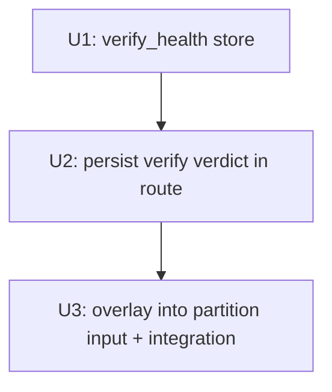

# feat: Surface API/OAuth credential expiry as needs-reconnect

## Overview

Close the known limitation from plan 007: API/OAuth platforms whose credentials have expired currently masquerade as healthy (offline `bound` only checks token *presence*, not validity) and sit unflagged in the main area — or, if the token file is gone, silently fold into the extension area as if "never connected". This plan persists the **live-verify** verdict per platform so an expired credential shows the existing `需重連` marker (and becomes non-selectable on the publish picker), exactly like the browser channels already do.

The key enabler: `verify_adapter_setup(mode='live')` already returns a typed `last_verify_result` with a distinct `token_expired` literal (vs `timeout`/`never`), so we can flag expiry **without** false alarms on transient network failures.

The partition itself and all templates are **unchanged** — feeding an expired record into the partition input reuses the existing `needs_reconnect` rendering on both surfaces.

## Problem Frame

`get_channel_status` computes `bound` from an *offline* check (token/config present). A present-but-expired API token reads `bound=True` → the platform sits in the main area looking usable; a publish to it then fails at send time. Browser channels (velog/medium/blogger) are protected because `channel_status` tracks their `expired` lifecycle — but the ~20 API/OAuth platforms (blogger, devto, notion, substack, …), which are the ones the operator actually relies on, have no such signal. (Origin: plan 007 Dependencies / Known limitations.)

## Requirements Trace

- R1. A live verify returning `token_expired` for any platform is persisted so it survives page reloads.
- R2. A persisted-expired platform shows the existing `需重連` state in the settings main area (not folded, not unflagged).
- R3. A persisted-expired platform is non-selectable on the `/batch-campaign` picker (disabled + reconnect link), same as browser expiry.
- R4. A later live verify returning `ok` clears the persisted-expired state (platform returns to normal usable).
- R5. Transient verdicts (`timeout`/`never`/`unverifiable_live`) neither set nor clear expiry — only `token_expired`↔`ok` flip the flag (no false alarms).
- R6. Reuse the existing partition `needs_reconnect` path — no change to `partition_channels_by_connection` or the templates.

## Scope Boundaries

- **On-demand only**: expiry is recorded when a live verify actually runs (the dashboard "Verify" button / `/api/<channel>/verify`). No new background credential pinging is added — that would be new network behavior and rate-limit surface.
- Does not change `verify_adapter_setup`, the `VerifyResult` literals, or any adapter.
- Does not change the partition function or any template (UI is reused).
- Browser channels keep using `channel_status`; verify_health is additive and authoritative only for the expiry overlay.

## Context & Research

### Relevant Code and Patterns

- `src/backlink_publisher/publishing/_verify.py` — `VerifyResultLiteral = {ok, token_expired, timeout, never, payload_invalid, unverifiable_live}`; `token_expired` is the credential-expiry signal (`_verify_adapters.py::_token_expired`).
- `webui_app/routes/settings_basic.py::api_channel_verify` (POST `/api/<channel>/verify`) — runs `verify_adapter_setup(channel, config, mode='live')` and returns the result JSON; **persists nothing today** → the write hook goes here.
- `webui_store/channel_status.py` + `webui_store/sqlite_base.py` — `SqliteStore` subclass pattern (table in `webui.db`), `_LazyStore` singleton via a `_make_*` factory. New store mirrors this shape, smaller.
- `webui_app/helpers/channel_tiers.py::partition_channels_by_connection(dashboard_channels, channel_statuses)` — `needs_reconnect = channel_statuses[name].status in {expired, identity_mismatch}`. Overlaying `{name: {"status":"expired"}}` into the `channel_statuses` arg is all that's needed — **no partition change** (R6).
- `webui_app/helpers/contexts.py::_settings_context` (builds `channel_statuses` + `dashboard_partition`) and `webui_app/routes/batch_campaign.py::_build_publish_partition` — the two partition call sites where the overlay is applied.

### Institutional Learnings

- `[[webui-lives-at-repo-root-not-src]]`; `[[atomic-write-json-fixed-tmp-footgun]]` (prefer the SqliteStore path, not ad-hoc JSON).
- Test isolation: autouse conftest sandboxes config + blocks sockets — verify tests must monkeypatch `verify_adapter_setup` to return a crafted `VerifyResult` rather than hit the network.

## Key Technical Decisions

- **New small store `webui_store/verify_health.py`, not widening `channel_status`**: `channel_status` is browser-binding-lifecycle-specific (`_validate_channel` rejects non-CHANNELS); mixing API verify-health in would muddy it. A dedicated table keyed by platform is isolated and follows the same `SqliteStore`+`_LazyStore` pattern.
- **Overlay at the partition input, not in the partition**: keeps `partition_channels_by_connection` the single unchanged decision point (007 R13); the two call sites merge `verify_health.expired_channels()` into the `channel_statuses` dict before calling. UI reuse is automatic.
- **Only `token_expired`↔`ok` mutate state**: `record(channel, result)` upserts on `token_expired`, deletes on `ok`, ignores the rest — robust against transient failures (R5).
- **verify_health is authoritative for the overlay**: if it says expired, force `status="expired"` in the merged dict even if offline `bound=True` (token present but server-rejected = the exact masquerade we're fixing).

## Open Questions

### Resolved During Planning
- Expiry signal source: `last_verify_result == "token_expired"` from live verify (typed, distinct from transient).
- Where to persist: new `verify_health` SqliteStore table in `webui.db`.
- UI changes: none — reuse partition `needs_reconnect` rendering.

### Deferred to Implementation
- Whether to also clear expiry on a successful publish (not just verify). Defer — verify is the canonical credential check; revisit only if it proves insufficient.

## Implementation Units

- [x] **Unit 1: `verify_health` store**

**Goal:** Persist the per-platform credential-expiry verdict.

**Requirements:** R1, R4, R5

**Files:**
- Create: `webui_store/verify_health.py`
- Test: `tests/test_webui_store_verify_health.py`

**Approach:**
- `SqliteStore` subclass `VerifyHealthSqliteStore` with table `verify_health(channel TEXT PRIMARY KEY, result TEXT NOT NULL, at TEXT)` in `webui.db`; `_LazyStore` singleton via `_make_verify_health_store()` (mirror `channel_status.py`).
- Public API:
  - `record(channel, result)`: `token_expired` → upsert `{result, at=now}`; `ok` → delete row; any other literal → no-op.
  - `expired_channels() -> frozenset[str]`: channels whose stored result == `token_expired`.
  - `list_all() -> dict` (debug/parity).
- `now` is injected/`_now_iso()` like channel_status (no bare `datetime.now()` in hot path tests — pass or mirror existing helper).

**Patterns to follow:** `webui_store/channel_status.py` (store class, `_LazyStore`, `_now_iso`).

**Test scenarios:**
- Happy: `record("devto","token_expired")` → `expired_channels()=={"devto"}`; record `ok` → set empties.
- Edge: `record("devto","timeout")` on a clean store → still empty (no-op); on an already-expired channel → stays expired (timeout doesn't clear).
- Edge: unknown channel read → not in `expired_channels()`, no error.
- Idempotent: recording `token_expired` twice → single row.

**Verification:** `pytest tests/test_webui_store_verify_health.py` green.

- [x] **Unit 2: persist the live-verify verdict**

**Goal:** The on-demand verify route records its verdict so expiry survives reload.

**Requirements:** R1, R4, R5

**Files:**
- Modify: `webui_app/routes/settings_basic.py` (`api_channel_verify`)
- Test: `tests/test_settings_basic_verify_health.py` (or extend an existing settings-route test module if present)

**Approach:**
- After `result = verify_adapter_setup(channel, config, mode='live')`, call `verify_health.record(channel, result.last_verify_result)` before returning the JSON. Wrap in try/except so a store failure never breaks the verify response (verify is the primary contract).
- Do **not** touch `/api/<channel>/dry-run` (payload validation, not credentials).

**Test scenarios:**
- Happy: POST verify with `verify_adapter_setup` monkeypatched to return `token_expired` → `verify_health.expired_channels()` contains the channel; response JSON still has `last_verify_result=="token_expired"`.
- Clear: monkeypatched `ok` → channel removed from expired set.
- Transient: monkeypatched `timeout` → expired set unchanged.
- Resilience: store.record raising → route still returns 200 with the verify JSON.

**Verification:** route test green; CSRF/contract unchanged.

- [x] **Unit 3: overlay verify_health into the partition input**

**Goal:** Expired API platforms render `需重連` in settings and are non-selectable on the publish picker — via the existing partition path.

**Requirements:** R2, R3, R6

**Files:**
- Modify: `webui_app/helpers/contexts.py` (`_settings_context`)
- Modify: `webui_app/routes/batch_campaign.py` (`_build_publish_partition`)
- Test: extend `tests/test_settings_dashboard_rendering.py` and `tests/test_webui_batch_campaign.py`

**Approach:**
- Add a small shared helper (e.g. `webui_app/helpers/channel_tiers.py::merge_verify_health(channel_statuses, expired)` or inline) that returns `{**channel_statuses, **{n: {"status": "expired"} for n in expired}}`.
- In both call sites, before partitioning: `expired = verify_health.expired_channels()` (try/except → empty set on failure), merge into `channel_statuses`, pass merged to `partition_channels_by_connection`.
- No change to `partition_channels_by_connection` or any template (R6).

**Test scenarios:**
- Integration (settings): seed `verify_health` with `devto` expired (offline `bound=True` via monkeypatch) → `/settings` renders `devto` in main with `需重連`; not in extension.
- Integration (publish): same seed → `/batch-campaign` shows `devto` disabled with reconnect link; `name="platforms" value="devto"` absent.
- Negative: a platform with no verify_health record and `bound=True` → normal selectable (unchanged behavior).
- Resilience: `expired_channels()` raising → both pages still render (overlay degrades to none).

**Verification:** both test modules green; full touched-area suite green.

## System-Wide Impact

- **Interaction graph:** write at `api_channel_verify`; read at the two partition call sites. `partition_channels_by_connection`, templates, and browser-channel `channel_status` flow unchanged.
- **State lifecycle:** verify_health is a cache of the last *credential* verdict; `ok` clears, `token_expired` sets, transient ignored. No coupling to publish/recheck state.
- **Unchanged invariants:** `verify_adapter_setup` + `VerifyResult` literals; partition signature/behavior; all 007 templates; the dashboard card drift count (overlay only flips a flag, never adds/removes cards).
- **Error propagation:** every new store call is try/except-guarded so neither verify nor settings/publish rendering can 500 on a store error.

## Risks & Dependencies

| Risk | Mitigation |
|------|------------|
| Overlay wrongly marks a healthy platform expired | Only `token_expired` writes; `ok` clears; transient ignored (R5). |
| `webui.db` schema add interacts with concurrent writers | New isolated table; `SqliteStore` WAL + RLock pattern as channel_status. |
| Operator never clicks Verify → expiry stays invisible | Accepted scope boundary (on-demand only); documented. A future scheduled channel-verify can reuse `verify_health.record` unchanged. |
| Browser channel double-tracked (channel_status + verify_health) | Overlay forces `expired` which matches channel_status intent; no conflict (both → needs_reconnect). |

## Sources & References

- Origin: plan 007 (`docs/plans/2026-06-05-007-...-plan.md`) Known limitations.
- Code: `_verify.py`, `_verify_adapters.py`, `settings_basic.py`, `channel_tiers.py`, `contexts.py`, `batch_campaign.py`, `channel_status.py`, `sqlite_base.py`.
