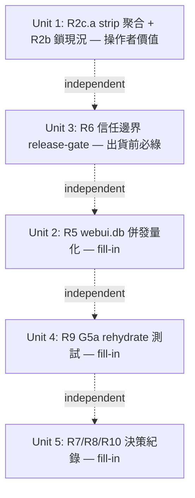

# feat: LITE Release-Readiness Triage

## Overview

收斂五項殘留風險。**研究階段 code-verified 翻掉了 origin 文件的兩個前提**,計畫範圍因此大幅縮小:

1. **per-platform「ledger 存活」已 ship,但 ≠ 操作者要的「recheck 存活」** —— `build_channel_scorecard()`(`scorecard/engine.py:112-187`)已逐平台算 `live_pct`/`live_dofollow`/`liveness_breakdown{live,stale,failed,unverified}`,health 頁 scorecard 卡(`health.html:226-285`)已 render,逐條 drawer 已存在(plan 009)。**但 review code-verified 一個關鍵區別**:此 `liveness_breakdown` 來自 **ledger verify-signal**(`_link_liveness` 讀 `articles.verified_at` 的時間戳老化),**不是 recheck verdict**——一條連結可能 ledger 顯示 `live` 而 recheck 已是 `link_stripped`(`health.html` footer 自承「兩個正確粒度」)。所以操作者 R2b 真正要的「平台處理後是否仍存活/未被 strip」其實是 **recheck 訊號 = R2c.a**,不是已 ship 的 ledger 訊號。
2. **#5 唯一真缺口 = R2c.a(per-platform recheck-strip 聚合)** —— scorecard 沒有把 recheck verdict `link_stripped`/`host_gone`/`dofollow_lost` 逐平台聚合;「telegraph strip 一眼可見」現在得逐條點 drawer。**⚠ 此聚合與既有 `liveness_breakdown` 不同源**(recheck events vs ledger),不可混入同一 dict、不可相加——詳見 Unit 1。

本計畫做 5 個單元:R2c.a recheck-strip 聚合(唯一 #5 新功能)、#1 併發壓測量化、#3 信任邊界 release-gate、#2b G5a 回歸測試、#2/#4/#2c 決策紀錄。**R2a/R3 per-window publish 拆分**(brainstorm 原列 P1,經操作者拍板「只補 strip 聚合」而 deferred)、R2c.b(深層頁)、R2c.c(非作者)明確 deferred,見 Deferred 段。

## Problem Frame

LITE 版單操作者要在發布前對五項殘留風險收斂。瓶頸是執行不是點子,且程式碼常跑在計畫前面——所以本計畫的紀律是:**先驗證現況,只做真缺口,把刻意延後正式記成決策**。(see origin: `docs/brainstorms/2026-06-05-lite-release-readiness-triage-requirements.md`)

## Requirements Trace

- **R2c.a** — per-platform recheck-strip 聚合(`link_stripped`/`host_gone`/`dofollow_lost`,latest-verdict-per-link,**新 reducer 保留 platform**)以**新欄位**進 channel scorecard 列,telegraph 等高 strip 平台一眼可見。→ Unit 1
- **R2b** — per-adapter ledger 存活率:**ledger 訊號已 ship**(≠ recheck 存活,見 Overview);本計畫僅加 characterization 測試鎖住**既有 ledger 定義**,並明記 recheck 存活由 R2c.a 交付。→ Unit 1
- **R5(#1)** — webui.db 併發壓測,量化(非修)是否存在跨進程 lost-update / torn-write。→ Unit 2
- **R6(#3)** — LITE loopback/DNS-rebinding release-gate:枚舉所有狀態改寫路由,斷言 `_check_bind_origin_or_abort` 覆蓋 + 偽造 Origin/Host abort。出貨前必綠,不阻 P1。→ Unit 3
- **R9(#2b)** — G5a(同-process 分頁重開)rehydrate 回歸測試。→ Unit 4
- **R7/R8/R10** — G5b 跨-process restart-durable、Pydantic opt-in、recheck 無 timeout:正式記成「現狀接受 + 重啟觸發條件」。→ Unit 5

## Scope Boundaries

- **不重建 R2b**:per-adapter 存活已由 channel scorecard 提供(`scorecard/engine.py`)。Unit 1 只加 strip 聚合 + 一個鎖現況的測試。
- **R2c.b / R2c.c 不在本計畫**:深層頁 strip 率需 `page_depth` schema 遷移;非作者跑通率卡在「非作者發布路徑從沒端到端跑通」前置 POC。兩者列為 Deferred,獨立排序。
- **per-window 拆分(w24h/w7d/w30d)不在本計畫**:scorecard 是 all-time,加分窗是 net-new 次要工作,deferred。
- **#1 先量化不預設修**:R5 量出風險則修復另立計畫。
- **#2/#4 不寫產品程式碼**:Unit 5 只寫決策紀錄。
- **不引入新儀表板框架、不接 GA4**。

## Context & Research

### Relevant Code and Patterns

- **`scorecard/engine.py:112-187` `build_channel_scorecard()`** + `scorecard/model.py:24-70` `ChannelScoreRow`:R2b 現況來源;`liveness_breakdown` 是 `_LIVENESS_KEYS`(engine.py:53)四鍵 dict——R2c.a 要在此擴充或新增欄位。
- **`per_adapter()` `health_metrics.py:132-168`**:publish-success 聚合,house style = `EventStore.query()` + `json_extract(payload_json,'$.platform')` + `SUM(CASE WHEN ...)`。R2c.a 的聚合複用此 style。
- **`recheck/events_io.py:110-212` `derive_per_target_status` / `derive_decay_counts`**:latest-verdict-per-`article_id` 的 reduction(`_is_newer(ts,id)` tiebreak)。**R2c.a 必須走這個 reduction,不可裸 `GROUP BY link.rechecked`**(重複 recheck 會重複計)。
- **`recheck/verdicts.py:35-72`**:verdict 詞表 `alive/host_gone/link_stripped/dofollow_lost/probe_error`;`DETERMINISTIC_DEAD = {host_gone, link_stripped}`。
- **`templates/health.html:226-285`**:scorecard 7 欄表 + drawer;前端反腐規則 `data-action`/`esc()`/`url_for(..., v=asset_version)`。GET 頁,render 不需 CSRF token。
- **`tests/test_webui_store_concurrency.py`** + **`tests/test_reliability_circuit_crossproc.py`**:跨進程測試黃金樣板——`subprocess.Popen([sys.executable, "-c", _CHILD])`(非 multiprocessing,以繞過 autouse socket-block),子程序帶 `PYTHONPATH=src` + `PYTHONHASHSEED=0` + `BACKLINK_PUBLISHER_CONFIG_DIR`。
- **`webui_app/__init__.py:264-291`**:`_global_csrf_guard`(app-level,擋所有 POST/PUT/PATCH/DELETE)+ `_lite_surface_gate`;**`helpers/security.py:130` `_check_bind_origin_or_abort` 是 per-route opt-in**——R6 真缺口。
- **`tests/test_webui_lite_loopback_enforced.py:62-64`**:已記錄「Origin guard 是 per-route opt-in、無物斷言狀態改寫路由都掛了它」——R6 從這裡接續。
- **`webui_app/services/keepalive_job.py:410-450` `running_job()` / `_poll_locked`** + **`tests/test_webui_keepalive_recheck_job.py`**:R9 樣板,用 `threading.Event` 卡住 probe 讓 job 停在 running 再斷言 `running_job()`。

### Institutional Learnings

- **`docs/solutions/logic-errors/2026-06-05-001-live-dofollow-undercounting-triple-gap.md`**:測 DB 寫回**必須直接 query SQLite**,別走 `build_ledger`(test mode 從注入 `history=` JSON 讀,會假綠)。影響 Unit 1 測試。
- **`docs/solutions/logic-errors/projector-silent-drop-status-vocabulary-drift-2026-05-26.md`**:未知 status 落靜默 `else` → 下游全低估且測試全綠;且 **WAL 巢狀連線死鎖**(reducer 持寫鎖時開第二連線 → `database is locked`)。影響 Unit 1(strip 聚合別漏 verdict 值)+ Unit 2(壓測該覆蓋 `database is locked`/busy_timeout)。
- **`docs/solutions/integration-issues/dofollow-canary-verdict-dropped-at-publish-output-seam-2026-05-25.md`**:strip 判定要看**目標連結自身的 rel**,不是頁面級 `nofollow_detected`(含 nav/footer 噪音)。影響 Unit 1 strip 語義。
- **`docs/solutions/best-practices/app-level-csrf-guard-makes-blueprint-csrf-dead-code-2026-05-27.md`**:webui 測試共用 module-level app,sibling 把 `WTF_CSRF_ENABLED=False` 不還原 → guard 路由全套件綠、單跑 403。R6 測試必須 `monkeypatch.setitem` 強制自己 CSRF 姿態 + seed `session['csrf_token']` + 帶 `Origin: http://127.0.0.1:<port>`。影響 Unit 3。
- **`docs/solutions/test-failures/del-os-environ-poisons-session-scoped-config-dir-fixture-2026-05-27.md`**:一律 `monkeypatch.setenv`,別裸 `del os.environ`;「單跑綠全套件紅」找 polluter。影響 Unit 2/3。
- **`docs/solutions/test-failures/strict-markers-addopts-noop-conftest-module-load-2026-06-01.md`**:strict marker 放 CI/CLI 不放 addopts,否則假閘門。影響 Unit 2/3 的 `real_*` marker。
- **MEMORY `[[atomic-write-not-cross-process-rmw-safe]]`**:`JsonStore.update`+`atomic_write` 只防 torn-write、不防跨進程 lost-update;**此風險無 solution 檔=Unit 2 是新缺口**,跨進程須兩 OS process 驗。

### Discovered Defect (release-readiness)

- **`_pipeline_summary()`(`routes/health.py:96-148`)疑似 bug**:`ts_utc >= ?` 拿 Unix `time.time()` float 比 ISO-8601 字串,且 `GROUP BY $.status`(publish.* payload 未必帶)。這是混合 {ok,fail} 視窗的來源。記為 Open Question,本計畫不擴範圍去修(但見 Unit 1 verification)。

## Key Technical Decisions

- **ledger 存活 ≠ recheck 存活(review 更正)**:`build_channel_scorecard` 的 `liveness_breakdown` 是 ledger verify-signal(時間戳老化),操作者要的 recheck 存活由 R2c.a 交付。R2b 只 characterization 鎖既有 ledger 定義,不重建(MEMORY `[[plans-marked-active-may-be-already-shipped]]`)。
- **R2c.a 需新 reducer,不可複用 `derive_per_target_status`(review 更正)**:後者 keyed by `target_url` 且**對非 ALIVE verdict 丟棄 platform**;新寫 `derive_strip_counts_by_platform()` 用同樣 latest-wins reduction 但對所有 verdict 保留 platform。
- **R2c.a 落新欄位 `strip_breakdown`,不擴 `liveness_breakdown`(review 更正)**:兩者不同源(recheck vs ledger)不可相加;平台歸屬走 scorecard 既有解析(`link.platform or plat_index`)以保「聚合=drawer 明細」。
- **R5 量化不修 + 去重**:distinct-key 跨進程已由既有 `test_webui_store_concurrency.py` documents;淨新增=同-key RMW + WAL busy_timeout,擴既有檔。結論餵 release 決策。
- **R6 gate = runtime 偽造-Origin 行為掃描,不是靜態枚舉(review 更正)**:guard 是 view 體內呼叫,`iter_rules()` 偵測不到;只能對每條 mutating route 帶合法 CSRF + 偽造 Origin 斷言 403+無副作用。`remote_addr` 檢查不算覆蓋(擋不了 rebinding)。
- **strip 語義看目標連結自身 rel**:不用頁面級 `nofollow_detected`(learning #3)。
- **SQL 用 bound param**:verdict literal / platform filter 禁 f-string 插值(security review)。

## Open Questions

### Resolved During Planning

- **ledger 存活 vs recheck 存活?** 已驗證為兩個不同訊號;R2b=ledger(已 ship),R2c.a=recheck(新)。
- **R2c.a 是否需新資料管線?** 否——`link.rechecked` 已帶 `verdict`+`platform`;但**需新 reducer**(`derive_per_target_status` 對 dead verdict 丟 platform,不可複用)。
- **R2c.a 落點?** 已定:`ChannelScoreRow` **新欄位 `strip_breakdown`**(不擴 `liveness_breakdown`,不同源)。
- **R6 偵測機制?** 已定:runtime 偽造-Origin 行為掃描(`iter_rules` 只枚舉清單,不能斷言 guard 存在)。
- **R5 是否重造 harness?** 否,擴既有 `test_webui_store_concurrency.py`。

### Deferred to Implementation

- **R5 過關門檻(幾筆/幾併發)**:依既有測試規模定。
- **`_pipeline_summary` ts bug 是否順手修?** 觸及才評估;預設只記不修。
- **`strip_breakdown` 在 health.html 的版位**(同列加欄 vs 子卡):看 render 耦合度定。

### Deferred to Future Plans (out of scope)

- **R2a/R3 per-window publish 拆分** — brainstorm 原列 P1 unit 1;`per_adapter()` 單窗、分窗確為 net-new。操作者拍板「只補 strip 聚合」→ **明確 deferred**(非遺漏),再要時加一單元呼叫 `per_adapter()` 三次(`_window_start` 1/7/30)。
- **R2c.b 深層頁 strip 率** — 需 events.db 新增 `page_depth`/`page_type` 欄位 + schema 遷移。
- **R2c.c 非作者跑通率** — 硬依賴「非作者發布路徑端到端跑通」前置 POC;若該 POC 永不落地,需顯式 KILL 紀錄(否則操作者「三個都要」永久部分未達)。
- **per-window scorecard 存活分窗** — scorecard all-time → 分窗為次要 net-new。

## Implementation Units

五單元彼此獨立、可任意順序。**優先序(review ceo 建議)**:**Unit 1(唯一操作者價值)+ Unit 3(具名 release-gate)是 floor**;Unit 2/4/5 是 fill-in,執行時間吃緊可後延,別讓 bookkeeping 卡住 headline。
> **誠實標註(review product/ceo)**:R2c.a 與 plan 009 drawer **同資料**——它是「免點開 drawer 的逐平台彙總便利」,降低跨平台比較摩擦,**非新增資訊**。價值真實但屬 glance-convenience 等級,不是 release blocker。Unit 3 才是真正的 release-gate。

- [x] **Unit 1: R2c.a per-platform strip 聚合 + R2b characterization**

**Goal:** 在 channel scorecard 逐平台顯示 `link_stripped`/`host_gone`/`dofollow_lost` 計數(latest-verdict-per-link),讓「telegraph strip 86%」一眼可見;並補一個鎖住 R2b 既有存活聚合的 characterization 測試。

**Requirements:** R2c.a, R2b

**Dependencies:** None(R2b 既有、plan 002 writeback 已 ship)

**Files:**
- Create: 新 reducer `derive_strip_counts_by_platform()`(放 `src/backlink_publisher/recheck/events_io.py`,鄰 `derive_per_target_status`)
- Modify: `src/backlink_publisher/scorecard/engine.py`(`build_channel_scorecard` 呼叫新 reducer,合併進 row)
- Modify: `src/backlink_publisher/scorecard/model.py`(`ChannelScoreRow` 加**新欄位** `strip_breakdown: dict[str,int]`,**不動既有 `liveness_breakdown`**)
- Modify: `webui_app/templates/health.html`(scorecard 列加 strip 欄;`esc()`/`textContent` render platform 與計數)
- Test: `tests/test_scorecard_strip_aggregation.py`(新增)

**Approach:**
- **⚠ review code-verified 的兩個機制修正(原稿錯誤,已更正)**:
  1. **不可複用 `derive_per_target_status`**——它 keyed by `target_url`,且對非 ALIVE verdict **丟棄 platform**(platform 只在 `alive_platforms` 為 ALIVE 時保留)。strip 計數需要的正是 dead verdict 的 platform。→ 寫**新 reducer** `derive_strip_counts_by_platform()`,沿用同樣的 latest-wins reduction(`_canon_target` + `_is_newer(ts,id)` 同-ts tiebreak),但**對所有 verdict 保留 platform**,回傳 `{platform: {link_stripped, host_gone, dofollow_lost}}`。
  2. **不可擴進 `liveness_breakdown`**——該 dict 來自 ledger verify-signal(`_link_liveness`),與 recheck verdict **不同源、不可相加**。→ 用 `ChannelScoreRow` **新欄位 `strip_breakdown`**,語義上明示「recheck-derived,與 ledger liveness 並列非合計」。
- **platform 解析對齊**:strip 計數的平台歸屬須走 scorecard 既有解析(`link.platform or plat_index.get(live_url)`),**不要直接用 recheck payload 的 platform 欄**——兩者可能不一致,否則「聚合=明細」對不上。`None` → `(unattributed)` 桶,與 scorecard 一致。
- strip 判定看目標連結自身 rel(`dofollow_lost`/`link_stripped` verdict),不用頁面級 `nofollow_detected`(learning #3)。
- 未知 verdict 不可靜默 `else` 丟棄(learning #2)。
- `small_sample` 沿用 ledger 的 `total_links` 分母;strip 計數來自 recheck(分母不同),**測試須斷言兩者不被誤當同一分母**。

**Execution note:** characterization-first——先寫鎖住 `build_channel_scorecard` 既有 **ledger** 輸出(`live_pct`/`live_dofollow`/四鍵 `liveness_breakdown`)的測試,再加新 reducer 與 `strip_breakdown` 欄,確保不回歸。先 grep 既有 scorecard 測試是否已斷言這些鍵——若已有,characterization 併入新測試一條斷言即可,不另立。

**Patterns to follow:** `derive_per_target_status`(events_io.py)的 latest-wins reduction 結構;`per_adapter()` 的 `EventStore.query()` + `json_extract` + bound `?` param style(verdict literal 與 platform filter 必須 bound param / 常數,**禁 f-string 插值**)。

**Test scenarios:**
- Happy path:某平台最新 verdict 3 條 `link_stripped`、1 條 `dofollow_lost` → `strip_breakdown` 顯示 stripped=3, dofollow_lost=1。
- Edge case:同一 `article_id` 先 alive 後 stripped → 只計最新(stripped),不重複計。
- Edge case:recheck payload platform 與 scorecard 解析的 platform 不一致 → 歸到 scorecard 解析的那一列(同一連結只落一列);斷言聚合=drawer 明細。
- Edge case:平台無 `link.rechecked` → strip 計數 0,非 None;`small_sample`(ledger 分母)不受影響。
- Edge case:payload 無 platform → `(unattributed)`,不漏不報錯。
- Error path:未知 verdict 值 → 不靜默丟,落明確 bucket 或記錄。
- Security:platform 字串 render 進 health.html 走 `esc()`/`textContent`(對抗注入內容);SQL 用 bound param。
- Characterization (R2b):鎖住既有 ledger 四鍵 `liveness_breakdown` + `live_pct`/`live_dofollow` 不變;斷言 `strip_breakdown` 為**新增獨立欄位**,未污染既有四鍵。

**Verification:** health 頁 scorecard 不展開 drawer 即看到每平台 strip 計數;`strip_breakdown` 與 plan 009 drawer 明細(同一 platform 解析)加總一致;既有 scorecard 測試不退。

- [x] **Unit 2: R5 webui.db 併發資料風險量化**

**Goal:** 量化 webui.db 在**同一 key 跨進程 RMW** 下是否 lost-update,及 WAL 競爭行為。輸出明確結論餵 release go/no-go,不預設要修。

**Requirements:** R5

**Dependencies:** None

**Files:**
- Modify (擴): `tests/test_webui_store_concurrency.py`(既有,**勿另立新檔**)
- Read: `webui_store/sqlite_base.py`、`webui_store/__init__.py`

**Approach:**
- **⚠ review code-verified 的去重修正**:`tests/test_webui_store_concurrency.py` **已存在**且已用兩個 OS subprocess 測**不同 key**(`key_0`/`key_1`)的跨進程行為、已 documents distinct-key limitation。**淨新增只有兩塊**,擴進既有檔即可:
  1. **同一 key RMW counter 守恆**(真正的 lost-update,既有測試沒測):兩 process 對同一 key RMW N 次 → 斷言最終 counter == 2N(守恆)或明確記錄丟失量。
  2. **WAL `database is locked` / busy_timeout** 路徑。
- 沿用既有檔的 subprocess + `_child_env()`(`PYTHONPATH`/`PYTHONHASHSEED=0`/`BACKLINK_PUBLISHER_CONFIG_DIR` via `monkeypatch`,非裸 `del`)。

**Execution note:** 結論須轉成 release 決策(見 Verification),不止 docstring。

**Patterns to follow:** `tests/test_webui_store_concurrency.py` 既有 subprocess 結構;`tests/test_reliability_circuit_crossproc.py` 的 `_CHILD` inline program。

**Test scenarios:**
- Concurrency (淨新增):兩 process 對同一 key RMW N 次 → 斷言 counter 守恆,記錄丟失量(真 lost-update)。
- Error path (淨新增):WAL 寫鎖競爭觸發 `database is locked` → busy_timeout retry 後成功或明確記錄。
- (已覆蓋,勿重做)distinct-key 跨進程存活已由既有測試 documents。

**Verification:** 同-key RMW 結論明確(守恆/丟失量);**若量出 lost-update,Unit 5 須補一條 release 決策紀錄**(帶限制出貨 + 觸發條件,或標 flock 修復為 blocker)——不止寫 docstring。webui.db 是否存放 CSRF/session/throttle 等安全狀態須一併確認(影響此限制的安全衝擊,見 Risks)。

- [x] **Unit 3: R6 LITE 信任邊界 release-gate(guard 覆蓋 + E2E）**

**Goal:** 對每條狀態改寫路由,以 runtime 偽造 Origin/Host 請求斷言 **abort(403)且無副作用**,確保 DNS-rebinding 邊界覆蓋。出貨前必綠,但不阻 P1 開工。

**Requirements:** R6

**Dependencies:** None

**Files:**
- Test: `tests/test_webui_lite_origin_guard_coverage.py`(新增)
- Read: `webui_app/__init__.py:264-291`(`_global_csrf_guard`)、`webui_app/helpers/security.py:130`(`_check_bind_origin_or_abort`)、`webui_app/routes/health_actions.py`(`_enforce_loopback` 範例)、`tests/test_webui_lite_loopback_enforced.py`

**Approach:**
- **⚠ review code-verified 的機制修正(原稿的靜態斷言不可實作)**:`_check_bind_origin_or_abort()` 是**view 函式體內呼叫**,非 decorator/before_request/rule 屬性——`url_map.iter_rules()` **看不到** view 內部呼叫了什麼。因此**唯一可行的 gate 是 runtime 行為掃描**:
  - 用 `iter_rules()` 過濾 `rule.methods & {POST,PUT,PATCH,DELETE}` 只做**枚舉路由清單**(非斷言 guard 存在)。
  - 對每條路由,test_client 發**合法 CSRF token + session + 偽造 `Origin`/`Host`** 的請求 → 斷言 **403 且無副作用**(無事件寫入 / 無 state 變更)。**必須帶合法 CSRF**,否則 `_global_csrf_guard`(第一個 before_request)先 403,遮蔽 Origin guard 是否存在 → 假綠。
  - **positive control**:同請求改帶合法 loopback Origin → 必須**不** 403,證明上面的 403 來自 Origin guard 而非別的。
- **`remote_addr` loopback 檢查不算覆蓋**:`health_actions._enforce_loopback` 用 `request.remote_addr`,但 rebinding 時惡意頁在受害者瀏覽器跑、連 127.0.0.1,remote_addr **就是** loopback——擋不住。測試須對這類路由**仍**帶偽造 Origin 斷言 403,不可因 remote_addr 檢查存在就視為過關。
- **abort 須真的發生**:路由可能在 `try/except Exception` 內呼叫 guard 而吞掉 `HTTPException`(本 repo 大量 `except Exception`)。故 gate 斷言**實際 403 + 無副作用**,不是「view 有呼叫 guard」。
- **allowlist 受約束**:每筆豁免須(a)指名實際在用的替代邊界防護並由測試正向斷言其觸發(如 oauth_callback 的 HMAC state);(b)**snapshot 數量封頂**,新增一筆是需 review 的明確 delta;(c)禁止豁免任何發外連 probe / 寫 state 的路由。
- **GET 副作用 tripwire**:CSRF/Origin guard 都只看 mutating verb;枚舉 GET/HEAD 路由,斷言(人工 review allowlist)無一寫 state 或發外連 probe。

**Execution note:** `monkeypatch.setitem` 強制自己 CSRF 姿態 + seed `session['csrf_token']`,避免 sibling 關 CSRF 假綠(learning #5)。strict marker 走 CLI 不靠 addopts(learning #6)。**注意 76 條 mutating route 多數目前無 Origin guard**——此 gate 初次跑會紅一片,屬預期(暴露真缺口)。

**Patterns to follow:** `tests/test_webui_lite_loopback_enforced.py`、`tests/test_webui_route_contract.py`(route 枚舉風格)、`tests/test_webui_csrf_ordering.py`。

**Test scenarios:**
- Error path:每條 mutating route 帶合法 CSRF + 偽造 `Origin: http://evil.example` → 403 **且無副作用**。
- Error path:偽造 `Host`(remote_addr=127.0.0.1)→ 403(證明 remote_addr 檢查不足以擋 rebinding)。
- Positive control:合法 loopback Origin + 合法 CSRF → 不 403(證明上面 403 歸因於 Origin guard)。
- Error path:guard 被 `try/except Exception` 吞掉的路由 → 仍須最終 403,否則 gate 紅。
- Edge case:allowlist 路由(如 oauth_callback)→ 正向斷言其替代防護觸發。
- Tripwire:GET/HEAD 路由無寫 state / 無外連 probe(人工 allowlist)。
- Regression:新增一條假 mutating route 無 guard → gate 紅。

**Verification:** gate 全綠 = 每條狀態改寫路由 runtime 證實受 Origin 邊界保護且無副作用。**列為 release-gate(出貨前必綠);是否接進 blocking CI(`ci.yml`)見下方 present 決策**。

- [x] **Unit 4: R9 G5a rehydrate 回歸測試**

**Goal:** 鎖住「同-process 分頁重開可恢復 in-flight recheck job polling」這條已實作但無測試的路徑。

**Requirements:** R9

**Dependencies:** None

**Files:**
- Test: `tests/test_webui_keepalive_g5a_rehydrate.py`(新增,或擴 `tests/test_webui_keepalive_recheck_job.py`)
- Read: `webui_app/services/keepalive_job.py:410-450`(`running_job`/`_poll_locked`)、`webui_app/routes/command_center.py:38,96,110`

**Approach:**
- 建 fresh `KeepaliveJobRegistry()`,注入 `EventStore(tmp)` + fake `probe_fn`,probe 內用 `threading.Event` 卡住讓 job 停在 `running`。
- 斷言 `reg.running_job("recheck")` 回傳 in-flight 快照(`job_id`/`status=="running"`/`checked`/`verdict_counts`);放行 Event → job 達 terminal 後 `running_job()` 回 `None`。

**Execution note:** 測試 DB 寫回直接 query SQLite(EventStore),別走 build_ledger(learning #1)。

**Patterns to follow:** `tests/test_webui_keepalive_recheck_job.py` 的 `test_cancel_mid_run`/`test_second_start_conflicts`(threading.Event 卡 mid-run)+ `_wait_terminal`。

**Test scenarios:**
- Happy path:job running 中 → `running_job("recheck")` 回正確 in-flight 快照。
- Edge case:無 running job → `running_job()` 回 `None`。
- Edge case:job 達 terminal 後 → `running_job()` 回 `None`(快照不殘留)。
- Integration:模擬分頁重開(再呼叫 `running_job()` / 對應 route)→ 前端可據以恢復 polling 的欄位齊全。

**Verification:** 新測試紅→綠,證明 G5a rehydrate 路徑受回歸保護;與刻意延後的 G5b 區隔清楚。

- [x] **Unit 5: R7/R8/R10 決策紀錄(現狀接受)**

**Goal:** 把三項刻意延後正式記成「已決策 + 重啟觸發條件」,讓它們離開 active backlog。

**Requirements:** R7, R8, R10

**Dependencies:** None

**Files:**
- Create: `docs/solutions/architecture-patterns/2026-06-05-lite-accepted-deferrals.md`(或 repo 慣例的決策紀錄落點)

**Approach:**
- R7(G5b 跨-process restart-durable rehydrate):記延後 + 前提「單操作者在場、LITE 無長跑無人值守 recheck」於發布版仍真;觸發條件=出現無人值守/排程化 recheck。明確區隔 R9 的 G5a(已實作)。
- R10(recheck 無 timeout):記現狀接受;觸發條件=出現無人值守/排程化 recheck 時補 timeout + 上限(對照 gap-closure 的 2h timeout)。
- R8(Pydantic opt-in):記 `schema.py` dict validators 為 publish payload **唯一 authoritative 安全邊界**,Pydantic 為非權威輔助;觸發條件=漂移第三次,或 publish target 新增任何注入/SSRF 相關欄位,或**任何新讀取路徑(如 R2c.a)把 payload 欄位 surface 到 UI 而未確認其在 write-time validator 受約束**(security review)。
- **(條件)R5 lost-update 出貨決策**:若 Unit 2 量出同-key lost-update,於此補一條 release go/no-go 紀錄——帶限制出貨 + 觸發條件,或標 flock 修復為 blocker。先確認 webui.db 是否存放 CSRF/session/throttle 等安全狀態(決定此限制的安全衝擊)。
- 促銷剝離 operator 域名/憑證等識別資訊(docs/solutions 促銷規範)。

**Execution note:** 純文件,無程式碼。Test expectation: none —— 決策紀錄無行為變更。

**Patterns to follow:** 既有 `docs/solutions/` frontmatter + 「促銷剝離識別」規範。

**Test scenarios:** Test expectation: none —— 純決策紀錄,無行為改變。

**Verification:** 三項各有一條明確「接受現狀 + 重啟觸發條件」紀錄;R7/R8/R10 不再出現在 active backlog。

## System-Wide Impact

- **Interaction graph:** Unit 1 改 `build_channel_scorecard`/`ChannelScoreRow` → 影響 health 頁 scorecard render 與 plan 009 的 drawer。**`strip_breakdown` 與 drawer 必須用同一 platform 解析**才能「聚合=明細加總」(否則 recheck payload platform vs scorecard 解析不一致會對不上)。
- **Error propagation:** Unit 1 strip 聚合遇未知 verdict 不可靜默 `else` 丟棄(learning #2);Unit 2 須容忍 `database is locked`。
- **State lifecycle risks:** Unit 1 latest-verdict-per-link reduction 是正確性關鍵;Unit 2 同-key 跨進程 lost-update 是量化目標(非修)。
- **API surface parity:** `ChannelScoreRow.to_jsonl_dict()` 用 `asdict()`——加**新欄位 `strip_breakdown`(dict)** 安全(既有消費端讀既有鍵不受影響);characterization 測試須斷言既有四鍵 + `to_jsonl_dict` round-trip 新欄位(feasibility review 已驗此為低風險落點)。
- **Unchanged invariants:** R2b 既有 ledger 存活輸出(`live_pct`/`live_dofollow`/四鍵 `liveness_breakdown`)**完全不改**,`strip_breakdown` 為並列新欄位;`_global_csrf_guard` 行為不改(Unit 3 只新增 runtime 斷言);keepalive G5b 行為不改(Unit 4 只測 G5a)。

## Risks & Dependencies

| Risk | Mitigation |
|------|------------|
| Unit 1 裸 `GROUP BY link.rechecked` 重複計重 recheck 連結 | 新 reducer 走 latest-wins(`_is_newer` tiebreak)(Key Decision + test) |
| Unit 1 strip 聚合與 009 drawer platform 解析不一致 → 對不上 | 兩邊用同一 `link.platform or plat_index` 解析;Integration 測試斷言聚合=明細 |
| Unit 1 把 recheck strip 數混入 ledger `liveness_breakdown` | 用獨立新欄位 `strip_breakdown`;測試斷言既有四鍵未被污染 |
| Unit 3 假綠(sibling 關 CSRF / 只斷言 guard 存在而非 abort) | 帶合法 CSRF + 偽造 Origin、斷言實際 403+無副作用、加 positive control(learning #5 + security review) |
| Unit 3 allowlist 變無聲旁路 | 每筆豁免須正向斷言替代防護 + snapshot 封頂 + 禁豁免發 probe/寫 state 路由 |
| Unit 3 把 `remote_addr` 檢查誤當覆蓋 | 對這類路由仍帶偽造 Origin 斷言 403 |
| Unit 2/3 session-fixture 汙染 | 一律 `monkeypatch.setenv`,禁裸 `del os.environ`(learning #6) |
| Unit 2 同-key lost-update 出貨風險 | 量出則 Unit 5 補 release 決策;先確認 webui.db 是否存安全狀態 |
| Unit 1 platform 字串 render/SQL 注入 | health.html `esc()`/`textContent`;SQL bound param,禁 f-string(security review) |
| 在共用樹寫檔與 swarm 衝突 | 只新增檔(plan/test/solution),不動 git ref;commit/push 走獨立 clone(MEMORY `[[git-mutation-in-shared-tree-collides]]`) |

## Documentation / Operational Notes

- Unit 5 產出即決策文件。
- 若 Unit 1 觸及 `_pipeline_summary` ts bug,於該 PR 順帶記錄(預設不修)。

## Sources & References

- **Origin document:** `docs/brainstorms/2026-06-05-lite-release-readiness-triage-requirements.md`
- Related plans: `2026-06-05-002-feat-publish-verification-writeback-plan.md`(completed,writeback)、`2026-06-05-009-feat-per-link-liveness-drawer-plan.md`(active,drawer 同源)
- Related code: `scorecard/engine.py`、`scorecard/model.py`、`health_metrics.py`、`recheck/events_io.py`、`recheck/verdicts.py`、`webui_app/helpers/security.py`、`keepalive_job.py`
- Learnings: live-dofollow-undercounting-triple-gap、projector-silent-drop、dofollow-canary-verdict-dropped、app-level-csrf-guard、del-os-environ-poisons-fixture、strict-markers-addopts-noop
