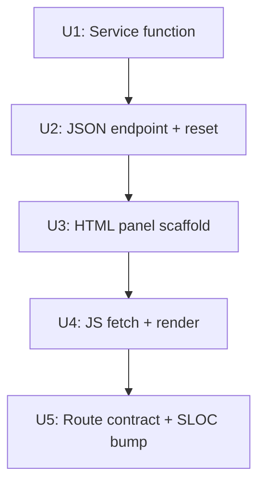

# feat: Keep-alive WebUI Cycle Metrics Panel

## Overview

Add a read-only "automated cycle status" panel to the existing `/ce:keep-alive` page. The panel shows the last automated `keepalive-run` execution: timestamp, cycle summary stats, per-platform health, and exhausted targets. This is R8 from plan004, deferred until the CLI treadmill (U1–U6) was shipped and had produced real cycle data.

## Problem Frame

`keepalive-run` (plan004 U1–U6) now runs daily at 06:30 via launchd and writes `keepalive_run_state.json`. That data is currently only accessible via the `keepalive-status` CLI command. The operator who opens the WebUI for a manual recheck should also see whether the automated treadmill is running healthy — did the last cycle find gaps, publish links, and verify them? Are any platforms circuit-broken? Are any targets exhausted?

Without this panel, the WebUI gives no indication that an automated recovery loop is running alongside the operator-triggered S1–S7 job flow.

**Gate override (2026-06-08):** plan004 U7 deferred with condition "run two weeks of automated cycles first." This plan overrides that gate. Rationale: the empty-state display ("No automated cycle has run yet") is itself useful — it tells the operator the treadmill has not run, which is actionable (load the plist, wait for next morning). The infrastructure (plist, `KeepaliveRunState`) is shipped; the panel's value does not require pre-existing cycle data.

## Requirements Trace

- R8 (from plan004): WebUI `/ce:keep-alive` shows automated cycle status panel alongside existing operator-triggered job flow
- R8a: Panel shows last automated cycle timestamp, gaps_found, published, reverified_alive, reverified_dead, exhausted_skipped
- R8b: Panel shows per-platform health (weight, circuit-broken flag)
- R8c: Panel shows exhausted targets (attempts >= MAX_RETRY) with a "reset" button
- R8d: Empty state when no cycle has run yet (no state file)

## Scope Boundaries

- **No new page** — panel added to existing `/ce:keep-alive` page, below the scorecard
- **Read-only** — except for the reset-exhausted action (operator-initiated, idempotent)
- **No polling** — cycle runs daily; a manual "refresh" button suffices (no WebSocket, no auto-poll)
- **No cycle history list** — show only the most recent cycle summary (no multi-run timeline)
- **No cycle trigger** — the panel does not expose a "run now" button (that belongs to a future plan; CLI `keepalive-run` is the trigger path)
- **S1–S7 job flow untouched** — existing recheck and republish UX is not modified
- **Security trade-off (known):** `GET /ce:keep-alive/cycle-status` is unauthenticated — exposes exhausted target URLs and platform weights. Acceptable for loopback-only (single-operator tool). With `BACKLINK_PUBLISHER_ALLOW_NETWORK=1`, this endpoint would expose the full target inventory to any network peer. Off-loopback auth is out of scope for this plan; treat as a deferred hardening item if the tool ever becomes multi-user.

## Context & Research

### Relevant Code and Patterns

**Existing keepalive page (the extension target):**
- `webui_app/routes/keep_alive.py` — Blueprint with GET `/ce:keep-alive` and 5 POST/GET endpoints. SLOC=76. Pattern: GET endpoint returns `_render(template, view=..., running_job=...)`.
- `webui_app/services/keep_alive.py` — `build_keepalive_view()` reads EventStore + builds scorecard dict. SLOC=97. The new `build_cycle_status_view()` function goes here.
- `webui_app/templates/keep_alive.html` — SSR bootstrap via `window.__keepAliveBootstrap` data island; `keep_alive.js` owns state transitions. New panel rendered client-side via async fetch.
- `webui_app/static/js/keep_alive.js` — 523 lines, ESM module. Imports `qs` from `lib/dom.js` and `postJson`, `fetchJson` from `lib/api.js`. New `loadCyclePanel()` function follows this established pattern.

**Data sources (shipped in plan004):**
- `src/backlink_publisher/keepalive/run_state.py::KeepaliveRunState` — `load()` returns `{version, last_run_at, last_cycle_summary, retry_counts}`. State file at `_config_dir() / "keepalive_run_state.json"`. Missing file → default state (no crash).
- `src/backlink_publisher/optimization/state.py::OptimizationState` — `get_weight(platform, default)`. Raw `load()` returns `{version, weights, stats, rules}` — no `"platforms"` key. The `platforms` list is assembled by `to_summary()` (same as `optimization_status.py` does at line 39). Same missing-file safety.

**Similar read-only status panels:**
- `webui_app/routes/optimization_status.py` + `templates/optimization_status.html` — server-rendered table showing platform weights. The cycle panel follows a similar shape but is client-side for refresh-without-reload.
- `webui_app/routes/survival_dashboard.py` + `templates/survival_dashboard.html` — read-only summary panel with a single GET route and no JS logic.

**JS async fetch pattern:**
- `webui_app/static/js/lib/api.js` exports `fetchJson`, `postJson`, and `readCsrf`. `keep_alive.js` already imports all three (line 10: `import { postJson, fetchJson } from './lib/api.js'`) and uses `fetchJson` throughout (lines 177, 351, 484). The cycle panel GET must use `fetchJson('/ce:keep-alive/cycle-status')` — consistent with the rest of the file. The reset POST must use `postJson('/ce:keep-alive/reset-exhausted', {target_url})` — it handles CSRF header, Content-Type, and non-JSON error normalization automatically. `equity.js` uses bare `fetch()` (it only imports `readCsrf`), but `keep_alive.js` is the correct reference here.

**Frontend anti-rot rules** (from CLAUDE.md — all must hold):
- No inline `on*` handlers → use `data-action="…"` + delegated `addEventListener`
- No `window.*` globals as API → use DOM CustomEvent for cross-component signals
- No untrusted `${…}` into innerHTML → `createElement`/`textContent`/`esc()`
- `readCsrf()` reads `<meta>` per call — only needed for state-changing POST (reset-exhausted)
- Every `url_for('static', …)` must include `v=asset_version`

**Reset-exhausted action:**
- `KeepaliveRunState.reset_exhausted(target_url)` — already exists from plan004 U4
- Requires a POST (state-changing) → needs CSRF token and Origin guard (same pattern as `/ce:keep-alive/recheck`)

### Institutional Learnings

- **webui-lives-at-repo-root-not-src**: `webui_app/` and `webui_store/` are at repo root; grep `-r src/` misses them.
- **feedback-flask-webui-no-reloader**: template changes need kill+restart; `getElementById` returns null until server restarts.
- **test_webui_route_contract.py SLOC currently failing on trunk**: radon SLOC=1150, ceiling=1148 — `tests/test_no_complexity_regrowth.py` is already red by 2 SLOC. Adding one assertion adds ~1 more SLOC. U5 must bump the ceiling (target: `round_up_to_10(1150 + 1 + 30)` = 1190) as its first action — the pre-existing failure must be healed in this PR.

## Key Technical Decisions

### Decision 1: Async client-side fetch, not SSR bootstrap

**Choice**: New GET `/ce:keep-alive/cycle-status` JSON endpoint; `keep_alive.js` fetches it after page load and populates `#cyclePanel`.

**Rationale**: The main page bootstrap already loads EventStore + derives ledger — adding another JSON file read to the SSR path adds latency for a section most operators scan only occasionally. Client-side fetch keeps initial load fast and allows a "refresh" button without page reload. The skeleton-to-content transition is visible but tolerable; a loading indicator must be shown immediately so operators on short-scorecard views do not see a blank area.

### Decision 2: Reset-exhausted as POST to the same endpoint family

**Choice**: `POST /ce:keep-alive/reset-exhausted` with `{"target_url": "…"}` body. Returns JSON `{"status": "ok"}` and the JS re-fetches `/cycle-status` to refresh the panel.

**Rationale**: Follows the existing `start_recheck` / `start_republish` shape (POST → 202 or 200, JSON body). Origin guard + CSRF consistent with other state-changing actions on this page. Simple request/response; no job polling needed (reset is synchronous).

### Decision 3: Service function in `services/keep_alive.py`, not a new module

**Choice**: `build_cycle_status_view(*, run_state=None, opt_state=None)` added to the existing `services/keep_alive.py`.

**Rationale**: The file is currently 97 SLOC — well below the ~500 threshold where extraction makes sense. The new function reads two stores and builds a dict; it belongs alongside `build_keepalive_view()` which already reads EventStore + OptimizationState. Creating a new `services/keepalive_cycle.py` for one 30-SLOC function is premature abstraction.

### Decision 4: Platform health read from OptimizationState directly, not via keepalive-status CLI subprocess

**Choice**: `build_cycle_status_view()` imports `OptimizationState` directly and reads platform weights in-process.

**Rationale**: Calling a subprocess for a WebUI request adds latency and process management complexity. The same pattern is already used in `webui_app/routes/optimization_status.py` which imports `OptimizationState` directly.

### Decision 5: Exhausted targets list capped at 20

**Choice**: If `retry_counts` has more than 20 entries at MAX_RETRY, show top 20 by `last_attempt_at` desc.

**Rationale**: In normal operation there should be 0–5 exhausted targets. A flood of exhausted targets suggests a platform-wide problem, which the circuit-breaker should catch first. A 20-item cap keeps the panel readable without truncation UX. The full list is available via `keepalive-status --json`.

## Open Questions

### Resolved During Planning

- **Should the panel be a tab or a section?** Section at bottom of the existing page. Tabs would require significant JS restructuring; a below-the-fold section is low-friction and keeps the primary S1–S7 flow unobstructed.
- **Should `build_cycle_status_view` also return the next scheduled run time?** No — launchd plist fires at 06:30 but the Python side has no way to know the next launchctl schedule without shelling out. Omit; the operator knows the schedule from the plist.
- **Does the route contract test need updating?** Yes — add one assertion for `GET /ce:keep-alive/cycle-status → 200`. This will increase the SLOC of `test_webui_route_contract.py`; bump its ceiling in `complexity_budget.toml` in the same PR.

### Deferred to Implementation

- Exact SLOC growth of `test_webui_route_contract.py` after adding the assertion — measure at implementation time and set the new ceiling.
- Whether `webui_app/services/keep_alive.py` SLOC after adding `build_cycle_status_view` exceeds 500 (the informal extraction threshold) — check at implementation and extract if warranted.

## High-Level Technical Design

> *This illustrates the intended approach and is directional guidance for review, not implementation specification. The implementing agent should treat it as context, not code to reproduce.*

```
GET /ce:keep-alive  (unchanged SSR)
  └─ HTML with #cyclePanel placeholder (hidden, skeleton)

  DOMContentLoaded: keep_alive.js calls loadCyclePanel()
    │
    ├─ GET /ce:keep-alive/cycle-status
    │    └─ build_cycle_status_view()
    │         ├─ KeepaliveRunState().load()  → last_run_at, cycle_summary, retry_counts
    │         └─ OptimizationState().to_summary()  → platform weights + stats
    │
    ├─ {has_data: false}  → render empty-state card ("No automated cycle has run yet")
    └─ {has_data: true}
         ├─ header: "Last automated cycle: <timestamp> — N gaps found, M published"
         ├─ Platform Health table: blogger weight=X.XX [CIRCUIT-BROKEN if weight=0]
         └─ Exhausted Targets list (if any): URL / attempts / last_outcome / [Reset] button

POST /ce:keep-alive/reset-exhausted  {target_url: "…"}
  → KeepaliveRunState().reset_exhausted(target_url)
  → 200 {status: "ok"}
  → JS re-fetches /cycle-status and re-renders panel
```

## Implementation Units



---

- [x] **Unit 1: `build_cycle_status_view()` in `services/keep_alive.py`**

**Goal**: Service function that reads `KeepaliveRunState` and `OptimizationState` and returns a clean dict for the cycle panel.

**Requirements**: R8a, R8b, R8c, R8d

**Dependencies**: None (foundational — reads existing plan004 stores)

**Files:**
- Modify: `webui_app/services/keep_alive.py`
- Test: `tests/test_keepalive_webui_cycle_panel.py` (new file)

**Approach:**
- Function signature: `build_cycle_status_view(*, run_state=None, opt_state=None) -> dict`
  - Both params injectable for tests (same pattern as `build_keepalive_view(*, store=None, history=None, now=None)`)
- Read `KeepaliveRunState().load()` (default if state file missing — no crash)
- Return `has_data=False` if `last_run_at` is None (no cycle has run)
- When `has_data=True`: populate `last_run_at`, `cycle_summary` dict, `platforms` list, `exhausted` list
- Platform list: call `opt_state.to_summary()` then iterate `summary["platforms"]` list (matching `optimization_status.py` line 39); for each platform include `name`, `weight` (float), `circuit_broken` (`weight == 0.0 and not locked` — `locked` is also in the `to_summary()` output; a locked platform at weight=0.0 is a manual hold, not a circuit-break), `locked` (bool), `alive_count`, `total_published`
- Exhausted list: entries in `retry_counts` where `attempts >= MAX_RETRY` (import `MAX_RETRY` from `backlink_publisher.keepalive.run_state`); cap at 20 by `last_attempt_at` desc — use sort key `lambda e: e.get('last_attempt_at') or ''` to handle `None` values (new entries have `last_attempt_at=None` before first `record_attempt()` call; Python 3 raises `TypeError` comparing `str` to `None`); fields: `target_url`, `attempts`, `last_attempt_at`, `last_outcome`, `platforms_tried`; include `exhausted_total` (int) as a top-level field with the full count before the cap so the UI can render "showing 20 of N"
- `KeepaliveRunState()` default constructor reads from `_config_dir()` — same as the CLI
- Import pattern: `OptimizationState` imported lazily inside `build_cycle_status_view()` function body (not at module top-level) — `from backlink_publisher.optimization.state import OptimizationState`. Full import path required; `backlink_publisher.keepalive.__init__` has no re-exports. Same for `KeepaliveRunState`: `from backlink_publisher.keepalive.run_state import KeepaliveRunState`.

**Patterns to follow:**
- `build_keepalive_view()` in same file — same injectable dependency pattern (inject both state objects for test isolation, matching `store=None, history=None, now=None`)
- `webui_app/routes/optimization_status.py` — lazy `from backlink_publisher.optimization import OptimizationState` inside the route handler (not at module top-level), wrapped in try/except to degrade gracefully rather than 500
- Test pattern: no monkeypatching of `build_cycle_status_view` — tests pass injectable `run_state` and `opt_state` objects directly (same approach as `test_webui_keep_alive_status.py` which injects `store=EventStore(path=tmp_path/...)`). For route-level tests, use `create_app().test_client()` directly. CSRF disabled via `disable_csrf` pytest fixture (non-autouse, request it on tests that POST).

**Note on CLI/WebUI divergence:** The `cli/keepalive_status.py` `--reset-exhausted` and this WebUI `POST /reset-exhausted` both call `KeepaliveRunState.reset_exhausted()` — the shared source of truth is the store method, not a shared derivation function. The status display logic (building the `exhausted` list, computing `exhausted_total`, reading opt_state weights) is intentionally duplicated between the CLI and this service function. The store method is the canonical point; display formatting can diverge. If the store schema changes, both must update — that is the only required parity.

**Test scenarios:**
- Happy path: `run_state` with `last_run_at` set, `last_cycle_summary` with all fields, two platforms in opt_state → `has_data=True`, platforms list has both, cycle_summary matches
- Empty state: `run_state` with `last_run_at=None` → `has_data=False`, platforms and exhausted are empty lists (not None)
- Missing opt_state file: platforms list is empty (no crash); `has_data` still based on `last_run_at`
- Circuit-broken platform: platform with `weight=0.0` → `circuit_broken=True` in output
- Exhausted targets: retry_counts with 1 entry at `attempts=3 >= MAX_RETRY=3` → appears in `exhausted` list
- Exhausted cap: retry_counts with 25 entries all exhausted → `exhausted` list has 20 (most recent), `exhausted_total=25`; 5 are silently excluded but count is visible
- Non-exhausted targets: entry with `attempts=2 < MAX_RETRY=3` → NOT in `exhausted` list; `exhausted_total` reflects only those at or above MAX_RETRY
- Both cycle_summary missing fields and partial opt_state: returns sensible defaults (0 or empty), never KeyError

**Verification**: `pytest tests/test_keepalive_webui_cycle_panel.py::TestBuildCycleStatusView` green

---

- [x] **Unit 2: JSON endpoints in `routes/keep_alive.py`**

**Goal**: `GET /ce:keep-alive/cycle-status` and `POST /ce:keep-alive/reset-exhausted` routes.

**Requirements**: R8a–R8d (data serving), R8c (reset action)

**Dependencies**: U1 (service function must exist)

**Files:**
- Modify: `webui_app/routes/keep_alive.py`
- Test: `tests/test_keepalive_webui_cycle_panel.py` (same file as U1)

**Approach:**
- `GET /ce:keep-alive/cycle-status` → call `build_cycle_status_view()` → `jsonify(view)`, 200. No auth, no CSRF (read-only).
- `POST /ce:keep-alive/reset-exhausted` → `_check_bind_origin_or_abort()` (Origin guard, **defense-in-depth** — the app-level `_global_origin_guard` in `create_app()` already fires on every POST before blueprint handlers; the per-route call matches the pattern in `start_recheck()` and `recheck_cancel()`); parse `request.get_json(silent=True)["target_url"]`; validate non-empty string; call `KeepaliveRunState().reset_exhausted(target_url)` and capture the boolean return — `was_present = target_url in state.data["retry_counts"]` before calling (or check post-call); return `jsonify({"status": "ok", "was_present": was_present})`, 200. Return 400 if `target_url` missing or empty. JS should display "此目標已不在清單中" if `was_present=false`. Deferred hardening: add flask-limiter 10 resets/min and validate `target_url` exists in store before deletion (currently accepted as-is for single-operator localhost; defer to a future security hardening PR).
- Import `KeepaliveRunState` lazily inside route handlers using `from backlink_publisher.keepalive.run_state import KeepaliveRunState` (lazy import pattern, matching `optimization_status.py` which imports `OptimizationState` inside handlers).

**Patterns to follow:**
- `recheck_status()` in same file — GET → jsonify, abort(404) on miss
- `start_recheck()` — Origin guard, UsageError → 409 pattern
- Import: `from ..services.keep_alive import build_keepalive_view, build_cycle_status_view` (same relative import pattern as the existing service import on line 21)

**Test scenarios:**
- Happy path GET: `build_cycle_status_view()` returns `has_data=True` → response status 200, JSON body has `has_data: true`
- Empty state GET: state missing → response 200, `has_data: false` in JSON
- GET needs no CSRF: GET without csrf header still returns 200 (confirm it's a safe GET)
- POST reset valid: `{"target_url": "https://example.com/page"}` with CSRF → 200 `{"status": "ok"}`
- POST reset missing target_url: `{}` body → 400
- POST reset without Origin guard: no Origin header → 403 (verify Origin guard fires on POST)
- Integration: GET after POST reset → the target no longer appears in `exhausted` list

**Verification**: `pytest tests/test_keepalive_webui_cycle_panel.py::TestCycleStatusRoutes` green; `GET /ce:keep-alive/cycle-status` returns valid JSON with `curl localhost:8888/ce:keep-alive/cycle-status`

---

- [x] **Unit 3: HTML panel scaffold in `keep_alive.html`**

**Goal**: Add the `#cyclePanel` placeholder div and the "Reset exhausted" confirm mini-modal to the template.

**Requirements**: R8a–R8d (rendering surface)

**Dependencies**: U2 (endpoint must exist for JS to call)

**Files:**
- Modify: `webui_app/templates/keep_alive.html`

**Approach:**
- Add `<section id="cyclePanel" class="mt-4">` after `#scorecard`'s closing `</div>` (at the bottom of the main content block). Note: in the actual template, `#emptyState` is rendered **before** `#scorecard` — so "after scorecard" means after the scorecard div, not between scorecard and emptyState. Initially `d-none`; JS shows it after fetch. Show a `#cycleLoading` spinner immediately on page load (visible by default inside `#cyclePanel`) so operators on a fresh-install or empty scorecard view see feedback while the fetch is in flight.
- Structure inside `#cyclePanel`:
  - A card header: "自动保活周期" with a `<button id="cyclePanelRefresh" data-action="refresh-cycle">刷新</button>`
  - Empty-state div (`#cycleEmpty`) and populated-state div (`#cycleContent`) — JS toggles between them
  - `#cycleContent` contains: last-run line, cycle summary dl, platform health table (`#cyclePlatformTable tbody`), exhausted list (`#cycleExhaustedList`)
- Add `data-action="reset-exhausted"` buttons inside the exhausted list rows (populated by JS)
- Add a small inline confirm mini-modal for reset (`#cycleResetConfirm`) — shows "Reset 此目标?" with Confirm/Cancel. Follows same CSS shape as the existing `#confirmOverlay` (fixed position, semi-transparent backdrop). **Use a distinct z-index (1090)** to avoid stacking conflict with `#confirmOverlay` (z-index 1080). Add `role="dialog"` and `aria-modal="true"` and `aria-labelledby="cycleResetConfirmTitle"` to the modal element; add a `<span id="cycleResetConfirmTitle">` with the confirm text. JS: move focus to Confirm button on open; add Escape-key handler to close.
- Add `aria-live="polite"` and `aria-atomic="false"` to `#cyclePanel` — panel is populated asynchronously; screen readers need to be notified when content appears.
- No inline `on*` handlers — all interaction via `data-action` + delegated listener in JS
- No separate CSS file — add panel styles in the existing `<style>` block in ``

**Patterns to follow:**
- Existing `#republishPanel` card structure in same template — card with header + body
- `#confirmOverlay` mini-modal structure — reuse the `ka-overlay` / `ka-overlay-card` CSS classes

**Test scenarios:**
- Test expectation: Template renders — covered by the route contract test GET assertion (U5) and the route test in U2; no separate template-only test needed for static structure.

**Verification**: `python webui.py` → open `/ce:keep-alive` → `#cyclePanel` exists in DOM; browser console shows no errors on load

---

- [x] **Unit 4: JS fetch + render in `keep_alive.js`**

**Goal**: `loadCyclePanel()` function that fetches `/ce:keep-alive/cycle-status`, renders the panel, and handles reset-exhausted interactions.

**Requirements**: R8a–R8d (client-side rendering)

**Dependencies**: U2 (endpoint), U3 (DOM structure)

**Files:**
- Modify: `webui_app/static/js/keep_alive.js`

**Approach:**
- Add `loadCyclePanel()` at module scope; call it at end of module init (after `renderScorecard()` and recheck-job rehydration).
- Fetch pattern: `const data = await fetchJson('/ce:keep-alive/cycle-status')` — use the already-imported `fetchJson` from `lib/api.js` (same pattern as `fetchJson` calls at lines 177, 351, 484 of this file). `fetchJson` throws on non-JSON responses, making error handling simpler. Wrap in try/catch: on error, show error in `#cyclePanel` (non-fatal). Hide `#cycleLoading` spinner in all exit paths (success, empty state, error).
- If `data.has_data === false`: show `#cycleEmpty` with text "暂无自动周期记录。请确认 launchd plist 已加载（每日 06:30）。"; hide `#cycleContent`; show `#cyclePanel` (remove `d-none`).
- If `data.has_data === true`:
  - Last-run line: write a `formatLastRun(isoStr)` helper (does not exist in the codebase — must be written). Format: display in browser local time as `"YYYY-MM-DD HH:MM"` using `new Date(isoStr).toLocaleString('zh-CN', {hour12: false, ...})` — stored UTC, but operator's launchd fires at 06:30 local, so local display is more useful than UTC. Existing `freshnessLine` rendering in the file uses a raw `.slice(0,16)` without timezone conversion — do NOT follow that pattern here.
  - Cycle summary: create `<dl>` rows for `gaps_found`, `published`, `reverified_alive`, `reverified_dead`, `exhausted_skipped`
  - Platform health: one row per platform — `name`, `weight` (2dp), circuit-broken badge if `circuit_broken=true`; use `textContent` only
  - Exhausted list: one `<li>` per entry — target URL (truncated with `truncMiddle()`), attempts badge, reset button with `data-action="reset-exhausted"` and `data-target-url` attribute; if `data.exhausted_total > data.exhausted.length`, render "（显示 N / T 个，其余请用 keepalive-status CLI 查看）"; if list is empty, show "（暂无耗尽目标）"
  - Show `#cycleContent`, hide `#cycleEmpty`, show `#cyclePanel`
- Reset flow: delegated listener on `#cyclePanel` catches `data-action="reset-exhausted"` clicks → show `#cycleResetConfirm`; set confirm text target URL via `textContent` (never `innerHTML`); disable Confirm button immediately on click; POST via `postJson('/ce:keep-alive/reset-exhausted', {target_url})` (already imported — handles CSRF header, Content-Type, error normalization automatically); on success: close confirm, call `loadCyclePanel()` again; on failure: close confirm, show inline error in `#cyclePanel`, do NOT re-fetch (reset did not complete). Re-enable Confirm button only on POST failure.
- Refresh button (`data-action="refresh-cycle"`) calls `loadCyclePanel()`. Guard against concurrent calls: set `#cyclePanelRefresh` to `disabled` at the start of `loadCyclePanel()` and re-enable after fetch resolves (success or error) — mirrors how `#republishBtn` is disabled during async ops.
- No `window.*` globals — no new cross-component signals needed (panel is self-contained).
- All string content via `textContent`, never `innerHTML` with untrusted data.

**Patterns to follow:**
- `keep_alive.js` `fetchJson` calls (lines 177, 351, 484) — use for GET
- `keep_alive.js` `postJson` calls — use for POST reset (handles CSRF + error normalization)
- `keep_alive.js` existing recheck/republish delegated listener pattern — `data-action` on elements, single top-level `addEventListener('click', handler)` on a parent
- `truncMiddle()` already defined in same file — reuse for target URLs
- Disable/re-enable button pattern: see `#republishBtn` disable pattern in same file

**Test scenarios:**
- Test expectation: none — `keep_alive.js` is a browser ES module; no node/jsdom test harness exists in this repo. Functional coverage comes from the route test (U2) and manual verification. Document this explicitly.

**Verification**: `python webui.py` → open `/ce:keep-alive` → cycle panel appears; with `keepalive_run_state.json` present: panel shows last run stats; without file: "暂无自动周期记录" message; reset button flow works end-to-end

---

- [x] **Unit 5: Route contract assertion + SLOC ceiling bump**

**Goal**: Add `GET /ce:keep-alive/cycle-status → 200` to the route contract test and bump the `complexity_budget.toml` SLOC ceiling to cover the added line.

**Requirements**: Compliance with project gate — every route must appear in `test_webui_route_contract.py`; every SLOC growth must be accompanied by a ceiling bump.

**Dependencies**: U2 (route must exist)

**Files:**
- Modify: `tests/test_webui_route_contract.py`
- Modify: `complexity_budget.toml` (`[test_files."tests/test_webui_route_contract.py"]`)

**Approach:**
- Add one assertion in the existing keep_alive contract class (near line 1256 where other keepalive routes are tested): `assert client.get("/ce:keep-alive/cycle-status").status_code == 200`
- At implementation time: measure new SLOC with `python -m radon raw -s tests/test_webui_route_contract.py`; set ceiling to `round_up_to_10(new_SLOC + 30)` (ratchet policy); update rationale with mention of cycle-status route.
- Current ceiling is 1148 but file SLOC already exceeds it (pre-existing failure from plan004 MR). The bump in this PR must set the ceiling to `round_up_to_10(actual_current_SLOC + delta + 30)` — not just the old 1148 + delta. This PR heals the pre-existing failure at the same time.

**Patterns to follow:**
- Lines 1255–1266 of `test_webui_route_contract.py` — existing keepalive route assertions

**Test scenarios:**
- Happy path: `client.get("/ce:keep-alive/cycle-status")` returns 200 (mocked `build_cycle_status_view` returns `{"has_data": False, "platforms": [], "exhausted": []}`)

**Verification**: `pytest tests/test_webui_route_contract.py::TestKeepAlive -v` green; `pytest tests/test_no_complexity_regrowth.py` green (no SLOC ceiling violation)

## System-Wide Impact

- **Interaction graph**: `GET /ce:keep-alive/cycle-status` reads two JSON files (`keepalive_run_state.json`, `optimization_state.json`) in-process. No EventStore access. No writes on GET. No callbacks or observers triggered.
- **Error propagation**: File read errors on both state files are absorbed by `KeepaliveRunState.load()` and `OptimizationState.load()` (both return safe defaults). The route catches no exceptions — the service is safe to call naked. `POST /ce:keep-alive/reset-exhausted` failure is surfaced as a JSON error response; JS shows inline error in the panel.
- **Cross-process read race**: `KeepaliveRunState.load()` reads the JSON file while `keepalive-run` (separate process) may be writing it via atomic tempfile-rename. The threading.Lock in `KeepaliveRunState` is instance-scoped and provides no cross-process protection. The same accepted race exists in `OptimizationState` reads in `/optimization-status`. In practice: `keepalive-run` completes its atomic rename before the next request reads the file; the window is milliseconds. Accepted as-is — matches existing precedent.
- **State lifecycle risks**: `KeepaliveRunState.reset_exhausted()` uses threading.Lock internally (plan004 U4). The WebUI GET endpoint reads state while `keepalive-run` may be writing — accepted race (read returns a slightly stale view; the client can refresh). No double-write risk (reset is remove-by-key, not increment).
- **API surface parity**: `keepalive-status` CLI (plan004 U5) and this WebUI panel expose the same data from the same stores. No new parity requirement — the CLI is the authoritative interface; the panel is a convenience view. If `KeepaliveRunState` schema changes, both must update.
- **Integration coverage**: the full flow (cycle runs → `keepalive_run_state.json` updated → WebUI panel reflects new data) is covered by the service unit test with injectable mocks. End-to-end (real file, real fetch) is verified manually.
- **Unchanged invariants**: S1–S7 job flow (`keep_alive.html` action states, `keepalive_job.py`, `keepalive_registry`) is not modified. `build_keepalive_view()` is not modified. Existing `/ce:keep-alive` route response is not modified (no new fields in SSR bootstrap).

## Risks & Dependencies

| Risk | Mitigation |
|------|------------|
| `test_webui_route_contract.py` SLOC **currently failing on trunk** (1150 > ceiling 1148) — U5 must heal this, not just add to it | Pre-compute target ceiling: `round_up_to_10(1150 + 1 + 30)` = **1190**. Set at start of PR; confirm actual SLOC after adding assertion and adjust if needed. |
| `keep_alive.js` will exceed 600 lines — adding ~80-120 lines pushes file to 600-643 | Extract `cycle-panel.js` as a sub-module. Define boundary: `cycle-panel.js` owns `loadCyclePanel`, `renderCyclePanel`, and reset action handler; `keep_alive.js` imports and calls `loadCyclePanel()` at init. Treat as required, not optional. |
| `webui_app/services/keep_alive.py` at 97 SLOC — adding `build_cycle_status_view` may push it past 150 | 97 + ~35 = ~132 SLOC estimated. Still well under 500 (the informal threshold). Not monolith-budget listed; no gate to manage. |
| `OptimizationState.load()` returns `{weights, stats, rules, version}` — no `"platforms"` key; `circuit_broken` is not stored | Use `opt_state.to_summary()["platforms"]` (mirrors `optimization_status.py` line 39); derive `circuit_broken = (weight == 0.0 and not locked)`; `locked` is in `to_summary()` output |
| No automated JS test coverage | Accepted — no jsdom harness in project. Document the gap; cover the service layer and route layer in Python tests. |

## Documentation / Operational Notes

- After plist is loaded (`launchctl load ~/Library/LaunchAgents/com.dex.bp-keepalive.plist`), the cycle panel will populate the next morning after 06:30.
- Until the first cycle completes, the panel shows the empty-state message — this is correct behavior.
- The pre-existing SLOC failure in `test_webui_route_contract.py` is healed by this PR (U5 explicitly addresses it).

## Sources & References

- **Origin document:** [docs/plans/2026-06-05-004-feat-keepalive-recovery-loop-plan.md](docs/plans/2026-06-05-004-feat-keepalive-recovery-loop-plan.md) (R8 / U7 deferred)
- `webui_app/routes/keep_alive.py` — extension target (GET handler patterns)
- `webui_app/services/keep_alive.py` — extension target (injectable service pattern)
- `webui_app/templates/keep_alive.html` — extension target (panel scaffold)
- `webui_app/static/js/keep_alive.js` — extension target (delegated listener, fetchJson pattern)
- `src/backlink_publisher/keepalive/run_state.py` — `KeepaliveRunState` (plan004 U4)
- `src/backlink_publisher/optimization/state.py` — `OptimizationState` (plan001)
- `webui_app/routes/optimization_status.py` — pattern for reading OptimizationState in WebUI route
- `webui_app/static/js/keep_alive.js` — `fetchJson`/`postJson` pattern (lines 177, 351, 484); delegated listener; disable/re-enable button pattern
