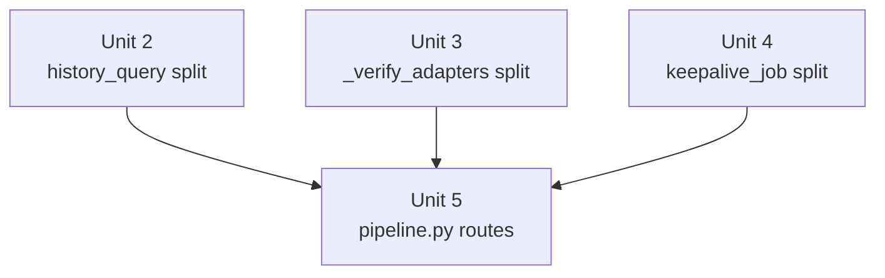

# refactor: Architecture Split — God-File Decomposition Wave 3

## Overview

Five unmonitored or ceiling-near modules have accumulated mixed responsibilities beyond their intended scope. This plan applies the established split patterns (A–E) from previous waves to the remaining hotspots, reducing each file to a single coherent responsibility and adding monolith-budget entries where absent.

## Problem Frame

Wave 1 and Wave 2 splits (2026-05–06) decomposed the core pipeline CLI files and event reducers. Several high-SLOC, high-CC modules were left unmonitored and have since grown further:

- `cli/spray_backlinks/core.py` (494 SLOC, CC 65) — largest unmonitored CLI file; main() is by far the most complex function in the codebase with CC 65
- `events/history_query.py` (465 SLOC) — mixes read-path queries, write-path mutations, and per-row verdict assembly in a single file; `_build_history_item` sits at CC 30, exactly on the backstop boundary
- `publishing/_verify_adapters.py` (446 SLOC) — bundles setup-time capability checks (`_check_*_setup`) and runtime live probes (`_verify_*_live`) that have independent callers and test contexts
- `webui_app/services/keepalive_job.py` (533 SLOC) — the largest service file; mixes background-job scheduling scaffolding with the keepalive execution loop
- `webui_app/routes/pipeline.py` (418 SLOC, five route functions with CC 12–25) — a single route file holds the entire WebUI pipeline surface (plan, generate, validate, publish, regen-body)

No file in Wave 3 should be split beyond what reduces its SLOC to a clearly bounded responsibility. This is not a rewrite — only well-established split patterns apply.

## Requirements Trace

- R1. Each split must follow an established pattern from monolith_budget.toml history (patterns A–E)
- R2. After each split, the source file's SLOC must be measurably lower; extracted module must have a clear single responsibility
- R3. New and modified files must receive `monolith_budget.toml` ceiling entries (ceiling = round_up_to_10(SLOC + 30))
- R4. All existing tests must continue to pass; re-exports keep backward compatibility where tests import from the source module
- R5. No adapter registry changes; no CLI argument changes; no WebUI route URL changes
- R6. CC-budget entries must be added or updated for any function that changes CC as a result of the split: for each new function created by the split with CC ≥ 31, add a complexity_budget.toml entry with ceiling = exact post-split CC (zero headroom per convention); for any existing function whose CC increased, add or update its entry; if a split reduces a named function below its existing ceiling, re-tighten or remove the entry in the same PR

## Scope Boundaries

- No behavior changes — only responsibility separation and file organization
- No changes to `schema.py` or any adapter's `register()` call; `pyproject.toml` may be updated only if the spray_backlinks entrypoint path changes as a result of Unit 1 (verify the path after conversion — update if needed, leave untouched if already correct)
- WebUI route URLs remain identical after `pipeline.py` decomposition (routes registered to same URL path via blueprint refactor)
- `events/_project_reducers.py` (593 SLOC, ceiling 620) is **not** in scope here — it is already monitored and headroom exists; defer to a future wave

## Context & Research

### Relevant Code and Patterns

- **Pattern A (argparse shell + pure kernel):** `cli/validate_backlinks.py` + `validate/engine.py` — shell holds argparse + config load; engine holds callable kernel re-used by PipelineAPI
- **Pattern B (CLI layer split):** `cli/plan_check.py` + `_plan_check_schema.py` / `_plan_check_git.py` / `_plan_check_format.py` — 3-tier by domain: schema, git, output
- **Pattern D (reducer extraction):** `events/projector.py` → `events/_project_reducers.py` — thin dispatch shell (75 SLOC) + fat extracted module
- **Pattern E (package conversion):** `cli/plan_backlinks.py` → `cli/plan_backlinks/` package with `core.py`, `_engine.py`, `_payload.py`, `_links.py`, `_zh_short.py`
- **Ceiling policy:** `round_up_to_10(current_SLOC + 30)` per monolith_budget.toml convention
- **Re-export policy:** source module re-exports names that existing tests import (`_publish_helpers.py` precedent)
- **WebUI blueprint registration:** `webui_app/__init__.py` registers blueprints via `create_app()` factory — route URL stays identical after splitting to sub-modules

### Institutional Learnings

- `docs/plans/2026-05-19-*`: argparse-shell + kernel split avoids import-time side effects and enables in-process PipelineAPI reuse
- `docs/plans/2026-05-27-*`: event reducer extraction — keep the dispatch function in the original file; only the reducer bodies move
- From `_publish_helpers.py` split (2026-06-01): tests patch at the module where mock seams live — never move a function that is explicitly patched in a test without updating the test's patch target

## Key Technical Decisions

- **spray_backlinks: Package conversion (Pattern E), not further function extraction within core.py.** Rationale: main() at CC 65 has interdependent gate-eval/dispatch/checkpoint state that makes sub-function extraction risky without tests covering the control flow. Converting to a package (`spray_backlinks/__init__.py` thin shell + `_engine.py` per-seed loop body + `_gates.py` gate eval) bounds scope at the file level, matching the established precedent for plan_backlinks.
- **history_query: Read / write split (new Pattern F), not reducer-style extraction.** Rationale: query functions (`list_*`, `count_*`) and mutation functions (`update_status`, `bulk_delete`, `purge_failed`) are independently called by webui_store and events layers. A read/write split (new `_history_mutations.py`) is cleaner than a "thick/thin" reducer extraction.
- **_verify_adapters: Two-file split by caller context (Pattern B).** Rationale: setup checks (`_check_*_setup`) are called only at credential-bind time; live probes (`_verify_*_live`) are called at publish time. Separate callers justify separate files: `_verify_setup.py` + `_verify_live_probes.py`. `_verify_adapters.py` becomes a thin re-exporting façade for backward compat.
- **keepalive_job: Job-shell / execution-engine split (Pattern A variant).** Rationale: `keepalive_job.py` mixes Flask-APScheduler job registration scaffolding (timing, locking, error reporting) with the keepalive execution logic (per-channel retry, credential refresh). Extract `_keepalive_engine.py` for the execution logic; keep job scaffolding in `keepalive_job.py`.
- **pipeline.py routes: Sub-module split within the same Flask blueprint (Pattern E variant).** Rationale: the five route functions (plan, generate, validate, publish, regen) are logically grouped by phase; they share the same blueprint and URL prefix, so extracting to `routes/pipeline_plan.py`, `routes/pipeline_publish.py` etc. keeps URL surface identical while halving file size per sub-module.

## Open Questions

### Resolved During Planning

- **Is `spray_backlinks/` already a package?** Yes — confirmed by feasibility research: `__init__.py`, `_engine.py`, `_dispatch.py`, `_draft.py`, `_audit.py` all exist. Unit 1 scope is therefore scoped to extracting `_gates.py` from `core.py`, not a full package conversion. The entrypoint already resolves correctly.

### Deferred to Implementation

- **Exact function boundaries within spray_backlinks/core.py:** The CC 65 main() decomposition is directional; implementer should identify the gate/idempotency cluster by reading current core.py and the existing _engine.py to avoid duplication
- **Whether `_build_history_item` in history_query.py should have a CC budget entry after split:** Add entry only if CC ≥ 31 post-split; measure immediately after Unit 2 completes
- **Do any tests patch functions inside `_verify_adapters.py` directly?** Run `grep -r "patch.*_verify_adapters"` as the first step of Unit 3; enumerate all results; re-target each to the concrete module path (`_verify_setup` or `_verify_live_probes`) in the same PR — re-exports do not fix `unittest.mock.patch` targets

## High-Level Technical Design

> *This illustrates the intended approach and is directional guidance for review, not implementation specification. The implementing agent should treat it as context, not code to reproduce.*

```
Wave 3 Split Summary
────────────────────────────────────────────────────────────

Unit 1: spray_backlinks package conversion
  core.py (494 SLOC, CC 65)
  ─────────────────────────────────
  spray_backlinks/
    __init__.py      ← thin shell: entrypoint re-export
    core.py          ← argparse + top-level state wiring (~100 SLOC)
    _engine.py       ← per-seed dispatch loop body
    _gates.py        ← gate eval / cross-seed idempotency

Unit 2: events/history_query.py read/write split
  history_query.py (465 SLOC) ──► query layer (list_*, count_*)
                                   _history_mutations.py (update_status, bulk_delete, purge_failed)

Unit 3: publishing/_verify_adapters.py two-file split
  _verify_adapters.py (446 SLOC) ──► _verify_setup.py (setup checks, bind-time)
                                      _verify_live_probes.py (live probes, publish-time)
                              façade: _verify_adapters.py (re-exports only, ~30 SLOC)

Unit 4: webui_app/services/keepalive_job.py job/engine split
  keepalive_job.py (533 SLOC) ──► keepalive_job.py (job scaffold, ~100 SLOC)
                                   _keepalive_engine.py (per-channel loop, ~400 SLOC)

Unit 5: webui_app/routes/pipeline.py route decomposition
  pipeline.py (418 SLOC, 5 routes) ──► pipeline_plan.py   (ce_plan, ce_generate)
                                        pipeline_publish.py (ce_publish, ce_publish_chain)
                                        pipeline_regen.py   (ce_regen_body)
                                        pipeline.py         (blueprint factory + imports only)
```

## Implementation Units



> Units 1–4 are independent of each other and can land in any order. Unit 5 depends on Units 2–4 completing first only to avoid conflicting imports if they touch shared helpers. In practice all 5 can be worked in parallel branches.

---

- [ ] **Unit 1: Reduce `spray_backlinks/core.py` by extracting gate/idempotency cluster into `_gates.py`**

**Goal:** Reduce main() CC from 65 to under 30 by extracting the cross-seed idempotency and gate-eval cluster into a new `_gates.py`; add SLOC ceiling for `core.py` and `_gates.py`

**Context:** `spray_backlinks/` is already a package (prior wave) with `__init__.py` (re-exports `main`), `_engine.py` (expand_seed, gate_candidates, validate_platform_selection), `_dispatch.py`, `_draft.py`, `_audit.py`. `pyproject.toml` entrypoint already resolves to `backlink_publisher.cli.spray_backlinks:main`. The remaining work is to extract what is still in `core.py` that drives main()'s CC 65.

**Requirements:** R1 (Pattern E variant), R2, R3, R6

**Dependencies:** None

**Files:**
- Modify: `src/backlink_publisher/cli/spray_backlinks/core.py` (shrink: extract gate/idempotency cluster, keep argparse + top-level loop invocation + output serialization)
- Create: `src/backlink_publisher/cli/spray_backlinks/_gates.py` (cross-seed idempotency decisions, checkpoint helpers)
- Modify: `monolith_budget.toml` (add ceiling for `core.py` and `_gates.py`; ceiling = round_up_to_10(SLOC + 30))
- Modify: `complexity_budget.toml` (the existing `core.py::main` entry has ceiling=65 with rationale opposing decomposition — this rationale is superseded by Wave 3; re-tighten ceiling to exact post-split CC; if post-split CC < 30 remove the entry entirely)
- Test: `tests/test_spray_backlinks*.py` — run `grep -r "patch.*spray_backlinks"` to confirm patch target paths; update any that reference functions now in `_gates.py`

**Approach:**
- Before splitting: `grep -r "import.*spray_backlinks\|from.*spray_backlinks"` across `src/`, `tests/`, `webui_app/` to enumerate all non-entrypoint import surfaces — update any that break after the split
- Move cross-seed idempotency state and checkpoint decision functions into `_gates.py`
- `core.py` retains argparse, `load_config`, top-level loop call, output serialization
- The existing `_engine.py` already holds expand/gate cluster — do not duplicate

**Patterns to follow:**
- `cli/plan_backlinks/core.py` + `_engine.py` — same shape (thin core.py calling extracted sub-modules)
- `complexity_budget.toml`: zero headroom convention for ceiling updates

**Test scenarios:**
- Happy path: `spray-backlinks` CLI entrypoint resolves and runs (smoke test)
- Happy path: existing `test_spray_backlinks_*` tests pass without modification
- Edge case: all `from backlink_publisher.cli.spray_backlinks.*` import paths resolve correctly after split
- Integration: spray produces same JSONL output as before (output parity)

**Verification:**
- `main()` CC ≤ 30 as measured by radon
- `core.py` SLOC ≤ 130
- `_gates.py` SLOC ≤ 160
- `complexity_budget.toml` entry for main() updated or removed
- All spray_backlinks tests green

---

- [ ] **Unit 2: Split `events/history_query.py` into read layer + mutation layer**

**Goal:** Separate read-path query functions from write-path mutation functions; add SLOC ceiling for both resulting files; prevent `_build_history_item` (CC 30) from growing undetected

**Requirements:** R1 (Pattern B variant), R2, R3, R6

**Dependencies:** None

**Files:**
- Modify: `src/backlink_publisher/events/history_query.py` (keep read-path: list_*, count_*, _build_history_item)
- Create: `src/backlink_publisher/events/_history_mutations.py` (write-path: update_status, bulk_delete, purge_failed)
- Modify: `monolith_budget.toml` (add ceiling for `events/history_query.py` and `events/_history_mutations.py`)
- Modify: `complexity_budget.toml` (add entry for `_build_history_item` if CC ≥ 31 post-split; otherwise omit)
- Test: `tests/test_history_query*.py`, `tests/test_history_mutations*.py`

**Approach:**
- Identify all callers of mutation functions via `grep -r "from.*history_query import\|history_query\."` — update imports in `webui_store/` and `events/` callers
- `history_query.py` re-exports mutation names for backward compat during transition
- After all callers updated, remove re-exports in a follow-up (deferred — out of scope for this unit)

**Patterns to follow:**
- `events/projector.py` + `events/_project_reducers.py` split precedent (thin shell + extracted module)
- Re-export pattern from `cli/_publish_helpers.py`

**Test scenarios:**
- Happy path: `list_history()`, `list_events()` return correct rows after split
- Happy path: `update_status()`, `bulk_delete()` called from webui_store/history.py path succeed
- Edge case: caller importing `update_status` from `history_query` still resolves via re-export
- Integration: WebUI history page renders correct data after refactor (route→store→query chain)

**Verification:**
- `events/history_query.py` SLOC ≤ 270 (read-path only)
- `events/_history_mutations.py` SLOC ≤ 230 (mutation-path only)
- Both files have monolith_budget.toml entries

---

- [ ] **Unit 3: Split `publishing/_verify_adapters.py` into setup-checks + live-probes**

**Goal:** Separate bind-time setup checks from publish-time live probes; allow each to evolve independently; add SLOC ceilings for both new files

**Requirements:** R1 (Pattern B), R2, R3, R4

**Dependencies:** None — independent of Units 1 and 2

**Files:**
- Create: `src/backlink_publisher/publishing/_verify_setup.py` (setup checks: `_check_*_setup` functions)
- Create: `src/backlink_publisher/publishing/_verify_live_probes.py` (live probes: `_verify_*_live` functions)
- Modify: `src/backlink_publisher/publishing/_verify_adapters.py` (façade: re-exports from both new files, ~30 SLOC)
- Modify: `monolith_budget.toml` (add ceilings for `_verify_setup.py` and `_verify_live_probes.py`; update or remove entry for `_verify_adapters.py`)
- Test: `tests/test_verify_adapters*.py` (patch targets may need updating)

**Approach:**
- Audit test patch targets: `grep -r "patch.*_verify_adapters"` before moving any function
- Setup checks are called from `publishing/adapters/_setup_checks.py` and credential-bind paths — verify with import grep
- Live probes are called from `cli/publish_backlinks/_engine.py` and `cli/_publish_helpers.py` verify paths
- Keep `_verify_adapters.py` as a stable public name (backward compat) with pure re-exports

**Patterns to follow:**
- `cli/plan_check.py` → three-tier split (schema / git / output) — same logic applies here (setup / live / façade)

**Test scenarios:**
- Happy path: `_check_medium_setup()` still importable from `_verify_adapters` (re-export works)
- Happy path: `_verify_medium_live()` called from publish path resolves correctly
- Edge case: any `unittest.mock.patch("backlink_publisher.publishing._verify_adapters.*")` test still patches the right function (verify patch targets resolve through re-export)
- Integration: `verify-dofollow` CLI produces same output after split

**Verification:**
- `_verify_setup.py` SLOC ≤ 250
- `_verify_live_probes.py` SLOC ≤ 260
- `_verify_adapters.py` SLOC ≤ 50 (façade only)

---

- [ ] **Unit 4: Split `webui_app/services/keepalive_job.py` into job shell + execution engine**

**Goal:** Separate Flask-APScheduler scaffolding (job registration, locking, error reporting) from the keepalive execution loop (per-channel retry, credential refresh); reduce the largest service file to ≤ 150 SLOC

**Requirements:** R1 (Pattern A variant), R2, R3

**Dependencies:** None — independent

**Files:**
- Modify: `webui_app/services/keepalive_job.py` (keep: job registration, APScheduler wiring, top-level error trap, ~130 SLOC)
- Create: `webui_app/services/_keepalive_engine.py` (per-channel retry loop, credential-refresh logic, ~380 SLOC — note: ceiling 420 is intentionally near the source file's 533 because the execution loop is a cohesive unit that cannot be further split without understanding per-channel state; a future Wave 4 may decompose `_keepalive_engine.py` further once its structure is isolated)
- Modify: `monolith_budget.toml` (add ceiling for both files; note: `webui_app/` is outside the undeclared-monolith scanner's `scan_root=src/`, so entries must be explicitly declared or CI will not auto-warn on future growth)

**Approach:**
- The boundary is the function that `keepalive_job.py`'s scheduled job function calls — identify the top-level "run keepalive cycle" function and move everything below that call boundary into `_keepalive_engine.py`
- Job shell imports and calls `run_keepalive_cycle()` (or equivalent) from `_keepalive_engine`
- Mirror `cli/validate_backlinks.py` + `validate/engine.py` precedent (Pattern A)
- No changes to APScheduler job name, schedule, or locking semantics

**Patterns to follow:**
- `cli/validate_backlinks.py` + `validate/engine.py` — shell calls engine, engine is pure Python callable
- `cli/publish_backlinks/__init__.py` + `_engine.py` — same structure for reference

**Test scenarios:**
- Happy path: APScheduler job fires and `run_keepalive_cycle()` is invoked (mock seam test)
- Happy path: existing keepalive tests pass unchanged
- Edge case: keepalive_job.py locking logic still prevents concurrent execution after split
- Error path: exception in `_keepalive_engine.run_keepalive_cycle()` is caught and reported by job shell correctly

**Verification:**
- `keepalive_job.py` SLOC ≤ 160
- `_keepalive_engine.py` SLOC ≤ 420
- Both have monolith_budget.toml entries

---

- [ ] **Unit 5: Decompose `webui_app/routes/pipeline.py` into focused route sub-modules**

**Goal:** Reduce the largest WebUI route file (418 SLOC, 5 functions, max CC 25) to a thin blueprint factory by extracting each route phase into its own sub-module; no URL changes

**Requirements:** R1 (Pattern E variant), R2, R3, R5

**Dependencies:** Units 2–4 should land first if they touch any shared helper imported by pipeline.py (verify by import grep); otherwise independent

**Files:**
- Create: `webui_app/routes/pipeline_plan.py` (`ce_plan`, `ce_generate` route functions)
- Create: `webui_app/routes/pipeline_publish.py` (`ce_publish`, `ce_publish_chain` route functions)
- Create: `webui_app/routes/pipeline_regen.py` (`ce_regen_body` route function)
- Modify: `webui_app/routes/pipeline.py` (keep: blueprint definition + `app.register_blueprint()` call + imports from sub-modules, ~30 SLOC)
- Modify: `monolith_budget.toml` (add ceilings for the three new sub-modules; update `pipeline.py` entry)

**Approach:**
- Use the existing codebase pattern: each sub-module defines its **own** `Blueprint` object with a distinct name (e.g., `pipeline_plan = Blueprint("pipeline_plan", __name__)`). Do **not** share a single blueprint across files — this creates a circular import (pipeline.py imports sub-modules, sub-modules import bp from pipeline.py). No existing route file in `webui_app/routes/` uses the shared-bp pattern.
- `webui_app/routes/__init__.py` (or `create_app()` in `webui_app/__init__.py`) registers all three new blueprints. URL prefixes for each blueprint must be set to preserve the original paths.
- `pipeline.py` either becomes a thin shim re-exporting the three blueprints for backward compat, or is removed if nothing imports it by name.
- Shared helpers (e.g., `_get_plan_state`, `_run_pipeline_step`) remain in a single location — either `pipeline.py` shim or a new `webui_app/helpers/pipeline_helpers.py`. If the helpers file is created, add a monolith_budget.toml entry.
- No changes to request/response formats, session handling, or error responses

**Patterns to follow:**
- `webui_app/routes/batch_campaign.py` and `batch_sites.py` — each defines its own Blueprint; `__init__.py` registers them independently
- Route URL string (`@bp.route("/pipeline/plan")`) is unchanged regardless of blueprint name

**Test scenarios:**
- Happy path: `POST /pipeline/plan` responds correctly after split
- Happy path: `POST /pipeline/publish` responds correctly after split
- Edge case: `create_app()` still registers the pipeline blueprint at the same URL prefix
- Integration: WebUI pipeline panel (plan → generate → validate → publish flow) completes end-to-end

**Verification:**
- `pipeline.py` SLOC ≤ 60
- Each sub-module SLOC ≤ 200
- All pipeline route URLs unchanged (verified by `grep -r "pipeline/"` in test assertions)

---

## System-Wide Impact

- **Interaction graph:** `webui_app/__init__.py` blueprint registration, `webui_store/history.py` → `events/history_query.py` callers, `cli/_publish_helpers.py` → `publishing/_verify_adapters.py` callers, `pyproject.toml` CLI entrypoints
- **Error propagation:** All splits are mechanical re-organisation; error types and propagation paths are unchanged
- **State lifecycle risks:** None — no state machines or SQLite schemas are modified
- **API surface parity:** WebUI route URLs unchanged (R5); CLI entrypoint names unchanged (R5)
- **Integration coverage:** End-to-end pipeline smoke tests cover the cross-layer paths that traverse the split boundaries
- **Unchanged invariants:** `publishing/adapters/__init__.py` register() registry, all TOML config schemas, all CLI argument shapes

## Risks & Dependencies

| Risk | Mitigation |
|------|------------|
| Test patch targets break when functions move to a new module | Audit `grep -r "patch.*<module_name>"` before each unit; update patch paths in the same PR |
| `pyproject.toml` entrypoint path breaks after spray_backlinks package conversion | Check and update entrypoint in Unit 1; add smoke test that the CLI entry resolves |
| Blueprint route URL changes silently if sub-module imports blueprint differently | Use shared blueprint object from `pipeline.py`; run URL grep assertion in tests |
| `_build_history_item` CC 30 is exactly at backstop — split might push it over if refactored | Measure CC immediately after Unit 2 split; add budget entry if ≥ 31 |
| `events/_project_reducers.py` (593 SLOC) is near ceiling 620 — parallel edits to events/ could conflict | Keep `_project_reducers.py` out of this wave's scope; coordinate branch merge order |

## Sources & References

- Related code: `monolith_budget.toml` (split history and ceiling policy)
- Related code: `complexity_budget.toml` (CC budget and backstop = 30)
- Related code: `cli/plan_backlinks/` — canonical Pattern E package conversion reference
- Related code: `events/projector.py` + `events/_project_reducers.py` — canonical Pattern D reference
- Related code: `cli/validate_backlinks.py` + `validate/engine.py` — canonical Pattern A reference
- Related plans: `docs/plans/2026-05-19-*`, `docs/plans/2026-05-27-*`, `docs/plans/2026-06-01-*`
