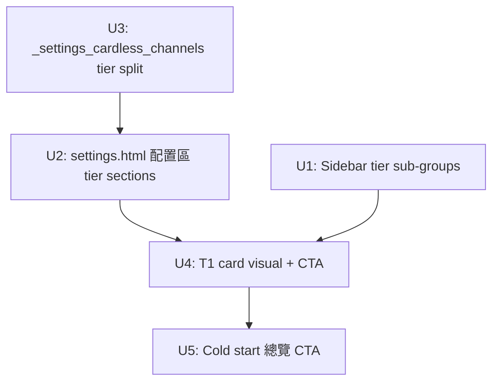

# feat: Settings 頁面 Tier 分組 UX 全頁重構

## Overview

重構 `/settings` 頁面，將 20 個發布渠道按 Tier 分組（T1 免綁定 / T2 填憑證 / T3 瀏覽器）顯示於三個區域：左側導航、配置卡片區、綁定總覽 panel。T1 免綁定渠道置頂並賦予更強的視覺 CTA。純模板層 + CSS 修改，無後端變動。

## Problem Frame

用戶打開設置頁後，4 個免綁定渠道（notesio/rentry/telegraph/txtfyi）與需要綁定的渠道混排，左側導航 20 個渠道按字母序平鋪，用戶需要滾動才能找到最容易上手的入口。目標是讓用戶 5 秒內找到「試發布」入口。(see origin: docs/brainstorms/2026-06-12-settings-tier-ux-requirements.md)

## Requirements Trace

- R1. 左側導航「发布渠道」group 拆分為 3 個帶標籤的 tier sub-groups
- R2. 每個 sub-group label 旁顯示渠道數量
- R3. T1 渠道項目加綠色視覺標記
- R4. pane-channels 配置區按 Tier 分組，T1 → T2 → T3 順序
- R5. 每個 Tier 前加 section 小標題（名稱 + 副說明 + 渠道數量）
- R6. T2 內部已綁定渠道先、未綁定後
- R7. T1 渠道卡片加左側綠色 accent border
- R8. T1 卡片內「試發布」升為主要 CTA
- R9. T1 卡片 header 徽章改為更突出的綠色「⚡ 免綁定 · 就緒」
- R10. Cold start 時總覽 T1 渠道加「立即試發布」標籤
- R11. 總覽 tier 子標題與配置區文案一致

## Scope Boundaries

- 不改變後端路由、API、`dashboard_channels` 數據結構
- mastodon（live_browser）在 T3 顯示 disabled/coming-soon stub
- 全局設置（關鍵詞 / AI 引擎）不在本次範圍
- 不改變任何 Bootstrap collapse accordion 行為

## Context & Research

### Relevant Code and Patterns

- **Sidebar template**: `webui_app/templates/_settings_sidebar.html` — 目前用 `` 平鋪，可改用多 pass + if 條件分 tier
- **Cardless channels**: `webui_app/templates/_settings_cardless_channels.html` — 當前過濾排除 `live_browser/oauth/None`；改為按 tier 分 3 pass
- **Tier CSS 已完整**: `.main-tier-group`, `.main-tier-subhead`, `.tier-label`, `.tier-count`, `.tier-chip-tier-1/2/3` 在 `settings.css` 均已存在，可直接複用
- **Overview partition pattern**: `webui_app/templates/_settings_overview_partition.html` — tier 分組渲染的成熟範例，sidebar 和配置區跟隨此模式
- **Anon binding partial**: `webui_app/templates/_settings_binding_anon.html` — 目前無「試發布」按鈕，只有狀態 badge；需在此加 CTA 按鈕
- **Carded channels** (hardcoded in `settings.html`): T2 carded = blogger(oauth), ghpages, devto, notion；T3 carded = medium, velog
- **JS 無 DOM 順序依賴**: `settings.js` 全用 `data-action/data-pane` 屬性驅動，重排卡片安全

### auth_type → Tier 映射

| auth_type 值 | Tier |
|---|---|
| `anon` | T1 |
| `token`, `token_fields`, `oauth`, `userpass` | T2 |
| `paste_blob`, `live_browser` | T3 |

### Institutional Learnings

- **Settings handler caching**: read-path 用 `_g_cache('config', load_config)`；本次為純模板改動，不涉及此規則，但需確認 settings_basic.py 傳入的 context 包含 `dashboard_partition`（已在 overview panel 使用，確認可用）

## Key Technical Decisions

- **多 pass Jinja2 for loop 分 tier**（而非 selectattr/groupby）：`dashboard_channels` 是 list of tuples，Jinja2 的 selectattr 需要 object attribute，不支持 tuple index；多個 `` 清晰且無依賴
- **sidebar 繼續用 `dashboard_channels` 而非 `dashboard_partition`**：sidebar 需展示所有渠道（包含 extension 中未綁定的），`dashboard_channels` 包含全部，而 `p.main_groups` 只有可用渠道。多 pass + `if` 條件是最安全方案
- **T2 bound/unbound 排序用雙 pass**：先 `` 再 ``，在模板層完成，不動後端
- **T1 CTA 在 `_settings_binding_anon.html` 加「試發布」按鈕**：`channel-binding.js` 的 `dch-btn-dry-run` class + `data-channel="{{ channel }}"` 即可觸發試發布，無需新 endpoint。Button markup 範例：`<button type="button" class="btn btn-primary dch-btn-dry-run" data-channel="{{ channel }}"><i class="bi bi-play-circle"></i> 試發布</button>`
- **mastodon T3 stub**：不移除現有排除邏輯，在 T3 section 末尾單獨加 `` 的 disabled card
- **Tier 區塊 CSS 複用 `.main-tier-group` 和 `.main-tier-subhead`**：overview partition 已用，sidebar 和配置區直接套用，不增加新 class

## Open Questions

### Resolved During Planning

- **`dashboard_partition` 是否在 sidebar template 可用？** 是——settings.html 整個 layout 共用 context，`dashboard_partition` 是 settings_basic.py 傳入的 context var，sidebar 作為 include 可取得
- **T1 試發布按鈕的 endpoint**：確認 `_settings_overview_partition.html` 裡的 dashboard_channel_card macro 如何觸發試發布，在 `_settings_binding_anon.html` 複用同一機制

### Deferred to Implementation

- **mastodon 的 `dashboard_channels` tuple 格式**：確認 mastodon 是否出現在 `dashboard_channels` list（目前 cardless template 已排除 live_browser，但 mastodon 仍可能在列表中）
- **試發布按鈕的具體 HTML 結構**：看 `_settings_channel_binding.html` 的「試發布」按鈕實作，在 `_settings_binding_anon.html` 複用相同 markup

## High-Level Technical Design

> *以下為設計方向指引，供審查確認，非實作規格。實作時應以 context 和 code 為準。*

```
_settings_sidebar.html (after)
──────────────────────────────
綁定總覽
─ 发布渠道
  ⚡ T1 · 免綁定 (4)
    · notesio  · rentry  · telegraph  · txtfyi
  T2 · 填憑證 (13)
    · blogger  · ghpages  · devto  ...
  T3 · 瀏覽器 (3)
    · medium  · velog  · mastodon
─ 全局设置
─ AI 引擎

settings.html — pane-channels (after)
──────────────────────────────────────
┌ tier-section tier-section--t1 ──────────────────┐
│ ⚡ 開箱即用  無需任何帳號 (4)                      │
│  [notesio card]  [rentry card]                   │  ← _settings_cardless_channels T1 pass
│  [telegraph card]  [txtfyi card]                 │    cards have green accent + primary CTA
└──────────────────────────────────────────────────┘
┌ tier-section tier-section--t2 ──────────────────┐
│ 填入憑證即自動  一次設置全自動 (13)                 │
│  [blogger]  [ghpages]  [devto]  [notion]         │  ← hardcoded carded (bound first)
│  [hackmd]  [livejournal]  [mataroa]  [qiita]     │  ← cardless T2 (bound)
│  [gitlabpages]  [hatena]  [tumblr]  ...          │  ← cardless T2 (unbound)
└──────────────────────────────────────────────────┘
┌ tier-section tier-section--t3 ──────────────────┐
│ 瀏覽器登入  完成一次登入後自動 (3)                  │
│  [medium]  [velog]                               │  ← hardcoded carded
│  [substack]  [mastodon (disabled)]               │  ← cardless T3
└──────────────────────────────────────────────────┘
```

## Implementation Units



- [x] **Unit 1: 左側導航 Tier 子分組**

**Goal:** sidebar 「发布渠道」group 改為 3 個帶 tier 標籤的 sub-group，每組顯示渠道名稱 + 數量

**Requirements:** R1, R2, R3

**Dependencies:** 無（獨立 template 改動）

**Files:**
- Modify: `webui_app/templates/_settings_sidebar.html`
- Test: `tests/webui/test_settings_page.py`（若存在）

**Approach:**
- 將原有 `` 拆為 3 個 pass，每個 pass 前加 `sidebar-tier-label` sub-header
- T1 pass：``
- T2 pass：``
- T3 pass：``
- 每個 tier header 數量用 `namespace()` counter 計算：`` 在 header 前執行，再用 `{{ ns.count }}` 輸出。**不要用 selectattr**——它不支持 list-of-tuples
- T1 項目加 `sidebar-item--t1` class 用於綠色圓點樣式（R3）
- 複用現有 `.sidebar-group__label` 樣式加 tier chip

**Patterns to follow:**
- `_settings_overview_partition.html` 的 tier sub-head pattern (`main-tier-subhead` + `tier-chip-tier-1`)
- 現有 `sidebar-group` 結構保持不變

**Test scenarios:**
- Happy path: T1 sub-group 顯示 4 個渠道（notesio/rentry/telegraph/txtfyi），計數正確
- Happy path: T2 sub-group 顯示已綁定 + 未綁定渠道，計數與總 dashboard_channels T2 項目一致
- Edge case: 若某 tier 無渠道（如 T3 全部 extension），sub-group 是否隱藏或顯示空組
- Happy path: 點擊 sidebar T1 項目後 pane-channels 正確 scroll/navigate

**Verification:**
- 三個 tier sub-group 標籤出現在 sidebar
- T1 渠道項目有綠色視覺標記
- 原有的 sidebar 導航點擊行為（data-pane）不受影響

---

- [x] **Unit 2: settings.html 配置區 Tier Section Headers**

**Goal:** `pane-channels` 區域加 3 個 tier section wrapper，T1 在最前，hardcoded 卡片按 tier 歸入對應 section

**Requirements:** R4, R5

**Dependencies:** Unit 3（需要 cardless 模板支持 tier 過濾參數才能正確分段）

**Files:**
- Modify: `webui_app/templates/settings.html`
- Test: 頁面 E2E 確認（視覺驗證）

**Approach:**
- 在 `<section id="pane-channels">` 內加 3 個 `<div class="tier-section tier-section--t1/t2/t3">` wrapper
- 每個 wrapper 前加 `.main-tier-subhead` 標題（複用 overview partition 的樣式）
- T1 section 包含：``
- T2 section 包含：hardcoded Blogger / GH Pages / Dev.to / Notion 卡片 + ``
- T3 section 包含：hardcoded Medium / Velog 卡片 + ``
- T2 hardcoded 卡片已都是 bound 狀態，直接放前面符合 R6

**Patterns to follow:**
- `_settings_overview_partition.html` 的 `main-tier-subhead` div + `tier-chip-tier-N` badge

**Test scenarios:**
- Happy path: T1 section 出現在頁面最上方，包含 4 個 anon 渠道卡片
- Happy path: T2 section 包含 blogger/ghpages/devto/notion（carded）+ T2 cardless
- Happy path: T3 section 包含 medium/velog（carded）+ substack/mastodon（cardless）
- Integration: 渠道卡片 Bootstrap collapse 仍可正常展開/收合

**Verification:**
- 頁面配置區出現 3 個 tier 分組 section，各有標題
- T1 section 在最上方（瀏覽器滾動到配置區時第一眼可見）

---

- [x] **Unit 3: `_settings_cardless_channels.html` Tier 過濾參數化**

**Goal:** 讓 cardless 模板接受 `tier` context 變量，只渲染對應 tier 的渠道；加入 T3 mastodon coming-soon stub

**Requirements:** R4, R6

**Dependencies:** 無（可先完成，Unit 2 依賴它）

**Files:**
- Modify: `webui_app/templates/_settings_cardless_channels.html`

**Approach:**
- 加頂部 ``
- T1 filter：``
- T2 filter：`` + 兩 pass（bound first）。注意：oauth 型渠道（blogger）已在 `_carded_channels` 中排除，但 filter 需含 oauth 以免未來新增 non-carded oauth 渠道漏掉
- T3 filter：`` + 額外 mastodon stub（live_browser，disabled card）
- mastodon stub：在 T3 pass 末尾 `` 渲染 disabled card（加 `opacity:0.5 pointer-events:none` inline style 或 `channel-card--coming-soon` class）
- T2 bound-first：先 ``，再 ``
- 保留原有 `_carded_channels` 過濾（不渲染已有 dedicated card 的渠道）

**Patterns to follow:**
- 現有 cardless 模板的 auth_type-to-partial 路由 pattern（`_settings_binding_anon.html` / `_settings_binding_token.html` 等）

**Test scenarios:**
- Happy path: tier='t1' 時只渲染 anon 渠道
- Happy path: tier='t2' 時 bound 渠道排前，unbound 排後
- Happy path: tier='t3' 時 paste_blob 渠道 + mastodon disabled stub 出現
- Edge case: tier='all' 或無 tier 參數時行為與舊版一致（向後兼容，用於潛在的其他 include 場景）
- Edge case: mastodon 若不在 dashboard_channels，T3 末尾不渲染 stub

**Verification:**
- `tier='t1'` include 只顯示 notesio/rentry/telegraph/txtfyi
- `tier='t2'` include 內 bound 渠道先於 unbound 顯示
- mastodon card 出現在 T3 section 且視覺上為 disabled 狀態

---

- [x] **Unit 4: T1 渠道卡片視覺強化**

**Goal:** T1 anon 渠道卡片加綠色左側 accent border；`_settings_binding_anon.html` 加「試發布」主要 CTA 按鈕

**Requirements:** R7, R8, R9

**Dependencies:** Unit 3（T1 卡片需先正確分組才有意義優化樣式）

**Files:**
- Modify: `webui_app/static/css/settings.css`
- Modify: `webui_app/templates/_settings_cardless_channels.html`（T1 卡片加 `channel-card--anon` class）
- Modify: `webui_app/templates/_settings_binding_anon.html`（加試發布 CTA）

**Approach:**
- CSS：新增 `.channel-card--anon { border-left: 3px solid #10b981; }` 及 `.channel-card--anon .badge-status.ok { font-size:12px; }` (R9 字號)
- 在 `_settings_cardless_channels.html` T1 pass 的卡片 div 加 `channel-card--anon` class
- `_settings_binding_anon.html`：在現有狀態 badge 下方加「試發布」按鈕，複用 overview partition / _settings_channel_binding.html 中的「試發布」按鈕 markup 和 JS 觸發機制（確認 `data-action` 屬性和 channel 值）
- 「試發布」按鈕用 `btn btn-primary`（升為主要 CTA），「測試連通」保留但用 `btn btn-outline-secondary`
- 不修改 `_settings_binding_anon.html` 的 form/POST 結構（此 partial 無 form）

**Patterns to follow:**
- `webui_app/templates/_settings_channel_binding.html` 的「試發布」按鈕 markup
- `_settings_overview_partition.html` 的 `dashboard_channel_card` macro 裡的試發布觸發方式

**Test scenarios:**
- Happy path: rentry/telegraph/notesio/txtfyi 卡片 header 有綠色左邊框
- Happy path: 展開 anon 卡片後有「試發布」primary 按鈕
- Edge case: 按鈕點擊觸發正確的 JS 事件（不報錯）

**Verification:**
- T1 卡片視覺上有綠色左邊框，與 T2/T3 卡片有明顯視覺區分
- T1 卡片展開後「試發布」為藍色/主色調 primary 按鈕

---

- [x] **Unit 5: Cold Start 總覽 T1 CTA 強化**

**Goal:** Cold start 狀態（無真實綁定）下，總覽 panel 的 T1 渠道卡片加「⚡ 立即試發布」行動標籤

**Requirements:** R10, R11

**Dependencies:** Unit 4（T1 CTA 機制已實作才有標籤可加）

**Files:**
- Modify: `webui_app/templates/_settings_overview_partition.html`（或 `_channel_card_macro.html`）

**Approach:**
- 在 `_settings_overview_partition.html` cold_start 條件下，T1 tier group 的渠道卡片加 `cold-start-cta-hint` banner 元素
- 文案：「⚡ 點此試發布 →」，連結到 overview panel 內的「試發布」按鈕
- 確認總覽 tier sub-head 文案與配置區 R5 文案一致（T1:「開箱即用」/T2:「填入憑證即自動」/T3:「瀏覽器登入」）

**Patterns to follow:**
- 現有 `cold-start-banner` div 樣式（在 `_settings_overview_partition.html` 第 27-31 行）

**Test scenarios:**
- Happy path: cold_start=True 時，T1 渠道卡片旁有「⚡ 立即試發布」標籤
- Edge case: cold_start=False 時，標籤不出現
- Happy path: 總覽 T1 tier sub-head 顯示「開箱即用」與配置區 R5 一致

**Verification:**
- Cold start 頁面打開時，綁定總覽 panel T1 區域有醒目「試發布」入口
- Tier sub-head 文案在總覽和配置區完全一致

## System-Wide Impact

- **Interaction graph:** `settings.js` 通過 `data-action="sidebar-nav"` 驅動 pane 切換；channel 卡片用 Bootstrap collapse + `data-bs-toggle`。兩者均無 DOM 順序依賴，重排卡片/sidebar 無風險
- **Error propagation:** 純 HTML/Jinja2 模板——若模板語法錯誤，Flask 返回 500；無異步錯誤路徑
- **State lifecycle risks:** 無——只改渲染層，不觸及 `webui_store` 或任何 state store
- **API surface parity:** 無——不新增路由
- **Integration coverage:** T1 試發布按鈕觸發機制需確認連動 `bind_channel.js` 或 `channel-binding.js`，不能直接假設 endpoint 存在
- **Unchanged invariants:** Bootstrap accordion IDs（`#channel-blogger` 等）、`data-pane` 屬性值、表單 action URL 均不變

## Risks & Dependencies

| Risk | Mitigation |
|------|------------|
| T1 試發布按鈕 endpoint 不存在 | 實作時先確認 overview panel 裡的試發布按鈕 markup，複用相同機制；若無現成 endpoint，先顯示導航到配置區的連結即可 |
| Jinja2 counter 計算 tier 數量較繁瑣 | 使用 `namespace()` trick 或 `dashboard_channels \| selectattr` 的 Jinja2 built-in（確認 selectattr 對 namedtuple/dict 的支持）；降級方案：省略數量，只顯示 tier 標籤 |
| mastodon 不在 `dashboard_channels` list | 加 ` ... ` guard，stub 缺席不影響其他 T3 渠道 |
| CSS 複用 `.main-tier-group` 但在 sidebar 和 pane 裡的容器不同 | 用 scoped selector `.settings-sidebar .main-tier-group` 與 `.settings-pane .main-tier-group` 分別調整 padding/margin |

## Documentation / Operational Notes

- 無需更新外部文檔；`_settings_cardless_channels.html` 頂部的 docstring 需更新描述 tier 參數化行為

## Sources & References

- **Origin document:** [docs/brainstorms/2026-06-12-settings-tier-ux-requirements.md](docs/brainstorms/2026-06-12-settings-tier-ux-requirements.md)
- Related code: `webui_app/templates/_settings_overview_partition.html` — tier 分組 pattern 範例
- Related code: `webui_app/templates/_settings_cardless_channels.html` — 待重構目標
- Related code: `webui_app/static/css/settings.css` — 複用 `.main-tier-group`, `.tier-chip-tier-N`
- Related code: `webui_app/static/js/settings.js` — 確認無 DOM 順序依賴
