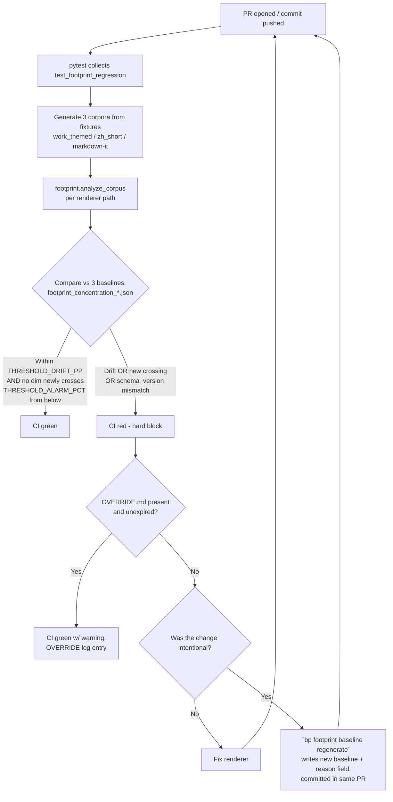

# Footprint Regression Gate (Arm A of S2 Footprint Loop Closure)

## Problem Frame

R3-3 shipped `bp footprint` as a pure-function byte-level fingerprint auditor (`src/backlink_publisher/footprint.py` + `cli/footprint.py`). It identifies the SpamBrain cluster keys — attribute order inside `<a>` tags, exact `rel` string, target value, preceding character — that appear at high concentration across rendered output.

The audit runs only when the operator remembers to invoke the CLI. In practice that means never. Worse: any future renderer refactor (the recently-landed `webui.py` → `webui_app/` split at 19a459c, the eventual `markdown_utils` cleanup, a new adapter that bypasses the central renderer) can silently re-introduce a cluster key the operator already paid to identify and remove.

This gate converts that one-shot audit into a permanent non-regression contract that runs on every PR, so cluster-key drift is caught at code-review time instead of post-deploy.

Scope here is **Arm A only**. Arm B (renderer self-vary) is the staged follow-up. Arm B's PR is responsible for *redesigning* this gate (per-dimension expected-range with min/max, not a point-baseline ± drift), not merely re-freezing it — the existing gate shape is incompatible with intentional variance and the redesign is the actual carrying cost of Arm B.

## Requirements

**Gate behavior**
- R1. A pytest module (e.g., `tests/test_footprint_regression.py`) runs on every CI invocation that collects the standard test suite.
- R2. The test generates **three independent corpora** at runtime, one per renderer path:
  - `work_themed`: call `work_themed_generator.select_anchors` + `work_themed_generator.render_work_themed_article` directly with stubbed `WorkMetadata` and frozen `recent_texts`. (Both callables live in `work_themed_generator` — `anchor_scheduler` exposes `schedule()`/`ScheduleDecision`, not `select_anchors`.) No network (`work_scraper.fetch_work_metadata` is not invoked). No disk (`anchor_profile` IO is not invoked). Pure-function path.
  - `zh_short`: call `markdown_utils.render_zh_short_article` directly with fixture inputs.
  - `markdown_it`: call `markdown_utils.render_to_html` directly with fixture markdown inputs (representing what adapters POST). Test resets `markdown_utils._mdit_instance = None` in the test's setup/fixture so the corpus generation always starts from a cold cache. (No teardown needed — subsequent tests inherit whatever the corpus run left, which matches production behavior and is intentional.)
- R3. The test runs `footprint.analyze_corpus` per corpus and compares each resulting per-dimension `concentration_pct` against its baseline at `tests/baselines/footprint_concentration_work_themed.json`, `_zh_short.json`, and `_markdown_it.json`.
- R4. **[Threshold values TBD in planning — see Deferred Questions.]** The test fails the build if any of the following hold:
  - any dimension's `concentration_pct` drifts more than `THRESHOLD_DRIFT_PP` from baseline (per renderer path) → raises `FootprintGateDrift`, OR
  - any dimension **crosses `THRESHOLD_ALARM_PCT` from below** — i.e., baseline value was `< THRESHOLD_ALARM_PCT` and current value is `≥ THRESHOLD_ALARM_PCT`. Dimensions whose baseline is already at/above the alarm threshold are exempt from the crossing-from-below check but **remain subject to drift-gating** (`THRESHOLD_DRIFT_PP`). → raises `FootprintGateAlarmCrossed`, OR
  - the baseline's recorded `schema_version` does not match the engine's current schema_version (engine evolution requires explicit baseline regen). → raises `FootprintGateSchemaMismatch` — distinct error class so a 2am operator can immediately tell engine-evolution from drift, OR
  - `footprint.analyze_corpus` returns `total_links == 0` for any of the 3 corpora (gate-on-gate sanity, R12). → raises `FootprintGateZeroLinks` so an engine regex breakage doesn't masquerade as "all dimensions zero drift".

  Threshold values (`THRESHOLD_DRIFT_PP`, `THRESHOLD_ALARM_PCT`) are set during planning based on measured per-dimension natural variance. The seed proposal (5pp / 95%) is a starting point only and must be validated against actual `footprint.analyze_corpus` output before locking. See Deferred Questions. The error class names are suggested defaults; planning may rename to match project conventions but the distinguishability contract is load-bearing.
- R5. Failure is hard-blocking with one documented escape: a `tests/baselines/footprint_concentration.OVERRIDE.md` file (see R14). Re-greening the build without OVERRIDE.md requires either fixing the renderer or committing re-frozen baseline(s) in the same PR.

**Baseline lifecycle**
- R6. Each baseline JSON records: per-dimension `concentration_pct` for all 4 `LinkSignature` dimensions, the `footprint` engine's `schema_version`, a `reason` string explaining why this baseline shape is the desired post-fix state, and a `fixture_set_id` identifying which fixture pool produced it (so a fixture-pool refresh is visible in diff). No bare timestamp (use git for that); no separate `inputs` block (the `fixture_set_id` is the input identifier).
- R7. Baseline regeneration goes through an explicit CLI subcommand: `footprint baseline regenerate [--path work_themed|zh_short|markdown_it|all]`. This adds the first subcommand layer to the existing flat `footprint` parser (pyproject `[project.scripts]` already exposes `footprint = backlink_publisher.cli.footprint:main`; there is no `bp` umbrella CLI in this project). The command (a) runs the gate's corpus pipeline once, (b) writes the new baseline JSON with all fields from R6, (c) requires `--reason "<one-line explanation>"` flag — refuses without it. Output format is mechanical: sorted keys, 2-space indent, trailing newline, stable float formatting — so `git diff` against the prior baseline is minimal and readable. No side-by-side diff tool.
- R8. *(dropped — see Key Decision #4. The `reason` field in the baseline JSON (R6) plus the PR diff itself is sufficient governance.)*
- R9. *(moved to Scope Boundaries — see "No TTL on baselines" below.)*

**Determinism**
- R10. CI invocations of this test must pin `PYTHONHASHSEED=0` **at interpreter startup** (CI harness env var, `pyproject.toml [tool.pytest.ini_options] env`, or local Makefile target — Python freezes the seed at process startup, so setting `os.environ['PYTHONHASHSEED']` from inside a fixture is a no-op). The test's session-start hook reads `os.environ.get('PYTHONHASHSEED')` and raises `pytest.UsageError` (not skip — skip would defeat R5's hard-block) if absent or non-zero. The `.github/workflows/*.yml` and any documented local test invocation must include `PYTHONHASHSEED=0`; this is grep-verifiable.
- R11. The `footprint` engine's tie-breaking is deterministic. Specifically, **every** `Counter.most_common(1)` call site in `src/backlink_publisher/footprint.py` must be replaced — both inside `concentration_pct` calculation (line ~112) and inside `format_report_markdown` (lines ~178, 185, used for the human-readable top-value column). When multiple values tie for top count, the engine selects the lexically smallest value as the top bucket. For `attr_order_counts` (whose keys are `tuple[str, ...]`), use Python's native tuple comparison. Adds a `schema_version` constant alongside.

**Engine self-test (gate-on-gate)**
- R12. Engine sanity check (gate-on-gate, minimum viable). The gate itself asserts `total_links > 0` for each of the 3 corpora — if `footprint.analyze_corpus` silently returns zero links (regex breakage, etc.), the gate fails with `FootprintGateZeroLinks` instead of going green on collapsed measurements. Plus two attack fixtures under `tests/fixtures/footprint_attack/` (new; sibling-level to repo-root `fixtures/seed.jsonl`) for the two highest-value engine blind spots: (a) multi-line `<a>` tag (today's `_ATTR_RE` regex doesn't match), (b) missing-vs-empty `rel` attribute (today's `attr_dict.get('rel', '')` collapses both into one bucket). The pedantic cases (escaped quotes, mixed single/double quoting, tab vs space separators) are deferred — let `footprint.py` follow-up PRs add them when engine changes warrant.

**Operator escape**
- R13. *(removed — was the old "CLI unchanged" non-requirement; covered by Scope Boundaries.)*
- R14. Minimum-viable break-glass: presence of `tests/baselines/footprint_concentration.OVERRIDE.md` causes the gate to print a prominent warning (containing the file's full contents) and pass instead of fail. The OVERRIDE.md must contain a `reason:` line — the gate refuses files lacking it (otherwise the warning is empty). No expiry parsing, no JSONL log, no auto-extension flow. Git history is the durable record; the operator IS the reviewer for a solo-operator project, so social pressure = "this file's contents show up in every PR diff until I delete it" is sufficient. If override fatigue ever becomes a real pattern (success criterion #5 below), planning revisits adding teeth.

## Success Criteria

- **Catches a re-introduced cluster key per renderer path.** A deliberately-crafted PR that re-introduces a removed invariant on any of the 3 covered paths (e.g., consolidating both `rel="noopener"` and `rel="noopener noreferrer"` variants into a single value, or removing the `target="_blank"` rotation) is red on first CI run.
- **No false positives in a stable week.** Across 7 consecutive days of non-renderer-touching commits (config tweaks, doc edits, test additions in other modules), the gate stays green without manual intervention.
- **Baseline re-freeze is a deliberate, reviewable act.** Every baseline change in `git log` has a populated `reason` field in the baseline JSON; no `reason: "regenerate"` rubber-stamps.
- **Engine sanity check catches collapsed measurements.** R12's `total_links > 0` check goes red when an engine regex change drops a corpus to zero links; the 2 attack fixtures go red when multi-line `<a>` handling or rel-bucket separation breaks.
- **OVERRIDE.md is rare.** Across 30 consecutive days, no more than one OVERRIDE.md is committed. Measured by occasional `git log -- tests/baselines/footprint_concentration.OVERRIDE.md` — manual, no automated process needed at solo-operator scale. If this criterion is violated repeatedly, planning revisits adding teeth to R14.

## Scope Boundaries

**Future phases (deliberately deferred)**
- **Arm B (renderer self-vary) is NOT in this PR.** It is a deliberate follow-up. Arm B's PR will *redesign* this gate (per-dimension min/max expected ranges replacing the point-baseline ± drift model) — not merely re-freeze it — because the current shape is structurally incompatible with intentional variance. The "redesign-not-refreeze" framing is explicit so the Arm B brainstorm/plan surfaces this work in advance.
- **No TTL on baselines.** Calendar-based forced refresh creates noise on non-renderer PRs. R4's drift gate catches actual renderer movement; R4's `schema_version` check catches engine evolution.

**Orthogonal refactors (no coupling)**
- Not coupled to the recently-landed `webui.py` → `webui_app/` split (19a459c). The gate exercises generator + renderer only, neither of which was in the P0 refactor scope.
- Not coupled to `config.py` decomposition (P1, queued). The `[footprint]` config section is read by runtime, not by this test.

**Not in this PR**
- Not a behavioral change to the `footprint` CLI besides the new `baseline regenerate` subcommand (R7). Tied-dimension top-value flips that result from R11's lex-tie-break ARE expected user-visible changes on any tied dimension (typically `preceding_char`) and are documented in the PR's CHANGELOG; this is not a regression.
- **Engine changes are limited to** (a) deterministic tie-breaking across all `most_common(1)` call sites in `footprint.py` (R11), and (b) `schema_version` field addition (Dep #1). The set of dimensions, the cluster-key extraction logic, and the `concentration_pct` formula are unchanged. Anything outside this allowlist is out of scope.
- The `[footprint]` runtime config section (if disabled in production config) does not affect the gate. The gate runs in CI regardless — the gate measures source-controlled renderer behavior, not runtime opt-in.
- **Gate measures footprint for the synthetic `recent_texts` fixture only.** Drift in `select_anchors`' interaction with state-shape variation (case sensitivity, dedup keys, ordering) is detectable only if the work_themed fixture deliberately includes such variation. Operational anchor-profile drift in production is out of scope for Arm A — revisit if a production regression slips through.

**Off limits**
- No live publishing, no scraping; the entire corpus is locally generated via fixture inputs.

## Key Decisions

- **Arm A ships solo; Arm B is a redesign, not a refreeze.** The two arms are tightly coupled (intentional variance trips a point-baseline gate), so Arm A's threshold-against-baseline shape must be replaced with per-dimension expected ranges when Arm B ships. Framing the follow-up as a redesign (not a refreeze) surfaces this work in advance instead of compressing it into Arm B's final hour.
- **Pure-function corpus, not end-to-end.** Calling `select_anchors` + `render_*_article` directly with stubbed inputs sidesteps `work_scraper`'s network calls and `anchor_profile`'s disk state — both structural non-determinism today. The narrower threat model (renderer + anchor-selection logic, not upper-layer plumbing) is explicit in the Problem Frame.
- **Three corpora over one mixed corpus.** `work_themed`, `zh_short`, and `markdown_it` (the renderer used by ALL adapters) have meaningfully different `<a>` shapes; a single mixed baseline would hide per-path regressions in averaged numbers and make debugging brittle. Three small JSON files cost less than one fragile aggregate. Per-PR regeneration is typically 1 of 3 baselines (only the touched renderer path; ~2 of 3 for `markdown_utils` changes that hit both `zh_short` and `markdown_it`), so practical maintenance overhead is 1–2x, not 3x.
- **No second governance mechanism on top of the baseline diff.** R8 (commit-message tag + pre-commit hook) was dropped because reviewers already see the baseline JSON change in the PR diff, the project has no `.pre-commit-config.yaml` infrastructure today, and commit-message tags don't survive squash-merges. The `reason` field in the baseline JSON itself (R6) is self-documenting in the diff.
- **Hard-blocking with minimum-viable break-glass.** Warning-only was rejected for the general case because "merge now, investigate later" reliably becomes "never investigate". A committed `OVERRIDE.md` at `tests/baselines/footprint_concentration.OVERRIDE.md` (R14) avoids stranding a midnight operator; the file's contents appear in every subsequent PR diff until removed, which IS the social pressure for a solo operator. Expiry parsing, JSONL logging, and required-fields validation were rejected as ceremony unjustified by the monthly cadence; if override fatigue becomes a real pattern, planning revisits.
- **`crosses-from-below` alarm semantics.** "Ever above THRESHOLD_ALARM_PCT" would render the gate permanently red on day one because work_themed `attr_order` and `rel_value` are 100% by construction. "Crosses from below" preserves the alarm's value for dimensions where rising concentration is a genuine new regression, and falls back to drift-only gating for dimensions that are intentionally invariant.
- **Determinism is a hard requirement, not a planning detail.** PYTHONHASHSEED randomization plus `Counter.most_common(1)` tie-breaking would silently make the gate flake across CI runs of identical commits. R10 + R11 add this as load-bearing, not deferred, because R5's hard-block converts flakes into team-blockers.
- **Engine sanity check is part of Arm A's scope; full engine self-tests are not.** A regression-gate that fully trusts an unverified engine has a single point of silent failure — R12's `total_links > 0` check plus 2 attack fixtures (multi-line `<a>`, missing-vs-empty `rel`) cover the highest-value blind spots that would silently zero out the gate. Broader parser-pedantry cases (escaped quotes, mixed quoting, tab/space) are deferred to `footprint.py` follow-up PRs to avoid scope creep into engine quality work.

## Dependencies / Assumptions

- **Depends on `footprint.analyze_corpus` returning a per-dimension `concentration_pct` shape with a `schema_version` field.** The `schema_version` field is a new addition in Arm A's implementation PR (alongside the tie-break fix in R11). First-run consequence: any pre-existing operator-generated baseline (from local R3-3 experimentation) will fail `FootprintGateSchemaMismatch` on first CI run after this PR lands — this is expected and documented as a one-time regen step in the CHANGELOG, not a regression signal.
- **Depends on the pure-function entry points `select_anchors`, `render_work_themed_article`, `render_zh_short_article`, `render_to_html` being deterministic given identical inputs and pinned `PYTHONHASHSEED`.** R10 + R11 + R2's stubbed inputs cover this; planning should still spot-verify by running the corpus pipeline twice and diffing output bytes.
- **Assumes test runtime is acceptable.** The pure-function arithmetic estimate is ~50 calls × ms-scale = sub-second per corpus, ~3 seconds total worst case. Validate during planning before locking the CI-collection integration choice — see Deferred.
- **Assumes the `markdown_utils._mdit_instance` singleton can be reset cleanly via direct module attribute reset** (e.g., `markdown_utils._mdit_instance = None`). If not, the markdown_it corpus test runs in a subprocess.

## Outstanding Questions

### Resolve Before Planning
*(none — all blocking product decisions are answered)*

### Deferred to Planning
- [Affects R4][Needs research] Set `THRESHOLD_DRIFT_PP` and `THRESHOLD_ALARM_PCT` per renderer path. Run `footprint.analyze_corpus` against today's output for all three paths, observe natural per-dimension variance (especially `preceding_char` which has higher cardinality than the other 3 dimensions), and pick thresholds. Document the measured baseline variance alongside the chosen thresholds in the planning doc.
- [Affects R2][Technical] Fixture-set design: what specific `WorkMetadata` objects, anchor pools, target URLs, and markdown inputs go into each corpus? Pick a `fixture_set_id` naming scheme. Aim for byte-level diversity in the inputs (so concentration measurements are meaningful) without depending on live `work_scraper` data.
- [Affects R2 / markdown_it corpus][Technical] Verify the `markdown_utils._mdit_instance = None` reset approach works cleanly without test-ordering flakes. If not, run the markdown_it corpus test in a subprocess via `pytest-forked` or a `subprocess.run` shim. Pick during planning after empirical check.
- [Affects R1][Technical] CI integration — should the test be in the main pytest collection (runs on every PR, increases default check time) or in a dedicated `pytest -m footprint_regression` marker (separate CI job, can be reordered for fail-fast)? Standard pytest collection is the simpler default; revisit only if the benchmark in the next item flips the decision.
- [Affects Dep #3][Needs research] Benchmark actual corpus generation runtime per renderer path before locking the "~3 seconds" estimate. A 5-minute `timeit` run during planning confirms or falsifies it.
- [Affects R7][Technical] CLI surface design for `bp footprint baseline regenerate` — flag for path selection, output formatting, exit codes. Standard CLI patterns from existing `bp footprint` subcommands should govern.
- [Affects R11][Technical] Engine change in `src/backlink_publisher/footprint.py`: replace `Counter.most_common(1)` with deterministic tie-breaking (lex-smallest value wins). Add `schema_version` field to whatever struct `analyze_corpus` returns. Both are small mechanical changes; planning should bundle into one engine sub-task.
- [Affects R14][Technical] OVERRIDE.md parser: how strict to be on the `reason:` line shape (presence-only? min length? key-value extraction?). The minimum-viable shape is "any file with a `reason:` substring passes the warning-with-contents flow"; planning picks the exact predicate.
- [Affects R6][Technical] `fixture_set_id` mechanism: auto-computed from a `sha256` of canonical fixture inputs (impossible to forget; mismatches are loud) vs manual integer the operator bumps. Per-corpus IDs vs unified. Planning must decide before any baseline is committed — if manual + per-corpus, add a separate "fixture_set_id in baseline matches fixture_set_id declared in fixture module" assertion test so silent fixture drift can't disguise itself.
- [Affects R4][Technical] Failure-message contract: each gate failure (any of `FootprintGateDrift`, `FootprintGateAlarmCrossed`, `FootprintGateSchemaMismatch`, `FootprintGateZeroLinks`) emits a structured message naming `(renderer_path, dimension, baseline_value, observed_value, delta, failure_mode)` for every triggering check, sorted by largest delta first. Pytest assertion constructed to render as a flat, human-readable block, not a nested dict diff — otherwise a 2am operator reaches for `regenerate --reason "CI red"` rubber-stamp and defeats success criterion #3.
- [Affects Arm B handoff][Process] "Redesign-not-refreeze" enforcement: this brainstorm doc names the framing 3 times but has no mechanical force. Options to make it stick: (a) place a `# ARM_B_GATE_REDESIGN_REQUIRED` TODO comment in `tests/test_footprint_regression.py` that the Arm B PR must remove (CI fails if comment is present alongside any Arm B variance feature flags), (b) add a brainstorm-doc obligation to Arm B's PR template, (c) leave as prose. Planning picks before Arm B begins.

## Next Steps

→ `/ce:plan` for structured implementation planning
