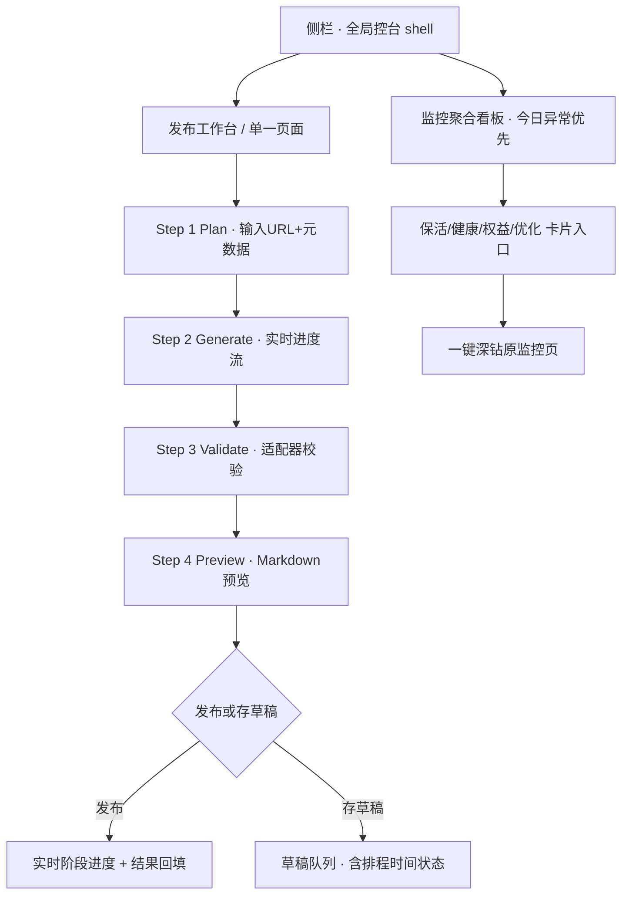

# WebUI 控台风格 UI/UX 全面翻新

## Problem Frame

Backlink Publisher 的 WebUI 已经积累了 29 个路由蓝图、19 个页面、19 个 JS 模块，
功能完备但**视觉与交互老旧**：界面靠 Bootstrap 5.3 默认样式撑着，缺乏统一观感；
pipeline（plan → generate → validate → publish）虽表达清楚，却分散在多页、长操作无实时反馈、
监控分裂成 4 个独立页面（保活/健康/权益/优化）。

操作这套工具的是熟悉外链发布业务的运营者，长时间盯着 pipeline 状态工作。
目标是把界面**激进重做成「深色技术控台」风**——把分散的操作收进统一 shell、给长任务真实进度反馈、
把监控聚合成一块可深钻的看板，让人「坐进驾驶舱」而不是「翻文件夹」。

本次为视觉/交互翻新，**不改后端业务逻辑、不动 pipeline 算法、不增删渠道适配器**。

## User Flow

翻新后核心发布流程在统一 shell 内一气呵成：

## Requirements

**设计系统（Design Tokens）**
- R1. 以现有 `webui_app/static/css/tokens.css` 为单一来源，重建一套深色控台 design tokens：背景分层（base/raised/overlay）、高对比前景、等宽字号缀（数字/状态/ID）、强调色（成功/警告/失败/进行中）、间距与圆角刻度。
- R2. tokens 必须覆盖到组件级语义变量（按钮、卡片、表格、徽章、抽屉、toast），使未重做的页面仅靠 tokens 级联即可自动获得新观感。
- R3. 保留亮/深双主题切换（现有 `theme.js`），深色为默认且为本次重点；亮色至少不破版。

**全局 Shell 与导航**
- R4. 重做全局 shell（`base.html` + `global_nav.css`）：左侧持久侧栏分区（核心/监控/配置），顶栏保留搜索（Ctrl+K）、主题切换、设置、Pro 状态。
- R5. 侧栏体现 pipeline 心智模型，当前所处阶段/页面有清晰的活跃态与面包屑。
- R6. 移动端响应式：侧栏可折叠为抽屉，表格在窄屏转为卡片式（至少覆盖发布工作台与监控看板）。

**核心发布工作台**
- R7. 把单笔发布的四阶段（plan/generate/validate/preview）整合为单页分步工作台，阶段状态可视（待办/进行中/完成/出错），可回退修改。
- R8. 长任务（generate、publish）提供实时进度反馈与阶段提示；至少做到轮询式进度条 + 阶段文案，可取消正在进行的发布（若后端支持）。
- R9. 统一的反馈语言：加载态（skeleton/spinner）、空态（引导下一步）、错误态（分类 + 建议操作 + 重试按钮）、成功 toast。沿用 `notifications.js`。
- R10. 草稿队列显示状态栏（等待发布/排程中/已发布）与预计发布时间。

**监控聚合看板**
- R11. 新增/重做一个监控聚合入口，把保活、健康、权益、优化四类状态汇成「今日异常优先」的卡片视图，每张卡片可一键深钻到对应原监控页。
- R12. 异常项按优先级排序并标注（如链接陈旧、凭证失效、权益缝隙），提供就地快捷操作入口（重检/重发/填缝）链接到既有路由。

**操作提醒系统**
- R13. 统一提醒/告警呈现：发布中断恢复、Pro 激活、渠道凭证失效、监控异常，统一用一致的视觉语言（横幅/徽章/toast），避免现状中散落在各页 alert。
- R14. 首次使用引导：渠道绑定健康状态汇总 + 关键空态引导（无渠道/无站点时提示去配置），降低上手门槛。

## Success Criteria
- 打开任意核心页面，观感统一为深色控台风，无 Bootstrap 默认残留违和感。
- 完成一次单笔发布全程不跳出工作台页，每一步状态与进度可见。
- 长任务（generate/publish）执行期间用户始终知道「在干什么、到哪一步、成功还是失败」。
- 监控异常能在一个聚合页一眼看到并一键深钻，不必逐页巡检。
- 未重做的旧页面靠 tokens 级联也不破版、观感不割裂。
- 移动端核心流程可用（侧栏抽屉 + 表格卡片化）。

## Scope Boundaries
- 不改后端业务逻辑、pipeline 算法、状态存储 schema、渠道适配器。
- 不引入打包器/框架——严守 zero-build 原生 ES modules（无 Node、无 `window.*` 全局 API、无内联 `on*`、`readCsrf()` 每次读 `<meta>`）。
- 本期只「激进重做」全局 shell + 核心发布工作台 + 监控聚合看板；其余 ~15 个页面靠 tokens 级联受益，分期追上，不在本期逐页重排。
- 不做 WebSocket 实时推送的硬性要求（轮询进度即可达标，SSE/WS 作为可选增强）。
- 不新增业务功能（合并 batch 与 campaign 两套 UI 的诉求记为后续，非本期）。

## Key Decisions
- 主轴 = 视觉/交互翻新（非流程重构、非新功能）：用户明确选「整体视觉/交互老旧」。
- 风格基调 = 深色技术控台风（类驾驶舱/监控台质感）。
- 改动幅度 = 激进重设外观与交互（重做 shell + 现代交互模式）。
- 覆盖策略 = Shell + 核心流程优先，tokens 级联带动其余页面分期追上：在激进与可控风险间取平衡。

## Dependencies / Assumptions
- 假设后端各路由的数据契约（PipeResult JSONL、`/api/<channel>/{status,verify,dry-run}`）保持不变，前端只换壳。
- 假设 generate/publish 后端能暴露可轮询的进度/状态（若不能，R8 降级为「忙碌态 + 完成回填」并记入计划）。
- 现有 `notifications.js`、`theme.js`、`nav.js`、`lib/api.js` 可复用为翻新基座。

## Outstanding Questions

### Deferred to Planning
- [Affects R8][Technical] generate/publish 后端是否已暴露可轮询的阶段进度端点？若无，进度反馈如何降级或需否后端小改？
- [Affects R8][Technical] 正在进行的 publish 是否可取消（后端是否支持中断）？
- [Affects R11][Technical] 监控聚合看板的数据来源——直接复用四个监控路由的 JSON 输出聚合，还是需要一个新的汇总端点？
- [Affects R1][Needs research] 盘清 `tokens.css` 现有变量被多少页面/组件直接引用，评估重命名/重构 token 的级联影响面。
- [Affects R6][Technical] 权益账本等宽表格在窄屏卡片化的具体断点与信息取舍。

## Next Steps
→ `/ce:plan` for structured implementation planning
