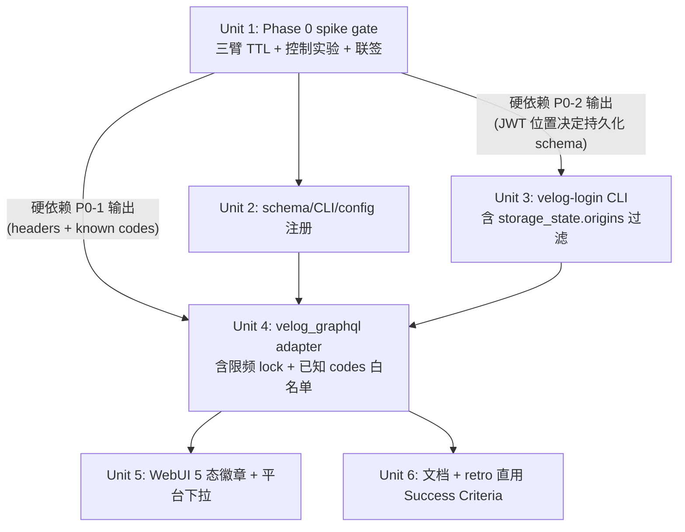

# feat: Velog 适配器（GraphQL writePost + 有头 Playwright 登录，含 Phase 0 可达性/语种前置门）

## Overview

把 `velog.io` 作为新发布平台接入。velog 没有官方 API：通过内部 `https://v3.velog.io/graphql` 的 `writePost` mutation 直发，鉴权使用社交登录后由有头 Playwright 导出的 cookie / `storage_state`。复用现有 `verify_publish` + `link_attr_verifier` 后置校验链。

**两个独立时间窗，互不混用：**

- **Phase 0 gate（spike，~1 人日 + 14 天等待）**：P0-1 端到端 mutation 实测成功 + P0-3 token TTL ≥ 24h + P0-5 Google 索引率 ≥ 70% + P0-4 运营对语种作出明确决断。任意一项未达标 → **回到 brainstorm**，评估转 dev.to / hashnode。
- **上线后 30 天 retro**：本平台发布页面 ≥ 70% 被 Google 索引、≥ 50% 在目标站 GSC 中作为 referring URL 出现、100% 抽样保持 dofollow（与 telegraph plan 上线 retro 对称）。

接入完成后，运营者可用 `--platform velog` 跑通 `publish-backlinks` → `verify` 闭环，与 `blogger` / `medium` / `telegraph` 同框使用。

## Problem Frame

现有平台 `blogger` + `medium`（+ 已规划的 `telegraph`）覆盖度仍不足以分散外链来源风险。velog.io 候选理由：Markdown 原生、外链 dofollow、`v3.velog.io/graphql` introspection 通过、`writePost` schema 明确。但 velog 的成立条件比 telegraph 复杂得多 —— 没有官方 SLA、内部 GraphQL 隐式约束（CSRF/Origin/UA）未实测、cookie TTL 未知、内部 API + 批量自动发布的风控风险中-高、且 velog 主要受众为韩语开发者，与目标市场关键词的话题相关性需要单独论证。

V1 没有 fallback，因此把所有结构性不确定性放进 Phase 0 spike 前置门；不达标直接回 brainstorm 转选 dev.to / hashnode，不允许带着开放风险跨入实现。

(see origin: `docs/brainstorms/2026-05-15-velog-adapter-requirements.md`)

## Requirements Trace

**Platform Registration & Contract**
- **R1** — `SUPPORTED_PLATFORMS` 加 `"velog"`；CLI / schema / `publish_backlinks` 识别该 platform → Unit 2
- **R2** — `AdapterResult` 字段语义对齐（`status` ∈ `{published, failed}`、`draft_url=""`、`platform="velog"`、`adapter="velog-graphql"`） → Unit 4
- **R3** — 必须经 `verify_publish` + `link_attr_verifier`；`verify_publish` 失败（无法 fetch / target 不在页面）→ `status="failed"` 并保留 `error`；`link_attr_verifier` 失败（rel 被改写为 nofollow / target=_blank 缺失）→ `status="published"` + `_provider_meta["link_attr_verification"]` 完整保留 + log.warn（与 `medium_api.py:189-205` 行为一致）。**两条 verifier 的语义不同**：前者是发布动作本身失败（无落地页 = 发布无效），后者是落地页上的链接属性偏离（仍是真发布，但 backlink 价值下降需告警） → Unit 4

**Publishing & Authentication**
- **R8** — `writePost` mutation 发布；鉴权由 `velog-login` 子命令首次导出 → Unit 3 + Unit 4
- **R10** — mutation 最小参数集（`title/body/tags=[]/is_markdown=true/is_temp=false/is_private=false`），**以 Phase 0 P0-1 实测为准** → Unit 1 + Unit 4
- **R11** — cookie/JWT 过期时抛 `DependencyError("velog cookie expired, run \`velog-login\` again")`；**不**自动重登 → Unit 4
- **R12** — checkpoint 已存在 `published_url` 的 row 跳过；不实现 `editPost` 自动覆盖 → 沿用现有 `checkpoint` 行为，无新代码（Unit 4 Verification 校验）

**Credential Security**
- **R9** — 凭证持久化路径 `~/.config/backlink-publisher/velog-cookies.json`（0600 + Unit 4 加载时 `os.stat` 强校验 → 非 0600 抛 DependencyError 而非 warn）；`config.toml [velog]` 段覆盖 `cookies_path` → Unit 2 + Unit 3
- **R16** — `velog-login` 在 Playwright 导出 cookie / storage_state 时必须按域名过滤，仅保留 `velog.io` 域（cookies）+ origin `https://velog.io`（storage_state.origins[]）；社交 IdP cookie/storage（Google/GitHub/Facebook）必须**不**写入持久化文件 → Unit 3
- **R17** — 请求/响应日志必须脱敏 `Cookie`、`Authorization`、`access_token`、`refresh_token` 等字段 → Unit 4

**Operator UX**
- **R14** — 凭证缺失/过期错误信息必须包含可复制的修复命令 → Unit 3（首登错误信息）+ Unit 4（运行期错误信息）
- **R15** — WebUI 平台下拉新增 `velog`；凭证未配置时显示提示语指向 `velog-login`；**不**做 in-webui 登录面板 → Unit 5

**Rate Limiting & Abuse Defense**
- **R18** — 风控防御：单账号单日发布上限（初步 30 篇）、每条 mutation 间随机抖动 ≥ 30s、UA 与登录浏览器一致、运营者使用专用账号 → Unit 4 + Unit 6

## Scope Boundaries

- **不做**自动 cookie 续期 / 自动重登 —— cookie 过期一律提示运营者重跑 `velog-login`
- **不做**草稿态 / 私有发布 / 系列（`series_id`） —— V1 全部 `is_temp=false, is_private=false`
- **不做**`editPost` 自动覆盖 —— 内容修正需手动平台删除 + 重置 checkpoint
- **不做**in-webui 登录面板 —— WebUI 仅展示状态徽章 + 引导跑 CLI
- **不做**浏览器 fallback 适配器 —— V1 仅 GraphQL 直发；Phase 0 不通则回 brainstorm
- **不做**韩语翻译管道 —— Phase 0 P0-4 决定语种，V1 单语种
- **不做**`SUPPORTED_PLATFORMS` 改为基于注册器的动态发现 —— 沿用现有静态 set（与 telegraph plan Unit 2 决策对齐）
- **5xx 接受 fail-fast** —— `retry.py` 仅重试 429 / 连接错误（与现有 blogger/medium 一致）

## Context & Research

### Relevant Code and Patterns

**Adapter 契约与生命周期**

- `src/backlink_publisher/publishing/adapters/base.py` —— `AdapterResult` dataclass（`status/adapter/platform/published_url/error/_provider_meta`）。velog 适配器返回此结构，`_provider_meta` 存 GraphQL response 关键字段（`post.id`、`url_slug`）用于 retro 抽样溯源（**不**作为 editPost 上游 —— editPost 在 Scope Boundaries 中已排除）
- `src/backlink_publisher/publishing/registry.py` —— `Publisher` ABC + `register(platform, *publishers)` 表驱动 dispatcher。新适配器实现 `Publisher.publish(payload, mode, config) -> AdapterResult` 后调 `register("velog", VelogGraphQLAdapter)`
- `src/backlink_publisher/publishing/adapters/medium_api.py` —— **velog API 路径最近邻**：`requests` POST + `_TransientHTTPError` 哨兵 + `retry_transient_call` + `DependencyError`（缺凭据）/ `ExternalServiceError`（运行期失败）二分。velog 适配器复用同一形状，差异点：（a）payload 是 GraphQL `{query, variables}`；（b）HTTP 200 + `errors[]` 也算失败，需在 `is_retryable` 之上加一层 GraphQL 错误判定
- `src/backlink_publisher/publishing/adapters/link_attr_verifier.py` —— `verify_link_attributes(url)` 提供 `blank_ratio` / `verification` 等字段，写入 `_provider_meta["link_attr_verification"]`
- `src/backlink_publisher/publishing/adapters/retry.py` —— `RETRYABLE_HTTP_STATUSES` + `retry_transient_call(callable, is_retryable, adapter)`；velog 沿用，不引入特殊路径

**Playwright 有头登录与持久化**

- `src/backlink_publisher/publishing/adapters/medium_browser.py` —— 已在用 `playwright.sync_api`，但用的是 `launch_persistent_context(user_data_dir)`（持久化整个 Chrome profile）。**velog 不沿用此模式**：需用 `browser.new_context()` + `context.storage_state(path=...)` / `context.cookies()`，导出后过滤域名再写文件。原因：velog 要做域名过滤（R16），整 profile 持久化无法过滤 IdP cookie
- `playwright install chromium` 已是项目依赖前提；缺失时抛 `DependencyError` 沿用 medium_browser 的提示文案

**Config / CLI 注册**

- `src/backlink_publisher/schema.py:26` —— `SUPPORTED_PLATFORMS = {"blogger", "medium"}`，需扩展加 `"velog"`（与 telegraph plan Unit 2 协调，若两份 plan 都改此处，后落地者负责合并）
- `src/backlink_publisher/config/loader.py:125-130` —— Medium OAuth section 加载模式（`[medium].oauth.client_id` 取值）；velog `[velog].cookies_path` 与 `[velog].username` 仿此实现
- `src/backlink_publisher/config/types.py` —— `Config` dataclass 加 `velog` 字段（参考 `medium_oauth`）；新建 `VelogConfig` dataclass
- `src/backlink_publisher/cli/` —— 现有 4 个子命令（`plan_backlinks`、`publish_backlinks`、`report_anchors`、`validate_backlinks`）。新建 `velog_login.py` 子命令，注册入口与现有一致

**WebUI 集成（窄口径，R15）**

- `docs/plans/2026-05-18-011-refactor-settings-channel-collapse-plan.md` —— settings 渠道卡折叠骨架。velog 卡按其约定建 `webui_app/templates/_settings_channel_velog.html` partial，在 `settings.html` 用具名 `` 引入
- `webui_app/helpers.py` `_settings_context()` —— 新增 `velog_cookie_present` / `velog_username` 上下文键供模板使用
- 平台下拉数据源：`SUPPORTED_PLATFORMS`（已是单源；R15 不允许独立硬编码）

**日志脱敏（R17）**

- `src/backlink_publisher/_util/logger.py` 的 redactor 已支持 Medium OAuth token / Blogger refresh token；velog 在 redactor 配置加 `Cookie` header 整段值、`Authorization` 整段值、`access_token` / `refresh_token` JSON 字段、`extensions.code` 之外的 GraphQL response payload
- `tests/test_logger_redactor.py` —— 复用其 pattern 加 velog case

### Institutional Learnings

- `docs/solutions/`（如存在相关条目）—— 优先复用现有"凭据缺失 → DependencyError；凭据无效 → ExternalServiceError"二分语义；与 medium_api / blogger_api 行为对齐
- 现有 `medium-brave` 与 `medium-browser` 表明：浏览器自动化在生产中要承担 CAPTCHA / 风控 / 截图等额外路径；velog **只走 GraphQL 直发**（一次性登录后无浏览器路径），可显著降低运营负担

### External References

未引入外部研究 —— 内部模式已强（medium_api 提供 GraphQL-shaped HTTP 调用样板，medium_browser 提供 Playwright 样板）。GraphQL 错误处理与 schema 漂移监测在 Open Questions 中按需研究。

## Key Technical Decisions

- **使用 `requests` + 手写 GraphQL payload，不引入 `httpx` / `gql`**：理由 —— `requests` 已是依赖，medium_api 已经走通同形状（HTTP POST JSON + 自定义 retry）；引入 `gql` 增加依赖且其类型化收益与本项目"6 个最小字段 mutation"不成比例。
- **TLS `verify=True` 非协商 + `HTTPS_PROXY` 启动告警**：凭证 JWT 是该 adapter 的 crown jewel；任何 MITM 拦截都等于交账号。proxy 警告不阻断（公司可信代理是合法用例），由运营自决。
- **GraphQL `HTTP-200-with-errors[]` 失败建模 + 已知 code 白名单**：retry.py 的 `is_retryable` 只看 HTTP 状态；velog 在 adapter 内检查 `errors[].extensions.code`，按白名单分流 + 未知 code 独立 log.error 作"被动 schema-drift canary"。**不**改 `retry.py`。
- **响应解析全部走 `.get()` 链式 + nil 防御**：velog 内部 GraphQL 无 SLA；字段重命名 / 缺失要 silent 转 ExternalServiceError 而非 KeyError 绕过日志脱敏管道。
- **`browser.new_context()` + 双过滤函数 + 共享 host normalize primitive**：整 profile 持久化无法满足 R16；用独立 context + `_velog_host_allowed` 共享白名单 primitive，cookies 与 storage_state origins 双覆盖。Phase 0 P0-2 决定写 cookies-only 还是 storage_state；任一路径 R16 都成立。
- **凭证 0600 fail-closed**：加载时 `os.stat` 强校验；非 0600 直接 DependencyError 而非 log.warn —— 与 stated threat model（"单 operator 信任本机同 uid"）一致；非 0600 = 其他用户可读，模型假设破产。
- **风控防御主路径走代码常量 + Phase 1 临时 override**：日均上限（30 篇）+ 抖动 60-180s 宽带为模块常量；Phase 1 试运行允许 `[velog].daily_cap_override` 临时覆盖（生效时 log.warn），7 天后 PR 把校准值回填常量并删 override 字段。这条让"硬编码"与"试运行校准"两条之前矛盾的策略握手。
- **限频 fcntl advisory lock + 文件为单一 source of truth**：跨进程并发（gunicorn 多 worker / 并发 CLI）走 lockfile；in-memory `_LAST_PUBLISH_AT` 不再保留，重启后从文件读，一致性优于进程缓存。跨机器同步在 Deferred Work。
- **Verifier 分层语义（R3 修订）**：`verify_publish` 失败 → `status="failed"`；`verify_link_attributes` 失败 → 仅 warn + `_provider_meta` 完整保留，status 不变 —— 与 medium_api 现行行为对齐，避免链接属性的 in-vivo 偏离让所有 backlink 都被记为失败。
- **日志脱敏走结构化 extra dict + 测试守护**：现有 redactor 是 key-based 不支持 regex；与其改 redactor，不如约束 adapter 内禁 f-string 拼接敏感字段，新增结构化日志断言测试守门。成本远低于 redactor 改架构。
- **UA 模块常量、不持久化 per-login**：spike 实测一次写入常量；per-login 灵活性目前没有 goal 支持。未来 velog 按 UA 风控才升级。
- **Phase 0 gate 是 plan Unit 1（含三臂 TTL + 控制实验 + 联签）**：与 telegraph plan Unit 1（14 天索引前置门）对称。idle TTL 是 Go 条件的 hard gate；联签是 Unit 2-7 启动的形式门槛。
- **schema-drift canary 推迟为 Deferred Work**：V1 用 known-codes 白名单 + nil 防御 + warn 信号；30 天 retro 决定是否升级为主动 introspection diff。

## Open Questions

### Resolved During Planning

- **HTTP 客户端选择**：`requests`（决策见 Key Technical Decisions）
- **TLS 验证 / proxy 策略**：`verify=True` 非协商；`HTTPS_PROXY` 启动 log.warn 不阻断
- **mutation 最小参数集是否够**：以 Phase 0 P0-1 实测为准；plan 中 Unit 4 默认按 brainstorm R10 实现 6 字段，P0-1 若发现需补 `url_slug` / `meta`，Unit 4 在 spike 报告归档后实现前更新
- **凭证存储格式**：cookies-only JSON vs Playwright `storage_state`，由 Phase 0 P0-2 决定；**两种 schema 都受 R16 域名过滤保护**（cookies + origins[] 双过滤）
- **R3 verifier 分层语义**：`verify_publish` 失败 → `status=failed`；`verify_link_attributes` 失败 → warn + `_provider_meta` 保留 + status 不变。Success Metrics 的 dofollow 信号从 `_provider_meta` 读取，与 status 解耦
- **限频架构**：fcntl advisory lock + 文件为 source of truth；in-memory `_LAST_PUBLISH_AT` 取消。跨机器同步是 Deferred Work
- **日志脱敏机制**：沿用现有 key-based redactor + 禁 f-string 拼接 + 新增结构化日志测试。**不**改 redactor 架构
- **schema-drift V1 路径**：Unit 4 内 `_KNOWN_EXTENSIONS_CODES` 白名单 + 未知 code 独立 log.error + `_provider_meta["unknown_extension_code"]`；主动 introspection diff 留 Deferred Work
- **WebUI 集成深度 + 5 态徽章**：沿用 brainstorm R15 窄口径；徽章 5 态 `{fresh, ok, warn, err, cap_reached}` 覆盖运行期所有 observable
- **Phase 0.5 graduated rollout**：Unit 4 落地后首两周 5/天，day-14 索引核对再解锁 30/天 —— 弥补 P0-5 小样本 generalization gap
- **VelogConfig 字段集**：仅 `cookies_path`；删除 `username`（理由：单字段双源同步问题大于显示价值）

### Deferred to Implementation

- **[Affects Unit 3 / Unit 4]** Phase 0 P0-2 输出确定 JWT 实际位置 → 决定持久化是 cookies-only 还是 storage_state。Unit 3 显式 Dependencies 加 "P0-2 输出"；spike 联签前不启动。
- **[Affects Unit 4]** Phase 0 P0-1 输出确定 mutation 必需头部（CSRF / Origin / UA）+ 已知 `extensions.code` 取值集 —— Unit 4 实现时按 spike curl 基线照抄，并把已知 code 加入 `_KNOWN_EXTENSIONS_CODES`。
- **[Affects Unit 4]** 若 P0-1 发现 CSRF 是 session-derived（rotation 可能），Unit 3 cookies 文件需同时持久化 CSRF token；Unit 4 加专属错误 mapping `DependencyError("CSRF token rotated, run velog-login")`。
- **[Affects Unit 4]** Phase 0 P0-3 idle TTL 实测结果 → 填充 Unit 6 文档中"X 小时内批跑无人值守"上限；若 P0-3 臂 C 发现设备指纹绑定 → 文档显式标注"换机器需重跑 velog-login"。
- **[Affects R18 / Cluster A]** 单账号单日上限 30 篇是初步值。Phase 1 试运行 7 天可通过 `daily_cap_override` 临时调整；7 天后 PR 回填常量并删 override 字段。
- **[Affects Unit 4]** `_VELOG_UA` 常量取值：从 P0-1 spike 抄录的浏览器 UA；未来如有 UA 风控需要再升级为 per-login 灵活策略。
- **[Affects Deferred Work]** 主动 introspection canary 是否启用 —— 上线 30 天 retro 决定。
- **[Affects Deferred Work]** 跨机器限频同步是否引入外部协调（Redis 等）—— 上线 30 天 retro 评估实际多机器场景频率。

## High-Level Technical Design

> *本段阐述意图与边界，作为评审上下文，不作为实现规范。实现 agent 应把它当背景，不要直接照抄。*

**适配器调用流水线（Unit 4）**

```
publish_backlinks  (existing dispatcher)
   │
   ▼  payload {id, title, content_markdown, target_url, ...}
VelogGraphQLAdapter.publish(payload, mode="publish", config)
   │
   ├─ load_velog_cookies(config.velog.cookies_path)
   │     └─ FileNotFoundError → DependencyError("Run: backlink-publisher velog-login")
   │
   ├─ rate_limit_check(daily_cap=30, jitter_min_s=30)
   │     └─ DependencyError("velog daily cap reached") on overflow
   │
   ├─ requests.post(
   │     "https://v3.velog.io/graphql",
   │     json={"query": WRITE_POST_MUTATION, "variables": {6 fields}},
   │     cookies=loaded_cookies,
   │     headers={UA from spike, Origin, X-CSRF-Token if spike requires},
   │  )
   │     └─ retry_transient_call(is_retryable=transient HTTP) on 429 / 5xx / ConnectionError
   │
   ├─ response_json.errors[]:
   │     ├─ code in {NOT_LOGGED_IN, UNAUTHENTICATED} → DependencyError(remediation msg)
   │     └─ other                                    → ExternalServiceError
   │
   ├─ published_url = response_json.data.writePost.url
   ├─ link_attr_check = verify_link_attributes(published_url)
   ├─ if link_attr_check.verification != "ok": status="failed"
   └─ return AdapterResult(
        status="published",
        adapter="velog-graphql",
        platform="velog",
        published_url=published_url,
        _provider_meta={"link_attr_verification": ..., "post_id": ..., "url_slug": ...},
      )
```

**`velog-login` 子命令流水（Unit 3）**

```
backlink-publisher velog-login
   │
   ├─ playwright.sync_api.sync_playwright()
   ├─ browser = chromium.launch(headless=False)
   ├─ context = browser.new_context()
   ├─ page.goto("https://velog.io")
   ├─ [user solves social login in headed window]
   ├─ wait_for_url("https://velog.io/*")          # or explicit "已登录" 标记
   │
   ├─ raw_cookies = context.cookies()
   ├─ filtered    = [c for c in raw_cookies if c.domain in {"velog.io", ".velog.io"}]  # R16
   │     └─ if any cookie's domain matches accounts.google.com / github.com / facebook.com:
   │           drop silently
   │
   ├─ (Phase 0 P0-2 决定) write either:
   │     (a) {"cookies": filtered}  → ~/.config/backlink-publisher/velog-cookies.json (0600)
   │     (b) filtered storage_state JSON                              (same path, 0600)
   │
   └─ print("✔ velog cookies saved. Run: backlink-publisher publish-backlinks --platform velog")
```

**WebUI 平台下拉与状态徽章（Unit 5）**

```
/settings page（已折叠卡片栈，由 2026-05-18-011 settings-channel-collapse plan 提供骨架）
   ├── Blogger 卡（已有）
   ├── Medium 卡 （已有）
   ├── Telegraph 卡（telegraph plan Unit 6 添加）
   └── Velog 卡   [本 plan Unit 5 添加]
         折叠头：[velog 图标] velog  [● 状态徽章: ok/err]  [▶ chevron]
         展开体：（_settings_channel_velog.html）
           ├── username（显示用，可空）
           ├── cookie 状态行：路径 + 文件存在性 + 0600 检查
           └── 操作引导：
                 未配置：「Run: backlink-publisher velog-login」（mono 字体，可复制）
                 已配置：「Saved at <path>; expires unknown (cookie TTL 由 velog 决定)」

publish 表单：
   <select name="platform">
     blogger / medium / telegraph / velog    （数据源 SUPPORTED_PLATFORMS）
   </select>
```

## Implementation Units



- [ ] **Unit 1: Phase 0 spike — 可达性 / TTL / 索引 / 语种 gate（non-code gate）**

**Goal:** 把 brainstorm 中 4 项结构性不确定性升级为可证伪实验，输出 Go/No-Go 决断。**No-Go 直接终止本 plan，回 brainstorm 评估转 dev.to / hashnode。**

**Requirements:** R8、R9、R10、R11、Success Criteria

**Dependencies:** 无（plan 启动即开工）

**Files:**
- Create: `docs/spikes/2026-05-XX-velog-phase0.md`（spike 报告，含 P0-1 curl 基线 + P0-2 JWT 位置 dump + P0-3 TTL 测试时间线 + P0-4 运营语种决断 + P0-5 14 天索引率 + Go/No-Go 决断与签字）

**Approach:**
- P0-1：运营+工程联合用一个真实 velog 账号在浏览器抓 cookie + 全部头部（Network 面板），用 `curl` 复现一次 `writePost(title/body/tags=[]/is_markdown=true/is_temp=false/is_private=false)` 成功发布并目视确认页面公开。**额外记录**：所有必需 headers 含 `User-Agent` / `Origin` / `X-CSRF-*`（如有）；schema 的 `errors[].extensions.code` 出现的全部已知取值
- P0-2：Playwright 登录后同时 dump `context.cookies()` 与 `page.evaluate("Object.entries(localStorage)")` 与 `context.storage_state()` 三份；记录 `access_token` / `refresh_token` 实际位置（cookie / localStorage / 两者皆有）
- P0-3：**三臂实测**（避免 refresh-on-use 假象）—
  - **臂 A（idle TTL，最重要）**：登录后零调用，wait 25h，发一次 mutation；若失败说明 idle TTL < 24h → No-Go
  - **臂 B（活跃 TTL）**：登录后 1h / 6h / 24h / 72h 各发一次 mutation 持续 polling
  - **臂 C（跨设备/跨 UA）**：A 机导出 cookie/storage_state 复制到 B 机（不同 IP / 不同 UA）发一次 mutation；若失败说明 session 绑设备指纹 → 限制运营只能从同一机器跑批，需在文档显式声明
- P0-4：运营给出"用韩语 / 用英语 / 不接入"明确决断（书面）
- P0-5：**两阶段索引验证**（避免 5 篇小样本 generalize 失败）—
  - **阶段 1（feasibility，14 天）**：用 P0-1 流程发 5 篇真实 post 带目标站外链；14 天后核对 `site:velog.io/<user>/<slug>` 索引率 ≥ 70% → 进入阶段 2
  - **阶段 2（生产代表性，14 天，与 Phase 0.5 graduated rollout 并行）**：Unit 4 落地后首两周用 5 篇/天 节流（非 R18 的 30 篇/天上限），day-14 核对索引率仍 ≥ 70% → 解锁 30/天
- P0-5b（控制实验，0.5 人日）：用 P0-1 cookie 在 30s 间隔连发 5 篇 post，观察 velog 是否在第 N 篇出现 rate-limit / shadowban 信号；产出"30s 抖动是否足够"的实测依据
- P0-6 达标线：P0-1 成功 + P0-3 臂 A idle TTL ≥ 24h（**注意**：仅活跃 TTL ≥ 24h **不够**） + P0-5 阶段 1 ≥ 70% + P0-4 有运营决断 + P0-5b 30s 间隔无明显风控信号
- P0-7 **Go/No-Go 签字**：spike 报告末尾必须由 **运营负责人 + 工程 lead 联签**；未签前 Unit 2-7 不允许启动

**Execution note:** 这是 gate，不是代码 unit。spike 报告未达标前，Unit 2-7 不允许启动。

**Test scenarios:** Test expectation: none — spike unit，输出为决断文档而非代码

**Verification:**
- `docs/spikes/2026-05-XX-velog-phase0.md` 存在且包含 P0-1..P0-5b + P0-7 联签全部数据
- 报告末尾有"Go / No-Go"明确决断 + 联签；Go 时记录 idle TTL 反推的批跑窗口上限 + 跨设备约束（如有）
- 若 No-Go：plan `status:` 改为 `superseded`，回 brainstorm 评估转 dev.to / hashnode；本 plan 后续 unit 不执行

---

- [ ] **Unit 2: schema / CLI / config 注册**

**Goal:** 让项目静态层识别 `velog` 平台。

**Requirements:** R1、R9

**Dependencies:** Unit 1 Go

**Files:**
- Modify: `src/backlink_publisher/schema.py`（`SUPPORTED_PLATFORMS` 加 `"velog"`）
- Modify: `src/backlink_publisher/config/types.py`（新增 `VelogConfig` dataclass：`cookies_path: Path`；`Config` 加 `velog: VelogConfig | None`）。**`username` 字段不引入** —— 显示用 username 由 Unit 5 直接从 cookies 文件附带 sidecar 派生，或留空让运营在 WebUI 输入框临时填写（不持久化到 config）；理由：避免单字段双源（config + cookie file）+ 任一变化引起的同步问题
- Modify: `src/backlink_publisher/config/loader.py`（解析 `[velog]` section，参考 `medium_oauth_section` 模式）
- Modify: `src/backlink_publisher/cli/publish_backlinks.py`（`--platform` 选项可接受 `velog`，沿用 schema 单源；若 CLI 有硬编码 set，改为读 `SUPPORTED_PLATFORMS`）
- Test: `tests/test_schema_supported_platforms.py`（如已存在则扩展，验证 `velog ∈ SUPPORTED_PLATFORMS`）
- Test: `tests/test_config_roundtrip.py`（扩展，覆盖 `[velog]` section 解析）

**Approach:**
- 与 telegraph plan Unit 2 在 schema.py 上有冲突可能 —— 后落地者合并 set 字面量。**注意**：若 telegraph plan Unit 2 已合入 main，velog 这边直接 `SUPPORTED_PLATFORMS = {"blogger", "medium", "telegraph", "velog"}`
- config 加载失败（`[velog]` 缺失 `cookies_path`）→ 给默认值 `~/.config/backlink-publisher/velog-cookies.json`，与现有 medium token path 风格一致
- 不引入 `register_publisher` 动态发现 —— `SUPPORTED_PLATFORMS` 保持静态

**Patterns to follow:**
- `src/backlink_publisher/config/loader.py:125-130` 的 medium oauth 加载模式

**Test scenarios:**
- Happy path: `--platform velog` 在 CLI 接受，无 ValueError
- Happy path: `config.toml` 含 `[velog].cookies_path = "/tmp/x.json"` → `config.velog.cookies_path == Path("/tmp/x.json")`
- Edge case: `[velog]` section 缺失 → `config.velog` 用默认 `cookies_path`
- Edge case: `[velog]` section 存在但 `cookies_path` 为空字符串 → 报清晰错误（不要 silent 默认）
- Error path: schema 校验 row 含 `platform=invalid` → ValueError 文案列出 `velog` 在内的所有支持平台
- Integration: 运行 `backlink-publisher --help` 帮助文本列出 `velog` 平台名

**Verification:**
- `SUPPORTED_PLATFORMS` set 包含 `"velog"`
- `pytest tests/test_schema_supported_platforms.py tests/test_config_roundtrip.py` 全绿
- `backlink-publisher publish-backlinks --platform velog --dry-run targets.csv` 不在 schema/CLI 层被拒（具体 adapter 实现在 Unit 4）

---

- [ ] **Unit 3: `velog-login` CLI 子命令（Playwright headed 登录 + 域名过滤 + 安全持久化）**

**Goal:** 提供唯一凭证获取入口；强制 R16 域名过滤；产出 600 权限文件供 adapter 读。

**Requirements:** R8、R9、R14、R16

**Dependencies:** Unit 1 Go（P0-2 输出决定写 cookies-only 还是 storage_state）

**Files:**
- Create: `src/backlink_publisher/cli/velog_login.py`（新子命令）
- Modify: `src/backlink_publisher/cli/__init__.py`（注册 `velog_login` 入口）
- Test: `tests/test_velog_login_domain_filter.py`（**纯函数测试**域名过滤，不启动 Playwright）

**Approach:**
- `browser.new_context()`（**不**用 `launch_persistent_context`，与 medium_browser 不同；理由见 Key Technical Decisions）
- `chromium.launch(headless=False)` —— 显式有头（非 headless 模式，让运营在浏览器窗口中完成社交登录），缺 Playwright 抛 `DependencyError("Run: playwright install chromium")`（沿用 medium_browser 文案）
- 登录完成判定：**primary** `page.wait_for_url(re.compile(r"https://velog\.io/(?!login|signup)"), timeout=300_000)`；**fallback**（primary timeout 时）显式探测"用户头像"或"写文章"按钮元素；两者皆 timeout → `DependencyError("Login timeout; ensure 2FA / email confirm completed in browser window")`
- **R16 域名过滤强制**：**单一规范化白名单 primitive** `_velog_host_allowed(host: str) -> bool`：`host.lower().lstrip(".") == "velog.io"`（**精确匹配 + 大小写归一 + 前缀剥离**，排除 `evilvelog.io` / `velog.io.attacker.tld` / `Velog.IO`）。两个过滤函数共用此 primitive：
  - `_filter_velog_cookies(raw: list[dict]) -> list[dict]` 过 `cookies[]`，按 `cookie["domain"]` 校验
  - `_filter_velog_storage_state(raw: dict) -> dict` 过 `storage_state.cookies[]` + `storage_state.origins[]`，origins 按 `origin["origin"]` 的 host 部分校验（`urllib.parse.urlparse(origin).hostname`）
  - **两函数均抽为独立纯函数** 供 Unit 测试，与 Playwright 解耦
- 写文件前 `os.umask(0o077)` + 写完 `os.chmod(path, 0o600)`（与现有 token 写盘风格一致；具体参考 `load_medium_token` 反向操作）
- 文件结构由 Phase 0 P0-2 决定：
  - cookies-only：`{"cookies": [...]}` （已过 `_filter_velog_cookies`）
  - storage_state：完整 Playwright JSON（cookies + origins[]，**两者都已过滤**）
  - adapter（Unit 4）按 `"origins" in data` 区分加载两种 schema
- 命令输出最后一行打印下一步引导（两行兼顾 CLI-first 与 WebUI-first 运营）：
  - `Run: backlink-publisher publish-backlinks --platform velog --dry-run targets.csv`
  - `Or refresh your /settings page in the browser — the velog channel badge will turn green.`

**Patterns to follow:**
- `src/backlink_publisher/publishing/adapters/medium_browser.py`（Playwright 启动模式、Dependency/External error 二分文案）
- `src/backlink_publisher/cli/publish_backlinks.py`（CLI argparse 结构 + `_util/logger` 用法）

**Test scenarios:**

`_velog_host_allowed` 单元测试（共享 primitive）：
- Happy path: `"velog.io"` → True；`".velog.io"` → True；`"VELOG.IO"` → True（大小写归一）
- Edge case: `"evilvelog.io"` → False（前缀混淆）；`"velog.io.attacker.tld"` → False（后缀混淆）
- Edge case: `""` / `None` → False（不抛异常）
- Edge case: `"accounts.google.com"` → False；`"github.com"` → False

`_filter_velog_cookies`（cookies-only）：
- Happy path: 输入 3 条 `[velog.io, .velog.io, accounts.google.com]` → 输出 2 条；google 被丢弃
- Edge case: 空输入 → `[]`
- Edge case: cookie 缺 `domain` key → 被丢弃（防御性，不抛 KeyError）

`_filter_velog_storage_state`（origins[] 过滤，**新增关键测试**）：
- Happy path: `origins=[{origin:"https://velog.io", localStorage:[...]}, {origin:"https://accounts.google.com", localStorage:[{name:"id_token", value:"eyJ..."}]}]` → 仅保留 velog.io entry；Google entry 被整段丢弃
- Edge case: `origin:"https://Velog.IO"` → 保留（大小写归一）
- Edge case: `origin:"https://velog.io.attacker.com"` → 丢弃（后缀混淆）
- Edge case: `origin` 字段非 URL 字符串 → 丢弃（防御性）

文件 I/O：
- Error path: 子目录不存在 → 自动 mkdir parent；文件写入失败 → 抛 `DependencyError` 带 path
- Error path: Playwright 未安装 → 沿用 medium_browser 的 `DependencyError("Run: playwright install chromium")`
- Integration: 写出文件的权限实测为 `0o600`（用 `os.stat(...).st_mode & 0o777 == 0o600` 断言）
- Integration: **结构化反向断言**（替代 grep）—— 对写出的 JSON 反序列化后 walk cookies + origins，断言所有 host 均匹配 `_velog_host_allowed`，不再依赖整文件 substring 扫描

**Verification:**
- `backlink-publisher velog-login --help` 显示用法
- 手动跑一次 → 完成社交登录 → 文件落盘 0600
- **结构化断言（替代 grep）**：python `json.load(open(path))` 后 walk cookies + origins[]；任一 host 不通过 `_velog_host_allowed` → 测试 fail。grep 仅作辅助 sanity check，不作主断言

---

- [ ] **Unit 4: `velog_graphql.py` 适配器（GraphQL writePost + 重试 + 限频 + 校验 + 日志脱敏）**

**Goal:** 把 `--platform velog` 接入 dispatch；实现 brainstorm R8/R10/R11/R17/R18 全部行为。

**Requirements:** R2、R3、R8、R10、R11、R12、R14、R17、R18

**Dependencies:** Unit 1 Go（提供 mutation 必需头部 + token TTL 信息）、Unit 2（schema/config）、Unit 3（凭证文件结构）

**Files:**
- Create: `src/backlink_publisher/publishing/adapters/velog_graphql.py`（adapter 主体）
- Modify: `src/backlink_publisher/publishing/adapters/__init__.py`（导出 `VelogGraphQLAdapter` 并 `register("velog", VelogGraphQLAdapter)`）
- Modify: `src/backlink_publisher/_util/logger.py`（redactor 配置加 `Cookie`、`Authorization`、`access_token`、`refresh_token`）
- Test: `tests/test_adapter_velog_graphql.py`（pytest，requests-mock 或 unittest.mock 拦截 HTTP）
- Test: `tests/test_logger_redactor.py`（扩展，加 velog cookie / Authorization case）

**Approach:**

*基础结构*
- 整体调用结构镜像 `medium_api.MediumAPIAdapter`：`_TransientHTTPError` 哨兵 + `retry_transient_call`
- `requests.post(..., verify=True, timeout=30)` —— **TLS 验证非协商**；若环境有 `HTTPS_PROXY` 起始 log.warn（"velog 凭证将经代理传输，确认是公司可信代理而非个人 VPN"），不阻断（运营自决）
- WRITE_POST_MUTATION：模块级常量字符串，6 字段；变量由 `payload["title"]`、`payload["content_markdown"]` 等组装
- UA：模块级常量 `_VELOG_UA`（值来自 Phase 0 P0-1 实测的浏览器 UA）；**不**从 cookie 文件读、不持久化 per-login —— 简单常量已满足 R18 "UA 与登录浏览器一致" 的批跑期意图，复杂方案留待真实需求触发

*凭证加载（fail-closed）*
- 加载时 `os.stat(path).st_mode & 0o777 == 0o600` 强校验；非 0600 抛 `DependencyError("velog-cookies.json must be 0600; run: chmod 600 <path>")`（**与 Unit 5 的 'badge 仍 ok' 一同改 → 见 Unit 5 修订**）
- 文件 schema 二分：`{"cookies": [...]}` 或 `{"cookies": [...], "origins": [...]}`（storage_state 完整）—— 按 `"origins" in data` 区分

*GraphQL 错误分流（关键差异于 medium_api）*
- `retry_transient_call` 返回后检查 `response.json().get("errors")`
- `extensions.code` ∈ `{"NOT_LOGGED_IN", "UNAUTHENTICATED"}` → `DependencyError("velog cookie expired, run \`velog-login\` again")`
- **新增 known-codes 白名单**：维护模块级 `_KNOWN_EXTENSIONS_CODES: set[str]` —— 初始集从 Phase 0 P0-1 spike 报告抄录（包含已观察的 `VALIDATION_ERROR` / `BAD_REQUEST` 等）；运行期遇到不在白名单的 code → **独立 log.error**（不仅 INFO/WARN）+ `_provider_meta["unknown_extension_code"] = code` —— 这个独立信号是 schema-drift 的事实告警，是真正在用的"被动 canary"（取代原 Unit 6 option C 的空头承诺）
- 其余抛 `ExternalServiceError(f"velog graphql error: {first_error}")`

*响应字段防御性解析（nil paths）*
- **禁直链下标**：解析 url 用 `(response_json.get("data") or {}).get("writePost") or {}` 链式 + `.get("url", "")`
- 任一层为 None / 缺失 → `ExternalServiceError(f"velog response missing writePost.url: errors={response_json.get('errors')!r}")`
- `data.writePost.url == ""` 走同一路径 —— 三种情况（data 空 / writePost 空 / url 空）单一 error class，差异化 message

*Verifier 分层语义（修订 R3 对齐 medium_api）*
- 发布成功后调 `verify_publish(published_url, target_url)` —— 此为发布动作有效性校验。失败（无法 fetch / target_url 不在页面）→ `status="failed"` + `error="verify_publish failed"`
- 再调 `verify_link_attributes(published_url)` —— 此为 link 属性校验。结果**完整写入 `_provider_meta["link_attr_verification"]`**；`verification != "ok"` 或 `blank_ratio < 0.5` → log.warn 但 status 保持 `published`（与 `medium_api.py:189-205` 一致）。Success Metrics 的 dofollow 抽样从 `_provider_meta` 取值，不依赖 status

*限频架构（Cluster A 修订）*
- 速率参数：`_VELOG_DAILY_CAP = 30` + `_VELOG_JITTER_MIN_S = 30` + `_VELOG_JITTER_MAX_S = 180`（**宽带抖动** 60-180s 随机替代固定 ≥30s，减弱并发模式 detection 风险）
- **跨进程 advisory lock**：`config.config_dir / "velog-rate-limit.lock"`（fcntl `LOCK_EX`，timeout 60s）—— 守护 daily-count file 的读-增-写原子性，覆盖 WebUI gunicorn 多 worker / 并发 CLI 场景
- 计数文件 schema：`{"date_utc": "YYYY-MM-DD", "count": int, "last_publish_at": float}`，**文件为单一 source of truth**（in-memory 不再保留 `_LAST_PUBLISH_AT`，重启后从文件读 → 一致性优于进程缓存）；权限 0600
- 文件 I/O：写盘走 temp + `os.replace`；读盘失败（FileNotFoundError → 新建 count=0；JSONDecodeError → log.warn + 重置 count=0；权限漂移 → log.warn 不阻断 publish 因为 cap 是辅助防御）
- UTC 跨日：读时 `today_utc != date_utc` → 重置 count=0、date_utc 当日
- **跨机器同步是已知 gap**：单机器/单 lock 文件覆盖单运营单环境；多机器并行需运营外部协调，**Unit 7 文档显式标注**。这是接受的限制（解 multi-machine sync 需引入外部服务，代价远超 daily-cap 的防御等级）
- `_publish_one` 前置：(a) acquire lock；(b) 读 count file；(c) UTC 跨日重置；(d) `count >= _VELOG_DAILY_CAP` → `DependencyError("velog daily cap reached: 30 posts; retry after midnight UTC")`；(e) `now - last_publish_at < random.uniform(_VELOG_JITTER_MIN_S, _VELOG_JITTER_MAX_S)` → sleep 至阈值；(f) publish；(g) 成功后 count+1 + last_publish_at=now 写回；(h) release lock
- 改 `_VELOG_DAILY_CAP` / 抖动常量需 PR + commit message 说明，runtime 不读 config（**例外**：Phase 1 试运行允许 `[velog].daily_cap_override`（int，默认 None；非 None 时覆盖常量并 log.warn `"velog daily cap override active: <N>; remove after calibration"`）—— 7 天后 PR 把校准值回填常量并删 override 字段。这条让 "R18 Phase 1 校准" 与 "硬编码常量"两条之前矛盾的策略握手）

*日志脱敏（Cluster C 修订，R17）*
- 现有 `_util/logger.py` redactor 是 key-based 扫 `extra` dict —— **沿用此机制，不改 redactor**
- adapter 内部约束：**所有可能含敏感数据的字段必须经 `extra=dict(...)` 走 log call，禁 f-string 拼接**（如 `log.info(_json_log(..., cookies=cookies))` 而非 `log.info(f"cookies={cookies}")`）
- 在 `_util/logger.py` 的 `_SENSITIVE_KEYS` set 中**确认/补充** 字段名：`cookie`、`cookies`、`authorization`、`access_token`、`refresh_token`、`set-cookie`、`storage_state`、`origins`（key-based 已自动 casefold 匹配）
- **lint/test 守护**：新增 `tests/test_velog_no_raw_cookie_in_logs.py` —— mock logger handler，跑一遍 `VelogGraphQLAdapter.publish` happy path 与 error path，断言 captured log records 经 redactor 后任何字段名 / 值都不含明文 cookie value、JWT、`Authorization` header value
- R17 验收：**结构化断言取代 `grep`** —— "redactor 处理后的所有 log record，递归 walk 任何 dict / list 值，断言无任一与凭证文件字面值匹配的子串"

**Patterns to follow:**
- `src/backlink_publisher/publishing/adapters/medium_api.py`（HTTP + retry 形状、`_TransientHTTPError` 哨兵、`DependencyError` / `ExternalServiceError` 二分）
- `src/backlink_publisher/publishing/adapters/link_attr_verifier.py`（`_provider_meta["link_attr_verification"]` 字段约定）
- `src/backlink_publisher/publishing/adapters/retry.py`（`RETRYABLE_HTTP_STATUSES`、`retry_transient_call(is_retryable, adapter)`）

**Test scenarios:**
- Happy path: mock POST `v3.velog.io/graphql` 返回 `{"data":{"writePost":{"url":"https://velog.io/@u/slug","id":"abc"}}}` → `AdapterResult(status="published", platform="velog", adapter="velog-graphql", published_url="https://velog.io/@u/slug")`
- Happy path: 返回的 `AdapterResult.draft_url == ""`（空字符串，非 `None`，对齐 R2 契约）
- Happy path: `_provider_meta["link_attr_verification"]` 字段被填充（mock verifier 返回 `{verification:"ok", blank_ratio:1.0}`）
- Edge case: mutation 返回 `data.writePost.url == ""` → adapter 视为 ExternalServiceError（无 URL 拿不到 verify）
- Error path: HTTP 401 → ExternalServiceError（不是 401 等价 GraphQL error，是 server-side 拒绝 — 沿用 medium_api 语义）
- Error path: HTTP 200 + `errors[{extensions:{code:"NOT_LOGGED_IN"}}]` → DependencyError 文案含 `Run: backlink-publisher velog-login`
- Error path: HTTP 200 + `errors[{message:"invalid input", extensions:{code:"VALIDATION_ERROR"}}]` → ExternalServiceError 含 error message
- Error path: 缺凭证文件（FileNotFoundError）→ DependencyError 文案含 `Run: backlink-publisher velog-login`
- Error path: **凭证文件存在但权限非 0600 → `DependencyError("velog-cookies.json must be 0600; run: chmod 600 <path>")`**（fail-closed，与 stated threat model 一致）
- Error path: HTTP 429 + retry → 二次成功；HTTP 5xx → retry 3 次后 ExternalServiceError
- Edge case: 同一 lock 文件下连续两次 publish 间隔 < 抖动阈值 → 第二次 sleep（test 用 monkeypatch 时间 + lock 文件 fixture）
- Edge case: 并发两个进程同时 publish → 一个先持 lock 完成发布 + 写回 count=1；另一个等到 lock 释放，读 count=1，按 jitter 等待后发布 → count=2（断言：两 process 总和 = 2，不是 0 也不是 1）
- Edge case: daily cap 命中（第 31 次）→ DependencyError，状态文件计数不增加
- Edge case: count file 含昨日 `date_utc` → 加载时自动重置为今日 + count=0
- Edge case: count file JSON 损坏 → log.warn + 视为 count=0，正常 publish
- Edge case: lock 60s 超时（其他进程卡死）→ `ExternalServiceError("velog rate-limit lock held > 60s; check stale process")`
- Edge case: verify_publish 失败（无法 fetch / target_url 不在页面）→ `status="failed"` + `error` 字段含 verify_publish 错误信息
- Edge case: link_attr_verifier 返回 `verification="failed"`（rel/target 被改）→ status 仍 `published`，`_provider_meta["link_attr_verification"]` 完整保留，log.warn（与修订后的 R3 一致）
- Edge case: `data.writePost` 缺失 / `data` 为 None → ExternalServiceError，**不**抛 KeyError/AttributeError
- Edge case: GraphQL response 含 `errors[{extensions:{code:"NEW_UNOBSERVED_CODE"}}]` → ExternalServiceError + 独立 log.error("velog unknown extension code: NEW_UNOBSERVED_CODE; schema-drift candidate") + `_provider_meta["unknown_extension_code"] = "NEW_UNOBSERVED_CODE"`
- Edge case: `HTTPS_PROXY` 环境变量存在 → 启动时 log.warn 一次，不阻断
- Integration: dispatch 路径 `publish_backlinks --platform velog` 命中 `VelogGraphQLAdapter`，返回 `to_publish_output(row, created_at)` JSONL 形状正确（`platform="velog"`、`adapter="velog-graphql"`、`draft_url=""`）
- Integration: tests/test_velog_no_raw_cookie_in_logs.py 跑通 happy + error path，captured log records 经 redactor 后无明文 cookie / JWT / Authorization 值

**Verification:**
- `pytest tests/test_adapter_velog_graphql.py tests/test_logger_redactor.py tests/test_velog_no_raw_cookie_in_logs.py` 全绿
- 手动用 spike 出来的真实 cookie 发一篇文章 → 页面公开可见、外链 dofollow（用 `verify_link_attributes` 实测）
- **结构化日志断言** 取代 grep：测试 fixture 捕获所有 log records，递归 walk 后无任何 record 含明文 cookie value（来自凭证文件读出的字面字符串）
- p95 单条发布 < 5s（不含 verify retry 等待），与 Success Criteria 对齐

---

- [ ] **Unit 5: WebUI velog 渠道卡 + 平台下拉**

**Goal:** R15 窄口径接入；运营在 `/settings` 看到 velog 状态徽章 + 引导文案；publish 表单可选 velog。

**Requirements:** R15、R16（间接：状态文案不暴露 cookie 内容）

**Dependencies:** Unit 2（`SUPPORTED_PLATFORMS` 已含 velog）、Unit 3（cookies 文件路径稳定）、`docs/plans/2026-05-18-011-refactor-settings-channel-collapse-plan.md` 已 land（提供折叠卡骨架）。**Fallback 路径（若 011 未 land）**：在 `settings.html` 直接 inline 加一个 `<section id="velog">` 满足 R15 最小口径（仅状态徽章 + 引导文案），不做折叠；011 land 后再迁到 `_settings_channel_velog.html` partial。本 unit **不**被 011 单方面阻塞。

**Files:**
- Create: `webui_app/templates/_settings_channel_velog.html`（folded card partial）
- Modify: `webui_app/templates/settings.html`（在渠道分区加 ``）
- Modify: `webui_app/helpers.py`（`_settings_context()` 加 `velog_cookie_present: bool` / `velog_cookies_path: str` / `velog_username: str | None`）
- Modify: publish 表单模板（位置：在 `webui_app/templates/` 下查找现有平台 select 渲染处；通常单源 `SUPPORTED_PLATFORMS` 已自动覆盖，但需手验）
- Test: `tests/test_webui_settings_velog_card.py`（Flask test client，断言 partial 渲染 + 状态徽章 class）

**Approach:**

*5 态徽章*（取代原 ok/err 二态；helpers 提供单一 `velog_status: Literal["fresh","ok","warn","err","cap_reached"]` 字段）：

| 状态 | 触发条件 | 颜色 | 文本 | 卡片首行（信息优先级按态切换） |
|---|---|---|---|---|
| `fresh` | 文件存在 + 刚由 Unit 3 写出（mtime < 60s） | 蓝 | `刚刚配置` | "Last configured just now. Try publish." |
| `ok` | 文件存在 + 0600 + 当日 cap 未满 | 绿 | `就绪` | `<剩余 N/30 篇可发>` |
| `warn` | 文件存在 + 0600 + JSON 损坏 / 过滤后 cookies 为空 | 黄 | `需修复` | `Run: backlink-publisher velog-login` |
| `err` | 文件不存在 | 红 | `未配置` | `Run: backlink-publisher velog-login` |
| `cap_reached` | 文件存在 + 当日 cap 已满 | 灰 | `今日已满 30/30` | `Resets at midnight UTC.` |

*视觉与文案*
- **不**显示 cookie 内容、过期时间、JWT TTL（cookie TTL 由 velog 侧不可靠地探测）
- **不**显示 `expires unknown` 字样（避免误导成"探测失败"）
- 时间感信号用"距上次成功发布 X 小时前"替代 TTL（数据来自 Unit 4 的 `velog-rate-limit.json` 的 `last_publish_at`）
- 折叠体除首行外，依然按以下顺序提供完整信息：cookies 文件路径（`<code>`） / 当日已发计数 N/30 / 距上次发布时间 / 引导文案
- 模板结构镜像 settings-channel-collapse plan 对 Blogger / Medium 的处理：`<button data-bs-toggle="collapse">` 头部 + 折叠体 form
- `Run:` 命令使用现有 `copyUri` JS 风格的 click-to-copy 按钮；按 Tab 可聚焦、Enter 触发复制、复制成功通过 `aria-live="polite"` 区域反馈

*A11y*
- 徽章除颜色外**必带 icon + text label**（绿✓ok / 黄⚠warn / 红✗err / 灰⏸cap_reached / 蓝🆕fresh），色盲可见
- 与 settings-channel-collapse plan 移动端断点继承：375px 首屏可见 ≥ 1 张完整折叠头部

*publish 表单的 dropdown 未配置规则（D3）*
- dropdown 数据源仍为 `SUPPORTED_PLATFORMS`
- **选择 velog 时**：客户端 JS 检查 `window.velog_status`（由 server 渲染时注入）；若 ∈ `{err, warn, cap_reached}` → submit 按钮 disabled + 下方 inline 显示与 settings 卡同文案的引导（`err/warn` → `Run: velog-login`；`cap_reached` → `Daily cap reached, retry after midnight UTC`）
- **此规则 velog 独有**（blogger/medium 已有各自凭据可用性判断且与 OAuth 流程耦合；统一到所有平台是更大重构，本 plan 不做） —— 在 PR description 中说明此 inconsistency 的边界与未来收敛点

**Patterns to follow:**
- `docs/plans/2026-05-18-011-refactor-settings-channel-collapse-plan.md` 的 R4-R8 折叠卡片结构
- `webui_app/templates/_settings_channel_blogger.html` / `_settings_channel_medium.html`（settings-collapse plan 落地后产生的 partial）

**Test scenarios:**
- Happy path: 文件存在 + 0600 + count<30 → `velog_status="ok"` → 渲染绿 `ok` 徽章 + 剩余配额行
- Happy path: 文件刚由 Unit 3 写出（mtime < 60s）→ `velog_status="fresh"` → 蓝徽章
- Edge case: 文件存在但 JSON 损坏 → `velog_status="warn"` → 黄徽章 + `Run:` 引导
- Edge case: 文件存在但过滤后 cookies 空（如 Unit 3 临时中断）→ `velog_status="warn"`
- Error path: 文件不存在 → `velog_status="err"` → 红徽章 + `Run:` 引导
- Edge case: cap 文件已 count=30 → `velog_status="cap_reached"` → 灰徽章 + reset 文案
- Edge case: 文件存在但权限 ≠ 0600 → Unit 4 加载会 fail-closed；UI 层为 `err`（与 fail-closed 一致）
- Integration: GET `/settings` 200 + HTML 含 `id="velog-channel-card"` + 5 态对应 class（`badge-fresh/ok/warn/err/cap`）
- Integration: GET publish 表单页 → `<select name="platform">` 含 `<option value="velog">`
- Integration: 选 velog + status="err" → submit 按钮 disabled + 显示引导（用 Playwright 或 webui test client）
- A11y: 触发器 `aria-expanded`、`aria-controls` 与其他 channel card 一致；徽章 5 态有 icon + text label；`Run:` 复制按钮键盘可达 + 复制后 `aria-live` 反馈

**Verification:**
- `pytest tests/test_webui_settings_velog_card.py` 全绿
- 浏览器手测：在 `/settings` 看到 velog 卡，点击展开/收起 + 复制 `velog-login` 命令
- 与 Blogger/Medium/Telegraph 卡视觉对齐（不要破坏 channel-collapse plan 的栅格 + 字母序排列）

---

- [ ] **Unit 6: 文档 + 30 天 retro 模板**

**Goal:** 运营者能不读代码用上 velog；30 天后能照 Success Criteria 直接做 retro。

**Requirements:** R14、Success Criteria

**Dependencies:** Unit 4 已可跑通

**Files:**
- Create: `docs/operations/velog-login.md`（首次登录步骤 + 失效处理 + 风控注意事项 + **多机器同步限制声明** + Phase 0 P0-3 idle TTL 反推的无人值守窗口）
- Modify: `README.md`（platform 矩阵表加 velog 行）
- Modify: `CHANGELOG.md`（feat: velog adapter）

**Approach:**
- velog-login.md 包含：(a) 首登步骤；(b) idle TTL 反推的"单次批跑无人值守窗口上限 X 小时"；(c) **多机器使用限制**："限频计数文件 per-machine，多机器分批跑会绕过 daily-cap 30 篇上限。若需多机器并行，运营必须人工协调或换专用账号"；(d) Phase 0 P0-3 臂 C 若发现设备指纹绑定 → 标注"velog session 绑机器，换机器需重跑 velog-login"
- **不**新建 retro template 文件 —— T+30 直接对 Success Criteria 节做 retro，避免提前 under-fit
- README 表格保持现有列结构

**Test scenarios:** Test expectation: none — 纯文档

**Verification:**
- `docs/operations/velog-login.md` 存在且非空，含多机器同步限制段落
- README platform 矩阵表含 velog 行
- 同事或运营按 velog-login.md 不查代码完成首次登录

## Deferred Work（明确不在 V1 范围；不占 Unit 编号）

- **schema-drift 主动 introspection canary**：V1 用 Unit 4 内的 `_KNOWN_EXTENSIONS_CODES` 白名单 + 未知 code 独立 log.error 作被动监控。上线后 30 天 retro 若观察到实际 schema 漂移（field 改名 / 类型变更未触发任何 errors[] 信号），再拆独立小 plan 实现：
  - **选项 B（首选）**：cron 跑 `__schema` introspection 比对 `tests/fixtures/velog_schema_baseline.json`；字段消失 / 类型变更告警，零额外 velog 流量成本
  - 选项 A（throwaway 试发）已被否决：velog 无 deletePost API，废文章堆积成本高
- **跨机器限频同步**：V1 仅单机器 lockfile。多机器并行需引入外部协调服务（Redis / DynamoDB），代价远超 daily-cap 防御等级，留待运营在 30 天 retro 中证明是真实需求时再上
- **per-domain 锚文本/Blog ID 总表**（跨平台）：与 settings-channel-collapse plan Outstanding Question 一致，等接入第 N 个新渠道证明值得做时再统一

## System-Wide Impact

- **Interaction graph:** `publish-backlinks` dispatch（registry）+ `verify_publish` + `link_attr_verifier` + `_util/logger` redactor 各自扩展；checkpoint 行为不变；checkpoint key 仍为 `(row.id, platform)`，velog 与其他平台共享逻辑
- **Error propagation:** `DependencyError`（缺凭证 / cap 命中 / cookie 过期）从 adapter 经 registry dispatch 抛到 `publish_backlinks` 顶层，触发 row `status="failed"` + `error` 字段；`ExternalServiceError`（服务端错误）同路径但语义为"非运营可立即修复"，与 medium/blogger 一致
- **State lifecycle risks:** velog daily rate-limit 状态文件 `velog-rate-limit.json` + lock 文件 `velog-rate-limit.lock` 是新增 stateful artifact —— 进程崩溃后下次启动需正确读旧计数；UTC 跨日重置由读时戳判定（非 cron）；并发由 fcntl LOCK_EX advisory lock 守护，stale lock > 60s 视为运维异常。**已知 gap**：单机器单 lock，跨机器同步在 Deferred Work 标注
- **API surface parity:** WebUI 平台 dropdown 单源 `SUPPORTED_PLATFORMS`（R15），Unit 2 改 set 自动同步；publish-backlinks CLI / API row schema 沿 row.platform 同源
- **Integration coverage:** 跨层场景由 `tests/test_publish_verify_integration.py`（如已存在则扩展加 velog case）覆盖 —— mock GraphQL 成功 → checkpoint 写入 → verify_publish 通过整链
- **Unchanged invariants:** `AdapterResult` 字段集不变（不新增字段；`_provider_meta` 是现有可选 dict）；`retry.py` 与 `link_attr_verifier.py` API 不动；`checkpoint.py` 不感知新平台；schema `SUPPORTED_PLATFORMS` 单源仍由 `schema.py` 控制（不引入 dynamic registry-driven 发现）

## Risks & Dependencies

| Risk | Mitigation |
|------|------------|
| velog 内部 GraphQL schema 漂移导致 Unit 4 静默失败 | Unit 4 维护 `_KNOWN_EXTENSIONS_CODES` 白名单 + 未知 code 独立 log.error；schema 字段消失（`writePost.url` 改名）由 nil-paths 防御性解析转 ExternalServiceError；30 天 retro 决定是否升级为主动 introspection diff（Deferred Work） |
| Phase 0 P0-3 token **idle** TTL 短于预期（< 24h），R11 "不自动重登"使无人值守破产 | Unit 1 P0-3 臂 A 专测 idle TTL（25h 零调用）；< 24h → 直接 No-Go 转 dev.to / hashnode |
| 限频 30/天 + 抖动 60-180s 不够账号被封 | 运营使用专用账号（接受封禁）；P0-5b 控制实验前置实测 30s 连发 5 篇是否触发风控；Phase 1 试运行 7 天后据封号信号校准（`daily_cap_override` 临时机制） |
| **多机器/多进程绕过限频** | 单机器 fcntl lockfile 守护进程间并发；多机器同步在 Deferred Work + Unit 6 文档显式标注限制 |
| 社交 IdP cookie/storage 泄露到 `velog-cookies.json` | Unit 3 `_filter_velog_cookies` + `_filter_velog_storage_state` 双过滤 + 共享 `_velog_host_allowed` 规范化白名单；覆盖 cookies + origins[]；结构化反向断言取代 grep |
| Redactor key-based 不够，f-string 拼接漏过 | Unit 4 内禁 f-string 拼接敏感字段；新增 `tests/test_velog_no_raw_cookie_in_logs.py` 结构化断言守门 |
| Phase 0 P0-5 小样本 5 篇/14 天与生产 30/天分布不一致 | 加 P0-5 阶段 2 + Phase 0.5 graduated rollout（首两周 5/天 + day-14 索引核对再解锁 30/天）|
| 与 telegraph plan Unit 2 在 `SUPPORTED_PLATFORMS` 上冲突 | 后落地者合并 set；本 plan Unit 2 Approach 已注明协调点 |
| Playwright `launch_persistent_context` vs `new_context` 选择若错会写整 profile（含 IdP cookie） | Unit 3 Key Technical Decision 已固定 `new_context` + 显式 filter 导出；review 时盯紧此点 |
| Phase 0 P0-2 输出晚于 Unit 3 启动 | Unit 3 显式 Dependencies + flowchart edge "硬依赖 P0-2 输出"；spike 报告未联签前不启动 Unit 3 |
| TLS / proxy 拦截 | `verify=True` 非协商；`HTTPS_PROXY` 存在时启动 log.warn 提示运营 |

## Documentation / Operational Notes

- **首登手册**：`docs/operations/velog-login.md`（Unit 7）—— 含截图位置、社交登录路径、cookie 文件位置、失效处理、风控建议
- **30 天 retro 模板**：`docs/operations/velog-retro-template.md`（Unit 7）—— 4 项 Success Criteria 度量字段 + 限频校准建议 + canary 决策
- **CHANGELOG**：`feat: velog adapter via GraphQL writePost; CLI velog-login; WebUI channel card`
- **Runbook 注**：cookie 失效频率 + 限频命中频率作为运营周报指标（与现有 blogger OAuth 失效统计同处）
- **回滚路径**：若上线后发现严重风控 / 封号 → 在 `schema.py` 把 `"velog"` 从 `SUPPORTED_PLATFORMS` 移除即可阻止新发；checkpoint 已发布行不受影响

## Sources & References

- **Origin document:** [docs/brainstorms/2026-05-15-velog-adapter-requirements.md](docs/brainstorms/2026-05-15-velog-adapter-requirements.md)
- **Sibling plan:** [docs/plans/2026-05-15-004-feat-telegraph-adapter-plan.md](docs/plans/2026-05-15-004-feat-telegraph-adapter-plan.md)（同源 brainstorm 群组的另一份，本 plan 在 schema/CLI/WebUI 上与之协调）
- **Prerequisite plan (WebUI 骨架):** [docs/plans/2026-05-18-011-refactor-settings-channel-collapse-plan.md](docs/plans/2026-05-18-011-refactor-settings-channel-collapse-plan.md)
- **Related code:**
  - `src/backlink_publisher/publishing/adapters/medium_api.py`（HTTP + retry shape）
  - `src/backlink_publisher/publishing/adapters/medium_browser.py`（Playwright shape）
  - `src/backlink_publisher/publishing/adapters/base.py`（AdapterResult）
  - `src/backlink_publisher/publishing/registry.py`（Publisher ABC + dispatch）
  - `src/backlink_publisher/publishing/adapters/link_attr_verifier.py`（rel/target 校验）
  - `src/backlink_publisher/publishing/adapters/retry.py`（重试 + RETRYABLE_HTTP_STATUSES）
  - `src/backlink_publisher/schema.py:26`（SUPPORTED_PLATFORMS）

## Alternative Approaches Considered

| 方案 | 否决理由 |
|---|---|
| 引入 `gql` / `httpx` 做类型化 GraphQL | 6 字段 mutation 不值得新增依赖；`requests` 已是项目依赖且 medium_api 已走通同形状 |
| `launch_persistent_context`（沿用 medium_browser 模式） | 无法满足 R16 域名过滤；整 profile 包含社交 IdP cookie，泄露后等于交主账号 |
| 浏览器 fallback 适配器（velog-browser 类比 medium-browser） | 与本 plan Scope Boundaries 一致：V1 仅 GraphQL；Phase 0 不通则回 brainstorm 转选 dev.to/hashnode，不在本 plan 内 over-engineer fallback |
| 限频参数走 config 文件 | 运营误把上限调高的风险高于硬编码改 PR 的摩擦；显式代码改动 + commit 留痕的成本是值得的 |
| daily 主动 introspection canary（Unit 6 选项 B） | 上线初期数据不足以判断是否需要；先走选项 C 被动监控，30 天 retro 决定 |
| 改 `SUPPORTED_PLATFORMS` 为基于 registry 的动态发现 | 与 settings-channel-collapse plan Key Decision 一致：rule of three，第 4 个平台还不到抽象触发点；schema 单源静态 set 更直接 |

## Success Metrics

- **Phase 0 gate:** P0-1 端到端 mutation 成功 + P0-3 **idle** TTL ≥ 24h（臂 A）+ P0-5 阶段 1 14 天索引率 ≥ 70% + P0-5b 30s 抖动控制实验无明显风控 + P0-4 运营语种决断 + P0-7 运营负责人 + 工程 lead 联签
- **Phase 0.5 gate（graduated rollout）:** Unit 4 落地后首两周 5/天上限，day-14 索引率仍 ≥ 70% → 解锁 R18 的 30/天上限
- **上线后 30 天:** 本平台发布页面 ≥ 70% 被 Google 索引、≥ 50% 在目标站 GSC 中作为 referring URL 出现、100% dofollow 抽样保持（dofollow 信号从 `_provider_meta["link_attr_verification"]` 取值，与 status 解耦）
- **流水线正确性:** p95 单条 mutation → verify 完成 < 5s（不含 verify retry 等待 + 不含限频 jitter sleep）；cookie 失效错误信息一眼能看出修复命令
- **凭据安全（结构化断言取代 grep）:** Unit 3 测试断言写出的 JSON 中 cookies + origins[] 全数通过 `_velog_host_allowed`；Unit 4 测试断言 captured log records 经 redactor 后无明文 cookie value / JWT / Authorization 子串
