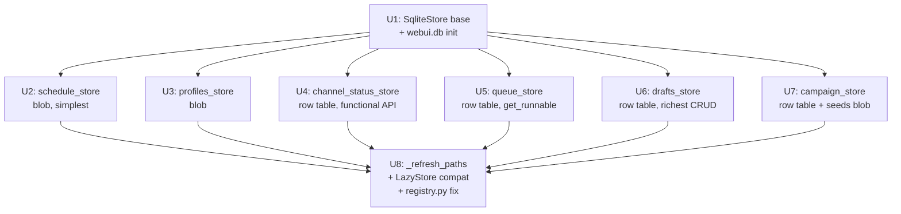

# refactor: Unify webui operational stores — 6 JSON stores → webui.db (SQLite)

## Overview

Six JSON-backed `webui_store` singletons (`drafts_store`, `profiles_store`,
`schedule_store`, `queue_store`, `campaign_store`, `channel_status_store`) are each
a separate file in `_config_dir()`. This plan migrates all six into a single
`webui.db` WAL-mode SQLite file, reusing the same plumbing that already governs
`events.db` and `dedup.db`. The result is a unified operational state layer with a
clear `Store` protocol seam that sets up the thin-WebUI shared-state story.

`events.db` (rebuildable event-log projection) and `dedup.db` (single-flight
idempotency guard) are intentionally left unchanged. `history_store` is excluded
(separate PARKED plan 2026-05-28-007 targets events.db).

## Problem Frame

The `webui_store` package scatters operational state across 6–7 JSON files, each
with its own atomic write path, in-process threading lock, and no cross-process
safety story. Every feature that needs cross-store consistency (a campaign linking
its drafts and queue tasks) must manually load from multiple files and hope they
don't diverge. The thin-WebUI plan (2026-05-27-004, shipped) requires a shared
state layer accessible in-process — but JSON files with per-file locks are brittle
across the scheduler thread and request threads.

A single `webui.db` in WAL mode gives: cross-store transactions, SQLite's own
concurrency model, a migration story, and reuse of `_store_sqlite.py` plumbing
already proven by `events.db` and `dedup.db`.

## Requirements Trace

- R1. New `webui.db` WAL-mode SQLite initialized in `_config_dir()`, reusing
  `events._store_sqlite` plumbing (WAL pragma, retry, 0o600 chmod, xattr exclusion)
- R2. `SqliteStore` abstract base class in `webui_store/sqlite_base.py` satisfies
  the `Store` protocol (`load/save/update`)
- R3. Each of the 6 stores migrated to a dedicated table in `webui.db`, preserving
  its full public API including subclass-specific methods
- R4. On first start after migration, each store's existing JSON file is
  auto-imported into `webui.db` via a one-shot startup migration (sentinel-protected,
  dedup-safe, idempotent)
- R5. All `from webui_store import <store>` import paths remain unchanged
- R6. `_LazyStore` proxy continues to work with SQLite-backed stores; path resolved
  from `_config_dir()` on first access
- R7. `_refresh_paths()` resets SQLite store singletons on env var change (same
  behaviour as JSON stores)
- R8. `dedup.db` and `events.db` are not modified; their schemas and tests unchanged
- R9. `history_store` is not migrated here (separate parked plan 2026-05-28-007)
- R10. All existing tests pass; new tests added per store using `tmp_path` isolation

## Scope Boundaries

- `history_store` (publish-history.json) is **out of scope** — it migrates to
  events.db per parked plan 2026-05-28-007, not to webui.db
- `dedup.db` is **out of scope** — `BEGIN IMMEDIATE` single-flight semantics must
  stay isolated; see Key Technical Decisions
- `events.db` is **out of scope** — it is not webui operational state
- Route, service, and CLI call sites are **not rewritten** — only the store backing
  implementation changes
- `Store` protocol interface shape is **not changed**
- `channel_status.py` functional API (`mark_bound`, `mark_expired`, etc.) is **not
  changed** — only the backing store under those functions changes

## Context & Research

### Relevant Code and Patterns

- `webui_store/base.py` — `Store` protocol (load/save/update), `JsonStore`, `_LazyStore`
- `webui_store/__init__.py` — 6 `_LazyStore` singleton bindings + `_refresh_paths()`
- `webui_store/channel_status.py` — functional API over `channel_status_store`;
  `reconcile_on_load` called at startup
- `webui_store/drafts.py` — `DraftsStore`: richest CRUD surface (9 methods including
  `bulk_publish_now`); **note: `get_by_campaign_id` and `bulk_publish_now` are each
  defined twice in the file — duplicate stubs, confirmed by research**
- `webui_store/campaign_store.py` — `CampaignStore`: list + nested seeds with
  `update_seed_status` recomputing `progress_pct`
- `webui_store/queue_store.py` — `QueueStore`: `get_runnable()` currently does a
  Python datetime comparison loop over the full list
- `src/backlink_publisher/events/_store_sqlite.py` — shared plumbing: `_retry_sqlite`,
  `_tighten_wal_sidecars`, `_set_backup_exclude_xattr`, `_is_transient_sqlite_error`
- `src/backlink_publisher/idempotency/store.py` — `DedupStore`: canonical
  SQLite-store implementation pattern for this codebase (`_connect_raw`, WAL pragma,
  `connect` / `connect_immediate` context managers)
- `docs/plans/2026-05-28-007-refactor-history-store-events-db-migration-plan.md` —
  PARKED; its startup migration pattern (R6: import JSON → dedup + sentinel → rename)
  is directly reusable here

### Institutional Learnings

- `docs/solutions/test-failures/del-os-environ-poisons-session-scoped-config-dir-fixture-2026-05-27.md`
  — `webui.db` path comes from `BACKLINK_PUBLISHER_CONFIG_DIR`; store tests must use
  `monkeypatch.setenv`, never `del os.environ[...]`
- `docs/solutions/test-failures/tests-coupled-to-operator-config-state-2026-05-18.md`
  — `_isolate_user_dirs` autouse fixture sandboxes `_config_dir()` at session start;
  new SQLite stores are automatically sandbox'd IF they are lazy-init (not import-time)
- `docs/solutions/logic-errors/projector-silent-drop-status-vocabulary-drift-2026-05-26.md`
  — WAL nested-connection deadlock: do not open a second connection inside an active
  WAL transaction; startup migrations must use a single connection/transaction
- `docs/solutions/logic-errors/save-config-write-paths-bypass-preservation-2026-05-15.md`
  — full-rewrite silently drops unknown fields; startup migration must inventory every
  JSON key and map it explicitly to a schema column or `data_json` blob
- `docs/solutions/architecture-health-audit-2026-06-01.md` — 8 backend modules import
  from `webui_store`; renaming import paths is high churn at zero benefit; only change
  the backing implementation

## Key Technical Decisions

- **New `webui.db`, not `events.db`**: events.db is a *rebuildable read-side
  projection* — a rebuild wipes and re-projects from the event log. Adding operational
  CRUD (drafts, queue, schedule) would make it non-rebuildable and mix two
  fundamentally different data categories (event audit log vs. live UI state). A
  separate `webui.db` in the same WAL/chmod family preserves both invariants.

- **`dedup.db` is not merged**: `DedupStore`'s module docstring documents the
  separation as intentional and architectural: dedup.db is a *durable write-gating
  authority* whose data cannot be rebuilt from any other source. Additionally,
  `gate_and_claim` uses `BEGIN IMMEDIATE` to serialize concurrent writers; merged into
  `webui.db`, a dedup gate would lock all concurrent CRUD writes to drafts/queue/
  schedule tables, causing latency spikes on the publish path. Correct final state:
  three SQLite files (events.db · webui.db · dedup.db), not one.

- **`Store` protocol preserved exactly**: All 8 backend callers and all webui routes
  import from `webui_store` by name and use `load/save/update`. Changing the protocol
  would touch every call site. The migration changes only the backing IO.

- **Blob storage for all-or-nothing stores** (schedule_store, profiles_store): Both
  are accessed exclusively via `update(fn)` lambdas that load-all, modify, save-all.
  A single-row `data_json` blob table matches the existing semantics with zero schema
  design overhead and no risk of partial-key divergence. Proper columns deferred.

- **Proper columns for query-heavy stores** (channel_status, drafts, queue, campaign):
  These stores have filter methods (`get_by_campaign_id`, `get_runnable`, `get_status`)
  that currently do Python list scans. Proper columns + indexes turn these into
  targeted `SELECT … WHERE` queries and unlock targeted UPDATE paths.

- **Seeds as JSON blob in campaigns**: `update_seed_status` currently loads the full
  seeds list, mutates one entry, and saves. A separate `campaign_seeds` table adds
  join complexity without unlocking new query patterns. Store seeds in a `seeds_json`
  column; normalize later if seed-level queries are needed.

- **Incremental shipping (one store per PR)**: Unit 1 lands first; Units 2–7 ship
  in separate PRs in ascending complexity order. Each migration's startup import is
  validated in production before the next one lands.

- **Startup migration is sentinel-protected**: consistent with history_store R6.
  Sentinel file `.webui-<store>-migrated-v1` in `_config_dir()` prevents double-import.
  Original JSON renamed to `<name>.json.migrated` after successful import.

## Open Questions

### Resolved During Planning

- *Merge into events.db?* No — events.db is a rebuildable projection; operational
  CRUD is not event-log data.
- *Merge dedup.db?* No — BEGIN IMMEDIATE write contention + documented intentional
  separation (see Key Technical Decisions).
- *Rename import paths?* No — 8 backend + all webui routes; audit showed zero benefit.
- *Separate .db per store?* No — 6 more files in config_dir; defeats "unified layer"
  goal; no cross-store transaction benefit.

### Deferred to Implementation

- *[R2]* Exact DDL for each table (column names, types, index strategy) — determined
  per-unit during implementation; directional schemas given in each unit's Approach
- *[R4]* Corrupt JSON handling during startup migration — match `JsonStore.load()`
  silent-fallback-to-default behaviour on `json.JSONDecodeError`
- *[R3]* `DraftsStore.bulk_publish_now` wraps multiple `update_item` calls — whether
  these run inside a single SQLite transaction is an implementation call
- *[R3]* `CampaignStore.update_seed_status` seeds-as-blob vs. seeds table — blob
  confirmed for this plan; decide at Unit 7 implementation time if query patterns
  differ from expectations

## High-Level Technical Design

> *This illustrates the intended approach and is directional guidance for review, not
> implementation specification. The implementing agent should treat it as context, not
> code to reproduce.*

**Storage layout before and after Route B:**

```
Before:
  config_dir/
    draft-queue.json        ← drafts_store
    campaign-profiles.json  ← profiles_store
    schedule-settings.json  ← schedule_store
    publish-queue.json      ← queue_store
    campaigns.json          ← campaign_store
    channel-status.json     ← channel_status_store
    publish-history.json    ← history_store (PARKED plan → events.db)
    events.db               ← EventStore   (rebuildable read-side projection)
    dedup.db                ← DedupStore   (durable idempotency authority)

After Route B:
  config_dir/
    webui.db                ← WebUI operational state (WAL, 6 tables)
      ├─ settings           (blob: id=1, data_json)
      ├─ profiles           (blob: id=1, data_json)
      ├─ channel_status     (rows: channel PK, status, bound_at, …)
      ├─ tasks              (rows: id PK, status, next_retry_at, data_json)
      ├─ drafts             (rows: id PK, campaign_id INDEX, data_json)
      └─ campaigns          (rows: id PK, status, created_at, seeds_json, data_json)
    publish-history.json    ← unchanged (PARKED plan still pending)
    events.db               ← unchanged
    dedup.db                ← unchanged
    draft-queue.json.migrated       } post-migration artefacts
    campaign-profiles.json.migrated }
    …
```

**`Store` protocol seam stays intact throughout:**

```
Caller code (routes, services, scheduler)
    │  from webui_store import drafts_store
    ▼
_LazyStore proxy  (unchanged)
    │  .load() / .save() / .update(fn)
    ▼
SqliteStore subclass  (new — replaces JsonStore)
    │  SQL over webui.db
    ▼
webui.db  (single WAL SQLite, 6 tables)
```

**Implementation unit dependency graph:**



Units 2–7 are independent after U1 and ship as separate PRs. U8 is the integration
cleanup that runs after all six stores have landed.

## Implementation Units

- [ ] **Unit 1: `webui_store/sqlite_base.py` — SqliteStore base class + webui.db init**

**Goal:** Establish the shared SQLite plumbing for all webui stores. No store is
migrated yet; this is the infrastructure prerequisite for all subsequent units.

**Requirements:** R1, R2

**Dependencies:** None

**Files:**
- Create: `webui_store/sqlite_base.py`
- Test: `tests/test_webui_store_sqlite_base.py`

**Approach:**
- `WebUIDatabase` class owns the `webui.db` path (`_config_dir() / "webui.db"`),
  provides a `connect()` context manager mirroring `DedupStore._connect_raw`: WAL
  pragma, `synchronous=NORMAL`, `busy_timeout=5000`, 0o600 chmod on first create,
  `_tighten_wal_sidecars`, `_set_backup_exclude_xattr`
- **`WebUIDatabase` must define its own `_DB_FILENAME = "webui.db"` constant and
  derive the path independently — it must NOT call `_default_db_path()` from
  `_store_sqlite.py`, which is hardcoded to `"events.db"` and would silently
  misdirect connections to the event-log database**
- `SqliteStore` abstract base satisfies the `Store` protocol; provides a concrete
  `update(fn)` default (load → fn → save under `threading.Lock`); subclasses
  override `load` and `save` only
- **`SqliteStore.save()` must acquire `_lock` internally** — not just `update()`.
  `settings_service.py` calls `_schedule_store.save(data)` directly (bypasses
  `update()` entirely); for row-based stores with delete-all semantics, an
  unguarded `save()` allows a concurrent `update_item()` to interleave mid-rewrite
- `_retry_sqlite` imported from `events._store_sqlite` — do not copy-paste
- Each subclass will call DDL in its `__init__` (or on first connect) to create its
  own table; `WebUIDatabase` does not own any DDL itself
- No schema migration framework at this stage — tables are created with
  `CREATE TABLE IF NOT EXISTS`; versioning deferred

**Patterns to follow:**
- `src/backlink_publisher/idempotency/store.py` → `_connect_raw` + `connect()` CM
- `src/backlink_publisher/events/_store_sqlite.py` → retry + sidecar helpers
- `webui_store/base.py` → `Store` protocol and `_LazyStore` shape

**Test scenarios:**
- Happy path: `WebUIDatabase` in `tmp_path` creates `webui.db`, opens WAL connection,
  writes + commits, reads back
- Happy path: path resolves from `BACKLINK_PUBLISHER_CONFIG_DIR` at first access (lazy)
- Edge case: file created 0o600; WAL sidecars tightened on second connect (sidecars
  pre-exist from prior write)
- Edge case: `webui.db` missing → first access creates it
- Integration: concrete `SqliteStore` subclass `update(fn)` holds lock — concurrent
  thread sees either old or new value, never intermediate state

**Verification:**
- `isinstance(ConcreteSubclass(), Store)` returns True at runtime
- `tests/test_webui_store.py::TestStoreProtocol` passes when substituting a concrete
  `SqliteStore` subclass
- `webui.db` created 0o600; WAL/SHM sidecars are 0o600 after a write

---

- [ ] **Unit 2: `schedule_store` → `webui.db` `settings` table**

**Goal:** Migrate the simplest store (plain dict, always accessed as a whole) to
prove the end-to-end pattern before tackling richer stores.

**Requirements:** R3, R4, R5, R6, R10

**Dependencies:** Unit 1

**Files:**
- Create: `webui_store/schedule.py` (new `ScheduleSqliteStore` class)
- Modify: `webui_store/__init__.py` (replace `JsonStore` binding)
- Test: `tests/test_webui_store_schedule_sqlite.py`

**Approach:**
- Table DDL: `CREATE TABLE IF NOT EXISTS settings (id INTEGER PRIMARY KEY, data_json TEXT NOT NULL DEFAULT '{}')`
- `load()` → `SELECT data_json WHERE id=1`; returns `json.loads(row)` or `{}` if absent
- `save(value)` → `INSERT OR REPLACE INTO settings (id, data_json) VALUES (1, json.dumps(value))`
- `update(fn)` → inherited from `SqliteStore` (load + fn + save under lock)
- Startup migration — **sequence is load-bearing**:
  1. `save()` into `webui.db` inside a SQLite transaction (commit first)
  2. Only rename `.json` → `.json.migrated` after the commit succeeds
  3. Write sentinel only after the rename succeeds
  Each step is conditional on the prior step's success. If the process crashes after
  rename but before sentinel: next boot detects `.json.migrated` + absent sentinel →
  write sentinel only (data already in webui.db). If `.json` is corrupt/absent on
  first run: silently skip; sentinel NOT written (allows future retry if file appears).
  If webui.db `load()` returns `default_factory()` after migration, log a warning
  so operators can detect silent corruption rather than serving empty state.

**Patterns to follow:**
- History_store migration R6 pattern in `docs/plans/2026-05-28-007-…-plan.md`
- `JsonStore.load()` silent-default fallback on corrupt JSON

**Test scenarios:**
- Happy path: `load()` returns `{}` when no row exists
- Happy path: `save({"a": 1})` + `load()` roundtrip
- Happy path: `update(lambda d: {**d, "b": 2})` merges correctly
- Edge case: startup migration runs when JSON present + sentinel absent → data visible via `load()`
- Edge case: startup migration is no-op when sentinel exists (idempotent)
- Edge case: corrupt JSON file during migration → silently skip; sentinel NOT written
- Edge case: `.json.migrated` present + sentinel absent → crash recovery path writes sentinel only
- Integration: `schedule_store` imported from `webui_store` satisfies `isinstance(schedule_store, Store)`

**Verification:**
- `from webui_store import schedule_store; schedule_store.load()` works in `tmp_path` sandbox
- `schedule-settings.json.migrated` exists post-migration; subsequent starts do not re-import
- All existing callers in `webui_app/` pass their tests unchanged

---

- [ ] **Unit 3: `profiles_store` → `webui.db` `profiles` table**

**Goal:** Migrate profiles_store (list of dicts, always accessed as whole) using the
same blob-table pattern proven in Unit 2.

**Requirements:** R3, R4, R5, R6, R10

**Dependencies:** Unit 1

**Files:**
- Create: `webui_store/profiles.py` (new `ProfilesSqliteStore`)
- Modify: `webui_store/__init__.py`
- Test: `tests/test_webui_store_profiles_sqlite.py`

**Approach:**
- Table DDL: `CREATE TABLE IF NOT EXISTS profiles (id INTEGER PRIMARY KEY, data_json TEXT NOT NULL DEFAULT '[]')`
- `load()` returns `json.loads(row)` or `[]` if absent
- `save(value: list)` → `INSERT OR REPLACE INTO profiles (id, data_json) VALUES (1, json.dumps(value))`
- Startup migration from `campaign-profiles.json`

**Patterns to follow:** Unit 2 blob-table pattern

**Test scenarios:**
- Happy path: load/save/update roundtrip for list of profile dicts
- Edge case: startup migration preserves all profile records
- Edge case: empty profiles list → `save([])` + `load()` returns `[]`
- Integration: `routes/profiles.py` upsert/delete lambda pattern works identically post-migration

**Verification:**
- `profiles_store.load()` in sandboxed test returns expected list; `routes/profiles.py` tests pass

---

- [ ] **Unit 4: `channel_status_store` → `webui.db` `channel_status` table**

**Goal:** Migrate channel_status (keyed dict, functional API) to a proper row table
with channel slug as primary key. The functional API (`mark_bound`, `mark_verified`,
etc.) stays unchanged.

**Requirements:** R3, R4, R5, R6, R10

**Dependencies:** Unit 1

**Files:**
- Modify: `webui_store/channel_status.py` (replace `JsonStore` backing with
  `ChannelStatusSqliteStore`; functional API unchanged)
- Modify: `webui_store/__init__.py` (update binding)
- Test: extend `tests/test_webui_store_pkg/test_channel_status.py`
- Test: extend `tests/test_webui_store_pkg/test_channel_status_reconcile.py`

**Approach:**
- Table DDL:
  ```
  channel_status (
    channel          TEXT PRIMARY KEY,
    status           TEXT NOT NULL,
    bound_at         TEXT,
    storage_state_path TEXT,
    last_verified_at TEXT,
    extra_json       TEXT   -- stores identity_mismatch_old/new fields
  )
  ```
  `extra_json` avoids sparse columns for infrequent `identity_mismatch` fields
- `load()` → `SELECT * FROM channel_status` → reconstruct `dict[str, dict]`
  (matches current contract exactly)
- `save(value: dict[str, dict])` → transaction: delete-all + bulk-insert rows
  (full-rewrite semantics match current behaviour)
- `update(fn)` → inherited load + fn + save under lock; all functional API callers
  (`mark_bound`, `mark_verified`, etc.) call `channel_status_store.update(_apply)`
  and require **no changes**
- `reconcile_on_load()` uses `channel_status_store.update(_apply)` → no change
- Startup migration from `channel-status.json`

**Patterns to follow:**
- Unit 2 startup migration pattern
- `channel_status.py` functional API (no behavioural change to public functions)

**Test scenarios:**
- Happy path: `mark_bound("medium", "/tmp/state.json")` → row inserted;
  `get_status("medium")["status"] == "bound"`
- Happy path: `mark_verified("medium")` → `last_verified_at` updated; other fields preserved
- Happy path: `mark_identity_mismatch("velog", old_account="a", new_account="b")` → row with
  `status="identity_mismatch"` and `extra_json` containing old/new accounts
- Happy path: `mark_expired("medium")` sets `status="expired"`, clears `last_verified_at`
- Edge case: `get_status("unknown_channel")` returns `_UNBOUND_DEFAULT` (no KeyError)
- Edge case: `reconcile_on_load()` demotes bound records with missing `storage_state_path`
- Edge case: second `mark_identity_mismatch` call on an already-mismatch record is no-op
- Integration: `list_all()` returns `dict` shape; startup migration preserves all records

**Verification:**
- All existing `test_channel_status.py` and `test_channel_status_reconcile.py` tests pass
- `channel_status_store.load()` returns `dict[str, dict]` shape (unchanged contract)

---

- [ ] **Unit 5: `queue_store` → `webui.db` `tasks` table**

**Goal:** Migrate queue_store (list of task dicts with datetime-based filtering) to a
proper row table with an indexed `status` column.

**Requirements:** R3, R4, R5, R6, R10

**Dependencies:** Unit 1

**Files:**
- Modify: `webui_store/queue_store.py` (replace `JsonStore` super with `QueueSqliteStore`)
- Modify: `webui_store/__init__.py`
- Test: `tests/test_webui_store_queue_sqlite.py`

**Approach:**
- Table DDL:
  ```
  tasks (
    id            TEXT PRIMARY KEY,
    status        TEXT NOT NULL,
    next_retry_at TEXT,
    data_json     TEXT NOT NULL
  )
  CREATE INDEX tasks_status_retry ON tasks(status, next_retry_at)
  ```
- `load()` → `SELECT * FROM tasks ORDER BY rowid` → list (preserves insertion order)
- `save(value: list)` → transaction: delete-all + bulk-insert
- `update_task(task_id, updates)` → targeted `UPDATE tasks SET status=?, next_retry_at=?,
  data_json=? WHERE id=?` (replaces current full-list-scan RMW)
- `get_runnable()` → `SELECT * FROM tasks WHERE status IN ('pending', 'failed')
  AND (next_retry_at IS NULL OR next_retry_at <= ?)` with `datetime.now().isoformat()`
  (replaces Python datetime comparison loop)
- Startup migration from `publish-queue.json`

**Test scenarios:**
- Happy path: `update_task("t1", {"status": "done"})` mutates only that task; others unchanged
- Happy path: `get_runnable()` returns tasks with past `next_retry_at` and eligible status
- Edge case: `get_runnable()` excludes tasks with future `next_retry_at`
- Edge case: `update_task` on absent id → no-op (0 rows updated, no error)
- Edge case: load/save/update roundtrip for list of task dicts (Store protocol compat)
- Integration: `scheduler.py` queue-task access patterns pass post-migration

**Verification:**
- `queue_store.get_runnable()` returns correct subset in `tmp_path` sandbox
- `update_task` is a targeted SQL UPDATE, not load-all-modify-save

---

- [ ] **Unit 6: `drafts_store` → `webui.db` `drafts` table**

**Goal:** Migrate the richest-CRUD store (9 methods, `bulk_publish_now`) to a proper
row table. Also removes the two pairs of duplicate method definitions in `drafts.py`.

**Requirements:** R3, R4, R5, R6, R10

**Dependencies:** Unit 1

**Files:**
- Modify: `webui_store/drafts.py` (replace `JsonStore` super; remove duplicate defs)
- Modify: `webui_store/__init__.py`
- Test: extend `tests/test_webui_store_bulk_helpers.py`
- Test: `tests/test_webui_store_drafts_sqlite.py`

**Approach:**
- Table DDL:
  ```
  drafts (
    id           TEXT PRIMARY KEY,
    campaign_id  TEXT,
    inserted_at  INTEGER NOT NULL,
    data_json    TEXT NOT NULL
  )
  CREATE INDEX drafts_campaign ON drafts(campaign_id)
  CREATE INDEX drafts_inserted ON drafts(inserted_at DESC)
  ```
  `inserted_at` is epoch-millisecond (`int(time.time() * 1000)`) set at INSERT
- `load()` → `SELECT * FROM drafts ORDER BY inserted_at DESC` → list
  **Ordering is load-bearing**: the legacy `insert_first` put new items at position 0
  (newest-first); `rowid ASC` would silently reverse this and break the drafts UI.
  `inserted_at DESC` preserves the contract explicitly.
- `save(value: list)` → transaction under `_lock`: delete-all + bulk-insert (preserves
  `inserted_at` from each item if present; assigns current epoch if absent)
- `get_item(id)` → `SELECT * FROM drafts WHERE id = ?`
- `update_item(id, **fields)` → `SELECT` + merge fields + `UPDATE` in one transaction;
  **if `status` is in fields, write it to both `status` column (if added later) and keep
  it inside `data_json`** — for now `data_json` is the single source of truth for status
- `delete_item(id)` → `DELETE FROM drafts WHERE id = ?`
- `get_by_campaign_id(campaign_id)` → `SELECT * FROM drafts WHERE campaign_id = ?`
- `bulk_delete(ids)` → `DELETE FROM drafts WHERE id IN (?…)` parameterized
- `bulk_update(ids, **fields)` → batch UPDATE per id in one transaction
- `insert_first(item)` → `INSERT INTO drafts …`; order preserved via rowid
- `bulk_publish_now(ids, publish_fn)` — logic unchanged; individual `update_item`
  calls are now targeted SQL UPDATEs
- **Fix in this unit:** remove the duplicate `get_by_campaign_id` and `bulk_publish_now`
  stubs that appear earlier in the file (confirmed as duplicate definitions)
- Startup migration from `draft-queue.json`

**Patterns to follow:**
- Unit 4 targeted-UPDATE pattern for item-level mutations
- Unit 5 indexed-column pattern for `campaign_id` filter

**Test scenarios:**
- Happy path: `insert_first(item)` → `get_item(item["id"])` returns item
- Happy path: `update_item("x", status="published")` mutates only that draft; others unchanged
- Happy path: `get_by_campaign_id("c1")` returns only drafts with matching campaign_id
- Happy path: `bulk_delete(["a","b"])` returns 2; missing ids silently skipped (0 rowcount)
- Happy path: `bulk_update(["a"], status="reviewing")` returns 1
- Edge case: `update_item` on absent id returns False without writing
- Edge case: `bulk_publish_now` with one failing `publish_fn` marks that item `failed`,
  continues for remaining items
- Error path: `publish_fn` raises exception → item marked `failed` with str(exc); no re-raise
- Integration: `drafts_api.py` and `scheduler.py` draft patterns pass existing tests

**Verification:**
- `drafts_store.get_by_campaign_id("c1")` uses a SQL WHERE clause
- No duplicate method definitions in `drafts.py` post-unit
- `tests/test_webui_store_bulk_helpers.py` concurrent tests pass with SQLite backing

---

- [ ] **Unit 7: `campaign_store` → `webui.db` `campaigns` table**

**Goal:** Migrate campaign_store (list of campaigns with nested seed records) to a
row table. Seeds stored as JSON blob to preserve existing sub-record semantics.

**Requirements:** R3, R4, R5, R6, R10

**Dependencies:** Unit 1

**Files:**
- Modify: `webui_store/campaign_store.py` (replace `JsonStore` super)
- Modify: `webui_store/__init__.py`
- Test: extend `tests/test_campaign_store.py`

**Approach:**
- Table DDL:
  ```
  campaigns (
    id           TEXT PRIMARY KEY,
    mode         TEXT,
    status       TEXT NOT NULL,
    created_at   TEXT,
    updated_at   TEXT,
    progress_pct REAL,
    seeds_json   TEXT,
    data_json    TEXT NOT NULL
  )
  CREATE INDEX campaigns_created ON campaigns(created_at DESC)
  ```
- `load()` → `SELECT * FROM campaigns ORDER BY created_at DESC` → list
  (reconstructed from columns + `json.loads(data_json)`)
- `save(value: list)` → delete-all + bulk-insert
- `get(id)` → `SELECT * FROM campaigns WHERE id = ?` (targeted)
- `create(...)` → `INSERT INTO campaigns ...`; returns `campaign_id`
- `update_status(id, **updates)` → targeted `UPDATE campaigns SET status=?, updated_at=? WHERE id=?`
- `update_seed_status(campaign_id, seed_index, **updates)`:
  → `SELECT seeds_json WHERE id=?` + parse + mutate + recompute `progress_pct` +
  `UPDATE campaigns SET seeds_json=?, progress_pct=?, updated_at=? WHERE id=?`
  — single transaction, no nested connection
- `list()` → same as `load()` but semantically explicit
- Startup migration from `campaigns.json`

**Execution note:** `update_seed_status` must use a single connection/transaction
(WAL nested-connection deadlock rule from the projector-silent-drop learning).

**Test scenarios:**
- Happy path: `create(...)` → `get(id)` returns campaign with seeds intact
- Happy path: `update_status(id, status="completed")` sets `status` + `updated_at`
- Happy path: `update_seed_status(id, 0, status="published")` → seed[0] updated;
  `progress_pct` recomputed; other seeds unchanged
- Edge case: `get("nonexistent")` returns None
- Edge case: startup migration preserves all campaign records and seed arrays exactly
- Error path: `update_status` with invalid status value raises (existing validation preserved)
- Integration: `tests/test_campaign_store.py` concurrent test (multiple threads calling
  `update_seed_status` on different seeds) passes

**Verification:**
- All existing `test_campaign_store.py` tests pass with SQLite backing
- `update_seed_status` uses a single transaction (no nested connection)

---

- [ ] **Unit 8: `_refresh_paths` + `_LazyStore` compat + `registry.py` fix**

**Goal:** Ensure `_refresh_paths()` resets all SQLite stores on env var change; confirm
`_LazyStore` cache invalidation works for SQLite-backed stores; fix `WebUIStores` to
cover all 6 migrated stores (currently omits `campaign_store` and `channel_status_store`).

**Requirements:** R6, R7

**Dependencies:** Units 2–7 (all stores migrated)

**Files:**
- Modify: `webui_store/__init__.py` (include new store singletons in `_refresh_paths` loop)
- Modify: `webui_store/registry.py` (fix `WebUIStores` to delegate to module-level singletons)
- Test: extend `tests/test_webui_store_isolation.py`

**Approach:**
- `_refresh_paths()` is already a loop calling `.reset()` on each `_LazyStore`.
  Adding the two previously-missing stores and confirming the SQLite-backed stores
  reset correctly (next access derives path from fresh `_config_dir()`) is sufficient.
- `_LazyStore._real()` cache invalidation (`_env_at_creation` comparison) applies
  equally to SQLite stores — `webui.db` path is `_config_dir() / "webui.db"`, same
  mechanism as JSON store paths.
- **`WebUIStores` dual-instance fix**: `registry.py` currently instantiates fresh store
  objects separate from the module-level `_LazyStore` singletons. After SQLite migration,
  both sets of instances hold independent `threading.Lock`s pointing at the same
  `webui.db` — the per-store lock invariant is broken and concurrent writes from
  `WebUIStores` vs. module-level paths would only be serialized by SQLite `busy_timeout`,
  not by Python locks. Fix: each `WebUIStores` property must delegate to the corresponding
  module-level singleton (e.g. return the global `drafts_store`) rather than constructing
  a new instance. One-liner per property; eliminates the dual-lock problem.

**Test scenarios:**
- Integration: changing `BACKLINK_PUBLISHER_CONFIG_DIR` mid-session + calling
  `_refresh_paths()` → subsequent `schedule_store.load()` reads from the new sandbox db
- Integration: `_LazyStore` wrapping a SQLite store does not cache across a config dir change
- Edge case: `WebUIStores` extension correctly wraps all 7 stores (including campaign +
  channel_status)

**Verification:**
- `_refresh_paths()` test in `test_webui_store_isolation.py` passes with SQLite backing
- `WebUIStores` extension exposes `campaign_store` and `channel_status_store` to Flask
  `app.extensions['webui_stores']`

## System-Wide Impact

- **Interaction graph:** `webui_app/scheduler.py` is the heaviest store caller —
  accesses `drafts_store`, `queue_store`, and `history_store` concurrently across
  `BackgroundScheduler` and request threads. SQLite WAL handles this naturally;
  the per-store threading lock in `SqliteStore.update()` prevents in-process races.
- **Error propagation:** `_retry_sqlite` surfaces `sqlite3.OperationalError` after 3
  attempts; transient lock errors retry rather than returning `default_factory()` as
  JSON parsing errors did. A failed startup migration should log a warning and
  continue (soft failure), not crash the WebUI.
- **State lifecycle risks:** Startup migration crash-recovery gap — if the process
  dies after renaming `.json` to `.json.migrated` but before writing the sentinel,
  the next start must detect `.json.migrated` + absent sentinel and write the sentinel
  without re-importing. Guard: check for `.json.migrated` existence before any
  migration attempt.
- **API surface parity:** All 8 backend modules importing from `webui_store` continue
  to resolve the same names. No import path changes. The `Store` protocol contract is
  preserved; `isinstance(store, Store)` still returns True.
- **Integration coverage:** `scheduler.py` concurrent access to `drafts_store` +
  `queue_store` is the highest-risk scenario post-migration. The existing
  `test_webui_store_bulk_helpers.py` concurrent tests must pass with SQLite backing.
- **Unchanged invariants:** `events.db` schema, `dedup.db` schema, all CLI tools that
  do not touch `webui_store` directly, and `publish-history.json` (PARKED plan) are
  unaffected by this plan.

## Risks & Dependencies

| Risk | Mitigation |
|------|------------|
| WAL nested-connection deadlock during startup migration | Single connection/transaction per store; do not open second connection inside active transaction (`projector-silent-drop` learning) |
| Startup crash-recovery: `.json` renamed, sentinel not written | Unit 2+: guard checks for `.json.migrated` + absent sentinel → write sentinel only, skip import |
| Duplicate `get_by_campaign_id`/`bulk_publish_now` in `drafts.py` causes test confusion before Unit 6 | Remove duplicate stubs in Unit 6 PR; file is JSON-backed until then so not a behaviour risk |
| `complexity_budget.toml` CC 30 backstop fails on `SqliteStore` or `DraftsSqliteStore` | Pre-measure CC after Unit 1/6 implementation; add budget entries before CI if any function exceeds 10 |
| `WebUIStores` registry.py omits `campaign_store` and `channel_status_store` | Explicitly fixed in Unit 8 |
| `DraftsStore.bulk_publish_now` partial failure atomicity | Existing behaviour (JSON version has same atomicity); document but do not change semantics in this plan |
| tests that use `monkeypatch.delattr(os.environ, ...)` instead of `monkeypatch.setenv` break SQLite path | Enforce `monkeypatch.setenv` in all new store tests; audit existing tests during Unit 1 |

## Documentation / Operational Notes

- After each store PR lands, `.json.migrated` files accumulate in `config_dir`.
  Operators can delete them manually once confident; auto-deletion is out of scope.
- `BACKLINK_PUBLISHER_CONFIG_DIR=/tmp/blp-smoke-$$ python webui.py` sandboxes
  `webui.db` automatically; no special handling needed for dev smoke testing.
- `webui.db` receives `_set_backup_exclude_xattr` on macOS — consistent with
  `events.db`; it is operational state, not a backup artefact.
- Future: once all 6 stores are in `webui.db` and pattern is proven, revisit the
  PARKED history_store plan (2026-05-28-007). That plan targets `events.db` (event-
  sourced data), not `webui.db` — the distinction remains valid.

## Sources & References

- **Parked history_store plan:** `docs/plans/2026-05-28-007-refactor-history-store-events-db-migration-plan.md`
- **thin-WebUI requirements:** `docs/brainstorms/2026-05-27-thin-webui-phase-b-in-process-pipeline-requirements.md`
- **SQLite plumbing:** `src/backlink_publisher/events/_store_sqlite.py`
- **Reference SQLite store:** `src/backlink_publisher/idempotency/store.py` (DedupStore)
- **Architecture Health Audit:** `docs/solutions/architecture-health-audit-2026-06-01.md`
- **WAL nested deadlock:** `docs/solutions/logic-errors/projector-silent-drop-status-vocabulary-drift-2026-05-26.md`
- **Import path preservation:** `docs/solutions/architecture-health-audit-2026-06-01.md`
