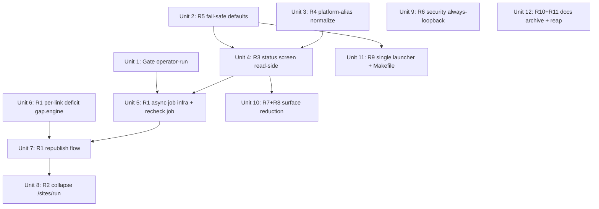

# feat: Internal Edition LITE — keep-alive operator loop + launch hardening

## Overview

Ship a **LITE / short edition** of backlink-publisher that an internal operator (solo + the
occasional same-machine colleague) can use to **defend the ~73 already-live dofollow backlinks**
to the real money site `51acgs.com`, via a single guided WebUI screen: *recheck → see which links
are stripped, per target → republish the gaps to sticky platforms → confirm they went live.*

The engine already works (verified: 73 live-dofollow, 2026-06-02). This plan **productizes, it does
not rebuild** — the keep-alive chain (`build_ledger → plan_gap → PipelineAPI.plan/validate/publish
→ recheck`) exists in-process. The genuinely net-new work is (a) an **async job + progress UI**
(both recheck and publish block the request today) and (b) one **per-link stripped-aware deficit**
decision in `gap/engine.py`. Everything else is sequencing, data-honesty, and fail-safe gating.

Access model is **single trusted machine, loopback, no app login** (see origin), so all
auth/deploy/multi-tenant work is explicitly deferred to a later UPGRADE edition and is out of scope
here.

## Problem Frame

The owner wants to hand a *recently*-working engine to a team. The scarce resource is **keeping the
deep links alive on platforms that don't strip them**, not publishing more: 33 of 112 rechecks came
back `link_stripped` (~29% blended, but **56–67% on the deep comic pages** that carry ranking
equity), and telegra.ph alone causes 86% of strips while ghpages/blogger-api strip 0%. The current
WebUI can technically drive the pipeline, but the operator-facing keep-alive loop is split across
tabs, the publish path blocks for minutes, and the scorecard double-counts `-api` platform variants.
See origin: `docs/brainstorms/2026-06-04-internal-edition-launch-requirements.md`.

## Requirements Trace

- **R1.** Single guided keep-alive flow: recheck → per-target scorecard (live/stripped/decayed/
  check-failed) → review gaps → confirm → republish to sticky platforms → auto-recheck. (Units 5–7)
- **R2.** `/sites/run` dead-end is superseded by R1 — redirect or remove; no second pipeline. (Unit 8)
- **R3.** Read-only "what's live" status view: per-target (never blended) live_dofollow, strip-rate,
  unknown-follow distinct from dead, last-verified, staleness banner; exclude `example.com`. (Unit 4)
- **R4.** Fix the `-api` double-count by normalizing platform at the ledger chokepoint. (Unit 3)
- **R5.** `python webui.py` debug default True→False; pin a persistent SECRET_KEY. (Unit 2)
- **R6.** Authoritative LITE security posture + make `ALLOW_NETWORK=1` inert/refuse-to-start;
  record accepted risk. (Unit 9)
- **R7.** Strip operator nav to keep-alive core; hide Pro surfaces server-side. (Unit 10)
- **R8.** Hide not-implemented surfaces (e.g. `copilot/run-live` 501 stub) from the operator. (Unit 10)
- **R9.** One launcher / README / AGENTS pointer; rewire Makefile + post-merge hook. (Unit 11)
- **R10.** Archive ~334 shipped/parked `.md` docs into `docs/_archive/`. (Unit 12)
- **R11.** Reap `events.db.v4bak`; **drop** the `webui.py` shim removal from LITE. (Unit 12)
- **Gate.** A non-author runs the chain end-to-end and produces ≥1 fresh verified live link before
  the R1 build proceeds. (Unit 1)

## Scope Boundaries

- **No app authentication / login**, no Docker/WSGI/hosted deploy, no per-user state isolation
  (all UPGRADE). No new publishing adapter. No GA4/attribution (no corpus).
- **No `webui.py` re-export shim removal** — 46 live `webui.<name>` patch points make it a focused
  refactor, not LITE tidy.
- No deletion of the docs corpus or audited archive dirs (`.stash-archive/`, `.archive/`,
  `patches/`) — archive/hide only.
- `publish-backlinks` stays a **subprocess** (deliberate credential/SSRF isolation) — do not move
  it in-process for "uniformity."
- Multi-**site** onboarding and scheduled/automatic keep-alive are out of scope (manual one-click
  v1; scheduling is UPGRADE).

## Context & Research

### Relevant Code and Patterns

**Async/job execution (the crux):**
- `webui_app/services/bind_job.py` — `BindJobRegistry`: lock + worker-thread + in-memory
  `poll(job_id)` the browser polls. **This is the pattern R1's recheck + republish jobs follow.**
- `webui_app/scheduler.py` — APScheduler `BackgroundScheduler` (single worker, `max_workers=1`),
  used by the publish queue + scheduled drafts; **auto-disabled under pytest** — the
  `PYTEST_CURRENT_TEST` gate lives in `webui_app/__init__.py` (`create_app` decides whether to
  `_scheduler.start()`), not in `scheduler.py`.
- Existing recheck (`webui_app/routes/history.py:81-106`, `routes/equity_ledger.py:54`,
  `services/recheck.py`) is **synchronous-in-request** — does not survive a ~70-link sweep.

**In-process engines R1 orchestrates (do NOT subprocess these):**
- `src/backlink_publisher/ledger/aggregate.py::build_ledger(...)`
- `src/backlink_publisher/gap/engine.py::plan_gap(rows, opts: GapOptions, *, active_dofollow=None, now=None)` — pure; the deficit-model change lives here.
- `src/backlink_publisher/recheck/probe.py::probe_liveness(...)`, `recheck_link(record, probe=)`;
  `recheck/selection.py::select_candidates(...)`; `webui_app/services/recheck.py::recheck_one/recheck_many`.
- `webui_app/api/pipeline_api.py::PipelineAPI` — `plan(seed_json)` & `validate(plans_jsonl, no_check_urls=True)` in-process; **`publish(plans_jsonl, platform, mode)` is subprocess (keep it)**; helpers `parse_publish_results`, `publish_state_summary`, and the stdin-safe `_parse_jsonl_rows` (do NOT use `read_jsonl` — it `SystemExit`s in Flask).

**Frontend pattern (mirror the equity ledger exactly):**
- Route: `webui_app/routes/equity_ledger.py`; template: `templates/equity_ledger.html`; ESM:
  `static/js/equity.js` (reusable liveness-badge / live_dofollow rendering); shared `static/js/lib/{dom,api}.js`.
- `_render(..., active_page=...)` (`webui_app/helpers/contexts.py:267`); register blueprint in
  `webui_app/routes/__init__.py`; nav in `templates/base.html`.

**R4 dedup seam:**
- Chokepoint: `src/backlink_publisher/ledger/sources.py:149` (`link.platform = platform`, verbatim).
  **First confirm** whether that `platform` value is an *adapter string* (`telegraph-api`, matching the
  map keys) or an already-canonical platform name — the normalizer must default-pass-through either way.
- Existing collapse map: `src/backlink_publisher/idempotency/backfill.py::_ADAPTER_STRING_TO_PLATFORM`
  (`telegraph-api→telegraph`, …; line 65), guarded by a grep-test in `tests/test_idempotency_backfill.py`.

### Institutional Learnings

- `docs/solutions/ui-bugs/webui-blocking-subprocess-and-missing-progress-feedback-2026-05-12.md`
  (high): any >5s op needs an immediate client overlay + disabled submit + time estimate. Add a
  `time curl localhost:8888/ < 500ms` smoke check to verification.
- `docs/solutions/ux-honesty/webui-false-success-resolution.md`: bulk publish/schedule split-state;
  return structured `{ok, error_code, flash_type, flash_msg}` and support rollback. R1 partial-failure
  is this class — never return `ok:true` on a partial/failed outbound action.
- `docs/plans/2026-05-29-004-feat-recheck-backlinks-survival-loop-plan.md` (completed): recheck→ledger
  liveness **writeback was deferred** → ledger liveness column is stale → **R3 must read events.db
  `link.rechecked` time-series as the liveness authority**, not the ledger column. `probe_error` must
  not advance the cursor or become a gap.
- `docs/solutions/best-practices/medium-liveness-probe-partial-spike-2-2026-05-19.md`: always-on probe
  has anti-bot/IP-reputation risk → keep recheck **operator-triggered, one-shot** (matches LITE).
- `docs/plans/2026-05-29-007-feat-plan-gap-deficit-replan-plan.md` (completed): `plan-gap` deficit is
  **page-count** (`max(0, D − live_dofollow)`), only 5 active dofollow channels (D≥5 → `channel_exhausted`).
- `docs/plans/2026-05-27-004-refactor-thin-webui-in-process-pipeline-plan.md` (completed): plan/validate
  in-process, **publish stays subprocess**; concurrency hazard = scheduler thread vs request thread on
  process-global `sys.stdout/stdin`.
- `docs/solutions/best-practices/app-level-csrf-guard-makes-blueprint-csrf-dead-code-2026-05-27.md`:
  single global CSRF guard; sensitive routes add **orthogonal** `_check_bind_origin_or_abort()` +
  `_refuse_when_allow_network()`, not a second CSRF token. Seed canonical `session['csrf_token']` in tests.
- `docs/solutions/best-practices/webui-config-request-cache-governance-2026-06-03.md`: read-path handler
  uses `_g_cache('config', load_config)`; write-path handler calls `load_config()` directly + registers
  in `_WRITE_HANDLER_SPECS`. `webui_app/` has a CC≤30 backstop test.
- `docs/plans/2026-06-03-008-refactor-webui-store-sqlite-unification-plan.md` (completed): 6 stores
  unified into `webui.db` — if persisting job state, use `webui.db`, don't add a 7th JSON store.

### External References

None — internal productization of an existing Flask + zero-build ESM codebase with strong local
patterns. External research intentionally skipped.

## Key Technical Decisions

- **Async model = the `bind_job.py` thread + browser-poll pattern**, applied to a new recheck job
  and a new republish job. Rationale: it is the established "long job, progress-streaming,
  browser-polled" idiom; in-memory is acceptable for an operator-present flow; avoids contending the
  single-worker APScheduler that the publish queue uses. Status endpoints are **GET** (exempt from
  the 60/min mutating-verb limiter).
- **Gap definition = per-link stripped-aware (D1, option b), in `gap/engine.py`.** Rationale: the
  Success Criteria require deep-page links to "go up *and stay up*"; the native page-count deficit
  returns **0 gaps at `--desired 5`** even when individual links are stripped (confirmed by the gate
  dry-run). A true gap = "a previously-live-dofollow link is now `link_stripped`/`host_gone`."
- **Liveness authority = events.db `link.rechecked` time-series, not the ledger liveness column.**
  Rationale: recheck→ledger writeback was deferred (shipped learning); the ledger column is stale.
- **Republish destination = a hard sticky-platform allowlist (ghpages, blogger); telegra.ph
  excluded.** Rationale: telegra.ph re-strips 29–38% and causes 86% of strips; "sticky" is a
  plan-level constant (not a registry concept) R1 carries itself.
- **`publish` stays subprocess; everything else in-process.** Rationale: deliberate credential/SSRF
  isolation (shipped decision); only `plan/validate/build_ledger/plan_gap/recheck` are wired in-process.
- **Concurrency safety = append-only writes + single-job-per-kind, not a new lock.** The keepalive
  threads and the APScheduler publish queue share `history_store`/`events.db`, which are already
  RLock+WAL-serialized; keeping recheck writes append-only avoids cross-process lost-update, and a
  one-running-job-per-kind cap avoids self-contention. No net-new serialization primitive needed.
- **Confirm-before-republish is a safety nonce, not a security control.** CSRF already covers forgery;
  the confirm token earns its place only as a single-use nonce bound to the recheck job's gap set
  (doubling as the anti-stale / anti-double-submit guard).
- **R4 normalization at `sources.py:149` reusing the promoted `_ADAPTER_STRING_TO_PLATFORM` map.** Rationale:
  single chokepoint before the value fans into `aggregate.py` (platforms set, live_dofollow_platforms,
  `_classify`); reuse the existing grep-tested map rather than writing a third.
- **`probe_error` is load-bearing "not a gap."** Rationale: prevents a timed-out host from being
  republished (false gap). Grounded in `recheck/verdicts.py` `DEFINITIVE` excluding `probe_error`.

## Open Questions

### Resolved During Planning
- *Async mechanism?* → reuse `bind_job.py` thread+poll (not APScheduler, not synchronous).
- *In-process vs CLI subprocess?* → in-process for ledger/gap/recheck/plan/validate; subprocess only
  for publish.
- *Where to fix `-api` double-count?* → `ledger/sources.py:149`, reusing promoted `_ADAPTER_STRING_TO_PLATFORM`.
- *Liveness source of truth?* → events.db recheck events, not ledger liveness column.
- *Gate-first?* → folded in as Unit 1 (operator-run) before the R1 build.

### Deferred to Implementation
- **G5b only** — restart-durable mid-job rehydration is deferred. G5a (in-process tab-reopen rehydrate)
  ships in-memory per `bind_job`. Surviving a *process restart* mid-recheck would need a `webui.db` job
  row (not a 7th JSON store, per plan 2026-06-03-008); deferred because the durable `events.db` scorecard
  re-renders on restart and an interrupted recheck is cheap to re-run. Exact job-state shape resolved at build.
- Exact per-link deficit data structure in `gap/engine.py` (a new `GapOptions` mode vs a sibling
  function) — resolve against the real engine signature during Unit 6.
- The treadmill (S7) threshold: 1 re-strip vs N, and whether to auto-try the alternate sticky platform
  once before terminating (Unit 7).
- Whether the config-hygiene fix (`/comic/5223` main_url host-root rule) belongs in Unit 3 or is a
  separate data cleanup.

## High-Level Technical Design

> *This illustrates the intended approach and is directional guidance for review, not implementation
> specification. The implementing agent should treat it as context, not code to reproduce.*

**Keep-alive screen = one screen, many states** (read side = R3/Unit 4; action side = R1/Units 5–7):

```
                         ┌─────────────────────────────────────────────┐
   open ───────────────▶ │ S0 idle / S0-empty / S-stale overlay (R3)   │
                         │   last scorecard from recheck events +       │
                         │   staleness banner + "Recheck now"           │
                         └───────────────┬─────────────────────────────┘
            "Recheck now" │ (async job, bind_job pattern)
                          ▼
                 ┌──────────────────┐  cancel / leave+return rehydrate
                 │ S1 rechecking    │◀───────────────────────────┐
                 │  checked/total,  │                            │
                 │  per-host, ETA   │                            │
                 └───────┬──────────┘                            │
        job done         │                                       │
   ┌──────────────┬──────┴────────────┐                          │
   ▼              ▼                    ▼                          │
┌──────────┐ ┌───────────────┐  ┌──────────────┐                 │
│S2-healthy│ │ S2 gaps found │  │ S8 partial/  │                 │
│ no gaps  │ │ (DETERMINISTIC│  │  recheck err │── retry hosts ──┘
└──────────┘ │ _DEAD only;   │  │ probe_error  │
             │ probe_err NOT │  │  ≠ gap (R1-a)│
             │  a gap)       │  └──────────────┘
             └──────┬────────┘
   "Review gaps"    │  (dedup vs still-live; per-link stripped, D1)
                    ▼
             ┌───────────────┐   ┌──────────────────────────────┐
             │ S3 review/    │──▶│ S4 confirm (outbound gate,    │
             │  select gaps  │   │  lists ghpages/blogger dests, │
             │  + sticky dest│   │  "cannot be undone") R1-b      │
             └───────────────┘   └───────────┬──────────────────┘
                                  "Publish"   │ (async republish job; publish=subprocess)
                                              ▼
                                  ┌───────────────────────┐
                                  │ S5 republishing        │
                                  │  published/total, ok/fail
                                  └───────┬───────────────┘
                          ┌───────────────┼────────────────┐
                          ▼               ▼                 ▼
                  ┌──────────────┐ ┌──────────────┐ ┌──────────────────┐
                  │ S6 success → │ │ S6-partial   │ │ S7 treadmill /   │
                  │ auto-recheck │ │ M of N; per- │ │ re-stripped →    │
                  │ new URLs ────┼▶│ item retry   │ │ TERMINAL, no     │
                  │ back to S2   │ └──────────────┘ │ auto-loop (D5)   │
                  └──────────────┘                  └──────────────────┘
```

## Implementation Units



### Phase 0 — Gate (must pass before the R1 build)

- [x] **Unit 1: Falsification gate** → **GO (mechanics)** 2026-06-04. Real 1-post publish to blogger (`taiwanmanga2026.blogspot.com/2026/06/51_0466154121.html`, HTTP 200, dofollow `rel="noopener"` to 51acgs, `publish.confirmed` in events.db). The publish→live-dofollow loop on the sticky platform works.
  **⚠️ GO with a hard caveat for U5–U7:** the gate also proved `plan-gap --emit-stale` emits **polluted seeds** — 8/14 blogger seeds were `example.com` test data, the rest 404 targets (`/article`, `/comic/5`); the proven-reachable real pages had **zero** seeds. So the loop *as-emitted today* would publish to fake/dead targets. **U5–U7 must (a) exclude `example.com`, (b) validate target reachability before publishing, (c) target the deep pages that actually bleed** — else the auto-loop spams test data. (ghpages is also out: GitHub account suspended.)

**Goal:** Prove the loop is operator-reproducible before investing in the R1 build.

**Requirements:** Gate (origin Success Criteria).

**Dependencies:** None.

**Files:** None (operator action). Document the command in the plan's verification.

**Approach:** A non-author runs the existing chain end-to-end on the trusted machine, producing ≥1
freshly-verified new live link on a sticky platform. If it fails, the gap is building/hardening — stop
and re-open scope before Units 5–7.

**Execution note:** Operator-run gate. Outbound publish is hard-to-reverse — the operator runs it,
not the implementer unattended.

**Test scenarios:** Test expectation: none — operator GO/NO-GO gate, not code.

**Verification:** From `backlink-publisher/`, the operator runs
`equity-ledger | plan-gap --desired 20 --language zh-CN --emit-stale | plan-backlinks | validate-backlinks | publish-backlinks --publish` then `recheck-backlinks --probe`; a follow-up `equity-ledger` shows a **new `alive` live-dofollow link on ghpages or blogger**. GO → proceed.

### Phase 1 — LITE-core: fail-safe defaults + honest data (Units 2–4)

- [x] **Unit 2: R5 — fail-safe runtime defaults [🔴 CRITICAL — do first]**  ✅ shipped `243a648` (branch `feat/internal-edition-lite-keepalive`)

**Goal:** Stop shipping the Werkzeug RCE console by default; stabilize sessions.

**Requirements:** R5.

**Dependencies:** None. **This is the single highest-severity item in the plan** (security deepening):
`webui.py:103` currently reads `os.environ.get('FLASK_DEBUG', '1') == '1'` — **default ON**, so a bare
`python webui.py` ships the Werkzeug interactive debugger (code execution on any unhandled exception)
on a **no-auth, credential-bearing** app. Combined with the no-auth model + the DNS-rebinding vector
(Unit 9), that is operator-credential RCE. Land this before anything else.

**Files:**
- Modify: `webui.py` (debug default `'1'`→`'0'`; update the adjacent comment)
- Modify: the canonical launcher (export persistent `SECRET_KEY`; keep `FLASK_DEBUG=1` dev opt-in)
- Test: `tests/test_webui_runtime_defaults.py`

**Approach:** Flip `os.environ.get("FLASK_DEBUG", "1")` to default `"0"`; keep `FLASK_DEBUG=1` opt-in.
Pin `SECRET_KEY` in the launcher so sessions/CSRF survive restart (bare run keeps the ephemeral key
but is now documented). Sibling debug toggles verified clean (no `PROPAGATE_EXCEPTIONS`/
`TEMPLATES_AUTO_RELOAD`/`EXPLAIN_TEMPLATE_LOADING` anywhere in `webui_app/`) — but add a regression
fence so a future `app.config` edit can't silently re-open the debug surface.

**Test scenarios:**
- Happy path: with `FLASK_DEBUG` unset, `app.debug is False`.
- Happy path: with `FLASK_DEBUG=1`, debug resolves to `True` (dev opt-in preserved).
- Edge case: with a fixed `SECRET_KEY` env, `create_app()` uses it (sessions stable across recreate).
- Regression fence: with `FLASK_DEBUG` unset, `app.config['PROPAGATE_EXCEPTIONS']` is not `True` and
  template auto-reload is off (a future config edit can't silently re-open the debugger).

**Verification:** `python webui.py` starts without the Werkzeug debugger; existing tests green.

- [x] **Unit 3: R4 — platform-alias normalization at the ledger chokepoint**  ✅ shipped `6ad828b` (branch `feat/internal-edition-lite-keepalive`)

**Goal:** Stop `telegraph`/`telegraph-api` (and peers) double-counting in the scorecard.

**Requirements:** R4 (also unblocks R3 honesty).

**Dependencies:** None.

**Files:**
- Create: a shared alias module (e.g. `src/backlink_publisher/publishing/platform_alias.py`) holding
  the promoted `_ADAPTER_STRING_TO_PLATFORM` map + a `canonical_platform(name)` helper
- Modify: `src/backlink_publisher/idempotency/backfill.py` (import from the shared module)
- Modify: `src/backlink_publisher/ledger/sources.py` (normalize `link.platform` at the `:149` chokepoint)
- Test: `tests/test_ledger_platform_alias.py` (extend/keep the existing grep-guard test)

**Approach:** Promote the existing map to a shared module so `backfill.py` and `sources.py` share one
grep-tested table; normalize at the single chokepoint so `aggregate.py` (platforms set,
`live_dofollow_platforms`, `_classify`) sees canonical names. Do **not** normalize inside `aggregate.py`.

**Patterns to follow:** `idempotency/backfill.py::_ADAPTER_STRING_TO_PLATFORM` and its grep-guard in `tests/test_idempotency_backfill.py`.

**Test scenarios:**
- Happy path: a target with both `telegraph` and `telegraph-api` live links yields **one** `telegraph`
  platform row with summed live_dofollow, not two.
- Edge case: an unmapped/bare platform string passes through unchanged (no crash, classified normally).
- Integration: `build_ledger()` over a fixture with `-api` variants reports the deduped `platform_count`.
- Guard: the existing adapter-string→platform grep test still passes after the move.

**Verification:** `equity-ledger` / `channel-scorecard` show no `-api` duplicate rows for 51acgs.

- [x] **Unit 4: R3 — read-only "what's live" keep-alive status screen (read side)**  ✅ shipped `aacdfa3` (branch `feat/internal-edition-lite-keepalive`)

**Goal:** The keep-alive screen's landing/scorecard states (S0, S0-empty, S2-static, S-stale overlay),
honest and per-target.

**Requirements:** R3.

**Dependencies:** Unit 3 (honest platform counts).

**Files:**
- Create: `webui_app/routes/keep_alive.py` (GET render; `active_page='keep_alive'`)
- Create: `webui_app/templates/keep_alive.html` (extends `base.html`; `page_data` bootstrap island)
- Create: `webui_app/static/js/keep_alive.js` (renders scorecard from bootstrap; reuses equity badges)
- Modify: `webui_app/routes/__init__.py` (register blueprint), `webui_app/templates/base.html` (nav `保活`)
- Test: `tests/test_webui_keep_alive_status.py`

**Approach:** Build the per-target view from events.db `link.rechecked` time-series (the liveness
authority), **not** the ledger liveness column. Show per-target live_dofollow, stripped count +
**strip-rate**, decayed (`dofollow_lost`), check-failed (`probe_error`), unknown-follow (distinct from
dead), last-verified. Compute the staleness banner from `max(publish.confirmed.ts) > last_recheck.ts`
(reuse `routes/health.py::_pipeline_summary`). **Exclude/label `example.com` rows.** Read-path handler
uses `_g_cache('config', load_config)`. Four design contracts this unit must establish (it creates
`keep_alive.js` first, so it owns them):
- **Nav slot + default landing:** order the LITE nav **保活 / 发布 / 健康 / 设置 with 保活 first**, and make
  the keep-alive screen the LITE landing (redirect `/`→`/ce:keep-alive` in LITE, or document 保活 as
  default). Pin the one mapping `route '/ce:keep-alive' ↔ label '保活' ↔ active_page 'keep_alive'` so they
  can't drift.
- **Single-screen state controller:** one client state variable (enum S0/S0-empty/S-stale/S1/S2/
  S2-healthy/S3/S4/S5/S6/S6-partial/S7/S8) and **one `render(state)` switch that owns mutual exclusion**
  (exactly one primary panel visible; scorecard stays as a dimmed backdrop during S1/S5; S4 overlays S3).
  Units 5 and 7 add cases to this switch — **no new routes**, all S-states are client renders over the
  same GET page + poll JSON.
- **Scorecard sort/grouping:** default sort = **highest strip-rate / most-stripped-equity first** (NOT
  equity.js's `live_dofollow` default, which buries the bleeding rows); group "needs attention" (stripped/
  decayed deep-page links) above "healthy"; give stripped/decayed rows stronger visual weight.
- **Badges carry non-color signifiers:** the new states (stripped/decayed/check-failed) each get a full
  triple — color class + distinct `bi-*` icon + text label (e.g. stripped → `bi-scissors` 已剥离;
  check-failed → `bi-question-circle` 检查失败) — so a colorblind operator can tell "republish" (stripped)
  from "do nothing" (check-failed), the screen's single most consequential distinction.
- **S0-empty content:** a headline (尚未检查过保活状态) + one sentence on what recheck does + the single
  "Recheck now" CTA; **no empty-table chrome.**

**Patterns to follow:** `routes/equity_ledger.py` + `templates/equity_ledger.html` + `static/js/equity.js`
(badge/live_dofollow rendering — but override the default sort); frontend anti-rot rules (esc(),
data-action, `v=asset_version`, `readCsrf()` per call).

**Test scenarios:**
- Happy path: a fixture with live + stripped links renders per-target rows with correct live_dofollow
  and strip-rate; platforms are deduped (depends on Unit 3); **stripped rows sort above healthy rows.**
- Edge case: zero recheck events → S0-empty (headline + CTA, no fabricated all-zeros grid).
- Edge case: `example.com` rows excluded/labeled, not counted into 51acgs totals.
- Edge case: staleness banner appears when newest `publish.confirmed` is later than newest recheck.
- Accessibility: stripped vs check-failed badges differ by icon + label, not color alone.
- Integration: the screen reads recheck events, not the (stale) ledger liveness column — a target whose
  ledger column says `live` but whose latest recheck event is `link_stripped` renders as stripped.

**Verification:** Opening the LITE app lands on `/ce:keep-alive`; it shows the real 51acgs per-target
picture, bleeding deep pages at the top, deduped, with a visible "verified N days ago" banner; no
`example.com` noise; stripped vs check-failed distinguishable without color.

### Phase 2 — LITE-core: the keep-alive loop (Units 5–8)

- [x] **Unit 5: R1 — async job infrastructure + recheck job (S1, poll, cancel, leave-return)**  ✅ shipped `1ec0471` (branch `feat/keepalive-loop-r1`). KeepaliveJobRegistry (in-process worker thread + append-only events), routes start-recheck/recheck-status/recheck-cancel (Origin guard + 409), JS S1 poll loop + G5a rehydrate. 11 tests.

**Goal:** Run a full-portfolio recheck as a background job with progress, cancel, and
leave-and-return — the largest net-new piece.

**Requirements:** R1 (states S1, S8, **and the post-job render of S2/S2-healthy** — Unit 5 fetches the
recheck result and, with Unit 6's gap definition, renders the scorecard's gaps-found vs healthy outcome
into the screen controller from Unit 4; handoff gaps G3, G5).

**Dependencies:** Unit 4 (the screen + state controller to host progress and S2).

**Files:**
- Create: `webui_app/services/keepalive_job.py` (a registry modeled on `bind_job.BindJobRegistry`:
  lock + worker thread + `poll(job_id)`), running `recheck_many` over `select_candidates(...)`
- Modify: `webui_app/routes/keep_alive.py` (POST `start-recheck`, GET `recheck-status/<job_id>`)
- Modify: `webui_app/static/js/keep_alive.js` (start → poll loop ~2s → render S1 progress, cancel)
- Test: `tests/test_webui_keepalive_recheck_job.py`

**Approach:** Reuse the `bind_job.py` **registry structure** (lock + in-memory job dict + `poll(job_id)`
+ one-running-job conflict), but note the **worker body is net-new**: `bind_job` `Popen`s an external CLI
and only drains its stdout; the keep-alive job instead runs `services/recheck.py::recheck_many` over
`recheck/selection.select_candidates` **in-process on a true worker thread** (no subprocess). Progress
= checked/total + per-host rollup + last-update heartbeat (G3). Status endpoint is **GET** (limiter
exempt). **`probe_error`/timeout is recorded as check-failed, never as a gap (R1-a).** Security +
concurrency requirements (from deepening):
- **`POST start-recheck` enforces `_check_bind_origin_or_abort()`** in addition to the global CSRF guard
  — a recheck triggers ~70 outbound probes, so it is an outbound action and the Origin guard is the sole
  DNS-rebinding / malicious-localhost defense (mirror `routes/bind.py`).
- **Concurrency cap:** the registry admits **at most one running recheck job** (and one republish job);
  a second `start` returns the existing job, never spawns a competing worker (prevents a double-click from
  running two sweeps). *Note:* `bind_job` raises `UsageError` on conflict and `routes/bind.py` maps that to
  **400**; returning **409** here is a deliberate route-layer choice to add, not inherited behavior.
- **Job ids are unguessable** — `bind_job` uses `uuid.uuid4().hex` (adequate); use that or deliberately
  upgrade to `secrets.token_urlsafe`. The status endpoint returns only progress/per-host rollups, never
  credentials or full target inventory, and **404s on id mismatch** (`bind.py` shape).
- **Recheck writes are append-only `link.rechecked` events** (`EventStore.append`), never a
  read-modify-write of a shared row — this is what keeps it safe against the concurrent APScheduler
  publish-queue writer (see Risks: cross-process lost-update).
- **Leave-and-return is split:** **G5a (in-scope)** — rehydrate a *running* job on tab-reopen *within the
  same process* (poll by `job_id`). **G5b (deferred)** — surviving a *process restart* mid-recheck needs
  `webui.db` job persistence (not a 7th JSON store; see Open Questions). Restart fallback: the durable
  scorecard re-renders from `events.db` and an interrupted recheck is simply re-run (recheck is
  idempotent/operator-triggered).

**Execution note:** Start with a failing test that drives the job *function* directly (scheduler/threads
are auto-disabled under pytest); inject a fake `verify_fn` so no real network.

**Patterns to follow:** `webui_app/services/bind_job.py` (lock/thread/poll, random id, 409 on conflict);
`services/recheck.py` injection points; `routes/bind.py` (bind-origin guard on sensitive POST).

**Test scenarios:**
- Happy path: a job over N fake links progresses checked→total and ends with a per-target result.
- Edge case: a link returning `probe_error` is recorded check-failed and is **excluded** from the gap set.
- Edge case: cancel mid-run stops remaining probes and leaves a partial, labeled result.
- Edge case: a second `start-recheck` while one runs returns the existing job / 409, not a second worker.
- Error path: a worker exception ends the job in an error state with a poll-visible message (not a hang).
- Security: `start-recheck` without a valid Origin is rejected (bind-origin guard), even with a valid CSRF.
- Security: `recheck-status/<id>` 404s on an unknown/guessed id and never returns credential data.
- Integration: poll endpoint returns live progress while the worker runs; reopen within the process
  rehydrates it; recheck writes are append-only events.

**Verification:** Triggering a recheck shows live progress, is cancelable, rehydrates on tab-reopen within
the live process, never silently hangs, and cannot be driven cross-origin or duplicated by double-click.

- [x] **Unit 6: R1 — per-link stripped-aware deficit in `gap/engine.py`**  ✅ shipped `c6f2ca8` (branch `feat/keepalive-loop-r1`). New pure `plan_keepalive_gap` (gap = stripped link, sticky republish, D6 dedup, probe_error≠gap) + seed-hygiene (example.com excluded) — folds in the U1-gate pollution finding. 9 tests.

**Goal:** Make "gap" mean "a previously-live-dofollow link is now stripped," not "page has < N links."

**Requirements:** R1 (decision D1).

**Dependencies:** None (pure engine); consumed by Unit 7.

**Files:**
- Modify: `src/backlink_publisher/gap/engine.py` (add a per-link stripped-aware deficit mode/option)
- Test: `tests/test_gap_engine_stripped_aware.py`

**Approach:** Make a recheck verdict set drive seeds for **specific stripped links**. *This is a real
architectural fork, not a simple option flag:* today `plan_gap` has **no per-link concept** — it computes
a numeric per-target `deficit = max(0, desired − live_dofollow)` and fans across
`live_dofollow_platforms`. Per-link stripped-awareness needs either **(a)** a sibling function taking
per-link recheck verdicts, or **(b)** upstream mutation of the ledger row (drop the stripped platform from
`live_dofollow_platforms` so the numeric deficit re-opens) feeding existing `plan_gap`. Keep the page-count
path intact; the CLI is untouched. **The gap set this unit produces is the deduped, authoritative one** — it excludes still-live links (D6) so the **S2 count the operator
first sees is already correct** (architecture deepening: don't compute the count in Unit 4/5 and dedup
later in Unit 7 — that splits the count across units and risks "S2 says N, S3 shows N−k"). Unit 7
*consumes* this set; it does not re-define it. (Unit 7 still re-derives/re-validates the set
server-side at publish time against fresh state — defense in depth, see Unit 7.)

**Execution note:** Test-first against the pure engine signature; reuse `GapOptions` injection
(`active_dofollow=`, `now=`).

**Patterns to follow:** `gap/engine.py::plan_gap` purity contract; the existing suppression-count return;
`idempotency/store.py::DedupStore` for the still-live exclusion.

**Test scenarios:**
- Happy path: given a target with a `link_stripped` verdict on telegra.ph and a satisfied page
  aggregate, the engine emits a seed for that link on a sticky platform (page-count mode would emit 0).
- Edge case: `probe_error` verdicts produce no seed (not a gap).
- Edge case: a target whose link is still live is **excluded** from the gap set (D6 dedup), so the S2
  count is the real deficit, not a re-post of a healthy link.
- Edge case: a target already live on all sticky platforms yields `channel_exhausted`, not a seed.
- Edge case: empty verdict set → 0 seeds, exit-equivalent "no gaps."
- Integration: seeds emitted are valid `plan-backlinks` input (round-trip through `PipelineAPI.plan`).

**Verification:** On the real 51acgs data, the stripped deep-page links surface as gaps where
`--desired 5` previously found none; still-live links never appear in the gap set.

- [~] **Unit 7: R1 — republish flow (review → confirm → publish → auto-recheck)**  ⚠️ **7a server spine shipped** `0ff9708` (branch `feat/keepalive-loop-r1`): `start_republish` re-derives gaps server-side (D6, never trusts posted ids), sticky-allowlist enforce, single-use confirm nonce bound to gap fingerprint (stale-gap rejects), persist-before-recheck, structured partial (no ok-on-partial); routes republish-token/republish/republish-status (Origin guard + sticky 400 + 409). 7 tests. **Remaining:** 7b auto-recheck of new URLs (S6→S2 / S7 treadmill terminal) + the S3–S7 frontend modal (select → confirm → progress → result).

**Goal:** Close the loop: select gaps, confirm, republish to sticky platforms, prove they went live.

**Requirements:** R1 (states S3, S4, S5, S6, S6-partial, S7; decisions D2, D3, D4, D5, D6).

**Dependencies:** Unit 5 (async infra), Unit 6 (gap definition).

**Files:**
- Modify: `webui_app/services/keepalive_job.py` (a republish job: `plan_gap`→`PipelineAPI.plan/validate`
  in-process → `PipelineAPI.publish(plans, platform, 'publish')` subprocess → auto-recheck new URLs)
- Modify: `webui_app/routes/keep_alive.py` (POST `start-republish` with selected gap ids + confirm token;
  GET `republish-status/<job_id>`)
- Modify: `webui_app/static/js/keep_alive.js` (S3 select, S4 confirm modal, S5 progress, S6/S6-partial/S7)
- Test: `tests/test_webui_keepalive_republish.py`

**Approach:** Sticky-platform allowlist is a hard constant `{ghpages, blogger}` (D2). The gap set
arrives already deduped from Unit 6; S3 renders it and shows the excluded-because-still-live count.
**S4 confirm modal** line-items each selected gap as `<target deep page> → <sticky platform>` (not just
platform names), shows the total link + destination counts and the irreversibility line, and offers
primary "Publish" / secondary "Back" where Back returns to S3 **preserving the selection** (R1-b; never
collapse S3→S5). **S2-healthy** (recheck done, no gaps) shows an affirmative message with the verified
count + freshness (e.g. "73 条全部存活，刚刚验证"), **no republish CTA**, staying on the fresh scorecard.
After publish, auto-recheck only the new URLs (S6); if a new URL comes back `link_stripped` on that
recheck, terminate in S7 (platform-unreliable) — **no auto-loop** (D5). Map exit codes to states:
`validate 2/4 → S6-partial reason`, publish partial → S6-partial, never a raw code (G1). Security +
reliability requirements (from
deepening — treat the POST body as hostile even from "the operator," since a malicious localhost process
can forge a same-origin request):
- **Server-side re-validation:** `POST start-republish` **rejects (400) any `platform` outside
  `{ghpages, blogger}`** before any plan/publish (mirror `bind.py`'s `if channel not in CHANNELS: abort`),
  and **re-validates the posted gap ids against a fresh re-run of Unit 6's gap logic at publish time**
  (same definition as Unit 6, recomputed against current state — a still-live link is dropped) — it does
  NOT trust the posted gap-id list. Enforce `_check_bind_origin_or_abort()` + CSRF (as Unit 5).
- **Confirm token is a SAFETY control, not security** (CSRF already covers forgery). Implement it as a
  **single-use server-issued nonce bound to the recheck job's gap set**, so it also closes the
  anti-stale / anti-double-submit gap; a bare client-echoed boolean would be theater.
- **Cancel semantics:** the republish job is **non-cancelable while a `publish-backlinks` subprocess is
  in flight** (`PipelineAPI.publish` uses `subprocess.run`, no kill handle). Cancel is honored only at
  unit boundaries (before publish starts, or between batched items); an in-flight publish always runs to
  completion (killing it would risk the split-state the plan warns against).
- **Persist-before-recheck ordering:** after a publish (full or partial), persist the new URLs as
  `published_unverified` history rows (mirror `scheduler.py`'s per-row history write) **before** the
  auto-recheck step, so a crash/cancel between publish and recheck leaves a recoverable, honest record —
  never a published-but-untracked link.
- Partial publish returns structured `{ok,error_code,flash_type,flash_msg}` with per-item retry
  (**no `ok:true` on partial** — false-success learning).
- **Shared operator error vocabulary** (one place, referenced by S8/S6-partial/S7): map each failure class
  to one plain sentence + next action — `probe_error`/check-failed, publish-failed-per-platform,
  re-stripped-on-confirm (S7), partial M-of-N, worker-crash (S8). Units 5 and 7 reuse this table so error
  voice is consistent and **no raw HTTP status / exit-code integer ever reaches a poll-surfaced message** (G1).

**Execution note:** **Land as two commits** — **7a** (S3 review → S4 confirm → publish → persist, the
demoable spine) and **7b** (auto-recheck of new URLs + S7 treadmill terminal). 7a alone is demoable: the
operator can re-trigger a recheck manually (matching the "manual one-click v1" brainstorm assumption).
Test the job function directly with a fake publish (subprocess mocked) and fake recheck; assert the state
machine, not the network.

**Patterns to follow:** `pipeline_api.publish` + `parse_publish_results`/`publish_state_summary`;
`webui-false-success-resolution` structured-return contract; `bind_job` poll + 409; `routes/bind.py`
server-side allowlist + origin guard.

**Test scenarios:**
- Happy path: 2 selected gaps publish to ghpages/blogger; new URLs persisted `published_unverified`
  before auto-recheck; auto-recheck flips them to `alive`; loop returns to an updated S2.
- Security: `start-republish` with `platform=telegraph` (or any non-sticky/unregistered string) is
  rejected 400 before any plan/publish, even though the UI never offers it.
- Security: a posted gap-id set that no longer matches the server-derived gap set is re-derived, not
  trusted (no double-posting of a now-live link); confirm nonce is single-use (replay rejected).
- Edge case: telegra.ph is never an allowed destination even if a gap originated there.
- Error path: 1 of 2 publishes fails → S6-partial with a plain-language reason + retry; the success
  still flows to auto-recheck; the failed item is not reported as `ok`.
- Error path: a freshly-published URL re-strips on the confirming recheck → S7 terminal, no auto-loop.
- Edge case: a cancel arriving mid-publish does not interrupt the in-flight subprocess; it stops only
  remaining items.

**Verification:** An operator can select gaps, confirm, watch the republish, and see the new links go
live — with partial failures and re-strips surfaced honestly, never as raw codes or false success, and
no forged `platform`/gap-id can publish outside the sticky allowlist.

- [ ] **Unit 8: R2 — collapse `/sites/run` into the keep-alive flow**

**Goal:** Remove the dead-end second pipeline path.

**Requirements:** R2 (handoff gap G6).

**Dependencies:** Units 5–7 (the replacement exists).

**Files:**
- Modify: `webui_app/routes/sites.py` (redirect `/sites/run` to `/ce:keep-alive`, or remove the route)
- Test: `tests/test_webui_sites_run_redirect.py`

**Approach:** `/sites/run` is **POST-only** (`routes/sites.py:238`); a bare GET is 405 today, and the
GET surface is the separate `/sites/run/<run_id>/result` (`:276`). Redirect the POST into the keep-alive
flow (and decide whether to add a GET redirect or retire the result route), or remove the route + its
result template. Do not leave two entry points to a publish pipeline.

**Test scenarios:**
- Happy path: POST `/sites/run` redirects to `/ce:keep-alive` (or 404/410 if removed).
- Edge case: the `/sites/run/<run_id>/result` GET page is handled (redirected or removed), not orphaned.
- Edge case: no orphaned link to `/sites/run` remains in nav/templates.

**Verification:** There is exactly one operator entry to the keep-alive pipeline.

### Phase 3 — LITE-tidy (Units 9–12; must NOT block Phase 2 demo)

- [x] **Unit 9: R6 — enforced LITE security posture**  ✅ shipped `6a2fadb` (branch `feat/internal-edition-lite-keepalive`)

**Goal:** Make loopback-only an enforced control, document the posture and accepted risk in one place.

**Requirements:** R6.

**Dependencies:** None.

**Files:**
- Modify: `webui_app/__init__.py` / `webui_app/helpers/security.py` (make `ALLOW_NETWORK=1` inert or
  refuse-to-start in the LITE edition)
- Modify: `README.md` / `AGENTS.md` (single authoritative posture + accepted-risk statement)
- Test: `tests/test_webui_lite_loopback_enforced.py`

**Approach:** Commit to **one** enforced invariant (not the "inert OR refuse" disjunction — a security
unit must assert a single contract): **the resolved bind host is *always* loopback, regardless of both
`BIND_HOST` and `BACKLINK_PUBLISHER_ALLOW_NETWORK`.** (`BIND_HOST` is the real off-loopback lever, not
just `ALLOW_NETWORK` — the current text ignored it.) Keep the orthogonal `_check_bind_origin_or_abort()`
guard on **every** state-mutating route (it is the entire defense against DNS-rebinding / malicious
localhost). Document the posture + accepted risk authoritatively in one place, including the two
understated threats:
- **No reverse proxy in LITE:** the bind-origin guard hard-codes `loopback:8888` and will 403 any
  proxied `https://host` POST — proxy deployments break **by design**. State this so nobody "fixes" the
  guard to accommodate a proxy and silently opens the door.
- **Accepted risk (full):** machine access = full credential + publish access, no audit; **AND** any
  process or browser page on the loopback interface that defeats CSRF + Origin can drive outbound
  publishing — those two guards are the entire defense and must be on every state-mutating route.

**Patterns to follow:** `webui_app/helpers/security.py` (`_resolve_bind_host`, `_check_bind_origin_or_abort`).

**Test scenarios:**
- Happy path: with `ALLOW_NETWORK=1` AND `BIND_HOST=0.0.0.0`, the resolved bind host is still loopback
  (or startup refuses) — the single committed behavior, asserted exactly.
- Edge case: every new keep-alive state-mutating POST (`start-recheck`, `start-republish`) enforces CSRF
  + bind-origin guard (cross-reference Units 5/7).

**Verification:** No combination of `BIND_HOST` / `ALLOW_NETWORK` exposes the credential-bearing app
off-loopback in LITE.

- [x] **Unit 10: R7 + R8 — operator surface reduction**  ✅ shipped `c6c92da` (branch `feat/internal-edition-lite-keepalive`)

**Goal:** Show the operator only the keep-alive core; hide Pro/unimplemented surfaces server-side.

**Requirements:** R7, R8.

**Dependencies:** Unit 4 (keep-alive nav entry exists).

**Files:**
- Modify: `webui_app/templates/base.html` (nav → **保活 / 发布 / 健康 / 设置** with 保活 first, per Unit 4's
  landing decision; remove copilot/seo_viz/metrics/pr_queue/standalone 权益/排程 links)
- Modify: relevant route modules or a small gate helper (server-side hide for 501/Pro surfaces, not just
  nav)
- Test: `tests/test_webui_lite_nav_surface.py`

**Approach:** Trim the nav; ensure hidden surfaces are gated server-side (403/404), not merely unlinked.
`copilot/run-live` 501 stub is hidden from the operator. Routes stay registered (retained in code).

**Test scenarios:**
- Happy path: the operator nav lists only the keep-alive core items.
- Edge case: a hidden Pro route returns 403/404 in LITE (not merely missing from nav).

**Verification:** The LITE operator sees a focused nav; Pro endpoints are not reachable by guessing URLs.

- [~] **Unit 11: R9 — single launcher + Makefile/hook rewire**  ⚠️ in-repo part shipped `8b72f3c` (canonical-launcher fence + README/AGENTS pointer). **Deferred:** workspace-root `Makefile` (restart-webui/reinstall-webui), `restart_webui.sh`, `启动WebUI.command` live OUTSIDE the git repo — operator ops step, not branch-committable.

**Goal:** One README / one AGENTS pointer / one launcher, without breaking tooling.

**Requirements:** R9.

**Dependencies:** Unit 2 (launcher already edited for SECRET_KEY/debug — extend the same canonical one).

**Files:**
- Modify/remove: `启动WebUI.command`, `scripts/launcher.command` (byte-identical), `restart_webui.sh`
- Modify: workspace `Makefile` (`restart-webui` / `reinstall-webui` targets), the git post-merge hook
- Modify: outer-shell `README.md` / `AGENTS.md` (pointers only)
- Test: `tests/test_launcher_single_entry.py` (or a smoke check; non-feature — see expectation)

**Approach:** Name one canonical launcher; **rewire** `make restart-webui` / `reinstall-webui` and the
post-merge hook to it (they currently call `restart_webui.sh`). Make the outer-shell duplicates thin
pointers.

**Test scenarios:** Test expectation: none for the script bodies — verify by running `make restart-webui`
and the post-merge hook resolve to the canonical launcher (smoke), since these are shell/ops glue.

**Verification:** `make restart-webui` works; there is one launcher and one README in the daily sightline.

- [~] **Unit 12: R10 + R11 — docs archive + reap stale artifacts**  ⏸️ **DEFERRED to a dedicated cleanup PR** (not this feature branch). Audit done: 217 docs (137 plans + 80 brainstorms); the 10+ source refs are **prose docstring citations only** (`Plan: docs/plans/...`), no live file-open — so a move is code-safe but is a 217-file rename that would drown this feature PR and is merge-hostile vs the live agent + already-advanced `main`. `events.db.v4bak` (659 KB, 2026-06-02) **exists in the real `~/.config` dir** → irreversible delete on operator data, needs explicit confirmation. Do as its own PR on current `main`.

**Goal:** Get ~334 shipped/parked docs out of the sightline; reap the stale DB backup.

**Requirements:** R10, R11.

**Dependencies:** None.

**Files:**
- Move: shipped/parked `docs/plans/*` + `docs/brainstorms/*` → `docs/_archive/` (keep, don't delete)
- Remove: `~/.config/backlink-publisher/events.db.v4bak`
- (Explicitly **not** touching the `webui.py` shim — out of scope per R11)

**Approach:** Before moving, grep for in-repo references to `docs/plans|docs/brainstorms` paths (some are
cited in docstrings) and fix or preserve them. Reap `events.db.v4bak` (verified unreferenced).

**Test scenarios:** Test expectation: none — file moves/removal; verify no code references a moved path
(grep) and the test suite stays green.

**Verification:** Top-level `docs/` shows live runbooks/architecture, not 334 loose process docs; no
broken in-repo doc references; suite green.

## System-Wide Impact

- **Interaction graph:** new `keep_alive` blueprint + ESM module; new `keepalive_job` registry running
  worker threads alongside the APScheduler publish queue — both touch in-process pipeline engines that
  use process-global `sys.stdout/stdin` (the shipped concurrency hazard). The republish job shells out to
  `publish-backlinks` (subprocess, isolated).
- **Error propagation:** every async job surfaces failures via `poll()` with plain-language reasons;
  partial outbound actions return structured `{ok,error_code,flash_type,flash_msg}` and never `ok:true`
  on partial/failure (false-success learning).
- **State lifecycle risks:** in-memory job state is lost on restart (acceptable for operator-present
  flow; rehydrate-on-reopen only for a live process). Republish must dedup vs still-live links to avoid
  double-posting; already-published items on cancel/partial must be reflected, not dropped.
- **API surface parity:** the existing per-row recheck (`history.py`, `equity_ledger.py`) stays; the new
  keep-alive screen is additive. `/sites/run` is the one surface removed/redirected.
- **Integration coverage:** the recheck/republish jobs cross WebUI ↔ in-process engines ↔ subprocess
  publish ↔ events.db — covered by job-function tests with injected fakes (sockets blocked in tests).
- **Unchanged invariants:** `publish-backlinks` stays subprocess; the adapter registry, CLI argparse, and
  `schema.py` are untouched (no new platform); the legacy `webui.py` shim and its 46 patch points are
  untouched; CSRF guard + rate limiter behavior unchanged.

## Risks & Dependencies

| Risk | Mitigation |
|------|------------|
| Async job work is the biggest piece and easy to under-scope | Sequenced as its own Unit 5 (recheck job) before republish (Unit 7); reuse `bind_job.py` rather than invent a model |
| Republish treadmill (re-strip) churns forever | Hard sticky-platform allowlist (D2) + S7 terminal state, no auto-loop (D5) |
| `probe_error`/timeout misclassified as a gap → needless double-posting | `DETERMINISTIC_DEAD` only; `probe_error` excluded by construction (R1-a); dedup vs still-live (D6) |
| Stale scorecard drives wrong republish (today's 53 unverified) | S-stale overlay blocks the republish CTA until a fresh recheck (Unit 4 + Unit 7) |
| Two worker pools (APScheduler + keepalive threads) share state | **Not** stdout/stdin — the engines are stdio-clean by contract (`gap/engine.py:9-10`; `PipelineAPI` uses `StringIO`). Real shared state is `history_store` + `events.db`, already serialized by per-store `RLock` + WAL/`busy_timeout`. Residual risk is **cross-process lost-update** (RLock is in-process only), neutralized by keeping recheck writes **append-only `link.rechecked` events** (no RMW of a shared row) |
| Concurrent keep-alive jobs (double-click / repeated POST) amplify contention | Registry admits one running recheck + one running republish; second `start` returns existing / 409 (Unit 5) |
| New WebUI handler trips the CC≤30 backstop / SLOC budget | Keep orchestration functions small; if a budget is exceeded, raise it with ≥80-char rationale in the same PR |
| Gate fails (loop not operator-reproducible) | Unit 1 is a hard gate before Units 5–7; NO-GO re-opens scope |
| Removing the `webui.py` shim by reflex breaks 46 patch points | Explicitly out of scope (R11 / Scope Boundaries) |

## Documentation / Operational Notes

- Update `README.md` / `AGENTS.md` with the LITE security posture + accepted risk (Unit 9) and the single
  launcher (Unit 11).
- Add a one-paragraph operator runbook for the keep-alive screen (recheck → review → confirm → republish).
- Smoke: `time curl localhost:8888/ < 500ms` (no blocking on load) per the blocking-subprocess learning.

## Sources & References

- **Origin document:** `docs/brainstorms/2026-06-04-internal-edition-launch-requirements.md`
- Async pattern: `webui_app/services/bind_job.py`; scheduler: `webui_app/scheduler.py`
- Engines: `src/backlink_publisher/{ledger/aggregate.py,gap/engine.py,recheck/probe.py,recheck/selection.py}`; `webui_app/api/pipeline_api.py`, `webui_app/services/recheck.py`
- R4 seam: `src/backlink_publisher/ledger/sources.py:149`, `src/backlink_publisher/idempotency/backfill.py`
- Frontend: `webui_app/routes/equity_ledger.py`, `webui_app/templates/equity_ledger.html`, `webui_app/static/js/equity.js`, `webui_app/templates/base.html`
- Learnings: `docs/solutions/ui-bugs/webui-blocking-subprocess-and-missing-progress-feedback-2026-05-12.md`, `docs/solutions/ux-honesty/webui-false-success-resolution.md`, `docs/plans/2026-05-29-004-feat-recheck-backlinks-survival-loop-plan.md`, `docs/plans/2026-05-29-007-feat-plan-gap-deficit-replan-plan.md`, `docs/plans/2026-05-27-004-refactor-thin-webui-in-process-pipeline-plan.md`, `docs/solutions/best-practices/app-level-csrf-guard-makes-blueprint-csrf-dead-code-2026-05-27.md`, `docs/solutions/best-practices/webui-config-request-cache-governance-2026-06-03.md`
