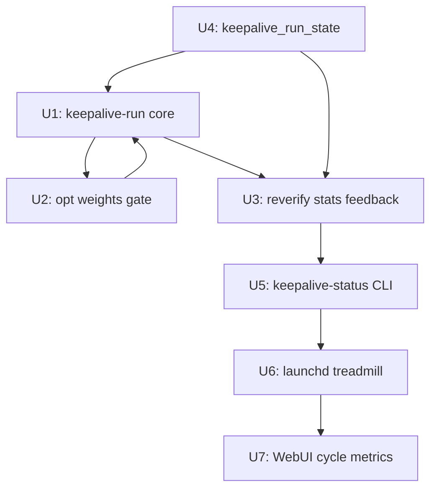

# feat: Keep-alive Recovery Loop — Closed-Loop CLI Chain

## Overview

Build a `keepalive-run` CLI command that chains the full recovery loop — recheck → keepalive-gap detection → republish → reverify — as a single Python invocation safe for unattended launchd scheduling. Integrate with `optimization_state.json` so circuit-broken platforms are skipped during gap-fill and reverify results feed survival stats back to the optimizer. The treadmill exits its terminal-state design: instead of one-shot WebUI jobs, daily launchd scheduling repeats the cycle automatically.

## Problem Frame

The existing infrastructure is feature-complete but **chain-incomplete** for unattended operation:

| Stage | Exists? | Gap |
|---|---|---|
| `recheck-backlinks --probe` | ✅ CLI | Not called as part of an automated recovery flow |
| `plan_keepalive_gap()` | ✅ Python API | Not exposed as a CLI command; only via WebUI job |
| `publish-backlinks` | ✅ CLI | Called by `run-full-pipeline.sh gap` but uses `plan-gap`, not `plan_keepalive_gap` |
| reverify after republish | ✅ `_default_reverify()` in `keepalive_job.py` | **WebUI-only** — CLI chain has no reverify step |
| Optimization weights gate | ✅ `optimization_state.json` (plan 001) | Not read by gap planner — circuit-broken platforms still selected |
| Post-reverify stat feedback | ❌ | Reverify results never update `optimization_state.json` |
| Retry limits per target | ❌ | Nothing prevents indefinite republish attempts to failing platforms |
| Automated scheduling | ✅ launchd plist for weekly recheck | No plist for the full recovery cycle |
| Treadmill (S7) | ✅ terminal state | No auto-repeat — operator must manually restart via WebUI |

**Root cause of treadmill staying terminal**: the full chain is split across a shell script (`run-full-pipeline.sh`) that does not include reverify, a WebUI job system that does include reverify but requires operator interaction, and a launchd plist that only runs recheck. No single automated path does `recheck → keepalive-gap → publish → reverify → update-stats`.

## Scope Boundaries

**In scope:**
- `keepalive-run` CLI: single command for the full recovery cycle
- Optimization weights gate in `plan_keepalive_gap()`: skip platforms with weight=0
- Post-reverify stat feedback to `optimization_state.json`
- `keepalive_run_state.json`: cycle state and per-target retry limit tracking
- `keepalive-status` CLI: human-readable loop health summary
- launchd plist for daily unattended scheduling
- WebUI `/ce:keep-alive` extension: cycle metrics panel alongside existing S1→S7 job UI

**Explicitly not in scope:**
- Replacing or modifying the WebUI S1→S7 job flow — it stays for operator-triggered runs
- Modifying `recheck-backlinks`, `plan-backlinks`, `validate-backlinks`, `publish-backlinks` internals
- In-process loop mode (one invocation loops forever as daemon) — stays CLI-triggered
- Non-sticky platform gap filling (blogger/ghpages sticky rule unchanged)
- Indexability/GSC measurement (deferred Phase 2)
- Rule 3 (aggregated statistical thresholds) from plan 001 — that plan already deferred it

**Pre-existing resolved:**
- Three-gap `live_dofollow` under-counting (write-back断路, unverified pool, uncertain signals) is **already fixed** in `recheck/events_io.py`, `recheck/selection.py`, `recheck/probe.py` — verify end-to-end in U1 test scenarios, do not re-implement.
- Recheck timeout (`_PER_TARGET_TIMEOUT=10s`, `_BATCH_BUDGET_S=600s`) is **already enforced** in `cli/recheck_backlinks.py:218` — no new timeout work needed.

## Requirements Trace

- R1: `keepalive-run` chains recheck → keepalive-gap → publish → reverify with a single CLI invocation
- R2: Gap planner skips platforms where `optimization_state.json` weight = 0 (circuit-broken)
- R3: Reverify results update `optimization_state.json` per-platform stats (alive, dofollow, republish outcomes)
- R4: Per-target retry limits in `keepalive_run_state.json` prevent infinite republishing to failing platforms
- R5: All stages emit RECON-level summaries for cron log visibility
- R6: launchd daily plist for fully unattended execution with health check
- R7: `keepalive-status` CLI shows loop health: last cycle timestamp, gaps found/filled, platforms at risk
- R8: WebUI `/ce:keep-alive` shows cycle history panel alongside existing operator-triggered job flow

## Context & Research

### Relevant Code and Patterns

**Core gap engine:**
- `src/backlink_publisher/gap/engine.py::plan_keepalive_gap(rows, per_target_status, opts)` — keepalive-specific gap planning (only `link_stripped` / `host_gone` trigger gaps; `probe_error` and `dofollow_lost` do not)
- `src/backlink_publisher/recheck/events_io.py::derive_per_target_status(store)` — builds per-target status dict from events.db; input to `plan_keepalive_gap`
- `src/backlink_publisher/gap/engine.py::KeepaliveGap` dataclass — `{target_url, stripped, emitted_platforms, channel_exhausted}`

**Recheck pipeline:**
- `src/backlink_publisher/cli/recheck_backlinks.py` — CLI entry; `_PER_TARGET_TIMEOUT=10s`, `_BATCH_BUDGET_S=600s` already enforced; stdin mode (R11) accepts JSONL candidates
- `src/backlink_publisher/recheck/selection.py::select_confirmed_candidates()` + `select_unverified_candidates()` — both must be used to build the probe pool (three-gap fix already in code)
- `src/backlink_publisher/recheck/events_io.py::write_verified_at()` — writes probe-alive results back to DB (three-gap fix already in code)

**Optimization state (plan 001 — already shipped):**
- `src/backlink_publisher/optimization/state.py::OptimizationState` — `get_weight(adapter_name, default)`, `update_stats(platform, stats_update)`
- `src/backlink_publisher/optimization/` — `collector.py`, `rules.py`, `models.py`

**WebUI reverify reference implementation:**
- `webui_app/services/keepalive_job.py::_default_reverify(result, store)` — targeted recheck after republish; reads `published_url` from result dict, emits probe result; returns `verdict` dict with `alive`, `dofollow`, `restripped`
- `webui_app/services/keepalive_job.py::_RUNTIME_STICKY = ("blogger",)` — runtime narrow vs engine's `("blogger", "ghpages")`

**Existing shell pipe (reference, not to be modified):**
```bash
# run-full-pipeline.sh gap — existing, uses plan-gap NOT plan_keepalive_gap, NO reverify
equity-ledger | recheck-overlay | plan-gap --emit-stale | plan-backlinks | validate-backlinks | publish-backlinks
```

**Store patterns for keepalive_run_state.json:**
- `webui_store/drafts.py` — JSON persistence + atomic write pattern (tempfile + rename)
- `src/backlink_publisher/optimization/state.py` — same pattern, threading.Lock

**RECON pattern:**
- `src/backlink_publisher/cli/plan_backlinks/recon.py` — RECON log level, `plan_logger.recon()` with `input_rows`, `output_rows`, `delta`, `dropped` fields

### Institutional Learnings

- **Write-back断路已修復**: `write_verified_at()` must be called for every ALIVE probe result. Already fixed; new code must not bypass this.
- **Dispatch path duplication bug class**: fresh-publish and resume/retry paths must share a single carry helper — never two copy-paste emitters. Apply to `keepalive-run`'s fresh vs. retry republish paths.
- **Publish-history helper invariant**: `_push_history_per_row` is the only legal write point; republish per-row; failure path also goes through helper (status="failed", url=None).
- **Always-on probe anti-pattern**: Cloudflare-fronted platforms (Medium, Velog) must not be probed headlessly in scheduled loops — use one-shot probes only. Reverify step: probe count per run limited to newly-published URLs only.
- **RECON grep trap**: before adding new RECON calls, grep `assert.*stderr.*==""` and flip matching tests in the same commit.
- **Cross-process RMW on webui_store**: if `keepalive-run` runs as a separate process while WebUI is up, any RMW on shared JSON stores needs `fcntl.flock` (see `circuit.py` pattern).
- **Projector silent drop**: any new event kind emitted by `keepalive-run` must be registered in `events/kinds.py` and explicitly handled in `projector.classify()`.
- **Floating-point tie-break in deficit sorters**: deficit comparisons must use `round(x, 6)` before `sorted()` / `max()`.

### External References

None needed — all patterns are established in the codebase.

## Key Technical Decisions

### Decision 1: `keepalive-run` as a pure CLI command, not a new WebUI job

**Context**: Could extend `keepalive_job.py::start_republish()` to be CLI-callable, or build a separate CLI.

**Choice**: New `src/backlink_publisher/cli/keepalive_run.py` that calls existing Python APIs in-process (not subprocess). WebUI `keepalive_job.py` stays untouched.

**Rationale**: The WebUI job uses threads and polling callbacks designed for HTTP responses; a CLI needs synchronous execution with RECON logging. Sharing the same code path would require either awkward synchronous wrappers on async jobs or exposing CLI concerns into the WebUI service. Separation is cleaner — both paths call the same underlying `plan_keepalive_gap()`, `derive_per_target_status()`, and reverify logic.

### Decision 2: Optimization weights gate as a filter, not a sort

**Context**: `plan_keepalive_gap()` currently uses `KEEPALIVE_STICKY_PLATFORMS = ("blogger", "ghpages")` as a hardcoded whitelist. Could filter by weight or sort by weight.

**Choice**: Pre-filter: before calling `plan_keepalive_gap()`, resolve the effective sticky platform list by removing platforms where `OptimizationState().get_weight(platform, default=1.0) == 0.0`. Pass the filtered list as `sticky_platforms` to `plan_keepalive_gap()`. Do not change the internal gap-planning logic.

**Rationale**: `plan_keepalive_gap()` is designed around a whitelist model; injecting weight-based sorting would complicate its logic. A pre-filter at the call site is simpler, testable in isolation, and more conservative (weight=0 means circuit-broken, definitively skip). Sorting by weight is a Phase 2 optimization.

### Decision 3: `keepalive_run_state.json` is separate from `optimization_state.json`

**Context**: Could store retry counts and last-run timestamps in `optimization_state.json`.

**Choice**: Separate `~/.backlink-publisher/keepalive_run_state.json`. Structure:
```json
{
  "version": 1,
  "last_run_at": "2026-06-05T05:00:00Z",
  "last_cycle_summary": {
    "gaps_found": 3, "published": 2, "reverified_alive": 1, "reverified_dead": 1
  },
  "retry_counts": {
    "https://example.com/page": {"attempts": 2, "last_attempt": "...", "platforms_tried": ["blogger"]}
  }
}
```

**Rationale**: `optimization_state.json` tracks platform-level weight optimization; `keepalive_run_state.json` tracks target-level recovery attempts. Different aggregation units, different retention policies (optimization state persists; run state rolls over at target recovery).

### Decision 4: Retry limit of 3, then mark as `exhausted` (not infinite skip)

**Context**: A target URL could be permanently unreachable (domain expired, etc.) and we'd waste recovery attempts forever. But we also don't want to permanently suppress a valid target.

**Choice**: After 3 failed republish+reverify cycles for the same `target_url`, mark it `exhausted: true` in `keepalive_run_state.json`. `keepalive-run` skips exhausted targets. `keepalive-status --reset-exhausted <url>` or manually editing the state file can reopen. No automatic re-opening.

**Rationale**: 3 attempts covers transient platform issues. Permanent skip only if operator explicitly resets — avoids silent data loss without infinite spinning.

### Decision 5: Post-reverify stats use `OptimizationState.update_stats()`, not `set_weight()`

**Context**: After reverify, we know whether the new link is alive/dofollow. Should we immediately adjust weights, or just update stats?

**Choice**: Call `OptimizationState().update_stats(platform, {...})` only — not `set_weight()`. The rules engine in plan 001 (`optimize-weights` CLI) reads stats and decides weights separately. `keepalive-run` is a data producer; it does not make weight decisions.

**Rationale**: Keeps the two responsibilities separate: recovery loop feeds data, optimizer reads data and adjusts weights. Avoids a race condition where `keepalive-run` and `optimize-weights` both try to mutate weights simultaneously.

## Open Questions

### Resolved During Planning

- **Does reverify need to wait?** No — probe immediately after publish. Blogger/static pages are available within seconds. If the link is alive right after publish, it's a good signal; if dead, mark as failed and let the next cycle handle it. Long waits (hours) belong in the launchd schedule gap, not in-process waiting.
- **Which platforms are sticky?** Use `RUNTIME_STICKY_PLATFORMS = ("blogger",)` from `keepalive_job.py` — not the engine constant `("blogger", "ghpages")` — since GitHub account is suspended.
- **Is R10 (recheck timeout) needed?** Already implemented: `_PER_TARGET_TIMEOUT=10s` per probe, `_BATCH_BUDGET_S=600s` total. Verify the batch budget enforces wall-clock exit (it does at `cli/recheck_backlinks.py:206`). No new timeout work needed.

### Deferred to Implementation

- Exact method signature for `plan_keepalive_gap()` call site changes (platform filter parameter name) — look at current signature at implementation time.
- Whether `fcntl.flock` is needed for `keepalive_run_state.json` — depends on whether launchd schedule can overlap with WebUI. Assess at implementation.
- Exact RECON event fields — derive from other `plan_logger.recon()` call sites.
- Whether the existing three-gap fixes pass end-to-end in a real integration test — verify first in U1 before assuming they work.

## High-Level Technical Design

> *This illustrates the intended approach and is directional guidance for review, not implementation specification. The implementing agent should treat it as context, not code to reproduce.*

```
[launchd plist, daily 05:00]
         │
         ▼
  keepalive-run CLI
         │
    ┌────┴────────────────────────────────────────────────┐
    │                    STEP 1: RECHECK                   │
    │  recheck-backlinks --probe (timeout already enforced) │
    │  + both candidate pools: confirmed + unverified       │
    │  write_verified_at() on ALIVE results                 │
    └────┬────────────────────────────────────────────────-┘
         │ verdict JSONL
         ▼
    ┌────┴────────────────────────────────────────────────┐
    │                STEP 2: STATUS DERIVATION             │
    │  derive_per_target_status(store)                     │
    │  → per-target {alive_platforms, dead_verdicts, ...}  │
    └────┬────────────────────────────────────────────────-┘
         │ per_target_status
         ▼
    ┌────┴────────────────────────────────────────────────┐
    │         STEP 3: GAP PLANNING (R2: weight gate)       │
    │  effective_sticky = [p for p in RUNTIME_STICKY        │
    │                      if opt_state.get_weight(p) > 0]  │
    │  seeds = plan_keepalive_gap(rows, per_target_status,  │
    │            opts, sticky_platforms=effective_sticky)   │
    │  seeds = [s for s in seeds if not exhausted(s.target)] │
    └────┬────────────────────────────────────────────────-┘
         │ replacement seeds JSONL
         ▼
    ┌────┴────────────────────────────────────────────────┐
    │           STEP 4: PUBLISH                            │
    │  PipelineAPI: plan→validate→publish (same as         │
    │  _default_publish_seed() in keepalive_job.py)         │
    │  _push_history_per_row() per result                  │
    └────┬────────────────────────────────────────────────-┘
         │ published_urls + seed metadata
         ▼
    ┌────┴────────────────────────────────────────────────┐
    │       STEP 5: REVERIFY (R3: stat feedback)           │
    │  For each published URL: targeted recheck probe       │
    │  (one-shot only, bounded to newly published URLs)     │
    │  Update optimization_state.update_stats(platform, {  │
    │    "alive_count": +1 or 0,                           │
    │    "dofollow_count": +1 or 0                         │
    │  })                                                   │
    │  Update keepalive_run_state retry_counts              │
    └────┬────────────────────────────────────────────────-┘
         │ cycle_summary
         ▼
    RECON log: gaps_found / published / reverified_alive / exhausted_targets
    keepalive_run_state.json updated
    Exit 0 (success), 1 (error), 6 (all_failed, no gaps filled)
```

## Implementation Units



---

- [ ] **Unit 1: `keepalive-run` CLI — core chain orchestrator**

**Goal**: Single CLI command that chains steps 1–5 (recheck → status derivation → keepalive-gap → publish → reverify).

**Requirements**: R1, R5

**Dependencies**: U4 (state file must exist before U1 writes to it)

**Files:**
- Create: `src/backlink_publisher/cli/keepalive_run.py`
- Create: `src/backlink_publisher/keepalive/__init__.py` (package)
- Create: `src/backlink_publisher/keepalive/chain.py` (step orchestration logic)
- Modify: `pyproject.toml` (add `keepalive-run` to `[project.scripts]`)
- Modify: `src/backlink_publisher/cli/__init__.py` (register command if needed)
- Test: `tests/test_keepalive_run.py`

**Approach:**
- `keepalive_run.py` is the argparse/click entry point; `chain.py` contains the step orchestration logic (testable without CLI invocation)
- Step 1: call `recheck-backlinks` internal API (not subprocess) via the same path used by `cli/recheck_backlinks.py::main()` — specifically: build candidate list via `select_confirmed_candidates() + select_unverified_candidates()`, run probe loop with existing timeout constants
- Step 2: call `derive_per_target_status(store)` in-process
- Step 3: call `plan_keepalive_gap()` with effective_sticky filtered by optimization weights (see U2)
- Step 4: call `PipelineAPI` (same as `keepalive_job.py::_default_publish_seed()`) per seed; use `_push_history_per_row()` for every result including failures
- Step 5: for each successfully published URL, run targeted probe (see U3)
- CLI flags: `--dry-run` (skip publish and reverify, show gaps only), `--max-gaps N` (limit seeds), `--min-age-days N` (default 7), `--reset`
- Fresh vs. retry publish paths must share a single emit helper (dispatch path duplication lesson)

**Patterns to follow:**
- `keepalive_job.py::_default_publish_seed()` for the publish step
- `keepalive_job.py::_default_reverify()` for the reverify step logic
- `cli/recheck_backlinks.py` for the recheck step entry

**Test scenarios:**
- Happy path: recheck finds 1 dead link → gap planning emits 1 seed → publish succeeds → reverify finds alive → cycle_summary has published=1, reverified_alive=1
- Dry-run: recheck finds dead link → gap printed → no publish call made → state file unchanged
- Empty recheck: no dead links found → chain exits at step 2 → RECON: gaps_found=0
- Recheck with probe_error only: probe_error verdicts → NOT counted as gaps → chain exits cleanly
- No eligible sticky platforms (all circuit-broken): step 3 yields 0 seeds → exits with RECON
- Three-gap integration: verify that `write_verified_at()` is called after successful probe, and `select_unverified_candidates()` results are included in step 1 pool

**Verification**: `pytest tests/test_keepalive_run.py` green; `backlink-publisher keepalive-run --dry-run` exits 0 and prints gap summary

---

- [ ] **Unit 2: Optimization weights gate in keepalive gap planning**

**Goal**: Skip circuit-broken platforms (weight=0) from the sticky platform list before calling `plan_keepalive_gap()`.

**Requirements**: R2

**Dependencies**: U1 (the call site is in `chain.py`)

**Files:**
- Modify: `src/backlink_publisher/keepalive/chain.py` (add weight filter at gap planning call site)
- Modify: `src/backlink_publisher/gap/engine.py` (add optional `sticky_platforms` parameter if not already present; verify current signature)
- Test: `tests/test_keepalive_gap_weight_gate.py`

**Approach:**
- In `chain.py` step 3: resolve `effective_sticky` by filtering `RUNTIME_STICKY_PLATFORMS`:
  ```python
  opt = OptimizationState()
  effective_sticky = [p for p in RUNTIME_STICKY_PLATFORMS
                      if opt.get_weight(p, default=1.0) > 0.0]
  ```
- If `OptimizationState` file missing or corrupt → fallback to full `RUNTIME_STICKY_PLATFORMS` (same OptimizationState.load() fallback already designed in plan 001)
- If `effective_sticky` is empty → log RECON "all sticky platforms circuit-broken" and exit 0 (no gap to fill, not an error)
- The `plan_keepalive_gap()` already accepts `sticky_platforms` parameter — verify this at implementation; if not, add it as a keyword argument with default `KEEPALIVE_STICKY_PLATFORMS`

**Patterns to follow:**
- `publishing/registry.py::preferred_dispatch()` (plan 001 U4) — same pattern of reading OptimizationState and falling back to static

**Test scenarios:**
- No optimization state file: `effective_sticky` = full RUNTIME_STICKY_PLATFORMS (no filtering)
- blogger weight = 0: `effective_sticky` is empty → 0 seeds generated, not an error
- blogger weight = 0.3 (reduced but not zero): still included in effective_sticky
- blogger weight = 1.0 (normal): included as usual
- Corrupt optimization state: fallback to static list, warning logged

**Verification**: `pytest tests/test_keepalive_gap_weight_gate.py` green; manually: set blogger weight=0 in optimization_state.json, run `keepalive-run --dry-run`, verify no seeds emitted for blogger

---

- [ ] **Unit 3: Post-reverify stat feedback to optimization_state.json**

**Goal**: After reverify, update per-platform stats in `optimization_state.json` so the optimizer sees republish outcomes.

**Requirements**: R3

**Dependencies**: U1 (reverify step in chain.py), U4 (keepalive_run_state.json for retry count update)

**Files:**
- Modify: `src/backlink_publisher/keepalive/chain.py` (add stat feedback in step 5)
- Test: `tests/test_keepalive_reverify_feedback.py`

**Approach:**
- In step 5, after `_default_reverify()` returns verdict for each published URL:
  - Alive → `OptimizationState().update_stats(platform, {"alive_count_delta": 1, "dofollow_count_delta": 1 if dofollow else 0})`
  - Dead (restripped) → `OptimizationState().update_stats(platform, {"alive_count_delta": 0})`; increment `keepalive_run_state.retry_counts[target_url]`
  - probe_error → no stat update (indeterminate, per recheck verdict semantics)
- `update_stats()` in plan 001's `OptimizationState` merges via deltas — verify current schema supports delta-style updates; if not, use load-modify-save with thread lock
- New event kind if emitting to events.db: register `KEEPALIVE_REVERIFY_COMPLETE` in `events/kinds.py` and handle in projector — or skip events.db if stat update to `optimization_state.json` is sufficient (defer events.db write to Phase 2)
- **Probe count bound**: reverify only for newly-published URLs in this cycle (not all sticky links) — avoids always-on probe anti-pattern for Cloudflare platforms

**Patterns to follow:**
- `optimization/state.py::update_stats()` from plan 001
- `keepalive_job.py::_default_reverify()` for the probe invocation

**Test scenarios:**
- Reverify alive + dofollow: platform `alive_count` and `dofollow_count` incremented in optimization_state
- Reverify dead (link_stripped): retry_count for target_url incremented in keepalive_run_state
- Reverify probe_error: no stat change to either file
- Reverify on platform not yet in optimization_state: creates new entry with defaults before updating
- Multiple platforms in same cycle: all stats updated independently
- optimization_state corrupt during update: fallback write creates fresh file, logs warning

**Verification**: `pytest tests/test_keepalive_reverify_feedback.py` green; manual: run keepalive-run with known live target, verify optimization_state.json stats updated

---

- [ ] **Unit 4: `keepalive_run_state.json` — cycle state and retry limits**

**Goal**: Persist cycle summaries and per-target retry counts so `keepalive-run` can skip exhausted targets and provide status history.

**Requirements**: R4

**Dependencies**: None (foundational store, read/written by U1, U3)

**Files:**
- Create: `src/backlink_publisher/keepalive/run_state.py` (KeepaliveRunState class)
- Test: `tests/test_keepalive_run_state.py`

**Approach:**
- `KeepaliveRunState` class mirrors `OptimizationState` (same JSON store pattern from plan 001):
  - `load()` → returns default if missing or corrupt
  - `save()` → atomic write (tempfile + rename)
  - `is_exhausted(target_url) -> bool` — True if `retry_counts[target_url]["attempts"] >= MAX_RETRY`
  - `record_attempt(target_url, platform, outcome: str)` — increments attempt count, records platform tried and outcome
  - `reset_exhausted(target_url)` — removes from retry_counts (for `keepalive-status --reset`)
  - `update_cycle_summary(summary: dict)` — stores last_run_at + summary
  - `MAX_RETRY = 3` (class constant, overridable by env `KEEPALIVE_MAX_RETRY`)
- State schema:
  ```json
  {
    "version": 1,
    "last_run_at": "ISO8601",
    "last_cycle_summary": {
      "gaps_found": 3, "published": 2, "reverified_alive": 1,
      "reverified_dead": 1, "exhausted_skipped": 0
    },
    "retry_counts": {
      "https://example.com/page": {
        "attempts": 2,
        "last_attempt_at": "ISO8601",
        "platforms_tried": ["blogger"],
        "last_outcome": "reverify_dead"
      }
    }
  }
  ```
- Path: `~/.backlink-publisher/keepalive_run_state.json` (same `data_dir` resolution as `optimization_state.json`)

**Patterns to follow**: `optimization/state.py` — same class shape, same persistence pattern

**Test scenarios:**
- Load from non-existing file returns default (no error)
- is_exhausted returns False for unseen target, False for attempts < MAX_RETRY, True at MAX_RETRY
- record_attempt increments count and appends platform/outcome correctly
- reset_exhausted removes entry; subsequent is_exhausted returns False
- update_cycle_summary persists and is retrievable
- Corrupt file returns default state with warning log
- MAX_RETRY=3 default; override via KEEPALIVE_MAX_RETRY env var

**Verification**: `pytest tests/test_keepalive_run_state.py` green

---

- [ ] **Unit 5: `keepalive-status` CLI + RECON logging polish**

**Goal**: Human-readable loop health summary CLI; ensure all stages emit proper RECON-level logs for cron visibility.

**Requirements**: R5, R7

**Dependencies**: U1 (chain.py RECON calls), U3 (stat feedback), U4 (state file)

**Files:**
- Create: `src/backlink_publisher/cli/keepalive_status.py`
- Modify: `src/backlink_publisher/keepalive/chain.py` (add RECON calls at cycle start and end)
- Modify: `pyproject.toml` (add `keepalive-status` to `[project.scripts]`)
- Test: `tests/test_keepalive_status.py`

**Approach:**
- `keepalive-status` output table:
  ```
  Last run: 2026-06-05T05:00:00Z (2 hours ago)
  Cycle summary: gaps_found=3, published=2, alive=1, dead=1, skipped_exhausted=0

  Platform Health (from optimization_state.json):
  blogger   weight=1.2  alive_rate=83%  (10/12)
  ghpages   weight=0.0  CIRCUIT-BROKEN

  Exhausted Targets (retry >= 3):
    (none)

  Pending Gaps (not yet recovered):
    https://example.com/article (stripped=2, tried: blogger x2)
  ```
- Flags: `--json` (machine-readable), `--platform P` (filter), `--reset-exhausted URL` (call `run_state.reset_exhausted()`)
- RECON in chain.py: call `plan_logger.recon()` at cycle end with `gaps_found`, `published`, `reverified_alive`, `exhausted_skipped` — pre-grep `assert.*stderr.*==""` in test suite before adding
- RECON level is correct for cron — not `info()` (cron mails at WARN+ by default)

**Patterns to follow:** `cli/equity_ledger.py` for table formatting; `cli/recheck_backlinks.py` for RECON call site

**Test scenarios:**
- No state file: shows "No keepalive cycle has run yet" (not crash)
- State file with data: correct last_run, summary stats, platform health
- Circuit-broken platform shown with CIRCUIT-BROKEN badge
- Exhausted target listed with attempt count
- --json outputs valid JSON with all fields
- --reset-exhausted removes the target and shows updated state
- Platform health alive_rate computed correctly from optimization_state.json stats

**Verification**: `pytest tests/test_keepalive_status.py` green; manual: `backlink-publisher keepalive-status` after running keepalive-run

---

- [ ] **Unit 6: launchd treadmill plist — daily automated scheduling**

**Goal**: launchd plist for daily unattended `keepalive-run` execution; update existing recheck plist if needed.

**Requirements**: R6

**Dependencies**: U5 (keepalive-run must be stable and RECON-logged before scheduling)

**Files:**
- Create: `scripts/com.dex.bp-keepalive.plist`
- Modify: `scripts/com.dex.bp-recheck.plist` (review if weekly recheck is still needed independently)
- Test: `tests/test_keepalive_plist.py` (plist schema validation — verify required keys exist)

**Approach:**
- New plist: `com.dex.bp-keepalive.plist`
  - `Label`: `com.dex.bp-keepalive`
  - `ProgramArguments`: `[".venv/bin/backlink-publisher", "keepalive-run"]` (no --dry-run)
  - `StartCalendarInterval`: `{"Hour": 5, "Minute": 0}` (daily 05:00)
  - `StandardOutPath` + `StandardErrorPath` → `~/Library/Logs/backlink-publisher/keepalive.log`
  - `WorkingDirectory`: repo root
  - `EnvironmentVariables`: `{"PYTHONHASHSEED": "0"}`
  - **No `TimeOut`** (launchd watchdog not set — `_BATCH_BUDGET_S=600s` already handles this internally)
- Review `com.dex.bp-recheck.plist` (currently weekly Monday 04:30): `keepalive-run` already runs a full recheck as step 1 — assess whether standalone weekly recheck is redundant or should remain for deeper recheck (more links, longer age window). Keep as-is if age windows differ; note the decision.
- Install instructions in plist header comment: `launchctl load ~/Library/LaunchAgents/com.dex.bp-keepalive.plist`

**Test scenarios:**
- Test expectation: plist schema test — Required keys present (Label, ProgramArguments, StartCalendarInterval, StandardOutPath, WorkingDirectory)
- `keepalive-run` exits 0 on empty state (no crash when no links exist to check)
- Existing `com.dex.bp-recheck.plist` remains valid after this change (schema test for it too)

**Verification**: `pytest tests/test_keepalive_plist.py` green; manual: `launchctl load` + wait for scheduled run; inspect log file for RECON output

---

- [ ] **Unit 7: WebUI `/ce:keep-alive` cycle metrics panel**

**Goal**: Extend the existing `/ce:keep-alive` dashboard with a read-only cycle history panel showing automated loop status.

**Requirements**: R8

**Dependencies**: U4 (state file), U5 (status data accessible)

**Files:**
- Modify: `webui_app/routes/keep_alive.py` (add API endpoint for cycle metrics)
- Modify: `webui_app/templates/keep_alive.html` (add cycle history panel below existing job UI)
- Modify: `webui_app/static/js/keep_alive.js` (fetch and render cycle panel)
- Test: `tests/test_webui_keepalive_cycle.py` (new route test)

**Approach:**
- New API: `GET /ce:keep-alive/cycle-status` → JSON:
  ```json
  {
    "last_run_at": "2026-06-05T05:00:00Z",
    "last_cycle": {"gaps_found": 3, "published": 2, "reverified_alive": 1},
    "exhausted_targets": [{"url": "...", "attempts": 3}],
    "platform_health": [
      {"platform": "blogger", "weight": 1.2, "alive_rate": 0.83, "circuit_broken": false}
    ]
  }
  ```
- Frontend: Panel card "自動循環狀態 (Auto-cycle Status)"
  - Last run: relative timestamp ("2 hours ago")
  - Summary row: gaps_found / published / alive badges
  - Platform health mini-table (name, weight trend arrow, alive rate)
  - Exhausted targets count with expand-to-list
  - No polling — server-side rendered on page load (same as optimization status card in plan 001)
- If no state file: panel shows "尚未執行自動循環" with instruction to run `keepalive-run`
- Existing S1→S7 operator job flow unchanged — the new panel is additive

**Patterns to follow:** Existing `/ce:keep-alive` template card structure; optimization status card from plan 001 U6 for the data-loading pattern

**Test scenarios:**
- GET /ce:keep-alive/cycle-status with no state file returns 200 with null last_run_at
- GET /ce:keep-alive/cycle-status with state file returns correct data
- Dashboard renders "no cycle yet" state correctly (no crash)
- Dashboard renders cycle data: last run timestamp, summary badges visible
- Circuit-broken platform shown with red badge
- Exhausted target count visible; expand list works

**Verification**: `pytest tests/test_webui_keepalive_cycle.py` green; manual: navigate to `/ce:keep-alive`, verify cycle panel renders below existing job buttons

---

## System-Wide Impact

- **Interaction graph**: `keepalive-run` calls `plan_keepalive_gap()` (gap/engine.py), `derive_per_target_status()` (recheck/events_io.py), `PipelineAPI` (same path as WebUI job), `OptimizationState` (optimization/state.py, plan 001). None of these are modified — they are called, not changed.
- **Error propagation**: step failures bubble to RECON log at cycle level; individual probe_error verdicts are not fatal (recheck semantics); individual publish failures are recorded in history per row and counted in cycle summary; reverify failures update retry_counts.
- **State lifecycle risks**: `keepalive_run_state.json` and `optimization_state.json` are both atomic-written. If launchd triggers a second run while first is running (possible if first cycle exceeds 24h), the second `KeepaliveRunState.load()` reads the in-progress first run's state — safe because load is read-only and save is atomic. Concurrent writes: both use threading.Lock + atomic write; cross-process flock TBD (see deferred questions).
- **API surface parity**: `keepalive-run` does not add new public API surface. `keepalive-status` adds one new CLI command. The new WebUI endpoint is internal.
- **Integration coverage**: the full chain (publish → write_verified_at → update_stats) crosses events.db, optimization_state.json, keepalive_run_state.json, and potentially webui_store. End-to-end tests in U1 must cover the DB write-back path (Gap 1 was fixed but must verify it flows through the new CLI path, not just the WebUI path).
- **Unchanged invariants**: WebUI S1→S7 job flow is not modified; `_default_reverify()` in `keepalive_job.py` is not modified; `plan_keepalive_gap()` internal logic is not modified; `recheck-backlinks`, `plan-backlinks`, `publish-backlinks` CLIs are not modified; `optimization_state.json` schema is not changed (only `update_stats()` is called, not `set_weight()`).

## Risks & Dependencies

| Risk | Likelihood | Mitigation |
|---|---|---|
| `plan_keepalive_gap()` does not accept `sticky_platforms` parameter | Medium | Verify at implementation; add keyword arg with default if missing (minimal, backward-compatible change) |
| Three-gap fixes work in WebUI path but not in new CLI path (different code routing) | Medium | U1 includes explicit end-to-end test verifying `write_verified_at()` is called via CLI recheck path |
| launchd daily run overlaps with WebUI-triggered recheck (cross-process state race) | Low | Both stores use atomic write; worst case is one run's stats being overwritten — acceptable. Add `fcntl.flock` if observed in practice |
| Reverify probes Cloudflare platform → IP reputation impact | Medium | Reverify is bounded to newly-published URLs only (typically 1–3 per cycle); not a systematic always-on scan |
| optimization_state.json not yet initialized when keepalive-run first runs | Low | `OptimizationState.load()` returns default state (empty weights); fallback to full `RUNTIME_STICKY_PLATFORMS` (plan 001 already handles this) |
| `KEEPALIVE_STICKY_PLATFORMS` / `RUNTIME_STICKY_PLATFORMS` diverge between engine and runtime layers | Low | Explicitly use `RUNTIME_STICKY_PLATFORMS` from `keepalive_job.py`; document why (GitHub suspended) |
| New event kinds (KEEPALIVE_REVERIFY_COMPLETE) cause projector silent drop | Low | Deferred — don't emit to events.db in Phase 1; only update optimization_state.json. Eliminates this risk entirely for MVP. |

## Documentation / Operational Notes

- After shipping: run `launchctl load ~/Library/LaunchAgents/com.dex.bp-keepalive.plist` to activate treadmill
- Verify first automated run via `backlink-publisher keepalive-status` the morning after
- `optimization_state.json` must exist (or plan 001's `collect-signals` must have run once) for the weight gate to work; not a hard requirement — fallback is safe
- `KEEPALIVE_MAX_RETRY=3` default; increase if platform instability is temporary (e.g., platform down for maintenance)

## Sources & References

- `webui_app/services/keepalive_job.py` — reverify, publish seed, and treadmill state reference implementation
- `src/backlink_publisher/gap/engine.py` — `plan_keepalive_gap()`, `KeepaliveGap` dataclass
- `src/backlink_publisher/optimization/state.py` — `OptimizationState` from plan 001
- `docs/solutions/logic-errors/2026-06-05-001-live-dofollow-undercounting-triple-gap.md` — three-gap fixes (resolved)
- `docs/solutions/architecture-patterns/server-side-gap-computation-2026-06-05.md` — batch recheck polling pattern
- `docs/solutions/best-practices/publish-history-helper-invariant-2026-05-20.md` — `_push_history_per_row` invariant
- `docs/solutions/best-practices/medium-liveness-probe-partial-spike-2-2026-05-19.md` — Cloudflare probe anti-pattern
- `docs/plans/2026-06-05-001-feat-continuous-optimization-plan.md` — plan 001 (optimization weights, already shipped)
