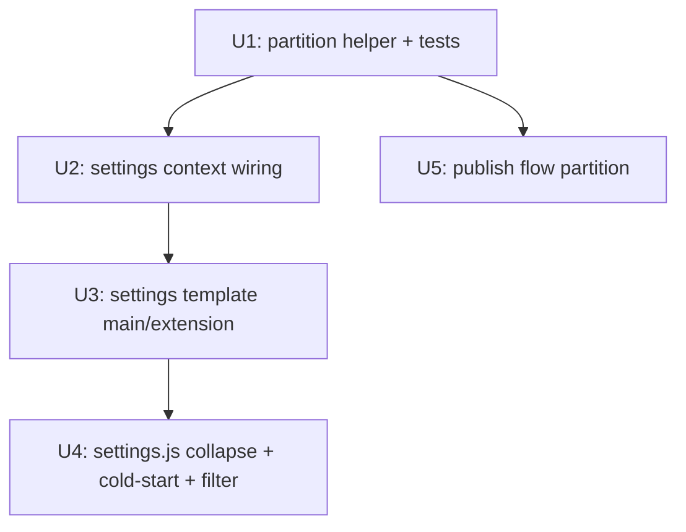

# feat: Collapse unconnected platforms into a folded extension area

## Overview

把 WebUI 的平台清單從「按自動化複雜度 tier 分組」改成「按連線狀態分區」:主區只顯示**現在能用**的平台(已綁定 + 免綁定 + 失效待重連),其餘**從未串接**的收進一個預設折疊的「拓展區」。套用於兩個「挑渠道來用」的畫面:設定總覽 與 發布/選渠道(`/batch-campaign`)。報表與 CLI 不變。

純呈現層重構:不刪平台、不改發布邏輯、不改後端註冊表。核心是一個新的**分區判斷點**,各畫面共用。

## Problem Frame

設定頁與發布頁目前把全部 24+ 平台一次攤開,大半是還沒串接或瀏覽器操控難用的(Medium/Mastodon…)。使用者每次都得在「現在不能用」的渠道裡挑出能用的少數,持續造成認知負擔。詳見 origin 文件 Problem Frame。

## Requirements Trace

- R1. 主區只顯示「可用」:`bound` + 免綁定(`anon`)。
- R2. `expired`/`identity_mismatch`(曾可用、現失效)留主區並帶「需重連」警示,不藏。
- R3. 從未串接(`unbound`)收進拓展區。
- R4. 分區判準是連線狀態,不是 tier;tier 降為卡片次要資訊。
- R5. 拓展區預設折疊,標頭顯示未串接數量(例「拓展區(18)」)。
- R6. 展開拓展區可對未串接平台執行原有 Bind/Configure(入口,不是死清單)。
- R7. 拓展區內保留卡片內的視覺降權標示。
- R8. 綁定成功 → 自動升入主區(無需手動操作)。
- R9. 主區平台失效 → 留主區切換「需重連」警示。
- R10. 「從未串接」vs「曾串接後失效」用連線狀態區分(精確判準見 origin R10)。
- R11. 套用於設定總覽 + 發布/選渠道兩畫面。
- R12. CLI 不在範圍。
- R13. 分區邏輯集中在單一可重用判斷點,各畫面共用。
- R14. 冷啟動(零綁定)主區近空時,拓展區自動展開 / 顯示綁定引導。
- R15. 拓展區內部有穩定排序(按 tier 次分組),數量多時提供搜尋/過濾。

## Scope Boundaries

- 不刪除/下架任何平台或 adapter;`registered_platforms()` 不變。
- 不改發布邏輯、tier 健康閘門、throttle。
- 不新增手動 pin/釘選(分區全自動依連線狀態)。
- 報表頁不套用折疊(避免抹掉歷史)。
- CLI 輸出格式不變。

## Context & Research

### Relevant Code and Patterns

- `webui_app/helpers/channel_tiers.py`(120 行)— 現有分組helper `group_channels_by_tier(dashboard_channels)`,輸入 `[(name, status_dict), ...]`,純函式、每次重算。**本案在此檔新增姊妹函式做連線狀態分區**(R13),並**復用** `group_channels_by_tier` 來建拓展區的 tier 次分組(R15)。`TIER_BY_AUTH_TYPE` 已是 auth_type→tier 的權威映射。
- `webui_app/binding_status.py::get_channel_status(name, cfg)` — 回傳 `{channel, bound, auth_type, dofollow, publish_backend, blockers, ...}`。**`bound` 來自 `verify_adapter_setup` 離線檢查(token/設定在不在),不讀 channel_status 生命週期**。
- `webui_store/channel_status.py` — 四態 enum(`bound`/`unbound`/`expired`/`identity_mismatch`)的真正來源。`list_all()` 回傳 `{name: rec}`,`get_status(name)` 未知渠道回 `_UNBOUND_DEFAULT`。**只涵蓋 `CHANNELS = {velog, medium, blogger}` 三個瀏覽器渠道**;其餘平台無記錄。
- `webui_app/helpers/contexts.py::_settings_context()` — 同一個 context **已同時**載入 `channel_statuses = list_all()`(行181)與 `dashboard_channels = [(name, get_channel_status(name,cfg)) for name in active_platforms()]`(行203)。兩個資料源都在手邊,分區所需資料齊全,無需新查詢。
- `webui_app/templates/_settings_overview_tiers.html`(45 行)— 現渲染 `dashboard_channel_tiers`;每 tier 一個 `data-bs-toggle="collapse"` accordion。card 用 `_channel_card_macro.html` 的 `dashboard_channel_card(name, status, bindable, has_card)` 巨集(**本案不改巨集,直接復用**)。
- `webui_app/static/js/settings.js::_initTierPersistence()`(行436-451)— 以 `overview.querySelectorAll('.collapse[id^="tier-"]')` + key `settings:collapse:`+id 持久化每段折疊。**改成主區/拓展區後,選擇器與 id 必須同步改**,否則折疊記憶靜默失效。
- `webui_app/routes/batch_campaign.py` — 發布表單 GET(行22)+ POST(行36)直接用 `registered_platforms()` 建 checkbox grid,**完全不算連線狀態**。POST 驗證失敗會重列清單(行102-116)。`batch_campaign.html` 行46-56 渲染 `platforms` 為扁平 checkbox。

### Institutional Learnings

- `[[webui-lives-at-repo-root-not-src]]` — `webui_app/`、`webui_store/` 在 repo 根,不在 `src/`。
- `[[webui-ux-overhaul-shipped-r10-residual]]` — settings 前端已 ESM 化成熟;沿用既有結構勿重寫。
- Frontend anti-rot(CLAUDE.md):無 inline `on*`/`<script>`,用 `data-action` + 委派;`url_for('static',…)` 帶 `v=asset_version`;CSS 用 `tokens.css` 語義色,勿寫死 hex。

### External References

無需外部研究 — 全為既有 repo 內模式(分組helper、Bootstrap collapse、Jinja 巨集),local pattern 充足。

## Key Technical Decisions

- **分區判斷點放在 `channel_tiers.py`(擴充,不新建模組)**:與 `group_channels_by_tier` 同型、同檔,可直接復用後者建拓展區次分組;在僅 2 個消費者下另立 `channel_partition.py` 不符 minimum change set(origin Deferred R13)。
- **分區實際判準(對齊三渠道現實)**:`usable(main)` iff `auth_type=="anon"` **或** `status["bound"] is True` **或** `channel_statuses.get(name,{}).get("status") in {"expired","identity_mismatch"}`;否則進拓展區。「需重連」旗標 = 後者那個條件,**實務上只會對 velog/medium/blogger 成立**(其餘平台無 channel_status 記錄)。這把 origin R10 的抽象判準落到真實資料源上。
- **拓展區次分組復用 `group_channels_by_tier`**:`extension_groups = group_channels_by_tier(extension_channels)`,R15 的「按 tier 排序」零新增邏輯。
- **主區是扁平不可折疊區;只有拓展區可折疊**:settings.js 只需持久化一個 `ext-area` 面板,改動最小;拓展區內的 tier 次分組是純標頭(不可折疊),避免巢狀折疊與 settings.js 複雜化。
- **發布流程三態呈現**:`selectable`(bound+anon,可勾)/`needs_reconnect`(顯示但 disabled+重連提示)/`extension`(折疊+disabled)。失效平台在發布流程不可勾(會發失敗),與 origin Deferred「失效可否勾選」的建議一致。
- **巨集 `dashboard_channel_card` 不改**:分區結果只決定卡片落在哪個容器,卡片本身渲染不變(R7)。
- **R8 自動升主區的真實機制 = 綁定成功後重載 overview 區(關鍵修正)**:現有綁定流程 `webui_app/static/js/bind_channel.js` 是異步輪詢綁定 job、**就地更新卡片徽章、從不重載頁面**。因此「下次渲染重算分區」不會自動發生,卡片會卡在拓展區直到手動刷新。決策:綁定 job 成功(及 verify 成功從 needs_reconnect 恢復)後,**重載設定頁 / overview 區**讓 `partition_*` 重算,使卡片真正升入主區、拓展區計數遞減。客戶端 DOM 搬移(移節點 + 更新兩邊計數 + 重評 cold_start)為較複雜的替代方案,本版不採。
- **拓展區嵌在 `#overview-panel`(預設折疊)內 → 冷啟動須一併展開父層(關鍵修正)**:`settings.html:54` 的 `<div id="overview-panel" class="collapse">`(無 `show`、由 `_initOverviewPersistence` 持久化為關閉)包住分區 include(行57)。對子層 `#ext-area` 加 `show` 在折疊父層下不可見。決策:`cold_start` 時模板同時對 `#overview-panel` 與 `#ext-area` 加 `show`,且 settings.js 在 cold_start 時略過把 overview-panel 關掉的 saved 回放(一次)。
- **`needs_reconnect` 跨畫面統一規格(內容/位置/恢復入口)**:標籤文案統一「需重連」;設定頁 = 卡片帶 warning badge +(經既有 Configure/bind 入口)恢復;發布頁 = disabled checkbox + inline「需重連」+ 連到設定頁綁定入口。僅「確切色票/置頂與否」延後,內容/位置/恢復入口此處定死,避免兩畫面分歧。

## Open Questions

### Resolved During Planning

- **分區邏輯放哪**:擴充 `channel_tiers.py`(見決策)。
- **拓展區內部排序**:復用 `group_channels_by_tier` 做 tier 次分組(R15)。
- **失效/需重連的資料源**:merge `channel_statuses`(list_all)進分區;只對三瀏覽器渠道有 expired/identity_mismatch。
- **API 平台失效不可見**:接受為已知限制(origin Dependencies);R2 的「不消失」保證實質涵蓋 velog/medium/blogger,正是過期常見處。
- **失效平台可否在發布流程勾選**:不可,disabled + 重連提示。

### Deferred to Implementation

- **「需重連」醒目程度的確切視覺**(badge/色邊/置頂):用 `tokens.css` warning 語義色;確切樣式實作時定(origin Deferred Design)。
- **拓展區搜尋門檻與 UI**:client-side 文字過濾,>12 顯示;確切互動實作時定(R15)。
- **legacy channel_status 缺 `bound_at`**:三渠道資料量極小,實作時若發現缺欄位再決定是否一次性 backfill;目前判準改用 `status` 欄位(非 `bound_at` 真值)已迴避此風險。
- **unbind→rebind 生命週期對 `bound_at` 的影響**:本案判準讀 `status` 不讀 `bound_at`,不受影響;留註記。
- **冷啟動「自動展開」vs「顯示引導 banner」**:預設冷啟動時拓展區 open + 顯示 banner,二者並用;細節實作時微調(R14)。

## High-Level Technical Design

> *以下說明意圖方向,供審查驗證用,非實作規格。實作代理應視為脈絡,不要照抄。*

分區資料流(設定頁;發布頁同源不同呈現):

```
active_platforms() ──┐
                     ├─► dashboard_channels [(name, get_channel_status)]
channel_status.list_all() ─► channel_statuses {name: rec}   (僅 3 瀏覽器渠道)
                     │
                     ▼
partition_channels_by_connection(dashboard_channels, channel_statuses)
   每個 (name, status):
     reconnect = channel_statuses[name].status in {expired, identity_mismatch}
     usable    = status.auth_type=="anon" or status.bound or reconnect
     → main(usable, 標 needs_reconnect=reconnect)  |  extension(其餘)
   回傳 {
     main:            [(name, status, needs_reconnect), ...]  # 正常可用在前,需重連在後
     extension_groups: group_channels_by_tier(extension)      # R15 tier 次分組
     main_count, extension_count,
     cold_start: (main 無任何 bound 且無 reconnect → 只剩 anon)  # R14
   }
```

呈現:

| 畫面 | 主區 | 拓展區 |
|---|---|---|
| 設定總覽 | 扁平可用卡片(needs_reconnect 帶警示) | 折疊「拓展區(N)」,內按 tier 次分組,可 Bind/Configure |
| 發布/選渠道 | 可勾 checkbox(bound+anon);needs_reconnect disabled+提示 | 折疊+disabled,僅供知道存在 |

## Implementation Units



- [ ] **Unit 1: 分區判斷點 `partition_channels_by_connection`**

**Goal:** 在 `channel_tiers.py` 新增純函式,把 `(dashboard_channels, channel_statuses)` 分成主區/拓展區,並用既有 `group_channels_by_tier` 建拓展區 tier 次分組。單一可重用判斷點(R13)。

**Requirements:** R1, R2, R3, R10, R13, R14, R15

**Dependencies:** None

**Files:**
- Modify: `webui_app/helpers/channel_tiers.py`
- Test: `tests/test_channel_tiers.py`

**Approach:**
- 新增 `_is_usable(name, status, channel_statuses) -> (usable: bool, needs_reconnect: bool)`:`needs_reconnect = channel_statuses.get(name,{}).get("status") in {"expired","identity_mismatch"}`;`usable = status.get("auth_type")=="anon" or bool(status.get("bound")) or needs_reconnect`。
- 新增 `partition_channels_by_connection(dashboard_channels, channel_statuses) -> dict`,回傳 `main`(list of `(name, status, needs_reconnect)`,正常可用在前、needs_reconnect 在後,各段保留輸入順序)、`extension_groups`(= `group_channels_by_tier([(name,status) for extension])`)、`main_count`、`extension_count`、`cold_start`(main 中無任何 `bound` 且無 reconnect → 只剩 anon)。
- 純函式、每次重算,不快取(對齊既有 helper)。
- `channel_statuses` 預設給 `{}` 容錯(三渠道外或載入失敗時退化為「無 reconnect」)。

**Patterns to follow:** 同檔 `group_channels_by_tier` / `_is_ready` 的純函式風格與 docstring 慣例。

**Test scenarios:**
- Happy path: 混合輸入(anon×1、bound API×1、unbound API×1、unbound 瀏覽器×1)→ main 含前二、extension 含後二;counts 正確。
- R2/reconnect: medium 在 `channel_statuses` 為 `expired`、其 `status.bound=False` → 落 main 且 `needs_reconnect=True`;identity_mismatch 同理。
- R1: anon 平台無論 bound 與否恆在 main。
- R3: unbound 且非 anon 且無 reconnect → extension。
- R14 cold_start: 全部未綁、只有 anon 可用 → `cold_start=True`;有任一 bound 或 reconnect → `False`。
- R15: `extension_groups` 由 `group_channels_by_tier` 產出且只含 extension 成員;main 成員不洩漏到 groups。
- Edge: `channel_statuses={}`(載入失敗)→ 無 reconnect、不拋例外;`status` 缺 `auth_type`/`bound` 鍵 → 視為不可用、不 KeyError。
- Ordering: main 內正常可用在前、needs_reconnect 在後,且各段穩定保留輸入順序。

**Verification:** `pytest tests/test_channel_tiers.py` 全綠;新函式涵蓋上述情境;既有 `group_channels_by_tier` 測試不回歸。

---

- [ ] **Unit 2: 設定 context 接上分區**

**Goal:** `_settings_context` 改用分區結果餵模板,保留既有 keys 不破壞其他區塊。

**Requirements:** R4, R11, R13

**Dependencies:** Unit 1

**Files:**
- Modify: `webui_app/helpers/contexts.py`
- Test: `tests/test_settings_dashboard_rendering.py`

**Approach:**
- 在已取得 `dashboard_channels`(行203)與 `channel_statuses`(行181)後,呼叫 `partition_channels_by_connection(dashboard_channels, channel_statuses)`,以 `dashboard_partition` 加入 return dict。
- 比照既有 `try/except → 退化` 模式(行213-217):分區失敗則 `dashboard_partition=None`,模板不渲染分區(渲染絕不因分區失敗而 500)。
- 保留 `dashboard_channels`、`channel_statuses`、`binding_channels` 等既有 keys(其他模板片段仍用)。移除 `dashboard_channel_tiers`(改由 `dashboard_partition` 取代)。
- **必改測試(否則紅)**:`tests/test_settings_dashboard_rendering.py::TestChannelTierContext` 有 **5 個測試直接讀 `_settings_context()["dashboard_channel_tiers"]`**(`test_tiers_present_and_partition_active_platforms`、`test_tier_keys_are_ordered_subset`、`test_none_auth_type_channel_stays_in_tier_2`、`test_csdn_juejin_absent_from_all_tiers`、`test_grouping_failure_falls_back_to_empty`)。本單元須把這 5 個改寫為斷言 `dashboard_partition`(失敗退化測試改 patch `partition_channels_by_connection`)。

**Patterns to follow:** 同檔現有 `dashboard_channel_tiers` 的 try/except 建構塊。

**Test scenarios:**
- Happy path: context 含 `dashboard_partition`,其 `main`/`extension_groups`/counts 與 `dashboard_channels`+`channel_statuses` 一致。
- Error path: monkeypatch 讓 `partition_*` 拋例外 → `dashboard_partition` 退化(None/空)且 `_settings_context` 不拋。
- Migration: 5 個 TestChannelTierContext 測試改斷言 `dashboard_partition`(active_platforms 全覆蓋、none-auth 平台落主區或拓展區的正確側、csdn/juejin 不出現、分區失敗退化)。
- Integration: 未綁渠道仍出現在 context(落在 `extension_groups`),總平台數不減。

**Verification:** `pytest tests/test_settings_dashboard_rendering.py` 全綠(含改寫後的 5 測試);context 物件結構符合 U3 模板預期。

---

- [ ] **Unit 3: 設定模板 — 主區 / 拓展區**

**Goal:** 用分區結果渲染:扁平主區(needs_reconnect 帶警示)+ 折疊「拓展區(N)」(內按 tier 次分組,可 Bind/Configure)。冷啟動展開 + 引導。

**Requirements:** R2, R4, R5, R6, R7, R14, R15

**Dependencies:** Unit 2

**Files:**
- Create: `webui_app/templates/_settings_overview_partition.html`
- Modify: 引用點(`settings.html` 或現引用 `_settings_overview_tiers.html` 之處改 include 新片段)
- Modify/Delete: `webui_app/templates/_settings_overview_tiers.html`(若不再被引用則刪除,避免死模板)
- Test: `tests/test_settings_dashboard_rendering.py`

**Approach:**
- 主區:**依 `dashboard_partition.main` 回傳順序**遍歷(不要在模板重排),呼叫既有 `dashboard_channel_card(name, status, bindable=…, has_card=…)`;`needs_reconnect` 為真時外層加警示 badge「需重連」(用 `tokens.css` warning 語義色,勿寫死 hex)+ 恢復入口(既有 Configure/bind)。
- **保住既有 drift 不變量**:`test_settings_dashboard_rendering.py` 斷言 `class="dashboard-channel-card"` 數 == `len(active_platforms())`。主區與拓展區的卡片**都要實際渲染進 DOM**(Bootstrap collapse 保留 DOM,折疊不等於不渲染),且分區不得漏掉任何平台,否則此測試紅。
- 拓展區:`<button data-bs-toggle="collapse" data-bs-target="#ext-area">` 標頭顯示「拓展區({{ dashboard_partition.extension_count }})」;面板 id 固定 `ext-area`。內部遍歷 `extension_groups`,每組一個 tier 標頭(純文字,不可折疊),其下渲染同一張卡片巨集。
- 冷啟動(R14):`` → **同時對父層 `#overview-panel` 與 `#ext-area` 加 `show`**(否則折疊父層蓋掉子層),並在 `#ext-area` 加 `data-cold-start="true"`(供 U4 略過 saved 回放)。頂部 banner **先講「這些免綁定渠道現在就能發布」再給「綁定第一個渠道」CTA**(連到拓展區/首個可綁平台),避免把 anon 可用這個正向訊號講成「什麼都沒接」。
- R15 搜尋:在 `ext-area` 內放一個 `data-action="filter-extension"` 的 input(僅當 `extension_count > 12` 顯示);過濾邏輯在 U4。
- 沿用既有 `has_card` 判斷式(`_settings_overview_tiers.html` 行40-41)以免 Configure 連到死區。
- 遵守 anti-rot:無 inline handler,用 `data-action`。

**Patterns to follow:** `_settings_overview_tiers.html` 的 collapse/aria 寫法、`_carded_channels` 與 `dashboard_channel_card` 呼叫式。

**Test scenarios:**
- Happy path: 渲染 HTML 含主區可用卡片;拓展區標頭含正確數量;未綁渠道出現在 `#ext-area` 內、不在主區。
- R2: expired 渠道(如 medium)出現在主區且帶「需重連」標記(斷言 warning class/文案)。
- R5/R6: 拓展區預設 collapsed(無 `show`,非冷啟動時);卡片含 Bind/Configure 入口。
- R14: 模擬 cold_start=True → `#ext-area` 帶 `show` 且引導 banner 出現。
- Edge: extension 為空 → 標頭「拓展區(0)」或隱藏(擇一,測試對齊實作);main 為空但有 anon → 不真空。
- 安全:卡片內容經巨集既有 esc;不引入未轉義 `${}`。

**Verification:** 設定頁渲染測試全綠;手動載入 `/settings` 目視:主區精簡、拓展區折疊可展開。

**Execution note:** 先寫一個渲染斷言測試(主區/拓展區 DOM 結構)再改模板。

---

- [ ] **Unit 4: settings.js — 折疊持久化 / 冷啟動 / 過濾**

**Goal:** 拓展區折疊持久化到新面板 id;冷啟動展開(含父層);綁定成功後重載使卡片升主區(R8 機制);拓展區數量多時 client-side 過濾。

**Requirements:** R5, R8, R14, R15

**Dependencies:** Unit 3

**Files:**
- Modify: `webui_app/static/js/settings.js`
- Test: 無(純前端行為;以手動/瀏覽器驗證)— `Test expectation: none — 純 DOM 交互,專案前端無 JS 單測基建`

**Approach:**
- 把 `_initTierPersistence`(行436-451)改為(或新增 `_initExtensionPersistence`)針對 `#ext-area` 單一面板:key `settings:collapse:ext-area`,沿用 show/hide.bs.collapse 寫回 + 啟動時回放的既有模式。
- 移除/調整舊 `.collapse[id^="tier-"]` 選擇器(主區不再有 tier accordion;若拓展區內 tier 標頭不可折疊則不需持久化)。
- 冷啟動:伺服器已把 `#overview-panel` 與 `#ext-area` 渲成 `show` 並在 `#ext-area` 標 `data-cold-start="true"`(U3)。JS 讀到該屬性時**略過 saved 回放一次**(不要用舊 saved 把 overview-panel 或 ext-area 關掉),確保冷啟動可見。
- **R8 綁定後升主區**:綁定 job 成功的既有完成點(`bind_channel.js` 輪詢成功 / verify 成功)後,**重載設定頁(或重抓 overview 區並換入)**,讓 `partition_*` 重算、卡片從拓展區移到主區、計數更新。最小實作 = 成功後 `location.reload()`;若要不跳動可改抓 overview 片段替換(較複雜,本版可選)。
- 過濾(R15):`data-action="filter-extension"` input → 對 `#ext-area` 內卡片依平台名 `textContent` 顯示/隱藏(委派 listener)。**無相符時**顯示「無相符平台」訊息;**某 tier 子標頭下卡片全被濾掉時**一併隱藏該空標頭,避免孤兒標頭。
- 在 `_boot()`(行456)更新呼叫。

**Patterns to follow:** 既有 `_initOverviewPersistence`/`_initTierPersistence` 的 try/catch localStorage 寫法、委派 `on()` helper;`bind_channel.js` 綁定 job 完成回呼。

**Test scenarios:** `Test expectation: none` — 行為驗證走瀏覽器:展開拓展區→刷新仍展開;冷啟動首訪 overview+拓展區皆展開;**綁定一個拓展區平台→不手動刷新即出現在主區、拓展區計數 −1**;過濾即時收斂、無相符顯示提示、空 tier 標頭隱藏。

**Verification:** 手動:折疊記憶跨刷新;冷啟動可見;綁定後卡片升主區;過濾邊界正確。Console 無錯。

---

- [ ] **Unit 5: 發布/選渠道流程分區**

**Goal:** `/batch-campaign` 表單按連線狀態分區:可勾(bound+anon)在主區、needs_reconnect disabled+提示、extension 折疊+disabled。

**Requirements:** R8, R11, R13

**Dependencies:** Unit 1

**Files:**
- Modify: `webui_app/routes/batch_campaign.py`
- Modify: `webui_app/templates/batch_campaign.html`
- Test: `tests/test_webui_batch_campaign.py`

**Approach:**
- **抽共用 helper 避免 GET/POST 兩處漂移**:GET(行22-33)與 POST 重列分支(行102-116)都要同一份分區資料。新增 `_build_publish_partition(cfg)`(本檔模組級函式),內含 `dashboard_channels = [(n, get_channel_status(n, cfg)) for n in active_platforms()]`、`channel_statuses = channel_status.list_all()`、`partition_channels_by_connection(...)`,兩處呼叫。新增 import:`load_config`、`active_platforms`、`get_channel_status`、`webui_store.channel_status`、`partition_channels_by_connection`。
- POST 驗證(行74-79)語義定死為**寬容忽略**:`valid_platforms = [p for p in selected if p in all_platforms]` 維持(UI 已 disable 不可用平台不會送出;伺服器不因非 usable 而整批拒絕)。非 usable 若仍被送入,靜默不納入即可,不加錯誤(v1 取捨,保持簡單)。
- 模板 `batch_campaign.html` 行46-56:主區渲染 `partition.main` 中 usable 為可勾 checkbox;`needs_reconnect` 渲染 disabled checkbox + inline「需重連」+ **連到設定頁綁定入口的連結**;`partition.extension_groups` 放折疊「其他未串接平台」區、checkbox disabled,且**每張卡附「去設定頁綁定」連結**(避免發布途中發現想用某平台卻是死路)。
- 注意 `active_platforms()`/`get_channel_status` 成本與設定頁相同(離線、無網路),可接受。
- 遵守 anti-rot;collapse 用 Bootstrap data 屬性。

**Patterns to follow:** `contexts.py::_settings_context` 建 `dashboard_channels` 的方式;`batch_campaign.html` 既有 `platform-grid`/`form-check` 結構。

**Test scenarios:**
- Happy path(GET): 回傳含 usable 平台為可勾;未綁平台落折疊區且 `disabled`。
- R8 體現: 一個已 bound 平台出現在主區可勾;同名若未綁則在 extension。
- needs_reconnect: 模擬 medium=expired → 主區 disabled + 提示,不可勾。
- POST happy: 勾選 usable 平台 → 建 campaign 成功(沿用既有斷言)。
- POST error 重列: 驗證失敗(如無 seed)重渲染時,分區結構與選取狀態(`form.platforms`)保留。
- Edge: 全未綁(cold start)→ 主區只有 anon 可勾;extension 折疊含其餘。
- 回歸: 既有 `test_webui_batch_campaign.py` 的 POST 驗證/建立流程不破。

**Verification:** `pytest tests/test_webui_batch_campaign.py` 全綠;手動 `/batch-campaign`:可勾的少、未綁的折疊。

## System-Wide Impact

- **Interaction graph:** 觸及 `_settings_context`(U2)、設定模板(U3)、settings.js(U4)、batch_campaign route+template(U5)。共用點 = `channel_tiers.partition_channels_by_connection`(U1)。`dashboard_channel_card` 巨集與 `channel_status` 寫入路徑不動。
- **Error propagation:** 分區建構全包 try/except → 退化為不渲染分區 / 退回平面清單,渲染絕不 500(沿用 contexts.py 既有模式)。
- **State lifecycle risks:** 不寫入 channel_status;只讀 `list_all()`。綁定後「自動升主區」(R8)**不會自動發生**——既有 `bind_channel.js` 就地更新徽章、不重載;須在綁定成功點主動重載 overview 區(U4)觸發分區重算。這是本功能最易踩雷處(見 Key Decisions)。
- **API surface parity:** 兩個清單畫面統一經分區點;報表頁(`equity_ledger` 等)與 CLI 明確不接,維持原樣(R12 + Scope)。
- **Integration coverage:** U2/U5 的 context→template 串接需整合測試(渲染斷言),非僅純函式單測。
- **Unchanged invariants:** `registered_platforms()`/`active_platforms()`/`hidden_from_ui()`、發布邏輯、tier 健康閘門、throttle、`dashboard_channel_card` 巨集、`channel_status` 寫 API 全不變。

## Risks & Dependencies

| Risk | Mitigation |
|------|------------|
| API/oauth 平台憑證過期不可見(無 channel_status 記錄)→ 讀成 unbound 落拓展區 | 已知限制(origin Dependencies)。R2「不消失」保證實質涵蓋常過期的 velog/medium/blogger。文件已載明;不在本案解。 |
| settings.js 選擇器沒同步改 → 折疊記憶靜默失效 | U4 明確改 `#ext-area` key;手動驗證跨刷新折疊。 |
| 主區被大量 needs_reconnect 卡淹沒 | 實務上 reconnect 只三個瀏覽器渠道,量極小;警示樣式由 tokens 控,不喧賓奪主。若日後成痛點再評估折疊「需重連」小節(origin Key Decisions)。 |
| 移除 `dashboard_channel_tiers`/舊模板破壞其他引用 | U2/U3 先 grep 確認引用點;`_settings_overview_tiers.html` 僅一處引用,確認後才刪。 |
| 發布頁新增 per-platform `get_channel_status` 成本 | 與設定頁同為離線檢查、平台數 ≤24,可接受;`_g_cache` 包覆 config 載入。 |
| R8 卡片不升主區(bind_channel.js 不重載)| U4 在綁定成功點重載 overview 區;列為驗收必測項。 |
| 冷啟動展開被折疊父層 `#overview-panel` 蓋掉 | U3 冷啟動同時對父層加 `show`;U4 略過 saved 回放一次。 |
| 移除 `dashboard_channel_tiers` 弄紅 5 個既有測試 | U2 明列改寫 `TestChannelTierContext` 5 測試斷言 `dashboard_partition`。 |
| U4 純前端零自動測試,折疊/升主區/過濾回歸靜默 | 列瀏覽器驗收清單;與既有 `_initTierPersistence` 無測試同級風險,接受。 |

## Documentation / Operational Notes

- 純前端/呈現變更,無遷移、無 env 變更、無 rollout 旗標。
- `_settings_overview_tiers.html` 若刪除,確認無其他模板 `` 它(grep 一次)。

## Sources & References

- **Origin document:** [docs/brainstorms/2026-06-05-collapse-unconnected-platforms-extension-area-requirements.md](docs/brainstorms/2026-06-05-collapse-unconnected-platforms-extension-area-requirements.md)
- Related code: `webui_app/helpers/channel_tiers.py`, `webui_app/helpers/contexts.py`, `webui_app/binding_status.py`, `webui_store/channel_status.py`, `webui_app/routes/batch_campaign.py`
- Related templates: `_settings_overview_tiers.html`, `_channel_card_macro.html`, `batch_campaign.html`
- Tests: `tests/test_channel_tiers.py`, `tests/test_settings_dashboard_rendering.py`, `tests/test_webui_batch_campaign.py`
