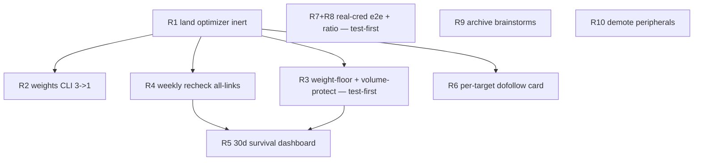

# Core upgrade: prove durable dofollow + prune the miscellany

## Overview

The operator asked for a "comprehensive product upgrade focused on core, trimming the miscellany." The brainstorm reframed this — backed by evidence (an idea-rich/execution-poor backlog, a modular-but-under-exercised core, only ~73 proven live-dofollow links on one owned site, 56–67% deep-page strip rates) — into **converge + prove + prune**, not surface expansion. The growth lever (config-driven adapters) is already a separate active plan (`2026-06-05-005`), so this iteration concentrates on making the **existing** core's central claim true and measured: *links that stay live + dofollow over time*.

The work is four phases: **(1) land** the already-written dispatch-weight optimizer and make its strip-penalty rule safe; **(2) prove** durability with an automatic weekly recheck + an honest survival-rate dashboard + a per-target dofollow history badge; **(3) validate** the never-run non-author real-credential publish path and lock it; **(4) prune** the brainstorm backlog and demote peripheral modules.

## Problem Frame

(see origin: `docs/brainstorms/2026-06-05-core-upgrade-prove-and-prune-requirements.md`)

The core four-stage pipeline (plan → validate → publish → recheck) works in code but is empirically thin: it has only ever run the **author** publish path, the survival of its links has never been measured as a number, and a build-ready optimizer that would tune dispatch by real strip/survival signals sits uncommitted on `feat/continuous-optimization`. The product's only moat is a number — *how many links are still live + dofollow next month* — and today that number is a guess. This plan turns it into a measured, honestly-bounded figure, ships the finishing work, and removes backlog clutter so the live surface reflects the one real direction.

## Requirements Trace

- **R1** — Land `feat/continuous-optimization`: the dispatch-weight optimizer (state/rules/collector), the `registry.dispatch_weight` dynamic override, and the WebUI optimization-status + command-center routes/templates — as one cohesive merge. Lands **inert** (no weight changes from a clean install until real n≥2 signals accumulate).
- **R2** — Consolidate `collect-signals` / `optimize-weights` / `show-optimization-state` into one `weights` command (subcommands `collect`/`optimize`/`show`). `click-track` stays separate.
- **R3** — Enable the existing `aggregated_stats` strip-penalty rule with a **non-zero weight floor + publish-volume protection** so a dominant channel (telegraph ≈86% of strips) cannot be driven to 0 → routing-drop. **[test-first]**
- **R4** — Promote recheck from opt-in (`--probe`) to a **weekly automatic** job over all due links; read-only, credential-free, SSRF-guarded.
- **R5** — A **30-day survival-rate dashboard** (% still live + dofollow) that surfaces sample size and labels immature/insufficient-data cohorts honestly.
- **R6** — A **per-target dofollow** badge on the WebUI history card distinguishing the operator's own link from page-wide/footer anchors; no-signal/legacy rows default to "unverified".
- **R7** — Run the **non-author real-credential** publish path end-to-end as a small **ratio** (≥2 platforms), verifying dofollow. **[operator-local]**
- **R8** — Lock that path with an **e2e test** (default-running scrubbed replay in CI + operator-local live half) and a fixture-scrub CI guard. **[test-first / CI-security]**
- **R9** — Archive off-narrative brainstorms (git mv, never delete) by keep-criterion, leaving the active list reflecting the core.
- **R10** — Demote `geo`/`click_track`/`pr_outreach`/`debt_report` out of the core surface (demote, not delete; keep importable).

**Success criteria (from origin):** a real survival number, sample-size-labelled; ≥1 real-credential non-author dofollow link verified + e2e-locked (ideally a ratio); optimizer landed with `aggregated_stats` enabled behind a non-zero floor and no publish-volume regression; analytics entrypoints 3→1; live brainstorm count down to the core few; **no new product surface**.

## Scope Boundaries

- **No** config-driven lightweight adapters — that is the next increment and is already its own active plan (`2026-06-05-005`).
- **No** GA4 / GSC attribution — no corpus (one owned site; events.db dominated by example.com test data).
- **No** new publishing platforms, **no** WebUI redesign, **no** new auth.
- Pruning is **archive/demote, not delete**. Load-bearing modules stay: `net_safety`, `comment_outreach`, `gap`, `dispatch`, `schedule`, `BaseAdapter`.
- This iteration does **not** flip "uncertain" platforms to dofollow — R7/R8 produce the evidence that a *later* PR would use to do so.

## Context & Research

### Relevant Code and Patterns

- **Optimizer (untracked on branch):** `src/backlink_publisher/optimization/{__init__,models,rules,state,collector}.py`. `registry.dispatch_weight` (`publishing/registry.py:540–546`) lazy-imports `OptimizationState`, reads `data['weights'][name]['current']` in a bare try/except with static fallback (no floor). Dynamic weight flows via `dispatch/signals.py` `PlatformSignal.dispatch_weight` → `dispatch/routing.py:207` `final_score = score * sig.dispatch_weight` (a 0 sinks a platform out of routing).
- **Subcommand CLI model:** `cli/comment.py` (`_build_parser`, `add_subparsers(dest='command', required=True)`, `.set_defaults(handler=...)`, lazy in-handler imports, `main(argv)` returns `int`). Mirror exactly for `cli/weights.py`.
- **Strip-penalty rule:** `optimization/rules.py` `_rule_aggregated_stats` (lines ~207, 246/250) — bare `new_weight *= multiplier`, **no clamp**; registered in `_RULE_REGISTRY` (line 285); **absent** from `models.py` `default_state()` (lines 86–99). "floor" already names the survival/dofollow *rate* threshold — the new knob must be named `min_weight`.
- **Recheck:** `cli/recheck_backlinks.py` (`--probe`, `--fail-on-dead`, exit 6, `_single_run_lock`, `_BATCH_BUDGET_S=600`); `recheck/selection.py` (`DEFAULT_CAP=50/DAYS=14/MIN_RETRY=1`, coverage math); SSRF reached transitively via `recheck/probe.py` `inspect_target_anchor` → `content/_preflight_fetch.py` (net_safety). Launchd precedent: `scripts/com.dex.bp-recheck.plist` + `bp-full-pipeline.plist` (`StartCalendarInterval`).
- **WebUI trio pattern:** `routes/optimization_status.py` / `routes/keep_alive.py` (Blueprint + try/except + `_render`, never 500); `services/keep_alive.py` `build_keepalive_view` (injectable `store`/`now`, JSON-serializable dict); templates `extend base.html`, `var(--…)`, `v=asset_version`, CSRF via `_global_csrf_guard` + `readCsrf()` meta. `webui_app/` + `webui_store/` live at **repo root**, not under `src/`.
- **History/per-target:** `events/history_query.py` `_build_history_item` (line 69 discards `_tgt_urls_json`); `webui_app/api/history_api.py` `_normalize_item` (line 46, single choke point); `templates/_tab_history.html` (`render_history_item`, line 246); badge CSS `.status-badge.{success,error,pending,unverified}` (amber `.unverified` = "no confident truth"). Verdict taxonomy in `recheck/verdicts.py` + `recheck/probe.py` (5 verdicts; `dofollow_lost` is operator-link-specific). `verify_link_attributes` is **seam-locked** (positional, 6 callers).
- **Publish e2e harness:** `tests/test_publish_verify_integration.py` `_run_publish` patches `cli.publish_backlinks.{verify_adapter_setup,adapter_publish}` + `cli._publish_helpers.verify_published` at the **package namespace**; tier via module attr `__tier__='e2e'`. Two independent verification layers: `linkcheck/verify.py` `verify_published` (link **exists** gate, drives `*_unverified`) vs `publishing/adapters/link_attr_verifier.py` (**dofollow** truth, advisory). Secret scrubbing: `events/scrubber.py` `scrub_text`; secrets via `_util/secrets` atomic `0o600`.
- **Prune mechanics:** `docs/_archive/plans/` (143 files) is the archive precedent; `scan_orphan_code.py` (lines 91/101) whitelists `[project.scripts]` entrypoint modules (removing an entrypoint orphans its `cli/*.py` → `tests/test_no_orphan_code.py` fails). WebUI consumes peripherals via lazy try/except imports (`routes/health.py:72`, `pr_queue.py:28`).

### Institutional Learnings

- `docs/solutions/2026-06-05-001-live-dofollow-undercounting-triple-gap` — `live_dofollow`/`survival_rate` were under-counted by three compounding gaps (no `verified_at` writeback; half of unverified never rescheduled; ~16 "uncertain" platforms' confirmations discarded). **Any optimizer/dashboard/badge that weights or displays a suppressed signal is wrong-but-green.** → Count a platform dofollow only when `dofollow_status(p) is True`; derive R5 from `link.rechecked` verdicts (which the CLI weekly job writes) not `articles.verified_at` (which it does not).
- Recheck/config/validation seams have a recurring **test-locks-in-bug** anti-pattern (a green test asserting only shape or a negative enshrines the live bug). → R3 and R6 are **test-first** with positive characterization assertions.
- MEMORY: `never-mutate-shared-worktrees`, `git-mutation-in-shared-tree-collides`, `swarm-reaps-all-worktrees-use-clone` — do all git mutation (R9 mv, R10 pyproject) on an isolated clone, push back to canonical.
- MEMORY: `monolith-split-playbook-and-publish-backlinks-seam-lock` — `publish_backlinks` `main()` is seam-locked (`verify_adapter_setup` ×92); R7 builds `AdapterResult` in tests rather than touching publish-path source.

### External References

None — internal codebase work with strong local patterns. External research intentionally skipped.

## Key Technical Decisions

- **Land R1 as a single cohesive commit, then merge.** Splitting risks half-wired blueprints (`routes/__init__` imports modules that must exist) and budget gates that must move with their code.
- **Frame R1 acceptance as "no weight changes from a clean install until real n≥2 signals,"** not "optimizer never acts." Two inert mechanisms: the `min_confirmations=2` gate in every rule, and the collector returning `{'status':'unavailable'}` offline.
- **R3 weight floor lives at rule-evaluation (`rules.py`, `new_weight = max(new_weight, min_weight)`) plus a defensive read-time clamp in `registry.dispatch_weight`** (belt-and-suspenders against legacy 0s). `aggregated_stats` becomes explicit and enabled in `default_state` with tunable `min_weight` + `volume_floor`. Volume protection = `min_weight` clamp + "protected if `total_published ≥ volume_floor`" guard (clamp-first, reversible). Must not fight an operator's manual weight lock.
- **R5 is a new time-cohort query** (`events/survival_query.py`, sibling to `history_query.py`), derived from `link.rechecked` verdicts, anchored on `publish.confirmed` ts. It is **not** wired into the per-platform optimization rules engine and is distinct from `gates/g5_footprint_survival.py`.
- **R6 source of truth = latest `link.rechecked` verdict** threaded into `_build_history_item`, exposed as one derived string `item['target_dofollow']`, with the no-signal default centralized in `HistoryAPI._normalize_item`. Page-wide `nofollow_detected` must **not** influence the operator-link badge.
- **R8 splits the e2e:** only the **scrubbed-replay** half carries the `__tier__='e2e'` tier and runs in CI; the **live** half is `@pytest.mark.skip` + env-gated (`BACKLINK_PUBLISHER_REAL_LIVE_PUBLISH=1`) and never e2e-tiered (CI injects zero secrets). R7's ratio = **medium + blogger** (both `register()` dofollow=True today).
- **R9 archive dir = `docs/_archive/brainstorms/`** to match the existing `docs/_archive/plans/` precedent (a deliberate deviation from the brainstorm's literal `docs/brainstorms/_archive/`, so "count active" globs need no exclusion).
- **R10 zero-breakage baseline = AGENTS.md doc + Perplexity-to-optional-extra + keep the 4 entrypoints** so `test_no_orphan_code.py` stays green. Only if entrypoints must leave `[project.scripts]` do we patch the `scan_orphan_code.py` allowlist in the same PR.

## Open Questions

### Resolved During Planning

- *Does the operator have a usable non-author account?* — **Yes** (confirmed 2026-06-05); C group (R7/R8) is in scope.
- *Is R3 net-new?* — No; `aggregated_stats` already exists and, because `evaluate_rules` defaults `enabled=True` for any rule absent from `default_state`, it **fires floor-less by default** the moment `optimize-weights` runs (and `run-optimization.sh`'s 6h cron applies, not dry-runs). Resolution: **R1 explicitly disables it** (`default_state` `aggregated_stats: {enabled: False}`) so R1 is genuinely inert; **R3** flips it on with the `min_weight` clamp. This removes any "R1 and R3 must land in the same merge" coupling.
- *Where does R5's 30-day number come from?* — `link.rechecked` verdicts (CLI weekly job writes them), not `articles.verified_at`.
- *Commit granularity / consolidation disposition / clamp location / archive dir / demote baseline* — all resolved above.

### Deferred to Implementation

- **R3:** the optional `volume_floor`/dominance-share guard (the `min_weight` clamp is the load-bearing fix and ships in R3; `volume_floor` waits for evidence the clamp alone over-penalizes a healthy channel).
- **R5 [data]:** how many of the ~73 proven links are ≥30 days old? This decides whether R5 shows a real % or only "maturing/insufficient" *this* iteration. The dashboard + pipeline ship regardless; the headline number may legitimately read "insufficient" until the cohort matures (set this expectation with the operator).
- **R5/R6 [design]:** per-state headline content + hierarchy (loading vs empty/unavailable vs insufficient-n vs stale must be visually distinct, not one gray panel); v1 cuts "trend" (no prior-cohort baseline yet); unify the zh-CN copy register across dashboard + badges; badges carry text + `aria-label`, never color alone.
- **R7 [user]:** confirm the non-author credential covers **both** medium and blogger (the ≥2-platform ratio). If only one platform is available, the ratio degrades to the n=1 floor — still passes "≥1 verified," but the headline ratio claim weakens.
- **R4:** exact weekly `Weekday`/`Hour` and the numeric `--limit` for "all due links."
- **R2:** whether to ever fold `click-track` into `weights` (3→1 vs 4→1) — recommend not now.
- **R9:** manual keep-decision for the `ai-engine-empowerment` active plan (003) brainstorm (no `source_brainstorm`/`origin` frontmatter to auto-protect it); reconcile the ~13 stale plan→brainstorm refs (90 refs vs 84/85 files) via a `comm -23` intersection at implementation time against the live tree.
- **R10:** whether the 4 entrypoints actually leave `[project.scripts]` (needs same-PR allowlist patch) or stay (documentation-only demote); confirm `comment_outreach` maps to `cli/comment.py` before asserting it load-bearing in AGENTS.md.
- **R8:** empty-`live_url` policy is a latent false-green; lock the status-quo pass-through but surface via `xfail`/TODO for a follow-up (do not silently lock the gap).

## Unit Dependency Graph

Real-data ordering: **R1 lands inert → R4 + R7 feed real data → R5/R3 then have trustworthy input.**

`R7+R8`, `R9`, `R10` are parallelizable and independent of the R1 critical path (R7/R8 use seams already on the branch). Critical path: **R1 → {R3, R4} → R5**.

## Implementation Units

### Phase 1 — Land & make safe

- [ ] **Unit R1: Land the dispatch-weight optimizer (inert)**

**Goal:** Commit the already-written optimization subsystem + registry override + WebUI optimization-status/command-center as one cohesive landing on `feat/continuous-optimization`, then merge to main. It must land **genuinely inert** — including the strip-penalty rule being explicitly disabled until R3's floor exists.

**Requirements:** R1

**Dependencies:** None (this is the base everything else builds on).

**Files:**
- Commit (untracked): `src/backlink_publisher/optimization/{__init__,models,rules,state,collector}.py`
- Commit (modified): `src/backlink_publisher/publishing/registry.py` (dispatch_weight override), `webui_app/routes/__init__.py` (register_blueprints), `webui_app/templates/base.html` (nav)
- Commit: `webui_app/routes/{optimization_status,command_center}.py`, `webui_app/templates/{optimization_status,command_center}.html`, `scripts/com.dex.bp-optimization.plist`, `scripts/run-optimization.sh` (if untracked on branch)
- Commit (budget — **already edited in the working tree**): `monolith_budget.toml` (`publish_backlinks/__init__.py` ceiling 240, current SLOC≈209), `complexity_budget.toml` (route-contract test_file 1140) — commit the present edits, do not re-bump
- Modify (the inert-safety fix): `src/backlink_publisher/optimization/models.py` — add `aggregated_stats: {"enabled": False}` to `default_state()`
- Test: `tests/test_optimization_state.py`, `tests/test_optimization_rules.py`, `tests/test_dispatch_weight_optimization.py`, `tests/test_optimization_e2e.py`, `tests/test_webui_route_contract.py`
- Reference: `dispatch/signals.py`, `dispatch/routing.py:207`

**Approach:**
- **Inert-safety (load-bearing):** `evaluate_rules` (`rules.py:51`) defaults `enabled=True` for any rule **absent** from `default_state`, so `aggregated_stats` — which has **no weight floor** — would fire the moment `optimize-weights` runs with n≥2 signals. And `scripts/run-optimization.sh` (a 6-hour `StartInterval=21600` plist) invokes `optimize_weights` **without** `--dry-run` (the script's "dry-run by default" comment is stale; the CLI applies via `apply_results`). Therefore R1 **must add `aggregated_stats: {"enabled": False}` to `default_state()`** so it is genuinely dormant until R3 flips it on with the floor. This decouples R1 from R3 cleanly (no "must land in the same merge" coupling).
- **Stage by explicit path — do NOT `git add -A`.** The branch working tree already carries ~25 modified files, several unrelated to the optimizer (`equity_ledger.py`, `routes/health.py`, `routes/pipeline.py`, `keepalive_job.py`, `store.py`, `_tab_new.html`); those are pre-existing drift owned by other plans and must not ride in R1's commit.
- `routes/__init__` imports the new blueprints, so partial landing half-wires the app — land the optimizer set together.
- The `optimization/__init__.py` docstring is **stale** (claims exports that don't exist — only `OptimizationState` + `RuleResult` are exported); harmless, do not import the named-but-absent symbols.
- All git mutation on an isolated clone (swarm may be active).

**Patterns to follow:** Dynamic-override read pattern (`registry.dispatch_weight` lazy-import + swallow-all try/except → static fallback). WebUI blueprint degrade-to-empty pattern. Test isolation: `monkeypatch.setenv BACKLINK_PUBLISHER_CONFIG_DIR` for integration/CLI/dispatch tests; `OptimizationState(data_dir=str(tmp))` for pure units.

**Test scenarios:**
- Happy: `state.set_weight('telegraph', 0.3)` under sandboxed config → `registry.dispatch_weight('telegraph') == 0.3` (dynamic override wins).
- Happy: no `optimization_state.json` → `dispatch_weight('blogger') == 1.0` (static fallback).
- Edge (inert, n<2): `total_published=1 < min_confirmations=2` → `evaluate_rules` returns `[]`, no weight changes.
- Edge (inert, offline): `collect_all_signals` with all sources unreachable → merged `{}` **and** `optimization_state.json` not created on disk.
- Edge (inert, strip-rule disabled): with `default_state` carrying `aggregated_stats: {enabled: False}`, even n≥2 poor-survival signals for telegraph produce **no** `aggregated_stats` result and no weight change (the rule is dormant until R3).
- Integration: `set_weight('blogger',0.5)` + update_stats → `GET /optimization-status` returns 200 containing `blogger`.

**Verification:** Branch merges to main; full suite stays at the known-red baseline; a clean install changes no weights until real n≥2 signals exist.

- [ ] **Unit R2: Consolidate 3 analytics CLIs into one `weights` dispatcher**

**Goal:** Replace `collect-signals` + `optimize-weights` + `show-optimization-state` (pyproject `[project.scripts]` lines 69–71) with one `weights` entry exposing subcommands `collect`/`optimize`/`show`. Keep `click-track` separate.

**Requirements:** R2

**Dependencies:** R1 (optimization modules must be committed).

**Files:**
- Create: `src/backlink_publisher/cli/weights.py` (dispatcher)
- Modify (keep as importable bodies): `cli/collect_signals.py`, `cli/optimize_weights.py` (also add `aggregated_stats` to `--rule` choices for R3), `cli/show_optimization_state.py`
- Modify: `pyproject.toml` (replace the 3 script lines with one `weights = backlink_publisher.cli.weights:main`)
- Reference: `cli/comment.py`
- Test: `tests/test_cli_show_optimization_state.py` (repoint subprocess targets or keep shims), `tests/test_optimization_rules.py` (`TestOptimizeWeightsCLI`)

**Approach:** Mirror `comment.py` exactly: `add_subparsers(dest='command', required=True)`, `.set_defaults(handler=...)`, lazy in-handler imports, `main(argv)` returns `int`. The 3 existing modules return `None` — standardize the dispatcher on `int` or in-process tests break. Keep the 3 modules importable (lazy-import their bodies), drop only their console-script lines.

**Patterns to follow:** `cli/comment.py` `_build_parser` / handler dispatch. The 3 optimizer CLIs already use argparse `choices=` (exit 2) — keep that for them.

**Test scenarios:**
- Happy: `weights --help` exit 0 lists subcommands; `weights {collect,optimize,show} --help` each exit 0.
- Happy: `weights collect --dry-run --json` emits `{raw,merged}`; `weights optimize --dry-run --json` emits a JSON list; `weights show --json` emits `{platforms:[…]}`.
- Edge: `weights optimize --dry-run --rule aggregated_stats` exit 0 (choices must now include it).
- Error: `weights badsub` non-zero (subparsers required); `weights collect --source bogus` exit 2.

**Verification:** `pip install -e .` exposes `weights`; the 3 old console scripts are gone; ported subprocess tests pass.

- [ ] **Unit R3: `aggregated_stats` non-zero weight floor + publish-volume protection** — **test-first**

**Goal:** Flip `aggregated_stats` from the R1-disabled state to **enabled, behind a non-zero `min_weight` clamp**, so telegraph (≈86% of strips, dominant channel) cannot be driven to 0 → routing-drop. The `min_weight` clamp is the load-bearing safety mechanism; a `volume_floor` guard is an optional second layer (deferred, see below).

**Requirements:** R3

**Dependencies:** R1 (commits `rules.py`/`models.py` and disables the rule). R3 can be coded once R1 lands; its *effect* is only observable once R4 accumulates real n≥2 signals, but the floor itself is data-independent.

**Files:**
- Modify: `optimization/rules.py` (add `new_weight = max(new_weight, min_weight)` clamp in `_rule_aggregated_stats`)
- Modify: `optimization/models.py` (flip `aggregated_stats` `enabled: False` → `True`; add `multiplier, min_weight, survival_low_threshold, dofollow_low_threshold, min_confirmations`)
- Modify: `publishing/registry.py` (defensive read-time `max(min_weight, …)` clamp)
- Modify: `cli/optimize_weights.py` (add `aggregated_stats` to `--rule` choices)
- Test: `tests/test_optimization_rules.py` (`TestAggregatedStats`)

**Execution note:** Write the floor + dominant-channel-protection failing tests **first** — they characterize the live bug (current `test_already_at_minimum_no_further_change` asserts `== 0.0`; the fix must flip it to `>= min_weight`).

**Approach:** Clamp at rule-evaluation so persisted state and WebUI display both reflect the floored value, plus a belt-and-suspenders read-time clamp in `registry.dispatch_weight`. Name the new knob `min_weight` (the existing "floor" is the rate threshold — naming trap). The `min_weight` clamp alone satisfies the load-bearing assertion (`dispatch_weight('telegraph') > 0`, telegraph stays a routing candidate); ship it first. An **optional** `volume_floor` guard ("protected if `total_published ≥ volume_floor`") may be added if a real corpus later shows the clamp alone over-penalizes a healthy high-volume channel — keep it deferred (see Open Questions) rather than building the knob ahead of need. Must not fight an operator's manual weight lock (`set_weight(force=True)` already immunizes locked channels).

**Patterns to follow:** rule-registry + `config.get('enabled', True)` gating; `_make_state_data(**overrides)` test merge over `default_state()`; `test_disabled_rule_skipped` for the disabled-config case.

**Test scenarios:**
- Happy: survival 20% < 30% reduces weight; dofollow 10% < 20% reduces; both compound to `0.25 × current`.
- Edge (weight floor, test-first): a platform at survival 10% over repeated cycles clamps at `min_weight` (e.g. 0.1), not 0.0 — assert `new_weight >= min_weight`; update `test_already_at_minimum_no_further_change`.
- Edge (volume protection, test-first): telegraph (dominant share + poor survival) is exempted/floored so `registry.dispatch_weight('telegraph') > 0` and `routing.route` keeps it a candidate (`final_score != 0`).
- Edge: survival ≥ threshold and dofollow ≥ threshold → `applied=False`, weight unchanged.
- Error: `rules={'aggregated_stats':{'enabled':False}}` → rule absent from results.

**Verification:** No enabled rule can persist a platform weight below `min_weight`; dominant channel survives the rule; full suite green delta.

### Phase 2 — Prove durability

- [ ] **Unit R4: Weekly automatic recheck, all-due-links coverage**

**Goal:** Change the existing recheck launchd agent from daily to weekly and widen selection to "all due links within budget," staying read-only and credential-free.

**Requirements:** R4

**Dependencies:** R1 (bff0898 `verified_at` writeback lands with R1, though R5 derives from `link.rechecked`).

**Files:**
- Modify: `scripts/com.dex.bp-recheck.plist` (`StartInterval=86400` → `StartCalendarInterval` Weekday/Hour/Minute), `scripts/run-recheck-periodic.sh` (raise `--limit`)
- Modify if needed: `recheck/selection.py` (`DEFAULT_CAP`/`--limit`, coverage math)
- Reference: `cli/recheck_backlinks.py` (`--probe`, exit 6, `_single_run_lock`, `_BATCH_BUDGET_S=600`), `recheck/probe.py`, `content/_preflight_fetch.py` (SSRF proof), `scripts/install-recheck-launchd.sh`
- Test: `tests/test_cli_recheck_backlinks.py` (template), `tests/test_recheck_selection.py` (add starvation scenario)

**Approach:** Use `StartCalendarInterval` (copy `bp-full-pipeline.plist`) over `StartInterval=604800` — calendar scheduling is the in-repo convention. "All links" = "all due links within the wall-clock budget, oldest-first"; leftovers defer to next week. Keep logic in the Python CLI (tested); shell wrappers stay thin (untested). Plist injects only `PATH` — recheck imports adapters solely to populate the registry, never instantiates a publish session.

**Patterns to follow:** `bp-full-pipeline.plist` calendar cadence; `selection.py` oldest-first `select_candidates`; read-only credential isolation (PATH-only env).

**Test scenarios:**
- Happy: `recheck --probe` over N seeded `publish.confirmed` events emits N `link.rechecked` events, exit 0.
- Happy: weekly cadence — plist `StartCalendarInterval(Weekday=N)` parses; `run-recheck-periodic.sh` passes `--probe` (assert via plist content read; no live `launchctl`).
- Edge (coverage): corpus `C` > weekly cap → oldest-definitive links selected first; never-checked links sort ahead of recently-checked.
- Edge (lock): a second `--probe` while `_single_run_lock` is held → skipped, exit 0, zero duplicate events.
- Edge (budget): `_BATCH_BUDGET_S=0` defers remaining candidates, stderr reports deferred count, exit 0.
- Error: `--fail-on-dead` with a deterministic dead link → exit 6; `probe_error`/`dofollow_lost` alone do **not** trip it.
- Happy (credential isolation): run with no publish creds in env still completes; assert no publish session constructed.

**Verification:** Weekly plist installs and fires `--probe` read-only; selection starves nothing within budget; dashboard (R5) must not claim 100% coverage when budget-truncated.

> **Known trap (verified):** weekly cron (P=7) × `DEFAULT_CAP=50` probes ~50 links/week; a live corpus > 50 starves oldest links and falsifies "all links." Raise the effective cap but keep `_BATCH_BUDGET_S=600` as the real bound, and label coverage honestly.

- [ ] **Unit R5: 30-day survival-rate dashboard with sample-size honesty**

**Goal:** A new cohort query + read-only WebUI trio computing "% of links published ≥30 days ago whose latest `link.rechecked` verdict is alive," surfacing sample size and handling immature/insufficient-data states explicitly.

**Requirements:** R5

**Dependencies:** R1 (bff0898 lands with it) + R4 (feeds real `link.rechecked` data) + R3 (so displayed weights are floored honestly).

**Files:**
- Create: `src/backlink_publisher/events/survival_query.py` (cohort query)
- Create: `webui_app/routes/survival_dashboard.py` (blueprint, GET, never 500)
- Create: `webui_app/services/survival.py` (`build_survival_view(*, store=None, now=None)` injectable)
- Create: `webui_app/templates/survival_dashboard.html` (extends base.html, `var(--…)`, `v=asset_version`)
- Modify: `webui_app/templates/base.html` (nav link "存活率", `active_page='survival_dashboard'`), `webui_app/routes/__init__.py` (register blueprint)
- Reference: `events/history_query.py` (column-index unpacking), `recheck/events_io.py` (`derive_per_target_status` latest-verdict pattern), `events/schema.py` (`articles.published_at_utc`, `idx_articles_host_pub`)
- Test: `tests/test_survival_query.py` (unit), `tests/test_webui_survival_dashboard.py` (integration, mirror `test_webui_keep_alive_status.py`)

**Approach:** New `survival_query.py` sibling to `history_query.py` — do **not** overload `events_io.py` or the optimization rules engine. Derive survival from `link.rechecked` verdicts (latest-wins via `overlay._is_newer`, ts + event-id tiebreak), anchor the cohort on `publish.confirmed` ts (fall back to `articles.published_at_utc`). Links < 30 days are excluded from the rate and surfaced as a separate "maturing" count; `n < 2` cohorts suppress the % and show "n too small" while still surfacing `sample_size`. Exclude `example.com` hosts (mirror `keep_alive._EXCLUDED_HOSTS`).

**Patterns to follow:** WebUI trio (`routes/keep_alive.py` + `services/keep_alive.py:build_keepalive_view` + base.html template); injectable `store`/`now`; JSON-serializable dict (no sets).

**Test scenarios:**
- Happy: 10 links published 40d ago, latest verdicts 7 alive / 3 stripped → `survival_rate == 0.70`, `sample_size == 10`.
- Edge (immature): a 20-day-old link is excluded from the rate, surfaced as a "maturing" count.
- Edge (insufficient, n<2): a 1-mature-link cohort returns insufficient-data / suppressed rate, `sample_size` surfaced.
- Edge (empty): no mature links → view `is_empty`/"unavailable", route renders without 500.
- Edge (stale): newer `publish.confirmed` with no `link.rechecked` → `stale=True` + `stale_days`, rate flagged partial.
- Edge (latest-verdict-wins): old `alive` then newer `link_stripped` counts as dead, not double-counted.
- Edge (excluded hosts): `example.com` never counted.
- Integration: `GET /survival-dashboard` renders rate + n + per-state labels; view dict JSON-serializable; CSRF + `asset_version` present. (Trend is **out of v1 scope** — see Deferred; a single weekly recheck series has no prior-cohort baseline yet. v1 ships rate + n + maturity/insufficient labels only.)
- Error: `survival_query` raises mid-read → route logs a warning, renders honest "unavailable", never 500.

**Verification:** Dashboard shows the survival % **when the mature cohort has n≥2**, otherwise an honest "insufficient / maturing" state with the sample size surfaced; the number is derived from CLI-written `link.rechecked` data with zero extra writeback coupling. Acceptance is the **measurement pipeline being correct and honestly labelled**, not the percentage itself being non-empty this iteration (the cohort may not have matured yet).

> **Trap (verified):** two existing "survival" concepts will confuse search — `optimization/rules.py` per-platform `survival_rate` (no cohort) and `gates/g5_footprint_survival.py` (DOM fingerprint). Neither is R5.

- [ ] **Unit R6: Per-target dofollow history card**

**Goal:** Surface a per-row badge distinguishing the operator's own required-link dofollow status from page-wide `nofollow_detected`; default no-signal/legacy rows to "unverified" (amber), never green/red.

**Requirements:** R6

**Dependencies:** R1 (events plumbing).

**Files:**
- Modify: `events/history_query.py` (join latest `LINK_RECHECKED` per `article_id`; map verdict → `item['target_dofollow']`)
- Modify: `webui_app/api/history_api.py` (`_normalize_item` line 46 default `target_dofollow='unverified'`; recheck path persists verdict)
- Modify: `webui_app/templates/_tab_history.html` (`render_history_item`, sub-badge next to target_url line 246)
- Modify: `webui_app/static/css/index.css` (reuse `.status-badge.{success,error,unverified}`; add `.target-badge.nofollow`)
- Modify: `webui_app/services/recheck.py` (capture `probe_liveness` verdict before the ok/reason collapse at `_default_verify` line 55)
- Reference: `recheck/probe.py` (5-verdict taxonomy), `recheck/verdicts.py` (reuse constants), `tokens.css`
- Test: `tests/test_history_template_rendering.py` (`TestTargetDofollowRendering`), `tests/test_history_recheck.py`

**Execution note:** Test-first — assert the badge **value** per verdict state, not just presence (avoid the test-locks-in-bug anti-pattern).

**Approach:** Source of truth = latest `link.rechecked` verdict (re-runs over time; `probe_liveness` is the shared CLI+WebUI engine, so the badge can never disagree with the keep-alive scorecard). Add fields in the single choke point `_build_history_item` (line 69 currently discards `_tgt_urls_json`; `articles.target_urls_json` already stores the required-link list — read it + join latest verdict, no new fetch). Single derived string `item['target_dofollow'] ∈ {dofollow, dofollow_lost, stripped, rewritten, unverified}`. Centralize the no-signal default in `HistoryAPI._normalize_item`. Keep the page-wide badge unchanged. Reuse `.status-badge` classes (amber `.unverified` = no-confident-truth). Do **not** change `verify_link_attributes` (seam-locked, 6 positional callers); `LINK_RECHECKED` payload must stay within `kinds.PAYLOAD` allowed keys.

**Technical design — verdict → badge mapping (directional, not implementation spec):** the badge is keyed off the single derived `target_dofollow` string, never off raw probe signals. Resolve all five values + the `expected_nofollow` case so no row renders an undefined badge:

| probe verdict / signal | `target_dofollow` | copy (zh-CN) | color class |
|---|---|---|---|
| `alive` (operator link, dofollow) | `dofollow` | dofollow 正常 | `.status-badge.success` (green) |
| `dofollow_lost` (rel=nofollow on a dofollow channel) | `dofollow_lost` | dofollow 已失效 | `.target-badge.nofollow` (amber) |
| `link_stripped` (operator link absent) | `stripped` | 链接被移除 | `.status-badge.error` (red) |
| rewrite/interstitial verdict | `rewritten` | 链接被改写 | `.target-badge.nofollow` (amber) |
| `expected_nofollow` (channel `dofollow_status` is False) | `unverified` | 预期 nofollow | `.status-badge.unverified` (neutral) — **not** a `dofollow_lost` alarm |
| no `target_urls` + no `link.rechecked` (legacy) | `unverified` | 未验证 | `.status-badge.unverified` (amber) |

Badges carry text + an `aria-label`/`title` (verdict in words), never color alone. Note legacy rows dominate at launch → the "未验证" default must not read as "everything broken."

**Patterns to follow:** `_build_history_item` single-construction-point; fixed `.status-badge` CSS vocab; `_normalize_item` choke point.

**Test scenarios:**
- Happy (operator-link dofollow): verdict `alive` → green "dofollow OK" badge, distinct from page-wide status.
- Edge (`target_nofollow`): operator's link present but `rel=nofollow` on a known-dofollow channel (verdict `dofollow_lost`) → amber "dofollow 已失效", not a page-wide success.
- Error (`target_missing`): required link absent (verdict `link_stripped`) → red "link stripped/missing" even if article published OK.
- Edge (no-signal legacy): row with no captured `target_urls` and no `link.rechecked` → "unverified"/amber via `_normalize_item` default; excluded from confident dofollow/stripped counts.
- Integration (page-wide-nofollow-but-operator-ok): page `nofollow_detected=True` (footer) while operator link `alive` → per-target badge shows dofollow OK; page-wide does **not** downgrade it (core correctness).
- Integration (expected-nofollow channel): operator link nofollow on a channel whose `dofollow_status` is False (`expected_nofollow=True`, not `dofollow_lost`) → no "lost dofollow" alarm.

**Verification:** The history card shows operator-link dofollow truth independent of page-wide anchors; legacy rows read "unverified," never a misleading green/red.

### Phase 3 — Validate reality

- [ ] **Unit R7+R8: Real-credential non-author publish (ratio) + scrubbed-replay e2e lock** — **test-first / CI-security**

**Goal:** Lock the real-credential, dofollow-verified publish path with an e2e split into (A) a default-running scrubbed-replay e2e covering all happy/edge/error/exit-code scenarios and a ≥2-platform dofollow **ratio**, and (B) an optional operator-local live half; plus a fixture-scrub CI guard. The operator runs the live half once against their non-author account(s).

**Requirements:** R7, R8

**Dependencies:** None on R1's landing — uses `verify_published` / `link_attr` seams already on the branch.

**Files:**
- Create: `tests/test_e2e_live_publish_ratio.py` (two halves)
- Create: `tests/fixtures/live_publish/` (scrubbed Medium/Blogger JSON + live-page HTML: dofollow, nofollow-stripped, rewritten-interstitial samples)
- Create: `tests/test_live_publish_fixtures_scrubbed.py` (security guard — see hardened spec in Approach; `scrub_text` alone is **insufficient**)
- Modify: `pyproject.toml` (register `real_live_publish` marker in `[tool.pytest.ini_options].markers`)
- Reference: `tests/test_publish_verify_integration.py` (`_run_publish` harness, line 18), `tests/test_inspect_target_anchor.py` (recorded-replay template, `__tier__='e2e'`), `tests/test_browser_publish_velog.py` (opt-in live-smoke skip), `events/scrubber.py` (`scrub_text`), `publishing/adapters/link_attr_verifier.py`, `linkcheck/verify.py`, `.github/workflows/ci.yml`

**Execution note:** Test-first; CI-security — only the scrubbed-replay half carries `__tier__='e2e'`. The live half is `@pytest.mark.skip` + `BACKLINK_PUBLISHER_REAL_LIVE_PUBLISH=1` env gate and is **never** e2e-tiered (CI injects zero secrets, so an e2e-tiered live test would attempt a credential-less real publish and hard-fail).

**Approach:** Replay via the patch-seams harness (build `AdapterResult` + `_provider_meta['link_attr_verification']` directly), not real adapters — patch at the **package namespace** (`backlink_publisher.cli.publish_backlinks.{verify_adapter_setup,adapter_publish}`, `cli._publish_helpers.verify_published`). Reserve real-adapter exercise for the operator-local half. Ratio scope = medium + blogger (both `register()` dofollow=True). Assert the two verification layers **separately**: `verify_published` (link **exists** gate, `*_unverified`) vs `link_attr` `target_nofollow/target_found/target_rewritten` (dofollow truth). `AuthExpiredError` IS-A `DependencyError` — catch it first.

**Hardened fixture-scrub guard (do not rely on `scrub_text` alone):** `events/scrubber.py` `scrub_text` (a) does **not** match session-class secrets (`Set-Cookie`/`Cookie`/`refresh_token`/`sid`/`xsrf` under its entropy/pattern thresholds), and (b) **truncates inputs > 64 KiB and drops** secrets past the cap — and live-page HTML routinely exceeds 64 KiB, so a tail secret passes silently. The guard test must therefore: (1) **fail any fixture > `_MAX_SCRUB_LEN`** (or chunk-and-scan the whole file); (2) reject any `Set-Cookie`/`Cookie`/`Authorization` header **case-insensitively** plus the keys `refresh_token`/`session`/`sid`/`csrf`/`xsrf` followed by a non-trivial value — not just the five literal substrings; (3) prefer **stripping cookie/auth headers at capture time** over post-hoc scrubbing. Also add `Set-Cookie`/`refresh_token` patterns to `scrubber._PATTERNS` so `scrub_text` is non-empty on them. The same risk applies to the live half's transient stderr/tracebacks — redact those, not just the recorded fixture.

**Live-half safety (R7):** default the live publish to **draft / unpublished** mode (both adapters support `isDraft`/`status='draft'`; assert dofollow on the draft/preview URL), run against a **dedicated throwaway non-author account**, and **delete the draft after verification**. Require a separate explicit flag (e.g. `BACKLINK_PUBLISHER_REAL_LIVE_PUBLISH_PUBLIC=1`) before any public post. Record the run result via `_util/secrets` atomic `0o600` with secrets redacted.

**Patterns to follow:** `_run_publish` CLI e2e harness; recorded fixtures as raw `.html`/`.json` under `tests/fixtures/<topic>/`; tier via module attr `__tier__='e2e'`; opt-in live skip + env gate.

**Test scenarios:**
- Happy (dofollow-verified replay): recorded Medium JSON + live HTML with operator dofollow `<a>` → `verify_published.ok True`, status not `_unverified`, recorded verdict link-alive (`target_nofollow False`, `target_found True`), exit 0.
- Happy (ratio ≥2 platforms): medium + blogger both recorded-dofollow → both verified, distinct `output['adapter']` — the ≥2-platform lock.
- Edge (publish-ok-but-stripped): recorded HTML `rel='nofollow'` → `verify_published` still `ok=True` (link exists) **but** `link_attr target_nofollow=True` + drift WARN; assert the system records nofollow truth and does **not** report dofollow (anti-false-positive, independent of the verify gate).
- Error (auth-expired mid-flow): `adapter_publish` raises `AuthExpiredError(channel='medium')` → `auth_aborted True`, epilogue skipped, `record_failure(error_class='auth_expired')`, no `_unverified` rows after abort.
- Edge (empty live_url): `published_url=''` + `draft_url=''` → verify skipped (current behavior); assert + `xfail`/TODO documenting that empty URL ≠ verified-dofollow (latent false-green).
- Integration (exit-code precedence): one `ExternalServiceError` row + one unverified row → exit 4 (publish-fail dominates 5).
- Security (fixtures scrubbed, hardened): every `tests/fixtures/live_publish/*` is `≤ _MAX_SCRUB_LEN`, contains no `Set-Cookie`/`Cookie`/`Authorization` header (case-insensitive) and no `refresh_token`/`sid`/`csrf` value, and `scrub_text(content)[1]` is empty — a fixture with a tail cookie past 64 KiB **fails** (regression test for the truncation false-green).
- Security (live-half draft default): the operator-local live test publishes in **draft** mode by default; asserts no public post occurs without `BACKLINK_PUBLISHER_REAL_LIVE_PUBLISH_PUBLIC=1`.

**Verification:** CI runs the scrubbed-replay e2e (no secrets) and the fixture-scrub guard; the operator runs the env-gated live half once and observes a real ≥2-platform dofollow ratio; the live half never runs in CI.

### Phase 4 — Prune

- [ ] **Unit R9: Archive off-narrative brainstorms by keep-criterion**

**Goal:** Build a keep-set and `git mv` (never delete) the complement to `docs/_archive/brainstorms/`, leaving the active list reflecting the core.

**Requirements:** R9

**Dependencies:** None (docs-only; do on an isolated clone).

**Files:**
- Modify: `docs/brainstorms/` (git mv complement) → `docs/_archive/brainstorms/` (new, matches `docs/_archive/plans/` precedent)
- Reference (keep): `docs/brainstorms/2026-06-05-core-upgrade-prove-and-prune-requirements.md`, the brainstorms behind **all currently-active plans**, `docs/ideation/2026-06-05-backlog-convergence-ideation.md`, `docs/ideation/gate-verdicts.md`

**Approach:** **Derive the active-plan set dynamically** (`grep -rl '^status: active' docs/plans/`) rather than hardcoding a count — it changed between brainstorm and planning and is currently **five** (003 ai-engine, 005 config-driven-adapters, 006 reliability-hardening, 007 collapse-unconnected, 008 this plan), not three. Keep-set = (refs from **every** active plan, via both `origin:` and `source_brainstorm:` frontmatter + inline body refs) ∪ (topic == a `registered_platforms()` adapter name) ∪ (parent core-upgrade) ∪ (the active-plan ideation anchors). Archive the complement. Do **not** use "referenced by ANY plan" (≈88 are referenced by archived/shipped plans → keeps nearly all). Intersect actual files with refs first (`comm -23`) so stale refs (~90 refs vs ~85 files) don't protect ghosts. A topic that is KILL/BLOCKED in `gate-verdicts.md` is an archive candidate (gate-mention ≠ keep). Verify each active plan actually carries `origin:`/`source_brainstorm:` frontmatter before trusting the scan — plan 003 (`ai-engine`) has neither, so its brainstorm needs a manual keep-call.

**Test scenarios:** *Test expectation: none — docs-only move.* Verification is the keep-set audit below.

**Verification:** Keep-set brainstorms remain in `docs/brainstorms/`; the complement is `git mv`-d into `docs/_archive/brainstorms/`; no active plan's `origin:`/`source_brainstorm:` points at a moved file; the active count drops to the core few.

> Manual call deferred: the `ai-engine-empowerment` active plan (003) has no `source_brainstorm`/`origin` frontmatter, so a reference scan can't auto-protect its brainstorm — decide by hand.

- [ ] **Unit R10: Demote `geo` / `click_track` / `pr_outreach` / `debt_report`**

**Goal:** Narrow these four peripheral surfaces out of the core narrative while keeping them importable (WebUI + config import them at runtime).

**Requirements:** R10

**Dependencies:** None (decouple from R2's click-track CLI consolidation).

**Files:**
- Modify: `pyproject.toml` (move Perplexity to an optional extra; decide entrypoint disposition), `AGENTS.md` (document the four as peripheral/meta outside the core 4-stage pipeline)
- Modify only if entrypoints are removed: `scripts/scan_orphan_code.py` (add the 4 cli modules to the allowlist)
- Reference (keep importable): `src/backlink_publisher/geo/`, `click_track/`, `pr_outreach/`, `cli/debt_report.py`
- Test: `tests/test_no_orphan_code.py`, `tests/test_r9_extension_readiness.py`, `tests/test_cli_probe_citations.py` / `test_pr_outreach.py` / `test_click_track_*.py`

**Approach:** Zero-breakage baseline = AGENTS.md doc + Perplexity-to-optional-extra + **keep the four entrypoints** in `[project.scripts]` so `test_no_orphan_code.py` stays green with no allowlist churn. The real entrypoints are `probe-citations` (imports `geo`), `pr-opportunities` (imports `pr_outreach`), `click-track` (`click_track`), `debt-report` (`debt_report`) — there is **no** `geo` or `pr-outreach` console script, so `geo`/`pr_outreach` are kept non-orphan **transitively** via `probe-citations`/`pr-opportunities` (removing those CLI entrypoints would orphan the packages). Demote ≠ remove from import path — making packages uninstallable-by-default breaks the WebUI health panel and config parsing (both lazy-import with try/except degradation; config parsers read peripheral sections every load). The orphan whitelist is `scan_orphan_code.py:~101` (`if module in entry_points: continue`, fed by `_get_entry_point_modules()`), not line 91. Only if entrypoints must leave `[project.scripts]` do we patch that allowlist in the same PR.

**Test scenarios:**
- Happy (import smoke): `import backlink_publisher.geo, …click_track, …pr_outreach; import backlink_publisher.cli.debt_report` succeeds.
- Error (orphan gate): removing the 4 entrypoints without updating `scan_orphan_code.py` → `test_no_orphan_code.py` fails (mitigation: keep entrypoints, or allowlist in same PR).
- Integration: `test_r9_extension_readiness.py` stays green (registry contract untouched).
- Integration: full `PYTHONHASHSEED=0` suite stays at the ~11–12 known-red baseline (no new reds).
- Edge (config): `load_config` on `config.example.toml` with `[geo.probe_provider]` / `[click_track]` present still parses.

**Verification:** All four packages import; orphan + extension-readiness tests green; suite at known-red baseline; config still parses peripheral sections; AGENTS.md marks them peripheral. (Confirm `comment_outreach` maps to `cli/comment.py` before asserting it load-bearing.)

## System-Wide Impact

- **Interaction graph:** `registry.dispatch_weight` (R1/R3) feeds `dispatch/signals.py` → `dispatch/routing.py:207` (publish routing); `link.rechecked` events (R4) feed R5's cohort query and R6's history badge; `_build_history_item` (R6) feeds every history render (list/recheck/delete). The optimizer, dashboard, and badge all read the same `live_dofollow`/`survival` signal family — the undercounting solution doc governs all three.
- **Error propagation:** WebUI routes (R1, R5) degrade to empty/"unavailable", never 500. Recheck (R4) is advisory (exit 0) except deterministic-dead under `--fail-on-dead` (exit 6). Publish (R7/R8): `AuthExpiredError` aborts the epilogue; exit-code precedence publish-fail (4) > unverified (5).
- **State lifecycle risks:** `optimization_state.json` must not be created when offline (R1 inert); a 0 weight is a silent routing-drop (R3 guards it); R4 must not double-process under its single-run lock; R5 latest-verdict-wins must not double-count.
- **API surface parity:** `[project.scripts]` changes (R2 removes 3, R10 keeps 4) — the orphan-code gate and `test_r9_extension_readiness` are the contract guards. CLI exit codes are a documented (non-enforced) contract.
- **Integration coverage:** pipeline→WebUI render (R1), weekly-job→survival-dashboard data flow (R4→R5), recheck→history-badge (R6), real publish→two-layer verification (R7/R8) — all need integration scenarios beyond mocks.
- **Unchanged invariants:** `verify_link_attributes` signature (seam-locked, 6 callers), `publish_backlinks main()` seams (`verify_adapter_setup` ×92), the adapter `register()`/argparse/schema contract (`test_r9_extension_readiness`), load-bearing modules (`net_safety`, `comment_outreach`, `gap`, `dispatch`, `schedule`, `BaseAdapter`).

## Risks & Dependencies

| Risk | Mitigation |
|------|------------|
| **Suppressed signal is wrong-but-green** — optimizer/dashboard/badge read `live_dofollow`/`survival` that a solution doc proves was under-counted by 3 gaps. | Count a platform dofollow only when `dofollow_status(p) is True`; R5 derives from `link.rechecked` (CLI writes) not `articles.verified_at` (CLI doesn't); write **positive** characterization tests (expect a gap-fix to flip a green test red). |
| **Test-locks-in-bug** anti-pattern (green test enshrines the live bug). | R3 + R6 are test-first; R3 flips `test_already_at_minimum_no_further_change` from `==0.0` to `>=min_weight`; R6 asserts badge **value** per state. |
| **CI runs e2e credential-less** (zero secrets) — an e2e-tiered live publish would attempt a real credential-less publish and hard-fail. | Only the scrubbed-replay half is `__tier__='e2e'`; the live half is `@pytest.mark.skip` + env-gated, never e2e-tiered; register the `real_live_publish` marker (else `--strict-markers` fails). |
| **Floor-less rule fires before R3** — `aggregated_stats` is absent from `default_state` (so defaults `enabled=True`) and the 6-hour `com.dex.bp-optimization.plist` runs `optimize_weights` **without** `--dry-run` (applies). Once R4 feeds n≥2 poor telegraph stats, the cron drives telegraph weight toward 0 before R3's floor exists. | **R1 adds `aggregated_stats: {enabled: False}` to `default_state`** — genuinely dormant until R3 flips it on with the `min_weight` clamp. Decouples R1 from R3; the cron can be loaded safely. |
| **Routing-drop** — `dispatch_weight=0` → `final_score=0` → a 0-weight platform sorts last and loses to any non-zero alternative (telegraph deprioritized to never-chosen, not literally removed from `scored`). | R3 clamps `new_weight=max(.., min_weight)` at rule-eval + defensive read-time clamp in `registry.dispatch_weight`; load-bearing test asserts `dispatch_weight('telegraph') > 0` so it stays a candidate. Optional `volume_floor` guard deferred. |
| **Data-integrity via hijacked domains (R4)** — the weekly job fetches stored `live_url`s months old; an expired→re-registered domain is SSRF-clean but attacker-controlled, and its body's anchor/`rel` is recorded into `link.rechecked` → inflates R5's survival % / R6's badge. SSRF guards the *destination*, not content trustworthiness. | Bound recheck to a domain-age / provenance check or flag re-registration drift; treat anchor provenance as untrusted. Track as a deferred hardening item (does not block R4's read-only promotion). |
| **Shared/active worktrees** — a merge-swarm may auto-land/force-push/prune while this runs. | All git mutation (R1 merge, R9 mv, R10 pyproject) on an isolated full clone, push back to canonical; verify no live agent holds the tree first. |
| **Budget gates hard-fail CI** — born-complex `weights.py`/floor logic over CC 30, or a SLOC overrun. | Keep `weights.py` thin (lazy-import bodies), `survival_query.py`/service small, R3 floor logic simple; any bump needs a same-PR ≥80-char rationale; new `optimization/*.py` are <500 SLOC (no monolith entry). |
| **@patch-by-name seam fragility** — ~92 publish-path patches target the package namespace. | Patch at the package namespace, not the engine module; don't move name-rebinding globals; R7 builds `AdapterResult` in tests rather than touching seam-locked publish source. |
| **R4 starvation** — weekly P=7 × cap 50 starves a >50-link corpus, falsifying "all links." | Raise effective cap, keep `_BATCH_BUDGET_S=600` as the real bound, select oldest-first, and label dashboard coverage honestly (never claim 100% when budget-truncated). |

## Documentation / Operational Notes

- **AGENTS.md** (R10): mark `geo`/`click_track`/`pr_outreach`/`debt_report` peripheral; note the new `weights` command (R2) and the survival dashboard (R5).
- **Operational:** R4 installs a weekly launchd agent (operator runs `install-recheck-launchd.sh`); R7 live half is operator-run **once, in draft mode, against a throwaway non-author account**, with `BACKLINK_PUBLISHER_REAL_LIVE_PUBLISH=1` and the credential stored `0o600`. A real publish to a third-party platform under a real identity is **irreversible** (indexing, account actioning, permanent footprint) — default to draft + teardown; require a separate explicit flag before any public post.
- **Rollout / landing strategy (recommended, per the plan's own independence):** land in three PRs rather than one — **PR-1 = R1–R6** (optimizer-land + prove-durability core, the R1→{R3,R4}→R5 critical path); **PR-2 = R7+R8** (real-credential e2e, independent of R1's landing); **PR-3 = R9+R10** (docs/config prune, zero code coupling). This shrinks review surface and merge blast radius. Within PR-1, R1 lands the optimizer with `aggregated_stats` **explicitly disabled**, and R3 flips it on with the floor — so production routing is unchanged until the floor exists even if the 6-hour optimization cron is loaded.

## Sources & References

- **Origin document:** [docs/brainstorms/2026-06-05-core-upgrade-prove-and-prune-requirements.md](docs/brainstorms/2026-06-05-core-upgrade-prove-and-prune-requirements.md)
- Related active plans (do not overlap): `docs/plans/2026-06-05-005-feat-config-driven-lightweight-adapters-plan.md`, `…-003-feat-ai-engine-empowerment-visibility-plan.md`, `…-006-fix-reliability-config-and-anchor-calibration-hardening-plan.md`
- Institutional learning: `docs/solutions/2026-06-05-001-live-dofollow-undercounting-triple-gap`
- Key code seams: `publishing/registry.py:540`, `optimization/rules.py:207/246` + `rules.py:51` (`enabled` default), `optimization/models.py:80` (`default_state`), `dispatch/routing.py:207`, `events/history_query.py:69`, `tests/test_publish_verify_integration.py`, `scripts/scan_orphan_code.py:~101`, `scripts/run-optimization.sh` + `scripts/com.dex.bp-optimization.plist` (6h cron), `events/scrubber.py` (`_MAX_SCRUB_LEN`)
