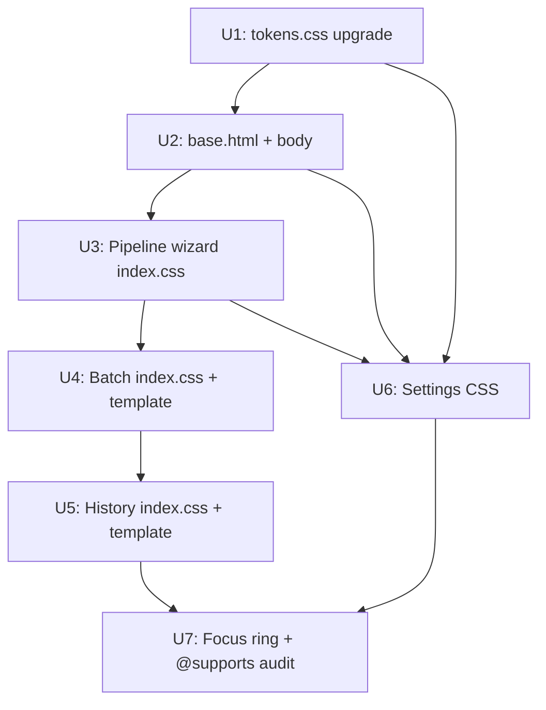

# feat: WebUI Glass/Gradient Visual Overhaul

## Overview

Upgrade all four WebUI pages (Pipeline Wizard, Batch, History, Settings) from the current
light-gray-background / lightly-bordered-card look to a cohesive Glass/Gradient dark theme.
Changes are **pure CSS + HTML** — no new Python, no route changes, no new JS modules.

The work flows as seven sequenced units, each atomic enough for an independent commit.
Units 3–5 all touch `index.css`; they must be applied in order to avoid conflicts.
Units 3–6 can proceed in parallel with each other once U2 lands, but each touches
a different CSS file (except 3/4/5 → index.css), so sequencing within index.css work is:
U3 → U4 → U5.

## Problem Frame

The WebUI's `tokens.css` already defines `--glass-bg`, `--glass-border`, and the page CSS
files (`index.css`, `settings.css`) already apply `backdrop-filter: blur(12px)` to `.card`.
However:
- Body background is defined in per-page CSS `body {}` rules (light gray radial-gradient),
  not in `tokens.css`, so overriding it globally requires touching multiple files
- `--glass-bg` is `rgba(255,255,255,0.8)` — near-opaque white, which looks identical on
  a light background and defeats the glass effect entirely
- Batch results and history-item elements use heavy **inline styles** (hardcoded hex colors)
  that token changes will not override
- No `@keyframes` exist anywhere; pulse + shine animations are first introductions
- No `@supports (backdrop-filter)` guards exist; all three CSS files use bare backdrop-filter

(see origin: docs/brainstorms/2026-06-12-ui-glass-overhaul-requirements.md)

## Requirements Trace

- R1 → U1: Update tokens.css glass tokens to dark values
- R2 → U1: Add --gradient-hero, --gradient-accent, --text-primary, --text-secondary tokens
- R3 → U3: Step bar glass + @keyframes pulse (with prefers-reduced-motion)
- R4 → U3: Wizard cards strong glass, hover/active states, @supports guard
- R5 → U4: CTA button gradient + shine animation (with prefers-reduced-motion)
- R6 → U3: Success/fail result cards green/red gradient glass + icon requirement
- R7 → U4: Batch input area glass card wrap
- R8 → U4: Batch progress bar animation (glass track + gradient fill)
- R9 → U5: History rows alternating glass + hover highlight
- R10 → U5: Status badge pill + colored glow
- R11 → U6: Settings sidebar glass panel + active accent bar
- R12 → U6: Settings cards glass treatment
- R13 → U2: base.html bg-orbs div + global gradient-hero body background + color-scheme: dark
- R14 → U7: Global branded focus ring for all focusable elements
- R15 → all units: Zero Node/bundler dependency, pure CSS + native ES module

## Scope Boundaries

- No Python, route, or CSRF changes
- No new JS modules
- No form `name` attributes changed
- campaign_progress, equity_ledger, seo_viz routes excluded from new visual design; they will receive the dark body background and color-scheme: dark from U1 (all pages use base.html and tokens.css), but will not receive component-level glass treatment. QA smoke test in U7 confirms dark background does not break their layout. If layout breaks occur, they do not block this PR — create a follow-up minimal-fix issue.
- Single dark theme only — no dark/light toggle
- Minimum browsers: Chrome 100+, Safari 15.4+, Firefox 103+. Note: `backdrop-filter` in Firefox was gated behind `layout.css.backdrop-filter.enabled` pref until Firefox 126 (2024). The `@supports` guard handles this correctly (pre-126 Firefox falls through to the solid fallback). Chrome 100+ and Safari 15.4+ have full glass support.

## Context & Research

### Relevant Code and Patterns

**CSS files:**
- `webui_app/static/css/tokens.css` — `:root` custom properties; all pages consume via `var(--…)`
- `webui_app/static/css/index.css` — pipeline wizard, batch tab, history tab (~800 lines)
- `webui_app/static/css/settings.css` — settings page (~330 lines)
- `webui_app/static/css/global_nav.css` — global nav
- `webui_app/static/css/schedule.css`, `copilot.css` — out of scope

**CSS load order in base.html:**
1. Bootstrap 5.3 CDN
2. `tokens.css`
3. `global_nav.css`
4. `` — per-page CSS injected here (index.css, settings.css, etc.)

**HTML templates in scope:**
- `webui_app/templates/base.html` — parent template owning `<head>` and body wrapper
- `webui_app/templates/index.html` — pipeline wizard outer shell
- `webui_app/templates/_tab_new.html` — pipeline wizard steps (step bar, wizard cards, result card)
- `webui_app/templates/_tab_batch.html` — batch tab (textarea, config selects, results)
- `webui_app/templates/_tab_history.html` — history + draft queue tab
- `webui_app/templates/settings.html` — settings page shell
- `webui_app/templates/_settings_sidebar.html` — sidebar with `.sidebar-item`/`.sidebar-group`

**Key existing CSS state:**
- `.step-circle.active` has `box-shadow: 0 0 0 4px rgba(79,70,229,0.2)` but **no animation**
- `.card` in index.css has `backdrop-filter: blur(12px)` with `-webkit-` prefix — NO `@supports`
- `.card` in settings.css same pattern
- `body {}` background defined in both `index.css` and `settings.css` as light gray
  `radial-gradient` — must be moved/overridden in U1
- Batch results (`.batch-result-card`) and history-item (`.history-item`) both contain
  heavy inline styles with hardcoded hex backgrounds (#f0fdf4, #fff1f2, etc.) — these will
  NOT be overridden by token changes; must be extracted to CSS classes in U4/U5

### Institutional Learnings

- Frontend anti-rot rules from `backlink-publisher/CLAUDE.md`:
  - No inline `on*` handlers — use `data-action="…"` + delegated `addEventListener`
  - No `window.*` globals as API
  - No untrusted `${…}` into `innerHTML`
  - `readCsrf()` reads `<meta>` per call — never cache in module const
  - Bootstrap stays a classic non-`defer` head script

### External References

- [CSS Filter Effects Level 2 draft](https://drafts.csswg.org/filter-effects-2/) — backdrop-filter stacking context rules
- [Josh W. Comeau — Next-level frosted glass](https://www.joshwcomeau.com/css/backdrop-filter/) — @supports patterns
- [prefers-reduced-motion — MDN](https://developer.mozilla.org/en-US/docs/Web/CSS/@media/prefers-reduced-motion)
- [How to animate box-shadow without repaint — Tobias Ahlin](https://tobiasahlin.com/blog/how-to-animate-box-shadow/) — ::after opacity pattern

## Key Technical Decisions

- **Centralize body background in tokens.css (U1), not in page CSS**: The current body{} rules in index.css and settings.css both define conflicting light-gray backgrounds. Rather than fighting specificity, add a `body { background: var(--gradient-hero); }` rule inside `tokens.css` itself (after the `:root` block). This makes the change global and single-source. Per-page CSS body{} rules must be removed.

- **@supports guard pattern**: Define fallback solid color first, then override with glass inside `@supports (backdrop-filter: blur(1px)) or (-webkit-backdrop-filter: blur(1px))`. Required because Firefox 103 still needs the `-webkit-` check for the feature query to reliably pass. Fallback: `rgba(30, 27, 75, 0.85)` (dark purple, near-opaque).

- **Orb implementation as sibling `<div>`, not `::before`**: A `::before` pseudo-element on `<body>` cannot be isolated from descendant backdrop-filter stacking contexts. A `<div class="bg-orbs" aria-hidden="true">` with `position: fixed; z-index: 0; pointer-events: none` is a true sibling of content, avoiding the issue entirely. (R13 already specifies this; the stale Key Decisions note in the requirements doc saying `::before` is outdated and must not be followed.)

- **Inline-style extraction in batch + history**: Batch results and history-item rows use hardcoded hex colors in inline `style=""` attributes. Token-level changes will not reach them. Plan is to add CSS classes (`.batch-result--success`, `.batch-result--error`, `.history-item--published`, etc.) and remove the inline styles from templates in U4 and U5.

- **box-shadow hover animation via `::after` opacity**: Animating `box-shadow` directly triggers repaint on every frame. Use a `::after` pseudo-element with elevated shadow, transitioning only `opacity` (compositor-only). Keep `translateY` for the lift — also compositor-only. No `will-change` by default; add only on explicit JS animation triggers.

- **@keyframes are new to this codebase**: Both the step-bar pulse (R3) and CTA shine sweep (R5) will be the first `@keyframes` in any CSS file. They go in `index.css` near the relevant rule, and the `@keyframes` block itself must be inside `@media (prefers-reduced-motion: no-preference)`. Critically, the `animation:` property that *applies* the keyframe must also be inside the same media query (or inside a matching `@media` block), not outside it — wrapping only the `@keyframes` definition does not suppress the animation for reduced-motion users. If an animation-using rule would ever live in `settings.css`, the keyframe definition must be duplicated there or moved to `tokens.css`; a `settings.css` rule cannot silently depend on a `@keyframes` block in `index.css` (no bundler, no guaranteed load order beyond what `base.html` defines).

- **text-primary / text-secondary tokens**: Body text is currently hardcoded as `#374151` in `body {}` rules — this is near-black and invisible on a dark gradient. Add `--text-primary: rgba(255,255,255,0.92)` and `--text-secondary: rgba(255,255,255,0.60)` to tokens.css. Verified contrast (composited rgba(255,255,255,0.10) glass over #0f0c29): effective card bg ≈ rgb(39,39,62); `--text-primary` ≈ 10:1 ✓; `--text-secondary` ≈ 5.6:1 ✓.

- **focus ring token vs hardcoded value**: R14 specifies `rgba(99,102,241,0.4)` as a hardcoded value. This should instead use `var(--primary)` with alpha, expressed as the full rgba since CSS `color-mix()` or `rgba(var(--primary), 0.4)` syntax is not universally portable at these browser targets. Define `--focus-ring: 0 0 0 3px rgba(99,102,241,0.4)` as a new token in tokens.css.

- **Settings sidebar active gradient bar — use pseudo-element, not border-left gradient**: CSS gradients are invalid as `border-left-color` values, and `border-image` with `border-radius` clips poorly. The correct approach: `.sidebar-item.active { position: relative; }` plus `.sidebar-item.active::before { content: ''; position: absolute; left: 0; top: 0; bottom: 0; width: 3px; background: var(--gradient-accent); border-radius: 2px 0 0 2px; }`. The sidebar-item must also have `overflow: hidden` to contain the pseudo-element correctly. This fully replaces the `border-left` rule in U6. (Promoted from Risks table to Key Technical Decisions.)

## Open Questions

### Resolved During Planning

- **Body background centralization method**: Move to `tokens.css` body{} rule (after `:root`), remove from index.css and settings.css. This is the correct approach given that tokens.css is loaded first and applies to all pages.
- **color-scheme: dark placement**: Goes in `:root` in `tokens.css` alongside other root declarations. Does NOT affect `backdrop-filter` rendering. Will fix scrollbar and autofill styles globally.
- **Contrast validation**: Composited glass card bg (rgba(255,255,255,0.10) over #0f0c29 ≈ rgb(39,39,62)). Text at rgba(255,255,255,0.92) yields ~10:1 — passes WCAG AA. Secondary text at rgba(255,255,255,0.60) yields ~5.6:1 — passes. No token changes needed for contrast compliance given these values.
- **Orb depth conflict (stale Key Decisions note)**: The requirements doc Key Decisions section still says "裝飾光球用 CSS ::before 偽元素" — this was superseded by the R13 auto-fix during brainstorm review. Plan follows R13's `<div class="bg-orbs">` approach.

### Deferred to Implementation

- **Exact selector specificity conflicts in index.css**: Some existing `.card` rules use Bootstrap's specificity. May need additional selectors or class additions to override correctly. Discover on inspection.
- **campaign_progress / equity_ledger inline style audit**: After U1/U2, check whether these pages have any layout breakage from body background change. Record findings before U3-U6 proceed.

## High-Level Technical Design

> *This illustrates the intended approach and is directional guidance for review, not implementation specification. The implementing agent should treat it as context, not code to reproduce.*

### Token Architecture After U1

```
tokens.css :root {
  /* existing brand tokens — unchanged */
  --primary, --primary-dark, --secondary, --gradient, --success/danger/warning/info

  /* updated glass tokens */
  --glass-bg:     rgba(255,255,255,0.10)   /* was: rgba(255,255,255,0.8) */
  --glass-border: rgba(255,255,255,0.18)   /* was: rgba(255,255,255,0.4) */
  --glass-blur:   blur(20px)               /* new */
  --shadow-glass: 0 8px 32px rgba(79,70,229,0.25), 0 2px 8px rgba(0,0,0,0.4) /* new */
  --focus-ring:   0 0 0 3px rgba(99,102,241,0.4) /* new */

  /* new gradient tokens */
  --gradient-hero:   linear-gradient(135deg,#0f0c29 0%,#302b63 50%,#24243e 100%)
  --gradient-accent: linear-gradient(135deg,#6366f1 0%,#4f46e5 100%)

  /* new text tokens */
  --text-primary:    rgba(255,255,255,0.92)
  --text-secondary:  rgba(255,255,255,0.60)

  /* new */
  color-scheme: dark
}

/* global body rule (after :root, still in tokens.css) */
body {
  background: var(--gradient-hero);
  color: var(--text-primary);
}
```

### Canonical Glass Card Pattern (R4, applied in U3–U6)

```
.glass-card (or .card override) {
  /* fallback — always rendered */
  background: rgba(30,27,75,0.85);
  border: 1px solid var(--glass-border);
  border-radius: var(--radius);

  @supports (backdrop-filter: blur(1px)) or (-webkit-backdrop-filter: blur(1px)) {
    background: var(--glass-bg);
    -webkit-backdrop-filter: var(--glass-blur);
    backdrop-filter: var(--glass-blur);
  }

  box-shadow: var(--shadow-glass);
  transition: transform 200ms ease-out;
}

/* hover lift: compositor-only */
.glass-card:hover { transform: translateY(-2px); }
.glass-card:active { transform: translateY(0); }

/* deep shadow via ::after (opacity-only transition = compositor-only) */
.glass-card::after {
  content: ''; position: absolute; inset: 0; border-radius: inherit;
  box-shadow: 0 20px 60px rgba(0,0,0,0.5);
  opacity: 0; transition: opacity 200ms ease-out; pointer-events: none; z-index: -1;
}
.glass-card:hover::after { opacity: 1; }
```

### Dependency Graph



## Implementation Units

- [ ] **Unit 1: tokens.css deep-dark upgrade**

**Goal:** Establish all new design tokens, update existing glass tokens to dark-theme values, centralize body background and text color, add color-scheme: dark.

**Requirements:** R1, R2, R15

**Dependencies:** None — foundation for all other units

**Files:**
- Modify: `webui_app/static/css/tokens.css`
- Modify: `webui_app/static/css/index.css` (remove body{} background rule only)
- Modify: `webui_app/static/css/settings.css` (remove body{} background rule only)
- Test: None — visual-only change; verification is a browser screenshot of base page

**Approach:**
- In `:root`: update `--glass-bg` from `rgba(255,255,255,0.8)` → `rgba(255,255,255,0.10)`, `--glass-border` from `rgba(255,255,255,0.4)` → `rgba(255,255,255,0.18)`. Add `--glass-blur`, `--shadow-glass`, `--gradient-hero`, `--gradient-accent`, `--text-primary`, `--text-secondary`, `--focus-ring`
- Add `color-scheme: dark` to `:root`
- After the `:root` block, add a `body { background: var(--gradient-hero); color: var(--text-primary); min-height: 100vh; }` rule
- In `index.css`: remove the `body { background: radial-gradient(…) }` rule (identified at top of file)
- In `settings.css`: same removal

**Test scenarios:**
- Test expectation: none — pure token/variable changes with no behavioral logic. Verification is visual via browser.

**Verification:**
- All pages that use `base.html` render with deep purple gradient body background
- No existing CSS variables reference broken (existing `var(--primary)` etc. still resolve)
- Excluded pages (campaign_progress, equity_ledger, seo_viz) render without layout breakage — spot-check body background only

---

- [ ] **Unit 2: base.html global foundation — bg-orbs + body baseline**

**Goal:** Add decorative background orbs to all pages; confirm global body styles from U1 propagate correctly.

**Requirements:** R13, R15

**Dependencies:** Unit 1 (tokens.css must define --gradient-hero first)

**Files:**
- Modify: `webui_app/templates/base.html`
- Test: None — HTML structure change; verification via browser

**Approach:**
- Add `data-bs-theme="dark"` attribute to the `<html>` element in `base.html`. Bootstrap 5.3 supports this natively and activates its dark palette for form controls, alerts, and modals — this is necessary because `color-scheme: dark` in `:root` alone affects native browser rendering but does NOT activate Bootstrap's dark-mode CSS variables. Without this attribute, Bootstrap form controls will render with browser-native dark styling underneath Bootstrap's light-mode borders, producing mismatched inputs.
- Immediately after `<body>` opening tag, insert `<div class="bg-orbs" aria-hidden="true">` containing 2–3 absolutely-positioned `<div class="orb orb--N">` children
- Add orb CSS to `tokens.css` (orbs are global chrome, consistent with the body{} rule already going in tokens.css — establishing tokens.css as a base stylesheet, not a pure token file): `.bg-orbs { position: fixed; inset: 0; pointer-events: none; z-index: 0; overflow: hidden; } .orb { position: absolute; border-radius: 50%; opacity: 0.3; }` — orb colors use radial-gradient of brand purple/blue
- Ensure orb div has `z-index: 0` and the main content wrapper has `position: relative; z-index: 1` to ensure content sits above orbs
- Check that Bootstrap's `.container-fluid` and `.navbar` are not given `z-index: -1` that would put them behind orbs

**Test scenarios:**
- Test expectation: none — decorative HTML + CSS with no functional behavior. Verification is visual.

**Verification:**
- bg-orbs div present and not blocking any interactive element (click-through confirmed)
- Orb div has aria-hidden="true" in rendered HTML
- Navbar, forms, buttons all remain fully interactive and visible above orbs

---

- [ ] **Unit 3: Pipeline wizard glass — step bar, wizard cards, result cards**

**Goal:** Upgrade the pipeline wizard step bar to glass + pulse animation; upgrade all wizard cards to canonical glass card; upgrade success/fail result cards to green/red gradient glass with icons.

**Requirements:** R3, R4, R6, R15

**Dependencies:** Unit 2

**Files:**
- Modify: `webui_app/static/css/index.css`
- Modify: `webui_app/templates/_tab_new.html`
- Test: None — visual and HTML structure; no unit tests applicable

**Approach:**
- **Step bar**: Change `.step-bar` background from white to glass card style; upgrade `.step-circle.active` — replace static box-shadow with `@keyframes pulse-glow` animation (scale + box-shadow keyframe) wrapped in `@media (prefers-reduced-motion: no-preference)`. `.step-circle.done` gets green checkmark (already templated), `.step-circle.pending` gets reduced opacity
- **Wizard cards (`.card`)**: Wrap existing `.card` backdrop-filter rule in `@supports (backdrop-filter: blur(1px)) or (-webkit-backdrop-filter: blur(1px))`; add fallback solid background above it; update blur from 12px → 20px (matches `var(--glass-blur)`). Add `::after` deep shadow pattern for hover. Transition becomes `200ms ease-out` (was `0.3s cubic-bezier`)
- **Form controls**: In `index.css`, add global form control styling for the dark theme: `input, select, textarea { background: rgba(255,255,255,0.06); border: 1px solid var(--glass-border); color: var(--text-primary); border-radius: 8px; } input::placeholder, textarea::placeholder { color: var(--text-secondary); } input:focus, select:focus, textarea:focus { box-shadow: var(--focus-ring); outline: none; border-color: var(--primary); }` — Note: `data-bs-theme="dark"` (added in U2) handles Bootstrap's form control background/text defaults; these rules add glass-specific refinements on top.
- **Result cards (success/fail)**: In `_tab_new.html`, find the `` and `` blocks for publish state. Add a CSS class to each (`class="result-card--success"` / `class="result-card--fail"`). In `index.css`, define those classes with green/red gradient glass background using `@supports` guard. Ensure existing `✓` / `⚠` icons are present in the template card-header `<i>` elements (they already exist in the HTML as Bootstrap Icons — verify correct icon classes)
- **Keyframe location**: New `@keyframes pulse-glow { 0%, 100% { box-shadow: 0 0 0 4px …; } 50% { box-shadow: 0 0 0 8px …; } }` goes in `index.css` near `.step-circle` rules, inside the `@media (prefers-reduced-motion: no-preference)` block

**Patterns to follow:**
- Existing `.step-circle` rules in `index.css` lines ~680–749
- Existing `.card` block in `index.css` lines ~34–50
- Success/fail state template in `_tab_new.html` `` block

**Test scenarios:**
- Happy path — Step 1 active: `.step-circle.active` has pulse animation visible
- Happy path — Step 2 completed: `.step-circle.done` shows green checkmark, no animation
- Happy path — Pending steps: `.step-circle.pending` is visually de-emphasized
- Edge case — prefers-reduced-motion: pulse animation is absent; static glow box-shadow remains
- Happy path — Publish success: result card has green gradient glass background + ✓ icon visible
- Happy path — Publish failure: result card has red gradient glass background + ✕/⚠ icon visible
- Edge case — @supports fallback (simulate no backdrop-filter): cards render with opaque dark background, no blur, readable text

**Verification:**
- Step bar renders with glass background (semi-transparent, dark gradient visible behind)
- Active step circle pulses with glow in normal mode; static in reduced-motion mode
- All wizard cards have visible glass effect (dark gradient bleeds through)
- Success and failure result cards are visually distinct and icons present

---

- [ ] **Unit 4: CTA button shine + batch page glass**

**Goal:** Add gradient + shine animation to the "一鍵生成並發布" CTA button; wrap Batch input area in glass card; add Batch progress bar animation; extract batch result inline styles to CSS classes.

**Requirements:** R5, R7, R8, R15

**Dependencies:** Unit 3 (shares index.css — apply after U3's edits are complete)

**Files:**
- Modify: `webui_app/static/css/index.css`
- Modify: `webui_app/templates/_tab_batch.html`
- Test: None — visual + HTML; no unit tests applicable

**Approach:**
- **CTA button**: In `index.css`, target the `<button class="btn btn-primary">` with formaction="/ce:publish-chain". Add a class (or use a `data-` attribute target) like `.btn-publish-chain`. Style: background uses `var(--gradient-accent)`, `position: relative; overflow: hidden`. Add `@keyframes shine-sweep { 0% { left: -100% } 100% { left: 200% } }` and a `::after` pseudo-element that sweeps across; wrap entirely in `@media (prefers-reduced-motion: no-preference)`. Update `_tab_new.html` to add the class to the CTA button element. Also specify the **disabled state** — `index.js` line 97 already sets `btn.disabled = true` on all submit buttons when a form is submitted, so CSS `:disabled` fires during job execution: `.btn-publish-chain:disabled { opacity: 0.5; cursor: not-allowed; animation-play-state: paused; transform: none; pointer-events: none; }`.
- **Batch input area**: In `_tab_batch.html`, wrap the `<div class="card">` containing `#batchForm` (textarea + config selects + submit button) with glass card treatment. The `.card` class already exists — since U3 upgrades all `.card` styles globally, this may need no template change. Confirm that `.card` in the batch tab renders with glass effect after U3.
- **Batch completion indicator** (R8, renamed from "progress bar" to reflect actual capability): The batch tab uses a synchronous blocking POST — there is no progress polling or SSE. Add a `<div class="batch-progress-track">` with a `<div class="batch-progress-fill">` child after the submit button. In `index.css`: `.batch-progress-track` (glass track, opacity 0.3, always visible), `.batch-progress-fill` (gradient fill, `transition: width 300ms ease` inside `@media (prefers-reduced-motion: no-preference)`). CSS-only state machine: `.batch-result--success .batch-progress-fill { width: 100%; background: var(--gradient-accent); }` and `.batch-result--error .batch-progress-fill { width: 100%; background: linear-gradient(135deg, #ef4444, #dc2626); }`. Initial width 0%. This is a terminal-state completion indicator — it shows when the operation is done, not intermediate progress. The class `.batch-result--success` / `.batch-result--error` is set on a parent element in the server-rendered HTML (confirmed: batch result inline styles are Jinja2-rendered, not JS-set).
- **Batch result inline-style extraction**: In `_tab_batch.html`, identify each result `<div style="background:#f0fdf4; border-left:4px solid #10b981 …">` inline style pattern. Create CSS classes `.batch-result--success` and `.batch-result--error` in `index.css` with glass treatment (green/red gradient glass per R6 pattern). Remove inline style attrs from template, replace with class references. **Confirmed safe**: the batch result inline styles are Jinja2-rendered in templates only — JS does not set inline background/color on `.batch-result-card` elements (verified: index.js contains no `style.background` assignments on these elements).

**Patterns to follow:**
- CTA button found in `_tab_new.html` at the "一鍵生成並發布" button (formaction="/ce:publish-chain")
- Existing batch results structure in `_tab_batch.html` — inline-style based color blocks
- Shine sweep animation pattern from external research (::after with left:-100%→200% transition)

**Test scenarios:**
- Happy path — CTA button: gradient background visible; shine sweep plays on page load or hover (designer choice); animation absent in reduced-motion mode
- Happy path — Batch input card: glass effect visible on batch input area
- Happy path — Batch success result: `.batch-result--success` renders with green glass, no inline style
- Happy path — Batch error result: `.batch-result--error` renders with red glass, no inline style
- Edge case — prefers-reduced-motion: progress bar width animates instantly (no transition); no shine on CTA

**Verification:**
- CTA button shows gradient color; shine animation plays and wraps
- Batch result cards render without hardcoded inline background styles
- No inline `style=""` with hex color values remaining in batch results HTML

---

- [ ] **Unit 5: History page glass — rows, badges, inline-style extraction**

**Goal:** Upgrade history table rows to alternating glass style; upgrade status badges to pill + colored glow; extract history-item inline styles to CSS classes.

**Requirements:** R9, R10, R15

**Dependencies:** Unit 4 (shares index.css — apply after U4's edits)

**Files:**
- Modify: `webui_app/static/css/index.css`
- Modify: `webui_app/templates/_tab_history.html`
- Test: None — visual + HTML; no unit tests applicable

**Approach:**
- **History rows**: In `index.css`, update `.history-item` — add alternating glass background using `:nth-child(odd)` and `:nth-child(even)` with `rgba(255,255,255,0.05)` / `rgba(255,255,255,0.02)` backgrounds. Add `.history-item:hover { background: rgba(255,255,255,0.12); }` transition. Wrap backdrop-filter on history items in `@supports` guard if applied.
- **Status badges (pill + glow)**: In `index.css`, update `.status-badge` and its variant classes (`.success`, `.error`, `.pending`, `.unverified`). Convert from solid colored backgrounds to pill shape with border + colored box-shadow glow. E.g., `.status-badge.success { background: rgba(16,185,129,0.15); border: 1px solid rgba(16,185,129,0.4); box-shadow: 0 0 8px rgba(16,185,129,0.3); color: #6ee7b7; }`. Text label must remain (no change needed — labels already present).
- **Inline-style extraction**: `_tab_history.html` uses `history-item` macro with `data-status` attributes. Identify any hardcoded inline `style="background: #d1fae5"` type expressions in the template or macro. Extract to CSS class variants (`.history-item[data-status="published"]`, `.history-item[data-status="failed"]`, etc.) or add class names in the template.
- **Empty state**: When history has 0 rows, the filter chips render (chip counts show 0) but there is no dedicated empty-state element in the current template. Add a `<div class="history-empty-state">` inside `#historyCardBody` after the filter bars: a centered `<i class="bi bi-clock-history" aria-hidden="true">` icon + `<p class="text-secondary">暂无发布记录 — 先从主页发起一次外链流程</p>`. The element is hidden via CSS when `.history-item` rows exist: `.history-item ~ .history-empty-state { display: none; }`. On dark glass background, bare empty space is jarring — this state is required for a complete glass overhaul, not optional.

**Patterns to follow:**
- `.history-item` and `.status-badge` rules in existing `index.css`
- History template macro patterns in `_tab_history.html` and `_channel_card_macro.html`

**Test scenarios:**
- Happy path — Odd history rows: slightly lighter glass background (barely visible alternation)
- Happy path — Even history rows: baseline glass background
- Happy path — Row hover: white glass highlight visible on hover
- Happy path — published badge: green-tinted pill with green glow, "published" text visible
- Happy path — failed badge: red-tinted pill with red glow, "failed" text visible
- Happy path — drafted badge: neutral/gray pill, "drafted" text visible
- Edge case — Empty history: empty state message visible, no blank alternating rows rendered
- WCAG check — all badge text meets 4.5:1 against pill background

**Verification:**
- History rows have subtle alternating glass tint
- Status badges render as pills with colored borders and glows, not solid colored blocks
- No inline `style="background: #d1fae5"` (or similar) in history HTML

---

- [ ] **Unit 6: Settings page glass — sidebar + cards**

**Goal:** Upgrade Settings sidebar to glass panel with gradient active-item bar; upgrade all settings section cards to canonical glass card.

**Requirements:** R11, R12, R15

**Dependencies:** Unit 2 (base.html global styles); Unit 1 (tokens.css). Can run in parallel with U3/U4/U5 since it touches settings.css, not index.css.

**Files:**
- Modify: `webui_app/static/css/settings.css`
- Modify: `webui_app/templates/_settings_sidebar.html` (add CSS class for glass panel)
- Test: None — visual change; no unit tests applicable

**Approach:**
- **Sidebar glass panel**: In `settings.css`, update `.settings-sidebar` — change `background: rgba(249,250,251,0.8)` → glass card treatment with `@supports` guard (same fallback pattern). Update `border-right` to use `var(--glass-border)`. Update `sidebar-item.active` — **remove** `border-left: 3px solid var(--primary)` and replace with a pseudo-element gradient bar: `.sidebar-item { position: relative; overflow: hidden; }` and `.sidebar-item.active::before { content: ''; position: absolute; left: 0; top: 0; bottom: 0; width: 3px; background: var(--gradient-accent); border-radius: 2px 0 0 2px; }` (see Key Technical Decisions). Add `.sidebar-item` inactive state: `color: var(--text-secondary)`, no background. Add `.sidebar-item:hover` state: `background: rgba(255,255,255,0.06)`. Add `.sidebar-group__label` style: `color: var(--text-secondary); text-transform: uppercase; font-size: 0.7rem`.
- **Settings cards**: In `settings.css`, update all `.card` rules with the same `@supports` guard + glass treatment as U3. Since settings.css has its own `.card` block (separate from index.css), apply the canonical glass card pattern identically. Update `card-header` background from `#f9fafb` → `rgba(255,255,255,0.05)` with border-bottom using `var(--glass-border)`.

**Patterns to follow:**
- Existing `.settings-sidebar` and `.sidebar-item` rules in `settings.css` (~lines 100–130)
- Canonical glass card pattern established in U3

**Test scenarios:**
- Happy path — Settings sidebar: glass panel appearance (dark gradient visible behind sidebar)
- Happy path — Active sidebar item: gradient-accent left bar visible, text brighter than inactive
- Happy path — Inactive sidebar items: secondary text color, no background
- Happy path — Sidebar item hover: subtle white glass highlight
- Happy path — Settings section cards: glass treatment matching pipeline wizard cards
- Happy path — Settings card-header: subtle glass header, border uses glass-border token

**Verification:**
- Settings sidebar is visually a glass panel matching the pipeline wizard aesthetic
- Active item has brand gradient left accent bar
- Settings cards visually match pipeline wizard glass cards

---

- [ ] **Unit 7: Focus ring + @supports audit + QA smoke test**

**Goal:** Apply branded focus ring to all focusable elements globally; audit all backdrop-filter usages for @supports guards; visual smoke test excluded pages.

**Requirements:** R14, R15 (plus smoke test for out-of-scope pages)

**Dependencies:** Units 3–6 complete

**Files:**
- Modify: `webui_app/static/css/tokens.css` (add global focus ring rule)
- Modify: `webui_app/static/css/schedule.css` (add @supports guard to bare backdrop-filter on line 11)
- Review: `webui_app/static/css/index.css`, `settings.css` (confirm @supports guards added by U3–U6)
- Test: None — visual QA

**Approach:**
- **Focus ring**: In `tokens.css` (after body{} rule), add:
  `*:focus-visible { outline: none; box-shadow: var(--focus-ring); }` — covers all focusable elements including `<input>`, `<select>`, `<a>`, `<button>`, `<textarea>`, `[tabindex]`. Using `:focus-visible` (not `:focus`) avoids showing focus rings on mouse clicks.
- **@supports audit**: Grep all CSS files for bare `backdrop-filter` that is not inside `@supports`. Confirm U3 and U6 covered index.css and settings.css. Update `schedule.css` line 11 to add `@supports` guard.
- **Smoke test excluded pages**: Load `campaign_progress`, `equity_ledger`, `seo_viz` in browser. Verify: no overflow/layout breaks from dark body background; text is readable; no z-index issues from bg-orbs; layout is usable even if unstyled for dark theme.

**Patterns to follow:**
- `:focus-visible` pattern (modern, preferred over `:focus` for UX reasons)
- @supports guard established in U3

**Test scenarios:**
- Happy path — `<button>` focused via keyboard: brand glow ring visible around button
- Happy path — `<input>` focused via keyboard: brand glow ring visible around input
- Happy path — `<a>` focused via keyboard: brand glow ring visible
- Happy path — Mouse click on button: no focus ring shown (`:focus-visible` behavior)
- Happy path — campaign_progress page: loads without layout breakage
- Happy path — equity_ledger page: loads without layout breakage
- Edge case — schedule.css backdrop-filter: renders with @supports guard, fallback works

**Verification:**
- All focusable elements (keyboard tab traversal) show brand glow ring
- Mouse click users see no focus ring
- No bare `backdrop-filter` without `@supports` guard in any CSS file
- Excluded pages render without visual breakage after global token/base changes

---

## System-Wide Impact

- **Interaction graph:** All pages inheriting `base.html` receive the dark gradient background and bg-orbs div after U1+U2. This is intentional for in-scope pages; excluded pages (campaign_progress etc.) are impacted by the global change and must be verified in U7.
- **Error propagation:** Pure CSS/HTML — no server-side error propagation risk. A CSS syntax error would silently degrade visual appearance without crashing the app.
- **State lifecycle risks:** None — no persistent state, no database, no session changes.
- **API surface parity:** None — no backend API changes.
- **Integration coverage:** The main risk is `--glass-bg` token change from 0.8 to 0.10 affecting any component that relied on near-opaque white cards to hide content behind them. Audit during U3 for any elements that use the glass card as a masking surface.
- **Unchanged invariants:** All form `name` attributes, CSRF mechanism, route endpoints, JS modules, and Python logic are untouched. Bootstrap CSS (CDN) load order is unchanged. The `` pattern for per-page CSS is unchanged.

## Risks & Dependencies

| Risk | Mitigation |
|------|------------|
| `--glass-bg` change to 0.10 breaks existing components that relied on near-opaque white card background as masking layer | Audit in U3 during implementation; add targeted overrides where needed |
| Batch/history inline styles not fully extracted, leaving hardcoded light-theme colors visible on dark background | U4 and U5 explicitly enumerate inline-style extraction as approach steps |
| bg-orbs z-index conflicts with modals, dropdowns, or Bootstrap overlays | Set orb `z-index: 0`, content wrapper `z-index: 1`, Bootstrap modals inherit `z-index: 1050+` — no conflict expected |
| @supports guard omitted in a CSS file not in scope (schedule.css, copilot.css) | U7 includes explicit grep audit of all CSS files for bare backdrop-filter |
| prefers-reduced-motion: animations remain enabled for users with motion sensitivity | All @keyframes placed inside `@media (prefers-reduced-motion: no-preference)` block as specified in R3/R5/R8 |
| ~~Settings sidebar `border-left: gradient` invalid CSS~~ | Resolved in Key Technical Decisions — pseudo-element approach specified for U6 |

## Sources & References

- **Origin document:** [docs/brainstorms/2026-06-12-ui-glass-overhaul-requirements.md](docs/brainstorms/2026-06-12-ui-glass-overhaul-requirements.md)
- Related CSS: `webui_app/static/css/tokens.css`, `index.css`, `settings.css`
- Related templates: `templates/base.html`, `_tab_new.html`, `_tab_batch.html`, `_tab_history.html`, `_settings_sidebar.html`
- External: Josh W. Comeau glassmorphism guide; Tobias Ahlin box-shadow animation; MDN prefers-reduced-motion
