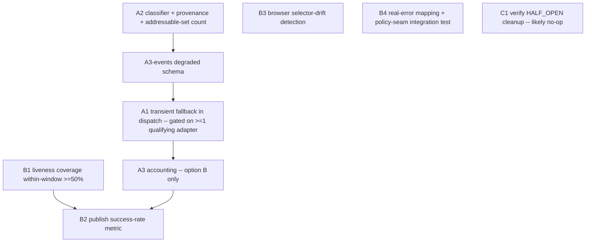

# feat: Publish Reliability Iteration

## Overview

Harden publish success rate along two parallel, staged tracks:

- **Track A — success-rate lever:** stop losing publishable backlinks when a platform
  returns a transient error. Today `ExternalServiceError` (429/5xx/network) propagates and
  terminates the adapter chain; only `DependencyError` falls through. Let a *safe* transient
  degrade to the next same-platform fallback adapter, with 5xx defaulting to fail-fast and an
  explicit per-platform idempotency-safe whitelist.
- **Track B — observability baseline:** make the success rate measurable and trustworthy.
  Raise liveness recheck coverage from ~5% to ≥50%, surface a per-channel publish success
  metric, add browser-tier selector-drift regression detection, and verify real-platform
  errors trip the circuit as designed.

Plus a small opportunistic cleanup (Track C): remove the dead HALF_OPEN trial-limiter.

## Problem Frame

The execution layer (40 adapters, circuit breaker, retry, liveness loop) is mature but two
gap classes compound: transient errors fail publishes that could have succeeded, and we
cannot see the real success/strip rate to prove a fix helped (liveness covers only 88/1726
links). See origin: `docs/brainstorms/2026-06-15-publish-reliability-iteration-requirements.md`.

## Requirements Trace

- R1. Transient errors attempt the next same-platform fallback adapter instead of
  propagating immediately. (Unit A1)
- R2. Fallback/retry never creates a duplicate live link; when idempotency is unprovable,
  fail safe. (Units A1, A2)
- R3. Explicit per-error-class policy; 5xx defaults fail-fast, opt-in per-platform
  idempotency-safe whitelist. (Unit A2)
- R4. Fallback/retry decisions emit observability events. (Unit A3)
- R5. Liveness recheck coverage raised to ≥50% of all published links. (Unit B1)
- R6. Browser-tier selector drift detectable automatically (CI and/or scheduled). (Unit B3)
- R7. Verify real 429/503/ban/session-expiry surface as the typed exceptions that trip the
  circuit; add integration coverage of the policy-enable CLI seam. (Unit B4)
- R8. Define and surface a single per-channel publish success-rate metric both tracks move.
  (Unit B2)
- R9. Remove the unwired HALF_OPEN trial-limiter dead code + misleading env var. (Unit C1)

## Scope Boundaries

- No new platforms/adapters; no flipping `dofollow="uncertain"` channels.
- No unified pooled HTTP client (A4) — current ~1–10 backlinks/run does not justify it.
- Medium liveness **active** probe stays OFF by default; B1 leans on the recheck
  ledger / event-derived liveness, not higher active-probe cadence (probe IP is coupled to
  publish IP — see origin learnings, `medium-liveness-probe-partial-spike-2`).
- R2 duplicate-publish safety is a hard constraint, not a tunable.

## Context & Research

### Relevant Code and Patterns

- **Retry:** `src/backlink_publisher/publishing/adapters/retry.py` —
  `RETRYABLE_HTTP_STATUSES = frozenset({429})` (L68) with a load-bearing
  "never add 5xx" invariant comment (L54-67). `retry_transient_call(...)` bare-`raise`s
  `ExternalServiceError`/`DependencyError` (never retried). Env (read once at import):
  `BACKLINK_RETRY_MAX_ATTEMPTS/BACKOFF_BASE/JITTER`. Canonical caller: `medium_api.py:60-118`
  (create POST only retries a private `_TransientHTTPError`, never network errors).
- **Dispatch/fallback:** `src/backlink_publisher/publishing/_registry_dispatch.py`
  `dispatch()` (L78-127): `AuthExpiredError` → `raise` (must stay ordered **before**
  `DependencyError`, which it subclasses); `DependencyError` → store `last_dep_error` +
  `continue`; `ExternalServiceError` is **not** caught → propagates and terminates. Registry
  API in `registry.py` (`register(...)`, `publishers`, `dispatch_weight`).
- **Reliability policy seam:** `src/backlink_publisher/publishing/reliability/policy.py` —
  `POLICY_ENV = "BACKLINK_PUBLISHER_RELIABILITY_POLICY_ENABLED"`, `policy_enabled()` ==
  `os.environ.get(POLICY_ENV) == "1"`. `publish_with_policy(...)` (~L161): health gate
  (browser-tier only `{medium,velog,devto,mastodon}` → `skipped_policy`), circuit gate
  (`skipped_circuit_open`), timing + trip counting. Thresholds:
  `BACKLINK_PUBLISHER_CIRCUIT_AUTH_THRESHOLD`(3)/`_ERROR_THRESHOLD`(5). Disabled = transparent
  passthrough to `adapter_publish(...)`. **Note: there is no `_engine.py`.**
- **Events:** `reliability/events.py` `emit_attempt(platform, outcome, duration_ms, run_id,
  *, http_method/url/status/error_class, **extra)` — never raises; `Outcome` enum
  SUCCESS/AUTH_EXPIRED/AUTH_BANNED/EXTERNAL_ERROR/TRANSIENT/RATE_LIMITED/HTTP_ERROR. Timing
  via `now_ms()`.
- **Typed errors:** `src/backlink_publisher/_util/errors.py` — all subclass `PipelineError`.
  `ExternalServiceError`(exit 4), `AntiBotChallengeError`(IS-A ExternalServiceError),
  `AuthExpiredError`(IS-A DependencyError, keyword-only `channel`/`reason`),
  `ContentRejectedError`(IS-A DependencyError), `DependencyError`(exit 3). HTTP adapters put
  **only host** in messages, never full URL/body.
- **Typed-error channel:** `_util/error_envelope.py` emits `__BLP_ERR__ {...}` sentinel with
  `error_class`/`exit_code`; branch fallback/retry on the `ErrorClass` enum, not stderr
  strings. An AST guard test enforces every nonzero `SystemExit` routes through the chokepoint.
- **Liveness:** `adapters/_verify_live.py` (`_verify_live`, UTC timestamps, honest
  `unverifiable_live` fall-through — never fakes green). Recheck CLI:
  `src/backlink_publisher/cli/recheck_backlinks.py` (network behind `--probe`; stdout JSONL;
  exit 6 on `--fail-on-dead`; flock; 600s batch / 10s per-target budget). Event emitter:
  `src/backlink_publisher/recheck/events_io.py::emit_recheck` (direct `store.append`); verdicts
  in `recheck/verdicts.py`; kind const `events/kinds.py::LINK_RECHECKED`.
- **Scorecard/coverage:** `src/backlink_publisher/scorecard/engine.py::build_channel_scorecard`
  (reuses `ledger.sources.build_target_buckets` + `ledger.aggregate._classify/_link_liveness`;
  computes `total_links/live_links/live_pct/live_dofollow/liveness_breakdown`). Row type in
  `scorecard/model.py`. **Note: there is no `health_metrics.py`.** WebUI surface:
  `webui_app/routes/health.py`.
- **Circuit:** `reliability/circuit.py` — recovery is **cooldown-only**; the HALF_OPEN
  trial-limiter (`_increment_half_open_try`, `half_open_tries`,
  `BACKLINK_PUBLISHER_CIRCUIT_HALF_OPEN_TRIES`) is dead/unwired.

### Institutional Learnings

- `docs/solutions/correctness/adapter-silent-exceptions-resolution.md` — adapters with broad
  `except Exception: pass` hide 5xx/ban; any new retry/fallback must not reintroduce a silent
  swallow. Preserve `raise ... from exc`.
- `docs/solutions/test-failures/ci-test-isolation-failures-medium-brave-sleep-timeout-2026-05-13.md`
  — when testing a fallback chain, mock **every** branch 1..N-1 (esp. `MediumBraveAdapter`,
  macOS-only AppleScript) and mock module-level `time.sleep` (throttle sleeps 60-300s); rely
  on `pytest-timeout`.
- `docs/solutions/logic-errors/playwright-framenavigated-orphaned-during-cross-origin-sso-2026-05-19.md`
  — for browser selector/login checks, don't trust `framenavigated`; use context-level page
  enumeration + URL-regex + wall-clock floor.
- `docs/solutions/best-practices/medium-liveness-probe-partial-spike-2-2026-05-19.md` —
  active headless probe IP is coupled to publish IP; over-aggressive recheck can poison real
  publishes. Prefer passive/ledger-derived liveness for coverage.
- `docs/solutions/best-practices/typed-error-envelope-over-stderr-truncation-2026-05-27.md` —
  branch on `ErrorClass`, comply with the AST chokepoint guard.
- The idempotency-safe retry whitelist (R3) has **no prior precedent** — it is net-new.

## Key Technical Decisions

- **Fallback safety is adapter-asserted provenance, NOT a platform-level property of the
  status code.** (Deepened 2026-06-15 — data-integrity review.) A 429 is only fallback-safe
  when the *raising adapter* guarantees it was a pre-create rejection — i.e. it was raised
  from a `_TransientHTTPError`-gated create path (canonical: `medium_api.py`). A 429 from a
  gateway/CDN, a `/me` lookup, or a post-create path may mask an already-committed post.
  Therefore a generic/bare `ExternalServiceError` whose status cannot be positively
  identified as a pre-create rejection defaults to **FAIL_FAST**. Do **not** reuse
  `retry.py::classify_exception`'s `ExternalServiceError → TRANSIENT` mapping — that is the
  inverse of what R2 needs. Rationale: preserves R2; the retry.py "never blanket-retry 5xx"
  invariant only governs *in-adapter* retry, not *cross-adapter* dispatch fallback.
- **Cross-mechanism same-account fallback is a separate, stricter gate.** (Deepened
  2026-06-15.) Falling from an API adapter to a *different publish mechanism on the same
  account* (e.g. `MediumAPIAdapter` → `MediumBraveAdapter`/`MediumBrowserAdapter`, same Medium
  account) is materially riskier than falling between two API adapters: if adapter 1's
  "transient" actually created a post, the browser adapter creates a **second live post**.
  This transition is held to the same evidence bar as the 5xx whitelist and **starts
  disabled** — a transient does not advance to a different-mechanism adapter until that
  specific transition is whitelisted.
- **Two independent opt-in whitelists, both starting empty, both evidence-gated** (operator
  decision 2026-06-15): (1) per-platform idempotency-safe **5xx** whitelist; (2) per-adapter
  **cross-mechanism fallback** whitelist. Default fail-fast on both. A platform/transition is
  added only after confirming the error cannot leave a partially-created post.
- **Classification lives in one place** (`transient_policy.py`), consumed by both
  `_registry_dispatch.dispatch()` and `reliability/policy.py`. The classifier must check
  **most-derived exception types first** (`AntiBotChallengeError` before generic
  `ExternalServiceError`) — same subclass-before-superclass discipline the dispatch arms
  already document. Branch on exception type, never substring-sniff.
- **A fallback success must not silently disable the circuit breaker — resolution deferred to
  /ce:work (operator decision 2026-06-15).** The hazard is real: `publish_with_policy` does
  trip accounting on the exception that *escapes* `dispatch()` (`policy.py` ~L259); on success
  it calls `record_success` + `_reset_failures` (~L239-241). If A1 swallows adapter 1's 429 as
  fallback-and-succeeds, the circuit sees `SUCCESS` and **resets the failure counter to zero**,
  so adapter 1 can 429 every run and the breaker never trips. BUT feasibility review found the
  circuit/health store is keyed **strictly per-platform** (`state[platform]`, `LockedHealthStore`
  by platform) — there is no per-adapter dimension, no `record_adapter_failure`, and a
  per-adapter trip would need a net-new sub-state-machine with undefined recovery/skip semantics
  (a tripped primary adapter routed-around by fallback may never be re-exercised to recover).
  Two options, **decided at execution**:
  - (A) **Observe-only (lower cost):** breaker stays per-platform; the fallback degradation is
    captured as a `degraded` event + a per-adapter degradation counter feeding the B2 metric —
    operators *see* the degraded primary without a per-adapter breaker. (R4 already gives the
    signal.)
  - (B) **Per-adapter breaker (complete, larger):** build the adapter-keyed accounting axis,
    including recovery and "skip tripped adapter vs retry after cooldown" semantics.
  The shared classifier aligns *classification* only; it does NOT close this loop — accounting
  placement does. This decision determines whether A3 modifies `circuit.py` (option B) or only
  `events.py` + the metric (option A).
- **Liveness coverage (R5) is raised via the recheck ledger, not active probing** — a
  prioritized recheck budget over the existing `recheck_backlinks` CLI, ordered by what feeds
  the scorecard. Active Medium probe stays off (anti-bot IP coupling).
- **Success-rate metric (R8) is derived from `publish_attempt` events** (`reliability/events.py`
  `Outcome`), surfaced alongside the existing scorecard `live_pct`, not as a second liveness
  stat. Rationale: publish success ≠ link liveness; conflating them hides which track moved.
- **Browser selector-drift detection (R6) is a scheduled/opt-in real run**, not unconditional
  CI, because the smoke tests require an attached Chrome. Wire a runnable check (marker +
  env-gate already exists) into a schedulable entrypoint and surface drift as a failure.
- **Circuit recovery stays cooldown-only.** Do not design tests/behavior around a HALF_OPEN
  trial cap (it is dead code, removed in C1).

## Open Questions

### Resolved During Planning

- Coverage target for R5: **≥50% of all published links** (operator decision 2026-06-15).
- 5xx handling: **default fail-fast + opt-in per-platform idempotency-safe whitelist**
  (operator decision 2026-06-15).
- Where does fallback logic live? **In `_registry_dispatch.dispatch()`**, gated by a shared
  classification helper — the chain walk already owns adapter selection; the policy layer
  consumes the same helper for circuit accounting.
- Success metric source: **`publish_attempt` events**, surfaced next to the scorecard.

### Deferred to Implementation

- The initial contents of BOTH whitelists (R3): (1) per-platform idempotency-safe 5xx; (2)
  per-adapter cross-mechanism fallback transitions. Each requires confirming the error cannot
  leave a partially-created post on that platform/account. Net-new research with no precedent;
  both ship empty and grow as evidence lands. (Affects A2)
- Exact helper/method names and the precise `ErrorClass`↔exception mapping table — settle
  against real code in A2.
- For R7: capturing real 429/503/ban/session-expiry response shapes needs a live platform +
  credentials or a faithful stub; the *verification harness* is planned here, the *evidence*
  is gathered at execution. (Affects B4)
- CI-vs-scheduled mechanics for R6 (headless feasibility) — confirm against the attached-Chrome
  requirement during B3.
- **Per-adapter breaker: option A (observe-only) vs option B (per-adapter sub-state-machine)** —
  decided at /ce:work (operator 2026-06-15). If B: where the per-adapter counter persists, how
  `is_tripped`/the `skipped_circuit_open` platform gate consume an adapter-level trip, and the
  recovery/skip semantics for a tripped primary adapter. (Affects A1, A3)
- **B2 success-rate source:** `publish_attempt` is logger-only today. Either add a persisted
  event kind + projector + retention, or derive from already-persisted scorecard kinds. Settle
  at execution; define the metric window then. (Affects B2)
- **Track A addressable set — RESOLVED 2026-06-15 (execution): ZERO transitions qualify.**
  Investigation across all 40 adapters: the only platform with both signals is Medium, but they
  are mismatched — provenance lives on `MediumAPIAdapter` (HTTP), while the only same-mechanism
  pair is `MediumBraveAdapter`→`MediumBrowserAdapter` (both browser, no pre-create-429
  provenance). The only provenance-bearing transition (`MediumAPIAdapter`→`MediumBraveAdapter`)
  is **cross-mechanism**, which our gate disables by default. velog/devto have provenance but a
  single API adapter (fallback would cross mechanism); telegraph has no provenance.
  **Decision (operator 2026-06-15): Track A ships as GROUNDWORK ONLY** — build A2's classifier +
  provenance marker + cross-mechanism gate scaffolding + tests, but DO NOT wire the A1 dispatch
  fallback arm and DO NOT build A3 (no seam to emit from). The real lever is deferred until the
  `MediumAPIAdapter`→`MediumBraveAdapter` cross-mechanism transition is whitelisted with evidence
  that Brave cannot double-publish. Per-adapter breaker (A/B) is therefore moot this iteration.
  This iteration's real delivery = **A2 groundwork + Track B (B1-B4) + C1**.

## High-Level Technical Design

> *This illustrates the intended approach and is directional guidance for review, not
> implementation specification. The implementing agent should treat it as context, not code
> to reproduce.*

Transient-fallback decision flow inside the adapter chain walk (Track A):

```
for adapter in registry[platform].publishers:
    if not adapter.available(config): continue
    try:
        return adapter.publish(...)
    except AuthExpiredError:        # unchanged — re-bind, terminate chain
        raise
    except DependencyError as e:    # unchanged — remember, try next adapter
        last_dep_error = e; continue
    except ExternalServiceError as e:
        cls = classify_transient(e, this_adapter, next_adapter)   # shared helper (A2)
        if cls is FALLBACK_SAFE:                 # adapter-asserted pre-create 429 AND
                                                 # next adapter is whitelisted for this transition
            emit_attempt(... outcome=TRANSIENT, degraded=True,
                         failed_adapter=this_adapter, error_class=...)   # A3
            # Option B only (per-adapter breaker): record_adapter_failure(this_adapter)
            # Option A (observe-only): the degraded event above is the whole signal
            last_transient_error = e; continue    # NEW: degrade to next adapter
        raise                                    # unidentified / 5xx default / network /
                                                 # anti-bot / cross-mechanism not whitelisted
# after loop: prefer last_dep_error, else last_transient_error, else "no adapter"
```

`classify_transient` returns FALLBACK_SAFE only when (a) the raising adapter asserts a
pre-create 429 provenance, AND (b) the transition to `next_adapter` is whitelisted (same
mechanism, or an explicitly approved cross-mechanism transition). Any bare/unidentified
`ExternalServiceError` → FAIL_FAST. The per-adapter `record_adapter_failure` keeps the
circuit breaker honest even when dispatch swallows the transient as a successful fallback.

## Implementation Units



Corrected ordering (coherence + feasibility, doc-review 2026-06-15): A3's `events.py` schema is
a prerequisite for A1, so **A2 → A3-events → A1**; A1's dispatch wiring is gated on A2's
addressable-set check; the option-B circuit accounting (if chosen) follows A1.

Stage 1 (parallel): the **A2 → A3-events → A1** chain, and **B1**. Stage 2: A3-accounting
(option B), B2, B3, B4, C1. B3/B4/C1 are independent and can start anytime.

- [ ] **Unit A2: Transient error-class policy + idempotency-safe whitelist**

**Goal:** A single classification helper that decides, per `(exception, this_adapter,
next_adapter)`, whether a transient is fallback-safe or fail-fast — plus two initially-empty,
evidence-gated whitelists: (1) per-platform idempotency-safe 5xx; (2) per-adapter
cross-mechanism fallback transitions.

**Requirements:** R2, R3

**Dependencies:** None

**Files:**
- Create: `src/backlink_publisher/publishing/reliability/transient_policy.py`
- Modify: `src/backlink_publisher/publishing/adapters/retry.py` (share the *semantic*
  pre-create-429 invariant, not just constants; keep the existing invariant comment and the
  429-only in-adapter set)
- Modify: the raising adapter(s) (canonical `adapters/medium_api.py`) to **stamp pre-create
  provenance** onto the raised `ExternalServiceError` — see provenance note below
- Test: `tests/test_transient_policy.py`

**Provenance prerequisite (feasibility, doc-review 2026-06-15):** by the time an exception
reaches `dispatch()` it is a plain `ExternalServiceError` carrying only a host string — the
private `_TransientHTTPError` is gone and there is **no structured pre-create signal to read**.
For `classify_transient` to ever return FALLBACK_SAFE, the raising adapter must positively
stamp provenance (e.g. a structured attribute on the exception) at the create-POST site. Without
this, every transient defaults to FAIL_FAST and R1 delivers ~zero benefit. This adapter-side
stamping is now in A2's scope.

**Addressable-set check (scope-guardian + adversarial, doc-review 2026-06-15):** before building
out both whitelists, quantify how many of the 40 adapters actually have (a) a same-mechanism
fallback sibling AND (b) a `_TransientHTTPError`-gated provenance assertion. If that set is
near-empty, Track A is inert machinery — surface the count and reconsider scope. (See the
strategic decision recorded in Open Questions.)

**Approach:**
- FALLBACK_SAFE requires BOTH: (a) the raising adapter asserts pre-create 429 provenance
  (raised from a `_TransientHTTPError`-gated create path), AND (b) the `this_adapter →
  next_adapter` transition is whitelisted (same mechanism by default; cross-mechanism
  same-account only if explicitly approved).
- Classifier checks **most-derived types first**: `AntiBotChallengeError` → FAIL_FAST before
  the generic `ExternalServiceError` arm. Network errors → FAIL_FAST.
- **Default for any bare/unidentified `ExternalServiceError` = FAIL_FAST.** Explicitly do NOT
  reuse `retry.py::classify_exception`'s `ExternalServiceError → TRANSIENT` mapping.
- 5xx → FAIL_FAST unless `platform in IDEMPOTENCY_SAFE_5XX` (ships empty).
- Branch on exception type, never stderr substrings. Where status is only in the message
  (some adapters), resolve the positive-identification tension explicitly and conservatively
  (unidentified → FAIL_FAST).

**Patterns to follow:** `_util/errors.py` hierarchy; `ErrorClass` from
`_util/error_envelope.py`; invariant-comment style in `retry.py:54-67`; the subclass-ordering
discipline in `_registry_dispatch.py` dispatch arms.

**Test scenarios:**
- Happy path: an adapter-asserted pre-create 429, same-mechanism next adapter → FALLBACK_SAFE.
- Edge case (provenance): bare `ExternalServiceError("Medium /me returned HTTP 500")` →
  FAIL_FAST (unidentified status, not FALLBACK_SAFE) — explicitly diverges from
  `retry.py::classify_exception`.
- Edge case (cross-mechanism): a transient from `MediumAPIAdapter` does NOT advance to
  `MediumBraveAdapter`/`MediumBrowserAdapter` until that transition is whitelisted.
- Edge case (5xx): 503 on non-whitelisted platform → FAIL_FAST; whitelisted → FALLBACK_SAFE.
- Edge case (ordering): `AntiBotChallengeError` (IS-A ExternalServiceError) → FAIL_FAST.
- Edge case: both whitelists empty → every 5xx and every cross-mechanism transition is
  FAIL_FAST.
- Error path: unknown/generic exception → FAIL_FAST (never silently FALLBACK_SAFE).

**Verification:** FALLBACK_SAFE requires provenance AND a whitelisted transition; both
whitelists empty by default; unidentified `ExternalServiceError` fails fast; no reuse of the
`ExternalServiceError → TRANSIENT` mapping; no stderr-string branching.

- [ ] **Unit A1: Transient fallback in the adapter chain walk**

**Goal:** When `classify_transient` returns FALLBACK_SAFE, degrade to the next same-platform
adapter instead of propagating; otherwise preserve today's propagate-and-terminate.

**Requirements:** R1, R2

**Dependencies:** A2 (classifier + provenance stamping + addressable-set count) and A3's
`emit_attempt` schema change (the `degraded`/`failed_adapter` fields the fallback seam emits).
**Gate:** wire the dispatch fallback arm only if A2's addressable-set check finds ≥1 qualifying
adapter (same-mechanism sibling + provenance). If zero qualify, A1 ships as groundwork only and
the dispatch wiring is deferred (operator decision 2026-06-15).

**Files:**
- Modify: `src/backlink_publisher/publishing/_registry_dispatch.py` (`dispatch()`)
- Test: `tests/test_adapter_dispatcher.py`

**Approach:**
- Add an `except ExternalServiceError` arm **after** the existing `AuthExpiredError` and
  `DependencyError` arms (ordering matters — `AuthExpiredError` IS-A `DependencyError`).
- Call `classify_transient(e, this_adapter, next_adapter)`; FALLBACK_SAFE → emit a
  per-adapter failure signal (see A3) + record `last_transient_error` + `continue`; else
  `raise`.
- **Breaker-reset hazard:** a fallback success can reset the platform failure counter. The
  fix path (observe-only vs per-adapter breaker) is decided at /ce:work — see Key Technical
  Decisions. A1 emits the `degraded` event regardless; only option B adds a circuit call here.
- After the loop, resolution order: `last_dep_error` → `last_transient_error` → generic
  "no available adapter".
- Do not introduce `except Exception: pass`; preserve `raise ... from exc`.

**Execution note:** Start with a failing dispatcher test that asserts an adapter-asserted
pre-create 429 on adapter 1 falls through to a same-mechanism adapter 2 (today it propagates).

**Patterns to follow:** existing exception-arm ordering in `dispatch()` L78-127; fallback-chain
test mocking from `ci-test-isolation-failures-medium-brave-sleep-timeout` (mock every branch +
`time.sleep`).

**Test scenarios:**
- Happy path: adapter 1 raises a pre-create 429, same-mechanism adapter 2 succeeds → dispatch
  returns adapter 2's result; adapter 2 `publish` called once.
- Edge case (cross-mechanism guard): `MediumAPIAdapter` raises a transient → dispatch does NOT
  advance to `MediumBraveAdapter`/`MediumBrowserAdapter` (different mechanism, same account)
  until that transition is whitelisted — propagates instead.
- Edge case: adapter 1 raises 503 (non-whitelisted) → propagates immediately, adapter 2 never
  called.
- Edge case: adapter 1 raises 503 (whitelisted platform) → falls through to adapter 2.
- Integration (circuit honesty): adapter 1 raises a fallback-safe 429 and adapter 2 succeeds
  with policy enabled → a `degraded` event is recorded for adapter 1 (always). **Option B only:**
  additionally assert the platform failure counter is NOT reset to zero and the breaker can
  still trip on a chronically-429ing adapter 1.
- Error path: all adapters raise FALLBACK_SAFE transients → final raise surfaces the last
  transient error (not a swallowed success).
- Integration: mixed chain `DependencyError` then pre-create `429` then success → ends on
  success; `last_dep_error` not raised.
- Regression: `AuthExpiredError` on adapter 1 still terminates the chain (re-bind path intact).

**Verification:** A pre-create 429 on an API adapter yields a successful publish via a
same-mechanism adapter; cross-mechanism same-account fallback is blocked until whitelisted; no
path creates two live links; the circuit breaker is not silently reset by a fallback success;
existing AuthExpired/Dependency semantics unchanged.

- [ ] **Unit A3: Fallback observability events + per-adapter circuit accounting**

**Goal:** Emit a distinctly-marked event whenever a fallback fires (the event-schema change is
a prerequisite A1 consumes), and — per the /ce:work decision — either keep observe-only
(option A) or add per-adapter circuit accounting (option B) so a fallback success cannot
silently disable the breaker. Keep deliberate degradations distinguishable from generic
mis-mapped exceptions.

**Requirements:** R4

**Dependencies:** A2. **Note:** the `events.py` schema change here is a *prerequisite* for A1's
fallback emit; land it before/with A1. The circuit-accounting portion is option-B only.

**Files:**
- Modify: `src/backlink_publisher/publishing/reliability/events.py` (add a discriminating
  field, e.g. `degraded=True` + `failed_adapter`, via `**extra`) — **prerequisite for A1**
- Modify (option B only): `src/backlink_publisher/publishing/reliability/circuit.py` /
  `reliability/policy.py` — a NEW per-adapter accounting axis (the store is per-platform today;
  this is a net-new sub-state-machine with its own recovery/skip semantics, see Key Decisions)
- Modify: `src/backlink_publisher/publishing/_registry_dispatch.py` (emit at the fallback seam)
- Test: `tests/test_reliability_events.py`, `tests/test_circuit_breaker.py` (option B)

**Approach:**
- Reuse `emit_attempt(... outcome=Outcome.TRANSIENT, degraded=True, failed_adapter=...)`; keep
  never-raising. The `degraded` marker disambiguates an intentional fallback-safe degradation
  from the pre-existing `except Exception → Outcome.TRANSIENT` mis-map (which B4 hunts) — both
  otherwise share the `TRANSIENT` enum value.
- **Option A (observe-only):** the `degraded` event + a per-adapter degradation counter feeding
  B2 is the whole signal; breaker stays per-platform.
- **Option B (per-adapter breaker):** record the failing adapter's transient on a *distinct
  store key* that `_reset_failures` does NOT zero on the platform-level success, and define how
  `is_tripped`/the `skipped_circuit_open` platform gate consume an adapter-level trip and how it
  recovers. This is the larger design; only build it if option B is chosen.
- **Host-only is enforceable, not advisory (security, doc-review 2026-06-15).** `emit_attempt`
  exposes a first-class `http_url` field that accepts a full URL, and the fallback seam fires
  mid-publish where a full target/post URL (possibly carrying tokens/ids) is in scope. The
  fallback call site MUST pass host-only or omit `http_url` entirely. Likewise, the
  `AuthExpiredError` re-bind path and any session-expiry event/diagnostic must never include
  credential material (tokens, cookies, session ids) — keep `reason`/`channel` host/channel-only.

**Patterns to follow:** `emit_attempt` signature + `Outcome` enum; never-raise try/except in
`events.py`; circuit threshold/accounting in `circuit.py`/`policy.py` (L229-271); host-only rule.

**Test scenarios:**
- Happy path: a fallback-safe transient emits one event with `outcome=TRANSIENT`,
  `degraded=True`, and `failed_adapter` recorded.
- Integration (option B only): primary adapter 429s and fallback succeeds repeatedly →
  per-adapter failure count climbs and eventually trips the breaker for that adapter; it is NOT
  reset to zero by the platform-level success. (Option A: assert the degraded counter increments
  for the metric instead.)
- Edge case: a genuine generic-exception mis-map (no `degraded` marker) remains distinguishable
  from an intentional degradation in the event stream.
- Edge case: event/accounting emission failure does not break dispatch (never-raise contract).
- Edge case: no event leaks full URL/body — assert the degraded event's `http_url` is host-only
  or absent (not just the message).
- Edge case: a session-expiry / `AuthExpiredError` case emits no credential substring
  (token/cookie/session id) in any event or diagnostic.

**Verification:** Fallback decisions are marked `degraded`; a primary adapter that always 429s
eventually trips the breaker despite fallback successes; intentional degradations are
distinguishable from generic mis-maps; emission failures are swallowed.

- [ ] **Unit B1: Raise liveness recheck coverage to ≥50%**

**Goal:** A prioritized recheck driver that grows ledger-derived liveness coverage from ~5% to
≥50% of published links, ordered by what feeds the scorecard — without increasing active
headless-probe cadence.

**Requirements:** R5

**Dependencies:** None

**Files:**
- Modify: `src/backlink_publisher/cli/recheck_backlinks.py` (prioritization/budget ordering)
- Modify/Create: `src/backlink_publisher/recheck/` selection helper for "least-recently /
  never rechecked, scorecard-feeding first"
- Test: `tests/test_recheck_backlinks.py`, `tests/test_recheck_prioritization.py`

**Approach:**
- Order recheck targets by coverage gap (never-rechecked, stale-first) intersected with links
  the scorecard counts.
- Respect existing flock + 600s batch / 10s per-target budget; network stays behind `--probe`.
- Lean on the recheck ledger / `link.rechecked` events — do **not** enable the Medium active
  probe; honor anti-bot IP coupling.
- **Coverage is a freshness property, not a one-time milestone (adversarial, doc-review
  2026-06-15).** Define ≥50% as *coverage-within-a-staleness-window* (a rechecked link counts
  only while fresh), not a cumulative count. With ~1726 links and a ~60-target/run budget
  (~3.5%/run), reaching 50% needs ~14 budgeted runs and *holding* it needs re-runs before
  staleness expires against the 1–10 publishes/run inflow. Specify the staleness window and the
  steady-state recheck cadence required to hold the target; otherwise the metric is met
  transiently then silently regresses. (Reuse the scorecard's existing `stale_days=30` notion
  for consistency unless evidence says otherwise.)

**Execution note:** Characterize current coverage computation before changing ordering.

**Patterns to follow:** `recheck_backlinks.py` CLI conventions (JSONL stdout, exit 6,
`--probe` gate); `recheck/events_io.py::emit_recheck` (direct append, post-quarantine flush);
`scorecard/engine.py::build_channel_scorecard` coverage math.

**Test scenarios:**
- Happy path: with N never-rechecked links and a budget, the highest-priority (scorecard-
  feeding, stale-first) links are selected first.
- Edge case: empty ledger / all already fresh → no-op, exit 0.
- Edge case: per-target/batch budget exhausted mid-run → partial progress recorded, no crash.
- Error path: a probe error on one target never raises (budget continues) and is recorded as a
  probe error, not a false-alive.
- Integration: a recheck run appends `link.rechecked` events that move `live_pct` coverage in
  `build_channel_scorecard`.

**Verification:** A recheck run measurably increases coverage toward ≥50%; selection prioritizes
scorecard-feeding links; no active Medium probe is triggered.

- [ ] **Unit B2: Per-channel publish success-rate metric**

**Goal:** Define and surface a per-channel publish success % (over a window) derived from
`publish_attempt` events, displayed alongside the scorecard's `live_pct`.

**Requirements:** R8

**Dependencies:** B1 (trustworthy denominator), A3 (richer events)

**Files:**
- Modify: `src/backlink_publisher/scorecard/engine.py` (add success-rate field) or Create a
  sibling `scorecard/success_rate.py` consuming `publish_attempt` events
- Modify: `webui_app/routes/health.py` (surface the metric)
- Test: `tests/test_scorecard_success_rate.py`

**Approach:**
- **Prerequisite (feasibility, doc-review 2026-06-15):** `emit_attempt` today only calls
  `opencli_logger.info(...)` (stderr) — `publish_attempt` is NOT a persisted/queryable event
  kind, so there is no "Outcome event stream" the scorecard can read. B2 must FIRST establish a
  queryable source. Two options, decide at execution: (a) add a persisted `publish_attempt`
  event kind + projector + retention/window store; or (b) derive success rate from the
  event kinds the scorecard already persists (e.g. `PUBLISH_CONFIRMED`/`PUBLISH_UNVERIFIED`).
  Option (b) is lower-cost and avoids a new persistence path; prefer it unless per-`Outcome`
  granularity is required.
- **Denominator definition (adversarial, doc-review 2026-06-15):** "terminal failures" MUST
  include `skipped_circuit_open` and `skipped_policy` — an attempt the operator wanted that did
  not happen is a reliability failure, not an exclusion. Otherwise a permanently-tripped channel
  shows a high/undefined success rate exactly when it is most broken.
- **Window:** define explicitly (e.g. rolling time window or last-N attempts per channel);
  whichever the chosen source supports. Recorded under Deferred to Implementation.
- Compute success % = `SUCCESS / (SUCCESS + terminal failures incl. skips)` per channel over the
  window; keep it distinct from `live_pct`.
- A `degraded=True` fallback-then-SUCCESS counts as one success (not a failure).
- Mark `small_sample` when the denominator is thin (mirror existing scorecard flag).

**Patterns to follow:** `build_channel_scorecard` field/row conventions (`scorecard/model.py`);
existing `small_sample` flag; `health.py` rendering.

**Test scenarios:**
- Happy path: 8 SUCCESS + 2 EXTERNAL_ERROR over window → 80% for that channel.
- Edge case: zero attempts → metric absent or `small_sample`, never divide-by-zero.
- Edge case (denominator): a channel with a permanently-tripped breaker (`skipped_circuit_open`
  attempts only) shows a LOW/failed rate, not a high/undefined one — skips count as failures.
- Edge case: a `degraded=True` TRANSIENT-then-SUCCESS (fallback saved it) counts as one
  success, not a failure — and is NOT conflated with a generic-exception `TRANSIENT` mis-map.
- Integration: metric renders in `/api/health` payload next to `live_pct`.

**Verification:** Each channel shows a publish success %, distinct from liveness, with thin
samples flagged.

- [ ] **Unit B3: Browser-tier selector-drift regression detection**

**Goal:** Turn the skipped browser smoke tests into a runnable, schedulable drift check for
Medium/Velog/Devto/Mastodon that fails when selectors/login break.

**Requirements:** R6

**Dependencies:** None

**Files:**
- Modify: `tests/test_browser_publish_medium.py`, `test_browser_publish_velog.py`,
  `test_browser_publish_devto.py`, `test_browser_publish_mastodon.py` (replace placeholder
  bodies with real selector/login assertions behind the existing marker + env-gate)
- Create: a schedulable entrypoint/runner doc or `Makefile` target invoking
  `pytest -m real_browser_publish_smoke`
- Test: the above are the tests; add `tests/test_browser_smoke_runner.py` for the runner glue

**Approach:**
- Keep `@pytest.mark.real_browser_publish_smoke` + env-gate (`BACKLINK_PUBLISHER_REAL_CHROME_ATTACH=1`);
  do not unconditionally run in CI (needs attached Chrome).
- Assert presence of key selectors / successful login landing using **context-level page
  enumeration + URL-regex + wall-clock floor** — never `framenavigated`.
- Surface drift as a test failure with a clear, host-only diagnostic.

**Execution note:** Add characterization assertions against current known-good selectors before
relying on the check.

**Patterns to follow:** existing opt-in marker pattern; `pyproject.toml` marker registration;
`playwright-framenavigated-orphaned-during-cross-origin-sso` navigation guidance.

**Test scenarios:**
- Happy path (gated run): each platform's key publish selectors are found post-login → pass.
- Error path: a removed/renamed selector → explicit failure naming the platform and selector.
- Edge case: login lands on a challenge/wrong URL → failure via URL-regex + wall-clock floor,
  not a hang.
- Integration: the runner target collects all four and reports per-platform drift status.

**Verification:** A deliberately broken selector is caught by the gated run before a real
publish; the check is schedulable; CI without attached Chrome still skips cleanly.

- [ ] **Unit B4: Real-error mapping verification + policy-seam integration test**

**Goal:** Prove real 429/503/ban/session-expiry surface as the typed exceptions that trip the
circuit, and that the policy-enable CLI seam actually selects `publish_with_policy` (not the
`else: adapter_publish` branch).

**Requirements:** R7

**Dependencies:** None (independent; benefits from A2's classification)

**Files:**
- Create: `tests/integration/test_reliability_policy_seam.py`
- Create: `tests/test_error_mapping_fidelity.py` (stub-adapter table of response → exception)
- Modify (if mapping gaps found): the relevant adapter(s) to raise the correct typed exception

**Approach:**
- Seam test uses the real CLI subprocess harness (`tests/integration/test_pipeline_e2e.py`
  `_run_cli` pattern) with `BACKLINK_PUBLISHER_RELIABILITY_POLICY_ENABLED=1` and a **spy that
  fails if the `else: adapter_publish` branch is taken** — calling `publish_with_policy`
  directly is insufficient.
- Use a real temp config dir so flock circuit state round-trips; drive OPEN via
  `BACKLINK_PUBLISHER_CIRCUIT_ERROR_THRESHOLD`.
- Mapping test: a stub adapter returns canned 429/503/ban/session-expiry shapes; assert each
  raises `ExternalServiceError`/`AuthExpiredError` (trips) vs a generic `Exception` (routed
  `Outcome.TRANSIENT`, no trip — the failure mode to catch).
- Health gate asserted only on browser-tier platforms.

**Execution note:** Start with a failing integration test for the seam branch selection.

**Patterns to follow:** `test_pipeline_e2e.py` `_run_cli` subprocess harness; circuit threshold
env vars; `policy.py` result statuses (`skipped_policy`, `skipped_circuit_open`).

**Test scenarios:**
- Integration: policy enabled → spy proves dispatch went through `publish_with_policy`, not
  `adapter_publish`.
- Happy path: N consecutive `ExternalServiceError`s ≥ threshold → circuit trips →
  `skipped_circuit_open` on next attempt; cooldown → HALF_OPEN allows next attempt.
- Edge case: a ban signal trips immediately (not after threshold).
- Error path: a generic `Exception` routes to `Outcome.TRANSIENT` and does **not** trip — flag
  any real adapter that mis-maps a real 5xx/ban to generic.
- Edge case: health gate skips a non-bound browser-tier channel (`skipped_policy`); non-browser
  channels are not health-gated.

**Verification:** The policy seam is exercised end-to-end through the CLI; real-error→exception
mapping is asserted per case; any mis-mapped adapter is identified.

- [ ] **Unit C1: Verify the HALF_OPEN trial-limiter cleanup is already complete (likely no-op)**

**Goal:** Confirm the dead trial-limiter is already gone and only fill any residual gap.
**Feasibility note (doc-review 2026-06-15):** `_increment_half_open_try`, `half_open_tries`,
and `BACKLINK_PUBLISHER_CIRCUIT_HALF_OPEN_TRIES` are **not present** in `src/` or `tests/`
today — `circuit.py` already documents "cooldown-only — there is no half-open trial cap". The
`2026-06-03-circuit-half-open-limiter-cleanup` work appears to have already shipped. Re-scoped
from "remove" to "verify"; this unit may close as a no-op.

**Requirements:** R9

**Dependencies:** None

**Files:**
- Verify: `src/backlink_publisher/publishing/reliability/circuit.py`
- Verify: any lingering env-var docstring/reference; remove only if found
- Test: `tests/test_circuit_breaker.py`

**Approach:**
- Grep for the three symbols; if absent, confirm `R9` is satisfied and close the unit.
- If any residual docstring/env reference remains, delete it; preserve the working
  cooldown-only OPEN→HALF_OPEN→CLOSED transition.

**Patterns to follow:** existing `test_half_open_allows_test_traffic`; the cleanup contract in
`docs/brainstorms/2026-06-03-circuit-half-open-limiter-cleanup-requirements.md` (R1-R5).

**Test scenarios:**
- Verification: a grep/test asserts none of the three trial-limiter symbols exist in `src/`.
- Happy path: OPEN → after cooldown → HALF_OPEN allows the next attempt (`is_tripped()` False).
- Regression: trip thresholds (5 error / 3 auth, immediate on ban) unchanged.

**Verification:** No references to the trial-limiter remain (likely already true); cooldown-only
recovery behavior and trip thresholds are unchanged. Unit may close as a confirmed no-op.

## System-Wide Impact

- **Interaction graph:** A1 changes `dispatch()` control flow consumed by
  `publish_with_policy` and the publish CLI; A3/B2 feed `reliability/events.py` →
  scorecard/health WebUI; B1 feeds the recheck ledger → `build_channel_scorecard`.
- **Error propagation:** New fallback arm must keep typed exceptions intact for CLI exit-code
  routing and the `__BLP_ERR__` envelope; never swallow with `except Exception: pass`.
- **State lifecycle risks:** R2 duplicate-publish — fallback only on idempotency-safe
  transients; flock circuit state and recheck ledger appends must round-trip on real temp dirs.
- **API surface parity:** the shared `classify_transient` helper aligns *classification*
  across dispatch and policy. It does **not** by itself align *accounting* — a fallback success
  can reset the per-platform failure counter. The accounting fix (observe-only vs per-adapter
  breaker) is decided at /ce:work; until then, the breaker may undercount a chronically-degraded
  primary adapter (option A accepts this and surfaces it via the metric instead).
- **Integration coverage:** B4's CLI-seam spy and A1's mixed-chain tests prove behavior mocks
  alone cannot.
- **Unchanged invariants:** `AuthExpiredError`/`DependencyError` dispatch semantics, the
  429-only in-adapter retry invariant (`retry.py`), cooldown-only circuit recovery, honest
  `unverifiable_live` liveness, and the Medium active-probe-off default all stay as-is.

## Risks & Dependencies

| Risk | Mitigation |
|------|------------|
| Fallback on an ambiguous 5xx creates a duplicate live link | 5xx defaults fail-fast; whitelist starts empty and is evidence-gated (A2); R2 hard constraint |
| A 429 that actually masks a committed post (gateway/post-create) triggers a duplicate on fallback | FALLBACK_SAFE requires adapter-asserted pre-create provenance; bare/unidentified `ExternalServiceError` → FAIL_FAST (A2) |
| Cross-mechanism same-account fallback (Medium API→browser) double-publishes | Separate evidence-gated whitelist, starts disabled; A1 test asserts no cross-mechanism advance until whitelisted |
| Fallback success silently disables the circuit breaker (counter reset) | Per-adapter failure accounting that survives the platform-level success (A3); integration test asserts the breaker still trips |
| New fallback arm silently swallows a real failure | Branch on typed exception/`ErrorClass`, never `except Exception: pass`; AST chokepoint guard; A1 error-path test asserts final raise |
| Higher recheck cadence poisons publish IP reputation | B1 uses ledger-derived coverage, not active probe; Medium active probe stays off |
| Browser drift check can't run in CI (needs attached Chrome) | Schedulable opt-in run (marker + env-gate); CI skips cleanly |
| Real error→exception mapping differs from assumptions | B4 stub table + live capture deferred to execution; mis-maps surfaced as failures, not silently trusted |
| Growing `_registry_dispatch.py` / `adapters` trips complexity budget | If `_registry_dispatch.py` grows, add a `complexity_budget.toml`/`monolith_budget.toml` entry with ≥80-char rationale in the same PR |
| Track A ships as inert machinery (no adapter qualifies for FALLBACK_SAFE) | A2 quantifies the addressable set first; A1 dispatch wiring gated on ≥1 qualifying adapter, else groundwork-only |
| B2 metric unbuildable — `publish_attempt` is logger-only, not queryable | B2 establishes a queryable source first (new event kind, or derive from persisted scorecard kinds) before computing the metric |
| Per-adapter breaker (option B) becomes an unbounded net-new sub-state-machine | Decision deferred to /ce:work with option A (observe-only) as the lower-cost default; option B only if its recovery/skip semantics are fully specified |
| ≥50% liveness met transiently then regresses | Define coverage as within-a-staleness-window + specify steady-state recheck cadence to hold it (B1) |

## Documentation / Operational Notes

- Document the idempotency-safe whitelist policy and how to add a platform (evidence bar).
- Note the new schedulable browser-drift run in operator docs (env var + cadence).
- Surface the new publish success-rate metric in the health dashboard description.

## Sources & References

- **Origin document:** `docs/brainstorms/2026-06-15-publish-reliability-iteration-requirements.md`
- Prior reliability brainstorms: `docs/brainstorms/2026-06-03-live-verify-reliability-policy-requirements.md`,
  `2026-06-03-circuit-half-open-limiter-cleanup-requirements.md`,
  `2026-06-05-backlink-liveness-tracking-loop-requirements.md`
- Learnings: `docs/solutions/correctness/adapter-silent-exceptions-resolution.md`,
  `docs/solutions/test-failures/ci-test-isolation-failures-medium-brave-sleep-timeout-2026-05-13.md`,
  `docs/solutions/logic-errors/playwright-framenavigated-orphaned-during-cross-origin-sso-2026-05-19.md`,
  `docs/solutions/best-practices/medium-liveness-probe-partial-spike-2-2026-05-19.md`,
  `docs/solutions/best-practices/typed-error-envelope-over-stderr-truncation-2026-05-27.md`
