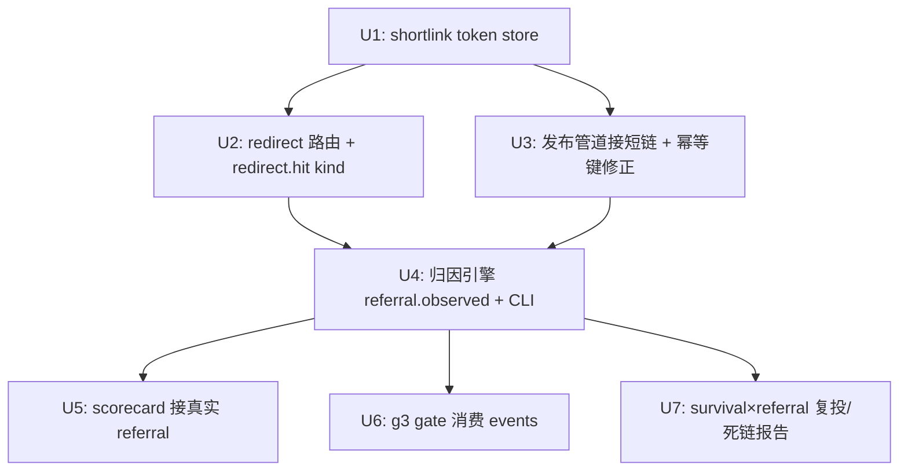

<!-- TOMBSTONE: do-not-revive, see PR #6 — short-link 302 destroys dofollow; rejected by 5-persona document-review. Kept on the active surface only as a tombstone (R8). -->

> **PARKED 2026-06-15 — 方案不可行，勿实现。** document-review 五persona一致否决短链 302：
> - **P0** 短链 302 毁掉外链的 dofollow 本意——money page 拿不到任何直接 dofollow 链接（产品命根子）。
> - **P0** 短链替换打断 g5 footprint 存活检测 + 6 个发布后 dofollow 校验器（`inspect_target_anchor` 按真实 target_url 比对）。
> - **P0** 每条发布实为 3 条独立 body 链接（main/list/work），单一 target_url 短链模型结构上套不上。
> - 外加：单点风险（域名过期=全量死链+可被劫持）、canonical_url 污染、首个公开可写端点的安全债。
>
> 根因：真正的决策轴是**「保住 dofollow 直链」**，短链为链接级归因牺牲了它。已重回 brainstorm 选新方向（渠道级 MVP，复用 click_track GA4）。后继计划另起序号。

# feat: Close the referral attribution loop (self-hosted short-link 302) — PARKED

## Overview

系统能发布外链、能复查链接死活，但**无法在产品内确认链接是否真带来 referral 流量**。本计划补齐闭环：发布时把每条外链的 target_url 换成**自有短链** `/x/<token>` → 短链服务 302 跳转到真实落地页并记录命中（`redirect.hit` 事件）→ 归因命令把命中按 token/链接/渠道聚合（过滤 bot/去重）成 `referral.observed` → 喂给 g3 gate、channel scorecard、keepalive 复投决策、以及"哪条链接值得复投/曾带流量"的查询。

**归因机制（计划期研究推翻原 UTM 决策）**：原定 UTM join 被否决——GA4 标准版高基数 `(other)` 聚合会吃掉 article_id 级细粒度，且外链场景 UTM strip 率高带幸存者偏差，UTM 顶多做到渠道级。改用**自有短链 302 + 自有命中日志**，实现 100% 链接级归因，不依赖 GA4、不受平台 strip 影响（短链是纯 path，无 query 可剥）。GA4 渠道级交叉验证移出 MVP（见 origin: `docs/brainstorms/2026-06-15-referral-attribution-loop-requirements.md`）。

## Problem Frame

GA4 referral 归因的下游消费目前是零代码：`cli/channel_scorecard.py` 的 referral 轴写死 `AXIS_INERT`（`scorecard/engine.py:201`）；`gates/g3_referer.py` 只接受操作员手填 `referral_sessions`（`cli/gate_probe.py:155-165`）；keepalive 复投缺流量信号。`click_track/` 虽能拉 GA4，但 GA4 给不了链接级归因（见 Key Technical Decisions）。本计划另起短链通道作为链接级归因的主载体。

## Requirements Trace

- R1. 项目内自有短链服务记录每条外链的真实命中（替代原"GA4 查询"）
- R2. 短链 token 把命中 join 回已发布链接/渠道（替代 UTM join）
- R2a. 发布管道在发布时把 target_url 替换为自有短链、登记 token→链接映射
- R2b. ~~adapter query 保留性标注~~ —— **短链方案下作废**：短链是纯 path，平台 strip query 不再影响归因
- R3. 命中落库进 events store（新 `redirect.hit` kind），聚合成 `referral.observed`，可由 history query 重建
- R4. `channel_scorecard` 用真实 referral 命中替换 `inert:not-landed`
- R5. 能列出"曾带流量但现已死"的链接（survival 判决 × referral 历史）
- R6. 能按 referral 价值排序 live 链接，喂给 keepalive 复投候选
- R7. g3 gate 消费产品内 referral 计数，不再依赖操作员手填

## Scope Boundaries

- 不做 GSC discovery / AI-retrievability（维持 Wave-0 DESCOPE）
- **GA4 渠道级交叉验证移出 MVP**（短链日志为唯一归因源；GA4 可后续作二次校验）
- 不自建归因排程守护进程（归因 CLI 须可被外部排程，daemon 化属方向 B）
- 短链服务 MVP 落 webui_app；**抽离成独立高可用网关属后续**（量级上来后）
- 不改 `click_track`（GA4 通道本计划不依赖它）

## Context & Research

### Relevant Code and Patterns

- **webui 路由工厂**：`webui_app/__init__.py:59 create_app()` → `routes/__init__.py:register_blueprints()`（46 blueprint，逐个 `app.register_blueprint`）；新公开端点参照 `webui_app/routes/url_verify.py`（单一职责公开端点范例）
- **SQLite 单例**：`webui_store/sqlite_base.py` + `webui_store/history.py`（标准模式，token 映射仿此新建 `webui_store/shortlink.py`）
- **events append**：`events/store.py:EventStore.append(kind, payload, *, target_url=, host=, article_id=, ts_utc=, ...)`，**R9 required-field floor**（`kinds.REQUIRED_FIELDS`）——新 kind 须先注册必填字段否则 quarantine 返回 -1
- **events kind 登记**：`events/kinds.py`（常量 + `KINDS` + `REQUIRED_FIELDS` floor），同步 `tests/test_events_kinds.py`、`tests/test_events_kind_contract_gate.py`（深化确认：直写 kind 不入 STATUS_MAP/projection wiring，无需改那两处）
- **events 聚合读取**：`events/history_query.py`、`events/survival_query.py:compute_survival`（按 kind 聚合范本）
- **发布注入点**：`cli/publish_backlinks/_engine.py:145`（读 target_url）、`:189`/`:253`（`adapter_publish` 调用，短链替换落此之前）
- **幂等键（关键耦合）**：`idempotency/store.py:92 DedupKey=(platform, account, target_url)`，`__post_init__` 对 target_url 调 `canonicalize_url`（`_util/url.py:180`，保留 path）——**短链替换 path 会改幂等键，必须用原始 URL 算 key**
- **g3 gate**：`gates/g3_referer.py:ReferralEvidence` / `assess_g3(...)`；手填注入 `cli/gate_probe.py:155-165`
- **scorecard**：`scorecard/engine.py:201`（`AXIS_INERT`=`scorecard/model.py:21`，`referral_traffic` 字段已就位），聚合 `engine.py:180`
- **CLI 范本**：`cli/click_track.py`（banner/JSONL/emit_error 结构）

### Institutional Learnings

- 无短链/redirect/referral 既有经验文档；完成后值得 `/ce:compound` 沉淀
- `docs/solutions/dofollow-platform-shortlist.md` 与本方案无直接关系（短链方案不再需要 per-platform query 标注）

### External References

- 计划期 best-practices 研究（推翻 UTM）：GA4 标准版高基数维度 `(other)` 聚合上限、外链 UTM strip + 幸存者偏差；建议自有短链 302 + 自有日志做链接级归因，GA4 仅渠道级交叉验证

## Key Technical Decisions

- **链接级归因主载体 = 自有短链 302 + 自有命中日志**（推翻原 UTM）：UTM 受 GA4 `(other)` 聚合 + 平台 strip 双重打击，只能渠道级；短链命中记在自有日志，100% 链接级、不受外部影响。这是支撑 R5/R6（链接级）的前提。
- **两层事件**：`redirect.hit`（原始命中，append-only，高频）→ 归因命令过滤 bot/去重后写 `referral.observed`（语义聚合层）。下游统一消费 `referral.observed`，与原计划下游接口一致。
- **持久化职责分离**：token→链接映射放 `webui_store/shortlink.py`（可查可改 SQLite）；命中日志放 events store（append-only）。
- **幂等键必须吃原始 URL**：`DedupKey` 在短链替换**之前**用原始 target_url 计算；短链 URL 只作 payload/记录字段，不进 dedup 键。否则同一外链被判新键、重复发布。
- **短链服务 MVP 落 webui_app，后续剥离**：webui 是单进程开发服务器，非生产网关；MVP 先用 blueprint 落地最快，归因量级上来后抽成独立高可用服务。
- **GA4 移出 MVP**：短链日志为唯一归因源，避免双系统复杂度；GA4 可作后续渠道级二次校验。

## Open Questions

### Resolved During Planning

- 归因机制？→ 自有短链 302（推翻 UTM；用户 + 研究共同确认）
- 命中日志存哪？→ events store 新 `redirect.hit` kind；token 映射 → webui_store SQLite
- 短链服务落哪？→ MVP 落 webui_app blueprint，后续剥离独立服务
- 与既有 001/002 计划重叠？→ 零重叠
- events 契约门会不会卡？→ 不会（直写 kind 不入 STATUS_MAP/projection wiring，仅需 REQUIRED_FIELDS floor）

### Deferred to Implementation

- 短链 token 生成方案（随机短码 vs 编码 article_id）与碰撞处理——实现时定
- bot 过滤策略（UA 黑名单 / IP 去重窗口 / 已知爬虫库）的具体规则——Unit 4 实测命中数据后定
- 短链域名选型与高可用部署形态（反代 / CDN / 独立服务）——属运维，MVP 后定（见头号风险）
- `redirect.hit` / `referral.observed` 的 REQUIRED_FIELDS 最小字段集——按契约门最小化
- SEO 影响（多一跳 302 对链接权重）——本计划目标是 referral 归因非权重，但需观察

## High-Level Technical Design

> *以下说明意图方向，供评审验证，非实现规范。实现 agent 应作为上下文而非照抄的代码。*

```
发布期 (publish-backlinks, _engine.py:189/253 前)
  原始 target_url ──> 先算 DedupKey(原始 URL)   ★幂等键吃原始 URL
                 ──> token = mint(); shortlink_store.put(token → {article_id, channel, target_url})
                 ──> payload 的 link/target 替换为 https://<go-domain>/x/<token>

跳转期 (webui_app/routes/redirect.py, 公开高频)
  GET /x/<token> ──> shortlink_store.get(token) → 真实 target_url
                 ──> EventStore.append("redirect.hit", {token, referrer, ua, ...},
                          target_url=真实URL, article_id=...)
                 ──> 302 Location: 真实 target_url

归因期 (referral-attribute, 可排程)
  redirect.hit 事件 ──> 过滤 bot + 去重 ──> 按 token/链接/渠道聚合
                    ──> EventStore.append("referral.observed", {channel, article_id, sessions, window})

消费期
  g3 gate / channel_scorecard / keepalive  ←  聚合 referral.observed
```

## Implementation Units



- [ ] **Unit 1: 短链 token 映射存储**

**Goal:** 新 `webui_store/shortlink.py` SQLite 单例，存 token→{article_id, channel, target_url, created_at}，提供 put/get/list。

**Requirements:** R2, R2a

**Dependencies:** 无

**Files:**
- Create: `webui_store/shortlink.py`
- Test: `tests/test_webui_store_shortlink.py`

**Approach:** 仿 `webui_store/history.py` + `sqlite_base.py` 单例模式；token 唯一索引；get 未命中返回 None。

**Patterns to follow:** `webui_store/history.py`、`webui_store/sqlite_base.py`

**Test scenarios:**
- Happy path: put 后 get 取回完整映射
- Edge case: get 不存在的 token → None
- Edge case: 重复 token put → 冲突处理（覆盖或拒绝，按实现决策）
- Happy path: list 返回全部映射

**Verification:** 单测全过；映射可持久化跨进程读回。

- [ ] **Unit 2: 短链跳转路由 + `redirect.hit` 事件**

**Goal:** `webui_app/routes/redirect.py` 暴露 `GET /x/<token>`：查映射 → append `redirect.hit` → 302 到真实 URL；注册 `redirect.hit` event kind。

**Requirements:** R1, R3

**Dependencies:** Unit 1

**Files:**
- Create: `webui_app/routes/redirect.py`
- Modify: `webui_app/routes/__init__.py`（import + 注册元组各加一行）
- Modify: `events/kinds.py`（`REDIRECT_HIT="redirect.hit"` + KINDS + REQUIRED_FIELDS floor）
- Test: `tests/test_redirect_route.py`、`tests/test_events_kinds.py`

**Approach:**
- token 未命中 → 404（不 302、不记 hit）
- 命中 → 记录 referrer / UA / ts，append `redirect.hit`，302 Location 真实 URL
- **不在跳转路径做 bot 过滤**（保留原始信号，过滤留给 Unit 4 归因期）

**Execution note:** 先写 failing 集成测试：请求 `/x/<token>` 断言 302 Location 正确且 events 出现 `redirect.hit`。

**Patterns to follow:** `webui_app/routes/url_verify.py`（公开端点 blueprint）；`events/store.py` append；`click_track/store.py` 直写 kind

**Test scenarios:**
- Happy path: 有效 token → 302 到真实 URL，referrer/UA 记入 redirect.hit
- Error path: 无效 token → 404，不产生事件
- Edge case: 缺 referrer 头 → 仍记录（referrer 可空，但 floor 必填字段须有值）
- Integration: 命中后 `history_query` 能按 `redirect.hit` 读回
- Contract: `redirect.hit` 过 `test_events_kind_contract_gate`（floor 非空）

**Verification:** 端到端请求短链得到正确 302 且 events.db 出现命中记录。

- [ ] **Unit 3: 发布管道接短链 + 幂等键修正**

**Goal:** 发布前为每条 row 生成 token、登记映射、把 link/target 替换为短链 URL；**确保 DedupKey 用原始 target_url 计算**。

**Requirements:** R2a

**Dependencies:** Unit 1

**Files:**
- Modify: `cli/publish_backlinks/_engine.py`（`:189`/`:253` adapter_publish 前；`:145` target_url 读取处）
- Modify: `idempotency/store.py`（确认/调整 DedupKey 取原始 URL 的时序）
- Test: `tests/test_publish_engine_shortlink.py`、相关 idempotency 测试

**Approach:**
- **先算 DedupKey（原始 URL）**，再生成 token + 替换短链 → 写入 `shortlink_store`
- 短链 URL 注入 `payload["links"]` / `payload["seo"]["canonical_url"]`
- 替换在 adapter_publish 前一次完成（dispatch fallback 链多 adapter，注入须在循环外，避免重复 mint token）

**Execution note:** 关键回归——先写一个断言"同一原始 target_url 二次发布仍命中 dedup（不重复发布）"的 characterization 测试，再改替换逻辑。

**Patterns to follow:** `cli/publish_backlinks/_engine.py` 现有 row 处理；`idempotency/store.py:DedupKey`

**Test scenarios:**
- Happy path: 发布一条 row → adapter 收到短链 URL，shortlink_store 有 token 映射
- Edge case 🔴: 同一原始 target_url 二次发布 → 仍判重复、不重复发布（幂等键吃原始 URL）
- Edge case: payload 无 `seo.canonical_url` → 只替换 links，不报错
- Integration: 替换后 `link_attr_verifier.required_link_urls` 仍能匹配短链 URL
- Integration: 短链 URL 经 `canonicalize_url` 不污染既有 dedup（短链只作字段非键）

**Verification:** 发布产出短链且二次发布不重复；token 映射可经短链路由解析回原始 URL。

- [ ] **Unit 4: 归因引擎 + CLI（`redirect.hit` → `referral.observed`）**

**Goal:** 新 CLI `referral-attribute`：读 `redirect.hit`，过滤 bot/去重，按 token/链接/渠道聚合，写 `referral.observed`。

**Requirements:** R2, R3

**Dependencies:** Unit 2（redirect.hit 数据）；Unit 3（token→渠道映射）

**Files:**
- Create: `src/backlink_publisher/referral/__init__.py`、`referral/engine.py`、`referral/store.py`
- Create: `src/backlink_publisher/cli/referral_attribute.py`
- Modify: CLI 注册入口（参照 `click_track` 接入）
- Modify: `events/kinds.py`（`REFERRAL_OBSERVED` + KINDS + floor）
- Test: `tests/test_referral_attribute_cli.py`、`tests/test_referral_engine.py`

**Approach:**
- engine：读 redirect.hit → bot 过滤（UA 黑名单 + IP/时间去重窗口，规则见 Deferred）→ 按 token 经 shortlink_store 还原 (article_id, channel) → 聚合 sessions
- store：append `referral.observed`
- CLI 镜像 `cli/click_track.py`（banner/JSONL/emit_error）

**Execution note:** events 读写用 `mocker`/内存 store；不打真实网络。

**Patterns to follow:** `cli/click_track.py`、`events/survival_query.py:compute_survival`、`tests/test_click_track_cli.py`

**Test scenarios:**
- Happy path: 多条 redirect.hit 同 token → 聚合成 1 条 referral.observed，sessions 正确
- Edge case: bot UA 命中 → 被过滤，不计入 sessions
- Edge case: 短时间同 IP 多次命中 → 去重为合理 session 数
- Edge case: 空 redirect.hit → 输出零行、exit 0
- Error path: token 映射缺失（孤儿 hit）→ 归渠道级或丢弃并 stderr 记数，不崩
- Integration: 写入后 `history_query` 能按 `referral.observed` 读回

**Verification:** `referral-attribute` 跑通，bot 被过滤，events.db 出现聚合 referral.observed，stdout clean JSONL。

- [ ] **Unit 5: channel_scorecard 接真实 referral**

**Goal:** `scorecard/engine.py:201` 的 `AXIS_INERT` 换成按 channel 聚合 `referral.observed`。

**Requirements:** R4

**Dependencies:** Unit 4

**Files:**
- Modify: `scorecard/engine.py`（`:201`、`:180`）
- Test: `tests/test_channel_scorecard_engine.py`、`tests/test_cli_channel_scorecard.py`

**Approach:** 按 channel 聚合 `referral.observed` 填 `model.referral_traffic`；无数据 channel 仍 `AXIS_INERT`（区分"未着陆"与"零流量"）。

**Patterns to follow:** `scorecard/engine.py:180`；`events/survival_query.py:compute_survival`

**Test scenarios:**
- Happy path: 有 referral.observed 的 channel → 显真实数非 inert
- Edge case: 无数据 channel → 仍 AXIS_INERT
- Edge case: 同 channel 多条 → 正确求和
- Integration: 端到端 —— 写 referral.observed 后跑 `channel-scorecard` 断言对应列非 inert

**Verification:** scorecard 对有数据渠道展示非 inert referral；至少 1 渠道验证。

- [ ] **Unit 6: g3 gate 消费产品内 referral**

**Goal:** `gate-probe --gate g3` 从 events.db 聚合 `referral.observed` 构 `ReferralEvidence`，不再依赖手填。

**Requirements:** R7

**Dependencies:** Unit 4

**Files:**
- Modify: `cli/gate_probe.py`（`:57-62`、`:155-165` referral 来源）
- Test: `tests/test_cli_gate_probe.py`

**Approach:** 查 events.db 聚合 sessions 构 `ReferralEvidence`；保留 `--referral-sessions` 手动覆盖；不改 `gates/g3_referer.py:assess_g3` 签名。

**Patterns to follow:** `cli/gate_probe.py` 现有 g3 分支；`events/history_query.py`

**Test scenarios:**
- Happy path: events 有 sessions>0 → g3 返回 GO 无需手填
- Edge case: 无数据且无手填 → INCONCLUSIVE（保原语义）
- Edge case: 手填仍可覆盖 events 值
- Error path: sessions==0 → KILL（assess_g3 不变）

**Verification:** `gate-probe --gate g3` 有数据时返回真实非 BLOCKED verdict 且不需手填。

- [ ] **Unit 7: survival × referral 报告（复投排序 / 死链曾带流量）**

**Goal:** 提供 R6（按 referral 价值排序 live 复投候选）与 R5（曾带流量但现已死）查询。

**Requirements:** R5, R6

**Dependencies:** Unit 4；`events/survival_query.py`

**Files:**
- Create/Modify: `src/backlink_publisher/referral/report.py`
- Modify: `keepalive/chain.py`（候选选择接入排序信号）
- Test: `tests/test_referral_report.py`、相关 keepalive 测试

**Approach:** join `compute_survival` 与 `referral.observed` 聚合；R5=dead/stripped 且历史 referral>0；R6=alive 按 sessions 降序喂 keepalive。

**Test scenarios:**
- Happy path R6: 多条 alive → 按 sessions 正确降序
- Happy path R5: dead 链接曾有 referral → 进死链曾带流量清单
- Edge case: 无 referral 历史 → 不进清单或排末
- Integration: keepalive 候选选择消费排序结果，不破坏既有锁/流程

**Verification:** 输出两类清单；keepalive 候选顺序受 referral 价值影响。

## System-Wide Impact

- **Interaction graph:** 短链替换在 `_engine.py` 影响所有发布路径；`/x/<token>` 是新公开入口；`referral.observed` 被 g3/scorecard/keepalive 三处消费
- **Error propagation:** 短链路由查映射失败 → 404 不 302（不可静默跳错页）；归因/GA4 离线命令失败不得影响发布管道
- **State lifecycle risks:** 🔴 幂等键必须吃原始 URL（Unit 3 characterization 测试守护）；token 映射与 redirect.hit 须一致（孤儿 hit 处理见 Unit 4）
- **API surface parity:** 新增公开 `/x/<token>` 端点须纳入 webui 的 CSRF/安全策略评估（公开 GET，无需 CSRF，但需防开放重定向——只跳已登记 token 的 URL，绝不跳用户传入 URL）
- **Integration coverage:** "发布换短链 → 命中 302 记录 → 归因聚合 → 下游读取"跨层链路需端到端集成测试
- **Unchanged invariants:** `gates/g3_referer.py:assess_g3` 签名/逻辑不变；`click_track` 不依赖不改；发布幂等语义不变（前提是 Unit 3 正确）

## Risks & Dependencies

| Risk | Likelihood | Impact | Mitigation |
|------|-----------|--------|------------|
| 🔴 短链服务宕机/域名过期 → **全部外链同时死** | Med | **High** | 高可用部署 + 域名自动续期监控 + 健康探测告警；MVP 后优先剥离独立网关；考虑短链域名永续保障 |
| 🔴 短链替换破坏幂等键 → 重复发布 | Med | High | DedupKey 吃原始 URL（Unit 3）；characterization 回归测试守护 |
| 开放重定向漏洞（被滥用跳任意站） | Low | Med | 只跳已登记 token 的 URL，绝不跳请求传入的 URL；token 不可枚举 |
| bot 命中虚高 referral 数 | High | Med | Unit 4 归因期过滤 bot UA + IP/时间去重 |
| webui 单进程扛不住高频跳转 | Med | Med | MVP 落 webui，量级上来剥离独立服务（已列 Scope） |
| 多一跳 302 影响 SEO 链接权重 | Low | Low | 本计划目标是 referral 归因非权重；观察，必要时部分渠道直链 |

## Documentation / Operational Notes

- `referral-attribute` 须可被外部排程器调度（cron/launchd）；文档说明频率建议
- 短链服务部署、域名、健康监控须写入运维文档（关联头号风险）
- 更新 AGENTS.md 命令清单：新增 `referral-attribute`、短链端点
- 完成后 `/ce:compound` 沉淀短链归因经验到 `docs/solutions/`

## Sources & References

- **Origin document:** [docs/brainstorms/2026-06-15-referral-attribution-loop-requirements.md](docs/brainstorms/2026-06-15-referral-attribution-loop-requirements.md)
- 计划期研究：best-practices（推翻 UTM → 短链）、architecture-strategist（events 契约 + 幂等键陷阱）、repo-research（webui 落点 + DedupKey 耦合）
- 相关计划：`docs/plans/2026-06-15-001`（发布硬化 completed）、`2026-06-15-002`（文档债 active）—— 均零重叠
- 关键文件：`webui_app/routes/__init__.py`、`webui_store/history.py`、`events/store.py`、`events/kinds.py`、`cli/publish_backlinks/_engine.py`、`idempotency/store.py:92`、`gates/g3_referer.py`、`scorecard/engine.py`
