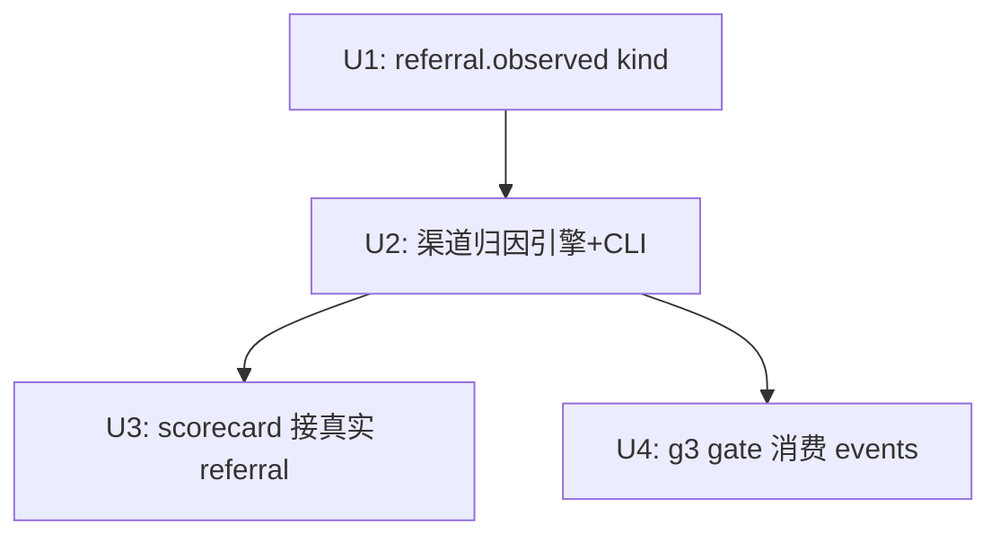

# feat: Channel-level referral attribution (reuse click_track GA4)

## Overview

补齐 referral 归因闭环的**渠道级 MVP**：复用既有 `click_track`（已用 `google-analytics-data` 查 GA4 Data API 拉 `sessionSource/sessionMedium` referral session）→ 把 GA4 referrer host 映射到渠道（platform）→ 落库为新 `referral.observed` 事件（channel-keyed）→ 喂给 channel scorecard 和 g3 gate。

**核心原则：纯读取归因，零发布管道改动，dofollow 完整保留。** 只读 GA4 数据 + 按 referrer host 映射渠道，绝不改外链 URL（见 origin: `docs/brainstorms/2026-06-15-referral-attribution-loop-requirements.md`）。

**为何是这个方案**：链接级方案（UTM、短链 302）均已否决——前者受 GA4 `(other)` 聚合限制，后者毁掉 dofollow 且打断 g5/校验器（详见 PARKED 计划 `2026-06-15-003`）。渠道级满足三个下游消费者的真实需求（它们本就渠道级运作），且零风险可逆。

## Problem Frame

referral 归因下游消费是零代码：`scorecard/engine.py:201` 的 referral 轴写死 `AXIS_INERT`（自注释 `deferred Wave-0 DESCOPE`）；`gates/g3_referer.py` 只接受操作员手填 `referral_sessions`（`cli/gate_probe.py:155-165`）。`click_track` 已能拉 GA4 渠道级数据，但没人把它映射到渠道身份并喂给这两个下游。本计划接线。

## Requirements Trace

- R1. 复用 `click_track.engine.query_site` 查渠道级 GA4 referral（source/medium），单一 property
- R2. GA4 `sessionSource`(referrer host) 映射到渠道（platform），处理 GA4 source 规整
- R3. 渠道级 referral 落库 events store 新 `referral.observed` kind（channel-keyed），可 history 重建
- R4. `channel_scorecard` 用真实渠道 referral 替换 `inert:not-landed`
- R7. g3 gate 消费产品内 GA4 渠道 referral，不再依赖手填

（R5/R6 链接级已移出 MVP——见 origin Scope Boundaries）

## Scope Boundaries

- 🚫 **不碰发布管道 / adapter / 外链 URL**（保 dofollow + 避免短链灾难的硬边界）
- 🚫 链接级归因（原 R5/R6）移出 MVP
- GSC discovery / AI-retrievability 维持 deferred
- 不自建排程守护（CLI 可被排程即可）
- 不新增 GA4 认证 UI（复用 click_track 凭证）
- 不改 `click_track` 既有行为（只复用 `query_site`）

## Context & Research

### Relevant Code and Patterns

- **GA4 查询（复用核心，无需扩展）**：`click_track/engine.py:query_site(...)` 已返回 `sessionSource`/`sessionMedium`——渠道级正好够用（链接级才需扩 campaign 维度，本计划不需要）。`google.analytics.data_v1beta` / `BetaAnalyticsDataClient`，凭证 `service_account.Credentials.from_service_account_file`
- **凭证配置**：`config/types.py:ClickTrackConfig.credential_path`（`[click_track]` TOML），单 property 直传 `property_id`
- **CLI 范本**：`cli/click_track.py`（banner/JSONL/emit_error 结构）；`click_track/store.py:48` append 范例
- **events append**：`events/store.py:EventStore.append(kind, payload, *, run_id, host, article_id, ts_utc, ...)`；**R9 REQUIRED_FIELDS floor**（新 kind 必须有非空 floor，否则 quarantine 返回 -1）
- **events kind 登记**：`events/kinds.py`（常量 + `KINDS` frozenset + `REQUIRED_FIELDS`）。⚠️ `tests/test_events_kinds.py` 硬编码 `KINDS` frozenset 且断言 `len(kinds.KINDS) == N`——新增 kind 须同步更新该断言。直写 kind 不入 STATUS_MAP / projection wiring（无需改那两处）
- **events 聚合读取**：`events/history_query.py`、`events/survival_query.py:compute_survival`（按 kind 聚合范本）
- **g3 gate**：`gates/g3_referer.py:ReferralEvidence`(`sessions:int, window:str`) / `assess_g3(*, referral, credentials_available, strip_threshold)`；手填注入 `cli/gate_probe.py:155-165`（`--referral-sessions`/`--referral-window`）
- **scorecard**：`scorecard/engine.py:201`（`referral_traffic=AXIS_INERT`，`AXIS_INERT`=`scorecard/model.py:21`，`referral_traffic` 字段已就位），按 channel 聚合 `engine.py:180`

### Institutional Learnings

- 项目记忆「Referral 归因硬约束」：任何归因方案必须保 dofollow；UTM 与短链均否决
- 完成后值得 `/ce:compound` 沉淀渠道级归因经验

### External References

- 计划期研究（否决链接级方案）：GA4 标准版高基数 `(other)` 聚合上限使 UTM/campaign 无法做链接级；故选渠道级 source/medium（不受该限制，基数低）

## Key Technical Decisions

- **复用 `click_track.query_site` 渠道级查询，无需扩展维度**：source/medium 基数低、不撞 GA4 `(other)` 上限，渠道级归因稳定。新增独立 `referral/` 逻辑层（engine 调 query_site + source→渠道映射 + 写 referral.observed），不混入 click_track。
- **source→渠道映射表**：GA4 会规整 source（`m.facebook.com`→`facebook`）；建一个 source↔platform 映射（配置或代码常量），未命中的 source 归为 `unknown`/原样保留，不丢数据。
- **`referral.observed` channel-keyed**：payload 至少含 `{channel, sessions, window}`，REQUIRED_FIELDS floor 最小化。
- **g3 不改 `assess_g3` 签名**：只把 `gate_probe.py` 的 `ReferralEvidence` 来源从 argv 切到 events.db 聚合；保留 `--referral-sessions` 手动覆盖。
- **零发布管道改动**：本计划不 import 也不修改 `publishing/`、adapter、`idempotency/`、`_util/url.py`——硬边界。

## Open Questions

### Resolved During Planning

- 归因精度？→ 渠道级（用户确认）
- 是否需扩 query_site 维度？→ 否，source/medium 渠道级够用
- 链接级 R5/R6？→ 移出 MVP
- 与 002 计划重叠？→ 零重叠；003 短链已 PARKED

### Deferred to Implementation

- source→渠道映射表的具体条目（哪些 GA4 source 对应哪个 adapter）——读 registry platform 列表 + 实测 GA4 source 值后定
- `referral.observed` REQUIRED_FIELDS 最小字段集——按契约门最小化
- GA4 日期窗口/配额/分页的复用细节——接 query_site 时确认
- `window` 字段语义（聚合时间区间格式）——实现时定

## High-Level Technical Design

> *以下说明意图方向，供评审验证，非实现规范。*

```
referral-attribute CLI（可排程，纯读取）
  click_track.query_site(property_id) ──> rows[sessionSource, sessionMedium, sessions]
       ──> map sessionSource → channel (映射表; 未命中→unknown)
       ──> 按 channel 聚合 sessions
       ──> EventStore.append("referral.observed", {channel, sessions, window})

消费期（皆渠道级）
  channel_scorecard  ← 按 channel 聚合 referral.observed → 替换 AXIS_INERT
  g3 gate (gate_probe) ← 聚合 referral.observed → ReferralEvidence(sessions, window)

发布管道：不触碰（dofollow 链接原样保留）
```

## Implementation Units



- [ ] **Unit 1: `referral.observed` 事件 kind 登记**

**Goal:** 正规登记 channel-keyed 新 kind，过 R2 契约门。

**Requirements:** R3

**Dependencies:** 无

**Files:**
- Modify: `src/backlink_publisher/events/kinds.py`（常量 + `KINDS` + `REQUIRED_FIELDS` floor）
- Test: `tests/test_events_kinds.py`（更新硬编码 frozenset + `len(KINDS)` 断言）、`tests/test_events_kind_contract_gate.py`

**Approach:** 加 `REFERRAL_OBSERVED="referral.observed"` 入 KINDS；floor 最小化（如 `frozenset({"channel"})`）；同步 `len(KINDS)` 断言（当前值 +1）。

**Patterns to follow:** `events/kinds.py` 现有 kind；`click.observed` payload 形态

**Test scenarios:**
- Happy path: `referral.observed` 在 KINDS 且有 REQUIRED_FIELDS floor
- Contract: `test_events_kind_contract_gate` 对新 kind 通过（floor 非空）
- Edge case: `len(KINDS)` 断言更新正确

**Verification:** events kinds 测试 + 契约门全过。

- [ ] **Unit 2: 渠道 referral 归因引擎 + CLI**

**Goal:** 新 `referral/` 子包：复用 `click_track.query_site` 拉 GA4 referral，映射 source→渠道，聚合写 `referral.observed`；CLI `referral-attribute`。

**Requirements:** R1, R2, R3

**Dependencies:** Unit 1

**Files:**
- Create: `src/backlink_publisher/referral/__init__.py`、`referral/engine.py`、`referral/store.py`、`referral/channel_map.py`（source→渠道映射）
- Create: `src/backlink_publisher/cli/referral_attribute.py`
- Modify: CLI 注册入口（参照 click_track 接入）
- Test: `tests/test_referral_attribute_cli.py`、`tests/test_referral_engine.py`、`tests/test_referral_channel_map.py`

**Approach:**
- engine 调 `click_track.engine.query_site` 取 rows → `channel_map` 映射 sessionSource→platform（未命中→`unknown`）→ 按 channel 聚合 sessions
- store append `referral.observed`
- CLI 镜像 `cli/click_track.py`（banner / stdout JSONL / `emit_error` 非零 exit）

**Execution note:** GA4 调用用 `mocker` patch（同 `tests/test_click_track_cli.py`），不打真实网络。

**Patterns to follow:** `click_track/engine.py`、`click_track/store.py`、`cli/click_track.py`、`tests/test_click_track_cli.py`

**Test scenarios:**
- Happy path: mock GA4 返回 `medium.com` source → 映射到 medium 渠道，写 referral.observed
- Edge case: 未知 source → 归 `unknown`，不丢数据
- Edge case: GA4 返回空 → 输出零行、exit 0
- Edge case: 同渠道多 source（`m.facebook.com`+`facebook.com`）→ 规整后正确合并到 facebook
- Error path: 凭证缺失 / GA4 抛错 → `emit_error` 非零 exit + stderr 诊断
- Integration: 写入后 `history_query` 能按 `referral.observed` 读回聚合

**Verification:** `referral-attribute` 跑通 mock GA4，events.db 出现渠道级 referral.observed，stdout clean JSONL。

- [ ] **Unit 3: channel_scorecard 接真实 referral**

**Goal:** `scorecard/engine.py:201` 的 `AXIS_INERT` 换成按 channel 聚合 `referral.observed`。

**Requirements:** R4

**Dependencies:** Unit 2

**Files:**
- Modify: `src/backlink_publisher/scorecard/engine.py`（`:201`、`:180`）
- Test: `tests/test_channel_scorecard_engine.py`、`tests/test_cli_channel_scorecard.py`

**Approach:** 按 channel 聚合 `referral.observed` sessions 填 `model.referral_traffic`（字段已就位）；无数据 channel 仍 `AXIS_INERT`（区分"未着陆"与"零流量"）。

**Patterns to follow:** `scorecard/engine.py:180` 聚合；`events/survival_query.py:compute_survival`

**Test scenarios:**
- Happy path: 有 referral.observed 的 channel → 显真实 sessions 非 inert
- Edge case: 无数据 channel → 仍 AXIS_INERT
- Edge case: 同 channel 多条 referral 事件 → 正确求和
- Integration: 写 referral.observed 后跑 `channel-scorecard` CLI，断言对应列非 inert

**Verification:** scorecard 对有数据渠道展示非 inert referral；至少 1 渠道验证。

- [ ] **Unit 4: g3 gate 消费产品内 referral**

**Goal:** `gate-probe --gate g3` 从 events.db 聚合 `referral.observed` 构 `ReferralEvidence`，不再依赖手填。

**Requirements:** R7

**Dependencies:** Unit 2

**Files:**
- Modify: `src/backlink_publisher/cli/gate_probe.py`（`:57-62`、`:155-165` referral 来源）
- Test: `tests/test_cli_gate_probe.py`

**Approach:** 查 events.db 聚合 sessions 构 `ReferralEvidence`；保留 `--referral-sessions` 手动覆盖（向后兼容）；不改 `gates/g3_referer.py:assess_g3` 签名。

**Patterns to follow:** `cli/gate_probe.py` 现有 g3 分支；`events/history_query.py` 聚合

**Test scenarios:**
- Happy path: events 有 sessions>0 → g3 返回 GO，无需手填
- Edge case: 无数据且无手填 → INCONCLUSIVE（保原语义）
- Edge case: 手填 `--referral-sessions` 仍可覆盖 events 值
- Error path: sessions==0 → KILL（assess_g3 原逻辑不变）

**Verification:** `gate-probe --gate g3` 有数据时返回真实非 BLOCKED verdict 且不需手填。

## System-Wide Impact

- **Interaction graph:** `referral.observed` 被 scorecard + g3 两处消费（皆渠道级）；referral-attribute 是独立离线只读命令
- **Error propagation:** GA4 查询失败 → `emit_error` 非零 exit 不污染 stdout JSONL；离线命令失败不影响任何在线路径
- **State lifecycle risks:** 新 kind 须有 REQUIRED_FIELDS floor 否则 hit 被静默 quarantine（Unit 1 守护）
- **API surface parity:** 新增 `referral-attribute` CLI；g3 保留手填参数向后兼容
- **Integration coverage:** "query_site → 映射 → 落库 → 下游读取"跨模块链路需端到端集成测试（Unit 2/3）
- **Unchanged invariants:** 🔒 **发布管道 / adapter / 外链 URL / idempotency 全不触碰，dofollow 链接原样保留**；`click_track` 行为不变；`assess_g3` 签名不变

## Risks & Dependencies

| Risk | Mitigation |
|------|------------|
| GA4 source 规整规则未知致映射不全 | `channel_map` 未命中归 `unknown` 不丢数据；实测 GA4 source 值后补映射 |
| `referral.observed` floor 定义不当致契约门失败 | Unit 1 floor 最小化，先过 `test_events_kind_contract_gate` |
| `test_events_kinds.py` 的 `len(KINDS)` 硬断言遗漏更新 | Unit 1 明确列为修改项 |
| GA4 渠道级数据有抽样/延迟 | 接受（渠道级决策容忍度高）；window 字段标注聚合区间 |
| referral 计数是 GA4 session 非真实点击，语义与手填一致性 | 复用 GA4 session 语义，与原 g3 `referral_sessions` 同义，无歧义 |

## Documentation / Operational Notes

- `referral-attribute` 须可被外部排程器调度（cron/launchd）；文档说明频率建议
- 更新 AGENTS.md 命令清单：新增 `referral-attribute`
- 完成后 `/ce:compound` 沉淀渠道级归因经验

## Sources & References

- **Origin document:** [docs/brainstorms/2026-06-15-referral-attribution-loop-requirements.md](docs/brainstorms/2026-06-15-referral-attribution-loop-requirements.md)
- 复用核心：`click_track/engine.py:query_site`、`click_track/store.py`、`cli/click_track.py`
- 作废前身：`docs/plans/2026-06-15-003-*-plan.md`（短链 302，PARKED）
- 相关计划：`2026-06-15-001`（发布硬化 completed）、`2026-06-15-002`（文档债 active）——零重叠
- 关键文件：`events/kinds.py`、`gates/g3_referer.py`、`scorecard/engine.py:201`、`cli/gate_probe.py:155-165`
