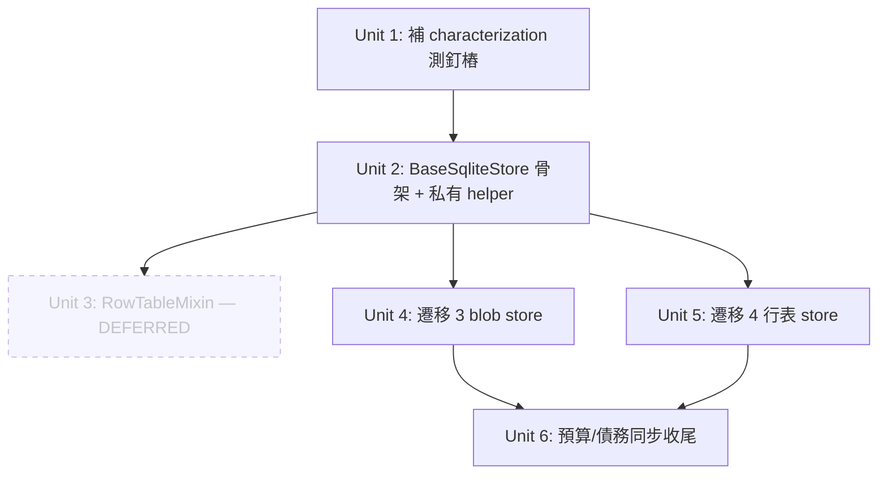

# refactor: Extract BaseSqliteStore + RowTableMixin for webui_store

## Overview

`webui_store/` 的 SQLite store 以複製貼上方式增長：5 個主要 store（campaign / channel_status / drafts / profiles / queue）+ 3 個 blob store（profiles / schedule / publish_defaults）各自手寫了結構幾乎相同的 `_init_table` / `load` / `save` / `migrate_from_json` 模板與項級 CRUD。本計畫在現有 `sqlite_base.py` 的 `SqliteStore`（已提供 `update()` + `RLock`）之上，抽出 `BaseSqliteStore` 與 `RowTableMixin`，遷移全部 store，**對外 API、schema、JSON 遷移語義零變化**。重複模板的淨減量以 Unit 6 的 radon 量測為準（7 個 store 共 ~1231 radon SLOC；扣除子類保留的特異邏輯後，實際淨減預估在數百行量級，遠低於早期以 raw LOC 估的「800 行」——最終以量測數字為準）。

這是純內部、行為保真重構。終端使用者與 route 層呼叫端不應感知任何變化。

## Problem Frame

新增 store 要重抄整套樣板；同一段鎖語義 / JSON 序列化 / 寫入 / 遷移邏輯散在 8 個檔案，任何修正要改 8 處。重複模板的實際 SLOC 淨減量以 Unit 6 radon 量測為準（早期以 raw LOC 估的「800 行」偏高）。注意 `monolith_budget.toml` 目前僅 `campaign_store.py` / `channel_status.py` 兩個 store 有 ceiling 條目，故「下調 ceiling」只對這 2 個適用；而 `sqlite_base.py` 因吸收基類會增長、目前**無**預算條目，須評估是否新增。詳見 origin doc 的 Problem Frame。

## Requirements Trace

- R1. 抽出 `BaseSqliteStore`（`__init__` / `_init_table` 模板方法 / `load` / `save` / `migrate_from_json`）(see origin: R1)
- R2. ~~抽出 `RowTableMixin`~~ **DEFERRED**（實作時讀碼確認：項級 CRUD 僅存在於 `drafts` 一個 store；queue/campaign 是不同簽名的公開領域 API。mixin-of-one = 零去重 + 投機抽象，違反 repo 反過度抽象原則。改以 BaseSqliteStore 小型私有 row helper 承接共用的 load 迴圈與 get-by-pk。待第二個項級-CRUD store 出現再抽。）(see origin: R2)
- R3. 共用工具續用 `events/_store_sqlite.py`，不重複實作、不搬遷 (see origin: R3)
- R4. 3 個 blob store 改繼承 `BaseSqliteStore`，刪冗餘 load/save (see origin: R4)
- R5. 4 個行表 store 改繼承基類，特異邏輯留子類 (see origin: R5)
- R6. WAL deadlock 規則維持：特異邏輯內不得嵌套連接 (see origin: R6)
- R7. 對外公開方法簽名/返回值不變，route 層零修改 (see origin: R7)
- R8. 既有 store 測試全綠、不放寬、不新增 skip/xfail (see origin: R8)
- R9. JSON→SQLite 遷移路徑（sentinel / `.json.migrated` / 0o600）行為一致 (see origin: R9)
- R10. 更新 `monolith_budget.toml` 對應 ceiling（下調）(see origin: R10)
- R11. 閉合 `debt_registry.toml` 相關條目（如適用）(see origin: R11)

## Scope Boundaries

- **不**新增 route 層 query helper（`filter_by_status` / `get_latest_n`）——獨立改進，留後續。
- **不**改任何對外 API、schema、JSON 遷移語義。
- **不**觸碰 `history.py`（混合 JSON + events.db）與 `batch_ops.py`（有 `load()`、`save()` 為 `NotImplementedError`，模板形狀與其他 store 不同）。
- **`verify_health.py`**（第 8 個 `SqliteStore` 子類，~70 SLOC，有 `_init_table`/`load`/`save` 但**無** JSON 前身故無 `migrate_from_json`）：本次**不**遷移，列為後續獨立 follow-up——理由是它缺遷移路徑、與本批的 migrate 參數化收益不重疊，且納入會擴大 blast radius。
- **不**搬遷 `events/_store_sqlite.py` 共用工具，**不**重命名或搬移 store 檔案位置。
- **不**加 `fcntl.flock` 或改變並發模型（見 Key Technical Decisions）。
- 純內部重構，無使用者可見變化。

## Context & Research

### Relevant Code and Patterns

- `webui_store/sqlite_base.py` — `WebUIDatabase`（連接工廠，單一 `webui.db`）+ `SqliteStore`（`update()` + `RLock`）。基類掛載點。
- `webui_store/base.py` — `Store` Protocol（`load`/`save`/`update`）+ `JsonStore` + `_LazyStore` 代理。
- 待遷移 store（括號為 **radon SLOC**，即預算單位，非 `wc -l`；遷移前以 `radon raw -s` 重新量測為準）：`campaign_store.py`(307)、`channel_status.py`(310)、`drafts.py`(283)、`queue_store.py`(147)、`profiles.py`(73)、`schedule.py`(73)、`publish_defaults.py`(38)，合計 ~1231 SLOC。另有第 8 個同模板 store `verify_health.py`(~70 SLOC，無 JSON 前身)——範圍處置見 Scope Boundaries。
- `events/_store_sqlite.py` — 共用工具：`_retry_sqlite`、`_tighten_wal_sidecars`、`_set_backup_exclude_xattr`、`_is_transient_sqlite_error`、`_is_select_statement`。續用。
- 共用模板形狀（每個 store 重複）：`_init_table`（CREATE TABLE/INDEX IF NOT EXISTS）、`load`（SELECT → json.loads → 過濾型別）、`save`（lock → DELETE all → executemany INSERT，全經 `_retry_sqlite`）、`migrate_from_json`（sentinel/.migrated/0o600 流程）。

### Institutional Learnings

- **`docs/solutions/architecture-patterns/2026-06-05-lite-accepted-deferrals.md`**：`webui_store` 的 `RLock` 只保同進程、跨進程無 flock 是「已知且接受」現狀。抽基類務必原樣保留此邊界。`tests/test_webui_store_concurrency.py::test_same_key_rmw_counter` 量化過 RMW 競爭，應維持綠燈。
- **`docs/solutions/logic-errors/language-matches-always-true-no-op-gate-2026-05-14.md`**（characterization-first）：抽基類前先以 characterization 測釘住當前真實行為（含怪行為），釘「行為契約」而非僅資料形狀（`isinstance` shape test 不足以防回歸）。
- **`docs/solutions/best-practices/publish-history-helper-invariant-2026-05-20.md`**：store 有 load-bearing invariant（如 published 行必有非空 url）；項級/bulk 寫入的不變量檢查必須留在唯一寫入入口，bulk 要逐行重跑校驗，絕不開繞過後門（含測試 fixture）。PR #87 曾因繞過直寫產生幽靈行。
- **`docs/solutions/integration-issues/dofollow-canary-verdict-dropped-...-2026-05-25.md`**：抽共用 save/load 後要 grep 每個 JSON 行構造點，逐出口寫 present→emitted / absent→omitted 對測。
- **`architecture-health-audit-2026-06-01.md`**：對「高 churn 跨層抽象」保守，重命名/搬家高 churn 低 ROI 不做。基類要窄、不投機抽象。
- **負面結論**：`migrate_from_json` / sentinel / `.migrated` 在 docs/solutions 無踩坑前例 → 屬「無前例」，須自行用 characterization 測釘住遷移語義。

### External References

- 跳過外部研究：本地模式強（`SqliteStore` 基類已存在），無 adjacent-domain 缺口。

## Key Technical Decisions

- **基類擴展而非取代既有 `SqliteStore`**：`BaseSqliteStore` 繼承 `SqliteStore`，沿用其 `update()` + `RLock`，降低 blast radius。
- **並發模型原樣保留**：維持「`RLock` 同進程 only、無跨進程 flock」。此為已接受裁定，加 flock 屬獨立決策、不在本次保真重構範圍。
- **基類窄抽象**：只收「結構相同」的 `_init_table`/`load`/`save`/`migrate_from_json` + 項級 CRUD；所有特異邏輯（seed/progress、inserted_at 保序、get_runnable、extra_json + mark_*）留子類。抗拒投機泛型化（呼應 repo 對跨層抽象的保守傾向）。
- **characterization-first 執行姿態**：每個 store 在遷移前先補/確認 characterization 測，釘住位元級行為再動基類。
- **不變量留唯一寫入入口**：`RowTableMixin` 的 bulk 寫法在緊迴圈內逐行重跑與單筆相同的校驗/序列化，不開繞過後門。

## Open Questions

### Resolved During Planning

- **RowTableMixin 主鍵抽象（UUID vs slug）**：以可配置類屬性 `_pk_column`（預設 `"id"`）解決。campaign/drafts/queue 用 `id`；channel_status 主鍵為 channel slug 但其對外是 `mark_*` 業務方法 + `extra_json` 合併，**不套用 `RowTableMixin`**，僅繼承 `BaseSqliteStore` 的 `_init_table`/`migrate_from_json`，自留 load/save 變體。
- **profiles 測試僅 138 行是否先補 characterization**：是。依 repo characterization-first 紀律，遷移前先補 profiles 的行為釘樁（含空值/壞 JSON/型別不符回退預設）。
- **blob schema 設定點形式**：用類屬性（`_table_name` / `_default_value` / `_json_filename` / `_sentinel_name`），取最簡可行，不引入 dataclass metadata。
- **migrate_from_json 參數化程度**：以類屬性參數化（JSON 檔名、sentinel 名、預期型別、預設值）；殘留差異（如型別 list vs dict）由子類覆寫 `_coerce_loaded(data)` hook 收口。
- **channel_status 是否復用 base save**：經程式碼確認**否**。channel_status 為 6 欄（status/bound_at/storage_state_path/last_verified_at/channel + `extra_json`）非對稱序列化——save 把非 `_KNOWN_COLUMNS` 鍵收進 `extra_json`，load 再 `rec.update(extra)` 合併回。此形狀與 `(_pk_column, data_json)` 模型不符，故 channel_status **自備 save/load**，僅自基類繼承 `migrate_from_json` 與鎖。
- **base 行表共享面實際多窄**：經確認，各行表 load 的 `ORDER BY` 各異（drafts `inserted_at DESC`、campaign `created_at DESC`、queue 依 status/next_retry_at 篩選），且 drafts save 需依 list 位置合成遞減 `inserted_at`——故 `load` 的 SELECT 與 drafts 的 `save` 屬子類覆寫，base 對行表的真正共享面集中在 `migrate_from_json` + 鎖/重試包裝 + `_init_table`。RowTableMixin（項級 CRUD）仍是行表的主要復用點。

### Deferred to Implementation

- 各子類最終覆寫的 hook 命名與精確簽名（`_create_table_sql` / `_indices_sql` / `_row_to_item` / `_item_to_row` / `_coerce_loaded`）——待接觸真實程式碼定案。
- `sqlite_base.py` 吸收 base+mixin 後是否需在 `monolith_budget.toml` 新增 ceiling 條目（目前無）——待 Unit 6 量測後定。
- profiles characterization 測補強後是否揭示既有隱性行為需額外釘樁——依實際測試輸出決定。

## High-Level Technical Design

> *本節說明意圖方向，供審查驗證用，非實作規格。實作者應視為脈絡，而非照抄的程式碼。*

```
SqliteStore (現有: update() + RLock)
    │
    └── BaseSqliteStore                         # 抽出的共用骨架（實際共享面比下圖窄，見下方註）
          ├─ __init__(db: WebUIDatabase | Path)  # Path→WebUIDatabase 轉換（drafts/campaign 測試需 Path）；呼叫 _init_table
          ├─ _init_table()                       # 模板法 → 子類給 _create_table_sql() / _indices_sql()
          ├─ migrate_from_json(config_dir)       # sentinel/.migrated/0o600；參數來自 _json_filename/_sentinel_name/_coerce_migrated（最大宗共享面，6 store 一致）
          ├─ _load_rows(sql, params=())          # 私有 helper：SELECT→json.loads→isinstance(dict)→list（行表 load 共用）
          └─ _get_one_json(sql, params)          # 私有 helper：單列 data_json→dict|None（drafts.get_item / campaign.get 共用）
          │   # 註：load/save 仍為 abstract（兩種寫入形狀差異大）；RowTableMixin 已 DEFERRED
          │
          ├── BlobSqliteStore(BaseSqliteStore)   # 單行 blob 中介：覆寫 load/save 為單行 upsert（INSERT OR REPLACE id=1）
          │     └── ProfilesSqliteStore(_default=[]) / ScheduleSqliteStore(table=settings) / PublishDefaultsSqliteStore(無 migrate)
          │
          ├── CampaignSqliteStore(BaseSqliteStore)    # 自備 save（mirror cols）+ load(用 _load_rows, ORDER BY created_at)；create/get/update_status/update_seed_status
          ├── DraftsSqliteStore(BaseSqliteStore)      # 自備 save（inserted_at 遞減保序）+ load(ORDER BY inserted_at DESC) + 項級 CRUD（暫留店內）
          ├── QueueSqliteStore(BaseSqliteStore)       # 自備 save + load(_load_rows, ORDER BY rowid) + get_runnable + update_task
          └── ChannelStatusSqliteStore(BaseSqliteStore)  # 6 欄 + extra_json 非對稱序列化，自備 save/load；繼承 migrate_from_json + 鎖

```

## Implementation Units



- [x] **Unit 1: characterization 釘樁（行為基線）— 既有覆蓋已滿足（實作時驗證）**

> **結論**：執行時逐一驗證，characterization 安全網**已存在且完整**（354 store 測試綠燈），無需新增測試（新增即重複，違反 repo 反 churn 原則）。具體：`tests/test_webui_store_migration_edge_cases.py` 參數化 schedule/profiles/queue/drafts/campaign 的 空表/壞JSON-不寫sentinel/crash-recovery/sentinel-idempotency；各 store 自有測試檔再加 happy migrate（import+rename+**chmod 0o600**+sentinel，schedule:79 / profiles:86 / drafts:309 明確斷言 0o600）；`channel_status` 6 個 migrate 測 + `extra_json` present→emitted/absent→omitted 對測；`publish_defaults` 經 `tests/test_webui_publish_defaults.py`（空/roundtrip/壞JSON）——故計畫原寫的「新建 test_webui_store_publish_defaults_sqlite.py」**取消**（會重複）。`tests/test_webui_store_sqlite_base.py` 已覆蓋 base/WAL/lock/path-setter。


**Goal:** 在動基類前，釘住 8 個 store 的當前真實行為（含怪行為與遷移語義），尤其補強測試偏薄的 profiles。

**Requirements:** R8, R9

**Dependencies:** None

**Files:**
- Modify/Test: `tests/test_webui_store_profiles_sqlite.py`（補空值 / 壞 JSON / 型別不符回退 / 單行 blob 語義）
- Test: `tests/test_campaign_store.py`、`tests/test_webui_store_channel_status_sqlite.py`、`tests/test_webui_store_drafts_sqlite.py`、`tests/test_webui_store_queue_sqlite.py`（確認已覆蓋 load/save/migrate/特異邏輯；缺口補上）
- Test（**硬前置，必建**——`tests/test_webui_store_publish_defaults_sqlite.py` 目前不存在，publish_defaults 是最薄、最可能被基類完全吸收的 store，必須先有專屬釘樁才能保證行為保真）：明確涵蓋 空表回退 `_default_value` / 壞 JSON 回退 / migrate（sentinel+`.json.migrated`+0o600）/ **壞 JSON 靜默跳過且不寫 sentinel** 四分支
- Test（新建，如缺）：`tests/test_webui_store_schedule_sqlite.py` 的 migrate/blob 行為釘樁

**Approach:**
- 對每個 store 釘「行為契約」而非僅資料形狀：壞 JSON → 回退預設、型別不符 → 預設、遷移 sentinel/.migrated/0o600 權限、空表 load 返回值。
- 維持 `tests/test_webui_store_concurrency.py::test_same_key_rmw_counter` 綠燈作為並發邊界釘樁。

**Execution note:** Add characterization coverage before modifying any store. 釘行為契約而非 shape test。

**Patterns to follow:** `docs/solutions/.../language-matches-always-true-no-op-gate-2026-05-14.md`（characterization-first）。

**Test scenarios:**
- Happy path：每個 store 既有 load/save/update round-trip 維持原返回。
- Edge case：壞 JSON 行 → 被跳過/回退預設；空表 → 預設值；單行 blob id=1 缺失 → 預設。
- Edge case（遷移，逐分支釘樁）：JSON 存在且無 sentinel → 遷移後 `.json.migrated` 出現、權限 0o600、sentinel 寫入；sentinel 已存在 → 不重複遷移；**壞 JSON → 靜默跳過且不寫 sentinel**（容後續檔仍可匯入）；**`.migrated` 存在但 sentinel 缺（crash 復原）→ 補寫 sentinel 後返回**。
- Integration：profiles/schedule/publish_defaults blob 經 update() 的 load→fn→save 在 RLock 下原子。

**Verification:** 新增/補強的 characterization 測在**未改動 production code** 下全綠，作為後續單元的回歸基線。

- [x] **Unit 2: 抽出 BaseSqliteStore 骨架 + BlobSqliteStore + 私有 helper（完成）**
  > 已在 `sqlite_base.py` 新增 `BaseSqliteStore`（`__init__` 接受 `WebUIDatabase|Path`、`_init_table` 模板、`migrate_from_json` 模板含 `_coerce_migrated`、私有 `_load_rows`/`_get_one_json`）與 `BlobSqliteStore`（單行 upsert load/save）。`test_webui_store_sqlite_base.py` +18 測（共 35 綠）。純加法，全 store 基線 354→372 零回歸。

**Goal:** 在 `sqlite_base.py` 新增 `BaseSqliteStore`（`__init__` / `_init_table` 模板 / `migrate_from_json` 模板 / 私有 row helper），以及 `BlobSqliteStore` 中介（單行 upsert load/save）。`load`/`save` 在 `BaseSqliteStore` 維持 abstract。

**Requirements:** R1, R3, R6

**Dependencies:** Unit 1

**Files:**
- Modify: `webui_store/sqlite_base.py`
- Test: `tests/test_webui_store_sqlite_base.py`（新建，針對基類 hook 契約 + helper + BlobSqliteStore）

**Approach:**
- `BaseSqliteStore(SqliteStore)`，沿用 `update()` + `RLock`，不動並發模型。
- `__init__(db: WebUIDatabase | Path)`：Path→WebUIDatabase 轉換後 `super().__init__` + `self._init_table()`（drafts/campaign 測試靠 Path 後相容；blob 子類僅傳 WebUIDatabase，相容性為加寬非破壞）。
- 模板方法 hook：`_create_table_sql() -> str`（abstract）、`_indices_sql() -> list[str]`（預設 `[]`）、`_coerce_migrated(data) -> Any`（預設 identity；blob 子類覆寫做 list/dict 收口）。
- 類屬性：`_json_filename` / `_sentinel_name`（None → `migrate_from_json` 為 no-op，publish_defaults 用）。
- `migrate_from_json` 完整搬入：sentinel→crash-recovery→讀 JSON(壞→靜默不寫 sentinel)→save→rename→chmod 0o600→寫 sentinel。
- 私有 helper（承接行表共用、非公開 API）：`_load_rows(sql, params=()) -> list[dict]`（SELECT→json.loads→isinstance(dict)→append，全經 `_retry_sqlite`）；`_get_one_json(sql, params) -> dict|None`。
- `BlobSqliteStore(BaseSqliteStore)`：`load()` 單行 SELECT→json→`isinstance(_default_value 型別)`→default；`save()` 單行 `INSERT OR REPLACE (id,data_json) VALUES (1,?)`；`_create_table_sql()` 用 `_table_name` + `_default_value`。

**Execution note:** 不得在 `save`/特異路徑產生嵌套連接（WAL deadlock 規則）。

**Patterns to follow:** 現有各 store 的 `_init_table`/`load`/`save` 共同形狀；`SqliteStore.update()` 的 lock 用法。

**Test scenarios:**
- Happy path：以一個最小 fake 子類驗證 `_init_table` 建表+索引、`load`/`save` round-trip、`update` 原子性。
- Edge case：`_coerce_loaded` 收口型別不符 → 預設；空表 → `_default_value()`。
- Error path：`save` 期間 transient SQLite error → `_retry_sqlite` 重試生效（mock 注入）。
- Integration：`migrate_from_json` 完整走 sentinel/.migrated/0o600。

**Verification:** Base 類測試綠燈；Unit 1 既有測試仍全綠（尚未接線子類，行為應不變）。

- [~] **Unit 3: 抽出 RowTableMixin（項級 CRUD）— DEFERRED（實作時決策，已獲使用者確認）**

> **為何延後**：讀完 7 個 store 原碼後確認，項級 CRUD 套件（get_item/update_item/delete_item/bulk_delete/bulk_update）只存在於 `drafts.py`。`queue` 用 `update_task(task_id, updates)`、`campaign` 用 `update_status`/`update_seed_status`（含驗證 + progress 重算）——皆為不同簽名的公開領域 API，強套 mixin 會違反 R7 或讓 mixin 充滿 hook 反成淨負。mixin-of-one 是零去重的投機抽象。改以 **Unit 2 的小型私有 row helper**（`_load_rows` / `_get_one_json`）承接 drafts/campaign/queue 共用的「SELECT→json→dict」迴圈與 get-by-pk，這是真實去重且不改公開 API。RowTableMixin 待第二個需要相同項級 CRUD 的 store 出現時再抽（Right-size gate 命中）。

**Goal（原）:** 提供 `get_item` / `update_item` / `delete_item` / `bulk_delete` / `bulk_update`，主鍵欄位以 `_pk_column` 可配置。

**Requirements:** R2

**Dependencies:** Unit 2

**Files:**
- Modify: `webui_store/sqlite_base.py`
- Test: `tests/test_webui_store_sqlite_base.py`（擴充 mixin 案例）

**Approach:**
- `RowTableMixin` 假設行表有 `_pk_column`（預設 `"id"`）+ `data_json` 欄位。
- **不變量紅線**：bulk 寫法在緊迴圈內逐行重跑與單筆相同的校驗/序列化，不開繞過 `save` 不變量的直寫後門。
- `update_item` 為單行 UPDATE（鏡像 queue 的 `update_task` 模式），不做全表重寫，且不得嵌套連接。

**Patterns to follow:** `drafts.py` 的 `bulk_delete`/`bulk_update`、`queue_store.py` 的 `update_task`；`docs/solutions/.../publish-history-helper-invariant-2026-05-20.md`（不變量唯一入口）。

**Test scenarios:**
- Happy path：get/update/delete 單筆；bulk_delete/bulk_update 多筆返回正確統計。
- Edge case：不存在的 id → get 返回 None、update/delete 返回 False/0；空 ids 列表 → no-op。
- Error path：bulk 中某行校驗失敗 → 不靜默吞、行為與單筆一致（不開後門）。
- Integration：`_pk_column` 設為非 `id` 欄位時 CRUD 仍正確定位。

**Verification:** mixin 測試綠燈；主鍵可配置案例通過。

- [x] **Unit 4: 遷移 3 個 blob store（完成）**
  > profiles / schedule / publish_defaults 改繼承 `BlobSqliteStore`，刪除冗餘 load/save/_init_table/__init__/migrate（profiles/schedule 的 migrate 改由基類提供，publish_defaults 無 migrate）。保留 `_JSON_FILENAME`/`_SENTINEL_NAME` 模組常數（測試 import）。對外 API 零變化，76 blob-focused + 372 store 基線全綠。

**Goal:** profiles / schedule / publish_defaults 改繼承 `BaseSqliteStore`，刪除冗餘 load/save，只留 schema 類屬性 + `_default_value`。

**Requirements:** R4, R7, R8, R9

**Dependencies:** Unit 2

**Files:**
- Modify: `webui_store/profiles.py`、`webui_store/schedule.py`、`webui_store/publish_defaults.py`
- Test: 對應 `tests/test_webui_store_profiles_sqlite.py`、`tests/test_webui_store_schedule_sqlite.py`、`tests/test_webui_store_publish_defaults_sqlite.py`

**Approach:**
- 單行 blob（id=1）模式 100% 套基類，子類僅給 `_table_name`/`_default_value`/`_json_filename`/`_sentinel_name`。
- 保 `_LazyStore` singleton 包裝與 `__init__.py` 匯出不變。

**Patterns to follow:** Unit 2 的 base 契約；現有 blob store 的單行 id=1 schema。

**Test scenarios:**
- Happy path：load/save/update round-trip 與遷移前位元一致。
- Edge case：壞 JSON / 型別不符 → 回退 `_default_value`。
- Integration：JSON→SQLite 遷移語義（sentinel/.migrated/0o600）不變。

**Verification:** 3 個 blob store 測試全綠且未放寬；對外 API diff 為零。

- [x] **Unit 5: 遷移 4 個行表 store（完成）**
  > campaign/drafts/queue/channel_status 改繼承 `BaseSqliteStore`：移除各自的 `__init__`/`_init_table`/`migrate_from_json`，改用 `_create_table_sql`/`_indices_sql` + 類屬性 + 繼承的 migrate。queue/campaign/drafts 的 `load` 與 `get`/`get_item`/`get_by_campaign_id` 改走 `_load_rows`/`_get_one_json` helper；各自的 bespoke `save`（欄位鏡射）與領域方法（update_seed_status/progress、inserted_at 保序+bulk_publish_now、get_runnable/update_task、mark_*/reconcile/extra_json）原樣保留。`_JSON_FILENAME`/`_SENTINEL_NAME` 常數 + DraftsStore/CampaignStore 別名保留。逐店遷移逐店綠；全 store 基線 427 綠、零回歸。

**Goal:** campaign / drafts / queue 改繼承 `BaseSqliteStore` + `RowTableMixin`；channel_status 僅繼承 `BaseSqliteStore`（不套 mixin），全部保留特異邏輯。

**Requirements:** R5, R6, R7, R8

**Dependencies:** Unit 2（全部 4 個行表 store 直接繼承 `BaseSqliteStore`；RowTableMixin 已 DEFERRED，drafts 項級 CRUD 暫留店內）

**Files:**
- Modify: `webui_store/campaign_store.py`、`webui_store/drafts.py`、`webui_store/queue_store.py`、`webui_store/channel_status.py`
- Test: `tests/test_campaign_store.py`、`tests/test_webui_store_drafts_sqlite.py`、`tests/test_webui_store_queue_sqlite.py`、`tests/test_webui_store_channel_status_sqlite.py`

**Approach:**
- 保留特異邏輯：campaign `update_seed_status` + progress 重算（單 transaction、不嵌套連接）；drafts `inserted_at` 保序 + `bulk_publish_now`（bulk 內逐行校驗、異常捕捉統計）；queue `get_runnable` 重試篩選 + `update_task` 單行 UPDATE；channel_status `extra_json` 合併 + `mark_bound/expired/verified/identity_mismatch` + `reconcile_on_load` + `credential_age_days`。
- channel_status 不套 RowTableMixin（主鍵為 slug、對外是業務狀態機），且經程式碼確認其 6 欄 + `extra_json` 非對稱序列化與 base 行表模型不符 → **自備 save/load**，僅自基類繼承 `migrate_from_json` + 鎖。
- drafts 因 `inserted_at` 遞減保序需 list 位置脈絡（base 的無狀態 `_item_to_row` 看不到）→ **覆寫 save**；campaign/queue/drafts 各覆寫 load 的 `ORDER BY`。base 對行表的共享面集中在 `migrate_from_json` + 鎖/重試 + `_init_table` + RowTableMixin 項級 CRUD。

**Execution note:** 逐個 store 遷移，每遷一個跑該 store 全測試綠燈後再遷下一個。維持 WAL 不嵌套連接規則。

**Patterns to follow:** 各 store 現有特異方法；`bulk_publish_now` 的 per-row 異常捕捉；invariant 唯一入口紀律。

**Test scenarios:**
- Happy path：各 store 特異方法（update_seed_status/progress、insert_first/bulk_publish_now、get_runnable/update_task、mark_* /reconcile）返回與遷移前一致。
- Edge case：campaign 全 seed done → progress 100%；drafts 無 inserted_at 項被賦遞減時間戳保序；queue next_retry_at 過去/NULL → runnable，未來 → 排除；channel_status extra 欄位（identity_mismatch_old）經 extra_json 往返不丟。
- Error path：bulk_publish_now 中單筆 publish 拋錯 → 計入失敗統計、不中斷其餘、不開繞過寫入後門。
- Integration：每個產生 JSON/行的構造點都經唯一 save 入口（grep 序列化出口，逐出口 present→emitted / absent→omitted 對測）；`test_same_key_rmw_counter` 維持綠燈。

**Verification:** 4 個行表 store 測試全綠、零放寬、零新增 skip；route 層無改動。

- [ ] **Unit 6: 預算與債務登記同步收尾**

**Goal:** 反映 SLOC 下降，閉合相關技術債條目，跑全套件確認無回歸。

**Requirements:** R10, R11

**Dependencies:** Unit 4, Unit 5

**Files:**
- Modify: `monolith_budget.toml`（下調受影響 store 的 ceiling）
- Modify: `debt_registry.toml`（如本重構閉合條目 → `resolved` + `resolved_date`）

**Approach:**
- 以 `radon raw -s` 量測遷移後各 store + `sqlite_base.py` 的 SLOC，下調受影響 ceiling（下調免 rationale）；若 `sqlite_base.py` 因吸收 base+mixin 需新增/上調 ceiling，同 PR 附 ≥80 字 rationale。
- **Right-size gate**：量測「全批淨減 SLOC」（7 store 減量 − sqlite_base 增量）。若淨減顯著低於預估（例如 < 200 SLOC），於 PR 描述記錄實測值並回顧：行表泛型化收益是否撐得起雙抽象，或下批應收斂為「僅 blob+migrate 收口 + RowTableMixin」。此為記錄+回顧義務，非阻斷條件。
- 全測試套件綠燈確認對外行為零變化。

**Patterns to follow:** CLAUDE.md 的預算/債務登記規範。

**Test scenarios:** Test expectation: none — 純預算/債務文件與設定同步，無行為變更（行為由 Unit 1–5 測試保障）。

**Verification:** `monolith_budget.toml` 反映新 SLOC；CI 預算閘通過；全套件（~11,000 tests）綠燈。

## System-Wide Impact

- **Interaction graph:** route 層經 `__init__.py` 匯出的 8 個 `_LazyStore` singleton 呼叫 store；本重構不改匯出與 lazy proxy，呼叫端不受影響。
- **Error propagation:** transient SQLite error 續由 `_retry_sqlite` 處理，語義不變；bulk 寫入單行失敗的統計回報行為保留。
- **State lifecycle risks:** DELETE+bulk-INSERT 的全表重寫語義不可在抽取中被改成 upsert（否則改變 rowid/順序）；JSON 遷移 sentinel 一次性語義須保。
- **API surface parity:** 8 個 store 對外方法簽名/返回值不變，可由 route 層零 diff 佐證。
- **Integration coverage:** 序列化出口（每個 JSON 行構造點）須逐一經唯一 save 入口，避免某 seam 漏呼叫（呼應 dofollow-canary 教訓）。
- **Unchanged invariants:** 並發模型（RLock 同進程、無跨進程 flock）、load-bearing 不變量（如 published 行非空 url）、schema、JSON 遷移語義一律不變；新基類僅承載既有行為。

## Risks & Dependencies

| Risk | Mitigation |
|------|------------|
| 抽 save/load 後某序列化出口漏呼叫唯一入口（dofollow-canary class bug） | 每出口寫 present→emitted/absent→omitted 對測；遷移後 grep 所有 JSON 行構造點 |
| 過度泛型化使基類變胖、撞 SLOC 預算 | 基類窄抽象，特異邏輯一律留子類；Unit 6 量測確認淨減 |
| channel_status extra_json 合併被 base 骨架破壞 | 不套 RowTableMixin；先以 characterization 釘 extra 欄位往返；必要時自留 load/save |
| 擅自加 fcntl.flock 改變並發模型 | 明列為 scope 外；保留 RLock-only 邊界，`test_same_key_rmw_counter` 守線 |
| profiles 測試薄導致回歸未被捕捉 | Unit 1 先補 characterization 釘樁再遷移 |
| 全表 DELETE+INSERT 被誤改為 upsert 改變 rowid/順序 | 保真重構紅線；drafts inserted_at 保序與 queue rowid 順序測試守線 |

## Documentation / Operational Notes

- 無使用者可見變化、無 migration 對 DB 既有資料的破壞（schema 不變）。
- 更新 `AGENTS.md`/`ARCHITECTURE.md` 中 store 層描述（如提及 store 結構）——可選，視 origin doc 的真相同步議題另案處理。

## Sources & References

- **Origin document:** [docs/brainstorms/2026-06-15-webui-store-base-sqlite-requirements.md](docs/brainstorms/2026-06-15-webui-store-base-sqlite-requirements.md)
- Related code: `webui_store/sqlite_base.py`、`webui_store/base.py`、`events/_store_sqlite.py`
- Learnings: `docs/solutions/architecture-patterns/2026-06-05-lite-accepted-deferrals.md`、`docs/solutions/logic-errors/language-matches-always-true-no-op-gate-2026-05-14.md`、`docs/solutions/best-practices/publish-history-helper-invariant-2026-05-20.md`、`docs/solutions/integration-issues/dofollow-canary-verdict-dropped-at-publish-output-seam-2026-05-25.md`
