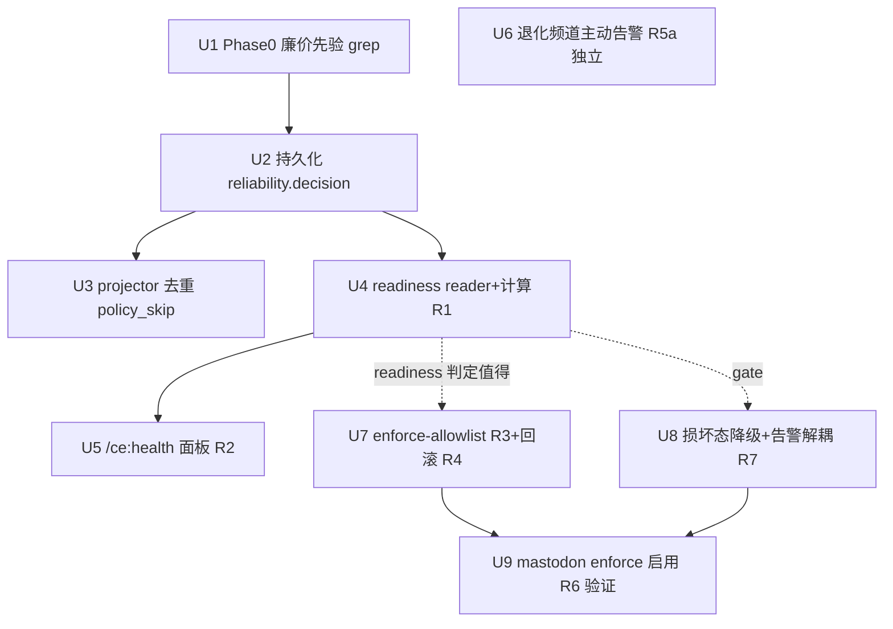

# feat: Reliability observe→enforce (measure-first thin slice)

## Overview

可靠性执行层（熔断、分类、metric、observe 模式）已建好，但 `RELIABILITY_POLICY_ENABLED` 停在
`observe`——从未真正攔过一次坏发佈。本计划**先用数据回答「enforce 值不值得开」**，再安全地对
**一条无-fallback 频道**翻 enforce。分三段交付：

- **Phase 0**：~1h 廉价先验（grep 现有 stderr 日志数 `would_skip_*` 数量级），决定要不要建持久化。
- **Phase A（无条件）**：把 observe 信号持久化进 `events.db`、per-channel 面板、退化频道**主动告警**
  （observe 也发，独立于 enforce 的保底收益）、用真实数据判 readiness。
- **Phase B（gated on Phase A 的 readiness 判定值得）**：per-channel enforce-allowlist + 损坏态降级
  + 一键回滚 + 对 mastodon 翻 enforce 取得「第一次被信任的拦截」。

承接 `docs/plans/2026-06-15-001-feat-publish-reliability-iteration-plan.md`（completed，提供 observe
模式、分类器、metric、recheck、selector-drift 检查）。

## Problem Frame

`would_skip_policy` / `would_skip_circuit` 事件目前只 `log.info` 到 stderr，**未进 `events.db`**
（`scorecard/success_rate.py:9-21` header 自证此缺口）。后果：(1) 量不出 enforce 的价值；(2) operator
对退化频道无主动感知，只能肉眼盯 run。主线 = **测量 → observe 期就先拿一个收益 → 用数据决定是否
enforce**，不预设 enforce 一定值得。见 origin：
`docs/brainstorms/2026-06-15-reliability-observe-to-enforce-hardening-requirements.md`。

> enforce 会引入一个 observe **没有**的灾难模式（损坏 state 档 → 静默全 skip），故 Phase B 必须先
> 解决它（Unit 8）。两条 origin Phase-B blocker 已在 brainstorm 定案并落为 Unit 8（损坏态降级 +
> 告警源解耦）。

## Requirements Trace

- **R0a**（Phase 0）：先 grep 现有日志得出 would-skip 数量级；近零则记录负结论、不建 R0。
- **R0**（Phase A）：把 observe `would_skip_*` 与 enforce `skipped_*` 决策持久化进 `events.db`，
  per-channel 可查询；**去重** `policy_skip→PUBLISH_FAILED` 的现存双计数。
- **R1**（Phase A）：用 R0 数据定义 per-channel enforce-readiness（框架 + 临时阈值 + 低流量质性降级
  + 预先承诺 kill 数字）。
- **R2**（Phase A）：`/ce:health` per-channel 面板：模式 / would-skip 次数 / readiness（源=events.db）。
- **R5a**（Phase A）：退化频道（ban / selector-drift / 熔断跳闸 / state 不可读）**主动外推告警**，
  observe 模式也发，独立于 enforce——本轮保底 operator 收益。
- **R3**（Phase B）：最小 enforce-allowlist，穿进 `publish_with_policy` 单一 chokepoint。
- **R4**（Phase B）：单一安全操作把频道切回 observe/off（可逆）。
- **R6**（Phase B）：首个 enforce 目标 = 无-fallback 频道；选 **mastodon**（唯一可产出 `skipped_policy`
  证据的无-fallback browser-tier 频道）。
- **R7**（Phase B）：enforce skip 响亮（走 R5a 外推，读 events.db 不读故障源）+ **损坏态降级**
  （Blocker 1）+ **告警源解耦**（Blocker 2）。

## Scope Boundaries

- 不新增平台 / adapter；不翻转 `dofollow="uncertain"` 频道；不碰 dedup gate（`DEDUP_ENFORCE`）。
- 不做统一 pooled HTTP client；Medium active probe 保持 OFF。
- enforce 是 operator 确认制，不自动翻转。不重设熔断阈值 / cooldown-only 恢复模型。
- **不在仓内造通知子系统**：R5a 仅向 `events.db` 写结构化事件 + 定义契约；实际推送在仓外 TG-bot 栈。
- **Deferred to follow-up（不在本轮）**：per-adapter 熔断（旧 R5/R6）、cross-mechanism fallback 白名单
  扩张（旧 R7/R8）、≥50% liveness cadence（旧 R8）、selector-drift 排程（旧 R9）。**注意**：一旦未来
  拉入「排程 recheck」，会触发 LITE 已记录的 R10 deferral（需补 per-probe wall-clock timeout）——
  见 `docs/solutions/architecture-patterns/2026-06-05-lite-accepted-deferrals.md`。

## Context & Research

### Relevant Code and Patterns

- **新 events.db kind（R0 模板）**：`events/kinds.py`（`KINDS` frozenset:82-105、`REQUIRED_FIELDS`:134-170、
  `STATUS_MAP`/`classify()`:222-271）；direct-append 范例 `referral/store.py::append_referral_observed`
  （由 `cli/referral_attribute.py:123,139` 调用，**绕过 projector/STATUS_MAP**，仅注册 KINDS+floor）；
  store `events/store.py::EventStore.append`（floor 检查 222-238，INSERT 列无 `platform` → 必须放 payload）。
- **policy 接缝（R3）**：`publishing/reliability/policy.py`——`policy_mode()`:109、`policy_enabled()`:133、
  `publish_with_policy(platform,...)`:191（`enforcing = policy_mode()=="enforce"`:225；健康闸门 235-256
  仅 browser-tier；熔断 260-269 全平台）。两个 dispatch 调用点：`cli/publish_backlinks/_engine.py:244-251`、
  `cli/_resume.py:324-331`；import 面 `cli/publish_backlinks/__init__.py:32`。
- **双计数源（R0 去重）**：enforce skip → `_engine.py:297-308` / `_resume.py:387-401` 写 checkpoint
  `POLICY_SKIP`（`checkpoint.py:67`）→ `events/_project_reducers.py::_handle_checkpoint_failed`:285-325
  读 `error_class` 并 `append(PUBLISH_FAILED, {platform: item.adapter, ...})` → `success_rate.py:40`
  当 failure 计。
- **observe 信号源（R0）**：`publishing/reliability/events.py::emit_attempt`:38（仅 `_log.info`/stderr）；
  `Outcome` enum 已含 `WOULD_SKIP_POLICY`:34 / `WOULD_SKIP_CIRCUIT`:35。**enforce skip 无 Outcome**——是
  `publish_with_policy` 早返回的 `AdapterResult(status="skipped_*")`（policy.py:245-251,261-267）。
- **面板（R2）**：`scorecard/success_rate.py::publish_success_rate`:76（按 `payload.platform` 分组:106、
  `small_sample` flag:126）；`scorecard/engine.py::build_channel_scorecard`:114（已 union referral 频道:135
  作为「新增 per-channel 信号轴」先例）；`webui_app/routes/health.py`——`/ce:health` 仪表板 368-526
  （`_scorecard_rows` 卡 456-471）、JSON `ce_health_publish_metrics`:55-77、`/health` 机器 JSON 529-542。
- **无-fallback 判定（R6）**：`registry.py`（`RegistryEntry.publishers`:127、`registered_platforms()`:449；
  无-fallback = `len(publishers)==1`，共 20 频道）；`_BROWSER_TIER={medium,velog,devto,mastodon}`
  （policy.py:56）。**交集 = {mastodon}**——唯一无-fallback 且能产出 `skipped_policy` 的频道。
- **损坏态（U8）**：`circuit.py::_get_state`:176-205（任何读异常 → `tripped=True, tripped_at_iso=None`）、
  `is_tripped`:213-262（无时间戳 → 永久 True、无 cooldown 自恢复）；state 是**单一共享档**
  `publish-circuit-state.json` → 一次 parse 错误让所有平台一起 trip。flock 跨进程模式见同文件。

### Institutional Learnings

- `docs/solutions/logic-errors/projector-silent-drop-status-vocabulary-drift-2026-05-26.md` —
  新 kind 必须经分类器、不可裸字符串；未识别状态 → **QUARANTINE 不静默丢**；**WAL 嵌套连接死锁**：
  不要在打开的 reducer/事务里写 reliability 事件 → 故 R0 在 dispatch 接缝直写、U3 仅在 reducer 做**抑制**
  （不新写）。
- `docs/solutions/logic-errors/2026-06-05-001-live-dofollow-undercounting-triple-gap.md` —
  事件发出 ≠ DB 落库：测试须断言 **DB 行**变化，不只断言 emit；`build_ledger` 读注入 history 非 SQLite。
- `docs/solutions/correctness/adapter-silent-exceptions-resolution.md` — 持久化路径**不得** `except: pass`，
  保留 `raise ... from exc`。
- `docs/solutions/best-practices/typed-error-envelope-over-stderr-truncation-2026-05-27.md` —
  告警/外推按 `error_class` 经 envelope chokepoint 分支，不 substring-sniff stderr。
- `docs/solutions/best-practices/medium-liveness-probe-partial-spike-2-2026-05-19.md` /
  `playwright-framenavigated-orphaned-during-cross-origin-sso-2026-05-19.md` — recheck/选择器漂移须靠
  wall-clock + URL/选择器正向匹配，非 `framenavigated`；automated probe 须限速（IP 信誉耦合）。**（仅
  在 follow-up cadence 工作拉入时相关。）**
- `docs/solutions/test-failures/ci-test-isolation-failures-medium-brave-sleep-timeout-2026-05-13.md` —
  fallback 链测试须 mock 每一层 + module-level `time.sleep`（本轮 enforce dispatch 测试相关）。

## Key Technical Decisions

- **单一新 kind `reliability.decision`，direct-append**（非复用 `emit_attempt`）：payload 带
  `{platform, decision, mode, reason}`，一个 KINDS 条目 + 一个 REQUIRED_FIELDS floor
  `{platform, decision}`，最省 CI 摩擦。理由：`emit_attempt` 是 logger-only 且被 `success_rate.py`
  明确拒为「不可查询」；新增 kind 是仓内成熟配方（referral.observed 先例）。
  - `decision` 词表（明确映射，避免 catch-all）：4 个 seam 分支
    `would_skip_policy` / `would_skip_circuit` / `skipped_policy` / `skipped_circuit_open`（1:1 对应
    `publish_with_policy` 的 observe/enforce 分支）；`circuit_state_unreadable`（U8 损坏哨兵）；
    `degraded`（U6 退化态转移：熔断跳闸 / ban；**本轮不含 selector-drift**，见 U6）。
  - `mode` 字段 = `policy_mode()`（`observe`/`enforce`），**不是** `publish_with_policy` 的 `mode`
    参数（draft/publish）——避免下游 readiness/alert 消费者歧义。
  - **值合法性校验在 helper 层**：`EventStore.append` 的 floor 只查 key **存在**，不查值；故 helper 写入前
    须对 `decision` 做 frozenset 成员校验，未知值走 quarantine/拒绝（否则 typo 会写成合法行污染 U4/U6）。
- **测量-翻转 stop-gate（防「建了就硬开」）**：两道显式闸门——(1) U1 若 no-go（would-skip 数量级近零）
  → 停建 R0/Phase A 的测量链（U2-U5），仅 U6（R5a）可作为独立特性继续；(2) U4 readiness 若判「不值得」
  （含 kill 数字触发的负结论）→ **不建 Phase B（U7/U8/U9）**，Phase A 的 R5a 即为已兑现收益。
  U7/U8/U9 在 U4 判「值得」前**不编码**（U8 虽是 enforce 前置 blocker，但前置于「enforce 上线」而非
  前置于「U4 判定」——勿在 U4 verdict 前抢建）。
- **在 dispatch 接缝直写、在 projector 仅抑制**：observe would-skips 在 `publish_with_policy` 的
  `emit_attempt` 旁直写；enforce skips 在 `AdapterResult(status="skipped_*")` 返回旁直写。projector 的
  `_handle_checkpoint_failed` 对 `error_class==POLICY_SKIP` 路由为 **NO_EMIT**（不再 `PUBLISH_FAILED`），
  消除双计数。reducer 内**不新写**任何事件 → 规避 WAL 嵌套连接死锁。
- **allowlist 在 chokepoint 解析**：`enforcing = (policy_mode()=="enforce") and (platform in
  enforce_allowlist())`，仅改 `publish_with_policy`；两个 dispatch 调用点（只 gate 在 `policy_enabled()`，
  observe/enforce 都 True）不动。
- **损坏态降级（Blocker 1）**：区分「有效 OPEN 跳闸（有 `tripped_at_iso`）→ skip」与「损坏哨兵
  （`tripped=True` 且无 `tripped_at_iso`，或读取抛异常）→ enforce 下降级回 observe（照发一次）+ 发
  `circuit_state_unreadable` 响亮事件」。observe 行为不变。下行有界、自愈，胜过无界静默全停。
- **告警源解耦（Blocker 2）**：R5a 告警一律读 `events.db` 里 dispatch 接缝写入的 `reliability.decision`
  事件，不即时重读可能损坏的 `circuit-state.json`。
- **首个 enforce 目标 = mastodon**：唯一无-fallback 且 browser-tier → 可产出 `skipped_policy` 证据；
  per-platform 熔断本就诚实，无需 per-adapter 改造。其胜利只验证 rollout 机制，不泛化到 fallback 频道。
- **R5a 自然去重**：仅在频道**进入**退化态时发一次事件（非每 run 重发），源头去重；外部栈管投递/ack。

## Open Questions

### Resolved During Planning

- 用一个 kind 还是多个？→ **一个 `reliability.decision`**（discriminator 在 payload）；最省 CI 摩擦。
- 持久化在哪个接缝？→ **dispatch 接缝直写 + projector 抑制**；规避 WAL 死锁、覆盖 observe+enforce 两类。
- 首个 enforce 目标？→ **mastodon**（gate 可达性 + 无-fallback）。
- 损坏态 / 告警解耦？→ 已定案（见 Key Decisions / Unit 8）。
- 是否做 cadence / selector-drift 排程 / per-adapter 熔断 / 白名单扩张？→ **不做，follow-up**（见 Scope）。

### Deferred to Implementation

- `enforce_allowlist()` 落地形式（`config.toml` 字段 vs env 前缀）+ 是否需跨进程 flock（参考 circuit.py
  flock 范式；若 config.toml 则随进程加载，env 则进程级）。（Affects U7）
- R1 临时阈值具体数值（建议占位：≥30 observed attempts **且** ≥7 天 observe；would-skip 率容忍区间；
  **kill 数字**——窗口内 would-skip 率低于此即接受负结论不 enforce）——待 R0 数据校准。（Affects U4）
- `reliability.decision` 是否要进 `test_events_r8_gates.py::WRITER_MODULES` 白名单（新 writer module 时）。（U2）
- R5a「degraded」判定的精确触发集（ban / selector-drift / 熔断跳闸 / unreadable）与外部 TG-bot 的 event→push
  契约字段。（Affects U6）
- 是否回填历史 would-skip（从既有 stderr 日志）——否则 R1/R2 上线后等 ≥7 天才有数据。（Affects U4/U6）

## High-Level Technical Design

> *以下说明意图与方向，供 review 验证，非实作规格；实作 agent 视为脉络而非可照抄的代码。*

**一个接缝的两端（R0 核心）**——决策在 dispatch 处产生、在 projector 处会二次物化：

```
publish_with_policy(platform)                         events/_project_reducers.py
  ├─ observe: would_skip_* ──┐                          checkpoint "failed"
  │   (emit_attempt 旁)       │ direct-append             + error_class==POLICY_SKIP
  ├─ enforce: skipped_* ──────┼─► events.db                      │
  │   (AdapterResult 返回旁)   │   reliability.decision           ├─ 旧: → PUBLISH_FAILED ❌(双计数)
  └─ 损坏哨兵: circuit_state_  │   {platform,decision,mode}       └─ 新(U3): → NO_EMIT ✅(抑制)
       unreadable ────────────┘
                                          ▲
   R2 面板 / R1 readiness / R5a 告警 ──────┘  (全部只读 events.db，不读 circuit-state.json)
```

**单元依赖图**：



## Implementation Units

> **执行状态（2026-06-15，branch `feat/reliability-observe-enforce`，PR #8）**：
> **Phase A + Phase B 机器均已落地**（U1–U9 实作 + 测试 + 两轮 code-review）。
> Phase B **ships safe/empty**：enforce-allowlist 默认空 → enforce 不 skip 任何频道（零生产行为变化）。
> **唯一未做 = 真正翻 enforce 上某个生产频道**——operator-gated on observe 数据（U4 判
> `enforce_worthwhile`）。启用步骤见 `docs/runbooks/2026-06-15-reliability-enforce-rollout.md`。
> 全测试套件 10972 passed（唯一失败为 base 既存、与本工作无关的 parked-plan 003 status 测试）。

### Phase 0 — 廉价先验

- [x] **Unit 1: would-skip 数量级先验（grep，go/no-go gate）**

**Goal:** 从既有 stderr / WebUI 捕获日志数 `would_skip_policy` / `would_skip_circuit` 出现次数与
per-channel 分布，得出「enforce 本来会触发几次」的数量级；近零则记录负结论、停止建 R0。

**Requirements:** R0a

**Dependencies:** None

**Files:**
- 调查产出（无生产代码）：在 plan 附记或 `docs/diagnostics/` 记录结果数字 + go/no-go。

**Approach:**
- grep `publish_attempt` 行里 `outcome=would_skip_*` 的历史（WebUI subprocess 捕获的 stderr / 既有日志）；
  按 platform 聚合；给出窗口内总次数与 top 频道。
- 判据：若窗口内 would-skip 总次数足以让「持久化 + readiness」有意义则进 Phase A；否则记录负结论
  （Phase A 的 R5a 仍可独立做，因其不依赖 would-skip 持久化）。
- **stop-gate（显式）**：no-go → 不建 R0/U2-U5、不建 Phase B；仅 U6（R5a）可作为独立特性继续。go → 进 Phase A。
- **捕获完整性交叉校验**：would-skip 仅在 WebUI subprocess 捕获的 stderr 里；若日志已轮转/截断/observe 期
  未启用捕获，可能得到**假近零**。先确认捕获窗口覆盖 observe 期再下 no-go 结论（避免被测量假象误杀全计划）。

**Execution note:** 纯调查，不写生产代码。

**Test scenarios:** Test expectation: none — 调查单元，无行为变更。

**Verification:** 产出一个可复现的 grep 口径 + 数量级结论 + 明确 go/no-go。

### Phase A — 测量 + observe 期收益（无条件）

- [x] **Unit 2: 持久化 reliability.decision 进 events.db（dispatch 接缝直写）**

**Goal:** 新增 `reliability.decision` kind，在 `publish_with_policy` 把 observe would-skips 与 enforce
skips（含 U8 的 `circuit_state_unreadable`）直写 events.db，per-channel 可查询。

**Requirements:** R0

**Dependencies:** Unit 1（go）

**Files:**
- Modify: `src/backlink_publisher/events/kinds.py`（注册 `RELIABILITY_DECISION="reliability.decision"`
  入 `KINDS` + `REQUIRED_FIELDS` floor `{"platform","decision"}`）
- Create: `src/backlink_publisher/publishing/reliability/events_store.py`（direct-append helper，镜像
  `referral/store.py::append_referral_observed`）
- Modify: `src/backlink_publisher/publishing/reliability/policy.py`（在 would-skip 与 skip 接缝调用 helper）
- Test: `tests/test_reliability_decision_events.py`

**Approach:**
- 镜像 referral direct-append：helper 构造 payload `{platform, decision, mode, reason}`，
  `EventStore().append(RELIABILITY_DECISION, payload, ...)`；**不**经 projector/STATUS_MAP。
- 在 `publish_with_policy` 的四个决策点直写：observe would_skip_policy（235-256 旁）、observe
  would_skip_circuit（260-269 旁）、enforce skipped_policy / skipped_circuit_open（早返回旁，
  在 `publish_with_policy` **内**——确认该 emit 在早返回**之前**执行，否则被 return 跳过）。
- helper 内对 `decision` 做 frozenset 成员校验（floor 只查 key 存在、不查值）；`mode` 取 `policy_mode()`
  （非函数的 draft/publish `mode` 参数）。把这 4 个直写抽成 `_record_decision(...)` 小 helper（控 CC，见 U7）。
- **不在 reducer/事务内写**（规避 WAL 死锁）；持久化路径**不得** `except: pass`——失败要 log。

**Execution note:** 先写一个断言 **DB 行**出现的失败测试（非仅断言函数被调），契合 triple-gap 学习。

**Patterns to follow:** `referral/store.py::append_referral_observed`；`kinds.py` REFERRAL_OBSERVED 注册 +
docstring「direct-append, no STATUS_MAP」；`events/store.py::append` floor 契约。

**Test scenarios:**
- Happy path：observe 模式一次 would_skip_policy → events.db 出现一行 `reliability.decision`，
  `payload.platform`/`decision`/`mode="observe"` 正确（**查 SQLite 行，非仅 emit**）。
- Happy path：enforce 模式一次 skipped_circuit_open → 持久化一行，`decision="skipped_circuit_open"`。
- Edge case：缺 `platform`/`decision` 的 payload → floor 拒绝（`append` 返回 -1 + quarantine），不写脏行。
- Edge case：未识别 `decision` 值 → QUARANTINE 路径，不静默丢（projector-silent-drop 学习）。
- Error path：append 抛异常 → 被 log（非 `except: pass`），不中断发佈主流程。
- Integration：CI 门 `tests/test_events_r9_required_fields.py`（`set(REQUIRED_FIELDS)==set(KINDS)`）与
  `test_events_r8_gates.py`（kind 常量已注册）通过。

**Verification:** observe/enforce 各类决策都在 events.db 留下可按 platform 查询的行；CI kind 门绿；
持久化失败有日志且不影响发佈。

- [x] **Unit 3: projector 去重——`policy_skip` 不再投影成 PUBLISH_FAILED**

**Goal:** 消除 enforce skip 的双计数：checkpoint `failed` + `error_class==POLICY_SKIP` 在 reducer 路由为
NO_EMIT（skip 已由 Unit 2 在 dispatch 接缝记录）。

**Requirements:** R0

**Dependencies:** Unit 2

**Files:**
- Modify: `src/backlink_publisher/events/_project_reducers.py`（`_handle_checkpoint_failed` 285-325：
  `error_class==checkpoint.POLICY_SKIP` → NO_EMIT 分支）
- Test: `tests/test_project_reducers.py`（或既有 projector 测试文件）

**Approach:**
- 在 `_handle_checkpoint_failed` 读到 `error_class==POLICY_SKIP` 时**跳过 append**（reducer 内部控制流，
  非 classify 的输出态——`classify("checkpoint","failed")` 仍返回 `"publish.failed"`，我们在 post-classify
  阶段据 `error_class` 决定不物化）。**不改 STATUS_MAP / classify**（`test_events_kind_contract_gate.py:25`
  钉死 `("checkpoint","failed")→"publish.failed"`）。
- **单一 chokepoint 覆盖两条 dispatch 路径**：enforce skip 在 `_engine.py:301-308`（fresh）与
  `_resume.py:393-401`（resume）都写 checkpoint `failed` + `error_class=POLICY_SKIP`，二者都流经**同一个**
  `_handle_checkpoint_failed`——故 reducer 抑制天然覆盖两路。**U2 的 dispatch-seam 直写（在
  `publish_with_policy` 内，两 caller 都经过）是该 skip 的唯一真相源**；caller 的 checkpoint 仅供
  dedup-row / exit-code，reducer 的抑制是 load-bearing 而非装饰。
- ⚠️ `_project_reducers.py` 仅 27 SLOC headroom（ceiling 620 / 当前 593）→ 若超须**同 PR** bump
  `monolith_budget.toml` 并写 ≥80 字 rationale；优先用最小分支/抽小函数控制行数。

**Execution note:** 先写失败测试：一个 `policy_skip` checkpoint-failed 项**不**产生 PUBLISH_FAILED 行。

**Patterns to follow:** `_project_reducers.py` 既有 NO_EMIT 返回；`kinds.classify` 三态
（kind|NO_EMIT|QUARANTINE）。

**Test scenarios:**
- Happy path：checkpoint failed + `error_class=policy_skip` → 无 PUBLISH_FAILED 行（NO_EMIT）。
- Regression：checkpoint failed + `error_class!=policy_skip`（如 `unexpected`）→ 仍投影 PUBLISH_FAILED（不误伤）。
- Integration（**fresh dispatch**，`_engine`）：一次 enforce skip 端到端 → events.db 恰一行
  `reliability.decision`、零 `publish.failed`；`success_rate.py` failure 计数不含该 skip。
- Integration（**resume**，`_resume`）：同上断言（per-path presence/absence——防只覆盖一条路径的复发 bug 家族）。
- Edge case：classify 层 `("checkpoint","failed")→"publish.failed"` 契约门仍绿（未动 STATUS_MAP）。

**Verification:** enforce skip 在 events.db 只计一次（reliability.decision），不再污染 `success_rate`
的 failure 分母；非-policy_skip 失败行为不变。

- [x] **Unit 4: per-channel readiness reader + 计算（R1）**

**Goal:** 一个 readiness reader，**join 两个数据源**得出 per-channel enforce-readiness 三态判定。

**Requirements:** R1

**Dependencies:** Unit 2（would_skip 行），以及既有 `publish.*` 事件（分母，已存在）

**Files:**
- Create: `src/backlink_publisher/scorecard/reliability_readiness.py`（reader + readiness 计算）
- Test: `tests/test_reliability_readiness.py`

**Approach:**
- ⚠️ **两个数据源必须 join**（adversarial 校验）：`would_skip_*` 只在「闸门**会** trip」的分支才写
  `reliability.decision` 行——**干净 dispatch 不写任何 reliability 行**。故 `would_skip_count` 来自
  Unit 2 的 `reliability.decision`，而**尝试分母**只能来自 `publish.*` kinds
  （`success_rate.py` 的 `_ALL_KINDS`：confirmed/unverified/failed），二者按 platform join。
  `would_skip_rate = would_skip_count / total_attempts`。明确标注哪个事件家族供哪一项。
- **三态判定（非二元 ready/kill——后者会把「安全」与「无意义」混为一谈）**：
  - `insufficient_data`：`total_attempts<=small_sample_max(4)` 或 `days_observed<7` → 退化为 operator 质性判断。
  - `enforce_pointless`：窗口足够但 `would_skip_count≈0`（低于 kill 阈值）→ **负结论**「几乎不触发、不值得 enforce」。
  - `enforce_worthwhile`：窗口足够且 would_skip 存在 → enforce 会正确 skip 发往已跳闸/未绑定频道的徒劳尝试。
- 临时阈值占位（deferred 校准）：`days_observed>=7`、`small_sample_max=4`、kill 阈值——待 R0 数据校准。

**Execution note:** 用注入的 store/now 做确定性测试（勿依赖 wall-clock）。

**Patterns to follow:** `success_rate.py`（窗口、`small_sample_max=4`、payload 分组、`now` 注入、`_ALL_KINDS`）。

**Test scenarios:**
- Happy path：某频道 100 `publish.*` attempts + 12 行 would-skip / 9 天 → `enforce_worthwhile`，
  rate=12/100 正确（**分母来自 publish.\*，非 reliability 行数**）。
- Edge case（区分关键）：100 attempts + **0** would-skip / 9 天 → `enforce_pointless`（负结论），
  **不**与「安全」混淆。
- Edge case：attempts<=4 → `small_sample=True`、`insufficient_data`，不除零。
- Edge case：days_observed<7 但 attempts 高 → `insufficient_data`。
- Edge case：某频道只有 would-skip 行、零 publish.* 行（分母缺）→ `insufficient_data`，不把 rate 当 ∞/100%。
- Integration：Unit 2 的 `reliability.decision` 行 + 既有 `publish.*` 行一起喂入 → 三态与原始计数一致。

**Verification:** readiness 由两源 join 得出；三态明确区分「值得 / 无意义（负结论）/ 数据不足」；分母取自
`publish.*` 而非 reliability 行数；低流量退化为质性。

- [x] **Unit 5: `/ce:health` rollout 面板（R2）**

**Goal:** 在 `/ce:health` 加一张 per-channel 卡：当前模式 / observe 期 would-skip 次数 / readiness 状态，
数据源 = events.db（Unit 2/4）。

**Requirements:** R2

**Dependencies:** Unit 4

**Files:**
- Modify: `webui_app/routes/health.py`（新 `_g_cache` 卡，挨着 `_scorecard_rows` 456-471；JSON twin 入
  `ce_health_publish_metrics` 55-77）
- Test: `tests/test_webui_health_routes.py`（或既有 health 路由测试）

**Approach:**
- 新卡读 Unit 4 的 readiness reader；fail-open（`except → return []/{}`，与既有卡一致，勿 500 仪表板）。
- 当前模式来自 `policy_mode()` + `enforce_allowlist()`（per-channel：off/observe/enforce）。
- ⚠️ `health.py` ceiling 400 / 当前 367（33 headroom）；新卡 ~15-20 行可容但紧——超则同 PR bump + rationale。

**Execution note:** none（UI 卡）；但断言 JSON twin 字段，避免只测 HTML。

**Patterns to follow:** `health.py` `_scorecard_rows` 卡 + `ce_health_publish_metrics` JSON；fail-open 契约。

**Test scenarios:**
- Happy path：`/api/...health` JSON 含 per-channel `{mode, would_skip_count, readiness}`。
- Edge case：reader 抛异常 → 卡 fail-open 返回空，仪表板仍 200（不 500）。
- Edge case：某频道无数据 → 显示 observe / insufficient，不崩。
- Integration：Unit 2 写入后，面板数字与 events.db 查询一致。

**Verification:** operator 能在 `/ce:health` per-channel 看到模式 + would-skip 次数 + readiness；数据来自
events.db 非日志；reader 故障不拖垮仪表板。

- [x] **Unit 6: 退化频道主动告警（R5a，observe 期保底收益，独立于 enforce）**

**Goal:** 频道进入退化态时向 events.db 写一条 alert-worthy `reliability.decision`，供仓外 TG-bot 主动外推；
observe 模式也发。

**Requirements:** R5a

**Dependencies:** Unit 2（kind + helper）

**触发集（本轮，仅 seam 可达者）：** 熔断跳闸（`circuit.py::trip` / `trip_on_error`）、**ban**
（`auth_banned`，`policy.py:292` 经 emit_attempt 可达）、`circuit_state_unreadable`（配合 Unit 8）。
⚠️ **selector-drift 不在本轮**——其检测机制本身是 deferred R9（seam 不存在），列入则是「in-scope 依赖
deferred 项」的 scope-creep（scope-guardian 校验）。selector-drift 告警随 R9 follow-up。

**Files:**
- Modify: `src/backlink_publisher/publishing/reliability/events_store.py`（degraded/unreadable 写入）
- Modify: 退化信号产生处（`circuit.py` trip 站点、`policy.py` 的 ban 路径、Unit 8 的 unreadable 分支）调用 helper
- Test: `tests/test_reliability_degraded_alert.py`
- Doc: `docs/runbooks/`（event→TG-bot push 契约：哪些 decision 触发、字段、去重语义）

**Approach:**
- **在退化发生的当下同步写**（非「下次 dispatch 才补」）：trip / ban 都发生在某次 dispatch 的异常路径内，
  故在 `trip()`/ban 记录的同一时刻直写 degraded 事件——进入退化态无 dispatch-cadence 延迟。
  （恢复态可较 lazy，恢复告警不紧急。）
- **转移去重（读 events.db，不新建 state 档）**：写前查该 platform 最近一条 `reliability.decision`
  （degraded/recovered），若已 degraded 同因则不重写——与「全部读 events.db」原则一致，零新状态文件。
- 仓内只写结构化事件 + 文档化契约；实际投递/ack 在仓外栈。告警按 `decision` 分支，不 substring-sniff
  （typed-error-envelope 学习）。不引入 `except: pass`（adapter-silent-exceptions 学习）。

**Execution note:** 断言 DB 行 + 转移去重（连续两 run 退化只一行）。

**Patterns to follow:** Unit 2 helper；`circuit.py::trip` 既有 `circuit_tripped` 日志位置；`policy.py:292`
auth_banned 路径。

**Test scenarios:**
- Happy path：频道首次跳闸 → 同步写一行 `decision="degraded"`（platform/reason="circuit_trip"）。
- Happy path：ban（auth_banned）→ 一行 `decision="degraded"`（reason="ban"）。
- Edge case（去重）：连续两 run 仍 degraded 同因 → 仅第一次写；恢复后再退化 → 再写一次。
- Edge case：state 不可读 → `decision="circuit_state_unreadable"`（配合 Unit 8）。
- Error path：写入失败被 log，不影响发佈/recheck 主流程。
- Integration：observe 模式下 trip/ban 也产出事件（不依赖 enforce）。

**Verification:** 退化频道在 observe 模式即在退化当下产出可外推事件；转移去重靠 events.db 查询；selector-drift
明确不在本轮；即便走负结论路径，这条收益独立成立。

### Phase B — enforce 翻转（gated on Unit 4 readiness 判定值得）

- [x] **Unit 7: per-channel enforce-allowlist + 一键回滚（R3, R4）**

**Goal:** 引入最小 enforce-allowlist，穿进 `publish_with_policy` 单一 chokepoint；提供单一安全操作切回
observe/off。

**Requirements:** R3, R4

**Dependencies:** Unit 4（readiness 判定值得才进 Phase B）

**Files:**
- Modify: `src/backlink_publisher/publishing/reliability/policy.py`（`enforce_allowlist()` + `enforcing =
  policy_mode()=="enforce" and platform in enforce_allowlist()`）
- Modify: 配置载入处（`config` 模块 / env 读取——形式 deferred）
- Test: `tests/test_reliability_policy_allowlist.py`

**Approach:**
- 仅改 `publish_with_policy`；`policy_enabled()` 与两个 dispatch 调用点不动（它们 gate 在
  observe-or-enforce）。
- allowlist 源（config.toml 字段 vs env 前缀）+ 是否需跨进程 flock（参考 circuit.py flock）——deferred，
  但 **R4「单一安全操作」对此有约束**：env 前缀是**进程级**（长驻 WebUI/daemon 改了要重启才生效 →
  不满足「单一安全操作」）；config.toml 每次 CLI 进程重读、或一个 flock'd allowlist store 才能让回滚
  对长驻进程即时生效。**倾向 config.toml 字段或 flock'd store**，而非纯 env。
- 回滚 = 从 allowlist 移除该频道（单一操作）；移除后该频道立即回 observe（仍持续测量）。

**Execution note:** 若 allowlist 读取下沉到 `_publish_one_row` 会撞 CC ceiling 35——**保持在
`publish_with_policy`**（无 CC 预算）。但注意 **U2+U7+U8 三个单元都往 `publish_with_policy` 加分支**
（当前 CC 12，未列预算者受全局 backstop CC 30 约束）：把 U2 的 4 个直写点与 U8 的损坏态判别抽成小私有
helper（如 `_record_decision(...)` / `_resolve_circuit_action(...)`），避免 `publish_with_policy` 越过
CC 30；若越过须同 PR 加 `complexity_budget.toml` 条目 + ≥80 字 rationale。

**Patterns to follow:** `policy.py::policy_mode/policy_enabled`；config 读取既有范式。

**Test scenarios:**
- Happy path：platform 在 allowlist + mode=enforce → `enforcing=True`，命中闸门即 skip。
- Happy path：platform 不在 allowlist + mode=enforce → `enforcing=False`，照发（仍 observe 记录）。
- Edge case：allowlist 空 → 全部等价 observe（无频道被 enforce）。
- Edge case（回滚）：从 allowlist 移除 → 该频道下次 dispatch 即不再 skip。
- Edge case：mode=observe 但 platform 在 allowlist → 不 enforce（mode 优先）。
- Integration（fallback 链）：mock 全部 adapter 层 + module-level `time.sleep`（medium-brave 学习），
  确认 enforce 决策不破坏 fallback 语义。

**Verification:** enforce 可逐频道开/关；非 allowlist 频道行为不变；回滚是单一安全操作。

- [x] **Unit 8: 损坏态降级 + 告警源解耦（R7 / Blocker 1+2）**

**Goal:** enforce 下区分「有效 OPEN 跳闸（skip）」与「损坏哨兵（降级回 observe + 响亮事件）」；告警一律
读 events.db，不读 circuit-state.json。

**Requirements:** R7

**Dependencies:** Unit 2（kind）。**仅在 U4 判「值得」后编码**（与 U7 同属 Phase B）；U8 是
「enforce **上线**（U9）」的前置 blocker，**不是**「U4 判定」的前置——勿在 U4 verdict 前抢建。

**Files:**
- Modify: `src/backlink_publisher/publishing/reliability/circuit.py`（暴露「unreadable」与「valid-OPEN」的
  区分信号：损坏哨兵 = `tripped=True` 且 `tripped_at_iso is None` 或 `_get_state` 读取异常）
- Modify: `src/backlink_publisher/publishing/reliability/policy.py`（enforce 熔断分支：unreadable →
  不 skip，降级回 observe-dispatch + 写 `circuit_state_unreadable`）
- Test: `tests/test_circuit_corrupt_state.py`, `tests/test_reliability_policy_observe.py`（扩展）

**Approach:**
- circuit 层加 `circuit_status(platform)` 返回**枚举全态**，policy 据此分支（而非把 unreadable 混入
  `is_tripped=True` 的布尔）。**判别须 key 在 file-level parse 失败**（整档读/解析抛异常 →
  `unreadable`），**不要**用「per-entry `tripped=True` 且 `tripped_at_iso is None`」当损坏哨兵——后者可能
  是合法但畸形/手改/legacy 条目，不等于档损坏（adversarial 校验）。状态映射（enforce 下）：
  - `open`（`tripped=True` + 有效 `tripped_at_iso`，cooldown 未到）→ **skip**（语义不变）。
  - `half_open` / `closed` → 照常 dispatch。
  - `open_no_timestamp`（解析成功但条目缺时间戳，异常）→ 保守按 `unreadable` 处理（降级 + 告警），勿静默 skip。
  - `unreadable`（整档解析失败）→ **降级回 observe（照发一次）+ 写 `circuit_state_unreadable`**。
- **observe 模式行为完全不变**（今天 observe 遇损坏也照发，不新增 skip）。
- 告警/响亮**只读 events.db**（Unit 6 消费），不重读 circuit-state.json → 故障源损坏不致告警变哑。
- **「自愈」的准确语义**：降级-照发的那次尝试，其结果会触发 `record_success`/`trip_on_error`/`reset` 的
  `atomic_write_json`（写路径捕获 JSONDecodeError、从 `{}` 重建）→ **下一次 state 写即覆盖损坏档**，
  故有界（约每频道一次尝试后即愈）。**已知副作用**：heal-write 从 `{}` 重建只含被写频道，可能清掉其他
  频道的合法 trip 态——损坏事件罕见，接受此代价。

**Execution note:** 先写失败测试：enforce + 整档损坏 → 发佈**照发**（不 skip）+ 一行 `circuit_state_unreadable`。

**Patterns to follow:** `circuit.py` `_get_state`/`is_tripped`（`is_tripped` 可保留为 fail-closed 布尔
back-compat wrapper）；`atomic_write_json` 写路径的 JSONDecodeError 容错；flock 范式。

**Test scenarios:**
- Happy path：enforce + 有效 OPEN（有时间戳）→ skip（不变）。
- Happy path：enforce + 整档损坏（坏 JSON）→ **不 skip、照发一次** + 一行 `circuit_state_unreadable`。
- Edge case：损坏档影响多频道 → 每个 allowlist 频道各降级 + 各发一条（非静默全停）。
- Edge case（畸形非损坏）：解析成功但某频道 `tripped=True` 无时间戳 → 按 unreadable 保守降级，不静默 skip。
- Edge case：`half_open` 无时间戳 → 照常 dispatch（不误判为损坏）。
- Edge case：observe + 损坏档 → 行为与今天一致（照发、不新增 skip）。
- Edge case（自愈）：损坏后那次降级-照发的结果写 state → 下次读到有效档、恢复 skip 语义。
- Integration（解耦）：circuit-state.json 损坏时，Unit 6 告警仍从 events.db 产出（不读故障源）。

**Verification:** 损坏不再让 enforce 静默全停；判别 key 在 file-level parse；全态枚举无漏（含 half_open/
open_no_timestamp）；降级有界且经 heal-write 自愈；告警与故障源解耦；observe 不变。

- [x] **Unit 9: 对 mastodon 启用 enforce（R6，gated 里程碑 + 验证）** — 接线 acceptance 已建；真正启用 operator-gated

**Goal:** 在 Unit 4 readiness 判定 mastodon 值得后，把它加入 enforce-allowlist，验证「第一次被信任的拦截」
由**自然发生**的 trip 满足。

**Requirements:** R6, R7

**Dependencies:** Unit 7, Unit 8（+ Unit 4 readiness=值得）

**Files:**
- Config: 把 `mastodon` 加入 enforce-allowlist（运行时配置，非代码逻辑）
- Test: `tests/test_enforce_mastodon_seam.py`（seam 验证，用 stub）
- Doc: `docs/runbooks/`（启用/回滚 mastodon enforce 的 operator 步骤 + 真实性条款）

**Approach:**
- 选 mastodon（唯一无-fallback browser-tier → 可产出 `skipped_policy` 证据）。
- **真实性条款**：价值判据须由生产中**自然 trip**（真实连续错误/ban/session 过期）满足；fault-injected
  `circuit.trip()` 只作 acceptance 接线测试，不计入价值判据。
- **可证伪边界（关键——否则「done」吊在不可验证的生产事件上）**：
  - **唯一可 CI-gate 的工件 = 接线 acceptance 测试**（stub 注入一次 skipped_policy）。「done」以它为准。
  - 价值判据 = **运营观察**，非代码交付物。设一个有界观察窗（如 mastodon enforce 后 N 天/runs）；
    窗内若**无自然 trip** → 记录**负价值结论**「机器已验证但从未被触发」，按 R4 保持 parked-in-enforce
    或回滚。避免无界等待。
- 局限声明：mastodon 胜利只验证 rollout 机制，不泛化到 fallback 频道（Medium，follow-up）。

**Execution note:** seam 测试用 stub 注入一次 skipped_policy 路径验证端到端（接线）；价值判据靠生产观察。

**Patterns to follow:** `policy.py` browser-tier 健康闸门；Unit 2/6 的事件+告警。

**Test scenarios:**
- Integration（接线）：mastodon 在 allowlist + 健康闸门命中（stub）→ `skipped_policy` 早返回 + 一行
  `reliability.decision(decision=skipped_policy)` + Unit 6 告警产出。
- Edge case：mastodon 不在 allowlist → 不 skip（回滚验证）。
- Edge case：非 browser-tier 频道即便在 allowlist 也只可能 `skipped_circuit_open`（gate 可达性）。
- Verification（真实性）：fault-injected trip 标记为 acceptance-only，不计入价值判据（文档 + 测试注释）。

**Verification:** mastodon 可受控 enforce + 一键回滚；接线端到端可证；价值判据明确要求自然 trip；局限声明在案。

## System-Wide Impact

- **Interaction graph:** Unit 2 在 `publish_with_policy` 增写 events.db，被 publish CLI（`_engine`）、resume
  （`_resume`）两路触发；Unit 3 改 projector（checkpoint→events）；Unit 4/5 读 events.db 喂 `/ce:health`；
  Unit 6 告警被仓外 TG-bot 消费；Unit 7/8 改 enforce 决策路径。
- **Error propagation:** 持久化/告警失败必须 log 且不中断发佈（never `except: pass`）；enforce skip 仍走
  typed `AdapterResult`/checkpoint，保持 CLI exit-code 路由。
- **State lifecycle risks:** 绝不在 reducer/事务内写 reliability 事件（WAL 死锁）；circuit-state 单一共享档
  损坏的爆炸半径由 Unit 8 收敛为「降级+告警」。
- **API surface parity:** observe/enforce 两类决策、fresh dispatch 与 resume **两条路径**都要写事件（per-path
  presence/absence 测试，防「漏一条 dispatch 路径」复发 bug 家族）。
- **Integration coverage:** 断言 **DB 行**变化（非仅 emit）；端到端 enforce skip 只计一次；fallback 链测试
  mock 全层 + `time.sleep`。
- **Unchanged invariants:** observe 模式行为、dedup gate（`DEDUP_ENFORCE`）、熔断阈值与 cooldown-only 恢复、
  `("checkpoint","failed")→"publish.failed"` classify 契约、两个 dispatch 调用点的 `policy_enabled()` gate
  —— 均不改。

## Risks & Dependencies

| Risk | Mitigation |
|------|------------|
| reducer 内写事件触发 WAL 嵌套连接死锁 | dispatch 接缝直写、projector 仅抑制（不新写）；学习 #1 |
| enforce skip 双计数污染 success_rate | Unit 3 对 `policy_skip` NO_EMIT；端到端「只计一次」测试 |
| `_project_reducers.py` 仅 27 SLOC headroom | 最小分支/抽小函数；超则同 PR bump 预算 + ≥80 字 rationale |
| `_publish_one_row` CC ceiling 35 | allowlist 逻辑留在 `publish_with_policy`，勿内联到 `_engine` |
| 漏写某条 dispatch 路径（fresh vs resume） | per-path presence/absence 测试；System-Wide Impact 列两路 |
| 测试只断言 emit 未断言落库 | 全部查 SQLite 行；勿走 `build_ledger` 注入 history；学习 #5 |
| 损坏 state 在 enforce 下静默全停 | Unit 8 降级回 observe + 响亮事件；告警读 events.db 解耦 |
| 低流量下 readiness 永不达标 | R1 临时阈值 + 低流量质性降级 + kill 数字（负结论是有效产出） |
| fallback 链测试假绿/挂超时 | mock 全 adapter 层 + module-level `time.sleep`；学习 #8 |
| 历史 would-skip 不回填 → 上线后 ≥7 天才有数据 | Unit 4 deferred 决定是否回填；面板标 insufficient |
| 新 kind 未注册/缺 floor → CI 红 | Unit 2 同步 KINDS+REQUIRED_FIELDS；R8/R9 门测试 |
| U4 分母取错表（用 reliability 行数当分母）→ go/no-go 量化失真 | 分母取 `publish.*` kinds，与 would-skip 行 join；测试断言 rate=count/attempts |
| `would_skip≈0` 被误读为「安全」 | U4 三态明确分「enforce_worthwhile / enforce_pointless / insufficient_data」 |
| 三单元堆 `publish_with_policy` 越 CC-30 backstop | 抽 `_record_decision`/`_resolve_circuit_action` helper；越线则同 PR bump CC 预算 + rationale |
| 损坏态降级让已 ban 频道在损坏窗内被尝试（反向 hazard） | 接受换「不静默全停」；判别 key 在 file-level parse；经 heal-write 有界自愈 |
| `decision` typo 写成合法行污染 U4/U6（floor 只查 key 存在） | helper 写前对 `decision` 做 frozenset 成员校验 → 未知值 quarantine |
| R0 不回填历史 → Phase B 验证须等 ≥7 天 observe 数据 | U1 grep 结果可作初始 seed；面板/readiness 在数据足前标 insufficient |

## Documentation / Operational Notes

- Runbook：`reliability.decision` 事件 → 外部 TG-bot push 的契约（哪些 decision 触发、字段、去重语义）。
- Runbook：启用/回滚 mastodon enforce 的 operator 步骤 + 「价值判据须自然 trip」真实性条款。
- 若未来拉入排程 recheck（follow-up），先补 LITE R10 的 per-probe wall-clock timeout。

## Sources & References

- **Origin document:** [reliability-observe-to-enforce-hardening-requirements.md](../brainstorms/2026-06-15-reliability-observe-to-enforce-hardening-requirements.md)
- 承接计划：`docs/plans/2026-06-15-001-feat-publish-reliability-iteration-plan.md`（completed）
- 关键代码：`publishing/reliability/{policy,circuit,events}.py`、`events/{kinds,store,_project_reducers}.py`、
  `cli/publish_backlinks/_engine.py`、`cli/_resume.py`、`scorecard/{success_rate,engine}.py`、
  `webui_app/routes/health.py`、`registry.py`、`referral/store.py`（direct-append 范例）
- 学习：projector-silent-drop-status-vocabulary-drift（WAL/分类器）、live-dofollow-undercounting-triple-gap
  （测 DB 行）、typed-error-envelope（告警分支）、adapter-silent-exceptions（不 swallow）、
  ci-test-isolation-medium-brave（fallback 测试）、lite-accepted-deferrals（R10/flock）
