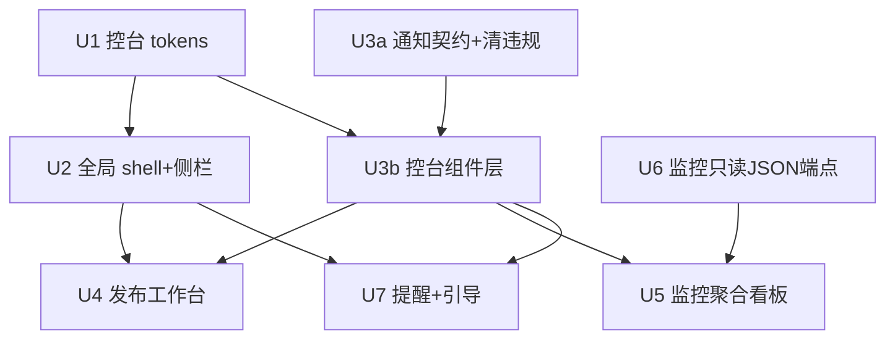

# feat: WebUI 控台风格 UI/UX 全面翻新

## Overview

把 Backlink Publisher 的 WebUI 从现有「深色玻璃拟态（indigo/purple 渐变 + 毛玻璃）」激进重调为
「深色技术控台风」（高对比、扁平面板、等宽字号缀、驾驶舱质感），并补齐现代交互基座：
统一 shell（左侧栏 + 顶栏）、长任务反馈、监控聚合看板、统一提醒系统。

关键现实（来自代码研究，修正了 origin 文档的部分假设）：
- `tokens.css` **已有完整深色 token 系统**（`color-scheme: dark` + `--gradient-hero` + `--glass-*`）。本次是**重调性**，不是从零搭。引用面 ≈286 处，集中在 `--glass-*` / `--text-primary|secondary`。
- 现状**无侧栏**，只有 sticky 顶栏 + 移动抽屉（`base.html` + `global_nav.css` + `nav.js`）。侧栏为净新增布局。
- `publish` 同步阻塞、**无 task-id**；`keep-alive` 已有成熟 `job_id`+轮询+取消注册表。
- `notifications.js` **已有 700+ 行渲染层**（`ToastManager` + `NotificationCenter`，行号以实现时核对为准），但**违反本仓铁律**（模板字符串入 `innerHTML`、`window.notifications` 全局），且**无事件总线/订阅接口**（`add()` 仅写 localStorage）。统一组件层是「取代+修违规+加订阅契约」，不是补空缺。**无统一空态/加载/错误组件**。
- 监控四路由中 `health` / `keep-alive` 有 JSON 端点；`equity` / `optimization` 仅 HTML。
- tokens「改值不改名自动级联」**不成立**：存在大量硬编反例——`schedule.css:15`/`index.css:258,395,411,554` 硬编 `blur(8–12px)`、`index.css:10`/`settings.css:13` 硬编深色 radial-gradient 不走 `--gradient-hero`、280+ 处字面 rgba、30+ 处模板行内 `style` 状态徽章硬编色（`_tab_history.html:82–377`）、`keep_alive.js:79` sparkline 硬编色。改 token 会新旧风格混杂。
- 全局浮层不止侧栏/顶栏：**copilot 面板**（`copilot.css` `fixed; top:0; right:0; height:100vh; z-index:1090`，由 settings/sites/health/equity_ledger/index **5 页各自 include**，不在 base.html）+ notifications.js toast 容器（硬编 `top:60px` 顶栏高度、`z-index:1200`、badge `insertBefore` 到顶栏 DOM）。z-index 规划必须纳入这两者。

## Problem Frame

功能完备但视觉/交互老旧、玻璃风与控台业务气质不符；pipeline 操作分散多页、长任务无反馈、
监控分裂成 4 个独立页。目标是让运营者「坐进驾驶舱」。详见 origin 文档。
本期主轴为**视觉/交互翻新**，不改后端业务逻辑、pipeline 算法、渠道适配器。

## Requirements Trace

- R1–R3. 重建深色控台 design tokens（含组件级语义变量、保留双主题）(see origin: R1–R3)
- R4–R6. 全局 shell：左侧栏分区 + 顶栏 + pipeline 心智模型 + 移动响应 (see origin: R4–R6)
- R7–R10. 核心发布工作台：单页分步、**忙碌态反馈（阶段骨架屏+乐观推进，本期不含真实进度/task-id，见 Scope）**、统一反馈语言、草稿状态栏 (see origin: R7–R10)
- R11–R12. 监控聚合看板：今日异常优先 + 一键深钻 + 就地快捷操作 (see origin: R11–R12)
- R13–R14. 统一提醒系统 + 首次使用引导 (see origin: R13–R14)

## Scope Boundaries

- 不改后端业务逻辑、pipeline 算法、状态存储 schema、渠道适配器。
- 严守 zero-build 原生 ES modules（无打包器、无 `window.*` 全局 API、无内联 `on*`、`readCsrf()` 每次读 `<meta>`）。
- **发布进度（R8）本期降级为丰富忙碌态**（阶段骨架屏 + 乐观文案 + 完成回填），**不给 publish 加 task-id 异步层**（用户决策 2026-06-17）。
- 本期「激进重做」仅覆盖：全局 shell + 核心发布工作台 + 监控聚合看板 + 统一组件层。**其余 ~15 页不是「自动级联追平」**——它们会呈现混合态：走 `--glass-*`/`--text-*` 的部分变控台风，走字面 rgba/blur/gradient/行内 style 的部分残留旧玻璃风。本期接受这种视觉不一致，分期 backlog 逐页 token 化（见下方决策项，需定 backlog 大小）。
- 合并 batch 与 campaign 两套 UI 记为后续，非本期。
- 监控聚合所需的两个只读 JSON 端点（equity / optimization）属于「读层补端点」，不触碰业务计算逻辑。

## Context & Research

### Relevant Code and Patterns

- Tokens：`webui_app/static/css/tokens.css`（`:root` 单一来源，`--glass-*` / `--text-primary` 命名约定）
- Shell：`webui_app/templates/base.html`（导航宏，行 43–92，`` 三处）、`webui_app/static/css/global_nav.css`（sticky topbar + `.nav-drawer`）、`webui_app/static/js/nav.js`（`MobileDrawer` / `SearchModal` / `SEARCH_DATA`）
- 主题：`webui_app/static/js/theme.js`（`localStorage('backlink-publisher-theme')` + `data-theme` + `theme-transition` 300ms 过渡）
- 轮询基座（复用范本）：`webui_app/routes/keep_alive.py`（`/ce:keep-alive/recheck` 202→`job_id`，`/recheck-status/<job_id>` 轮询，`/recheck-cancel` 取消）、`webui_app/static/js/keep_alive.js`、`cycle-panel.js`（`replaceChildren`/`createElement` DOM 范式）
- API 客户端：`webui_app/static/js/lib/api.js`（`readCsrf()` 不缓存、`fetchJson`、`postJson`、`postForm` 每次读鲜 token）
- 通知层：`webui_app/static/js/notifications.js`（`NotificationStore` + `TYPES` + 已有 `ToastManager`/`NotificationCenter` 渲染，需取代/修违规/加事件接口）
- **监控已有聚合器（关键，本次复用基座）**：`webui_app/routes/command_center.py:21` `_collect_subsystem_status()` 已是 fail-open 聚合器，合并 keepalive/equity/optimization/history/running-jobs 并算 `low_weight_count`/`recent_24h` 等异常信号，`:141` 已有 `poll_job`；其 equity/optimization 走 `OptimizationState.to_summary()` 而非 HTML 路由 rows。监控盘点还含 `survival_dashboard`。**U5 决策为扩展 command_center，不新建聚合逻辑**（用户决策 2026-06-17）。
- 监控数据源：`health.py`（`_g_cache` 单飞聚合 16 指标 + JSON 端点）、`keep_alive.py`（`/ce:keep-alive/cycle-status`）、`equity_ledger.py:59`（已有 `rows=[row.to_jsonl_dict()...]`，仅 HTML）、`optimization_status.py:33`（读 state 渲染，无现成 rows，仅 HTML）
- **待补核对**：index.js 中 plan/generate/validate/preview 各是几次后端往返（决定 U4 阶段条哪些段有真实调用支撑）。
- 发布流程：`webui_app/routes/pipeline_plan.py`、`pipeline_publish.py`（`/ce:publish` 同步阻塞 PipeResult）、`webui_app/api/pipeline_api.py`（`PipeResult` 结构 + `run_pipe_capture()`）

### Institutional Learnings

- 前端硬约束（CLAUDE.md）：无内联 `on*`、无 `window.*` API、`readCsrf()` 每次读 `<meta>`、不可信 `${…}` 不入 `innerHTML`。所有交互走 `data-action` 委托 + `CustomEvent` 跨组件通信。
- `health.py` 的 `_g_cache` 单飞 + try/except fail-open（never 500）是聚合端点的范本，监控聚合应沿用。

### External References

未做外部研究：zero-build 原生 ES modules + CSS 变量的设计系统在本仓已有充分本地范式（tokens.css、theme.js、lib/api.js），本地模式足够。

## Key Technical Decisions

- **重调性而非重搭 tokens（但级联只覆盖走 token 的部分）**：保留 `tokens.css` 变量骨架与命名、改取值，使 286 处 `var()` 引用自动级联。理由：引用面广、重命名风险高。**但「改值即级联」仅对走 token 的位置成立**——Overview 已列 280+ 字面 rgba、30+ 行内 style、硬编 blur/gradient 不响应 token，需 U1 显式 token 化才能完整级联；其余未处理处会新旧混杂（见下方「~15 页分期」决策）。
- **侧栏作为净新增、顶栏保留**：新增左侧栏承载 pipeline 分区导航，顶栏退化为搜索/主题/设置/Pro 状态条。理由：origin R4 要求侧栏体现 pipeline 心智模型；顶栏现有逻辑（搜索/快捷键）可保留复用。
- **发布进度降级忙碌态**：不给 publish 加 task-id（用户决策）。理由：守住「不改后端业务逻辑」边界，避开异步任务层的高风险；阶段骨架屏已能满足「知道在干什么」的成功标准。
- **统一组件层先行，但先清旧账**：`notifications.js` 已有渲染层却违规且无事件总线，故拆成 U3a（给 `NotificationStore` 加订阅/事件接口 + 清理 `innerHTML`/`window.*` 违规）→ U3b（控台风 toast/skeleton/empty/error 组件）。理由：U4/U5/U7 都假定一个 `app:notify` 事件总线，而现状无人派发；不先建契约，下游全建在空中。新组件用外部 `components.css`（比现状内联 `<style>` 更 CSP 友好）。
- **监控聚合靠补 JSON 端点 + 单飞聚合**：为 equity / optimization 补只读 JSON 端点，新增一个聚合端点沿用 `_g_cache`。理由：避免前端多次 fetch；只读不碰业务计算。

## Open Questions

### Resolved During Planning

- 发布是否需真实进度？→ 否，本期降级忙碌态（用户决策）。
- tokens 是否需重命名？→ 否，改值+扩展，不重命名，保级联。
- 监控聚合数据从哪来？→ health/keep-alive 复用现有 JSON；equity/optimization 补只读 JSON 端点 + 一个 `_g_cache` 聚合端点。
- 需不需要外部研究/打包器？→ 否，本地 zero-build 范式充分。

### Deferred to Implementation

- 控台风具体配色数值（强调色 hex、面板分层 alpha）→ 实现时在样板页迭代敲定，先给方向性 token。**但新增强调 token 须绑定本期消费者**（状态色被 states.js/toast.js 用、面板分层被 shell 用）；无消费者的纯装饰 token 不本期引入。
- U4 忙碌态超时阈值 → 不猜固定值（publish 同步可能合法地慢）；按实测/预期 publish 延迟设定，且超时后走上方「结果未知」reconciliation，不直接判失败。
- 等宽表格（权益账本）窄屏卡片化的精确断点与字段取舍 → 实现该页时定（本期非重做页，仅保证 tokens 不破版）。
- `pollJob(jobId, render)` 通用 helper → **本期明确不抽**：U5 走单次加载+手动刷新不轮询，keep-alive 是唯一 job 轮询消费者，无第二消费者，避免一消费者的过早抽象；待真加自动刷新（≥30s）时再评估。
- 旧页面靠 tokens 级联后是否有局部破版点 → 实现后逐页目检，记入分期清单。

## High-Level Technical Design

> *以下为方向性指引，供评审验证「控台 shell + 组件层」的形态，非实现规格。实现 agent 应视作上下文，不要照抄。*

新 shell 布局（取代纯顶栏）：

```
┌────────────────────────────────────────────────────────┐
│ TOPBAR  [搜索 Ctrl+K] ········· [主题] [设置] [Pro 状态]│
├──────────┬─────────────────────────────────────────────┤
│ SIDEBAR  │  PAGE CONTENT                                │
│ 核心     │  ┌─────────────────────────────────────┐    │
│  发布 ●  │  │ 发布工作台：Plan→Generate→Validate   │    │
│  批量    │  │ →Preview 分步条 + 阶段态             │    │
│ 监控     │  └─────────────────────────────────────┘    │
│  聚合 ⚠2 │  toast 容器（右上） · skeleton/empty/error  │
│  保活    │                                             │
│ 配置     │                                             │
└──────────┴─────────────────────────────────────────────┘
```

组件层职责边界（取代 `notifications.js` 现有渲染层 + 补状态组件）：
- U3a `notifications.js` — `NotificationStore.add()` 派发 `CustomEvent('app:notify')`；清掉现有 `innerHTML` 注入与 `window.notifications` 全局
- U3b `ui/toast.js` — 订阅 `app:notify` 渲染右上角控台风 toast（offset 不硬编顶栏高度）
- U3b `ui/states.js` — 导出 `renderSkeleton/renderEmpty/renderError(container, opts)`，全部 `createElement`，不入 `innerHTML`
- 发布工作台进度：纯前端阶段机（乐观推进），不依赖后端 task-id

## Implementation Units



- [x] **Unit 1: 控台风 design tokens 重调性**

**Goal:** 把 `tokens.css` 从玻璃拟态调为深色控台风，新增组件级语义变量层。

**Requirements:** R1, R2, R3

**Dependencies:** None

**Files:**
- Modify: `webui_app/static/css/tokens.css`
- Modify: `webui_app/static/css/global_nav.css`（`theme-transition` 保留）
- Modify: `webui_app/static/css/index.css`、`settings.css`（硬编 rgba/blur/渐变 → token 化，重灾大户）
- Modify: `webui_app/static/js/theme.js`（切主题时同步 `data-theme` 与 `data-bs-theme`，见 Approach）
- Test: 无自动化测试（纯样式）— 见 Verification 的目检清单

**Approach:**
- 保留现有变量名与命名约定，仅改取值：面板分层（`--surface-base/raised/overlay`）、高对比前景、状态色（成功/警告/失败/进行中）、等宽字号 token（`--font-mono` 用于数字/ID/状态）。
- 新增 3–5 个控台强调 token（如 `--accent-cyan`、`--danger-soft`），不重命名既有 token 以保 286 处级联。
- **显式 token 化子任务**：index/settings/global_nav 三个大户里的硬编 `blur(8–12px)`、深色 radial-gradient（`index.css:10`/`settings.css:13`）、字面 rgba 改走 token。否则「自动级联」是假象、新旧风格混杂。
- **双主题属性同步**：现状 `theme.js` 只改 `data-theme`，base.html 根元素硬编 `data-bs-theme="dark"`，切到 light 时 Bootstrap 组件（模态/下拉）仍 dark。本单元让 `theme.js` 同步两个属性。

**Execution note:** 目检页**不能用 settings/keep_alive**（它们自身是硬编重灾区，会误判级联正常）；改用相对干净的页面 + 重灾页对照。

**Patterns to follow:** `tokens.css` 现有 `:root` 结构与 `--glass-*` 分组命名。

**Test scenarios:**
- Test expectation: none — 纯 CSS token 改值，无行为变化；正确性由 Verification 目检覆盖。

**Verification:**
- 打开 index / settings / global_nav 涉及页，观感统一为控台风，无残留 `blur(8–12px)`、无硬编深色渐变与旧玻璃色、无对比度过低文本。
- 切换亮/深主题：自定义 token 与 Bootstrap 组件（模态/下拉）同步变色（`data-theme` 与 `data-bs-theme` 一致），均不破版。

- [x] **Unit 2: 全局 shell — 侧栏 + 顶栏重构**

**Goal:** 引入左侧栏（核心/监控/配置分区，体现 pipeline 心智）+ 精简顶栏，移动端折叠为抽屉。

**Requirements:** R4, R5, R6

**Dependencies:** Unit 1

**Files:**
- Modify: `webui_app/templates/base.html`（导航宏 → 侧栏 + 顶栏结构，保留 `` 三处条件）
- Modify: `webui_app/static/css/global_nav.css`（新增 `.app-sidebar` 布局 + 响应式断点 + z-index 重排）
- Modify: `webui_app/static/css/settings.css`（`min-height: calc(100vh - 120px)` 硬编顶栏高度，行 48/67，侧栏后失效必改）
- Modify: `webui_app/static/css/tokens.css`（`.page-content` z 堆叠，行 105）
- Modify: 多页容器约束（`index.html:48` 等 `container-fluid`+`max-width:1100px` 从「视口全宽」改为「侧栏右侧剩余宽」）
- Modify: `webui_app/static/css/copilot.css`（`fixed; top:0; right:0; z-index:1090` 与新侧栏/toast 的 z 层协调）
- Modify: `webui_app/static/js/nav.js`（`MobileDrawer` 改驱动侧栏抽屉；保留 `SearchModal`/`SEARCH_DATA`/Ctrl+K）
- Test: `webui_app/static/js/__tests__/nav.test.*`（若现有测试目录存在则补；否则 Verification 手测）

**Approach:**
- 侧栏分区与 origin User Flow 对齐；当前页活跃态 + 面包屑。
- **LITE 竖排空洞策略（定一种）**：配置分组标题与内容同时用 `` 隐藏，分组内全部项隐藏时整个 `<section>` 不渲染、不留占位符；用 `render_nav_group(title, is_lite)` 宏保证一致。
- **顶栏高度/全宽假设跨页清单**（爆炸半径核心，非仅「目检」）：逐项改 settings.css 的 120px 顶栏高度计算、各页 `container max-width` 全宽假设、`pipeline_dashboard.html` 三处 `thead.sticky-top` z 基准、`.page-content` z 堆叠。
- **z-index 统一规划**：定层级——侧栏=1000、顶栏=1020（沿用现状）、copilot 面板保持 1090、toast=1200、搜索模态=1300。copilot 仍由各页 include（不改架构），在 `copilot.css` 注释标记其与新侧栏的层级关系，避免互相遮挡。
- **settings 双侧栏共存**：settings 页已有 `_settings_sidebar.html` 的 `.settings-sidebar`（分组树），新全局 `.app-sidebar` 引入后该页变「全局侧栏 + 设置内侧栏」双列，需验证桌面不溢出、窄屏两套折叠不打架（必要时把 settings 内侧栏降级为内容区内导航）。
- 窄屏（现有 `@media (max-width:1024px)`）侧栏折叠为抽屉，复用 `MobileDrawer` 的 body overflow / Escape / `aria-hidden` 机制。
- **无障碍（侧栏是净新增脊柱，须自带）**：`nav` landmark + 活跃项 `aria-current`；定义侧栏↔顶栏↔内容的焦点顺序（跳转到内容的 skip-link）；异常徽章不能只是 `⚠2` 字形+裸数字，须给可读名（如 `aria-label="监控聚合：2 项异常"`）；平板断点侧栏点击目标 ≥44px。

**Patterns to follow:** 现有 `.nav-drawer` 抽屉实现与 `nav.js` 的 class 结构。

**Test scenarios:**
- Happy path: 桌面宽度下侧栏常驻，点击「监控/聚合」跳转且该项呈活跃态。
- Edge case: LITE 模式下「存活率/健康/指挥/配置组」隐藏，侧栏不留空洞。
- Edge case: 窄屏（<1024px）侧栏折叠为抽屉，汉堡键打开、Escape 关闭、body 滚动锁定。
- Edge case: include copilot 面板的 5 页（settings/sites/health/equity_ledger/index）侧栏+copilot 并存时不互相遮挡、z 层正确。
- Integration: Ctrl+K 搜索模态在新 shell 下仍可打开并跳转（`SEARCH_DATA` 未回归破坏）。

**Verification:**
- 三种宽度（桌面/平板/手机）下 shell 不破版；settings 页主区不再因 120px 顶栏假设坍塌；container 不溢出侧栏右侧区域；键盘可达性（Tab/Escape）正常；当前页活跃态正确。

- [x] **Unit 3a: 通知层订阅契约 + 清理违规**

**Goal:** 给 `notifications.js` 加 `app:notify` 事件总线/订阅接口，并清理现有 `innerHTML` 模板字符串注入与 `window.notifications` 全局违规，为下游统一渲染层铺路。

**Requirements:** R9, R13

**Dependencies:** None

**Files:**
- Modify: `webui_app/static/js/notifications.js`（`NotificationStore.add()` 派发 `CustomEvent('app:notify')`；移除行 226–235 `innerHTML` 注入改 `createElement`；移除行 646 `window.notifications`，改模块导出）
- Modify: 引用 `window.notifications` 的调用点（grep 全站替换为 import）
- Test: `webui_app/static/js/__tests__/notifications.test.*`（若测试栈存在）

**Approach:**
- 保持 `NotificationStore` 存储语义与 localStorage 50 条上限不变，仅加事件派发与订阅接口。
- **派发时机**：`NotificationStore.add()` 内部 `document.dispatchEvent(new CustomEvent('app:notify', {detail: notification}))`，调用方无需介入。
- **订阅方式**：下游（U3b toast、U4/U5/U7）各自 `document.addEventListener('app:notify', handler)`，无需统一注册表。
- **现状调用点审计**：grep `NotificationStore.add` 与 `window.notifications`，确认所有旧调用点改经事件总线/import 后无回归。
- 现有 `ToastManager`/`NotificationCenter` 的渲染逻辑在本单元先就地修违规（innerHTML→createElement、去 window.*），U3b 再以控台风组件取代/重写其样式与结构。

**Test scenarios:**
- Happy path: `NotificationStore.add()` → 派发 `app:notify` 且订阅者收到 detail。
- Edge case: 超 50 条 → 最旧被裁剪，localStorage 持久化语义不变。
- Integration: 移除 `window.notifications` 后，原所有调用点经 import 仍能触发通知，无回归。

**Verification:**
- 全站无 `window.notifications` 引用、`notifications.js` 无 `innerHTML` 注入路径；事件总线可被订阅。

- [x] **Unit 3b: 控台风统一组件（toast / 状态态）**

**Goal:** 以控台风外部样式取代旧 toast/通知中心结构，并新增通用空态/加载骨架/错误态组件，供全站复用。

**Requirements:** R9, R13

**Dependencies:** Unit 1, Unit 3a

**Files:**
- Create: `webui_app/static/js/ui/toast.js`（订阅 U3a 的 `app:notify` 渲染控台风 toast；容器 offset 不再硬编 `60px`，改相对 shell 计算）
- Create: `webui_app/static/js/ui/states.js`（`renderSkeleton/renderEmpty/renderError`）
- Create: `webui_app/static/css/components.css`（外部文件，比内联 `<style>` 更 CSP 友好）
- Modify: `webui_app/templates/base.html`（挂载 toast 容器 + 引入 `components.css`，`<link>/<script>` **必须带 `v={{ asset_version }}`**）
- Test: `webui_app/static/js/__tests__/ui-states.test.*`（若测试栈存在）

**Approach:**
- 全部 `createElement`/`textContent`，禁止不可信 `${…}` 入 `innerHTML`。
- toast 订阅 U3a 事件总线；badge 挂载点随新 shell 调整（旧代码 `insertBefore` 到顶栏 `.global-nav__actions`，侧栏后该挂点变化）。
- 错误态组件携带「重试」回调插槽（按钮走 `data-action` 委托）。

**Patterns to follow:** `cycle-panel.js` 的 `replaceChildren`/`createElement` DOM 范式；`notifications.js` 的 `TYPES` 图标/色映射。

**Test scenarios:**
- Happy path: 派发 `app:notify` success → 右上角出现对应图标/色的控台风 toast，超时自动消失。
- Edge case: 连续派发 >N 条 → toast 堆叠不溢出视口、旧的按序退场。
- Error path: `renderError(container, {onRetry})` 点击重试 → 触发回调且容器可被重渲染。
- Edge case: `renderEmpty` 在容器已有内容时调用 → 先清空再渲染，无残留节点。
- Integration: toast badge 在新 shell 下挂载点正确、计数随 `NotificationStore` 同步。

**Verification:**
- 三种状态组件可在任意容器挂载/卸载无内存泄漏；toast 不阻塞交互、offset 不依赖硬编顶栏高度；新增静态资源带 `v=` 版本号**且重启后 `version_file` 已刷新**（实测刷新后不取旧缓存、无 module/classic 版本漂移）。

- [x] **Unit 4: 核心发布工作台（单页分步 + 忙碌态）**

**实现期重大发现（2026-06-17）→ 已据实重新定范围**：发布流程**本就是服务端渲染的 HTML 表单 POST**（每步整页重载 + `_initLoadingOverlay` 真实 POST 期间显示遮罩），**不是**客户端 fetch 阶段机。因此：
- 「诚实阶段条」天然成立——`_tab_new.html` 的 step-bar 由服务端按 pipeline 状态渲染（`cur_step`），不存在伪造子阶段；publish 是独立表单 POST + 自己的遮罩。计划担忧的「乐观阶段机伪造进度 / 超时 reconciliation / double-posting」前提（客户端 fetch 阶段机）**不存在**，故**不构建**投机的客户端阶段机（scope-guardian 已标其为投机）。
- R10 草稿状态栏**已存在且完整**（`_tab_history.html`：已发布/失败/已排程/待排程徽章、排程时间、错误态、重绑定捷径）。真实欠缺只是**控台一致性**：状态徽章用了硬编浅色 pastel hex（`#dbeafe/#fee2e2/#fef3c7/#dcfce7` 等，正是 Overview 点名的 `_tab_history.html:82–377` backlog）。
- **本单元实际交付**：把 `_tab_history.html` 全部 23 处 pastel inline-hex token 化为控台 soft-token（新增 `--info-soft`），清掉该 backlog 项 + 兑现 R10 控台一致性。首次引导空态归 U7。已实测：草稿/历史徽章控台正确、无 pastel。

**Goal:** 把 plan→generate→validate→preview 整合为单页分步工作台，长任务用阶段骨架屏忙碌态，草稿带状态栏。

**Requirements:** R7, R8, R10

**Dependencies:** Unit 2, Unit 3b

**Files:**
- Modify: `webui_app/templates/index.html` 及相关 `_tab_*.html` 宏（分步工作台结构）
- Modify: `webui_app/static/js/index.js`（阶段机：待办/进行中/完成/出错，可回退）
- Modify: `webui_app/static/css/index.css`（工作台 + 分步条样式）
- Test: `webui_app/static/js/__tests__/publish-workbench.test.*`（若测试栈存在）

**Approach:**
- 阶段条状态可视，允许回退修改上一步输入。
- **阶段条诚实度（用户决策 2026-06-17）**：阶段只对**真实前端调用点**亮——plan/generate/validate 若各自是独立 fetch，则每个真调用翻一个真阶段；唯独不透明的 `/ce:publish` 单调用期间只显示 `publishing…` **不定态**，不声称子阶段完成、不伪造进度。**前置核对**：实现前确认 index.js 里 plan/generate/validate/preview 各是几次后端往返（见 Context & Research 待补），无对应真调用的段不得显示为「已完成」。
- 完成后用真实 PipeResult 回填；若某阶段 UI 已显示完成但实际失败，须可见纠正（红色回退），不只追加错误；**不轮询、不依赖 task-id**。
- 失败走错误态组件（分类 + 重试按钮）；成功派发 `app:notify`。
- 草稿列表显示状态栏（等待发布/排程中/已发布）与预计发布时间（数据取自 drafts/schedule store 现有字段）。

**Execution note:** 发布忙碌态为纯前端乐观阶段机，明确不改 `/ce:publish` 后端契约。

**Patterns to follow:** `lib/api.js` 的 `postJson`/`postForm`；现有 `index.js` 模式切换/URL 衍生逻辑。

**Test scenarios:**
- Happy path: 依次完成 plan→generate→validate→preview，分步条仅在真实调用返回时推进，preview 显示 Markdown。
- Error path: publish 在 validate 阶段失败 → UI 不得把 validate 显示为已完成（诚实度回归测试）。
- Edge case: 在 validate 步回退到 generate 修改输入 → 后续步状态重置为待办。
- Error path: generate 返回失败 PipeResult → 显示分类错误态 + 重试按钮，点击重试重发当前步。
- Error path: publish 返回部分失败 → 结果回填区**先列失败渠道**（按渠道状态），重试**只重发失败渠道**（绝不 retry-all，否则成功渠道被重复发布 = double-posting 数据危害）。
- Error path: 同步 publish 超时降级错误态后，**后端可能已成功**——错误态不得断言失败，须提示「结果未知，请到草稿/历史确认」或重渲染时拉 `history_store` 核对；若 fetch 迟到返回成功 PipeResult，UI 必须回填为成功/部分成功，不得停在错误态（避免假阴性诱导重复发布）。
- Edge case: 提交后网络中断 → 忙碌态超时降级为错误态，不卡死在骨架屏。
- Integration: 保存为草稿后，草稿列表出现该项并显示「等待发布/排程中」状态与预计时间。

**Verification:**
- 完成一次单笔发布全程不跳出工作台页；每步状态与忙碌态可见；草稿状态栏数据正确。

- [x] **Unit 5: 监控聚合看板**

**Goal:** 新增「今日异常优先」聚合看板，汇总保活/健康/权益/优化为卡片，可一键深钻 + 就地快捷操作。

**Requirements:** R11, R12

**Dependencies:** Unit 3b, Unit 6

**Files:**
- Create: `webui_app/templates/monitor_hub.html`
- Create: `webui_app/static/js/monitor_hub.js`（拉聚合端点、按优先级排序卡片）
- Create: `webui_app/static/css/monitor_hub.css`
- Modify: `webui_app/routes/command_center.py`（在 `_collect_subsystem_status()` 上加优先级排序 + 暴露 JSON 端点，作为聚合后端）
- Modify: `webui_app/routes/__init__.py`（注册看板视图路由）
- Test: `webui_app/static/js/__tests__/monitor-hub.test.*`（若测试栈存在）

**Approach:**
- **扩展现有 `command_center._collect_subsystem_status()`**（用户决策 2026-06-17），不另起聚合逻辑：在其上加优先级排序 + 暴露 JSON 端点；它已合并 keepalive/equity/optimization/history/running-jobs 且 fail-open。equity/optimization 取数沿用它的 `OptimizationState.to_summary()` 路径——这也决定了 U6 optimization 端点须与之共享同一 builder。把 `survival_dashboard` 纳入卡片来源。
- **轮询策略明确**：看板默认**单次加载 + 手动刷新按钮**，不自动轮询（避免与现有 `keep_alive.js:253`/`equity.js:382` 2s、`schedule.js:74` 60s 的 `setInterval` 叠加，且现有轮询无跨 Tab 去重）。若后续要自动刷新，频率 ≥30s 且单端点单连接。
- 前端 1 次 fetch 渲染卡片，异常项按优先级（凭证失效 > 链接陈旧 > 权益缝隙 …）排序并标注。
- 每张卡片「深钻」链接到既有监控页；「就地操作」（重检/重发/填缝）链接到既有路由，不新建业务逻辑。

**Patterns to follow:** `health.py` `_g_cache("...", _build)` 单飞聚合；`cycle-panel.js` DOM 渲染。

**Test scenarios:**
- Happy path: 聚合端点返回多源数据 → 看板渲染卡片，异常优先排序正确。
- Edge case: 某一数据源失败（fail-open 返回空/错误标记）→ 该卡片降级显示，不拖垮整页。
- Edge case: 无任何异常 → 显示「今日无异常」空态（`renderEmpty`）。
- Integration: 点击卡片「深钻」跳转对应监控页；「重检」触发既有路由并回弹 toast。

**Verification:**
- 一页内看到全部监控异常并按优先级排序；任一数据源故障不致整页 500；深钻与快捷操作可用。

- [x] **Unit 6: 监控只读 JSON 端点（equity / optimization）**

**Goal:** 为 equity_ledger / optimization_status 补只读 JSON 端点，供 U5 聚合复用。

**Requirements:** R11

**Dependencies:** None

**Files:**
- Modify: `webui_app/routes/equity_ledger.py`（新增 `GET /api/equity-ledger` 返回 `jsonify(rows)`）
- Modify: `webui_app/routes/optimization_status.py`（新增 `GET /api/optimization-status`）
- Test: `tests/` 下对应路由测试（沿用现有 webui 路由测试约定）

**Approach:**
- **两端点取数路径不对称**：equity 可机械复用——`equity_ledger.py:59` 已有 `rows = [row.to_jsonl_dict() ...]`，直接 jsonify。**optimization 不能**——`optimization_status.py:33` 读 `optimization_state.json` 渲染，无现成 rows；须指定权威取数函数 `OptimizationState.to_summary()`（与 `command_center` 对齐），三处（HTML 模板上下文 / command_center / 新 JSON 端点）共享同一序列化，否则制造本要避免的「两套真相漂移」。
- 沿用 try/except fail-open 风格，保证聚合端点稳定。

**Execution note:** equity 端点为 external-delegate 机械补写；**optimization 端点非纯机械**——需先抽出/对齐权威数据 builder，再加 JSON view。

**Patterns to follow:** `health.py` 的 JSON 端点（如 `/ce:health/publish-metrics`）返回 `{ok, ...}` 约定。

**Test scenarios:**
- Happy path: `GET /api/equity-ledger` 返回与 HTML 页一致的 rows JSON，含 `ok: true`。
- Happy path: `GET /api/optimization-status` 返回渠道权重数据 JSON。
- Error path: 底层数据源抛错 → 端点 fail-open 返回 `{ok: false, error}`，不 500。
- Edge case: 无数据 → 返回空数组而非 null。

**Verification:**
- 两端点返回结构稳定、与对应 HTML 页数据一致；异常时不 500。

- [x] **Unit 7: 统一提醒系统 + 首次使用引导**

**Goal:** 把发布中断恢复、Pro 激活、凭证失效、监控异常统一为一致提醒语言；加渠道健康汇总与关键空态引导。

**Requirements:** R13, R14

**Dependencies:** Unit 2, Unit 3b

**Files:**
- Modify: `webui_app/templates/base.html`（统一横幅/徽章挂点）
- Modify: `webui_app/templates/index.html` / `settings.html`（空态引导：无渠道/无站点提示）
- Modify: `webui_app/static/js/index.js` / `settings.js`（接入 `app:notify` + 状态徽章）
- Modify: `webui_app/routes/checkpoint.py` 相关展示（中断恢复横幅改用统一组件，逻辑不变）
- Test: `webui_app/static/js/__tests__/alerts.test.*`（若测试栈存在）

**Approach:**
- 现状散落各页的 alert 统一改用 U3 的 toast/横幅/徽章；侧栏监控项显示异常计数徽章。
- 首次使用：无渠道绑定/无站点时在工作台与设置页显示 `renderEmpty` 引导（去配置的 CTA）。
- 渠道健康汇总复用 `channel_status_store` 现有数据。

**Patterns to follow:** `notifications.js` `TYPES` 映射；`channel_status_store` 读取方式。

**Test scenarios:**
- Happy path: 存在发布中断 checkpoint → 顶部统一横幅显示「恢复/忽略」，操作走既有 checkpoint 路由。
- Edge case: 无渠道绑定 → 工作台显示空态引导 CTA，点击跳设置。
- Edge case: 某渠道凭证失效 → 侧栏「配置」项显示异常徽章 + 设置页对应卡片标红。
- Integration: 监控聚合（U5）发现异常 → 侧栏「监控」项徽章计数同步。

**Verification:**
- 各类提醒视觉语言一致（横幅/徽章/toast）；新手在零配置下有明确下一步引导；徽章计数与实际异常一致。

## System-Wide Impact

- **Interaction graph:** `base.html` 是所有页面父模板，U1/U2/U3b/U7 改它影响全站；19 页对 base 的 block 契约干净（只用 title/head_extra/content/page_data/page_module），破坏面在 CSS 布局假设而非 block。`nav.js` 的 `SearchModal`/`SEARCH_DATA` 不可回归破坏。
- **全局浮层 z-index：** copilot 面板（`copilot.css` fixed/z:1090，由 5 页各自 include `_copilot_panel.html`）、toast（z:1200）、新侧栏、搜索模态需统一排层，U2 负责。
- **主题双属性：** `theme.js` 须同步 `data-theme`（自定义 token）与根元素 `data-bs-theme`（Bootstrap 组件），否则切 light 时模态/下拉仍 dark（U1 处理）。
- **静态资源版本（修正）：** `__init__.py:33–40` 的 `_compute_asset_version` **不会因新增文件自动 bump**——它先查 `version_file`，命中即提前返回缓存值，不重走 `os.walk` 算 mtime。所以新增 `components.css`/`toast.js` 必须：(1) `<link>/<script>` 带 `v={{ asset_version }}`，**且** (2) 部署/重启时删除或刷新 `version_file`（或确认部署流程重建它），否则新文件首次命中旧版本号、module HTML 与 classic JS 版本漂移。U3b Verification 须核对。
- **Error propagation:** 监控聚合端点（U5）必须 fail-open（never 500），单源故障降级为卡片级；U6 端点同样 fail-open。
- **State lifecycle risks:** U4 发布忙碌态为乐观阶段机，须处理网络中断/超时，避免卡死骨架屏或与真实 PipeResult 不一致；`NotificationStore` 50 条上限/localStorage 持久化语义不变。
- **API surface parity:** U6 新增 JSON 端点须与对应 HTML 页数据一致，避免两套真相漂移。
- **Integration coverage:** Ctrl+K 搜索、LITE 模式条件（侧栏竖排空洞）、checkpoint 恢复、草稿/排程状态——这些跨层行为需手测验证，单测覆盖不到。
- **Unchanged invariants:** `/ce:publish`、`/ce:plan`、`/api/<channel>/{status,verify,dry-run}` 等后端契约**不变**；`tokens.css` 变量名不变（仅改值+扩展）；`NotificationStore` 存储语义不变（仅加事件接口）。

## Risks & Dependencies

| Risk | Mitigation |
|------|------------|
| tokens 改值不级联（280+ 硬编 rgba/blur/渐变、30+ 行内 style） | U1 显式 token 化 index/settings/global_nav 大户；目检避开重灾页才有效 |
| `base.html` 重构破版（顶栏高度/全宽假设、copilot 浮层、z 层） | U2 把顶栏高度/container/​z-index/copilot 列成跨页清单逐项改，非仅目检 |
| `notifications.js` 现状被低估（已有 700 行渲染层+违规+无事件总线） | 拆 U3a（加事件契约+清违规）→ U3b（控台组件），下游建在真实总线上 |
| 发布忙碌态与真实结果不一致/卡死 | 乐观阶段机加超时降级到错误态；完成以 PipeResult 为准回填 |
| 监控聚合端点拖慢/500 | 沿用 `_g_cache` 单飞 + fail-open；前端单次 fetch |
| U6 JSON 与 HTML 数据漂移 | 复用 HTML 路由内部同一数据结构，不另算 |
| 违反 zero-build 约束（误引入构建/全局） | 全程 `createElement`+`CustomEvent`+`data-action`；评审时核 readCsrf 每次读 meta |
| base.html 改全站、无 flag、all-at-once（坏合并=全站回归） | 记录回滚单元（revert 哪些 commit 恢复旧 shell）；先在重做页验证再翻全局 |
| 监控聚合重复造轮子 / optimization 三方取数漂移 | 扩展 command_center 而非新建；optimization 统一走 `to_summary()` builder |
| 阶段条伪造进度损害驾驶舱信任 | 只对真实调用点亮阶段，publish 单调用显示不定态、不声称子阶段完成 |

## Documentation / Operational Notes

- 无数据库迁移、无 rollout 开关。纯前端 + 监控聚合端点扩展，热加载即可。**因 base.html 改全站、无 flag，记录回滚单元**（revert 哪些 commit 可恢复旧顶栏 shell），作为 all-at-once 风险的兜底。
- **分期 backlog（用户决策：接受混合态）**：本期接受其余 ~15 页新旧风格混合；用 grep 统计各页硬编色点数量（字面 rgba / `blur()` / radial-gradient / 行内 `style` 徽章，如 `_tab_history.html:82–377`、`keep_alive.js:79`、`schedule.css:15`）量化 backlog 大小，逐页 token 化追平，不在本期。

## Sources & References

- **Origin document:** [docs/brainstorms/2026-06-17-webui-console-redesign-requirements.md](docs/brainstorms/2026-06-17-webui-console-redesign-requirements.md)
- 关键代码：`webui_app/static/css/tokens.css`、`templates/base.html`、`static/js/nav.js`、`static/js/lib/api.js`、`static/js/notifications.js`、`routes/keep_alive.py`、`routes/health.py`、`api/pipeline_api.py`
- 约束来源：项目 `CLAUDE.md`（zero-build 前端铁律）
