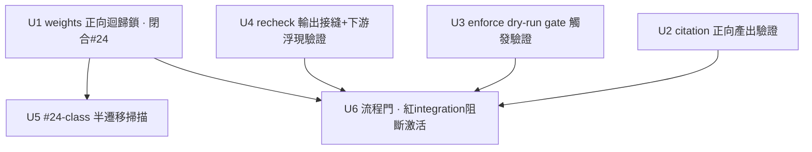

# feat: v0.5.0 Phase 0 — 激活前驗證門（verify-before-activate）

## Overview

v0.5.0 路線圖原本假設「006/007 代碼完成 → 只需激活+排程」。PR #24 證偽了這個前提：`optimize-weights` 因 v2 schema 遷移未收尾而**靜默 no-op**（權重恆 1.0），其 integration 測試長期紅卻被容忍。本 milestone 是 v0.5.0 的**第一個、無爭議的共同前置**：在排程/激活任何「建好但未動」子系統前，先用**正向產出斷言**證明它真的工作，並修掉讓 #24 潛伏的流程缺口。

本計劃**只驗證、鎖定、掃描**，不真正翻轉 enforce allowlist、不安裝 launchd plist、不做排程（那些屬 Phase 1）。

## Problem Frame

四個子系統「代碼已建、Unit `[x]`、但從未確認真實產出」：citation probe、mastodon enforce、recheck/liveness、weights optimize。本倉的機構經驗（見下）反覆記錄同一失敗模式——**built-but-silent**：探針跑成功、無報錯、但信號在輸出/序列化接縫或半遷移 reader 處靜默消失，而 shape-only 測試（`assert isinstance(x, list)`）讓 bug「永遠綠」。#24 是這模式的最新一例。

> 詳見 origin：`docs/brainstorms/2026-06-16-comprehensive-optimization-roadmap-requirements.md`「2026-06-17 重審修正 — 建好≠能工作」+ Phase 0 需求 R0.1–R0.3。

## Requirements Trace

- **R0.1** 激活前端到端驗證：對每個待排程/激活子系統，斷言其產出**非空、非 no-op**（正向證據），再排程（origin R0.1）
- **R0.2** 修「紅 integration 被容忍」流程缺口：子系統 tier 測試為紅時不得排程激活；main integration 須保持綠（origin R0.2）
- **R0.3** #24-class 系統性排查：找出其他「半遷移 / 雙慣例 reader」隱患（origin R0.3）
- **成功標準**（origin Success Criteria · Phase 0）：每個待激活子系統各有一筆「真實產出」證據（weights 調整 / citation 列 / enforce skip / liveness alarm）；optimize 有迴歸測試鎖死；無「紅 integration 被忽略」的子系統進入排程
- **【A · review 強化】真實執行硬門**：weights / enforce / recheck 各須一次**真實（非 mock）執行**留下證據（state 變化 / events.db row）；**citation 因 Perplexity 配額未決，Phase 0 僅以 mock+runbook 結案，真實 live 跑列為 Phase 1 R3 准入門，不計入 Phase 0「已證實」清單**

| Req | 描述 | Unit | 驗收門 |
|-----|------|------|--------|
| R0.1 | 子系統端到端正向產出驗證 | U1–U4 | 各子系統 integration 綠 + 非空/真實產出斷言 |
| R0.2 | 紅 integration 阻斷激活 | U6 | tripwire 綠 + AGENTS.md 規則 |
| R0.3 | #24-class 半遷移 reader 排查 | U5 | audit doc 完成 + 命中項修復或記 debt |

## Scope Boundaries

- **不**翻轉 mastodon enforce-allowlist 進真實 enforce（Phase 1 R1）——本期只 dry-run 驗證 gate 會觸發
- **不**安裝/載入任何 launchd plist、**不**做排程（Phase 1 R3/R4）
- **不**新增 publishing adapter，**不**改 event kind 字串（`kinds.py` 為不可變契約）
- **不**選 v0.5.0 throughput 主線（本路線圖 vs v050 plan）——待 Phase 0 完成後再決（origin Key Decision）
- 驗證探針**只讀**：快照式、exit 0、不變更生產狀態（仿 `audit-state` 模式）

## Context & Research

### Relevant Code and Patterns

**子系統入口 + 寫點（research-mapped）：**

| 子系統 | CLI 入口 | 寫點 / event kind | 測試 | tier |
|--------|---------|------------------|------|------|
| weights optimize | `src/backlink_publisher/cli/optimize_weights.py:main` | `optimization/rules.py:apply_results` → `state.set_weight` → `optimization_state.json`（**非** events.db） | `tests/test_optimization_e2e.py`, `tests/test_cli_weights.py` | integration |
| citation probe | `src/backlink_publisher/cli/probe_citations.py:main` | `geo/run.py:245 store.append(CITATION_OBSERVED, …)` | `tests/test_cli_probe_citations.py` | integration |
| mastodon enforce | `publishing/reliability/policy.py:_enforcing_for` / `_record_decision` | `publishing/reliability/events_store.py:append_reliability_decision` → `RELIABILITY_DECISION`（decision=`skipped_policy`；注意此模組 ≠ `events/store.py`） | `tests/test_reliability_enforce_seam.py`, `tests/test_reliability_decision_events.py` | unit+integration |
| recheck/liveness | `src/backlink_publisher/cli/recheck_backlinks.py:main` | `recheck/events_io.py:emit_recheck` → `LINK_RECHECKED`；`write_verified_at` 更新 `articles.verified_at` | `tests/test_cli_recheck_backlinks.py`, `tests/test_recheck_events_io.py` | integration |

- **EventStore**：`src/backlink_publisher/events/store.py:EventStore.append(kind, payload, …)`；floor-field 驗證 + quarantine 經 `kinds.missing_required_fields`。event kinds 全在 `events/kinds.py`（不可改名）
- **只讀稽查範式**：`audit-state` CLI（origin 提及）——快照 events.db、exit 0、不變更。Phase 0 驗證探針應仿此
- **#24 修復點**（本期前置背景）：`optimization/rules.py:85`（`evaluate_rules` 派發用 resolved_state_data）、`cli/keepalive_status.py:44`（解包 `"default"` 命名空間）、`tests/test_optimization_rules.py:_make_state_data` / `tests/test_keepalive_webui_cycle_panel.py:_os_with_platforms`（v2 fixture）

### Institutional Learnings

- **`solutions/test-failures/negative-assertion-locks-in-bug-2026-05-15.md`**（high，最 load-bearing）：負向/shape-only 斷言會把 bug 釘成「永遠綠」。對策：寫**正向 characterization 測試**，並**預期真修復會讓一條長青綠測試變紅**——視為成功訊號
- **`solutions/logic-errors/language-matches-always-true-no-op-gate-2026-05-14.md`**：no-op gate 的簽名就是 `assert isinstance(x, list)`。要斷言真實 output 被填充
- **`solutions/logic-errors/2026-06-05-001-live-dofollow-undercounting-triple-gap.md`**：recheck 探針跑成功但 liveness 從不浮現——`live_dofollow` 應從 `link.rechecked`（CLI 真寫的）推導，**非** `articles.verified_at`。直接對應本期 recheck 子系統
- **`solutions/integration-issues/dofollow-canary-verdict-dropped-at-publish-output-seam-2026-05-25.md`**：built-but-silent 子系統通常死在**輸出/序列化接縫**——驗證信號真的到達消費者，不只是被算出
- **`solutions/logic-errors/projector-silent-drop-status-vocabulary-drift-2026-05-26.md`**：events.db 投影器因生產寫了 classifier 沒教過的字串而靜默丟棄。斷言投影非空，不只是 well-formed
- **直系前身**：`_archive/plans/2026-06-05-008-feat-core-upgrade-prove-and-prune-plan.md`（converge + prove + prune）——已把本問題框成「驗證從未端到端跑過的路徑並鎖定」，風險表已含「suppressed signal is wrong-but-green」

### External References

- 無外部研究：全為本倉內部子系統，本地範式充分（research-analyst 已映射 4 入口 + EventStore + audit-state 範式）

## Key Technical Decisions

- **正向產出斷言，而非無報錯/形狀**：每個驗證 Unit 斷言「真實 row 數 ≥ 1 / 權重被調整 / verdict 到達消費者」，禁用 `isinstance`/`>= 0` 式 shape 斷言（learnings 直接驅動）
- **【A · review 強化】mock 綠 ≠ 已證實，需一次真實執行硬門**：adversarial review 指出——本計劃的論點是「bug 藏在真實網路/序列化接縫」，但 mock 與真實呼叫走不同碼路（projector-silent-drop 失敗模式）。故每個子系統**除 mock 測試外，須有一次真實（非 mock）執行產生真實 events.db row / state 變化**，作為「已證實可用」的硬門。**citation 受 Perplexity 配額阻塞時**：誠實標註「mock+runbook 已驗證、**真實 live 跑列為 Phase 1 R3 的准入門**」，**不在 Phase 0 宣稱 citation 已證實**——否則重演「mock 綠 + 沒人跑的 checklist」= #24 ship 的原樣
- **特徵化優先（characterization-first）**：先寫鎖定「真實產出」的測試；若它讓某條長青測試變紅，那是發現了下一個 #24，視為成功（learnings）
- **驗證探針只讀、仿 audit-state**：不變更生產狀態，可重複跑，供 operator 激活前一鍵確認
- **驗證以測試套件 + runbook 交付，不新增 CLI entrypoint**：避免觸 monolith/complexity budget 與新 argparse 表面；live 一次性跑用 runbook 記步驟（origin R10 同類顧慮）
- **Phase 0 不翻 allowlist / 不裝 plist**：enforce 用 dry-run（observe 模式或注入）驗證 gate 邏輯會 emit `skipped_policy`，真翻轉留給 Phase 1

## Open Questions

### Resolved During Planning

- **驗證做成 CLI 還是測試？** → 測試套件（tier integration）+ operator runbook。理由：不觸 monolith budget、復用既有 pytest 基建、CI 自動守護
- **weights optimize 寫 events.db 嗎？** → 否，寫 `optimization_state.json`（research 確認）。故 weights 的「正向產出」斷言對象是 state 的 weight 變化 + optimize stdout，非 events.db row

### Deferred to Implementation

- **#24-class 掃描的真實命中數**（R0.3 / U5）：要 grep `version == 1`/`_upgrade_`/`.get(language`/`.get("default"` 後才知道還有幾個半遷移 reader；命中後逐個判斷修復 vs 記 `debt_registry.toml`——執行期決定
- **enforce dry-run 的注入方式**：用 `BACKLING_…_POLICY_ENABLED=enforce` + 注入 allowlist 還是直呼 `_enforcing_for`——執行期看 `test_reliability_enforce_seam.py` 既有夾具決定
- **recheck 下游消費者斷言落點**：在 `test_cli_recheck_backlinks.py` 內斷言 events，還是加一條 equity-ledger 整合測試斷言 `live_dofollow` 真的反映 `link.rechecked`——執行期看現有 ledger 測試覆蓋決定

## Implementation Units

- [x] **Unit 1: weights-optimize 正向迴歸鎖（閉合 #24）**

**Goal:** 鎖定「v2 nested state → 規則觸發 → 權重 ≠ 1.0」，讓未來任何半遷移回退立刻紅。
**Requirements:** R0.1（weights）
**Dependencies:** 無（#24 已修，本 Unit 上鎖）
**Files:**
- Modify/Test: `tests/test_optimization_e2e.py`（加正向 characterization：v2 namespaced state 餵 `evaluate_rules` → `apply_results` 後至少一個 platform `current != base`）
- Test: `tests/test_optimization_rules.py`（補一條斷言：扁平 vs nested 雙慣例下規則行為一致，防再分叉）
**Approach:**
- 用 `optimization/models.py:default_state()`（v2）構造帶 drift 的 state；`results = evaluate_rules(...)` 斷言 `results` 非空且某 `RuleResult.new_weight < base`；再 `apply_results(state, results)`（回傳 int 計數）後斷言 `state.get_weight(platform)` 真的變了。**斷言對象是 evaluate_rules 輸出 + apply 後的 state，非 apply_results 的回傳值**（feasibility：apply_results 只回 int）
- 明確註解：此測試若變紅 = 規則派發又退回未 resolved 的 state_data（#24 復發）
**Execution note:** characterization-first；斷言正向產出（權重真被調），禁用 shape-only。
**Patterns to follow:** `tests/test_optimization_e2e.py::TestStateToRulesToWeight`（#24 修復時已綠的那組）
**Test scenarios:**
- Happy path：v2 state（`stats={"default":{"blogger":{drift_count≥max_strikes}}}`）→ `apply_results` 回 ≥1 筆 applied，blogger `current` 被降
- Edge：drift_count=0 的 platform → 不觸發（results 不含該 platform），確認非全域 no-op 也非全域觸發
- Regression guard：若 `evaluate_rules` 派發回退到未解析 dict，本測試須紅（註解說明）
**Verification:** `test_optimization_e2e.py` 全綠；人為把 `rules.py:85` 改回 `state_data` 時該測試紅（一次性手動確認，不留改動）

- [x] **Unit 2: citation-probe 正向產出驗證 + live runbook**

**Goal:** 證明 `probe-citations` 真的把 `citation.observed` 寫進 events.db（非空、verdict 已填），並給 operator 一份一次性 live 跑的 runbook。
**Requirements:** R0.1（citation）
**Dependencies:** 無
**Files:**
- Modify/Test: `tests/test_cli_probe_citations.py`（加正向斷言：mocked probe 跑完後，查 events.db `CITATION_OBSERVED` row 數 ≥ 投餵 pair 數，且每筆 **floor 欄位 `verdict`/`engine`/`query` 非空**（`urls` 非 floor，best-effort 不強制——feasibility 對照 `kinds.py`））
- Create: `docs/runbooks/2026-06-17-citation-probe-activation.md`（operator 一次性 live 跑步驟 + 預期 events.db 證據；前置：Perplexity v1 日配額確認——origin Deferred）
**Approach:**
- 復用既有 dry-run/mock 夾具，把斷言從「無報錯/exit 0」升級為「events.db 投影非空且 floor 欄位齊」
- runbook 不自動執行，只記步驟與「成功＝看到 N 筆 citation.observed」
**Execution note:** characterization-first；斷言 events.db 投影非空（projector-silent-drop learning）。
**Patterns to follow:** `tests/test_cli_probe_citations.py` 既有 integration 夾具；`audit-state` 只讀快照範式
**Test scenarios:**
- Happy path：投餵 3 個 target/query pair（mock probe 回 cited）→ events.db 有 ≥3 筆 `citation.observed`，verdict 已填
- Edge：probe 回 absent → 仍寫 row（verdict=absent），證明「無引用」也被記錄而非靜默丟
- Error path：probe 拋網路錯 → 不寫殘缺 row（floor quarantine），且 CLI 不 crash
**Verification:** 測試綠；runbook 存在且列出 events.db 驗證查詢。**【A · review 強化】citation 不列入 Phase 0「已證實可用」清單**——mock+runbook 結案，真實 live 跑（受 Perplexity 配額）列為 Phase 1 R3 准入門；回填 roadmap 時 citation 明確標「待 live 驗證」，不假稱已證實

- [ ] **Unit 3: mastodon enforce dry-run — gate 真的觸發驗證**

**Goal:** 在**不翻真實 allowlist** 前提下，證明 enforce gate 在 allowlisted channel + 劣質條件下真的 emit `skipped_policy`（gate 邏輯活的，非配置擺設）。
**Requirements:** R0.1（enforce）
**Dependencies:** 無
**Files:**
- Modify/Test: `tests/test_reliability_enforce_seam.py`（加正向：mode=enforce + allowlist 含 mastodon + 已知劣質 health → `_record_decision` 產生一筆 `RELIABILITY_DECISION` decision=`skipped_policy`，落 events.db）
- Test: `tests/test_reliability_decision_events.py`（斷言 event payload vocabulary：decision 在 `DECISIONS` frozenset 內、mode/reason 非空）
**Approach:**
- 注入 enforce 模式 + allowlist（env 或夾具），餵一個會被 skip 的 publish，斷言 events.db 真出現 `skipped_policy`
- 「configured ≠ verified」：斷言效果（event row），不只是 `enforce_allowlist()` 回傳值（strict-markers learning）
**Execution note:** characterization-first；本期僅 dry-run/注入，**不**改生產 env 翻 allowlist。
**Patterns to follow:** `publishing/reliability/policy.py:_enforcing_for`；`events_store.py:append_reliability_decision`
**Test scenarios:**
- Happy path：enforce + mastodon in allowlist + 劣質 health → 1 筆 `skipped_policy` 進 events.db
- Edge：observe 模式（非 enforce）→ emit `would_skip_policy`（非 `skipped_policy`），證明模式真的分流
- Edge：enforce 但 channel 不在 allowlist → 不 skip、不 emit skip 決策
**Verification:** 測試綠；events.db 出現首筆 `skipped_policy`（測試環境）；確認真實翻轉留 Phase 1 R1

- [ ] **Unit 4: recheck/liveness 輸出接縫 + 下游浮現驗證**

**Goal:** 證明 recheck 對死鏈寫出非 ALIVE 的 `link.rechecked`，且下游（equity ledger / liveness）真的浮現它——堵死「探針跑了但 liveness 永遠 0」的接縫。
**Requirements:** R0.1（recheck）
**Dependencies:** 無
**Files:**
- Modify/Test: `tests/test_cli_recheck_backlinks.py` 或 `tests/test_recheck_events_io.py`（死鏈 → `emit_recheck` 寫 `LINK_RECHECKED` verdict ∈ {host_gone, link_stripped, dofollow_lost}）
- Test: equity-ledger 整合測試（斷言 `live_dofollow` 從 `link.rechecked` 推導，非 `articles.verified_at`）——落點執行期定（Open Questions）
**Approach:**
- 直接針對 live_dofollow-undercounting learning：斷言「死鏈 recheck 後，ledger 的存活/ dofollow 計數真的反映」，而非只斷言 event 被寫
- 驗證信號到達消費者（output-seam learning）
**Execution note:** characterization-first；若斷言「下游浮現」時變紅 = 又一個 undercounting 接縫，記 finding。
**【C · review 強化 — 範圍硬邊界】** scope-guardian/adversarial 指出：U4 的「下游 ledger 浮現」斷言若變紅，**修 ledger 推導是對消費者的行為變更**，已逾「只讀驗證」邊界、是 prove-and-prune 式的 remediation。**規範**：U4 變紅 → **記 finding + `debt_registry.toml` 條目 + 推遲修復到 Phase 1**，Phase 0 **不**就地修 ledger 推導。U4 的 Phase-0 完成定義 = 「寫出非 ALIVE event」+「下游斷言已建立（綠或記為 debt）」，不要求下游當期修綠。
**Patterns to follow:** `recheck/events_io.py:emit_recheck`；learning 2026-06-05-001 的修復（survival from `link.rechecked`）
**Test scenarios:**
- Happy path：alive 鏈 recheck → `link.rechecked` verdict=ALIVE，`verified_at` 更新
- Error/liveness path：死鏈（host_gone）→ `link.rechecked` 非 ALIVE（**此為 U4 的硬產出斷言**）
- Integration：死鏈 → ledger 存活計數**下降**（下游浮現）；**若紅 → 記 debt + 推 Phase 1，不就地修**
**Verification:** recheck 對死鏈寫出非 ALIVE event（硬門）；下游 ledger 斷言已建立——綠，或紅但有 `debt_registry.toml` 條目 + Phase 1 追蹤

- [ ] **Unit 5: #24-class 半遷移 reader 系統性掃描**

**Goal:** 找出其他「schema 遷移過、但某 reader 仍消費舊慣例」的隱患，逐個判斷修復或記 debt。
**Requirements:** R0.3
**Dependencies:** U1（先理解 #24 的精確形狀作為掃描樣板）
**Files:**
- Create: `docs/audits/2026-06-17-schema-migration-reader-audit.md`（掃描清單 + 每個 versioned store 的 reader 一致性結論）
- Modify: 命中者就地修（同 #24 模式）或記 `debt_registry.toml`
**Approach:**
- grep 模式：`version == 1` / `version == 2` / `_upgrade_` / `.get(language` / `.get("default"` / `data.get("weights")` 類雙層存取
- 對每個 versioned store（optimization_state v2、events.db schema、history-store 雙寫——learnings 點名 parked 的 history→events 遷移）列出所有 reader，確認都消費遷移後形狀
- 重點嫌疑：`_archive/plans/…history-store-events-db-migration`（parked、雙存儲straddle）、reconcile/projector 路徑
**Execution note:** 稽查為主；命中真 bug 時補正向 characterization 測試（同 U1 風格）再修。
**【C · review 強化 — 完整性準則 + 範圍上限】** adversarial 指出兩個漏洞：
- **grep 非完整性證明**：用第三種慣例（非 `version==`/`_upgrade_`/`.get("default"`）的 reader 對 grep 隱形——正是藏住 #24 到 PR #24 的盲點。**規範**：audit **不以 grep 命中為完整性依據**；須**逐一列舉每個 versioned store**（手動清點，非 grep），對每個 store 枚舉其**全部 reader** 並逐個確認消費遷移後形狀。audit doc 明確標註「grep 是下限掃描、reader 清點才是完整性依據」
- **範圍上限正規化**：把風險表的「只修 #24-同嚴重度（靜默 no-op 影響生產信號）」**上提為 Unit 驗收標準**——其餘命中一律記 `debt_registry.toml` 推 Phase 1，Phase 0 不擴成無界 remediation
**Patterns to follow:** `audit-state` 只讀稽查；#24 的 5 處修復作為「一個 bug 牽多處 reader」樣板
**Test scenarios:**
- 對每個新發現的半遷移 reader：補一條斷言「餵遷移後 schema → reader 產出非空/正確」的測試（命中才寫）
- Test expectation：稽查本身無行為變更；產出是 audit doc + 命中項的修復測試（feature-bearing 部分隨命中而定）
**Verification:** audit doc **逐一列舉所有 versioned store + 每個 store 的全部 reader** 一致性結論（非僅 grep 命中）；只就地修 #24-同嚴重度命中，其餘 `debt_registry.toml` 有條目 + Phase 1 追蹤

- [ ] **Unit 6: 流程門 — 紅 integration 阻斷激活**

**Goal:** 制度化「子系統 tier 測試為紅時不得激活」，並防 #24 式「紅被容忍」再發生。
**Requirements:** R0.2
**Dependencies:** U1–U4（先讓四子系統 integration 綠，本 Unit 守住）
**【B · review 強化 — 核心修正】** adversarial 指出：#24 的真實機制是測試**單純失敗（紅、無 skip）卻被容忍**，不是被 skip。原設計只掃 skip/xfail 標記 → **一條純紅測試照樣過門**，沒堵住 #24 的門。修正方向：
- 門控對象是「**子系統 integration 實際通過**」，不是「沒有 skip 標記」。激活某子系統的前置 = 該子系統的 integration 測試集**實跑全綠**（CI required check 或激活 runbook 的硬性前置查核），純紅即阻斷該子系統激活
- **重新審視 `# debt:` 逃生艙**：帶 debt-ref 的紅測試**仍阻斷該子系統激活**（debt-ref 只允許測試以紅存在於 backlog，不解鎖激活）；不得成為「標記即放行」的繞道
**Files:**
- Modify: `AGENTS.md`（規則：①子系統激活前置＝其 integration 實跑全綠；②不得以 `--admin` 合併越過子系統紅；③debt-ref 不解鎖激活）
- Create/Test: `tests/test_activation_readiness_tripwire.py`（meta-test：① 斷言四子系統 integration 測試**實際 collected 且非全 skip**（防「整檔靜默消失」）；② 斷言無「裸 skip/xfail 無追蹤」隱藏；③ 提供 `assert_subsystem_green(name)` 輔助，激活 runbook 引用之）
- Create: `docs/runbooks/2026-06-17-activation-readiness.md`（激活前置查核：跑該子系統 integration、確認全綠、無紅、無無追蹤 skip）
**Approach:**
- 不重造 CI（已跑 integration）；但把「激活 = 該子系統 integration 實綠」變成**顯式查核點**（runbook + meta-test），而非依賴「沒人注意到紅」
- tripwire 同時防兩種隱藏：整檔被 skip（collected=0）與裸 skip/xfail
**Execution note:** 純守護；本 Unit 不改子系統行為。
**Patterns to follow:** `solutions/test-failures/strict-markers-…`（configured ≠ enforced，要觀測效果）；既有 tier-marker 約定
**Test scenarios:**
- Happy path：四子系統 integration 實跑全綠、無隱藏 → tripwire 綠、`assert_subsystem_green` 通過
- Error path（#24 機制）：`test_optimization_e2e.py` 有一條**純失敗（紅、無 skip）** → `assert_subsystem_green('weights')` 紅，阻斷 weights 激活
- Error path：整檔被 `pytestmark = skip` 致 collected=0 → tripwire 紅（偵測靜默消失）
- Edge：帶 `# debt: <ref>` 的紅測試 → 仍判該子系統未綠（不解鎖激活），但不誤報為「無追蹤隱藏」
**Verification:** tripwire 綠；AGENTS.md 有激活前置三規則；激活 runbook 存在；對任一子系統植入純紅測試時 `assert_subsystem_green` 確實阻斷（一次性手動驗證）

## System-Wide Impact

- **Interaction graph:** 四子系統都經 `EventStore.append` / `OptimizationState.save` 寫狀態；驗證為只讀，不改寫路徑。U4 觸及 equity-ledger 讀路徑（斷言下游浮現）
- **Error propagation:** 驗證斷言「劣質/死鏈/absent 也被記錄」，確保失敗信號不被 `except: pass`/false-success 吞掉（learnings: adapter-silent-exceptions / webui-false-success）
- **State lifecycle risks:** 驗證探針只讀快照（仿 audit-state），無 partial-write/重複寫風險
- **API surface parity:** 不改 event kind 字串、不改 CLI 契約；新增僅測試 + runbook/audit docs + 一條 tripwire
- **Integration coverage:** 本 milestone 的本質就是補足跨層整合覆蓋（probe→events.db→consumer 的端到端正向斷言），而非 mock 孤立單測
- **Unchanged invariants:** `events/kinds.py` 字串契約、四子系統的 CLI flag、生產 env 預設（enforce 仍 off、plist 仍未載）皆不變

## Risks & Dependencies

| Risk | Mitigation |
|------|------------|
| 驗證測試寫成 shape-only，又釘一個 no-op | Key Decision 強制正向產出斷言；review 時掃 `isinstance`/`>= 0` 式斷言 |
| 加正向斷言後某條長青測試變紅 | 預期內——learnings 明示這是發現下一個 #24 的訊號；轉成正向 characterization 並修 |
| U5 掃描命中大量半遷移 reader，超 Phase 0 預算 | 命中即記 `debt_registry.toml`；只修 #24-同嚴重度（靜默 no-op 影響生產信號）者，其餘排後續 |
| Perplexity v1 日配額未知，阻 citation live 跑（U2） | U2 的測試用 mock 不依賴配額；live runbook 標註配額為前置待辦（origin Deferred），不阻塞本 milestone 交付 |
| enforce dry-run 誤翻真實 allowlist | Scope Boundary + U3 Execution note 明確只注入/dry-run，真翻轉留 Phase 1 |

## Documentation / Operational Notes

- 新增 `docs/runbooks/2026-06-17-citation-probe-activation.md`（U2）、`docs/audits/2026-06-17-schema-migration-reader-audit.md`（U5）
- `AGENTS.md` 新增激活前置規則（U6）
- 完成後更新 origin 路線圖：Phase 0 Success Criteria 勾稽；並回填 v0.5.0 主線選擇所需的「哪些子系統已證實可用」結論（citation 標「待 live 驗證」）
- **【review 強化 — 驗證保鮮期】** adversarial 指出「已證實可用」有 shelf-life：Phase 0 與 Phase 1 激活間的空窗是另一次半遷移落地的視窗。**規範**：若 Phase 1 激活距 Phase 0 驗證 > 2 週，激活前須**重跑該子系統 integration + 真實執行驗證**（U6 激活 runbook 列為前置查核）

## Sources & References

- **Origin document:** `docs/brainstorms/2026-06-16-comprehensive-optimization-roadmap-requirements.md`（Phase 0 R0.1–R0.3）
- 直系前身：`docs/_archive/plans/2026-06-05-008-feat-core-upgrade-prove-and-prune-plan.md`
- 關鍵 learnings：`solutions/test-failures/negative-assertion-locks-in-bug-2026-05-15.md`、`solutions/logic-errors/2026-06-05-001-live-dofollow-undercounting-triple-gap.md`、`solutions/integration-issues/dofollow-canary-verdict-dropped-at-publish-output-seam-2026-05-25.md`
- 相關 PR：#24（optimization v2 遷移收尾，本 milestone 的觸發與 U1 前置）
