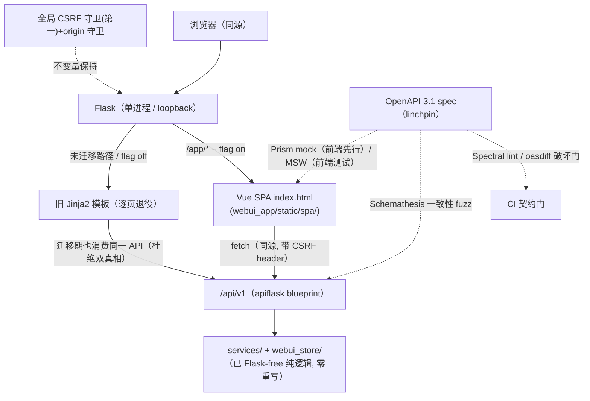
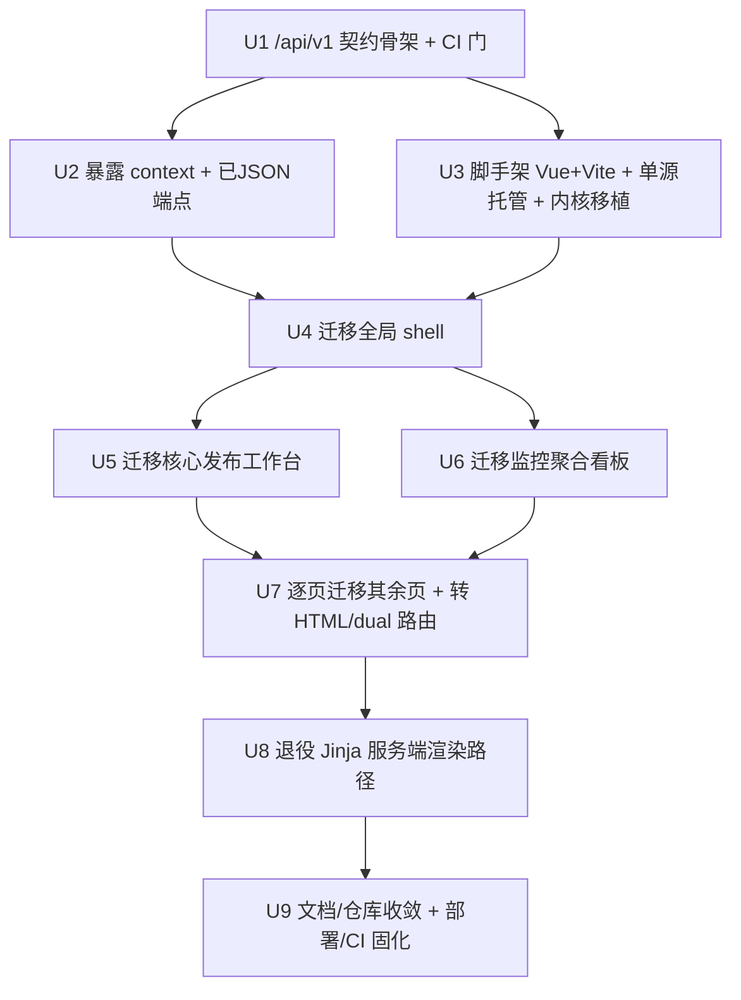

# refactor: WebUI 前后端分离 — 纯 JSON API + Vue 3 SPA（单源同部署）

## Overview

把 Backlink Publisher 的 WebUI 从「Flask 服务端渲染（Jinja2 模板 + 夹带业务逻辑的路由 + 零构建原生 ES 模块）」
重构为**真正的前后端分离**：

- **后端** 收敛为版本化纯 JSON API（`/api/v1`，OpenAPI 3.1 契约 + 统一错误信封）。
- **前端** 独立为 Vue 3 SPA（Vite 8 构建），消费 `/api/v1`，继承已 shipped 的深色控台 design tokens。

**运营形态 = 单源同部署（用户拍板）**：Vue SPA 构建为静态资源，仍由 Flask 在**同一源**下托管。
这是一个关键的降险决定——它让前后端在**代码与架构层面**彻底分离、前端现代化，但**不**把「持有真实发布凭证的进程」
暴露成跨源网络服务，从而**整块砍掉** CORS / BFF / SSRF / 跨源鉴权这一安全工程，保留现有 loopback + 同源 + CSRF 安全模型。

迁移用 **strangler-fig（绞杀者）逐页推进**：旧 Jinja 页与新 SPA 页单源共存、逐页 flag 门控切换、全程 CI 绿、随时可回退，
不做 big-bang 重写、不冻结功能。「与 `webui-console-redesign` 合并」的真实含义是：该视觉翻新**已 shipped**，
本计划在其已落地的深色控台设计系统**之上**做架构重构，**继承其 tokens、不重做视觉语言**。

> 本计划在写入后即做了一次 plan-level 深化（见 `deepened`），把研究中发现的「预判审计 / 已 shipped 翻新 / 测试真实爆炸面 / 单源安全模型」全部并入 Problem Frame、Key Decisions 与 Risks。

## Problem Frame

用户诉求：「整理代码库 + 进行前后端分离的运营方式 + 详细分析后重构」。经四路研究（仓库盘点 / 历史经验 / 迁移最佳实践 / 框架选型）后，需要诚实地把三个硬事实摆在最前面：

1. **仓库里已有一份针对此请求的预判审计。** `docs/solutions/architecture-health-audit-2026-06-01.md` 的触发标签正是
   「前后端分离 / 拆分模组 / 全面优化」。其结论：后端 `src/` 对 WebUI（`webui_app`）的导入数 = **0**——依赖层面早已分离干净；
   当前「进程内 API 衔接」（`webui_app/api/pipeline_api.py` 直接调用 CLI 引擎）是一个**刻意 shipped 的决定**
   （plan `2026-05-27-004-thin-webui-in-process-pipeline`）；并判定「瓶颈是执行与收敛，不是再拆模组」。
   **本计划必须正面回应这份审计**：见下方「本次重构买来的新价值」。
2. **`webui-console-redesign` 视觉翻新已 shipped（非在途）。** 它当初明确冻结了「零构建、不引框架、不动后端」这条边界。
   因此「合并」= 在一个**已完成**的设计系统之上做新重构，继承其深色控台 tokens，而非合并两个在飞计划。
3. **真正的难点不是拆代码，是边界处的纪律。** 实测：业务逻辑层（`webui_app/services/` 约 21–22 个模块 0 Flask 导入、`webui_store/` 仅 `registry.py` 用 Flask 作 DI shim）
   **已是 Flask-free 纯函数**，API 可直接调用、零重写；「~10000 测试大屠杀」是误传——量级是**几十个文件、非万级**。
   注：碰 HTTP 层的文件数随计数口径在 ~62（`test_webui_*`）/~94（含 `test_client`）/~110–259（宽松 grep）间浮动，断言裸 HTML 的在 ~20–86 间浮动；
   **U5–U7 的逐 PR 工作量须按执行时实测的口径校准，不要以最乐观的 94/20 定 PR 大小**（执行时用 `grep -l` + AST 复核）。代码分离本身可控。
   难点集中在：**API 契约不漂移、测试随路由迁移不丢业务规则、单源安全模型不被破坏**。

**本次重构买来的新价值（对审计的回应）：**
审计是对的——若目标是「网络化分离运营」，当前架构已无此需求，不该做。但本计划的目标不同：
（a）**前端可维护性与现代交互**——把 19 页、~24 个原生 ES 模块从「服务端渲染 + 字符串拼 DOM + 模板字面散落」升级为组件化、
可测试、可演进的 SPA，承接已 shipped 的控台设计系统；（b）**后端契约化**——把 all-HTTP-200 的 `{"ok":...}` 即席 JSON
收敛为版本化、可契约测试的 `/api/v1`，消灭 UI↔CLI 的派生数据漂移；（c）**单源**意味着这些价值**不需付出网络化的安全代价**。
跨源网络化运营（审计真正警告的那条路）被显式记为**带触发条件的延后阶段（R9）**，本轮不做。

## Requirements Trace

- **R1** — 后端收敛为版本化 JSON API：`/api/v1`（url_prefix blueprint）+ OpenAPI 3.1 契约 + RFC 9457 统一错误信封 + 真实 HTTP 状态码。WebUI 所需全部数据经契约暴露。
- **R2** — 前端独立为 Vue 3 SPA（Vite 8 + Vue Router 5 + Pinia + TanStack Query），单源由 Flask 托管，消费 `/api/v1`。
- **R3** — 把 6 个 context-processor 变量与现有 HTML 路由转成 API 端点；**服务端派生数据（active dofollow / 权益缝隙等）保持单一真相源**，不下放前端计算。
- **R4** — strangler-fig 逐页迁移：旧 Jinja 与新 SPA 单源共存、逐页 flag 门控、全程 CI 绿、随时回退；不 big-bang、不冻结功能。
- **R5** — 继承已 shipped 的深色控台 design tokens（`tokens.css`），保留双主题；把前端反铁律的**理由**映射到 Vue 机制（见 Key Decisions）。
- **R6** — 测试随路由迁移逐 PR 转换（特征化 → 契约测试 / 组件测试 / split），守住覆盖门、不留 E2E 真空。**⚠️ 前置修正（feasibility 审出）**：现有 `--cov-fail-under=80` 门**只测 `src/` 包，不含 `webui_app`**——删 Jinja 既不升也不降这个数，安全网对本次迁移是「装饰性」的。U1 须把 `webui_app` 纳入覆盖度量（或为前端单设 Vitest 覆盖门），否则 R6 的「80% 门」承诺无效。**注意（执行实测）：CI `ci.yml:134` 用裸 `--cov --cov-fail-under=80` 直接读 `.coveragerc` 的 source——直接把 `webui_app` 加进 source 会让 CI 立刻度量其覆盖率，若不足 80% 则当场破门。因此这一步必须先跑全量测出 `webui_app` 覆盖基线，再决定「单一门 + 爬坡」还是「webui_app 独立阈值」，不可盲目加行（首个 U1 commit 已暂缓此项以守住绿门）。**
- **R7** — 保留单源安全模型：loopback + 同源 + 全局 CSRF 守卫（守卫顺序不变量）+ origin guard；CSRF token 经端点暴露、前端每调用 fresh-read、永不缓存。
- **R8** — 仓库与文档收敛：更新 ARCHITECTURE / AGENTS / CLAUDE 反映新架构；收敛冗余 `OPTIMIZATION_*_REPORT.md`；以「有构建前端规则」正式取代「零构建铁律」并记录。
- **R9（延后，不在本轮）** — 跨源独立部署（前端上 CDN、后端作独立网络 API 服务）。带触发条件（出现真实第二客户端 / 远程多人运营需求）+ flag 门控；resume-trigger 见 Open Questions。

**继承自 redesign（已 shipped）的 UI 需求**（U4/U6 直接承接，列此以闭合可追溯性）：
- **R11** — 监控聚合看板：四类状态（保活/健康/权益/优化）汇成「今日异常优先」卡片视图 + 一键深钻 + 就地快捷操作。(see origin: redesign R11–R12)
- **R13** — 统一提醒系统：发布中断恢复 / 渠道凭证失效 / 监控异常用一致视觉语言（横幅/徽章/toast），取代散落各页的 alert。(see origin: redesign R13–R14)

### Success Criteria
- 任一**已迁移**页面在 `/app` 下由 Vue 渲染，数据全走 `/api/v1`；OpenAPI 契约 CI 门（Spectral + oasdiff + Schemathesis）绿。
- 旧 Jinja 页与新 SPA 页可共存、逐页切换、随时 flag 回退（回退 = 翻 flag，非重新部署）。
- 全量测试绿、覆盖 ≥80%；前端有 Vitest 组件测试 + 薄 Playwright E2E；迁移过程无 journey 级覆盖真空。
- 单源部署**不引入 CORS**；全局 CSRF/origin 守卫行为不变；发布凭证**不进**前端 bundle（无 `VITE_` 泄密）。
- 文档与代码现实一致；零构建铁律被新规则正式取代并记录；冗余优化报告完成收敛。

## Scope Boundaries

- **不做跨源 / 网络化暴露**（Option B）——本轮单源同部署；网络化为 R9 延后阶段。
- **不重组 `src/` Python 包结构**——这是**用户「全面重构」意图下被明确划界的取舍**（重构范围圈定在 WebUI/API/前端层）：审计判定 `src/` 对 WebUI 导入数=0、已分离干净、高 churn 低 ROI，故经用户认可后排除；不改 CLI 管线算法、adapter registry、`schema.py`。（System-Wide Impact / U9 中提到的 `python -m` smoke 仅为「万一发生包重排」的兜底检查，**不构成本轮要做包重排**。）
- **不改状态存储 schema**（`webui_store/` JSON 存储、`events.db`、`dedup.db`、checkpoint）。
- **不引入 SSR**——纯 SPA（内部运营者工具，无 SEO/首屏匿名需求）。
- **不引入 CSS-in-JS**——保留 `tokens.css` + Vue `<style scoped>` + `v-bind()`。
- **不重做视觉语言**——视觉翻新已 shipped，本轮继承其深色控台 tokens。
- **不 big-bang、不冻结功能**——strangler-fig 是硬约束。

## Context & Research

### Relevant Code and Patterns
- **后端业务层已就绪**：`webui_app/services/`（22/22 Flask-free，返回 dataclass/dict）、`webui_store/`（13/14 纯；仅 `registry.py` 用 Flask 作 DI shim）。API 直接调用即可。
- **`webui_app/api/` 不是 blueprint**，是被路由调用的服务门面（`PipelineAPI`/`DraftAPI`/`HistoryAPI`/`PipeResult`）。真正的「wire API」尚不存在，HTTP 绑定在 `routes/`。
- **路由面**（40 模块，无一用 `url_prefix`）：~24 个 HTML-only 端点需转 API、~15 个 dual-mode 需拆（去掉 HTML GET）、~43 个已 JSON-shaped。重 HTML 模块：`history.py`/`drafts.py`/`pipeline_plan.py`。
- **6 个 context-processor 变量**（`platforms`/`bound_platforms`/`csrf_token`/`asset_version`/`pro_status`+`llm_configured`/`lite_edition`）今天无 API 等价物，SPA 需要专门端点。
- **现有响应信封** `{"ok":bool, "flash_msg", "flash_type", ...}`、**全部 HTTP 200**；`PipelineAPI` 已带 `error_class`/`exit_code` 类型化错误（可作新错误信封基底）。
- **前端可移植内核**：`static/js/lib/api.js`（`readCsrf()` 每调用读 `<meta>`）、`ui/errors.js`（`classifyError`）、`ui/states.js`、`url_derive.js`（纯算法）。`tokens.css` 单一 `:root` token 源。
- **安全衔接**：`create_app()` 两个全局 `before_request` 守卫——`_global_csrf_guard`（必须是第一个，`test_webui_csrf_ordering.py` 不变量）+ `_global_origin_guard`（反 DNS-rebinding）。测试经 `disable_csrf` conftest fixture opt-out（裸改 `CSRF_ENABLED` 会触发 `test_security_toggle_mutation_gate.py`）。
- **部署**：单容器 monolith（`Dockerfile` + `docker-compose.yml`，loopback bind，进程内 APScheduler + Playwright + SQLite）。CI 无 Node 步骤——新增 JS 构建是净新增 CI 工作。`make test-js`（`node --test tests/js/*.mjs`）是现有唯一 JS 测试路径。

### Institutional Learnings
- `docs/solutions/architecture-health-audit-2026-06-01.md` — 见 Problem Frame #1。**计划必须开篇回应**。
- `docs/solutions/best-practices/app-level-csrf-guard-makes-blueprint-csrf-dead-code-2026-05-27.md` — app 级 CSRF 守卫先跑，per-blueprint CSRF 是死代码；要更多保护用**正交**守卫（origin/rebinding）。
- `docs/solutions/best-practices/typed-error-envelope-over-stderr-truncation-2026-05-27.md` — 复用 `PipeResult`/`error_class`/`exit_code` 作 JSON 错误 schema，不要另起炉灶。
- `docs/solutions/architecture-patterns/server-side-gap-computation-2026-06-05.md` — 「每个判断服务端算好再注入，不外包给客户端」；移派生逻辑入 SPA 会让 UI↔CLI 漂移。**R3 的硬约束**。
- `docs/solutions/best-practices/standalone-page-vs-retrofit-webui-2026-05-15.md` + `monolith_budget.toml`/`complexity_budget.toml` — monolith god-constant 的痛驱动了 sibling-page + blueprint 拆分 + SLOC 门。**强烈支持逐页迁移**而非大爆改；超 budget 需同 PR 写 ≥80 字 rationale。
- `docs/solutions/logic-errors/python-m-needs-main-module-after-package-split-2026-05-19.md` — 任何包重排后 `python -m` 会断（仅 CI smoke 抓），`tests/test_cli_layout.py` 有预防检查。
- auto-memory `user-doc-convergence-pref` / `v050-core-convergence` — 用户偏好**收敛现有文档、抗拒新路线图、用数据决策**；R8 必须用「distill 而非加 roadmap」的姿态。

### External References（2026，含来源）
- Strangler-fig / branch-by-abstraction（外到内、逐路由、flag 回退）：[Fowler](https://martinfowler.com/bliki/StranglerFigApplication.html)、[Azure](https://learn.microsoft.com/en-us/azure/architecture/patterns/strangler-fig)。
- 契约优先 + OpenAPI 3.1（`nullable` 已移除）：[OpenAPI 3.0→3.1](https://learn.openapis.org/upgrading/v3.0-to-v3.1.html)；错误信封 [RFC 9457 Problem Details](https://www.rfc-editor.org/rfc/rfc9457.html)（branch on `type` 不 branch on `title`）。
- Flask 契约工具：**apiflask 3.1**（Pydantic v2 / OpenAPI 3.1 / 纯 WSGI，推荐）或 flask-smorest 0.47（marshmallow）。契约门：[Spectral](https://github.com/stoplightio/spectral)（lint）+ oasdiff（破坏性变更 fail）+ [Schemathesis](https://schemathesis.io/)（一致性 fuzz）+ [Prism](https://stoplight.io/open-source/prism)（前端先行 mock）。
- 前端框架选型：**Vue 3.5 Composition API**（不上 3.6 Vapor beta）+ [Vite 8](https://vite.dev/blog/announcing-vite8) + Vue Router 5 + Pinia + TanStack Query（`refetchInterval` 轮询）。runner-up Svelte 5。来源见 Sources。
- 单源/部署：Vite `server.proxy`（`changeOrigin:true` 让 Flask origin guard 看到同源）→ `build.outDir` 给 Flask 托管；`index.html` `no-cache`、hashed 资源 `immutable`；`VITE_` 变量会烘进 public bundle，**禁放密钥**。
- 测试：特征化/golden-master（[approvaltests](https://pypi.org/project/approvaltests/) / syrupy，先 scrub CSRF/时间戳等非确定项）；分流决策树；前端 Vitest + Testing Library；薄 [Playwright](https://playwright.dev/python/)（有 Python binding）；[MSW](https://mswjs.io/) 从同一 OpenAPI spec 生成前端 mock。

## Key Technical Decisions

- **单源同部署**：Flask catch-all 在 `/app/*` 服务 SPA `index.html`，Vite `build.outDir → webui_app/static/spa/`。理由：保留同源安全模型，砍掉网络化的整块安全工程；契合「内部运营者工具」定位（见研究：内部工具单源更简单）。
- **API 框架 = apiflask（Pydantic v2 / OpenAPI 3.1）**，`/api/v1` url_prefix blueprint。理由：从 typed schema 生成契约、纯 WSGI 不需 ASGI 迁移。runner-up flask-smorest（marshmallow）——执行 U1 时一锤定。
- **错误信封 = RFC 9457 `application/problem+json`**，构建在现有 `PipeResult.error_class`/`exit_code` 之上（复用而非重造）；把 all-HTTP-200 改为真实状态码。SPA 只 branch on `type`，不 branch on `title`/`detail`。
- **契约即真相**：OpenAPI 3.1 spec 作 linchpin，CI 门 = Spectral（lint，强制 snake_case/描述）+ oasdiff（破坏性变更 fail，对 merged-base）+ Schemathesis（live 一致性 fuzz）；Prism mock 让前端先行；MSW 从同一 spec 生成前端测试 mock —— 一份 spec 同时喂后端一致性 + 前端 mock，结构性防漂移。
- **版本化 = URL path `/api/v1`，additive-only**（同 major 内只加不改/不删）。wire 用 **snake_case**、时间戳 **RFC 3339 UTC**、**string ID**（避 JS `Number` 精度）、集合用对象信封（**永不裸顶层数组**）、大/可变列表用 **cursor 分页**。
- **前端栈 = Vue 3.5 Composition API（`<script setup>`）+ Vite 8 + Vue Router 5 + Pinia + TanStack Query**；纯 SPA。理由见研究：从 Jinja+vanilla 心智跳跃最短、原生对接 tokens.css/主题、官方全家桶、密集表格生态最好。**不上 Vue 3.6 Vapor（仍 beta）**。
- **反铁律「理由」→ Vue 机制映射**（语法变、理由不变）：
  - `window.*` 全局 API（静默 no-op）→ **Pinia store / `emit`**（显式、可 devtools 检视）。
  - 不可信 `${…}` 入 `innerHTML`（XSS 边界）→ **Vue 默认转义**；`v-html` 是显式可 grep 的 opt-in。
  - `readCsrf()` 每调用读 `<meta>`（轮换 token 否则 403）→ **fetch 拦截器每次现读、永不缓存进 store**。
  - `asset_version`（mtime 防陈旧）→ **Vite content-hash 文件名**；处理 `vite:preloadError`。
- **迁移 = strangler-fig 外到内**：先立单源入口 → 抽 API 契约（让现有 Jinja 视图也消费同一 API，杜绝双真相）→ 迁 shell → 逐页迁移（flag 门控）→ 删 Jinja 路由+模板（删除即兑现价值）。
- **服务端派生数据保持单一真相源**：gap/dofollow/set-difference 判定留服务端（沿用 server-side-gap learning），SPA 只显示不重算。
- **测试随路由迁移逐 PR**：每个路由 cutover PR 同时带（a）路由改动（b）旧 HTML 断言的删除/转换（c）新契约测试（d）新前端组件测试 —— 套件全程绿、迁移路由覆盖不掉。决策树：view-only → 组件测试后删；业务规则经 HTML → 转契约测试；both → **split（永不折叠成 delete）**；纯逻辑 → 不动。

## Open Questions

### Resolved During Planning
- 运营形态？→ **单源同部署**（用户拍板；砍掉跨源安全工程）。
- 前端框架？→ **Vue 3**（用户拍板；研究首选）。
- `src/` 是否重组？→ **否**（审计判定已分离干净 + 收敛偏好 + 高 churn 低 ROI）。
- 测试真实规模？→ ~94 文件碰 HTTP、~20 裸 HTML、~490 纯逻辑不动（实测，非万级重写）。
- 「合并 redesign」含义？→ redesign 已 shipped，本轮**继承其 tokens**、不重做视觉。

### Deferred to Implementation
- **apiflask vs flask-smorest** 最终取舍——执行 U1 时按团队 schema 偏好（Pydantic v2 vs marshmallow）一锤。
- ~~**publish 是否暴露可轮询 task-id 进度端点**~~ — **U5 已决（降级忙碌态）**：实测后端单笔 publish 是同步阻塞（300s 超时）、无 task-id（只有批量 campaign 另有 `/api/campaign/<id>/status` 轮询）。加 task-id 须改持有真实凭证的发布路径（redesign 当初判定高风险未做），故采保守先例：`POST /api/v1/pipeline/publish` 保持同步、partial→200、total-failure→problem+json；前端走降级忙碌态分支（提交控件 in-flight 禁用防 `dedup.db` 单飞重复提交 + 软超时文案「仍在进行，可能已完成，请勿重复提交」+ 完成回填）。task-id 进度端点若日后需要，按本格式重启。
- ~~**监控聚合看板数据源**~~ — **U6 已决（复用既有聚合）**：实测后端已有 `command_center._collect_subsystem_status()` + `_build_anomaly_cards()` 聚合 + `/api/monitor-hub` JSON（redesign U5 落地），equity/optimization 也已有 `/api/*` JSON 孪生。故 U6 不重算、不新建聚合逻辑——在 `/api/v1/monitor/summary` 做薄绑定复用同一对函数（gap/severity/排序留服务端，R3 单一真相源），前端只显示（按服务端已排好的 danger→warning→ok→info 序）。fail-open：子系统级降级卡 + 聚合级 `degraded` 空载 200，永不拖垮整页。前端 TanStack Query `keepPreviousData` 轮询防闪白。
- **密集 ledger 表**——off-the-shelf grid（AG Grid / TanStack Table）vs 手写组件；窄屏卡片化断点。影响个别组件依赖，迁移时定。
- **R9 跨源网络化 resume-trigger**——当出现「真实第二客户端」或「远程/多人运营」需求时，按 deferral 格式（status + rationale + trigger）重启，届时执行研究中的安全清单（每端点鉴权 + 授权 + CORS allowlist + BFF + SSRF allowlist + 密钥管理 + TLS/HSTS + ASVS 验收）。

## High-Level Technical Design

> *以下示意「单源 strangler-fig + 契约 linchpin」的整体形态，是供评审验证方向的指引性草图，不是实现规范。实现代理应将其视为上下文，而非照抄的代码。*

迁移期的单源请求路由 + 契约作为前后端唯一耦合点：

> **图是「重构后的目标态」，不是 day-1 现状（coherence 审出）。** 「旧 Jinja 视图也消费同一 `/api/v1`」是 U1→U2→…→U7 逐步达成的*目标*——当前 Jinja 路由仍各自调 `services/`，双真相在迁移完成前并未被杜绝。把它当现状会误判风险已消除。

关键不变量：**唯一耦合点 = OpenAPI 契约**；**唯一源 = 同一 Flask origin**（dev 用 Vite `server.proxy` 镜像 prod，浏览器全程只见相对 `/api` 路径；注意 prod 是 Flask 直接托管静态文件、无 proxy，`changeOrigin:true` 仅是 dev 让 origin 守卫看到同源的权宜，prod 同源天然成立）；**安全模型不变**（CSRF 守卫仍第一、origin 守卫仍在、凭证仍仅服务端——但见上方「单源威胁模型」对 GET bootstrap 面的补强）。

## Implementation Units

> 4 阶段、9 单元，依赖序见下图。每个 cutover 单元都遵守 strangler-fig：套件全程绿、可 flag 回退。

**迁移期 UX 连续性约定（design-lens 审出，U3 立基、U4–U7 引用）：** 服务端渲染页数据随 HTML 一次到位、没有加载态；转 fetch 后**每页新增了加载/失败/空/陈旧四态**，这是回归风险点，须统一约定而非逐人发挥：
- **四态矩阵**（U3 把 `ui/states.js` 移植为单一源）：加载（skeleton/spinner 阈值）、空（图示+文案+主行动）、错误（页级 fetch 失败就地重试 vs 动作失败 toast，按 `classifyError` 分类）、陈旧（轮询用 TanStack Query keep-previous-data，监控看板每次轮询不要闪白）。
- **双栈导航寻路**（U4）：迁移期侧栏须同时列已迁移（Vue/`/app`）与未迁移（Jinja）页；点未迁移项是整页跳出 SPA（in-flight toast/轮询/store 态会丢，须明确为预期），且 `data-theme` 主题须跨边界保留（Jinja 页从 storage/服务端重置）；明确「是否给操作者标注新旧页」的决定。
- **flash→Toast 桥**（U4）：未迁移 Jinja 页仍服务端发 `{flash_msg,flash_type}`；须定义 `flash_type`→Toast 严重度映射，并明确跨边界后服务端 flash 的呈现/不重放行为，避免动作反馈静默消失。
- **a11y / 响应式基线**（U4）：SPA 路由切换移焦点到页标题 + aria-live 播报；Toast store 渲染进 aria-live 区（即「订阅契约」的 a11y 半边）；密集表用语义 `<table>`+表头关联；桌面优先、声明侧栏折叠断点与多列→单列堆叠断点。若决定延后完整 a11y，须作为显式 Scope Boundary 带触发条件记录，而非静默省略。

### Phase 0 — 契约与脚手架（无用户可见切换）

- [x] **U1：建立 `/api/v1` 契约骨架与 CI 契约门**

**Goal:** 引入 apiflask，建立 `/api/v1` url_prefix blueprint、RFC 9457 错误信封（构建于 `PipeResult`）、OpenAPI 3.1 spec 生成、CI 契约门（Spectral + oasdiff + Schemathesis）。这是 branch-by-abstraction 的 API 缝。

**Requirements:** R1, R7

**Dependencies:** 无

**Files:**
- Create: `webui_app/api/v1/__init__.py`（blueprint, `url_prefix="/api/v1"`）、`webui_app/api/v1/errors.py`（problem+json handler）、`webui_app/api/v1/schemas.py`（Pydantic DTO 基类 + 错误模型）
- Create: `openapi/backlink-api.yaml`（生成产物）、`.spectral.yaml`（lint 规则）、`.github/workflows/api-contract.yml`（或扩 `ci.yml`：spectral/oasdiff/schemathesis lane）
- Modify: `webui_app/__init__.py`（注册 v1 blueprint；**确保 `_global_csrf_guard` 仍是第一个 `before_request`**）
- Test: `tests/test_api_v1_contract.py`、`tests/test_api_v1_error_envelope.py`

**Approach:**
- blueprint `url_prefix="/api/v1"`；错误 handler 输出 `application/problem+json`，把 `PipeResult.error_class`/`exit_code` 映射为 `type`（稳定 URI）/`status`/`detail`/`errors[]`。
- 真实 HTTP 状态码（取代 all-200）；spec 从 Pydantic 生成；CI：spectral lint → oasdiff vs merged-base（破坏性变更 fail）→ schemathesis 对 live app fuzz。
- apiflask vs flask-smorest 在此一锤（见 Open Questions）。

**Patterns to follow:** `webui_app/api/pipeline_api.py` 的 `PipeResult` 错误契约；CSRF 守卫顺序（`test_webui_csrf_ordering.py` 不变量）；`docs/solutions/.../typed-error-envelope-...md`。

**Test scenarios:**
- Happy path：OpenAPI spec 通过 Spectral lint；schemathesis 对首批端点一致性绿。
- Error path：已知 `error_class` → `problem+json`（含正确 `type`/`status`，非 200）。
- Integration：注册 v1 blueprint 后 `_global_csrf_guard` 仍第一个执行（顺序不变量）。
- Edge：oasdiff 对 additive 变更通过、对删字段/改类型 fail。

**Verification:** `/api/v1` 挂载；OpenAPI spec 产出且 lint 绿；CI 契约门作为 required check 绿。

- [x] **U2：暴露 context 变量 + 已 JSON 化端点为首批 `/api/v1` 端点**

**Goal:** 把 6 个 context-processor 变量 + ~43 个已 JSON-shaped 端点纳入 `/api/v1`，直接调用既有纯 services/stores，契约锁定。

**Requirements:** R1, R3

**Dependencies:** U1

**Files:**
- Create: `webui_app/api/v1/app_config.py`（`/api/v1/app-config`、`/platforms`、`/bound-platforms`、`/pro-status`、`/csrf-token`）、按资源拆 `webui_app/api/v1/<resource>.py`
- Modify: 复用 `webui_app/services/*`、`webui_store/*`（不改其逻辑）
- Test: `tests/test_api_v1_app_config.py`、各资源契约测试

**Approach:** 薄 HTTP 绑定覆盖纯 service；snake_case wire、RFC3339 UTC、string ID、对象信封、history/ledger 用 cursor 分页。**派生数据（active dofollow / gap）仍服务端单一真相源计算**。

**Patterns to follow:** `webui_app/services/copilot_advisor.py`（返回 dataclass）；`docs/solutions/.../server-side-gap-computation-...md`。

**Test scenarios:**
- Happy path：每端点返回 spec 文档化的 schema；`/csrf-token` 返回 fresh token。
- Edge：cursor 分页在中途插入新记录后不跳/不重。
- Integration：pro/lite gating 在 `/api/v1/app-config` 正确反映；`active dofollow` 经服务端 helper 计算（与 CLI 同源，不漂移）。

**Verification:** SPA 所需全部 bootstrap 数据经 `/api/v1` 可得；契约门绿。

- [x] **U3：脚手架 Vue 3 + Vite 前端 + 单源托管 + 可移植内核移植**

**Goal:** 在 `frontend/` 建 Vue 3.5 + Vite 8 工程；dev proxy → Flask；build → `webui_app/static/spa/`；Flask catch-all 在 `/app/*`（flag 门控）服务 `index.html`，与 Jinja 共存；移植可复用内核；引入 `tokens.css` + 已 shipped 控台设计系统；CI 加 Node build/test lane。

**Requirements:** R2, R5, R7

**Dependencies:** U1（dev 时调 `/api/v1`）

**Files:**
- Create: `frontend/package.json`、`frontend/vite.config.ts`、`frontend/src/main.ts`、`frontend/src/api/client.ts`（CSRF 拦截器，移植 `lib/api.js`）、`frontend/src/router/`、`frontend/src/stores/`、`frontend/src/lib/`（移植 `ui/errors.js`/`ui/states.js`/`url_derive.js`）、`frontend/src/styles/`（import `tokens.css`）
- Create: `webui_app/routes/spa.py`（`/app/<path:p>` catch-all → `static/spa/index.html`，flag 门控）
- Modify: `Dockerfile`（多阶段：Node build → 拷 dist）、`.dockerignore`、`.gitignore`（`node_modules`、`frontend/dist`）、`.github/workflows`（node build + vitest lane）
- Test: `frontend/src/**/*.spec.ts`（vitest）、`tests/test_spa_catchall.py`

**Approach:** 纯 SPA；Vite `server.proxy` `/api → :8888`（`changeOrigin:true` 让 origin guard 看到同源）；`build.outDir = webui_app/static/spa`；`index.html` `no-cache`、hashed 资源 `immutable`；CSRF 拦截器每调用读 token、**永不缓存**；主题用 `data-theme` + 小 Pinia store；无 CSS-in-JS；处理 `vite:preloadError`。

**⚠️ U3 三个执行前必须先拍板的衔接点（feasibility 审出，否则一开工就卡）：**
- **`asset_version` 走查碰撞**：`_compute_asset_version()` 递归 `os.walk(static_folder)`；dist 落在 `webui_app/static/spa/` 会被这个开机走查遍历、且对已带 content-hash 的 SPA 资源毫无意义。U3 起 dist 与旧 mtime 缓存机制就并存（到 U8 才退役 `asset_version`）——须**把 `static/spa` 排除出走查或改 outDir 位置**。
- **catch-all 与 Flask 自带 `/static` 路由 + Vite `base` 的优先级**：Flask 默认注册 `/static/<path>`；新 `/app/<path>` catch-all 必须既不吞 `/api` 404、也不让 SPA 自身的 JS/CSS 资源请求落到 catch-all 拿到 `index.html`（经典 SPA fallback bug）。须先定 Vite `base` + 路由优先级。
- **Dockerfile 是净新增 Node 阶段不是「Modify」**：现 Dockerfile 是纯 Python builder+runtime、无 Node；CI 当前零 Node 引用。U3 要加 Node base image + `npm ci` + `vite build` + 拷 dist，并把 `node_modules`/`frontend/dist` 加进 `.dockerignore`/`.gitignore`。工作量按净新增基建估，别按一行 Modify 估。
- **`tokens.css` 双主题落地**：须确认 redesign 的 `tokens.css` 是已含明/暗两套变量、还是只有暗色——决定 SPA 是直接 import 还是要另搭 `data-theme` 覆盖层（R5）。

**Patterns to follow:** `static/js/lib/api.js`（`readCsrf` 每调用）；`static/css/tokens.css`；framework 研究的「`tokens.css` 原样保留」结论。

**Test scenarios:**
- Happy path（vitest）：移植的 fetch 拦截器每调用现读 CSRF（不缓存）；`ui/states`/`url_derive` 行为等价旧实现。
- Integration：`npm run build` 产 dist 被 Flask 在 `/app` 服务；dev proxy 命中真实 Flask；主题切换翻 `data-theme`。
- Edge：深链刷新 `/app/` 仍返回 `index.html`（SPA fallback，且不吞 `/api` 的真实 404）。
- 反铁律：无 `window.*` API；Vue 默认转义生效。

**Verification:** `/app` 显示带主题的 SPA shell；dev/prod 单源一致；CI Node lane 绿。

### Phase 1 — Shell + 最高价值页面

- [x] **U4：迁移全局 shell（侧栏/顶栏/主题/Pro/通知）到 Vue**

**Goal:** 把全局 shell 迁入 Vue，消费 `/api/v1/app-config`；用 Vue 组件 + Pinia 事件 store **取代** `notifications.js`（该 700 行层违反反铁律：`innerHTML` 拼接 + `window.notifications` 全局、且无订阅契约）；规划 z-index（含 copilot 浮层）。

**Requirements:** R2, R5, R13（继承自 redesign）

**Dependencies:** U2, U3

**Files:** Create `frontend/src/layout/*`、`frontend/src/stores/notifications.ts`、`frontend/src/components/Toast.vue`、`frontend/src/components/SideNav.vue`（`/app` 下）

**Approach:** `emit`/Pinia 取代 `window.*`；Toast/通知中心提供订阅契约；侧栏体现 pipeline 心智模型 + 活跃态；继承 redesign 的深色控台观感。

**Patterns to follow:** redesign plan `2026-06-17-001` 的 shell/z-index 规划；现有 `nav.js`/`theme.js` 行为。

**Test scenarios:**
- Happy path（组件）：侧栏活跃态随路由更新；主题持久化（reload 保留）。
- Edge：toast 生命周期（出现/堆叠/消失）；通知订阅多消费者不漏。
- Integration（E2E smoke）：`/app` shell 导航在单源下渲染、CSRF header 随 fetch 带出。

**Verification:** `/app` 全局 shell 由 Vue 渲染、观感统一控台风、通知走新订阅契约。

- [x] **U5：迁移核心发布工作台（plan/generate/validate/preview/publish）**

**Goal:** 迁移最高 churn/价值的单笔发布四阶段工作台；把其路由转 `/api/v1`（**特征化先行**）；承接 redesign 的单页分步 + 长任务进度（TanStack Query `refetchInterval` 轮询）。

**Requirements:** R1, R2, R4, R6

**Dependencies:** U4

**Files:**
- Modify→Convert: `webui_app/routes/pipeline_plan.py`、`pipeline_publish.py`、`pipeline.py` → `/api/v1/pipeline/*` 端点
- Create: `frontend/src/pages/Publish/*`
- Test: `tests/test_api_v1_pipeline.py`（契约）、`frontend/src/pages/Publish/*.spec.ts`（组件）、`tests/e2e/publish_journey.py`（Playwright）

**Execution note:** 特征化先行——对现有路由建 golden master（scrub CSRF/时间戳），抽 API 于其下、保持 Jinja 渲染在上验证行为保持，再翻 JSON、退役 HTML golden master。

**Approach:** publish task-id 进度按后端实况决定（小改加 task-id 或降级忙碌态，见 Open Questions）；错误经 problem+json → `classifyError` 分类 UI。**两个分支的 UX 内容都须先定义、再让后端决定走哪支（design-lens 审出，列为 Success Criterion 防静默丢失）**：task-id 分支 = 复用 redesign 阶段反馈语言的逐阶段标签 + 已耗时 + 取消入口；降级忙碌分支 = 明确文案「发布进行中，请勿关闭此页—完成后自动刷新」+ 动态指示器 + 软超时后转「仍在进行/可能已完成，请勿重复提交」而非看似卡死 + **禁用提交控件防止违反 `dedup.db` 单飞的重复提交**。

**Patterns to follow:** `webui_app/api/pipeline_api.py`（in-process 调用 + subprocess publish）；redesign 的阶段反馈语言。

**Test scenarios:**
- Happy path：plan→validate→preview→publish 全程契约绿；进度轮询渲染阶段文案。
- Error path：publish 失败 → problem+json（正确 `type`/status）→ 分类错误 UI + 重试。
- Edge：取消进行中 publish（若后端支持）；空输入/校验拒绝。
- Integration（E2E）：单源下完成一次发布全程不跳出工作台。

**Verification:** 核心发布全程在 `/app` Vue 工作台完成；契约 + 组件 + E2E 三层绿。

- [x] **U6：迁移监控聚合看板（keep_alive/health/equity/optimization）**

**Goal:** 迁移 redesign 的「今日异常优先」聚合看板；`equity`/`optimization` 当前仅 HTML → 转 JSON；决定数据源（聚合四路由 vs 新 `/api/v1/monitor/summary`）。

**Requirements:** R1, R2, R3, R11（继承）

**Dependencies:** U4

**Files:** Convert `webui_app/routes/equity_ledger.py`、`optimization_status.py`、`keep_alive.py`（`health.py` 已 JSON）；可能 Create `webui_app/api/v1/monitor.py`；Create `frontend/src/pages/Monitor/*`；Test 对应契约 + 组件。

**Approach:** 异常按优先级排序 + 就地快捷操作链接既有路由；**权益缝隙服务端单一真相源计算**（不前端重算）。

**Test scenarios:**
- Happy path：四类状态汇成卡片、异常优先排序。
- Integration：equity gap 由服务端 helper 算（与 CLI 同源）；一键深钻跳对应页。
- Edge：全绿（无异常）空态引导。

**Verification:** 监控异常一眼可见、一键深钻；`equity`/`optimization` 已 JSON 化、契约绿。

### Phase 2 — 其余页面 + 退役 Jinja

- [ ] **U7：逐页迁移其余页面 + 转换剩余 HTML / dual-mode 路由**（进行中——逐页 PR）

> **U7 进度（逐页迁移）**：✅ **历史页**（`/api/v1/history*` + Vue `/history`，已迁，旧 `/ce:history*` 加法式保留待 U8 退役）。⏳ 待迁：drafts / sites / schedule / batch / batch_campaign / profiles。🔴 **Settings 为独立硬子单元**（~25 分片 + Jinja macro CSRF 绑定陷阱 + 凭证写端点，须在传输层测安全回归：伪造 Origin 仍 403 / `ALLOW_NETWORK=1` 仍拒 / 文件仍 `0600`）——单独一 PR、放最后。已迁导航页：发布工作台 `/`、监控 `/monitor`、历史 `/history`。

**Goal:** 逐页（或小簇）迁移 history/drafts/settings/sites/batch/batch_campaign/schedule/profiles 等；把剩余 ~24 HTML-only + ~15 dual-mode 路由转 `/api/v1`；测试随路由按决策树迁移。

**Requirements:** R1, R2, R4, R6

**Dependencies:** U5, U6

**Files:** 多——每页一 PR：Convert 对应 `routes/*.py`、Create `frontend/src/pages/<page>/*`、迁移/拆分对应 `tests/test_webui_*.py`

**Execution note:** 每页特征化先行；每 cutover PR 同带「路由改 + 旧断言转换/删 + 新契约测试 + 新组件测试」，套件全程绿。**⚠️ U7 是按权重严重欠拆的最大单元（adversarial 审出）**：模板实为 ~44 个 `.html` = ~19 页 + **~25 个 settings 分片/宏**（`_settings_*.html`、`_channel_card_macro.html` 等）。Settings 是十几个互相依赖的分片 + 文档化的「Jinja macro 不继承 context → CSRF 绑定 403」陷阱，**是最难的单页、不是收尾扫尾项**——应把 Settings 拆为 U7 的独立子单元/独立 PR，并把 macro/CSRF 绑定隐患列为一级风险（**在传输层测**，不靠 Jinja render 测试）。

**Approach:** 高 churn 页先（已在 U5/U6）、稳定页后；追踪「% 路由已迁移」作一级指标，每个 Jinja 路由删除是有主、有期的交付。

**Test scenarios:**
- 每页 Happy path：契约 + 组件测试。
- Error/Edge：settings 绑定 CSRF 在传输层验证（403 不回归）；表单校验拒绝转契约测试。
- 决策树：view-only 断言迁组件测试后删；业务规则断言转契约测试；both 必 split。

**Verification:** 所有页面在 `/app` 由 Vue 渲染、数据全走 `/api/v1`；覆盖 ≥80%。

- [ ] **U8：退役 Jinja 服务端渲染路径**

**Goal:** 所有页 100% 落 SPA 后，删除 Jinja 模板 + 服务端渲染路由 + `asset_version` + Bootstrap head 脚本 + `page_data` islands；SPA 成默认 UI（`/` → SPA）；移除 flag 门控；删除已迁移的 HTML golden-master 测试。

**Requirements:** R4

**Dependencies:** U7

**Files:** Delete 大部分 `webui_app/templates/*`、`base.html`；Prune `webui_app/routes/*` 的渲染路由；Modify `webui.py`（根服务 SPA）；更新 `monolith_budget.toml`/`complexity_budget.toml`（移除模板相关项，同 PR 写 rationale）

**Approach:** 删除即兑现价值；确认无业务规则丢失（规则已在 U5–U7 转契约测试）。

**Test scenarios:**
- Integration：全量套件绿、覆盖 ≥80%（业务规则全在契约/组件测试存活）。
- Edge：根路径 `/` 直达 SPA；旧 Jinja 路由 404/移除无残链。
- 反向验证：grep 确认无 `render_template` 残留于业务路由。

**Verification:** 无 Jinja 渲染路径残留；SPA 为默认；budget 测试绿。

### Phase 3 — 仓库/文档/运营收敛（用户要的「整理」）

- [ ] **U9：文档与仓库收敛 + 部署/CI 固化**

**Goal:** 更新 `ARCHITECTURE.md`/`AGENTS.md`/`webui_app/AGENTS.md`/`CLAUDE.md` 反映 API + SPA 新架构；以「有构建前端规则 + 反铁律→Vue 映射」**正式取代**「零构建铁律」；收敛冗余 `OPTIMIZATION_*_REPORT.md`（4 份 → distill/归档）；记录 R9 延后触发条件。

**Requirements:** R8, R9

**Dependencies:** U8

**Files:** Modify `ARCHITECTURE.md`、`AGENTS.md`、`webui_app/AGENTS.md`、`CLAUDE.md`；Archive/distill `OPTIMIZATION_REPORT.md`/`OPTIMIZATION_COMPLETE_REPORT.md`/`OPTIMIZATION_PHASE3_REPORT.md`/`FINAL_OPTIMIZATION_REPORT.md`；Create `docs/solutions/` 一条本次重构的 learning（含 R9 trigger）

**Execution note:** 这是用户要的「整理」——用收敛姿态（distill 而非加 roadmap，遵循 `user-doc-convergence-pref`）。任何 `src/` 包重排（本轮非目标）若发生，跑 `python -m` smoke（`tests/test_cli_layout.py`）。

**Patterns to follow:** `v050-core-convergence` 的收敛做法；`2026-06-05-lite-accepted-deferrals.md` 的 deferral 格式。

**Test scenarios:** Test expectation: none —— 文档/收敛单元，无行为变化；唯一硬约束是模板移除后 `monolith`/`complexity` budget 测试与全量套件保持绿。

**Verification:** 文档与代码现实一致；零构建铁律已被新规则取代并记录；冗余报告完成收敛；R9 trigger 入库。

## System-Wide Impact

- **Interaction graph:** `create_app()` 的 6 个 context-processor + 2 个 `before_request` 守卫是跨切面核心。新增 v1 blueprint 不得改 CSRF 守卫顺序（`test_webui_csrf_ordering`）；`asset_version` 在 U8 退役（被 Vite content-hash 取代）。
- **Error propagation:** CLI subprocess（`publish-backlinks`）的 `__BLP_ERR__` 类型化信封 → `PipeResult.error_class`/`exit_code` → `/api/v1` problem+json → 前端 `classifyError` 分类 UI。这条链是错误传播主干，迁移须保持端到端。
- **State lifecycle risks:** 进程内 APScheduler + Playwright + SQLite（`events.db`/`dedup.db`）仍归后端单实例所有——单源不改这点；publish 幂等（`dedup.db` 单飞语义）是正确性关键，迁移不得旁路。
- **API surface parity:** 迁移期旧 Jinja 视图也消费同一 `/api/v1`（杜绝双真相）；`make test-js` 的 7 个 `.mjs` 测试在 JSON 契约稳定时存活。
- **Integration coverage:** 单源 CSRF/origin 守卫、publish 进度轮询、监控派生数据单一真相源——这些跨层行为靠契约测试 + 薄 Playwright E2E 守，不靠组件 mock。
- **Unchanged invariants（蓝图爆炸半径保证）:** `src/backlink_publisher/` CLI 管线、adapter registry、`schema.py`、状态存储 schema、全局 CSRF/origin 守卫语义、loopback 默认 bind、凭证仅服务端——**本计划显式不改**。新 API 是这些不变量之上的新表达层。

## 单源威胁模型（Single-origin Threat Model）

> security-lens 审出：原计划把安全叙事完全寄托在「单源砍掉跨源安全工程」，把整张安全清单推给 R9——但**单源模型自身有三个本轮就存在的暴露面**，必须显式列入并在对应单元加验收，不能只当成「守卫顺序别破」。

- **威胁 1（最可能）— bundle XSS 驱动凭证/发布 POST。** 从 Jinja 字符串拼 DOM 转到 Vite 打包的 JS 依赖树，新增供应链 + `v-html` 执行面；而 SPA 的 fetch 会自动带 CSRF header，一旦 XSS 即可发起 bind/publish。**缓解（入 U3 + Documentation）**：SPA `index.html` 下发 CSP（至少 `default-src 'self'; script-src 'self'; frame-ancestors 'none'`）+ `X-Frame-Options: DENY` + `X-Content-Type-Options: nosniff`（**注意：本仓当前零安全响应头，这是净新增**）；锁 lockfile + CI `npm audit` 门。
- **威胁 2（最高影响）— DNS-rebinding 经未守卫的 bootstrap GET 读 CSRF token。** 现有 `_global_origin_guard` **只检查 POST/PUT/PATCH/DELETE**；而 SPA 的 `index.html`、`/api/v1/app-config`、新增的 **`/api/v1/csrf-token`（GET）** 都走 GET，守卫不覆盖。新的 token-披露 GET 端点是本轮净新增暴露面。**缓解（入 U2 + 立为不变量，与 CSRF-ordering 并列）**：对敏感 GET 端点（`/api/v1/csrf-token`、`/api/v1/app-config`）加 GET 时的 origin/Host 校验，并加一条「rebinding 页无法跨源 GET 读取 bootstrap/token」的测试。
- **威胁 3（最隐蔽）— HTML→JSON 转换时静默丢失 per-route 凭证守卫。** `token_paste` / `channel_bind_save` / `bind`（写 `0600` 凭证文件、`bind.py` 自带 `_enforce_loopback` / `_refuse_when_allow_network`）在 U5/U7 转 `/api/v1` 时，契约测试只验 schema、**不验这些守卫还在**。**缓解（入 U7 Execution note）**：凭证写端点转换后加安全回归测试——伪造 Origin 仍 403、`ALLOW_NETWORK=1` 仍拒、文件仍 `0600`。
- **CI 隔离（U1）**：Schemathesis live-fuzz **不得**打到带真实凭证/可联网/真状态库的实例——须对临时实例跑（无凭证、`BACKLINK_NO_FETCH_VERIFY`/断网、抛弃式 state store），否则可能触发真实发布或把密钥泄进 CI 日志。
- **测试盲点（feasibility）**：`_global_origin_guard` 在 pytest 下被禁用——上述 origin/rebinding 不变量**无法靠 Python 单测验证**，须由 Playwright E2E（真 Origin header）覆盖。

## Risks & Dependencies

| 风险 | 缓解 |
|------|------|
| 与审计「分离已健康、瓶颈是收敛」冲突——做了高成本低 ROI 的事 | 单源选择砍掉网络化成本；价值锚定在前端可维护性 + 契约化（非网络化）；R9 网络化显式延后带 trigger；Problem Frame 正面回应审计 |
| 契约漂移（服务端测实现不测契约，SPA 突然崩） | OpenAPI 3.1 单一 spec + Spectral/oasdiff（破坏门）/Schemathesis（一致性）作 required CI check；前端 MSW 从同一 spec 生成 |
| 测试迁移误删编码业务规则的 HTML 断言 | 决策树强制 both→split、永不折叠成 delete；特征化 golden master 先 pin 行为；每 cutover PR 套件全程绿、覆盖不掉 |
| 单源 CSRF/origin 守卫被破坏（守卫顺序 / 每调用现读 token） | 保留全局守卫 + 顺序不变量测试；CSRF 拦截器每调用读、永不缓存进 store；Vite `changeOrigin:true` 让 dev 也走同源 |
| budget 天花板批量击穿（模板删除 / 新文件） | 逐页增量（非大爆改）天然分散；超 budget 同 PR 写 ≥80 字 rationale；U8 集中处理模板移除的 budget 调整 |
| 迁移「永不收尾」（双栈双维护拖长） | 追踪「% 路由已迁移」一级指标；每个 Jinja 路由删除是有主、有期、flag 门控的交付；strangler 不冻结功能 |
| 版本偏移（旧 SPA bundle 调到已变 API） | additive-only + `/api/v1`；单源 + content-hash + 保留旧 hashed 资源；后端先部署 |
| publish 无 task-id 致进度反馈降级 | U5 时按后端实况：小改加 task-id 或降级忙碌态（沿用 redesign 先例），并记入计划 |
| 净新增 Node/Vite 构建 + CI lane 对小团队的运维负担 | 单源 Flask 托管 dist（一个部署目标）；契约门自动化；R9 之前不引第二部署面 |

## Phased Delivery

- **Phase 0（U1–U3）**：契约骨架 + 前端脚手架。无用户可见切换，纯基座；可独立验收（契约门绿 + `/app` shell 起得来）。
- **Phase 1（U4–U6）**：迁 shell + 最高价值两块（发布工作台 + 监控看板）。这是价值兑现的拐点——核心流程已在新前端。
- **Phase 2（U7–U8）**：逐页清扫 + 退役 Jinja。`/app` 成默认、服务端渲染路径消失。
- **Phase 3（U9）**：文档/仓库/运营收敛（用户要的「整理」），并把 R9 网络化以 trigger 入库。

**收敛护栏（adversarial 审出，防双栈无限期拖延）：** strangler-fig 在 U3–U8 期间是「双栈双维护、代码比现在更复杂」的状态。设一个 **Phase 1 完成后的检查点**：到点要么承诺推进至 U8 完成，要么把双栈**有意冻结在一个稳定边界**（明确「可接受的永久部分迁移」长什么样、停在哪条路由边界），不让停滞静默变成无限期双维护。「% 路由已迁移」只是度量、不是收敛机制。

## Documentation / Operational Notes

- `CLAUDE.md`/`AGENTS.md` 的「零构建铁律」在 U9 被「有构建前端规则」取代——这是面向未来贡献者的关键文档变更，须显式记录新旧映射，避免后续 agent 误用已废规则。
- 部署：单容器多阶段（Node build dist → Python 运行）；`index.html` `no-cache`、hashed 资源 `immutable`；`VITE_` 变量禁放密钥。
- 可观测性：跨 SPA↔API 传 correlation id（W3C `traceparent`），API 响应回带，便于把前端错误对到后端请求。
- R9（跨源网络化）resume-trigger 入 `docs/solutions/`：出现真实第二客户端 / 远程多人运营时重启，届时执行安全清单。

## Sources & References

- 触发请求：用户 `/ce:plan`「前后端分离 + 整理 + 重构」；决策经两轮澄清（单源同部署 + Vue 3 + 全面重构但 `src/` 不重组）。
- 关联代码：`webui_app/`（routes/api/services/templates/static）、`webui_store/`、`webui.py`、`create_app()`。
- 关联已 shipped 计划：`docs/plans/2026-06-17-001-feat-webui-console-redesign-plan.md`（继承其 tokens）；`docs/plans/2026-06-18-001-feat-v050-core-convergence-plan.md`（收敛姿态）。
- 关键 learning：`docs/solutions/architecture-health-audit-2026-06-01.md`（预判审计，必读）、`server-side-gap-computation-2026-06-05.md`、`typed-error-envelope-over-stderr-truncation-2026-05-27.md`、`app-level-csrf-guard-makes-blueprint-csrf-dead-code-2026-05-27.md`、`standalone-page-vs-retrofit-webui-2026-05-15.md`、`python-m-needs-main-module-after-package-split-2026-05-19.md`。
- 外部：[Strangler-fig (Fowler)](https://martinfowler.com/bliki/StranglerFigApplication.html)、[RFC 9457 Problem Details](https://www.rfc-editor.org/rfc/rfc9457.html)、[OpenAPI 3.0→3.1](https://learn.openapis.org/upgrading/v3.0-to-v3.1.html)、[apiflask](https://apiflask.com/)、[Schemathesis](https://schemathesis.io/)、[Vite 8](https://vite.dev/blog/announcing-vite8)、[Vite server.proxy](https://vite.dev/config/server-options)、[Vue Router 5 (InfoQ)](https://www.infoq.com/news/2026/03/vue-router-5/)、[Vue SFC CSS / v-bind()](https://vuejs.org/api/sfc-css-features.html)、[MSW](https://mswjs.io/)、[Playwright Python](https://playwright.dev/python/)。
