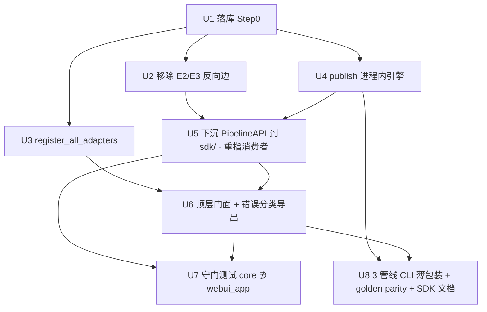

# refactor: 可嵌入库/SDK 抽取 — 让别的程序能 import 这条管线

## Overview

把 `plan → validate → publish` 三段管线升级成「别的 Python 程序能 `from backlink_publisher import plan, validate,
publish` 在进程内调用、拿到 typed 结果」的 SDK。**约 60% 已经做完**：`plan/validate/report` 早已是进程内纯函数
（`webui_app/api/pipeline_api.py:275-404` 直接调 `plan_rows`/`validate_rows`，无子进程）。真正的工作集中在三块：

1. **publish 段进程内化**——给 publish 一个返回 typed 结果（而非 `raise SystemExit`）的引擎入口，浏览器兜底保留隔离边界。
2. **把 `PipelineAPI` 从 `webui_app` 提到核心**——消除核心对 `webui_app` 的反向依赖，让核心可独立发货，`/api/v1` 改为消费核心 SDK。
3. **顶层门面 + 错误分类导出 + 显式 adapter 注册**——让 `import backlink_publisher` 有意义。

范围锁定为**单进程单配置**（不做多租户/注入式 Config），不碰 LITE 单操作者安全姿态，不发 PyPI。

## Problem Frame

承接 `(see origin: docs/brainstorms/2026-06-22-embeddable-sdk-extraction-requirements.md)`。用户诉求：让项目成为「成熟可
重复使用的工具」，经 brainstorm 收敛为**可嵌入库/SDK**方向、**全管线·单配置**范围、**先落库再并行**排期。本计划经
6 路文件级研究（5×repo-research + 1×learnings，对着真实代码核实），把 origin 的几处事实校正后落到可执行的实现单元。

**研究校正的关键事实（plan 以这些为准）：**

| 项 | origin/评审说法 | 研究 grep 实证 | 影响 |
|---|---|---|---|
| 核心→webui_app 反向边 | 5 条 | **3 条真 import**（全在 `keepalive/chain.py:101/141/270`）；`medium_auth.py:3`/`medium_liveness.py:3` 是 **docstring 出处注释**，非 import | U2/U5 不必碰 medium 文件；守门测试用 AST（天然忽略字符串） |
| typed 结构 | 「沿用现有 dataclass」 | 是 **Pydantic v2 模型**（`PlannedPayload`/`SeedPayload`，`schema._payload_types`）+ `AdapterResult` 是 `@dataclass`（`adapters/base.py:78`） | 门面/结果类型描述更正；不引入新依赖 |
| 守门机制 | 「import-linter 或等价」 | repo **无 import-linter**，CI 用 `py_compile`+`ast.parse`；既有范式是 **AST pytest gate**（`test_pipeline_api_seam.py`） | U7 用 AST pytest，**不**引入 import-linter |
| 守门范围 | 「核心 ∌ webui_app」 | 核心**合法依赖 `webui_store`**（`canary/store.py:43` 等 ~10 处）；只 `webui_app`（Flask app）是禁区 | 守门**只**匹配 `webui_app`，放行 `webui_store` |
| library plan/validate | 「内核已 library-grade」 | 内核为真，但**没有** library 级 `plan()/validate()` 可调函数——只有 CLI `main(argv)` 与 webui 内的 `PipelineAPI` | 门面经 U5 下沉的 PipelineAPI + 薄函数暴露 |

## Requirements Trace

承接 origin 的 R1–R11（含 R7a/R7b）。映射到实现单元：

- **R1**（顶层门面 `__all__`，import 无副作用）→ U6
- **R2**（全管线进程内、typed、无子进程/argparse；浏览器兜底例外）→ U4 + U5 + U6
- **R3**（错误分类导出，对应 exit 2/3/4/5）→ U6
- **R4**（移除 3 条反向边 + 守门「核心 ∌ webui_app」）→ U2（E2/E3）+ U5（E1）+ U7（守门测试）
- **R5**（publish 进程内入口：去 SystemExit、副作用可注入、浏览器隔离保留）→ U4 + U5
- **R6**（显式 `register_all_adapters()`，兼容 import 副作用）→ U3
- **R7a**（3 个管线 CLI 薄包装、零行为变化）→ U4（publish main 薄化）+ U8（plan/validate repoint + golden parity）
- **R7b**（其余 ~47 CLI 机会主义迁移）→ Deferred（见 Open Questions）
- **R8**（已存在 /api/v1 端点消费核心 SDK，不新增端点）→ U5
- **R9**（单进程单配置下现有运行方式不破坏）→ 全单元的 golden/characterization parity 守护
- **R10**（SDK 快速上手示例）→ U8
- **R11**（公共 API 契约 + 守门测试）→ U6（门面 resolvable）+ U7（守门）

## Scope Boundaries

- **单配置嵌入，非可组合多目标**：单进程单配置；并发驱动两账号会撞 `os.environ` 共享。88 处 env 注入式改造**明确不做**（XL/YAGNI）。
- **不引入新运行时依赖**（含 import-linter、pydantic 之外的库）；typed 结果用现有 Pydantic v2 模型 + `AdapterResult` dataclass。
- **不**做多用户/登录/审计/联网产品化；LITE 单操作者安全姿态原封不动。
- **不**强行去隔离化 publish 的浏览器兜底；崩溃隔离边界刻意保留。
- **不**改 CLI 的 stdin/stdout JSONL 对外契约；CLI 仍是 JSONL 管线，只是内部改走 SDK。
- **v1 SDK 只覆盖 fresh publish**（深化新增·命名限制——评审）：`resume`（断点续发）**仍只走子进程/CLI**（它有独立 loop 与 0/4/5 epilogue 表）。嵌入方需对中断发布续跑时本版需 shell out；此限制写进 SDK quickstart（U8），避免调用方建在对 resume 静默降级的契约上。
- **不**做 PyPI 发布 / `bp init` / `bp` 总入口收敛（属「可重复部署」方向）。
- **不** re-litigate 已 shipped 的模组化（2026-06-01 架构审计：后端已 24 子包、`_report_engine` 进程内衔接是刻意决定）。

## Context & Research

### Relevant Code and Patterns

- **进程内内核（参照实现）**：`webui_app/api/pipeline_api.py:275 plan()` / `:336 validate()` —— StringIO 建 JSONL + 把
  `outcome.errors`/抛出的 typed error 映射成 `PipeResult`。这两个方法**就是** SDK 的参照实现。
- **publish 引擎内核**：`cli/publish_backlinks/_engine.py:64 run_publish_loop` + `:91 _publish_one_row`（已大体纯计算，
  返回 `_AUTH_ABORT`/`_ROW_CONTINUE` 哨兵），唯一例外是 `:276-279` 的 `DependencyError → emit_error(exit_code=3) →
  raise SystemExit`。`PublishRunState`（`_engine.py:27-61`）是累加器。
- **「定义即自调」注册范式**：`publishing/adapters/__init__.py:381` 的 `register_catalog_entries()` 先定义后在模块底部
  调用——`register_all_adapters()` 照此镜像。
- **薄壳 over 引擎范式**：`plan_backlinks/_engine.py` + `core.py:66`（shell 只管 argparse/I/O/banner/exit-code）；
  `validate_backlinks.py:5-7` 明示「config 容错 / config_echo banner / exit-code 纪律留在壳里、不进引擎」。
- **subparser 委派范式**：`cli/weights.py:23-57` + `:130 main()`——「parse→transl委→调 backend main→返回 exit code，dispatcher 无业务逻辑」。
- **AST 结构不变量守门范式**：`tests/test_pipeline_api_seam.py:51-91`（rglob+ast.walk+allowlist）、
  `tests/test_webui_helpers_subpackage_acyclic.py:31-59`（ImportFrom + `node.level==1` 处理相对 import）、
  `tests/test_no_orphan_code.py`（ALLOWLIST + 叙述式 assert message）。
- **进程内 characterization 范式**：`tests/test_pipeline_inprocess_characterization.py:291-556` 在进程内驱动
  `PipelineAPI().plan()/validate()` 并断言 `.success/.exit_code/.error_class/.rows/.stdout`。
- **错误分类源**：`_util/errors.py` —— `PipelineError(5)` 基类，`UsageError(1)`/`InputValidationError(2)`/
  `DependencyError(3)`/`ExternalServiceError(4)`/`InternalError(5)` + 家族扩展（`AuthExpiredError(3)`/`AntiBotChallengeError(4)`
  等）；每个类自带 `.exit_code`。`emit_error()`（`:208`）打 stderr + ErrorEnvelope + `raise SystemExit`。
- **测试分层**：模块级 `__tier__ = "unit"|"integration"|"e2e"`（非装饰器），`conftest.py:22-35` 自动加 marker，缺省 `unit`；
  e2e 在 `tests/e2e/`（默认 glob 之外）。`conftest.py` autouse 关真实 socket——进程内 dry-run smoke 在 mock 下天然网络隔离。

### Institutional Learnings

- `docs/solutions/architecture-health-audit-2026-06-01.md`：后端 `src/` 对 `webui_app` 导入数当时记为 0；`_report_engine`
  进程内衔接是刻意 shipped 的决定。→ 本计划「3 条反向边」是该审计后由 PipelineAPI 衔接引入的，属新增债，正好该清。
- `docs/solutions/best-practices/extract-cli-epilogue-block-2026-05-26.md`：抽 CLI epilogue 到 helpers/engine、固定参数签名、
  library 路径抛 typed 异常而非 SystemExit。→ 直接指导 U4 拆 `_publish_epilogue`。
- `docs/solutions/integration-issues/dofollow-canary-verdict-dropped-at-publish-output-seam-2026-05-25.md`：publish 有
  **两条 emit 路径**（fresh: `base.py::to_publish_output`；resume: `cli/_resume.py::item_to_publish_output`），本仓有
  「漏掉一条 dispatch 路径」的复发 bug 类。→ U4 publish 输出构造必须两路共用一个 carry-helper，并每路测「在场+缺席」。
- `docs/solutions/best-practices/typed-error-envelope-over-stderr-truncation-2026-05-27.md` + `_util/error_envelope.py`：
  `__BLP_ERR__` 信封 + chokepoint emit + AST 守门；`error_class=type(exc).__name__` 防 `AuthExpiredError` 被误标。→ U6 错误分类导出照此。
- `docs/solutions/logic-errors/argparse-choices-vs-usage-error-exit-clash-2026-05-20.md`：`argparse choices=` 静默 exit 2 与
  repo `UsageError` exit 1 冲突。→ U8 重写 CLI 时闭集校验走 post-parse `UsageError`，别用 `choices=`。
- `docs/solutions/architecture-patterns/2026-06-05-lite-accepted-deferrals.md`：LITE 单操作者是 accepted 基线；circuit breaker
  跨进程 flock 是既定模式。→ 强化「单配置、circuit 无需注入」决定。

### External References

无。本次为成熟、模式清晰的内部重构，本地范式充足（引擎抽取已完成、subparser/AST 守门/进程内 characterization 均有现成范式），
外部最佳实践帮助有限——已按 ce-plan §1.2 跳过外部研究。

## Key Technical Decisions

- **SDK 包落点 = `src/backlink_publisher/sdk/`**，根 `__init__.py` 再导出门面名。理由：`PipelineAPI` 现居 `webui_app`，
  从核心 import 它无法证明「核心 ∌ webui_app」；必须把它**下沉**到 `src/`，两边（webui + /api/v1）消费同一个核心类。
- **门面 import 必须 LAZY（函数内）**：`publishing/registry ↔ adapters` 是已知环（`_registry_dispatch.py:53`、`registry.py:62-72`
  懒导 `AdapterResult`）。根 `__init__` 若在模块顶 `from .publishing.adapters import publish`，每次 `import backlink_publisher`
  都拖入整张 adapter 图、可能复活 `test_config_public_api_resolvable.py` 专门守的环。**错误类**可顶层导出（`errors.py` 是 leaf）。
- **`register_all_adapters()` 住在 `adapters/__init__.py`**（不在根门面），包住 24 个 `register()` + `register_catalog_entries()`，
  **幂等**（sentinel 早返回），且**仍在 `import ...adapters` 时自调**——保证 51 个 entry-point 不变。门面只**调用**它，不复制 register 列表（守 CLAUDE.md「加平台只动 adapters/__init__.py」铁律）。
- **publish 进程内入口 = `publish_rows(rows, config, *, options: PublishOptions) -> PublishOutcome`**：用 `PublishOptions`
  dataclass（同名属性 `platform/mode/dry_run/...`）替换 argparse Namespace（loop 在 ~10 处读 `args.X`，同名属性近乎 drop-in）；
  `PublishOutcome` 包住 `PublishRunState` 并派生 `terminal_exit_code`（0/3/4/5）。
- **杀掉循环内唯一的 SystemExit**（`_engine.py:276-279`）：`DependencyError` 分支改为**记一条 typed 失败行 / 由 outcome 上浮**，
  绝不 `SystemExit`。注意 `:279 return _ROW_CONTINUE` 今为死代码，去掉 SystemExit 后变 live——必须先记失败再 continue，否则计数漂移。
- **拆 `_publish_epilogue`（`_publish_helpers.py:504`）为纯/不纯两半**：纯（建成功行 JSONL + recon 计数 + 返回 exit 决策）
  供进程内消费；不纯（stderr + `write_jsonl(sys.stdout)` + `raise SystemExit`）只在 CLI 壳。
- **throttle/lease 显式化**：`MEDIUM_THROTTLE_MIN/MAX` 进 `PublishOptions`（env 作默认），进程内可注入 0/0 避免阻塞 Flask 线程
  最长 300s；lease 由调用方在 `try/finally` 取/放（atexit 在长生命进程不触发，否则自锁 1 小时）。
- **circuit breaker 不注入**：已靠 `config_dir` 上的 `fcntl.LOCK_EX` flock **跨进程**协调（`publishing/reliability/circuit.py`，`_acquire_lock:86` / trip `:323` / record_success `:414`），子进程读同一文件，只需同一 `BACKLINK_PUBLISHER_CONFIG_DIR`。**深化警示（评审）**：POSIX fcntl advisory lock 是**按进程**而非按线程的——同一 Flask PID 内两个线程对 flock **可能不互相阻塞**；故「跨进程」成立，但「同进程内两个并发 publish 线程靠 flock 串行」**不成立**，须靠下条的进程级锁，不能指望 circuit flock。
- **浏览器兜底：进程内**不**驱动浏览器层（深化简化——评审：`browser_isolation` 枚举超前于消费者）**：本计划**不**引入 `PublishOptions.browser_isolation` 运行时枚举。`publish_rows` 进程内只跑 **API 类适配器**；若进程内路径触达浏览器层（`policy._is_browser_tier`）→ 抛 typed `DependencyError`（提示「浏览器兜底发布请走 CLI 子进程」）。浏览器兜底发布**继续走现有 `publish-backlinks` CLI 子进程**（由它持有 `ChromeAttachSession` + PID 文件 + SIGTERM 回收，`_chrome_session_impl.py:284-320`）——长生命 Flask 永不持有自启 Chrome、也不在进程内附着持 cookie 的 Chrome profile（安全：避免凭证暴露面扩大）。运行时可选隔离枚举留作 follow-on，待真有嵌入方需要「进程内驱动浏览器发布」再引入。
- **守门测试用 AST pytest、只匹配 `webui_app`**：`ast.walk` 抓顶层**和函数内** import（3 条边都是函数内，naive 顶层扫会漏报）；
  放行 `webui_store`。allowlist 落地后应为**空**（3 条边全清）。**不**引入 import-linter（与 CI 轻量化不一致）。
- **保留 late-import seam 绑定**（`_engine.py:109-117` 在 `_publish_one_row` 里重导 `adapter_publish`/`policy_enabled` 等）：
  ~数千测试 `@patch('...publish_backlinks.X')`，若 hoist 到模块顶，patch 静默落空、测试通过但 prod 漂移。
- **保留 H1/H2/H3 全局态分歧**：进程内路径**不**调 `set_log_level`（会翻 scheduler 线程 logger）、**不** `reset_stats`、**不**碰
  `sys.stdout`（用 StringIO）。这是 `2026-05-27-inprocess-global-state-audit` 的刻意结论，重构中不得「顺手清理」。
- **进程内 publish 的并发串行化（深化重写——评审推翻了原「不变量」）**：scheduler/keepalive 线程与 `/api/v1` 同步 publish **跑在同一进程**（APScheduler queue worker `max_workers=1`，但 autopilot 是**每站一个独立 interval job**，`scheduler.py:262/270`）。原稿声称「靠 `dedup.db` 单飞 + lease 互斥隔离」——**评审证伪、不能依赖**：
  - `dedup` enforce 门（`_dedup_gate.py:37`）**默认 observe（只记录、全部放行）**；非 enforce 部署下 single-flight 是 **no-op**。
  - lease 按 **(platform, PID)** 键（`_publish_helpers.py:71`）：autopilot 发 blogger + `/api/v1` 发 medium 取**不同** lease → **零互斥**；且同 PID 自锁（见 Risks）。
  - 故调度器真正产生的并发（不同平台、同 PID）**两机制都不保护**。
  **正确做法（本计划采纳）**：所有进程内 `publish_rows` 调用串行在**一把进程级锁**之后（最简、契合单进程单配置范围）——`/api/v1` handler 与 autopilot job 共用同一执行器/锁，使二者**不可重叠**。`publish_rows` 调用方契约：(a) 持进程级 publish 锁；(b) lease 在 `try/finally` 取放（owner = SDK `publish()` 包装层，非散落在各 handler）；(c) 不引入新的共享可变态绕过该锁。`DEDUP_ENFORCE` 与否仅影响去重语义，不作为并发安全前提。

## Open Questions

### Resolved During Planning

- **反向边到底几条？** → 3 条真 import（`chain.py:101/141/270`）。medium_* 是 docstring，AST 守门天然忽略。
- **守门用什么？** → AST pytest gate，只匹配 `webui_app`、放行 `webui_store`。不引入 import-linter。
- **SDK 包放哪？** → `src/backlink_publisher/sdk/`；根 `__init__.py` 懒再导出。
- **typed 结果用什么类型？** → 现有 Pydantic v2 模型 + `AdapterResult` dataclass；不引新依赖。
- **publish 进程内是否本计划做？** → 做（用户拍板「全管线」）。但作为独立重单元（U4）+ 谨慎的消费切换（U5），浏览器兜底保留隔离。
- **`_ensure_article`（E2）落核心哪？** → `events/_project_helpers.py`（与 `article_payload` 同住），`keepalive_job.py` 留 re-export 别名（测试 patch 该名）。
- **`cli_runner` 下沉 vs 保留 webui shim？**（深化升级）→ **必须下沉**到核心驻留 runner（U5 硬范围）。核心 import webui 的 cli_runner 即违反守门；`resume()` 与浏览器隔离子进程都需 `run_pipe`。`_REPO_ROOT` 须以核心路径重算或走 console-script PATH 解析。

### Deferred to Implementation

- **R7b 的 ~47 个 CLI 薄壳化盘点**：从「已抽出的共享引擎」起步逐个迁移，非本计划硬交付；用一个 follow-on plan 或机会主义 PR 推进。
- **`resume` 进程内化**（深化新增）：`_resume.py` 有独立 loop 与**不同**的 epilogue 表（0/4/5，held→4）+ 3 处 `emit_error`。本计划 resume 仍走子进程/CLI（保 byte-parity），其进程内化作为 follow-on（需独立的 outcome 映射，避免与 fresh 的 0/3/4/5 表混淆）。
- **tier_1 过滤 / preview_manifest 的归属**：今在 publish 壳里 `SystemExit(0)`（`__init__.py:121-142`），loop 看不到。`publish_rows` 吃**已过滤**行（边界写进 `PublishOptions` docstring）；是否纳管这些 pre-filter，实现时定（默认留壳）。
- **publish_rows 副作用接口的最终形态**（throttle/lease/checkpoint 的具体注入签名）：实现时按 `_publish_helpers` 拆分结果定。

## High-Level Technical Design

> *以下为审阅用的方向性示意，不是实现规范；实现 agent 应当作上下文，而非照抄的代码。*

**目标依赖方向（单向向下；`webui_store` 是放行的核心依赖，`webui_app` 是禁区）：**

```
   host 程序        CLI 薄壳(50)        webui_app + /api/v1(已存在端点)
       │                │                        │
       └────────────────┼────────────────────────┘
                        ▼
   backlink_publisher  ← 根门面 __all__（懒再导出）:
                          plan / validate / publish / dispatch /
                          register_all_adapters / registered_platforms / 错误类
                        ▼
   backlink_publisher.sdk  ← 下沉后的 PipelineAPI + PipeResult + 薄 plan/validate/publish 函数
                        ▼
   纯内核: plan_backlinks._engine.plan_rows · validate.engine.validate_rows ·
           publish_backlinks._engine.publish_rows(新) · publishing.adapters/registry ·
           schema(Pydantic v2) · _util.errors  —— 不依赖 webui_app
```

**publish 进程内入口形态（方向性）：**

```
publish_rows(rows: list[dict], config: Config, *, options: PublishOptions) -> PublishOutcome
  · 内部复用 run_publish_loop + PublishRunState 累加
  · DependencyError 分支：记 typed 失败行（不再 SystemExit）
  · 不调 set_log_level / reset_stats / sys.stdout（H1/H2/H3）
  · throttle/lease 由 options 控制；circuit breaker 读 config_dir flock（不注入）
  · browser_isolation=subprocess 时浏览器层行经子进程，API 层行进程内
PublishOutcome: outputs · success/fail/skipped 计数 · run_id · auth_aborted · terminal_exit_code(0/3/4/5)
CLI main() / SDK.publish() = 两个薄 adapter：把 outcome 映射成 (exit code+stdout) / (PipeResult)
```

## Implementation Units

> 阶段化：**Phase 0** 落库（前置闸门）；**Phase 1** 全在 `src/`、与 Vue 在飞工作零碰撞，可并行；**Phase 2** 触
> `webui_app/api/*`（碰撞区），须等 Vue `/api/v1` 到检查点；**Phase 3** 守门 + dogfood + 文档收口。



---

- [ ] **U1: 落库 — 64 项未提交改动到干净检查点（Phase 0 前置闸门）**

**Goal:** 把工作树里**执行时 `git status --porcelain` 实际报告的全部未提交改动**（规划时为 64、复核时已漂移到 ~71，因 Vue 工作仍在继续）分批提交到干净检查点，消除丢失风险。改动内容（`webui_app/api/*.py` 凭证写入后端、`api/v1/*.py`、前端 Sites/Schedule/BatchCampaign/Profiles、配套测试）**属于另一条计划 `2026-06-18-002`（Vue 前后端分离）的 WIP**，由那条线拥有；本计划只把它作为开工前的**前置干净检查点闸门**。

**Requirements:** 无直接 R1-R11 映射（Phase 0 前置闸门）；解锁 U5a 对 `webui_app/api/pipeline_api.py` 的安全编辑（间接服务 R4/R8）。

**Dependencies:** 无（最先做）

**Files:** 不新增源文件——按逻辑分批 `git add`/commit 现有改动（凭证后端一批、api/v1 一批、前端页面一批、测试一批）。

**Approach:**
- **开工即重跑 `git status --porcelain`**（计数随 Vue 工作漂移，不可用规划时的 64 静态值），据实时清单分批。
- 先 `git status`/`git diff` 核对每批内容与已拍板的 plan 2026-06-18-002 一致，再分批提交。
- 这是 U5a 触碰 `webui_app/api/pipeline_api.py`（及 U5b 触碰 `api/__init__.py`）前的**唯一安全前提**：在脏树上叠核心重构 = 合并地狱。

**Execution note:** 可逆但涉及 git——按用户全局规则，提交前把分批计划说清、用户确认后再提交（push 另议）。

**Test expectation:** none —— 纯版本管理动作，无行为变化；验收 = 工作树干净、CI 绿。

**Verification:** `git status` 干净；现有测试套件全绿（未引入任何代码改动）。

---

- [ ] **U2: 移除 2 条低风险反向边（E2 `_ensure_article`、E3 `RUNTIME_STICKY_PLATFORMS`）**

**Goal:** 把 `chain.py` 里两条函数内 webui_app import 的目标符号下沉到核心，`chain.py` 改为从核心 import；`webui` 侧留 re-export 别名保兼容。

**Requirements:** R4

**Dependencies:** U1

**Files:**
- Create: `src/backlink_publisher/keepalive/sticky.py` — E3 的新核心家（纯常量 `RUNTIME_STICKY_PLATFORMS = ("blogger",)`，零依赖）
- Modify: `src/backlink_publisher/events/_project_helpers.py` — E2 `_ensure_article` 下沉到此（其体只依赖 `article_payload` + `canonicalize_url` + 注入的 `EventStore`）
- Modify: `src/backlink_publisher/keepalive/chain.py` — `:141`、`:270` 两处 import 重指核心（保持函数内 deferred 风格）
- Modify: `webui_app/services/keepalive_job.py` — re-export `_ensure_article`（测试 patch 此名，docstring `:22-24`/`:60` 明示）
- Modify: `webui_app/services/_keepalive_engine.py` — `_RUNTIME_STICKY`/`RUNTIME_STICKY_PLATFORMS`（`:32-33`）改为从核心 `keepalive.sticky` re-import，保「单一真源、no S2↔S3 drift」别名契约
- Test: `tests/test_keepalive_run.py`

**Approach:**
- E3 move-down（最低风险）：纯 1-tuple 常量，核心 `keepalive` 是天然 owner（gap 引擎 + chain 都消费）。
- E2 move-down：核心域逻辑误居 webui；移到 `events/_project_helpers.py` 与 `article_payload` 同住；`keepalive_job.py` 留别名否则 `mock.patch('keepalive_job._ensure_article')` 静默落空（测试通过但说谎）。

**Patterns to follow:** `keepalive_job.py:40-57` 的 `# noqa: F401 re-export` 别名；`_keepalive_engine.py:32-33` 的「常量带 documented 别名防漂移」。

**Test scenarios:**
- *Edge case:* `RUNTIME_STICKY_PLATFORMS` from `keepalive.sticky` `==` `_keepalive_engine.RUNTIME_STICKY_PLATFORMS` `==` `keepalive_job.RUNTIME_STICKY_PLATFORMS`（单一真源、无重复漂移）→ `tests/test_keepalive_run.py`
- *Edge case:* `chain._default_reverify` 仍产出带 `article_id` 的 verdict；patch `keepalive_job._ensure_article` 仍经别名拦截到调用 → `tests/test_keepalive_run.py`
- *Error path:* `run_cycle` 当 sticky 全被熔断（effective==[]）仍在 `chain.py:339` 短路、返回无 publish 的 summary（E3 move 不改行为）→ `tests/test_keepalive_run.py`

**Verification:** `chain.py` 仅剩 E1（`:101`）一条 webui_app import；`test_keepalive_run.py` 全绿。

---

- [ ] **U3: 显式 `register_all_adapters()`（兼容 import 副作用）**

**Goal:** 把 24 个模块级 `register()` + `register_catalog_entries()` 包成一个幂等、可被门面调用、且**仍在 import 时自调**的 `register_all_adapters()`，解决「host 直接 import 子模块→registry 为空」的真实失败模式。

**Requirements:** R6

**Dependencies:** U1

**Files:**
- Modify: `src/backlink_publisher/publishing/adapters/__init__.py` — 定义 `register_all_adapters()`（含 24 register + `register_catalog_entries()`），模块底部调用一次；幂等 sentinel（`registered_platforms()` 已含 `blogger` 则早返回）
- Test: `tests/test_register_all_adapters.py`（新建）

**Approach:** 严格镜像 `register_catalog_entries`（`:356-381`）的「定义即自调」形态；register 列表**留在** adapters/__init__.py（守 CLAUDE.md 铁律）。注意 registry 有 **~9 个平台键并行 dict**（`_REGISTRY`/`_REJECTED_PLATFORMS`/`_AUTH_TYPE_BY_PLATFORM`/`_UI_META_BY_PLATFORM`/`_BIND_BY_PLATFORM`/`_POLICY_BY_PLATFORM`/`_VISIBILITY_BY_PLATFORM`/dofollow/rationale 等），由 `fake_platform_registered`（conftest）+ **~10 个直接 import `_REGISTRY` 的测试文件**快照——不得新增全局 dict 而不同步快照面。**幂等 sentinel 早返回**使 `register_all_adapters()` 重入安全，与 dict 数量无关。

**Patterns to follow:** `adapters/__init__.py:381` register_catalog_entries 定义即调用；`_CATALOG_AUTO_REGISTERED`（`:353`）幂等集。

**Test scenarios:**
- *Integration:* `register_all_adapters()` 后 `registered_platforms()` 含 24 个内建 slug（blogger/medium/telegraph/velog/...）→ `tests/test_register_all_adapters.py`
- *Edge case:* 幂等——快照 `registered_platforms()`，再调一次，断言列表逐字节相同（无 last-call 漂移）→ 同上
- *Integration:* 向后兼容——裸 `import backlink_publisher.publishing.adapters`（不经门面）仍填满 registry，证 51 个 side-effect entry-point 未破 → 同上

**Verification:** 既有 adapter/registry 测试全绿；3 个 registry-snapshot fixture 仍隔离无泄漏。

---

- [ ] **U4: publish 进程内引擎 `publish_rows`（去 SystemExit、副作用可控、浏览器隔离 opt-in）**

**Goal:** 给 publish 段一个返回 typed `PublishOutcome`、绝不 `SystemExit` 的进程内入口；CLI `main()` 退化为薄 adapter。**全在 `src/`，与 Vue 零碰撞。**

**Requirements:** R2, R5, R7a（publish 壳薄化）

**Dependencies:** U1

**Files:**
- Modify: `src/backlink_publisher/cli/publish_backlinks/_engine.py` — 加 `PublishOptions` + `PublishOutcome` dataclass 与 `publish_rows()`（包住 `run_publish_loop`）；用 `PublishOptions` 取代 `args` Namespace 穿线；删 `:276-279` 的 SystemExit（改记 typed 失败行，注意 `:279` 死代码转 live）
- Modify: `src/backlink_publisher/cli/publish_backlinks/__init__.py` — `main()` 变薄 adapter：argparse→`PublishOptions`→`publish_rows`→(拆分后的) epilogue 打 stderr + `write_jsonl(stdout)` + `SystemExit`；`set_log_level` 只留这里
- Modify: `src/backlink_publisher/cli/_publish_helpers.py` — 拆 `_publish_epilogue`（`:504`）为纯（建行+定 exit 码）/不纯（打印+raise）；throttle 默认入 options；暴露 lease acquire/release 供 try/finally
- Create: `tests/test_publish_engine.py`
- Modify: `tests/test_pipeline_inprocess_characterization.py` — 把 publish 纳入子进程 golden 语料以备 U5 byte-diff

**Approach:**
- `PublishOptions` 用与 `args` 相同的属性名（`platform/mode/dry_run/skip_publish_time_check/no_verify/reason/force_manifest/tier_1/max_rows/throttle_min/throttle_max`）→ loop 内 `args.X` 近乎 drop-in。
- **枚举循环内全部杀进程点（深化校正：是 2 处不是 1 处）**：(a) `_engine.py:278` `DependencyError → emit_error(exit_code=3)`；(b) `_engine.py:218` 每个非 dry-run 行调 `_check_token_drift`（`_publish_helpers.py:256-262`）的 `emit_error(exit_code=3)`——**中途凭证轮换会在 publish_rows 里 SystemExit**。两处都改为记 typed 失败/中止行，绝不 SystemExit。**安全（评审）**：token-drift 原 SystemExit 是「凭证已轮换→立即停手」的安全 kill-switch；改 typed 后必须**仍然停止用已轮换的旧凭证发布**（中止该行/该平台后续），不能只记录继续。
- **epilogue 里还有第三处 exit-3（`_publish_helpers.py:583`，all-held→3），但它在 epilogue 不在循环**，故「循环内 2 处杀进程」计数正确；U4 拆纯/不纯时，`terminal_exit_code` 必须保留这条 `held>0→3` 分支（属分支优先级表的 ③）。
- **DependencyError 分支镜像 `AuthExpiredError`（U4-0 金标准校正——原稿写「镜像 ExternalServiceError」是错的）**：U4-0 实测当前 `_engine.py:276-278` 是 `record_failure(dedup) + emit_error(exit_code=3)` → **立即整批中止**（跳过 epilogue、stdout 为空、exit 3），与 `AuthExpiredError` 的 `_AUTH_ABORT` 同语义，**而非** ExternalService/Banner/ContentRejected 的「记失败行 + `_ROW_CONTINUE` + epilogue 决定退出」。若误改成镜像 ExternalServiceError（continue），CLI 退出码会从 3 悄悄变成 4/5（`[ok, DependencyError]`→4、`[DependencyError]`→5），**违反 R7a 零行为变化**。正解：把 `emit_error(exit_code=3)` 换成 `record_failure(dedup) + 返回一个 typed 中止哨兵`（如 `_DEP_ABORT`，与 `_AUTH_ABORT` 同路），`run_publish_loop` 据此停循环、跳 epilogue，outcome 携 DependencyError 且 `terminal_exit_code==3`；CLI 退出 3、in-process 调用方拿 typed 结果。绝不 `SystemExit`。`:279` 死代码随之删除。
- `PublishOutcome` 包 `PublishRunState`，派生 `terminal_exit_code`——**必须逐字复刻 epilogue 的分支优先级顺序，而非按计数**（深化校正）：① `outputs` 中 `error is not None` 的分区非空 → **先**判 **4**（故「1 fail + N held」是 **4**，不是 3）；② 否则 `not dry_run and not successful` → `held>0 ? 3 : 5`；③ 否则 unverified → 5。**exit 3 仅当**「零成功 ∧ 零失败 ∧ holds>0」。`auth_aborted=True` 时跳 epilogue，`terminal_exit_code==3`（`AuthExpiredError` 家族），否则消费者读到 stale 0。
- **carry `checkpoint_disabled`**：今 `__init__.py:204` 算出后**只**穿进 epilogue（不在 `PublishRunState` 上）。拆分后必须把它带进 `PublishOutcome`，否则 recon 行丢 `checkpoint_disabled=True`。保 fail-soft（checkpoint 出错只标不可 resume、不中止发布）。
- **pre-loop 的杀进程点留在壳，不进 `publish_rows`**：`tier_1`/`preview_manifest`（`__init__.py:121-142` `SystemExit(0)`）、`enforce_precondition_or_exit`、`_partition_paused`（`:149-189`）——确认它们在 CLI 壳执行；`publish_rows` 吃的是**已过滤**的行，此行集边界写进 `PublishOptions` docstring。
- **resume 路径本单元不纳入进程内入口**（深化校正）：`_resume.py` 有**自己的** loop/`_ResumeLoopState`/3 处 `emit_error(exit_code=3)`（`:362/:372/:549`）和**不同的** epilogue（`:452`，表 0/4/5——held 行 surface 成 **4** 不是 3）。单一 `PublishOutcome` 表达不了两张表；resume 进程内化留作 follow-on（见 Open Questions）。
- **两条 emit 路径共用 carry-helper**（fresh + resume），每路测在场+缺席（防复发的「漏一条 emit 路径」bug 类）。
- **golden 比对必须先规范化（深化新增——评审：publish 有内生非确定性，裸 byte-parity 是错工具）**：明确列出**脱敏字段**（`run_id`、时间戳、throttle 计时）与**结构化断言字段**（成功/失败行集、exit_code、error_class）。`run_id` 的 **rebind 行为**（distinct run_id 计数、失败时 rebind）作为**独立的结构不变量**断言，不能被脱敏 `run_id` 的 byte-parity 掩盖——否则「该 rebind 却没 rebind」（U4 警告的计数漂移）会被 golden 漏掉。
- 保 late-import seam 绑定（`_engine.py:109-117`）；保 H1/H2/H3 分歧。

**Execution note:** characterization-first —— 先把 publish 加进子进程 golden 语料，再做进程内迁移，按字节 + exit-code/error_class 比对。

**Patterns to follow:** `validate/engine.py:51 ValidateOutcome` + `:98 validate_rows`；`extract-cli-epilogue-block-2026-05-26` 学习；`_engine.py:109-117` late-import。

**Test scenarios:**
- *Happy path:* `publish_rows([2 valid dry_run rows], config, options(dry_run=True))` → `success_count==2`、outputs 带 draft/url、`terminal_exit_code==0`、**无 SystemExit** → `tests/test_publish_engine.py`
- *Error path（U4-0 校正·中止语义）:* adapter 抛 `DependencyError` 不再 `SystemExit(3)`，而是**中止整批**（同 `AuthExpiredError`）：`record_failure(dedup)` + typed 中止哨兵 → `run_publish_loop` 停、跳 epilogue；outcome `terminal_exit_code==3` + DependencyError error_class；CLI 退出 3、stdout 空（与金标准 `test_golden_*dependency*` 逐项一致）→ `tests/test_publish_engine.py`
- *Error path（深化新增）:* 中途 token-rev 漂移（`_check_token_drift` 触发）不再 `SystemExit(3)`：记 typed 中止 + **停用已轮换旧凭证**；`terminal_exit_code==3` → `tests/test_publish_engine.py`
- *Edge case:* 部分成功（1 ok/1 ExternalServiceError）→ `success_count==1`、`fail_count==1`、`terminal_exit_code==4`、stdout JSONL **只含成功行**（镜像 `_publish_helpers.py:563`）→ `tests/test_publish_engine.py`
- *Edge case（深化新增·分支优先级矩阵）:* `terminal_exit_code` property 与真 epilogue 对同一 state **逐项相等**：`{2 fail+1 held}→4`、`{0 success+holds>0}→3`、`{success+unverified}→5`、`{1 fail+1 unverified}→4`（证按分支顺序、非按计数）→ `tests/test_publish_engine.py`
- *Edge case（深化新增·计数不变量·限 continue 路径）:* 对 ExternalService/Banner/ContentRejected 这些 `_ROW_CONTINUE` 路径，跑完整批后 `success+fail+skipped+held == len(rows)`（失败行不丢）；中止路径（auth/dependency）则断言「中止点之后的行未被处理」→ `tests/test_publish_engine.py`
- *Error path:* `AuthExpiredError` 中途 → `outcome.auth_aborted=True`、跳过 epilogue（保 R3 的 auth-abort 不变量），且 `terminal_exit_code==3`（AuthExpiredError 家族，不落 stale 0）→ `tests/test_publish_backlinks_auth_expired_flip.py`
- *Integration（深化新增·checkpoint fail-soft）:* `create_checkpoint` 抛错 → `publish_rows` 仍跑完，outcome 携 `checkpoint_disabled=True`，纯 epilogue recon 行含 `checkpoint_disabled=True` → `tests/test_publish_engine.py`
- *Edge case:* `options(throttle_min=0, throttle_max=0)` 使 `_medium_throttle_sleep` 成 no-op（断言 `_do_sleep` 未被调）→ `tests/test_publish_engine.py`
- *Integration:* circuit breaker 在 disk(flock) 已 tripped 时，`publish_rows` 同样 honor（platform 出 `skipped_circuit_open`、不 dispatch），证无需注入 → `tests/test_reliability_policy_live.py`
- *Error path（深化改写）:* 进程内 `publish_rows` 触达浏览器层（`policy._is_browser_tier`）→ 抛 typed `DependencyError`（不在 Flask 进程内启 Chrome）；浏览器兜底发布仍由现有 `publish-backlinks` CLI 子进程承担 → `tests/test_publish_engine.py`
- *Integration（深化新增·resume 仍 byte-parity）:* resume 路径暂仍走子进程/CLI；把 resume 加入 golden 语料，证其 0/4/5 表（held→4）未因 fresh 路径改动而漂移 → `tests/test_pipeline_inprocess_characterization.py`

**Verification:** `publish_rows` 单测全绿且零 SystemExit；publish characterization 子进程 golden 建立；既有 publish CLI 测试零回归。

---

- [ ] **U5: 下沉 `PipelineAPI` 到 `src/backlink_publisher/sdk/`，重指消费者（Phase 2，须等 Vue /api/v1 检查点）**

**Goal:** 把 `PipelineAPI` 整体从 `webui_app` 提到核心 `sdk/` 包，`publish()` 接 U4 的 `publish_rows` 进程内化；`webui_app/api/pipeline_api.py` 退化为 re-export shim；E1（`chain.py:101`）+ /api/v1 + scheduler + keepalive 消费者重指核心。

**Requirements:** R2, R4（E1）, R5, R8

**Dependencies:** U2, U4。**Vue 停滞逃生舱（深化新增——评审：U5 是 U6/U7 与整个 SDK 收益的拱心石，不能被另一条停滞的重构无限期阻塞）**：把 U5 拆成 **U5a 核心位移 + shim**（创建 `sdk/`、移 PipelineAPI、接 `publish_rows`、`webui_app/api/pipeline_api.py` 转 shim、重指 `chain.py` E1）——**只触 `webui_app/api/pipeline_api.py` 一处碰撞点，不动 `api/__init__.py` barrel / `api/v1/` / `scheduler.py`，因此不依赖 Vue 进度，可立即做**；与 **U5b 消费者直连收尾**（把 barrel 消费者直接 repoint 到核心）——**这一步**才需等「Vue `/api/v1` 检查点」。检查点的**可核验定义**：`webui_app/api/__init__.py` 已落库且其 `PipelineAPI` 导出顺序稳定（`git` 上无该文件未提交改动）。R4/R8 的层级收益由 U5a + 守门（U7）达成；U5b 仅是去掉 shim 间接层的可选收尾。

**Files:**
- Create: `src/backlink_publisher/sdk/__init__.py` + `src/backlink_publisher/sdk/api.py` — `PipelineAPI`、`PipeResult`、`parse_publish_results`、`publish_state_summary`、`_parse_jsonl_rows`、`_typed_error_result` 的新核心家；`publish()` 改调 `publish_rows`（browser-isolation opt-in），lease 在 try/finally
- Create: `src/backlink_publisher/sdk/_cli_runner.py`（**U5 硬范围，深化升级**）— 核心驻留的最小 runner（`run_pipe`/`run_pipe_capture` 机器），供 (a) `resume()` 子进程、(b) 浏览器隔离子进程用途。**不能**从核心 import `webui_app.helpers.cli_runner`——那本身就是 U7 守门禁止的 webui_app 边。`_REPO_ROOT` 现由 `webui_app/helpers/__file__` 算出，**移动后会静默错指**——核心 runner 必须以核心自身路径重算（或经 entry-point/PATH 解析 console-script，不依赖文件相对路径）。`_is_fetch_verify_disabled`（仅 env 包装）下沉/内联，**不**拖 `url_meta` 的 BeautifulSoup 进核心图
- Modify: `webui_app/api/pipeline_api.py` — 转薄 shim：`from backlink_publisher.sdk.api import PipelineAPI, PipeResult, parse_publish_results, publish_state_summary  # noqa: F401`，保 ~15 个 webui 消费者 + 已落库的 `api/__init__.py` barrel 不改
- Modify: `src/backlink_publisher/keepalive/chain.py` — E1（`:101`）重指 `backlink_publisher.sdk.api`，至此 `chain.py` 零 webui_app import
- Modify(可选/碰撞区): `webui_app/api/v1/pipeline.py` — 现为 `from .. import PipelineAPI`（`:40`，**消费 barrel**，非直接 import pipeline_api）。**默认留在 barrel 不改**：shim 经 barrel 透传核心类，R8（/api/v1 消费核心 SDK）即由 barrel re-export 的 shimmed 核心类满足——**零碰撞区编辑**。直接 repoint 到核心仅作 Vue 检查点后的可选收尾。保 `_EXIT_STATUS`（`:54`，2→422/3→401/4→502）映射。
- Modify(可选/碰撞区): `webui_app/scheduler.py`（`:16/65/110`）、`webui_app/services/_keepalive_engine.py`（`:136`）— 经 shim 透传即可工作（`.publish_seed`/`.publish` 返回 `PipeResult.success/.error/.stdout` 不变，否则 429 backoff、draft-status 真值传播断）；直接 repoint 同属 Vue 检查点后的可选收尾。
- Modify: `tests/test_pipeline_api_seam.py` — **扫描根必须从「仅 `webui_app/`」扩到「`webui_app/` + `src/backlink_publisher/`」**（深化校正：`_WEBUI = parents[1]/'webui_app'` 只走 webui 树，下沉后核心的 `sdk/api.py` + `_cli_runner.py` 在扫描树外，run_pipe chokepoint 守门会**静默失效**；纯改 allowlist 字符串治不了——offender 根本没被 walk）。allowlist 改为仓库根相对路径（如 `src/backlink_publisher/sdk/_cli_runner.py`）。
- Test: `tests/test_pipeline_inprocess_characterization.py`、`tests/test_webui_api_v1_pipeline.py`

**Approach:**
- 下沉机制 = move + shim：核心放真身，`webui_app/api/pipeline_api.py` 留 re-export，最小化与 plan 2026-06-18-002 的碰撞。
- **cli_runner 必须同单元解决（深化升级，不再 Deferred）**：下沉后 `chain.py` 要「零 webui_app import + 守门绿」，而 PipelineAPI 的 `resume()` 与浏览器隔离子进程都需要 `run_pipe`；若核心 import webui 的 cli_runner 就违反守门。故本单元落地核心驻留 runner（见 Files）。
- `publish()` 从「subprocess `_invoke_capture`」切到「进程内 `publish_rows`」，保 exit-4-carries-rows 契约（checkpoint.py 与 /api/v1 都 branch on exit_code 后仍读 `.rows`）。
- **lease 在进程内的自锁陷阱（深化新增）**：lease TTL=3600s 且按 **PID** 键。子进程时进程退出 PID 自然释放；进程内时长生命 Flask PID 持有 1h——若 `try/finally` 被绕过（异常逃逸 / worker 回收 / 另一 platform 的 double-submit），**同一 PID 自锁最多 1h**（`get_lease` 报「另一进程(PID=self)」）。要求：lease 释放**异常安全且对 live PID 幂等**；评估进程内场景缩短 TTL。
- `chain.py:98-122` 与 `_keepalive_engine.py:131-155` 的 `_default_publish_seed` 是近重复副本——切换后两者都指**同一**核心 PipelineAPI，防漂移。

**Patterns to follow:** `keepalive_job.py:40-57` re-export shim；`pipeline_api.py:275/336` 进程内 plan/validate 即下沉模板；`_invoke_capture`（`:233`）的 exit-4-carries-rows。

**Test scenarios:**
- *Integration:* 核心 `PipelineAPI().plan()/validate()/publish()` 对同输入产出与旧 webui 版 byte-identical 的 `PipeResult`（characterization parity）→ `tests/test_pipeline_inprocess_characterization.py`
- *Integration:* shim 路径 `from webui_app.api.pipeline_api import PipelineAPI` 仍 import 且 `is` 核心类对象 → `tests/test_pipeline_api_seam.py`
- *Integration:* `/api/v1/pipeline/{plan,validate,publish}` 端点前后行为一致（状态码、problem+json、history 副作用）用核心 PipelineAPI → `tests/test_webui_api_v1_pipeline.py`
- *Error path:* validate URL 不可达 → error_class `ExternalServiceError`、exit 4 → /api/v1 映 502（保 `pipeline_api` ExternalServiceError 分支）→ `tests/test_webui_api_v1_pipeline.py`
- *Integration:* `scheduler._process_queue_job`：`publish_seed` 结果 error 含 '429' 仍触发 300s backoff（`.error` 保原文）→ `tests/test_pipeline_api_seam.py`
- *Integration（硬验收·并发串行化）:* 同进程内两个并发 `publish_rows`（**不同平台**，模拟 autopilot blogger + `/api/v1` medium）被**进程级锁串行**——无交错、无重复发布；lease 在 `try/finally` 释放、对 live PID 幂等（异常逃逸后同 PID 不自锁）→ `tests/test_publish_engine.py`

**Verification:** `chain.py` 零 webui_app import；/api/v1 + scheduler + keepalive characterization 全绿；shim 保旧路径。

---

- [ ] **U6: 顶层门面 + 错误分类导出（`import backlink_publisher` 有意义）**

**Goal:** 根 `__init__.py` 暴露 `__all__`：错误类（顶层）+ 懒 `plan`/`validate`/`publish`/`dispatch`/`register_all_adapters`/`registered_platforms`；`sdk/` 提供薄 `plan/validate/publish` 函数包住下沉的 PipelineAPI。**`dispatch` 的语义（深化澄清——评审：R1-R11 未定义）**：`dispatch` = 低层**单 payload** 发布入口（re-export `publishing.registry.dispatch(payload, mode, config, dry_run=False) -> AdapterResult`），与批量、带 outcome 映射的高层 `publish`（plan→validate→publish 那条）区分；面向「我只想发一个已构造好的 payload」的调用方。

**Requirements:** R1, R2, R3, R11（resolvable）

**Dependencies:** U3, U5

**Files:**
- Modify: `src/backlink_publisher/__init__.py` — 加 `__all__`；顶层 `from ._util.errors import (PipelineError, UsageError, InputValidationError, DependencyError, ExternalServiceError, InternalError, AntiBotChallengeError, RegistryError, AuthExpiredError, BannerUploadError, ContentRejectedError)`；`plan/validate/publish/dispatch/register_all_adapters/registered_platforms` 用**函数内懒导**包装
- Modify: `src/backlink_publisher/sdk/__init__.py` — 暴露薄 `plan(seed)/validate(rows)/publish(rows)` 函数（payload-in → PipeResult-out，包住 PipelineAPI），与 `PipelineAPI`/`PipeResult`
- Create: `tests/test_public_facade_resolvable.py`

**Approach:**
- 错误类顶层导出安全（`errors.py` 是 leaf，仅 `AuthExpiredError` 有一处 local import）。
- 管线函数/`publish`/`register_all_adapters` **必须懒导**（函数内 `from .publishing.adapters import publish as _p`），否则 `import backlink_publisher` 拖入 adapter 图、复活已知环。
- 不重导 exit-code map——每个错误类自带 `.exit_code`（`_EXIT_CODE_CLASS_NAME` family-only by design）。

**Patterns to follow:** `config/__init__.py` 的 `__all__` + `tests/test_config_public_api_resolvable.py`（cold-subprocess resolvable）；`schema.py:37` 的「读 registry 前懒 import adapters 强制注册」。

**Test scenarios:**
- *Happy path:* cold subprocess `import backlink_publisher`，对 `__all__` 每名 `getattr` 全 resolve（无 ImportError）→ `tests/test_public_facade_resolvable.py`
- *Happy path:* `backlink_publisher.DependencyError.exit_code==3`、`ExternalServiceError==4`、`InputValidationError==2`、`UsageError==1`、`InternalError==5`、`RegistryError==5` → 同上
- *Error path:* cold `import backlink_publisher` **不** raise 环 ImportError、**不**急切注册 adapter（`registered_platforms()` 在调 `register_all_adapters()`/import adapters 前为空）→ 证懒导 → 同上
- *Integration:* `backlink_publisher.publish` `is` `backlink_publisher.publishing.adapters.publish`（门面委派、零重实现）→ `tests/test_register_all_adapters.py`

**Verification:** facade-resolvable + register_all_adapters 测试全绿；cold import 无环、无急切副作用。

---

- [ ] **U7: 守门测试 — 核心 ∌ webui_app（AST gate，只匹配 webui_app）**

**Goal:** 加一道 AST pytest 守门：`src/backlink_publisher/**/*.py` 不得 import `webui_app`（顶层或函数内皆抓），放行 `webui_store`；3 条边清完后 allowlist 应为**空**。这是当初本该有、却缺失的分层防护，永久锁边界。

**Requirements:** R4, R11

**Dependencies:** U2 + U5a（3 条边全清后落地，使套件 green；不需 U5b/Vue 检查点）, U6

**Files:**
- Create: `tests/test_core_no_webui_app_import.py`（`__tier__='unit'`）
- Create: `tests/test_sdk_facade_resolvable.py`（`__tier__='unit'`）— importlib + getattr 门面符号；并 tomllib 解析 `[project.scripts]` 交叉验每个 `mod:func` resolvable（仿 `test_bp_registry.py`）
- Modify: `tests/test_pipeline_api_seam.py` — 更新 allowlist 到 SDK 新位

**Approach:**
- `rglob` + `ast.parse` + `ast.walk` 抓 `ast.Import`（`alias.name=='webui_app'` 或 `startswith 'webui_app.'`）与 `ast.ImportFrom`（`node.module` startswith `'webui_app'`），记 `f'{rel}:{lineno}'`，`assert set(offenders)==ALLOWLIST`（落地后为空）+ 叙述式 message 指向 `docs/architecture/sdk-layering.md`。
- **只匹配 `webui_app`**——`webui_store` 是核心合法依赖（`canary/store.py:43` 等 ~10 处），一刀切 day-one 就挂。

**Patterns to follow:** `test_pipeline_api_seam.py:51-91`、`test_webui_helpers_subpackage_acyclic.py:31-59`（相对 import `node.level`）、`test_no_orphan_code.py` 的 ALLOWLIST 叙述。

**Test scenarios:**
- *Happy path:* 守门跑当前树 → 通过，offenders==空 allowlist（3 边已清）→ `tests/test_core_no_webui_app_import.py`
- *Error path:* 合成源串 `from webui_app.x import y`（temp 文件经同一 helper 解析）→ assert 失败、message 报 file:line 并指 sdk-layering.md → 同上
- *Edge case:* 核心模块 module-level import `webui_store.channel_status` **不**被标记（`canary/store.py`/`cli/dispatch_backlinks.py` 不在 offenders）→ 同上
- *Happy path:* `[project.scripts]` 每个 `mod:func` import_module(mod) 后 `getattr(mod,func)` callable → `tests/test_sdk_facade_resolvable.py`

**Verification:** 守门绿且 allowlist 空；故意注入边能让它红（含函数内 import）。

---

- [ ] **U8: 3 管线 CLI 薄包装 + golden parity + SDK 快速上手文档（R7a / R10 / R11 文档）**

**Goal:** `plan/validate/publish` 三个 CLI 确认/改为对 SDK 的薄包装（plan/validate 已薄，repoint compute；publish 壳已在 U4 薄化），用 golden parity 证零行为变化；写 SDK quickstart + 分层文档。

**Requirements:** R7a, R9, R10, R11（文档）

**Dependencies:** U4, U6

**Files:**
- Modify: `src/backlink_publisher/cli/plan_backlinks/core.py` — compute 步可 repoint `sdk.plan()`，保壳 policy（set_log_level/config_echo banner/reset_stats H2/write_jsonl/preflight/canary nudges）；保 byte-identical stdout
- Modify: `src/backlink_publisher/cli/validate_backlinks.py` — compute 步可 repoint `sdk.validate()`，**保** `:5-8` 壳 policy（config 容错 / banner / `emit_envelope_and_exit` / recon line）；保 `--no-check-urls` 旧别名（`:93-100`）只在壳
- Create: `tests/test_sdk_golden_parity.py`（`__tier__` 视用例）— SDK 与 CLI 同 fixture，按 U4 规范化（脱敏 run_id/时间戳/throttle 计时）后 stdout 行集一致 + 同 exit_code/error_class；run_id rebind 作独立结构断言
- Create: `tests/e2e/sdk_smoke_journey.py`（`__tier__='e2e'`）— 进程内 plan→validate→publish(dry-run) smoke，复用 `_valid_plan_seed`/`_valid_validate_payload`，autouse mock 下网络隔离、不 enable_socket
- Modify: `README.md` — 在 `## Quick Start`（`:12`）与 `## Pipeline Commands`（`:50`）间加 `## SDK Quickstart`，与现有 CLI dry-run 块并列，示进程内 plan→validate→publish(dry-run)；**注明命名限制：v1 SDK 覆盖 fresh publish；resume 需 shell out；浏览器兜底发布走 CLI 子进程**
- Create: `docs/architecture/sdk-layering.md` — 记「核心 ∌ webui_app」边界、`webui_store` 例外、门面契约；守门 message 引此路径

**Approach:**
- plan/validate 已薄且已有进程内 SDK 路径——「重写为薄包装」本质**已完成**，剩工作是 repoint + 保壳 policy + golden 证不变。
- 闭集校验走 post-parse `UsageError`（exit 1），别用 `argparse choices=`（静默 exit 2，违 repo 契约）。

**Execution note:** characterization-first —— golden parity 先行，repoint 后 byte-diff。

**Patterns to follow:** `weights.py:23-57` 薄 dispatcher；`test_pipeline_inprocess_characterization.py:291-556` 进程内 smoke 模板；`publish_journey.py` 仅在需真浏览器时才 enable_socket（本 smoke 不需要）。

**Test scenarios:**
- *Happy path:* 同 seed 过 `plan-backlinks` CLI vs `sdk.plan(seed)`：输出逐行一致、均 exit 0 → `tests/test_sdk_golden_parity.py`
- *Error path:* 校验失败行：CLI exit 2 + `InputValidationError` 信封；SDK 返回 `success=False`/`error_class='InputValidationError'`/`exit_code=2`、通过行仍在 `.stdout` → 同上
- *Edge case:* `config_echo` banner 现于 CLI stderr 但**不**现于 SDK 进程内路径（保 H1/H3 壳 policy）→ 同上
- *Integration:* 进程内 plan→validate→publish(dry-run) smoke 成功、无真网络（leaked socket 会 raise）→ `tests/e2e/sdk_smoke_journey.py`
- *Edge case:* smoke 标 `__tier__='e2e'`：`-m unit` 收 0、`-m e2e` 收用例 → `tests/e2e/sdk_smoke_journey.py`

**Verification:** golden parity 全绿（byte-identical + exit/error 一致）；README/docs 那段示例照抄即跑通；e2e 仅在 e2e lane 收。

## System-Wide Impact

- **Interaction graph:** `PipelineAPI` 下沉影响 ~15 个 webui 消费者（scheduler、campaign_worker、routes/batch|checkpoint|pipeline_*、copilot_advisor、seo_viz、api/v1/pipeline）+ `chain.py` + `_keepalive_engine.py`——靠 `webui_app/api/pipeline_api.py` re-export shim 一次性兜住，避免逐个改。
- **Error propagation:** `exit_code`/`error_class` 是跨层契约：/api/v1 映 HTTP（2→422/3→401/4→502，`pipeline.py:54`），scheduler branch on `.error` 文本/`.success`。`PipeResult` 字段名移动时必须逐字保留，否则消费者静默退化成 502/未识别。
- **State lifecycle risks:** publish 进程内化引入 lease（atexit→try/finally，否则自锁 1h）、checkpoint fail-soft（`checkpoint_disabled=True` 须保留）、throttle 阻塞（须可零化）、circuit flock（跨进程，不动）。两条 emit 路径（fresh/resume）须共用 carry-helper。
- **API surface parity:** 50 CLI 的 stdin/stdout JSONL 契约不变；本计划只硬保 3 管线 CLI 的 byte parity（R7a），其余 ~47（R7b）deferred。
- **Integration coverage:** characterization/golden parity（子进程 vs 进程内、CLI vs SDK）是单测覆盖不到的核心守护；务必 byte + exit/error 双比对。
- **Unchanged invariants:** LITE 安全姿态（loopback/无登录/拒网络）、adapter register 铁律（只动 adapters/__init__.py）、H1/H2/H3 全局态分歧、`webui_store` 作为核心合法依赖——本计划均**不**改。

## Risks & Dependencies

| Risk | Mitigation |
|---|---|
| publish 进程内化触碰持凭证的同步路径（/api/v1 故意无后台任务、dedup.db single-flight，`pipeline.py:24-28`） | U4 不改凭证持有时机/串行化；保同步 + dedup single-flight；浏览器层 opt-in 子进程隔离；这是**高风险点**，U5 切换需 characterization byte-parity 把关 |
| lease TTL=3600s 按 PID 键，进程内由长生命 Flask PID 持有；try/finally 被绕过时**同一 PID 自锁 ≤1h**（子进程隔离原本掩盖了这点） | U5 lease 释放异常安全且对 live PID 幂等；评估进程内缩短 TTL；U4 暴露 try/finally lease、不靠 atexit |
| 循环内**第二处** SystemExit 被漏（`_check_token_drift`，中途凭证轮换）→ publish_rows 仍杀进程 | U4 枚举两处杀进程点（`:278` + `:218→token-drift`）全改 typed；加 token-drift 守门测试 |
| `terminal_exit_code` 若按计数而非**分支优先级**派生 → `{fail+held}`/`{fail+unverified}` 角落 exit 漂移（4↔3/5）→ /api/v1 映错 HTTP | U4 明示复刻 epilogue 分支顺序（fail 非空先判 4）；加 property↔epilogue 矩阵交叉测试 |
| resume 路径有**不同** epilogue 表（0/4/5），单一 PublishOutcome 表达不了 | resume 本计划留子进程 + golden parity；进程内化 deferred（独立 outcome 映射） |
| **并发不变量原稿被证伪**：默认 observe 的 dedup + 按平台键的 lease 都不串行化「不同平台·同 PID」并发（调度器真实场景） | 所有进程内 `publish_rows` 串行在**一把进程级锁**后；`/api/v1` 与 autopilot 共用执行器/锁不可重叠（见 Key Decisions 并发串行化） |
| 凭证由短命子进程内存 → 长生命 Flask 进程内存（驻留延长） | LITE 单操作者下可接受；sdk-layering.md 记明；浏览器兜底不在进程内附着 cookie Chrome |
| golden byte-parity 被 publish 内生非确定性（run_id/时间戳/throttle）误红或被脱敏掩盖 | U4/U8 明列脱敏字段 + 把 run_id rebind 作独立结构不变量断言 |
| `_publish_epilogue` 同时写 stdout 又 raise SystemExit（最大不纯点） | U4 拆纯/不纯两半，进程内只消费纯半 |
| late-import seam 若被 hoist，数千 `@patch` 静默落空、测试绿但 prod 漂移 | U4 明确保留 `_engine.py:109-117` 函数内重导；加 seam 守护断言 |
| U5 编辑 `webui_app/api/__init__.py` 与 Vue /api/v1 在飞工作碰撞 | U1 先落库；U5 排在 Vue /api/v1 检查点后；shim 把 barrel 改动面压到最小 |
| 守门若误含 `webui_store` 会 day-one 红 | U7 只匹配 `webui_app`；加「core import webui_store 不被标记」反例测试 |
| 「漏一条 dispatch 路径」复发 bug 类（fresh/resume 输出漂移） | U4 两路共用 carry-helper，每路测在场+缺席 |
| 守门测试早于边清完落地→套件红 | U7 排在 U5 之后、与最后一次 relocation **同 PR** 落地（不早不晚） |

## Documentation / Operational Notes

- `docs/architecture/sdk-layering.md`（U8 新建）：核心 ∌ webui_app 边界 + webui_store 例外 + 门面契约；守门 failure message 引它。
- `README.md` 加 `## SDK Quickstart`（U8）。
- `AGENTS.md §'Adding a new publisher adapter'`（`:420`）若因 `register_all_adapters()` 改了 register 落点须同 PR 更新（仓库强制 doc/code lockstep）——本计划保 register 列表原位，预计无需改，但 U3 PR 需复核。
- **安全注记（评审 security-lens）**：
  - **凭证驻留延长**：把 publish 切进程内意味着发布凭证由「短命子进程内存」变为「长生命 Flask 进程内存」。这是可接受的（LITE 单操作者、loopback、机器持有者本就有全部凭证权限），但需在 sdk-layering.md 记明此生命周期变化。
  - **门面不新增网络入口**：SDK 门面是**进程内**调用面，**不**开任何端口/路由；唯一外部入口仍是 loopback + CSRF 守卫保护的 WebUI。本计划**不得**让任何门面路径绕过 loopback/CSRF 守卫——这是「不增 ingress」的硬前提，需在守门或文档中声明。
  - 浏览器兜底进程内**不**附着持 cookie 的 Chrome profile（已由「进程内不驱动浏览器层」决定保证）。
- 无 DB 迁移、无 rollout flag、无监控变更：本计划是内部结构重构 + 新增进程内入口，对外运行契约不变。

## Sources & References

- **Origin document:** [docs/brainstorms/2026-06-22-embeddable-sdk-extraction-requirements.md](docs/brainstorms/2026-06-22-embeddable-sdk-extraction-requirements.md)
- 关键代码：`webui_app/api/pipeline_api.py`、`cli/publish_backlinks/_engine.py`、`cli/_publish_helpers.py`、`keepalive/chain.py`、`publishing/adapters/__init__.py`、`_util/errors.py`、`schema.py`
- 守门范式：`tests/test_pipeline_api_seam.py`、`tests/test_no_orphan_code.py`、`tests/test_webui_helpers_subpackage_acyclic.py`、`tests/test_pipeline_inprocess_characterization.py`、`tests/test_bp_registry.py`
- 学习：`docs/solutions/architecture-health-audit-2026-06-01.md`、`extract-cli-epilogue-block-2026-05-26.md`、`dofollow-canary-verdict-dropped-at-publish-output-seam-2026-05-25.md`、`typed-error-envelope-over-stderr-truncation-2026-05-27.md`、`argparse-choices-vs-usage-error-exit-clash-2026-05-20.md`、`2026-06-05-lite-accepted-deferrals.md`
- 相关计划：`docs/plans/2026-06-18-002-refactor-webui-frontend-backend-separation-plan.md`（Vue /api/v1，排期协调对象）
