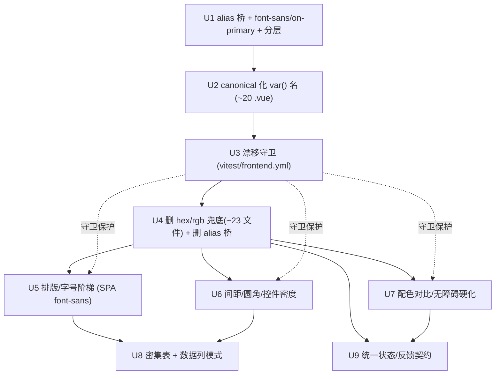

# refactor: Vue SPA 控台设计系统精炼 — 收口 token 漂移 + 四维 UI/UX 优化

## Overview

把已 shipped 的「深色技术控台风」设计系统（`tokens.css`：青蓝 `#38bdf8` + slate 分层面板 + 等宽字号缀）
**真正贯通到 Vue 3 SPA**，并在统一的 token 基底上系统性优化四个维度：排版/字号阶梯、配色/对比度/无障碍、
间距/密度/布局节奏、交互反馈与状态。

**主轴 = 精炼，不是再翻新**（用户决策 2026-06-22）。视觉基调（控台青蓝）保留；本期解决的是
**设计系统与 Vue SPA 已经漂移**这件事——并把散落的 ad-hoc 值收编成可级联、可演进、有 CI 守卫的 token 体系。

**落点 = Vue SPA 优先 + `tokens.css` 为单一真相源**（用户决策 2026-06-22）。残留 Jinja 页靠 token 级联被动受益，
不逐页重排（沿用 redesign 已接受的「~15 页混合态」延后决策）。

### 一句话的现实（来自 6 路研究 + 一轮 3 路对抗深化 + 一轮 6 路文档评审，并经 git 实测复核）

> **Vue SPA 已经 `import` 了 `tokens.css`（`main.ts:8`），token 在级联里——但 SPA 的 `<style scoped>` 与 `app.css`
> 引用了 15 个 `tokens.css` 里根本不存在的 token 名，每一个都静默退回硬编的 GitHub-dark 兜底色。
> 控台设计系统与 Vue SPA 漂移的是 token 名字，不是 token 缺失。**

**SPA 是当前默认 UI**（`BACKLINK_PUBLISHER_SPA` 默认 `1`、`/app/*` 服务构建包；HEAD `08cf098d` 即「flip SPA to default」，
plan 2026-06-18-002 U8）。所以运营者**默认就看到漂移后的 GitHub-dark SPA**（`#0d1117 / #161b22 / #58a6ff` GitHub 蓝、
`#2ea043` GitHub 绿…），**不是**控台青蓝（`#0b0f17 / #141a24 / #38bdf8 / #34d399`）——这正是本期 #1 必修项,
也是排版/间距/状态三个维度能否「看起来像控台」的前置闸门。(注:根路径 `/` 由 `main.py` 处理,SPA 的画布在 `/app/*`;
本期改的是 `tokens.css`(双面级联)+ SPA 组件,对 `/` 走 Jinja 的部分仅 token 值级联受益。)

> **研究/评审的诚实说明**:本计划经一次 6 路审计(其中 token-drift 一路限流失败,但 15 个漂移名计数已被四路验证一致)、
> 一轮 3 路对抗深化、一轮 6 路文档评审(coherence/feasibility/design/product/scope/adversarial)。评审揭出并已修正的过期事实:
> ① **工作树当前干净、Settings 已提交 HEAD `08cf098d`**(早先「WIP 脏」的判断已失效,碰撞机制相应简化为开工前 `git status` 核对);
> ② **SPA 已是默认 UI**(早先「flag 关闭/Jinja 默认」的判断已失效);③ **亮色切换是可用功能、非死开关**——故本期
> **不覆盖分离计划 R5、不动双主题契约**(见 Scope/U7)。逐文件清单与「名→规范名」映射表实现时从源码机械重生。

## Problem Frame

`webui-console-redesign`（plan 2026-06-17-001）把 WebUI 翻新为深色控台风并 **shipped**;
`webui 前后端分离`（plan 2026-06-18-002，分支 `refactor/webui-api-v1`，active）把前端迁成 Vue 3 SPA、
并已把 **SPA 设为默认 UI**(U8)。绝大多数高价值页已迁到 Vue(发布工作台、监控、历史、草稿、站点、排程、批量、Settings)。

但分离计划承诺的「继承 tokens」**没有真正兑现**:SPA 用的是一套平行的、未定义的 token 词汇,
靠 `var(--name, #hardcoded)` 的第二参数兜底,把控台青蓝悄悄替换成了 GitHub-dark。叠加的次生问题:
SPA 完全没有字号阶梯/间距阶梯/字体 token,焦点环对比度不达标,密集表未用等宽列对齐,
交互四态(loading/empty/error/stale)只在 Monitor 一页齐全。

本期在分离计划的**锁定约束之内**(无 CSS-in-JS、`tokens.css` 单一 `:root` 源、static=`var()`/reactive=`v-bind()`、
服务端派生数据不下放前端、**保留双主题 R5**)把这些一次性收口,并加 CI 守卫让漂移不能再悄悄复发。

> **范围诚实标注(product/adversarial 评审)**:本期是**呈现层精炼**(token + 排版 + 间距 + 对比 + 状态),
> 直接回应用户「字体大小、配色」的诉求;**不含**任务流/信息架构重排(如发布步数、导航分组、首页落点)——
> 那是另一类更高杠杆的 UX 工作,用户本期未选,显式列为非目标(见 Scope)。Phase 1 的 U1(alias 桥)即把 SPA 调色板
> **可见地**切回控台青蓝,是本期最早的可感知收益,不是纯不可见重构。

## Requirements Trace

- **R1**（落点/单一真相源）— `tokens.css` 成为 SPA 与 Jinja 共同消费的**单一**设计 token 源;消除 SPA 的 15 个幻影 token 名与硬编兜底色。
- **R2**（排版）— 引入语义化字体 token(`--font-sans` 净新增 + `--font-mono` 保留)与定步长模块化字号阶梯(**单一标题命名方案**)、字重/行高 token;统一标题层级;数字列 `tabular-nums`。
- **R3**（配色/对比/无障碍）— 保留已验证健康的控台调色板取值;补 WCAG 2.2 AA 缺口(焦点环 ≥3:1、`--border-strong`、`prefers-reduced-motion`、`:focus-visible` 而非 `:focus`、跳转主内容 skip-link、状态非纯色冗余、SideNav `aria-current`)。
- **R4**（间距/密度/布局）— 用 4px 基的间距阶梯与圆角阶梯(含**圆角→元素用途映射**)取代 ad-hoc rem 步;补基础表单控件规则与控件密度 token;统一密集表的行密度/等宽列/截断/窄屏行为(**单一窄屏策略**)。
- **R5**（交互反馈/状态）— 把「stale/refreshing」升为一等状态(**含触发/时间戳/refreshing-vs-stale 状态矩阵**);统一表单反馈约定与**每页 empty 文案契约**;抽出共享 `useErrorToast`;Toast 与忙碌态收口到 token;沿用 `StateBlock` 四态与 `classifyError` 既有契约,不改其逻辑。**VueQuery 全局默认是否设取决于受影响 query 审计**(见 U9)。
- **R6**（耐久守卫）— 新增**前端 vitest** 守卫:`frontend/src` 每个 `var(--x)` 必须解析到 `tokens.css` 定义名;**只禁 hex/rgb 字面兜底**(`var(--x, #...|rgb...)`),放行 `var(--x, var(--y))` 合法 token 链;挂现有 `frontend.yml` vitest lane,把一次性修复变成不变量。
- **R7**（边界/级联）— 残留 Jinja 仅靠 `tokens.css` 级联受益,不逐页重排;Jinja 控台样式是 `[data-theme="dark"]` 门控、legacy `theme.js` 默认 light——改 token **值**只对已处于 dark 态的 Jinja 页生效,本期不改 legacy 主题默认;服务端派生数据(gap/severity/dofollow)保持服务端单一真相,前端只做状态→token 呈现映射。**本期不改双主题契约(保留分离计划 R5)。**

### Success Criteria
- SPA 任一已迁移页渲染出控台青蓝(`#38bdf8`/`#34d399`/`#141a24`…),无 GitHub-dark 残留;`tokens.css` 改一处**值**,SPA 与处于 dark 态的 Jinja 同步级联。
- `frontend/src` 内无任何解析不到 `tokens.css` 的 `var(--x)`;无 `var(--x, #hex|rgb)` 字面兜底;vitest 守卫为 required check 且绿(故意写坏一个 `var()` 必使该 lane 失败)。
- 排版有定步长字号阶梯与统一 `--font-sans`(SPA 侧)、单一标题命名方案;数字/ID 列等宽对齐;无未定字号的 UA-默认标题。
- 焦点环对 `--surface-*` ≥3:1(SPA 与 Jinja 双面);`:focus-visible` 仅键盘态显;有 skip-link;reduce-motion 时 shimmer 冻结;SideNav 活跃项有 `aria-current="page"` + 非纯色指示。
- 四态一致;stale 有状态矩阵规定的可见非阻塞提示;每页 empty 有文案+下一步;密集表三表窄屏策略一致;表单反馈走单一约定;Toast/忙碌态全控台配色。
- 全程不破坏分离计划锁定约束(**含 R5 双主题不动**);残留 Jinja 不破版(含字体 Outfit、`[data-theme=dark]` 门控);后端契约与服务端派生计算不变。

## Scope Boundaries

- **不再翻新视觉语言**——保留控台青蓝基调,本期是收口 + 系统化,非重选配色(用户决策)。
- **不做任务流/信息架构重排**——发布步数、导航分组、首页落点、各页信息优先级**不在本期**(用户本期未选;属另一类 UX 工作)。
- **不逐页重排 Jinja**——残留 Jinja 仅靠 `tokens.css` 级联受益;~15 页混合态是 redesign 已接受的延后项;**不改 Jinja 的 body 字体**(Outfit 保留)、**不改 legacy 主题默认**。
- **不改双主题契约 / 不覆盖分离计划 R5**——`theme.ts` 的 light/dark 切换是**当前可用功能**,本期**不删除、不撤销**。点亮色目前会退到无 `[data-theme=light]` 样式的默认态——这是**既存遗留 bug**,亮色主题用户本期未选,故**不在本期实现**;若需对「点 ☀️ 退到无样式」做止血,**仅**可在不删 `theme.ts` light 分支、不覆盖 R5 的前提下隐藏/禁用切换控件,且记为**可选延后**(见 Open Questions),非本期单元动作。
- **不改后端**——不改路由、契约、`/api/v1`、服务端 gap/severity/dofollow 计算;判定逻辑留服务端(R7)。
- **不引入 CSS-in-JS / 不引框架**——static 用 `var(--token)`,reactive 用 `v-bind()`,(未来)主题/密度用 `data-*` 属性选择器;守住分离计划锁定约束。
- **不改 `StateBlock`/`classifyError`/CSRF/错误信封的逻辑**——只精炼控台配色与覆盖一致性,复用既有契约。
- **不建密度切换控件**——间距阶梯为未来 `[data-density]` 留出可能,但**本期不铺 `[data-density]` 钩子、不建切换**(记为延后)。

## Context & Research

### Relevant Code and Patterns

- **单一 token 源**:`webui_app/static/css/tokens.css`(198 行,`:root` 单源,`color-scheme: dark`,2026-06-17 控台 retheme 取值注释在;`--space:20px`/`--radius:10px` 是仅有间距/圆角 token,`--font-mono` 唯一字体 token,**无 `--font-sans`/无字号阶梯/无 on-accent 文字 token**)。
- **SPA 入口与样式**:`frontend/src/main.ts:8`(`import tokens.css`)、`frontend/src/styles/app.css`(36 行;phantom 引用为 `--bg-base`/`--bg-raised`/`--border-subtle`/`--font-sans` 四个;`--text-primary`/`--text-secondary` 是**已定义但带 hex 兜底**,属删兜底而非改名)。
- **漂移面(三套不同计数,勿混)**:① **15 个幻影 token 名**(SPA 引用但 `tokens.css` 未定义);② 引用这些幻影名的文件 = **~20 个 `.vue` + `app.css`**(`AppShell.vue` 无 `var()`,不在改名面);③ 含 `var(--x, #hex)` 兜底的文件 = **~23 文件 / ~164 处**(含 `HistoryPage`/`DraftsPage`/`Schedule`/`StateBlock`/`ProfileSelector` 等**只引用已定义 token 但带 hex 兜底**的文件)。三套清单实现时 `grep`/AST 机械重生。Settings 子树 = `SettingsPage` + 9 `*Card.vue` + `SettingsSidebar` 共 11 文件。
- **工作树状态(评审实测)**:`git status -- frontend/src` **干净**;Settings SPA 迁移**已提交 HEAD `08cf098d`**。早先「WIP 脏」判断已失效——碰撞处理简化为开工前 `git status` 核对(见 U2)。
- **已 shipped 的强契约(复用,不重造)**:`components/StateBlock.vue`(四态,错误走 `classifyError` 固定模板)、`lib/errors.ts`、`stores/notifications.ts`、`stores/publish.ts` + `pages/Publish/PublishWorkbench.vue`(降级忙碌态参考实现)。
- **数据层**:TanStack Query(`main.ts` 装 `VueQueryPlugin`,**无** `defaultOptions`→ 隐式 `staleTime=0`+`refetchOnWindowFocus=true`)。`MonitorDashboard.vue` 配 `refetchInterval:30s`+`keepPreviousData`(**间隔轮询免疫全局 staleTime**);`SchedulePage.vue:28-33` 用**手动 `visibilitychange` + `query.refetch()`**(命令式,加全局 focus-refetch 会**双触发**);真正受全局默认影响的是其余 ~13 个 `useQuery`(Settings 各卡、TopBar config、ProfileSelector、Drafts、History、Sites、Batch)。
- **主题(本期不改,仅记现状)**:SPA `stores/theme.ts` 有**可用** light/dark 切换(`toggle()` 翻 `data-theme`、写 localStorage `bp-theme`、`TopBar.vue:40` 真实控件),但 `tokens.css` 无 `[data-theme=light]` 块 → 点亮色退到 `:root` 默认(遗留 bug)。legacy `theme.js` 默认 light、key `backlink-publisher-theme`、控台样式 `[data-theme="dark"]` 门控(`index.css:9,87,124` 等)。
- **CI 实况**:`Makefile` `test-js`(行 31-32)**硬编 5 文件名、无 glob**,且**无 workflow 调用**。SPA CI = `.github/workflows/frontend.yml` 的 **vitest**(`npm run test`,触发含 `frontend/**`+`webui_app/static/css/**`)——守卫放此(见 U3),实现时 CI 实跑确认。
- **Jinja 级联面**:`static/css/{index,settings,global_nav,schedule}.css`(`index.css:1` `@import Outfit` + `body{font-family:'Outfit'}`;`global_nav.css` 已用 `var(--font-mono)`/`var(--radius)`;`--focus-ring` 被 `global_nav.css:222,320`/`index.css:118` 消费——改其**值**是双面变化)。
- **缓存版本陷阱**:`webui_app/__init__.py:25-53` `_compute_asset_version` 命中 `version_file` 即提前返回——新增 Jinja 静态文件不自动 bump;偏好**原地编辑 `tokens.css`**;SPA 侧走 Vite content-hash。

### Institutional Learnings

- `docs/solutions/architecture-patterns/server-side-gap-computation-2026-06-05.md` — 派生判定服务端算好注入,不下放前端(**R7 硬约束**)。
- `docs/plans/2026-06-17-001-redesign` — **「改 token 值即自动级联」在本仓不成立**(Jinja 280+ 字面 rgba 不响应 token);验证用**干净页**(History/Monitor),**绝不** settings/keep_alive/index。
- `docs/plans/2026-06-18-002-separation` 锁定约束 — 无 CSS-in-JS、`tokens.css` 单源、**R5 保留双主题**(本期**遵守**,不覆盖);SPA 已设为默认 UI(U8)。
- **token 层零 CI 守卫** — 预算 toml 不覆盖 `tokens/spa/frontend/css`,这是漂移静默累积的根因 → R6 守卫。
- auto-memory `sdk-extraction-inprogress` — Vue WIP 与本期同树;提交用显式路径。

### External References（2026，best-practices 研究）

- 设计 token 三层(W3C-DTCG):primitive(唯一放 hex)→ semantic → component;改名先 alias 再迁移。
- 定步长字号阶梯:密集控台用低比率(1.2),表格 base ~13–14px;小字号不用 fluid;`tabular-nums` 对齐数字列。
- WCAG 2.2 AA:正文 4.5:1、非文本/焦点 3:1;`--border` 8% 仅装饰,识别输入框需 `--border-strong`;`:focus-visible` 仅键盘态显环。
- 4px 基间距阶梯;状态非纯色冗余(icon+label)。
- Vue 3:`:root` 自定义属性在 `<style scoped>` 经普通级联 `var()` 直接解析(**漂移修复无需 v-bind**;SPA 当前 `v-bind` 用量 0);守卫扫源文件,scoped 哈希是编译期、与之无关。
- 状态/反馈:>1s 用 skeleton;empty/error/stale 各自显式;同步长任务用乐观忙碌态。

## Key Technical Decisions

- **三步迁移(对抗复核为安全可逆):alias 桥即时修复 → canonical 化改名 → 守卫就绪后删 hex 兜底+删 alias**。alias 全指向规范控台值,中间态只会让 SPA 更控台-正确;改名后规范名就位,删兜底在守卫保护下做。
- **`--accent` → `--primary` `#38bdf8`(spinner/`.primary`/Monitor-info accent);`--accent-info` → `--info`、`--accent-success/danger/warning` → 饱和 `--success/--danger/--warning`**。**SideNav 活跃与 Toast info 走的是 `--accent-info`**(`SideNav.vue:81`/`Toast.vue:67`),非 `--accent`;今 `--primary==--info==#38bdf8` 渲染一致但语义独立——canonical 化时把 SideNav 活跃(当前页交互态)改指 `--primary`,Toast-info 保 `--info`,注释记「今值同、语义独立」。
- **净新增 `--on-primary`**(on-accent 近黑文字,对 `#38bdf8` 保持现对比),供 `.primary` 按钮文字消费——否则删 `#0d1117` 无目标。
- **`--font-sans` 净新增 = 系统 sans 栈,只给 SPA;Jinja body 字体不动(Outfit 保留)**。改 Jinja body 会致 ~15 页重排,违反「不破版」;字体统一记延后。
- **保留健康调色板取值,不追对比**;只动焦点环 0.45→~0.8(SPA+Jinja **双面值变化**)与新增 `--border-strong`。
- **`tokens.css` 分层注释**(primitive/semantic),值不动。
- **主题:本期不改双主题契约、不覆盖 R5**(评审收敛:`theme.ts` 切换是可用功能,移除=删 sibling active 计划已交付能力 + 把跨计划治理耦合进 CSS 精炼,不划算)。亮色遗留 bug(点 ☀️ 退默认态)记延后;四个维度完全可在不碰 `theme.ts` 的前提下交付。
- **VueQuery 全局默认条件化**(scope/adversarial 收敛):先审 ~13 个默认-依赖 query 的「过期容忍度」,**仅当全部容忍 >0 staleTime 才设全局 `defaultOptions`**;任一需「永远最新」(如 auth/凭证/配额状态)则改逐页 `setQueryDefaults`。stale 状态 UI 与全局默认解耦——前者无论如何都交付。
- **复用而非重造交互契约**:`StateBlock` 四态/`classifyError`/`PublishWorkbench` 忙碌态只精炼配色 + 覆盖一致性 + 升 stale 一等,不动判定逻辑。

## Open Questions

### Resolved During Planning
- 落点 SPA 还是 Jinja?→ **SPA 优先 + `tokens.css` 单源,Jinja 仅级联**(用户)。
- 漂移 alias 还是 rename?→ **按序**:alias(U1)→ 改名(U2)→ 守卫(U3)→ 删兜底+删 alias(U4)。
- `--accent` 映射?→ `--primary`;`--accent-info`→`--info`;SideNav 活跃改指 `--primary`。
- `--font-sans`?→ **系统栈,仅 SPA**;Jinja Outfit 不动。
- 调色板调对比?→ **不调**;只补焦点环(双面)/`--border-strong`/动效/`:focus-visible`。
- 亮色主题做不做?→ **不做、不覆盖 R5、不删 `theme.ts`**;遗留 bug 记延后。
- 守卫放哪?→ **前端 vitest**(`frontend.yml`),只禁 hex/rgb 字面兜底。
- VueQuery 全局默认?→ **条件化**:依 ~13 query 过期容忍度审计结论决定设全局还是逐页。

### Deferred to Implementation / 后续
- **亮色「点 ☀️ 退默认态」止血**:是否本期内隐藏/禁用 SPA 切换控件(不删 `theme.ts` light 分支、不覆盖 R5)?默认延后;若做,须确认不影响 legacy `[data-theme=dark]` 门控、不改 legacy 默认。
- `--font-sans` 系统字族顺序;SPA↔Jinja 字体是否统一——出现诉求时定。
- `0.85rem`(最高频小字号)落 13px 还是 14px;**且实现前 grep 这 5 个近重复小字号各自用途**,确认是否真无需保留 2 档(如表格正文 vs 元信息/计数)。
- 密集表是否现在切 `--font-mono`(改列宽/重调截断);`Drafts` flex-list 是否转 `<table>`——迁移该页时定。
- VueQuery 全局 `staleTime`/focus 数值;**且实现前列 ~13 受影响 query 的过期容忍度清单**(U9 前置)。
- 卡片圆角 10px 是否收到 8px——U6 给推荐(收到 8px),目检后定。
- 逐文件清单 / 「名→规范名」映射 / rem-step 计数——实现时机械重生。

## High-Level Technical Design

> *方向性指引,供评审验证形态,非实现规格。*

**token 漂移的根因与修复**:

```
当前（漂移）:  var(--bg-raised, #161b22)  → 名字不存在 → 取兜底 → 渲染 GitHub-dark #161b22
目标（贯通）:  var(--surface-raised)      → tokens.css: --surface-raised:#141a24 → 渲染控台 #141a24
过渡（U1）:    --bg-raised: var(--surface-raised);  旧名零改动即解析到控台值（U2 改名 → U3 守卫 → U4 删兜底+删 alias）
```

**`tokens.css` 目标分层**（值不动,只组织 + 净新增）:

```
:root {
  /* Tier 1 primitives（唯一放字面值）: --surface-*, --primary, --accent-cyan, --success/danger/warning/info,
       --on-primary(净新增), --space-1..N(净新增 4px 基), --text-xs..2xl(净新增, 单一标题方案), --font-sans/mono, --radius-sm..pill(净新增) */
  /* Tier 2 semantic: --text-primary/secondary, --border, --border-strong(净新增),
       --focus-ring(提 alpha), --leading-*/--font-weight-*/--tracking-wide(净新增, 仅在有消费者处) */
  /* 过渡 alias 桥（U4 删除）: --bg-base→surface-base, --accent→primary, --accent-success→success, --radius-md→radius … */
}
/* 本期不铺 [data-density] 钩子；双主题 [data-theme] 维持现状（R5 不动） */
```

**单元依赖（9 单元 / 3 阶段）**:



## Implementation Units

### Phase 1 — token 收口 + 守卫（闸门）

- [ ] **Unit 1: token alias 桥 + `--font-sans`/`--on-primary` 净新增 + 分层注释（即时修复，零 `.vue` 改动）**

**Goal:** `tokens.css` 加 15 个 alias(指向规范控台值)+ 净新增 `--font-sans`(系统栈)/`--on-primary`(近黑)，让 SPA **零 `.vue` 改动即切回控台青蓝**。可逆,是闸门。

**Requirements:** R1

**Dependencies:** 无

**Files:** Modify `webui_app/static/css/tokens.css`;Test: 既有 `.spec.ts` 快照若因计算值变化更新

**Approach:**
- alias(指向规范 token,非字面 hex):`--bg-base:var(--surface-base); --bg:var(--surface-base); --bg-raised:var(--surface-raised); --bg-overlay:var(--surface-overlay); --border-subtle:var(--border); --accent:var(--primary); --accent-info:var(--info); --accent-success:var(--success); --accent-danger:var(--danger); --accent-warning:var(--warning); --text-muted:var(--text-secondary); --muted:var(--text-secondary); --radius-sm:4px; --radius-md:6px;`
- 净新增:`--font-sans`(系统 sans 栈)、`--on-primary`(近黑,对 `#38bdf8` 保持现对比)。
- `--radius-sm/md` 此处临时字面;**U6 用同名规范阶梯成员替换**(U6 先于/独立于 U4 删 alias 完成该升格;U4 删 alias 时这两个已是规范成员、不删)。
- primitive/semantic 注释分层,值不动。

**Execution note:** characterization-first;改前在干净页(History/Monitor)截基线。

**Test scenarios:**
- Integration: 落地后干净页 skeleton/Toast/spinner 渲染控台 token 值,非 GitHub-dark。
- Edge: 改 `--surface-raised` 一处,dark 态页面同步级联。
- Test expectation（纯 token 值）: 无行为变化,由 U3 守卫 + 目检覆盖。

**Verification:** 干净页全控台青蓝;改一处值两面级联;alias 仅指规范 token(除 `--radius-sm/md` 临时字面,U6 替换)。

- [ ] **Unit 2: canonical 化 — ~20 个 `.vue` 的 `var()` 改规范名**

**Goal:** 把 SPA 的 15 个幻影名全改为规范名;alias 桥仍在(兜底未删)。

**Requirements:** R1
**Dependencies:** Unit 1
**Files:** Modify `frontend/src/styles/app.css`(4 个幻影名改规范名)+ ~20 含幻影名 `.vue`(`layout/{SideNav,TopBar}.vue`、`components/{StateBlock,Toast}.vue`、`pages/{Publish,Monitor,Drafts,Sites,Schedule,BatchCampaign}` 各页、`pages/Settings/{SettingsPage,SettingsSidebar,9×Card}.vue`——**实现前 grep 机械重生确切清单**;`AppShell/ProfileSelector/HistoryPage` 无幻影名,仅 U4 删兜底);Test: 受影响 `.spec.ts`

**Approach:**
- 逐文件改名,**保留** hex 兜底(U4 再删),每步可独立验证。
- SideNav 活跃改 `--primary`、Toast-info 保 `--info`。
- 维护机械重生的「旧名→规范名」表,三处一致。

**Execution note:** 开工前 `git status frontend/src` 应 clean(工作树当前已干净、Settings 已提交 HEAD `08cf098d`;若届时又出现未提交 WIP,先让其落地或排除该子集单独补)。

**Test scenarios:**
- Happy: 改名后各页渲染不变(alias 使旧名规范名等值),既有 spec 绿。
- Integration: SideNav 活跃改 `--primary` 后仍控台青、活跃态正确。

**Verification:** `frontend/src` 无幻影名引用;既有 spec 全绿;SideNav/Toast 语义映射正确。

- [ ] **Unit 3: token 漂移守卫（前端 vitest，挂 `frontend.yml`）**

**Goal:** vitest 守卫:`frontend/src` 每个 `var(--x)` 解析到 `tokens.css` 定义名;禁 hex/rgb 字面兜底。U2 后立即落地保护下游。

**Requirements:** R6
**Dependencies:** Unit 2
**Files:** Create `frontend/src/__tests__/token-resolution.spec.ts`(vitest + `node:fs`);Modify `.github/workflows/frontend.yml`(**实现时核对** vitest lane 含该路径、触发于 `frontend/**`/`webui_app/static/css/**`,CI 实跑确认);Test: 守卫自身

**Approach:**
- 扫**源文件**;抽 `tokens.css :root`(及 `[data-*]` 块)定义集与 `frontend/src` 引用集,差集为空才过。
- **禁兜底规则收窄**:只匹配字面颜色兜底 `var\(--[\w-]+\s*,\s*(#|rgb)` → 失败;**显式放行** `var(--x, var(--y))` 链式 token 兜底(注释说明:禁的是字面颜色兜底掩盖漂移,非 CSS fallback 语法)。
- **v-bind 白名单**:`v-bind('--x')`(本期 0 个)跳过,避免未来误报。
- **守卫的 fs 读取/.vue 解析无先例**——开工日先证一个最小用例(读 `../../webui_app/static/css/tokens.css` + 正则 `.vue` `<style>` 块)跑通再扩。

**Test scenarios:**
- Happy: U2 完成态守卫绿。
- Error: 引用 `--foo` → fail 指文件:行;写 `var(--surface-raised, #161b22)` → fail。
- Edge: `var(--a, var(--b))` 链式不误报;CI 实跑(非本地-only)拦截人为漂移。

**Verification:** 守卫为 required 且绿;故意写坏一个 `var()` 使 `frontend.yml` lane 实际变红。

- [ ] **Unit 4: 删 hex/rgb 兜底（~23 文件 / ~164 处）+ 删 alias 桥（守卫保护）**

**Goal:** 删 `frontend/src` 全部字面颜色兜底(GitHub-dark `#161b22/#30363d/#0d1117/#58a6ff/#2ea043/#3fb950/#f85149/#d29922` 及 `#8b949e×25`/`#e6edf3×7`/`#1f2630×6`/`#3b82f6`/`#2d2410`),并删 U1 alias 桥,只留规范名 + 净新增 token。

**Requirements:** R1
**Dependencies:** Unit 3
**Files:** Modify ~23 含字面兜底文件(含 `app.css`、`ProfileSelector`、`HistoryPage`、`DraftsPage`、`SchedulePage`、`StateBlock` 等无幻影名但带兜底者;清单 `grep` 机械重生);Modify `tokens.css`(删 alias 桥;**保留** U6 已升格的 `--radius-sm/md`);Test: 受影响 `.spec.ts`

**Approach:** 逐文件删第二参数字面兜底;归一重复硬编绿/蓝到单一语义 token。删 alias 前确认守卫绿(改名全覆盖)。

**Test scenarios:**
- Happy: 删后守卫绿,各页渲染不变。
- Error: 漏删某处兜底 → 守卫红定位。
- Edge: 删 alias 后无 `.vue` 引用旧名;`--radius-sm/md` 仍解析(U6 升格)。

**Verification:** `grep 'var(--[^,)]*,\s*\(#\|rgb\)'` 在 `frontend/src` 零命中;alias 桥已删;守卫绿。

### Phase 2 — 四维 token 体系

- [ ] **Unit 5: 排版 — SPA `--font-sans` + 定步长字号阶梯（单一标题方案）+ 字重/行高/tabular-nums**

**Goal:** SPA 排版 token 体系:统一正文字体(SPA)、定步长字号阶梯、字重/行高、数字列等宽;统一标题层级。**不改 Jinja body 字体**。

**Requirements:** R2
**Dependencies:** Unit 4
**Files:** Modify `tokens.css`(净新增 `--text-xs..2xl`(**单一命名方案,不并存 `--text-h1/h2` 与 `--text-xl` 两套**)、`--font-weight-medium/semibold/bold`、`--leading-tight/normal`、`--tracking-wide`(**仅在 eyebrow 消费者落地时引入**));Modify `app.css`(`body` 用 `--font-sans`;全局 `h1/h2` 基础字号,消除 SPA UA-默认标题;`.tabular`);Modify 引用 ad-hoc 字号/`1.05rem` 卡片标题的 SPA `.vue`;Test: 受影响 `.spec.ts`

**Approach:**
- 字阶定步长(~1.2),表格 base ~13–14px;`h1` 显式定字号(当前被卡片 1.05rem 压过);**单一标题命名**(用 `--text-2xl`/`--text-xl` 表页标题/卡片标题,不再造 `--text-h1/h2` 平行名,避免新漂移)。
- **5 个近重复小字号**:实现前 grep 各自用途,确认收敛成 1 档(`--text-sm`)还是保留 2 档(正文 vs 元信息/计数);不无差别强压。
- 字体:`--font-sans`(系统栈)仅 SPA;**Jinja body 保留 Outfit、不动**。
- 数字:`.tabular`/`table` 加 `font-variant-numeric: tabular-nums`;IDs/counts/status 续走 `--font-mono`。
- 字重/行高 token;eyebrow 用 `--tracking-wide`(仅此消费者)。

**Execution note:** 字号可见变化,干净页目检;不触 Jinja body 字体。

**Test scenarios:**
- Happy: SPA `h1` 字号 > 卡片标题;body 用 `--font-sans`。
- Edge: 数字列等宽不抖。
- Integration: 改 `--text-base` 一处,SPA 正文同步;Jinja Outfit 不受影响。

**Verification:** SPA 无 UA-默认标题;字号收敛到单一阶梯;数字列对齐;Jinja 字体未变。

- [ ] **Unit 6: 间距 / 圆角 / 控件密度 token + 基础控件规则 + 圆角用途映射**

**Goal:** 4px 基间距阶梯 + 圆角阶梯(**含用途映射**)取代 ad-hoc rem(实测 ~33 个不同 rem 值)与 5 个 ad-hoc 圆角;补基础表单控件规则 + 控件密度 token,消除 ~15 处复制粘贴 `0.4rem 0.5rem`。

**Requirements:** R4
**Dependencies:** Unit 4
**Files:** Modify `tokens.css`(净新增 `--space-1..N`(4px 基)、`--radius-sm/md/lg/xl/pill`(**升格 U1 临时字面 `--radius-sm/md` 为规范成员,同名换 provenance**)、`--control-pad-y/x`;`--space:20px` 等价某阶梯档实际被消费);Modify `app.css`(基础 `button/select/input/textarea` 规则,消费控件密度 token + `--on-primary`);Modify 引用 ad-hoc rem/圆角的 SPA `.vue`(卡片 10px → `--radius-lg` 8px);Test: 受影响 `.spec.ts`

**Approach:**
- 间距 4px 基;`0.85/0.9rem` 离格 → 实现时定;`--space:20px` 真正被引用。
- 圆角 `sm 4 / md 6 / lg 8 / xl 10 / pill 999`;**用途映射(防一刀切 AI-slop)**:按钮/输入=sm 或 md、卡片/面板=lg、Toast/弹层=lg、徽章/状态 pill=pill、头像/缩略=按需;卡片 10px **建议收 8px**。
- **与 U1 交接**:U1 临时字面 `--radius-sm/md` 由本单元同名规范成员替换;U4 删 alias 时不删这两个。
- 控件密度 token + 基础控件规则;`.primary` 文字走 `--on-primary`。
- **不铺 `[data-density]` 钩子、不建切换**(间距阶梯本身已为未来留空间)。

**Execution note:** 圆角收紧/离格 rem 映射是设计判断,需人核。

**Test scenarios:**
- Happy: 控件等高、间距落阶梯;圆角按映射分类(非全用一档);`.primary` 文字 `--on-primary`。
- Integration: 改 `--space-4` 一处 SPA 同步;`--radius-sm/md` 仍解析(U4 后)。

**Verification:** ad-hoc rem/圆角收敛;圆角按用途映射;~15 处控件 padding 归一;Jinja 不破版。

- [ ] **Unit 7: 配色 / 对比 / 无障碍硬化（不动调色板取值、不动主题契约）**

**Goal:** 补 WCAG 2.2 AA 与无障碍缺口;**不碰 `theme.ts`/双主题(保留 R5)**。

**Requirements:** R3
**Dependencies:** Unit 4
**Files:** Modify `tokens.css`(`--focus-ring` alpha 0.45→~0.8（**双面值变化**）；净新增 `--border-strong`(≥3:1)；全局 `@media (prefers-reduced-motion: reduce)` 冻结动画);Modify `app.css`(`:focus-visible`(非 `:focus`)统一焦点环 + `outline-offset`;reduce-motion 覆盖;**skip-link 到主内容**);Modify `SideNav.vue`(**`aria-current="page"` 确定缺失,必补** + 左侧非纯色指示 + legacy `↪` SR 提示);Modify `StateBlock.vue`(shimmer 受 reduce-motion 约束)、状态 pill/badge(icon+label 非纯色)、`Toast.vue` 错误态见 U9;Test: `SideNav.spec.ts`、`StateBlock.spec.ts`

**Approach:**
- 不调健康取值;只动焦点环 alpha(双面)+ `--border-strong`;焦点环 `box-shadow`+`outline-offset` 双保险。
- **`:focus-visible`**(仅键盘态显环,鼠标点击不留环——控台密集界面不吵);**skip-link**(SideNav→主内容,键盘运营者免每次穿越整个导航)。
- reduce-motion 全局冻结 shimmer;SideNav `aria-current` 必补 + 非纯色指示;状态非纯色冗余。
- **主题:不动**——`theme.ts`/切换控件保持现状;亮色遗留 bug 见 Scope/Open Questions(延后,本单元不处理)。

**Test scenarios:**
- Happy: 键盘 Tab 焦点环对 `--surface-*` ≥3:1、不被卡片 shadow 吞;鼠标点击不留环;**Jinja 可聚焦元素焦点环也变(双面)**;skip-link 可达。
- Edge: reduce-motion → shimmer 静止。
- Integration: SideNav 当前路由项 `aria-current="page"` + 非纯色指示。
- Error（a11y）: 状态 pill 灰度/色盲下凭 icon+label 可分。

**Verification:** 焦点环(双面)/`:focus-visible`/skip-link/reduce-motion/`aria-current`/非纯色冗余达标;调色板取值与主题契约未动。

### Phase 3 — 按面应用

- [ ] **Unit 8: 密集表 + 数据列模式（统一行密度/等宽列/截断/单一窄屏策略）**

**Goal:** 共享密集表约定应用到 History/Schedule/Sites:统一密度、ID/计数/状态/URL 列 `--font-mono`+`tabular-nums`、单一截断 token、**单一窄屏策略**。

**Requirements:** R2, R4
**Dependencies:** Unit 5, Unit 6
**Files:** Modify `app.css` 或新增 `frontend/src/styles/table.css`(共享 `.data-table`);Modify `pages/{History,Schedule,Sites}` 三页;Modify(待定)`pages/Drafts`(flex-list 是否转 `<table>`);Test: 受影响 `.spec.ts`

**Approach:**
- 一套 `.data-table`:`--space` 基 cell padding、`--leading-tight`、数据列 mono+tabular、单一截断 token(取代 24rem/320px/260px 三套)。
- **窄屏定一条统一规则(非「或」)**:列多以扫读为主的控台表默认 `overflow-x:auto`(保结构),仅列 ≤3 的表允许堆叠;明确断点(如 <768px)与最小触摸目标(行高 ~44px)。
- 切 mono 改列宽 → 实现该页时重调截断(见 Deferred)。
- 空数据走 `StateBlock` empty(文案契约见 U9)。

**Test scenarios:**
- Happy: 三表密度一致;数据列等宽对齐;长 URL 单一截断+title。
- Edge: 窄屏三表**同一策略**(默认 overflow)不溢出。
- Edge: 空数据走 `StateBlock` empty(U9 文案),非裸表头。

**Verification:** 三表密度/截断/窄屏策略一致;数据列等宽;无三套不一致截断残留。

- [ ] **Unit 9: 统一状态 / 反馈契约（stale 矩阵 + empty 文案契约 + 共享 useErrorToast + VueQuery 条件化）**

**Goal:** 补齐四态:stale 升一等(**含状态矩阵**)、每页 empty 文案契约、表单反馈单一约定、共享 `useErrorToast`、Toast/忙碌态收口;复用既有契约不改逻辑。

**Requirements:** R5, R3
**Dependencies:** Unit 4, Unit 7
**Files:** Modify `StateBlock.vue`(新增 `isFetching`/`stale` 入参 + empty slot 接 title/description/action 三参);Create `frontend/src/composables/useErrorToast.ts`;Modify `frontend/src/main.ts`(**条件性**设 VueQuery `defaultOptions`——见 Approach);Modify `SchedulePage.vue`(删手动 `visibilitychange` 或对该 query 关全局 focus-refetch,防双触发);Modify 各页接入 `useErrorToast` + 表单反馈标准化 + 各 list 页 `keepPreviousData`/stale 提示 + empty 文案;Modify `Toast.vue`(offset/z/max-width token 化、最大堆叠;**错误 assertive 需结构改**——单 `aria-live=polite` 容器不能 per-item 改 politeness,用第二个 assertive region 或动态切容器 politeness);Modify `PublishWorkbench.vue`(仅 token 配色,忙碌态逻辑不动);Test: `StateBlock`/`Toast`/`PublishWorkbench`/`SchedulePage`/新增 `useErrorToast` spec

**Approach:**
- **stale 状态矩阵**(跨 13 页一致契约,实现前定死非「实测后定」):① 触发——`refreshing = isFetching && !isInitialLoading`(显脉冲)、`stale = TanStack isStale`(显「最后更新」时间戳),两者正交可叠加;② 时间戳格式——相对(「3 分钟前」)+ title 悬停绝对,>1h 切绝对;③ 是否随轮询滴答更新(默认否,避免 re-render 抖动);④ list 页 `keepPreviousData` 期间视为 stale。标准化 `keepPreviousData` 到所有轮询/focus 列表(当前仅 Monitor)。
- **empty 文案契约**(每异步读页一行):指定 empty 文案 + 0/1 主行动,**区分「首次空/never had data」与「过滤后空/no results」**;`StateBlock` empty slot 接 title/description/action;消灭通用「暂无数据」AI-slop。
- **VueQuery 条件化**:先列 ~13 query 过期容忍度清单;**全部容忍 >0 才设全局 `defaultOptions`**,任一需「永远最新」(auth/凭证/配额)则逐页 `setQueryDefaults`;Monitor(interval)/Schedule(命令式)免疫;Schedule 去手动监听防双触发。
- 表单反馈单一约定:422 字段→inline 锚定;422 表单级/5xx→`useErrorToast` toast;成功→toast。
- 共享 `useErrorToast`(8 页各 4 行收敛为一)+ 共享 422-then-classify 排序。
- Toast 硬化 + 错误 assertive(结构改,见 Files);忙碌态固化 `PublishWorkbench` 模式为同步长任务约定。
- 不改 `StateBlock` 四态/`classifyError`/错误信封/CSRF 逻辑,只精炼呈现。

**Execution note:** test-first(`useErrorToast` 与 `stale` 行为先写失败测试),守「不渲染裸服务端文本」不变量。

**Test scenarios:**
- Happy: list 页后台 refetch 时 ready 不闪白且按矩阵显「更新中」/「最后更新」;Monitor 30s 轮询不闪 skeleton(回归)。
- Edge: **Schedule 重聚焦只触发一次 refetch**(去手动监听后)。
- Edge: 各页 empty 显契约文案 + 正确「首次空 vs 过滤空」分支 + 0/1 行动。
- Error: 422 字段错 inline;422 表单级/5xx 走 `useErrorToast`;两路不渲染裸服务端文本;错误 toast assertive 播报。
- Integration: `PublishWorkbench` 同步发布禁用+aria-live+软超时,三层防重复提交不回归。
- Edge: 若设全局默认,~13 受影响 query 在新 staleTime 下仍可接受刷新(抽样 Settings auth-state 卡);若改逐页,需全局-依赖 query 行为不变。

**Verification:** 四态一致;stale 按矩阵呈现;每页 empty 有文案+下一步;8 页共用 `useErrorToast`;Schedule 不双触发;全局默认仅在审计通过时设;Toast/忙碌态全控台配色;既有契约逻辑零回归。

## System-Wide Impact

- **Interaction graph:** `tokens.css` 是 SPA(`main.ts:8`)与 Jinja(`base.html`)共同父依赖——改规范**值**对**处于 dark 态**的两面同步级联(Jinja 控台样式 `[data-theme=dark]` 门控、legacy 默认 light);改规范**名**(U2)只影响 SPA。`app.css` + ~20 `.vue` 是 SPA 主改面。
- **主题双栈:** SPA(`theme.ts` 可用切换、key `bp-theme`)与 legacy(`theme.js` 默认 light、key `backlink-publisher-theme`)独立;**本期均不改**(R5 保留)。
- **焦点环 / reduce-motion 双面:** `--focus-ring` 值变化与 reduce-motion 块经 `tokens.css`/`app.css` 同时影响 SPA 与 Jinja(`global_nav.css:222,320`/`index.css:118`)——有意双面 a11y 改善,U7 须在 Jinja 可聚焦元素也目检。
- **Error propagation:** U9 复用 `classifyError` 固定模板,不渲染裸服务端文本;Toast 错误 assertive 需第二 live region 或动态 politeness(结构改,非 token)。
- **State lifecycle:** U9 **条件性**设 VueQuery `defaultOptions`(仅审计通过)——改 ~13 默认-依赖 query(Monitor/Schedule 免疫);Schedule 去手动监听防双触发;`PublishWorkbench` 三层防重复提交不回归。
- **API surface parity:** 不新增/不改后端;服务端派生计算单一真相(R7),前端只状态→token 映射。
- **静态资源版本:** 偏好原地编辑 `tokens.css`;`table.css`(U8)走 SPA 侧 Vite content-hash。
- **CI:** R6 守卫挂前端 **vitest** lane(`frontend.yml`);实现时 CI 实跑确认;非 `make test-js`。
- **协同在飞分支:** 工作树当前干净、Settings 已提交 HEAD `08cf098d`;提交用显式路径,开工前 `git status` 核对。
- **Unchanged invariants:** 后端路由/契约/`/api/v1`、`tokens.css` 既有规范**值**、`StateBlock`/`classifyError`/CSRF/错误信封逻辑、服务端派生计算、**Jinja body 字体(Outfit)、双主题契约(R5)、legacy 主题默认**——均不变。

## Risks & Dependencies

| Risk | Likelihood | Impact | Mitigation |
|------|-----------|--------|------------|
| R6 守卫放错位置静默不跑 | — | High | **已修正**:守卫改前端 vitest(`frontend.yml`);U3 含「写坏→CI 实际变红」验证 |
| 移除/改主题致 sibling 计划 R5 冲突 / 删可用功能 | — | Med | **已修正**:本期**不改主题契约、不覆盖 R5、不删 `theme.ts`**;亮色遗留 bug 记延后,四维不依赖主题 |
| Jinja body 改 `--font-sans` 致重排破版 | — | Med | **已修正**:`--font-sans` 仅 SPA;Jinja Outfit 不动 |
| U1 实为 ~20/164 处,单元过大 | — | Med | **已修正**:拆 U1/U2/U4,守卫(U3)夹中间 |
| `.primary` 删 `#0d1117` 无目标 | — | Med | **已修正**:U1 净新增 `--on-primary` |
| 守卫一刀切误伤合法 `var(--x, var(--y))` 链 | — | Low | **已修正**:只禁 `var(--x, #|rgb)` 字面兜底,放行 token 链 |
| 改 `tokens.css` 规范值误伤 dark 态 Jinja | Med | Med | 验证用干净页,**绝不** settings/keep_alive/index;Jinja 仅级联不重排 |
| VueQuery 全局默认改 ~13 query / Schedule 双触发 | Low | Med | **条件化**:依过期容忍度审计决定全局 vs 逐页;Schedule 去手动监听;抽样验证 |
| `--radius-sm/md` U1 字面与 U6 阶梯双定义 | Low | Low | U6 同名升格替换;U4 不删已升格者;交接显式写明 |
| 改 `StateBlock`/Toast 回归四态/不渲染裸文本 | Low | High | test-first;复用既有 spec 守不变量,只加 stale/呈现 |
| 密集表切 mono 改列宽致破版 | Med | Low | mono 切换 Deferred、逐页重调截断;窄屏统一 overflow 兜底 |
| 守卫 fs 读取/.vue 解析无先例 | Low | Low | 开工日先证最小用例跑通再扩 |

## Phased Delivery

- **Phase 1（闸门）**:U1 alias(即时可见修复)→ U2 改名 → U3 vitest 守卫(基线绿)→ U4 删兜底+删 alias。完成即 SPA 控台青蓝 + 漂移锁死。
- **Phase 2（四维 token 体系）**:U5 排版 / U6 间距圆角控件 / U7 配色对比无障碍——三者依赖 U4、**彼此互不阻塞可并行**,各受守卫(U3)保护。
- **Phase 3（按面应用）**:U8 密集表(依赖 U5+U6)、U9 状态反馈契约(依赖 U4+U7)。

> **更精简的可选路径(adversarial 评审,供决策)**:若想先验证方向再投全量,可只做 **U1(alias 桥)+ U7(a11y 硬化)**——即交付「SPA 可见控台青蓝 + 无障碍达标」的绝大部分**可感知**价值,把 U2–U6/U8–U9(改名/守卫/删兜底/阶梯/密集表/状态)作为后续工程卫生分批跟进。本计划默认全量,但保留此 thin-slice 作为降风险选项。

## Documentation / Operational Notes

- 无数据库迁移、无 rollout 开关、无后端契约变化;纯前端 token + SPA 呈现 + 一条 vitest 守卫。
- U1 alias 桥与 U4 删 alias 各自可独立 revert,作为视觉回归兜底回滚单元。
- 在 `AGENTS.md`/`CLAUDE.md` 前端铁律处补一行:**「SPA scoped 样式只引用 `tokens.css` 定义的语义 token,禁字面颜色兜底(允许 token 链 fallback);static=`var()`、reactive=`v-bind()`」**,升级为 U3 守卫背书的成文规则。
- **亮色主题 + 密度切换** 记为带触发条件延后;**本期不覆盖分离计划 R5**;亮色「点 ☀️ 退默认态」遗留 bug 的止血(隐藏/禁用控件,不删 light 分支)为可选延后。
- 逐文件清单 / 「名→规范名」映射 / rem-step 计数 / 5 个小字号用途——实现时从源码机械重生。

## Sources & References

- **关键代码**:`webui_app/static/css/tokens.css`、`frontend/src/{styles/app.css,main.ts,layout,components,pages,stores,composables,lib,api}/**`、`webui_app/static/css/{index,settings,global_nav,schedule}.css`、`webui_app/static/js/theme.js`、`webui_app/routes/{spa,main}.py`、`webui_app/__init__.py`、`Makefile`、`.github/workflows/frontend.yml`
- **既有计划**:[2026-06-17-001 console redesign（shipped）](docs/plans/2026-06-17-001-feat-webui-console-redesign-plan.md)、[2026-06-18-002 前后端分离（active，本期遵守其 R5）](docs/plans/2026-06-18-002-refactor-webui-frontend-backend-separation-plan.md)
- **机构经验**:`docs/solutions/architecture-patterns/server-side-gap-computation-2026-06-05.md`、`docs/solutions/best-practices/{app-level-csrf-guard,typed-error-envelope,standalone-page-vs-retrofit}-*.md`
- **外部标准**:W3C WCAG 2.2(non-text-contrast 3:1、focus-visible)、W3C Design Tokens(DTCG)、Vue SFC CSS Features、cloudscape.design content-density、modularscale.com
- **研究 / 深化 / 评审**:6 路审计 + 3 路对抗深化(architecture/pattern/scope)+ 6 路文档评审(coherence/feasibility/design/product/scope/adversarial)。评审整合的修正:SPA 已默认开、工作树干净/Settings 已提交、**不覆盖 R5/不删主题**、守卫只禁字面兜底、VueQuery 条件化、stale 矩阵、empty 文案契约、密集表单一窄屏策略、`:focus-visible`+skip-link、圆角用途映射、单一标题命名、文件三套计数厘清
