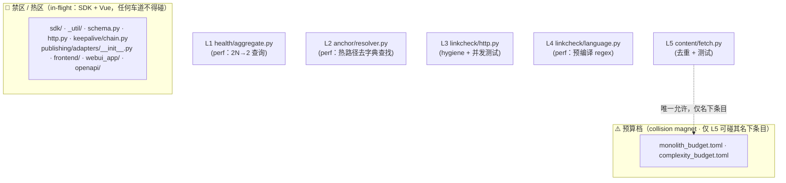

# refactor: 并行不撞车的优化车道

## Overview

把当前可做的优化工作切成**互不改到同一批檔案**的并行车道，让多个 agent / worktree / 分支能同时动工而不产生 git 冲突；并附一份 **runtime 并行安全/危险地图**，标出 pipeline 哪些阶段能安全并发、哪些会 race（最坏是重复发布）。

**结论先行（两种「撞车」都已回答）：**

1. **开发撞车（merge conflict）** — 经对抗式验证，**L1 / L2 / L3 / L5 四条车道现在就能完全并行，零冲突风险**。第 5 条 **L4 原本撞了 L3**（测试档案归属错配），本计划已修正归属，修正后 5 条全部互斥 → **可同时丢给 5 个 agent**。
2. **Runtime 撞车（race / 重复发布）** — **3 个读/探测阶段可安全并发**（validate、recheck 探测、ledger/只读 API），各有明确前置守卫；**publish 写入路径在预设 observe 模式下会重复发布（HIGH）**，其修复归属于 in-flight 的 SDK U5，**现在不可并行实作，须协调**。

## Problem Frame

canonical repo 当前停在 `refactor/webui-api-v1`，working tree 是脏的，且**两个大型重构同时混在同一棵树里**：

- **SDK 抽取**（plan `2026-06-22-001`，U5–U8 未完）— 还会动 `sdk/`、`__init__.py`、`_util/errors.py`、3 条 pipeline CLI、`publishing/adapters/__init__.py`，且 **U7 要拆掉 core→webui_app 反向依赖边**（散射型，最隐蔽）。
- **WebUI 前后分离 + Vue SPA**（plan `2026-06-18-002`，U7–U9 未完）— 还会动整个 `frontend/`、`webui_app/`、`openapi/`。

用户要的是：在这两个工程飞行中的「现在」，找出**还能安全平行动工的部分**，硬约束是**不能撞车**。本计划用「先测绘禁区 → 切互斥车道 → 对抗式证伪撞车」三步产出答案。

## Requirements Trace

- **R1.** 找出当前可并行、彼此不改同一檔案的优化工作（开发并行）。
- **R2.** 每条车道给出具体优化任务、确切檔案清单、为何不会撞车、如何验证。
- **R3.** 标出 runtime 并行的安全点与危险点（race / 重复发布），含前置守卫。
- **R4.** 硬约束：任何建议都不得与 in-flight 的 SDK / WebUI 工程或 CI 预算档（collision magnet）冲突。
- **R5.** 给出「完整」优化建议（用户原话「完整优化建议」）——覆盖 perf / dead-code / 重复 / 测试缺口两个维度。

## Scope Boundaries

- **非目标：** 不实作、不改码（本文件是分析+规划）。NEVER CODE。
- **非目标：** 不碰任何 in-flight 热区檔案（见下方禁区清单），不碰 `_util/*`、`config/`、`schema.py`、顶层 `http.py`、`publishing/adapters/__init__.py` 等 chokepoint。
- **非目标：** 不实作 runtime publish 写入路径的并发守卫——那是 SDK U5 的工作，本文件只标风险与所需守卫。
- **非目标：** 不处理 v0.5.0 残留的 Unit 6（扩 catalog YAML）——它会碰 adapter 注册行（chokepoint），不适合当并行车道。

## Context & Research

> 以下全部由 16-agent workflow 实地 grep/读码得出（run `wf_7ff9ca92-505`，~120 万 token），非臆测。

### 禁区清单（off-limits，任何车道不得碰）

`src/backlink_publisher/sdk/**`、`__init__.py`、`_util/**`（含 `errors.py`、`error_envelope.py`）、`schema.py`、顶层 `http.py`（adapter session 模块）、`keepalive/chain.py`、`publishing/adapters/__init__.py`、`cli/plan_backlinks/`、`cli/publish_backlinks/`、`cli/validate_backlinks.py`、`frontend/**`、`webui_app/**`、`openapi/backlink-api.yaml`、`monolith_budget.toml`、`complexity_budget.toml`。

### Chokepoint（被多模块 import，碰了会扇出冲突）

- `_util/`（被 24 模块 import；`errors.py` 被 124 处引用）、`config/`（20）、`publishing/`（17）、`http.py`（18 个 adapter）、`events/`（11）、`schema.py`（10）。
- **CI 预算档是最毒的 collision magnet**：`monolith_budget.toml`（41 个受监档）、`complexity_budget.toml`（具名函数零余量 + 全域 CC 30 backstop）。两者已被 SDK 抽取改脏。

### Import 聚类（车道的天然切线）

5 个自然聚类：Publishing Platform、Events & Analytics、Content Generation、Infrastructure Monitoring、Isolated Single-Feature。本计划的车道刻意**只取单檔案切片**（而非整个聚类），把互斥性做到最硬。

### Institutional Learnings（docs/solutions）

- 共享 worktree 必须**按显式路径 staging，绝不用 `git add -A`**——否则会扫进另一个 agent 的 WIP（已有 2026-05-18 事故记录）。
- 预算档 ceiling 命中是可预测的，改大档前先 `radon` 量测。
- adapter 上线前必须 grep `_DOFOLLOW_BY_CHANNEL`（与本计划无关，但说明 chokepoint 的敏感度）。

## Key Technical Decisions

- **车道粒度 = 单檔案切片，不是整个子套件。** 理由：把互斥性做到最硬——每条车道只拥有 1 个源檔 + 其专属测试档，跨车道不可能改到同一行。
- **预算档（两个 .toml）只许 L5 碰，且只碰它名下两个具名条目。** 理由：预算档是已被 SDK 改脏的 collision magnet；集中由单一车道拥有 + 具名条目隔离，textual diff 不会冲突。L2 的退路（`_build_links` CC 条目）改用「在 resolver 内 memoize」规避，根本不碰预算档。
- **`_util/*` 永不被任何车道改。** 理由：24 模块 chokepoint。若某车道想把共享逻辑上抽到 `_util/`，**一律喊停、保持本地**（如 L1 的 `_redact`）。
- **测试档归属唯一、子套件内也要拆。** 理由：同一子套件的两个源檔（如 `linkcheck/http.py` vs `language.py`）分给不同车道时，测试档也必须分清楚——L4 的撞车就是这里错配。
- **Runtime 写入路径的并发守卫不在本计划实作。** 理由：`publish_rows` 明确「无锁，并发安全由 caller 负责（plan U5）」——U5 是 in-flight、off-limits 的 SDK 工作，平行实作会撞。

## High-Level Technical Design

> *此图说明车道之间的隔离关系，是审阅用的方向性示意，不是实作规格。*

车道之间**没有任何连线** = 零依赖、零共享檔案 = 可任意顺序、同时动工、任意顺序合并。

## Implementation Units（Part 1：开发并行车道）

> 5 条车道全部并行、零先后依赖。每条建议在独立 worktree/branch 上跑自己的精简 pytest 子集（非全套 ~1 万测试），整合/合并时才跑全套。**提交一律按显式路径 staging。**

- [x] **L1：Health 聚合 perf（`health/aggregate.py`）**

**Goal:** 把 build_platform_health 的 2N 次 per-platform SQL 收敛成 2 次 GROUP BY；circuit-state JSON 只读一次。

**Requirements:** R1, R2, R5

**Dependencies:** 无（与其他车道完全独立）

**Files:**
- Modify: `src/backlink_publisher/health/aggregate.py`
- Test: `tests/test_platform_health_aggregate.py`、`tests/test_health_checkers.py`、`tests/test_health_projection.py`

**Approach:**
- L74–110 两个 `registered_platforms()` 回圈各 1 query/平台 → union 成单一参数化查询 `SELECT platform, ts_utc, kind FROM events WHERE kind IN (...) ORDER BY platform, ts_utc DESC`，记忆体内一次切分。
- L113–129 `circuit.is_tripped()` 每平台重读 `publish-circuit-state.json` → 回圈前读一次成 dict，圈内查 dict。
- `_redact`/`_TOKEN_RE`（L26–27）**仅当**第二份重复也在 `aggregate.py` 内才就地整理；**若需上抽到 `_util/` 则喊停、保持本地**。

**Patterns to follow:** 既有 `_NOISE_PATTERNS` 模块级预编译模式（见 L4）。

**Test scenarios:**
- Happy：N=15 平台 → 结果与重构前逐字相同（golden）；断言只发出 2 条 SQL；断言 state 档只读一次。
- Edge：0 平台注册 → 空结果、不报错。
- Edge：某平台无事件 → 以零计数出现。
- Error path：`publish-circuit-state.json` 不存在 → 视为无 trip，不崩。

**Verification:** `PYTHONPATH=src pytest tests/test_platform_health_aggregate.py tests/test_health_checkers.py tests/test_health_projection.py tests/test_cli_platform_health.py tests/test_cli_health_check.py` 全绿；`health/aggregate.py` 不在任一预算档，无 ceiling 风险。

---

- [x] **L2：Anchor resolver 热路径（`anchor/resolver.py`）**

**Goal:** 把 `_passes_filters` 热路径里的 per-candidate 字典查找移出；调查并（在 resolver 内）memoize anchor pool。

**Requirements:** R1, R2, R5

**Dependencies:** 无

**Files:**
- Modify: `src/backlink_publisher/anchor/resolver.py`
- Test: `tests/test_anchor_resolver.py`（必要时 `tests/test_anchor_lang.py`）
- 仅调查、原则上不改：`cli/plan_backlinks/_links.py`（见约束）

**Approach:**
- `_passes_filters`（L238–272）每个 candidate 都 index `_RATIO_RULES[language]`（L173 定义）。language 是静态 config 字串（预设 zh-CN）→ 在 `resolve_anchor` 入口解析一次 rule callable，往下传。
- `resolve_anchor`（L179）每 candidate 调 `get_anchor_pool_v2`（L212）→ **优先在 `resolver.py` 内 memoize**（functools cache，key=config id+domain+category+type），**避免改 `_links.py`**（其 `_build_links` 在 `complexity_budget.toml` 已达 CC 36，加分支会逼迫改预算档）。

**Execution note:** 优先 resolver 内修复；唯有 memoize 无法内置时才动 `_links.py`，且该档**仅本车道可碰**。

**Patterns to follow:** 既有 config 读取为只读 chokepoint consumer，不得改 config。

**Test scenarios:**
- Happy：zh-CN config → 选出的 anchor 与重构前相同（golden）；断言 `_RATIO_RULES` 每次 resolve 只解析一次（非 per-candidate）。
- Edge：language 不在 `_RATIO_RULES` → 走 fallback rule。
- Integration/perf：100 link 批次 → config pool 只解析一次（断言读取次数）；不同 domain/category/type → 不同 pool（memo key 正确）。

**Verification:** `PYTHONPATH=src pytest tests/test_anchor_resolver.py tests/test_anchor_lang.py`；若动了 `_links.py`，`radon cc -s` 确认 `_build_links` ≤36（否则本车道独占该预算条目并附 ≥80 字 rationale）。

---

- [x] **L3：Linkcheck 卫生 + 并发测试（`linkcheck/http.py`）**

**Goal:** 标准化 vestigial alias、加并发探针 instrumentation、补 `_dedup_key` 与批次大小的测试缺口。

**Requirements:** R1, R2, R5

**Dependencies:** 无

**Files:**
- Modify: `src/backlink_publisher/linkcheck/http.py`
- Test: `tests/test_linkcheck.py`、**`tests/linkcheck/test_linkcheck_env_overrides.py`（由 L4 改归 L3——见下方撞车修正）**

**Approach:**
- L20 `import os as _os`（getters L32/39/46/53 都用 `_os.environ`）→ 改回 `import os` 并 inline（纯标准化，无行为变化）。
- `check_urls`（L187–204）依 `min(_max_concurrent(), len(distinct))` 配 worker；小批次池子闲置无诊断 → 加 optional `perf_stats` dict（pool_size_requested / actual_workers_spawned / queue_depth）写 debug log（非阻塞）。
- 补 `_dedup_key`（L138–156）fail-soft 分支测试；补 `check_urls` 批次大小测试。
- **红线（来自对抗验证）：** 不得改 `_max_concurrent` / `check_url` / `check_urls_strict` 的**签名**——amber 的 `cli/_publish_helpers.py`（SDK U4）与 `validate/engine.py` 都 import 它们，改签名会撞 SDK U4。本车道只改 alias + 内部 instrumentation + 测试。

**Patterns to follow:** `linkcheck/http.py` 是**独立模块**，与顶层 `http.py`（adapter session chokepoint）完全不同檔，本车道绝不碰后者。

**Test scenarios:**
- Happy：`os` 标准化后 `BACKLINK_LINKCHECK_*` env getters 行为不变（env-overrides 测试续绿）。
- Edge：`_dedup_key` 收到 non-str → 原样回传（新测试）。
- Edge：`_dedup_key` 收到无法解析 URL → 原样回传（新测试）。
- Edge：`check_urls([])` → `{}`（早退）；size-1 短路；size-50 池满 → 去重正确、全数检查。
- Happy：`perf_stats` 启用时填值、停用时 no-op。

**Verification:** `PYTHONPATH=src pytest tests/test_linkcheck.py tests/linkcheck/test_linkcheck_env_overrides.py`；`py_compile` + `ast.parse` 干净；`grep _os src/` 仅 `linkcheck/http.py` 命中。

---

- [x] **L4：Linkcheck 语言 regex 缓存（`linkcheck/language.py`）**

**Goal:** 把每次 `_score_language` 都重编译的 EN_HINTS regex 改成模块载入时预编译一次。

**Requirements:** R1, R2, R5

**Dependencies:** 无

**Files:**
- Modify: `src/backlink_publisher/linkcheck/language.py`
- Test: **新建** `tests/linkcheck/test_language_regex_cache.py`（见撞车修正——**不得**用 `test_linkcheck_env_overrides.py`）

**Approach:**
- `_score_language`（L193–194）对 34 个 EN_HINTS 每次调用都编译 `rf'\b{hint}\b'`（即使 `use_word_boundary=False`）。`detect_language_from_markdown` 在 validation gate per-URL 跑 → 模块载入时建静态 `{hint: compiled_pattern}` dict（沿用既有 `_NOISE_PATTERNS` L29–41 模式）。RU/ZH/KO hints 走 substring，不需编译。

**⚠️ 撞车修正（来自 Collision-Verify，原始 verdict = serialize-after-L3）：** 工作流初版把 `tests/linkcheck/test_linkcheck_env_overrides.py` 划给 L4，但该档实测 `linkcheck/http.py` 的 env getters（L3 的源檔），零行涉及 `EN_HINTS`/`_score_language`。**修正：该测试档改归 L3；L4 改用新建的 `test_language_regex_cache.py`。** 修正后 L4 与 L3 源檔（`language.py` vs `http.py`）与测试档皆互斥 → **L4 恢复可与全部车道并行**。

**Test scenarios:**
- Happy：EN/ZH/RU/KO 样本的 `detect_language_from_markdown` 判定与重构前相同（golden）。
- Perf/identity：编译后的 pattern dict 只建一次——断言两次 detect 取到同一物件（identity 稳定）。
- Edge：空 markdown → unknown/default。

**Verification:** `PYTHONPATH=src pytest tests/linkcheck/test_language_regex_cache.py`；`py_compile` 干净。

---

- [x] **L5：Content fetch 状态码分类去重（`content/fetch.py`）**

**Goal:** 抽出 `_classify_http_code` helper，去掉 `_check_once` 里两段相同的 4xx/5xx 分类。

**Requirements:** R1, R2, R5

**Dependencies:** 无

**Files:**
- Modify: `src/backlink_publisher/content/fetch.py`
- Test: `tests/test_content_fetch.py`
- 预算（**唯一获授权**）：`monolith_budget.toml`（仅 `content/fetch.py` 条目）、`complexity_budget.toml`（仅 `test_files` 的 `test_content_fetch.py` 条目）

**Approach:**
- L200–204 与 L223–227 是相同的三分支状态分类（`http_<code>` / `http_5xx` / `http_<code>`）→ 抽 `_classify_http_code(code:int)->str` 两处共用。净 SLOC 持平或下降。
- `content/fetch.py` 在 `monolith_budget.toml`（ceiling 250、现 225）；去重**减行**，预期不需 bump。若新增测试推爆 `test_content_fetch.py` 的 `[test_files]` ceiling，本车道**独占**该条目，附 ≥80 字 rationale——因无人共改这两檔，即便 bump 也不会撞。

**Test scenarios:**
- Happy：404→`http_404`、451→`http_451`、500/503→`http_5xx`；经 HTTPError 路径（~L199）与 non-200 getcode 路径（~L221）皆回传一致 reason。
- Edge：罕见码（如 418）→ `http_418`。
- Verify SLOC：`radon raw -s content/fetch.py` ≤250（预期小幅下降）。

**Verification:** `PYTHONPATH=src pytest tests/test_content_fetch.py tests/content/`；去重后两个 call site 都走新 helper。

## Runtime 并行安全/危险地图（Part 2：执行并行）

> 这部分是**指引**，不是可立即实作的车道——多数写入守卫归 in-flight 的 SDK U5。下列「✅ 验证通过 / ❌ 被证伪」是 4 个对抗式 race-hunter 实地读码后的裁决。

### ✅ 可安全并行的阶段（已对抗式验证通过）

| 阶段 | 可并行做什么 | 前置守卫（不做则失效） |
|---|---|---|
| **validate-backlinks**（per-row 验证） | 把 rows 分片给 worker pool（URL check 开启时收益高） | **每个 row 必须 deep-copy 再交 worker**——`_enhance_payload` 会**原地改 row**（NFC 正规化、写 `row['validation']`）；裸切 list 共享 dict 会损坏内容。`set_log_level` 留主线程（它改 process-global logger）。 |
| **recheck 探测子阶段**（`_probe_batch` 的 HTTP 探针） | 在既有 flock 内对探针回圈开 bounded thread pool | 探针 JOIN 后，`emit_recheck` + `write_verified_at` **必须单线程串行 funnel**，且**按确定顺序**写（latest-verdict 以 events.id 破同 ts 平手）。**绝不并行写入阶段。** |
| **ledger build + WebUI V1 只读 API** | WAL 让多读者拿快照、并发服务只读请求 | 仅限**只读** V1 GET；读到的是某时刻快照（可能漏掉 in-flight 写入）= 仅 staleness 非损坏。**legacy `PUT /api/v1/history` 写入路径须维持停用/funnel。** |

### ❌ 被证伪 / 不可并行（对抗验证戳破）

- **plan-backlinks 并非「无 store 写入」。** 原判断称此阶段不碰 events.db——**factually false**：`snapshot_baseline → probe_ranking → EventStore.append()` 每次执行都写 RANKING_SNAPSHOT 入共享 events.db。**并行多次 invocation 会产生重复的 ranking 基线列**（破坏 before/after 排名比较）。单次 invocation 内 per-seed 分片仍安全（snapshot 只在 shell 跑一次），但**不可依据「纯函数」这个错误理由**去把 GSC hook 搬进 worker。

### 危险点（共享可变状态会 race）

| 共享状态 | race | 严重度 | 所需守卫（归属） |
|---|---|---|---|
| `dedup.db` 在 **observe 模式（预设）** | **重复发布**——observe 下 `gate()` 无条件回 `('dispatch', None)`，丢弃 BEGIN IMMEDIATE 结果；两个并发 caller 同 key 都 POST | **HIGH** | 并行 publish 前先 `BACKLINK_PUBLISHER_DEDUP_ENFORCE=1`，并对 `(platform, account)` 加 process-level publish lock。**守卫归 SDK U5（off-limits），现在不可平行实作。** |
| per-platform lease | 只挡同平台，挡不住同 target 经不同平台 | HIGH | 同上：dedup enforce 才是 per-key 真权威 |
| `checkpoint.json` read-modify-write | **lost update**——跨进程非原子，仅 in-process threading.Lock；并行 worker 会静默吞掉对方 mutation（已成功的 item 看起来 pending → 喂给重复发布） | HIGH | checkpoint 写入 funnel 进单一 owner 线程，或改 per-item SQLite UPDATE |
| `articles.verified_at`（recheck vs publish） | last-write-wins / liveness 暂时不一致 | MED | 串行化或 compare-and-set（只在无更新的 publish 事件时才写） |
| `history_store` events.db fallback | 无锁并发 UPDATE | MED | WebUI history 维持只读；要写就 funnel 进同一 articles writer |
| events.db articles INSERT 争用 | 竞争 + 事件流乱序（非损坏） | LOW | 接受 WAL 串行；reader 端按 `(run_id, ts)` 排序 |

## System-Wide Impact

- **Interaction graph：** 5 条开发车道彼此零交互、零共享檔案；与 in-flight SDK/Vue 的唯一接触面是「禁区围栏」（已硬隔离）。
- **API surface parity：** 无——所有车道皆为模块内部优化，不改任何对外签名（L3 红线明令不改 `linkcheck/http.py` 公开 getter 签名）。
- **不变量（明确不动）：** `_util/*`、`config/`、`schema.py`、顶层 `http.py`、`publishing/adapters/__init__.py`、两个预算档（除 L5 名下两条目）一律不动。
- **Runtime 状态生命週期：** Part 2 的写入路径（dedup/checkpoint/articles）有真实 race；本计划只标风险，守卫实作归 SDK U5，须协调不可抢做。
- **Staging：** 树脏（2 个 in-flight 工程），每条车道**只按显式路径 staging**，提交前 `git status --short` 确认只暂存自己的檔案。

## Risks & Dependencies

| Risk | Mitigation |
|---|---|
| L3 扩大范围去改 `linkcheck/http.py` 公开 getter 签名 → 撞 SDK U4 | 红线明令：本车道只碰 alias + 内部 instrumentation + 测试，不动签名 |
| 某车道把共享逻辑上抽到 `_util/`（如 L1 的 `_redact`） | 规则：碰到要进 `_util/config/events/publishing` 一律喊停、保持本地 |
| L5 / L2 同时需要 bump 预算档 | 两者拥有**不相交的具名条目**；万一都要 bump，按 L5→L2 stack PR（diff 落在不同具名条目，无 textual 冲突）。预期路径两者皆不需 bump |
| 用 `git add -A` 扫进另一工程 WIP（已有事故记录） | 显式路径 staging + 提交前 `git status --short` 自检 |
| 把 Part 2 的 publish 写入守卫平行实作 → 撞 SDK U5 | 明令：runtime 写入守卫不在本计划，须等/协调 SDK U5 |
| 误信「plan-backlinks 无 store 写入」去并行多次 invocation | 已证伪并记录：会产生重复 ranking 基线列 |

## Appendix：Collision-Verify 裁决（不能撞车的证明）

每条车道由一个对抗式踢馆者（不确定即判撞车）实地比对 repo：

- **L1** — `clean`：独占 `health/aggregate.py` + 3 个 webui-free 测试；明确排除 `test_health_metrics.py` 与所有 `*_route.py`（它们 import webui_app）。
- **L2** — `clean`：独占 `anchor/resolver.py` + 测试；`_links.py` 保留给本车道独用，连退路都不会跨车道撞。
- **L3** — `clean`：`linkcheck/http.py` 与顶层 adapter `http.py` 是**不同物理檔**（已核实路径相异）；不在任一预算档；不改公开 getter 签名 → 不撞 amber 的 SDK U4。
- **L4** — 原始 `serialize-after-L3`（测试档错配）→ **本计划已修正归属**（env-overrides 测试归 L3、L4 新建 language 测试档）→ 修正后 `clean`。
- **L5** — `clean`：独占 `content/fetch.py` + 测试；是**唯一**获授权碰预算档者（仅其名下条目）；去重减行，预期不需 bump。

**净结论：L1/L2/L3/L5 现在即可并行；L4 套用本计划的测试档归属修正后亦可并行 → 5 条全互斥。**

## Sources & References

- 分析来源：16-agent workflow `wf_7ff9ca92-505`（Map → Partition → Collision-Verify，~120 万 token，实地 grep/读码）
- In-flight plans：`docs/plans/2026-06-22-001-refactor-embeddable-sdk-extraction-plan.md`、`docs/plans/2026-06-18-002-refactor-webui-frontend-backend-separation-plan.md`
- 约束来源：`AGENTS.md`、`CLAUDE.md`、`monolith_budget.toml`、`complexity_budget.toml`、`docs/solutions/workflow-issues/*`
- 关键码位：`idempotency/store.py`、`cli/_dedup_gate.py`、`checkpoint.py`、`recheck/events_io.py`、`cli/publish_backlinks/_engine.py`（runtime 危险点）；`health/aggregate.py`、`anchor/resolver.py`、`linkcheck/http.py`、`linkcheck/language.py`、`content/fetch.py`（开发车道）
