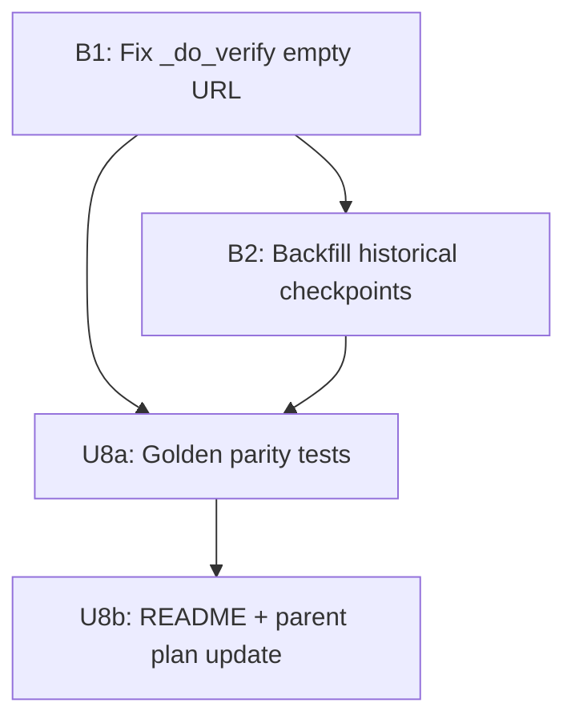

# fix: Empty URL false-green + SDK U8 completion

## Overview

兩個獨立改動，按優先序排列：

1. **B1（xfail 修復）** — `_do_verify` 在 `published_url` + `draft_url` 均為空時返回 `(True, "")` → 空 URL 被錯誤標記為 verified-dofollow（false-green）。一行修復後，將 `test_empty_live_url_is_not_verified_dofollow` 的 `xfail` 標記移除。

2. **SDK U8 收尾** — SDK extraction plan (2026-06-22-001) 剩餘工作：golden parity 測試 + E2E smoke + README SDK Quickstart 段落。U6/U7 已全部完成（61 個測試全綠，見 2026-06-24 核查），僅需在父計畫打勾。

## Problem Frame

### B1：資料品質缺陷

`_publish_helpers.py:290-291`：
```
verify_url = result.published_url or result.draft_url
if not verify_url:
    return True, ""   # ← 問題所在
```

`verify_ok=True` 使下游 `record_done` 帶著 `verified=True` 寫入，checkpoint 也標 `verified=True`。空 URL 意味著發布失敗或 draft 保留，operator 無法判斷實際情況，報告誤顯「已驗證 dofollow」。

### SDK U8：完整性缺口

plan→validate→publish 三管線 CLI 與 SDK in-process 路徑共享相同 compute kernel，但缺少 golden parity 測試來鎖定等價性。若有人不小心在 CLI 層加入副作用，SDK 路徑會靜默漂移。

## Requirements Trace

- R-B1. 空 `published_url` + `draft_url` 必須導致 `verify_ok=False`、status 帶 `_unverified` 後綴
- R-U8a. CLI (`plan-backlinks`/`validate-backlinks`) 與 SDK (`sdk.plan`/`sdk.validate`) 同 fixture 輸出逐行一致 + exit_code 一致
- R-U8b. `import backlink_publisher` → 有意義的 SDK Quickstart 用例被 README 記錄

## Scope Boundaries

- 不改 `no_verify` / `dry_run` 路徑（已正確早期返回）
- 不改 `publish-backlinks` CLI 的殼層 policy（banner/config echo/exit code map）
- 不移動任何 adapter 檔案
- `publish` golden parity 留給後續（R7b deferred per U8 計畫）
- Korean threshold 校準（language.py:73 TODO）需外部語料庫，不在此範圍

## Context & Research

### Relevant Code and Patterns

- `src/backlink_publisher/cli/_publish_helpers.py:280-301` — `_do_verify` 函數，問題在 :290-291
- `tests/test_e2e_live_publish_ratio.py:219-235` — xfail 測試，修復後移除 marker
- `src/backlink_publisher/sdk/__init__.py` — `plan`/`validate`/`publish` 薄包裝，已完整
- `src/backlink_publisher/__init__.py` — 根 facade + lazy `__getattr__`，已完整（U6 done）
- `tests/test_core_no_webui_app_import.py` — AST gate，已完整通過（U7 done）
- `tests/test_public_facade_resolvable.py` / `tests/test_sdk_facade_resolvable.py` — facade 測試，已通過
- `tests/e2e/publish_journey.py` — E2E smoke 模板，無真網絡需 enable_socket
- `tests/test_pipeline_inprocess_characterization.py:291-556` — in-process smoke 模板

### Institutional Learnings

- xfail + `strict=False`：XFAIL 出現代表 bug 尚存；修復後若沒移 marker 測試變 XPASS 不報錯，要主動移
- `_do_verify` 有兩個呼叫點：`_engine.py:512` 和 `_resume.py:416` — 修一個地方即可（兩者都 import `_do_verify` from `_publish_helpers`）
- Golden parity 需脫敏 `run_id`/timestamp/throttle 計時才能逐行 diff

## Key Technical Decisions

- **空 URL → `(False, "no URL to verify")`**：比 `(True, "")` 更接近語義——沒有 URL 就無法驗證，不能視為通過。`_unverified` 後綴讓 operator 看到異常，符合 xfail 測試的 desired invariant。
- **只改 `_do_verify`，不改呼叫點**：`_engine.py` 和 `_resume.py` 都透過同一個 import 路徑使用，改 helper 一次性修復兩條路徑。
- **空 URL 後 dedup 狀態保留 `done`**：empty-URL dispatch 仍寫入 `done`（terminal），`verify_ok=False` + `verified=False` 如實記錄。Operator 若需重試可用 `--forget`。不改 state machine（`record_done` → `record_uncertain` 路徑不需要）。
- **xfail marker 只移除，不加 `xfail_strict=true`**：B1 PR 中移除 `@pytest.mark.xfail` 即可，不修改 `pyproject.toml`。
- **歷史 checkpoint backfill**：B1 是前瞻性修復；B1 上線前已寫入的 `verified=True + published_url=''` 記錄需一次性 backfill 標為 `uncertain`，以確保 `--resume` 不再以 `done` 重播這些假陽性。
- **U6/U7 標記已完成，不重做**：2026-06-24 核查確認 61 個測試全綠，代碼已落庫。計畫進度需更新，但無需改代碼。

## Open Questions

### Resolved During Planning

- **Q: `_resume.py` 裡的 `_do_verify` 呼叫是否受影響？** → 是，共享同一 helper，一個修復同時蓋到兩條路徑。
- **Q: U6/U7 是否真的已完成？** → 是。`test_public_facade_resolvable.py`、`test_sdk_facade_resolvable.py`、`test_core_no_webui_app_import.py` 全部 PASS（61 tests, 2026-06-24）。
- **Q: `docs/architecture/sdk-layering.md` 是否已存在？** → 是，U8 的文件部分已完成。

### Deferred to Implementation

- **Resume 路徑 (`_resume.py`) 的 empty URL 情境在現有測試中是否有 fixture？** → 確認：`test_publish_backlinks_resume*.py` 均使用非空 URL fixture — B1 PR 需在 `test_publish_backlinks_resume.py` 補一個 edge case（mock `AdapterResult(published_url='', draft_url='')` → 斷言輸出 status 含 `unverified`）。
- **Golden parity 的 `run_id` 脫敏策略**：執行時參考 `test_pipeline_inprocess_characterization.py:291-556` 的 normalize helper 決定實作細節。預期需要額外正規化 `_dry_run`、`_command`、`_provider_meta` 欄位——先用 subproc CLI 跑固定 seed 捕捉 raw diff，枚舉所有不穩定欄位後再撰寫 normalize helper。
- **`_resume.py:430` 的 `dry_run=False` 硬碼**：resume 路徑以硬碼 `False` 傳入 `_do_verify`（`getattr(args, 'no_verify', False), False, result, row`）。這是有意設計（resume 總是執行真實 dispatch，故應做真實驗證），需在 `_resume.py:417` 附近加一行注釋防止未來有人「修正」此非對稱性而誤破驗證行為。

## Implementation Units



---

- [x] **B1: 修復 `_do_verify` 空 URL false-green**

**Goal:** `published_url` 和 `draft_url` 同時為空時，`_do_verify` 返回 `(False, "no URL to verify")` 而非 `(True, "")`；移除 `test_empty_live_url_is_not_verified_dofollow` 的 `xfail` marker。

**Requirements:** R-B1

**Dependencies:** 無

**Files:**
- Modify: `src/backlink_publisher/cli/_publish_helpers.py` — 第 291 行 `return True, ""` 改為 `return False, "no URL to verify"`
- Modify: `tests/test_e2e_live_publish_ratio.py` — 移除第 219-221 行的 `@pytest.mark.xfail(...)` decorator，保留測試本體
- Modify: `src/backlink_publisher/cli/publish_backlinks/_engine.py:524` — `live_url=result.published_url or result.draft_url` 改為 `live_url=(result.published_url or result.draft_url) or None`
- Modify: `src/backlink_publisher/cli/_resume.py:430` — 同上，空字串轉 None 使 SQL `COALESCE(?, existing_value)` 保留舊值

**Approach:**
- `_do_verify` 第 287-291 行的早期返回順序：`no_verify/dry_run` 先行（語義：刻意跳過），空 URL 次之（語義：無法驗證）。後者應回傳 `False`。
- 移除 `xfail` 後，測試斷言 `"unverified" in out["status"]` 現在應該通過。
- **兩個呼叫點的 live_url 修法**：`_engine.py:524` 和 `_resume.py:430` 均以 `result.published_url or result.draft_url` 傳入 `record_done`。Python 中 `"" or ""` 計算為 `""`（非 None），SQL `COALESCE("", existing_value)` 不保護空字串，會覆蓋掉先前存的有效 live_url。修法：加 `or None` 將空字串轉為 None，COALESCE 即保留舊值。無需改 schema。

**Patterns to follow:**
- `_do_verify` 第 287-288 行：`if no_verify or dry_run: return True, ""` — 對比：這是刻意跳過，語義不同，保持 `True`

**Test scenarios:**
- Happy path: 移除 xfail 後，測試 `test_empty_live_url_is_not_verified_dofollow` 變 PASS，非 XPASS
- Edge case: `no_verify=True` 時，空 URL 仍返回 `(True, "")` — 刻意跳過路徑不受影響
- Edge case: `dry_run=True` 時，同上不受影響
- Edge case: 只有 `draft_url` 非空時（`published_url=""`, `draft_url="http://…"`）→ `verify_url` 非空，正常進入驗證流程
- Integration: `_resume.py:416` 的 `_do_verify` 呼叫在空 URL 情境下也返回 `False` — 無需改 `_resume.py`，因為共享 helper

**Verification:**
- `pytest tests/test_e2e_live_publish_ratio.py::test_empty_live_url_is_not_verified_dofollow` → PASSED（非 XFAIL）
- `pytest tests/test_e2e_live_publish_ratio.py` 全綠，無 regression

---

---

- [x] **B2: 歷史 checkpoint backfill — verified=True + published_url='' → uncertain**

**Goal:** 找出 B1 上線前已寫入的 `verified=True && published_url IS NULL OR ''` checkpoint 記錄，標為 `uncertain`，使 `--resume` 不再以 `done` 重播這些假陽性。

**Requirements:** R-B1（retrospective complement）

**Dependencies:** B1（確認 schema 後再跑 backfill）

**Files:**
- Create: `scripts/backfill_empty_url_checkpoints.py` — 一次性 backfill 腳本，掃描 checkpoint DB，找 `verified=1 AND (published_url IS NULL OR published_url = '')` 的 `done` 記錄，批次更新為 `uncertain`（保留 `completed_at`/`adapter`，清 `published_url` 以 NULL 取代 `''`）
- Modify: `docs/plans/2026-06-24-001-...` （本計畫）— 記錄 backfill 執行結果

**Approach:**
- 掃描路徑：`~/.config/backlink-publisher/checkpoints/*.db`（預設）及 `BACKLINK_PUBLISHER_CONFIG_DIR` override
- 更新條件：`state='done' AND verified=1 AND (published_url IS NULL OR published_url='')` → `state='uncertain', verified=0`
- Dry-run 模式（`--dry-run`）：列出受影響行數，不更新
- 執行後輸出影響行數；若為 0，表示環境無歷史污染

**Test scenarios:**
- Test expectation: none — 一次性腳本，有 dry-run 保護；執行前手動備份 DB

**Verification:**
- `python scripts/backfill_empty_url_checkpoints.py --dry-run` 無 error，列出受影響行數
- 正式執行後，`--resume` 不再將 published_url='' 的記錄以 `done` 輸出

---

- [x] **U8a: Golden parity 測試 — CLI vs SDK**

**Goal:** 建立 `tests/test_sdk_golden_parity.py`（plan/validate 路徑）和 `tests/e2e/sdk_smoke_journey.py`（端到端 in-process smoke），鎖定 CLI 與 SDK 在同一 fixture 下輸出等價。

**Requirements:** R-U8a

**Dependencies:** B1（優先完成，避免 empty-URL false-green 污染 parity fixture）

**Files:**
- Create: `tests/test_sdk_golden_parity.py`（`__tier__ = "unit"`）
- Create: `tests/e2e/sdk_smoke_journey.py`（`__tier__ = "e2e"`）

**Approach:**
- Golden parity 策略：對同一 `_valid_plan_seed` fixture 分別跑 CLI subproc 和 `sdk.plan(seed)`，normalize（脫敏 `run_id`/timestamp/throttle 計時後）後逐行 set 比對 + exit code 一致
- Normalize helper：參考 `test_pipeline_inprocess_characterization.py:291-556` 的 pattern
- E2E smoke：`plan → validate → publish(dry_run=True)` in-process，autouse `socket_disabled`（不 `enable_socket`），mock adapter 回傳 drafted 結果
- `sdk_smoke_journey.py` 必須用 `__tier__ = "e2e"` 使其被 `-m unit` 排除

**Execution note:** characterization-first — 先跑 CLI subproc 捕捉輸出作 golden，再跑 SDK 比對，最後移除 golden snapshot 改為程式化等價斷言。

**Patterns to follow:**
- `tests/test_pipeline_inprocess_characterization.py:291-556` — in-process smoke + normalize
- `tests/e2e/publish_journey.py` — enable_socket 控制模式（本 smoke 不 enable）
- `tests/test_bp_registry.py` — cold subprocess import 驗證模式

**Test scenarios:**
- Happy path: `sdk.plan(seed)` vs `plan-backlinks` CLI — normalize 後 stdout 行集一致，exit_code 均為 0 → `test_sdk_golden_parity.py`
- Happy path: `sdk.validate(rows)` vs `validate-backlinks` CLI — 同上 → `test_sdk_golden_parity.py`
- Error path: 校驗失敗行：CLI exit 2 + `InputValidationError` 信封；SDK 返回 `success=False`/`exit_code=2`/通過行仍在 `.stdout` → `test_sdk_golden_parity.py`
- Edge case: `config_echo` banner 出現在 CLI stderr，**不**出現在 SDK 進程內輸出（H1/H3 殼 policy）— 明確斷言 `sdk.plan()` 返回的 stderr/副作用不含 banner 字串 → `test_sdk_golden_parity.py`
- Integration: in-process `plan → validate → publish(dry_run=True)` 成功完整走完，無 leaked socket → `sdk_smoke_journey.py`
- Edge case: `sdk_smoke_journey.py` 用 `-m unit` 收 0 個，用 `-m e2e` 收到該 case → tier 標記正確

**Verification:**
- `pytest tests/test_sdk_golden_parity.py` 全綠
- `pytest -m e2e tests/e2e/sdk_smoke_journey.py` 全綠
- `-m unit` 跑不到 `sdk_smoke_journey.py`

---

- [x] **U8b: README SDK Quickstart + 父計畫更新**

**Goal:** 在 README 的 `## Quick Start`（:12）與 `## Pipeline Commands`（:50）之間加入 `## SDK Quickstart` 段落；在 `docs/plans/2026-06-22-001` 將 U6/U7/U8 勾選完成。

**Requirements:** R-U8b

**Dependencies:** U8a（確認 SDK 行為正確後再寫文件）

**Files:**
- Modify: `README.md` — 在行 50（`## Pipeline Commands`）前插入 `## SDK Quickstart` 段落
- Modify: `docs/plans/2026-06-22-001-refactor-embeddable-sdk-extraction-plan.md` — 將 U6/U7/U8 改為 `[x]`

**Approach:**
- `docs/sdk-quickstart.md` 已存在且完整（104 行，含程式範例、PipeResult 欄位、typed errors、browser-tier 說明、dispatch API）。U8b 的實際工作量只是在 README.md 新增 `## Embeddable SDK` 小節（2-3 句描述 + 連結到 `docs/sdk-quickstart.md`），不需要重新撰寫任何內容。
- 父計畫更新：只勾 checkbox，不改計畫內容

**Test scenarios:**
- Test expectation: none — README 段落和計畫 checkbox 無行為，不需 test
- （手動驗證：README 範例照抄可直接執行，不 raise ImportError）

**Verification:**
- `grep "SDK Quickstart" README.md` 有輸出
- 父計畫 U6/U7/U8 三行均為 `- [x]`

---

## System-Wide Impact

- **Interaction graph:** `_do_verify` 被 `_engine.py`（fresh publish）和 `_resume.py`（resume flow）兩條路徑呼叫，B1 修復同時覆蓋兩者
- **Error propagation:** `verify_ok=False` → `state.outputs[-1]["status"] += "_unverified"` → `record_done(..., verify_ok=False)` → checkpoint `verified=False`。下游報告和 history store 均正確反映未驗證狀態
- **State lifecycle risks:** B1 不改 `record_done` 或 checkpoint 邏輯，只改 `_do_verify` 的返回值；無 partial-write 風險
- **API surface parity:** `_publish_helpers.py` 是 internal helper，無外部 API 合約變化
- **Unchanged invariants:** `no_verify=True`/`dry_run=True` 的 early-return 行為不變；已有 URL 的驗證流程不變；adapter registry、CSRF、exit code map 均不變

## Risks & Dependencies

| Risk | Mitigation |
|------|------------|
| `_resume.py` empty URL 場景無測試覆蓋 | 確認：`test_publish_backlinks_resume*.py` 全部使用非空 URL fixture — B1 PR 需補 `_resume.py` 路徑下空 URL edge case |
| `record_done(live_url="")` 語義不明 | B1 PR 必查 `ledger/sources.py` 的 `record_done`：確認空 `live_url` 是否會寫入 history store，若會寫，dedup 邏輯是否被干擾 |
| `publish` parity 缺席 → B1 SDK 路徑盲區 | `publish` parity deferred (R7b)，但 `sdk.publish → PipelineAPI().publish_seed → _engine.py → _do_verify` 這條路徑上的 B1 修復在 SDK 側沒有測試覆蓋。在 U8a E2E smoke 的 `publish(dry_run=True)` 場景中，加入空 URL fixture 驗證 `_unverified` 後綴出現 |
| Golden parity normalize 不完整，逐行 diff 永遠對不上 | 先用 subproc CLI 跑固定 seed 捕捉 golden snapshot，找出所有需要 normalize 的欄位，再程式化 |
| README 範例與 `sdk/__init__.py` 實際 signature 不一致 | U8b 依賴 U8a：U8a 確認 SDK 行為後再寫 README，範例直接從通過的測試提取 |

## Documentation / Operational Notes

- B1 修復後，現有使用空 URL 發布的 automation 會開始看到 `_unverified` 後綴 — 這是**預期的正確行為**，不是 regression
- `docs/architecture/sdk-layering.md` 已存在且完整，U8 文件部分已完成

## Sources & References

- **Origin document:** [docs/plans/2026-06-22-001-refactor-embeddable-sdk-extraction-plan.md](docs/plans/2026-06-22-001-refactor-embeddable-sdk-extraction-plan.md)
- Bug location: `src/backlink_publisher/cli/_publish_helpers.py:290-291`
- xfail test: `tests/test_e2e_live_publish_ratio.py:219-235`
- SDK facade: `src/backlink_publisher/__init__.py`, `src/backlink_publisher/sdk/__init__.py`
- E2E template: `tests/e2e/publish_journey.py`, `tests/test_pipeline_inprocess_characterization.py:291-556`
