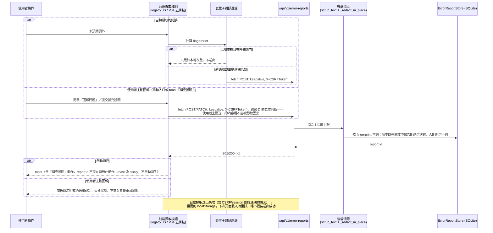
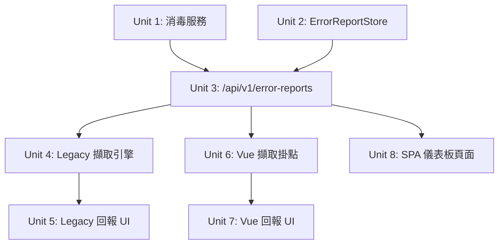
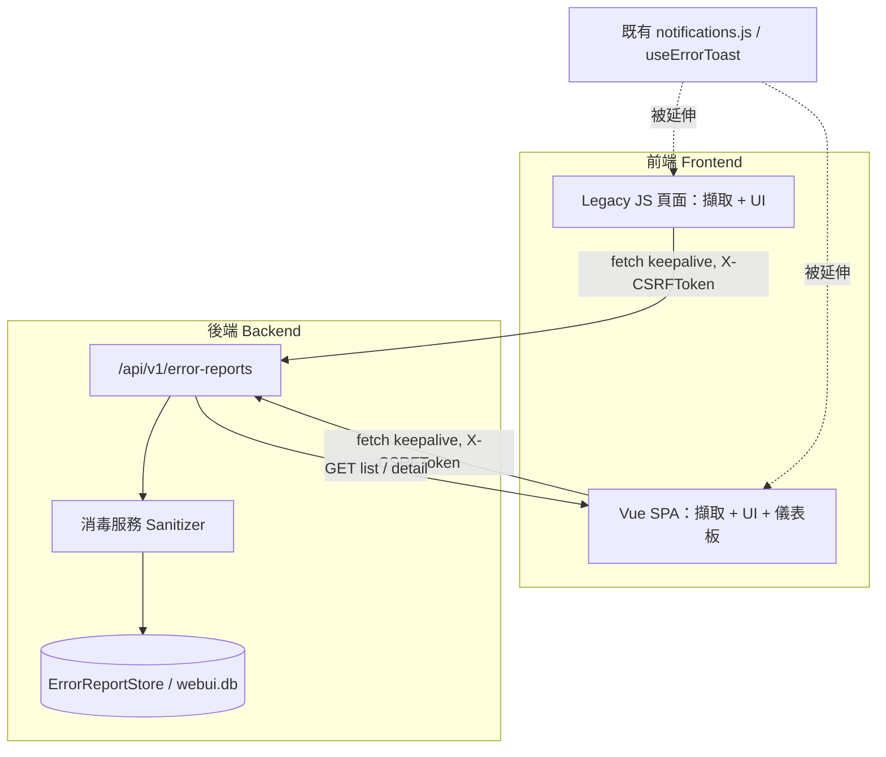

# Frontend Error Reporting & Diagnostics Dashboard — 前端錯誤回報與診斷儀表板

## Overview（概覽）

在兩個現行 WebUI 前端（legacy Jinja + 原生 ES module 頁面，以及 Vue 3 SPA）上，建立一套完整的錯誤擷取與回報機制：任何未預期的前端錯誤發生時，自動產生結構化錯誤紀錄並即時送到後端；使用者可以在錯誤提示上點擊「補充說明」為該筆紀錄加上情境描述，也可以隨時透過導覽列固定入口主動回報問題（即使當下沒有偵測到任何錯誤）；所有紀錄持久化保存（重啟不遺失），並透過一個新的站內「錯誤報告」儀表板頁面供開發／維運端瀏覽、篩選與標記已處理。目的是讓「使用者回報」與「開發端診斷」之間有一條可靠、不遺漏、不外洩機密的資料通路。

## Problem Frame（問題框架）

這個應用目前對前端使用者側完全沒有錯誤可觀測性機制。`webui_app/static/js/ui/errors.js` 與 `frontend/src/lib/errors.ts` 的 `classifyError()` 只把已知的 API 失敗分類成固定的顯示文案——它不擷取、不記錄、不回報任何東西。`webui_app/services/alerting.py` 的 `AlertRegistry` 是刻意設計成重啟即遺失的記憶體內註冊表，服務的是既有 `/ce:health` 維運健康度儀表板，不是使用者端的前端錯誤。當瀏覽器端真的出錯時，操作者只能靠自己記住現象、事後口頭描述給開發端，往往連堆疊、當下網址、確切重現步驟都已經遺失。這份計畫要把「擷取 → 消毒 → 持久化 → 呈現 → 標記已處理」整條路徑補齊。

本計畫沒有承接既有的 brainstorm 需求文件——輸入是使用者一句話的功能請求，範圍透過三個經使用者確認的澄清問題（送出時機、查看方式、手動入口）直接定案，取代正式的 requirements 文件。

**誠實範圍說明**：上述「堆疊、當下網址、確切重現步驟都已經遺失」點名了三類遺失內容，本計畫的 R1-R7 完整解決前兩類（堆疊、網址），但「確切重現步驟」的重建機制——行為軌跡（breadcrumb）擷取——已在 Scope Boundaries 明確列為刻意延後（見下方 Deferred to Separate Tasks）。使用者補充說明欄位是目前唯一的替代方案，但它同樣仰賴人工記憶，只是把「口頭描述」換成「打字記錄」，並未真正解決「重現步驟遺失」這個子問題。

## Requirements Trace（需求追溯）

- R1. 任何未預期的前端錯誤（未捕捉例外、未處理的 Promise rejection、Vue 元件／渲染錯誤、路由錯誤、失敗的 API 呼叫）發生時，系統自動產生結構化錯誤報告並立即送出到後端，不需等待使用者動作。
- R2. 使用者可以針對某一筆已自動擷取的錯誤，透過該錯誤提示上的動作按鈕補充自由文字說明。
- R3. 使用者可以隨時透過一個固定、隨處可達的導覽列入口主動回報問題，即使當下沒有偵測到任何錯誤。
- R4. 錯誤報告必須跨行程重啟持久化保存，不能只存在記憶體中。
- R5. 開發／維運端可以透過站內儀表板瀏覽、篩選、標記報告已處理；不需要任何對外推播通知管道。
- R6. 涵蓋兩個現行 WebUI 前端表面：legacy Jinja／原生 ES module 頁面與 Vue 3 SPA。
- R7. 任何可能夾帶密鑰、憑證或個資的擷取內容，必須在持久化或呈現前完成消毒。

## Scope Boundaries（範圍邊界）

- 不建立任何對外推播通知管道（email／Slack／webhook）——依使用者確認的決策，可見性完全限於站內儀表板。
- 不擷取使用者操作的「行為軌跡」（click/breadcrumb trail）——見下方 Deferred。
- 不新增全站等級的 `@app.errorhandler(Exception)` 保底處理——這與同時進行中的 Phase 3 訊號完整性強化文件（`docs/brainstorms/2026-07-01-phase3-signal-integrity-hardening-requirements.md`）範圍重疊；本功能自己的 endpoint 依 UX-Honesty 慣例明確處理自己的失敗路徑，不倚賴全域 catch-all。
- 不處理 CLI pipeline 自己的 stderr 診斷輸出——本計畫的「前台」範圍限於 WebUI（兩個前端堆疊），CLI 已有自己文件化的 stdout/stderr 契約。
- 不逐一稽核 SPA 內每個 `router.push()` 呼叫點並補上 `.catch()`——`router.onError()` 是盡力而為的全域防線；逐點稽核是更大、獨立的工作。
- 不重新託管或替 jsdelivr CDN 載入的 `bootstrap.bundle.min.js` 加上 CORS header 以解決其跨源錯誤的不透明性——已知限制，接受現狀。
- 不建立完整 DOM 快照或 session-replay 級別的擷取——依隱私檢查清單，完全排除在範圍外。

**排程關係說明（未解決，僅揭露）**：同時進行中的 `docs/plans/2026-06-30-001-opt-phase3-post-v050-iteration-plan.md`（Phase 3）明確定位為「在啟動 v0.6.0 功能開發前，將代碼庫推向下一個穩定基線」的最後一次集中優化迭代，其自身的 Out-of-Scope 表格也把新功能開發排除在外、留給 v0.6.0。本計畫是同一天產出的新功能（`type: feat`），且觸及與 Phase 3 同一類根因模式（WebUI 接縫的靜默/假成功失敗）。本文件不擅自決定「本計畫應該與 Phase 3 並行，還是等 Phase 3 達到穩定基線後才開始」——這是排程／優先序決策，取決於 Phase 3 實際進度等本文件沒有的資訊——但明確把這個問題攤在檯面上，而非預設略過。

### Deferred to Separate Tasks

- 修正 `webui_app/static/js/notifications.js` 裡既有的失效選擇器 bug——`createBadge()` 目前尋找 `.global-nav__actions`，但這個 class 在 `base.html`／`global_nav.css` 裡完全不存在（真正的容器是 `.app-topbar__actions`），代表現有通知鈴鐺徽章目前是死代碼、從未真正掛載成功。這是研究過程中發現的既存、無關的小 bug，本計畫的導覽列入口會正確掛到 `.app-topbar__actions`（見 Unit 5），但不在本計畫範圍內回頭修正 `notifications.js` 自己的問題——建議另開一個小任務處理。
- 行為軌跡（breadcrumb）擷取——待本計畫的 MVP 擷取管線穩定運作後，作為獨立功能再評估。
- 替跨源載入的 Bootstrap bundle script 加上 `crossorigin` 屬性＋伺服器端 CORS header，讓它的錯誤不再是不透明的「Script error.」。

## Context & Research（背景與研究）

### Relevant Code and Patterns

- `webui_app/static/js/ui/errors.js` + `frontend/src/lib/errors.ts` — 既有的 `classifyError()` 錯誤分類系統，把失敗映射到固定的、經消毒的顯示文案；本計畫重用其分類結果，但新增擷取＋送出＋持久化，這是它目前完全沒做的部分。
- `webui_app/static/js/notifications.js` + `frontend/src/stores/notifications.ts`／`composables/useErrorToast.ts` — toast／通知中心，`app:notify` CustomEvent 匯流排（無 `window.*` 全域）。`add()` 已經用物件展開儲存任意額外欄位，代表可以直接附加 `reportId` 而不需改動其結構。
- `webui_app/static/js/ui/toast.js` — toast 渲染器，純 `createElement`（無 `innerHTML`），訂閱 `app:notify`。
- `webui_app/services/alerting.py` — 既有的記憶體內 `AlertRegistry`；**明確不重用**，其文件自陳「重啟即遺失」，服務對象是維運健康度而非需要持久化的前端錯誤。
- `webui_store/base.py`（`Store` protocol／`JsonStore`／`_LazyStore`）、`webui_store/sqlite_base.py`（`BaseSqliteStore`／`WebUIDatabase`）、`webui_store/verify_health.py`（無 JSON 前身的純 SQLite store 前例）、`webui_store/campaign_store.py`（id-keyed 逐列＋JSON blob＋可查詢鏡射欄位的前例，本計畫的儲存形狀更接近這個）。
- `webui_app/api/v1/__init__.py` + `errors.py` — 版本化 JSON API blueprint（`url_prefix="/api/v1"`），RFC 9457 `application/problem+json` 錯誤信封（`ApiProblem`／`problem_response`）。
- `webui_app/routes/health.py` — 唯讀 GET 慣例、fail-open 但明確帶旗標。
- `webui_app/__init__.py` — `_global_csrf_guard`，全站單一 `before_request`，POST/PUT/PATCH/DELETE 自動套用，無需逐 blueprint 接線；OAuth callback 是目前唯一的例外（因跨源導向後 CSRF token 過不去，非本功能適用情境）。
- `webui_app/templates/base.html` — script 尾端載入順序（`theme.js → nav.js → ui/toast.js → notifications.js → ui/nav-badge.js`，皆 `type="module"`），以及第 92 行的 `.app-topbar__actions` 容器（真正的頂欄動作區，非 `notifications.js` 誤用的 `.global-nav__actions`）。
- `frontend/src/main.ts`、`layout/TopBar.vue`、`layout/navItems.ts`、`router/index.ts` — Vue bootstrap 與導覽整合點；`TopBar.vue` 目前只有搜尋框（stub）／Pro 狀態徽章／主題切換按鈕於 `.topbar__right`。
- `src/backlink_publisher/_util/logger.py`（`_redact_in_place`／`_SENSITIVE_KEYS`）＋ `src/backlink_publisher/events/scrubber.py`（`scrub_text()`，明確為「錯誤訊息、回應內文」設計的自由文字消毒器）——兩層既有、已測試的消毒機制，本計畫重用而非新造第三套。
- `config.example.toml` 的 `[image_gen]` 區塊 — 預設整段註解、附方案出處、`daily_cap`/`strict` 風格命名的既有慣例。
- `monolith_budget.toml` / `complexity_budget.toml` / `debt_registry.toml` — SLOC／複雜度上限與技術債登記的既有 TOML 結構，任何新檔案／函式若超標，須在同一個 Unit 內補上 ≥80 字理由。

### Institutional Learnings

- `docs/solutions/ux-honesty/webui-false-success-resolution.md` — 全站的「UX Honesty」慣例：絕不假裝 `ok:true`，例外必須分類、消毒後才能呈現。本計畫新的 endpoint／dashboard 全部遵循此慣例。
- `docs/solutions/best-practices/app-level-csrf-guard-makes-blueprint-csrf-dead-code-2026-05-27.md` — CSRF 是單一全域 guard，逐 blueprint 疊加是死代碼；且既有測試常見「共用 `app.config` 單例但沒還原」的假綠陷阱——本計畫的 CSRF 相關測試須逐測試明確設定 `session['csrf_token']`，不倚賴測試套件執行順序。
- `docs/audits/2026-05-27-recurring-trap-eradication-audit.md` 及其引用的 `docs/solutions/test-failures/{inverted-negative-assertion-enshrined-config-save-data-loss-2026-05-14,negative-assertion-locks-in-bug-2026-05-15}.md` — 「純負向斷言」是一類已知會反覆出現、且**無法機械化防護**的陷阱（CI 無法區分惡意的 shape-only 斷言與合法的負向斷言），唯一防線是文件審查時要求每個負向斷言配一個正向對照。本計畫涉及大量「機密不應出現在報告裡」這類天生容易寫成純負向斷言的測試場景，必須逐一配對正向斷言。
- `docs/solutions/architecture-patterns/2026-06-05-lite-accepted-deferrals.md`（R5）— `webui_store` 的 `RLock` 只保證單行程內安全，沒有跨行程 flock；量測顯示高併發下約 44/100 次讀改寫遞增會遺失，但因為 `webui.db` 存的是非安全關鍵的 UI 顯示狀態而被接受。本計畫新 store 繼承同一限制，需明確承認而非悄悄沿用。
- `docs/solutions/best-practices/typed-error-envelope-over-stderr-truncation-2026-05-27.md` — 未信任內容進入 log／history JSON 前先做長度上限（4000 字）的既有前例，直接適用於本計畫的欄位長度上限設計。
- `docs/solutions/best-practices/self-doc-sanitization-leak-recurrence-2026-05-15.md` — 光靠人工警覺無法可靠防止機密外洩（同一位作者在同一個 session 內都失手 3 次），必須靠機械化的消毒/掃描步驟，而非仰賴審查者記得檢查。
- `docs/_archive/plans/2026-06-03-008-refactor-webui-store-sqlite-unification-plan.md` 與 `docs/_archive/plans/2026-06-15-005-refactor-webui-store-base-sqlite-plan.md` — `webui_store` 已完成 JSON→SQLite 統一與 `BaseSqliteStore` 抽取；新 store 應該延續這個已完成的架構決策，不重新引入 JSON store。

### External References

- MDN：[Window: error event](https://developer.mozilla.org/en-US/docs/Web/API/Window/error_event)、[unhandledrejection event](https://developer.mozilla.org/en-US/docs/Web/API/Window/unhandledrejection_event)、[Navigator.sendBeacon()](https://developer.mozilla.org/en-US/docs/Web/API/Navigator/sendBeacon) — 全域錯誤擷取機制、非冒泡資源錯誤需要 capture-phase、`sendBeacon` 與 `fetch keepalive` 共享 64KB 上限、`sendBeacon` 無法帶自訂 header。
- Vue.js 官方文件：[Application API — errorHandler](https://vuejs.org/api/application.html)、[Production Error Code Reference](https://vuejs.org/error-reference/) — `app.config.errorHandler` 簽章與完整涵蓋範圍列表。
- [Vue Router — Navigation Guards](https://router.vuejs.org/guide/advanced/navigation-guards.html) — `router.onError()`。
- [Pinia — Actions](https://pinia.vuejs.org/core-concepts/actions.html)／[Plugins](https://pinia.vuejs.org/core-concepts/plugins.html)，[vuejs/pinia#576](https://github.com/vuejs/pinia/issues/576) — 無內建全域 hook，需自建 plugin；已知 action rejection 可能不會冒泡成 `window` 的 `unhandledrejection`。
- TanStack Query v5：`QueryCache`／`MutationCache` 建構期 `onError`（v5 已移除逐 query 的 `onError`）。
- [Flask 3.1 — Handling Application Errors](https://flask.palletsprojects.com/en/stable/errorhandling/) — exception 解析順序（code 優先→類別階層最specific者勝）、blueprint-scoped 優先於 app-scoped、`HTTPException` passthrough 寫法。
- [OWASP Logging Cheat Sheet](https://cheatsheetseries.owasp.org/cheatsheets/Logging_Cheat_Sheet.html) — 敏感資料絕不直接記錄的檢查清單。
- Sentry／Bugsnag／Rollbar 的資料消毒文件（僅引用其消毒**作法**作為業界慣例佐證，本計畫不引入任何一方的 SDK）。

## Key Technical Decisions（關鍵技術決策）

| 決策 | 選擇 | 理由 |
|---|---|---|
| 儲存後端 | 新增 SQLite-backed `ErrorReportStore`（沿用 `BaseSqliteStore`／共用 `webui.db`） | 需要跨重啟持久化＋依日期/狀態查詢；JSON store 不適合這種持續成長、可篩選的列表資料；`campaign_store.py`／`verify_health.py` 已是同類前例，且 `webui_store` 早已完成 JSON→SQLite 統一，不應走回頭路 |
| API 掛載位置 | `webui_app/api/v1/error_reports.py`（新模組，掛進既有 `api_v1` blueprint） | 這是給兩個前端 fetch 呼叫的 JSON API，不是 Jinja 頁面；`/api/v1` 已有 RFC 9457 problem+json 慣例可直接沿用，AGENTS.md 也明確建議新 API 走 v1 |
| 傳輸方式 | `fetch(..., {keepalive:true})`，不用 `navigator.sendBeacon` | 外部研究證實 `sendBeacon` 完全無法附加自訂 header，而本專案的 CSRF 慣例要求 `X-CSRFToken` header；`fetch+keepalive` 同樣能在頁面卸載時送出，且能帶 header |
| 儀表板位置 | 新 SPA 頁面 `frontend/src/pages/ErrorReports/`，不建 Jinja 版本 | AGENTS.md 明確建議「新頁面優先 SPA」；且避免與既有 `/ce:health`（維運健康度）混淆——兩者服務不同目的 |
| Vue 錯誤攔截覆蓋範圍 | 五個獨立掛點：`window` 監聽＋`app.config.errorHandler`＋`router.onError`＋`QueryCache`/`MutationCache`＋Pinia `$onAction` plugin | 官方文件與原始碼行為證實這五者彼此不重疊，缺一都會漏接一類錯誤（見下方高階技術設計的對照表） |
| 對外通知 | 不做，僅站內儀表板＋持久化儲存 | 使用者已確認；本專案目前完全沒有 email/Slack/webhook 基礎設施，新建屬於明顯更大的範圍 |
| 去重／防洪 | 兩層：前端做 fingerprint（錯誤名稱＋正規化訊息＋前幾層 stack frame 的雜湊）＋ session 級別送出上限；**加上伺服器端**：`error_reports` 資料表新增可查詢的 `fingerprint` 欄位，`POST` 命中既有開放中報告的相同 fingerprint 時遞增次數而非新增一列 | 純前端 per-tab 去重無法涵蓋多分頁／多使用者同時觸發同一個 bug 的情境（審查發現：會產生 N 筆近乎重複的列，且可能讓 `daily_cap` 被無關錯誤誤觸發而擋下真正的新錯誤）；伺服器端以 fingerprint 合併才能涵蓋所有連線來源，不需要引入任何 vendor SDK |
| 敏感資料處理 | 重用既有 `scrub_text()`（自由文字）＋`_redact_in_place`/`_SENSITIVE_KEYS`（結構化欄位）＋新增 URL query-string token 過濾＋新增第三層：對照本專案實際已設定的憑證值做精確比對消毒（來源涵蓋 `credential_service.py`／`config/tokens.py`／`_util/secrets.py` 的 `load_frw_token()`／`settings_service.py` 的 LLM/image-gen 金鑰，且逐平台只取真正的機密欄位、不整組 dispatch tuple 照單全收）＋ Vue 端的 `QueryCache`/`MutationCache`/Pinia `$onAction` 掛點只擷取動作名稱與錯誤訊息，絕不擷取原始呼叫參數 | 前兩層既有機制都已有測試、已被專案採用，重造第三套等於增加沒有必要的維護面；但安全審查證實 `scrub_text()` 的正則／熵值規則對本專案自己的短字串／十六進位形狀憑證有結構性盲區，且 Vue 的 mutation/action 掛點天生會拿到函式呼叫參數（例如 `saveLlmConfig`/`testLlmConnection` 的 `api_key` 是明文參數），這些欄位名稱不在通用的 `_SENSITIVE_KEYS` 裡，兩者都是這次安全審查具體驗證出的缺口，需要在既有兩層之外分別補上 |
| 全站例外安全網 | 不新增 `@app.errorhandler(Exception)` | 與同時進行的 Phase 3 訊號完整性強化文件範圍重疊；本功能自己的 endpoint 已依 UX-Honesty 慣例明確處理自己的失敗路徑 |
| Unit 4／Unit 6 擷取核心邏輯 | 共用同一份純 plain-JS/ESM 模組（不使用 TypeScript 語法），放在 `webui_app/static/js/lib/`（既有共用 ESM 層旁），legacy 端原生匯入、Vue 端透過既有跨界匯入前例（`tokens.css` 已用的 Vite `fs.allow` 設定）匯入 | 文件審查發現本計畫原先提議的「單一 TS 模組供兩側 build 消費」在技術上不可行（legacy 端是零建置原生 ES module，沒有 TypeScript 編譯步驟）；且本專案既有的 `errors.js`／`errors.ts` 這對「理應相同」模組已被證實悄悄分歧且無自動化比對，證明「兩份獨立複製、之後再說」在這個專案裡是真實發生過的失敗模式，不是假設性風險——純函式邏輯改用一份共用的 plain-JS 模組可直接用 `node --test` 匯入測試，不需要既有 `tests/js/` 因 DOM 依賴而採用的內嵌複製手法 |
| 報告狀態／嚴重度分類 | 狀態三態：`open`（新）→ `acknowledged`（已確認）→ `resolved`（已解決），全文統一使用；嚴重度在擷取當下依來源類別自動判定（例如 JS 例外類型／HTTP 狀態碼分級），不做人工指定 | 文件審查發現「已處理」「確認」「已解決」在 Scope／Approach／Test scenarios 交替使用卻從未定義實際列舉值，Unit 3 的 PATCH schema 與 Unit 8 的篩選 UI 會各自發明一套、可能互不一致；自動化嚴重度是因為自動擷取當下沒有人在場可以手動分級 |
| 保留與刪除 | 本輪即建立最小的 APScheduler 定時清除工作（比照 `scheduler.py` 既有間隔工作模式），保留天數留作 config 可調參數；`ErrorReportStore` 新增 `delete(id)` 方法＋對應 `DELETE /api/v1/error-reports/<id>` endpoint 供人工觸發移除 | 文件審查指出本計畫原本連「這輪要不要做清除」都沒有定案，卻已經在別處點名 `webui.db` 無界成長是風險；清除機制的重用路徑（APScheduler）本來就已經在 Deferred to Implementation 裡點名，沒有理由不順手做；手動刪除則是消毒系統自陳「盡力而為、非保證」（`sanitize_degraded` 保底）之後，唯一的事後補救管道 |

## Open Questions（未解問題）

### Resolved During Planning

- 送出時機／使用者同意模型 → 混合制：自動即時送出＋回報按鈕可補充說明（使用者已確認）。
- 開發端查看方式 → 站內儀表板＋持久化儲存，不做外部推播（使用者已確認）。
- 手動回報入口 → 兩者都要：錯誤 toast 上的情境按鈕＋導覽列固定入口（使用者已確認）。
- 儲存後端 SQLite vs JSON、API 掛載 classic blueprint vs `/api/v1`、傳輸方式 `sendBeacon` vs `fetch+keepalive`、儀表板 SPA vs Jinja、是否需要新的全站 Flask Exception handler、Unit 4／Unit 6 擷取邏輯共用方式、報告狀態／嚴重度分類、保留與刪除機制 → 皆見上方 Key Technical Decisions 表與其理由（後四項為文件審查後新增的定案）。

### Deferred to Implementation

- 確切的 SQLite 資料表欄位清單（除了 id／created_at／status／fingerprint 等明顯欄位，細節留給實作時參照 `CampaignSqliteStore` 前例決定）。
- Fingerprint 雜湊演算法的確切選擇（簡單字串雜湊或 SHA-1 皆可，功能不受影響）。
- 保留期的確切天數——已定案本輪要建立 APScheduler 清除工作（見 Key Technical Decisions），只有 config 裡的預設天數本身留給實作時先給一個合理起點，之後依實際資料量調整。
- `webui_app/static/js/ui/nav-badge.js` 現有邏輯是否可直接擴充來承載新的「回報問題」入口，或需要獨立新檔——留給實作者讀過該檔案內容後決定；無論哪種做法，DOM 掛載目標都必須是 `.app-topbar__actions`（不是失效的 `.global-nav__actions`，見 Deferred to Separate Tasks）。
- 中文 UI 文案的確切字句。

## High-Level Technical Design（高階技術設計）

> 以下內容說明本次擬採用的整體方向，作為審閱用的方向性指引，不是實作規格；實作者應將其視為脈絡參考，而非需要照抄的程式碼。

**端到端流程**（涵蓋兩個前端共用的擷取→去重→送出→失敗回退邏輯）：

**Vue 五個攔截掛點的涵蓋範圍**（多入口整合，各自負責不同失敗面，缺一即漏接）：

| 失敗面 | 需要的掛點 | 為什麼 `app.config.errorHandler` 不夠 |
|---|---|---|
| 元件 render／生命週期／watcher／directive | `app.config.errorHandler` | 這正是它的官方設計範圍 |
| 手動 `addEventListener`／`setTimeout`／未被 Vue 排程的 async | 全域 `window` `error`（capture phase）／`unhandledrejection` 監聽 | Vue 只包裝它自己排程或 `v-on` 綁定的呼叫；原生監聽器完全繞過它 |
| 路由守衛／非同步元件解析失敗 | `router.onError()` | 這類錯誤在還沒進到 render／生命週期呼叫點前就被 Router 攔截並取消導航，永遠不會到達 `app.config.errorHandler` |
| `useQuery`／`useMutation` 內部失敗 | 建構 `QueryClient` 時的 `QueryCache`/`MutationCache` 全域 `onError` | TanStack Query v5 已移除逐一 query 的 `onError`；它會把錯誤收進 query/mutation 自身狀態，不會重新拋出到 Vue 呼叫堆疊 |
| Pinia store action 失敗 | 一個全域 Pinia plugin，對每個 store 呼叫 `$onAction(({onError}) => ...)` | Pinia 沒有內建的全域 hook；且已知會讓某些 async action 的 rejection 不冒泡成 `window` 的 `unhandledrejection`（vuejs/pinia#576），單靠全域監聽會漏接這一類 |

擷取到的內容在送出前先做一次輕量前端過濾——不擷取表單輸入值、只留欄位名稱；`QueryCache`/`MutationCache`/Pinia `$onAction` 這三個掛點額外只擷取動作／mutation 的名稱與錯誤訊息，**絕不擷取原始呼叫參數**（安全審查證實這些掛點天生會拿到函式呼叫參數，例如設定頁面的 `saveLlmConfig` 會把 `api_key` 當明文參數傳入，而這類欄位名稱不在通用的 `_SENSITIVE_KEYS` 裡，光靠「不擷取表單值」這條規則管不到）；已知雜訊如 `ResizeObserver loop limit exceeded`／瀏覽器擴充功能注入的錯誤直接丟棄不送——但**真正權威的消毒在後端**（`scrub_text` + `_redact_in_place` + URL query-string token 過濾 + 已知憑證值比對），因為那裡有既有、已測試的實作可以重用。

## Implementation Units（實作單元）

- [x] **Unit 1: 錯誤報告消毒服務**

**Goal:** 提供單一、可重用的消毒函式，把客戶端送來的原始錯誤報告轉成可安全持久化／呈現的版本，重用既有的兩層消毒機制而非重造第三套。

**Requirements:** R7

**Dependencies:** None

**Files:**
- Create: `webui_app/services/error_report_sanitizer.py`
- Test: `tests/test_error_report_sanitizer.py`

**Approach:**
- **第一層（自由文字）**：每個自由文字欄位（message／stack／url／使用者補充說明）都經過 `backlink_publisher.events.scrubber.scrub_text()`；針對擷取到的網址，同一層內額外做一次 query-string 過濾——鍵名疑似 token 的參數（`token`／`access_token`／`api_key`／`session`／`sig`／CSRF 相關命名）在持久化前先移除或遮蔽，這是 `scrub_text` 正則／熵值規則之外的必要補強，因為一個乾淨格式的 `?session=abc123` 不一定會命中熵值/正則規則，但依命名慣例仍是 token。
- **第二層（結構化欄位）**：任何結構化的上下文字典經過 `backlink_publisher._util.logger` 的 `_redact_in_place`/`_SENSITIVE_KEYS` 風格的鍵名比對消毒。
- **第三層、也是安全審查發現本計畫必須補上的一層：對照本專案實際已設定的憑證值做精確比對消毒。** 安全審查證實 `scrub_text()` 的正則＋熵值偵測對本專案自己的平台憑證（`webui_app/services/credential_service.py` / `src/backlink_publisher/config/tokens.py` 存放的 dev.to／HackMD／Mataroa／Qiita／GitLab／Zenn／Hatena 等 token）有結構性盲區：這些 token 是操作者手動貼上的不透明字串，沒有任何格式驗證，可能是短字串或十六進位形狀——純十六進位字母表的 Shannon entropy 上限是 4.0 bits/char，永遠低於熵值偵測 4.5 的門檻，且熵值檢查本身只掃描 ≥32 字元的字串，所以任何非 32 字元、非十六進位剛好 64 字元的短憑證，`scrub_text()` 在數學上就是掃不到。而本功能新增的「補充說明」自由文字框（Unit 5／7）正是操作者最可能貼上這類 token 的地方（例如描述問題時寫「我的 Qiita token `<value>` 回 401」）。緩解方式**不是**猜測憑證的形狀，而是利用我們早就知道它的**確切值**——對自由文字欄位做精確子字串比對消毒，命中就遮蔽。這個手法是受 `docs/solutions/best-practices/self-doc-sanitization-leak-recurrence-2026-05-15.md` 記載的 `rg -nF -f <token-file>`（已知值列表做固定字串比對，而非猜形狀）**啟發**、應用到這個新場景的新程式碼——文件審查指出該文件記載的其實是人工、離線、commit 前的文件檢查手法，不是可以直接沿用的 runtime Flask 程式碼，措辭上不應宣稱「直接延伸」既有機制。
  - **已知值集合的組成不是單一函式現成回傳的**：`credential_service.py` 的 `_TOKEN_FIELDS_DISPATCH`（及 `config/tokens.py` 的對應項）每個平台的 tuple 混合了真正的機密欄位與非機密識別欄位——例如 Hatena 的 tuple 是 `["hatena_id", "blog_id", "api_key"]`，只有 `api_key` 是機密；Tumblr 是 `["consumer_key", "consumer_secret", "oauth_token", "oauth_token_secret", "blog_identifier"]`，只有前四項是機密，`blog_identifier` 不是。本層必須逐平台明確列出「只取哪些欄位」，而不是把整組 dispatch tuple 的值全部當機密載入——否則會誤消毒 `hatena_id`／`blog_identifier` 這類非機密識別碼，正是本單元自己的測試場景要求避免的過度消毒。
  - **已知值來源必須涵蓋這兩個目前遺漏的憑證儲存點**：安全審查發現只讀 `credential_service.py`／`config/tokens.py` 會漏掉兩個同樣真實存在的機密——`src/backlink_publisher/_util/secrets.py` 的 `load_frw_token()`（FRW image-gen API key）與 `webui_app/services/settings_service.py` 的 `llm-settings.json`（`api_key`／`image_gen_api_key`）。這兩者若被貼進補充說明欄位，會重新打開第三層原本要補上的同一種盲區，只是換一批憑證。
  - **建議集中成一個可重用的 helper**：把「彙整目前所有已知機密值」的邏輯寫成 `webui_app/services/error_report_sanitizer.py` 內或旁的一個獨立函式（例如 `_known_secret_values()`），涵蓋上述所有來源並套用逐平台欄位清單，讓未來其他需要「比對確切值消毒」的功能不必重新盤點一次這些檔案。
- 每個欄位都套用長度上限（比照 `typed-error-envelope` 前例的 4000 字），避免單一過大欄位撐爆 64KB 的 fetch/keepalive 上限或拖垮儲存空間。
- 消毒過程本身不得因為輸入格式不如預期而拋出例外並中斷送出——遇到無法乾淨處理的欄位時，降級為最大程度消毒的版本並明確標記 `sanitize_degraded: true`，而不是靜默丟掉欄位或整筆失敗。

**Patterns to follow:**
- `src/backlink_publisher/events/scrubber.py`（`scrub_text`）
- `src/backlink_publisher/_util/logger.py`（`_redact_in_place`／`_SENSITIVE_KEYS`）
- `docs/solutions/best-practices/typed-error-envelope-over-stderr-truncation-2026-05-27.md`（長度上限前例）
- `docs/solutions/best-practices/self-doc-sanitization-leak-recurrence-2026-05-15.md`（已知值固定字串比對手法的啟發來源，非直接重用對象）
- `webui_app/services/credential_service.py` / `src/backlink_publisher/config/tokens.py` / `src/backlink_publisher/_util/secrets.py`（`load_frw_token()`） / `webui_app/services/settings_service.py`（本專案既有的完整憑證值來源，供第三層消毒的集中 helper 逐一讀取）

**Test scenarios:**
- Happy path：訊息中夾帶 bearer token 的欄位被消毒；同一筆報告裡非機密欄位（錯誤名稱、消毒後網址路徑）維持不變——正向／負向配對斷言，而非單獨的「不包含」檢查。
- Happy path：結構化上下文字典裡的 `password` 鍵被消毒為 `***`；同一字典裡的非敏感鍵維持原值（配對斷言，呼應 recurring-trap 稽核的要求）。
- Happy path：一個真實已設定、但形狀不明顯（短字串、非 JWT、非 64 字元十六進位）的平台憑證值被貼進使用者補充說明欄位後，透過第三層的已知值比對被消毒——即使 `scrub_text()` 單獨的正則／熵值規則不會命中它；配對一個形狀相似但**並非**實際已設定憑證的字串不會被消毒，證明這一層是「比對確切值」而非「比對形狀」，避免變成過度消毒、不可預期地吃掉正常文字。
- Edge case：擷取的網址 `?session=abc123&page=2` 保留 `page=2`，但 `session` 被消毒。
- Edge case：超過長度上限的欄位被截斷並附上可見的截斷標記，不是無聲截斷。
- Error path：欄位內容格式異常（非預期的型別）時降級為消毒後的保底版本並標記 `sanitize_degraded: true`，不拋出例外、也不靜默丟棄整筆報告。

**Verification:**
- 既有的消毒相關測試（`tests/test_logger_redactor.py`、`tests/test_config_credential_redaction.py`）維持全數通過不變，證明新消毒服務是「組合既有機制」而非取代它們。

- [x] **Unit 2: ErrorReportStore（SQLite 持久化）**

**Goal:** 建立一個跨重啟持久化、可依 id 定址的錯誤報告儲存層。

**Requirements:** R4

**Dependencies:** None

**Files:**
- Create: `webui_store/error_reports.py`
- Test: `tests/test_webui_store_error_reports_sqlite.py`

**Approach:**
- 直接繼承 `BaseSqliteStore`（沒有 JSON 前身，`migrate_from_json` 維持繼承來的 no-op，比照 `verify_health.py` 前例），但資料表／逐列形狀比照 `CampaignSqliteStore`（id-keyed 逐列＋少量可查詢的鏡射欄位如狀態／嚴重度／來源／時間／**`fingerprint`**，用於篩選排序＋一個 JSON blob 欄位存完整消毒後內容作為真相來源），而不是 `verify_health.py` 那種「整表覆寫、以固定鍵為主鍵」的形狀——因為錯誤報告是持續成長、個別可定址、需要篩選的紀錄集合。`fingerprint` 欄位必須可查詢（不只是塞在 JSON blob 裡），因為 Unit 3 的 `POST` 需要用它查出「是否已有同一 fingerprint 的開放中報告」。
- 提供 `add(report) -> id`、`get(id)`、`list(filters=...)`（狀態／嚴重度／來源／時間範圍／fingerprint）、`update_status(id, status)`、`attach_description(id, text)`、`find_by_fingerprint(fingerprint) -> report|None`（供 Unit 3 判斷是否要遞增既有報告而非新增一列）、`increment_occurrence(id)`（遞增次數＋更新最後發生時間）、`delete(id)`（供操作者事後手動移除——消毒是「盡力而為」而非保證，`sanitize_degraded` 這類保底標記需要一個真正的事後補救管道，而非只能直接動 SQLite 檔案）。
- **`add()` 必須是一次單列的 bare `INSERT`（比照 `CampaignSqliteStore.create()` 的寫法：`with self._lock: … _retry_sqlite(_op)` 直接執行 `INSERT`），絕對不能走 `verify_health.py` 那種「整表覆寫」的 `save()`/`_replace_all_rows()` 形狀**——資料完整性審查證實：如果 `add()` 被實作成透過整表覆寫落地，新報告就會悄悄繼承下面這條 R5 限制原本只發生在「同一筆共享值」上的遺失更新風險，而且後果更糟（可能連剛新增的報告都憑空消失，而不只是一次狀態切換沒套用成功）。這是本單元一個明確的實作限制，不是隱含在「參照前例」裡的細節。`update_status()`／`attach_description()`／`add()` 三者的自訂 SQL 都必須各自包在 `_retry_sqlite` 裡，比照 `campaign_store.py` 的 `create`/`update_status`/`update_seed_status` 明確的寫法。
- 在模組說明裡明確承認本 store 繼承 `docs/solutions/architecture-patterns/2026-06-05-lite-accepted-deferrals.md`（R5）記載的限制——`RLock` 僅單行程安全、無跨行程 flock——並說明這裡的接受理由與該前例相同（非安全關鍵、單行程 WebUI）。資料完整性審查確認：這個 `RLock` 是每個 store 實例各自持有一把（`SqliteStore.__init__` 各自建構，非全站共用單一鎖），且只要 `add()` 確實是上述的單列 INSERT、不經過讀改寫，就不會踩到 R5 量測到的遺失更新問題——但所有 store 仍共用同一個實體 `webui.db` 檔案，SQLite 本身「同一時間只有一個寫入者」的限制與 `RLock` 無關，仍可能讓一波密集的錯誤報告寫入暫時拖慢／重試其他背景工作對 `webui.db` 的寫入（見 Risks & Dependencies）。

**Patterns to follow:**
- `webui_store/campaign_store.py`（逐列＋JSON blob＋鏡射欄位、id 產生方式）
- `webui_store/verify_health.py`（無 JSON 前身的前例）
- `webui_store/sqlite_base.py`（`BaseSqliteStore`、`WebUIDatabase`、`_retry_sqlite`）

**Test scenarios:**
- Happy path：`add()` 一筆報告後，`get()` 回傳的欄位吻合；`list()` 包含它。
- Happy path：`update_status()` 只改變狀態欄位，其餘欄位不變（配對斷言）。
- Edge case：`list(filters={"status": "resolved"})` 排除未解決的報告、包含已解決的（正向／負向配對）。
- Edge case：空 store 的 `list()` 回傳 `[]`，不是錯誤。
- Integration：模擬行程重啟（對同一個資料庫檔案重新建立 `WebUIDatabase` 實例）後，先前新增的報告仍然完整存在。
- Integration：多執行緒／多次同時呼叫 `add()`（模擬多個分頁同時擷取到不同錯誤）之後，`list()` 回傳的筆數與送出的呼叫次數一致，沒有任何一筆因為併發而消失——直接驗證上面「`add()` 是單列 INSERT，不會像整表覆寫那樣遺失」這個限制與理由是否成立，而不是只在文件裡宣稱。
- Happy path：`find_by_fingerprint()` 對已存在的 fingerprint 回傳該筆報告；`increment_occurrence()` 只增加次數計數與更新時間，不影響其他欄位（配對斷言）。
- Edge case：`find_by_fingerprint()` 對不存在的 fingerprint 回傳 `None`，不是拋出例外。
- Happy path：`delete(id)` 後 `get(id)` 回傳 `None`、`list()` 不再包含該筆；對不存在的 id 呼叫 `delete()` 不拋出例外。

**Verification:**
- `isinstance(store, Store)` protocol 檢查通過，比照 `tests/test_webui_store_queue_sqlite.py` 的既有慣例。

- [x] **Unit 3: `/api/v1/error-reports` endpoint**

**Goal:** 提供兩個前端共同送出報告、儀表板讀取報告用的 JSON API 表面。

**Requirements:** R1, R2, R3, R4, R5, R7

**Dependencies:** Unit 1, Unit 2

**Files:**
- Create: `webui_app/api/v1/error_reports.py`
- Modify: `webui_app/api/v1/__init__.py`（在既有檔案尾端的 import tuple 裡加一行，比照現有慣例）
- Modify: `config.example.toml`（新增預設整段註解的 `[error_reports]` 區塊，例如 `daily_cap`／`enabled`／保留天數）
- Modify: `webui_app/scheduler.py`（新增一個定期清除工作，比照既有間隔工作模式）
- Modify: `monolith_budget.toml` / `complexity_budget.toml`（僅在新檔案的 radon SLOC 或某函式的圈複雜度實際超出既有上限／backstop 時才需要，屆時在本單元內附上 ≥80 字理由一併提交）
- Test: `tests/test_webui_api_v1_error_reports.py`

**Approach:**
- **請求大小限制（安全審查發現的缺口）：** 本 endpoint 在解析 JSON 之前，先檢查 `request.content_length`（或設定 route-scoped `MAX_CONTENT_LENGTH`），超過門檻直接回傳 413／RFC 9457 問題回應，比照既有 `webui_app/api/channel_bind_api.py` 對 `credential_service._PASTE_BLOB_MAX_BYTES`（100KB）的做法。全站目前沒有設定 `MAX_CONTENT_LENGTH`，代表 Flask 預設無上限；計畫原先以「瀏覽器 fetch/keepalive 的 64KB 上限」為由省略伺服器端限制，但那是瀏覽器自己的限制，任何能連到 loopback 的非瀏覽器行程都不受它約束，必須另外在伺服器端把關。
- `POST /api/v1/error-reports` — 接收任一前端送來的報告，經 Unit 1 消毒。**先用 Unit 2 的 `find_by_fingerprint()` 查詢是否已有同一 fingerprint 的開放中報告**：命中則呼叫 `increment_occurrence()`，未命中才呼叫 `add()` 新增一列——這把去重的權威判斷從前端單一分頁的記憶體，延伸到看得見所有連線來源的伺服器端（見 Key Technical Decisions）。成功回傳 `201 {id}`（新增）或 `200 {id, occurrences}`（遞增既有報告）。任何持久化失敗都回傳 RFC 9457 的 `ApiProblem`/`problem_response`（絕不回傳裸 `200`／假裝 `ok:true`），依 UX-Honesty 慣例；本 endpoint 自己明確處理自己的失敗路徑，不倚賴任何全域 catch-all（見 Scope Boundaries）。
- **本 endpoint 自己的例外處理／記錄，絕不能把「消毒前」的原始報告內容記錄下來。** 安全審查指出：本專案既有的 `PipelineLogger`／`_redact_in_place` 記錄慣例只按鍵名比對（例如 `webui_app/api/drafts_api.py` 常見的 `plan_logger.error("draft_create_io_failed", error=str(exc))`），從不呼叫 `scrub_text()`，而 `error` 這個鍵名本身不在 `_SENSITIVE_KEYS` 裡——如果本 endpoint 沿用同一慣例，在持久化失敗時把原始（尚未經 Unit 1 消毒）的例外訊息或請求內容整個記下來，就可能繞過 Unit 1 的消毒層，直接把機密洩漏到 stderr。本 endpoint 的失敗記錄只能記錄「已消毒後」的摘要（例如報告 id、錯誤類別、長度），或完全不記錄原始 payload 本文。
- **手動回報（無 `reportId`／無底層錯誤物件）跳過 fingerprint 比對，一律走 `add()` 新增一列**——使用者主動打字送出的內容不應該被去重邏輯靜默吞掉（見 Unit 5／7）。
- `PATCH /api/v1/error-reports/<id>` — 為既有報告附加使用者補充說明，或更新狀態（`open`／`acknowledged`／`resolved`，見 Key Technical Decisions），供儀表板使用。
- `GET /api/v1/error-reports` — 供儀表板使用的分頁／可篩選（狀態／嚴重度／來源／時間／fingerprint）列表。
- `GET /api/v1/error-reports/<id>` — 單筆詳情，供儀表板下鑽。
- `DELETE /api/v1/error-reports/<id>` — 呼叫 Unit 2 的 `delete(id)`，供操作者在確認某筆報告仍殘留機密片段時手動移除；找不到 id 回傳 404 問題回應，不是靜默成功。
- 完全倚賴既有的全站 `_global_csrf_guard`——不做任何專屬 CSRF 處理，也不比照 OAuth 做例外豁免（這裡沒有 OAuth 那種「跨源導向後 token 過不去」的正當理由）；前端送出方式與其餘所有 JS POST 一致，走 `readCsrf()` 讀到的 `X-CSRFToken` header。
- 若 `[error_reports].daily_cap` 有設定，以簡單的「每日插入計數」把關，超過上限時回傳明確的 `ApiProblem`（不是靜默丟棄）；`daily_cap` 只計算真正新增的列（`add()`），不計入既有 fingerprint 的 `increment_occurrence()`，避免同一個故障洪流的重複次數擠壓掉當天其他真正不相關的新錯誤額度。
- **本輪同時建立最小的 APScheduler 清除工作**（比照 `webui_app/scheduler.py` 既有間隔工作模式），依 `[error_reports]` 的保留天數設定刪除過期報告——見 Key Technical Decisions。

**Patterns to follow:**
- `webui_app/api/v1/__init__.py`、`errors.py`（`ApiProblem`、`problem_response`、RFC 9457 形狀）
- `docs/solutions/ux-honesty/webui-false-success-resolution.md`（絕不假裝成功）
- `config.example.toml` 的 `[image_gen]` 區塊（預設整段註解的知識塊慣例）
- `webui_app/api/channel_bind_api.py` 對 `credential_service._PASTE_BLOB_MAX_BYTES` 的請求大小把關寫法
- `webui_app/scheduler.py` 既有 APScheduler 間隔工作模式（例如 `_drain_batch_ops`）

**Test scenarios:**
- Happy path：合法 POST 回傳 `201` 附 id；直接用 Unit 2 的 store 讀取，確認持久化內容是消毒後版本而非原始輸入。
- Happy path：PATCH 附加說明不影響原始自動擷取欄位（配對斷言）。
- Edge case：不帶 CSRF token 的 POST 被拒絕（403）；帶合法 token 的 POST 成功（正向／負向配對，且測試中明確設定 `session['csrf_token']`，不倚賴套件執行順序，呼應 CSRF 學習文件的提醒）。
- Edge case：超過設定的 `daily_cap` 的 POST 回傳明確的 `ApiProblem`，不是靜默回傳 `200` 卻沒真的存下來。
- Error path：模擬 store 寫入失敗，回傳附消毒後 detail 的 RFC 9457 問題回應，絕不是裸 traceback，也絕不是 `200`。
- Error path：對一筆內含（測試用假）機密字串的報告模擬持久化失敗，檢查測試期間攔截到的 log 呼叫參數，確認記錄下來的內容不包含那個原始機密字串——證明失敗記錄路徑本身沒有繞過 Unit 1 的消毒直接外洩。
- Integration：同一測試裡，POST 建立的報告能在 GET list 中看到，證明 store 與 endpoint 確實接線正確，不只是各自獨立 mock 過關。
- Edge case：超過請求大小上限的 POST 在 JSON 解析前就被拒絕（413／RFC 9457），不會進入消毒或持久化流程。
- Happy path：同一 fingerprint 的第二次 POST 呼叫 `increment_occurrence()` 而非新增一列（`list()` 筆數不變、次數欄位遞增）；配對：不同 fingerprint 的 POST 確實新增一列——證明合併的是「同一 fingerprint」而非「所有請求」。
- Edge case：`daily_cap` 設定為低值時，同一 fingerprint 的重複遞增不計入每日計數，但不同 fingerprint 的新增列會計入且在超過上限時被拒絕。
- Happy path：`DELETE` 一筆存在的報告後，`GET` 該 id 回傳 404；`DELETE` 不存在的 id 回傳 404 問題回應，不是 200。
- Integration：手動觸發（或模擬時間推進）清除工作後，超過保留天數的報告從 `list()` 消失，未過期的維持存在。

**Verification:**
- `tests/test_webui_csrf_ordering.py` 既有的不變量（CSRF guard 仍是第一個 `before_request` hook）在新增此 blueprint 後維持通過。

- [ ] **Unit 4: Legacy 前端擷取引擎**

**Goal:** 在 legacy Jinja／原生 JS 頁面上，自動、低雜訊地擷取未捕捉錯誤與 rejection。

**Requirements:** R1, R6

**Dependencies:** Unit 3

**Files:**
- Create: `webui_app/static/js/lib/error-capture-core.js`（雜訊過濾＋fingerprint 純函式，與 Unit 6 共用，見 Key Technical Decisions）
- Create: `webui_app/static/js/ui/error-capture.js`（消費上述共用模組，處理 DOM 監聽、送出、localStorage 緩衝等有副作用的部分）
- Modify: `webui_app/templates/base.html`（在既有 script 尾端**最前面**新增一行 `<script type="module">`，讓它能觀察到之後載入的腳本拋出的錯誤）
- Test: `tests/js/test_ui_error_capture.mjs`（比照既有 `tests/js/test_*.mjs` 的 `node --test` 慣例；但 `error-capture-core.js` 是無 DOM 依賴的純函式，可以直接 `import`，不需要像 `notifications.js` 那樣採用內嵌複製手法）

**Execution note:** 雜訊過濾與 fingerprint 雜湊這兩個純函式邏輯採 test-first——這部分最容易掉進 recurring-trap 稽核點名的「純負向斷言」陷阱，一開始就寫「保留 vs. 過濾」的配對斷言可以避免這個問題。

**Approach:**
- 註冊 `window.addEventListener('error', handler, true)`（**capture phase**——非冒泡的資源載入失敗，例如 ``/`<script src>` 錯誤，只能在 capture phase 攔到）與 `window.addEventListener('unhandledrejection', handler)`。
- 雜訊過濾與 fingerprint 計算邏輯放進共用的 `error-capture-core.js`（見 Files；純函式，與 Unit 6 的 Vue 端共用同一份，不是各自實作）：已知的良性訊息（`ResizeObserver loop limit exceeded`、`chrome-extension://`/`moz-extension://` 來源的錯誤、不帶堆疊的裸 `"Script error."`）直接丟棄，不當成一筆可回報事件處理。**同時排除堆疊來源是擷取模組自己（`error-capture.js`／`error-capture-core.js`／送出邏輯本身）的錯誤**——否則送出邏輯自己出錯時，會被自己攔到、再次嘗試送出、如果又失敗又再攔到，形成自我回報迴圈，在後端剛好也出問題的時候尤其危險；擷取模組內部呼叫也一律包在 try/catch 裡、絕不讓內部例外向上冒泡回 `window` 監聽器。
- 計算 fingerprint（錯誤名稱＋把 ID／時間戳／網址等易變內容替換成佔位符後的正規化訊息＋前幾層 stack frame）並維護一個頁面生命週期內的記憶體 `Map`：同一 fingerprint 第一次出現立即送出，時間窗內的重複只累加本地計數、以定時彙總的方式送出一次「發生 N 次」的更新，而不是每次都打一次網路請求。另外設一個 session 級別的送出總量上限作為最後防線。這是前端第一道防線；伺服器端另有 fingerprint 欄位做跨連線的合併（見 Unit 2／3），前端這層負責的是同一分頁內的短時間防洪。
- 用 `fetch(url, {method:'POST', keepalive:true, headers:{'X-CSRFToken': readCsrf(), ...}, body})` 送出——不用 `navigator.sendBeacon`（無法帶本專案要求的 CSRF header）。送出失敗（包含剛好遇到 CSRF/session 過期的情況）時，把報告緩衝進 `localStorage`（比照 `notifications.js` 的 `MAX_NOTIFICATIONS` 做法設上限），在 `visibilitychange`／`pagehide` 時機（而非不可靠的 `unload`/`beforeunload`）嘗試送出，下次頁面載入時重試。
- 送出成功後，dispatch `document.dispatchEvent(new CustomEvent('app:error-captured', {detail: {reportId, message, category}}))`——不直接 import 或呼叫 `notifications.js`，讓本模組保持零依賴、可以安全地在 script 尾端最早的位置載入（比照本專案 `toast.js`／`notifications.js` 之間已有的解耦理由）。

**Technical design:** 見上方高階技術設計的端到端序列圖，本單元實作的是圖中「擷取→去重→送出→失敗回退」的 legacy 側落地。

**Patterns to follow:**
- `webui_app/static/js/notifications.js`（CustomEvent 匯流排、localStorage 上限做法）
- `webui_app/helpers/security.py`／`readCsrf()` 慣例（每次讀 `<meta>`、絕不快取）

**Test scenarios:**
- Happy path：一個普通的 `Error` 拋出後產生預期欄位的 fingerprint 與送出內容。
- Happy path：同一個錯誤在去重時間窗內第二次出現不會觸發第二次立即送出（配對：時間窗內出現一個**不同**的錯誤仍會立即送出——證明過濾的是「重複」而非「第一次之後的全部」）。
- Edge case：`ResizeObserver loop limit exceeded` 訊息被過濾、不送出；一個表面相似但屬於真實錯誤的訊息不會被誤過濾（配對斷言，避免變成單獨的負向檢查）。
- Edge case：超過 session 級別送出上限後停止繼續送出，但不拋出例外、不影響頁面運作。
- Error path：模擬送出失敗（網路或 CSRF 失敗），報告被緩衝到 `localStorage`，不是靜默遺失。
- Integration：模組下次載入時，先前緩衝的報告被重試；成功後從緩衝區移除，不會被重複送第二次。
- Edge case：一個堆疊來源標記為擷取模組自身的錯誤被過濾，不觸發送出；配對：一個表面相似但堆疊來源是其他模組的錯誤仍正常送出（避免自我回報迴圈，同時避免過度過濾）。

**Verification:**
- 手動檢查 `base.html` 載入順序，確認新 script 標籤在 `theme.js` 之前執行。

- [ ] **Unit 5: Legacy「回報問題」使用者介面**

**Goal:** 使用者可見的兩個回報入口——錯誤 toast 上的情境動作，以及導覽列固定入口——接上 Unit 3／Unit 4。

**Requirements:** R2, R3

**Dependencies:** Unit 4, Unit 3

**Files:**
- Modify: `webui_app/static/js/notifications.js`（`add()` 已支援的物件展開直接讓 `reportId` 透傳，不需結構性改動，只需在文件裡註明這個新欄位的用途）
- Modify: `webui_app/static/js/ui/toast.js`（當 `detail.reportId` 存在時，在 toast 內多渲染一個「補充說明」動作，開啟下方所述的面板）
- Create or Modify: `webui_app/static/js/ui/error-report-entry.js`（或擴充既有 `ui/nav-badge.js`——實作者讀過該檔案內容後再決定；無論哪種做法都掛到 `.app-topbar__actions`，**不是**本專案裡已知失效的 `.global-nav__actions`）
- Modify: `webui_app/templates/base.html`（頂欄標記新增一個按鈕；若選擇新檔案，script 尾端也要加一行）
- Test: `tests/js/test_ui_error_report_entry.mjs`

**Approach:**
- 導覽列入口開啟一個小面板：一個自由文字輸入框＋送出（手動報告，不帶 `reportId`，呼叫 POST——伺服器端跳過 fingerprint 去重判斷，見 Unit 3），外加一個連到完整 SPA 儀表板的連結。面板送出後有明確的成功狀態（面板關閉＋確認 toast）與失敗狀態（面板內顯示錯誤訊息，不落入 `localStorage` 背景重試邏輯）——手動送出的使用者正在等待結果，不能套用自動擷取那種「失敗就靜默緩衝、下次再試」的處理方式。
- 錯誤 toast 上的「補充說明」動作開啟同一個面板，但預先帶入該 toast 的 `reportId`，送出時呼叫 PATCH 而非 POST。**帶 `reportId` 的 toast 必須是 sticky（不套用 `ui/toast.js` 現有的 5 秒 `AUTO_HIDE_MS` 自動消失計時器）**——文件審查發現既有的自動消失計時器不分類型套用在所有 toast 上，若不排除，使用者只有 5 秒可以注意到、閱讀、決定點擊「補充說明」，動作就會隨 toast 一起從 DOM 消失；比照 Vue 側 `notifications.ts` 既有的錯誤嚴重度預設 `timeout: 0`（不自動消失）處理。
- 所有渲染一律用 `createElement`／`textContent`（絕不對擷取內容或使用者輸入內容使用 `innerHTML`），比照既有的前端反腐爛規則。

**Patterns to follow:**
- `webui_app/static/js/notifications.js`（`el()` helper、面板開關／點外側關閉／Escape 關閉的既有寫法；`add()` 的物件展開已可直接透傳 `reportId`，該欄位的用途需要在檔案裡加註說明）
- `webui_app/static/js/ui/toast.js`（既有的關閉按鈕動作，本單元是在同一個模式上多加一個動作；`AUTO_HIDE_MS` 計時器需要改成依 `detail.reportId` 是否存在條件式套用）
- `frontend/src/stores/notifications.ts` 的 `severity === 'error'` → `timeout: 0` 判斷（sticky toast 的既有前例，本單元把同一原則套用到 legacy 側）

**Test scenarios:**
- Happy path：手動報告輸入框送出時，POST 帶著輸入文字、不帶 `reportId`；送出成功後面板關閉並顯示確認 toast（配對：送出失敗時面板顯示行內錯誤訊息、不關閉，且不寫入 localStorage 緩衝——證明手動路徑與自動擷取的背景重試路徑是分開的）。
- Happy path：點擊某筆 toast 的「補充說明」動作會開啟預先帶入該 toast `reportId` 的面板，送出時呼叫該 id 的 PATCH（配對：沒有 `reportId` 的 toast 不顯示這個動作）。
- Happy path：帶 `reportId` 的錯誤 toast 不會在 5 秒後自動消失（配對：不帶 `reportId` 的一般 toast 維持既有的 5 秒自動消失行為不變——證明改動是針對性的，不是全面移除既有計時器）。
- Edge case：空白輸入框送出會被前端擋下並顯示提示，不會送出一筆空報告。
- Integration：導覽列按鈕確實掛載到 `.app-topbar__actions` 且在渲染後的頂欄中可見——這是刻意針對本專案裡既有失效選擇器問題的存在性檢查，避免重蹈覆轍。

**Verification:**
- 手動對抗式走查（比照 AGENTS.md 記載的、目前沒有框架級測試工具涵蓋的頁面級 JS 互動驗證方式）確認面板開關正確，且「補充說明」動作只出現在帶 `reportId` 的錯誤類 toast 上。

- [ ] **Unit 6: Vue SPA 擷取掛點**

**Goal:** 涵蓋高階技術設計對照表列出的五個 Vue 堆疊失敗面。

**Requirements:** R1, R6

**Dependencies:** Unit 3

**Files:**
- Create: `frontend/src/lib/errorCapture.ts`（純 bootstrap 接線邏輯，非響應式狀態，故以一般模組而非 composable 呈現較合適——實際命名留給實作者判斷；匯入 `webui_app/static/js/lib/error-capture-core.js` 取得雜訊過濾／fingerprint 邏輯，透過既有的跨界匯入前例——`frontend/vite.config.ts` 已針對 `tokens.css` 設定 `fs.allow` 讓 Vite 讀取 `frontend/` 之外的檔案，本模組比照同一設定匯入該共用純 JS 模組）
- Modify: `frontend/src/main.ts`（接上 `app.config.errorHandler`、`window` 監聽器，並在建構 `QueryClient` 時傳入帶 `onError` 的 `QueryCache`/`MutationCache`）
- Modify: `frontend/src/api/client.ts`（`sendJson()` 目前的 `AbortController` 逾時＋CSRF 重試邏輯沒有 `keepalive` 欄位——需要新增一個 `keepalive` 選項貫穿 `options` 參數，或另外提供一個跳過逾時／重試機制的輕量 `sendKeepalive()` 匯出，供本單元的擷取送出使用）
- Create: `frontend/src/stores/errorCapturePlugin.ts`（一個 Pinia plugin，對每個 store 呼叫 `$onAction` 的 `onError`）
- Modify: `frontend/src/router/index.ts`（接上 `router.onError()`）
- Test: `frontend/src/lib/errorCapture.spec.ts`、`frontend/src/stores/errorCapturePlugin.spec.ts`

**Execution note:** 與 Unit 4 相同，雜訊過濾／fingerprint 邏輯採 test-first；這段邏輯與 Unit 4 共用同一份 `error-capture-core.js`（已於 Key Technical Decisions 定案，不再是開放問題）。

**Approach:**
- 依高階技術設計的對照表，接上五個獨立掛點：(1) `window` 的 `error`（capture phase）／`unhandledrejection`監聽——消費與 Unit 4 共用的 `error-capture-core.js` 雜訊過濾／去重邏輯，改用本專案既有的 typed API client 送出；(2) `app.config.errorHandler`；(3) `router.onError()`；(4) 建構 `QueryClient` 時的 `QueryCache`/`MutationCache` `onError`；(5) 一個 Pinia plugin，對每個 store 呼叫 `store.$onAction(({onError}) => ...)`——因為 Pinia 沒有內建全域 hook，且已知 store action 的 rejection 有時不會冒泡成 `window` 的 `unhandledrejection`（vuejs/pinia#576）。
- **五個掛點都只擷取動作／mutation 名稱與錯誤訊息／堆疊，絕不擷取原始呼叫參數（安全審查發現的缺口）**：(4)(5) 兩個掛點天生會拿到失敗呼叫的 `variables`/`args`，而不只是一個字串訊息——例如 `frontend/src/api/settings.ts` 的 `saveLlmConfig`／`testLlmConnection` 把 `api_key`／`image_gen_api_key` 當明文參數傳入。既有的「不擷取表單輸入值」原則只涵蓋 DOM 表單，管不到這種 JS 層級的函式呼叫參數，且這些欄位名稱不在通用的 `_SENSITIVE_KEYS` 精確比對清單裡，會直接繞過既有兩層消毒。做法不是事後補救／消毒這些參數，而是從擷取層面就完全不把它們納入送出的 payload。
- 同樣排除堆疊來源是本模組自己（`errorCapture.ts`／`errorCapturePlugin.ts`）的錯誤，避免自我回報迴圈（比照 Unit 4 的理由）。
- 網路類型的擷取優先重用 `frontend/src/lib/errors.ts` 的 `classifyError`，不重新分類一次。
- 送出方式與 Unit 4 一致（`fetch`＋`keepalive`），走既有的 typed API client（`frontend/src/api/client.ts`，需先擴充 keepalive 支援，見 Files），確保兩個前端送進 Unit 3 endpoint 的資料形狀一致。
- 成功送出後透過既有的 `useErrorToast`／notifications store 顯示 toast，並附上 `reportId`（`notifications.ts` 的 `Toast` interface 需要擴充這個欄位，見 Unit 7），供 `Toast.vue`（Unit 7）渲染「補充說明」動作。

**Patterns to follow:**
- `frontend/src/lib/errors.ts`（`classifyError`）
- `frontend/src/stores/notifications.ts`、`composables/useErrorToast.ts`
- `frontend/src/api/client.ts`（typed fetch 封裝，本單元需要擴充它而非繞開它另建一套）

**Test scenarios:**
- Happy path：元件 `setup()` 內拋出的錯誤被 `app.config.errorHandler` 攔到並產生一筆送出的報告。
- Happy path：一個原生（非 Vue 排程）async 呼叫的 rejection 被 `window` 的 `unhandledrejection` 監聽攔到，**不是**被 `app.config.errorHandler` 攔到——明確驗證兩個掛點的邊界，而非假設。
- Edge case：一個 store action 的 rejected promise 被 Pinia plugin 的 `$onAction` `onError` 攔到，即便在該情境下它不會透過 `window.unhandledrejection` 冒泡（針對 vuejs/pinia#576 的回歸測試）。
- Edge case：`useQuery` 內的 fetcher 拋出的錯誤被 `QueryCache.onError` 攔到，不會變成沒人觀察到的遺失 rejection。
- Integration：路由守衛拋出的錯誤被 `router.onError()` 攔到，且產生一筆與元件渲染錯誤不同來源標記的報告（證明兩個掛點各自獨立接線，沒有互相漏接或重複計）。
- Edge case：一個帶有 `api_key` 參數的 mutation 失敗時，送出的 payload 只含動作名稱與錯誤訊息，不含 `variables`/`args`（配對：動作名稱本身確實有被正確擷取，證明不是整批欄位都被拿掉，而是刻意排除呼叫參數）。
- Edge case：一個堆疊來源標記為擷取模組自身的錯誤被過濾、不觸發送出（比照 Unit 4 的對應測試）。

**Verification:**
- 五個掛點各自至少有一個測試覆蓋——這是對照高階技術設計那張表做的完整性檢查，不只是「這個模組有測試」。
- `client.ts` 既有的逾時／CSRF 重試測試維持全數通過，證明新增的 keepalive 支援是組合式擴充，不是破壞性改動。

- [ ] **Unit 7: Vue「回報問題」使用者介面**

**Goal:** Unit 5 在 SPA 側的對應實作。

**Requirements:** R2, R3

**Dependencies:** Unit 6, Unit 3

**Files:**
- Modify: `frontend/src/layout/TopBar.vue`（`.topbar__right` 新增一個按鈕）
- Modify: `frontend/src/stores/notifications.ts`（**文件審查發現的缺口**：既有 `Toast` interface 只有固定的 `id`/`severity`/`message`/`timeout` 四個欄位，`push(message, severity, timeout)` 是純位置參數，沒有攜帶額外資料的機制——與 legacy 側 `notifications.js` 的 `add()` 用物件展開透傳任意欄位不同，不能比照辦理當作「不需要改」。需要新增一個可選的 `reportId` 欄位並貫穿 `push()`，同時把錯誤嚴重度 toast 的既有 `timeout: 0` sticky 行為明確套用到帶 `reportId` 的 toast 上）
- Modify: `frontend/src/components/Toast.vue`（當 toast 帶 `reportId` 時渲染「補充說明」動作）
- Create: `frontend/src/components/ReportProblemPanel.vue`（＋ `.spec.ts`）
- Test: `frontend/src/components/ReportProblemPanel.spec.ts`、`frontend/src/components/Toast.spec.ts`（擴充既有測試）、`frontend/src/stores/notifications.spec.ts`（擴充既有測試，涵蓋新的 `reportId` 欄位）

**Approach:** 與 Unit 5 的使用者體驗完全對應（自由文字輸入＋送出、從 toast 動作預先帶入 `reportId` 的 PATCH、連到儀表板的連結），改用 Vue 元件實作，重用既有 Pinia store／composable 而非另建一套平行狀態。手動送出走 Unit 3 的跳過去重路徑，明確的成功（面板關閉＋確認 toast）／失敗（面板內行內錯誤）狀態，不落入背景重試。

**Patterns to follow:**
- `frontend/src/components/Toast.vue`、`composables/useErrorToast.ts`
- `frontend/src/layout/TopBar.vue` 既有的按鈕／徽章排版方式
- `frontend/src/stores/notifications.ts` 既有的 `severity === 'error'` → `timeout: 0` 判斷（sticky toast 的既有前例，直接沿用而非發明新機制）

**Test scenarios:**
- Happy path：面板在未帶報告的情況下送出走手動 POST 路徑，成功後面板關閉＋確認 toast（配對：失敗時面板顯示行內錯誤、不關閉、不寫入背景重試佇列）。
- Happy path：從某筆 toast 動作開啟時送出走該 toast `reportId` 的 PATCH 路徑。
- Happy path：帶 `reportId` 的 toast 是 sticky（`timeout: 0`），不會自動消失（配對：不帶 `reportId` 的一般 toast 維持既有的自動消失行為不變）。
- Edge case：空白送出被前端擋下並顯示提示。
- Integration：`Toast.vue` 只在底層通知項目帶有 `reportId` 時才顯示「補充說明」動作（正向／負向配對，延伸既有 `useErrorToast.spec.ts` 的內容斷言風格）。

**Verification:**
- Vitest 對新增／擴充的 spec 檔案全數通過；`reportId` 不存在時，`Toast.vue`／`notifications.ts` 既有的渲染輸出與行為不受影響（防止本次為新增功能引入回歸的護欄）。

- [ ] **Unit 8: SPA「錯誤報告」儀表板頁面**

**Goal:** 開發／維運端瀏覽與處理報告的介面。

**Requirements:** R5

**Dependencies:** Unit 3

**Files:**
- Create: `frontend/src/api/errorReports.ts`（＋ `.spec.ts`）、`frontend/src/pages/ErrorReports/ErrorReportsPage.vue`（＋ `.spec.ts`）、`frontend/src/pages/ErrorReports/ErrorReportDetailPage.vue`（＋ `.spec.ts`，見下方「詳情呈現方式」）
- Modify: `frontend/src/router/index.ts`（新增列表路由＋ `/app/error-reports/:id` 詳情子路由）、`frontend/src/layout/navItems.ts`（新導覽項目；分組不要落在既有的「monitoring」群組——該群組目前全是存活率／優化權重／權益總帳等維運健康度儀表板，放進去會重現本單元命名/路由決策原本要避免的混淆）

**Approach:**
- 列表頁支援依狀態（`open`/`acknowledged`/`resolved`，見 Key Technical Decisions）／嚴重度／來源／時間篩選，透過 TanStack Query 呼叫 Unit 3 的 GET endpoint，資料抓取模式與其餘 SPA 頁面一致（例如 `frontend/src/api/history.ts` + `HistoryPage.vue`）。
- **載入／空／錯誤／就緒四態一律透過既有的 `StateBlock.vue` 共用元件呈現，且錯誤狀態的判斷必須排在空狀態之前**（即 `isError` 先於 `items.length === 0` 判斷）——比照 `HistoryPage.vue`／`SitesPage.vue` 已有的 `blockState` 計算屬性寫法。這不只是風格一致的問題：架構審查指出，若列表抓取失敗時錯誤地落入空狀態分支，畫面會呈現「目前沒有任何錯誤報告」，正是本專案 `docs/solutions/ux-honesty/webui-false-success-resolution.md` 明確警告過的假成功樣式——對一個目的就是回報系統問題的頁面來說，這個順序錯誤的代價特別高。
- **空狀態要區分「篩選後沒有結果」與「本來就沒有任何報告」兩種情況，用不同文案**（文件審查發現的缺口）：套用篩選後的零筆結果如果沿用「尚無任何錯誤報告」的通用空狀態文案，會誤導操作者以為系統真的沒有錯誤，實際上可能有幾十筆被篩選條件擋住——這是同一種假成功風險在篩選互動上多走一步才會出現的情形。
- **詳情呈現方式：本專案沒有既有的 modal／drawer 元件可沿用**（文件審查發現 `HistoryPage.vue` 只是一個沒有下鑽詳情的平面表格，先前引用它作為「詳情頁形狀」的前例並不準確，已在下方 Patterns to follow 修正）。定案採用**獨立子路由**（`/app/error-reports/:id`），而非 modal／drawer／列內展開——子路由可以用網址分享（方便把特定一筆報告轉交給另一位操作者處理）、天然適應窄螢幕，且與 `router/index.ts` 這條 Files 項目本來就要處理的「新路由」範圍一致。詳情頁顯示完整消毒後內容（堆疊、網址、使用者補充說明、時間戳、發生次數），一律透過 Vue 預設的文字插值（自動跳脫）渲染——任何擷取或使用者輸入內容都不使用 `v-html`。
- 標記狀態變更（`acknowledged`／`resolved`）呼叫 Unit 3 的 PATCH endpoint，比照 SPA 內既有的 mutation 模式（例如 `frontend/src/stores/publish.ts` 或其他既有 mutation）做樂觀更新或重新抓取。
- 命名與路由都與既有 `/ce:health`／`SurvivalDashboard` 明確區分，避免操作者把維運健康度與錯誤回報混為一談；導覽項目分組同理，見 Files。

**Patterns to follow:**
- `frontend/src/components/StateBlock.vue`（`loading`/`empty`/`error`/`ready` 四態共用契約，本單元的載入／錯誤／空狀態呈現直接沿用，不另外發明）
- `frontend/src/pages/History/HistoryPage.vue`（`blockState` 計算屬性寫法，**僅供參考列表＋篩選的形狀，該頁本身沒有詳情下鑽功能，不是詳情頁的前例**）＋ `frontend/src/pages/Sites/SitesPage.vue`（同樣的 `isError` 優先於空狀態判斷）＋ `api/history.ts`（列表＋篩選的形狀）
- 既有的 dashboard 風格頁面（結構參考，非主題內容參考）

**Test scenarios:**
- Happy path：頁面渲染出 mock API 回傳的報告列表。
- Happy path：點選某筆報告導向 `/app/error-reports/:id` 並顯示詳情，含使用者補充說明時完整顯示（配對：不含補充說明時不渲染該區塊，避免變成單獨的負向檢查）；詳情頁提供「補充說明」動作（Finding 呼應 Unit 5／7：即使 toast 早已消失，這裡是 R2 的持久備援路徑），呼叫 Unit 3 的 PATCH。
- Edge case：空列表（真的沒有任何報告）顯示「尚無任何錯誤報告」的空狀態，而不是卡住的載入圈，也不是暗示「0 個錯誤、一切健康」這種本專案 UX-Honesty 原則明確反對的成功框架——本頁只回報數量，不暗示系統健康度（配對：GET list 本身失敗時顯示 `StateBlock` 的錯誤狀態，不會被誤判成空列表——這是本單元最容易踩到假成功陷阱的地方，因為兩者都是「畫面上沒有任何一筆報告」，必須靠 `isError` 判斷順序而非資料是否為空來區分）。
- Edge case：套用篩選後零筆結果顯示「沒有符合目前篩選條件的報告」（附清除篩選的操作），文案與「尚無任何報告」的空狀態明確不同（正向／負向配對：兩種空狀態情境各自觸發正確的文案，不會混用）。
- Edge case：報告訊息中含有類 HTML 字元時原樣顯示為文字，不會被當成標記解析（XSS 回歸護欄，直接驗證「絕不對未信任內容用 `v-html`」的規則）。
- Integration：從詳情頁標記某筆報告為已解決後，列表頁的狀態同步更新，不需要整頁重新載入。

**Verification:**
- Vitest 套件通過；手動點擊走查確認列表頁與詳情子路由都可從導覽列／列表點選到達，且不會出現在 legacy Jinja 導覽列上（依範圍決策，僅 SPA 提供）。

## System-Wide Impact（系統性影響）

- **Interaction graph：** 見上圖。兩個前端共用同一個後端表面，且都是「延伸」而非「取代」既有的 toast／通知系統。
- **Error propagation：** 每條失敗路徑都回傳明確的 RFC 9457 問題回應，或在前端降級為 localStorage 緩衝重試——絕不靜默遺失、絕不假裝成功，與全站的 UX-Honesty 慣例一致。這個原則同樣適用於 Unit 8 儀表板自己的**讀取**路徑，不只是提交路徑：`GET /api/v1/error-reports` 失敗時，儀表板必須呈現 `StateBlock.vue` 的錯誤狀態，不能落入空狀態分支——否則畫面會變成「目前沒有任何錯誤報告」，對一個存在目的就是回報系統問題的頁面而言，這正是本專案明確定義過的假成功樣式（架構審查已確認此為真實缺口，見 Unit 8 的 Approach 與 Test scenarios）。
- **State lifecycle risks：** 新 store 繼承既有文件記載的 RLock-only 併發上限（R5），本計畫接受此風險，理由與其前例相同——資料完整性審查確認這個 `RLock` 是逐 store 實例持有、並非全站共用單一鎖，且只要 `add()` 落實為單列 INSERT（見 Unit 2），就不會踩到 R5 量測到的遺失更新問題；前端的 localStorage 緩衝必須設上限（比照 `MAX_NOTIFICATIONS`），避免後端長時間無法連線時無界成長。所有 store 仍共用同一個實體 `webui.db` 檔案，SQLite 的單一寫入者限制與 `RLock` 無關，見 Risks & Dependencies 的新增風險列。
- **API surface parity：** 本功能刻意不新增 classic-blueprint（`{ok:bool}`）版本的重複 API——兩個前端都呼叫同一個 `/api/v1` RFC 9457 表面，避免一個功能有兩套慣例並存。
- **Integration coverage：** 需要跨層手動驗證：在兩個前端各自真的拋出一個錯誤，確認它落地到 store、確認儀表板能看到並標記已解決、確認刻意夾帶機密的訊息在落地前已被消毒——這些是單元測試各自 mock 無法獨立證明的跨層行為。
- **Unchanged invariants：** 既有 `/ce:health` 與 `AlertRegistry` 維持不變，服務原本的維運健康度目的；`notifications.js`／`toast.js`／`useErrorToast.ts` 對非錯誤報告類 toast 的既有行為不變，`reportId` 是純附加欄位。

## Risks & Dependencies（風險與依賴）

| Risk | Mitigation |
|------|------------|
| SQLite 只有 `RLock`、無跨行程鎖，狀態更新在高併發下可能遺失 | 沿用 `docs/solutions/architecture-patterns/2026-06-05-lite-accepted-deferrals.md`（R5）已接受的風險判斷；`add()` 必須是單列 INSERT 而非整表覆寫（見 Unit 2 的明確限制），暴露面遠低於原案例；狀態更新（標記已解決）就算偶爾遺失，重試一次即可 |
| 所有 webui_store 共用同一個實體 `webui.db` 檔案，SQLite 同一時間只允許一個寫入者 | 資料完整性審查確認：一波密集的錯誤報告寫入可能暫時拖慢／重試其他背景工作（如 `keepalive_job.py`／`bind_job.py`／`equity_batch_recheck.py`）對 `webui.db` 的寫入，這與 `RLock` 是否共用無關，是 SQLite 檔案層級的限制；緩解靠 fingerprint 去重＋送出上限本來就會限制的寫入頻率，不需要另外設計鎖機制 |
| 錯誤發生當下若正好是 CSRF/session 已過期，自動送出的 POST 也會一併失敗 | 送出失敗時緩衝到 `localStorage`，下次頁面載入時重試，不建立任何 CSRF 例外機制 |
| 緊密迴圈拋出大量重複錯誤造成儲存／網路過載 | fingerprint 去重＋ session 級別送出上限（circuit breaker） |
| 擷取到的內容可能夾帶密鑰／個資，且本專案自己的平台憑證（dev.to／HackMD／Qiita 等）多為不透明的短字串或十六進位形狀，`scrub_text()` 的正則／熵值規則對這類形狀有結構性盲區（熵值偵測只掃 ≥32 字元，且純十六進位的 entropy 上限低於偵測門檻） | 安全審查後新增第三層消毒：對照本專案實際已設定的憑證值做精確子字串比對（見 Unit 1），比對「確切值」而非「猜形狀」，直接補上這個盲區；三層消毒（`scrub_text` + `_redact_in_place` + 已知值比對）皆以正向／負向配對測試驗證（呼應 recurring-trap 稽核的要求） |
| 本 endpoint 自己的失敗記錄若沿用本專案既有的「按鍵名比對、從不呼叫 `scrub_text`」記錄慣例，可能把消毒前的原始內容記到 stderr，繞過 Unit 1 的消毒層 | Unit 3 的失敗記錄只記消毒後摘要（id／錯誤類別／長度），不記原始 payload 本文；以測試驗證記錄呼叫的參數不含機密（見 Unit 3 Test scenarios） |
| Vue 的 `QueryCache`/`MutationCache`／Pinia `$onAction` 掛點天生會拿到失敗呼叫的原始參數（例如設定頁 mutation 把 `api_key` 當明文參數傳入），這些欄位名稱不在通用的 `_SENSITIVE_KEYS` 裡，會繞過「不擷取表單值」與既有兩層消毒 | Unit 6 明確排除這五個掛點裡的呼叫參數／`variables`，只擷取動作名稱與錯誤訊息／堆疊——從擷取層面避免問題，而非事後消毒（見 Unit 6 Approach） |
| 新 endpoint 沒有伺服器端請求大小上限，`fetch/keepalive` 的 64KB 是瀏覽器自己的限制，不約束能連到 loopback 的非瀏覽器行程 | Unit 3 在 JSON 解析前先檢查 `request.content_length`，比照既有 `credential_service._PASTE_BLOB_MAX_BYTES` 前例把關 |
| 跨源載入的 `bootstrap.bundle.min.js` 若出錯只會回報不透明的「Script error.」 | 已知限制，不在本次範圍內修正（需要重新託管或加 CORS header，屬於獨立工作） |
| 功能上線當下，兩個前端過去從未被觀察到的既存小 bug 會同時開始產生報告，短時間內可能出現一批「看似新增、其實一直都在」的錯誤湧入儀表板 | 這是本功能刻意要做到的可見度，不是本功能造成的迴歸；上線前讓開發／維運端知情，把上線初期的報告量當作待整理的既有問題清單，而不是誤判成本次改動本身破壞了什麼 |
| 新檔案／函式可能超出 SLOC／複雜度上限 | 在對應 Unit 完成時，於 `monolith_budget.toml`／`complexity_budget.toml` 補上 ≥80 字理由的條目，與程式碼在同一個 Unit 內一起提交 |
| Pinia store action 的 rejection 可能不會冒泡成 `window` 的 `unhandledrejection`（已知 issue） | 明確用 Pinia plugin 掛 `$onAction` 的 `onError`，不仰賴全域監聽器覆蓋這一類 |
| 站內儀表板可能與既有 `/ce:health` 混淆 | 命名與路由明確區分（Error Reports vs 既有健康度儀表板），兩者服務不同目的 |
| ~~Unit 4／Unit 6 各自獨立實作雜訊過濾／fingerprint 邏輯可能悄悄行為分歧且無人發現~~ **已解決** | 文件審查後定案：兩者共用同一份 `webui_app/static/js/lib/error-capture-core.js`（plain JS/ESM，非 TypeScript），不是各自獨立實作，不存在漂移風險（見 Key Technical Decisions） |
| `frontend/src/layout/TopBar.vue`／`SideNav.vue` 同時被另一份同日期、狀態同為 `active` 的計畫（`docs/plans/2026-07-01-001-fix-webui-theme-nav-layout-cleanup-plan.md`）修改——該計畫在 `TopBar.vue` 加窄屏漢堡按鈕、在 `SideNav.vue` 加品牌區連結與抽屜樣式 | 兩份計畫對這些檔案的改動邏輯上獨立（新增報告按鈕 vs. 新增漢堡按鈕／品牌連結），但實作時建議先確認另一份計畫的執行狀態，依序而非嚴格並行修改這兩個檔案，避免非本質的合併衝突。經稽核確認：`notifications.js`／`toast.js`／`base.html` 頂欄標記本身不在該計畫的修改範圍內，唯一需要留意的是該計畫的 Unit 1 會擴充 `tokens.css` 的 `[data-theme="light"]` 區塊（新增狀態色 soft/text/shadow token），而 `notifications.js`／`toast.js` 的既有樣式正是這批 token 的消費者——本計畫的 Unit 5 新增樣式應沿用擴充後的 token，不需另外處理，但實作順序上若那份計畫先落地，本計畫的視覺會直接受益，不會衝突 |

## Alternative Approaches Considered（備選方案考慮）

- **JSON 檔案 store 取代 SQLite：** 否決——自 2026-06-03 統一之後，`webui_store` 新建的每個 store 都是 SQLite-backed；一個持續成長、可篩選、逐筆定址的紀錄集合正是當初把 JSON store 淘汰掉的原因。
- **`navigator.sendBeacon` 取代 `fetch keepalive` 做卸載時送出：** 否決——外部研究證實 `sendBeacon` 完全無法附加自訂 header，本專案的 CSRF 慣例要求 `X-CSRFToken` header；`fetch keepalive` 能提供同樣的「卸載也送得出去」特性又支援 header。
- **建立對外推播通知（email／Slack／webhook）供即時提醒開發端：** 本輪否決——依使用者明確決策；本專案目前完全沒有對外通知基礎設施，新建屬於明顯更大、可獨立拆分的範圍；對一個自架、單一操作團隊的工具而言，站內儀表板已足夠。
- **重用既有 `AlertRegistry` 承載錯誤報告：** 否決——它的文件自陳刻意設計成重啟即遺失，服務對象是維運／管線健康度，不是需要跨重啟持久化的前端錯誤資料。
- **儀表板做成 Jinja 頁面而非 SPA 頁面：** 否決——AGENTS.md 明確建議新頁面優先走 SPA；Jinja 版本會重複實作一套篩選／詳情 UI，對已是「主要 UI」的 SPA 沒有實質好處。
- **新增一個全站共用的 `@app.errorhandler(Exception)` 保底處理，取代逐 endpoint 明確處理：** 本輪否決——這是合理的想法，但與同時進行中的 Phase 3 訊號完整性強化文件範圍重疊；在本計畫裡引入它會有與那份平行工作衝突或重工的風險。
- **部署一套自架的開源錯誤追蹤工具（例如 GlitchTip）取代自建 8 個單元：** 否決——這類工具內建 PII 消毒與 fingerprint 分組，本可省下不少自建工作，但通常需要引入 Postgres／Celery 級別的新外部基礎設施，與本專案目前對這個功能定調的「自架、單一操作團隊、零新增外部依賴」姿態（呼應否決對外推播通知的同一理由）不符；未評估其他更輕量的自架方案（如僅資料庫、無額外服務常駐的工具）是否存在，留待未來若這套自建管線證明維護成本過高時再重新評估。

## Documentation / Operational Notes（文件與維運備註）

- 上線後，建議用 `/ce-compound` 為本功能的 toast 防洪／通知設計考量補一份新的 `docs/solutions/` 條目——外部研究明確指出這目前是本專案文件裡尚未涵蓋的空白，待有實際使用資料後記錄下來會更有價值。
- `AGENTS.md` 的 WebUI 章節應更新，提及新的 `error_reports` store／blueprint，比照近期其他新增功能的記載慣例。
- `config.example.toml` 新增的 `[error_reports]` 區塊，若未來撰寫操作者導向的設定文件，應從那裡交叉引用。

## Sources & References（來源與參考）

- 機構經驗：[docs/solutions/ux-honesty/webui-false-success-resolution.md](docs/solutions/ux-honesty/webui-false-success-resolution.md)、[docs/solutions/best-practices/app-level-csrf-guard-makes-blueprint-csrf-dead-code-2026-05-27.md](docs/solutions/best-practices/app-level-csrf-guard-makes-blueprint-csrf-dead-code-2026-05-27.md)、[docs/audits/2026-05-27-recurring-trap-eradication-audit.md](docs/audits/2026-05-27-recurring-trap-eradication-audit.md)、[docs/solutions/test-failures/negative-assertion-locks-in-bug-2026-05-15.md](docs/solutions/test-failures/negative-assertion-locks-in-bug-2026-05-15.md)、[docs/solutions/architecture-patterns/2026-06-05-lite-accepted-deferrals.md](docs/solutions/architecture-patterns/2026-06-05-lite-accepted-deferrals.md)、[docs/solutions/best-practices/typed-error-envelope-over-stderr-truncation-2026-05-27.md](docs/solutions/best-practices/typed-error-envelope-over-stderr-truncation-2026-05-27.md)、[docs/solutions/best-practices/self-doc-sanitization-leak-recurrence-2026-05-15.md](docs/solutions/best-practices/self-doc-sanitization-leak-recurrence-2026-05-15.md)
- 相關既有計畫：[docs/_archive/plans/2026-06-03-008-refactor-webui-store-sqlite-unification-plan.md](docs/_archive/plans/2026-06-03-008-refactor-webui-store-sqlite-unification-plan.md)、[docs/_archive/plans/2026-06-15-005-refactor-webui-store-base-sqlite-plan.md](docs/_archive/plans/2026-06-15-005-refactor-webui-store-base-sqlite-plan.md)、[docs/_archive/plans/2026-06-10-002-feat-full-automation-upgrade-plan.md](docs/_archive/plans/2026-06-10-002-feat-full-automation-upgrade-plan.md)、[docs/plans/2026-06-18-002-refactor-webui-frontend-backend-separation-plan.md](docs/plans/2026-06-18-002-refactor-webui-frontend-backend-separation-plan.md)（`/api/v1` 出處）
- 同時進行中、有檔案交集需注意的計畫：[docs/plans/2026-07-01-001-fix-webui-theme-nav-layout-cleanup-plan.md](docs/plans/2026-07-01-001-fix-webui-theme-nav-layout-cleanup-plan.md)（同時修改 `TopBar.vue`／`SideNav.vue`，見 Risks）
- 相關但範圍不同、規劃時應留意不要重工的平行文件：[docs/brainstorms/2026-07-01-phase3-signal-integrity-hardening-requirements.md](docs/brainstorms/2026-07-01-phase3-signal-integrity-hardening-requirements.md)、[docs/plans/2026-06-30-001-opt-phase3-post-v050-iteration-plan.md](docs/plans/2026-06-30-001-opt-phase3-post-v050-iteration-plan.md)
- 外部文件：MDN（[Window error event](https://developer.mozilla.org/en-US/docs/Web/API/Window/error_event)、[unhandledrejection event](https://developer.mozilla.org/en-US/docs/Web/API/Window/unhandledrejection_event)、[Navigator.sendBeacon()](https://developer.mozilla.org/en-US/docs/Web/API/Navigator/sendBeacon)）、[Vue.js Application API](https://vuejs.org/api/application.html)、[Vue.js Production Error Code Reference](https://vuejs.org/error-reference/)、[Vue Router Navigation Guards](https://router.vuejs.org/guide/advanced/navigation-guards.html)、[Pinia Actions](https://pinia.vuejs.org/core-concepts/actions.html)、[Pinia Plugins](https://pinia.vuejs.org/core-concepts/plugins.html)、[vuejs/pinia#576](https://github.com/vuejs/pinia/issues/576)、[Flask 3.1 Handling Application Errors](https://flask.palletsprojects.com/en/stable/errorhandling/)、[OWASP Logging Cheat Sheet](https://cheatsheetseries.owasp.org/cheatsheets/Logging_Cheat_Sheet.html)

## Deferred / Open Questions

### From 2026-07-01 review

- **Full crash-reporting pipeline scoped for external users, not single-operator reality** — Overview（概覽）/ Alternative Approaches Considered（備選方案考慮）(P1, product-lens, confidence 0.72)

  The plan commits to a persistent SQLite store, multi-layer secret redaction, five separate Vue interception points, fingerprint deduplication with a circuit breaker, and a dedicated dashboard page — architecture proportioned for a product where the people hitting errors and the people diagnosing them are different parties across an organizational boundary (the Sentry/Bugsnag/Rollbar model cited for sanitization practice). But this is a self-hosted, single-operator/small-team tool with no auth system, and the plan itself concedes elsewhere that an in-app dashboard alone is "enough" for this kind of tool when rejecting push notifications — that same reasoning was never applied to question whether the auto-capture-and-persist architecture itself is proportionate to the audience. A lighter alternative (e.g., a "copy diagnostic bundle to clipboard" action reusing the same structured capture, with no network transmission, no new store, and no secret-leak surface to defend) would address the stated pain — lost stack traces and repro steps — without the ongoing maintenance cost of the heavier pipeline. Because this scope was fixed via three multiple-choice clarifying questions rather than examined against a simpler baseline, the plan never documents why the heavier option beats the lighter one for this specific audience.

  <!-- dedup-key: section="overview 概覽 alternative approaches considered 備選方案考慮" title="full crash reporting pipeline scoped for external users not single operator reality" evidence="目的是讓「使用者回報」與「開發端診斷」之間有一條可靠、不遺漏、不外洩機密的資料通路" -->
