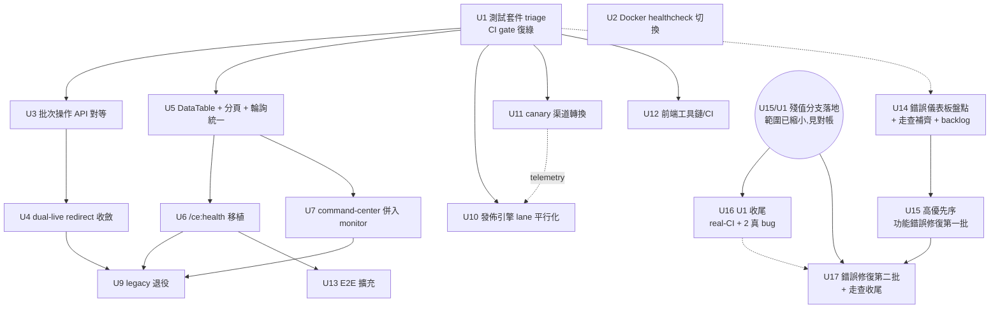

# opt: v0.6.0 UI/UX 與 Pipeline 全面升級迭代計畫

## Overview（概覽）

Phase 3（`docs/plans/2026-06-30-001-opt-phase3-post-v050-iteration-plan.md`，active）定位為 v0.5.x 的最後一次集中打磨，並明確把四件事推給「下一個週期」：**完成 SPA 遷移、新 adapter 開發、完整 E2E、以及 main 上既存失敗測試的清理**。本計畫就是那個下一個週期——把專案從 v0.5.x 推進到 v0.6.0，涵蓋兩條主線：

1. **UI/UX 完整迭代**：終結 Jinja/SPA 雙軌並存（補 redirect、移植 `/ce:health` 與 `/ce:command-center`、退役 ~4,468 行 templates + ~4,590 行 legacy JS + ~1,700 行 legacy CSS），並拉高 SPA 的 UX 品質基線（共享 DataTable、分頁、統一輪詢、批次操作對等、Bootstrap 殘留清理、Ctrl+K 命令面板）。
2. **Pipeline 升級**：發佈引擎從嚴格逐行序列升級為 per-platform-lane 平行派發（執行緒、不引入 asyncio）；把 `dofollow="uncertain"` 渠道推過 canary flip-or-kill 迴圈；啟用 catalog YAML 低代碼 adapter 通道。

前置地基：先讓 main 的 unit CI gate 變綠（既存失敗測試 triage），否則後續每一個 PR 都在紅色 gate 上工作。

**⚠️ 併發修改警示（沿用 Phase 3 已直接證實的教訓）**：這個 workspace 有多個 session 同時操作的直接證據。本文件引用的所有具體數字（檔案行數、測試數、except 數、SLOC）都是 2026-07-02 規劃當下的快照，**執行任何 unit 前務必用即時指令重新查證**，不要沿用本文件的靜態數字。

## 2026-07-06 全面對帳與執行順序重排〔本次修訂〕

> 本節是 2026-07-06 的 bug 重分析 + pipeline 軌重排,由雙 agent 研究(repo 現況 delta + institutional learnings 掃描)支撐。原則沿用 `late-plan-revisions-skip-code` 教訓:逐項標注「已落地 vs 待辦」,不假裝計畫文字=程式碼現實。

### 現況地圖(2026-07-06,main @ ad24fb1a;本地 main 落後 origin/main **12** 個 commit——PR #65/#66 加 dependabot 合併 #58/#60/#61(含 CI artifact actions 升版,可能影響 CI 行為)只在 origin;此數字寫下即開始過期,動工前一律 `git fetch` 重查)

- **已進 main**:reconcile PR #56、spray-split #62、doc-drift #63、api-audit #64(這三個是 Phase 4 計畫的 U6/U7/U8,**不是本計畫的 U6-U8**——單元編號撞名,判讀時注意);U1 的稽核文件與部分 test repoints 也經 reconcile 進了 main。
- **已完成但停在未合併分支**:U2(`fix/u2-docker-healthcheck-switch`)、U3(`feat/u3-batch-ops-api-parity`)、U12(`chore/u12-frontend-toolchain-ci` @ 942d94c9)、U10-parked 記錄(`docs/u10-measurement-gate-parked`)——全部在 `integration/fleet-preview-2026-07-06`(51484e22,領先 main 44 commits)驗證過;PR #67(U12)/#68(U10 parked)已開。U14/U15 第一批在 `fix/pr-queue-lite-error-message-2`(**不在 preview 內**)。
- **preview 未涵蓋**:U1 triage 分支、U15/B-fix 分支(-2)、cp950 修復、attention-dashboard、ci-red-sweep、origin-only 的 #65/#66 內容。
- **分支現況更新〔doc-review 修正,原「空標籤」判斷已過期〕**:`feat/u5-datatable-pagination-polling` 目前有 2 個真實 commit(DataTable 元件 + 分頁後端,晚於本次對帳的初始快照時間點推入)——U5 動工前務必先查這支分支的實際內容,不要當作空分支略過或重做;`fix/pr-queue-lite-error-message`(無 -2 後綴,現已切回 main,非目前 checkout 分支)是被 -2 取代的舊樹分支,不要從它續作。
- **本計畫檔案本身有三個分歧版本**:工作樹(本次修訂所在)、`docs/u10-measurement-gate-parked`(U10 park 段落)、`fix/pr-queue-lite-error-message-2`(U15 勾選+B 狀態)。本次修訂已把後兩者的內容語意上併入本檔;真實合併時以本檔為準對帳,重複註記擇一保留即可(內容相容,不互斥)。

### Bug 佇列(依序修復——本次重排的核心產出)

修復順序按「解鎖面積 × 實證嚴重度」排,且第一步永遠是 supersession 掃描(`scan-parallel-prs-before-blocker` 教訓:先查 8 條 fleet 分支/preview 是否已修,不重工):

| 序 | 項目 | 內容 | 狀態/去向 |
|---|------|------|-----------|
| 0 | ~~分支落地(前置瓶頸)~~ **〔2026-07-06 再對帳,已解除〕** | U2/U3/U12 已由併發的收斂工作(`docs/convergence-006-bookkeeping`,fleet preview 全量合併進 main)實際落地 main——`Dockerfile`、`webui_app/api/v1/history.py`、`frontend/eslint.config.js` 均已現地確認。此列不再是前置瓶頸 | 剩餘未落地:U15 分支(`fix/pr-queue-lite-error-message-2`,含 backlog 文件)、`fix/u1-test-suite-triage` 淨殘值——U16/U17 仍需這兩支落地,但範圍已比原「全部分支」小很多 |
| 1 | **U1 收尾:real-CI 驗證** | gh 已恢復(帳號解停)——push `fix/u1-test-suite-triage` 殘值 + 在 ubuntu CI 實測 unit gate;確認 ~90 殘餘的 Windows-假象判定 | 新 U16(a) |
| 2 | **U1 的 2 個真 bug** | (1) `backlink_publisher/__init__.py` PEP 562 facade 被實體 `dispatch/`/`validate/` 子套件永久遮蔽(順序依賴失敗;需架構命名決策);(2) `test_benchmarks.py` benchmark payload 與 schema 漂移(`link_count` 6–8、缺 `seo` 欄位) | 新 U16(b) |
| 3 | **功能錯誤第二批** | B6/B7(記錄於 -2 分支 `f5ebca14`)+ U14 殘餘走查缺口(`/campaign/:id`、legacy equity-ledger/keep-alive、`/publish/defaults` 204、oauth/llm/image_gen 頁、「有真實發佈歷史」的渲染路徑) | 新 U17(U15 的延續) |
| 4 | **發現 #4(儀表板擷取盲區)** | StateBlock 受控錯誤態繞過全部 5 個擷取掛點 | 已於 -2 分支決策 parked 為獨立後續計畫(`090f54d6`),本計畫不擴 scope;修法方向依 learnings 走 typed error envelope + server-side 聚合,不另建擷取通道 |
| 5 | **Windows 本機套件可信度** | main 全套件在本機 ~258–261 failed/10 errors(preview 以 ID set-diff 驗證與 main 同集)——本機驗證訊噪比過低,遮蔽真回歸 | 列入 Deferred(修法=mock/pin 而非 skip,比照 `ci-test-isolation-failures` 教訓);觸發點:real-CI 綠燈確認後,若本機開發仍受阻再立項 |

### Pipeline 軌重排(全方位迭代優化的現實版)

依 `architecture-health-audit-2026-06-01` 教訓(「真瓶頸是收斂執行,不是更多優化計畫」),pipeline 軌**不開新 scope**,改為收斂既有單元:

1. **U10 維持 parked**,但 park 記錄升級為標準 accepted-deferral 格式(數字化恢復觸發條件)——見 U10 條目的〔2026-07-06〕註記。
2. **U11 是當下唯一可推進的 pipeline 實作單元**,並依 learnings 補上兩個已知失敗接縫的硬規格(uncertain→confirmed promotion 寫回路徑、fresh+resume 雙序列化器 emit 接縫)與三件套交付物——見 U11 條目的〔2026-07-06〕註記。
3. **產生 telemetry 的路是真實使用,不是程式碼**:U10 的恢復依賴 operator 真實跑 publish(canary 軌的 (b)/(c) track 執行本身就會累積 telemetry)——pipeline 軌的執行順序因此是 U11 先、U10 等資料。
4. 註冊表現況已漂移:9 True / 10 False / **10** uncertain / 2 retired(計畫原文 7/9/8 過期;U11 的「uncertain 清零」目標基數以此為準)。
5. **〔doc-review 新增,product-lens 高信心發現〕零 telemetry 本身是產品訊號,不只是技術缺口**:本機 events.db/webui.db 目前 0 events/0 articles/0 tasks——代表這套工具近期沒有真實跑過 publish。本計畫（U16/U17/分支落地）整輪都是 meta-work,對「實際存活的 dofollow 反鏈產出量」這個 repo 自己認定的唯一業務瓶頸零貢獻。**建議在本輪內執行至少 1 次真實 publish campaign**(對已確認 `dofollow=True` 的平台),其產出同時餵給三處:(a) U10 的恢復觸發 telemetry、(b) U17「有真實發佈歷史」渲染路徑測試所需的資料、(c) 錯誤儀表板的真實壓力測試。若 operator 決定本輪不執行,應明確記錄理由——這個決定本身會重新定型整份計畫的優先序。

### 技術棧

- 後端：Python ≥3.11、Flask 3.1 + APIFlask、APScheduler 3.x、pydantic 2、playwright、GA4/GSC Google client、structlog；49 個 console scripts；版本 0.5.0。
- 前端：Vue 3.5 + vue-router 5 + Pinia 3 + @tanstack/vue-query 5，Vite 8 建置到 `webui_app/spa_dist`（base `/app/`，Flask 單源服務）；TypeScript strict + vue-tsc；34 個 vitest specs；**無 ESLint**。
- CI：8 個 GitHub workflows（unit 每 push 全跑、integration/e2e/coverage 為 PR-only、OpenAPI 契約 gate 含 oasdiff breaking-change 檢查、plan-claims 三件套）；另有一份平行的 `.gitlab-ci.yml`（漂移風險）。
- 部署：multi-stage `Dockerfile` + `docker-compose.yml`——**healthcheck 目前 curl 的是 legacy Jinja 路由 `/ce:health`**。

### UI 現況（strangler-fig 雙軌）

- SPA 已有 15 頁 + Settings 子樹、14 條路由；共享元件只有 4 個（`StateBlock`/`Toast`/`ProfileSelector`/`ArticleReviewRow`）；`.data-table` 是 CSS 約定而非元件；tokens.css 單源、SPA 零硬編碼色票（有 guard test）。
- **雙軌殘留**：`/`（主入口！）、`/sites`、`/batch-campaign`、`/schedule` 有 SPA 對應但**無 redirect**（dual-live）；`/ce:health` 叢集（`webui_app/routes/health.py` 447 SLOC + `health_actions.py` + `templates/health.html` 717 行）與 `/ce:command-center`（695 行 template）**完全沒有 SPA 對應**。
- **結構性 UX 缺口**：全站無分頁（所有 API 回整表）；輪詢不統一（`KeepAlivePage.vue` 每 2s 無退避重試、`CampaignProgressPage.vue` 靜默吞錯）；Ctrl+K 是 disabled 佔位（`frontend/src/layout/TopBar.vue`）;批次操作 legacy 有、SPA 缺 3 個（bulk-publish-now/bulk-cancel/bulk-recheck；purge-failed 亦缺）；5 個已遷移頁面殘留孤兒 Bootstrap class 且 `frontend/index.html` 仍載入 Bootstrap CDN；無 i18n（zh 硬編碼）。無障礙基礎相對紮實（skip-link、focus 管理、aria-live、focus-trap drawer）。

### Pipeline 現況

- 流程 `seeds.jsonl → plan-backlinks → validate-backlinks → publish-backlinks`（+ `report-anchors`/`footprint`/`phase0-seal`），第二層自動化 `pipeline-orchestrator` 串 `equity-ledger → plan-gap → plan → validate → publish`，`gap/engine.py` 用 ledger 赤字回灌 seeds 閉環。
- **發佈嚴格序列**（`cli/publish_backlinks/_engine.py` 逐行迴圈）；WebUI scheduler `max_workers=1`；跨行程由 caller 持有的 `_PUBLISH_LOCK`（`sdk/_publish_runtime.py`）保證單一 active publish。節流只有 Medium 專屬 60–300s sleep 與 per-adapter `post_publish_delay_seconds`。
- **Adapter 版圖**：24 個 `register()`——7 個 `dofollow=True`、9 個 `False`（留 referral value）、8 個 `"uncertain"`；其中 hashnode/writeas 已 `visibility="retired"`（canary-seed 自動排除），txtfyi/notesio 匿名可直接 canary，wordpresscom/substack/hatena/gitlabpages 需 operator 綁定拋棄式帳號。catalog YAML 通道（`src/backlink_publisher/publishing/adapters/catalog/`）已接線但實質 no-op。
- 觀測迴圈齊全：events.db 事件源 + projector、GA4 referral、GSC indexation/ranking、survival/decay、recheck、equity ledger + 赤字 replan、GEO citation probes。

### 專案健康

- 測試 ~627 檔、collect 11,962 個 0 錯誤（CHANGELOG）——**但 main 上有 ~366 個 runtime 失敗**（Phase 3 risk register 2026-07-02 直接驗證，`-m "unit"` 過濾後仍 366、未過濾 459）。兩個數字不矛盾：366 個 *collection* 錯誤已修，~366 個 *runtime* 失敗仍在。已驗證的主導根因是**確定性的 source 端 re-export 回歸**（例：`cli/plan/plan_check.py` 未重新匯出 `SCHEMA_VERSION`，`tests/test_cli_plan_check.py` 全滅；疑似源頭 commit `a64b205f` 的大規模自動化 `__all__` 改寫），**不是測試順序污染**——「先修污染源再修受害者」不是本案的主要框架。
- CI 的 unit job 每次 push 都全跑 → **gate 目前是紅的**，這是本計畫一切工作的前置阻塞。
- 債務紀律良好：inline TODO 近零，債務集中在 `debt_registry.toml`（1 open）與兩份 budget TOML；最緊的天花板是 `webui_app/api/v1/spec.py` **1258/1290（僅 32 SLOC 餘裕）**——本計畫要新增大量 API endpoint，第一個碰 spec.py 的 unit 必須先處理餘裕問題。

## Requirements Trace（需求對照）

| 需求 | 內容 | 對應 Unit |
|------|------|-----------|
| R1 | main 的 unit CI gate 恢復綠色（既存失敗測試清理） | U1、U16(收尾)〔2026-07-06〕 |
| R2 | 部署健康檢查脫離 legacy 路由 | U2 |
| R3 | SPA 與 legacy 的功能對等（批次操作），先對等再切換 | U3 |
| R4 | 四條 dual-live 路由收斂到 SPA（含主入口 `/`） | U4 |
| R5 | UX 品質基線：共享 DataTable、分頁、統一輪詢 | U5 |
| R6 | `/ce:health` 叢集移植到 SPA（含 per-panel fail-open 對等、動作端點安全邊界對等） | U6 |
| R7 | `/ce:command-center` 收斂進 SPA monitor（不建第三個狀態頁） | U7 |
| R8 | Bootstrap CDN 退場 + Ctrl+K 命令面板啟用 | U8 |
| R9 | Legacy 前端資產退役（templates/static/js/legacy CSS/`…/jinja` 逃生口） | U9 |
| R10 | 發佈引擎 per-platform-lane 平行化（intra-run、執行緒、保持 stdout/exit-code 契約） | U10 |
| R11 | canary 渠道轉換：uncertain 平台 flip-or-kill、retired 收尾、catalog 通道定義 | U11 |
| R12 | 前端工具鏈與 CI 缺口（ESLint、path-filter 盲區、GitLab CI 漂移） | U12 |
| R13 | E2E 擴充（health console、workbench、分頁旅程） | U13 |
| R14 | 全程不與 active 計畫（Phase 3、error-reporting）重工，遵守既有守則（anti-rot、budgets、claims、adapter recipe） | 全部 unit |
| R15〔2026-07-03 擴充〕 | 以既有錯誤回報儀表板（`webui_store/error_reports.py` + `/api/v1/error-reports`，已完成上線）為資料來源，建立涵蓋 legacy 37 個 route 模組與 SPA 15 個頁面的逐功能驗證與優先序修復流程，把「功能常態性報錯但無法追蹤」轉成可視化、按優先序清理的常態工作流 | U14、U15、U17〔2026-07-06〕 |

〔2026-07-06〕R1 的收尾工作(real-CI 驗證 + 2 個真 bug)由 U16 承接——R1 的驗收條件不變,U16 是其執行載體。

## Scope Boundaries（範圍邊界）

- **不重做 Phase 3 的任何任務**：Sprint A（積壓提交）、B1–B3（route 審計/雙覆蓋測試/StateBlock 假成功防護）、C1a/C1b（reruns 範圍限定、seam AST 掃描器）、D1/D2/D2a/D2b（測試拆分、except 分類、往返驗證、debt registry 機制）、E1–E3（文檔）。本計畫新增的 `webui_app/api/` 模組須沿用 D2/C1b 屆時確立的 `# debt: <slug>` 格式。
- **不建前端錯誤回報/診斷儀表板**——`docs/plans/2026-07-01-002-feat-frontend-error-reporting-plan.md`（active）的地盤；本計畫新頁面只按既有 `StateBlock`/`classifyError` 慣例做狀態呈現。
- **不引入 asyncio**——平行化用執行緒（每 lane 一條 dedicated thread）。
- **跨行程發佈並行不在範圍**：`_PUBLISH_LOCK` 與 `tests/test_publish_inprocess_sdk_parity.py` 的 `max_active == 1` 語意不變；WebUI `scheduler.py` 的 `max_workers=1` 也不動（單獨調大在鎖存在時是 no-op）。
- **不新增未經審查的平台**：adapter 工作只做 canary 轉換（flip-or-kill）與 catalog 通道定義；任何真正的新平台先過 `channel-probe` GO/NO-GO 與 `_DOFOLLOW_BY_CHANNEL` grep（`docs/solutions/workflow-issues/grep-dofollow-map-before-shipping-adapter-2026-05-20.md` 的教訓）。
- **runtime 不碰 LLM**（`docs/solutions/best-practices/no-runtime-llm-2026-05-15.md` 硬約束；唯一例外是既有的 operator GEO probe）。
- **不做 i18n**：全站 zh 硬編碼維持現狀——單操作者工具，i18n 工程量大、現值低；記錄為 parked 決策，等有第二語言使用者需求再啟動。
- **不做 SSE/WebSocket**：本輪把輪詢統一到 vue-query `refetchInterval` 模式即可；推播升級留待輪詢模式證明不足時。
- **不做表格排序（sortable headers）**：SPA 現況零排序，這是新功能不是抽取；DataTable 本輪只涵蓋現有能力（渲染/空態/選取/分頁掛點）。
- **retired 平台維持可顯式派發**（`plan-backlinks --platform` 走 `registered_platforms()` 含 retired）——維持現狀並文檔化，不加阻擋。

### Deferred to Separate Tasks

- **配額佈線（quota wiring）**：canary flip 之後平台要真的吃到流量，需要把新 dofollow 平台接進配額/分配邏輯——本計畫明確不做；**後果是本輪 flip 的平台在配額佈線前產出量為零**（closeout runbook 已記載的 caveat）。恢復觸發點：U11 track (b)/(c) 有任一平台 flip 成功後，另開計畫。
- **`webui_app/routes/llm.py`、`image_gen.py` 測試 patch 目標遷移**：兩檔是刻意保留的 patch 對象（Phase 3 B1 已查證非死碼），遷移其測試是獨立工作，不併入 U9 退役。
- **無人值守排程 recheck**（`docs/solutions/architecture-patterns/2026-06-05-lite-accepted-deferrals.md` 記錄的 G5b restart-durable rehydrate + per-probe timeout）：其恢復觸發條件是「引入無人值守/排程 recheck」——本計畫不引入，維持 deferral。
- **`webui_store` 跨行程同鍵 RMW 丟失（~44/100，無 flock）**：U10 的平行化不新增跨行程並發寫者（intra-run、單行程），此 deferral 維持；若未來做跨行程並行，先解這條。
- **U14 backlog 中未納入 U15 第一批的項目**〔2026-07-03 擴充〕：留待後續迭代（下一輪 `/ce:work` 或另開追蹤項），不在本計畫本輪窮盡；恢復觸發點——U15 第一批完成後，依剩餘 backlog 規模決定是否開 U16+ 或另立獨立計畫。〔2026-07-06〕此決策已落定:U15 第一批完成後,第二批(B6/B7 + 走查缺口)以本計畫內的新 U17 承接,不另立獨立計畫——本條由 deferral 轉為在計畫內的排程工作。

## Context & Research（脈絡與研究）

### 要遵循的既有模式（Relevant Code and Patterns）

- **四態元件**：`frontend/src/components/StateBlock.vue`（loading/empty/error/ready + 分類錯誤 + retry + stale 條）；狀態判斷順序以 `HistoryPage.vue` 的 `blockState` computed 為準（錯誤先於空態——Phase 3 B3 已確立）。
- **輪詢正確範式**：`frontend/src/pages/Monitor/MonitorDashboard.vue` 的 `refetchInterval` + `keepPreviousData`（vue-query），不是 setTimeout。
- **redirect 範式**：既有 8 條 `redirect(url_for("spa.spa", subpath=...))` + `…/jinja` 逃生口（如 `webui_app/routes/settings.py` 同類寫法）。
- **API 錯誤契約**：`{ok, error_code, flash_type, flash_msg, detail}` 結構化回傳（`docs/solutions/ux-honesty/webui-false-success-resolution.md`）+ typed stderr envelope（`_util/error_envelope.py`）；SPA 依 error *class* 分支，永不切 stderr 字串。
- **publish-history 不變量**：所有寫 history 的路徑必須走 `_push_history_per_row`（`status="published" ⟹ url`；`docs/solutions/best-practices/publish-history-helper-invariant-2026-05-20.md`）。
- **fail-open 面板**：`webui_app/routes/health.py` 的 ~15 個 per-panel catch→空值 + `_FALLBACK_HTML` 200、never-500（`tests/test_health_dashboard_route.py` 釘住）——U6 的 API 契約必須翻譯這個語意，不能倒退成 all-or-nothing。
- **adapter recipe**：一行 `register()`、`dofollow=` 必填、非 True 需 `rationale=` ≥80 字 + `referral_value=`；永不改 `cli/*.py`/`schema.py`（`AGENTS.md`）。
- **seam 契約範式**（U10/U11 涉及狀態穿越接縫時適用）：三態分類器（`kind | NO_EMIT | QUARANTINE`）、shared carry-helper、每條 emit 路徑的 presence+absence 測試（`docs/solutions/logic-errors/projector-silent-drop-status-vocabulary-drift-2026-05-26.md` 等三案同型）。
- **護欄自帶紅色路徑自測**：`tests/test_events_r8_gates.py` 模式（新 guard test 必附「故意違規→紅燈」自證）。
- **budget 紀律**：超 ceiling 需同 PR 帶 ≥80 字 rationale 調高（ratchet = round_up_to_10(SLOC+30)）；radon 釘 6.0.1。
- **前端 anti-rot**（僅約束殘存 legacy 層直到退役）：no inline `on*`、no `window.*` API、no untrusted `${…}` into innerHTML、`readCsrf()` 每次讀 `<meta>`；**新頁面一律 SPA route，不開新 Jinja 頁**。

### 制度性教訓（Institutional Learnings，節選最影響本計畫的）

- **先量測再規劃修復**：`docs/solutions/best-practices/sweep-tasks-run-pytest-before-planning-2026-05-18.md`——U1 第一步是全量跑 + 按 import-error 簽名聚類，不從想像的失敗清單排 unit。
- **紅測試可能是極性錯誤**：`docs/solutions/test-failures/negative-assertion-locks-in-bug-2026-05-15.md`（高嚴重度，一週內兩次綠測試釘死真 bug）——triage 時先跑負面斷言稽核 grep，「反轉而非刪除」。
- **pass-alone/fail-in-suite = 污染簽名**：`del-os-environ-poisons-session-scoped-config-dir-fixture-2026-05-27.md`——U1 殘餘失敗的分類方法。
- **>5s 操作必有即時 loading + 防雙擊**：`webui-blocking-subprocess-and-missing-progress-feedback-2026-05-12.md`——U3 批次操作與 U6 動作端點的 UI 要求。
- **sibling page 而非 in-place retrofit**：`standalone-page-vs-retrofit-webui-2026-05-15.md`——U6/U7 的移植方式。
- **平台先驗證再寫碼**：`grep-dofollow-map-before-shipping-adapter-2026-05-20.md`（PR #108 三 adapter 9 分鐘被 revert）+ `probe-then-pivot-when-api-unverifiable-2026-05-20.md`——U11 全程。
- **anti-bot 變異要先特徵化**：medium/bind 叢集學習（headless probe ~4/10 撞挑戰頁）——U11 track (c) 的預期管理。
- **多 session 紀律**：per-unit 分支隔離、顯式 staging（不用 `git add -A`）、早 push（`external-agent-edits-in-shared-worktree-2026-05-18.md` 等 4 篇）——本計畫每個 unit 的執行紀律。
- **遲來的計畫修訂要對帳**：`late-plan-revisions-skip-code-2026-05-20.md`——本計畫任何 review 修訂需標注「已落地 vs 待辦」。

### External References

- 未做外部研究——本計畫全部工作都有強既有內部範式可循（StateBlock/tokens/adapter recipe/canary runbook/budget gates），屬於完成遷移與泛化既有模式，非導入新技術。

## Key Technical Decisions（關鍵技術決策）

| # | 決策 | 理由 |
|---|------|------|
| K1 | **U1 排最前**：CI unit gate 紅著，其他一切 PR 都在紅 gate 上工作 | `.github/workflows/ci.yml` unit job 每 push 全跑 |
| K2 | **triage 主框架 = re-export 簽名聚類**，不是污染源/受害者 | 已驗證主導根因是確定性 re-export 回歸（`SCHEMA_VERSION` 類）；污染分類只用於殘餘 |
| K3 | **不引入 xfail 隔離機制為預設**：失敗就修或明確記錄；**〔doc-review 修正〕唯一例外**：若殘餘失敗證實昂貴或是真回歸、無法在 U1 時限內修完，允許以**有界、逐條記錄、shrink-only** 的 skip/xfail 清單讓 gate 復綠（比照 `tests/conftest.py` 既有 `GRANDFATHERED_EXPANDUSER_SITES` 模式）——否則 K1「綠 gate 前提」與本條「禁隔離」在殘餘非零時互相矛盾（adversarial review 發現的三方衝突） | 主導叢集是便宜的確定性修復；隔離機制若無 shrink-only 約束會變成停車場——用 grandfathered 模式取得「gate 綠 + 殘餘可見」兩者 |
| K4 | **healthcheck = liveness**（`/api/v1/health` 原樣） | richer readiness 會讓容器在 degraded-but-alive 狀態重啟迴圈 |
| K5 | **順序硬約束：批次對等（U3）→ redirect（U4）→ 退役（U9）** | 先 redirect 會刪掉 legacy `/` 上的 bulk-publish-now/cancel/recheck/purge-failed 功能 |
| K6 | **分頁 = 增量 opt-in `limit/offset`，預設回整表** | oasdiff breaking-change gate + 開著的舊 SPA 分頁就是「舊客戶端」；在 API 層分頁（history store 雙後端） |
| K7 | **health 儀表板 API 巢狀於 `/api/v1/health/summary` + `/api/v1/health/actions/*`**，不動既有裸 `/api/v1/health` | 該 liveness 路由已存在且被 `api-contract.yml` curl；契約漂移最小 |
| K8 | **health API 攜帶 per-panel degraded 旗標、恆 200** | legacy 是 ~15 個獨立 fail-open 面板 + never-500（測試釘住）；聚合端點若可 500 就是語意倒退 |
| K9 | **command-center 併入 `/app/monitor`，不建新頁** | repo 記錄的「不開第三個重疊狀態頁」原則；`/api/v1/monitor/summary` 已存在半套 |
| K10 | **平行化 = intra-run lanes，`_PUBLISH_LOCK` 不動** | 跨行程並行牽動鎖、平台租約、parity 測試全重設計——工程半徑失控；intra-run 已拿到主要吞吐收益 |
| K11 | **abort 語意保持現狀且補完整**：取消未派發、排空 in-flight、抑制 stdout；引擎現有**三個** abort sentinel（conflict→exit 1、auth→3、dependency→3），lanes 下多 lane 可同時 abort，合併時採確定性總排序 **conflict(1) > auth(3) > dependency(3)，同類以最小輸入行序決勝**；非 abort 的混合結果沿用既有 `_decide_publish_exit`（4/5/3/0）不變 | golden 測試釘住的 operator 契約；序列版只可能觸發一個 abort，平行版不寫死優先序會變成 thread-timing 決定 exit code（deepening 架構審查發現） |
| K12 | **stdout 順序 = 輸入行序，排序權責在引擎的 lane-merge（`_lanes.py`），不在 epilogue** | SDK in-process 路徑（`sdk/_publish_runtime.py::_build_pipe_result`）直接讀 `state.outputs`、完全繞過 epilogue——排序若放 epilogue，CLI 與 SDK 輸出分岔，打破 `docs/architecture/sdk-layering.md` 的「identical by construction」不變量（deepening 發現的原設計缺陷，已修正）；輸出列今日不帶輸入序，merge 需在 lane 內攜帶 input_idx（發射前剝除） |
| K13 | **每 lane 一條 dedicated thread**，不用共享池；**browser-tier（`publishing/reliability/policy.py` `_BROWSER_TIER`：medium/velog/devto/mastodon）的 lanes 預設互相序列化**，API-tier 不設上限 | Medium 的 60–300s 阻塞 sleep 會餓死共享池；混合輸入下最多 4 條 Chrome 同時開（操作機 RAM）+ 同 IP 多平台同時自動化正是 g5 足跡指紋關切——先序列化，實測後再放寬 |
| K14 | **per-lane state 收集 + 結束合併**，不共享 `PublishRunState` 可變欄位；合併政策明定：`run_id` 合併值=原值（checkpoint 檔存在、epilogue projection 照跑），per-lane 的 `None` 只代表「該 lane 停止後續 update 嘗試」——比序列版（一次寫失敗全 run 停用 checkpoint）是刻意的語意改良；Medium 節流改 per-lane 前次成功時間戳後，**混合輸入下只會多睡不會少睡**（現行全域位置鄰接規則在交錯輸入下反而漏節流，方向安全） | `outputs[-1]["status"] += "_unverified"`（`_engine.py:561`）、`run_id` rebinding（`:547` 等 5 處）、`last_medium_success_idx` 位置鄰接（`:89`、`_resume.py:287`）在交錯下全部損壞 |
| K15 | **resume 維持序列**（`cli/_resume.py` 不改） | 獨立程式碼路徑，繼承不到引擎改動；平行 resume 收益低風險高 |
| K16 | **hashnode/writeas 直接完成退役收尾**，不進 canary | 已 `visibility="retired"`、canary-seed 排除、hashnode 發佈路徑付費牆 |
| K17 | **gitlabpages 本輪不 flip**，維持 uncertain | 其不確定性是 *indexation*，rel-only canary 無法解；等 GSC 證據 |
| K18 | **catalog 通道啟用 = 為未來匿名平台定義 new-slug YAML 路徑**，不刪既有 Python adapter | txtfyi.yaml 與手寫 adapter 撞名時「手寫優先」是刻意設計；只支援 none/api_key_* auth |
| K19 | **canary flip 維持人工 operator PR**（`cli/_canary_flip_hint.py` checklist） | A5 原則 + closeout runbook 明定 flip 是人工決策 |
| K20 | **Bootstrap 終局 = CDN 移除**（`frontend/index.html`），17 檔 class 全替換成 token 系統 | 只清 5 頁孤兒 class 是無終局的 churn；離線運行也受益 |
| K21 | **SPA-vs-零建置的守則衝突解法**：Vite SPA 是既定現實（CI 已有 frontend.yml），零建置 anti-rot 規則只約束殘存 legacy 層直到 U9 退役；workspace 根 CLAUDE.md 的過時描述由 Phase 3 E2 同步，本計畫不重工 | `2026-06-01` 架構審計與根 CLAUDE.md 早於 SPA 路線圖；repo `AGENTS.md` 已明定「新頁面一律 SPA」 |
| K22 | **spec.py 餘裕（1258/1290，doc-review 即時量測已到 1289——執行前重測）處理 = 同 PR 帶 rationale 調高 ceiling**；**〔doc-review 修正〕負責者=實際第一個碰 spec.py 的 unit（名義上是 U3，但 U3/U5 在依賴圖上可並行——哪個先落地哪個帶 ceiling 調升，調升量一次涵蓋本計畫全部四個 unit 的預估總量）** | 檔案已宣告為不可拆分的單源 OpenAPI 契約；把「第一個」寫死成 U3 會在 U5 先落地時讓 choreography 斷裂（coherence review 發現）；另注意並行的 error-reporting 計畫可能同期消耗同一餘裕，調升前先查其進度 |
| K23〔2026-07-03 擴充〕 | **U14/U15 與既有 U1–U13 的去重原則**：U14 盤點時，若某筆錯誤回報或走查發現的根因已經是既有某 unit 明確要處理的範圍（例：批次操作按鈕無反應屬於 U3），標記「併入該 unit」而非在 U15 另開修復；只有真正落在既有 13 個 unit 範圍外的根因才進 U15 的獨立修復佇列 | 不去重會讓同一個根因在計畫裡有兩份互相不知情的修復規劃（本計畫 U3–U9 已經逐頁列了大量已知缺口），造成重工或修復順序衝突 |
| K24〔2026-07-03 擴充〕 | **U14 是唯讀盤點單元，不改任何原始碼**；發現的修復全部留給 U15（或併入既有 unit） | 盤點與修復分離，才能在盤點完成前就先知道 backlog 規模，避免邊盤點邊修導致範圍失控；也讓 backlog 文件本身可以先被審查 |
| K25〔2026-07-06 對帳〕 | **任何 bug 修復動工前先做 supersession 掃描**——掃描以操作定義(`git fetch` 後查 `git log main..origin/main`、`git branch -a --no-merged`、開放 PR 清單),不以本文件列舉的 PR 編號為準(清單寫下即過期);已被兄弟分支修掉的不重修 | 本 workspace 已證實同一 bug 會在多條世系被獨立修復(PrQueuePage、CLI shims 兩案);`scan-parallel-prs-before-blocker` 教訓 |
| K26〔2026-07-06 對帳〕 | **pipeline 軌執行順序 = U11 先、U10 等資料**;U10 的恢復觸發是數字化 telemetry 條件,不是日曆時間 | 量測閘門實測零 telemetry;U11 的真實執行是唯一自然的 telemetry 來源;`architecture-health-audit` 教訓——收斂既有單元優於開新優化 scope |
| K27〔2026-07-06 對帳〕 | **本計畫檔的三方版本分歧,已於 2026-07-06 用本次修訂統一收斂**;`docs/u10-measurement-gate-parked` 與 `-2` 分支的計畫檔編輯內容已語意併入本檔;之後另一併發 session 亦已將 U2/U3/U12 的落地執行記錄直接寫回 main 上的本檔——本次修訂在合併衝突時採「兩邊皆保留」策略(main 的執行記錄優先於前、本次分析性內容綴於後),而非單邊擇一 | 三方分歧的實質內容彼此相容不互斥;merge 時保留兩邊證據優於任一方單獨宣稱權威 |

## Open Questions（開放問題）

### Resolved During Planning（規劃期已解）

- 「~366 失敗」數字之爭：兩個說法都對、指涉不同（collection errors 已修 vs runtime failures 仍在）——U1 以執行當下的實測聚類為準。
- 平行化範圍：intra-run only（K10）。
- abort/stdout/exit 語意：全部保持現狀（K11/K12）。
- healthcheck 語意：liveness（K4）。
- health API 命名：巢狀 `/api/v1/health/*`（K7）。
- command-center 去向:併入 monitor（K9）。
- 分頁契約：增量 opt-in（K6）。
- Bootstrap 終局：CDN 移除（K20）。
- hashnode/writeas：退役收尾（K16）;gitlabpages：不 flip（K17）。
- U1 與 Phase 3 C1a 邊界：U1 擁有 source 端 re-export 修復與失敗 triage；reruns 範圍限定/seam marker 完全歸 C1a，U1 不碰。
- `/` redirect 前的 PublishWorkbench 對等性：先跑對等清單（copilot 面板、new/batch 分頁）再切——列入 U4 動作。

### Deferred to Implementation（刻意留給實作）

- U1 殘餘失敗（re-export 叢集修完後）的確切構成與數量——只能實測得知。
- 分頁的每頁筆數預設值與 UI 樣式細節——實作時對照現有 `.data-table` 頁面決定。
- `/api/v1/health/summary` 的確切 panel 欄位切分——以 `routes/health.py` 現有 ~15 個 helper 的自然邊界為準。
- lane 內 checkpoint 寫入頻率與 `emit_recon` 緩衝策略（行鎖 vs per-lane buffer）——以實測 stderr 撕裂情況定。
- `.gitlab-ci.yml` 是否有真實消費者——實作時查 git history/remote 使用證據後決定移除或同步（U12）。
- substack cookie 過期週期與 hatena 的實際 anti-bot 挑戰率——U11 track (c) 執行時特徵化。

### From 2026-07-02 doc-review（待決 / 諮詢性記錄）

- **Pipeline 軌不動真正的瓶頸：配額佈線（P1, product-lens, confidence 0.66，用戶待決）**——repo 自己的 ideation 與 closeout runbook 指名的唯一業務瓶頸是「實際存活的 dofollow 反鏈產出量」，而本計畫把配額佈線推遲另案，意味著 U10（速度）+U11（flip）全部落地後，本週期的 dofollow 產出量變化為零。選項：(a) 新增條件式 U11b「首個 flip 平台的配額佈線」（匿名軌 flip 成功即觸發，無新外部依賴）;(b) 縮 U10 換配額佈線的風險預算;(c) 維持推遲，但需記錄「canary 窗口在本週期內無法關閉」的時程證據。若 txtfyi/notesio 期中 flip 成功，建議把 (a) 拉進本週期。
- 諮詢性觀察（低信心，不強制決策）：U6 Health 頁缺閱讀優先序決策（panel 順序≠helper 順序）;U11 track (d) catalog 通道目前零消費者（可考慮縮到只留 schema 文檔）;分頁 UI 無既有先例可「對照」（deferral 寫法是循環的，實作者實際上是從零定 pager 規格）;palette 對單操作者價值單薄（刪掉佔位也是一種完成）;bulk-publish-now（觸發真實對外發佈）與 gap-closure 的安全 tier 不對稱未給理由。
- 低於信心閘門但值得執行時順手處理的殘餘（各 unit 動工時檢查）：**U10**——telegraph 有 CDP fallback 但不在 `_BROWSER_TIER`，lane 序列化集合應以「adapter 是否會開 Chrome」實際盤點而非沿用 health-gate 清單;API-tier lanes 把同日連結叢集壓縮成同分鐘叢集，g5 足跡分析應補上（或加 inter-lane jitter/上限）。**U5**——`limit/offset` 需邊界驗證（負數/超大/非數字 → 400 + server 端上限）。**U6**——動作成功後的即時回饋（回應內嵌刷新後 panel 狀態，比照 U3 cache-write 模式），並考慮為 loopback tier 建立比照 `_CSRF_ONLY_SNAPSHOT_COUNT` 的覆蓋 ratchet。**U8**——`frontend/index.html` 實際有三行 CDN（bootstrap CSS、bootstrap-icons CSS、bootstrap JS bundle），`bi-*` 圖示需替代方案，驗證 grep 應涵蓋 `bi-` class。**U3**——Goal 行文仍列 4 個批次操作，以〔deepening 校正〕段為準（實際新端點 3 個）。**跨計畫**——`TopBar.vue` 同時被本計畫 U8 與 error-reporting 計畫 Unit 5 觸碰，動工前互查。

## Implementation Units（實作單元）

> 執行紀律（每個 unit 一體適用）：獨立分支、顯式逐檔 staging（禁 `git add -A`）、早 push；動手前 `git status` 確認乾淨並查一次 `docs/plans/` 有無新的 active 重疊計畫；碰 `webui_app/api/` 的新檔沿用 Phase 3 D2/C1b 確立的 `# debt: <slug>` 格式。**〔doc-review 補充兩條〕**（1）「確認乾淨」的可執行定義：若 dirty 檔案屬於 Phase 3 A1 的已知積壓（另一計畫的在途工作），不要等它自然消失——要嘛協調先提交該積壓，要嘛在自己的分支上以當下 committed HEAD 為基準工作並記錄該 SHA，不碰積壓檔案；（2）debt 格式 fallback：若 Phase 3 D2/C1b 屆時尚未確立格式，新模組先禁用裸 except（全部走具體型別+log），或用暫定 `# debt: <slug>` 格式並記一條對帳項——不要因等格式而阻塞，也不要自創第三套。



（U2 無依賴可立即執行；U5 只依賴 U1 使 CI 可信；U10/U11/U12 與 UI 軌並行。）

---

### Phase 0 — Foundation（地基）

- [ ] **U1: 測試套件 triage——main 的 unit gate 復綠〔R1〕**

**Goal:** main 上 `pytest -m "unit"` 全綠，CI unit job 恢復可信 gate。

**Dependencies:** 無（最先執行）。

〔U1 執行結果，2026-07-02，分支 `fix/u1-test-suite-triage`（worktree `bp-u1-triage`，釘在 baseline SHA `56b98084`）〕基準量測（xdist 關閉）：367 failed / 9448 passed / 44 skipped / 19 errors / 2158 deselected。已修復並提交 6 個 commit：(1) 12 個正典 CLI 模組補 `__all__`，修復裸 `import *` 掉底線符號的主叢集（約 250 個失敗）；(2) 23 個 flat shim 補 `if __name__ == "__main__"` guard；(3) 約 20 個測試從 patch flat shim（無效 mock）改 patch 正典模組；(4) 修復途中發現的真實 bug：`report_anchors.py` 的 `cli.report_engine`舊路徑、`verify_dofollow.py` 的 built-in-catalog 路徑少一層、`_resolve_config_dir()` 自我 import 導致 monkeypatch 失效、`webui_app/routes/llm.py` 漏 import `_safe_post_json`、`detect_platform()` 每個分支都回 `'medium'`、`pyproject.toml` 死 entry point；(5) SPA 遷移（`782833e1`）後過時的測試（~140 個案例，9 個檔案）改指向 `/jinja` fallback 或 302 斷言，並補回被連帶破壞的 route-coverage gate；(6) `tests/test_cli_shim_reexports.py` 新 guard test（已驗證紅→綠）。

**殘餘**（詳見 `docs/audits/2026-07-02-u1-residual-failures.md`）：本地 Windows 量測顯示 90–94 failed（2–3 個為時鐘精度導致的 flaky，非確定性回歸）、10 errors。root-cause 逐條追蹤後，殘餘壓倒性集中在 Windows-only 假象——NTFS chmod 語意、`_compat/fcntl.py` 的 EACCES→EAGAIN 轉譯落差、path-separator 字串比對、時鐘精度造成的 timestamp 碰撞——經 `.github/workflows/ci.yml` 確認 CI 全部跑在 `ubuntu-latest`，這些類別預期在真實 CI 上不會重現，但**本環境無法實測驗證**（GitHub 帳號目前被停權，`gh`/CI 無法連線）。另外發現 2 個非 Windows-specific 的真實 bug，因修復需要架構層級決策（重新命名 `dispatch`/`validate` facade 屬性或子套件）或需要熟悉目前 schema 的人重寫 benchmark payload，此輪刻意不動——已記錄在殘餘清單而非猜測性修復。未套用 K3 shrink-only 隔離清單（未加任何 xfail/skip）：判斷殘餘屬於本機環境假象而非需要豁免的真實 CI 失敗，但這個判斷未經真實 CI 驗證。

**建議下一步：** push 此分支並在真實 CI（ubuntu-latest）上跑一次確認 unit gate 實際狀態；若確認綠燈（或僅剩已知的 2 個真實 bug），可將此 checkbox 打勾並把 2 個真實 bug 轉為獨立追蹤項；若 CI 上仍有 Windows 假象未涵蓋到的意外失敗，回頭深挖。

〔2026-07-06 對帳〕gh 帳號已恢復、PR 通道重開——上述「無法實測驗證」的阻塞已解除。U1 內容出現雙世系:稽核文件+部分 test repoints 已經由 reconcile PR #56/#66 進 main,而 `fix/u1-test-suite-triage`(4e6c5cd9,領先 main 5 commits)仍未合併——收尾時先 diff 該分支對 main 的**淨殘值**再決定 cherry-pick 或棄置,不要整支盲合。收尾工作(real-CI 驗證 + 2 個真 bug)已立為 U16,本 checkbox 的勾選條件不變(CI 綠 = 勾)。

**Files:**
- Modify: `src/backlink_publisher/cli/` 下的 re-export shim 檔（實測定位，已知例：`src/backlink_publisher/cli/plan/plan_check.py` 缺 `SCHEMA_VERSION` re-export）
- Create: `tests/test_cli_shim_reexports.py`（guard：逐一 import 每個 `cli/*.py` shim 並斷言其 `__all__` 符號可解析）
- Modify: 極性錯誤的既有測試檔（實測定位）
- Test: 上述 guard test + 被修復的既有測試本身

**Approach:**
1. 全量跑 `PYTHONPATH=src pytest tests/ -m "unit"`（xdist **關閉**——排程會讓叢集不確定），按失敗簽名聚類（import/AttributeError 簽名 vs 斷言失敗 vs 其他）——不沿用本文件或 Phase 3 的任何數字。
2. 主叢集（re-export 回歸）：修 `cli/` shim 的 re-export 遺漏（`SCHEMA_VERSION` 類；疑似源頭 `a64b205f`），並加 guard test 防再犯。**〔doc-review 修正，feasibility 實測〕guard 設計不能只斷言「`__all__` 符號可解析」**——`cli/*.py` shim 是無 `__all__` 的裸 `from ... import *`，該斷言對它們是空轉；正確做法是建立**每 shim 的預期公開符號快照**（種子來源：失敗測試實際 import 的符號如 `SCHEMA_VERSION`，加上 `a64b205f` 之前的公開面），逐一 `getattr` 斷言可解析；`__all__` 斷言只作為有 `__all__` 模組的次要檢查。
2b. **〔doc-review 新增，adversarial 發現〕基準錨定**：triage 量測釘在一個明確的 committed HEAD SHA 上（記進殘餘清單）——工作樹目前帶著 Phase 3 A1 的未提交積壓（含 `cli/_publish_helpers.py`、`_resume.py` 等 U10 宣告凍結的檔案），「等樹乾淨」在這個 workspace 不可行；照上方執行紀律第 (1) 條處理。
3. 殘餘失敗跑 isolation-vs-full-suite 對照分類：單獨過/套件內掛 = 污染簽名 → 修污染源不修受害者；兩者皆掛 = 真回歸或極性錯誤；修不完的走 K3 例外（shrink-only 隔離清單）讓 gate 復綠。
4. 對殘餘中的斷言類失敗先跑負面斷言稽核 grep（`rg 'assert .+ not in'`、`stderr == ""`、`len(...) == 0`、`does_not_/must_not_` 命名）——**紅測試可能極性反了：反轉、不刪除**；同時產出全套件負面斷言清單存檔（U9 退役前要用）。
5. 不引入 xfail 隔離（K3）；修不完的明確記錄殘餘清單與根因假說。

**Execution note:** 特徵化先行——先量測聚類，再動任何測試或源碼；對每個 shim 修復，先寫紅的 guard 斷言再修。

**Patterns to follow:** `sweep-tasks-run-pytest-before-planning`、`negative-assertion-locks-in-bug` 的稽核方法論、`tests/test_events_r8_gates.py` 的紅色路徑自測模式。

**Test scenarios:**
- Happy path：guard test 對現有全部 `cli/*.py` shim 綠燈。
- 紅色路徑：故意從**正典模組**移除一個公開符號的定義/import（不是從 shim——shim 是裸 `import *`，沒東西可移）→ 快照 guard 紅燈。
- Edge case：殘餘失敗逐一「isolation 過 / suite 掛」分類記錄；xdist 關閉下叢集可重現。
- Error path：極性反轉的測試修正後，對已知 bug 形狀（如缺 re-export）能真的紅燈。

**Verification:** `PYTHONPATH=src pytest tests/ -m "unit"` 於 main 分支全綠——殘餘若無法全修，透過 K3 例外的 shrink-only 隔離清單達成 gate 綠，且清單逐條有根因與追蹤項（「gate 綠」是硬條件，「零殘餘」不是）；guard test 進 CI。

- [x] **U2: Docker healthcheck 切換到 `/api/v1/health`〔R2〕** ✅ 2026-07-06:分支 `fix/u2-docker-healthcheck-switch`(f8ccc93f)。〔2026-07-06 再對帳〕已確認**落地 main**(`Dockerfile`/`docker-compose.yml` 三處 curl 目標現況即 `/api/v1/health`)——原「待經 PR 落地」判斷已過期,分支落地已由併發的收斂工作完成，見下方執行記錄。

**Goal:** 容器健康檢查脫離 legacy Jinja 路由，為 U9 退役解除部署面依賴。

**Dependencies:** 無（`/api/v1/health` 已存在於 `webui_app/api/v1/__init__.py`，可立即執行）。

**Files:**
- Modify: `docker-compose.yml`（healthcheck 一處）、`Dockerfile`（兩處 HEALTHCHECK）

**Approach:** 三處 curl 目標從 `/ce:health` 改為 `/api/v1/health`；語意採 liveness（K4）——**不要**改指到會在 degraded 回 503 的 `/health`，避免容器在「降級但活著」時重啟迴圈。

**〔deepening 安全審查發現，必須一併記錄〕** Dockerfile/compose 目前設 `BIND_HOST=0.0.0.0`，但 `webui.py` 啟動走 `webui_app/helpers/security.py::_resolve_bind_host`，對任何非 loopback host 無條件 raise——Docker 配置早於 2026-06-04 的 loopback-only 強制，**照現狀容器應該根本起不來**。U2 碰這兩個檔案時必須驗證並記錄容器綁定姿態的決策：(a) 若 Docker 路徑實際已死，明確標記（並在 U6 的 loopback 語意假設中註明「直連 loopback 部署」）；(b) 若要救活，不得用放寬 `_resolve_bind_host` 的方式——published-port 流量的 `remote_addr` 是 docker bridge gateway（非 loopback），會讓 U6 所有動作端點永久 403；正解方向是容器內 loopback + 反代/`network_mode` 層面處理，但那超出 U2 範圍，本輪只記錄決策。

**Test expectation:** none——純部署配置變更，無單元測試面；驗證見下。

**Verification:**〔doc-review 修正：驗證分支化——原寫法在容器起不來（本 unit 自己的發現）時不可能通過〕先跑綁定姿態查證（上一段），然後分支：
- (a) 容器**能**啟動（deepening 判斷被推翻）→ 依原標準驗證：`docker compose up` 後容器 healthy；人工把某健康指標弄成 degraded（如撤 channel 憑證）確認容器**不**重啟。
- (b) 容器確認**起不來**（Docker 路徑已死）→ 驗證改為：三處 curl 目標的 config diff 已指向 `/api/v1/health`；本地 `python webui.py` + `curl http://127.0.0.1:8888/api/v1/health` 回 200；degraded 情境對本地行程驗證；綁定姿態決策已記錄——compose 級驗證明確延到未來的容器復活任務。
- 兩分支皆須：`/ce:health` 在 U9 之前仍照常 200。

**執行記錄（2026-07-06，分支 `fix/u2-docker-healthcheck-switch`）：** 綁定姿態查證確認分支 (b)——容器路徑**已死，而且比 deepening 發現的更嚴重**：`Dockerfile` 兩個 stage 的 `CMD ["python", "serve.py"]` 指向的 `serve.py` 在整個 repo（含 git 全history）從未存在過，從 `69c2d9be`（Dockerfile 首次加入的 commit）就是這樣——容器連 entrypoint 都找不到，尚未走到會撞上 `BIND_HOST=0.0.0.0` vs `_resolve_bind_host()` 無條件 loopback-only 強制那一步。兩個死因均記錄在案，均超出 U2 範圍，本輪不修。已完成：三處 curl 目標（`docker-compose.yml` 一處、`Dockerfile` 兩處 HEALTHCHECK）改為 `/api/v1/health`。分支 (b) 驗證：`webui_app/api/v1/__init__.py` 的 `health()` 確認為純 liveness（無條件回 `{"status":"ok",...}`，無 degraded 分支）；本地 `python webui.py`（全新 config dir，模擬未發布過的降級情境）+ `curl http://127.0.0.1:8899/api/v1/health` 回 200；同一行程 `curl /health`（legacy）回 503 + `degraded_reasons:["pipeline:never_run"]`，證實兩者語意確實不同——`/api/v1/health` 不會因應用降級而 503，符合 K4 liveness 要求；`curl /ce:health` 回 200，U9 之前不受影響。容器級（`docker compose up`）驗證明確延後至未來的「容器復活」任務（需要先補 `serve.py` 或改回 `webui.py` 當 entrypoint，並處理 loopback 綁定與反代層面問題）。
---

### Phase 0.5 — WebUI 錯誤回報驅動之逐功能驗證與修復〔2026-07-03 擴充〕

> 編號延續本計畫既有 U1–U13（依建立順序），物理位置放在 Phase 0.5 是因為這兩個 unit 屬於「先取得全站可信的問題清單」的地基工作，性質上與 Phase 1 的既定 UX 迭代（U3–U9）不同——U3–U9 修的是**已知**缺口，U14/U15 要先找出**未知**但真實發生的功能性錯誤。

- [ ] **U14: 錯誤回報儀表板資料盤點 + 全功能走查補齊 + 優先序 backlog〔R15〕**

**Goal:** 把「功能常態性報錯但無法追蹤」轉成一份有實證依據、按優先序排列的修復佇列；不臆測哪裡壞，先用既有的自動擷取＋走查取得完整資料再排序。

**Dependencies:** 無強依賴（純資料盤點，不改動程式碼）；建議在 U1 gate 可信後執行，讓走查過程中若順手發現的問題有測試基線可信（見上方 mermaid 圖的虛線）。

〔U14 執行結果（第一輪，curl-only），2026-07-03〕產出物已寫入 `docs/audits/2026-07-03-webui-feature-error-backlog.md`。完成資料來源 1（儀表板現況：0 筆）與**部分**資料來源 2/3（對 legacy 頁面、SPA 依賴的 API、SPA bundle 資產做了唯讀 HTTP/curl 掃描，全部 200 且無伺服器端錯誤標記）。第 3 步（瀏覽器層地毯式走查）當時被 `claude-in-chrome` 的多瀏覽器安全規則擋下（4 台已連線 Chrome，工具要求先取得使用者確認才能選）。

〔U14 執行結果（第二輪，瀏覽器層），2026-07-03〕使用者確認用 Browser 2（Windows、本機）後，完成全部 22 個 URL 的實際瀏覽器走查（console/network 檢查 + 畫面渲染確認）。**找到兩個真實、可重現、使用者可見的錯誤畫面**（backlog 文件發現 #2/#3），並發現一個比任何單一 bug 都更根本的問題：**兩個錯誤畫面都沒有被錯誤回報儀表板記錄到**（走查前後 `/api/v1/error-reports` 皆為 `total:0`）——StateBlock 呈現的「受控錯誤狀態」不會觸發任何一個既有擷取掛點，因為它們攔截的是未預期例外，不是正常程式碼路徑渲染的錯誤 UI。這個落差已記錄為發現 #4，超出本次擴充的 Scope Boundaries（K：不修改儀表板本身的擷取邏輯），需要使用者決定是否另開任務。

第 4/5 步（去重＋backlog 排序）產出 2 個條目：B1（`/app/pr-queue` 在 LITE 版下的錯誤訊息分類遺漏，獨立 bug，可直接進 U15）、B2（首頁「系统降级」橫幅在正常「從未發佈過」情境下持續顯示，高可見度但需要使用者先做產品決策才能動工）。**checkbox 保留不勾**——本輪仍有已知覆蓋缺口（無真實發佈歷史/campaign 的渲染路徑、`/ce:equity-ledger` 與 `/ce:keep-alive` 的 legacy 版本、`/publish/defaults` 204 語意），且發現 #4 的範圍決定尚未拍板；詳細發現、逐路由結果、待辦清單見 backlog 文件本身。

〔2026-07-06 對帳〕backlog 文件目前只存在於兩條 pr-queue 分支(main 與 preview 都沒有)——分支落地時務必攜帶。發現 #4 已拍板:parked 為獨立後續計畫(-2 分支 commit 090f54d6),本計畫不擴 scope。殘餘走查缺口移交新 U17 收尾;本 checkbox 的勾選條件改為「U17 完成走查補齊後」。

**Files:**
- Create: `docs/audits/2026-07-03-webui-feature-error-backlog.md`（產出物：優先序 backlog，格式比照既有 `docs/audits/2026-05-27-recurring-trap-eradication-audit.md` 的條列式稽核文件慣例）
- 不修改任何原始碼（K24：本 unit 是唯讀盤點；發現的修復進 U15 或併入既有 unit）

**Approach:**
1. **資料來源 1——既有儀表板現況**：`GET /api/v1/error-reports`（無 filter，全表）拉出目前所有 `open`/`acknowledged` 報告；`ErrorReportStore`（`webui_store/error_reports.py`）寫入時已用 `find_by_fingerprint` + `increment_occurrence` 做伺服器端去重計數，每筆報告的 `occurrence_count` 欄位可直接讀，不需要另外實作分組邏輯——依 `occurrence_count` 與 `severity` 排序即可得到「發生頻率 × 嚴重度」的初步排名。
2. **資料來源 2——完整功能清單 × 現況比對**：列出 legacy `webui_app/routes/*.py`（37 個模組）與 `frontend/src/router/index.ts` 的 SPA 頁面路由（15 個實際頁面，不含 wildcard 與 `/campaign/:id`、`/error-reports/:id` 這類明細子路由），逐一比對第 1 步的分組結果——標出「零報告」的功能面（可能代表沒問題，也可能代表沒人測過，兩者在這一步無法區分，留給第 3 步）。
3. **地毯式走查補齊零報告功能面**：對第 2 步標出的「零報告」功能，逐一實際造訪頁面＋觸發主要互動（送出表單、點擊主要按鈕），讓既有五個擷取掛點（`window` error/`unhandledrejection`/Vue `errorHandler`/`router.onError`/query-mutation cache/Pinia `$onAction`，legacy 頁面則透過 `webui_app/static/js/lib/` 的擷取模組）自然捕捉問題，不需要新建任何擷取機制。走查順序依「使用頻率」排：主要業務流程（`/`、`/history`、`/drafts`、`/sites`、`/settings`）優先於低頻管理頁。
4. **去重既有 unit 範圍（K23）**：走查/儀表板發現的每個根因，先比對是否已落在 U3/U4/U5/U6/U7/U8/U9 的既有範圍內——命中則在 backlog 條目標記「併入 <Uxx>」，不重複規劃修復；只有真正落在既有 13 個 unit 之外的根因才進第 5 步的獨立佇列。
5. **產出優先序 backlog**：依「發生次數 → 是否阻斷主要流程（vs 邊角案例） → 修復成本粗估（簡單/中/複雜，走查當下肉眼判斷，不深挖根因）」三軸排序；每條目記錄：報告 ID/fingerprint（若有）、路由、症狀摘要、初步根因假說（若走查當下就能判斷）、去重狀態（獨立進 U15 / 併入既有 Uxx / 走查後確認無異常）。

**Execution note:** 特徵化先行——本 unit 全程不改程式碼，只量測與記錄；比照 U1「先量測聚類再規劃修復」的既有紀律，只是量測對象從測試失敗換成使用者可見的執行期錯誤。

**Patterns to follow:** U1 的 triage 方法論（先聚類再排序，`sweep-tasks-run-pytest-before-planning` 學習同樣適用）；既有 `docs/audits/` 稽核文件的條列格式。

**Test scenarios:**
- Test expectation: none——本 unit 是唯讀資料盤點與文件產出，無程式碼行為改變。

**Verification:** backlog 文件存在且每條目有「報告來源、優先序、去重狀態」三個欄位；37 個 legacy route 模組與 15 個 SPA 頁面在文件中全部被至少提及一次（有報告，或明確標記「已走查、無異常」）。

- [x] **U15: 高優先序功能錯誤修復迴圈（第一批）〔R15〕** ✅ 2026-07-06:第一批於分支 `fix/pr-queue-lite-error-message-2` 全數完成(a341bfa9 收尾):B1(698ac012+11b3aee6)、B2(0d5ced34+4e188a17——「系统降级」橫幅在從未發佈情境的誤報,根因 `webui_app/services/health_projection.py` `/health` 503)、B3/B4/B5 timeout+request-generation guards(86aa6583、71e19232,測試 ad0fa1a0);新發現 B6/B7 記入 backlog(f5ebca14);發現 #4 parked 為獨立計畫(090f54d6)。**分支未合併 main**——落地屬 bug 佇列序 0;B6/B7 與殘餘缺口由新 U17 接手。

**Goal:** 依 U14 backlog 的優先序，修復第一批真正獨立於既有 unit 範圍的功能錯誤（本輪範圍：backlog 中所有「阻斷主要流程」等級的項目；確切條目數 N 待 U14 完成後依實際 backlog 大小決定，不預先假設規模），並在儀表板上標記已解決。

**Dependencies:** U14（backlog 是輸入）；若某條目所在檔案剛好是 U3/U5/U6/U7 即將大幅改版的對象（如 `HistoryPage.vue` 之於 U5 的 DataTable 改版），與該 unit 協調執行順序或直接併入，避免修完馬上被覆寫重工。

〔狀態，2026-07-03〕U14 第二輪（瀏覽器層）完成後，backlog 有 2 個條目：**B1**（`/app/pr-queue` LITE 版錯誤訊息分類遺漏）已經是可以直接動工的獨立小 bug；**B2**（首頁「系统降级」橫幅在從未發佈過的正常情境下持續顯示）使用者可見度高，但修法需要先有產品決策（見 backlog 文件發現 #2），在拍板前不強行動工。

〔B1 執行結果，2026-07-03，分支 `fix/pr-queue-lite-error-message`，baseline SHA `f835820e`〕已修復。不改後端 404 gate 的回應形狀（`_lite_surface_gate` 刻意設計成「跟任何未匹配路徑一樣的通用 404，不洩漏隱藏路由存在」，這條安全決策維持不動），也不改共用的 `classifyError` 分類法（會影響全站所有用 `StateBlock` 的頁面，超出 B1 範圍）。改法是讓 `PrQueuePage.vue` 自己讀 `/app-config` 的 `lite_edition` 旗標（沿用 `TopBar.vue` 已有的同款 `getJson('/app-config')` 讀法，`api/client.ts` 的 GET 去重層讓兩處呼叫共享同一次網路請求）——LITE 版下直接跳過必然 404 的 `fetchPrQueue()` 呼叫，改用 `StateBlock` 的 `empty` 狀態顯示「PR 机会队列在当前版本（LITE）中未开放。」，而不是 `error` 狀態的通用「出错了／發生未知錯誤」加一個永遠不會成功的重試按鈕。新增 `frontend/src/pages/PrQueue/PrQueuePage.spec.ts`（4 個案例：LITE 下顯示正確空態且不呼叫 API、非 LITE 正常渲染、非 LITE 下真正空佇列仍顯示原本文案、非 LITE 下真實 500 錯誤仍走原本 error+重試路徑，確保沒有把真正的錯誤悄悄吞掉）。`npm test`（244/244）與 `vue-tsc --noEmit`（3 個既有、無關的 pre-existing 錯誤在 KeepAlivePage.vue/ArticleReviewRow.spec.ts，與本次改動無關）皆確認過。B2 與發現 #4 仍待使用者決策，未動工。

**Files:**
- Modify: 依 backlog 條目而定，逐條目在各自檔案內修復（無法在規劃階段預先列舉——見 Deferred to Implementation）
- Test: 每條修復對應至少一個新增或修正的既有測試（unit/vitest，依受影響層而定）

**Approach:**
- 逐條目走系統化除錯紀律（先重現症狀、再定根因、再修，不臆測式修法）。
- 每條修復完成後：(a) 呼叫既有 `PATCH /api/v1/error-reports/<id>` 標記 `resolved`（儀表板既有動作，不需新 API）；(b) 補一個回歸測試釘住該修復；(c) 在 U14 的 backlog 文件對應條目標記「已修復＋commit 參照」。
- 修復批次大小以「一次 PR 可審查」為界，不是一次修完整份 backlog——backlog 剩餘條目留給後續迭代（見 Scope Boundaries 的 Deferred to Separate Tasks），不在本 unit 硬性窮盡。
- 若某條目走查後發現根因其實已在既有 unit 範圍內（U14 第 4 步的去重判斷在此複核一次，因為走查與實際修復之間可能有時間差、程式碼已變動），改標記併入而不強修。

**Execution note:** 每個獨立條目先寫一個能重現症狀的失敗測試（characterization 或直接的回歸測試），再修——比照本計畫 U1/U3 已確立的契約先行紀律。

**Patterns to follow:** `webui-false-success-resolution`（UX-Honesty 慣例，修復不可用「假裝正常」掩蓋）；既有各 unit 的錯誤契約（`{ok, error_code, ...}`）與 `StateBlock` 四態呈現，若修復涉及前端錯誤呈現。

**Test scenarios:**
- Happy path：backlog 中每條「本輪納入」的項目，修復後對應回歸測試綠燈。
- Integration：修復後重新走查一次原觸發路徑，確認儀表板不再新增相同 fingerprint 的報告（或既有報告的 `occurrence_count` 在修復後的走查中不再遞增）。
- 說明：逐條目的具體測試場景無法在規劃階段預先列舉（根因未知），依系統化除錯紀律於實作時為每條目補對應場景——這是刻意的規劃期留白，不是遺漏。

**Verification:** 本輪範圍內的 backlog 條目在儀表板全部標記 `resolved`；對應回歸測試進 CI 且綠；backlog 文件更新反映實際完成狀態，剩餘條目明確列為後續迭代範圍。

- [ ] **U16: U1 收尾——real-CI 驗證 + 兩個真 bug 修復〔R1;2026-07-06 新增〕**

**Goal:** 把 U1 從「本機判定、未經 CI 驗證」推到終局:ubuntu CI 實測 unit gate 狀態,並修掉 U1 診斷出的 2 個非 Windows 真 bug。

**Dependencies:** 〔2026-07-06 再對帳〕原「分支落地」前置已大幅解除(U2/U3/U12 落地 main);僅剩 `fix/u1-test-suite-triage` 淨殘值與 main 對齊;gh 已恢復,無外部阻塞。

**Files:**
- Modify: `src/backlink_publisher/__init__.py`(PEP 562 facade 遮蔽——實際改法依架構決策,可能涉及 `dispatch/`/`validate/` 子套件或 facade 屬性重新命名)
- Modify: `tests/test_benchmarks.py`(benchmark payload 對齊現行 schema:`link_count` 6–8、補 `seo` 欄位)
- Test: 兩個修復各自的回歸測試(facade 遮蔽需要一個順序無關的 import 斷言;benchmark 修復以該測試本身復綠為準)

**Approach:**
1. 先 push/對齊 U1 淨殘值(diff `fix/u1-test-suite-triage` vs 現行 origin/main,cherry-pick 淨值,不整支盲合——U1 內容有雙世系),在 ubuntu CI 跑 `-m "unit"`:確認 ~90 殘餘的「Windows 假象」判定;意外失敗回頭深挖。
2. **PEP 562 facade 遮蔽是架構決策先行**:實體子套件 vs lazy facade 屬性撞名,兩個方向(改名子套件 / 改 facade 協定)各有 import 半徑——先 grep 全部消費者再選,決策與 rationale 記回本檔。
3. benchmark payload 直接對齊 schema,屬機械修復。
4. CI 綠(或殘餘=已記錄的 shrink-only 清單)→ 回頭勾 U1 checkbox。

**Execution note:** 修 facade 遮蔽前先寫一個能重現順序依賴失敗的最小測試(characterization),再動架構。

**Patterns to follow:** U1 的聚類/審計方法論;`tests/test_cli_shim_reexports.py` guard 模式。

**Test scenarios:**
- Happy path:ubuntu CI `-m "unit"` 綠;兩個修復的回歸測試綠。
- Edge case(facade):以相反 import 順序各跑一次(先 `import backlink_publisher.dispatch` vs 先觸發 facade attr)→ 兩序皆綠。
- Error path:benchmark payload 故意缺 `seo` → schema 驗證紅(證明測試真的在驗 schema,不是又一次靜默漂移)。

**Verification:** CI unit gate 狀態有真實 run 佐證(URL/run id 記錄回本檔);U1 checkbox 依其原勾選條件處置;2 個真 bug 從殘餘清單移除。

- [ ] **U17: 功能錯誤修復第二批 + 走查覆蓋收尾〔R15;2026-07-06 新增〕**

**Goal:** 承接 U15 第一批:修 B6/B7,補完 U14 的殘餘走查缺口,讓「37 legacy + 15 SPA 全覆蓋」的 R15 目標閉環。

**Dependencies:** U15 分支(-2)落地 main(B 系列修復與 backlog 文件都在該分支);建議在 U16 的 CI 可信之後。

**Files:**
- Modify: `docs/audits/2026-07-03-webui-feature-error-backlog.md`(續寫:B6/B7 修復記錄 + 殘餘缺口走查結果)
- Modify: 依 B6/B7 與走查發現而定(規劃期無法預列——與 U15 同一條刻意留白)
- Test: 每條修復至少一個回歸測試(與 U15 同紀律)

**Approach:**
1. 動手前先做 supersession 掃描(fleet 分支/preview/origin PR #65-#69 是否已修)——`scan-parallel-prs-before-blocker` 教訓。
2. 補走查:`/campaign/:id`、legacy `/ce:equity-ledger`/`/ce:keep-alive`、`/publish/defaults` 204 語意、oauth/llm/image_gen 頁、**「有真實發佈歷史」的渲染路徑**(需先造一筆真實/擬真 history 資料——這是第一輪 curl+瀏覽器走查都蓋不到的類)。
3. B6/B7 與新發現逐條走 U15 的既有紀律(重現 → 根因 → 修 → 儀表板標 resolved → 回歸測試)。
4. K23 去重原則照舊:根因落在 U3-U9 範圍者標「併入」不重工。

**Execution note:** 與 U15 相同——每條目先寫重現失敗測試再修。

**Patterns to follow:** U15 的逐條紀律;`webui-false-success-resolution`;typed error envelope(`_util/error_envelope.py`)——若涉及錯誤呈現,消費/延伸 envelope,不另建通道。

**Test scenarios:**
- Happy path:B6/B7 修復後回歸測試綠;走查後 backlog 文件全功能面覆蓋(每面至少一筆:報告 / 已修 / 已走查無異常)。
- Integration:修復後重走原觸發路徑,儀表板同 fingerprint 不再遞增。
- 說明:逐條具體場景依實作時根因而定(與 U15 同一條規劃期留白)。

**Verification:** R15 的覆蓋率指標(37+15 全部至少一筆記錄)達成;B6/B7 在儀表板 `resolved`;backlog 文件反映終態。

---

### Phase 1 — UI/UX 迭代

- [x] **U3: 批次操作 API 對等 + SPA 呈現〔R3〕** ✅ 2026-07-06:分支 `feat/u3-batch-ops-api-parity`(ea7f2e81,含 code-review 修正 1ba43546;後端 126a917f、前端 c750dfe4),收尾時記錄 6 條 deferred backlog 項。〔2026-07-06 再對帳〕已確認**落地 main**(`bulk-recheck` 等端點現存於 `webui_app/api/v1/history.py`)——spec.py ceiling 三方解法見下方執行記錄。

**Goal:** SPA 補齊 legacy `/` 頁面獨有的批次能力：bulk-publish-now、bulk-cancel、bulk-recheck、purge-failed——這是 U4 能安全 redirect 的前置。

**Dependencies:** U1（CI 可信）。

**Files:**
- Modify: `webui_app/api/v1/history.py`、`webui_app/api/v1/drafts.py`（新端點包裝既有 facade——**路徑已驗證**：`webui_app/api/drafts_api.py` 的 `bulk_publish_now`/`bulk_cancel`、`webui_app/api/history_api.py` 的 `bulk_recheck`；legacy route 包裝層在 `webui_app/routes/drafts.py`/`routes/history.py`，本 unit 接 facade 層不接 route 層）
- Modify: `webui_app/api/v1/spec.py`（**本計畫第一個碰它的 unit——同 PR 依 K22 帶 rationale 調高 `monolith_budget.toml` ceiling**）
- Modify: `frontend/src/api/history.ts`、`frontend/src/api/drafts.ts`、`frontend/src/pages/History/HistoryPage.vue`、`frontend/src/pages/Drafts/DraftsPage.vue`
- Test: `tests/test_webui_api_v1_bulk_ops.py`（新）、`frontend/src/pages/History/__tests__/`（vitest）

**〔deepening 校正〕實際 API 缺口比原述小**：`/api/v1/history` 已有 bulk-delete、purge-failed（`history_purge_failed`，`webui_app/api/v1/history.py:69`）與單筆 recheck——U3 真正的新端點是 **bulk-recheck + drafts 側兩個 bulk 操作**；purge-failed 只缺 SPA 呈現。執行前照例即時重盤點。

**Approach:**
- 端點為增量新增（oasdiff gate）；回傳沿用 `{ok, error_code, ...}` 契約，**部分失敗必須逐列回報、不得假綠**（R3 與 Phase 3 B3 同一條紅線，但這裡是新端點自身的契約，不是 B3 的稽核範圍）。
- 發佈已在跑時的行為：回 409 problem+json（`AlreadyRunning`）——不排隊；SPA 呈現 busy 態並禁用按鈕（>5s 操作即時 loading + 防雙擊）。
- 走 `_push_history_per_row` 寫 history（不變量）。
- **〔deepening 安全審查〕安全 tier 明定**：bulk 端點維持繼承的 app-level CSRF（`_global_csrf_guard`）+ origin guard（`_global_origin_guard`）tier，與 legacy 對等——這是明確決策不是遺漏；**不**加 loopback gate。注意 CSRF-only ratchet：`tests/test_webui_lite_origin_guard_coverage.py` 的 `_CSRF_ONLY_SNAPSHOT_COUNT` 快照會被新增的 mutating 端點打紅——每個新端點要嘛帶 inline `_check_bind_origin_or_abort`，要嘛同 PR 有意識地調快照數並附理由。
- **〔deepening〕403 類測試必須在 guards 強制啟用的 app 上跑**（`CSRF_ENABLED=True` 等；先例：`webui_app/api/v1/settings_credentials.py` 的 `_transport_guards_active` 註解）——兩個全域 guard 在 pytest 下預設自動停用，否則 CSRF/origin 情境測試是空轉假綠。

**Execution note:** 契約先行——先寫 API 測試（含部分失敗與 409 情境）再實作端點。

**Patterns to follow:** 既有 `/api/v1/history` 端點的 mutation-回全表模式、`webui-false-success-resolution` 的結構化回傳。

**Test scenarios:**
- Happy path：選 N 列 bulk-recheck → 逐列結果、成功列走 `_push_history_per_row`。
- Error path：發佈進行中 bulk-publish-now → 409 + SPA busy 態不假綠；空選集 → 400；CSRF 缺失 → 403。
- Edge case：部分列失敗 → 回應含逐列 ok/error_code，UI 顯示不會消失的錯誤指示、成功列保持顯示。
- Integration：oasdiff 對照舊 spec 無 breaking change；`scripts/gen_openapi.py --check` 過。

**Verification:** 4 個批次操作在 SPA History/Drafts 可用且行為與 legacy 對等；API contract workflow 全綠。

**執行記錄（2026-07-06，分支 `feat/u3-batch-ops-api-parity`）：** 執行前重盤點確認〔deepening 校正〕屬實——3 個新端點：`POST /api/v1/history/bulk-recheck`、`POST /api/v1/drafts/bulk-publish-now`（新增 module-level `threading.Lock` single-flight 防護，並發呼叫回 409 而非排隊，比照 `routes/keep_alive.py` 的 `start_recheck()` 慣例）、`POST /api/v1/drafts/bulk-cancel`；`purge-failed` 確認已有端點只缺 SPA 呈現。契約先行：先寫 `tests/test_webui_api_v1_bulk_ops.py`（11 案例）確認全部因 404 失敗，再實作。`spec.py`／`openapi/backlink-api.yaml`／`monolith_budget.toml`（1290→1340）／CSRF-only snapshot（96→99）均已更新，OpenAPI diff 純新增（0 刪除行）。前端：`frontend/src/api/{history,drafts}.ts` 新增 3 個 client 方法，`HistoryPage.vue`／`DraftsPage.vue` 各新增對應按鈕，沿用既有 `run()` busy/cache-write/toast 慣例。`ce-code-review`（13 位 reviewer：correctness/testing/maintainability/project-standards/agent-native/learnings/security/api-contract/reliability/adversarial/kieran-python/kieran-typescript/julik-frontend-races）跑過一輪，7 項發現已修復（詳見 `.context/compound-engineering/ce-code-review/20260706-124524-d0ac4b7b/summary.md`）：`BULK_CANCEL_FAILURE` 誤用「無變更」502 語意（實際 `bulk_cancel` 無 rollback，改為 200+refreshed list+警告）、`_require_ids` 重複程式碼抽成共用 `errors.require_ids()` 並加上 `MAX_BULK_IDS=500` 上限、兩頁的 bulk 成功後會整批清空 `selected`（in-flight 期間的重新選取會被吃掉，已改為只清掉本次實際送出的 id）、single-flight lock 的測試只驗證同執行緒遞迴（已補 `threading.Barrier` 真實多執行緒測試）、409 測試的 mock 型別不符慣例（已改用真正的 `ApiError`）。`npx vitest run` 248/248、後端 `api_v1/bulk/drafts/history` 相關測試 615/620（5 個既有無關 Windows chmod 失敗）。

**未修復、記錄為後續追蹤（均超出本 unit 宣告的檔案範圍，或需要橫跨新舊端點的政策決策）：**
- **U3-B1**〔P1，maintainability/correctness/adversarial 三方收斂〕`_bulk_publish_lock` 只保護新的 `/api/v1/drafts/bulk-publish-now`，legacy `/ce:draft/bulk-publish-now`（`webui_app/routes/drafts.py`）呼叫同一個 `DraftAPI.bulk_publish_now` 完全沒有鎖保護——需要把鎖下移到 facade 層或兩個路由共用同一個鎖，在 U9 legacy 退役前這個缺口都在。已加註解說明；目前風險較低（`webui.py` 的 `app.run()` 沒有 `threaded=True`，此開發伺服器本來就無法真正並發處理請求）。
- **U3-B2**〔P1，reliability〕single-flight lock 沒有 timeout——若底層呼叫真的 hang 住，鎖永遠不會釋放，整個端點永久卡死直到重啟行程。需要架構決策（background job + poll，或帶 timeout 的 executor）。
- **U3-B3**〔P1，security〕`bulk-publish-now` 會觸發真實對外發佈，但沒有比照 `settings_credentials.py` 加 `_refuse_when_allow_network()` 硬擋——同樣缺口也存在於既有單筆 `/drafts/publish-now`，只修新端點會造成新舊不一致，需要橫跨兩者的政策決策。
- **U3-B4**〔P2，adversarial〕`bulk_publish_now` 的 `ids` 若含重複值，可能弄亂 rollback 記錄邏輯（facade 層問題，`webui_app/api/drafts_api.py`，超出本 unit 檔案範圍）。
- **U3-B5**〔P2，api-contract〕新的 `bulk-recheck` 在「ids 未匹配任何記錄」時回 422，但既有 `bulk_delete`／`bulk_publish_now`／`bulk_cancel` facade 對同情境是靜默回 200 + 0 筆訊息——四個 bulk 端點的「零匹配」語意不一致，需要一次性決定統一策略。
- **U3-B6**〔P2，adversarial，信心較低〕`bulk-cancel` 與 `bulk-publish-now` 對同一筆 draft id 沒有共用協調機制，理論上可交錯執行。

- [ ] **U4: dual-live 路由收斂（`/`、`/sites`、`/batch-campaign`、`/schedule`）〔R4〕**

**Goal:** 四條雙軌路由 302 到 SPA，主入口動線統一。

**Dependencies:** U3（批次對等先行——K5 硬約束）。

〔2026-07-06 對帳〕**目前狀態 = BLOCKED**:分支 `feat/u4-dual-live-route-convergence` 只有一個 docs-only commit(8ae97eb3)記錄「既有稽核已發現高風險回歸」而封鎖。解鎖前置:(1) fleet 分支(尤其 U3)落地 main;(2) 與 attention-dashboard 計畫(2026-07-06-004,其分支直接改首頁 Monitor↔Publish 版位)協調 `/` 的歸屬——兩計畫都動主入口,不協調會互相覆寫;(3) 重讀封鎖 commit 引用的稽核,逐項解除或接受風險。

**Files:**
- Modify: `webui_app/routes/main.py`、`webui_app/routes/sites.py`、`webui_app/routes/batch_campaign.py`、schedule 對應 route 模組
- Modify: 斷言這些路由回 200 HTML 的既有測試（如 `tests/test_webui_core_routes.py`）→ 改斷言 302 + `/jinja` 逃生口 200
- Test: `tests/test_webui_spa_redirects.py`（新或併入既有）

**Approach:**
1. 切 `/` 之前先跑 **PublishWorkbench 對等清單**：legacy `index.html` 的 copilot 面板（`_copilot_panel.html`）、new/batch 分頁、`_tab_history.html` 的批次操作（U3 已補）逐項核對 SPA 覆蓋；有缺口先補或明確記錄接受。
2. redirect 比照既有 8 條的寫法 + `…/jinja` 逃生口；**必須 guard `_spa_enabled`**（`webui_app/routes/spa.py`）——SPA 停用或 bundle 缺失時 fallback 渲染 Jinja，不能 302 進 404。
3. 保留 query string 穿透；`POST /batch-campaign` 維持原 handler 不 redirect（只動 GET）。

**Test scenarios:**
- Happy path：四條 GET → 302 到 `/app/...`；query string 保留；`…/jinja` 逃生口 200。
- Edge case：`BACKLINK_PUBLISHER_SPA=0` 或 spa_dist 缺失 → 渲染 Jinja 200，無 302→404 迴圈。
- Error path：`POST /batch-campaign` redirect 後照常工作（202/200 語意不變）。
- Integration：既有 route 測試全部遷移完、無殘留 200-HTML 斷言。

**Verification:** 手動走四條路由 + SPA 停用模式；`pytest tests/ -m "unit"` 綠。

- [ ] **U5: DataTable 元件 + 分頁 + 輪詢統一〔R5〕**

**Goal:** 把 `.data-table` CSS 約定升級為共享元件、為大列表補分頁、把輪詢統一到 vue-query 範式——U6/U7 的移植地基。

**Dependencies:** U1。

**Files:**
- Create: `frontend/src/components/DataTable.vue`、`frontend/src/composables/usePolledQuery.ts`
- Modify: `webui_app/api/v1/history.py`、`webui_app/api/v1/drafts.py`（增量 `limit/offset`）、`webui_app/api/v1/spec.py`
- Modify: `frontend/src/pages/History/HistoryPage.vue`、`Drafts/DraftsPage.vue`（採用 DataTable+分頁）、`KeepAlive/KeepAlivePage.vue`、`CampaignProgress/CampaignProgressPage.vue`（輪詢遷移）
- Modify: `frontend/src/__tests__/data-table-adoption.spec.ts`（guard 與元件同 PR 更新）
- Test: vitest 元件測試（新）、`tests/test_webui_api_v1_pagination.py`（新）

**Approach:**
- 分頁：增量 opt-in `limit/offset`，預設回整表（K6）；**在 API 層分頁**（history store 是 JSON/events.db 雙後端，不下沉）；mutation 回全表的既有契約不動（帶 `limit` 的請求回分頁 envelope 是新增行為）。
- 分頁語意明確化：選取是 per-page（跨頁全選不做）；**〔doc-review 補明，design review 發現的歧義〕換頁（page/offset 變更）時選取集合一律清空**——不允許「勾選的列跟著跨頁存活」，否則批次操作會作用在螢幕上看不到的列；批次按鈕的數量標籤只反映當頁選取數。刪除後頁碼溢出 → clamp 到末頁；purge-failed 作用於全集不只當頁；輪詢 query key 帶頁碼。
- 輪詢 composable：包裝 vue-query `refetchInterval` + `keepPreviousData`，規格含錯誤退避、終態停止（campaign done）、tab-hidden 暫停、unmount 取消——修掉 `KeepAlivePage.vue` 每 2s 無退避重試與 `CampaignProgressPage.vue` 靜默吞錯兩個既有反例。
- DataTable 只涵蓋現有能力（渲染/空態骨架/列選取/分頁掛點），排序明確不做（Scope Boundaries）。

**Patterns to follow:** `MonitorDashboard.vue` 輪詢範式、`StateBlock` 四態、`HistoryPage.vue` 的 `blockState` 順序。

**Test scenarios:**
- Happy path：`?limit=50&offset=50` 回第二頁 envelope；不帶參數回整表（舊客戶端不破）。
- Edge case：bulk-delete 後請求超出末頁 → clamp;空表 → DataTable 空態=StateBlock empty 而非空表格;換頁後選取 Set 被清空（斷言 offset 變更 → selection.size === 0）。
- Error path：輪詢中 API 連續失敗 → 退避拉長且 UI 顯示 stale 條，不無限 2s 重試；campaign 終態 → 輪詢停止。
- Integration：oasdiff 無 breaking；`data-table-adoption.spec.ts` guard 在 5 頁全過;unmount 中斷 in-flight 請求不留 console 錯誤。

**Verification:** History/Drafts 在 >200 列資料下分頁可用；KeepAlive/CampaignProgress 無裸 setTimeout（grep 為證）。

- [ ] **U6: `/ce:health` 叢集移植到 SPA〔R6〕**

**Goal:** 唯一完全未遷移的資料表面（健康主控台：scorecard、publish-metrics、recheck、pause/reverify/circuit-reset）成為 SPA 頁面 + `/api/v1` 契約。

**Dependencies:** U5（DataTable/輪詢）。

**Files:**
- Create: `webui_app/api/v1/health_dashboard.py`（`/api/v1/health/summary`、`/api/v1/health/actions/*`——不動既有裸 `/api/v1/health` liveness）
- Modify: `webui_app/api/v1/spec.py`、`webui_app/api/v1/__init__.py`
- Create: `frontend/src/pages/Health/HealthPage.vue`（+子元件視 panel 自然切分）、`frontend/src/api/health.ts`
- Modify: `frontend/src/router/index.ts`、`frontend/src/layout/SideNav.vue`
- Test: `tests/test_webui_api_v1_health_dashboard.py`（新）、vitest 頁面測試（新）
- 注意: `webui_app/routes/health.py`/`health_actions.py` 本 unit **不刪**（U9 才退役），只被新 API 复用其 helper

**Approach:**
- **fail-open 對等是本 unit 的真規格**：summary 端點恆 200，每個 panel 各自攜帶 `degraded` 旗標與空值 fallback（對應 legacy ~15 個 per-panel catch）;SPA 逐 panel 用 StateBlock 降級渲染，一個 panel 掛不拖垮整頁——「部分失敗有獨立錯誤指示、成功部分保持顯示」與 R3 紅線一致。
- **安全邊界：繼承 vs 重建的正確清單〔deepening 安全審查修正——原「無自動繼承」的說法兩個方向都錯〕**：
  - **自動繼承、驗證即可不要重建**：app-level CSRF（`webui_app/__init__.py` 的 `_global_csrf_guard`，覆蓋所有 blueprint 含 api_v1）、app-level origin guard（`_global_origin_guard`，對所有 mutating verb 呼叫 `_check_bind_origin_or_abort`）、flask-limiter 60/min（mutating verbs，GET 豁免）。
  - **必須逐 view 重建（真正不繼承的三件）**：loopback gate（`health_actions.py::_enforce_loopback` 是 blueprint-scoped）、recheck-link 的 inline bind-origin 呼叫、anti-SSRF membership gate（`routes/health.py::_published_candidate`）。
  - **重建形式 = inline per-view guard，不是 blueprint `before_request`**——api_v1 是單一共享 blueprint，掛 blueprint-level gate 會把 U2 剛指過去的 `/api/v1/health` liveness 一起鎖掉；репo 對此已有定式：`webui_app/api/v1/bind.py` 的 `_enforce_loopback_addr` 逐 view 呼叫（THREAT-3 註解 + per-route-guard coverage gate 要在 view 原始碼裡看得到）。
- **〔deepening〕資料暴露規則**：所有新 API 的 degraded/error 欄位只帶 `type(exc).__name__` 或固定 reason-code 詞彙，**永不帶 `str(exc)`**（`routes/health.py:488` 現行 `f"{type(exc).__name__}: {exc}"` 過 API 邊界時必須截斷——sqlite 訊息/config 路徑會外洩）；唯一白名單例外是 reverify 的 curated `DependencyError` 文案（`health_actions.py` 現行慣例）。summary GET 沿用 `_canary_rows` 的「無憑證欄位」規則做欄位裁切。
- **〔deepening〕stale docstring 警告**：`routes/health.py:642` 的「ALLOW_NETWORK=1 延伸到 off-loopback 呼叫者」已不成立（`_resolve_bind_host` 無條件拒絕非 loopback）——移植時不要把這句抄進新模組；health 動作也**不**應 cargo-cult bind 端點的 `_refuse_when_allow_network`。
- 空態文案對等（「近 30 天無發佈」不是「0%」/「NaN」）。
- 移植方式 = sibling page（不 retrofit legacy）；`/ce:dashboard → /ce:health` 的 302 鏈在 U9 收斂終點改指 SPA Health。

**Execution note:** 契約先行——per-panel degraded 的 API 測試（每個 helper 強制 raise → 200 + 旗標）先寫。

**Test scenarios:**
- Happy path：summary 回全 panel;各動作 POST 走通並回 `{ok:true}`。
- Error path：任一 panel helper raise → 200 + 該 panel degraded=true + 其餘 panel 正常;store 錯誤 → `ok:false`（200），UI 顯示不消失的錯誤;未知 platform 動作 → 400 無副作用。
- 安全（**全部在 guards 強制啟用的 app fixture 上跑**，否則空轉假綠——兩個全域 guard 在 pytest 下自動停用）:非 loopback 來源動作 → 403;`X-Forwarded-For: 127.0.0.1` 偽裝（非 loopback peer）→ 仍 403（釘住 gate 的 proxy-header 免疫）;無 CSRF → 403。
- SSRF（強語意，不只狀態碼）:未發佈 URL → 404 **且 probe mock 未被呼叫**（拒絕即不外呼）;形近 URL 正規化後命中已發佈列 → probe 以**儲存的 `live_url`** 為目標，永不用客戶端字串。
- origin 決策樹分支:Origin/Referer 皆缺 → 403;`Origin: null` → 403;錯 port → 403;非 http scheme → 403;兩者皆在 → 兩者都須通過。
- 資料暴露:強制某 panel helper raise 一個含哨兵密文/路徑的例外 → 斷言哨兵**不出現**在 JSON body。
- Edge case：pause→resume 標籤往返一致;同列並發動作（雙擊）不重複執行。
- Integration：oasdiff/Spectral/Schemathesis（GET-only）全綠;SPA 頁在單 panel degraded 時其餘 panel 有資料呈現（組合情境）。

**Verification:** SPA Health 頁功能對等清單逐項打勾（scorecard 鑽取、metrics、recheck、三個動作）；legacy `/ce:health` 同期仍 200（穩定窗）。

- [ ] **U7: command-center 併入 `/app/monitor`〔R7〕**

**Goal:** `/ce:command-center` 的獨有能力（page-data、gap-closure 動作、jobs 檢視）併入既有 MonitorDashboard，不開第三個狀態頁（K9）。

**Dependencies:** U5;與 U6 可並行。

**Files:**
- Modify: `webui_app/api/v1/monitor.py`（補 page-data、gap-closure POST（202/409）、jobs 端點——`/api/v1/monitor/summary` 已存在）、`webui_app/api/v1/spec.py`
- Modify: `frontend/src/pages/Monitor/MonitorDashboard.vue`（+`frontend/src/api/monitor.ts`）;頁內指向 legacy 頁的裸 `<a href>` 換 router-link
- Test: `tests/test_webui_api_v1_monitor_expand.py`（新）、vitest

**Approach:** 差距分析以 `templates/command_center.html`（695 行）功能清單為準逐項核對;gap-closure 動作沿用 202（受理）/409（已在跑）語意;jobs 檢視用 U5 輪詢 composable。

**〔deepening 安全審查新增〕**
- **tier 升級（明確決策）**：gap-closure POST 觸發完整 plan→validate→publish pipeline（2 小時預算、對外網路），但 legacy 只有 CSRF/origin tier——比 pause/circuit-reset 這種便宜開關的 loopback tier 還弱，是文檔化的不一致而非設計。新端點**升到 health-actions tier**（inline loopback + inline origin guard，比照 U6 的 inline 定式）;jobs/page-data 的 GET 維持繼承姿態即可（也要明說）。
- **資料暴露**：`command_center.py::_friendly_error` 只濾正斜線 `*.py` 路徑（Windows 路徑/hostname/driver 錯誤全穿透），且已經活在 `/api/v1/monitor/summary`（`api/v1/monitor.py` 直接重用 `_collect_subsystem_status`）——U7 擴充該端點時**不得**把 `_friendly_error(str(exc))` 繼續往外傳;job-poll 回應（`keepalive_job.py` 的 `job.error` 內嵌 `f"...{exc}"`）改用顯式欄位 allowlist 序列化。**〔doc-review 擴大，security review 發現 allowlist 規則漏了最大的洩漏面〕`job.output` 也在範圍內**：gap_closure job 把 2 小時 pipeline subprocess 的完整 stdout+stderr 存進 `job.output`，`_poll_locked` 原樣序列化——路徑/hostname/adapter debug trace 甚至外部工具回顯的憑證片段都可能在裡面。規則：原始 combined output **不進 JSON API**——寫本地 log 檔，API 只回傳路徑引用或有界、經 redaction 的 tail。
- **〔doc-review 新增，design review〕版面歸屬決策**：jobs 清單與 gap-closure 觸發器渲染為 anomaly 卡片網格**下方的獨立區塊**，不與嚴重度卡片交錯——保持 Monitor 頁「異常優先」的既有閱讀順序，避免新功能被埋沒或反客為主。
- CSRF-only ratchet 與 U3 同規則（inline origin guard 或有意識調快照）。

**Test scenarios:**
- Happy path：monitor 頁呈現原 command-center 的卡片/工作清單。
- Error path：gap-closure 已在跑 → 409 + UI busy;動作失敗 → `ok:false` 不假綠。
- 安全（guards 強制啟用 fixture）:gap-closure 非 loopback → 403;含哨兵密文的 subsystem 錯誤 → 哨兵不出現在 `/api/v1/monitor/*` 回應。
- Integration：oasdiff 增量;`/ce:command-center` 在 U9 前仍 200。

**Verification:** command-center 功能清單全部在 monitor 頁找得到對應或記錄為明確捨棄。

- [ ] **U8: UX 打磨——Bootstrap 退場 + Ctrl+K 命令面板〔R8〕**

**Goal:** 前端資產終局一致（純 token 系統）+ 全域導航加速器。

**Dependencies:** U6/U7 完成後執行（避免對移植中頁面重工）。

**Files:**
- Modify: `frontend/index.html`（移除 Bootstrap CDN）、17 個含 Bootstrap class 的檔案（KeepAlive 28 處最多，progress/alerts/form-check 需 token 系統替代樣式）
- Create: `frontend/src/components/CommandPalette.vue`;Modify: `frontend/src/layout/TopBar.vue`（啟用 disabled 佔位輸入框）
- Test: vitest（palette 導航、`token-resolution.spec.ts` 保持綠）

**Approach:**
- Bootstrap：以 CDN 移除為終局（K20）;逐頁替換時對照 `KeepAlivePage.vue` 先前局部移除造成的破版教訓，每頁截圖驗證。
- Palette：範圍限導航（14 條路由 + **明確列舉的動作入口**——本輪定為：新建 campaign、跳到各 Settings 分頁、開啟 Health/Monitor;實作時可增刪但必須在 PR 描述列出最終清單，不留「常用動作」這種未定義集合）;攔 Ctrl+K 需 preventDefault 蓋過瀏覽器預設;IME 組字中（zh 輸入）不觸發快捷鍵;Esc/失焦關閉、焦點還原（沿用 drawer 的 focus-trap 慣例）。
- **〔doc-review 補明，design review 兩項〕**（1）TopBar 既有的常駐搜尋輸入框**就是 palette 的第二個觸發入口**：聚焦/點擊該輸入框開啟同一個 CommandPalette overlay（與 Ctrl+K 共用元件）——否則觸控/窄屏使用者（1024px 抽屜斷點以下是真實情境）完全無法喚出 palette;（2）互動模型補全：↑/↓ 在過濾結果間移動高亮、Enter 選取高亮項、無結果時顯示明確的「無符合項」狀態——不能只有滑鼠可選非首項。

**Test scenarios:**
- Happy path：Ctrl+K 開面板、輸入過濾、↑/↓ 移動高亮、Enter 選取高亮項導航、Esc 關閉焦點還原;點擊 TopBar 搜尋輸入框 → 開啟同一 palette（觸控入口）。
- Edge case（palette）：過濾無結果 → 顯示「無符合項」狀態而非空白;高亮在清單頭尾的環繞/停止行為有定義且被測試釘住。
- Edge case：IME composition 中按 K 不觸發;移除 CDN 後 17 檔無視覺破版（逐頁人工截圖記錄）。
- Integration：`prefers-reduced-motion` 下面板無動畫;無新增硬編碼色票（guard 綠）。

**Verification:** `frontend/index.html` 無 Bootstrap;grep Bootstrap class 清零;palette 可鍵盤全程操作。

- [ ] **U9: Legacy 前端退役〔R9〕**

**Goal:** 刪除 `…/jinja` 逃生口、~21 個 templates、22 個 legacy JS、legacy CSS 與 `routes/health.py`/`command_center.py` 的渲染路徑——雙軌時代結束。

**Dependencies:** U4 + U6 + U7 全部上線後**一個穩定窗**（建議 1–2 週或一個使用週期，由 operator 確認無回退需求）;U1 的負面斷言清單。

**Files:**
- Delete: `templates/` 下被退役頁(health.html、command_center.html、index.html、_tab_*.html、sites.html 等)、`webui_app/static/js/` 對應模組、`webui_app/static/css/index.css`/`global_nav.css`/`copilot.css`
- Modify: `webui_app/routes/health.py`、`health_actions.py`、`command_center.py`、`main.py` 等（移除渲染路徑、`/ce:dashboard` 302 終點改指 SPA Health）;各 `…/jinja` 逃生口移除
- Modify: 大量既有測試（見 Approach 2）
- 保留: `webui_app/routes/llm.py`、`image_gen.py`（測試 patch 對象，見 Deferred）

**Approach:**
1. 動手前用 U1 產出的負面斷言清單，**專項稽核斷言在被退役 Jinja HTML 上的測試**（已知危險子集：`test_health_dashboard_route.py`、`test_webui_checkpoint.py`、`test_copilot_qa_render.py`、`test_webui_equity_ledger_route.py` 等）——模板刪除後這些 `assert ... not in` 會 pass-for-the-wrong-reason;逐一改寫或隨頁退役。保留安全語意的負面斷言（如 `test_markdown_render.py` 的 `"nofollow" not in html`）。
2. 分批刪除:每批一組頁面（模板+JS+route 渲染路徑+測試），批間全量跑 unit 測試。
3. `/ce:dashboard` → SPA Health 的 302 鏈驗證終點可達。

**Test scenarios:**
- Happy path：退役後全站路由不出 404/500（route 表掃描）;`/ce:dashboard` 302 終點 = SPA Health。
- Edge case：退役前後負面斷言清單 diff——每條消失的斷言都有對應的改寫或隨頁退役記錄。
- Integration：`pytest tests/ -m "unit"` 綠;E2E（U13）在退役後全綠。

**Verification:** `templates/` 只剩 base 與仍在用的最小集合;`static/js` 清零或只剩明確保留清單;grep `render_template` 對被退役模板零引用。

---

### Phase 2 — Pipeline 升級

- [ ] **U10: 發佈引擎 per-platform-lane 平行化〔R10〕**〔**PARKED 2026-07-06**，量測閘門未通過，見下〕

**Measurement gate result（2026-07-06，依本 unit Approach 第一段執行）：** 對本機全部遙測來源做了量測——`%APPDATA%acklink-publisher\events.db`（live）：`events` 0 列、`articles` 0 列（無任何 run_id/platform 記錄）；`%APPDATA%acklink-publisher\webui.db`（live）：`tasks` 0 列；repo `instance/webui.db`：`tasks` 0 列（僅 campaign 定義 11 筆）。結論：本機**不存在任何真實 publish run 的歷史記錄**，遑論混平台 run——「intra-run 混平台並行」的收益前提（同一 run 內共存多個 API-tier 平台且阻塞顯著）完全沒有資料佐證。依本 unit 自身的閘門條款降級為 **parked**。恢復觸發點：累積 ≥2–3 次真實混平台 run 的遙測（events.db `articles` 按 run_id 分組出現多平台），且序列阻塞（如 Medium 節流 sleep）在單 run 內佔比顯著時，重新評估。閘門量測分支：`docs/u10-measurement-gate-parked`。

**Goal:** 一次 `publish_rows` 呼叫內，不同平台的列並行發佈（每平台一條 lane、lane 內序列），同平台節流語意不變;吞吐從「全序列」升級為「以最慢平台為界」。

**Dependencies:** U1（golden 測試要在可信 gate 上重構）。

〔2026-07-06 對帳——PARKED(accepted deferral)〕量測閘門於 2026-07-06 執行並**未通過**:live `%APPDATA%` events.db 0 events/0 articles、webui.db 0 tasks——本機零 publish-run telemetry,「混平台 run 的吞吐痛點」前提無任何資料支撐。依本 unit 的閘門條款降級為 parked(記錄分支 `docs/u10-measurement-gate-parked` @ aac803e8,PR #68)。比照 `2026-06-05-lite-accepted-deferrals` 的 accepted-deferral 格式:
- **Deferral**:intra-run lane 平行化全部設計(K10–K15 與下方 Approach/Technical design 保留為未來規格,不動工)。
- **恢復觸發(數字化,〔doc-review 修正〕改為可從既有 events.db 欄位直接計算,不需新增 instrumentation)**:telemetry 中累積 **≥3 次真實混平台 publish run**(同一 `run_id` 下 `COUNT(DISTINCT platform) ≥ 2`,可直接 `SELECT` 得出);且其中至少 1 次的「序列化等待」以 **同平台連續事件的 `ts_utc` 間隔總和 ÷ 該 run 總 wall-clock(`max(ts_utc) - min(ts_utc)`)** 估算 ≥25%(此為近似值,間隔亦包含 adapter/verify 延遲,不是純 sleep 時間,但無需修改 `_sleep_with_throttle` 或新增任何 emit 事件即可算出)——屆時重開本 unit 並以該數據為 baseline。若既有欄位證實無法算出可用近似值,退回「operator 記錄的 wall-clock 觀察」為第二判準。
- **資料從哪來**:不寫新程式碼——U11 canary track (b)/(c) 的真實執行與 operator 日常 publish 自然累積 events.db;U11 因此在 pipeline 軌排序上先於 U10。

**Files:**
- Modify: `src/backlink_publisher/cli/publish_backlinks/_engine.py`（主改動）
- Create: `src/backlink_publisher/cli/publish_backlinks/_lanes.py`（lane 派發、per-lane state、**merge——含輸入行序排序，見 K12**;命名實作時定）
- Modify: `tests/test_publish_engine_golden.py`（mock 結果從 call-order side_effect 改為按 row/platform key 指派——`side_effect` list 本身非 thread-safe，re-key 是必要不只是方便）
- Modify: `docs/architecture/sdk-layering.md`（`PublishOutcome.outputs` 的行序保證成為 SDK 公開契約，同 PR 更新）
- Test: `tests/test_publish_lanes.py`（新）;`tests/test_publish_inprocess_sdk_parity.py` **不改且必須續綠**（`max_active==1` 是 intra-run 範圍的鏡子）
- 不動: `cli/_resume.py`（K15）、`sdk/_publish_runtime.py` 的 `_PUBLISH_LOCK`、`webui_app/scheduler.py`;**`cli/_publish_helpers.py` 的共用節流/drift helper 簽名凍結**（`_resume.py` import 同一批 `_sleep_with_throttle`/`_check_token_drift`——lanes 需要的行為做成新 helper，不原地改）

**Approach:**
- **〔doc-review 新增，product-lens + adversarial 雙獨立提出〕動工前量測閘門**：先記錄 2–3 次代表性真實 run 的 wall-clock 時長與平台組成（單/多平台、API/browser tier、列數）——本 unit 的收益（intra-run 混平台並行）**目前沒有任何文檔佐證的 operator 痛點**，且 browser-tier 序列化（K13）進一步把收益限縮到「同一 run 內共存多個 API-tier 平台」的情境。若基準顯示混平台 run 罕見或阻塞時間不顯著（例如 Medium sleep 佔比 <15 分鐘），**把 U10 降級為 parked** 並記錄量測數據作為理由——不要為投機性收益吸收本計畫最大的狀態風險。閘門通過才繼續以下設計。
- **範圍**：intra-run only（K10）——lanes 活在單一 `publish_rows` 呼叫、單一行程、`_PUBLISH_LOCK` 之下。
- **執行緒模型**：按平台分組 → 每 lane 一條 dedicated thread（K13）;browser-tier lanes 預設互相序列化（K13）;單平台輸入退化為現行序列路徑（零行為差）。
- **狀態模型**（K14）：per-lane 區域 state 收集，lane 結束後合併進 `PublishRunState`——修掉三個交錯不安全點：`outputs[-1]["status"] += "_unverified"` 改為對列物件本身標注;`run_id` 依 K14 合併政策;`last_medium_success_idx` 位置鄰接改為 per-lane 前次成功時間戳（方向：多睡不少睡）。
- **stdout 契約**（K12）：維持「結束一次 flush」;**排序在 `_lanes.py` 的 merge 完成（lane 內攜帶 input_idx，發射前剝除）**——不是 epilogue，因為 SDK 路徑繞過 epilogue;stderr 的 `emit_recon` 加行級鎖或 per-lane buffer（實作時實測定）。
- **abort 語意**（K11）：取消未派發 lane 工作、排空 in-flight、抑制 stdout;多 lane 同時 abort 依 K11 確定性總排序合併（conflict > auth > dependency，同類取最小輸入行序）。**排空的 in-flight 列必須完成完整後處理**（verify → `record_done` → checkpoint `done`），只是不進 stdout——與 resume 語意一致。
- **〔deepening 新增〕lane 崩潰圍堵**：lane runner 捕捉**所有**例外（含 `_dispatch_adapter_publish` try 範圍外的引擎 bug）進 lane result，merge 時 re-raise 或映射為 typed abort——lane thread 死掉**永遠不能**產出「乾淨 exit + 整個平台的列無聲消失」（這正是本 repo seam-contract 教訓要防的 silent-drop 形狀）。
- **〔deepening 新增〕SIGINT 機制**：共享 stop `Event`——節流 sleep 一律 `event.wait(timeout)`（不用裸 `time.sleep`）、lane 迴圈每次派發前檢查、主執行緒中斷 handler set + 有界 drain join。否則 Ctrl+C 會在 Medium 60–300s sleep 期間看似當機。
- **checkpoint/resume**：lane 內沿用 id-keyed `checkpoint.update_item`（模組鎖已驗證安全）;resume 維持序列（K15），新增「N lanes 崩潰時最多 N 列同時 attempting/pending，resume 全部重選並帶 may-already-be-live 警告」的特徵化測試（`cli/_dedup_gate.py::is_crashed_in_flight` 既有機制的形狀）。
- **〔deepening 共享面清點（閉世界聲明）〕** 已驗證安全：SQLite 每操作開新連線（events/dedup 皆是，無 thread-affinity 問題）、checkpoint 模組鎖、canary `JsonStore` per-instance 鎖、`initial_token_revs`/`forced_keys` 唯讀。需處理：`_make_banner_emit` 的 `store_holder` check-then-set → lane 啟動前預初始化;lanes 共享已載入 `config` 物件 → 實作前 grep adapter 端有無 mutation。已知競爭（接受/測試）：dedup gate fail-closed，N lanes 打同一 DB 可能把瞬時 `database is locked` 轉成 hold → `BACKLINK_PUBLISHER_DEDUP_ENFORCE=1` 下的競爭壓力測試列入 Integration;circuit breaker flock 60s timeout 經由跨 lane 競爭變得可達（接受為低風險）;per-row linkcheck 的 `ThreadPoolExecutor` 上限變成 per-lane 倍增（多打同一 `target_url`）——若實測有感，全域 semaphore 是便宜修法。
- 涉及事件/狀態穿越接縫的新程式碼遵循三態分類器範式（seam 契約）。

**Execution note:** 特徵化先行——先把 golden 測試重構為 row-key 指派並在**現行序列引擎**上跑綠（證明重構不改語意），再動引擎;re-key 後的 harness **必須補回斷言「派發的 (platform, row_id) 集合與次數精確相等」**——原 `side_effect` list 的 `StopIteration` 隱含「無多餘派發」斷言，dict-key 化會靜默丟失這條負面斷言（本 repo negative-assertion 教訓直接適用）。

**Technical design**（方向性示意，非實作規格——實作者視為脈絡，不是要照抄的程式碼）：

```text
publish_rows(rows, …):
    checkpoint/ts/banner_emit/token_revs 單執行緒建立（不變）
    lanes = 按解析後平台分組，每列保留 input_idx
    if len(lanes) == 1: 走現行序列迴圈   # 退化路徑，零 diff
    stop = Event()
    每 lane 一條 dedicated thread -> lane_loop(lane, stop)
    主執行緒可中斷地 join；KeyboardInterrupt: stop.set() + 有界 drain join

lane_loop(lane, stop):
    try:
        for (input_idx, row) in lane.rows:
            if stop.is_set(): return            # 取消未派發
            對 lane-區域 state 跑 per-row body    # K14
              (節流 sleep = stop.wait(t)，禁用裸 time.sleep)
            遇 ABORT sentinel: lane.abort=(kind, input_idx); stop.set(); return
    except BaseException as e:                   # lane 不得無聲死亡
        lane.crash = e; stop.set()

merge(lanes) -> PublishRunState:
    outputs = concat(lane outputs) 依 input_idx 排序   # 排序權責在引擎（SDK 對等）
    counters 加總；canary_warned 聯集
    有 lane.crash: re-raise 第一個 crash（引擎 bug ≠ 發佈失敗）
    有 lane.abort: 依 K11 總排序恰套用一個
    run_id: 依 K14 合併政策
# exit 決策不變：terminal_exit_code / _decide_publish_exit 吃合併後 state
```

**Patterns to follow:** `tests/test_publish_engine_golden.py` 既有情境集、`projector-silent-drop` 的三態分類器、`floating-point-tiebreak`（若 lane 排程涉及 deficit 比較需量化後比較）。

**Test scenarios:**
- Happy path：3 平台×3 列 → stdout 順序=輸入行序;每平台內部順序不變;總時長 ≈ 最慢 lane。
- 契約：單平台輸入 → 行為與現行序列完全一致（golden 全綠）;`max_active==1` parity 測試不改續綠;**多平台 API-tier in-process run → SDK `PipeResult.stdout` 與 CLI stdout 逐位元一致**（K12 的 identical-by-construction 對等測試，可放 `test_publish_lanes.py`，不動凍結的 parity 檔）。
- Error path：lane A 第 2 列拋 `DependencyError` → 其他 lane 未派發工作取消、in-flight 排空（**排空列完成 verify → `record_done` → checkpoint `done` 全套後處理**）、stdout 抑制、exit 3，checkpoint **不**標記 complete，後續 `--resume` 只重選被取消的 `pending` 列;lane A 失敗（exit 4 類）+ lane B 全成 → exit 4;**兩 lane 同時不同類 abort（conflict + auth）→ exit 確定性 = conflict(1)**，不隨 thread timing 變。
- 紅色路徑（lane 崩潰圍堵）：在某 lane 的 precondition helper 強制 `RuntimeError` → run **不得** exit 0/5 且該平台列無聲消失——必須 re-raise 或 typed abort。
- Edge case：SIGINT 於多 lane in-flight → checkpoint 各列狀態落盤;**SIGINT 落在 Medium 節流 sleep 期間 → 即刻取消（stop.wait 機制），被節流列不派發**;之後 resume 重選所有 attempting 列並輸出 may-already-be-live 警告;Medium lane 節流間隔仍 ≥ 現行下限;單 lane checkpoint 寫失敗 → 其他 lanes 照常寫到 `done`、epilogue projection 照跑（K14 合併政策）。
- Integration：`emit_recon` 多 lane 並發無撕裂行（壓力測試）;dedup store `BEGIN IMMEDIATE` 下無重複發佈;**`BACKLINK_PUBLISHER_DEDUP_ENFORCE=1` 下 N lanes 併發 → 瞬時 lock 競爭不得演變成 hold 誤判（fail-closed 語意的競爭壓力測試）**。

**Verification:** golden + parity + 新 lane 測試全綠;一次真實 3 平台 dry-run 比對 stdout 與序列版逐位元一致（除時間戳欄位）。

- [ ] **U11: canary 渠道轉換（四軌）〔R11〕**

**Goal:** `dofollow="uncertain"` 存量清零或明確定案;retired 收尾;catalog 通道有定義的使用路徑。

**Dependencies:** 〔doc-review 修正,adversarial+product-lens 兩方一致〕**track (a)/(b)/(d) 不依賴 U1/U16**——retired 文檔、匿名軌 canary-seed、catalog 通道文檔與 CI gate 是否綠無關,可立即動工;僅 track (c) 的 operator 拋棄帳號準備同樣不需等 U1,應優先啟動(前置時間長:帳號申請、cookie 取得、anti-bot 特徵化)。track (b)/(c) 的 flip PR 本身(涉及 registry 真實變更)建議在 U1/U16 gate 可信後再合併,但**準備工作不等待**。各 track 互相獨立。

〔track (a) 執行結果,2026-07-06,commit `72b88d1d`〕hashnode/writeas 補齊 `docs/notes/retired-platforms/` 文件與 README 索引——已落地 main。

〔track (b) 執行結果,2026-07-06〕執行過程中發現並修復一個真 bug(commit `aeb62a06`,已落地 main):`dofollow_status()`/`is_registered()`/`visibility()` 等多個 registry accessor 讀 `_REGISTRY` 前不觸發 lazy adapter init,導致乾淨行程下 `canary-seed` CLI 對每個平台都誤判為「不在 uncertain 佇列」而拒絕執行——這正是 track (b)/(c) 長期停滯的技術根因之一,不只是 operator 未執行。修復後對 txtfyi 與 notesio 各跑了一次真實 canary-seed(target-url 由使用者確認為其合法網站):
- txtfyi:貼文 `https://txt.fyi/cf61e8b0126d7416`,verdict=`ambiguous`(`anchor_not_found`,curl-based 驗證器需要瀏覽器層才能確認 rel 屬性)——維持 `dofollow="uncertain"` 不變,未 flip。
- notesio:貼文 `https://notes.io/e3c4C`,同樣 verdict=`ambiguous`(`anchor_not_found`)——維持 `dofollow="uncertain"` 不變,未 flip。
- 兩篇canary 貼文目前仍公開存在(CLI 有給 `delete_hint`,尚未執行手動刪除——待下一步決定是否瀏覽器複檢或直接刪除清理)。
- 下一步(尚未執行,留待後續):用瀏覽器層(如 claude-in-chrome)重新檢視這兩篇貼文的實際 rel 屬性以解除 ambiguous;或視為維持現狀,兩平台繼續留在 canary-pending 佇列等下次視窗。

〔2026-07-06 對帳——規格強化,依 learnings 掃描〕本 unit 現在是 pipeline 軌唯一可推進的實作單元(U10 parked 等它產生 telemetry)。基數更新:registry 現況 9 True / 10 False / **10 uncertain** / 2 retired(原文 7/9/8 過期)。另補三條硬規格,對應兩個**已經失敗過一次**的接縫:
1. **Promotion 寫回路徑端到端**(`2026-06-05-001-live-dofollow-undercounting-triple-gap` 教訓——uncertain 平台的 dofollow 確認曾被靜默丟棄而非升級):flip 流程必須驗證 uncertain→confirmed 的完整寫回鏈(probe 結果 → `verified_at` 落盤 → recheck 排程納入 → 統計計入),測試打真 DB 路徑,不只注入 history。
2. **雙序列化器 emit 接縫**(`dofollow-canary-verdict-dropped-at-publish-output-seam` 教訓——canary verdict 曾被 fresh(`AdapterResult.to_publish_output()`)與 resume(`cli/_resume.py`)兩條路徑同時丟掉):本 unit 若新增任何 canary/telemetry 欄位,必須枚舉全部 emit 接縫並加 both-paths presence 斷言。
3. **三件套是一級交付物**:`docs/solutions/dofollow-platform-shortlist.md`、`docs/discovery/canary-pending.md`、`tests/test_canary_pending_deadline.py` 三者與 registry flag 同 PR 更新——不是事後文件工。

**Files:**
- Track (a): `docs/notes/retired-platforms/`（補 hashnode、writeas 條目——現況缺漏是狀態不一致）
- Track (b)/(c): `publishing/adapters/__init__.py`（flip 時的 `dofollow=` 改動 + rationale）、`config.example.toml`（`[canary.<platform>]` post_url/marker 條目）、`docs/discovery/canary-pending.md`（進度記錄）
- Track (d): `src/backlink_publisher/publishing/adapters/catalog/README`（或既有 schema 檔內文檔）——定義 new-slug YAML 使用路徑
- Test: flip 平台的 `tests/test_canary_pending_deadline.py` 對應更新

**Approach:**
- **(a) 退役收尾**：hashnode/writeas 補 retired-platforms 文檔;adapter 保留註冊（顯式派發維持可用，Scope Boundaries 決策）。
- **(b) 匿名軌（txtfyi、notesio）**：直接 `canary-seed` → `canary-targets` 監測 → 到期 flip-or-kill;flip 是 operator PR（K19，`cli/_canary_flip_hint.py` checklist）。
- **(c) 憑證軌（wordpresscom、substack、hatena）**：先由 operator 綁拋棄式帳號（runbook step 1）;substack 預期 cookie 過期 → `DependencyError` 流程要顯式驗證;hatena 先特徵化 anti-bot 挑戰率再決定自動化程度。**gitlabpages 本輪不 flip**（K17）——其發佈走 async CI pipeline，預設 15s `--wait-after-publish` 會讀到 `ambiguous`，且不確定性在 indexation、rel-canary 解不了;記錄需要的 GSC 證據形狀後掛回 canary-pending。
- **(d) catalog 通道**：定義=「未來匿名/API-key 平台用 new-slug YAML 上線」的文檔與一個 dry-run 驗證流程;不刪 txtfyi/notesio 的 Python adapter（K18）。
- canary 狀態一律走 `src/backlink_publisher/canary/store.py`（**路徑已驗證：`canary` 是 `backlink_publisher` 頂層子包，不在 `publishing/` 下**），**永不**過 `channel_status_store`（bind-scoped，會 `UsageError`）。
- flip 後在 `[canary.<platform>]` 加監測條目;產量歸零 caveat 已列 Deferred（配額佈線另案）。

**Test scenarios:**
- Happy path：txtfyi canary 種子 → 監測 cohort 出現該平台（配置後）;flip PR 過 `_nofollow_rationales` 的 import-time 檢查。
- Error path：substack cookie 過期 → `DependencyError`（fall-through 語意）不炸 run;retired 平台不進 canary-seed 選集（既有排除的迴歸測試）。
- Edge case：`ambiguous` verdict 的重測政策記錄;gitlabpages 掛回 pending 有明確 flip 證據需求。
- Integration：flip 後 `tests/test_canary_pending_deadline.py` 期限表同步更新。

**Verification:** uncertain 清單從 **10**（2026-07-06 重測基數,取代原文 8/實質 6）縮到 ≤2（gitlabpages + 未定案者），每個都有記錄的 verdict 或證據需求;retired-platforms 文檔完備。

---

### Phase 3 — 工具鏈與驗證

- [x] **U12: 前端工具鏈與 CI 缺口〔R12〕** ✅ 2026-07-06:分支 `chore/u12-frontend-toolchain-ci`(942d94c9),PR #67。ESLint flat config(vue essential + ts recommended,刻意不含 formatting tier 以免攪動 fleet 正在編輯的頁面)、11 個基線錯誤修畢、frontend.yml 加 lint step + `webui_app/api/**` path filter;`.gitlab-ci.yml` **KEEP** 決策已記錄(當時 GitHub 停權、GitLab 是 live CI——gh 恢復後此決策可於 U16 重審)。驗證:eslint --max-warnings 0、vue-tsc、240/240 vitest、vite build。已知與 U3 分支在 DraftsPage/HistoryPage `toggle()` 有預期小衝突(preview 已解)。〔2026-07-06 再對帳〕已確認**落地 main**(`frontend/eslint.config.js` 現存)。

**Goal:** SPA 有 lint;後端 PR 弄壞前端能被抓到;CI 定義單源化。

**Dependencies:** U1。

**Files:**
- Create: `frontend/eslint.config.js`（eslint + eslint-plugin-vue + typescript-eslint，貼齊現有 strict tsconfig）
- Modify: `.github/workflows/frontend.yml`（加 lint step;觸發條件擴大——`webui_app/api/` 變更也應觸發 vue-tsc+vitest，因 API 形狀變更會弄壞 SPA）
- Modify/Delete: `.gitlab-ci.yml`（查證消費者後：無 → 移除;有 → 補同步說明）
- Test: CI 綠即驗證

**Approach:** ESLint 規則從最小可行集起步（vue3-recommended + ts-recommended），零警告基線後才進 CI blocking;path-filter 缺口用「擴大觸發路徑」解而非全 PR 必跑（保 CI 時長）。

**Test expectation:** none——工具鏈配置;驗證=CI 行為。

**Verification:** 對 `webui_app/api/v1/` 動一刀的 PR 會觸發 frontend workflow;`npx eslint frontend/src` 零錯誤;GitLab CI 去留有記錄的決策。

- [ ] **U13: E2E 擴充〔R13〕**

**Goal:** Phase 3 明確排除的「完整 E2E」以右尺寸落地：3 條旅程覆蓋本計畫的新表面。

**Dependencies:** U6（health 頁存在）;建議在 U9 之後跑通一次作為退役驗證。

**Files:**
- Modify: `tests/e2e/publish_journey.py`（或並列新增 `tests/e2e/health_journey.py`、`tests/e2e/pagination_journey.py`）
- Modify: `.github/workflows/e2e.yml`（納入新旅程）

**Approach:** 沿用既有 chromium-against-live-credential-free-Flask 模式;旅程 1：workbench 4 階段走查（既有，確保 U4 後仍綠）;旅程 2：Health 頁載入 + 單 panel degraded 呈現（後端注入 degraded）+ 一個動作 POST 的 UI 回饋;旅程 3：History 分頁翻頁 + 批次操作 busy 態。

**Test scenarios:**（本 unit 本身就是測試）
- 三條旅程在 CI 的 e2e job 綠;U9 退役後重跑全綠（無殘留 legacy 依賴）。

**Verification:** e2e workflow 含三旅程且穩定綠（連續 3 次 run 無 flake）。

## System-Wide Impact（系統層面影響）

- **Interaction graph**：`spec.py`（OpenAPI 單源）被 U3/U5/U6/U7 四個 unit 觸碰——各 unit 增量提交、每次過 `gen_openapi --check`/Spectral/oasdiff;budget ceiling 由第一個碰它的 U3 一次調足（K22 rationale 寫明本計畫的總新增量預估）。`_PUBLISH_LOCK`/scheduler/queue_store 全部不動（U10 範圍圍欄）。`tests/conftest.py` 的 marker 機制歸 Phase 3 C1a，本計畫不碰。**〔deepening 修正：「不動 ≠ 不受影響」〕** SDK in-process 呼叫者（`webui_app/api/v1/pipeline.py` 的 PipelineAPI、`webui_app/scheduler.py`、`webui_app/services/_keepalive_engine.py`）走 `sdk/api.py::publish → publish_inprocess → publish_rows`——U10 落地後 lane threads 會**在 Flask 行程內**產生（`_PUBLISH_LOCK` 持有下）;browser-tier 本就拒絕 in-process，故無 Chrome-in-Flask 新風險，但這條繼承路徑必須列入 U10 的測試視野（SDK 對等測試）。`pipeline-orchestrator` 以 subprocess 消費 stdout/exit code——因 K11/K12 契約保持而不受影響（明確聲明）。`PublishOutcome.outputs` 行序保證自 U10 起成為 SDK 公開契約（`docs/architecture/sdk-layering.md` 同 PR 更新）。
- **Error propagation**：新 API 一律結構化 `{ok, error_code, ...}` + 恆 200 的 per-panel degraded（U6）;CLI 面 exit 3 > 4 > 0 優先序與 stdout 抑制語意不變（U10）;SPA 依 `classifyError` 分類呈現，部分失敗永不假綠。
- **State lifecycle risks**：U10 的 per-lane state 合併是本計畫最大的狀態風險點（緩解：特徵化先行 + parity 測試不動 + 共享面閉世界清點）;checkpoint/resume 語意經 crash-mid-lanes 特徵化測試釘住;U5 分頁不改 mutation-回全表契約。**〔deepening〕abort 爆炸半徑變寬要明講**：序列版 abort 時最多 1 列「已發佈但未回報」;lanes 版最多 lanes−1 列額外 live-but-unreported（下游看到 exit 3 + 空 stdout，但實際多篇已上線）——與今日同類、範圍變寬，靠 checkpoint/reconciler 回收，屬於接受的既有回收路徑。
- **API surface parity**：每個新 `/api/v1` 端點過 api-contract workflow 四道 gate;安全邊界（loopback/SSRF/CSRF）顯式重建不靠繼承（U6）。
- **Integration coverage**：U13 三旅程 + U6 組合情境（單 panel degraded 其餘正常）+ U10 stdout 逐位元比對。
- **Unchanged invariants**：stdout=乾淨 JSONL/stderr=診斷/exit 0=成功;`_push_history_per_row` 不變量;canary flip 人工;`_PUBLISH_LOCK` 單 active publish;前端 anti-rot 規則（對殘存 legacy 直到 U9）;`readCsrf()` 每次讀取;PYTHONHASHSEED=0 footprint gate。

## Risk Analysis & Mitigation（風險與緩解）

| 風險 | 可能性 | 影響 | 緩解 |
|------|--------|------|------|
| 併發 session 使本文件數字瞬間過時 | 高（已證實） | 中 | 每 unit 動手前即時重查;per-unit 分支 + 顯式 staging + 早 push |
| U1 殘餘失敗規模超出預期（re-export 叢集之外還有大坑） | 中 | 高 | 聚類先行;殘餘按污染簽名分類;必要時把「全綠」放寬為「殘餘個位數且有記錄」再滾動收尾 |
| spec.py 餘裕不足導致四個 unit 卡關 | 高（僅 32 SLOC） | 中 | U3 第一刀就 rationale 調高 ceiling 到本計畫預估總量;宣告不可拆分故不嘗試拆檔 |
| U10 改壞發佈語意（golden/parity 覆蓋不到的縫） | 中 | 高 | 特徵化先行（重構測試先在舊引擎跑綠）;單平台退化路徑保留;真實 dry-run 逐位元比對;resume 不動 |
| U6 安全邊界重建遺漏（loopback/SSRF 不繼承） | 中 | 高 | 邊界對等列為顯式測試情境（403/拒絕路徑）;security-lens review 本計畫時專項檢查 |
| U9 刪模板讓負面斷言 pass-for-wrong-reason | 高（660 處 `not in` 存量） | 中 | U1 產出清單、U9 動手前專項稽核危險子集;分批刪+批間全量測試 |
| oasdiff 誤判增量為 breaking | 低 | 中 | 全部端點/參數走增量設計（K6/K7）;PR 前本地跑 oasdiff |
| canary 憑證軌卡在 operator（拋棄帳號/anti-bot） | 高 | 低 | track 獨立不互鎖;匿名軌先行拿到流程驗證;hatena 先特徵化挑戰率 |
| flip 後產量為零被誤讀為「渠道沒用」 | 中 | 低 | Deferred 明文記載配額佈線 caveat + 恢復觸發點 |
| Bootstrap 移除破版 | 中 | 低 | 逐頁截圖驗證;KeepAlive 先前破版案例作 checklist |
| 與 Phase 3 執行順序互相踩踏（同倉庫同期） | 中 | 中 | 邊界表（Scope Boundaries 第一條）;碰 `webui_app/api/` 前查 Phase 3 D2/C1b 進度並沿用其格式;動手前查 active 計畫清單 |
| **〔deepening〕Docker 部署與 loopback-only 安全模型矛盾**：`BIND_HOST=0.0.0.0`（Dockerfile/compose）會被 `_resolve_bind_host` 無條件拒絕，容器路徑疑似現在就起不來;若有人用放寬 bind 檢查「修好」，published-port 流量的 `remote_addr` 非 loopback，U6 動作端點會永久 403 | 高（安審讀碼證實） | 中 | U2 驗證並記錄容器綁定姿態決策;明令禁止放寬 `_resolve_bind_host` 作為修法 |
| **〔deepening〕raw `str(exc)` 洩漏已部分上線**（`/api/v1/monitor/summary` 經 `_friendly_error` 穿透 Windows 路徑/hostname） | 高（現況即如此） | 中 | U6/U7 的 `type(exc).__name__`/reason-code 規則 + 哨兵測試;U7 擴充該端點時一併修正存量 |
| **〔deepening〕dedup fail-closed 在多 lane 競爭下把瞬時 `database is locked` 誤判成 hold（可能演成 all_held exit 3）** | 中 | 中 | U10 Integration 增列 `DEDUP_ENFORCE=1` 競爭壓力測試;既有 5s busy timeout 為第一道緩衝 |
| ~~〔2026-07-06〕分支落地卡關讓已完成工作(U2/U3/U12/U15)持續漂在未合併分支上~~ **〔2026-07-06 再對帳,已大幅緩解〕** | 原「高」 →低 | 原「高」→低 | U2/U3/U12 已由併發收斂工作落地 main;僅剩 U15 分支(-2)與 U1 淨殘值待落地,範圍遠小於原評估;preview 的衝突解法(spec.py ceiling 三方解、toggle() 衝突)已記錄可重用 |
| **〔2026-07-06〕`/` 主入口被兩個計畫同時修改(本計畫 U4 vs attention-dashboard 計畫)** | 高 | 中 | U4 解鎖前置第 (2) 條:先協調歸屬;不協調不動工 |
| **〔2026-07-06〕本地 main 落後 origin 6 commits,「已合併」判定過期** | 中 | 中 | 任何 unit 動工前 `git fetch` 後重查(併發修改警示的既有紀律,具體化到 fetch) |

## Success Metrics（成功指標）

| 指標 | 現況（2026-07-02 快照，執行前重測） | 目標 |
|------|------|------|
| main `pytest -m "unit"` | ~366 失敗〔2026-07-06:本機全套件 258–261 failed/10 errors,壓倒性為 Windows 假象類;ubuntu CI 實測值待 U16〕 | **ubuntu CI 0 失敗**（或殘餘個位數且有記錄;本機 Windows 數字不作為驗收基準） |
| Docker healthcheck 目標 | `/ce:health`（legacy） | **`/api/v1/health`** |
| dual-live 無 redirect 路由 | 4（含 `/`） | **0** |
| 無 SPA 對應的資料表面 | `/ce:health` 叢集 + command-center | **0** |
| templates/ 行數 | ~4,468 | **≤ base 最小集合** |
| legacy JS（static/js）行數 | ~4,590 | **~0** |
| SPA 批次操作對等 | 缺 3+1 | **對等** |
| 列表分頁 | 0 處 | **History/Drafts 可分頁（增量契約）** |
| 裸 setTimeout 輪詢 | 2 頁 | **0（統一 composable）** |
| Bootstrap 依賴 | CDN + 17 檔 class | **0** |
| 發佈吞吐模型 | 全序列 | **per-platform lanes（intra-run），且代表性混平台 run 實測 wall-clock 有可量化下降（X→≤Y 分鐘，X 由 U10 量測閘門記錄）——或閘門判 parked 並記錄數據** |
| `dofollow="uncertain"` 平台 | 8（實質 6 待處理）〔2026-07-06 重測:**10**〕 | **≤2 且各有記錄的 verdict/證據需求** |
| retired 平台文檔 | hashnode/writeas 缺條目 | **完備** |
| 前端 lint | 無 | **ESLint 進 CI** |
| E2E 旅程 | 1 | **3** |
| 錯誤回報儀表板 `open`/`acknowledged` 報告數〔2026-07-03 擴充〕 | 待 U14 實測（儀表板剛上線，推測累積量少） | U14 完成盤點；U15 第一批（阻斷主要流程等級）全部轉為 `resolved` |
| 功能面走查覆蓋率（37 legacy route + 15 SPA 頁）〔2026-07-03 擴充〕 | 0（尚未系統性走查過）〔2026-07-06:大部分已走查,殘餘缺口見 U14 註記〕 | 100%（每個功能面至少有一筆真實使用報告，或已被 U14/U17 走查標記「無異常」） |
| ubuntu CI unit gate 實測(U16)〔2026-07-06 新增〕 | 未經真實 CI 驗證(判定基於本機推論) | 有 CI run URL 佐證的綠燈,或 K3 shrink-only 清單逐條有根因 |
| U1 診斷之 2 個真 bug(U16)〔2026-07-06 新增〕 | 已診斷未修 | 修復 + 回歸測試進 CI |
| 本輪真實 publish campaign 次數(業務產出訊號)〔2026-07-06 新增,product-lens〕 | 0(本機 events.db 零紀錄) | ≥1,或 operator 明確記錄「本輪不執行」的理由 |

## Documentation / Operational Notes

- 每個 unit 落地時同步其觸碰範圍的文檔（`webui_app/AGENTS.md` 的 api/ 結構、`openapi/backlink-api.yaml` 由 gen 腳本產出）;整體現況同步（store 計數、SPA 描述）歸 Phase 3 E2，不重工。
- U9 退役是 operator 可見的行為變更（`…/jinja` 逃生口消失）——退役前在 CHANGELOG 的 unreleased 段記錄 + 穩定窗內公告。
- U11 track (c) 需要 operator 提供拋棄式帳號憑證——這是計畫中唯一的人工外部依賴，提前準備可避免 track 停等。
- 完成後 `status: active → shipped`（不改 `date:`）;towncrier 條目隨各 PR。
- 〔2026-07-06 對帳〕本次修訂內容:U2/U3/U12/U15 勾選(附分支/commit 證據)、U4 標注 BLOCKED、U10 park 升級為 accepted-deferral(數字化恢復觸發)、U11 補三條硬規格、新增 U16/U17、K25–K27、bug 佇列總表(見「2026-07-06 全面對帳」節)。修訂在工作樹進行,該檔另有兩個分支版本(K27 記錄合併策略)。
- 〔2026-07-06〕`docs/solutions/` 自 2026-06-05 後零新增——fleet/reconcile/U10-U12 這一個月的教訓未擷取;fleet 分支落地後建議跑一次 `/ce-compound` 補上(尤其:fleet 多分支整合、量測閘門 park、三方 plan-file 分歧的處理)。

## Sources & References

- **Origin**：使用者直接請求（全面分析 + UI/UX 與 pipeline 升級迭代計畫）;無上游 requirements 文檔。
- 前序計畫：[docs/plans/2026-06-30-001-opt-phase3-post-v050-iteration-plan.md](2026-06-30-001-opt-phase3-post-v050-iteration-plan.md)（active，本計畫的邊界對象與地基）、[docs/plans/2026-07-01-002-feat-frontend-error-reporting-plan.md](2026-07-01-002-feat-frontend-error-reporting-plan.md)（active，互補不重疊）、[docs/plans/2026-07-01-001-fix-webui-theme-nav-layout-cleanup-plan.md](2026-07-01-001-fix-webui-theme-nav-layout-cleanup-plan.md)（completed，SPA shell 基礎）
- 關鍵 runbook：`docs/runbooks/2026-05-25-dofollow-canary-closeout.md`、`docs/discovery/canary-pending.md`、`docs/notes/retired-platforms/README.md`
- 制度學習（本文引用者）：見 Context & Research 小節各連結
- 契約/守則：`AGENTS.md`、`webui_app/AGENTS.md`、`ARCHITECTURE.md`、`monolith_budget.toml`、`complexity_budget.toml`、`debt_registry.toml`
