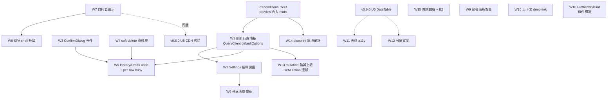

# opt: WebUI 全面 UI/UX 優化(fleet 合併後新一輪)

## Overview

使用者要求「全面分析項目狀況、提出 UI/UX 全面優化」並明確選擇**全新獨立計畫**(接受與既有 active 計畫重疊)。本計畫在三輪研究(repo 現況、制度性教訓、流程/狀態機分析)之上,涵蓋九個 workstream:刷新行為地基、Settings 編輯保護、破壞性操作安全(ConfirmDialog + soft-delete + undo)、共享表單體系、視覺統一(自托管圖示 + SPA shell 升級)、導航與命令面板增量、a11y/響應式、錯誤誠實性收尾與首跑體驗、以及工程品質殘項。

**與既有兩份 active 計畫的關係不是「重疊」而是「銜接」**:凡既有計畫已裁決的事項(DataTable 語義、Ctrl+K、undo-vs-poll 行為、ESLint),本計畫一律**繼承而非推翻**,逐項列於下方 turf 對照表;本計畫的淨新增價值是既有計畫沒有認領的元件體系、破壞性操作安全、表單保護、視覺統一、a11y 推廣、首跑體驗。

**⚠️ 併發修改警示(沿用本 repo 已兩度證實的教訓)**:本 workspace 有多 session 並行的直接證據(`docs/solutions/workflow-issues/` 三件組 + MEMORY 記錄)。本文件所有具體數字(SLOC、檔案行數、測試數)是 2026-07-06 規劃當下快照,執行任何 unit 前務必即時重測。

## Problem Frame(2026-07-06 全面現況分析)

### 技術棧與基線

- SPA:Vue 3.5 + Vite 8 + TS 6 + vue-router 5 + Pinia 3 + @tanstack/vue-query 5;42 個 vitest specs;建置到 `webui_app/spa_dist`。CI 兩條線(`frontend.yml` path-filtered 全套 + `ci.yml` frontend-lint unfiltered)。
- 雙前端 strangler-fig:SPA 17 條路由(primary)+ legacy Jinja 21 個 template ~240KB(fallback/LITE);`webui_app/static/js/` ~26 檔;tokens.css 單源雙前端共享(兩層 token、dark-first + WCAG AA light theme)。
- **基線警示**:`integration/fleet-preview-2026-07-06`(ba29a04e,34 commits ahead of main)已包含 U2 healthcheck、U3 批次操作、U12 ESLint、hidden-debt sweep、adapter-silent-exceptions 大部分落地——**正是本計畫的主戰場檔案**(`HistoryPage.vue`、`DraftsPage`、`SitesPage`、`errorCapture.ts`、`api/history.ts`)。本計畫以 **fleet 合併後的 main 為基線**(見 Preconditions)。

### UI/UX 弱點清單(三輪研究彙整,標注認領狀態)

**元件層**(本計畫主體):
1. 共享元件僅 4 個(StateBlock/Toast/ProfileSelector/ArticleReviewRow + ReportProblemPanel);無 Modal/ConfirmDialog、無共享表單、無 Pagination 元件。DataTable 元件化已由 v0.6.0 U5 認領(含分頁/選取語義)。
2. **破壞性操作零防護**:History 批刪/單刪無任何確認(`frontend/src/pages/History/HistoryPage.vue`),且後端是硬 SQL DELETE(`src/backlink_publisher/events/_history_mutations.py` events+articles 兩表——注意在 domain 層,CLI 與 WebUI 共用此單一路徑)不可恢復。現有三種 ad-hoc 確認並存:KeepAlivePage 自製 overlay、BloggerCard 文字 confirm、History 無確認。
3. **Settings 有活的資料遺失 bug**:`SettingsPage.vue` 的 hydration watcher 在 query data 變化時重寫 `keywordEdits`——一次 focus refetch(TanStack 預設 `refetchOnWindowFocus: true`)就默默覆蓋使用者正在輸入的文字。且全站零 route-leave guard、零 dirty-state 追蹤。
4. Settings 10 段各自 `useQuery` + 各自 save 慣例;已有 `useChannelCard` composable(saveWith422 模式)但只覆蓋部分卡。

**互動品質**:
5. mutation 走 plain `run()` try/catch 而非 `useMutation`,失敗只 toast、**完全繞過 MutationCache.onError**——整類 mutation 錯誤對 error-reports 儀表板隱形(= `docs/audits/2026-07-03-webui-feature-error-backlog.md` 發現 #4 的可指名根因,且比原描述更廣)。attention-dashboard 計畫 K11 已明文將此 defer 為獨立任務,本計畫接手(W13)。
6. History/Drafts 共用單一 `busy` 布林鎖全頁按鈕;無 per-row busy、無互斥矩陣。
7. 刷新行為隱性且逐頁不一致:QueryClient 無 defaultOptions,`refetchOnWindowFocus` 全域預設開,只有個別頁顯式設定;job-poll 三套模式並存(SPA 2s setTimeout 鏈 ×2、legacy 2s ×2、60s schedule.js)。
8. Ctrl+K disabled stub——已由 v0.6.0 U8 認領(含 IME guard、鍵盤協定),本計畫只做其上增量(W9)。

**視覺統一**:
9. 圖示三軌並存:Jinja `bi-*`(CDN icon font)、SPA 部分 `bi-*`、TopBar emoji(☰🌙☀️)。Bootstrap + bootstrap-icons CDN 同時掛在 `templates/base.html` 與 `frontend/index.html`——本機工具離線即破版。U8 移除 CDN 後 SPA 的 `bi-*` 會直接消失,U8 doc-review 已標注「需替代方案」但未指定——本計畫 W7 接這個縫。
10. SPA shell 比 legacy 降級:`SideNav.vue` 純文字、無 icon、無 anomaly badge(legacy `navAnomalyBadge` 有);nav 分組兩邊不一致;裝飾 orbs 只作用於 Jinja 頁。

**a11y / 響應式 / i18n**:
11. a11y 基礎不錯(skip-link、drawer focus-trap、router afterEach 移焦 `#main`、StateBlock aria-live)但表格語義缺:無 caption/scope、無 select-all(遑論 `aria-checked="mixed"` 三態)、無鍵盤列導航。attention-dashboard R17 是 repo 第一次系統性 a11y 工作,本計畫 W11 是其之外的表格向推廣。
12. 響應式僅 1024px 一個 breakpoint;真實場景是桌面分屏(~700-960px)而非手機。
13. i18n:zh-CN 硬編碼、無抽取層——v0.6.0 已記錄為 parked 決策,本計畫維持不動。

**誠實性 / 首跑**:
14. `docs/solutions/ux-honesty/webui-false-success-resolution.md` 與 `docs/solutions/correctness/adapter-silent-exceptions-resolution.md` 都是 blueprint 而非完工報告;後者大部分已落 fleet 但不在 main——落地缺口需在 fleet merge 後審計(W14)。
15. 首跑體驗:全新安裝時首頁持續顯示「系统降级」橫幅(backlog B2,根因 `webui_app/services/health_projection.py` 對 `pipeline:never_run` 回 503)——從未跑過 ≠ 降級;全站空表無引導。

**工程品質**:
16. ESLint 已由 U12 在 fleet 落地(flat config + CI zero-warning lane)——**從本計畫刪除**。Prettier/stylelint 是 U12 記錄在案的刻意 defer(mass reformat 與 in-flight 分支衝突),本計畫 W16 以「無 in-flight frontend 分支」為前置條件接手。
17. 文件漂移:`AGENTS.md` L103 + `CLAUDE.md` 稱 client 是「Axios-based」,實際是手寫 fetch wrapper——W16 順手修。

### 與既有 active 計畫的 turf 對照表(每項必須繼承或明示推翻)

| 本計畫項 | 既有裁決 | 關係 |
|---|---|---|
| DataTable/分頁/選取語義 | v0.6.0 U5(limit/offset、換頁清選取、page clamp、**不做排序**) | **繼承**;W5/W11 排在 U5 之後;排序維持 out of scope(見 Scope) |
| Ctrl+K 命令面板 | v0.6.0 U8(IME guard、鍵盤協定、TopBar 觸發) | **繼承**;W9 只做 registry 擴充與 focus 歸還規格 |
| Bootstrap CDN 移除 | v0.6.0 U8(3 行 CDN、17 檔 bi-*) | **繼承**;W7 是其前置/同捆(icon 替代方案) |
| undo 視窗 × 輪詢行為 | attention-dashboard Unit 3/6(項目保持顯示+狀態標注;跨分頁 defer) | **繼承**;W5 沿用同一語義 |
| a11y 首輪(R17) | attention-dashboard Unit 6 | **繼承**;W11 為其外的表格向推廣,ARIA 慣例以 R17 為準 |
| mutation 錯誤上報缺口(發現 #4) | attention-dashboard K11 明文 defer 為獨立任務 | **接手**(W13);已在此引用完成交接 |
| ESLint | v0.6.0 U12(已落地 fleet) | **已完成,刪除** |
| i18n | v0.6.0 parked 決策 | **維持 parked** |
| SSE/WebSocket | v0.6.0 明文不做 | **維持不做** |

## Requirements Trace

- R1. 全站刷新行為顯式化、可預測(QueryClient defaultOptions + 刷新來源盤點)— W1
- R2. Settings 編輯中的資料永不被背景刷新覆蓋;未儲存離開有警告 — W2
- R3. 不可逆破壞性操作一律二次確認(共享 ConfirmDialog,含明示筆數)— W3
- R4. History 刪除可撤銷(soft-delete + 延遲 purge,使用者已裁決;〔2026-07-06 縮窄〕Drafts undo 明確排除,見 D17)— W4、W5
- R5. mutation 期間回饋精確到列/按鈕,非全頁鎖 — W5
- R6. Settings 表單體系統一(validation、save 慣例、dirty 呈現)— W6
- R7. 圖示自托管統一、離線可用 — W7
- R8. SPA shell 對齊並超越 legacy sidebar 能力(icon、anomaly badge)— W8
- R9. 命令面板在 U8 基礎上接入頁內動作與 focus 歸還規格 — W9
- R10. 跨頁工作流(發布→監控→修錯)有帶上下文的 deep-link — W10
- R11. 表格 a11y(caption/scope/select-all 三態/鍵盤導航)— W11
- R12. 分屏寬度(700-960px)可用性 — W12
- R13. mutation 錯誤進入 error-reports 儀表板(修復發現 #4)— W13
- R14. 兩份誠實性 blueprint 的落地缺口清零或顯式記錄 — W14
- R15. 首跑呈現引導式空狀態而非降級警告(使用者已裁決)— W15
- R16. Prettier/stylelint lane(前置條件成立時)+ 文件漂移修正 — W16
- R17. 全程遵守既有守則(anti-rot、budgets、claims、`_g_cache` 讀寫治理、單 CSRF guard、`save_config` 保留不變式)— 全部 unit

## Scope Boundaries

- **不推翻任何既有計畫的已裁決事項**(見 turf 對照表)。
- **不做表格排序**:繼承 v0.6.0 U5 的 scope boundary;排序是新功能,留待 DataTable 元件穩定後另立計畫。
- **不做 i18n**(維持 parked)、**不做 SSE/WebSocket**(維持輪詢)、**不做手機優化**(W12 只做桌面分屏寬度;單操作者本機工具無手機場景)。
- **不對 legacy Jinja 側做視覺投資**:v0.6.0 U9 將退役 legacy 頁;本計畫視覺工作只動 SPA,唯一例外是 CDN 離線破版影響現役頁的部分(W7 的 base.html CDN 替換)。
- **不重做 attention-dashboard 的信號源/聚合器**:W8 的 SideNav badge 消費其 aggregator API,不自建第二套。
- **不動 keep-alive/recheck 的 G5b deferral**(`docs/solutions/architecture-patterns/2026-06-05-lite-accepted-deferrals.md`):resume trigger 未成立。
- **跨分頁 undo 協調明文 defer**(繼承 attention-dashboard 同項 defer;單操作者雙分頁成本不成比例)。

### Deferred to Separate Tasks

- **表格排序**:DataTable(U5)+ 本計畫 W11 落地後另立計畫。
- **job-poll 三套模式統一抽象**(遺漏項 J):v0.6.0 U5 的 `usePolledQuery` 只管 query 輪詢;job-progress 輪詢抽象留待輪詢模式證明不足時與 SSE 決策一併重審。
- **`history_store` 索引化**:soft-delete filter(W4)先以現有 load-all 模式實作;儲存格式改造沿用 attention-dashboard 的同項 defer。
- **i18n、手機響應式、legacy 視覺**:如上。
- **Drafts soft-delete/undo**〔2026-07-06 doc-review 裁決〕:`webui_store/drafts.py` 是與 events.db 完全獨立的 JSON store,W4 只涵蓋 History(events.db);R4 縮窄為 History-only,Drafts 刪除維持現況(硬刪、無 undo),留待後續獨立任務評估是否值得為其另建 soft-delete 層。

## Context & Research

### Relevant Code and Patterns(要遵循的既有模式)

- **四態元件**:`frontend/src/components/StateBlock.vue`(loading/empty/error/ready + stale bar);錯誤文案走 `frontend/src/lib/errors.ts` classifyError taxonomy,絕不吐 raw server text。
- **API 錯誤契約**:`{ok, error_code, flash_type, flash_msg, detail}`(`docs/solutions/ux-honesty/webui-false-success-resolution.md`)+ `__BLP_ERR__` typed envelope(`src/backlink_publisher/_util/error_envelope.py`);UI 按錯誤**類別**分支,永不 substring sniffing。
- **>5s 操作**:per-button disable + card-scoped spinner + 時間預估文案,不是全頁 mask(`docs/solutions/ui-bugs/webui-blocking-subprocess-and-missing-progress-feedback-2026-05-12.md`)。
- **server-side 計算**:衍生資料(gap、統計、badge 計數)在伺服器端算好注入回應,前端只渲染(`docs/solutions/architecture-patterns/server-side-gap-computation-2026-06-05.md`)。
- **表單 save**:`useChannelCard` composable 的 saveWith422 模式(W6 擴充它而非另起爐灶);寫入路徑必走 `save_config` 或窄合併 helper(`docs/solutions/logic-errors/save-config-write-paths-bypass-preservation-2026-05-15.md`),新增欄位驗證 round-trip 存活。
- **`_g_cache` 讀寫治理**:read handler 用 `_g_cache`,write handler 直接讀新鮮物件(`docs/solutions/best-practices/webui-config-request-cache-governance-2026-06-03.md`);`webui_app/` 受 CC-30 backstop gate 覆蓋。
- **CSRF**:單一 app-level `_global_csrf_guard`;不加第二層;敏感路由加正交 origin 防護(`docs/solutions/best-practices/app-level-csrf-guard-makes-blueprint-csrf-dead-code-2026-05-27.md`)。
- **guard test 自帶紅色路徑**:`frontend/src/__tests__/data-table-adoption.spec.ts` 等 regex 守衛;新 guard 必附「故意違規→紅燈」自證。W12 的卡片化若做,必須同步更新此 guard。
- **狀態字彙 seam**:未識別狀態值發聲(quarantine)不靜默 else(`docs/solutions/logic-errors/projector-silent-drop-status-vocabulary-drift-2026-05-26.md`)——W4 的 soft-delete 狀態欄位設計適用。
- **多 session 紀律**:per-unit 分支、顯式逐檔 staging(禁 `git add -A`)、動工前 turf-check `bp-*/` worktrees(`docs/solutions/workflow-issues/` 三件組)。
- **驗證紀律**:save 路由測試一律 `BACKLINK_PUBLISHER_CONFIG_DIR` 拋棄式目錄(`docs/solutions/best-practices/never-smoke-test-real-save-endpoints-2026-05-19.md`,critical);持久化行為寫正向 round-trip 斷言,警惕 negative-shape 測試(`docs/solutions/test-failures/inverted-negative-assertion-enshrined-config-save-data-loss-2026-05-14.md`)。

### Institutional Learnings(對本計畫有硬約束的守門文件)

- `docs/solutions/architecture-health-audit-2026-06-01.md`:「全面優化」請求的守門文件——本計畫的淨新增價值論證見 Overview 與 turf 對照表;聚焦執行收斂,不再拆結構。
- oasdiff API 契約 gate 與 a11y 在 `docs/solutions/` 是零覆蓋空白區——W4(新增 API 欄位)與 W11 完成後應以 `/ce-compound` 各補一篇。

### External References

未做外部研究——全部工作是延伸既有內部範式(tokens、StateBlock、job+poll、錯誤契約、useChannelCard),與前兩份計畫的判斷一致,無新技術導入。

## Key Technical Decisions

| # | 決策 | 理由 |
|---|------|------|
| D1 | **基線 = fleet preview 合併後的 main**;全計畫 Preconditions:`integration/fleet-preview-2026-07-06`(ba29a04e)先合入 main | fleet 已改動本計畫主戰場檔案(HistoryPage 等);以現 main 為基線則每個 unit 開工即衝突 |
| D2 | **undo 路線 = soft-delete + 延遲 purge**(使用者裁決):`deleted_at` 欄位 + 讀路徑 filter(含 CLI)+ undo 視窗後物理 purge | 前端延遲送出的「已刪除」是謊言,違反 ux-honesty 制度方向;純 ConfirmDialog 誤刪即永久丟失 |
| D3 | **破壞性操作分級**:不可逆(硬刪/purge/soft-delete 逾時後)→ ConfirmDialog + 明示筆數;可逆(undo 視窗內)→ 免確認直接做 + undo toast | 不分級會出現「既 confirm 又 undo」雙重摩擦;分級規則寫進 ConfirmDialog 使用文檔 |
| D4 | **confirm 開啟時凍結選取快照**;送出後 server 以 ID 為準、回報 `deleted/skipped` 計數,UI 如實顯示 | confirm 開啟期間 focus refetch 可能使選取集 stale;「將刪除 N 筆」與實際不一致是 false-success 變體 |
| D5 | **undo 視窗內 soft-deleted 行保持顯示 + 行內「已刪除・撤銷」狀態**,不消失後彈回 | 繼承 attention-dashboard Unit 3/6 已裁決的 undo-vs-poll 語義,避免決策分叉 |
| D6 | **busy 互斥矩陣**:bulk in-flight → 鎖全表 + bulk 按鈕;單 row in-flight → 只鎖該 row + bulk 按鈕;同 row 操作互斥 | 制度教訓處方是 per-button/card-scoped,全頁鎖是反模式;矩陣不寫死會變成 race 的溫床 |
| D7 | **W13 修法 = 遷移 History/Drafts/Settings mutations 到 `useMutation`**,由 MutationCache.onError 統一上報 | 一石二鳥:同時解 per-row busy(useMutation 的 isPending 天然 per-call)與錯誤上報隱形;比 toast 層加上報少一套平行機制 |
| D8 | **受控 4xx 驗證錯誤(422)不進 error-reports;5xx/網路錯誤進** | 發現 #4 的驗收線:事故 vs 使用者輸入錯誤要分流,否則儀表板被驗證噪音淹沒 |
| D9 | **圖示方案 = 自托管 inline SVG 元件**(`frontend/src/components/Icon.vue` 或等價),涵蓋 SPA 用到的全部 bi-* + TopBar emoji 替換;legacy base.html 的 icon font 改 self-host 檔案 | W7 必須先於/同捆 v0.6.0 U8 的 CDN 移除,否則 SPA 圖示消失;inline SVG 免 icon-font 的離線與 FOUT 問題 |
| D10 | **SideNav badge 資料源 = attention-dashboard 的 aggregator API**(`/api/monitor-hub` 或其 v1 後繼),不自建輪詢 | 跨計畫依賴顯式化;自建第二套信號源違反 server-side computation 原則 |
| D11 | **W11 表格 a11y 以 DataTable 元件 prop 形式一次交付**,排在 v0.6.0 U5 之後 | 在 5 個各自表格上先做會在 U5 元件化時全部重做 |
| D12 | **W12 響應式範圍 = 700-960px 桌面分屏**,優先 Settings 與 Monitor;砍手機優化 | 單操作者本機工具的真實窄螢幕場景是分屏;既有 720px 特例(SettingsPage)是先例 |
| D13 | **never_run = 引導式空狀態**(使用者裁決):中性色引導卡連到 `/publish`,health projection 對 never_run 不回 503 | 從未跑過 ≠ 降級;B2 是高可見度誠實性問題 |
| D14 | **W16 Prettier/stylelint 前置條件 = 無 in-flight frontend 分支**,寫成可執行檢查(腳本查 `git branch -r` + `bp-*/` worktrees)而非口頭約定 | U12 記錄在案的 defer 理由(mass reformat 衝突)只在該條件下解除 |
| D15 | **W1 排最前**:QueryClient defaultOptions 顯式化是 W2/W3/W5/W6 全部狀態機的共同地基 | refetchOnWindowFocus 隱性全域開啟是 Settings 覆蓋 bug、選取 stale、undo 閃爍的共同誘因 |
| D16 | **KeepAlivePage 既有 7 態機作為 ConfirmDialog API 的驗收用例** | 元件 API 若表達不了最複雜的既有用例,它會永遠留在自製 overlay,元件化失敗 |
| D17〔2026-07-06 doc-review 裁決,使用者確認〕 | **W4 範圍縮窄為 History-only**(events.db);Drafts undo 明確不做,列 Deferred to Separate Tasks | Drafts 是獨立 JSON store,同步做兩套 soft-delete 會讓 W4 膨脹;History 是主要痛點(硬刪+無確認的組合) |
| D18〔同上〕 | **D5 機制 = `include_deleted=window` 查詢參數**:list 端點加此選填參數,WebUI 傳、CLI 永不傳;回傳的 soft-deleted 行帶 `deleted_at` 供前端渲染「已刪除・撤銷」狀態 | 解決 D5 與預設 filter 的矛盾;CLI 永不傳保證看不到已刪資料,不會有回流風險 |
| D19〔同上〕 | **W5 先在現頁(HistoryPage/DraftsPage)實作,不等 U5**;U5 落地後再遷移進 DataTable 元件 | 使用者確認接受重工風險,換取 R4/R5 不用無限期等待 U5 進度不明的落地時間 |
| D20〔同上〕 | **W8 明確延後,前置條件加上「`feat/webui-attention-dashboard` 的 PR #77 已合併」** | 該分支正活躍開發且同時觸碰 SideNav/TopBar/首頁路由,現在動工會與其他 session 的進行中工作衝突 |

## Open Questions

### Resolved During Planning

- 計畫定位(vs 兩份 active 計畫):全新獨立計畫,繼承其裁決(使用者選擇 + turf 對照表)。
- undo 路線:soft-delete + 延遲 purge(使用者裁決,D2)。
- never_run 語義:引導式空狀態(使用者裁決,D13)。
- ESLint:已完成(fleet U12),刪除。
- 排序/i18n/SSE/手機:維持既有 out-of-scope 裁決。
- 「15s 輪詢」前提修正:SPA 只有 Monitor 30s 輪詢 + 2s job pollers;全域刷新主源是 `refetchOnWindowFocus` 預設——W1 的盤點對象。

### Deferred to Implementation

- soft-delete 的 purge 觸發機制(APScheduler job vs 下次寫入時懶清理)與 undo 視窗秒數——W4 實作時按現有 scheduler 模式與 toast 停留時間定。
- CLI 讀路徑受 soft-delete filter 影響的完整清單——W4 第一步以 `rg` 盤點所有 history 讀取點後定。
- `useMutation` 遷移的頁面順序與每頁的 query invalidation 範圍——W13 實作時逐頁定。
- Icon 元件的 SVG 來源(bootstrap-icons 的 SVG 檔自托管 vs 逐個內聯)——W7 按 SPA 實際用到的 icon 數量(先 `rg 'bi-'` 盤點)決定。
- W14 審計的具體缺口清單——只能在 fleet merge 後實測得知。
- spec.py / schemas.py 的 budget 餘裕——W4/W15 第一個碰 API 層的 unit 開工前重測(fleet U3 可能已吃掉 headroom),超限同 PR 提額 + rationale ≥80 字。

## Implementation Units

> 執行紀律(每 unit 一體適用):獨立分支、顯式逐檔 staging(禁 `git add -A`)、早 push;動工前 turf-check(`git worktree list` + `bp-*/` 檢查 + `docs/plans/` 有無新 active 重疊計畫);save 路由測試一律拋棄式 config dir;碰 `webui_app/` 新 handler 遵守 `_g_cache` 讀寫規則與 CC-30;碰 budget 檔同 PR 提額 + rationale。

(W3/W4/W7/W15 無內部依賴可並行;W9 依賴 v0.6.0 U8 落地;W11/W12 依賴 v0.6.0 U5 落地;W16 依賴「無 in-flight frontend 分支」條件。)

### Preconditions(硬前置)

- [ ] **P0: fleet preview 合入 main**——`integration/fleet-preview-2026-07-06`(ba29a04e)採納(需使用者 go-ahead,另案進行中);合併後重測本文件引用的所有數字(spec.py SLOC、vitest 數、HistoryPage 現狀)。在 P0 完成前,只有 W3(純新元件)、W7(icon 盤點)可以安全預研,其餘 unit 不開工。

---

### Phase A — 地基

- [x] **W1: 刷新行為顯式化——QueryClient defaultOptions + 全站刷新來源盤點〔R1〕**

〔W1 執行結果,2026-07-06,分支 `feat/w1-refresh-defaults`〕已完成:`main.ts` 的 QueryClient 補上 `defaultOptions`(`refetchOnWindowFocus: true` + `staleTime: 30_000`,先前完全沒有,所有頁面都默默吃套件內建預設 `staleTime: 0`);6 個 Settings 編輯型 query(SettingsPage 2 個 + BlogIdsCard/BloggerCard/ChannelBindingCard/LlmSettingsCard/NotionCard 各 1 個,經 `watch()` 回填表單的都算)顯式設 `refetchOnWindowFocus: false`;guard test 斷言兩者(main.ts defaultOptions + 6 個編輯頁的顯式關閉),紅色路徑已驗證。盤點文件涵蓋全部 17 條路由,發現 4 條路由(PrQueue/SurvivalDashboard/OptimizationStatus/EquityLedger)根本沒用 `useQuery`(純 `onMounted(load)`,零自動刷新)——記錄為未來 unit 的觀察項,本 unit 不修(僅使既有行為顯式,非新增能力)。vitest 46 檔 276 測試全綠(新增 2 個)、vue-tsc 零錯誤。**未做**:未針對 blur/focus 做手動瀏覽器走查(只驗證了 guard test 與程式碼層級的 `refetchOnWindowFocus: false` 存在),已在盤點文件中誠實記錄未做而非宣稱已做。

**Goal:** 把「什麼時候資料會自己變」從隱性預設變成顯式、逐頁可查的契約——這是 W2/W5/W6 全部狀態機的地基。

**Dependencies:** P0。

**Files:**
- Modify: `frontend/src/main.ts`(QueryClient defaultOptions)
- Modify: 依賴預設行為的頁面(顯式標注,實測盤點)
- Create: `frontend/src/__tests__/query-defaults.spec.ts`
- Create: `docs/audits/` 刷新來源盤點文件(每頁:query keys、refetch 條件、輪詢間隔)

**Approach:** 先盤點全部刷新來源(refetchOnWindowFocus 預設、Monitor 30s、CampaignProgress/KeepAlive 2s job pollers、schedule 顯式設定),再定全域 defaultOptions(建議:`refetchOnWindowFocus` 顯式保留但 `staleTime` 統一,編輯型頁面顯式關閉);逐頁差異一律顯式寫在該頁,不靠預設。

**Test scenarios:**
- Happy path:defaultOptions 生效——未顯式設定的頁面 query 帶預期 staleTime。
- Edge case:編輯型頁(Settings)在 window focus 時不觸發 refetch(顯式關閉生效)。
- 紅色路徑:guard test 斷言 main.ts 的 QueryClient 建構帶 defaultOptions(防止未來被刪回隱性預設)。

**Verification:** 盤點文件涵蓋全部 17 條路由;vitest 綠;手動 blur/focus 視窗確認編輯型頁不刷新。

- [x] **W2: Settings 編輯保護——hydration 覆蓋修復 + per-card dirty + route-leave guard〔R2〕**

〔W2 執行結果,2026-07-06,分支 `feat/w2-settings-edit-protection`(堆疊於 W1)〕已完成:新建 `stores/settingsDirty.ts`(per-card dirty 單一事實來源)與 `composables/useSnapshotDirty.ts`(JSON snapshot diff 判斷 dirty 的共用邏輯,5 張卡復用);SettingsPage 與 4 張卡的 hydration watcher 加 `if (dirty.value) return` guard(dirty 期間不覆寫);ChannelBindingCard 走客製修法(其 hydration 本來就是 merge-only,改追蹤 `lastSeeded` baseline 避免新串流進來的空白預設誤判 dirty);`router/index.ts` 新增全域 `beforeEach`(dirty 時 `window.confirm` 列出哪些卡 dirty)+ 同步 `beforeunload`。vitest 48 檔 303 測試全綠(新增 47)、vue-tsc 零錯誤。**偏離記錄**:route-leave 警告用 `window.confirm` 而非 W3 的 ConfirmDialog(理由:router 全域 guard 若要 await 一個掛在元件樹外的 async modal confirm,需要額外的 confirm-service singleton 架構,超出本次測試場景要求的範圍)——這正是計畫審查曾警告過的「第 4 種 ad-hoc confirm」模式,已記錄為 todo `014`(P2,不阻擋合併,`beforeunload` 部分維持原生實作是正確且無法避免的瀏覽器限制)。

**Goal:** 使用者輸入中的內容永不被背景刷新覆蓋;未儲存離開有警告。這是活的資料遺失 bug,優先級最高。

**Dependencies:** W1(refetch 行為先顯式化)。

**Files:**
- Modify: `frontend/src/pages/Settings/SettingsPage.vue`(hydration watcher 修復 + dirty 追蹤)
- Modify: `frontend/src/pages/Settings/*Card.vue`(per-card dirty 上報)
- Modify: `frontend/src/router/index.ts`(route-leave guard 掛點)
- Test: `frontend/src/pages/Settings/SettingsPage.spec.ts`(擴充)

**Approach:** (1) 先修 bug:dirty 期間 hydration watcher 不得 rehydrate(或 per-field merge——只回填未編輯欄位);(2) dirty 語義 per-card(10 段獨立 save → dirty 也 per-card),route-leave 警告列出哪幾張卡 dirty;(3) `beforeunload` 同步掛(關分頁保護)。

**Execution note:** 先寫能重現覆蓋 bug 的失敗測試(輸入→模擬 query data 變化→斷言輸入完好),再修。

**Test scenarios:**
- Happy path(回歸錨點):keyword pool 輸入未儲存 → 觸發 refetch(模擬 query data 更新)→ 輸入內容不被覆蓋。
- Happy path:輸入 → 點 SideNav 導航 → route-leave 警告;取消後停留且內容完好;放棄後導航、dirty 態清空。
- Edge case:card A dirty、card B 已儲存 → 警告只列 card A;card A 儲存成功後 dirty 清空、導航不再攔。
- Error path:save 失敗(422/500)→ dirty 保持、警告仍攔。

**Verification:** 覆蓋 bug 的回歸測試綠;手動分屏操作 blur/focus 不丟字。

---

### Phase B — 破壞性操作安全

- [x] **W3: ConfirmDialog 共享元件 + 破壞性操作分級〔R3〕**

〔W3 執行結果,2026-07-06,分支 `feat/w3-confirm-dialog`(基於 main ad24fb1a)〕已完成:`ConfirmDialog.vue`(受控 open、danger 變體、async confirm busy+防雙擊、reject 保持開啟+inline 錯誤、aria-modal/labelledby/aria-live、Escape capture 階段與 drawer 分派、focus 歸還;D3 分級規則成文於文檔注釋;backdrop 點擊不關閉——破壞性確認需顯式取消)+ 11 測試;KeepAlivePage 7 態機遷移(行為不變,確認鈕文案依 D3 加筆數)+ 3 流程測試;BloggerCard `window.confirm` 遷移 + 取消路徑測試;tokens.css 新增 `--backdrop` token(dark/light)。vitest 256 全綠、vue-tsc 零錯誤。附帶發現 pre-existing bug:KeepAlivePage 的 `${target_url}:${platform}` gap key 對含 `https://` 的 URL split 錯誤——範圍外未修,待另開追蹤。

**Goal:** 一個可表達現有最複雜用例(KeepAlive 7 態機)的 modal 元件,取代三種 ad-hoc 確認;分級規則(D3)成文。

**Dependencies:** 無(可與 W1 並行;純新元件)。

**Files:**
- Create: `frontend/src/components/ConfirmDialog.vue`
- Modify: `frontend/src/pages/KeepAlive/KeepAlivePage.vue`(自製 overlay 遷移,作驗收用例)
- Modify: `frontend/src/pages/Settings/BloggerCard.vue`(文字 confirm 遷移)
- Test: `frontend/src/components/ConfirmDialog.spec.ts`

**Approach:** focus-trap + Escape + aria-modal 沿用 `frontend/src/composables/useSidenavDrawer.ts` 既有 focus 基建;API 需支援:標題/內文 slot、確認文案含筆數、danger 變體、async confirm(等待期間按鈕 busy)、與 drawer 並存時 Escape 分派(最上層先關)。分級規則(D3)寫進元件文檔注釋。

**Test scenarios:**
- Happy path:開 dialog → focus 進入 → Escape 關閉 → focus 回觸發前元素。
- Happy path:async confirm 等待期間確認鈕 busy、不可雙擊(5 連擊恰 1 次 callback)。
- Edge case:KeepAlive 7 態機(idle→rechecking→healthy→selecting→confirming→publishing→result)全流程經新元件走通。
- a11y:`role="dialog"` + `aria-modal` + labelledby 斷言。

**Verification:** KeepAlive 與 Blogger 兩處遷移後行為不變;三種 ad-hoc 確認歸一。

- [ ] **W4: soft-delete 資料層——deleted_at + 讀路徑 filter + 延遲 purge〔R4〕**

**Goal:** History 刪除從硬 DELETE 變 soft-delete,undo 視窗內可真實復原,逾時物理 purge。

**Dependencies:** P0(fleet 的 `_history_mutations.py`/`api/history.ts` 變更先落地)。

**Files:**
- Modify: `src/backlink_publisher/events/_history_mutations.py`(DELETE → UPDATE deleted_at;purge 邏輯——**在 domain 層**,import-linter 邊界與 domain 側 budget 適用;CLI 與 WebUI 共用此單一寫入路徑,反而簡化 filter 佈局)
- Modify: `src/backlink_publisher/events/history_query.py`(讀路徑 SQL 層 filter——實際 history 讀取走這裡,不是 `webui_store/`)
- Modify: `webui_app/api/` 對應 endpoint 層(新 undelete 端點)
- Modify: `src/backlink_publisher/` CLI 的 history 讀取點(實測盤點後逐一加 filter)
- Modify: `webui_app/api/v1/` 對應 endpoint(oasdiff 增量安全:新欄位/新端點,不改既有形狀)
- Test: `tests/test_history_soft_delete.py`(新)+ 受影響既有測試

**Approach:** (1) 第一步 `rg` 盤點全部 history 讀取點(WebUI + CLI + projector),產出 filter 清單;(2) events + articles 兩表加 `deleted_at`(nullable;**同 PR 內 bump `SCHEMA_VERSION` 並在 `maybe_upgrade_schema` 加對應 ALTER 步驟**——見 Open Questions 的 schema 升級發現,多 worktree 並存時舊分支會撞 `SchemaTooNewError`,動工前公告);(3) 讀路徑預設 filter 掉 soft-deleted,**新增選填查詢參數 `include_deleted=window`**(D18)供 WebUI list 端點在 undo 視窗內回傳仍帶 `deleted_at` 的行,CLI 讀取路徑永不傳此參數;(4) undelete 端點(undo 視窗內);(5) purge:逾時物理刪除,**server purge 資格 = `deleted_at` 早於(client undo 視窗秒數 × 2)**,client 視窗是由此導出的 UI 常數、永不相等(避免使用者點「撤銷」卻拿到 404);(6) 狀態欄位設計遵守 quarantine-not-silent-else 原則;(7) **範圍明確為 History(events.db)only,不涵蓋 Drafts**(D17)——`webui_store/drafts.py` 是獨立 JSON store,維持現況硬刪。**注意 spec.py budget 餘裕先重測**(K22 同款問題)。**開工前先查證 `_history_store`(legacy JSON 鏡像,若 fleet 尚未移除其雙寫路徑)的處置方式**——no-op shim / 同步 soft-delete / 明確記錄容忍分歧,三選一並記錄理由。

**Execution note:** 契約先行——先寫 soft-delete 不變量的失敗測試(deleted 行對 list 端點不可見、對 CLI plan 不可見、undelete 後可見),再動 mutation。

**Test scenarios:**
- Happy path:刪除 → list 不含該行;undelete → 復現且欄位完好(round-trip 正向斷言)。
- Integration:soft-deleted 行對 CLI `plan-backlinks` 讀取路徑不可見(filter 驗證)。
- Edge case:purge 觸發後 undelete 回 404/`not_found`(不靜默成功——比照 retry_task 修復先例)。
- Error path:undelete 不存在的 id → 404 + `{ok:false, error_code}` 契約。
- Edge case:bulk soft-delete 部分 id 已不存在 → 回報 `deleted/skipped` 計數。

**Verification:** 全套 history 相關測試綠;oasdiff gate 綠(只增不改);budget gates 綠。

- [ ] **W5: History/Drafts undo UX + per-row busy 互斥〔R4、R5〕**

**Goal:** 刪除即時生效但可撤銷(undo toast);mutation 回饋精確到列;選取/分頁/refetch/undo 的狀態機成文。

**Dependencies:** W1、W3、W4;若 v0.6.0 U5(DataTable/分頁)已落地則基於其選取語義,未落地則先在現頁實作、標注 U5 元件化時遷移。

**Files:**
- Modify: `frontend/src/pages/History/HistoryPage.vue`、`frontend/src/pages/Drafts/DraftsPage.vue`
- Modify: `frontend/src/api/history.ts`(undelete 呼叫)
- Test: 兩頁 spec 擴充

**Approach:** (1) 不可逆操作(purge-failed 等)走 ConfirmDialog + 凍結快照(D4);可撤銷刪除免確認 + undo toast(D3);(2) undo 視窗內行內「已刪除・撤銷」狀態、不消失(D5);(3) busy 互斥矩陣(D6);(4) refetch 後 stale selection 修剪(watcher 對照新 items 清掉已消失 id);(5) 狀態表(事件 × 當前態 → 轉移)寫進 PR 描述與元件注釋。

**Test scenarios:**
- Happy path:刪 1 行 → 行內顯示「已刪除・撤銷」→ 點撤銷 → 復原、error-reports 無新記錄。
- Edge case:undo toast 逾時 → 行消失、後端 purge 排程。
- Edge case:undo 視窗內手動 refetch → 該行保持顯示不閃爍(D5 語義)。
- Edge case:勾 3 行 → confirm 期間 1 行被他端刪除 → 送出 → toast 如實顯示 2 deleted / 1 skipped。
- Edge case:refetch 使已勾選行消失 → 選取集自動修剪、批次按鈕計數同步。
- 互斥:row A recheck in-flight → row B delete 可執行;bulk in-flight → 全表鎖;同按鈕 5 連擊恰 1 次 API call。

**Verification:** 兩頁全部批次/單行操作走新狀態機;vitest 綠;手動走查無閃爍。

---

### Phase C — 表單與視覺

- [ ] **W6: 共享表單體系——useChannelCard 擴充為全 Settings 慣例〔R6〕**

**Goal:** Settings 10 段統一 save 慣例(422 inline、成功 toast、dirty 整合)——擴充既有 `useChannelCard`,不另起爐灶。

**Dependencies:** W2(dirty 基建)。

**Files:**
- Modify: `frontend/src/composables/useChannelCard.ts`(或抽出 `useSettingsForm`)
- Modify: `frontend/src/pages/Settings/*Card.vue`(逐卡遷移)
- Test: composable spec + 卡片 spec 擴充

**Approach:** 以 useChannelCard 的 saveWith422 為基底,補:inline validation 呈現(422 detail 對應到欄位)、dirty 上報掛點(接 W2)、save 中 per-card busy。逐卡遷移,每卡一 commit。後端寫入路徑不動(已走 save_config 治理)。

**Test scenarios:**
- Happy path:合法輸入 save → 成功 toast + dirty 清空。
- Error path:422 → 對應欄位 inline 錯誤、不彈全域錯誤 toast;500 → classifyError 文案 toast。
- Edge case:save in-flight 時該卡按鈕 busy、其他卡不受影響。
- Integration:save 成功後 config round-trip(重新載入頁面值一致)。

**Verification:** 10 段全部走統一慣例;無兩套 save 模式並存。

- [x] **W7: 自托管圖示系統〔R7〕**(部分:TopBar emoji 替換延後,見執行結果)

〔W7 執行結果,2026-07-06,分支 `feat/w7-self-hosted-icons`(堆疊於 W3)〕已完成:`Icon.vue`(inline SVG,path 內聯自 bootstrap-icons 1.11.0/MIT,`fill=currentColor`+`1em`,預設 aria-hidden、label 模式、未知 name warn+空渲染)+ 6 測試;HistoryPage/SurvivalDashboard 全部 `bi-*` 替換(SPA 盤點僅此兩檔);guard test `no-cdn-icon-usage.spec.ts`(紅色路徑已驗證);`templates/base.html` icons CDN → 自托管 `webui_app/static/vendor/bootstrap-icons/`(css+woff2+woff;注意上游 1.11.0 包內 css banner 誤標 1.10.5,已驗證內容為 1.11);`frontend/index.html` icons CDN 行移除(orchestrator 裁定:SPA 零 bi- 用法後屬 W7 地盤)。vitest 263 全綠、vue-tsc 零錯誤、vite build 綠。**遺留:** TopBar emoji(☰🌙☀️)替換因 attention-dashboard 分支正在改 TopBar.vue 而延後(turf-check 命中),待其落地後補;Bootstrap 本體 CDN 兩行+preconnect 歸 v0.6.0 U8;「版面完整 offline」為 W7+U8 聯合驗收(依 2026-07-06 審查修正)。

**Goal:** SPA 圖示統一為自托管 inline SVG 元件;TopBar emoji 替換;legacy base.html icon font 改自托管——離線完整可用,並為 v0.6.0 U8 的 CDN 移除解除前置阻塞。

**Dependencies:** 無(可立即盤點);**與 v0.6.0 U8 同捆或先行**(D9);動工前 turf-check `TopBar.vue`(U8 與 attention-dashboard 都宣告過)。

**Files:**
- Create: `frontend/src/components/Icon.vue`(或等價 SVG 方案)
- Modify: SPA 內全部 `bi-*` 使用處(先 `rg 'bi-'` 盤點)+ `frontend/src/layout/TopBar.vue`(emoji 替換)
- Modify: `templates/base.html`(icon font CDN → 自托管檔案;**Bootstrap JS/CSS 的移除仍歸 U8,本 unit 不動**)
- Test: guard test(`rg` 斷言 SPA 無殘留 CDN 依賴的 bi- class 用法)

**Test scenarios:**
- Happy path:全部頁面圖示渲染正常(截圖比對)。
- 離線:block CDN 域名載入 SPA → 圖示可見、版面完整(before 基準:現況破版)。
- a11y:裝飾性 icon `aria-hidden`;語義 icon 帶 label。
- 紅色路徑:guard test 對故意加回 CDN bi- 用法紅燈。

**Verification:** 斷網走查全部 SPA 頁面;legacy 現役頁 icon 正常。

- [ ] **W8: SPA shell 升級——SideNav icon + anomaly badge + nav 分組對齊〔R8〕**

**Goal:** SPA SideNav 不再是 legacy 的降級版:加 icon(用 W7 元件)、anomaly badge(消費 attention-dashboard aggregator)、nav 分組與路由完整性對齊。

**Dependencies:** W7(已完成);**`feat/webui-attention-dashboard` 分支的 PR #77 合併進 main**(D20,硬前置——該分支正活躍開發且同時觸碰 SideNav/TopBar/首頁路由,現在動工有真實並發衝突風險;aggregator API `/api/monitor-hub` 本身已存在於 main,不是卡點,卡點是檔案層級的並發修改)。動工前重新確認 PR #77 狀態。

**Files:**
- Modify: `frontend/src/layout/SideNav.vue`、`frontend/src/layout/navItems.ts`
- Modify: `frontend/src/api/monitor.ts`(badge 資料)
- Test: SideNav spec 擴充

**Approach:** badge 資料源 = aggregator API(D10),SPA 側一條低頻 query(staleTime 對齊 W1 規範);Pro pill 現況先驗證再動(流程分析警示:「三態」說法未經證實);nav 分組以 SPA 側為準收斂,`/error-reports` 等 SPA-only 頁納入 nav 或明示不納入的理由。

**Test scenarios:**
- Happy path:badge 計數與 aggregator 回應一致;零異常時不顯示 badge。
- Error path:aggregator 失敗 → badge 靜默隱藏(不阻塞導航渲染)、不吐錯誤 toast。
- a11y:badge 計數有 sr-only 文字;icon aria-hidden。

**Verification:** 與 legacy sidebar 能力對照表逐項打勾;drawer 模式(<1024px)不回歸。

---

### Phase D — 導航與互動增量

- [ ] **W9: 命令面板增量——registry 擴充 + focus 歸還規格〔R9〕**

**Goal:** 在 v0.6.0 U8 的命令面板上接入頁內動作(非僅導航),並把 focus 歸還規格成文。

**Dependencies:** v0.6.0 U8 落地(硬依賴;未落地則本 unit 凍結,不搶跑)。

**Files:**
- Modify: U8 建立的命令面板元件與 registry(路徑以 U8 落地為準)
- Test: 面板 spec 擴充

**Approach:** (1) 指令註冊表擴充:頁面可註冊上下文動作(如 History 頁註冊「重檢選取項」);(2) focus 規格:關閉→回觸發前元素;執行導航指令→交給 router afterEach 的 `#main` 移焦;與 drawer 並存時 Escape 分派最上層先關;(3) 全域快捷鍵(若加)復用 U8 的 IME guard,焦點在 input 時單鍵停用。

**Test scenarios:**
- Happy path:面板選「历史」→ 導航且焦點落 `#main`。
- Edge case:IME 組字中 Ctrl+K 不觸發(繼承 U8 guard,回歸驗證)。
- Edge case:drawer 開 + 面板開 → Escape 先關面板、再按才關 drawer。
- a11y:面板開啟時焦點 trap;關閉焦點歸還。

**Verification:** U8 既有測試不回歸;新增指令經鍵盤全流程可達。

- [ ] **W10: 跨頁上下文 deep-link 系統化〔R10〕**

**Goal:** 「發布→監控→修錯→回原位」工作流的行內 deep-link 成體系:History 失敗行 → error-report 詳情;error-report → 回到來源頁定位到該行。

**Dependencies:** W1(query 行為顯式化後,返回時的資料新鮮度可預測)。

**Files:**
- Modify: `frontend/src/pages/History/HistoryPage.vue`(失敗行 → report deep-link)
- Modify: `frontend/src/pages/ErrorReports/ErrorReportDetailPage.vue`(來源路由回鏈)
- Modify: 相關 api/型別模組(report 記錄攜帶來源路由 + 行 id 已有 fingerprint 基礎,實測盤點)
- Test: 兩頁 spec 擴充

**Approach:** 沿用既有先例(toast reportId → error-report link)系統化:失敗態行內加「查看報告」;report 詳情頁「回到來源」按 query 參數導航 + 高亮目標行(scroll + 短暫 highlight,`prefers-reduced-motion` 時不動畫)。不新增後端欄位優先(fingerprint/context 既有欄位夠用則零 API 變更)。

**Test scenarios:**
- Happy path:History 失敗行點「查看報告」→ 詳情頁正確 report;點「回到來源」→ History 定位高亮該行。
- Edge case:目標行已被刪除/翻頁不可見 → 顯示「該項目已不在列表」提示,不靜默。
- a11y:高亮不只靠顏色(短暫 outline + aria-live 提示)。

**Verification:** 修錯工作流手動走查:發現失敗→看報告→修→回原位,全程無手動搜尋。

---

### Phase E — a11y 與響應式(依賴 v0.6.0 U5)

- [ ] **W11: 表格 a11y——caption/scope/select-all 三態/鍵盤導航,以 DataTable prop 交付〔R11〕**

**Goal:** 表格語義與鍵盤操作一次性在 DataTable 元件層交付,全部消費頁自動獲得。

**Dependencies:** v0.6.0 U5(DataTable 元件)落地——未落地則本 unit 凍結。ARIA 慣例以 attention-dashboard R17 為準(先讀其落地結果)。

**Files:**
- Modify: U5 建立的 DataTable 元件(路徑以 U5 落地為準)
- Test: DataTable spec 擴充 + axe 類自動化檢查(若引入,工具選型實作時定)

**Test scenarios:**
- Happy path:`<caption>`(sr-only 可選)+ th scope 齊備;NVDA 讀出表格結構。
- Edge case:select-all 半選 → header checkbox `aria-checked="mixed"`;全選/全不選三態循環正確。
- 鍵盤:↑↓ 移動行焦點、Enter 觸發行主操作、focus ring 可見;與滑鼠路徑等價。
- 紅色路徑:guard——消費頁繞過元件自寫 table 會被既有 data-table-adoption guard 擋。

**Verification:** 全部 DataTable 消費頁鍵盤可完成主要操作;a11y 慣例與 R17 一致。

- [ ] **W12: 分屏寬度可用性(700-960px)〔R12〕**

**Goal:** 桌面分屏場景下 Settings 與 Monitor 優先可用;表格橫向捲動不外溢頁面。

**Dependencies:** v0.6.0 U5 落地後最佳(卡片化 fallback 若做,落點在 DataTable 內部渲染分支);無 U5 時只做非表格部分。

**Files:**
- Modify: `frontend/src/pages/Settings/SettingsPage.vue`(沿既有 720px 特例擴展)、`frontend/src/pages/Monitor/MonitorDashboard.vue`、`frontend/src/styles/app.css`
- Modify(若做卡片化): DataTable 元件 + `frontend/src/__tests__/data-table-adoption.spec.ts` guard 同步更新
- Test: 視口相關 spec(jsdom 限制下以 class/媒體查詢斷言為主)

**Test scenarios:**
- 900px 開 History:表格在 `.data-table-wrap` 內橫向捲動、body 無橫向捲軸。
- 760px 開 Settings:卡片單欄(既有 720px 特例不回歸)。
- 800px 開 Monitor:卡片流不重疊、操作按鈕可及。

**Verification:** 700/800/900/960px 四檔手動走查主要頁面。

---

### Phase F — 誠實性收尾與首跑

- [ ] **W13: mutation 錯誤上報覆蓋——useMutation 遷移〔R13〕**

**Goal:** 修復發現 #4 的可指名根因:History/Drafts/Settings 的 mutation 錯誤進入 error-reports 儀表板(接手 attention-dashboard K11 的 defer,交接已在 turf 表記錄)。

**Dependencies:** W1;與 W5/W6 有檔案重疊——排程上緊隨其後或併入其 PR(實作時協調,避免同檔兩輪改)。

**Files:**
- Modify: `frontend/src/main.ts`(**驗證/擴充既有的** MutationCache onError 掛點——2026-07-01-002 U6 已建立,含「不轉發 mutation variables」的安全約束,保留之;不要重新接線)
- Modify: `frontend/src/pages/History/`、`Drafts/`、`Settings/` 的 mutation 呼叫(plain run() → useMutation)
- Modify: `frontend/src/stores/errorCapturePlugin.ts` 或對應 capture 模組(4xx/5xx 分流,D8)
- Test: 各頁 spec + capture 模組 spec

**Test scenarios:**
- 驗收(發現 #4 的直接測試):mock History delete 回 500 → toast 顯示分類文案 **且** `/api/v1/error-reports` 出現一筆。
- Edge case:mock 回 422 → toast 顯示 detail、error-reports **不**記錄(D8 分流)。
- Edge case:網路錯誤(timeout)→ 記錄且錯誤類別正確。
- 回歸:useMutation 遷移後 busy 行為與 W5 的互斥矩陣一致。

**Verification:** 三頁全部 mutation 路徑經 mock 驗證上報分流正確;儀表板實際出現記錄(手動觸發一次)。

- [ ] **W14: 誠實性 blueprint 落地審計〔R14〕**

**Goal:** fleet merge 後,對 `webui-false-success-resolution.md` 與 `adapter-silent-exceptions-resolution.md` 兩份 blueprint 逐條核對落地狀態,產出 checklist;殘餘缺口列修復項或顯式記錄。

**Dependencies:** P0(adapter-silent-exceptions 大部分在 fleet)。

**Files:**
- Create: `docs/audits/2026-07-XX-honesty-blueprint-closeout.md`
- Modify: 審計發現的殘餘缺口(小者順手修,大者列追蹤項——比照 U14/U15 的盤點/修復分離原則)

**Test expectation:** none——盤點單元;順手修復項各自帶回歸測試。

**Verification:** 兩份 blueprint 每一條在 checklist 中標記「已落地(commit 參照)/ 缺口(追蹤項)/ 不再適用(理由)」。

- [ ] **W15: 首跑體驗——never_run 引導式空狀態 + B2 修復〔R15〕**

**Goal:** 全新安裝打開 WebUI 看到「下一步:執行第一次發布」引導,而非「系统降级」警告(使用者已裁決 D13)。

**Dependencies:** 無硬依賴;若 attention-dashboard 的首頁改版先落地,則在其新首頁上實作(動工前確認其進度,避免對舊首頁投資)。

**Files:**
- Modify: `webui_app/services/health_projection.py`(never_run 不映射到 degraded/503)
- Modify: 首頁元件(現 `PublishWorkbench` 或 AD 落地後的 Monitor 首頁)+ 相關 StateBlock empty 態文案
- Test: health projection 單元測試 + 首頁 spec

**Test scenarios:**
- Happy path:零發布歷史 + 各子系統無錯 → 首頁引導卡(連 `/publish`)、無警告色、`/api` health 不回 503。
- Edge case:零發布歷史 **但** 某子系統真實故障 → 仍顯示降級(never_run 只豁免「從未跑過」,不掩蓋真錯誤)。
- 回歸:有發布歷史後引導卡消失、正常儀表板呈現。

**Verification:** 拋棄式 config dir 全新啟動走查;既有 health 測試不回歸。

---

### Phase G — 工程品質(條件觸發)

- [ ] **W16: Prettier/stylelint lane + 文件漂移修正〔R16〕**

**Goal:** 在 U12 的 ESLint 基礎上補 formatting/style lint;修正 AGENTS.md/CLAUDE.md 的「Axios-based」漂移。

**Dependencies:** **條件前置(D14):無 in-flight frontend 分支**——寫成可執行檢查腳本(查 remote branches + `bp-*/` worktrees),條件不成立則本 unit 凍結等待。

**Files:**
- Create: `frontend/.prettierrc` + stylelint config;Modify: `frontend/package.json`、`.github/workflows/frontend.yml`
- Modify: `AGENTS.md`(L103 附近)、`CLAUDE.md`(client 描述)
- 一次性 reformat commit(獨立 commit,不混功能變更)

**Test expectation:** none——工具鏈配置;CI lane 本身是驗證。

**Verification:** CI formatting lane 綠;reformat commit 後 `git blame` 影響已知且被接受;文件描述與 `frontend/src/api/client.ts` 實況一致。

## System-Wide Impact

- **Interaction graph:** W4 的 soft-delete filter 穿越 WebUI store、`/api/v1` 端點、CLI 讀取點、events projector——盤點清單是 W4 第一步的硬產出。W13 的 MutationCache onError 是全站掛點,影響所有現在與未來的 useMutation 呼叫。
- **Error propagation:** 維持 `{ok, error_code, flash_type, flash_msg, detail}` + `__BLP_ERR__` envelope 契約;W13 的 4xx/5xx 分流(D8)是新增的分類層,規則要成文於 capture 模組注釋。
- **State lifecycle risks:** 最高複雜度是 W5 的 選取 × 分頁 × refetch × mutation × undo 五維狀態機——計畫要求狀態表成文;W2 的 hydration/dirty 是第二位。soft-delete 引入「已刪未 purge」中間態,所有 count/統計類查詢需明確是否含 soft-deleted(預設不含)。
- **API surface parity:** W4 新增 undelete 端點與 deleted_at 欄位走 oasdiff 增量安全路徑(只增不改);SPA 與 legacy 雙前端期間,legacy history 頁(若仍在役)對 soft-delete 的行為需在 W4 定義(建議:legacy 只讀 filter 後資料,不加 undo UI——legacy 即將退役,不投資)。
- **Integration coverage:** soft-deleted 行對 CLI 不可見(W4)、mutation 500 產生 error-report(W13)、never_run 不觸發 503(W15)——三條都是 mock 單測證不了的跨層行為,需 integration 級測試。
- **Unchanged invariants:** `_PUBLISH_LOCK`、publish-history helper 不變量(`_push_history_per_row`)、單 CSRF guard、tokens.css 單源、`save_config` 保留語義、adapter registry recipe——本計畫全部不碰。

## Risks & Dependencies

| Risk | Mitigation |
|------|------------|
| fleet preview 遲遲不合入 main,P0 阻塞全計畫 | W3/W7 可先行(無 fleet 檔案重疊);其餘凍結等待——寧可等,不基於將被覆蓋的基線開工 |
| v0.6.0 U5/U8 未落地,W9/W11/W12 依賴懸空 | 三個 unit 明文「依賴未落地則凍結」;不搶跑重做他人認領的工作 |
| soft-delete filter 漏掉某條 CLI 讀取路徑 → 已刪資料回流 pipeline | W4 第一步 rg 盤點 + integration 測試釘 CLI 不可見;filter 集中在 `events/history_query.py` SQL 層單點而非各讀取點散裝 |
| spec.py/schemas.py budget 餘裕被 fleet U3 吃掉,W4 開工即撞牆 | W4 開工前重測;超限同 PR 提額 + rationale(既有 K22 先例) |
| 多 session 同檔衝突(TopBar.vue、HistoryPage.vue 是三計畫共同熱點) | 每 unit 動工前 turf-check;W13 與 W5/W6 排程協調(緊隨或併入) |
| useMutation 遷移改變 busy 時序,引發選取/輪詢 race | W1 先行把 refetch 顯式化;W5 狀態表作為 W13 遷移的回歸基準 |
| 一次性 reformat(W16)與未來分支衝突 | D14 條件前置 + 獨立 commit;條件不成立就無限期凍結,無害 |

## Documentation / Operational Notes

- W4 完成後以 `/ce-compound` 補「oasdiff 契約變更流程」教訓(制度空白區);W11 完成後補「表格 a11y 慣例」教訓。
- W14 的審計文件與 W1 的刷新盤點文件進 `docs/audits/`(沿既有慣例)。
- AGENTS.md/CLAUDE.md 的 client 描述修正在 W16;若 W16 長期凍結,任何先碰文件的 unit 順手修。

## Sources & References

- 既有計畫:`docs/plans/2026-07-02-001-opt-v060-uiux-pipeline-upgrade-plan.md`、`docs/plans/2026-07-06-004-feat-webui-attention-dashboard-plan.md`
- 審計:`docs/audits/2026-07-03-webui-feature-error-backlog.md`(發現 #2/#4、B2)、`docs/solutions/architecture-health-audit-2026-06-01.md`
- 制度教訓:見 Context & Research 逐條(`docs/solutions/` 16 篇)
- fleet 整合:`integration/fleet-preview-2026-07-06` @ ba29a04e(合併衝突解法與驗證記錄見該分支)

## Deferred / Open Questions

### Resolved 2026-07-06(繼 W3/W7 合併後,規劃剩餘 14 unit 時裁決)

- 「Drafts undo 無後端」(P1, feasibility)→ D17:W4 縮窄為 History-only,Drafts 明確 defer。
- 「D5 與預設 filter 矛盾」(P1, adversarial+feasibility)→ D18:`include_deleted=window` 參數。
- 「W5-before-U5 重工風險」(P2, adversarial)→ D19:使用者確認接受重工,先在現頁做。
- 「W8 依賴懸空」(P2, product-lens,部分適用)→ D20:W8 明確等 attention-dashboard PR #77 合併;其餘 R9/R11/R12(W9/W11)因 v0.6.0 U5/U8 進度不明,維持凍結,escalation 條款留待這批 unit 完成後視情況觸發。
- 「schema 升級」「server/client purge 視窗不變量」兩項已併入上方 W4 Approach 段落成為具體步驟,不再是開放問題。

### From 2026-07-06 review

- **Drafts undo (R4) has no backend unit: W4 soft-delete only covers events.db history** — Requirements Trace / W4 / W5 (P1, feasibility, confidence 0.85)

  An implementer reaching W5's Drafts undo will find no backend undelete to call: Drafts deletes go through `webui_store/drafts.py` (a JSON store), a completely separate persistence layer from the events.db tables W4 modifies. Either Drafts undo silently ships as a frontend lie (violating the plan's own ux-honesty principle behind D2) or the implementer must design a second soft-delete data layer the plan never scoped. 建議修法:擴充 W4(或新增 W4b)明確涵蓋 drafts 持久層,或把 R4 縮窄為 History-only 並記錄 Drafts undo 為 defer。

  <!-- dedup-key: section="requirements trace w4 w5" title="drafts undo r4 has no backend unit w4 softdelete only covers eventsdb history" evidence="R4. History/Drafts 刪除可撤銷(soft-delete + 延遲 purge,使用者已裁決)— W4、W5" -->

- **Dual persistence ignored: deletes also hit legacy _history_store, which undelete cannot restore** — W4: soft-delete 資料層 (P1, adversarial + feasibility, confidence 0.85)

  Bulk delete executes both `bulk_delete_from_db(ids)` and `_history_store.bulk_delete(ids)` — two storage layers are mutated, and the legacy JSON store physically rewrites its file. W4 only assigns webui_store a read-path filter role, so after W4 an undo restores the events.db row while the JSON-store copy is already gone — silent divergence for any consumer of the JSON store, a variant of exactly the false-success class this plan campaigns against. 建議修法:W4 的第一步盤點必須對 `_history_store` 寫入路徑做顯式處置(no-op shim / 同步 soft-delete / 記錄為容忍分歧的 write-only 鏡像),並加 delete→undelete 後兩儲存層一致的 round-trip 測試。

  <!-- dedup-key: section="w4 softdelete 資料層" title="dual persistence ignored deletes also hit legacy historystore which undelete cannot restore" evidence="events + articles 兩表加 `deleted_at`(nullable)" -->

- **D5 (row stays visible during undo) contradicts W4's default server-side filter under pagination** — D5 / W5 / System-Wide Impact (P1, adversarial + feasibility, confidence 0.90)

  W4 makes the read path filter out soft-deleted rows by default, so any refetch during the undo window returns a list without the row — yet D5/W5's test scenario requires the row to stay visible with an inline undo state. No mechanism is specified: either the list endpoint returns in-window soft-deleted rows with a flag (contradicting the default filter, changing counts, oasdiff-relevant) or the client pins phantom rows across refetch, which under U5 limit/offset pagination corrupts page boundaries. 需在計畫層(而非實作時)以 D 編號決策指定機制(如 `include_deleted=window` 參數,WebUI 傳、CLI 不傳)及其對 count/分頁的影響。

  <!-- dedup-key: section="d5 w5 systemwide impact" title="d5 row stays visible during undo contradicts w4s default serverside filter under pagination" evidence="(3) 讀路徑預設 filter 掉 soft-deleted" -->

- **Blanket P0 gate delays the self-declared highest-priority live data-loss fix (W2)** — Preconditions P0 / W1 / W2 (P1, product-lens + adversarial, confidence 0.85)

  The plan freezes everything except W3/W7 behind the fleet merge (awaiting an unbounded user go-ahead) while calling the Settings hydration overwrite "活的資料遺失 bug,優先級最高". SettingsPage.vue is not in the fleet battlefield file list and W2's step-(1) hotfix does not need W1's global defaultOptions. Every day of P0 delay is continued data loss from a bug the plan already knows how to fix. 建議修法:拆出 W2a(hydration watcher dirty 期間不得 rehydrate + 回歸測試,先 turf-check fleet 是否碰 SettingsPage.vue/main.ts,未碰即可立即動工)與 W2b(per-card dirty + route-leave guard,維持 W1 依賴),並把 W2a 加入 P0 前可安全動工清單。

  <!-- dedup-key: section="preconditions p0 w1 w2" title="blanket p0 gate delays the selfdeclared highestpriority live dataloss fix w2" evidence="在 P0 完成前,只有 W3(純新元件)、W7(icon 盤點)可以安全預研,其餘 unit 不開工" -->

- **Route-leave dirty-warning may ship as a 4th ad-hoc confirm before ConfirmDialog exists** — W2 / W3 (P2, design-lens, confidence 0.65)

  W2 depends only on W1 and never states its unsaved-changes warning must render through ConfirmDialog; an implementer following the dependency graph literally would build it as a fourth bespoke confirm (or native `window.confirm`), reproducing the fragmentation D3/W3 exist to fix, requiring a second migration pass once W3 lands. 建議:在 W2 加軟依賴注記(W3 落地後其警告 UI 必須走 ConfirmDialog;未落地時的 fallback 明文指定)。

  <!-- dedup-key: section="w2 w3" title="routeleave dirtywarning may ship as a 4th adhoc confirm before confirmdialog exists" evidence="**Dependencies:** W1(refetch 行為先顯式化)。" -->

- **R9/R11/R12 have no delivery path under this plan's control — frozen on U5/U8 with no escalation trigger** — Phase D/E (W9, W11, W12) (P2, product-lens, confidence 0.65)

  If v0.6.0 U5/U8 stall (they are themselves blocked on fleet merges), R9/R11/R12 silently never ship and the plan stays active indefinitely with unserved requirements; the plan can complete every unblocked unit and still fail R11, one of its named net-new value claims. 建議:在風險表加 escalation 條款——本計畫其他 unit 全部完成時 U5/U8 仍未落地,則 (a) 跨計畫交接把 U5/U8 範圍納入本計畫(兩份計畫文件同步記錄),或 (b) R9/R11/R12 顯式改 parked 附 rationale,讓計畫能誠實 completed。

  <!-- dedup-key: section="phase de w9 w11 w12" title="r9r11r12 have no delivery path under this plans control frozen on u5u8 with no escalation trigger" evidence="**Dependencies:** v0.6.0 U5(DataTable 元件)落地——未落地則本 unit 凍結。" -->

- **W7's offline verification cannot pass while Bootstrap CSS stays on CDN (scoped to U8)** — W7: 自托管圖示系統 / D9 (P2, adversarial, confidence 0.70)

  W7 promises "離線完整可用/版面完整" with CDN blocked, but leaves Bootstrap JS/CSS removal to U8 — with CDN blocked, icons render but layout still breaks, so W7's own acceptance test fails whenever W7 runs 先行 rather than 同捆. 建議:拆分驗收——standalone W7 = 「CDN 封鎖下圖示可見」;「版面完整 offline」為 W7+U8 聯合驗收,由後落地者驗證。

  <!-- dedup-key: section="w7 自托管圖示系統 d9" title="w7s offline verification cannot pass while bootstrap css stays on cdn scoped to u8" evidence="離線:block CDN 域名載入 SPA → 圖示可見、版面完整(before 基準:現況破版)" -->

- **D8 error-report routing is unspecified for 4xx codes other than 422 (403/404/409/400)** — D8 / W13 (P2, adversarial, confidence 0.70)

  D8 only routes 422 (exclude) and 5xx/network (include). A CSRF-guard regression surfacing as 403, an invariant violation as 400, or a 404 from a purged undelete are incident-class signals; under a literal "4xx excluded" implementation they vanish from the dashboard — recreating the invisible-mutation-error class W13 exists to fix. 建議:D8 補預設規則——只有顯式列舉的預期驗證碼(422 等)排除,其餘一律上報,套用計畫自己引用的 quarantine-not-silent-else 原則。

  <!-- dedup-key: section="d8 w13" title="d8 errorreport routing is unspecified for 4xx codes other than 422 403404409400" evidence="**受控 4xx 驗證錯誤(422)不進 error-reports;5xx/網路錯誤進**" -->

- **Server purge window vs client undo window invariant is unstated — last-second undo can fail by design** — W4 / W5 / Open Questions (P2, adversarial, confidence 0.65)

  Both the purge trigger and undo-window duration are deferred to implementation, but the load-bearing invariant — server purge window strictly exceeds client undo window plus latency margin — is a cross-unit design constraint. Without it a user can click a visible 撤銷 button and receive not_found, a false-affordance variant of the ux-honesty failures this plan targets. 建議升格為決策:server purge 資格 = deleted_at 超過(client undo 視窗 × 安全係數,如 2x);client 視窗是由 server 視窗導出的 UI 常數,永不相等。

  <!-- dedup-key: section="w4 w5 open questions" title="server purge window vs client undo window invariant is unstated lastsecond undo can fail by design" evidence="purge 觸發機制(APScheduler job vs 下次寫入時懶清理)與 undo 視窗秒數——W4 實作時按現有 scheduler 模式與 toast 停留時間定" -->

- **deleted_at column addition needs SCHEMA_VERSION bump; old binaries then refuse the shared events.db** — W4 Approach (P2, feasibility, confidence 0.65)

  events.db has a versioned migration chain (`schema.py::maybe_upgrade_schema` raises `SchemaTooNewError` when on-disk version exceeds the binary's). Adding `deleted_at` means bumping the version — after which any pre-W4 worktree opening the same database hard-fails, in a workspace with documented concurrent sessions across `bp-*/` worktrees. 建議:W4 補 migration 步驟(bump SCHEMA_VERSION + chain ALTER)、多 worktree 共存警示(升級後舊分支撞 SchemaTooNewError,需協調 session 順序)、回滾說明(nullable 欄位 forward-compatible;降級需 `bp-events-rebuild --force`)。

  <!-- dedup-key: section="w4 approach" title="deletedat column addition needs schemaversion bump old binaries then refuse the shared eventsdb" evidence="(2) events + articles 兩表加 `deleted_at`(nullable)" -->

- **Requirements lack grouping headers despite spanning multiple concerns** — Requirements Trace (P2, coherence, confidence 0.75)

  Seventeen requirements covering nine concerns are presented as a flat list; grouping by phase/concern would aid comprehension for humans and agents processing the trace. 建議:在需求叢集前加分組標題(與既有 Phase 對齊),保留 R# 編號。

  <!-- dedup-key: section="requirements trace" title="requirements lack grouping headers despite spanning multiple concerns" evidence="Lines 85-101: R1-R17 presented without section headers" -->

- **W10 cross-page deep-link 'system' has no diagnosed weakness backing it in the plan** — Requirements Trace / W10 (P2, scope-guardian, confidence 0.65)

  Every other requirement traces to a numbered item in the 17-item weakness inventory, but R10/W10 does not, and the net-new-value sentence omits navigation entirely — W10 reads as a feature invented during planning, generalizing a single ad-hoc instance into a systematized capability. 備註(作者補充):實際依據是規劃期流程分析的遺漏 workstream H(導航完整性/跨頁 handoff),計畫漏引用;處置選項 = 補引用該依據,或縮減/砍掉 W10。

  <!-- dedup-key: section="requirements trace w10" title="w10 crosspage deeplink system has no diagnosed weakness backing it" evidence="R10. 跨頁工作流(發布→監控→修錯)有帶上下文的 deep-link — W10" -->

- **W5-before-U5 fallback contradicts the plan's own D11 rationale, rebuilding the hardest state machine twice** — W5 Dependencies / D11 (P2, adversarial, confidence 0.70)

  D11 refuses per-table a11y because U5 componentization would force complete rework — yet W5 (the plan's self-described highest-complexity state machine, with selection semantics U5 will later own and redefine) is permitted to implement directly on current pages if U5 hasn't landed. The same rework argument applies with more force; the costliest piece carries the double-build risk the plan elsewhere treats as disqualifying. 處置選項:讓 W5 比照 W11 硬依賴 U5(凍結等待),或明文接受重工並記 rationale。

  <!-- dedup-key: section="w5 dependencies d11" title="w5beforeu5 fallback contradicts the plans own d11 rationale rebuilding the hardest state machine twice" evidence="未落地則先在現頁實作、標注 U5 元件化時遷移" -->

